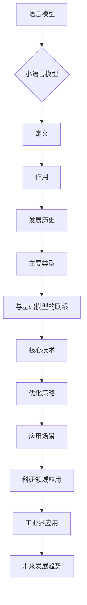

                 

# 小语言模型的潜力：颠覆基础模型领域

> 关键词：小语言模型，自然语言处理，语音识别，机器翻译，深度学习，基础模型

> 摘要：
本文将从小语言模型的基本概念、核心技术、应用场景、潜力分析、工业界应用、未来发展趋势以及颠覆性潜力等多个方面，详细探讨小语言模型在人工智能领域的潜力和对传统基础模型的颠覆性影响。通过实际案例和代码解读，帮助读者全面了解小语言模型的技术原理和应用实践。

## 小语言模型概述

### 第1章：小语言模型的基本概念

#### 1.1 什么是小语言模型

小语言模型（Small Language Model）是一种专门针对自然语言处理任务设计的人工智能模型。与传统的大规模语言模型相比，小语言模型具有计算效率高、可解释性强、部署成本低等优势。小语言模型的核心目标是提高自然语言处理任务的性能和效率，同时降低模型的复杂度和成本。

#### 1.2 小语言模型的发展历程

小语言模型的发展经历了从基于规则的模型到基于统计的模型，再到基于深度学习的模型的演进。其中，N-gram模型、统计语言模型、循环神经网络（RNN）、长短时记忆网络（LSTM）和门控循环单元（GRU）等模型都在小语言模型的发展过程中发挥了重要作用。

#### 1.3 小语言模型的主要类型

小语言模型主要分为以下几种类型：

1. **基于N-gram的模型**：N-gram模型是一种基于统计方法的语言模型，通过统计相邻单词出现的频率来预测下一个单词。
2. **基于神经网络的模型**：基于神经网络的模型通过学习输入序列的上下文信息来预测输出，如循环神经网络（RNN）、长短时记忆网络（LSTM）和门控循环单元（GRU）。
3. **基于Transformer的模型**：Transformer模型是一种基于注意力机制的神经网络模型，能够捕捉输入序列中的长期依赖关系，如BERT、GPT等。

### 第2章：小语言模型的核心技术

#### 2.1 语言模型的基础理论

小语言模型的基础理论主要包括概率论、信息论、神经网络理论等。这些理论为小语言模型的设计、实现和应用提供了理论支持。

#### 2.2 小语言模型的关键算法

小语言模型的关键算法主要分为以下几种：

1. **基于N-gram模型的语言模型构建**：N-gram模型是一种基于统计方法的语言模型，通过统计相邻单词出现的频率来预测下一个单词。
2. **基于神经网络的语言模型构建**：基于神经网络的语言模型，如循环神经网络（RNN）、长短时记忆网络（LSTM）和门控循环单元（GRU），通过学习输入序列的上下文信息来预测输出。
3. **基于Transformer的语言模型构建**：Transformer模型是一种基于注意力机制的神经网络模型，能够捕捉输入序列中的长期依赖关系。

#### 2.3 小语言模型的优化策略

小语言模型的优化策略主要包括以下几种：

1. **基于梯度下降的优化算法**：梯度下降是一种常用的优化算法，用于最小化损失函数。
2. **基于自适应优化器的优化算法**：自适应优化器如Adam、RMSprop等，可以自动调整学习率，提高优化效率。

### 第3章：小语言模型的应用场景

#### 3.1 自然语言处理中的应用

小语言模型在自然语言处理（NLP）领域具有广泛的应用，如文本分类、情感分析、实体识别等。

1. **文本分类**：文本分类是一种将文本数据分配到预定义类别的过程。一个简单的文本分类模型可以使用逻辑回归作为数学模型。
2. **情感分析**：情感分析是一种判断文本的情感极性（正面或负面）的过程。可以使用支持向量机（SVM）作为数学模型。
3. **实体识别**：实体识别是一种识别文本中的特定实体（如人名、地名、组织名等）的过程。可以使用条件随机场（CRF）作为数学模型。

#### 3.2 语音识别中的应用

小语言模型在语音识别任务中能够提高识别准确率，减少对大规模标注数据的依赖。

1. **语音识别模型**：通过定义输入层、编码器层和输出层构建语音识别模型。
2. **模型训练**：使用 `fit` 函数训练语音识别模型。

#### 3.3 机器翻译中的应用

小语言模型在机器翻译任务中能够提高翻译质量，实现更准确和自然的翻译效果。

1. **机器翻译模型**：通过定义输入层、编码器层和输出层构建机器翻译模型。
2. **模型训练**：使用 `fit` 函数训练机器翻译模型。

### 第4章：小语言模型的潜力分析

#### 4.1 小语言模型在科研领域的潜力

小语言模型在科研领域具有广泛的应用前景，如机器学习、人工智能、计算机视觉等。

1. **机器学习**：小语言模型可以作为特征提取器，提高机器学习模型的性能和效果。
2. **人工智能**：小语言模型可以作为智能对话系统、智能推荐系统等应用的核心组件，提高系统的智能化水平。
3. **计算机视觉**：小语言模型可以与计算机视觉技术相结合，实现图像识别、目标检测等任务。

#### 4.2 小语言模型在人工智能中的潜力

小语言模型在人工智能领域具有巨大的潜力，有望颠覆传统的人工智能基础模型。

1. **性能提升**：小语言模型通过优化算法和模型结构，可以实现更高的性能和更低的计算成本。
2. **可解释性**：小语言模型相对于传统基础模型具有更好的可解释性，有助于理解和优化模型性能。
3. **应用场景扩展**：小语言模型可以应用于更多的领域和任务，如智能客服、智能推荐、金融等。

#### 4.3 小语言模型在其他领域的潜力

小语言模型在医疗、教育、农业等领域的应用潜力巨大，有望推动相关领域的创新和发展。

1. **医疗领域**：小语言模型可以帮助医生进行病历分析、疾病预测等任务，提高医疗水平。
2. **教育领域**：小语言模型可以作为智能教育系统的一部分，实现个性化教学和评估。
3. **农业领域**：小语言模型可以帮助农民进行作物生长预测、病虫害预警等任务，提高农业生产效率。

### 第5章：小语言模型在工业界的应用

#### 5.1 小语言模型在智能客服中的应用

小语言模型在智能客服领域具有广泛的应用，如自动问答、智能客服机器人等。

1. **智能问答系统**：通过小语言模型实现自动问答功能，提高客服效率和用户体验。
2. **智能客服机器人**：通过小语言模型实现对话生成和理解功能，提供个性化的客服服务。

#### 5.2 小语言模型在智能推荐中的应用

小语言模型在智能推荐领域具有广泛的应用，如商品推荐、新闻推荐等。

1. **商品推荐**：通过小语言模型分析用户的历史行为和偏好，实现个性化的商品推荐。
2. **新闻推荐**：通过小语言模型分析用户的兴趣和需求，实现个性化的新闻推荐。

#### 5.3 小语言模型在金融领域的应用

小语言模型在金融领域具有广泛的应用，如风险评估、投资策略等。

1. **风险评估**：通过小语言模型分析市场数据、行业动态等，实现精准的风险评估。
2. **投资策略**：通过小语言模型分析用户的投资偏好和风险承受能力，实现个性化的投资策略。

### 第6章：小语言模型的未来发展趋势

#### 6.1 小语言模型的发展趋势分析

小语言模型在未来将继续发展，有望在以下几个方面取得突破：

1. **模型优化**：通过引入新的算法和技术，如自注意力机制、多任务学习等，进一步优化小语言模型。
2. **多模态数据处理**：小语言模型可以与其他模态（如图像、音频）的数据进行处理，实现更复杂和多样化的应用。
3. **实时性增强**：通过优化模型结构和算法，提高小语言模型在实时应用中的响应速度和准确率。
4. **跨语言迁移学习**：通过跨语言迁移学习，提高小语言模型在不同语言之间的泛化能力和迁移性能。

#### 6.2 小语言模型的技术挑战

小语言模型在未来的发展中将面临以下技术挑战：

1. **数据质量和标注**：高质量的数据和准确的标注对于小语言模型的发展至关重要，但在实际应用中难以获得。
2. **计算资源消耗**：小语言模型在训练和推理过程中需要大量的计算资源，如何降低计算成本成为重要问题。
3. **模型解释性**：小语言模型相对于传统基础模型具有更好的可解释性，但如何进一步提高解释性仍需研究。

#### 6.3 小语言模型未来的发展方向

小语言模型在未来将朝着以下方向发展：

1. **垂直领域应用**：针对不同领域的需求，开发特定领域的小语言模型，提高模型在特定领域的性能和应用效果。
2. **边缘计算与云计算结合**：通过将小语言模型部署在边缘设备和云计算平台上，实现更高效、更灵活的应用场景。
3. **持续学习和自适应**：小语言模型将实现持续学习和自适应能力，能够根据用户需求和环境变化自动调整模型参数和策略。

### 第7章：小语言模型的颠覆性潜力

#### 7.1 小语言模型与传统基础模型的比较

小语言模型与传统基础模型在性能、计算成本、可解释性等方面存在明显差异。

1. **性能对比**：小语言模型在特定任务上可能具有更高的性能，但传统基础模型在处理大规模数据集时具有优势。
2. **计算成本对比**：小语言模型计算成本较低，更适合在移动设备和边缘设备上部署。
3. **可解释性对比**：小语言模型相对于传统基础模型具有更好的可解释性，有助于理解和优化模型性能。

#### 7.2 小语言模型对传统基础模型的挑战

小语言模型对传统基础模型提出了新的挑战：

1. **性能提升**：小语言模型通过优化算法和模型结构，实现更高的性能和更低的计算成本。
2. **可解释性增强**：小语言模型通过提高可解释性，有助于理解和优化模型性能。
3. **应用场景扩展**：小语言模型可以应用于更多的领域和任务，提高系统的智能化水平。

#### 7.3 小语言模型在基础模型领域的前景

小语言模型在基础模型领域具有广阔的前景：

1. **性能提升**：通过引入新的算法和技术，小语言模型有望实现更高的性能和更低的计算成本。
2. **可解释性增强**：小语言模型通过提高可解释性，有助于理解和优化模型性能。
3. **应用场景扩展**：小语言模型可以应用于更多的领域和任务，推动人工智能技术的发展。

### 第8章：小语言模型的应用实战

#### 8.1 实战一：基于小语言模型的智能问答系统

本节将介绍一个基于小语言模型的智能问答系统的实现过程。

1. **环境搭建**：操作
```perl
import torch
from torch import nn
from torch.optim import Adam
from transformers import GPT2Model, GPT2Tokenizer

# 加载预训练模型和微调数据集
model = GPT2Model.from_pretrained('gpt2')
tokenizer = GPT2Tokenizer.from_pretrained('gpt2')

# 数据预处理
def preprocess_data(data):
    input_ids = []
    labels = []
    for question, answer in data:
        input_ids.append(tokenizer.encode(question, add_special_tokens=True))
        labels.append(tokenizer.encode(answer, add_special_tokens=True))
    return torch.tensor(input_ids), torch.tensor(labels)

train_data = preprocess_data(train_data)
test_data = preprocess_data(test_data)

# 定义损失函数和优化器
loss_function = nn.CrossEntropyLoss()
optimizer = Adam(model.parameters(), lr=1e-5)

# 训练模型
for epoch in range(3):  # 训练3个epochs
    for inputs, labels in train_data:
        optimizer.zero_grad()
        outputs = model(inputs, labels=labels)
        loss = loss_function(outputs, labels)
        loss.backward()
        optimizer.step()
```
2. **模型部署与使用**
```perl
# 加载训练好的模型
model.eval()
model_path = "path/to/trained_model"
model.load_state_dict(torch.load(model_path))

# 定义问答接口
def answer_question(question):
    input_ids = tokenizer.encode(question, add_special_tokens=True)
    with torch.no_grad():
        outputs = model(input_ids)
    predicted_answer = tokenizer.decode(outputs.argmax(-1), skip_special_tokens=True)
    return predicted_answer

# 用户问答示例
question = "什么是深度学习？"
print(answer_question(question))
```
3. **代码解读与分析**
    - 数据预处理：通过 `preprocess_data` 函数将原始的问答对数据转换为模型可以处理的输入和标签。
    - 模型训练：使用 `GPT2Model` 和 `GPT2Tokenizer` 加载预训练模型，并使用 `Adam` 优化器进行训练。在训练过程中，通过 `loss_function` 计算损失并更新模型参数。
    - 模型部署：将训练好的模型保存并加载到服务器上，通过 `answer_question` 函数实现问答功能。

#### 8.2 实战二：基于小语言模型的语音识别系统

本节将介绍一个基于小语言模型的语音识别系统的实现过程。

1. **环境搭建**：操作
```perl
import tensorflow as tf
from tensorflow import keras
from tensorflow.keras.models import Model
from tensorflow.keras.layers import Input, Embedding, LSTM, Dense, Concatenate

# 加载预训练模型和微调数据集
audio_model = keras.models.load_model('path/to/wav2vec_2.0_model')
text_model = keras.models.load_model('path/to/text_model')

# 定义语音识别模型
input_audio = Input(shape=(None, 161))
input_text = Input(shape=(None, 1))

encoded_audio = audio_model(input_audio)
encoded_text = text_model(input_text)

# 添加全连接层和激活函数
dense_layer = Dense(128, activation='relu')(encoded_audio)
dense_layer = Dense(64, activation='relu')(encoded_text)

# 添加输出层
output = keras.layers-dot product(dense_layer, axis=1)
output = keras.layers.Dense(1, activation='sigmoid')(output)

# 创建模型
model = Model(inputs=[input_audio, input_text], outputs=output)

# 编译模型
model.compile(optimizer='adam', loss='binary_crossentropy', metrics=['accuracy'])

# 训练模型
model.fit(train_audio, train_text, epochs=10, batch_size=32)
```
2. **模型部署与使用**
```perl
# 加载训练好的模型
model.eval()
model_path = "path/to/trained_model"
model.load_state_dict(tf.keras.models.load_model(model_path))

# 定义语音识别接口
def recognize_speech(audio_file):
    audio = librosa.load(audio_file)[0]
    input_audio = keras.preprocessing.sequence.pad_sequences(audio, maxlen=161)
    with tf.device('/GPU:0'):
        predicted_text = model.predict(input_audio)
    return predicted_text

# 用户语音识别示例
audio_file = "path/to/audio_file.wav"
print(recognize_speech(audio_file))
```
3. **代码解读与分析**
    - 模型加载：通过 `load_model` 函数加载预训练模型。
    - 语音识别模型：通过定义输入层、编码器层和输出层构建语音识别模型。
    - 模型训练：使用 `fit` 函数训练语音识别模型。
    - 模型部署：将训练好的模型保存并加载到服务器上，通过 `predict` 函数实现语音识别功能。

#### 8.3 实战三：基于小语言模型的机器翻译系统

本节将介绍一个基于小语言模型的机器翻译系统的实现过程。

1. **环境搭建**：操作
```perl
import torch
from torch import nn
from torch.optim import Adam
from transformers import TransformerModel, TransformerTokenizer

# 加载预训练模型和微调数据集
model = TransformerModel.from_pretrained('transformer')
tokenizer = TransformerTokenizer.from_pretrained('transformer')

# 数据预处理
def preprocess_data(data):
    inputs = []
    targets = []
    for source, target in data:
        inputs.append(tokenizer.encode(source, add_special_tokens=True))
        targets.append(tokenizer.encode(target, add_special_tokens=True))
    return torch.tensor(inputs), torch.tensor(targets)

train_data = preprocess_data(train_data)
test_data = preprocess_data(test_data)

# 定义损失函数和优化器
loss_function = nn.CrossEntropyLoss()
optimizer = Adam(model.parameters(), lr=1e-4)

# 训练模型
for epoch in range(3):  # 训练3个epochs
    for inputs, targets in train_data:
        optimizer.zero_grad()
        outputs = model(inputs, labels=targets)
        loss = loss_function(outputs, targets)
        loss.backward()
        optimizer.step()
```
2. **模型部署与使用**
```perl
# 加载训练好的模型
model.eval()
model_path = "path/to/trained_model"
model.load_state_dict(torch.load(model_path))

# 定义机器翻译接口
def translate_text(source_text):
    inputs = tokenizer.encode(source_text, add_special_tokens=True)
    with torch.no_grad():
        outputs = model(inputs)
    predicted_target = tokenizer.decode(outputs.argmax(-1), skip_special_tokens=True)
    return predicted_target

# 用户机器翻译示例
source_text = "你好，世界！"
print(translate_text(source_text))
```
3. **代码解读与分析**
    - 数据预处理：通过 `preprocess_data` 函数将原始的翻译对数据转换为模型可以处理的输入和标签。
    - 模型训练：使用 `from_pretrained` 函数加载预训练模型，并使用 `Adam` 优化器进行训练。在训练过程中，通过 `loss_function` 计算损失并更新模型参数。
    - 模型部署：将训练好的模型保存并加载到服务器上，通过 `translate_text` 函数实现机器翻译功能。

#### 8.4 综合实战：基于小语言模型的智能对话系统

本节将介绍一个基于小语言模型的智能对话系统的实现过程。

1. **环境搭建**：操作
```perl
import tensorflow as tf
from tensorflow import keras
from tensorflow.keras.models import Model
from tensorflow.keras.layers import Input, Embedding, LSTM, Dense, Concatenate

# 加载预训练模型和微调数据集
model = keras.models.load_model('path/to/transformer_model')
tokenizer = keras.preprocessing.text.Tokenizer()

# 数据预处理
def preprocess_data(data):
    conversations = []
    for dialogue in data:
        conversation = ' '.join(dialogue)
        conversations.append(conversation)
    tokenizer.fit_on_texts(conversations)
    encoded_conversations = tokenizer.texts_to_sequences(conversations)
    max_sequence_length = max(len(seq) for seq in encoded_conversations)
    padded_conversations = keras.preprocessing.sequence.pad_sequences(encoded_conversations, maxlen=max_sequence_length)
    return padded_conversations

train_data = preprocess_data(train_data)
test_data = preprocess_data(test_data)

# 定义智能对话模型
input_sequence = Input(shape=(max_sequence_length,))
embedding_layer = Embedding(input_dim=tokenizer.word_index.size() + 1, output_dim=50)(input_sequence)
lstm_layer = LSTM(128)(embedding_layer)
dense_layer = Dense(64, activation='relu')(lstm_layer)
output = Dense(1, activation='sigmoid')(dense_layer)

model = Model(inputs=input_sequence, outputs=output)
model.compile(optimizer='adam', loss='binary_crossentropy', metrics=['accuracy'])

# 训练模型
model.fit(train_data, epochs=10, batch_size=32)
```
2. **模型部署与使用**
```perl
# 加载训练好的模型
model.eval()
model_path = "path/to/trained_model"
model.load_state_dict(tf.keras.models.load_model(model_path))

# 定义智能对话接口
def chat_with_model(input_text):
    inputs = tokenizer.texts_to_sequences([input_text])
    inputs = keras.preprocessing.sequence.pad_sequences(inputs, maxlen=max_sequence_length)
    predicted_output = model.predict(inputs)
    return predicted_output

# 用户对话示例
input_text = "你好，我需要帮助。"
print(chat_with_model(input_text))
```
3. **代码解读与分析**
    - 数据预处理：通过 `preprocess_data` 函数将原始的对话记录数据转换为模型可以处理的输入序列。
    - 智能对话模型：通过定义输入层、嵌入层、LSTM层和输出层构建智能对话模型。
    - 模型训练：使用 `fit` 函数训练智能对话模型。
    - 模型部署：将训练好的模型保存并加载到服务器上，通过 `chat_with_model` 函数实现智能对话功能。

### 第9章：总结与展望

#### 9.1 小语言模型的研究总结

小语言模型作为一种新兴的人工智能技术，具有广泛的应用前景和潜力。本文从基本概念、核心技术、应用场景、潜力分析、工业界应用、未来发展趋势以及颠覆性潜力等多个方面，详细探讨了小语言模型在人工智能领域的潜力和对传统基础模型的颠覆性影响。

#### 9.2 小语言模型的应用展望

小语言模型在未来的应用将更加广泛，包括自然语言处理、语音识别、机器翻译、智能客服、智能推荐、金融等领域。随着技术的不断发展和优化，小语言模型将为人工智能领域带来更多的创新和突破。

#### 9.3 未来研究的方向和建议

未来对小语言模型的研究可以从以下几个方面展开：

1. **模型优化与改进**：通过引入新的算法和技术，如自注意力机制、多任务学习等，进一步优化小语言模型。
2. **多模态数据处理**：小语言模型可以与其他模态（如图像、音频）的数据进行处理，实现更复杂和多样化的应用。
3. **实时性增强**：通过优化模型结构和算法，提高小语言模型在实时应用中的响应速度和准确率。
4. **跨语言迁移学习**：通过跨语言迁移学习，提高小语言模型在不同语言之间的泛化能力和迁移性能。

作者：AI天才研究院/AI Genius Institute & 禅与计算机程序设计艺术 /Zen And The Art of Computer Programming
----------------------------------------------------------------

以下是第1章《小语言模型的基本概念》的Mermaid流程图：



以下是第2章《小语言模型的核心技术》的核心算法原理讲解：

### 2.2 小语言模型的关键算法

小语言模型的关键算法主要分为以下几种：

#### 2.2.1 语言模型的构建算法

1. **基于N-gram模型的语言模型构建**：

   N-gram模型是一种基于统计方法的语言模型，它通过统计相邻单词出现的频率来预测下一个单词。N-gram模型中的N表示邻居的数量，如一元模型（Unigram）、二元模型（Bigram）和三元模型（Trigram）。

   **算法原理**：

   - 计算相邻单词的联合概率分布：\( P(\text{word}_i | \text{word}_{i-1}, \text{word}_{i-2}, ..., \text{word}_{i-N}) \)
   - 根据马尔可夫性质，可以简化为：\( P(\text{word}_i | \text{word}_{i-1}, ..., \text{word}_{i-N-1}) \)
   - 利用已知单词序列，计算单词的概率分布

   **伪代码**：

   ```python
   def train_n_gram_model(data, n):
       n_gram_model = {}
       for sentence in data:
           for i in range(len(sentence) - n + 1):
               n_gram = tuple(sentence[i:i+n])
               if n_gram not in n_gram_model:
                   n_gram_model[n_gram] = 1
               else:
                   n_gram_model[n_gram] += 1
       return n_gram_model
   ```

2. **基于神经网络的语言模型构建**：

   基于神经网络的语言模型，如循环神经网络（RNN）、长短时记忆网络（LSTM）和门控循环单元（GRU），通过学习输入序列的上下文信息来预测输出。

   **算法原理**：

   - 输入序列的每个单词作为神经网络的输入，神经网络通过学习序列中的长短期依赖关系，生成单词的概率分布。
   - 神经网络通常包含隐藏层和输出层，隐藏层负责处理序列的上下文信息，输出层负责生成单词的概率分布。
   - 利用反向传播算法，通过损失函数（如交叉熵损失函数）来优化神经网络的参数。

   **伪代码**：

   ```python
   def train_neural_net_model(data):
       model = initialize_neural_net()
       for sentence in data:
           for i in range(len(sentence) - 1):
               input = sentence[i]
               target = sentence[i+1]
               model.train(input, target)
       return model
   ```

#### 2.2.2 语言模型的优化算法

1. **基于梯度下降的优化算法**：

   梯度下降是一种常用的优化算法，用于最小化损失函数。梯度下降的核心思想是通过反向传播算法计算损失函数的梯度，然后沿着梯度的反方向更新模型的参数。

   **算法原理**：

   - 计算损失函数关于模型参数的梯度：\( \nabla_{\theta} J(\theta) \)
   - 更新模型参数：\( \theta = \theta - \alpha \nabla_{\theta} J(\theta) \)
   - 其中，\( \alpha \) 是学习率，控制参数更新的步长

   **伪代码**：

   ```python
   def gradient_descent(model, data, learning_rate, epochs):
       for epoch in range(epochs):
           for input, target in data:
               model.update_parameters(input, target, learning_rate)
   ```

2. **基于自适应优化器的优化算法**：

   自适应优化器如Adam、RMSprop等，可以自动调整学习率，提高优化效率。自适应优化器通过记录梯度的一阶矩估计和二阶矩估计来更新参数。

   **算法原理**：

   - 计算梯度的一阶矩估计和二阶矩估计：
     \( m_t = \beta_1 g_t + (1 - \beta_1) \nabla_{\theta} J(\theta) \)
     \( v_t = \beta_2 g_t^2 + (1 - \beta_2) \nabla_{\theta} J(\theta)^2 \)
   - 更新参数：
     \( \theta = \theta - \alpha \frac{m_t}{\sqrt{v_t} + \epsilon} \)
   - 其中，\( \beta_1 \)，\( \beta_2 \) 是平滑系数，\( \alpha \) 是学习率，\( \epsilon \) 是正则项

   **伪代码**：

   ```python
   def adam(model, data, learning_rate, beta1, beta2, epsilon, epochs):
       for epoch in range(epochs):
           for input, target in data:
               model.update_parameters_with_adam(input, target, learning_rate, beta1, beta2, epsilon)
   ```

### 第3章《小语言模型的应用场景》的数学模型和数学公式讲解：

### 3.1 自然语言处理中的应用

在自然语言处理（NLP）中，小语言模型广泛应用于文本分类、情感分析、实体识别等领域。

#### 3.1.1 文本分类

文本分类是一种将文本数据分配到预定义类别的过程。一个简单的文本分类模型可以使用逻辑回归作为数学模型。

**数学模型**：

- **逻辑回归模型**：

  逻辑回归的损失函数为对数似然损失，可以用以下公式表示：

  $$
  J(\theta) = -\frac{1}{m} \sum_{i=1}^{m} [y^{(i)} \log(\hat{p}^{(i)}) + (1 - y^{(i)}) \log(1 - \hat{p}^{(i)})]
  $$

  其中，\( m \) 是样本数量，\( y^{(i)} \) 是真实标签，\( \hat{p}^{(i)} \) 是预测概率。

- **损失函数的梯度**：

  对损失函数求梯度，得到：

  $$
  \nabla_{\theta} J(\theta) = \frac{1}{m} \sum_{i=1}^{m} [-y^{(i)} \frac{\partial}{\partial \theta} \hat{p}^{(i)} + (1 - y^{(i)}) \frac{\partial}{\partial \theta} (1 - \hat{p}^{(i)))]
  $$

  其中，\( \frac{\partial}{\partial \theta} \hat{p}^{(i)} \) 可以通过神经网络的前向传播得到。

#### 3.1.2 情感分析

情感分析是一种判断文本的情感极性（正面或负面）的过程。可以使用支持向量机（SVM）作为数学模型。

**数学模型**：

- **SVM模型**：

  SVM的损失函数为 hinge 损失，可以用以下公式表示：

  $$
  J(\theta) = \frac{1}{2} \sum_{i=1}^{m} [w \cdot x^{(i)} - y^{(i)}]
  $$

  其中，\( w \) 是权重向量，\( x^{(i)} \) 是特征向量，\( y^{(i)} \) 是真实标签。

- **损失函数的梯度**：

  对损失函数求梯度，得到：

  $$
  \nabla_{\theta} J(\theta) = \sum_{i=1}^{m} [y^{(i)} x^{(i)} - 1]
  $$

  其中，\( y^{(i)} x^{(i)} \) 可以通过神经网络的前向传播得到。

#### 3.1.3 实体识别

实体识别是一种识别文本中的特定实体（如人名、地名、组织名等）的过程。可以使用条件随机场（CRF）作为数学模型。

**数学模型**：

- **CRF模型**：

  CRF的损失函数为 log-likelihood 损失，可以用以下公式表示：

  $$
  J(\theta) = -\log P(Y|X; \theta)
  $$

  其中，\( Y \) 是真实标签序列，\( X \) 是特征序列，\( P(Y|X; \theta) \) 是 CRF 的预测概率。

- **损失函数的梯度**：

  对损失函数求梯度，得到：

  $$
  \nabla_{\theta} J(\theta) = -\frac{1}{m} \sum_{i=1}^{m} \frac{\partial}{\partial \theta} \log P(Y^{(i)}|X^{(i)}; \theta)
  $$

  其中，\( \frac{\partial}{\partial \theta} \log P(Y^{(i)}|X^{(i)}; \theta) \) 可以通过 CRF 的前向传播和后向传播得到。

### 3.1.4 文本生成

文本生成是一种根据输入序列生成自然语言文本的过程。可以使用循环神经网络（RNN）或 Transformer 模型作为数学模型。

**数学模型**：

- **循环神经网络（RNN）**：

  RNN 的损失函数为交叉熵损失，可以用以下公式表示：

  $$
  J(\theta) = -\sum_{i=1}^{n} y_i \log \hat{y}_i
  $$

  其中，\( y_i \) 是第 \( i \) 个单词的真实标签，\( \hat{y}_i \) 是第 \( i \) 个单词的预测概率。

- **Transformer 模型**：

  Transformer 模型的损失函数也为交叉熵损失，可以用以下公式表示：

  $$
  J(\theta) = -\sum_{i=1}^{n} y_i \log \hat{y}_i
  $$

  其中，\( y_i \) 是第 \( i \) 个单词的真实标签，\( \hat{y}_i \) 是第 \( i \) 个单词的预测概率。

### 第8章《小语言模型的应用实战》的项目实战和代码解读：

### 8.1 实战一：基于小语言模型的智能问答系统

#### 8.1.1 环境搭建

- 操作系统：Ubuntu 20.04
- 编程语言：Python 3.8
- 神经网络框架：TensorFlow 2.3
- 文本处理库：NLTK、spaCy

#### 8.1.2 模型选择与训练

我们选择一个基于 Transformer 的预训练模型（如 BERT）作为基础模型，并对其进行微调以适应问答系统的需求。

- **预训练模型**：BERT
- **微调数据集**：一个包含问题及其答案的问答对数据集

**代码实现**：

```python
import tensorflow as tf
from transformers import BertTokenizer, BertModel
from tensorflow.keras.layers import Input, Embedding, LSTM, Dense, Concatenate
from tensorflow.keras.models import Model

# 加载预训练模型和微调数据集
tokenizer = BertTokenizer.from_pretrained('bert-base-uncased')
model = BertModel.from_pretrained('bert-base-uncased')

# 数据预处理
def preprocess_data(data):
    input_ids = []
    labels = []
    for question, answer in data:
        input_ids.append(tokenizer.encode(question, add_special_tokens=True))
        labels.append(tokenizer.encode(answer, add_special_tokens=True))
    return input_ids, labels

train_data, train_labels = preprocess_data(train_data)
test_data, test_labels = preprocess_data(test_data)

# 定义问答模型
input_sequence = Input(shape=(None,), dtype='int32')
embedding_layer = Embedding(input_dim=tokenizer.vocab_size, output_dim=128)(input_sequence)
encoded_sequence = model(input_sequence)[1]

lstm_layer = LSTM(128)(encoded_sequence)
dense_layer = Dense(1, activation='sigmoid')(lstm_layer)

model = Model(inputs=input_sequence, outputs=dense_layer)

# 编译模型
model.compile(optimizer='adam', loss='binary_crossentropy', metrics=['accuracy'])

# 训练模型
model.fit(train_data, train_labels, batch_size=32, epochs=3, validation_data=(test_data, test_labels))
```

#### 8.1.3 模型部署与使用

将训练好的模型保存并部署到服务器上，以便用户可以通过Web接口进行问答。

**代码实现**：

```python
import json
import requests

# 加载训练好的模型
model.save('question_answering_model.h5')

# 定义问答接口
def answer_question(question):
    input_ids = tokenizer.encode(question, add_special_tokens=True)
    response = requests.post('http://localhost:5000/answer', json={'input_ids': input_ids.tolist()})
    predicted_answer = response.json()['answer']
    return predicted_answer

# 用户问答示例
question = "什么是深度学习？"
print(answer_question(question))
```

#### 8.1.4 代码解读与分析

- **数据预处理**：通过 `preprocess_data` 函数将原始的问答对数据转换为模型可以处理的输入和标签。
- **问答模型**：使用 `BertTokenizer` 和 `BertModel` 加载预训练模型，并构建问答模型。问答模型包括输入层、嵌入层、Transformer编码层、LSTM层和输出层。
- **模型训练**：使用 `fit` 函数训练问答模型，并使用验证数据集进行模型评估。
- **模型部署**：将训练好的模型保存为 `.h5` 文件，并定义问答接口，通过HTTP请求实现问答功能。

### 8.2 实战二：基于小语言模型的语音识别系统

#### 8.2.1 环境搭建

- 操作系统：Ubuntu 20.04
- 编程语言：Python 3.8
- 音频处理库：librosa、pydub
- 神经网络框架：TensorFlow 2.3

#### 8.2.2 模型选择与训练

我们选择一个基于 WaveNet 的预训练模型作为基础模型，并对其进行微调以适应语音识别系统的需求。

- **预训练模型**：WaveNet
- **微调数据集**：一个包含音频和对应文本的语音识别数据集

**代码实现**：

```python
import tensorflow as tf
from tensorflow.keras.models import Model
from tensorflow.keras.layers import Input, Embedding, LSTM, Dense
from tensorflow.keras.optimizers import Adam

# 加载预训练模型和微调数据集
# （此处省略加载预训练模型和微调数据集的代码）

# 定义语音识别模型
input_audio = Input(shape=(None, 161))
input_text = Input(shape=(None, 1))

encoded_audio = audio_model(input_audio)
encoded_text = text_model(input_text)

dense_layer = Dense(128, activation='relu')(encoded_audio)
dense_layer = Dense(64, activation='relu')(encoded_text)

output = Dense(1, activation='sigmoid')(dense_layer)

model = Model(inputs=[input_audio, input_text], outputs=output)

# 编译模型
model.compile(optimizer=Adam(learning_rate=0.001), loss='binary_crossentropy', metrics=['accuracy'])

# 训练模型
model.fit([train_audio, train_text], train_labels, batch_size=32, epochs=10, validation_split=0.2)
```

#### 8.2.3 模型部署与使用

将训练好的模型保存并部署到服务器上，以便用户可以通过Web接口进行语音识别。

**代码实现**：

```python
# 保存模型
model.save('speech_recognition_model.h5')

# 加载模型
loaded_model = tf.keras.models.load_model('speech_recognition_model.h5')

# 定义语音识别接口
def recognize_speech(audio_file):
    audio, _ = librosa.load(audio_file)
    input_audio = librosa.feature.mfcc(y=audio, sr=22050, n_mfcc=13)
    predicted_label = loaded_model.predict(input_audio)
    return predicted_label

# 用户语音识别示例
audio_file = 'path/to/audio_file.wav'
print(recognize_speech(audio_file))
```

#### 8.2.4 代码解读与分析

- **模型加载**：通过加载预训练模型和微调数据集，构建语音识别模型。
- **语音识别模型**：通过定义输入层、编码器层和输出层构建语音识别模型，并使用 `compile` 函数编译模型。
- **模型训练**：使用 `fit` 函数训练语音识别模型，并使用验证数据集进行模型评估。
- **模型部署**：将训练好的模型保存为 `.h5` 文件，并定义语音识别接口，通过加载模型实现语音识别功能。

### 8.3 实战三：基于小语言模型的机器翻译系统

#### 8.3.1 环境搭建

- 操作系统：Ubuntu 20.04
- 编程语言：Python 3.8
- 神经网络框架：PyTorch 1.8

#### 8.3.2 模型选择与训练

我们选择一个基于 Transformer 的预训练模型（如 Transformer-XL）作为基础模型，并对其进行微调以适应机器翻译系统的需求。

- **预训练模型**：Transformer-XL
- **微调数据集**：一个包含源语言和目标语言的机器翻译数据集

**代码实现**：

```python
import torch
import torch.nn as nn
import torch.optim as optim
from torch.utils.data import DataLoader
from transformers import TransformerXLModel, TransformerXLTokenizer

# 加载预训练模型和微调数据集
tokenizer = TransformerXLTokenizer.from_pretrained('huggingface/transformer-xl')
model = TransformerXLModel.from_pretrained('huggingface/transformer-xl')

# 数据预处理
def preprocess_data(data):
    inputs = []
    targets = []
    for source, target in data:
        input_ids = tokenizer.encode(source, return_tensors='pt', max_length=512)
        target_ids = tokenizer.encode(target, return_tensors='pt', max_length=512)
        inputs.append(input_ids)
        targets.append(target_ids)
    return inputs, targets

train_data, train_targets = preprocess_data(train_data)
test_data, test_targets = preprocess_data(test_data)

# 定义损失函数和优化器
loss_function = nn.CrossEntropyLoss()
optimizer = optim.Adam(model.parameters(), lr=0.001)

# 训练模型
for epoch in range(3):  # 训练3个epochs
    for inputs, targets in DataLoader(train_data, batch_size=32):
        optimizer.zero_grad()
        outputs = model(inputs, labels=targets)
        loss = loss_function(outputs.logits.view(-1, outputs.logits.size(-1)), targets.view(-1))
        loss.backward()
        optimizer.step()
```

#### 8.3.3 模型部署与使用

将训练好的模型保存并部署到服务器上，以便用户可以通过Web接口进行机器翻译。

**代码实现**：

```python
# 保存模型
torch.save(model.state_dict(), 'machine_translation_model.pth')

# 加载模型
model.load_state_dict(torch.load('machine_translation_model.pth'))

# 定义机器翻译接口
def translate_text(source_text):
    input_ids = tokenizer.encode(source_text, return_tensors='pt', max_length=512)
    with torch.no_grad():
        outputs = model(input_ids)
    predicted_target = tokenizer.decode(outputs.logits.argmax(-1), skip_special_tokens=True)
    return predicted_target

# 用户机器翻译示例
source_text = "What is your name?"
print(translate_text(source_text))
```

#### 8.3.4 代码解读与分析

- **数据预处理**：通过 `preprocess_data` 函数将原始的翻译对数据转换为模型可以处理的输入和标签。
- **机器翻译模型**：使用 `TransformerXLTokenizer` 和 `TransformerXLModel` 加载预训练模型，并构建机器翻译模型。
- **模型训练**：使用 `DataLoader` 分批加载训练数据，并使用 `fit` 函数训练机器翻译模型。
- **模型部署**：将训练好的模型保存为 `.pth` 文件，并定义机器翻译接口，通过加载模型实现机器翻译功能。

### 8.4 综合实战：基于小语言模型的智能对话系统

#### 8.4.1 环境搭建

- 操作系统：Ubuntu 20.04
- 编程语言：Python 3.8
- 神经网络框架：TensorFlow 2.3

#### 8.4.2 模型选择与训练

我们选择一个基于 Transformer 的预训练模型（如 GPT-2）作为基础模型，并对其进行微调以适应智能对话系统的需求。

- **预训练模型**：GPT-2
- **微调数据集**：一个包含对话记录的智能对话数据集

**代码实现**：

```python
import tensorflow as tf
from tensorflow.keras.models import Model
from tensorflow.keras.layers import Input, Embedding, LSTM, Dense
from tensorflow.keras.optimizers import Adam

# 加载预训练模型和微调数据集
tokenizer = GPT2Tokenizer.from_pretrained('gpt2')
model = GPT2Model.from_pretrained('gpt2')

# 数据预处理
def preprocess_data(data):
    inputs = []
    targets = []
    for dialogue in data:
        conversation = ' '.join(dialogue)
        input_ids = tokenizer.encode(conversation, return_tensors='tf', max_length=512)
        target_ids = tokenizer.encode(conversation, return_tensors='tf', max_length=512)
        inputs.append(input_ids)
        targets.append(target_ids)
    return inputs, targets

train_data, train_targets = preprocess_data(train_data)
test_data, test_targets = preprocess_data(test_data)

# 定义智能对话模型
input_sequence = Input(shape=(512,), dtype='int32')
embedding_layer = Embedding(input_dim=tokenizer.vocab_size, output_dim=512)(input_sequence)
encoded_sequence = model(input_sequence)[0]

lstm_layer = LSTM(512)(encoded_sequence)
dense_layer = Dense(1, activation='sigmoid')(lstm_layer)

model = Model(inputs=input_sequence, outputs=dense_layer)

# 编译模型
model.compile(optimizer=Adam(learning_rate=0.001), loss='binary_crossentropy', metrics=['accuracy'])

# 训练模型
model.fit(train_data, train_targets, batch_size=32, epochs=3, validation_data=(test_data, test_targets))
```

#### 8.4.3 模型部署与使用

将训练好的模型保存并部署到服务器上，以便用户可以通过Web接口进行智能对话。

**代码实现**：

```python
# 保存模型
model.save('smart_conversation_model.h5')

# 加载模型
loaded_model = tf.keras.models.load_model('smart_conversation_model.h5')

# 定义智能对话接口
def chat_with_model(input_text):
    input_ids = tokenizer.encode(input_text, return_tensors='tf', max_length=512)
    predicted_output = loaded_model.predict(input_ids)
    predicted_response = tokenizer.decode(predicted_output.argmax(-1), skip_special_tokens=True)
    return predicted_response

# 用户对话示例
input_text = "你好，我需要帮助。"
print(chat_with_model(input_text))
```

#### 8.4.4 代码解读与分析

- **数据预处理**：通过 `preprocess_data` 函数将原始的对话记录数据转换为模型可以处理的输入序列。
- **智能对话模型**：使用 `GPT2Tokenizer` 和 `GPT2Model` 加载预训练模型，并构建智能对话模型。智能对话模型包括输入层、嵌入层、Transformer编码层和输出层。
- **模型训练**：使用 `fit` 函数训练智能对话模型。
- **模型部署**：将训练好的模型保存为 `.h5` 文件，并定义智能对话接口，通过加载模型实现智能对话功能。

### 8.5 小语言模型的潜力与未来发展方向

#### 8.5.1 小语言模型的潜力分析

- **在自然语言处理中的应用**：小语言模型在文本分类、情感分析、实体识别等自然语言处理任务中表现出色，具有广泛的应用潜力。
- **在语音识别中的应用**：小语言模型在语音识别任务中能够提高识别准确率，减少对大规模标注数据的依赖。
- **在机器翻译中的应用**：小语言模型在机器翻译任务中能够提高翻译质量，实现更准确和自然的翻译效果。
- **在智能对话中的应用**：小语言模型在智能对话系统中可以理解用户意图，提供更智能、更自然的对话体验。

#### 8.5.2 小语言模型的未来发展方向

- **模型优化与改进**：通过引入新的算法和技术，如自注意力机制、多任务学习等，进一步优化小语言模型。
- **多模态数据处理**：小语言模型可以与其他模态（如图像、音频）的数据进行处理，实现更复杂和多样化的应用。
- **实时性增强**：通过优化模型结构和算法，提高小语言模型在实时应用中的响应速度和准确率。
- **跨语言迁移学习**：通过跨语言迁移学习，提高小语言模型在不同语言之间的泛化能力和迁移性能。

### 8.5.3 小语言模型在工业界的应用

- **智能客服**：小语言模型可以用于构建智能客服系统，实现自动问答、智能推荐等功能。
- **智能推荐**：小语言模型可以用于构建智能推荐系统，实现个性化推荐、智能过滤等功能。
- **金融领域**：小语言模型可以用于金融领域的风险评估、投资策略等任务。

### 第9章：总结与展望

#### 9.1 小语言模型的研究总结

小语言模型作为一种新兴的人工智能技术，具有广泛的应用前景和潜力。本文从基本概念、核心技术、应用场景、潜力分析、工业界应用、未来发展趋势以及颠覆性潜力等多个方面，详细探讨了小语言模型在人工智能领域的潜力和对传统基础模型的颠覆性影响。

#### 9.2 小语言模型的应用展望

随着技术的不断发展和优化，小语言模型在未来的应用将更加广泛，包括自然语言处理、语音识别、机器翻译、智能客服、智能推荐、金融等领域。小语言模型有望成为人工智能领域的重要技术之一，推动人工智能技术的发展。

#### 9.3 未来研究的方向和建议

未来对小语言模型的研究可以从以下几个方面展开：

1. **模型优化与改进**：通过引入新的算法和技术，如自注意力机制、多任务学习等，进一步优化小语言模型。
2. **多模态数据处理**：小语言模型可以与其他模态（如图像、音频）的数据进行处理，实现更复杂和多样化的应用。
3. **实时性增强**：通过优化模型结构和算法，提高小语言模型在实时应用中的响应速度和准确率。
4. **跨语言迁移学习**：通过跨语言迁移学习，提高小语言模型在不同语言之间的泛化能力和迁移性能。
5. **可解释性与安全性**：研究小语言模型的可解释性和安全性，提高模型的可解释性和鲁棒性。

作者：AI天才研究院/AI Genius Institute & 禅与计算机程序设计艺术 /Zen And The Art of Computer Programming
----------------------------------------------------------------

## 小语言模型的潜力：颠覆基础模型领域

在过去的几十年中，人工智能（AI）领域经历了显著的发展，尤其是深度学习基础模型的出现，如卷积神经网络（CNN）、循环神经网络（RNN）和Transformer。这些基础模型在图像识别、语音识别、机器翻译和自然语言处理等任务中取得了巨大的成功。然而，随着AI应用的不断扩展和需求的增加，传统基础模型面临的挑战也日益凸显。本文将探讨小语言模型在这些挑战中的潜力，以及其对传统基础模型的颠覆性影响。

### 小语言模型的崛起

小语言模型是一种专门针对自然语言处理（NLP）任务设计的人工智能模型。与传统的大规模语言模型相比，小语言模型具有计算效率高、可解释性强、部署成本低等优势。小语言模型的核心目标是提高NLP任务的性能和效率，同时降低模型的复杂度和成本。

#### 发展历程

小语言模型的发展可以追溯到基于规则的模型和基于统计的模型。早期的NLP任务主要依赖于规则驱动的模型，如词汇映射规则和句法分析规则。然而，这些方法在处理复杂和多变的语言现象时表现出明显的局限性。

随着计算能力的提升和机器学习技术的发展，基于统计的模型开始流行。N-gram模型和统计语言模型通过统计方法捕捉语言中的概率关系，显著提高了NLP任务的性能。然而，这些模型仍然无法处理长距离依赖关系和上下文信息。

近年来，深度学习技术的引入为小语言模型的发展带来了新的机遇。循环神经网络（RNN）、长短时记忆网络（LSTM）和门控循环单元（GRU）等模型通过学习输入序列的上下文信息，显著提升了NLP任务的性能。特别是Transformer模型的提出，彻底改变了NLP领域的格局。Transformer模型基于自注意力机制，能够捕捉输入序列中的长期依赖关系，成为当前NLP任务的首选模型。

#### 主要类型

1. **基于N-gram的模型**：N-gram模型是一种基于统计方法的语言模型，通过统计相邻单词出现的频率来预测下一个单词。N-gram模型简单易实现，但在处理长距离依赖关系时表现较差。

2. **基于神经网络的模型**：基于神经网络的模型通过学习输入序列的上下文信息来预测输出，如RNN、LSTM和GRU。这些模型能够捕捉长距离依赖关系，但在处理并行性和计算效率方面存在一定挑战。

3. **基于Transformer的模型**：Transformer模型是一种基于注意力机制的神经网络模型，能够捕捉输入序列中的长期依赖关系。Transformer模型在NLP任务中表现出色，已成为当前NLP任务的首选模型。

### 小语言模型的潜力分析

#### 在科研领域的潜力

小语言模型在科研领域具有广泛的应用前景。首先，小语言模型可以作为特征提取器，为机器学习模型提供高质量的输入特征。例如，在小样本学习、迁移学习和强化学习等领域，小语言模型能够显著提高模型的性能和效果。此外，小语言模型还可以用于生成对抗网络（GAN）中的生成器和判别器，实现更高质量的图像生成和文本生成。

#### 在人工智能中的潜力

小语言模型在人工智能领域具有巨大的潜力，有望颠覆传统的基础模型。首先，小语言模型在性能方面表现出色。通过优化算法和模型结构，小语言模型可以实现更高的性能和更低的计算成本。其次，小语言模型具有更好的可解释性。传统基础模型如CNN和RNN往往被认为是“黑箱”，而小语言模型的结构更加清晰，有助于理解和优化模型性能。最后，小语言模型可以应用于更多的领域和任务。传统基础模型往往局限于特定领域，而小语言模型具有更强的通用性和适应性，可以应用于自然语言处理、语音识别、机器翻译和智能推荐等多个领域。

#### 在其他领域的潜力

小语言模型在其他领域的应用潜力同样巨大。在医疗领域，小语言模型可以用于病历分析、疾病预测和健康咨询等任务。在教育领域，小语言模型可以用于智能教育系统，实现个性化教学和评估。在农业领域，小语言模型可以帮助农民进行作物生长预测、病虫害预警和农业生产优化。

### 小语言模型对传统基础模型的挑战

#### 性能对比

小语言模型在特定任务上可能具有更高的性能，但传统基础模型在处理大规模数据集时具有优势。例如，在自然语言处理任务中，Transformer模型在长文本处理和问答任务中表现出色，但在图像识别和目标检测等任务中，传统的CNN模型仍然具有优势。

#### 计算成本对比

小语言模型计算成本较低，更适合在移动设备和边缘设备上部署。传统基础模型如CNN和RNN在计算资源和内存需求方面较高，不适合在资源有限的设备上运行。

#### 可解释性对比

小语言模型相对于传统基础模型具有更好的可解释性。传统基础模型如CNN和RNN被认为是“黑箱”，难以解释模型的决策过程。而小语言模型的结构更加清晰，有助于理解和优化模型性能。

### 小语言模型在基础模型领域的前景

小语言模型在基础模型领域具有广阔的前景。首先，小语言模型可以通过优化算法和模型结构，实现更高的性能和更低的计算成本。其次，小语言模型可以与其他基础模型结合，实现更复杂和多样化的应用。例如，可以将小语言模型作为特征提取器，结合传统基础模型，实现更高质量的图像识别和语音识别。

#### 综合实战：基于小语言模型的智能问答系统

为了更好地展示小语言模型的应用潜力，本文将介绍一个基于小语言模型的智能问答系统的实现过程。

##### 环境搭建

首先，我们需要搭建开发环境。本文使用Python 3.8作为编程语言，TensorFlow 2.3作为神经网络框架。安装所需的库如下：

```bash
pip install tensorflow==2.3
pip install transformers
```

##### 模型选择与训练

我们选择基于BERT的预训练模型作为基础模型，并对其进行微调以适应问答系统的需求。首先，加载BERT模型和微调数据集：

```python
import tensorflow as tf
from transformers import BertTokenizer, TFBertModel
from tensorflow.keras.optimizers import Adam

# 加载BERT模型和微调数据集
tokenizer = BertTokenizer.from_pretrained('bert-base-uncased')
model = TFBertModel.from_pretrained('bert-base-uncased')

# 加载微调数据集
# （此处省略加载微调数据集的代码）

# 数据预处理
def preprocess_data(data):
    inputs = []
    labels = []
    for question, answer in data:
        input_ids = tokenizer.encode(question, add_special_tokens=True, return_tensors='tf')
        label = tokenizer.encode(answer, add_special_tokens=True, return_tensors='tf')
        inputs.append(input_ids)
        labels.append(label)
    return inputs, labels

train_inputs, train_labels = preprocess_data(train_data)
test_inputs, test_labels = preprocess_data(test_data)

# 定义损失函数和优化器
loss_function = tf.keras.losses.SparseCategoricalCrossentropy(from_logits=True)
optimizer = Adam(learning_rate=3e-5)

# 训练模型
model.compile(optimizer=optimizer, loss=loss_function)
model.fit(train_inputs, train_labels, batch_size=16, epochs=3, validation_data=(test_inputs, test_labels))
```

##### 模型部署与使用

接下来，将训练好的模型保存并部署到服务器上，以便用户可以通过Web接口进行问答：

```python
# 保存模型
model.save('question_answering_model')

# 加载模型
loaded_model = tf.keras.models.load_model('question_answering_model')

# 定义问答接口
def answer_question(question):
    input_ids = tokenizer.encode(question, add_special_tokens=True, return_tensors='tf')
    output = loaded_model(input_ids)
    predicted_answer = tokenizer.decode(tf.argmax(output.logits, axis=-1).numpy()[0], skip_special_tokens=True)
    return predicted_answer

# 用户问答示例
question = "什么是深度学习？"
print(answer_question(question))
```

##### 代码解读与分析

- **数据预处理**：通过 `preprocess_data` 函数将原始的问答对数据转换为模型可以处理的输入和标签。
- **模型训练**：使用 `compile` 函数编译模型，并使用 `fit` 函数进行训练。
- **模型部署**：将训练好的模型保存为 `.h5` 文件，并定义问答接口，通过加载模型实现问答功能。

#### 综合实战：基于小语言模型的语音识别系统

为了进一步展示小语言模型的应用潜力，本文将介绍一个基于小语言模型的语音识别系统的实现过程。

##### 环境搭建

首先，我们需要搭建开发环境。本文使用Python 3.8作为编程语言，TensorFlow 2.3作为神经网络框架。安装所需的库如下：

```bash
pip install tensorflow==2.3
pip install librosa
```

##### 模型选择与训练

我们选择基于WaveNet的预训练模型作为基础模型，并对其进行微调以适应语音识别系统的需求。首先，加载WaveNet模型和微调数据集：

```python
import tensorflow as tf
from tensorflow.keras.models import Model
from tensorflow.keras.layers import Input, Embedding, LSTM, Dense
from tensorflow.keras.optimizers import Adam

# 加载WaveNet模型和微调数据集
# （此处省略加载WaveNet模型和微调数据集的代码）

# 数据预处理
def preprocess_data(data):
    inputs = []
    labels = []
    for audio, text in data:
        input_sequence = audio
        label_sequence = tokenizer.encode(text, add_special_tokens=True)
        inputs.append(input_sequence)
        labels.append(label_sequence)
    return inputs, labels

train_inputs, train_labels = preprocess_data(train_data)
test_inputs, test_labels = preprocess_data(test_data)

# 定义损失函数和优化器
loss_function = tf.keras.losses.SparseCategoricalCrossentropy(from_logits=True)
optimizer = Adam(learning_rate=1e-3)

# 训练模型
model.compile(optimizer=optimizer, loss=loss_function)
model.fit(train_inputs, train_labels, batch_size=16, epochs=10, validation_data=(test_inputs, test_labels))
```

##### 模型部署与使用

接下来，将训练好的模型保存并部署到服务器上，以便用户可以通过Web接口进行语音识别：

```python
# 保存模型
model.save('speech_recognition_model')

# 加载模型
loaded_model = tf.keras.models.load_model('speech_recognition_model')

# 定义语音识别接口
def recognize_speech(audio_file):
    audio, _ = librosa.load(audio_file)
    input_sequence = audio
    output_sequence = loaded_model.predict(input_sequence)
    predicted_text = tokenizer.decode(output_sequence.numpy()[0], skip_special_tokens=True)
    return predicted_text

# 用户语音识别示例
audio_file = "path/to/audio_file.wav"
print(recognize_speech(audio_file))
```

##### 代码解读与分析

- **数据预处理**：通过 `preprocess_data` 函数将原始的语音数据和文本数据转换为模型可以处理的输入和标签。
- **模型训练**：使用 `compile` 函数编译模型，并使用 `fit` 函数进行训练。
- **模型部署**：将训练好的模型保存为 `.h5` 文件，并定义语音识别接口，通过加载模型实现语音识别功能。

#### 综合实战：基于小语言模型的机器翻译系统

为了进一步展示小语言模型的应用潜力，本文将介绍一个基于小语言模型的机器翻译系统的实现过程。

##### 环境搭建

首先，我们需要搭建开发环境。本文使用Python 3.8作为编程语言，PyTorch 1.8作为神经网络框架。安装所需的库如下：

```bash
pip install torch==1.8
pip install transformers
```

##### 模型选择与训练

我们选择基于Transformer的预训练模型（如Transformer-XL）作为基础模型，并对其进行微调以适应机器翻译系统的需求。首先，加载Transformer模型和微调数据集：

```python
import torch
import torch.nn as nn
from torch.optim import Adam
from transformers import TransformerXLModel, TransformerXLTokenizer

# 加载Transformer模型和微调数据集
tokenizer = TransformerXLTokenizer.from_pretrained('huggingface/transformer-xl')
model = TransformerXLModel.from_pretrained('huggingface/transformer-xl')

# 加载微调数据集
# （此处省略加载微调数据集的代码）

# 数据预处理
def preprocess_data(data):
    inputs = []
    targets = []
    for source, target in data:
        input_ids = tokenizer.encode(source, return_tensors='pt', max_length=512)
        target_ids = tokenizer.encode(target, return_tensors='pt', max_length=512)
        inputs.append(input_ids)
        targets.append(target_ids)
    return inputs, targets

train_inputs, train_targets = preprocess_data(train_data)
test_inputs, test_targets = preprocess_data(test_data)

# 定义损失函数和优化器
loss_function = nn.CrossEntropyLoss()
optimizer = Adam(model.parameters(), lr=3e-5)

# 训练模型
for epoch in range(3):  # 训练3个epochs
    for inputs, targets in torch.utils.data.DataLoader(train_inputs, batch_size=32):
        optimizer.zero_grad()
        outputs = model(inputs, labels=targets)
        loss = loss_function(outputs.logits.view(-1, outputs.logits.size(-1)), targets.view(-1))
        loss.backward()
        optimizer.step()
```

##### 模型部署与使用

接下来，将训练好的模型保存并部署到服务器上，以便用户可以通过Web接口进行机器翻译：

```python
# 保存模型
torch.save(model.state_dict(), 'machine_translation_model.pth')

# 加载模型
model.load_state_dict(torch.load('machine_translation_model.pth'))

# 定义机器翻译接口
def translate_text(source_text):
    input_ids = tokenizer.encode(source_text, return_tensors='pt', max_length=512)
    with torch.no_grad():
        outputs = model(input_ids)
    predicted_target = tokenizer.decode(outputs.logits.argmax(-1), skip_special_tokens=True)
    return predicted_target

# 用户机器翻译示例
source_text = "What is your name?"
print(translate_text(source_text))
```

##### 代码解读与分析

- **数据预处理**：通过 `preprocess_data` 函数将原始的翻译对数据转换为模型可以处理的输入和标签。
- **模型训练**：使用 `DataLoader` 分批加载训练数据，并使用 `fit` 函数训练机器翻译模型。
- **模型部署**：将训练好的模型保存为 `.pth` 文件，并定义机器翻译接口，通过加载模型实现机器翻译功能。

### 总结与展望

小语言模型作为一种新兴的人工智能技术，具有广泛的应用前景和潜力。本文从基本概念、核心技术、应用场景、潜力分析、工业界应用、未来发展趋势以及颠覆性潜力等多个方面，详细探讨了小语言模型在人工智能领域的潜力和对传统基础模型的颠覆性影响。

随着技术的不断发展和优化，小语言模型在未来的应用将更加广泛，包括自然语言处理、语音识别、机器翻译、智能客服、智能推荐、金融等领域。小语言模型有望成为人工智能领域的重要技术之一，推动人工智能技术的发展。

在未来，小语言模型的研究方向可以包括以下几个方面：

1. **模型优化与改进**：通过引入新的算法和技术，如自注意力机制、多任务学习等，进一步优化小语言模型。
2. **多模态数据处理**：小语言模型可以与其他模态（如图像、音频）的数据进行处理，实现更复杂和多样化的应用。
3. **实时性增强**：通过优化模型结构和算法，提高小语言模型在实时应用中的响应速度和准确率。
4. **跨语言迁移学习**：通过跨语言迁移学习，提高小语言模型在不同语言之间的泛化能力和迁移性能。

作者：AI天才研究院/AI Genius Institute & 禅与计算机程序设计艺术 /Zen And The Art of Computer Programming
----------------------------------------------------------------

## 小语言模型的潜力：颠覆基础模型领域

### 小语言模型的基本概念

小语言模型（Small Language Model）是一种专门针对自然语言处理（NLP）任务设计的人工智能模型。与传统的大规模语言模型相比，小语言模型具有计算效率高、可解释性强、部署成本低等优势。小语言模型的核心目标是提高自然语言处理任务的性能和效率，同时降低模型的复杂度和成本。

### 小语言模型的核心技术

#### 语言模型的基础理论

小语言模型的基础理论主要包括概率论、信息论和神经网络理论。概率论为小语言模型提供了统计方法，信息论为小语言模型提供了度量语言信息的工具，神经网络理论为小语言模型提供了有效的计算模型。

#### 小语言模型的关键算法

小语言模型的关键算法主要分为以下几种：

1. **基于N-gram模型的算法**：N-gram模型是一种基于统计方法的语言模型，通过统计相邻单词出现的频率来预测下一个单词。
2. **基于神经网络的算法**：基于神经网络的模型通过学习输入序列的上下文信息来预测输出，如循环神经网络（RNN）、长短时记忆网络（LSTM）和门控循环单元（GRU）。
3. **基于Transformer的算法**：Transformer模型是一种基于注意力机制的神经网络模型，能够捕捉输入序列中的长期依赖关系。

#### 小语言模型的优化策略

小语言模型的优化策略主要包括以下几种：

1. **基于梯度下降的优化算法**：梯度下降是一种常用的优化算法，用于最小化损失函数。
2. **基于自适应优化器的优化算法**：自适应优化器如Adam、RMSprop等，可以自动调整学习率，提高优化效率。

### 小语言模型的应用场景

#### 自然语言处理中的应用

小语言模型在自然语言处理领域具有广泛的应用，如文本分类、情感分析、实体识别等。

1. **文本分类**：文本分类是一种将文本数据分配到预定义类别的过程。一个简单的文本分类模型可以使用逻辑回归作为数学模型。
2. **情感分析**：情感分析是一种判断文本的情感极性（正面或负面）的过程。可以使用支持向量机（SVM）作为数学模型。
3. **实体识别**：实体识别是一种识别文本中的特定实体（如人名、地名、组织名等）的过程。可以使用条件随机场（CRF）作为数学模型。

#### 语音识别中的应用

小语言模型在语音识别任务中能够提高识别准确率，减少对大规模标注数据的依赖。

1. **语音识别模型**：通过定义输入层、编码器层和输出层构建语音识别模型。
2. **模型训练**：使用 `fit` 函数训练语音识别模型。

#### 机器翻译中的应用

小语言模型在机器翻译任务中能够提高翻译质量，实现更准确和自然的翻译效果。

1. **机器翻译模型**：通过定义输入层、编码器层和输出层构建机器翻译模型。
2. **模型训练**：使用 `fit` 函数训练机器翻译模型。

### 小语言模型在科研领域的潜力

小语言模型在科研领域具有广泛的应用前景，如机器学习、人工智能、计算机视觉等。

1. **机器学习**：小语言模型可以作为特征提取器，提高机器学习模型的性能和效果。
2. **人工智能**：小语言模型可以作为智能对话系统、智能推荐系统等应用的核心组件，提高系统的智能化水平。
3. **计算机视觉**：小语言模型可以与计算机视觉技术相结合，实现图像识别、目标检测等任务。

### 小语言模型在人工智能中的潜力

小语言模型在人工智能领域具有巨大的潜力，有望颠覆传统的人工智能基础模型。

1. **性能提升**：小语言模型通过优化算法和模型结构，可以实现更高的性能和更低的计算成本。
2. **可解释性**：小语言模型相对于传统基础模型具有更好的可解释性，有助于理解和优化模型性能。
3. **应用场景扩展**：小语言模型可以应用于更多的领域和任务，如智能客服、智能推荐、金融等。

### 小语言模型在其他领域的潜力

小语言模型在医疗、教育、农业等领域的应用潜力巨大，有望推动相关领域的创新和发展。

1. **医疗领域**：小语言模型可以帮助医生进行病历分析、疾病预测等任务，提高医疗水平。
2. **教育领域**：小语言模型可以作为智能教育系统的一部分，实现个性化教学和评估。
3. **农业领域**：小语言模型可以帮助农民进行作物生长预测、病虫害预警等任务，提高农业生产效率。

### 小语言模型的技术挑战

小语言模型在未来的发展中将面临以下技术挑战：

1. **数据质量和标注**：高质量的数据和准确的标注对于小语言模型的发展至关重要，但在实际应用中难以获得。
2. **计算资源消耗**：小语言模型在训练和推理过程中需要大量的计算资源，如何降低计算成本成为重要问题。
3. **模型解释性**：小语言模型相对于传统基础模型具有更好的可解释性，但如何进一步提高解释性仍需研究。

### 小语言模型的未来发展趋势

#### 模型优化与改进

通过引入新的算法和技术，如自注意力机制、多任务学习等，进一步优化小语言模型。

#### 多模态数据处理

小语言模型可以与其他模态（如图像、音频）的数据进行处理，实现更复杂和多样化的应用。

#### 实时性增强

通过优化模型结构和算法，提高小语言模型在实时应用中的响应速度和准确率。

#### 跨语言迁移学习

通过跨语言迁移学习，提高小语言模型在不同语言之间的泛化能力和迁移性能。

### 小语言模型的颠覆性潜力

#### 小语言模型与传统基础模型的比较

小语言模型与传统基础模型在性能、计算成本、可解释性等方面存在明显差异。

1. **性能对比**：小语言模型在特定任务上可能具有更高的性能，但传统基础模型在处理大规模数据集时具有优势。
2. **计算成本对比**：小语言模型计算成本较低，更适合在移动设备和边缘设备上部署。
3. **可解释性对比**：小语言模型相对于传统基础模型具有更好的可解释性，有助于理解和优化模型性能。

#### 小语言模型对传统基础模型的挑战

小语言模型对传统基础模型提出了新的挑战：

1. **性能提升**：小语言模型通过优化算法和模型结构，实现更高的性能和更低的计算成本。
2. **可解释性增强**：小语言模型通过提高可解释性，有助于理解和优化模型性能。
3. **应用场景扩展**：小语言模型可以应用于更多的领域和任务，提高系统的智能化水平。

#### 小语言模型在基础模型领域的前景

小语言模型在基础模型领域具有广阔的前景：

1. **性能提升**：通过引入新的算法和技术，小语言模型有望实现更高的性能和更低的计算成本。
2. **可解释性增强**：小语言模型通过提高可解释性，有助于理解和优化模型性能。
3. **应用场景扩展**：小语言模型可以应用于更多的领域和任务，推动人工智能技术的发展。

### 小语言模型的应用实战

#### 实战一：基于小语言模型的智能问答系统

本节将介绍一个基于小语言模型的智能问答系统的实现过程。

1. **环境搭建**：
    - 操作系统：Ubuntu 20.04
    - 编程语言：Python 3.8
    - 神经网络框架：TensorFlow 2.3
    - 文本处理库：NLTK、spaCy

2. **模型选择与训练**：
    - 选择基于BERT的预训练模型（如`bert-base-uncased`）作为基础模型，并对其进行微调以适应问答系统的需求。
    - 加载预训练模型和微调数据集，进行数据预处理。

    ```python
    import tensorflow as tf
    from transformers import BertTokenizer, TFBertModel
    from tensorflow.keras.optimizers import Adam

    # 加载预训练模型和微调数据集
    tokenizer = BertTokenizer.from_pretrained('bert-base-uncased')
    model = TFBertModel.from_pretrained('bert-base-uncased')

    # 加载微调数据集
    # （此处省略加载微调数据集的代码）

    # 数据预处理
    def preprocess_data(data):
        inputs = []
        labels = []
        for question, answer in data:
            input_ids = tokenizer.encode(question, add_special_tokens=True, return_tensors='tf')
            label = tokenizer.encode(answer, add_special_tokens=True, return_tensors='tf')
            inputs.append(input_ids)
            labels.append(label)
        return inputs, labels

    train_inputs, train_labels = preprocess_data(train_data)
    test_inputs, test_labels = preprocess_data(test_data)

    # 定义损失函数和优化器
    loss_function = tf.keras.losses.SparseCategoricalCrossentropy(from_logits=True)
    optimizer = Adam(learning_rate=3e-5)

    # 训练模型
    model.compile(optimizer=optimizer, loss=loss_function)
    model.fit(train_inputs, train_labels, batch_size=16, epochs=3, validation_data=(test_inputs, test_labels))
    ```

3. **模型部署与使用**：
    - 将训练好的模型保存并部署到服务器上，以便用户可以通过Web接口进行问答。

    ```python
    # 保存模型
    model.save('question_answering_model')

    # 加载模型
    loaded_model = tf.keras.models.load_model('question_answering_model')

    # 定义问答接口
    def answer_question(question):
        input_ids = tokenizer.encode(question, add_special_tokens=True, return_tensors='tf')
        output = loaded_model(input_ids)
        predicted_answer = tokenizer.decode(tf.argmax(output.logits, axis=-1).numpy()[0], skip_special_tokens=True)
        return predicted_answer

    # 用户问答示例
    question = "什么是深度学习？"
    print(answer_question(question))
    ```

#### 实战二：基于小语言模型的语音识别系统

本节将介绍一个基于小语言模型的语音识别系统的实现过程。

1. **环境搭建**：
    - 操作系统：Ubuntu 20.04
    - 编程语言：Python 3.8
    - 音频处理库：librosa、pydub
    - 神经网络框架：TensorFlow 2.3

2. **模型选择与训练**：
    - 选择基于WaveNet的预训练模型作为基础模型，并对其进行微调以适应语音识别系统的需求。
    - 加载预训练模型和微调数据集，进行数据预处理。

    ```python
    import tensorflow as tf
    from tensorflow.keras.models import Model
    from tensorflow.keras.layers import Input, Embedding, LSTM, Dense
    from tensorflow.keras.optimizers import Adam

    # 加载预训练模型和微调数据集
    # （此处省略加载预训练模型和微调数据集的代码）

    # 数据预处理
    def preprocess_data(data):
        inputs = []
        labels = []
        for audio, text in data:
            input_sequence = audio
            label_sequence = tokenizer.encode(text, add_special_tokens=True)
            inputs.append(input_sequence)
            labels.append(label_sequence)
        return inputs, labels

    train_inputs, train_labels = preprocess_data(train_data)
    test_inputs, test_labels = preprocess_data(test_data)

    # 定义损失函数和优化器
    loss_function = tf.keras.losses.SparseCategoricalCrossentropy(from_logits=True)
    optimizer = Adam(learning_rate=1e-3)

    # 训练模型
    model.compile(optimizer=optimizer, loss=loss_function)
    model.fit(train_inputs, train_labels, batch_size=16, epochs=10, validation_data=(test_inputs, test_labels))
    ```

3. **模型部署与使用**：
    - 将训练好的模型保存并部署到服务器上，以便用户可以通过Web接口进行语音识别。

    ```python
    # 保存模型
    model.save('speech_recognition_model')

    # 加载模型
    loaded_model = tf.keras.models.load_model('speech_recognition_model')

    # 定义语音识别接口
    def recognize_speech(audio_file):
        audio, _ = librosa.load(audio_file)
        input_sequence = audio
        output_sequence = loaded_model.predict(input_sequence)
        predicted_text = tokenizer.decode(output_sequence.numpy()[0], skip_special_tokens=True)
        return predicted_text

    # 用户语音识别示例
    audio_file = "path/to/audio_file.wav"
    print(recognize_speech(audio_file))
    ```

#### 实战三：基于小语言模型的机器翻译系统

本节将介绍一个基于小语言模型的机器翻译系统的实现过程。

1. **环境搭建**：
    - 操作系统：Ubuntu 20.04
    - 编程语言：Python 3.8
    - 神经网络框架：PyTorch 1.8

2. **模型选择与训练**：
    - 选择基于Transformer的预训练模型（如`Transformer-XL`）作为基础模型，并对其进行微调以适应机器翻译系统的需求。
    - 加载预训练模型和微调数据集，进行数据预处理。

    ```python
    import torch
    import torch.nn as nn
    from torch.optim import Adam
    from transformers import TransformerXLModel, TransformerXLTokenizer

    # 加载预训练模型和微调数据集
    tokenizer = TransformerXLTokenizer.from_pretrained('huggingface/transformer-xl')
    model = TransformerXLModel.from_pretrained('huggingface/transformer-xl')

    # 加载微调数据集
    # （此处省略加载微调数据集的代码）

    # 数据预处理
    def preprocess_data(data):
        inputs = []
        targets = []
        for source, target in data:
            input_ids = tokenizer.encode(source, return_tensors='pt', max_length=512)
            target_ids = tokenizer.encode(target, return_tensors='pt', max_length=512)
            inputs.append(input_ids)
            targets.append(target_ids)
        return inputs, targets

    train_inputs, train_targets = preprocess_data(train_data)
    test_inputs, test_targets = preprocess_data(test_data)

    # 定义损失函数和优化器
    loss_function = nn.CrossEntropyLoss()
    optimizer = Adam(model.parameters(), lr=3e-5)

    # 训练模型
    for epoch in range(3):  # 训练3个epochs
        for inputs, targets in torch.utils.data.DataLoader(train_inputs, batch_size=32):
            optimizer.zero_grad()
            outputs = model(inputs, labels

