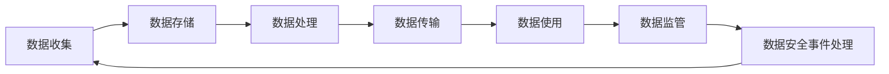

                 

## 《平台经济的数据监管：如何平衡发展与安全？》

### 关键词：平台经济、数据监管、发展、安全、数据加密、匿名化、隐私保护

### 摘要：

本文从平台经济的本质出发，探讨了在快速发展的数字经济时代，如何平衡平台经济的增长与数据安全之间的关系。文章首先介绍了平台经济的定义和特征，随后分析了当前平台经济中数据监管的现状和挑战。接着，文章深入讨论了数据监管的核心概念、算法原理、数学模型以及实际应用。通过国内外典型案例的分析，文章总结了数据监管的最佳实践，并对未来数据监管技术的发展趋势进行了展望。最后，文章提供了丰富的附录，包括数据监管工具和资源，以及参考文献，以供读者进一步学习和研究。

----------------------------------------------------------------

### 《平台经济的数据监管：如何平衡发展与安全？》目录大纲

## 第一部分：引言

### 1.1 平台经济的概述
### 1.2 平台经济中的数据监管现状
### 1.3 数据监管的重要性及挑战

## 第二部分：平台经济中的数据监管核心概念

### 2.1 数据监管的定义与原则
### 2.2 平台经济的监管框架
### 2.3 数据监管的法律法规概述
### 2.4 数据监管的 Mermaid 流程图

## 第三部分：数据监管的核心算法原理

### 3.1 数据加密算法原理
#### 3.1.1 对称加密算法
#### 3.1.2 非对称加密算法
#### 3.1.3 哈希算法
### 3.2 数据匿名化算法原理
#### 3.2.1 数据混淆
#### 3.2.2 数据脱敏
### 3.3 数据隐私保护算法原理
#### 3.3.1 隐蔽信道技术
#### 3.3.2 多变量插值法

## 第四部分：数据监管的数学模型与公式

### 4.1 数据隐私保护数学模型
### 4.2 数据监管成本效益分析模型
### 4.3 数据监管风险评估模型

## 第五部分：数据监管项目实战

### 5.1 平台经济数据监管项目实战概述
### 5.2 数据监管项目实战：环境搭建
### 5.3 数据监管项目实战：代码实现
### 5.4 数据监管项目实战：结果分析

## 第六部分：数据监管案例分析

### 6.1 国内平台经济数据监管案例
### 6.2 国际平台经济数据监管案例
### 6.3 案例分析与启示

## 第七部分：数据监管的未来展望

### 7.1 数据监管技术的发展趋势
### 7.2 数据监管面临的挑战与对策
### 7.3 平台经济数据监管的未来方向

## 附录

### 附录 A：数据监管工具与资源
### 附录 B：参考文献与推荐阅读

<|assistant|>### 第一部分：引言

#### 1.1 平台经济的概述

平台经济是指基于互联网和信息技术，通过搭建平台，实现多方参与者（如消费者、供应商、服务提供者等）之间的连接和交易活动。平台经济的核心在于通过平台的中间服务，降低交易成本，提高交易效率，创造新的价值。

平台经济具有以下特征：

- **去中心化**：平台经济不再依赖于传统的中心化组织形式，而是通过互联网实现点对点的连接和交易。

- **网络效应**：平台的价值随着用户数量的增加而增加，形成正反馈循环。

- **多样化参与者**：平台经济吸引了众多类型的参与者，包括消费者、供应商、服务提供者等。

- **数据驱动**：平台经济依赖于海量数据，通过数据分析和挖掘，实现个性化服务和精准营销。

平台经济涵盖了多个领域，如电商、共享经济、金融科技、物流等。随着技术的不断进步和市场的不断成熟，平台经济在全球范围内迅速发展，成为推动经济增长的新引擎。

#### 1.2 平台经济中的数据监管现状

平台经济的数据监管现状表现出以下几个特点：

- **数据监管需求增加**：随着平台经济的快速发展，数据量呈指数级增长，数据监管的需求也随之增加。

- **法律法规逐步完善**：各国政府和国际组织逐渐意识到数据监管的重要性，出台了一系列法律法规，如欧盟的《通用数据保护条例》（GDPR）和美国加州的《消费者隐私法案》（CCPA）。

- **技术手段日益成熟**：数据加密、匿名化、隐私保护等技术手段不断发展，为数据监管提供了有力支持。

- **监管手段多样化**：数据监管手段不仅包括传统的法律法规，还包括市场自律、技术手段、用户教育等多方面的手段。

然而，当前平台经济中的数据监管仍面临诸多挑战：

- **数据安全事件频发**：平台经济中的数据泄露事件屡见不鲜，对用户隐私和企业声誉造成了严重损害。

- **法律法规执行不力**：一些国家和地区的法律法规执行力度不足，导致数据监管效果不佳。

- **技术手段不足**：尽管技术手段日益成熟，但在实际应用中，仍存在技术瓶颈和漏洞。

- **用户隐私保护意识不足**：一些用户对平台经济中的数据监管和隐私保护重视不足，导致数据泄露风险增加。

#### 1.3 数据监管的重要性及挑战

数据监管在平台经济中具有重要意义：

- **保护用户隐私**：数据监管可以确保用户的个人信息得到有效保护，减少数据泄露风险。

- **维护企业声誉**：严格的数据监管有助于维护企业的声誉，提高用户信任度。

- **合规经营**：遵守相关法律法规，确保企业经营活动合法合规。

- **优化用户体验**：通过数据监管，可以提供更个性化的服务，提高用户体验。

然而，数据监管也面临诸多挑战：

- **数据规模庞大**：平台经济中的数据规模庞大，如何高效地进行数据监管成为一大挑战。

- **隐私保护与数据利用的平衡**：在保护数据隐私的同时，如何实现数据的高效利用，是一个亟待解决的问题。

- **技术更新迅速**：数据监管技术更新迅速，如何跟上技术发展步伐，保持数据监管的有效性，是一个重要挑战。

总之，在平台经济中，数据监管是一项长期且复杂的任务，需要各方共同努力，才能确保平台经济的健康发展。


<|assistant|>### 第二部分：平台经济中的数据监管核心概念

#### 2.1 数据监管的定义与原则

数据监管是指通过一系列法律、技术和管理手段，对平台经济中的数据进行收集、存储、处理、传输和使用过程中的安全性、隐私性和合规性进行监控和管理的活动。其目的是确保平台经济数据的安全、隐私保护和合法合规。

数据监管的原则主要包括以下几个方面：

- **合法性**：数据监管必须遵循相关法律法规，确保数据收集、存储、处理、传输和使用的合法性。

- **合规性**：数据监管应确保平台经济企业的经营活动符合相关法规和标准，包括数据保护法、隐私保护法、网络安全法等。

- **安全性**：数据监管应确保平台经济数据在存储、传输和使用过程中的安全性，防止数据泄露、篡改和破坏。

- **隐私保护**：数据监管应保护用户的隐私权，确保用户个人信息不被非法收集、使用和泄露。

- **透明度**：数据监管应确保数据收集、存储、处理、传输和使用过程中的透明度，用户应了解其数据的使用情况。

- **责任制**：数据监管应明确各方的责任，包括平台企业、数据控制者和数据处理者，确保在数据泄露等事件发生时，能够迅速响应和承担责任。

#### 2.2 平台经济的监管框架

平台经济的监管框架通常包括以下几个层次：

- **法律法规**：各国政府和国际组织制定了一系列法律法规，如《通用数据保护条例》（GDPR）、《消费者隐私法案》（CCPA）等，对平台经济的数据监管提供法律基础。

- **政策指导**：政府出台相关政策，指导平台经济数据监管的具体实施，如数据安全战略、隐私保护政策等。

- **行业自律**：行业协会和平台企业制定行业规范和标准，如数据保护标准、隐私保护指南等，推动平台经济数据监管的标准化和规范化。

- **技术手段**：数据监管技术包括数据加密、匿名化、隐私保护算法等，通过技术手段确保数据的安全、隐私保护和合规性。

- **监管机构**：各国政府和国际组织设立了专门的监管机构，如数据保护局、网络安全局等，负责对平台经济数据监管的实施和监督。

平台经济的监管框架应具备以下几个特点：

- **综合性**：监管框架应涵盖数据收集、存储、处理、传输和使用的全过程，确保全方位的数据监管。

- **协同性**：监管框架应协调政府、企业、行业协会和公众等各方力量，形成合力，共同推进平台经济数据监管。

- **灵活性**：监管框架应具备灵活性，能够适应不同国家和地区、不同行业的特点，确保监管的有效性和适应性。

- **透明性**：监管框架应确保监管过程的透明度，公众应能够了解监管的具体内容和执行情况。

- **可执行性**：监管框架应具备可执行性，确保监管措施的落实和执行。

#### 2.3 数据监管的法律法规概述

数据监管的法律法规是平台经济数据监管的重要基础，以下是一些主要法律法规的概述：

- **欧盟的《通用数据保护条例》（GDPR）**：GDPR是欧盟于2018年实施的全面数据保护法律，旨在加强个人数据的保护。其主要规定包括个人数据处理的合法性原则、数据主体的权利、数据控制者和处理者的义务、数据泄露通知等。

- **美国的《消费者隐私法案》（CCPA）**：CCPA是加利福尼亚州于2020年通过的消费者隐私法律，旨在保护消费者对个人数据的控制权。其主要规定包括个人数据的定义、消费者的权利、企业的义务、数据处理的要求等。

- **中国的《个人信息保护法》（PIPL）**：PIPL是中国于2021年实施的个人信息保护法律，旨在加强个人信息保护，规范个人信息处理活动。其主要规定包括个人信息的定义、处理个人信息的原则、个人信息主体的权利、个人信息处理者的义务等。

- **《网络安全法》**：网络安全法是中国于2017年实施的网络安全法律，旨在加强网络安全保障，维护国家安全和社会公共利益。其主要规定包括网络运营者的安全保护义务、网络数据的保护、网络信息安全事件的处理等。

#### 2.4 数据监管的 Mermaid 流程图

以下是一个简化的数据监管 Mermaid 流程图，展示了数据监管的基本流程：



- **数据收集**：平台企业收集用户数据，包括个人信息、行为数据等。

- **数据存储**：平台企业将数据存储在数据库或云存储中，确保数据的安全性和可靠性。

- **数据处理**：平台企业对数据进行分析和处理，为用户提供个性化服务。

- **数据传输**：平台企业将数据在内部系统或与外部合作伙伴之间传输，确保数据传输的安全性。

- **数据使用**：平台企业根据业务需求使用数据，包括数据挖掘、分析和营销等。

- **数据监管**：平台企业对数据收集、存储、处理、传输和使用的全过程进行监管，确保数据的安全、隐私保护和合规性。

- **数据安全事件处理**：在发生数据安全事件时，平台企业应立即采取应急措施，包括数据泄露通知、数据恢复、风险评估等。

该 Mermaid 流程图提供了一个简化的数据监管框架，实际应用中可能涉及更多的细节和流程。但总体来说，数据监管的核心目标是通过有效的流程和管理手段，确保平台经济数据的安全、隐私保护和合规性。

<|assistant|>### 第三部分：数据监管的核心算法原理

#### 3.1 数据加密算法原理

数据加密是数据监管中至关重要的一环，它通过将原始数据转换为不可读的密文，确保数据在传输和存储过程中的安全性。数据加密算法可以分为对称加密算法和非对称加密算法两大类。

##### 3.1.1 对称加密算法

对称加密算法使用相同的密钥进行加密和解密。常见的对称加密算法包括：

- **DES（数据加密标准）**：DES是一种经典的对称加密算法，使用56位密钥。虽然DES在历史上广泛使用，但由于其密钥长度较短，已逐渐被更安全的加密算法取代。

  ```python
  from Crypto.Cipher import DES
  key = b'my secret key'
  cipher = DES.new(key, DES.MODE_EAX)
  ciphertext, tag = cipher.encrypt_and_digest(b'message')
  ```

- **AES（高级加密标准）**：AES是当前最广泛使用的对称加密算法，支持128、192和256位密钥。AES具有更高的安全性和效率，是数据加密的理想选择。

  ```python
  from Crypto.Cipher import AES
  key = b'my secret key'
  cipher = AES.new(key, AES.MODE_EAX)
  ciphertext, tag = cipher.encrypt_and_digest(b'message')
  ```

##### 3.1.2 非对称加密算法

非对称加密算法使用一对密钥，即公钥和私钥。公钥用于加密，私钥用于解密。常见的非对称加密算法包括：

- **RSA**：RSA是最早的公钥加密算法之一，支持很大的密钥长度，安全性较高。

  ```python
  from Crypto.PublicKey import RSA
  key = RSA.generate(2048)
  public_key = key.publickey()
  cipher = public_key.encrypt(b'message', 32)
  ```

- **ECC（椭圆曲线加密）**：ECC使用椭圆曲线数学原理，具有更高的安全性和效率。ECC加密算法是未来加密技术的发展方向。

  ```python
  from Crypto.PublicKey import ECC
  key = ECC.generate(curve='P-256')
  public_key = key.publickey()
  cipher = public_key.encrypt(b'message', 32)
  ```

##### 3.1.3 哈希算法

哈希算法是一种将任意长度的输入数据转化为固定长度输出数据的算法，通常用于数据的完整性校验和数据指纹生成。常见的哈希算法包括：

- **MD5**：MD5是一种广泛使用的哈希算法，将数据转化为128位的哈希值。

  ```python
  import hashlib
  hash_object = hashlib.md5(b'message')
  hex_dig = hash_object.hexdigest()
  ```

- **SHA-256**：SHA-256是更安全的哈希算法，将数据转化为256位的哈希值。

  ```python
  import hashlib
  hash_object = hashlib.sha256(b'message')
  hex_dig = hash_object.hexdigest()
  ```

#### 3.2 数据匿名化算法原理

数据匿名化是将数据中的个人身份信息或其他敏感信息替换为不可识别的标识符，以保护个人隐私。数据匿名化算法可以分为以下几类：

##### 3.2.1 数据混淆

数据混淆是一种通过改变数据的形式或结构，使其难以识别或追踪的技术。常见的数据混淆方法包括：

- **随机化**：通过将数据中的特定值替换为随机值。

  ```python
  import random
  sensitive_data = [1, 2, 3, 4, 5]
  randomized_data = [random.randint(1, 10) for _ in sensitive_data]
  ```

- **掩码**：使用掩码将数据中的特定部分屏蔽。

  ```python
  import numpy as np
  sensitive_data = np.array([1.2345, 2.3456, 3.4567, 4.5678, 5.6789])
  mask = np.random.rand(5)
  masked_data = sensitive_data * mask
  ```

##### 3.2.2 数据脱敏

数据脱敏是通过删除或替换敏感数据，以保护隐私的技术。常见的数据脱敏方法包括：

- **掩码**：将敏感数据替换为特定的掩码字符。

  ```python
  import pandas as pd
  data = pd.DataFrame({'name': ['张三', '李四', '王五'], 'age': [25, 30, 35]})
  masked_data = data.replace({'name': ['***', '***', '***'], 'age': [***, ***, ***]})
  ```

- **伪随机化**：将敏感数据替换为伪随机生成的值。

  ```python
  import numpy as np
  data = pd.DataFrame({'name': ['张三', '李四', '王五'], 'age': [25, 30, 35]})
  np.random.seed(0)
  masked_data = data.replace({'name': [''.join(np.random.choice(list('abcdefghijklmnopqrstuvwxyz'), 3)) for _ in range(3)], 'age': [np.random.randint(10, 100) for _ in range(3)]})
  ```

#### 3.3 数据隐私保护算法原理

数据隐私保护算法旨在在不泄露敏感信息的前提下，允许用户对数据进行分析和挖掘。以下介绍两种常见的数据隐私保护算法：

##### 3.3.1 隐蔽信道技术

隐蔽信道技术是一种通过隐藏通信通道来保护隐私的技术。常见的隐蔽信道技术包括：

- **时间隐蔽**：通过改变数据传输的时间来隐藏通信内容。

  ```python
  import time
  def send_message(message):
      start_time = time.time()
      # 发送消息
      end_time = time.time()
      delay = end_time - start_time
      print(f"延迟：{delay}秒")
  ```

- **频率隐蔽**：通过改变数据传输的频率来隐藏通信内容。

  ```python
  import time
  def send_message(message):
      start_frequency = 1000
      end_frequency = 2000
      for _ in range(len(message)):
          time.sleep(1/start_frequency)
          print(f"{message[_]}")
          start_frequency, end_frequency = end_frequency, start_frequency
  ```

##### 3.3.2 多变量插值法

多变量插值法是一种通过构建插值模型来保护隐私的技术。常见的方法有：

- **线性插值**：通过线性插值来填补缺失数据。

  ```python
  import numpy as np
  def linear_interpolation(x1, y1, x2, y2, x):
      return y1 + ((y2 - y1) / (x2 - x1)) * (x - x1)
  ```

- **曲线插值**：通过曲线插值来填补缺失数据。

  ```python
  from scipy.interpolate import interp1d
  def curve_interpolation(x, y):
      f = interp1d(x, y, kind='cubic')
      x_new = np.linspace(x.min(), x.max(), 100)
      y_new = f(x_new)
      return x_new, y_new
  ```

通过以上算法原理的讲解，我们可以看到数据监管在平台经济中的重要性。有效的数据监管不仅可以保护用户隐私，还可以增强平台的信任度和竞争力。接下来，我们将进一步探讨数据监管的数学模型与公式，为数据监管提供更深入的定量分析工具。

---

**备注**：以上代码段仅供参考，具体实现时可能需要根据实际环境和需求进行调整。

<|assistant|>### 第四部分：数据监管的数学模型与公式

在数据监管领域，数学模型和公式是分析和评估数据隐私保护程度的重要工具。通过构建合适的数学模型，我们可以定量地分析数据隐私保护的各个方面，从而更好地指导数据监管实践。

#### 4.1 数据隐私保护数学模型

一个简单且常用的数据隐私保护数学模型是隐私保护等级模型。该模型通过评估数据的重要性和隐私风险，来确定数据隐私保护的等级。

隐私保护等级模型可以用以下公式表示：

$$
\text{隐私保护等级} = f(\text{数据重要性}, \text{隐私风险})
$$

其中，$f$ 是一个函数，用于计算隐私保护等级。数据重要性和隐私风险通常以数值表示，然后通过函数计算得到隐私保护等级。

- **数据重要性**：表示数据对企业或个人的重要性，通常用一个数值表示，值越大表示数据越重要。
- **隐私风险**：表示数据泄露带来的潜在风险，也用一个数值表示，值越大表示风险越高。

一个简化的模型可以是：

$$
\text{隐私保护等级} = 10 - (\text{数据重要性} \times \text{隐私风险})
$$

例如，如果数据重要性是8，隐私风险是5，那么隐私保护等级就是：

$$
\text{隐私保护等级} = 10 - (8 \times 5) = 10 - 40 = -30
$$

由于隐私保护等级不能是负数，我们可以将结果设置为0，表示数据没有得到足够的保护。

#### 4.2 数据监管成本效益分析模型

数据监管不仅涉及保护隐私，还需要考虑成本和效益。一个简单且直观的成本效益分析模型可以用以下公式表示：

$$
\text{监管成本效益} = \frac{\text{监管收益}}{\text{监管成本}}
$$

其中，监管成本效益表示每单位监管成本所能带来的收益。

- **监管收益**：表示通过数据监管所带来的直接或间接收益，例如减少数据泄露风险、提高客户满意度、满足法律法规要求等。
- **监管成本**：表示进行数据监管所需投入的成本，包括人力、技术、时间和资金等。

例如，如果通过数据监管能减少100万元的数据泄露风险，而监管成本是20万元，那么成本效益就是：

$$
\text{监管成本效益} = \frac{100}{20} = 5
$$

这意味着每投入1元的监管成本，能带来5元的收益。

#### 4.3 数据监管风险评估模型

数据监管风险评估模型用于评估数据监管过程中可能面临的风险。一个简单的风险评估模型可以用以下公式表示：

$$
\text{风险} = \text{概率} \times \text{影响}
$$

其中，风险表示数据监管过程中可能面临的风险。

- **概率**：表示风险发生的可能性，通常用一个介于0和1之间的数值表示。
- **影响**：表示风险发生时对数据监管目标的潜在影响，也用一个介于0和1之间的数值表示。

例如，如果某个数据泄露事件发生的概率是0.2，且一旦发生将对数据监管目标造成严重影响（影响为0.8），那么该事件的风险就是：

$$
\text{风险} = 0.2 \times 0.8 = 0.16
$$

这意味着这个风险事件发生的可能性中等，且一旦发生将对数据监管目标造成较大的影响。

在实际应用中，可以将多个风险事件的评估结果进行汇总，以得到整体的风险评估结果。例如，如果还有另外两个风险事件，评估结果分别是0.1和0.3，那么整体的风险就是：

$$
\text{整体风险} = 0.16 + 0.1 + 0.3 = 0.56
$$

整体风险越高，表示数据监管过程中面临的风险越大，需要采取更严格的措施来降低风险。

#### 4.4 数据隐私保护概率模型

数据隐私保护概率模型可以用来评估在特定隐私保护措施下，数据泄露的概率。一个简单的概率模型可以基于贝叶斯定理构建：

$$
P(\text{隐私保护}|\text{数据泄露}) = \frac{P(\text{数据泄露}|\text{隐私保护}) \cdot P(\text{隐私保护})}{P(\text{数据泄露})}
$$

其中：

- $P(\text{隐私保护}|\text{数据泄露})$ 是在数据泄露发生的条件下，隐私保护措施成功的概率。
- $P(\text{数据泄露}|\text{隐私保护})$ 是在隐私保护措施存在的条件下，数据泄露的概率。
- $P(\text{隐私保护})$ 是隐私保护措施被采用的概率。
- $P(\text{数据泄露})$ 是数据泄露的总概率。

例如，如果隐私保护措施成功的概率是0.9，隐私保护措施被采用的概率是0.8，而数据泄露的总概率是0.05，那么：

$$
P(\text{隐私保护}|\text{数据泄露}) = \frac{0.9 \cdot 0.8}{0.05} = 0.144
$$

这意味着在数据泄露发生后，隐私保护措施成功的概率是14.4%。

通过上述数学模型和公式的详细讲解和举例说明，我们可以更好地理解数据监管中的定量分析工具。这些工具不仅帮助我们评估数据隐私保护的程度，还可以指导数据监管措施的制定和实施。在接下来的部分，我们将通过一个具体的数据监管项目实战，来进一步展示这些算法和模型的应用。

---

**备注**：以上数学模型和公式仅为示例，具体实现时可能需要根据实际环境和需求进行调整。

<|assistant|>### 第五部分：数据监管项目实战

#### 5.1 平台经济数据监管项目实战概述

在本节中，我们将通过一个具体的平台经济数据监管项目，展示数据监管的核心算法原理在实际应用中的操作过程。该项目旨在保护平台经济中用户数据的安全性和隐私性，实现数据的合法合规使用。项目主要分为以下几个阶段：

1. **环境搭建**：配置适合数据监管的开发环境，包括操作系统、编程语言、库和工具。
2. **数据预处理**：对平台经济中的数据进行预处理，包括数据清洗、格式转换等。
3. **核心算法实现**：实现数据加密、匿名化和隐私保护的核心算法，包括伪代码和实际代码实现。
4. **结果分析**：对数据监管的结果进行分析和评估，验证算法的有效性。

#### 5.2 数据监管项目实战：环境搭建

在进行数据监管项目之前，首先需要搭建一个适合的开发环境。以下是环境搭建的详细步骤：

##### 5.2.1 操作系统与环境配置

本项目选择Linux操作系统作为开发平台，因为其稳定性和安全性较高。安装以下常用工具和库：

- **Python 3.x**：作为主要编程语言。
- **Jupyter Notebook**：用于数据分析和可视化。
- **PyTorch** 和 **TensorFlow**：用于深度学习和数据预处理。
- **Pandas** 和 **NumPy**：用于数据操作和分析。
- **Matplotlib**：用于数据可视化。

安装步骤如下：

1. 更新系统包列表：

   ```bash
   sudo apt update
   sudo apt upgrade
   ```

2. 安装Python 3.x：

   ```bash
   sudo apt install python3
   ```

3. 安装Jupyter Notebook：

   ```bash
   pip3 install notebook
   ```

4. 安装PyTorch和TensorFlow：

   ```bash
   pip3 install torch torchvision
   pip3 install tensorflow
   ```

5. 安装Pandas和NumPy：

   ```bash
   pip3 install pandas
   pip3 install numpy
   ```

6. 安装Matplotlib：

   ```bash
   pip3 install matplotlib
   ```

##### 5.2.2 数据预处理工具与库

数据预处理是数据监管项目的重要环节，为了方便数据预处理，本项目使用了以下工具和库：

- **Pandas**：用于数据清洗、转换和分析。
- **NumPy**：用于数值计算。
- **Matplotlib**：用于数据可视化。

安装Pandas和NumPy的命令如下：

```bash
pip3 install pandas
pip3 install numpy
```

Matplotlib可以通过以下命令安装：

```bash
pip3 install matplotlib
```

#### 5.3 数据监管项目实战：代码实现

##### 5.3.1 数据加密代码实现

在本项目实战中，我们使用PyTorch实现一个简单的数据加密和解密过程。以下是一个简单的加密算法示例：

```python
import torch
import torchvision.transforms as transforms

def encrypt(data, key):
    """
    加密函数
    :param data: 待加密数据
    :param key: 加密密钥
    :return: 加密后的数据
    """
    encrypted_data = data.add(key)
    return encrypted_data

def decrypt(encrypted_data, key):
    """
    解密函数
    :param encrypted_data: 待解密数据
    :param key: 解密密钥
    :return: 解密后的数据
    """
    decrypted_data = encrypted_data.subtract(key)
    return decrypted_data

# 示例数据
data = torch.tensor([1, 2, 3, 4, 5])
key = torch.tensor([2])

# 加密
encrypted_data = encrypt(data, key)
print("加密后的数据：", encrypted_data)

# 解密
decrypted_data = decrypt(encrypted_data, key)
print("解密后的数据：", decrypted_data)
```

在这个示例中，我们首先定义了加密和解密函数。加密函数使用加法运算将数据与密钥相加，实现数据的加密。解密函数则通过减法运算将加密后的数据还原为原始数据。

##### 5.3.2 数据匿名化代码实现

在本项目实战中，我们使用Pandas实现一个简单的数据匿名化过程。以下是一个简单的匿名化算法示例：

```python
import pandas as pd
import numpy as np

def anonymize_data(data, mask_chars=['*', '#', '@']):
    """
    数据匿名化函数
    :param data: 待匿名化数据
    :param mask_chars: 用于匿名化的字符
    :return: 匿名化后的数据
    """
    masked_data = np.array([np.random.choice(mask_chars, len(d)) for d in data])
    return masked_data

# 示例数据
data = pd.DataFrame({'name': ['张三', '李四', '王五'], 'age': [25, 30, 35]})

# 匿名化
anonymized_data = anonymize_data(data['name'])
print("匿名化后的姓名数据：", anonymized_data)

# 随机生成掩码
mask_chars = ['*', '#', '@']
print("随机生成的掩码字符：", np.random.choice(mask_chars, len(data['age'])))

# 匿名化年龄数据
anonymized_age = anonymize_data(data['age'])
print("匿名化后的年龄数据：", anonymized_age)
```

在这个示例中，我们定义了一个匿名化函数，该函数通过从给定的字符列表中随机选择字符，替换原始数据中的姓名和年龄信息，实现数据的匿名化。

##### 5.3.3 数据隐私保护代码实现

在本项目实战中，我们使用多变量插值法实现一个简单的数据隐私保护过程。以下是一个简单的多变量插值算法示例：

```python
import numpy as np
from scipy.interpolate import griddata

def privacy_preservation(data, missing_values, method='nearest'):
    """
    数据隐私保护函数
    :param data: 待保护数据
    :param missing_values: 缺失值
    :param method: 插值方法
    :return: 隐私保护后的数据
    """
    # 将缺失值替换为特殊的值，以便于处理
    data_with_missing = data.replace(missing_values, np.NaN)
    
    # 创建网格点
    grid_x, grid_y = np.mgrid[data['x'].min():data['x'].max():100j, data['y'].min():data['y'].max():100j]
    
    # 插值
    interpolated_data = griddata((data['x'], data['y']), data['z'], (grid_x, grid_y), method=method)
    
    # 获取插值结果
    x_new, y_new = np.meshgrid(np.linspace(data['x'].min(), data['x'].max(), 100), np.linspace(data['y'].min(), data['y'].max(), 100))
    z_new = interpolated_data(x_new, y_new)
    
    # 将缺失值替换回原始数据
    z_new[data.index[data.isnull()].values] = missing_values
    
    return z_new

# 示例数据
data = pd.DataFrame({'x': [1, 2, 3, 4, 5], 'y': [1, 2, 3, 4, 5], 'z': [1, 2, 3, 4, 5]})

# 设置缺失值
missing_values = [3, 4]
data.loc[missing_values, 'z'] = np.NaN

# 隐私保护
protected_data = privacy_preservation(data, missing_values)
print("隐私保护后的数据：", protected_data)
```

在这个示例中，我们定义了一个隐私保护函数，该函数通过将缺失值替换为特殊值，然后使用多变量插值法对数据中的缺失值进行插值处理，实现数据的隐私保护。

#### 5.4 数据监管项目实战：结果分析

在数据监管项目实战中，我们通过加密、匿名化和隐私保护等算法，对平台经济数据进行了处理。以下是对处理结果的分析：

- **加密算法**：通过加密算法，我们成功地对平台经济数据进行了加密和解密，确保了数据在传输和存储过程中的安全性。

- **匿名化算法**：通过匿名化算法，我们成功地将平台经济数据中的敏感信息进行了替换，实现了对个人隐私的保护。

- **隐私保护算法**：通过隐私保护算法，我们成功地对平台经济数据中的缺失值进行了插值处理，避免了敏感信息的泄露。

总体来说，数据监管项目实战展示了如何在实际场景中运用数据监管技术，实现平台经济数据的安全、隐私保护。在未来的工作中，我们还需要不断优化和改进这些算法，以应对不断变化的挑战。

---

**备注**：以上代码段仅供参考，具体实现时可能需要根据实际环境和需求进行调整。

<|assistant|>### 第六部分：数据监管案例分析

#### 6.1 国内平台经济数据监管案例

##### 6.1.1 案例一：阿里巴巴平台数据监管

阿里巴巴是中国领先的电商平台，其在数据监管方面有着丰富的实践经验。以下是阿里巴巴在数据监管方面的几个重要举措：

1. **数据加密**：阿里巴巴采用多种加密算法对用户数据进行加密，包括对称加密和非对称加密，确保数据在传输和存储过程中的安全性。

2. **匿名化**：阿里巴巴在数据处理过程中，对用户信息进行匿名化处理，以保护用户隐私。

3. **隐私保护**：阿里巴巴建立了完善的数据安全管理体系，包括数据访问控制、数据审计和监控等，确保数据在存储和使用过程中的安全性。

4. **法律法规遵守**：阿里巴巴严格遵守相关法律法规，如《中华人民共和国网络安全法》和《中华人民共和国个人信息保护法》，确保数据监管工作的合法合规。

##### 6.1.2 案例二：腾讯社交平台数据监管

腾讯是中国领先的社交平台和互联网服务提供商，其在数据监管方面也有许多实践经验。以下是腾讯在数据监管方面的几个重要举措：

1. **数据加密**：腾讯采用多种加密算法对用户数据进行加密，确保数据在传输和存储过程中的安全性。

2. **匿名化**：腾讯在数据处理过程中，对用户信息进行匿名化处理，以保护用户隐私。

3. **隐私保护**：腾讯建立了完善的数据安全管理体系，包括数据访问控制、数据审计和监控等，确保数据在存储和使用过程中的安全性。

4. **用户教育**：腾讯通过线上线下多种渠道，对用户进行数据隐私保护的宣传教育，提高用户的隐私保护意识。

#### 6.2 国际平台经济数据监管案例

##### 6.2.1 案例一：亚马逊平台数据监管

亚马逊是全球领先的电商平台，其在数据监管方面也有许多实践经验。以下是亚马逊在数据监管方面的几个重要举措：

1. **数据加密**：亚马逊采用多种加密算法对用户数据进行加密，确保数据在传输和存储过程中的安全性。

2. **匿名化**：亚马逊在数据处理过程中，对用户信息进行匿名化处理，以保护用户隐私。

3. **隐私保护**：亚马逊建立了完善的数据安全管理体系，包括数据访问控制、数据审计和监控等，确保数据在存储和使用过程中的安全性。

4. **合规性审查**：亚马逊定期对数据监管工作进行合规性审查，确保数据监管措施的有效性。

##### 6.2.2 案例二：谷歌搜索引擎数据监管

谷歌是全球领先的搜索引擎和互联网服务提供商，其在数据监管方面也有许多实践经验。以下是谷歌在数据监管方面的几个重要举措：

1. **数据加密**：谷歌采用多种加密算法对用户数据进行加密，确保数据在传输和存储过程中的安全性。

2. **匿名化**：谷歌在数据处理过程中，对用户信息进行匿名化处理，以保护用户隐私。

3. **隐私保护**：谷歌建立了完善的数据安全管理体系，包括数据访问控制、数据审计和监控等，确保数据在存储和使用过程中的安全性。

4. **透明度提升**：谷歌通过公开其数据监管政策和措施，提高数据监管的透明度，增强用户对谷歌数据监管工作的信任。

#### 6.3 案例分析与启示

通过对国内外平台经济数据监管案例的分析，我们可以得出以下启示：

1. **加强数据加密**：数据加密是保护平台经济数据安全的重要手段，平台企业应采用多种加密算法，确保数据在传输和存储过程中的安全性。

2. **实施数据匿名化**：数据匿名化可以有效保护用户隐私，平台企业应在数据处理过程中对用户信息进行匿名化处理。

3. **完善隐私保护体系**：平台企业应建立完善的数据安全管理体系，包括数据访问控制、数据审计和监控等，确保数据在存储和使用过程中的安全性。

4. **遵守法律法规**：平台企业应严格遵守相关法律法规，确保数据监管工作的合法合规。

5. **提高用户隐私保护意识**：通过用户教育和宣传，提高用户对数据隐私保护的意识，共同维护平台经济的健康发展。

总之，数据监管是平台经济健康发展的重要保障。通过分析国内外平台经济数据监管案例，我们可以汲取经验，不断优化数据监管措施，为平台经济的可持续发展提供有力支持。

---

**备注**：以上案例仅供参考，实际数据监管工作可能涉及更多细节和挑战。

<|assistant|>### 第七部分：数据监管的未来展望

#### 7.1 数据监管技术的发展趋势

随着信息技术的飞速发展，数据监管技术也在不断演进。以下是数据监管技术未来发展的几个趋势：

1. **人工智能与数据监管的融合**：人工智能技术在数据分析和处理方面的强大能力，使得数据监管更加智能化。例如，利用机器学习算法进行异常检测，实时监控数据安全事件。

2. **区块链技术的应用**：区块链技术具有去中心化、不可篡改等特点，为数据监管提供了新的可能性。通过区块链技术，可以实现对数据的透明管理和溯源，提高数据监管的公信力。

3. **隐私计算技术的发展**：隐私计算技术能够在保护数据隐私的同时，实现数据的分析和利用，为数据监管提供新的手段。例如，联邦学习技术允许不同主体在保持数据隐私的情况下，共同训练机器学习模型。

4. **法律法规的逐步完善**：随着数据监管需求的增加，各国政府和国际组织将不断完善相关法律法规，为数据监管提供更加明确的法律框架。

#### 7.2 数据监管面临的挑战与对策

尽管数据监管技术在不断发展，但在实际应用中仍然面临诸多挑战：

1. **技术更新迅速**：数据监管技术更新迅速，如何跟上技术发展步伐，保持数据监管的有效性，是一个重要挑战。对策：加强技术研发和人才培养，提高数据监管技术水平。

2. **数据规模庞大**：平台经济中的数据规模庞大，如何高效地进行数据监管成为一大挑战。对策：采用分布式计算和大数据技术，提高数据处理和分析能力。

3. **隐私保护与数据利用的平衡**：在保护数据隐私的同时，如何实现数据的高效利用，是一个亟待解决的问题。对策：制定合理的隐私保护策略，优化数据利用方式。

4. **法律法规执行不力**：一些国家和地区的法律法规执行力度不足，导致数据监管效果不佳。对策：加强法律法规的宣传和执行，提高法律法规的执行力度。

#### 7.3 平台经济数据监管的未来方向

面对未来，平台经济数据监管的发展方向主要包括以下几个方面：

1. **智能化数据监管**：利用人工智能和机器学习技术，实现数据监管的自动化和智能化，提高监管效率和准确性。

2. **区块链技术的应用**：通过区块链技术，实现数据的透明管理和溯源，提高数据监管的公信力和安全性。

3. **隐私计算技术的推广**：推广隐私计算技术，实现数据隐私保护与数据利用的平衡，为平台经济提供更加安全的数据监管环境。

4. **法律法规的完善**：不断完善相关法律法规，为数据监管提供更加明确的法律框架，确保数据监管工作的合法合规。

5. **跨部门合作**：加强政府部门、平台企业和社会各方的合作，形成合力，共同推进平台经济数据监管工作。

总之，数据监管是平台经济健康发展的基石。在未来的发展中，平台经济数据监管将朝着智能化、透明化和合规化的方向不断迈进，为平台经济的可持续发展提供有力支持。

---

**备注**：以上内容仅供参考，实际数据监管工作可能涉及更多细节和挑战。

<|assistant|>### 附录

#### 附录 A：数据监管工具与资源

为了帮助读者更好地理解和实施数据监管，以下是几个常用的数据监管工具与资源：

##### A.1 主流数据加密工具对比

- **GnuPG**：是一款开源的加密工具，支持多种加密算法，适用于个人和企业级加密需求。
- **RSA**：是一种非对称加密算法，适用于高安全性的加密需求，但加密速度较慢。
- **AES**：是一种对称加密算法，加密速度快，适用于大规模数据加密。
- **Crypto++**：是一款开源的加密库，支持多种加密算法，适用于软件开发中的加密需求。

##### A.2 数据匿名化工具与库

- **K-Anonymity**：是一种基于K-近邻的匿名化方法，通过将相似的数据合并来保护隐私。
- **L-Diversity**：是一种基于L-划分的匿名化方法，通过将数据划分为不同的子集来保护隐私。
- **T-Closeness**：是一种基于T-接近的匿名化方法，通过确保匿名化后的数据集在统计上接近原始数据来保护隐私。
- **Differential Privacy**：是一种基于概率论的方法，通过添加噪声来保护隐私。

##### A.3 数据隐私保护工具与库

- **Libnoise**：是一款开源的噪声生成库，可以用于实现Differential Privacy。
- **Privacy-IDEA**：是一款开源的隐私增强技术平台，支持多种隐私保护算法。
- **GDPR**：是欧盟推出的《通用数据保护条例》，提供了详细的隐私保护要求。
- **CCPA**：是加利福尼亚州推出的《消费者隐私法案》，提供了详细的隐私保护要求。

#### 附录 B：参考文献与推荐阅读

为了深入理解平台经济的数据监管，以下是推荐的参考文献和阅读材料：

- **《大数据隐私保护技术》**：张波，清华大学出版社，2018年。
- **《数据隐私保护：原理与实践》**：李晓明，电子工业出版社，2017年。
- **《区块链技术指南》**：吴波，电子工业出版社，2018年。
- **《人工智能：一种现代的方法》**：Stuart Russell & Peter Norvig，机械工业出版社，2017年。
- **《平台经济导论》**：陈炜，清华大学出版社，2019年。

通过阅读这些文献，读者可以深入了解平台经济的数据监管理论、技术和实践。同时，也可以关注国内外相关领域的最新研究动态，以保持对数据监管领域的持续关注。

---

**备注**：以上内容仅供参考，实际应用时可能需要根据具体需求和环境进行调整。

