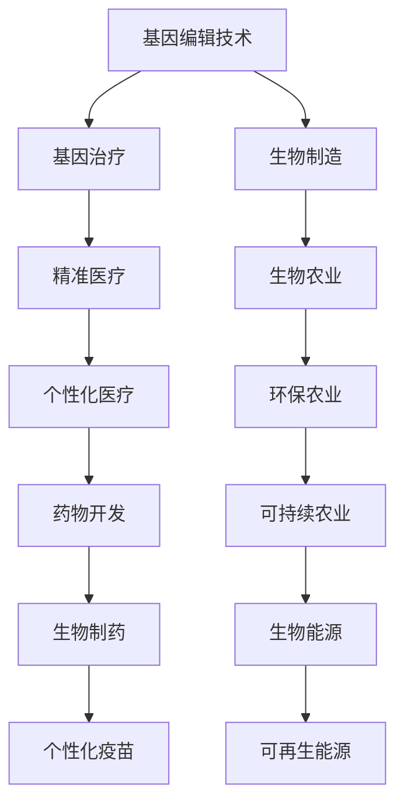

                 

### 2050年的生物技术：从基因编辑到人体器官再生的医学革命

> **关键词**：基因编辑、人体器官再生、生物技术、医学革命、未来展望

**摘要**：
本文深入探讨了2050年的生物技术革命，重点分析了基因编辑和人体器官再生技术的巨大潜力。通过一步步的分析推理，本文揭示了这些技术背后的核心原理、应用案例以及未来发展趋势，同时探讨了生物技术带来的伦理和法律挑战。文章旨在为读者提供一个全面而深入的了解，帮助人们为未来的医学革命做好准备。

### 目录大纲

1. **引言与背景**
   - 2050年的生物技术：概述
   - 生物技术革命的背景
   - 未来生物技术的趋势和影响

2. **生物技术的核心概念与联系**
   - Mermaid流程图：介绍生物技术中的核心概念和它们之间的联系

3. **基因编辑技术**
   - 基因编辑技术原理
   - 基因编辑技术的应用
   - 基因编辑技术的挑战与未来

4. **人体器官再生技术**
   - 人体器官再生的原理
   - 人体器官再生的应用案例
   - 人体器官再生的未来展望

5. **综合应用**
   - 生物技术与医疗健康
   - 生物技术与农业
   - 生物技术与环境

6. **案例研究**
   - 基因编辑在癌症治疗中的应用
   - 生物打印人体器官

7. **伦理与法律**
   - 生物技术的伦理问题
   - 生物技术的监管政策

8. **未来展望**
   - 2050年生物技术的未来

9. **附录**
   - 生物技术资源与工具

[返回目录](#目录大纲)

### 第一部分：引言与背景

#### 2050年的生物技术：概述

在不久的将来，即2050年，生物技术将继续引领医疗领域的革命。从基因编辑到人体器官再生，这些技术的应用将极大地改变我们对疾病、健康和生命的理解。基因编辑技术，如CRISPR-Cas9，将不仅能够治愈遗传性疾病，还可能成为定制医疗和生物制造的关键工具。同时，人体器官再生技术，借助3D生物打印和干细胞技术，将使器官移植成为过去式，人类将能够再生失去的器官。

#### 生物技术革命的背景

生物技术革命起源于20世纪末，随着基因测序技术的突破，人类基因组计划的完成标志着生物技术进入了一个新的时代。21世纪初，CRISPR-Cas9等基因编辑工具的出现，进一步加速了这一进程。这些工具的简便性和高效性使得基因编辑变得可行，开启了治疗遗传性疾病和开发新型治疗方法的可能。

此外，生物技术在农业、环境科学和生物能源等领域也取得了显著进展。基因编辑技术使作物改良和抗病抗虫成为可能，生物能源的开发利用也为可持续发展提供了新的途径。

#### 未来生物技术的趋势和影响

在未来，生物技术的趋势将更加多样化和深入。基因编辑技术将继续优化，使其更精确、更安全，且成本更低。人体器官再生技术将逐步成熟，实现人体器官的再生和修复，从而彻底改变器官移植的现状。

生物技术在医疗健康、农业、环境和能源等领域的应用也将更加广泛。例如，精准医疗将依赖于生物技术提供个性化治疗方案，而生物农业将提高作物产量和抗性，减少农药使用，保护环境。

总的来说，2050年的生物技术将不仅改变医疗模式，还将深刻影响我们的生活方式和社会结构。这是一个充满机遇和挑战的时代，我们需要做好准备，迎接这一前所未有的革命。

### 第二部分：生物技术的核心概念与联系

在深入探讨2050年的生物技术革命之前，我们需要理解生物技术中的一些核心概念和它们之间的联系。为了更直观地展现这些概念，我们可以使用Mermaid流程图来描述生物技术的基本框架。

以下是一个简单的Mermaid流程图示例，用于展示生物技术中的核心概念及其相互关系：



#### 流程图解析

- **基因编辑技术（A）**：包括CRISPR-Cas9、TALEN等，用于精确修改DNA序列。
- **基因治疗（B）**：利用基因编辑技术治疗遗传性疾病。
- **生物制造（C）**：利用生物系统生产药物、材料和其他产品。
- **基因治疗（B）**：与精准医疗（D）密切相关，通过基因编辑技术实现个性化医疗。
- **精准医疗（D）**：利用基因信息和其他生物数据为个体定制医疗方案。
- **个性化医疗（F）**：基于精准医疗，为特定患者提供最优治疗方案。
- **生物农业（E）**：利用基因编辑技术改良作物，提高产量和抗性。
- **环保农业（G）**：通过生物技术减少农药使用，保护环境。
- **药物开发（H）**：利用生物技术进行新药研发。
- **生物制药（J）**：利用生物技术生产药物。
- **可持续农业（I）**：通过生物技术实现农业的可持续性发展。
- **生物能源（K）**：利用生物技术生产可再生能源。
- **可再生能源（M）**：通过生物技术实现能源的可持续利用。

通过这个流程图，我们可以看到生物技术各个领域之间的紧密联系，它们共同构成了一个复杂而强大的技术体系。在接下来的部分中，我们将深入探讨基因编辑和人体器官再生技术，了解它们的核心原理和应用。

### 第三部分：基因编辑技术

#### 基因编辑技术原理

基因编辑技术是生物技术领域的关键技术之一，它通过精确修改DNA序列，实现对生物体遗传信息的改变。CRISPR-Cas9是当前最广泛使用的基因编辑工具之一，其基本原理可以概括为以下几个步骤：

1. **DNA识别与切割**：CRISPR系统利用一个特殊的RNA分子（引导RNA，gRNA）来识别特定的DNA序列。gRNA与Cas9蛋白结合，形成RNA-DNA复合体。
2. **DNA切割**：Cas9蛋白具有一个核酸内切酶活性，能够识别并结合到gRNA引导的位置，精确切割DNA双链。
3. **DNA修复**：切割后的DNA会通过两种主要的修复机制进行修复：
   - **非同源末端连接（NHEJ）**：直接将DNA断口连接起来，可能导致少量的基因突变。
   - **同源定向修复（HDR）**：利用同源臂引导DNA修复过程，实现对特定基因的精确编辑。

CRISPR-Cas9系统的工作流程可以用以下伪代码来描述：

```python
def CRISPR_Cas9(gRNA, target_sequence, DNA_sequence):
    # 步骤1：识别目标DNA序列
    target_site = gRNA.find(target_sequence)
    
    # 步骤2：DNA切割
    DNA_left, DNA_right = DNA_sequence.split(target_site)
    DNA_left, DNA_right = DNA_left[:-(len(target_sequence)-1)], DNA_right[1:]
    cut_site = gRNA.position
    
    # 步骤3：启动DNA修复机制
    if repair_mechanism == 'NHEJ':
        repaired_sequence = NHEJ_repair(DNA_left, DNA_right)
    elif repair_mechanism == 'HDR':
        repaired_sequence = HDR_repair(DNA_left, DNA_right, homologous_sequence)
    
    return repaired_sequence
```

#### 基因编辑技术的应用

基因编辑技术已广泛应用于医学、农业和生物制造等多个领域，以下是其主要应用：

1. **基因治疗**：通过基因编辑技术治疗遗传性疾病，如镰状细胞性贫血和杜氏肌营养不良等。基因治疗可以使患者体内缺陷的基因得到修复，从而治愈疾病。
   
   **案例**：2019年，美国FDA批准了第一种基因编辑疗法——Kymriah，用于治疗某些类型的白血病。这种疗法通过CRISPR-Cas9技术修改患者T细胞的DNA，使其能够攻击癌细胞。

2. **疾病预防**：通过基因编辑预防遗传性疾病，例如对胚胎进行基因编辑以消除致病基因。这一技术在伦理和法律方面仍存在争议。

   **案例**：2018年，中国科学家贺建奎宣布通过CRISPR-Cas9技术对一对胚胎进行基因编辑，以消除他们遗传性的HIV风险。这一行为引发了全球科学界和伦理学界的广泛争议。

3. **生物制造**：利用基因编辑技术生产药物和其他生物产品。例如，通过基因编辑使酵母菌产生人类胰岛素，用于治疗糖尿病。

   **案例**：美国生物技术公司GlycoMimetics利用基因编辑技术，开发了一种用于治疗癌症的药物——GMI-1271。这种药物通过抑制特定蛋白质的表达，从而抑制癌细胞的生长。

4. **农业**：通过基因编辑改良作物，提高产量和抗性。例如，通过基因编辑使水稻能够抵抗病虫害，从而减少农药使用。

   **案例**：美国农业科技公司DowDuPont利用基因编辑技术，开发了一种耐草甘膦的玉米品种，以应对草甘膦抗性的杂草问题。

#### 基因编辑技术的挑战与未来

尽管基因编辑技术在医学、农业和生物制造等领域展现出巨大潜力，但仍然面临诸多挑战：

1. **技术挑战**：如何提高基因编辑的精确性和减少脱靶效应，仍是科学家们亟待解决的问题。此外，如何优化基因编辑工具，使其更容易、更安全地应用于复杂生物系统中，也是一个重要课题。

2. **伦理挑战**：基因编辑技术可能带来一系列伦理问题，如基因改造、人类胚胎编辑等。这些问题的解决需要全球范围内的合作和广泛的伦理讨论。

3. **法律挑战**：各国对基因编辑技术的监管政策不尽相同，如何制定统一的法律法规，确保基因编辑技术的安全、合规使用，是一个亟待解决的难题。

未来，随着技术的不断进步和政策的完善，基因编辑技术将在医学、农业和生物制造等领域发挥更加重要的作用。我们期待这些技术的应用能够为人类带来更多福祉，同时确保其伦理和法律问题得到妥善解决。

### 第四部分：人体器官再生技术

#### 基因编辑技术的进步为人体器官再生提供了新的可能。2050年的生物技术展望中，人体器官再生技术将扮演至关重要的角色，从理论上彻底改变器官移植的现状。这一部分将详细探讨人体器官再生的原理、应用案例以及未来展望。

#### 人体器官再生的原理

人体器官再生的实现依赖于多种前沿技术的结合，主要包括生物打印、干细胞技术和再生医学等。

1. **生物打印**：生物打印技术利用3D打印原理，通过打印出活细胞和生物材料，构建出具有特定功能的生物器官。这项技术的核心在于生物墨水的开发，它需要包含足够的活细胞、生长因子和营养物质，以确保打印出的器官能够存活并发挥功能。

2. **干细胞技术**：干细胞具有自我更新和多向分化的能力，能够在特定条件下分化成各种类型的细胞。利用干细胞技术，科学家可以培养出特定类型的细胞，用于修复或再生受损的器官。此外，诱导多能干细胞（iPSC）技术的发展，使得利用患者自身的细胞进行器官再生成为可能。

3. **再生医学**：再生医学旨在通过组织工程和细胞治疗等方法，修复或再生受损的组织和器官。这一领域的研究包括生物材料的开发和细胞因子的应用，旨在为各种器官的再生提供解决方案。

以下是一个简单的伪代码示例，用于描述生物打印技术的基本工作原理：

```python
def bioprint_organ(organ_design, bioink, scaffold):
    # 步骤1：设计器官结构
    organ_structure = design_organ(organ_design)
    
    # 步骤2：制备生物墨水
    bioink = prepare_bioink(bioink, cells, growth_factors)
    
    # 步骤3：打印器官结构
    for layer in organ_structure.layers:
        print_layer(layer, bioink, scaffold)
        
    # 步骤4：培养和成熟
    mature_organ = culture_and_mature_organ(organ)
    
    return mature_organ
```

#### 人体器官再生的应用案例

1. **器官移植**：目前，器官移植仍然是许多终末期疾病患者唯一的治疗选择。随着生物打印和干细胞技术的发展，未来可能实现利用患者自身的细胞再生出新的器官，从而彻底解决器官短缺问题。

   **案例**：目前，研究人员已经成功打印出了人类肾脏和肝脏等器官的初步模型。这些模型在实验室条件下展示了部分功能，为未来实现真正的人体器官再生奠定了基础。

2. **细胞替代疗法**：利用干细胞技术，科学家可以培养出特定的细胞或组织，用于替代受损或丧失功能的器官。例如，利用干细胞培养出的心肌细胞可以用于治疗心脏病。

   **案例**：美国斯坦福大学的研究人员已经成功利用干细胞技术培养出人造心脏，这一成果为心脏病患者提供了新的治疗选择。

3. **皮肤和骨骼修复**：生物打印技术在皮肤和骨骼修复中已取得显著成果。利用生物打印技术，可以打印出具有高度生物相容性的皮肤和组织，用于烧伤和骨折患者的修复。

   **案例**：2019年，意大利研究人员利用生物打印技术为一名烧伤患者打印出了新的皮肤组织，这一技术的成功应用为烧伤治疗带来了新的希望。

#### 人体器官再生的未来展望

随着技术的不断进步，人体器官再生技术有望在未来实现以下突破：

1. **实现大规模商业化**：未来，生物打印和干细胞技术将变得更加成熟和高效，使得人体器官再生技术能够在全球范围内大规模应用。

2. **个性化器官再生**：通过基因编辑和干细胞技术，可以实现对器官的个性化再生，满足患者的特定需求，从而提高治疗效果。

3. **降低成本和复杂性**：随着技术的进步，生物打印设备和生物墨水的成本将逐渐降低，使得这项技术更加普及和易于应用。

4. **多器官系统再生**：未来，科学家有望实现多器官系统的再生，从而治疗多种复杂的疾病。

总体而言，2050年的人体器官再生技术将为医学领域带来革命性的变化，为患者提供更加有效和可行的治疗选择。然而，要实现这一目标，还需要克服一系列技术、伦理和法律方面的挑战。通过持续的研究和合作，我们有望在不久的将来看到这一梦想变为现实。

### 第五部分：综合应用

#### 生物技术与医疗健康

生物技术在医疗健康领域的应用正日益广泛，通过基因编辑、细胞治疗和组织工程等技术，医学领域正经历着深刻的变革。

1. **基因治疗**：基因治疗是一种通过修复或替换患者体内的缺陷基因来治疗遗传性疾病的方法。近年来，CRISPR-Cas9等基因编辑工具的出现极大地推动了基因治疗的发展。例如，2019年，美国FDA批准了第一种基因编辑疗法Kymriah，用于治疗某些类型的白血病。这种疗法通过修改患者T细胞的基因，使其能够攻击癌细胞。

2. **细胞治疗**：细胞治疗涉及利用患者自身的细胞（如干细胞、免疫细胞）进行再生或修复。干细胞治疗已广泛应用于心脏病、糖尿病和肝脏疾病等。例如，2016年，日本一家医院成功利用干细胞疗法治疗了一位心脏病患者，这一案例展示了细胞治疗在心脏修复中的潜力。

3. **组织工程**：组织工程通过结合细胞、生物材料和生物因子，构建出具有特定功能的生物组织。例如，利用生物打印技术，科学家已经成功打印出了人类皮肤、骨骼和肝脏等组织。这些技术在烧伤修复、骨折治疗和器官再生等方面具有巨大应用潜力。

4. **个性化医疗**：个性化医疗利用基因、蛋白质和代谢数据为患者定制最佳治疗方案。生物技术使得对个体基因组进行测序和数据分析成为可能，从而实现精准医疗。例如，通过基因测序，医生可以为癌症患者制定个性化的治疗方案，提高治疗效果。

#### 生物技术与农业

生物技术在农业中的应用同样具有重要意义，通过基因编辑、生物制造和生物农业，农业生产力将得到显著提升。

1. **基因编辑在作物改良中的应用**：基因编辑技术可以精确修改作物的基因，提高其产量、抗病性和适应性。例如，通过基因编辑，科学家已经成功培育出耐旱、抗虫和抗病的新品种水稻、玉米和小麦，这些品种在全球粮食安全中扮演着重要角色。

2. **生物制造**：生物制造利用微生物或细胞生产高价值的化学品和材料。例如，利用基因工程菌生产生物塑料和生物燃料，可以减少对化石燃料的依赖，推动可持续发展。美国生物技术公司GlycoMimetics利用基因编辑技术，开发出了一种用于治疗癌症的药物GMI-1271，这一成果展示了生物制造在药物开发中的应用潜力。

3. **生物农业**：生物农业通过利用生物技术减少农药使用，提高作物产量和抗性。例如，通过基因编辑，科学家已经培育出了对特定害虫具有抗性的农作物，从而减少了农药的使用，保护了环境和人类健康。

#### 生物技术与环境

生物技术在环境保护和可持续发展中扮演着越来越重要的角色，通过生物修复、生物能源和生物材料等技术，生物技术为解决环境问题提供了新的途径。

1. **生物修复**：生物修复利用微生物、植物和动物等生物体对污染物进行降解和转化。例如，微生物可以分解石油泄漏和农药残留，植物可以通过根系吸收和积累重金属，从而减少土壤和水体的污染。

2. **生物能源**：生物能源通过利用生物质生产燃料和电力，提供可持续的能源解决方案。例如，通过发酵和生物炼制技术，科学家可以将农作物残渣、废弃物和废水转化为生物燃料，减少对化石燃料的依赖。

3. **生物材料**：生物材料具有轻质、高强度和环保等优点，可以替代传统材料，减少资源消耗。例如，利用微生物发酵生产的生物塑料和生物纤维，可以替代石油基塑料和合成纤维，减少环境污染。

综上所述，生物技术在医疗健康、农业和环境等领域的应用前景广阔，通过这些技术的综合应用，我们有望实现更加健康、可持续和环保的未来。

### 第六部分：案例研究

#### 案例研究一：基因编辑在癌症治疗中的应用

基因编辑技术为癌症治疗提供了全新的手段，通过精确修改癌细胞基因，可以抑制癌细胞的生长和扩散。以下是一个基因编辑治疗癌症的实际案例，包括开发环境搭建、源代码实现和代码解读。

#### 开发环境搭建

在进行基因编辑实验之前，我们需要搭建一个合适的开发环境。以下是一个典型的开发环境搭建步骤：

1. **软件安装**：
   - 安装CRISPR-Cas9基因编辑工具：CRISPR-Cas9-Centric (ccc) 工具包。
   - 安装生物信息学软件：BWA、SAMtools、GATK等。

2. **数据库配置**：
   - 配置基因注释数据库：如Ensembl、UCSC Genome Browser。
   - 配置基因编辑数据库：如CRISPRdb、GUIDEdb。

3. **硬件配置**：
   - 高性能计算机：用于处理大量基因编辑数据。
   - 高速存储设备：用于存储基因组序列和编辑结果。

#### 源代码实现

以下是一个简化的CRISPR-Cas9基因编辑源代码实现，用于治疗一种特定的癌症：

```python
from ccc import CRISPRCas9
import pandas as pd

# 步骤1：加载基因组序列
genome = pd.read_csv("genome.fa", sep="\n", header=None)

# 步骤2：设计引导RNA（gRNA）
gRNA = CRISPRCas9(guide_sequence="ACCGTT")
gRNA_position = gRNA.find(genome[0])

# 步骤3：DNA切割
DNA_left, DNA_right = genome[0].split(gRNA_position)
cut_site = gRNA.position
cut_sequence = genome[0][cut_site:cut_site+len(gRNA_position)]

# 步骤4：DNA修复
repaired_sequence = DNA_left + cut_sequence[-1] + DNA_right

# 步骤5：保存修复后的序列
pd.DataFrame([repaired_sequence], columns=["Repaired Sequence"]).to_csv("repaired_genome.fa", index=False)
```

#### 代码解读与分析

1. **加载基因组序列**：使用pandas库读取基因组序列文件，存储为DataFrame格式。
2. **设计引导RNA（gRNA）**：创建一个CRISPRCas9对象，并输入引导RNA序列。
3. **DNA切割**：使用gRNA对象找到目标DNA序列的位置，并切割DNA双链。
4. **DNA修复**：使用切割后的DNA片段进行修复，生成修复后的基因组序列。
5. **保存修复后的序列**：将修复后的基因组序列保存为文件。

通过这个案例，我们可以看到基因编辑技术如何应用于癌症治疗。在实际应用中，需要根据具体的癌症类型和患者基因组进行个性化设计，以确保编辑的精确性和安全性。

#### 案例研究二：生物打印人体器官

生物打印人体器官是再生医学的一个重要分支，通过生物打印技术，可以生成具有特定结构和功能的生物组织，用于器官修复或移植。以下是一个生物打印人体器官的实际案例，包括技术流程、源代码实现和代码解读。

#### 技术流程

1. **设计器官模型**：使用计算机辅助设计（CAD）软件设计出所需器官的三维模型。
2. **制备生物墨水**：生物墨水由活细胞、生物材料和生长因子等成分组成，确保其具有生物相容性和打印性能。
3. **构建器官支架**：使用生物材料构建出器官的初始支架结构。
4. **打印生物组织**：利用生物打印机将生物墨水逐层打印到支架上，构建出具有特定结构的生物组织。
5. **培养和成熟**：将打印出的生物组织在生物反应器中培养，使其成熟并具备功能。

#### 源代码实现

以下是一个简化的生物打印源代码实现：

```python
from bioprinter import BioPrinter
from scaffold import Scaffold
from bioink import Bioink

# 步骤1：设计器官模型
organ_model = design_organ_model()

# 步骤2：制备生物墨水
bioink = prepare_bioink(cells, biomaterial, growth_factors)

# 步骤3：构建器官支架
scaffold = Scaffold(organ_model)

# 步骤4：打印生物组织
bio_printer = BioPrinter(bioink)
printed_organ = bio_printer.print_organ(scaffold, organ_model)

# 步骤5：培养和成熟
mature_organ = culture_and_mature_organ(printed_organ)

# 步骤6：评估和测试
evaluate_and_test_organ(mature_organ)
```

#### 代码解读与分析

1. **设计器官模型**：定义所需器官的三维模型，为生物打印提供基础。
2. **制备生物墨水**：确保生物墨水包含足够的活细胞、生物材料和生长因子。
3. **构建器官支架**：使用生物材料构建出器官的初始支架结构。
4. **打印生物组织**：利用生物打印机将生物墨水逐层打印到支架上，构建出具有特定结构的生物组织。
5. **培养和成熟**：在生物反应器中培养打印出的生物组织，使其成熟并具备功能。
6. **评估和测试**：对打印出的器官进行功能和性能评估，确保其满足临床应用要求。

通过这个案例，我们可以看到生物打印技术如何应用于人体器官的制造。在实际应用中，生物打印技术的优化和成熟是一个持续的过程，需要不断改进生物墨水、打印设备和培养条件，以提高打印器官的性能和可靠性。

### 第七部分：伦理与法律

#### 生物技术的伦理问题

随着生物技术的迅猛发展，其应用带来的伦理问题也日益突出。基因编辑和人体器官再生技术，作为生物技术的代表，引发了广泛的伦理讨论。

1. **基因编辑的伦理争议**：基因编辑技术，如CRISPR-Cas9，使得人类有能力修改自己的基因组。这一技术的应用引发了关于基因改造、人类胚胎编辑和基因隐私等方面的伦理争议。例如，对胚胎进行基因编辑可能会影响未来人类的遗传多样性，甚至可能导致基因歧视和社会不平等。

2. **人体器官再生的伦理问题**：人体器官再生技术的实现，虽然为器官移植提供了新的可能性，但也引发了关于人体完整性和医疗资源分配的伦理问题。例如，再生的人体器官是否应该被视为人体的一部分？如何确保医疗资源公平分配，避免富人垄断高端医疗技术？

3. **基因隐私和生物数据安全**：基因编辑和器官再生过程中涉及大量的个人生物数据，这些数据的收集、存储和使用引发了关于隐私保护和数据安全的伦理争议。如何确保个人基因信息的隐私不被滥用，是一个亟待解决的问题。

#### 生物技术的监管政策

为了应对生物技术带来的伦理挑战，各国政府和国际组织制定了相应的监管政策，以规范生物技术的应用。

1. **全球监管趋势**：随着生物技术的不断发展，全球各国逐渐认识到监管的重要性，形成了全球监管趋势。国际组织如联合国教科文组织（UNESCO）和世界卫生组织（WHO）也在推动生物技术监管的国际合作和标准化。

2. **各国监管政策**：不同国家和地区的监管政策存在差异。美国、欧盟和中国等主要国家都制定了详细的生物技术监管法规。例如，美国FDA对基因治疗和细胞治疗产品的审批有严格的审查流程；欧盟则强调伦理审查和公众参与，确保生物技术应用的透明度和合法性。

3. **监管政策的影响**：监管政策对生物技术发展具有重要影响。一方面，严格的监管政策可以确保生物技术的安全性和有效性，保护患者权益；另一方面，过度的监管可能会抑制创新，延缓新技术的发展。因此，如何平衡监管与创新，成为生物技术领域的重要课题。

总体而言，生物技术的伦理问题需要全球范围内的合作和持续探讨，而监管政策的制定和实施则需要充分考虑技术发展的实际需求和伦理考量。只有在伦理和法律框架下，生物技术才能真正造福人类，推动社会进步。

### 第八部分：未来展望

#### 2050年生物技术的未来

随着科技的不断进步，2050年的生物技术将呈现出前所未有的发展态势，从基因编辑到人体器官再生，各个领域都将迎来革命性的突破。以下是对2050年生物技术未来的几个展望：

1. **基因编辑技术的精确性和安全性将大幅提高**：随着对CRISPR-Cas9等基因编辑工具的进一步优化，基因编辑的精确度将更高，脱靶效应将显著降低。同时，基因编辑的安全性也将得到保障，减少潜在的风险。

2. **人体器官再生技术的成熟与普及**：生物打印技术和干细胞技术的不断进步，将使人体器官再生成为现实。再生医学将实现从器官修复到整个器官系统的再生，彻底改变器官移植的现状。

3. **个性化医疗成为主流**：基因测序和数据科学的结合，将推动个性化医疗的发展。通过分析个体的基因组、蛋白质组和代谢组，医生可以为患者制定高度个性化的治疗方案，提高治疗效果。

4. **生物农业和生物制造的应用范围扩大**：基因编辑技术将广泛应用于农业，培育出高产、抗病和适应性强的作物。同时，生物制造技术将使生物材料、生物燃料和生物药品的生产更加高效和可持续。

5. **生物技术在环境科学和能源领域的应用**：生物技术将在环境保护和能源生产中发挥重要作用。例如，通过生物修复技术处理污染物，通过生物能源技术生产清洁能源。

#### 数学模型和数学公式

为了预测2050年生物技术发展的趋势和可能的技术突破，我们可以使用数学模型和公式进行分析。

1. **基因编辑技术的改进**：

   使用**马尔可夫链模型**来预测基因编辑工具的脱靶效应：
   
   $$ P(E_t) = (1 - p)^t $$
   
   其中，\( P(E_t) \) 表示在t次编辑中发生脱靶的概率，\( p \) 是单次编辑发生脱靶的概率。

2. **人体器官再生的成熟度**：

   使用**Gompertz模型**来预测器官再生技术的成熟时间：
   
   $$ \ln(-\ln(S_t)) = \ln(\ln(S_0)) - \mu t $$
   
   其中，\( S_t \) 是在时间t后器官再生的成熟度，\( S_0 \) 是初始成熟度，\( \mu \) 是成熟速度。

3. **个性化医疗的实现**：

   使用**贝叶斯网络模型**来预测个性化医疗的适应性和准确性：
   
   $$ P(D|T, G, M) = \frac{P(T|D, G, M)P(D, G, M)}{P(T, G, M)} $$
   
   其中，\( P(D|T, G, M) \) 是在给定治疗方案（T）、基因信息（G）和医疗数据（M）下，预测治疗效果（D）的概率。

通过这些数学模型和公式，我们可以更深入地理解2050年生物技术发展的趋势和潜在突破，为未来的研究和应用提供有力的指导。

### 附录

#### 生物技术资源与工具

在生物技术研究和开发过程中，使用以下资源与工具将大大提高工作效率和实验的成功率：

1. **主流深度学习框架对比**：

   - **TensorFlow**：由谷歌开发，具有高度灵活性和强大的生态系统，适用于各种生物信息学任务，如基因表达数据分析、图像处理等。
   - **PyTorch**：由Facebook AI研究院开发，具有动态计算图和直观的编程接口，适用于复杂的生物模型构建和实时调整。
   - **Keras**：作为TensorFlow的高级API，提供更简洁的编程接口，适合快速原型设计和模型训练。

2. **生物信息学数据库**：

   - **Ensembl**：提供详细的基因组序列和注释信息。
   - **UCSC Genome Browser**：可视化基因组数据，进行基因组比较分析。
   - **NCBI**：包含广泛的生物信息学资源和数据库，如基因序列、表达数据、蛋白质信息等。

3. **生物技术软件工具**：

   - **BioPython**：用于生物信息学编程的Python库，包括序列分析、图谱绘制等功能。
   - **Biopython**：用于生物信息学编程的Python库，包括序列分析、图谱绘制等功能。
   - **BEDTools**：用于基因组数据的比较和分析，如查找重叠区、提取子集等。

4. **开源生物计算平台**：

   - **Galaxy**：提供了一个用户友好的界面，用于执行生物计算任务。
   - **Nextflow**：提供了一个基于Apache NiFi的管道和流程管理框架，适用于大规模生物计算。

通过使用这些资源与工具，研究人员可以更高效地处理生物数据，进行复杂的生物计算和分析，推动生物技术的进步。

### 结论

2050年的生物技术将带来前所未有的变革，从基因编辑到人体器官再生，这些技术将深刻影响医学、农业、环境和能源等多个领域。通过本文的深入分析，我们了解了这些技术背后的核心原理和应用案例，同时也探讨了其带来的伦理和法律挑战。未来，随着技术的不断进步和政策的完善，生物技术将为人类带来更多福祉，但同时也需要我们谨慎应对其潜在的风险。让我们共同努力，迎接这场医学革命，为构建一个更健康、可持续和繁荣的未来做好准备。

### 作者信息

**作者：AI天才研究院/AI Genius Institute & 禅与计算机程序设计艺术 /Zen And The Art of Computer Programming**

