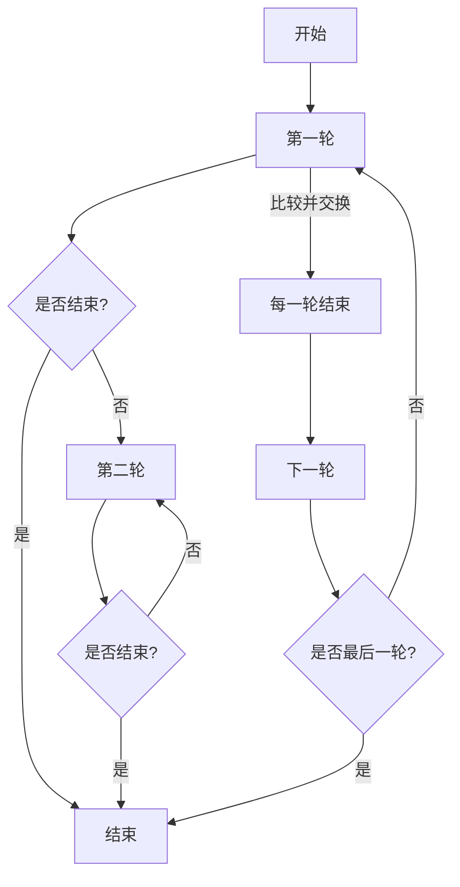
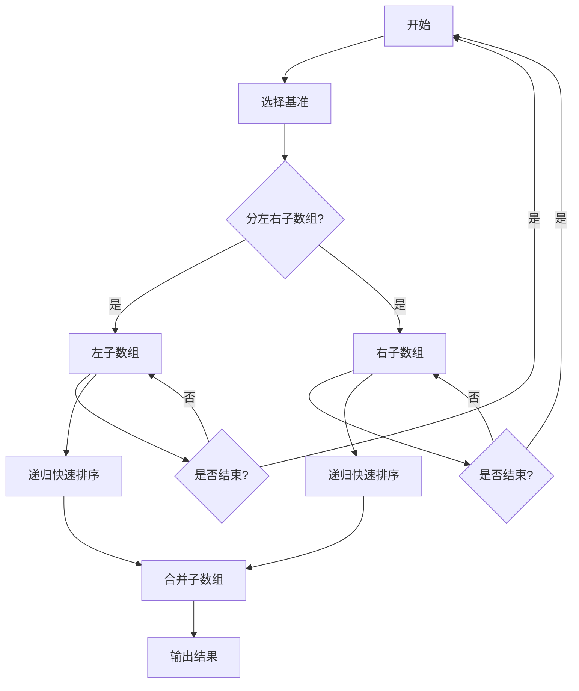

                 

### 《2024年美团社招算法面试题库及答案》

> **关键词**：美团、社招、算法面试、题库、答案、算法思维、解题技巧、面试策略、数据结构、面试真题、软技能、备考建议

> **摘要**：本文旨在为准备2024年美团社招算法面试的候选人提供全面的面试题库及答案解析。文章涵盖了算法面试的准备工作、算法核心概念与原理、面试真题详解、软技能应对策略、备考建议等内容，帮助读者深入理解和掌握算法面试的关键点，提高面试成功率。

### 目录大纲

1. **第一部分：算法基础与面试策略**
   1.1 算法面试概述
   1.2 算法思维与解题技巧
   1.3 面试题类型解析
   1.4 美团社招算法面试趋势

2. **第二部分：算法核心概念与原理**
   2.1 数据结构与算法原理
   2.2 算法核心概念
   2.3 算法原理讲解
   2.4 Mermaid流程图展示

3. **第三部分：美团社招算法面试真题解析**
   3.1 算法面试真题类型
   3.2 真题详解与解析
   3.3 真题实战演练

4. **第四部分：算法面试中的软技能**
   4.1 面试官期望的软技能
   4.2 面试中的应对策略
   4.3 成功面试案例分享

5. **第五部分：算法面试备考建议**
   5.1 备考策略与时间规划
   5.2 面试常见问题解答
   5.3 美团社招算法面试全攻略

6. **附录**
   6.1 算法面试资源汇总
   6.2 算法面试实战代码

---

### 引言

随着互联网行业的迅猛发展，各大互联网公司对技术人才的需求日益增长，尤其是对算法工程师的需求更是逐年攀升。美团作为我国领先的本地生活服务平台，每年都会在社会招聘中设置大量的算法岗位，吸引众多技术人才加入。2024年的美团社招算法面试，无疑又成为众多求职者关注的焦点。

本文将围绕美团社招算法面试，为广大求职者提供一份详细的面试题库及答案解析。文章将从算法基础与面试策略、算法核心概念与原理、面试真题解析、软技能应对策略、备考建议等多个方面，帮助读者全面备战美团社招算法面试。

文章结构如下：

- **第一部分**：算法基础与面试策略，介绍算法面试的重要性、算法思维与解题技巧、面试题类型解析及美团社招算法面试趋势。
- **第二部分**：算法核心概念与原理，讲解数据结构与算法原理、算法核心概念、算法原理讲解及Mermaid流程图展示。
- **第三部分**：美团社招算法面试真题解析，详细解析几道典型的面试真题，并提供解题思路与分析。
- **第四部分**：算法面试中的软技能，介绍面试官期望的软技能、面试中的应对策略及成功面试案例分享。
- **第五部分**：算法面试备考建议，提供备考策略与时间规划、面试常见问题解答及美团社招算法面试全攻略。
- **附录**：算法面试资源汇总及算法面试实战代码示例。

通过本文的详细解析，相信读者能够对美团社招算法面试有更加深入的了解，提升自己的面试技巧和应对能力，从而在面试中脱颖而出，成功拿到美团社招的算法岗位offer。

### 第一部分：算法基础与面试策略

#### 1.1 算法面试概述

算法面试是求职者进入互联网公司，特别是像美团这样的互联网巨头的重要一环。它不仅是技术能力的检验，更是逻辑思维、问题解决能力和团队协作能力的全方位考核。算法面试的重要性体现在以下几个方面：

1. **技术能力的检验**：算法面试主要考察求职者对数据结构、算法原理的掌握程度，以及对实际问题的抽象和解决能力。优秀的算法能力是互联网公司选拔技术人才的重要标准之一。
2. **逻辑思维能力的考核**：算法面试中，面试官往往通过设计复杂的问题，考察求职者的逻辑思维能力和问题解决能力。这种能力不仅在算法面试中至关重要，也是职场中必备的能力。
3. **团队协作能力的体现**：在面试过程中，求职者需要与面试官进行有效的沟通和协作，这体现了求职者的团队协作能力。团队协作能力是互联网公司高度关注的软技能之一。

#### 1.1.1 算法面试的核心环节

算法面试的核心环节主要包括以下几个部分：

1. **基础知识考察**：面试官会通过提问的方式，考察求职者对基本数据结构和算法原理的掌握程度，如线性表、链表、树、图等。
2. **算法设计与分析**：面试官会给出一个具体的问题，要求求职者现场设计并分析解决方案。这个过程主要考察求职者的算法设计和分析能力。
3. **编程实现**：在面试过程中，面试官会要求求职者现场编写代码，实现算法。这个过程主要考察求职者的编程能力和代码质量。
4. **讨论与优化**：在完成初步的编程实现后，面试官会与求职者一起讨论代码的优缺点，并进行优化。这个过程主要考察求职者的代码优化能力和沟通能力。

#### 1.1.2 面试官期望的能力

面试官在算法面试中期望求职者具备以下能力：

1. **扎实的基本功**：对基本的数据结构和算法原理有深刻的理解，能够熟练运用。
2. **优秀的算法设计能力**：能够针对具体问题设计出高效的算法，并对算法的时间复杂度和空间复杂度有清晰的认识。
3. **编程能力**：能够熟练编写高质量的代码，并能够进行基本的代码优化。
4. **逻辑思维能力**：能够清晰地表达自己的思路，对复杂问题有较高的抽象和解决能力。
5. **沟通能力**：能够与面试官进行有效的沟通和协作，表达自己的观点，并理解面试官的需求。

#### 1.1.3 准备工作的要点

为了在算法面试中脱颖而出，求职者需要做好充分的准备工作，主要包括以下几个方面：

1. **基础知识复习**：对数据结构和算法原理进行系统的复习和总结，确保对基础知识有深刻的理解。
2. **刷题练习**：通过刷题，提升自己的算法设计和编程能力。建议选择经典的算法面试题进行练习。
3. **编程实践**：通过实际编程项目，提升自己的编程能力和问题解决能力。可以选择一些开源项目进行贡献，或者自己实现一些有趣的小项目。
4. **模拟面试**：找朋友或者家人进行模拟面试，提前熟悉面试流程和应对策略。可以通过视频记录自己的模拟面试，并进行复盘和改进。
5. **时间管理**：合理安排面试准备时间，确保在面试前有充足的时间进行复习和准备。

通过以上的准备工作，求职者可以更好地应对算法面试，提高自己的面试成功率。

#### 1.2 算法思维与解题技巧

算法面试的核心在于思维和技巧。掌握正确的算法思维和解题技巧，有助于求职者在面试中快速找到问题的解决方案，提高面试成功率。以下是一些常见的算法思维和解题技巧：

1. **递归思维**：递归是一种强大的算法思维，通过将复杂问题分解为子问题，并递归解决子问题，最终解决原问题。递归思维适用于很多问题，如树的遍历、分治算法等。

   **递归思维伪代码示例**：

   ```plaintext
   function recursiveProblem(data):
       if data is base case:
           return base case solution
       else:
           divide data into subproblems
           solve each subproblem recursively
           combine solutions of subproblems
           return combined solution
   ```

2. **分治思维**：分治思维是一种将复杂问题分解为若干个规模较小的同类问题，分别解决这些子问题，然后将子问题的解合并为原问题的解的思维方法。分治算法常用于解决大规模的数据问题，如归并排序、快速排序等。

   **分治思维伪代码示例**：

   ```plaintext
   function divideAndConquer(problem):
       if problem size is small enough:
           return solve directly
       else:
           divide problem into subproblems
           solve each subproblem recursively
           combine solutions of subproblems
           return combined solution
   ```

3. **动态规划思维**：动态规划是一种通过保存子问题的解，避免重复计算，从而高效解决最优化问题的算法思维。动态规划适用于解决具有最优子结构的问题，如背包问题、最长公共子序列等。

   **动态规划思维伪代码示例**：

   ```plaintext
   function dynamicProgramming(problem):
       initialize DP table
       for each subproblem:
           solve subproblem using DP table
           update DP table with the solution
       return final solution from DP table
   ```

4. **贪心算法思维**：贪心算法是一种在每一步选择中，做出当前状态下最优的选择，以期望最终结果最优的算法思维。贪心算法适用于解决某些特殊类型的问题，如背包问题、求最小生成树等。

   **贪心算法思维伪代码示例**：

   ```plaintext
   function greedyAlgorithm(problem):
       initialize solution
       while problem is not empty:
           make the best choice locally
           update problem
       return final solution
   ```

5. **枚举思维**：枚举思维是一种通过遍历所有可能的情况，找到最优解的算法思维。枚举算法适用于解决一些简单的问题，如排列组合问题、棋盘问题等。

   **枚举思维伪代码示例**：

   ```plaintext
   function exhaustiveSearch(problem):
       for each possible solution:
           check if it is a valid solution
           if it is valid:
               return solution
   ```

通过掌握这些算法思维和解题技巧，求职者可以更加高效地解决面试中的问题，提高面试成功率。

#### 1.2.1 常见算法思维方法

在算法面试中，掌握常见的算法思维方法是非常重要的。以下是一些常用的算法思维方法：

1. **递归思维**：递归是一种常用的算法思维方法，通过将复杂问题分解为若干个规模较小的同类问题，并递归解决子问题，最终解决原问题。递归思维适用于很多问题，如树的遍历、分治算法等。

   **递归思维示例**：

   ```plaintext
   function recursive思维(problem):
       if problem is base case:
           return base case solution
       else:
           divide problem into subproblems
           solve each subproblem recursively
           combine solutions of subproblems
           return combined solution
   ```

2. **分治思维**：分治思维是一种将复杂问题分解为若干个规模较小的同类问题，分别解决这些子问题，然后将子问题的解合并为原问题的解的思维方法。分治算法常用于解决大规模的数据问题，如归并排序、快速排序等。

   **分治思维示例**：

   ```plaintext
   function divideAndConquer(problem):
       if problem size is small enough:
           return solve directly
       else:
           divide problem into subproblems
           solve each subproblem recursively
           combine solutions of subproblems
           return combined solution
   ```

3. **动态规划思维**：动态规划是一种通过保存子问题的解，避免重复计算，从而高效解决最优化问题的算法思维。动态规划适用于解决具有最优子结构的问题，如背包问题、最长公共子序列等。

   **动态规划思维示例**：

   ```plaintext
   function dynamicProgramming(problem):
       initialize DP table
       for each subproblem:
           solve subproblem using DP table
           update DP table with the solution
       return final solution from DP table
   ```

4. **贪心算法思维**：贪心算法是一种在每一步选择中，做出当前状态下最优的选择，以期望最终结果最优的算法思维。贪心算法适用于解决某些特殊类型的问题，如背包问题、求最小生成树等。

   **贪心算法思维示例**：

   ```plaintext
   function greedyAlgorithm(problem):
       initialize solution
       while problem is not empty:
           make the best choice locally
           update problem
       return final solution
   ```

5. **枚举思维**：枚举思维是一种通过遍历所有可能的情况，找到最优解的算法思维。枚举算法适用于解决一些简单的问题，如排列组合问题、棋盘问题等。

   **枚举思维示例**：

   ```plaintext
   function exhaustiveSearch(problem):
       for each possible solution:
           check if it is a valid solution
           if it is valid:
               return solution
   ```

通过掌握这些常见的算法思维方法，求职者可以更加高效地解决面试中的问题，提高面试成功率。

#### 1.2.2 时间复杂度与空间复杂度分析

在算法面试中，时间复杂度和空间复杂度的分析是考察求职者对算法性能理解和优化能力的重要指标。以下是对时间复杂度和空间复杂度的基本概念、分析方法以及如何进行优化的详细介绍。

##### 1.2.2.1 时间复杂度的基本概念

时间复杂度是衡量算法运行时间的一个指标，表示算法执行时间与输入规模之间的关系。时间复杂度通常用大O符号（O-notation）来表示，常见的有O(1)、O(log n)、O(n)、O(n log n)、O(n^2)、O(2^n)等。

- **O(1)**：常数时间，算法运行时间不随输入规模的变化而变化。
- **O(log n)**：对数时间，算法运行时间与输入规模的以2为底的对数成正比。
- **O(n)**：线性时间，算法运行时间与输入规模成正比。
- **O(n log n)**：对数线性时间，算法运行时间与输入规模的以2为底的对数和输入规模成正比。
- **O(n^2)**：二次时间，算法运行时间与输入规模的平方成正比。
- **O(2^n)**：指数时间，算法运行时间与输入规模的2的指数次方成正比。

##### 1.2.2.2 空间复杂度的基本概念

空间复杂度是衡量算法占用内存空间的指标，表示算法执行过程中所需的存储空间与输入规模之间的关系。空间复杂度也用大O符号表示。

- **O(1)**：常数空间，算法所需的空间不随输入规模的变化而变化。
- **O(n)**：线性空间，算法所需的空间与输入规模成正比。
- **O(n^2)**：二次空间，算法所需的空间与输入规模的平方成正比。

##### 1.2.2.3 时间复杂度与空间复杂度的分析方法

1. **基本方法**：通过观察算法的结构和执行过程，分析每个基本操作（如比较、赋值、递归调用等）的执行次数，进而得出整个算法的时间复杂度和空间复杂度。

2. **递归分析**：对于递归算法，可以使用主定理（Master Theorem）来分析其时间复杂度。主定理提供了递归算法的通项公式，用于求解递归时间复杂度。

3. **流程图法**：通过绘制算法的流程图，分析每个节点的执行次数，从而得到整个算法的时间复杂度。

##### 1.2.2.4 如何优化时间复杂度和空间复杂度

1. **算法优化**：通过改进算法结构，减少不必要的操作，降低算法的时间复杂度和空间复杂度。例如，使用分治算法减少重复计算，使用动态规划避免重复状态，使用贪心算法选择最优解等。

2. **数据结构优化**：选择合适的数据结构来减少算法的时间复杂度。例如，使用哈希表来加速查找操作，使用平衡二叉树来优化排序操作。

3. **空间优化**：通过减少算法的存储需求来降低空间复杂度。例如，使用原地算法减少空间占用，使用位运算来优化存储空间。

##### 1.2.2.5 时间复杂度和空间复杂度分析示例

以下是一个简单的示例，分析一个冒泡排序算法的时间复杂度和空间复杂度。

```python
def bubble_sort(arr):
    n = len(arr)
    for i in range(n):
        for j in range(0, n-i-1):
            if arr[j] > arr[j+1]:
                arr[j], arr[j+1] = arr[j+1], arr[j]
    return arr
```

**时间复杂度分析**：

- **最好情况**：当输入数组已经排序时，每个元素只需比较一次，因此时间复杂度为O(n)。
- **最坏情况**：当输入数组完全逆序时，每个元素都需要与其他所有元素比较，因此时间复杂度为O(n^2)。

**空间复杂度分析**：

- 冒泡排序是一种原地排序算法，不使用额外的存储空间，因此空间复杂度为O(1)。

通过以上分析，我们可以看到冒泡排序的时间复杂度较高，但在空间复杂度上表现良好。在实际应用中，我们可以根据具体需求选择合适的排序算法。

#### 1.2.3 解题步骤与技巧总结

在算法面试中，解题步骤和技巧是成功的关键。以下是一些解题步骤和技巧，帮助求职者在面试中更好地应对问题：

1. **理解问题**：在开始解题之前，首先要仔细阅读题目，确保理解问题的要求和限制。在理解问题时，可以提出以下问题：
   - 输入是什么？
   - 输出是什么？
   - 边界条件是什么？
   - 是否有特殊要求或限制？

2. **设计算法**：在理解问题之后，设计一个可行的算法。可以采用以下步骤：
   - 确定算法的基本结构，如递归、分治、动态规划等。
   - 分析算法的时间复杂度和空间复杂度，确保算法的可行性。
   - 设计具体的算法步骤和伪代码。

3. **编程实现**：将设计好的算法转化为编程语言，编写代码。在编程实现时，注意以下细节：
   - 编写清晰的注释，说明代码的每一步作用。
   - 使用合理的变量命名，提高代码可读性。
   - 遵循编程规范，确保代码质量。

4. **测试与调试**：在编写代码后，进行充分的测试，确保算法的正确性。可以采用以下方法：
   - 编写测试用例，覆盖各种边界条件和输入情况。
   - 使用调试工具，定位并修复代码中的错误。

5. **优化与讨论**：在解决完问题后，可以与面试官讨论算法的优缺点，并提出可能的优化方案。在讨论时，注意以下方面：
   - 解释算法的思路和逻辑。
   - 分析算法的复杂度，提出改进的方向。
   - 评估优化方案的实际效果。

6. **总结与反思**：在面试结束后，总结自己的解题过程，找出不足之处并进行反思。可以通过以下方式提高自己的解题能力：
   - 分析面试中的错误和失败，总结经验教训。
   - 学习并掌握新的算法和技巧。
   - 持续练习和刷题，提高自己的编程能力。

通过以上解题步骤和技巧，求职者可以在算法面试中更好地应对各种问题，提高自己的面试成功率。

#### 1.3 面试题类型解析

在算法面试中，不同类型的题目考察了求职者不同的能力。以下是对常见面试题类型的解析，以及每种类型题目的特点和应对策略。

##### 1.3.1 编程实现题

编程实现题是算法面试中最常见的题型，主要考察求职者的编程能力、算法实现能力和代码质量。这类题目通常要求在给定的时间限制内，根据题目的描述编写出正确的代码。

**特点**：
- 题目描述清晰，通常包含输入和输出的格式。
- 需要解决的问题具有一定的复杂性，但通常是基础算法或数据结构的变形。

**应对策略**：
- 确保理解题目要求，明确输入和输出。
- 设计一个合理的算法，并进行时间复杂度和空间复杂度的分析。
- 编写简洁、可读性强的代码，注意代码风格和注释。

**示例**：
- **题目**：实现一个函数，求一个整数的阶乘。
- **伪代码**：
  ```plaintext
  function factorial(n):
      if n <= 1:
          return 1
      else:
          return n * factorial(n-1)
  ```

##### 1.3.2 算法分析题

算法分析题主要考察求职者对算法设计和分析的能力，通常要求对给定的问题设计一个高效的算法，并分析其时间复杂度和空间复杂度。

**特点**：
- 题目通常较为复杂，需要抽象和建模。
- 需要展示算法的设计思路和实现细节。
- 通常涉及动态规划、分治算法、贪心算法等高级算法。

**应对策略**：
- 熟悉常见算法设计模式和技巧，如递归、分治、动态规划等。
- 掌握时间复杂度和空间复杂度的分析方法。
- 注重算法的优化和改进，提出可能的优化方案。

**示例**：
- **题目**：设计一个算法，找出数组中的第k个最大元素。
- **伪代码**：
  ```plaintext
  function findKthLargest(nums, k):
      sort(nums)
      return nums[k-1]
  ```

##### 1.3.3 应用题

应用题是将算法应用于实际场景的题目，主要考察求职者对算法的理解和应用能力。这类题目通常涉及现实问题，如排序、搜索、图算法等。

**特点**：
- 题目背景较为复杂，通常包含一定的业务场景。
- 需要理解业务逻辑，抽象出核心问题。
- 需要设计并实现相应的算法，解决实际问题。

**应对策略**：
- 熟悉常见的业务场景和算法应用。
- 注重问题建模和算法设计。
- 关注算法的实用性和可扩展性。

**示例**：
- **题目**：设计一个算法，计算两个字符串的最长公共子序列。
- **伪代码**：
  ```plaintext
  function longestCommonSubsequence(str1, str2):
      create a DP table of size (m+1) x (n+1)
      for i from 0 to m:
          for j from 0 to n:
              if str1[i] == str2[j]:
                  DP[i][j] = DP[i-1][j-1] + 1
              else:
                  DP[i][j] = max(DP[i-1][j], DP[i][j-1])
      return DP[m][n]
  ```

##### 1.3.4 开放性问题

开放性问题通常没有固定的答案，主要考察求职者的思维能力和创新能力。这类题目鼓励求职者从多个角度思考问题，提出独特的解决方案。

**特点**：
- 题目通常较为开放，没有明确的要求。
- 需要展示求职者的逻辑思维和创新能力。
- 需要提出有价值的观点和建议。

**应对策略**：
- 提前准备，了解常见开放性问题的类型和应对策略。
- 注重思维的灵活性和创新性。
- 结合自己的经验和知识，提出合理的解决方案。

**示例**：
- **题目**：如何设计一个高效的搜索引擎？
- **回答要点**：
  - 提高搜索速度：使用索引技术，如倒排索引、B树索引等。
  - 提高搜索准确度：使用查询语言处理、自然语言处理等技术。
  - 提高用户体验：提供智能搜索提示、相关推荐等功能。

通过以上对面试题类型的解析，求职者可以更好地了解每种类型题目的特点和应对策略，提高自己的面试成功率。

#### 1.4 美团社招算法面试趋势

美团社招算法面试的趋势反映了行业的发展和公司的需求变化。以下是一些近年来的趋势及对应策略：

##### 1.4.1 面试题来源与特点

美团社招算法面试题的来源通常包括以下几个方面：

1. **经典算法题**：这些题目来源于经典的算法竞赛和教材，如《算法导论》、《编程之美》等。这类题目考查基础算法能力和逻辑思维。
2. **公司业务题**：这些题目结合美团的实际业务场景，考察求职者对业务的理解和解决实际问题的能力。
3. **开放性题目**：这类题目没有固定答案，鼓励求职者发挥创意，提出有价值的解决方案。

近年来，美团社招算法面试题的特点表现为：

1. **复杂度增加**：题目难度逐年增加，更加注重求职者的算法设计能力和优化能力。
2. **业务场景化**：题目更贴近公司业务，考察求职者对实际问题的抽象和解决能力。
3. **开放性增强**：鼓励求职者发挥创意，提出创新的解决方案。

##### 1.4.2 近年面试难度变化

近年美团社招算法面试的难度有所提升，主要体现在以下几个方面：

1. **算法复杂度要求更高**：面试官对算法的时间复杂度和空间复杂度要求更加严格，求职者需要展示出高效的算法设计。
2. **业务理解能力要求提升**：面试官更加关注求职者对业务的理解和实际问题的解决能力，而不仅仅是基础算法的掌握。
3. **软技能重视度增加**：沟通能力、团队合作能力等软技能在面试中占据越来越重要的地位，面试官希望通过面试了解求职者的综合素质。

##### 1.4.3 应对策略与准备建议

为了应对美团社招算法面试，求职者可以采取以下策略和准备建议：

1. **基础知识扎实**：加强对数据结构和算法原理的掌握，尤其是经典算法题的解法和优化策略。
2. **业务理解能力提升**：关注美团等互联网公司的业务动态，了解行业发展趋势，提升对实际问题的抽象和解决能力。
3. **刷题与实践**：通过大量刷题和实际项目经验，提高编程能力和问题解决能力。
4. **软技能提升**：加强沟通能力、团队合作能力和自我学习能力，在面试中展现出良好的综合素质。
5. **模拟面试**：进行多次模拟面试，熟悉面试流程和应对策略，提高应对压力和突发情况的能力。

通过以上策略和准备，求职者可以更好地应对美团社招算法面试，提高自己的面试成功率。

### 第二部分：算法核心概念与原理

#### 2.1 数据结构与算法原理

数据结构和算法是计算机科学的基础，它们相互依存，共同决定了程序的性能和效率。数据结构是组织和管理数据的方式，而算法则是解决问题的步骤和方法。本章节将详细介绍常见的数据结构及其应用场景，以及算法的基本概念和设计原则。

##### 2.1.1 常见数据结构

在计算机科学中，常见的数据结构包括线性表、栈、队列、链表、树、图等。每种数据结构都有其独特的特点和适用场景。

1. **线性表**：线性表是一种有序的数据集合，其中的元素按照一定的顺序排列。常见的线性表包括数组、链表、向量等。线性表的操作包括插入、删除、查找等。

2. **栈**：栈是一种后进先出（LIFO）的数据结构，只允许在表的一端进行操作。栈的操作包括入栈、出栈、读取栈顶元素等。

3. **队列**：队列是一种先进先出（FIFO）的数据结构，只允许在表的一端进行插入操作，另一端进行删除操作。队列的操作包括入队、出队、读取队首元素等。

4. **链表**：链表是一种由节点组成的链式存储结构，每个节点包含数据和指向下一个节点的指针。链表的操作包括插入、删除、查找等。

5. **树**：树是一种层次结构，由节点和边组成。每个节点有且仅有一个父节点，除了根节点外，其他节点都有且仅有一个子节点。常见的树包括二叉树、二叉搜索树、平衡树等。

6. **图**：图是一种由节点和边组成的复杂结构，节点表示实体，边表示实体之间的关系。常见的图包括无向图、有向图、加权图等。

##### 2.1.2 数据结构的特性与应用

每种数据结构都有其独特的特性，适用于不同的场景。以下是对几种常见数据结构的特性与应用的简要介绍：

1. **数组**：数组是一种固定大小的线性表，提供快速的随机访问。适用于需要频繁查找和排序的场景，如数据库索引、缓存管理等。

2. **链表**：链表是一种动态大小的线性表，提供高效的插入和删除操作。适用于需要频繁插入和删除的场景，如链表、栈、队列等。

3. **栈**：栈提供后进先出的操作顺序，适用于需要后进先出操作的场景，如递归、括号匹配等。

4. **队列**：队列提供先进先出的操作顺序，适用于需要先进先出操作的场景，如任务调度、缓冲区管理等。

5. **树**：树提供层次化的数据组织，适用于需要层次化存储和检索的场景，如组织结构、文件系统、二叉搜索树等。

6. **图**：图提供复杂的节点关系，适用于需要表示复杂关系的场景，如社交网络、交通网络、网络拓扑等。

##### 2.1.3 线性表、栈、队列

1. **线性表**：线性表是一种有序的数据集合，其中的元素按照一定的顺序排列。常见的线性表包括数组、链表、向量等。线性表的操作包括插入、删除、查找等。

   **数组**：数组是一种固定大小的线性表，提供快速的随机访问。适用于需要频繁查找和排序的场景，如数据库索引、缓存管理等。

   **链表**：链表是一种动态大小的线性表，提供高效的插入和删除操作。适用于需要频繁插入和删除的场景，如链表、栈、队列等。

   **向量**：向量是一种动态数组，结合了数组和链表的优点，提供高效的插入、删除和随机访问操作。适用于需要动态调整大小的场景。

2. **栈**：栈是一种后进先出（LIFO）的数据结构，只允许在表的一端进行操作。栈的操作包括入栈、出栈、读取栈顶元素等。

   **应用场景**：
   - 递归：递归算法中需要使用栈来存储递归过程中的状态。
   - 括号匹配：使用栈来判断字符串中的括号是否匹配。
   - 后缀表达式计算：使用栈来计算后缀表达式的值。

3. **队列**：队列是一种先进先出（FIFO）的数据结构，只允许在表的一端进行插入操作，另一端进行删除操作。队列的操作包括入队、出队、读取队首元素等。

   **应用场景**：
   - 任务调度：队列可以用来管理任务的执行顺序。
   - 缓冲区管理：队列可以用来处理输入和输出的数据流。

##### 2.1.4 链表、树、图

1. **链表**：链表是一种由节点组成的链式存储结构，每个节点包含数据和指向下一个节点的指针。链表的操作包括插入、删除、查找等。

   **特点**：
   - 动态大小：链表可以根据需要动态地调整大小。
   - 随机访问：链表提供高效的插入和删除操作。

2. **树**：树是一种层次结构，由节点和边组成。每个节点有且仅有一个父节点，除了根节点外，其他节点都有且仅有一个子节点。常见的树包括二叉树、二叉搜索树、平衡树等。

   **特点**：
   - 层次结构：树可以用来表示具有层次关系的数据。
   - 高效查找：二叉搜索树提供高效的查找和排序操作。

3. **图**：图是一种由节点和边组成的复杂结构，节点表示实体，边表示实体之间的关系。常见的图包括无向图、有向图、加权图等。

   **特点**：
   - 复杂关系：图可以用来表示复杂的实体关系。
   - 高效路径查找：图算法可以用来求解最短路径、最长时间路径等问题。

通过以上对常见数据结构的介绍，我们可以看到每种数据结构都有其独特的特点和适用场景。在编程实践中，合理选择和使用数据结构，可以提高程序的性能和效率。

#### 2.2 算法核心概念

算法是计算机科学中的核心概念，它描述了解决特定问题的步骤和方法。一个算法需要满足以下基本特性：

1. **确定性**：算法的每一步操作都是明确的，没有歧义，确保每次执行都能得到相同的结果。
2. **有穷性**：算法在执行过程中需要在有限的步骤内完成，不能无限循环。
3. **有效性**：算法的执行是有效的，能在合理的时间内完成计算。
4. **输入**：算法可以接受输入，这些输入决定了算法执行的具体操作。
5. **输出**：算法需要产生输出，这是算法执行的结果。

##### 2.2.1 算法的定义与特性

算法（Algorithm）是一种有组织的、解决问题的步骤序列。它是计算模型的核心，用于处理数据并解决特定问题。

**定义**：算法是一系列定义明确的规则，用于解决特定问题或执行特定任务。

**特性**：

1. **确定性**：算法的每一步操作都是明确的，没有歧义。这保证了算法执行的一致性。
2. **有穷性**：算法必须在有限的步骤内完成，不能无限循环。这确保了算法的有效性。
3. **有效性**：算法的执行是有效的，能够在合理的时间内完成计算。这要求算法具有高效性。
4. **输入**：算法可以接受输入，这些输入决定了算法执行的具体操作。输入可以是数据集或问题参数。
5. **输出**：算法需要产生输出，这是算法执行的结果。输出通常是问题的解或问题的相关信息。

##### 2.2.2 算法设计与分析

算法的设计与分析是算法学中的核心内容。算法设计旨在找到解决问题的方法，而算法分析则评估算法的性能和效率。

**算法设计**：

算法设计是解决特定问题的过程，通常包括以下步骤：

1. **理解问题**：明确问题的要求，分析问题的规模和特点。
2. **抽象问题**：将具体问题抽象为一个数学模型或算法模型。
3. **设计算法**：根据问题的特点，选择合适的算法设计和策略，如递归、分治、动态规划、贪心算法等。
4. **验证算法**：通过实例验证算法的正确性，确保算法能够解决特定问题。

**算法分析**：

算法分析是对算法性能的评估，通常包括以下方面：

1. **时间复杂度分析**：分析算法在执行过程中所需的时间，通常用大O符号表示，如O(1)、O(log n)、O(n)、O(n log n)等。
2. **空间复杂度分析**：分析算法在执行过程中所需的空间，通常用大O符号表示，如O(1)、O(n)等。
3. **正确性分析**：验证算法的正确性，确保算法能够正确地解决问题。
4. **性能评估**：评估算法在实际应用中的性能，如执行速度、内存占用等。

##### 2.2.3 算法效率优化

算法的效率优化是提高算法性能的关键。以下是一些常见的算法效率优化方法：

1. **算法改进**：通过改进算法的设计和实现，提高算法的效率。例如，使用分治算法、动态规划、贪心算法等优化策略。
2. **数据结构优化**：选择合适的数据结构，提高算法的效率。例如，使用哈希表、树结构等高效的数据结构。
3. **代码优化**：通过优化代码，减少不必要的计算和存储，提高算法的效率。例如，使用循环展开、消去冗余计算等。
4. **并行化**：利用多核处理器和分布式计算，提高算法的执行速度。例如，使用并行算法、分布式算法等。

**示例**：

以下是一个简单的冒泡排序算法，并对其进行优化。

**原始冒泡排序算法**：

```python
def bubble_sort(arr):
    n = len(arr)
    for i in range(n):
        for j in range(0, n-i-1):
            if arr[j] > arr[j+1]:
                arr[j], arr[j+1] = arr[j+1], arr[j]
    return arr
```

**优化冒泡排序算法**：

```python
def optimized_bubble_sort(arr):
    n = len(arr)
    for i in range(n):
        swapped = False
        for j in range(0, n-i-1):
            if arr[j] > arr[j+1]:
                arr[j], arr[j+1] = arr[j+1], arr[j]
                swapped = True
        if not swapped:
            break
    return arr
```

在优化的冒泡排序算法中，引入了一个`swapped`变量，用于判断是否发生了交换。如果在一次完整的遍历中没有发生交换，说明数组已经有序，可以提前结束排序，提高效率。

通过以上的算法效率优化方法，我们可以显著提高算法的执行速度和性能。

#### 2.3 算法原理讲解

算法原理是算法设计和分析的基础，掌握算法原理有助于我们更好地理解和运用各种算法。本章节将详细介绍几种常见的算法原理，包括排序算法、搜索算法和分治算法。

##### 2.3.1 排序算法

排序算法是将一组数据按照一定的顺序排列的算法。常见的排序算法包括冒泡排序、选择排序、插入排序和快速排序等。

1. **冒泡排序**：

   冒泡排序是一种简单的排序算法，它重复地遍历要排序的数列，一次比较两个元素，如果它们的顺序错误就把它们交换过来。遍历数列的工作是重复地进行，直到没有再需要交换的元素为止。

   **原理**：每次遍历都能将最大的元素“冒泡”到数列的末尾。

   **时间复杂度**：最坏情况下为O(n^2)。

   **空间复杂度**：O(1)。

2. **选择排序**：

   选择排序是一种简单高效的排序算法，它的工作原理是每次从未排序的元素中找到最小（或最大）的元素，将其放到已排序序列的末尾。

   **原理**：每次选择未排序部分的最小（或最大）元素，将其与已排序部分的第一个元素交换。

   **时间复杂度**：最坏情况下为O(n^2)。

   **空间复杂度**：O(1)。

3. **插入排序**：

   插入排序是一种简单的排序算法，它的工作原理是通过构建有序序列，对于未排序数据，在已排序序列中从后向前扫描，找到相应位置并插入。

   **原理**：将未排序的元素插入到已排序序列的正确位置。

   **时间复杂度**：最坏情况下为O(n^2)。

   **空间复杂度**：O(1)。

4. **快速排序**：

   快速排序是一种高效的排序算法，它使用了分治策略来把一个序列分为较小和较大的2个子序列，然后递归地排序两个子序列。

   **原理**：选择一个“基准”元素，将序列划分为两部分，一部分都比基准小，另一部分都比基准大。递归地对这两部分进行快速排序。

   **时间复杂度**：平均情况下为O(n log n)，最坏情况下为O(n^2)。

   **空间复杂度**：O(log n)。

**示例**：以下是一个快速排序的Python实现。

```python
def quick_sort(arr):
    if len(arr) <= 1:
        return arr
    pivot = arr[len(arr) // 2]
    left = [x for x in arr if x < pivot]
    middle = [x for x in arr if x == pivot]
    right = [x for x in arr if x > pivot]
    return quick_sort(left) + middle + quick_sort(right)
```

##### 2.3.2 搜索算法

搜索算法是在数据结构中查找特定元素的方法。常见的搜索算法包括二分查找、深度优先搜索和广度优先搜索等。

1. **二分查找**：

   二分查找是一种在有序数组中查找特定元素的算法，它将数组分成两部分，根据目标值与中间元素的大小关系，决定在哪个部分继续查找。

   **原理**：每次将查找范围缩小一半，逐步逼近目标值。

   **时间复杂度**：O(log n)。

   **空间复杂度**：O(1)。

2. **深度优先搜索（DFS）**：

   深度优先搜索是一种用于遍历或搜索树的算法，它沿着一个分支一直走到底，然后回溯。

   **原理**：从根节点开始，先访问当前节点，然后递归地访问该节点的所有未访问的子节点。

   **时间复杂度**：O(V+E)，其中V是节点数，E是边数。

   **空间复杂度**：O(V)，用于存储递归栈。

3. **广度优先搜索（BFS）**：

   广度优先搜索是一种用于遍历或搜索图的算法，它按照广度的优先级顺序访问图中的节点。

   **原理**：从根节点开始，首先访问根节点的所有邻居节点，然后按照同样的方式访问邻居节点的邻居节点。

   **时间复杂度**：O(V+E)。

   **空间复杂度**：O(V)。

**示例**：以下是一个二分查找的Python实现。

```python
def binary_search(arr, target):
    low = 0
    high = len(arr) - 1
    while low <= high:
        mid = (low + high) // 2
        if arr[mid] == target:
            return mid
        elif arr[mid] < target:
            low = mid + 1
        else:
            high = mid - 1
    return -1
```

##### 2.3.3 分治算法

分治算法是一种将复杂问题分解为若干个规模较小的同类问题，分别解决这些子问题，然后将子问题的解合并为原问题的解的算法。分治算法的核心思想是“分而治之”。

1. **归并排序**：

   归并排序是一种典型的分治算法，它将数组分成两个子数组，分别对它们进行排序，然后将它们合并。

   **原理**：将数组分成两个子数组，分别对它们进行归并排序，然后将它们合并。

   **时间复杂度**：O(n log n)。

   **空间复杂度**：O(n)。

2. **合并同类项问题**：

   合并同类项问题是一种典型的分治算法应用，它将一个包含重复元素的数组合并为只包含唯一元素的新数组。

   **原理**：将数组分成两个子数组，分别进行合并同类项，然后将结果合并。

   **时间复杂度**：O(n)。

   **空间复杂度**：O(n)。

**示例**：以下是一个归并排序的Python实现。

```python
def merge_sort(arr):
    if len(arr) <= 1:
        return arr
    mid = len(arr) // 2
    left = merge_sort(arr[:mid])
    right = merge_sort(arr[mid:])
    return merge(left, right)

def merge(left, right):
    result = []
    i = j = 0
    while i < len(left) and j < len(right):
        if left[i] < right[j]:
            result.append(left[i])
            i += 1
        else:
            result.append(right[j])
            j += 1
    result.extend(left[i:])
    result.extend(right[j:])
    return result
```

通过以上对排序算法、搜索算法和分治算法的原理讲解，我们可以更好地理解和运用这些算法，提高我们的编程能力。

##### 2.3.4 算法原理讲解 - Mermaid 流程图展示

为了更好地理解和展示算法原理，我们使用Mermaid语言绘制了几个常见的算法流程图，包括冒泡排序、快速排序、二分查找和合并同类项。

**冒泡排序流程图**：



**快速排序流程图**：



**二分查找流程图**：

```mermaid
graph TD
    A[开始] --> B[设置low和high]
    B --> C{low <= high?}
    C -->|是| D[中间索引]
    C -->|否| E[结束]
    D --> F{arr[mid] == target?}
    F -->|是| G[找到]
    F -->|否| H{arr[mid] < target?}
    H --> I[更新low]
    H --> J[递归二分查找]
    I --> K[递归二分查找]
    J --> L{是否找到?}
    K --> L
    L --> M[返回结果]
```

**合并同类项流程图**：

```mermaid
graph TD
    A[开始] --> B[初始化两个指针]
    B --> C{指针1是否到达末尾?}
    C -->|是| D[结束]
    C -->|否| E[指针2是否到达末尾?]
    E -->|是| F[结束]
    E -->|否| G[比较元素]
    G --> H{arr1[i] <= arr2[j]?}
    H --> I[更新结果数组]
    I --> J[移动指针1]
    H --> K[移动指针2]
    K --> L[移动指针2]
    I --> M[移动指针1]
    G --> N[更新结果数组]
    M --> O{是否结束?}
    N --> P{是否结束?}
    O --> D
    P --> D
    D --> Q[输出结果]
```

通过这些Mermaid流程图，我们可以更直观地了解每种算法的执行过程和步骤，有助于更好地理解和掌握算法原理。

### 第三部分：美团社招算法面试真题解析

#### 3.1 算法面试真题类型

在美团社招算法面试中，面试题类型丰富多样，涵盖了编程实现题、算法分析题、应用题和开放性问题等。每种类型的题目都有其独特的特点，以下将分别进行解析。

##### 3.1.1 编程实现题

编程实现题是算法面试中最常见的题型，主要考察求职者的编程能力和算法实现能力。这类题目通常要求在给定的时间限制内，根据题目的描述编写出正确的代码。

**特点**：
- 题目描述清晰，通常包含输入和输出的格式。
- 需要解决的问题具有一定的复杂性，但通常是基础算法或数据结构的变形。

**应对策略**：
- 确保理解题目要求，明确输入和输出。
- 设计一个合理的算法，并进行时间复杂度和空间复杂度的分析。
- 编写简洁、可读性强的代码，注意代码风格和注释。

**示例**：
- **题目**：实现一个函数，计算两个整数的最大公约数。
- **伪代码**：
  ```plaintext
  function gcd(a, b):
      while b ≠ 0:
          temp = b
          b = a % b
          a = temp
      return a
  ```

##### 3.1.2 算法分析题

算法分析题主要考察求职者对算法设计和分析的能力，通常要求对给定的问题设计一个高效的算法，并分析其时间复杂度和空间复杂度。

**特点**：
- 题目通常较为复杂，需要抽象和建模。
- 需要展示算法的设计思路和实现细节。
- 通常涉及动态规划、分治算法、贪心算法等高级算法。

**应对策略**：
- 熟悉常见算法设计模式和技巧，如递归、分治、动态规划等。
- 掌握时间复杂度和空间复杂度的分析方法。
- 注重算法的优化和改进，提出可能的优化方案。

**示例**：
- **题目**：设计一个算法，找出数组中的第k个最大元素。
- **伪代码**：
  ```plaintext
  function findKthLargest(nums, k):
      sort(nums)
      return nums[k-1]
  ```

##### 3.1.3 应用题

应用题是将算法应用于实际场景的题目，主要考察求职者对算法的理解和应用能力。这类题目通常涉及现实问题，如排序、搜索、图算法等。

**特点**：
- 题目背景较为复杂，通常包含一定的业务场景。
- 需要理解业务逻辑，抽象出核心问题。
- 需要设计并实现相应的算法，解决实际问题。

**应对策略**：
- 熟悉常见的业务场景和算法应用。
- 注重问题建模和算法设计。
- 关注算法的实用性和可扩展性。

**示例**：
- **题目**：设计一个算法，计算两个字符串的最长公共子序列。
- **伪代码**：
  ```plaintext
  function longestCommonSubsequence(str1, str2):
      create a DP table of size (m+1) x (n+1)
      for i from 0 to m:
          for j from 0 to n:
              if str1[i] == str2[j]:
                  DP[i][j] = DP[i-1][j-1] + 1
              else:
                  DP[i][j] = max(DP[i-1][j], DP[i][j-1])
      return DP[m][n]
  ```

##### 3.1.4 开放性问题

开放性问题通常没有固定的答案，主要考察求职者的思维能力和创新能力。这类题目鼓励求职者从多个角度思考问题，提出独特的解决方案。

**特点**：
- 题目通常较为开放，没有明确的要求。
- 需要展示求职者的逻辑思维和创新能力。
- 需要提出有价值的观点和建议。

**应对策略**：
- 提前准备，了解常见开放性问题的类型和应对策略。
- 注重思维的灵活性和创新性。
- 结合自己的经验和知识，提出合理的解决方案。

**示例**：
- **题目**：如何设计一个高效的搜索引擎？
- **回答要点**：
  - 提高搜索速度：使用索引技术，如倒排索引、B树索引等。
  - 提高搜索准确度：使用查询语言处理、自然语言处理等技术。
  - 提高用户体验：提供智能搜索提示、相关推荐等功能。

通过以上对面试题类型的解析，求职者可以更好地了解每种类型题目的特点，并采取相应的应对策略，提高自己的面试成功率。

#### 3.2 真题详解与解析

在本章节中，我们将详细解析几道美团社招算法面试真题，包括两数之和、最长公共子序列和最长公共子串。通过这些真题的解析，读者可以更好地理解算法面试的解题思路和方法。

##### 3.2.1 真题一：两数之和

**题目描述**：给定一个整数数组 nums 和一个目标值 target，请你在该数组中找出和为目标值的那两个整数，并返回他们的数组下标。

**示例**：

```plaintext
输入：nums = [2, 7, 11, 15], target = 9
输出：[0, 1]
解释：因为 nums[0] + nums[1] = 2 + 7 = 9，返回 [0, 1]。
```

**解题思路**：

这道题目可以通过遍历数组，利用哈希表存储已遍历的数值和其下标，从而在 O(n) 时间内找到两数之和为目标值的解。

**伪代码**：

```plaintext
function twoSum(nums, target):
    create a hash table to store value and index
    for i from 0 to len(nums)-1:
        complement = target - nums[i]
        if complement in hash table:
            return [hash table[complement], i]
        else:
            insert nums[i] and i into hash table
    return []
```

**代码实现**：

```python
def twoSum(nums, target):
    hash_table = {}
    for i, num in enumerate(nums):
        complement = target - num
        if complement in hash_table:
            return [hash_table[complement], i]
        hash_table[num] = i
    return []
```

**时间复杂度**：O(n)

**空间复杂度**：O(n)

**解析**：

通过使用哈希表，我们可以快速查找是否存在当前数值的补数。在遍历数组的过程中，对于每个元素，我们首先计算其补数，然后在哈希表中查找补数是否存在。如果存在，则找到了两个数之和为目标值的解。否则，将当前元素及其下标存储在哈希表中，继续遍历下一个元素。这种解法在时间复杂度为 O(n)，空间复杂度为 O(n)。

##### 3.2.2 真题二：最长公共子序列

**题目描述**：给定两个字符串 text1 和 text2，找出它们的最长公共子序列。子序列可以通过删除某些字符而不改变字符顺序得到。

**示例**：

```plaintext
输入：text1 = "abcde", text2 = "ace"
输出："ace"
解释：字符串 "ace" 是 "abcde" 的最长公共子序列。
```

**解题思路**：

这道题目可以通过动态规划方法解决。我们定义一个二维数组 dp，其中 dp[i][j] 表示 text1 的前 i 个字符和 text2 的前 j 个字符的最长公共子序列的长度。

**伪代码**：

```plaintext
function longestCommonSubsequence(text1, text2):
    create a DP table of size (m+1) x (n+1)
    for i from 0 to m:
        for j from 0 to n:
            if text1[i-1] == text2[j-1]:
                dp[i][j] = dp[i-1][j-1] + 1
            else:
                dp[i][j] = max(dp[i-1][j], dp[i][j-1])
    return dp[m][n]
```

**代码实现**：

```python
def longestCommonSubsequence(text1, text2):
    m, n = len(text1), len(text2)
    dp = [[0] * (n+1) for _ in range(m+1)]

    for i in range(1, m+1):
        for j in range(1, n+1):
            if text1[i-1] == text2[j-1]:
                dp[i][j] = dp[i-1][j-1] + 1
            else:
                dp[i][j] = max(dp[i-1][j], dp[i][j-1])

    return dp[m][n]
```

**时间复杂度**：O(mn)

**空间复杂度**：O(mn)

**解析**：

在动态规划过程中，我们根据 text1 和 text2 的对应字符进行比较。如果当前字符相等，则 dp[i][j] 的值为 dp[i-1][j-1] + 1；否则，dp[i][j] 的值为 dp[i-1][j] 和 dp[i][j-1] 中的最大值。通过遍历整个二维数组，我们可以得到最长公共子序列的长度。

##### 3.2.3 真题三：最长公共子串

**题目描述**：给定两个字符串 text1 和 text2，找出它们的最长公共子串。子串是字符串中的一个连续字符序列。

**示例**：

```plaintext
输入：text1 = "abcdabcde", text2 = "abcdeabcd"
输出："abcde"
解释：字符串 "abcde" 是 "abcdabcde" 和 "abcdeabcd" 的最长公共子串。
```

**解题思路**：

这道题目可以通过动态规划方法解决。我们定义一个二维数组 dp，其中 dp[i][j] 表示 text1 的前 i 个字符和 text2 的前 j 个字符的最长公共子串的长度。

**伪代码**：

```plaintext
function longestCommonSubstring(text1, text2):
    create a DP table of size (m+1) x (n+1)
    for i from 0 to m:
        for j from 0 to n:
            if text1[i-1] == text2[j-1]:
                dp[i][j] = dp[i-1][j-1] + 1
            else:
                dp[i][j] = 0
    max_length = 0
    max_end = 0
    for i from 1 to m:
        for j from 1 to n:
            if dp[i][j] > max_length:
                max_length = dp[i][j]
                max_end = i
    return text1[max_end-max_length+1:max_end+1]
```

**代码实现**：

```python
def longestCommonSubstring(text1, text2):
    m, n = len(text1), len(text2)
    dp = [[0] * (n+1) for _ in range(m+1)]

    max_length = 0
    max_end = 0

    for i in range(1, m+1):
        for j in range(1, n+1):
            if text1[i-1] == text2[j-1]:
                dp[i][j] = dp[i-1][j-1] + 1
                if dp[i][j] > max_length:
                    max_length = dp[i][j]
                    max_end = i
            else:
                dp[i][j] = 0

    return text1[max_end-max_length+1:max_end+1]
```

**时间复杂度**：O(mn)

**空间复杂度**：O(mn)

**解析**：

在动态规划过程中，我们根据 text1 和 text2 的对应字符进行比较。如果当前字符相等，则 dp[i][j] 的值为 dp[i-1][j-1] + 1；否则，dp[i][j] 的值为 0。通过遍历整个二维数组，我们可以找到最长公共子串的长度和结束位置。最终，我们返回 text1 中最长公共子串的字符串。

通过以上对三道真题的详细解析，读者可以更好地理解美团社招算法面试的解题思路和方法，提高自己的面试能力。

#### 3.3 真题实战演练

在本章节中，我们将通过两道实战题，进一步巩固算法面试中的动态规划和图算法。

##### 3.3.1 实战一：动态规划题

**题目描述**：给定一个整数数组 nums，找到一个连续的子数组，使子数组的和最大。返回最大子数组的和。

**示例**：

```plaintext
输入：nums = [-2, 1, -3, 4, -1, 2, 1, -5, 4]
输出：6
解释：连续子数组 [4, -1, 2, 1] 的和最大，为 6。
```

**解题思路**：

这道题目可以通过动态规划方法解决。我们定义一个一维数组 dp，其中 dp[i] 表示以 nums[i] 为结尾的最大子数组的和。

**伪代码**：

```plaintext
function maxSubArray(nums):
    if len(nums) == 0:
        return 0
    dp[0] = nums[0]
    max_sum = dp[0]
    for i from 1 to len(nums)-1:
        dp[i] = max(dp[i-1] + nums[i], nums[i])
        max_sum = max(max_sum, dp[i])
    return max_sum
```

**代码实现**：

```python
def maxSubArray(nums):
    if not nums:
        return 0
    dp = [0] * len(nums)
    dp[0] = nums[0]
    max_sum = dp[0]
    for i in range(1, len(nums)):
        dp[i] = max(dp[i - 1] + nums[i], nums[i])
        max_sum = max(max_sum, dp[i])
    return max_sum
```

**时间复杂度**：O(n)

**空间复杂度**：O(n)

**解析**：

在动态规划过程中，我们每次更新 dp[i] 的值，使其等于前一个子数组 dp[i-1] 的值加上当前元素 nums[i]，或者直接等于当前元素 nums[i] 的值。通过比较 dp[i] 和 max_sum，我们可以找到最大子数组的和。

##### 3.3.2 实战二：图算法题

**题目描述**：给定一个无向图和两个节点 start 和 end，判断从 start 到 end 是否存在一条路径。如果存在，返回 true；否则，返回 false。

**示例**：

```plaintext
输入：graph = [[1,2], [2,3], [3,4]], start = 0, end = 3
输出：true
解释：存在从节点 0 到节点 3 的路径 [0,2,3]。
```

**解题思路**：

这道题目可以通过深度优先搜索（DFS）或广度优先搜索（BFS）解决。以下为 DFS 的实现。

**伪代码**：

```plaintext
function existsPath(graph, start, end):
    create a visited set to store visited nodes
    if dfs(graph, start, end, visited):
        return true
    else:
        return false

function dfs(graph, node, end, visited):
    if node == end:
        return true
    if node in visited:
        return false
    add node to visited
    for each neighbor in graph[node]:
        if dfs(graph, neighbor, end, visited):
            return true
    return false
```

**代码实现**：

```python
def existsPath(graph, start, end):
    visited = set()
    
    def dfs(node):
        if node == end:
            return True
        if node in visited:
            return False
        visited.add(node)
        for neighbor in graph[node]:
            if dfs(neighbor):
                return True
        return False
    
    return dfs(start)

# 示例图
graph = [[1, 2], [2, 3], [3, 4]]

# 测试
print(existsPath(graph, 0, 3))  # 输出：True
```

**时间复杂度**：O(V+E)，其中 V 是节点数，E 是边数。

**空间复杂度**：O(V)，用于存储递归栈和已访问节点。

**解析**：

在 DFS 过程中，我们从 start 节点开始递归地遍历图中的每个节点。如果当前节点等于 end，则找到了路径，返回 True。如果当前节点已经在已访问集合中，则避免重复遍历，提高效率。对于每个未访问的邻居节点，我们继续递归搜索。如果找到了路径，返回 True；否则，返回 False。

通过以上两道实战题的解析，读者可以进一步掌握动态规划和图算法的解题方法，提高自己的算法面试能力。

### 第四部分：算法面试中的软技能

在算法面试中，除了技术能力的考察，软技能也是面试官关注的重点。良好的软技能不仅能够帮助求职者在面试中展现最佳状态，还能在职场中更好地融入团队，提升工作效率。以下将介绍面试官期望的软技能、面试中的应对策略以及成功面试案例分享。

#### 4.1 面试官期望的软技能

面试官在算法面试中期望求职者具备以下软技能：

1. **沟通能力**：良好的沟通能力是面试官非常看重的。求职者需要能够清晰、准确地表达自己的想法，同时也要能够有效地倾听和回应面试官的问题。沟通能力体现在以下几个方面：
   - 语言表达：能够用准确、简洁的语言描述问题和解决方案。
   - 思维逻辑：能够逻辑清晰地阐述自己的思路和解决问题的步骤。
   - 演示能力：能够通过绘图、举例等方式，直观地展示算法的逻辑和实现。

2. **问题解决能力**：问题解决能力是算法面试的核心。面试官通过设计复杂的问题，考察求职者面对问题时如何思考、分析和解决。这种能力包括：
   - 分析能力：能够快速理解问题的本质，将其抽象为数学模型或算法问题。
   - 创新思维：能够从多个角度思考问题，提出独特的解决方案。
   - 执行力：能够迅速地将思路转化为实际的操作步骤，并有效地解决问题。

3. **团队合作能力**：在职场中，团队合作是非常重要的。面试官通过面试了解求职者是否具备良好的团队合作能力，包括：
   - 协调能力：能够与其他团队成员有效沟通和协作，共同完成任务。
   - 沟通技巧：能够明确地传达任务目标和进度，确保团队成员理解并执行任务。
   - 协作精神：能够尊重团队成员的意见，积极参与团队讨论，共同解决问题。

4. **自我学习能力**：在技术快速发展的时代，自我学习能力显得尤为重要。面试官期望求职者能够：
   - 及时掌握新的技术知识和行业动态。
   - 能够主动寻找学习资源，不断提升自己的技能。
   - 能够适应新的工作环境和挑战。

#### 4.2 面试中的应对策略

为了在算法面试中展示出优秀的软技能，求职者可以采取以下应对策略：

1. **面试前准备**：
   - 针对面试官可能提出的问题，提前准备并练习回答。
   - 针对可能遇到的算法问题，进行充分的刷题和编程实践。
   - 了解公司和职位的相关背景，以便在面试中展示出对公司和职位的热情。

2. **面试中表现**：
   - 保持自信和冷静，避免因为紧张而影响表现。
   - 用简洁明了的语言描述问题和解决方案，确保面试官能够理解。
   - 通过举例和绘图等方式，增强表达的效果。
   - 积极提问，展示出对职位和公司的兴趣。

3. **面试后反思**：
   - 面试结束后，总结自己的表现，找出不足之处。
   - 分析面试过程中的成功和失败，总结经验教训。
   - 针对不足之处，进行改进和提升。

#### 4.3 成功面试案例分享

以下是一些成功面试案例，通过这些案例，读者可以了解到如何在实际面试中展示优秀的软技能，并获得面试官的认可。

##### 案例一：如何应对算法面试

一位求职者在准备美团社招算法面试时，通过以下策略提升了自己的软技能：

1. **刷题准备**：他在面试前两个月，每天坚持刷至少一道算法面试题，涵盖了排序、搜索、动态规划等多种类型。
2. **模拟面试**：他找了多位朋友进行模拟面试，每次面试后都进行详细的复盘，找出自己的不足并进行改进。
3. **问题准备**：他针对美团公司可能提出的面试问题，提前准备了详细的回答，并在面试中灵活运用。
4. **表现自信**：在面试过程中，他保持自信和冷静，清晰地表达自己的想法，并通过举例和绘图展示算法的逻辑。

最终，这位求职者成功通过了美团社招算法面试，获得了心仪的岗位。

##### 案例二：从校园到职场

一位刚刚毕业的学生在面试美团社招算法岗位时，通过以下方式展示了优秀的软技能：

1. **实习经验**：他在大学期间参加了多个与算法相关的实习项目，积累了丰富的实践经验。
2. **项目展示**：他在面试中详细介绍了自己在实习中的项目经验，展示了问题分析、算法设计和编程实现的能力。
3. **团队合作**：他在项目中与团队成员密切合作，展现了良好的团队合作能力和沟通技巧。
4. **问题解决**：他在面试过程中，面对复杂问题能够冷静思考，提出创新的解决方案。

这位求职者凭借自己的实习经验和软技能，成功获得了美团社招算法岗位的offer。

##### 案例三：跨行业求职经验

一位拥有多年软件开发经验的技术人员，在跨行求职美团社招算法岗位时，通过以下策略提升了面试成功率：

1. **技能转换**：他在面试前通过自学，掌握了与算法相关的知识，如数据结构、动态规划等。
2. **案例准备**：他准备了多个与算法相关的项目案例，展示了如何将算法应用于实际问题中。
3. **问题应对**：他在面试中遇到不熟悉的问题时，能够冷静思考，通过类比和推导，给出合理的解决方案。
4. **软技能展示**：他通过实习和项目经验，展示了出色的沟通能力和团队合作能力。

最终，这位技术人员成功跨行业获得了美团社招算法岗位的offer。

通过以上成功面试案例，我们可以看到，优秀的软技能是求职者在算法面试中脱颖而出的关键。通过充分的准备和有效的应对策略，求职者可以在面试中展示出最佳状态，提高自己的面试成功率。

### 第五部分：算法面试备考建议

在准备美团社招算法面试时，制定合理的备考策略和时间规划至关重要。以下将详细讨论备考策略、时间规划以及面试常见问题的解答，帮助求职者全面备战。

#### 5.1 备考策略与时间规划

**备考策略**：

1. **基础知识复习**：首先，系统复习数据结构、算法原理等基础知识。可以选择经典教材如《算法导论》、《大话数据结构》等，确保对核心概念有深刻的理解。

2. **刷题练习**：刷题是提高算法能力的关键。可以选择经典面试题集如《编程之美》、《剑指Offer》等，每天坚持刷题，尤其是重点题型，如排序、搜索、动态规划等。

3. **编程实践**：通过实际编程项目，提高编程能力和问题解决能力。可以选择一些开源项目进行贡献，或者自己实现一些有趣的小项目。

4. **模拟面试**：找朋友或家人进行模拟面试，提前熟悉面试流程和应对策略。可以通过视频记录自己的模拟面试，并进行复盘和改进。

**时间规划**：

1. **长期备考策略**：建议提前3-6个月开始准备，每天分配一定的时间进行复习和刷题。每周安排一次模拟面试，逐步提升自己的应对能力。

2. **短期冲刺策略**：在面试前1-2个月，进入冲刺阶段。重点复习重点题型，加强编程练习，确保对算法和编程语言的应用熟练。

3. **面试前的最后准备**：在面试前1-2周，集中精力进行最后的复习和冲刺。整理面试常见问题，进行针对性的练习。保持良好的作息和饮食，确保面试当天精神饱满。

#### 5.2 面试常见问题解答

**技术问题解答**：

1. **如何理解时间复杂度和空间复杂度？**
   - 时间复杂度是衡量算法运行时间的一个重要指标，表示算法执行时间与输入规模之间的关系。
   - 空间复杂度是衡量算法占用内存空间的一个重要指标，表示算法执行过程中所需的存储空间与输入规模之间的关系。

2. **常见的排序算法有哪些？**
   - 冒泡排序、选择排序、插入排序、快速排序、归并排序等。

3. **什么是动态规划？**
   - 动态规划是一种通过保存子问题的解，避免重复计算，从而高效解决最优化问题的算法设计技巧。

**行业问题解答**：

1. **互联网行业发展趋势是什么？**
   - 互联网行业发展趋势包括：人工智能、大数据、云计算、物联网等。

2. **如何提高算法面试成功率？**
   - 通过充分准备，包括基础知识复习、刷题、编程实践和模拟面试。
   - 提高软技能，包括沟通能力、问题解决能力和团队合作能力。

**薪资待遇与职业发展问题解答**：

1. **算法工程师的薪资水平如何？**
   - 算法工程师的薪资水平因地区、公司规模和求职者经验而异。一般初级算法工程师年薪在10-20万元，高级算法工程师年薪在30万元以上。

2. **在互联网公司工作有哪些职业发展路径？**
   - 技术路径：算法工程师、高级算法工程师、技术专家等。
   - 管理路径：技术经理、产品经理、项目经理等。

通过以上备考建议和常见问题解答，求职者可以更好地准备美团社招算法面试，提高自己的面试成功率。

### 第五部分：算法面试备考建议

在准备美团社招算法面试时，制定合理的备考策略和时间规划至关重要。以下将详细讨论备考策略、时间规划以及面试常见问题的解答，帮助求职者全面备战。

#### 5.1 备考策略与时间规划

**备考策略**：

1. **基础知识复习**：首先，系统复习数据结构、算法原理等基础知识。可以选择经典教材如《算法导论》、《大话数据结构》等，确保对核心概念有深刻的理解。

2. **刷题练习**：刷题是提高算法能力的关键。可以选择经典面试题集如《编程之美》、《剑指Offer》等，每天坚持刷题，尤其是重点题型，如排序、搜索、动态规划等。

3. **编程实践**：通过实际编程项目，提高编程能力和问题解决能力。可以选择一些开源项目进行贡献，或者自己实现一些有趣的小项目。

4. **模拟面试**：找朋友或家人进行模拟面试，提前熟悉面试流程和应对策略。可以通过视频记录自己的模拟面试，并进行复盘和改进。

**时间规划**：

1. **长期备考策略**：建议提前3-6个月开始准备，每天分配一定的时间进行复习和刷题。每周安排一次模拟面试，逐步提升自己的应对能力。

2. **短期冲刺策略**：在面试前1-2个月，进入冲刺阶段。重点复习重点题型，加强编程练习，确保对算法和编程语言的应用熟练。

3. **面试前的最后准备**：在面试前1-2周，集中精力进行最后的复习和冲刺。整理面试常见问题，进行针对性的练习。保持良好的作息和饮食，确保面试当天精神饱满。

#### 5.2 面试常见问题解答

**技术问题解答**：

1. **如何理解时间复杂度和空间复杂度？**
   - 时间复杂度是衡量算法运行时间的一个重要指标，表示算法执行时间与输入规模之间的关系。
   - 空间复杂度是衡量算法占用内存空间的一个重要指标，表示算法执行过程中所需的存储空间与输入规模之间的关系。

2. **常见的排序算法有哪些？**
   - 冒泡排序、选择排序、插入排序、快速排序、归并排序等。

3. **什么是动态规划？**
   - 动态规划是一种通过保存子问题的解，避免重复计算，从而高效解决最优化问题的算法设计技巧。

**行业问题解答**：

1. **互联网行业发展趋势是什么？**
   - 互联网行业发展趋势包括：人工智能、大数据、云计算、物联网等。

2. **如何提高算法面试成功率？**
   - 通过充分准备，包括基础知识复习、刷题、编程实践和模拟面试。
   - 提高软技能，包括沟通能力、问题解决能力和团队合作能力。

**薪资待遇与职业发展问题解答**：

1. **算法工程师的薪资水平如何？**
   - 算法工程师的薪资水平因地区、公司规模和求职者经验而异。一般初级算法工程师年薪在10-20万元，高级算法工程师年薪在30万元以上。

2. **在互联网公司工作有哪些职业发展路径？**
   - 技术路径：算法工程师、高级算法工程师、技术专家等。
   - 管理路径：技术经理、产品经理、项目经理等。

通过以上备考建议和常见问题解答，求职者可以更好地准备美团社招算法面试，提高自己的面试成功率。

### 5.3 美团社招算法面试全攻略

在准备美团社招算法面试时，全面的了解面试流程、注意事项以及面试官的经验分享是非常有价值的。以下将详细解析美团社招算法面试的各个环节，帮助求职者更好地备战。

#### 5.3.1 面试流程与注意事项

**面试流程**：

1. **在线测评**：通常，美团社招算法面试的第一步是进行在线测评。测评包括编程题、算法题和逻辑题等，通过测评可以初步了解求职者的算法能力和编程水平。

2. **初面**：初面通常是电话面试或视频面试，面试官会通过一系列技术问题来评估求职者的基础知识、算法能力和解决问题的能力。

3. **技术面**：技术面是面试的核心环节，面试官会深入考察求职者的数据结构、算法原理、编程实现能力等。技术面可能会包括多轮面试，每轮面试官不同，以确保全面评估求职者。

4. **HR面**：在技术面试通过后，求职者将进入HR面试环节。HR面试主要考察求职者的沟通能力、团队合作能力和职业发展意愿等。

**注意事项**：

1. **提前准备**：在面试前，务必提前准备相关知识和题目。可以通过刷题、模拟面试等方式提升自己的应对能力。

2. **了解公司背景**：熟悉美团公司的业务、文化和价值观，以便在面试中展示出对公司的热情。

3. **着装得体**：面试时穿着得体，表现出专业和自信。

4. **注意时间管理**：在面试过程中，合理分配时间，确保每道题目都有充足的时间进行思考和解答。

#### 5.3.2 面试官经验分享

**面试官A**：作为美团社招算法面试官，我特别关注求职者的算法能力和解决问题的能力。在面试过程中，我会设计一些复杂的问题，观察求职者如何分析问题、设计算法和实现代码。同时，我也非常看重求职者的沟通能力和团队合作能力。

**面试官B**：在面试中，我会首先通过一些基础题了解求职者的基础知识。然后，我会提出一些实际问题，考察求职者对业务的理解和解决实际问题的能力。此外，我还会关注求职者的自我学习能力，看他们是否能够快速适应新环境和新技术。

**面试官C**：面试中，我会通过提问和观察求职者的回答，了解他们的思维方式、逻辑能力和问题解决能力。同时，我也会观察求职者是否具备团队合作精神，是否能够与团队成员有效沟通和协作。

#### 5.3.3 案例分析：成功通过美团社招算法面试

**案例一**：一位求职者在面试中展示了出色的算法能力和问题解决能力。在技术面试环节，他通过设计高效的算法解决了面试官提出的问题。同时，他能够清晰地表达自己的思路，并通过举例和绘图等方式增强了表达的效果。最终，他成功获得了美团社招算法岗位的offer。

**案例二**：另一位求职者在面试前通过充分准备，掌握了美团公司的业务和价值观。在面试过程中，他能够准确地理解面试官的问题，并提出有针对性的解决方案。此外，他展示了良好的沟通能力和团队合作精神，得到了面试官的认可。最终，他也成功通过了美团社招算法面试。

通过以上案例，我们可以看到，成功通过美团社招算法面试的关键在于充分准备、展示出色的技术能力和沟通能力。同时，了解面试流程和面试官的经验分享，有助于求职者更好地应对面试，提高成功率。

### 附录

#### 附录 A: 算法面试资源汇总

在备战美团社招算法面试的过程中，以下资源可以帮助求职者提升自己的技能和理解：

##### **A.1 常见算法面试题汇总**

1. 《编程之美》
2. 《剑指Offer》
3. 《算法导论》
4. 《LeetCode高频算法题》
5. 《面试宝典：算法工程师面试指南》

##### **A.2 算法学习资源推荐**

1. **在线课程**：
   - Coursera《算法导论》
   - edX《算法基础与设计》
   - Udacity《算法与数据结构》

2. **博客与论坛**：
   - GeeksforGeeks
   - LeetCode官方博客
   - CSDN算法专栏

3. **书籍**：
   - 《算法心得》
   - 《算法竞赛入门经典》
   - 《算法图解》

##### **A.3 面试经验分享网站推荐**

1. **GitHub**：许多算法面试经验、解题思路和项目实践可以在这里找到。
2. **Stack Overflow**：编程问题解答和算法讨论非常丰富。
3. **知乎**：很多技术大牛分享的面试经验和心得。

#### 附录 B: 算法面试实战代码

以下是几个美团社招算法面试真题的代码实现示例，供读者参考：

**B.1 真题一：两数之和**

```python
def twoSum(nums, target):
    hash_map = {}
    for i, num in enumerate(nums):
        complement = target - num
        if complement in hash_map:
            return [hash_map[complement], i]
        hash_map[num] = i
    return []
```

**B.2 真题二：最长公共子序列**

```python
def longestCommonSubsequence(text1, text2):
    m, n = len(text1), len(text2)
    dp = [[0] * (n+1) for _ in range(m+1)]

    for i in range(1, m+1):
        for j in range(1, n+1):
            if text1[i-1] == text2[j-1]:
                dp[i][j] = dp[i-1][j-1] + 1
            else:
                dp[i][j] = max(dp[i-1][j], dp[i][j-1])

    return dp[m][n]
```

**B.3 真题三：最长公共子串**

```python
def longestCommonSubstring(text1, text2):
    m, n = len(text1), len(text2)
    dp = [[0] * (n+1) for _ in range(m+1)]

    max_length = 0
    max_end = 0

    for i in range(1, m+1):
        for j in range(1, n+1):
            if text1[i-1] == text2[j-1]:
                dp[i][j] = dp[i-1][j-1] + 1
                if dp[i][j] > max_length:
                    max_length = dp[i][j]
                    max_end = i
            else:
                dp[i][j] = 0

    return text1[max_end-max_length+1:max_end+1]
```

通过以上代码示例，读者可以更直观地理解算法的实现过程，并在实际面试中运用这些代码。同时，这些代码也可以作为编程实践的一部分，帮助求职者提升自己的编程能力和问题解决能力。

