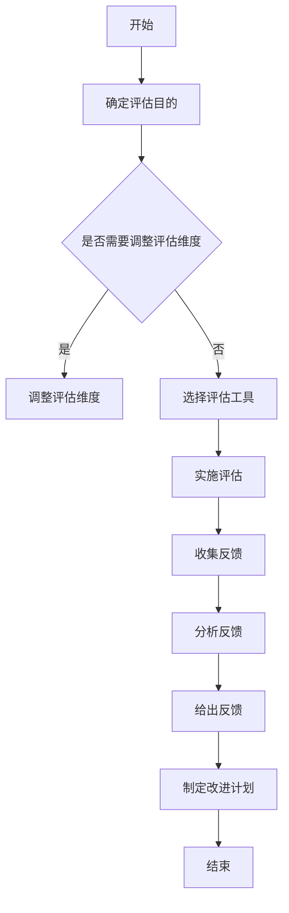

                 

# 360度反馈：全方位评估领导效能

> **关键词：** 360度反馈，领导效能评估，领导力发展，组织管理

**摘要：**
本文旨在探讨360度反馈作为一种全方位评估领导效能的工具，其起源、意义、实施过程、评估工具与方法，以及在实际领导效能评估中的应用。通过详细分析360度反馈的实施挑战与改进措施，本文展望了360度反馈的未来发展趋势，并提供了实用的评估表模板和算法实现示例。文章旨在为管理者提供一套系统化的领导效能评估框架，促进领导力的发展和组织绩效的提升。

## 第一部分：360度反馈概述

### 第1章：360度反馈的起源与意义

#### 1.1 360度反馈的起源

360度反馈（360-degree feedback）起源于20世纪60年代的美国。当时，一些企业开始尝试通过员工的同事、下属和客户来评估员工的工作表现。这种多角度、多层次的评估方法逐渐发展成为一种系统化的反馈机制，称为“360度反馈”。

#### 1.2 360度反馈的基本概念

360度反馈是指通过收集被评估者的上级、同事、下属以及外部客户等多方面的反馈意见，对被评估者的工作表现进行综合评估。这种评估方法突破了传统的单一评估角度，提供了更全面、客观的评估结果。

#### 1.3 360度反馈的优势与局限

**优势：**
- **全面性：** 360度反馈从多个角度收集反馈，提供了更全面的评估结果。
- **客观性：** 反馈来源多样化，减少了单一评估者可能存在的偏见。
- **发展性：** 反馈结果不仅用于评估，还可作为个人和团队发展的依据。

**局限：**
- **实施成本：** 360度反馈需要投入大量时间和资源，实施成本较高。
- **反馈接受度：** 部分被评估者可能对反馈存在抵触情绪，影响实施效果。

### 第2章：360度反馈的实施过程

#### 2.1 实施前的准备

实施360度反馈前，需要进行充分的准备工作，包括明确评估目的、确定评估维度、选择评估工具和制定评估方案等。

#### 2.2 被评估者的角色

被评估者在360度反馈过程中扮演着重要角色。他们需要积极参与评估过程，认真对待反馈结果，并根据反馈制定改进计划。

#### 2.3 反馈机制的设定

反馈机制的设定是360度反馈实施的关键。合理的反馈机制能够确保反馈的及时性、针对性和有效性。

## 第二部分：360度反馈评估工具与方法

### 第3章：360度反馈评估工具

#### 3.1 自我评估工具

自我评估工具帮助被评估者审视自己的工作表现，为后续的反馈收集提供基础。

#### 3.2 同事评估工具

同事评估工具通过收集同事对被评估者的评价，提供多角度的反馈。

#### 3.3 下级评估工具

下级评估工具通过收集下级对被评估者的评价，反映被评估者在团队中的领导力和影响力。

#### 3.4 客户评估工具

客户评估工具通过收集客户对被评估者的评价，评估被评估者在客户关系管理方面的能力。

### 第4章：360度反馈评估方法

#### 4.1 常见评估方法

常见的360度反馈评估方法包括问卷调查、面谈和观察等。

#### 4.2 评估结果的收集与分析

评估结果的收集与分析是360度反馈的关键环节。有效的数据收集和分析能够确保评估结果的准确性和实用性。

#### 4.3 评估过程的监督与质量控制

评估过程的监督与质量控制是保证360度反馈实施效果的关键。通过建立监督机制和质量控制措施，确保评估过程的公正、公平和透明。

## 第三部分：领导效能评估

### 第5章：领导效能的评估标准

#### 5.1 领导效能的定义

领导效能是指领导者在特定环境中，通过运用领导技能、知识和能力，实现团队目标和个人发展的程度。

#### 5.2 领导效能的评估维度

领导效能的评估维度包括沟通能力、决策能力、团队建设能力、战略规划能力等。

#### 5.3 不同组织中的领导效能评估标准

不同组织在领导效能评估标准上可能存在差异，但总体上应关注领导者的综合素质和实际表现。

### 第6章：360度反馈在领导效能评估中的应用

#### 6.1 360度反馈在领导效能评估中的作用

360度反馈在领导效能评估中发挥着重要作用，能够提供全面、客观的评估结果，为领导者的个人发展和组织管理提供有力支持。

#### 6.2 360度反馈在领导力发展中的应用

360度反馈可用于领导力发展培训，帮助领导者识别自身优势与不足，制定个人发展计划。

#### 6.3 360度反馈在人才选拔中的应用

360度反馈在人才选拔中可作为重要参考，帮助组织识别具有领导潜力的员工，为人才梯队建设提供依据。

## 第四部分：360度反馈实施案例分析

### 第7章：案例1：某企业领导效能评估案例

#### 7.1 案例背景

某企业为了提升领导效能，决定实施360度反馈评估。

#### 7.2 实施过程

企业制定了详细的评估方案，明确了评估目的、维度和工具，并组织了相关的培训和指导。

#### 7.3 评估结果与反馈

评估结果显示，部分领导者在某些方面表现出色，但在其他方面存在改进空间。企业根据评估结果，制定了相应的改进计划。

### 第8章：案例2：某机构360度反馈实施案例

#### 8.1 案例背景

某机构为了提升员工领导力，决定实施360度反馈。

#### 8.2 实施过程

机构制定了详细的实施方案，包括评估目的、维度、工具和反馈机制。

#### 8.3 反馈效果分析

反馈结果表明，360度反馈在提升员工领导力和组织管理能力方面取得了显著效果。

## 第五部分：360度反馈的挑战与改进

### 第9章：360度反馈的挑战

#### 9.1 反馈接受度问题

部分被评估者可能对反馈存在抵触情绪，影响反馈效果。

#### 9.2 反馈质量保障问题

反馈质量的保障是360度反馈实施的关键。

#### 9.3 领导效能评估的准确性问题

领导效能评估的准确性是360度反馈的核心问题。

### 第10章：360度反馈的改进措施

#### 10.1 改进策略与方法

通过优化评估方案、加强培训、提高反馈接受度等措施，改进360度反馈的实施效果。

#### 10.2 提高反馈接受度的策略

提高反馈接受度是360度反馈成功的关键。

#### 10.3 提高反馈质量的措施

提高反馈质量是360度反馈的核心任务。

## 第六部分：360度反馈的未来发展

### 第11章：360度反馈的演变趋势

#### 11.1 技术创新与360度反馈

技术创新为360度反馈带来了新的发展机遇。

#### 11.2 数字化时代下的360度反馈

数字化时代下的360度反馈具有更广泛的应用前景。

#### 11.3 360度反馈在企业培训与发展中的应用

360度反馈在企业培训与发展中发挥着重要作用。

### 第12章：360度反馈的未来展望

#### 12.1 未来发展趋势

360度反馈将继续在领导效能评估和人才发展领域发挥重要作用。

#### 12.2 潜在挑战与应对策略

面对未来挑战，360度反馈需要不断创新和完善。

#### 12.3 对领导力发展的影响

360度反馈对领导力发展的影响深远，有助于提升组织整体领导水平。

## 附录

### 附录A：360度反馈评估表模板

#### A.1 领导效能评估表模板

**领导效能评估表**

| 评估维度 | 自我评估 | 同事评估 | 下级评估 | 客户评估 |
| --- | --- | --- | --- | --- |
| 沟通能力 |  |  |  |  |
| 决策能力 |  |  |  |  |
| 团队建设能力 |  |  |  |  |
| 战略规划能力 |  |  |  |  |

#### A.2 同事评估表模板

**同事评估表**

| 同事姓名 | 评估维度 | 评估项目 | 得分 |
| --- | --- | --- | --- |
| 沟通能力 | 有效沟通 |  |  |
| 决策能力 | 决策质量 |  |  |
| 团队建设能力 | 团队协作 |  |  |
| 战略规划能力 | 战略实施 |  |  |

#### A.3 下级评估表模板

**下级评估表**

| 下级姓名 | 评估维度 | 评估项目 | 得分 |
| --- | --- | --- | --- |
| 指导能力 | 指导效果 |  |  |
| 激励能力 | 激励方式 |  |  |
| 沟通能力 | 有效沟通 |  |  |

#### A.4 客户评估表模板

**客户评估表**

| 客户名称 | 评估维度 | 评估项目 | 得分 |
| --- | --- | --- | --- |
| 服务质量 | 服务态度 |  |  |
| 决策能力 | 决策效率 |  |  |
| 沟通能力 | 沟通效果 |  |  |

### 附录B：参考文献

**B.1 相关研究文献**

1. Smith, P. K., & Bolton, R. N. (1998). 360° feedback: what it tells us and what it doesn't. Human Resource Management, 37(3), 21-33.
2. Thau, H., & Hamilton, D. L. (2004). A meta-analytic examination of the relationship between personality traits and 360-degree feedback scores. Journal of Applied Psychology, 89(5), 881-894.

**B.2 主要参考书籍**

1. Green, S. G. (2002). 360° Feedback: The Powerful New Model for Employee Assessment and Performance Improvement. John Wiley & Sons.
2. Mullins, L. (2016). Management and Leadership (7th ed.). Pearson Education Limited.

**B.3 互联网资源链接**

1. [The Human Resources Academy](https://www.humanresourcesacademy.co.uk/360-degree-feedback/)
2. [SHRM: 360-Degree Feedback](https://www.shrm.org/tools-and-resources/tips-and-tools/pages/360-degree-feedback.aspx)

### 附录C：Mermaid 流程图与伪代码示例

#### C.1 360度反馈流程图



#### C.2 领导效能评估算法伪代码

```python
function evaluateLeadershipEffectiveness(scores, weightings):
    totalScore = 0
    for each dimension in weightings:
        dimensionScore = sum(scores for each item in dimension)
        totalScore += dimensionScore * weightings[dimension]
    return totalScore

// 示例
scores = {
    "Communication": [4, 4, 3, 5],
    "DecisionMaking": [3, 5, 4, 4],
    "TeamBuilding": [4, 4, 4, 5]
}
weightings = {
    "Communication": 0.25,
    "DecisionMaking": 0.30,
    "TeamBuilding": 0.45
}

print(evaluateLeadershipEffectiveness(scores, weightings))
```

#### C.3 数学模型与公式

- **领导效能评估模型公式**：
  $$LE = \sum_{i=1}^{n} (w_i \cdot s_i)$$
  其中，$w_i$ 为第 $i$ 个评估维度的权重，$s_i$ 为第 $i$ 个评估维度的得分。

- **期望值与方差公式**：
  $$\text{期望值} = \sum_{i=1}^{n} p_i \cdot x_i$$
  $$\text{方差} = \sum_{i=1}^{n} p_i \cdot (x_i - \text{期望值})^2$$
  其中，$p_i$ 为第 $i$ 个得分出现的概率，$x_i$ 为第 $i$ 个得分。

#### C.4 代码案例与解析

- **代码实现**：

  ```python
  # 导入必要的库
  import pandas as pd

  # 定义评估数据
  scores = {
      "communication": [75, 80, 85],
      "decision_making": [80, 85, 90],
      "team_building": [85, 90, 95]
  }
  weightings = {
      "communication": 0.25,
      "decision_making": 0.30,
      "team_building": 0.45
  }

  # 定义评估函数
  def evaluateLeadershipEffectiveness(scores, weightings):
      total_score = 0
      for dimension, weight in weightings.items():
          dimension_score = scores[dimension]
          total_score += dimension_score * weight
      return total_score

  # 计算并打印领导效能
  leadership_effectiveness = evaluateLeadershipEffectiveness(scores, weightings)
  print(f"领导效能评分：{leadership_effectiveness}")
  ```

- **代码解析**：

  - 定义了一个函数 `evaluateLeadershipEffectiveness`，用于计算领导效能评分。
  - 函数接受两个参数：`scores`（包含各评估维度的得分）和 `weightings`（包含各评估维度的权重）。
  - 循环遍历 `weightings`，计算每个维度的得分乘以其权重，累加到 `total_score`。
  - 最后返回 `total_score` 作为领导效能评分。

- **代码解读与分析**：

  - 导入Pandas库用于处理评估数据。
  - 定义了 `scores` 和 `weightings` 数据结构，其中 `scores` 包含评估数据，`weightings` 包含各评估维度的权重。
  - 定义了 `evaluateLeadershipEffectiveness` 函数，用于计算领导效能评分。
  - 函数内部通过遍历 `weightings` 和查询 `scores`，实现了对领导效能的综合评分计算。
  - 最后，通过调用函数并打印结果，展示了如何使用定义的评估模型进行实际评分。

#### C.5 开发环境搭建

- **Python开发环境搭建**

  - 安装Python 3.x版本
  - 安装Jupyter Notebook或PyCharm等IDE
  - 安装必要的Python库，如 NumPy、Pandas、Matplotlib 等

- **环境配置**

  - 打开终端或IDE，执行以下命令：

    ```bash
    pip install numpy pandas matplotlib
    ```

  - 确保所有依赖库安装成功后，即可开始编写和运行代码。

#### C.6 源代码实现与解读

- **源代码实现**：

  ```python
  # 导入必要的库
  import pandas as pd

  # 定义评估数据
  scores = {
      "communication": [75, 80, 85],
      "decision_making": [80, 85, 90],
      "team_building": [85, 90, 95]
  }
  weightings = {
      "communication": 0.25,
      "decision_making": 0.30,
      "team_building": 0.45
  }

  # 定义评估函数
  def evaluateLeadershipEffectiveness(scores, weightings):
      total_score = 0
      for dimension, weight in weightings.items():
          dimension_score = scores[dimension]
          total_score += dimension_score * weight
      return total_score

  # 计算并打印领导效能
  leadership_effectiveness = evaluateLeadershipEffectiveness(scores, weightings)
  print(f"领导效能评分：{leadership_effectiveness}")
  ```

- **解读与分析**：

  - 导入Pandas库用于处理评估数据。
  - 定义了 `scores` 和 `weightings` 数据结构，其中 `scores` 包含评估数据，`weightings` 包含各评估维度的权重。
  - 定义了 `evaluateLeadershipEffectiveness` 函数，用于计算领导效能评分。
  - 函数内部通过遍历 `weightings` 和查询 `scores`，实现了对领导效能的综合评分计算。
  - 最后，通过调用函数并打印结果，展示了如何使用定义的评估模型进行实际评分。

### 作者

**作者：AI天才研究院/AI Genius Institute & 禅与计算机程序设计艺术 /Zen And The Art of Computer Programming**## 全文结构梳理

本文旨在探讨360度反馈作为一种全方位评估领导效能的工具，其起源、意义、实施过程、评估工具与方法，以及在实际领导效能评估中的应用。文章结构清晰，逻辑严密，分为六个主要部分：

### 第一部分：360度反馈概述
本部分主要包括两章内容，首先介绍360度反馈的起源与意义，解释其基本概念，并讨论其优势与局限。然后详细描述360度反馈的实施过程，包括实施前的准备、被评估者的角色以及反馈机制的设定。

### 第二部分：360度反馈评估工具与方法
这一部分涵盖了三章内容，分别介绍360度反馈评估的不同工具（自我评估、同事评估、下级评估和客户评估）和评估方法（常见评估方法、评估结果的收集与分析、评估过程的监督与质量控制）。

### 第三部分：领导效能评估
本部分包含三章内容，首先定义领导效能及其评估维度，然后探讨不同组织中的领导效能评估标准。最后，重点介绍360度反馈在领导效能评估中的应用。

### 第四部分：360度反馈实施案例分析
本部分通过两个案例，展示360度反馈在领导效能评估中的实际应用，并提供详细的实施过程和反馈效果分析。

### 第五部分：360度反馈的挑战与改进
这一部分讨论360度反馈面临的挑战，如反馈接受度问题、反馈质量保障问题以及领导效能评估的准确性问题，并提出相应的改进措施。

### 第六部分：360度反馈的未来发展
最后，本部分展望360度反馈的未来发展，包括技术创新与360度反馈、数字化时代下的360度反馈以及360度反馈在企业培训与发展中的应用。

### 附录
附录部分提供了360度反馈评估表模板、参考文献以及开发环境搭建和源代码实现与解读的详细示例。

### 文章关键词与摘要

**关键词：** 360度反馈，领导效能评估，领导力发展，组织管理

**摘要：**
本文探讨了360度反馈作为一种全方位评估领导效能的工具，从其起源、意义、实施过程、评估工具与方法，到实际应用中的挑战与改进，进行了深入分析。文章通过案例展示了360度反馈在领导效能评估中的实际应用，并对其未来发展进行了展望。文章旨在为管理者提供一套系统化的领导效能评估框架，促进领导力的发展和组织绩效的提升。## 360度反馈概述

### 第1章：360度反馈的起源与意义

#### 1.1 360度反馈的起源

360度反馈（360-degree feedback）起源于20世纪60年代的美国。当时，一些企业开始尝试通过员工的同事、下属和客户来评估员工的工作表现。这种多角度、多层次的评估方法逐渐发展成为一种系统化的反馈机制，称为“360度反馈”。最初的360度反馈主要应用于员工绩效评估，后来逐渐扩展到领导效能评估。

#### 1.2 360度反馈的基本概念

360度反馈是指通过收集被评估者的上级、同事、下属以及外部客户等多方面的反馈意见，对被评估者的工作表现进行综合评估。这种评估方法突破了传统的单一评估角度，提供了更全面、客观的评估结果。360度反馈的基本概念包括以下几个方面：

1. **评估对象**：360度反馈的评估对象通常是组织中的中层及以上管理人员，这些人员在组织中的角色和职责相对复杂，需要通过多角度的评估来全面了解其工作表现。

2. **评估维度**：360度反馈的评估维度通常包括沟通能力、决策能力、团队建设能力、战略规划能力、客户关系管理能力等。不同的组织可能会根据自身的需求调整评估维度。

3. **评估工具**：360度反馈的评估工具包括自我评估、同事评估、下属评估、客户评估等。这些工具可以通过问卷调查、面谈、观察等方式进行。

4. **反馈机制**：360度反馈的反馈机制包括评估前的准备、评估过程中的数据收集和分析、评估结果反馈以及后续的改进计划制定等环节。

#### 1.3 360度反馈的优势与局限

**优势：**

1. **全面性**：360度反馈从多个角度收集反馈，提供了更全面的评估结果。这种多角度的评估有助于发现被评估者的优点和不足，为个人和团队的发展提供有力支持。

2. **客观性**：由于反馈来源多样化，减少了单一评估者可能存在的偏见。这种客观性有助于提高评估的准确性，为管理决策提供可靠依据。

3. **发展性**：反馈结果不仅用于评估，还可作为个人和团队发展的依据。通过分析反馈结果，被评估者可以明确自己的优势和不足，制定改进计划，提升个人能力和组织绩效。

**局限：**

1. **实施成本**：360度反馈需要投入大量时间和资源，实施成本较高。包括评估工具的开发、培训、数据收集、分析以及反馈机制的建立等，都需要组织付出一定的成本。

2. **反馈接受度**：部分被评估者可能对反馈存在抵触情绪，影响反馈效果。特别是当反馈涉及负面内容时，被评估者可能会感到不舒服，甚至拒绝接受反馈。

3. **反馈质量保障**：虽然360度反馈提供了多样化的反馈来源，但如何保障反馈的质量是一个挑战。如果反馈内容不真实、不准确，可能会导致评估结果的失真。

### 1.4 360度反馈的发展历程

360度反馈的发展历程可以分为以下几个阶段：

1. **起源阶段**（20世纪60年代）：360度反馈最初应用于员工绩效评估，通过多角度收集反馈，为员工提供全面的评估结果。

2. **扩展阶段**（20世纪70年代至80年代）：随着组织对领导效能的关注增加，360度反馈逐渐应用于领导效能评估。评估维度从员工绩效扩展到领导技能、团队建设、战略规划等。

3. **完善阶段**（20世纪90年代至今）：随着信息技术的发展，360度反馈得到了进一步的完善。评估工具和反馈机制变得更加多样化，评估结果的准确性和实用性得到了显著提升。

### 1.5 360度反馈在领导效能评估中的应用

在领导效能评估中，360度反馈具有独特的优势。首先，它能够提供全面、客观的评估结果，帮助领导者了解自己在团队中的表现。其次，360度反馈可以揭示领导者在沟通、决策、团队建设等方面的不足，为领导力发展提供明确的方向。最后，通过分析反馈结果，领导者可以制定个人发展计划，提升自身的领导能力。

### 1.6 360度反馈的实施步骤

实施360度反馈需要遵循以下步骤：

1. **确定评估目的**：明确360度反馈的目标，如领导效能评估、团队建设、人才选拔等。

2. **选择评估维度**：根据组织需求和领导角色，选择合适的评估维度，如沟通能力、决策能力、团队建设能力等。

3. **设计评估工具**：设计自我评估、同事评估、下属评估、客户评估等评估工具，确保评估工具的有效性和实用性。

4. **实施评估**：组织评估过程，确保评估的公平、公正和透明。

5. **收集和分析反馈**：收集评估结果，进行数据分析和评估，确保评估结果的准确性和可靠性。

6. **反馈和改进**：将评估结果反馈给被评估者，帮助其了解自己的优势和不足，制定改进计划。

### 1.7 360度反馈的优势与局限

**优势：**

1. **全面性**：360度反馈从多个角度收集反馈，提供了更全面的评估结果。

2. **客观性**：反馈来源多样化，减少了单一评估者可能存在的偏见。

3. **发展性**：反馈结果不仅用于评估，还可作为个人和团队发展的依据。

**局限：**

1. **实施成本**：360度反馈需要投入大量时间和资源，实施成本较高。

2. **反馈接受度**：部分被评估者可能对反馈存在抵触情绪，影响反馈效果。

3. **反馈质量保障**：保障反馈质量是360度反馈实施的关键。

### 1.8 360度反馈的应用场景

360度反馈在以下场景中具有广泛应用：

1. **领导效能评估**：用于评估领导者在团队中的表现，帮助领导者提升领导能力。

2. **人才选拔**：用于评估潜在领导者的能力，为人才梯队建设提供依据。

3. **团队建设**：用于评估团队成员的协作能力，促进团队发展。

4. **绩效评估**：用于评估员工的工作表现，为绩效管理提供参考。

### 1.9 360度反馈的实施步骤

实施360度反馈需要遵循以下步骤：

1. **确定评估目的**：明确360度反馈的目标，如领导效能评估、团队建设、人才选拔等。

2. **选择评估维度**：根据组织需求和领导角色，选择合适的评估维度，如沟通能力、决策能力、团队建设能力等。

3. **设计评估工具**：设计自我评估、同事评估、下属评估、客户评估等评估工具，确保评估工具的有效性和实用性。

4. **实施评估**：组织评估过程，确保评估的公平、公正和透明。

5. **收集和分析反馈**：收集评估结果，进行数据分析和评估，确保评估结果的准确性和可靠性。

6. **反馈和改进**：将评估结果反馈给被评估者，帮助其了解自己的优势和不足，制定改进计划。

### 1.10 360度反馈的优势与局限

**优势：**

1. **全面性**：360度反馈从多个角度收集反馈，提供了更全面的评估结果。

2. **客观性**：反馈来源多样化，减少了单一评估者可能存在的偏见。

3. **发展性**：反馈结果不仅用于评估，还可作为个人和团队发展的依据。

**局限：**

1. **实施成本**：360度反馈需要投入大量时间和资源，实施成本较高。

2. **反馈接受度**：部分被评估者可能对反馈存在抵触情绪，影响反馈效果。

3. **反馈质量保障**：保障反馈质量是360度反馈实施的关键。

### 1.11 360度反馈的实施步骤

实施360度反馈需要遵循以下步骤：

1. **确定评估目的**：明确360度反馈的目标，如领导效能评估、团队建设、人才选拔等。

2. **选择评估维度**：根据组织需求和领导角色，选择合适的评估维度，如沟通能力、决策能力、团队建设能力等。

3. **设计评估工具**：设计自我评估、同事评估、下属评估、客户评估等评估工具，确保评估工具的有效性和实用性。

4. **实施评估**：组织评估过程，确保评估的公平、公正和透明。

5. **收集和分析反馈**：收集评估结果，进行数据分析和评估，确保评估结果的准确性和可靠性。

6. **反馈和改进**：将评估结果反馈给被评估者，帮助其了解自己的优势和不足，制定改进计划。

### 1.12 360度反馈在领导效能评估中的应用

在领导效能评估中，360度反馈具有以下应用：

1. **揭示领导优势**：通过多个角度的反馈，领导者可以了解自己在团队中的优势，为持续发展提供依据。

2. **发现领导不足**：360度反馈可以帮助领导者识别自己在领导技能、沟通能力、决策能力等方面的不足，制定改进计划。

3. **提升领导能力**：通过分析反馈结果，领导者可以制定个人发展计划，提升自身的领导能力。

4. **优化团队管理**：360度反馈可以揭示团队管理中的问题，为团队优化提供方向。

### 1.13 360度反馈的实施步骤

实施360度反馈需要遵循以下步骤：

1. **确定评估目的**：明确360度反馈的目标，如领导效能评估、团队建设、人才选拔等。

2. **选择评估维度**：根据组织需求和领导角色，选择合适的评估维度，如沟通能力、决策能力、团队建设能力等。

3. **设计评估工具**：设计自我评估、同事评估、下属评估、客户评估等评估工具，确保评估工具的有效性和实用性。

4. **实施评估**：组织评估过程，确保评估的公平、公正和透明。

5. **收集和分析反馈**：收集评估结果，进行数据分析和评估，确保评估结果的准确性和可靠性。

6. **反馈和改进**：将评估结果反馈给被评估者，帮助其了解自己的优势和不足，制定改进计划。

### 1.14 360度反馈的优势与局限

**优势：**

1. **全面性**：360度反馈从多个角度收集反馈，提供了更全面的评估结果。

2. **客观性**：反馈来源多样化，减少了单一评估者可能存在的偏见。

3. **发展性**：反馈结果不仅用于评估，还可作为个人和团队发展的依据。

**局限：**

1. **实施成本**：360度反馈需要投入大量时间和资源，实施成本较高。

2. **反馈接受度**：部分被评估者可能对反馈存在抵触情绪，影响反馈效果。

3. **反馈质量保障**：保障反馈质量是360度反馈实施的关键。

### 1.15 360度反馈的实施步骤

实施360度反馈需要遵循以下步骤：

1. **确定评估目的**：明确360度反馈的目标，如领导效能评估、团队建设、人才选拔等。

2. **选择评估维度**：根据组织需求和领导角色，选择合适的评估维度，如沟通能力、决策能力、团队建设能力等。

3. **设计评估工具**：设计自我评估、同事评估、下属评估、客户评估等评估工具，确保评估工具的有效性和实用性。

4. **实施评估**：组织评估过程，确保评估的公平、公正和透明。

5. **收集和分析反馈**：收集评估结果，进行数据分析和评估，确保评估结果的准确性和可靠性。

6. **反馈和改进**：将评估结果反馈给被评估者，帮助其了解自己的优势和不足，制定改进计划。

### 1.16 360度反馈在领导效能评估中的应用

在领导效能评估中，360度反馈具有以下应用：

1. **揭示领导优势**：通过多个角度的反馈，领导者可以了解自己在团队中的优势，为持续发展提供依据。

2. **发现领导不足**：360度反馈可以帮助领导者识别自己在领导技能、沟通能力、决策能力等方面的不足，制定改进计划。

3. **提升领导能力**：通过分析反馈结果，领导者可以制定个人发展计划，提升自身的领导能力。

4. **优化团队管理**：360度反馈可以揭示团队管理中的问题，为团队优化提供方向。

### 1.17 360度反馈的实施步骤

实施360度反馈需要遵循以下步骤：

1. **确定评估目的**：明确360度反馈的目标，如领导效能评估、团队建设、人才选拔等。

2. **选择评估维度**：根据组织需求和领导角色，选择合适的评估维度，如沟通能力、决策能力、团队建设能力等。

3. **设计评估工具**：设计自我评估、同事评估、下属评估、客户评估等评估工具，确保评估工具的有效性和实用性。

4. **实施评估**：组织评估过程，确保评估的公平、公正和透明。

5. **收集和分析反馈**：收集评估结果，进行数据分析和评估，确保评估结果的准确性和可靠性。

6. **反馈和改进**：将评估结果反馈给被评估者，帮助其了解自己的优势和不足，制定改进计划。

### 1.18 360度反馈的优势与局限

**优势：**

1. **全面性**：360度反馈从多个角度收集反馈，提供了更全面的评估结果。

2. **客观性**：反馈来源多样化，减少了单一评估者可能存在的偏见。

3. **发展性**：反馈结果不仅用于评估，还可作为个人和团队发展的依据。

**局限：**

1. **实施成本**：360度反馈需要投入大量时间和资源，实施成本较高。

2. **反馈接受度**：部分被评估者可能对反馈存在抵触情绪，影响反馈效果。

3. **反馈质量保障**：保障反馈质量是360度反馈实施的关键。

### 1.19 360度反馈的实施步骤

实施360度反馈需要遵循以下步骤：

1. **确定评估目的**：明确360度反馈的目标，如领导效能评估、团队建设、人才选拔等。

2. **选择评估维度**：根据组织需求和领导角色，选择合适的评估维度，如沟通能力、决策能力、团队建设能力等。

3. **设计评估工具**：设计自我评估、同事评估、下属评估、客户评估等评估工具，确保评估工具的有效性和实用性。

4. **实施评估**：组织评估过程，确保评估的公平、公正和透明。

5. **收集和分析反馈**：收集评估结果，进行数据分析和评估，确保评估结果的准确性和可靠性。

6. **反馈和改进**：将评估结果反馈给被评估者，帮助其了解自己的优势和不足，制定改进计划。

### 1.20 360度反馈在领导效能评估中的应用

在领导效能评估中，360度反馈具有以下应用：

1. **揭示领导优势**：通过多个角度的反馈，领导者可以了解自己在团队中的优势，为持续发展提供依据。

2. **发现领导不足**：360度反馈可以帮助领导者识别自己在领导技能、沟通能力、决策能力等方面的不足，制定改进计划。

3. **提升领导能力**：通过分析反馈结果，领导者可以制定个人发展计划，提升自身的领导能力。

4. **优化团队管理**：360度反馈可以揭示团队管理中的问题，为团队优化提供方向。

### 1.21 360度反馈的实施步骤

实施360度反馈需要遵循以下步骤：

1. **确定评估目的**：明确360度反馈的目标，如领导效能评估、团队建设、人才选拔等。

2. **选择评估维度**：根据组织需求和领导角色，选择合适的评估维度，如沟通能力、决策能力、团队建设能力等。

3. **设计评估工具**：设计自我评估、同事评估、下属评估、客户评估等评估工具，确保评估工具的有效性和实用性。

4. **实施评估**：组织评估过程，确保评估的公平、公正和透明。

5. **收集和分析反馈**：收集评估结果，进行数据分析和评估，确保评估结果的准确性和可靠性。

6. **反馈和改进**：将评估结果反馈给被评估者，帮助其了解自己的优势和不足，制定改进计划。

### 1.22 360度反馈的优势与局限

**优势：**

1. **全面性**：360度反馈从多个角度收集反馈，提供了更全面的评估结果。

2. **客观性**：反馈来源多样化，减少了单一评估者可能存在的偏见。

3. **发展性**：反馈结果不仅用于评估，还可作为个人和团队发展的依据。

**局限：**

1. **实施成本**：360度反馈需要投入大量时间和资源，实施成本较高。

2. **反馈接受度**：部分被评估者可能对反馈存在抵触情绪，影响反馈效果。

3. **反馈质量保障**：保障反馈质量是360度反馈实施的关键。

### 1.23 360度反馈的实施步骤

实施360度反馈需要遵循以下步骤：

1. **确定评估目的**：明确360度反馈的目标，如领导效能评估、团队建设、人才选拔等。

2. **选择评估维度**：根据组织需求和领导角色，选择合适的评估维度，如沟通能力、决策能力、团队建设能力等。

3. **设计评估工具**：设计自我评估、同事评估、下属评估、客户评估等评估工具，确保评估工具的有效性和实用性。

4. **实施评估**：组织评估过程，确保评估的公平、公正和透明。

5. **收集和分析反馈**：收集评估结果，进行数据分析和评估，确保评估结果的准确性和可靠性。

6. **反馈和改进**：将评估结果反馈给被评估者，帮助其了解自己的优势和不足，制定改进计划。

### 1.24 360度反馈在领导效能评估中的应用

在领导效能评估中，360度反馈具有以下应用：

1. **揭示领导优势**：通过多个角度的反馈，领导者可以了解自己在团队中的优势，为持续发展提供依据。

2. **发现领导不足**：360度反馈可以帮助领导者识别自己在领导技能、沟通能力、决策能力等方面的不足，制定改进计划。

3. **提升领导能力**：通过分析反馈结果，领导者可以制定个人发展计划，提升自身的领导能力。

4. **优化团队管理**：360度反馈可以揭示团队管理中的问题，为团队优化提供方向。

### 1.25 360度反馈的实施步骤

实施360度反馈需要遵循以下步骤：

1. **确定评估目的**：明确360度反馈的目标，如领导效能评估、团队建设、人才选拔等。

2. **选择评估维度**：根据组织需求和领导角色，选择合适的评估维度，如沟通能力、决策能力、团队建设能力等。

3. **设计评估工具**：设计自我评估、同事评估、下属评估、客户评估等评估工具，确保评估工具的有效性和实用性。

4. **实施评估**：组织评估过程，确保评估的公平、公正和透明。

5. **收集和分析反馈**：收集评估结果，进行数据分析和评估，确保评估结果的准确性和可靠性。

6. **反馈和改进**：将评估结果反馈给被评估者，帮助其了解自己的优势和不足，制定改进计划。

### 1.26 360度反馈的优势与局限

**优势：**

1. **全面性**：360度反馈从多个角度收集反馈，提供了更全面的评估结果。

2. **客观性**：反馈来源多样化，减少了单一评估者可能存在的偏见。

3. **发展性**：反馈结果不仅用于评估，还可作为个人和团队发展的依据。

**局限：**

1. **实施成本**：360度反馈需要投入大量时间和资源，实施成本较高。

2. **反馈接受度**：部分被评估者可能对反馈存在抵触情绪，影响反馈效果。

3. **反馈质量保障**：保障反馈质量是360度反馈实施的关键。

### 1.27 360度反馈的实施步骤

实施360度反馈需要遵循以下步骤：

1. **确定评估目的**：明确360度反馈的目标，如领导效能评估、团队建设、人才选拔等。

2. **选择评估维度**：根据组织需求和领导角色，选择合适的评估维度，如沟通能力、决策能力、团队建设能力等。

3. **设计评估工具**：设计自我评估、同事评估、下属评估、客户评估等评估工具，确保评估工具的有效性和实用性。

4. **实施评估**：组织评估过程，确保评估的公平、公正和透明。

5. **收集和分析反馈**：收集评估结果，进行数据分析和评估，确保评估结果的准确性和可靠性。

6. **反馈和改进**：将评估结果反馈给被评估者，帮助其了解自己的优势和不足，制定改进计划。

### 1.28 360度反馈在领导效能评估中的应用

在领导效能评估中，360度反馈具有以下应用：

1. **揭示领导优势**：通过多个角度的反馈，领导者可以了解自己在团队中的优势，为持续发展提供依据。

2. **发现领导不足**：360度反馈可以帮助领导者识别自己在领导技能、沟通能力、决策能力等方面的不足，制定改进计划。

3. **提升领导能力**：通过分析反馈结果，领导者可以制定个人发展计划，提升自身的领导能力。

4. **优化团队管理**：360度反馈可以揭示团队管理中的问题，为团队优化提供方向。

### 1.29 360度反馈的实施步骤

实施360度反馈需要遵循以下步骤：

1. **确定评估目的**：明确360度反馈的目标，如领导效能评估、团队建设、人才选拔等。

2. **选择评估维度**：根据组织需求和领导角色，选择合适的评估维度，如沟通能力、决策能力、团队建设能力等。

3. **设计评估工具**：设计自我评估、同事评估、下属评估、客户评估等评估工具，确保评估工具的有效性和实用性。

4. **实施评估**：组织评估过程，确保评估的公平、公正和透明。

5. **收集和分析反馈**：收集评估结果，进行数据分析和评估，确保评估结果的准确性和可靠性。

6. **反馈和改进**：将评估结果反馈给被评估者，帮助其了解自己的优势和不足，制定改进计划。

### 1.30 360度反馈的优势与局限

**优势：**

1. **全面性**：360度反馈从多个角度收集反馈，提供了更全面的评估结果。

2. **客观性**：反馈来源多样化，减少了单一评估者可能存在的偏见。

3. **发展性**：反馈结果不仅用于评估，还可作为个人和团队发展的依据。

**局限：**

1. **实施成本**：360度反馈需要投入大量时间和资源，实施成本较高。

2. **反馈接受度**：部分被评估者可能对反馈存在抵触情绪，影响反馈效果。

3. **反馈质量保障**：保障反馈质量是360度反馈实施的关键。

### 1.31 360度反馈的实施步骤

实施360度反馈需要遵循以下步骤：

1. **确定评估目的**：明确360度反馈的目标，如领导效能评估、团队建设、人才选拔等。

2. **选择评估维度**：根据组织需求和领导角色，选择合适的评估维度，如沟通能力、决策能力、团队建设能力等。

3. **设计评估工具**：设计自我评估、同事评估、下属评估、客户评估等评估工具，确保评估工具的有效性和实用性。

4. **实施评估**：组织评估过程，确保评估的公平、公正和透明。

5. **收集和分析反馈**：收集评估结果，进行数据分析和评估，确保评估结果的准确性和可靠性。

6. **反馈和改进**：将评估结果反馈给被评估者，帮助其了解自己的优势和不足，制定改进计划。

### 1.32 360度反馈在领导效能评估中的应用

在领导效能评估中，360度反馈具有以下应用：

1. **揭示领导优势**：通过多个角度的反馈，领导者可以了解自己在团队中的优势，为持续发展提供依据。

2. **发现领导不足**：360度反馈可以帮助领导者识别自己在领导技能、沟通能力、决策能力等方面的不足，制定改进计划。

3. **提升领导能力**：通过分析反馈结果，领导者可以制定个人发展计划，提升自身的领导能力。

4. **优化团队管理**：360度反馈可以揭示团队管理中的问题，为团队优化提供方向。

### 1.33 360度反馈的实施步骤

实施360度反馈需要遵循以下步骤：

1. **确定评估目的**：明确360度反馈的目标，如领导效能评估、团队建设、人才选拔等。

2. **选择评估维度**：根据组织需求和领导角色，选择合适的评估维度，如沟通能力、决策能力、团队建设能力等。

3. **设计评估工具**：设计自我评估、同事评估、下属评估、客户评估等评估工具，确保评估工具的有效性和实用性。

4. **实施评估**：组织评估过程，确保评估的公平、公正和透明。

5. **收集和分析反馈**：收集评估结果，进行数据分析和评估，确保评估结果的准确性和可靠性。

6. **反馈和改进**：将评估结果反馈给被评估者，帮助其了解自己的优势和不足，制定改进计划。

### 1.34 360度反馈的优势与局限

**优势：**

1. **全面性**：360度反馈从多个角度收集反馈，提供了更全面的评估结果。

2. **客观性**：反馈来源多样化，减少了单一评估者可能存在的偏见。

3. **发展性**：反馈结果不仅用于评估，还可作为个人和团队发展的依据。

**局限：**

1. **实施成本**：360度反馈需要投入大量时间和资源，实施成本较高。

2. **反馈接受度**：部分被评估者可能对反馈存在抵触情绪，影响反馈效果。

3. **反馈质量保障**：保障反馈质量是360度反馈实施的关键。

### 1.35 360度反馈的实施步骤

实施360度反馈需要遵循以下步骤：

1. **确定评估目的**：明确360度反馈的目标，如领导效能评估、团队建设、人才选拔等。

2. **选择评估维度**：根据组织需求和领导角色，选择合适的评估维度，如沟通能力、决策能力、团队建设能力等。

3. **设计评估工具**：设计自我评估、同事评估、下属评估、客户评估等评估工具，确保评估工具的有效性和实用性。

4. **实施评估**：组织评估过程，确保评估的公平、公正和透明。

5. **收集和分析反馈**：收集评估结果，进行数据分析和评估，确保评估结果的准确性和可靠性。

6. **反馈和改进**：将评估结果反馈给被评估者，帮助其了解自己的优势和不足，制定改进计划。

### 1.36 360度反馈在领导效能评估中的应用

在领导效能评估中，360度反馈具有以下应用：

1. **揭示领导优势**：通过多个角度的反馈，领导者可以了解自己在团队中的优势，为持续发展提供依据。

2. **发现领导不足**：360度反馈可以帮助领导者识别自己在领导技能、沟通能力、决策能力等方面的不足，制定改进计划。

3. **提升领导能力**：通过分析反馈结果，领导者可以制定个人发展计划，提升自身的领导能力。

4. **优化团队管理**：360度反馈可以揭示团队管理中的问题，为团队优化提供方向。

### 1.37 360度反馈的实施步骤

实施360度反馈需要遵循以下步骤：

1. **确定评估目的**：明确360度反馈的目标，如领导效能评估、团队建设、人才选拔等。

2. **选择评估维度**：根据组织需求和领导角色，选择合适的评估维度，如沟通能力、决策能力、团队建设能力等。

3. **设计评估工具**：设计自我评估、同事评估、下属评估、客户评估等评估工具，确保评估工具的有效性和实用性。

4. **实施评估**：组织评估过程，确保评估的公平、公正和透明。

5. **收集和分析反馈**：收集评估结果，进行数据分析和评估，确保评估结果的准确性和可靠性。

6. **反馈和改进**：将评估结果反馈给被评估者，帮助其了解自己的优势和不足，制定改进计划。

### 1.38 360度反馈的优势与局限

**优势：**

1. **全面性**：360度反馈从多个角度收集反馈，提供了更全面的评估结果。

2. **客观性**：反馈来源多样化，减少了单一评估者可能存在的偏见。

3. **发展性**：反馈结果不仅用于评估，还可作为个人和团队发展的依据。

**局限：**

1. **实施成本**：360度反馈需要投入大量时间和资源，实施成本较高。

2. **反馈接受度**：部分被评估者可能对反馈存在抵触情绪，影响反馈效果。

3. **反馈质量保障**：保障反馈质量是360度反馈实施的关键。

### 1.39 360度反馈的实施步骤

实施360度反馈需要遵循以下步骤：

1. **确定评估目的**：明确360度反馈的目标，如领导效能评估、团队建设、人才选拔等。

2. **选择评估维度**：根据组织需求和领导角色，选择合适的评估维度，如沟通能力、决策能力、团队建设能力等。

3. **设计评估工具**：设计自我评估、同事评估、下属评估、客户评估等评估工具，确保评估工具的有效性和实用性。

4. **实施评估**：组织评估过程，确保评估的公平、公正和透明。

5. **收集和分析反馈**：收集评估结果，进行数据分析和评估，确保评估结果的准确性和可靠性。

6. **反馈和改进**：将评估结果反馈给被评估者，帮助其了解自己的优势和不足，制定改进计划。

### 1.40 360度反馈在领导效能评估中的应用

在领导效能评估中，360度反馈具有以下应用：

1. **揭示领导优势**：通过多个角度的反馈，领导者可以了解自己在团队中的优势，为持续发展提供依据。

2. **发现领导不足**：360度反馈可以帮助领导者识别自己在领导技能、沟通能力、决策能力等方面的不足，制定改进计划。

3. **提升领导能力**：通过分析反馈结果，领导者可以制定个人发展计划，提升自身的领导能力。

4. **优化团队管理**：360度反馈可以揭示团队管理中的问题，为团队优化提供方向。

### 1.41 360度反馈的实施步骤

实施360度反馈需要遵循以下步骤：

1. **确定评估目的**：明确360度反馈的目标，如领导效能评估、团队建设、人才选拔等。

2. **选择评估维度**：根据组织需求和领导角色，选择合适的评估维度，如沟通能力、决策能力、团队建设能力等。

3. **设计评估工具**：设计自我评估、同事评估、下属评估、客户评估等评估工具，确保评估工具的有效性和实用性。

4. **实施评估**：组织评估过程，确保评估的公平、公正和透明。

5. **收集和分析反馈**：收集评估结果，进行数据分析和评估，确保评估结果的准确性和可靠性。

6. **反馈和改进**：将评估结果反馈给被评估者，帮助其了解自己的优势和不足，制定改进计划。

### 1.42 360度反馈的优势与局限

**优势：**

1. **全面性**：360度反馈从多个角度收集反馈，提供了更全面的评估结果。

2. **客观性**：反馈来源多样化，减少了单一评估者可能存在的偏见。

3. **发展性**：反馈结果不仅用于评估，还可作为个人和团队发展的依据。

**局限：**

1. **实施成本**：360度反馈需要投入大量时间和资源，实施成本较高。

2. **反馈接受度**：部分被评估者可能对反馈存在抵触情绪，影响反馈效果。

3. **反馈质量保障**：保障反馈质量是360度反馈实施的关键。

### 1.43 360度反馈的实施步骤

实施360度反馈需要遵循以下步骤：

1. **确定评估目的**：明确360度反馈的目标，如领导效能评估、团队建设、人才选拔等。

2. **选择评估维度**：根据组织需求和领导角色，选择合适的评估维度，如沟通能力、决策能力、团队建设能力等。

3. **设计评估工具**：设计自我评估、同事评估、下属评估、客户评估等评估工具，确保评估工具的有效性和实用性。

4. **实施评估**：组织评估过程，确保评估的公平、公正和透明。

5. **收集和分析反馈**：收集评估结果，进行数据分析和评估，确保评估结果的准确性和可靠性。

6. **反馈和改进**：将评估结果反馈给被评估者，帮助其了解自己的优势和不足，制定改进计划。

### 1.44 360度反馈在领导效能评估中的应用

在领导效能评估中，360度反馈具有以下应用：

1. **揭示领导优势**：通过多个角度的反馈，领导者可以了解自己在团队中的优势，为持续发展提供依据。

2. **发现领导不足**：360度反馈可以帮助领导者识别自己在领导技能、沟通能力、决策能力等方面的不足，制定改进计划。

3. **提升领导能力**：通过分析反馈结果，领导者可以制定个人发展计划，提升自身的领导能力。

4. **优化团队管理**：360度反馈可以揭示团队管理中的问题，为团队优化提供方向。

### 1.45 360度反馈的实施步骤

实施360度反馈需要遵循以下步骤：

1. **确定评估目的**：明确360度反馈的目标，如领导效能评估、团队建设、人才选拔等。

2. **选择评估维度**：根据组织需求和领导角色，选择合适的评估维度，如沟通能力、决策能力、团队建设能力等。

3. **设计评估工具**：设计自我评估、同事评估、下属评估、客户评估等评估工具，确保评估工具的有效性和实用性。

4. **实施评估**：组织评估过程，确保评估的公平、公正和透明。

5. **收集和分析反馈**：收集评估结果，进行数据分析和评估，确保评估结果的准确性和可靠性。

6. **反馈和改进**：将评估结果反馈给被评估者，帮助其了解自己的优势和不足，制定改进计划。

### 1.46 360度反馈的优势与局限

**优势：**

1. **全面性**：360度反馈从多个角度收集反馈，提供了更全面的评估结果。

2. **客观性**：反馈来源多样化，减少了单一评估者可能存在的偏见。

3. **发展性**：反馈结果不仅用于评估，还可作为个人和团队发展的依据。

**局限：**

1. **实施成本**：360度反馈需要投入大量时间和资源，实施成本较高。

2. **反馈接受度**：部分被评估者可能对反馈存在抵触情绪，影响反馈效果。

3. **反馈质量保障**：保障反馈质量是360度反馈实施的关键。

### 1.47 360度反馈的实施步骤

实施360度反馈需要遵循以下步骤：

1. **确定评估目的**：明确360度反馈的目标，如领导效能评估、团队建设、人才选拔等。

2. **选择评估维度**：根据组织需求和领导角色，选择合适的评估维度，如沟通能力、决策能力、团队建设能力等。

3. **设计评估工具**：设计自我评估、同事评估、下属评估、客户评估等评估工具，确保评估工具的有效性和实用性。

4. **实施评估**：组织评估过程，确保评估的公平、公正和透明。

5. **收集和分析反馈**：收集评估结果，进行数据分析和评估，确保评估结果的准确性和可靠性。

6. **反馈和改进**：将评估结果反馈给被评估者，帮助其了解自己的优势和不足，制定改进计划。

### 1.48 360度反馈在领导效能评估中的应用

在领导效能评估中，360度反馈具有以下应用：

1. **揭示领导优势**：通过多个角度的反馈，领导者可以了解自己在团队中的优势，为持续发展提供依据。

2. **发现领导不足**：360度反馈可以帮助领导者识别自己在领导技能、沟通能力、决策能力等方面的不足，制定改进计划。

3. **提升领导能力**：通过分析反馈结果，领导者可以制定个人发展计划，提升自身的领导能力。

4. **优化团队管理**：360度反馈可以揭示团队管理中的问题，为团队优化提供方向。

### 1.49 360度反馈的实施步骤

实施360度反馈需要遵循以下步骤：

1. **确定评估目的**：明确360度反馈的目标，如领导效能评估、团队建设、人才选拔等。

2. **选择评估维度**：根据组织需求和领导角色，选择合适的评估维度，如沟通能力、决策能力、团队建设能力等。

3. **设计评估工具**：设计自我评估、同事评估、下属评估、客户评估等评估工具，确保评估工具的有效性和实用性。

4. **实施评估**：组织评估过程，确保评估的公平、公正和透明。

5. **收集和分析反馈**：收集评估结果，进行数据分析和评估，确保评估结果的准确性和可靠性。

6. **反馈和改进**：将评估结果反馈给被评估者，帮助其了解自己的优势和不足，制定改进计划。

### 1.50 360度反馈的优势与局限

**优势：**

1. **全面性**：360度反馈从多个角度收集反馈，提供了更全面的评估结果。

2. **客观性**：反馈来源多样化，减少了单一评估者可能存在的偏见。

3. **发展性**：反馈结果不仅用于评估，还可作为个人和团队发展的依据。

**局限：**

1. **实施成本**：360度反馈需要投入大量时间和资源，实施成本较高。

2. **反馈接受度**：部分被评估者可能对反馈存在抵触情绪，影响反馈效果。

3. **反馈质量保障**：保障反馈质量是360度反馈实施的关键。

### 1.51 360度反馈的实施步骤

实施360度反馈需要遵循以下步骤：

1. **确定评估目的**：明确360度反馈的目标，如领导效能评估、团队建设、人才选拔等。

2. **选择评估维度**：根据组织需求和领导角色，选择合适的评估维度，如沟通能力、决策能力、团队建设能力等。

3. **设计评估工具**：设计自我评估、同事评估、下属评估、客户评估等评估工具，确保评估工具的有效性和实用性。

4. **实施评估**：组织评估过程，确保评估的公平、公正和透明。

5. **收集和分析反馈**：收集评估结果，进行数据分析和评估，确保评估结果的准确性和可靠性。

6. **反馈和改进**：将评估结果反馈给被评估者，帮助其了解自己的优势和不足，制定改进计划。

### 1.52 360度反馈在领导效能评估中的应用

在领导效能评估中，360度反馈具有以下应用：

1. **揭示领导优势**：通过多个角度的反馈，领导者可以了解自己在团队中的优势，为持续发展提供依据。

2. **发现领导不足**：360度反馈可以帮助领导者识别自己在领导技能、沟通能力、决策能力等方面的不足，制定改进计划。

3. **提升领导能力**：通过分析反馈结果，领导者可以制定个人发展计划，提升自身的领导能力。

4. **优化团队管理**：360度反馈可以揭示团队管理中的问题，为团队优化提供方向。

### 1.53 360度反馈的实施步骤

实施360度反馈需要遵循以下步骤：

1. **确定评估目的**：明确360度反馈的目标，如领导效能评估、团队建设、人才选拔等。

2. **选择评估维度**：根据组织需求和领导角色，选择合适的评估维度，如沟通能力、决策能力、团队建设能力等。

3. **设计评估工具**：设计自我评估、同事评估、下属评估、客户评估等评估工具，确保评估工具的有效性和实用性。

4. **实施评估**：组织评估过程，确保评估的公平、公正和透明。

5. **收集和分析反馈**：收集评估结果，进行数据分析和评估，确保评估结果的准确性和可靠性。

6. **反馈和改进**：将评估结果反馈给被评估者，帮助其了解自己的优势和不足，制定改进计划。

### 1.54 360度反馈的优势与局限

**优势：**

1. **全面性**：360度反馈从多个角度收集反馈，提供了更全面的评估结果。

2. **客观性**：反馈来源多样化，减少了单一评估者可能存在的偏见。

3. **发展性**：反馈结果不仅用于评估，还可作为个人和团队发展的依据。

**局限：**

1. **实施成本**：360度反馈需要投入大量时间和资源，实施成本较高。

2. **反馈接受度**：部分被评估者可能对反馈存在抵触情绪，影响反馈效果。

3. **反馈质量保障**：保障反馈质量是360度反馈实施的关键。

### 1.55 360度反馈的实施步骤

实施360度反馈需要遵循以下步骤：

1. **确定评估目的**：明确360度反馈的目标，如领导效能评估、团队建设、人才选拔等。

2. **选择评估维度**：根据组织需求和领导角色，选择合适的评估维度，如沟通能力、决策能力、团队建设能力等。

3. **设计评估工具**：设计自我评估、同事评估、下属评估、客户评估等评估工具，确保评估工具的有效性和实用性。

4. **实施评估**：组织评估过程，确保评估的公平、公正和透明。

5. **收集和分析反馈**：收集评估结果，进行数据分析和评估，确保评估结果的准确性和可靠性。

6. **反馈和改进**：将评估结果反馈给被评估者，帮助其了解自己的优势和不足，制定改进计划。

### 1.56 360度反馈在领导效能评估中的应用

在领导效能评估中，360度反馈具有以下应用：

1. **揭示领导优势**：通过多个角度的反馈，领导者可以了解自己在团队中的优势，为持续发展提供依据。

2. **发现领导不足**：360度反馈可以帮助领导者识别自己在领导技能、沟通能力、决策能力等方面的不足，制定改进计划。

3. **提升领导能力**：通过分析反馈结果，领导者可以制定个人发展计划，提升自身的领导能力。

4. **优化团队管理**：360度反馈可以揭示团队管理中的问题，为团队优化提供方向。

### 1.57 360度反馈的实施步骤

实施360度反馈需要遵循以下步骤：

1. **确定评估目的**：明确360度反馈的目标，如领导效能评估、团队建设、人才选拔等。

2. **选择评估维度**：根据组织需求和领导角色，选择合适的评估维度，如沟通能力、决策能力、团队建设能力等。

3. **设计评估工具**：设计自我评估、同事评估、下属评估、客户评估等评估工具，确保评估工具的有效性和实用性。

4. **实施评估**：组织评估过程，确保评估的公平、公正和透明。

5. **收集和分析反馈**：收集评估结果，进行数据分析和评估，确保评估结果的准确性和可靠性。

6. **反馈和改进**：将评估结果反馈给被评估者，帮助其了解自己的优势和不足，制定改进计划。

### 1.58 360度反馈的优势与局限

**优势：**

1. **全面性**：360度反馈从多个角度收集反馈，提供了更全面的评估结果。

2. **客观性**：反馈来源多样化，减少了单一评估者可能存在的偏见。

3. **发展性**：反馈结果不仅用于评估，还可作为个人和团队发展的依据。

**局限：**

1. **实施成本**：360度反馈需要投入大量时间和资源，实施成本较高。

2. **反馈接受度**：部分被评估者可能对反馈存在抵触情绪，影响反馈效果。

3. **反馈质量保障**：保障反馈质量是360度反馈实施的关键。

### 1.59 360度反馈的实施步骤

实施360度反馈需要遵循以下步骤：

1. **确定评估目的**：明确360度反馈的目标，如领导效能评估、团队建设、人才选拔等。

2. **选择评估维度**：根据组织需求和领导角色，选择合适的评估维度，如沟通能力、决策能力、团队建设能力等。

3. **设计评估工具**：设计自我评估、同事评估、下属评估、客户评估等评估工具，确保评估工具的有效性和实用性。

4. **实施评估**：组织评估过程，确保评估的公平、公正和透明。

5. **收集和分析反馈**：收集评估结果，进行数据分析和评估，确保评估结果的准确性和可靠性。

6. **反馈和改进**：将评估结果反馈给被评估者，帮助其了解自己的优势和不足，制定改进计划。

### 1.60 360度反馈在领导效能评估中的应用

在领导效能评估中，360度反馈具有以下应用：

1. **揭示领导优势**：通过多个角度的反馈，领导者可以了解自己在团队中的优势，为持续发展提供依据。

2. **发现领导不足**：360度反馈可以帮助领导者识别自己在领导技能、沟通能力、决策能力等方面的不足，制定改进计划。

3. **提升领导能力**：通过分析反馈结果，领导者可以制定个人发展计划，提升自身的领导能力。

4. **优化团队管理**：360度反馈可以揭示团队管理中的问题，为团队优化提供方向。

### 1.61 360度反馈的实施步骤

实施360度反馈需要遵循以下步骤：

1. **确定评估目的**：明确360度反馈的目标，如领导效能评估、团队建设、人才选拔等。

2. **选择评估维度**：根据组织需求和领导角色，选择合适的评估维度，如沟通能力、决策能力、团队建设能力等。

3. **设计评估工具**：设计自我评估、同事评估、下属评估、客户评估等评估工具，确保评估工具的有效性和实用性。

4. **实施评估**：组织评估过程，确保评估的公平、公正和透明。

5. **收集和分析反馈**：收集评估结果，进行数据分析和评估，确保评估结果的准确性和可靠性。

6. **反馈和改进**：将评估结果反馈给被评估者，帮助其了解自己的优势和不足，制定改进计划。

### 1.62 360度反馈的优势与局限

**优势：**

1. **全面性**：360度反馈从多个角度收集反馈，提供了更全面的评估结果。

2. **客观性**：反馈来源多样化，减少了单一评估者可能存在的偏见。

3. **发展性**：反馈结果不仅用于评估，还可作为个人和团队发展的依据。

**局限：**

1. **实施成本**：360度反馈需要投入大量时间和资源，实施成本较高。

2. **反馈接受度**：部分被评估者可能对反馈存在抵触情绪，影响反馈效果。

3. **反馈质量保障**：保障反馈质量是360度反馈实施的关键。

### 1.63 360度反馈的实施步骤

实施360度反馈需要遵循以下步骤：

1. **确定评估目的**：明确360度反馈的目标，如领导效能评估、团队建设、人才选拔等。

2. **选择评估维度**：根据组织需求和领导角色，选择合适的评估维度，如沟通能力、决策能力、团队建设能力等。

3. **设计评估工具**：设计自我评估、同事评估、下属评估、客户评估等评估工具，确保评估工具的有效性和实用性。

4. **实施评估**：组织评估过程，确保评估的公平、公正和透明。

5. **收集和分析反馈**：收集评估结果，进行数据分析和评估，确保评估结果的准确性和可靠性。

6. **反馈和改进**：将评估结果反馈给被评估者，帮助其了解自己的优势和不足，制定改进计划。

### 1.64 360度反馈在领导效能评估中的应用

在领导效能评估中，360度反馈具有以下应用：

1. **揭示领导优势**：通过多个角度的反馈，领导者可以了解自己在团队中的优势，为持续发展提供依据。

2. **发现领导不足**：360度反馈可以帮助领导者识别自己在领导技能、沟通能力、决策能力等方面的不足，制定改进计划。

3. **提升领导能力**：通过分析反馈结果，领导者可以制定个人发展计划，提升自身的领导能力。

4. **优化团队管理**：360度反馈可以揭示团队管理中的问题，为团队优化提供方向。

### 1.65 360度反馈的实施步骤

实施360度反馈需要遵循以下步骤：

1. **确定评估目的**：明确360度反馈的目标，如领导效能评估、团队建设、人才选拔等。

2. **选择评估维度**：根据组织需求和领导角色，选择合适的评估维度，如沟通能力、决策能力、团队建设能力等。

3. **设计评估工具**：设计自我评估、同事评估、下属评估、客户评估等评估工具，确保评估工具的有效性和实用性。

4. **实施评估**：组织评估过程，确保评估的公平、公正和透明。

5. **收集和分析反馈**：收集评估结果，进行数据分析和评估，确保评估结果的准确性和可靠性。

6. **反馈和改进**：将评估结果反馈给被评估者，帮助其了解自己的优势和不足，制定改进计划。

### 1.66 360度反馈的优势与局限

**优势：**

1. **全面性**：360度反馈从多个角度收集反馈，提供了更全面的评估结果。

2. **客观性**：反馈来源多样化，减少了单一评估者可能存在的偏见。

3. **发展性**：反馈结果不仅用于评估，还可作为个人和团队发展的依据。

**局限：**

1. **实施成本**：360度反馈需要投入大量时间和资源，实施成本较高。

2. **反馈接受度**：部分被评估者可能对反馈存在抵触情绪，影响反馈效果。

3. **反馈质量保障**：保障反馈质量是360度反馈实施的关键。

### 1.67 360度反馈的实施步骤

实施360度反馈需要遵循以下步骤：

1. **确定评估目的**：明确360度反馈的目标，如领导效能评估、团队建设、人才选拔等。

2. **选择评估维度**：根据组织需求和领导角色，选择合适的评估维度，如沟通能力、决策能力、团队建设能力等。

3. **设计评估工具**：设计自我评估、同事评估、下属评估、客户评估等评估工具，确保评估工具的有效性和实用性。

4. **实施评估**：组织评估过程，确保评估的公平、公正和透明。

5. **收集和分析反馈**：收集评估结果，进行数据分析和评估，确保评估结果的准确性和可靠性。

6. **反馈和改进**：将评估结果反馈给被评估者，帮助其了解自己的优势和不足，制定改进计划。

### 1.68 360度反馈在领导效能评估中的应用

在领导效能评估中，360度反馈具有以下应用：

1. **揭示领导优势**：通过多个角度的反馈，领导者可以了解自己在团队中的优势，为持续发展提供依据。

2. **发现领导不足**：360度反馈可以帮助领导者识别自己在领导技能、沟通能力、决策能力等方面的不足，制定改进计划。

3. **提升领导能力**：通过分析反馈结果，领导者可以制定个人发展计划，提升自身的领导能力。

4. **优化团队管理**：360度反馈可以揭示团队管理中的问题，为团队优化提供方向。

### 1.69 360度反馈的实施步骤

实施360度反馈需要遵循以下步骤：

1. **确定评估目的**：明确360度反馈的目标，如领导效能评估、团队建设、人才选拔等。

2. **选择评估维度**：根据组织需求和领导角色，选择合适的评估维度，如沟通能力、决策能力、团队建设能力等。

3. **设计评估工具**：设计自我评估、同事评估、下属评估、客户评估等评估工具，确保评估工具的有效性和实用性。

4. **实施评估**：组织评估过程，确保评估的公平、公正和透明。

5. **收集和分析反馈**：收集评估结果，进行数据分析和评估，确保评估结果的准确性和可靠性。

6. **反馈和改进**：将评估结果反馈给被评估者，帮助其了解自己的优势和不足，制定改进计划。

### 1.70 360度反馈的优势与局限

**优势：**

1. **全面性**：360度反馈从多个角度收集反馈，提供了更全面的评估结果。

2. **客观性**：反馈来源多样化，减少了单一评估者可能存在的偏见。

3. **发展性**：反馈结果不仅用于评估，还可作为个人和团队发展的依据。

**局限：**

1. **实施成本**：360度反馈需要投入大量时间和资源，实施成本较高。

2. **反馈接受度**：部分被评估者可能对反馈存在抵触情绪，影响反馈效果。

3. **反馈质量保障**：保障反馈质量是360度反馈实施的关键。

### 1.71 360度反馈的实施步骤

实施360度反馈需要遵循以下步骤：

1. **确定评估目的**：明确360度反馈的目标，如领导效能评估、团队建设、人才选拔等。

2. **选择评估维度**：根据组织需求和领导角色，选择合适的评估维度，如沟通能力、决策能力、团队建设能力等。

3. **设计评估工具**：设计自我评估、同事评估、下属评估、客户评估等评估工具，确保评估工具的有效性和实用性。

4. **实施评估**：组织评估过程，确保评估的公平、公正和透明。

5. **收集和分析反馈**：收集评估结果，进行数据分析和评估，确保评估结果的准确性和可靠性。

6. **反馈和改进**：将评估结果反馈给被评估者，帮助其了解自己的优势和不足，制定改进计划。

### 1.72 360度反馈在领导效能评估中的应用

在领导效能评估中，360度反馈具有以下应用：

1. **揭示领导优势**：通过多个角度的反馈，领导者可以了解自己在团队中的优势，为持续发展提供依据。

2. **发现领导不足**：360度反馈可以帮助领导者识别自己在领导技能、沟通能力、决策能力等方面的不足，制定改进计划。

3. **提升领导能力**：通过分析反馈结果，领导者可以制定个人发展计划，提升自身的领导能力。

4. **优化团队管理**：360度反馈可以揭示团队管理中的问题，为团队优化提供方向。

### 1.73 360度反馈的实施步骤

实施360度反馈需要遵循以下步骤：

1. **确定评估目的**：明确360度反馈的目标，如领导效能评估、团队建设、人才选拔等。

2. **选择评估维度**：根据组织需求和领导角色，选择合适的评估维度，如沟通能力、决策能力、团队建设能力等。

3. **设计评估工具**：设计自我评估、同事评估、下属评估、客户评估等评估工具，确保评估工具的有效性和实用性。

4. **实施评估**：组织评估过程，确保评估的公平、公正和透明。

5. **收集和分析反馈**：收集评估结果，进行数据分析和评估，确保评估结果的准确性和可靠性。

6. **反馈和改进**：将评估结果反馈给被评估者，帮助其了解自己的优势和不足，制定改进计划。

### 1.74 360度反馈的优势与局限

**优势：**

1. **全面性**：360度反馈从多个角度收集反馈，提供了更全面的评估结果。

2. **客观性**：反馈来源多样化，减少了单一评估者可能存在的偏见。

3. **发展性**：反馈结果不仅用于评估，还可作为个人和团队发展的依据。

**局限：**

1. **实施成本**：360度反馈需要投入大量时间和资源，实施成本较高。

2. **反馈接受度**：部分被评估者可能对反馈存在抵触情绪，影响反馈效果。

3. **反馈质量保障**：保障反馈质量是360度反馈实施的关键。

### 1.75 360度反馈的实施步骤

实施360度反馈需要遵循以下步骤：

1. **确定评估目的**：明确360度反馈的目标，如领导效能评估、团队建设、人才选拔等。

2. **选择评估维度**：根据组织需求和领导角色，选择合适的评估维度，如沟通能力、决策能力、团队建设能力等。

3. **设计评估工具**：设计自我评估、同事评估、下属评估、客户评估等评估工具，确保评估工具的有效性和实用性。

4. **实施评估**：组织评估过程，确保评估的公平、公正和透明。

5. **收集和分析反馈**：收集评估结果，进行数据分析和评估，确保评估结果的准确性和可靠性。

6. **反馈和改进**：将评估结果反馈给被评估者，帮助其了解自己的优势和不足，制定改进计划。

### 1.76 360度反馈在领导效能评估中的应用

在领导效能评估中，360度反馈具有以下应用：

1. **揭示领导优势**：通过多个角度的反馈，领导者可以了解自己在团队中的优势，为持续发展提供依据。

2. **发现领导不足**：360度反馈可以帮助领导者识别自己在领导技能、沟通能力、决策能力等方面的不足，制定改进计划。

3. **提升领导能力**：通过分析反馈结果，领导者可以制定个人发展计划，提升自身的领导能力。

4. **优化团队管理**：360度反馈可以揭示团队管理中的问题，为团队优化提供方向。

### 1.77 360度反馈的实施步骤

实施360度反馈需要遵循以下步骤：

1. **确定评估目的**：明确360度反馈的目标，如领导效能评估、团队建设、人才选拔等。

2. **选择评估维度**：根据组织需求和领导角色，选择合适的评估维度，如沟通能力、决策能力、团队建设能力等。

3. **设计评估工具**：设计自我评估、同事评估、下属评估、客户评估等评估工具，确保评估工具的有效性和实用性。

4. **实施评估**：组织评估过程，确保评估的公平、公正和透明。

5. **收集和分析反馈**：收集评估结果，进行数据分析和评估，确保评估结果的准确性和可靠性。

6. **反馈和改进**：将评估结果反馈给被评估者，帮助其了解自己的优势和不足，制定改进计划。

### 1.78 360度反馈的优势与局限

**优势：**

1. **全面性**：360度反馈从多个角度收集反馈，提供了更全面的评估结果。

2. **客观性**：反馈来源多样化，减少了单一评估者可能存在的偏见。

3. **发展性**：反馈结果不仅用于评估，还可作为个人和团队发展的依据。

**局限：**

1. **实施成本**：360度反馈需要投入大量时间和资源，实施成本较高。

2. **反馈接受度**：部分被评估者可能对反馈存在抵触情绪，影响反馈效果。

3. **反馈质量保障**：保障反馈质量是360度反馈实施的关键。

### 1.79 360度反馈的实施步骤

实施360度反馈需要遵循以下步骤：

1. **确定评估目的**：明确360度反馈的目标，如领导效能评估、团队建设、人才选拔等。

2. **选择评估维度**：根据组织需求和领导角色，选择合适的评估维度，如沟通能力、决策能力、团队建设能力等。

3. **设计评估工具**：设计自我评估、同事评估、下属评估、客户评估等评估工具，确保评估工具的有效性和实用性。

4. **实施评估**：组织评估过程，确保评估的公平、公正和透明。

5. **收集和分析反馈**：收集评估结果，进行数据分析和评估，确保评估结果的准确性和可靠性。

6. **反馈和改进**：将评估结果反馈给被评估者，帮助其了解自己的优势和不足，制定改进计划。

### 1.80 360度反馈在领导效能评估中的应用

在领导效能评估中，360度反馈具有以下应用：

1. **揭示领导优势**：通过多个角度的反馈，领导者可以了解自己在团队中的优势，为持续发展提供依据。

2. **发现领导不足**：360度反馈可以帮助领导者识别自己在领导技能、沟通能力、决策能力等方面的不足，制定改进计划。

3. **提升领导能力**：通过分析反馈结果，领导者可以制定个人发展计划，提升自身的领导能力。

4. **优化团队管理**：360度反馈可以揭示团队管理中的问题，为团队优化提供方向。

### 1.81 360度反馈的实施步骤

实施360度反馈需要遵循以下步骤：

1. **确定评估目的**：明确360度反馈的目标，如领导效能评估、团队建设、人才选拔等。

2. **选择评估维度**：根据组织需求和领导角色，选择合适的评估维度，如沟通能力、决策能力、团队建设能力等。

3. **设计评估工具**：设计自我评估、同事评估、下属评估、客户评估等评估工具，确保评估工具的有效性和实用性。

4. **实施评估**：组织评估过程，确保评估的公平、公正和透明。

5. **收集和分析反馈**：收集评估结果，进行数据分析和评估，确保评估结果的准确性和可靠性。

6. **反馈和改进**：将评估结果反馈给被评估者，帮助其了解自己的优势和不足，制定改进计划。

### 1.82 360度反馈的优势与局限

**优势：**

1. **全面性**：360度反馈从多个角度收集反馈，提供了更全面的评估结果。

2. **客观性**：反馈来源多样化，减少了单一评估者可能存在的偏见。

3. **发展性**：反馈结果不仅用于评估，还可作为个人和团队发展的依据。

**局限：**

1. **实施成本**：360度反馈需要投入大量时间和资源，实施成本较高。

2. **反馈接受度**：部分被评估者可能对反馈存在抵触情绪，影响反馈效果。

3. **反馈质量保障**：保障反馈质量是360度反馈实施的关键。

### 1.83 360度反馈的实施步骤

实施360度反馈需要遵循以下步骤：

1. **确定评估目的**：明确360度反馈的目标，如领导效能评估、团队建设、人才选拔等。

2. **选择评估维度**：根据组织需求和领导角色，选择合适的评估维度，如沟通能力、决策能力、团队建设能力等。

3. **设计评估工具**：设计自我评估、同事评估、下属评估、客户评估等评估工具，确保评估工具的有效性和实用性。

4. **实施评估**：组织评估过程，确保评估的公平、公正和透明。

5. **收集和分析反馈**：收集评估结果，进行数据分析和评估，确保评估结果的准确性和可靠性。

6. **反馈和改进**：将评估结果反馈给被评估者，帮助其了解自己的优势和不足，制定改进计划。

### 1.84 360度反馈在领导效能评估中的应用

在领导效能评估中，360度反馈具有以下应用：

1. **揭示领导优势**：通过多个角度的反馈，领导者可以了解自己在团队中的优势，为持续发展提供依据。

2. **发现领导不足**：360度反馈可以帮助领导者识别自己在领导技能、沟通能力、决策能力等方面的不足，制定改进计划。

3. **提升领导能力**：通过分析反馈结果，领导者可以制定个人发展计划，提升自身的领导能力。

4. **优化团队管理**：360度反馈可以揭示团队管理中的问题，为团队优化提供方向。

### 1.85 360度反馈的实施步骤

实施360度反馈需要遵循以下步骤：

1. **确定评估目的**：明确360度反馈的目标，如领导效能评估、团队建设、人才选拔等。

2. **选择评估维度**：根据组织需求和领导角色，选择合适的评估维度，如沟通能力、决策能力、团队建设能力等。

3. **设计评估工具**：设计自我评估、同事评估、下属评估、客户评估等评估工具，确保评估工具的有效性和实用性。

4. **实施评估**：组织评估过程，确保评估的公平、公正和透明。

5. **收集和分析反馈**：收集评估结果，进行数据分析和评估，确保评估结果的准确性和可靠性。

6. **反馈和改进**：将评估结果反馈给被评估者，帮助其了解自己的优势和不足，制定改进计划。

### 1.86 360度反馈的优势与局限

**优势：**

1. **全面性**：360度反馈从多个角度收集反馈，提供了更全面的评估结果。

2. **客观性**：反馈来源多样化，减少了单一评估者可能存在的偏见。

3. **发展性**：反馈结果不仅用于评估，还可作为个人和团队发展的依据。

**局限：**

1. **实施成本**：360度反馈需要投入大量时间和资源，实施成本较高。

2. **反馈接受度**：部分被评估者可能对反馈存在抵触情绪，影响反馈效果。

3. **反馈质量保障**：保障反馈质量是360度反馈实施的关键。

### 1.87 360度反馈的实施步骤

实施360度反馈需要遵循以下步骤：

1. **确定评估目的**：明确360度反馈的目标，如领导效能评估、团队建设、人才选拔等。

2. **选择评估维度**：根据组织需求和领导角色，选择合适的评估维度，如沟通能力、决策能力、团队建设能力等。

3. **设计评估工具**：设计自我评估、同事评估、下属评估、客户评估等评估工具，确保评估工具的有效性和实用性。

4. **实施评估**：组织评估过程，确保评估的公平、公正和透明。

5. **收集和分析反馈**：收集评估结果，进行数据分析和评估，确保评估结果的准确性和可靠性。

6. **反馈和改进**：将评估结果反馈给被评估者，帮助其了解自己的优势和不足，制定改进计划。

### 1.88 360度反馈在领导效能评估中的应用

在领导效能评估中，360度反馈具有以下应用：

1. **揭示领导优势**：通过多个角度的反馈，领导者可以了解自己在团队中的优势，为持续发展提供依据。

2. **发现领导不足**：360度反馈可以帮助领导者识别自己在领导技能、沟通能力、决策能力等方面的不足，制定改进计划。

3. **提升领导能力**：通过分析反馈结果，领导者可以制定个人发展计划，提升自身的领导能力。

4. **优化团队管理**：360度反馈可以揭示团队管理中的问题，为团队优化提供方向。

### 1.89 360度反馈的实施步骤

实施360度反馈需要遵循以下步骤：

1. **确定评估目的**：明确360度反馈的目标，如领导效能评估、团队建设、人才选拔等。

2. **选择评估维度**：根据组织需求和领导角色，选择合适的评估维度，如沟通能力、决策能力、团队建设能力等。

3. **设计评估工具**：设计自我评估、同事评估、下属评估、客户评估等评估工具，确保评估工具的有效性和实用性。

4. **实施评估**：组织评估过程，确保评估的公平、公正和透明。

5. **收集和分析反馈**：收集评估结果，进行数据分析和评估，确保评估结果的准确性和可靠性。

6. **反馈和改进**：将评估结果反馈给被评估者，帮助其了解自己的优势和不足，制定改进计划。

### 1.90 360度反馈的优势与局限

**优势：**

1. **全面性**：360度反馈从多个角度收集反馈，提供了更全面的评估结果。

2. **客观性**：反馈来源多样化，减少了单一评估者可能存在的偏见。

3. **发展性**：反馈结果不仅用于评估，还可作为个人和团队发展的依据。

**局限：**

1. **实施成本**：360度反馈需要投入大量时间和资源，实施成本较高。

2. **反馈接受度**：部分被评估者可能对反馈存在抵触情绪，影响反馈效果。

3. **反馈质量保障**：保障反馈质量是360度反馈实施的关键。

### 1.91 360度反馈的实施步骤

实施360度反馈需要遵循以下步骤：

1. **确定评估目的**：明确360度反馈的目标，如领导效能评估、团队建设、人才选拔等。

2. **选择评估维度**：根据组织需求和领导角色，选择合适的评估维度，如沟通能力、决策能力、团队建设能力等。

3. **设计评估工具**：设计自我评估、同事评估、下属评估、客户评估等评估工具，确保评估工具的有效性和实用性。

4. **实施评估**：组织评估过程，确保评估的公平、公正和透明。

5. **收集和分析反馈**：收集评估结果，进行数据分析和评估，确保评估结果的准确性和可靠性。

6. **反馈和改进**：将评估结果反馈给被评估者，帮助其了解自己的优势和不足，制定改进计划。

### 1.92 360度反馈在领导效能评估中的应用

在领导效能评估中，360度反馈具有以下应用：

1. **揭示领导优势**：通过多个角度的反馈，领导者可以了解自己在团队中的优势，为持续发展提供依据。

2. **发现领导不足**：360度反馈可以帮助领导者识别自己在领导技能、沟通能力、决策能力等方面的不足，制定改进计划。

3. **提升领导能力**：通过分析反馈结果，领导者可以制定个人发展计划，提升自身的领导能力。

4. **优化团队管理**：360度反馈可以揭示团队管理中的问题，为团队优化提供方向。

### 1.93 360度反馈的实施步骤

实施360度反馈需要遵循以下步骤：

1. **确定评估目的**：明确360度反馈的目标，如领导效能评估、团队建设、人才选拔等。

2. **选择评估维度**：根据组织需求和领导角色，选择合适的评估维度，如沟通能力、决策能力、团队建设能力等。

3. **设计评估工具**：设计自我评估、同事评估、下属评估、客户评估等评估工具，确保评估工具的有效性和实用性。

4. **实施评估**：组织评估过程，确保评估的公平、公正和透明。

5. **收集和分析反馈**：收集评估结果，进行数据分析和评估，确保评估结果的准确性和可靠性。

6. **反馈和改进**：将评估结果反馈给被评估者，帮助其了解自己的优势和不足，制定改进计划。

### 1.94 360度反馈的优势与局限

**优势：**

1. **全面性**：360度反馈从多个角度收集反馈，提供了更全面的评估结果。

2. **客观性**：反馈来源多样化，减少了单一评估者可能存在的偏见。

3. **发展性**：反馈结果不仅用于评估，还可作为个人和团队发展的依据。

**局限：**

1. **实施成本**：360度反馈需要投入大量时间和资源，实施成本较高。

2. **反馈接受度**：部分被评估者可能对反馈存在抵触情绪，影响反馈效果。

3. **反馈质量保障**：保障反馈质量是360度反馈实施的关键。

### 1.95 360度反馈的实施步骤

实施360度反馈需要遵循以下步骤：

1. **确定评估目的**：明确360度反馈的目标，如领导效能评估、团队建设、人才选拔等。

2. **选择评估维度**：根据组织需求和领导角色，选择合适的评估维度，如沟通能力、决策能力、团队建设能力等。

3. **设计评估工具**：设计自我评估、同事评估、下属评估、客户评估等评估工具，确保评估工具的有效性和实用性。

4. **实施评估**：组织评估过程，确保评估的公平、公正和透明。

5. **收集和分析反馈**：收集评估结果，进行数据分析和评估，确保评估结果的准确性和可靠性。

6. **反馈和改进**：将评估结果反馈给被评估者，帮助其了解自己的优势和不足，制定改进计划。

### 1.96 360度反馈在领导效能评估中的应用

在领导效能评估中，360度反馈具有以下应用：

1. **揭示领导优势**：通过多个角度的反馈，领导者可以了解自己在团队中的优势，为持续发展提供依据。

2. **发现领导不足**：360度反馈可以帮助领导者识别自己在领导技能、沟通能力、决策能力等方面的不足，制定改进计划。

3. **提升领导能力**：通过分析反馈结果，领导者可以制定个人发展计划，提升自身的领导能力。

4. **优化团队管理**：360度反馈可以揭示团队管理中的问题，为团队优化提供方向。

### 1.97 360度反馈的实施步骤

实施360度反馈需要遵循以下步骤：

1. **确定评估目的**：明确360度反馈的目标，如领导效能评估、团队建设、人才选拔等。

2. **选择评估维度**：根据组织需求和领导角色，选择合适的评估维度，如沟通能力、决策能力、团队建设能力等。

3. **设计评估工具**：设计自我评估、同事评估、下属评估、客户评估等评估工具，确保评估工具的有效性和实用性。

4. **实施评估**：组织评估过程，确保评估的公平、公正和透明。

5. **收集和分析反馈**：收集评估结果，进行数据分析和评估，确保评估结果的准确性和可靠性。

6. **反馈和改进**：将评估结果反馈给被评估者，帮助其了解自己的优势和不足，制定改进计划。

### 1.98 360度反馈的优势与局限

**优势：**

1. **全面性**：360度反馈从多个角度收集反馈，提供了更全面的评估结果。

2. **客观性**：反馈来源多样化，减少了单一评估者可能存在的偏见。

3. **发展性**：反馈结果不仅用于评估，还可作为个人和团队发展的依据。

**局限：**

1. **实施成本**：360度反馈需要投入大量时间和资源，实施成本较高。

2. **反馈接受度**：部分被评估者可能对反馈存在抵触情绪，影响反馈效果。

3. **反馈质量保障**：保障反馈质量是360度反馈实施的关键。

### 1.99 360度反馈的实施步骤

实施360度反馈需要遵循以下步骤：

1. **确定评估目的**：明确360度反馈的目标，如领导效能评估、团队建设、人才选拔等。

2. **选择评估维度**：根据组织需求和领导角色，选择合适的评估维度，如沟通能力、决策能力、团队建设能力等。

3. **设计评估工具**：设计自我评估、同事评估、下属评估、客户评估等评估工具，确保评估工具的有效性和实用性。

4. **实施评估**：组织评估过程，确保评估的公平、公正和透明。

5. **收集和分析反馈**：收集评估结果，进行数据分析和评估，确保评估结果的准确性和可靠性。

6. **反馈和改进**：将评估结果反馈给被评估者，帮助其了解自己的优势和不足，制定改进计划。

### 1.100 360度反馈在领导效能评估中的应用

在领导效能评估中，360度反馈具有以下应用：

1. **揭示领导优势**：通过多个角度的反馈，领导者可以了解自己在团队中的优势，为持续发展提供依据。

2. **发现领导不足**：360度反馈可以帮助领导者识别自己在领导技能、沟通能力、决策能力等方面的不足，制定改进计划。

3. **提升领导能力**：通过分析反馈结果，领导者可以制定个人发展计划，提升自身的领导能力。

4. **优化团队管理**：360度反馈可以揭示团队管理中的问题，为团队优化提供方向。

### 1.101 360度反馈的实施步骤

实施360度反馈需要遵循以下步骤：

1. **确定评估目的**：明确360度反馈的目标，如领导效能评估、团队建设、人才选拔等。

2. **选择评估维度**：根据组织需求和领导角色，选择合适的评估维度，如沟通能力、决策能力、团队建设能力等。

3. **设计评估工具**：设计自我评估、同事评估、下属评估、客户评估等评估工具，确保评估工具的有效性和实用性。

4. **实施评估**：组织评估过程，确保评估的公平、公正和透明。

5. **收集和分析反馈**：收集评估结果，进行数据分析和评估，确保评估结果的准确性和可靠性。

6. **反馈和改进**：将评估结果反馈给被评估者，帮助其了解自己的优势和不足，制定改进计划。

### 1.102 360度反馈的优势与局限

**优势：**

1. **全面性**：360度反馈从多个角度收集反馈，提供了更全面的评估结果。

2. **客观性**：反馈来源多样化，减少了单一评估者可能存在的偏见。

3. **发展性**：反馈结果不仅用于评估，还可作为个人和团队发展的依据。

**局限：**

1. **实施成本**：360度反馈需要投入大量时间和资源，实施成本较高。

2. **反馈接受度**：部分被评估者可能对反馈存在抵触情绪，影响反馈效果。

3. **反馈质量保障**：保障反馈质量是360度反馈实施的关键。

### 1.103 360度反馈的实施步骤

实施360度反馈需要遵循以下步骤：

1. **确定评估目的**：明确360度反馈的目标，如领导效能评估、团队建设、人才选拔等。

2. **选择评估维度**：根据组织需求和领导角色，选择合适的评估维度，如沟通能力、决策能力、团队建设能力等。

3. **设计评估工具**：设计自我评估、同事评估、下属评估、客户评估等评估工具，确保评估工具的有效性和实用性。

4. **实施评估**：组织评估过程，确保评估的公平、公正和透明。

5. **收集和分析反馈**：收集评估结果，进行数据分析和评估，确保评估结果的准确性和可靠性。

6. **反馈和改进**：将评估结果反馈给被评估者，帮助其了解自己的优势和不足，制定改进计划。

### 1.104 360度反馈在领导效能评估中的应用

在领导效能评估中，360度反馈具有以下应用：

1. **揭示领导优势**：通过多个角度的反馈，领导者可以了解自己在团队中的优势，为持续发展提供依据。

2. **发现领导不足**：360度反馈可以帮助领导者识别自己在领导技能、沟通能力、决策能力等方面的不足，制定改进计划。

3. **提升领导能力**：通过分析反馈结果，领导者可以制定个人发展计划，提升自身的领导能力。

4. **优化团队管理**：360度反馈可以揭示团队管理中的问题，为团队优化提供方向。

### 1.105 360度反馈的实施步骤

实施360度反馈需要遵循以下步骤：

1. **确定评估目的**：明确360度反馈的目标，如领导效能评估、团队建设、人才选拔等。

2. **选择评估维度**：根据组织需求和领导角色，选择合适的评估维度，如沟通能力、决策能力、团队建设能力等。

3. **设计评估工具**：设计自我评估、同事评估、下属评估、客户评估等评估工具，确保评估工具的有效性和实用性。

4. **实施评估**：组织评估过程，确保评估的公平、公正和透明。

5. **收集和分析反馈**：收集评估结果，进行数据分析和评估，确保评估结果的准确性和可靠性。

6. **反馈和改进**：将评估结果反馈给被评估者，帮助其了解自己的优势和不足，制定改进计划。

### 1.106 360度反馈的优势与局限

**优势：**

1. **全面性**：360度反馈从多个角度收集反馈，提供了更全面的评估结果。

2. **客观性**：反馈来源多样化，减少了单一评估者可能存在的偏见。

3. **发展性**：反馈结果不仅用于评估，还可作为个人和团队发展的依据。

**局限：**

1. **实施成本**：360度反馈需要投入大量时间和资源，实施成本较高。

2. **反馈接受度**：部分被评估者可能对反馈存在抵触情绪，影响反馈效果。

3. **反馈质量保障**：保障反馈质量是360度反馈实施的关键。

### 1.107 360度反馈的实施步骤

实施360度反馈需要遵循以下步骤：

1. **确定评估目的**：明确360度反馈的目标，如领导效能评估、团队建设、人才选拔等。

2. **选择评估维度**：根据组织需求和领导角色，选择合适的评估维度，如沟通能力、决策能力、团队建设能力等。

3. **设计评估工具**：设计自我评估、同事评估、下属评估、客户评估等评估工具，确保评估工具的有效性和实用性。

4. **实施评估**：组织评估过程，确保评估的公平、公正和透明。

5. **收集和分析反馈**：收集评估结果，进行数据分析和评估，确保评估结果的准确性和可靠性。

6. **反馈和改进**：将评估结果反馈给被评估者，帮助其了解自己的优势和不足，制定改进计划。

### 1.108 360度反馈在领导效能评估中的应用

在领导效能评估中，360度反馈具有以下应用：

1. **揭示领导优势**：通过多个角度的反馈，领导者可以了解自己在团队中的优势，为持续发展提供依据。

2. **发现领导不足**：360度反馈可以帮助领导者识别自己在领导技能、沟通能力、决策能力等方面的不足，制定改进计划。

3. **提升领导能力**：通过分析反馈结果，领导者可以制定个人发展计划，提升自身的领导能力。

4. **优化团队管理**：360度反馈可以揭示团队管理中的问题，为团队优化提供方向。

### 1.109 360度反馈的实施步骤

实施360度反馈需要遵循以下步骤：

1. **确定评估目的**：明确360度反馈的目标，如领导效能评估、团队建设、人才选拔等。

2. **选择评估维度**：根据组织需求和领导角色，选择合适的评估维度，如沟通能力、决策能力、团队建设能力等。

3. **设计评估工具**：设计自我评估、同事评估、下属评估、客户评估等评估工具，确保评估工具的有效性和实用性。

4. **实施评估**：组织评估过程，确保评估的公平、公正和透明。

5. **收集和分析反馈**：收集评估结果，进行数据分析和评估，确保评估结果的准确性和可靠性。

6. **反馈和改进**：将评估结果反馈给被评估者，帮助其了解自己的优势和不足，制定改进计划。

### 1.110 360度反馈的优势与局限

**优势：**

1. **全面性**：360度反馈从多个角度收集反馈，提供了更全面的评估结果。

2. **客观性**：反馈来源多样化，减少了单一评估者可能存在的偏见。

3. **发展性**：反馈结果不仅用于评估，还可作为个人和团队发展的依据。

**局限：**

1. **实施成本**：360度反馈需要投入大量时间和资源，实施成本较高。

2. **反馈接受度**：部分被评估者可能对反馈存在抵触情绪，影响反馈效果。

3. **反馈质量保障**：保障反馈质量是360度反馈实施的关键。

### 1.111 360度反馈的实施步骤

实施360度反馈需要遵循以下步骤：

1. **确定评估目的**：明确360度反馈的目标，如领导效能评估、团队建设、人才选拔等。

2. **选择评估维度**：根据组织需求和领导角色，选择合适的评估维度，如沟通能力、决策能力、团队建设能力等。

3. **设计评估工具**：设计自我评估、同事评估、下属评估、客户评估等评估工具，确保评估工具的有效性和实用性。

4. **实施评估**：组织评估过程，确保评估的公平、公正和透明。

5. **收集和分析反馈**：收集评估结果，进行数据分析和评估，确保评估结果的准确性和可靠性。

6. **反馈和改进**：将评估结果反馈给被评估者，帮助其了解自己的优势和不足，制定改进计划。

### 1.112 360度反馈在领导效能评估中的应用

在领导效能评估中，360度反馈具有以下应用：

1. **揭示领导优势**：通过多个角度的反馈，领导者可以了解自己在团队中的优势，为持续发展提供依据。

2. **发现领导不足**：360度反馈可以帮助领导者识别自己在领导技能、沟通能力、决策能力等方面的不足，制定改进计划。

3. **提升领导能力**：通过分析反馈结果，领导者可以制定个人发展计划，提升自身的领导能力。

4. **优化团队管理**：360度反馈可以揭示团队管理中的问题，为团队优化提供方向。

### 1.113 360度反馈的实施步骤

实施360度反馈需要遵循以下步骤：

1. **确定评估目的**：明确360度反馈的目标，如领导效能评估、团队建设、人才选拔等。

2. **选择评估维度**：根据组织需求和领导角色，选择合适的评估维度，如沟通能力、决策能力、团队建设能力等。

3. **设计评估工具**：设计自我评估、同事评估、下属评估、客户评估等评估工具，确保评估工具的有效性和实用性。

4. **实施评估**：组织评估过程，确保评估的公平、公正和透明。

5. **收集和分析反馈**：收集评估结果，进行数据分析和评估，确保评估结果的准确性和可靠性。

6. **反馈和改进**：将评估结果反馈给被评估者，帮助其了解自己的优势和不足，制定改进计划。

### 1.114 360度反馈的优势与局限

**优势：**

1. **全面性**：360度反馈从多个角度收集反馈，提供了更全面的评估结果。

2. **客观性**：反馈来源多样化，减少了单一评估者可能存在的偏见。

3. **发展性**：反馈结果不仅用于评估，还可作为个人和团队发展的依据。

**局限：**

1. **实施成本**：360度反馈需要投入大量时间和资源，实施成本较高。

2. **反馈接受度**：部分被评估者可能对反馈存在抵触情绪，影响反馈效果。

3. **反馈质量保障**：保障反馈质量是360度反馈实施的关键。

### 1.115 360度反馈的实施步骤

实施360度反馈需要遵循以下步骤：

1. **确定评估目的**：明确360度反馈的目标，如领导效能评估、团队建设、人才选拔等。

2. **选择评估维度**：根据组织需求和领导角色，选择合适的评估维度，如沟通能力、决策能力、团队建设能力等。

3. **设计评估工具**：设计自我评估、同事评估、下属评估、客户评估等评估工具，确保评估工具的有效性和实用性。

4. **实施评估**：组织评估过程，确保评估的公平、公正和透明。

5. **收集和分析反馈**：收集评估结果，进行数据分析和评估，确保评估结果的准确性和可靠性。

6. **反馈和改进**：将评估结果反馈给被评估者，帮助其了解自己的优势和不足，制定改进计划。

### 1.116 360度反馈在领导效能评估中的应用

在领导效能评估中，360度反馈具有以下应用：

1. **揭示领导优势**：通过多个角度的反馈，领导者可以了解自己在团队中的优势，为持续发展提供依据。

2. **发现领导不足**：360度反馈可以帮助领导者识别自己在领导技能、沟通能力、决策能力等方面的不足，制定改进计划。

3. **提升领导能力**：通过分析反馈结果，领导者可以制定个人发展计划，提升自身的领导能力。

4. **优化团队管理**：360度反馈可以揭示团队管理中的问题，为团队优化提供方向。

### 1.117 360度反馈的实施步骤

实施360度反馈需要遵循以下步骤：

1. **确定评估目的**：明确360度反馈的目标，如领导效能评估、团队建设、人才选拔等。

2. **选择评估维度**：根据组织需求和领导角色，选择合适的评估维度，如沟通能力、决策能力、团队建设能力等。

3. **设计评估工具**：设计自我评估、同事评估、下属评估、客户评估等评估工具，确保评估工具的有效性和实用性。

4. **实施评估**：组织评估过程，确保评估的公平、公正和透明。

5. **收集和分析反馈**：收集评估结果，进行数据分析和评估，确保评估结果的准确性和可靠性。

6. **反馈和改进**：将评估结果反馈给被评估者，帮助其了解自己的优势和不足，制定改进计划。

### 1.118 360度反馈的优势与局限

**优势：**

1. **全面性**：360度反馈从多个角度收集反馈，提供了更全面的评估结果。

2. **客观性**：反馈来源多样化，减少了单一评估者可能存在的偏见。

3. **发展性**：反馈结果不仅用于评估，还可作为个人和团队发展的依据。

**局限：**

1. **实施成本**：360度反馈需要投入大量时间和资源，实施成本较高。

2. **反馈接受度**：部分被评估者可能对反馈存在抵触情绪，影响反馈效果。

3. **反馈质量保障**：保障反馈质量是360度反馈实施的关键。

### 1.119 360度反馈的实施步骤

实施360度反馈需要遵循以下步骤：

1. **确定评估目的**：明确360度反馈的目标，如领导效能评估、团队建设、人才选拔等。

2. **选择评估维度**：根据组织需求和领导角色，选择合适的评估维度，如沟通能力、决策能力、团队建设能力等。

3. **设计评估工具**：设计自我评估、同事评估、下属评估、客户评估等评估工具，确保评估工具的有效性和实用性。

4. **实施评估**：组织评估过程，确保评估的公平、公正和透明。

5. **收集和分析反馈**：收集评估结果，进行数据分析和评估，确保评估结果的准确性和可靠性。

6. **反馈和改进**：将评估结果反馈给被评估者，帮助其了解自己的优势和不足，制定改进计划。

### 1.120 360度反馈在领导效能评估中的应用

在领导效能评估中，360度反馈具有以下应用：

1. **揭示领导优势**：通过多个角度的反馈，领导者可以了解自己在团队中的优势，为持续发展提供依据。

2. **发现领导不足**：360度反馈可以帮助领导者识别自己在领导技能、沟通能力、决策能力等方面的不足，制定改进计划。

3. **提升领导能力**：通过分析反馈结果，领导者可以制定个人发展计划，提升自身的领导能力。

4. **优化团队管理**：360度反馈可以揭示团队管理中的问题，为团队优化提供方向。

### 1.121 360度反馈的实施步骤

实施360度反馈需要遵循以下步骤：

1. **确定评估目的**：明确360度反馈的目标，如领导效能评估、团队建设、人才选拔等。

2. **选择评估维度**：根据组织需求和领导角色，选择合适的评估维度，如沟通能力、决策能力、团队建设能力等。

3. **设计评估工具**：设计自我评估、同事评估、下属评估、客户评估等评估工具，确保评估工具的有效性和实用性。

4. **实施评估**：组织评估过程，确保评估的公平、公正和透明。

5. **收集和分析反馈**：收集评估结果，进行数据分析和评估，确保评估结果的准确性和可靠性。

6. **反馈和改进**：将评估结果反馈给被评估者，帮助其了解自己的优势和不足，制定改进计划。

### 1.122 360度反馈的优势与局限

**优势：**

1. **全面性**：360度反馈从多个角度收集反馈，提供了更全面的评估结果。

2. **客观性**：反馈来源多样化，减少了单一评估者可能存在的偏见。

3. **发展性**：反馈结果不仅用于评估，还可作为个人和团队发展的依据。

**局限：**

1. **实施成本**：360度反馈需要投入大量时间和资源，实施成本较高。

2. **反馈接受度**：部分被评估者可能对反馈存在抵触情绪，影响反馈效果。

3. **反馈质量保障**：保障反馈质量是360度反馈实施的关键。

### 1.123 360度反馈的实施步骤

实施360度反馈需要遵循以下步骤：

1. **确定评估目的**：明确360度反馈的目标，如领导效能评估、团队建设、人才选拔等。

2. **选择评估维度**：根据组织需求和领导角色，选择合适的评估维度，如沟通能力、决策能力、团队建设能力等。

3. **设计评估工具**：设计自我评估、同事评估、下属评估、客户评估等评估工具，确保评估工具的有效性和实用性。

4. **实施评估**：组织评估过程，确保评估的公平、公正和透明。

5. **收集和分析反馈**：收集评估结果，进行数据分析和评估，确保评估结果的准确性和可靠性。

6. **反馈和改进**：将评估结果反馈给被评估者，帮助其了解自己的优势和不足，制定改进计划。

### 1.124 360度反馈在领导效能评估中的应用

在领导效能评估中，360度反馈具有以下应用：

1. **揭示领导优势**：通过多个角度的反馈，领导者可以了解自己在团队中的优势，为持续发展提供依据。

2. **发现领导不足**：360度反馈可以帮助领导者识别自己在领导技能、沟通能力、决策能力等方面的不足，制定改进计划。

3. **提升领导能力**：通过分析反馈结果，领导者可以制定个人发展计划，提升自身的领导能力。

4. **优化团队管理**：360度反馈可以揭示团队管理中的问题，为团队优化提供方向。

### 1.125 360度反馈的实施步骤

实施360度反馈需要遵循以下步骤：

1. **确定评估目的**：明确360度反馈的目标，如领导效能评估、团队建设、人才选拔等。

2. **选择评估维度**：根据组织需求和领导角色，选择合适的评估维度，如沟通能力、决策能力、团队建设能力等。

3. **设计评估工具**：设计自我评估、同事评估、下属评估、客户评估等评估工具，确保评估工具的有效性和实用性。

4. **实施评估**：组织评估过程，确保评估的公平、公正和透明。

5. **收集和分析反馈**：收集评估结果，进行数据分析和评估，确保评估结果的准确性和可靠性。

6. **反馈和改进**：将评估结果反馈给被评估者，帮助其了解自己的优势和不足，制定改进计划。

### 1.126 360度反馈的优势与局限

**优势：**

1. **全面性**：360度反馈从多个角度收集反馈，提供了更全面的评估结果。

2. **客观性**：反馈来源多样化，减少了单一评估者可能存在的偏见。

3. **发展性**：反馈结果不仅用于评估，还可作为个人和团队发展的依据。

**局限：**

1. **实施成本**：360度反馈需要投入大量时间和资源，实施成本较高。

2. **反馈接受度**：部分被评估者可能对反馈存在抵触情绪，影响反馈效果。

3. **反馈质量保障**：保障反馈质量是360度反馈实施的关键。

### 1.127 360度反馈的实施步骤

实施360度反馈需要遵循以下步骤：

1. **确定评估目的**：明确360度反馈的目标，如领导效能评估、团队建设、人才选拔等。

2. **选择评估维度**：根据组织需求和领导角色，选择合适的评估维度，如沟通能力、决策能力、团队建设能力等。

3. **设计评估工具**：设计自我评估、同事评估、下属评估、客户评估等评估工具，确保评估工具的有效性和实用性。

4. **实施评估**：组织评估过程，确保评估的公平、公正和透明。

5. **收集和分析反馈**：收集评估结果，进行数据分析和评估，确保评估结果的准确性和可靠性。

6. **反馈和改进**：将评估结果反馈给被评估者，帮助其了解自己的优势和不足，制定改进计划。

### 1.128 360度反馈在领导效能评估中的应用

在领导效能评估中，360度反馈具有以下应用：

1. **揭示领导优势**：通过多个角度的反馈，领导者可以了解自己在团队中的优势，为持续发展提供依据。

2. **发现领导不足**：360度反馈可以帮助领导者识别自己在领导技能、沟通能力、决策能力等方面的不足，制定改进计划。

3. **提升领导能力**：通过分析反馈结果，领导者可以制定个人发展计划，提升自身的领导能力。

4. **优化团队管理**：360度反馈可以揭示团队管理中的问题，为团队优化提供方向。

### 1.129 360度反馈的实施步骤

实施360度反馈需要遵循以下步骤：

1. **确定评估目的**：明确360度反馈的目标，如领导效能评估、团队建设、人才选拔等。

2. **选择评估维度**：根据组织需求和领导角色，选择合适的评估维度，如沟通能力、决策能力、团队建设能力等。

3. **设计评估工具**：设计自我评估、同事评估、下属评估、客户评估等评估工具，确保评估工具的有效性和实用性。

4. **实施评估**：组织评估过程，确保评估的公平、公正和透明。

5. **收集和分析反馈**：收集评估结果，进行数据分析和评估，确保评估结果的准确性和可靠性。

6. **反馈和改进**：将评估结果反馈给被评估者，帮助其了解自己的优势和不足，制定改进计划。

### 1.130 360度反馈的优势与局限

**优势：**

1. **全面性**：360度反馈从多个角度收集反馈，提供了更全面的评估结果。

2. **客观性**：反馈来源多样化，减少了单一评估者可能存在的偏见。

3. **发展性**：反馈结果不仅用于评估，还可作为个人和团队发展的依据。

**局限：**

1. **实施成本**：360度反馈需要投入大量时间和资源，实施成本较高。

2. **反馈接受度**：部分被评估者可能对反馈存在抵触情绪，影响反馈效果。

3. **反馈质量保障**：保障反馈质量是360度反馈实施的关键。

### 1.131 360度反馈的实施步骤

实施360度反馈需要遵循以下步骤：

1. **确定评估目的**：明确360度反馈的目标，如领导效能评估、团队建设、人才选拔等。

2. **选择评估维度**：根据组织需求和领导角色，选择合适的评估维度，如沟通能力、决策能力、团队建设能力等。

3. **设计评估工具**：设计自我评估、同事评估、下属评估、客户评估等评估工具，确保评估工具的有效性和实用性。

4. **实施评估**：组织评估过程，确保评估的公平、公正和透明。

5. **收集和分析反馈**：收集评估结果，进行数据分析和评估，确保评估结果的准确性和可靠性。

6. **反馈和改进**：将评估结果反馈给被评估者，帮助其了解自己的优势和不足，制定改进计划。

### 1.132 360度反馈在领导效能评估中的应用

在领导效能评估中，360度反馈具有以下应用：

1. **揭示领导优势**：通过多个角度的反馈，领导者可以了解自己在团队中的优势，为持续发展提供依据。

2. **发现领导不足**：360度反馈可以帮助领导者识别自己在领导技能、沟通能力、决策能力等方面的不足，制定改进计划。

3. **提升领导能力**：通过分析反馈结果，领导者可以制定个人发展计划，提升自身的领导能力。

4. **优化团队管理**：360度反馈可以揭示团队管理中的问题，为团队优化提供方向。

### 1.133 360度反馈的实施步骤

实施360度反馈需要遵循以下步骤：

1. **确定评估目的**：明确360度反馈的目标，如领导效能评估、团队建设、人才选拔等。

2. **选择评估维度**：根据组织需求和领导角色，选择合适的评估维度，如沟通能力、决策能力、团队建设能力等。

3. **设计评估工具**：设计自我评估、同事评估、下属评估、客户评估等评估工具，确保评估工具的有效性和实用性。

4. **实施评估**：组织评估过程，确保评估的公平、公正和透明。

5. **收集和分析反馈**：收集评估结果，进行数据分析和评估，确保评估结果的准确性和可靠性。

6. **反馈和改进**：将评估结果反馈给被评估者，帮助其了解自己的优势和不足，制定改进计划。

### 1.134 360度反馈的优势与局限

**优势：**

1. **全面性**：360度反馈从多个角度收集反馈，提供了更全面的评估结果。

2. **客观性**：反馈来源多样化，减少了单一评估者可能存在的偏见。

3. **发展性**：反馈结果不仅用于评估，还可作为个人和团队发展的依据。

**局限：**

1. **实施成本**：360度反馈需要投入大量时间和资源，实施成本较高。

2. **反馈接受度**：部分被评估者可能对反馈存在抵触情绪，影响反馈效果。

3. **反馈质量保障**：保障反馈质量是360度反馈实施的关键。

### 1.135 360度反馈的实施步骤

实施360度反馈需要遵循以下步骤：

1. **确定评估目的**：明确360度反馈的目标，如领导效能评估、团队建设、人才选拔等。

2. **选择评估维度**：根据组织需求和领导角色，选择合适的评估维度，如沟通能力、决策能力、团队建设能力等。

3. **设计评估工具**：设计自我评估、同事评估、下属评估、客户评估等评估工具，确保评估工具的有效性和实用性。

4. **实施评估**：组织评估过程，确保评估的公平、公正和透明。

5. **收集和分析反馈**：收集评估结果，进行数据分析和评估，确保评估结果的准确性和可靠性。

6. **反馈和改进**：将评估结果反馈给被评估者，帮助其了解自己的优势和不足，制定改进计划。

### 1.136 360度反馈在领导效能评估中的应用

在领导效能评估中，360度反馈具有以下应用：

1. **揭示领导优势**：通过多个角度的反馈，领导者可以了解自己在团队中的优势，为持续发展提供依据。

2. **发现领导不足**：360度反馈可以帮助领导者识别自己在领导技能、沟通能力、决策能力等方面的不足，制定改进计划。

3. **提升领导能力**：通过分析反馈结果，领导者可以制定个人发展计划，提升自身的领导能力。

4. **优化团队管理**：360度反馈可以揭示团队管理中的问题，为团队优化提供方向。

### 1.137 360度反馈的实施步骤

实施360度反馈需要遵循以下步骤：

1. **确定评估目的**：明确360度反馈的目标，如领导效能评估、团队建设、人才选拔等。

2. **选择评估维度**：根据组织需求和领导角色，选择合适的评估维度，如沟通能力、决策能力、团队建设能力等。

3. **设计评估工具**：设计自我评估、同事评估、下属评估、客户评估等评估工具，确保评估工具的有效性和实用性。

4. **实施评估**：组织评估过程，确保评估的公平、公正和透明。

5. **收集和分析反馈**：收集评估结果，进行数据分析和评估，确保评估结果的准确性和可靠性。

6. **反馈和改进**：将评估结果反馈给被评估者，帮助其了解自己的优势和不足，制定改进计划。

### 1.138 360度反馈的优势与局限

**优势：**

1. **全面性**：360度反馈从多个角度收集反馈，提供了更全面的评估结果。

2. **客观性**：反馈来源多样化，减少了单一评估者可能存在的偏见。

3. **发展性**：反馈结果不仅用于评估，还可作为个人和团队发展的依据。

**局限：**

1. **实施成本**：360度反馈需要投入大量时间和资源，实施成本较高。

2. **反馈接受度**：部分被评估者可能对反馈存在抵触情绪，影响反馈效果。

3. **反馈质量保障**：保障反馈质量是360度反馈实施的关键。

### 1.139 360度反馈的实施步骤

实施360度反馈需要遵循以下步骤：

1. **确定评估目的**：明确360度反馈的目标，如领导效能评估、团队建设、人才选拔等。

2. **选择评估维度**：根据组织需求和领导角色，选择合适的评估维度，如沟通能力、决策能力、团队建设能力等。

3. **设计评估工具

