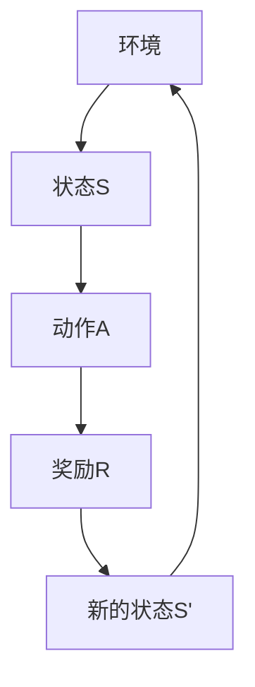

                 

### 《强化学习：环境模型的建立与利用》

> **关键词**：强化学习、环境模型、建立方法、应用案例、Q学习、SARSA、深度强化学习、模型评估、优化策略

> **摘要**：本文详细阐述了强化学习的基础概念、环境模型的建立与利用方法，以及强化学习算法原理和深度强化学习的发展。通过深入分析，本文探讨了强化学习在不同领域的应用实践，并提出了模型评估与优化的策略。最后，展望了强化学习的未来发展趋势。

---

#### 第一部分：强化学习基础

---

#### 第1章：强化学习概述

- **1.1 强化学习的基本概念**

  强化学习是机器学习的一种重要类型，它通过智能体与环境的交互，不断学习并优化决策策略，以达到最大化累积奖励的目标。强化学习的历史可以追溯到20世纪50年代，当时心理学研究者提出了一种称为“操作条件反射”的现象，即通过奖励和惩罚来影响动物的行为。

  强化学习的三个主要组成部分包括：

  - **智能体（Agent）**：执行动作并学习策略的实体，可以是机器人、软件程序或人工神经网络。
  - **环境（Environment）**：与智能体交互的实体，可以是物理环境或虚拟环境，其状态和奖励函数会影响智能体的行为。
  - **策略（Policy）**：智能体在特定状态下选择动作的规则，可以是显式或隐式的。

- **1.2 强化学习的基本原理**

  强化学习的数学模型主要包括以下内容：

  - **状态（State）**：智能体在某一时刻所处的环境状态。
  - **动作（Action）**：智能体可以采取的某种行动。
  - **奖励（Reward）**：智能体在采取某一动作后从环境中获得的即时回报。
  - **状态转移概率分布（State Transition Probability）**：给定当前状态和动作，智能体转移到下一个状态的概率分布。
  - **策略（Policy）**：智能体在给定状态下的动作选择规则。
  - **值函数（Value Function）**：评估策略在某一状态下的预期回报，包括状态值函数（$V(s)$）和动作值函数（$Q(s, a)$）。

  强化学习的目标是找到一个最优策略，使得智能体能够在长时间内获得最大的累积奖励。

- **1.3 强化学习的基本原理**

  强化学习的基本原理可以通过以下数学模型来描述：

  $$
  \begin{aligned}
  \text{强化学习模型} &= \langle \mathcal{S}, \mathcal{A}, \mathcal{R}, \mathcal{P}, \gamma \rangle \\
  \text{其中：} \\
  \mathcal{S} &= \text{状态空间} \\
  \mathcal{A} &= \text{动作空间} \\
  \mathcal{R} &= \text{奖励函数} \\
  \mathcal{P} &= \text{状态转移概率分布} \\
  \gamma &= \text{折扣因子}
  \end{aligned}
  $$

  在这个模型中，智能体在给定状态 $s$ 下根据策略选择动作 $a$，然后进入下一个状态 $s'$，并获得奖励 $r$。智能体的目标是通过不断的学习和调整策略，最大化累积奖励。

- **1.4 强化学习的类型与应用**

  强化学习可以分为无模型（Model-Free）和有模型（Model-Based）两种方法：

  - **无模型方法**：智能体不依赖环境模型，直接通过试错和经验来学习策略。常见的无模型方法包括Q学习（Q-Learning）、SARSA（State-Action-Reward-State-Action）等。
  - **有模型方法**：智能体先建立环境模型，然后利用模型来预测状态转移和奖励，从而优化策略。常见的有模型方法包括马尔可夫决策过程（MDP）和部分可观测马尔可夫决策过程（POMDP）。

  强化学习在不同领域有广泛的应用，包括：

  - **游戏**：如围棋、象棋等，通过强化学习实现自动对战。
  - **机器人控制**：如路径规划、物体抓取等，通过强化学习实现自主决策。
  - **资源分配**：如电力系统优化、网络流量管理，通过强化学习实现高效调度。
  - **金融**：如股票交易、风险管理，通过强化学习实现智能化投资。
  - **医疗**：如疾病预测、医疗机器人，通过强化学习实现智能辅助。

  综上所述，强化学习作为一种先进的人工智能技术，具有广泛的应用前景。通过建立环境模型并利用强化学习算法，可以实现对复杂系统的自适应控制和优化。

---

#### 第2章：环境模型的建立

---

#### 2.1 环境模型概述

- **环境模型**：环境模型是强化学习中的一个核心概念，它描述了智能体与环境的交互过程。环境模型主要包括以下内容：

  - **状态空间**：智能体可以处于的所有可能状态集合，通常表示为 $\mathcal{S}$。
  - **动作空间**：智能体可以采取的所有可能动作集合，通常表示为 $\mathcal{A}$。
  - **奖励函数**：描述智能体在某一状态采取某一动作后获得的即时奖励，通常表示为 $R(s, a)$。
  - **状态转移概率分布**：描述智能体在某一状态采取某一动作后转移到下一个状态的概率分布，通常表示为 $P(s'|s, a)$。

- **环境模型的重要性**：环境模型在强化学习中起着至关重要的作用。通过建立环境模型，智能体可以更好地理解环境，从而优化其策略。具体来说，环境模型的重要性体现在以下几个方面：

  - **指导策略学习**：环境模型可以帮助智能体理解状态和动作之间的关联，从而制定更有效的策略。
  - **加速收敛**：有模型方法可以利用环境模型进行预测，从而减少探索次数，加速策略学习过程。
  - **增强鲁棒性**：通过建立环境模型，智能体可以应对不确定性和动态变化，提高系统的鲁棒性。

- **环境模型的类型**：根据环境模型的构建方式，可以分为以下几种类型：

  - **完全可观测模型**：智能体可以完全观察到环境的状态和变化，从而构建出精确的环境模型。
  - **部分可观测模型**：智能体无法完全观察到环境的状态，但可以通过部分观测信息来构建环境模型。
  - **静态模型**：环境模型的状态转移概率分布是固定的，不随时间变化。
  - **动态模型**：环境模型的状态转移概率分布是随时间变化的，可以自适应调整。

  综上所述，环境模型是强化学习中的重要组成部分，它描述了智能体与环境的交互过程，对策略学习具有指导作用。通过建立和利用环境模型，可以优化智能体的策略，提高系统性能。

---

#### 2.2 环境模型的建立方法

- **观察数据与先验知识**

  建立环境模型的第一步是收集和分析数据。通过观察数据，智能体可以了解环境的动态变化和状态转移规律。观察数据可以是实时数据或历史数据，具体取决于应用场景。

  - **实时数据**：实时数据可以提供当前环境的最新状态和奖励信息，有助于智能体实时调整策略。例如，在自动驾驶中，传感器采集到的道路状况、车辆速度等数据可以用于建立环境模型。
  - **历史数据**：历史数据可以提供过去环境状态和奖励的记录，有助于智能体总结经验教训，优化策略。例如，在股票交易中，历史股价和交易数据可以用于建立环境模型。

  同时，除了观察数据外，还可以利用先验知识来补充和修正观察数据。先验知识可以是领域专家的经验、物理定律或统计规律等，有助于智能体更好地理解环境。

- **基于马尔可夫决策过程的模型建立**

  马尔可夫决策过程（MDP）是一种经典的强化学习模型，用于描述智能体与环境的交互过程。基于MDP的环境模型建立方法主要包括以下步骤：

  - **定义状态空间**：确定智能体可能处于的所有状态，并为其分配唯一的标识符。例如，在自动驾驶中，状态可以包括道路状况、交通情况、车辆位置等。
  - **定义动作空间**：确定智能体可以采取的所有动作，并为其分配唯一的标识符。例如，在自动驾驶中，动作可以包括加速、减速、转向等。
  - **定义奖励函数**：确定智能体在采取某一动作后获得的即时奖励。奖励函数可以是正值、负值或零，取决于动作的效果。例如，在自动驾驶中，安全到达目的地可以获得正奖励，发生交通事故可以获得负奖励。
  - **定义状态转移概率分布**：确定智能体在给定状态和动作下转移到下一状态的概率分布。状态转移概率分布可以基于观察数据或先验知识来估计。例如，在自动驾驶中，车辆在不同道路状况和交通情况下的转移概率可以通过统计方法来估计。

  基于MDP的环境模型建立方法具有以下优点：

  - **灵活性**：可以适用于不同类型的应用场景，包括静态环境和动态环境。
  - **通用性**：可以用于模型-free和模型-based的强化学习方法，具有广泛的适用性。
  - **可解释性**：状态转移概率分布和奖励函数可以直观地解释智能体在环境中的行为。

  然而，基于MDP的环境模型建立方法也存在一些挑战：

  - **状态空间和动作空间规模**：当状态空间和动作空间规模较大时，模型参数的数量会急剧增加，导致计算复杂度和存储需求增大。
  - **不确定性处理**：当环境不确定性较大时，基于概率分布的状态转移模型可能无法准确描述智能体的行为。

  综上所述，观察数据与先验知识、基于马尔可夫决策过程的模型建立方法是强化学习环境模型建立中的常用方法。通过合理地建立环境模型，可以优化智能体的策略，提高系统性能。

---

#### 2.3 环境模型的应用案例

- **仿真环境下的模型建立**

  在仿真环境中，环境模型通常是通过模拟实验来建立的。以下是一个基于仿真环境建立环境模型的案例：

  - **案例背景**：假设我们要研究自动驾驶车辆在复杂城市道路环境中的路径规划问题。为了建立环境模型，我们首先需要定义状态空间和动作空间。

    - **状态空间**：包括车辆的位置、速度、方向、道路状况、交通情况等。例如，状态可以表示为 $s = (x, y, v, \theta, c, t)$，其中 $x$ 和 $y$ 表示车辆的位置，$v$ 表示速度，$\theta$ 表示方向，$c$ 表示道路状况，$t$ 表示交通情况。

    - **动作空间**：包括加速、减速、转向等。例如，动作可以表示为 $a = (a_x, a_y, \theta)$，其中 $a_x$ 和 $a_y$ 分别表示横向和纵向加速度，$\theta$ 表示转向角度。

  - **模型建立过程**：

    - **数据收集**：通过仿真实验，收集不同状态和动作下的车辆行驶数据。数据可以包括行驶轨迹、速度、加速度、方向等。

    - **状态转移概率分布**：根据收集到的数据，估计状态转移概率分布。例如，通过统计不同状态下采取不同动作后转移到下一状态的概率，可以得到状态转移概率分布矩阵。

    - **奖励函数**：根据实验目标，定义奖励函数。例如，在路径规划问题中，可以定义安全到达目的地为正奖励，发生碰撞为负奖励。

    - **模型验证**：通过仿真实验验证环境模型的有效性。例如，通过比较实际行驶轨迹和预测行驶轨迹的误差，评估模型性能。

  通过仿真环境建立环境模型，可以模拟复杂交通场景，为自动驾驶车辆的路径规划提供理论支持。

- **真实世界环境中的模型应用**

  在真实世界环境中，环境模型通常是通过传感器数据和先验知识建立的。以下是一个基于真实世界环境建立环境模型的案例：

  - **案例背景**：假设我们要研究智能电网中的电力调度问题。为了建立环境模型，我们首先需要定义状态空间和动作空间。

    - **状态空间**：包括电网负荷、可再生能源发电量、电力需求等。例如，状态可以表示为 $s = (l, r, d)$，其中 $l$ 表示电网负荷，$r$ 表示可再生能源发电量，$d$ 表示电力需求。

    - **动作空间**：包括调整电网负荷、调整可再生能源发电量等。例如，动作可以表示为 $a = (a_l, a_r)$，其中 $a_l$ 表示调整电网负荷，$a_r$ 表示调整可再生能源发电量。

  - **模型建立过程**：

    - **数据收集**：通过传感器收集电网负荷、可再生能源发电量、电力需求等数据。数据可以实时更新，用于动态调整模型。

    - **状态转移概率分布**：根据收集到的数据，估计状态转移概率分布。例如，通过统计不同状态下采取不同动作后转移到下一状态的概率，可以得到状态转移概率分布矩阵。

    - **奖励函数**：根据调度目标，定义奖励函数。例如，在电力调度问题中，可以定义最小化电网负荷波动为正奖励，最大化可再生能源利用率为正奖励。

    - **模型验证**：通过实际调度实验验证环境模型的有效性。例如，通过比较实际调度结果和预测调度结果的误差，评估模型性能。

  通过真实世界环境建立环境模型，可以为智能电网的电力调度提供实时和准确的决策支持。

综上所述，无论是仿真环境还是真实世界环境，建立环境模型是强化学习中的关键步骤。通过合理地建立和利用环境模型，可以优化智能体的策略，提高系统性能。

---

#### 第3章：强化学习算法原理

---

#### 3.1 Q学习算法

- **Q学习算法**是强化学习中最基础且广泛应用的一种算法。它的核心思想是通过不断更新Q值来学习最优策略。Q值函数（$Q(s, a)$）表示在状态 $s$ 下采取动作 $a$ 的期望回报。

- **基本原理**

  Q学习算法基于以下更新规则：

  $$
  Q(s, a) \leftarrow Q(s, a) + \alpha [r + \gamma \max_{a'} Q(s', a') - Q(s, a)]
  $$

  其中：
  - $Q(s, a)$ 是当前状态 $s$ 下采取动作 $a$ 的Q值。
  - $r$ 是在状态 $s$ 下采取动作 $a$ 后获得的即时奖励。
  - $\gamma$ 是折扣因子，用于平衡当前奖励和未来潜在奖励。
  - $\alpha$ 是学习率，用于控制Q值更新的程度。
  - $\max_{a'} Q(s', a')$ 是在下一个状态 $s'$ 下能够获得的最大Q值。

- **伪代码**

  ```
  Initialize Q(s, a) for all s in \mathcal{S} and a in \mathcal{A}
  for each episode do
      s <- initial_state
      while s is not terminal do
          a <- choose_action(s, Q)
          s' <- take_action(s, a)
          r <- reward(s, a, s')
          Q(s, a) <- Q(s, a) + alpha * (r + gamma * max(Q(s', a')) - Q(s, a))
          s <- s'
      end while
  end for
  ```

  在这个伪代码中，我们首先初始化所有的Q值，然后对于每一个episode，智能体从一个初始状态开始，通过选择动作、执行动作、获得奖励和更新Q值，不断学习最优策略。

- **Q学习的改进方法**

  Q学习算法存在一些缺陷，如容易陷入局部最优、更新过程中的噪声影响等。为了克服这些缺陷，研究者提出了一系列改进方法：

  - **Sarsa算法（State-Action-Reward-State-Action）**：Sarsa算法是对Q学习的一种改进，它不仅考虑了当前状态和动作的Q值，还考虑了下一个状态和动作的Q值，从而减少了Q值更新的噪声。

    $$
    Q(s, a) \leftarrow Q(s, a) + \alpha [r + \gamma Q(s', a')]
    $$

  - **双Q学习（Double Q-Learning）**：双Q学习通过使用两个Q值函数（$Q_1$和$Q_2$）来减少由于Q值更新所带来的偏差。

    $$
    Q_1(s, a) \leftarrow Q_1(s, a) + \alpha [r + \gamma Q_2(s', a')]
    $$
    $$
    Q_2(s, a) \leftarrow Q_2(s, a) + \alpha [r + \gamma Q_1(s', a')]
    $$

  - **优先级队列更新（Prioritized Experience Replay）**：优先级队列更新通过为不同重要性的经验赋予不同的更新优先级，从而减少了不重要的经验的更新干扰。

  - **深度Q网络（Deep Q-Network, DQN）**：DQN通过使用深度神经网络来近似Q值函数，从而处理高维状态空间和动作空间的问题。

    $$
    Q(s, a) = \sigma(W \cdot \phi(s) + b)
    $$

    其中，$\sigma$ 是激活函数，$W$ 和 $b$ 是神经网络的权重和偏置，$\phi(s)$ 是状态的特征向量。

  通过这些改进方法，Q学习算法在性能和稳定性方面得到了显著提升，成为了强化学习领域的基础算法。

---

#### 3.2 SARSA算法

- **SARSA（State-Action-Reward-State-Action）算法**是对Q学习的一种改进，它不仅考虑了当前状态和动作的Q值，还考虑了下一个状态和动作的Q值。SARSA算法的核心思想是通过同时更新当前状态和下一个状态的Q值来减少Q值更新的噪声。

- **基本原理**

  SARSA算法的更新规则如下：

  $$
  Q(s, a) \leftarrow Q(s, a) + \alpha [r + \gamma Q(s', a')]
  $$

  其中：
  - $Q(s, a)$ 是当前状态 $s$ 下采取动作 $a$ 的Q值。
  - $r$ 是在状态 $s$ 下采取动作 $a$ 后获得的即时奖励。
  - $\gamma$ 是折扣因子，用于平衡当前奖励和未来潜在奖励。
  - $\alpha$ 是学习率，用于控制Q值更新的程度。
  - $Q(s', a')$ 是在下一个状态 $s'$ 下采取动作 $a'$ 的Q值。

- **伪代码**

  ```
  Initialize Q(s, a) for all s in \mathcal{S} and a in \mathcal{A}
  for each episode do
      s <- initial_state
      while s is not terminal do
          a <- choose_action(s, Q)
          s' <- take_action(s, a)
          r <- reward(s, a, s')
          a' <- choose_action(s', Q)
          Q(s, a) <- Q(s, a) + alpha * (r + gamma * Q(s', a') - Q(s, a))
          s <- s'
      end while
  end for
  ```

  在这个伪代码中，我们首先初始化所有的Q值，然后对于每一个episode，智能体从一个初始状态开始，通过选择动作、执行动作、获得奖励和更新Q值，不断学习最优策略。

- **SARSA算法的优点**

  - **减少噪声**：SARSA算法通过同时更新当前状态和下一个状态的Q值，减少了由于单次经验更新带来的噪声。
  - **适应性**：SARSA算法在动态环境中更具适应性，因为它能够及时更新Q值，从而更好地应对环境变化。

- **SARSA算法的改进方法**

  虽然SARSA算法在减少噪声和适应性方面有优势，但它也存在一些缺陷，如容易陷入局部最优和收敛速度慢等。为了克服这些缺陷，研究者提出了一系列改进方法：

  - **SARSA(λ)**：SARSA(λ)通过引入回溯因素（λ），允许算法在后续步骤中利用先前步骤的信息，从而提高算法的性能和收敛速度。

    $$
    Q(s, a) \leftarrow Q(s, a) + \alpha [r + \gamma \sum_{i=0}^{\lambda} \gamma^i Q(s_i', a_i')]
    $$

  - **优先级队列SARSA**：优先级队列SARSA结合了SARSA算法和优先级队列更新方法，通过为不同重要性的经验赋予不同的更新优先级，从而减少了不重要的经验的更新干扰。

  - **深度SARSA（Deep SARSA）**：深度SARSA通过使用深度神经网络来近似Q值函数，从而处理高维状态空间和动作空间的问题。

    $$
    Q(s, a) = \sigma(W \cdot \phi(s) + b)
    $$

  通过这些改进方法，SARSA算法在性能和稳定性方面得到了显著提升，成为了强化学习领域的重要算法。

---

#### 3.3 Deep Q Network (DQN)

- **深度Q网络（Deep Q-Network, DQN）**是强化学习中的一个重要突破，它通过使用深度神经网络来近似Q值函数，从而解决了传统Q学习在处理高维状态空间和动作空间时的困难。

- **算法原理**

  DQN的基本原理可以概括为以下几个步骤：

  1. **初始化**：初始化Q网络和目标Q网络，通常使用均匀分布初始化。
  2. **经验回放**：收集智能体与环境的交互经验，并将其存储在经验回放池中。经验回放池用于缓解样本偏差和避免记忆偏差。
  3. **选择动作**：使用贪心策略或ε-贪心策略从Q网络中选择动作。
  4. **更新Q网络**：根据选择动作后的奖励和状态转移，更新Q网络的参数。更新规则如下：

     $$
     Q(s, a) \leftarrow Q(s, a) + \alpha [r + \gamma \max_{a'} Q(s', a') - Q(s, a)]
     $$

  5. **同步Q网络和目标Q网络**：为了防止梯度消失和稳定学习过程，需要定期同步Q网络和目标Q网络的参数。

- **实现细节**

  - **经验回放池**：经验回放池是一个固定大小的数据结构，用于存储智能体与环境的交互经验。每次更新Q网络时，从经验回放池中随机抽取一个经验，用于训练Q网络。
  - **ε-贪心策略**：ε-贪心策略是一种平衡探索和利用的策略。在ε概率下，智能体会随机选择动作进行探索，而在1-ε概率下，智能体会根据Q网络选择动作进行利用。
  - **目标Q网络**：目标Q网络是Q网络的副本，用于减少梯度消失问题，提高学习稳定性。目标Q网络定期与Q网络同步，以保持两者的参数一致性。

- **DQN的优势**

  - **处理高维状态空间**：DQN通过使用深度神经网络，可以处理高维状态空间和动作空间，从而提高智能体的学习效率。
  - **减少过度估计**：通过使用经验回放池和目标Q网络，DQN可以减少过度估计问题，提高Q值估计的准确性。
  - **适应性强**：DQN具有较强的适应性，可以在不同环境中进行快速调整和优化。

- **DQN的挑战**

  - **学习不稳定**：DQN在训练过程中可能会出现学习不稳定的问题，特别是当状态空间和动作空间较大时。
  - **探索与利用平衡**：DQN需要平衡探索和利用，以确保智能体在训练过程中既能探索未知状态，又能利用已有知识。

通过深度Q网络，强化学习可以应对更复杂和更广泛的应用场景，为实现智能体在真实世界中的自主决策提供了有力支持。

---

#### 第4章：深度强化学习

---

#### 4.1 深度强化学习概述

- **深度强化学习（Deep Reinforcement Learning, DRL）**是一种结合深度学习和强化学习的方法，它通过使用深度神经网络来近似值函数和策略函数，从而解决传统强化学习在处理高维状态空间和动作空间时的困难。

- **定义与核心思想**

  深度强化学习的基本定义可以表述为：使用深度神经网络来近似强化学习中的值函数或策略函数，从而提高智能体在复杂环境中的学习效率。其核心思想包括：

  - **值函数近似**：使用深度神经网络来表示值函数，从而处理高维状态空间。
  - **策略函数近似**：使用深度神经网络来表示策略函数，从而处理高维动作空间。
  - **模型融合**：结合深度学习和强化学习的优势，通过模型融合方法来提高智能体的学习性能。

- **深度强化学习的类型**

  根据深度神经网络在强化学习中的作用，可以将深度强化学习分为以下几种类型：

  - **深度Q网络（Deep Q-Network, DQN）**：使用深度神经网络来近似Q值函数，解决高维状态空间和动作空间的问题。
  - **深度策略梯度（Deep Policy Gradient, DPG）**：使用深度神经网络来近似策略函数，通过策略梯度方法进行优化。
  - **深度确定性策略梯度（Deep Deterministic Policy Gradient, DDPG）**：结合深度Q网络和策略梯度方法，用于处理连续动作空间的问题。
  - **深度演员-评论家（Deep Actor-Critic, A2C）**：使用两个深度神经网络分别表示演员（策略函数）和评论家（值函数），通过联合优化来提高学习性能。

- **深度强化学习的发展**

  深度强化学习的发展可以分为以下几个阶段：

  - **初期阶段**：以DQN为代表的深度强化学习算法，解决了传统Q学习在处理高维状态空间和动作空间时的困难。
  - **发展阶段**：DPG和DDPG等算法的出现，进一步提高了深度强化学习在连续动作空间和复杂环境中的应用能力。
  - **近期趋势**：随着深度学习技术的不断发展，深度强化学习在算法优化、模型融合和应用领域等方面取得了显著进展。

  综上所述，深度强化学习通过结合深度学习和强化学习的优势，为智能体在复杂环境中的自主决策提供了有效手段，成为人工智能领域的一个重要研究方向。

---

#### 4.2 神经网络在强化学习中的应用

- **值函数近似与策略近似**

  在强化学习中，神经网络可以用来近似值函数和策略函数，从而处理高维状态空间和动作空间的问题。值函数近似和策略近似是深度强化学习中的两个核心概念。

  - **值函数近似**：值函数用于评估智能体在特定状态下采取特定动作的预期回报。在传统强化学习中，值函数通常表示为一个函数 $V(s)$ 或 $Q(s, a)$。然而，当状态空间和动作空间较大时，直接计算值函数变得非常困难。神经网络可以用来近似这些值函数，从而降低计算复杂度。

    值函数近似的公式可以表示为：

    $$
    \hat{V}(s) = f_\theta(s)
    $$

    其中，$\hat{V}(s)$ 是近似值函数，$f_\theta(s)$ 是神经网络，$\theta$ 是神经网络的参数。

  - **策略近似**：策略函数用于确定智能体在特定状态下应该采取的动作。策略函数的表示形式为 $\pi(a|s)$，其中 $\pi$ 表示策略，$a$ 表示动作，$s$ 表示状态。策略近似的目标是使用神经网络来学习最优策略，从而提高智能体的决策能力。

    策略近似的公式可以表示为：

    $$
    \pi(a|s) = f_\theta(s)
    $$

    其中，$\pi(a|s)$ 是近似策略，$f_\theta(s)$ 是神经网络，$\theta$ 是神经网络的参数。

- **神经网络在强化学习中的挑战**

  尽管神经网络在强化学习中的应用具有显著优势，但它也面临一些挑战：

  - **梯度消失与梯度爆炸**：在深度神经网络中，梯度可能由于数值饱和或反向传播过程中的数值衰减而消失或爆炸，导致学习困难。
  - **过拟合**：神经网络可能在学习过程中过于拟合训练数据，导致泛化能力下降。
  - **计算复杂度**：当状态空间和动作空间较大时，训练深度神经网络所需的计算资源可能非常大。

- **解决方案**

  为了应对上述挑战，研究者提出了一系列解决方案：

  - **梯度裁剪**：通过限制梯度的大小，防止梯度爆炸和消失。
  - **经验回放**：通过经验回放池存储和随机抽样经验，减少过拟合现象。
  - **目标网络**：通过定期同步训练网络和目标网络，提高训练稳定性。

  通过这些解决方案，神经网络在强化学习中的应用得到了显著优化，使得智能体能够更有效地学习复杂环境的策略。

---

#### 4.3 深度确定性策略梯度 (DDPG) 算法

- **深度确定性策略梯度（Deep Deterministic Policy Gradient, DDPG）算法**是深度强化学习中的一个重要算法，它通过使用深度神经网络来近似值函数和策略函数，从而解决连续动作空间的问题。DDPG算法在处理复杂环境中的连续控制任务时表现出色。

- **算法原理**

  DDPG算法的核心思想是通过同时学习值函数和策略函数，从而提高智能体的决策能力。算法的原理可以概括为以下几个步骤：

  - **初始化**：初始化深度神经网络（Actor网络和Critic网络）和目标网络，通常使用随机权重初始化。
  - **经验回放**：使用经验回放池存储智能体与环境的交互经验，包括状态、动作、奖励和下一状态。经验回放池可以减少样本偏差，提高学习效率。
  - **Actor网络**：Actor网络是一个策略网络，它通过状态来生成动作。Actor网络的输出是一个确定性函数，即给定状态，输出一个确定的动作。Actor网络的优化目标是最大化累积奖励。
  - **Critic网络**：Critic网络是一个评价网络，它通过比较当前策略和最优策略的值函数差异来评估策略的好坏。Critic网络的优化目标是预测状态价值函数，即给定状态和动作，预测状态价值。
  - **目标网络**：目标网络是Actor网络和Critic网络的副本，用于减少梯度消失问题，提高学习稳定性。目标网络定期与原始网络同步。
  - **策略更新**：通过策略梯度方法更新Actor网络的参数，使得策略函数逐渐优化。
  - **值函数更新**：通过最小化预测误差来更新Critic网络的参数，提高值函数的准确性。

- **算法伪代码**

  ```
  Initialize Actor network, Critic network, and Target network
  Initialize replay buffer
  for episode in 1 to max_episodes do
      Initialize environment
      s <- initial_state
      for step in 1 to max_steps do
          a <- Actor(s)
          s', r <- take_action(s, a)
          Add experience (s, a, r, s') to replay buffer
          Sample a mini-batch of experiences from replay buffer
          Update Critic network using the mini-batch
          Update Actor network using the updated Critic network
          if step % target_network_update_freq == 0 then
              Update Target network with the current network weights
          end if
          s <- s'
      end for
  end for
  ```

  在这个伪代码中，我们首先初始化网络和回放池，然后对于每一个episode，智能体与环境交互，收集经验，并使用这些经验来更新网络参数。

- **DDPG算法的应用案例**

  DDPG算法在许多领域都取得了显著的成果，以下是一些应用案例：

  - **机器人控制**：DDPG算法可以用于机器人的路径规划、物体抓取和移动等任务。例如，在机器人手臂控制中，DDPG算法可以学习到如何将物体从一个位置移动到另一个位置。
  - **自动驾驶**：DDPG算法可以用于自动驾驶车辆的路径规划和决策。例如，在无人驾驶汽车中，DDPG算法可以用于学习如何在复杂的交通环境中做出最佳驾驶决策。
  - **游戏**：DDPG算法可以用于游戏中的智能体控制。例如，在《Atari》游戏平台上，DDPG算法可以用于学习如何玩《Pong》等游戏。

  通过这些应用案例，可以看出DDPG算法在处理连续动作空间和复杂环境中的强大能力。

---

#### 第5章：模型评估与优化

---

#### 5.1 强化学习模型评估方法

- **强化学习模型评估是确保智能体在真实环境中表现出色的重要环节。评估方法主要包括以下几种：**

  - **平均奖励（Average Reward）**：平均奖励是在一系列试验中，累计所有试验的奖励总和，然后除以试验次数。平均奖励可以衡量智能体在特定策略下的长期性能。

    $$
    \text{Average Reward} = \frac{1}{n}\sum_{i=1}^{n} R_i
    $$

    其中，$R_i$ 表示第 $i$ 次试验的奖励，$n$ 表示试验次数。

  - **奖励分布（Reward Distribution）**：奖励分布是通过分析一系列试验中，奖励的分布情况来评估模型性能。奖励分布可以包括最大奖励、最小奖励、中位数等统计指标。

    例如，假设我们进行了 $n$ 次试验，每个试验的奖励分别为 $R_1, R_2, ..., R_n$，则最大奖励可以表示为：

    $$
    \text{Max Reward} = \max_{1 \leq i \leq n} R_i
    $$

    最小奖励可以表示为：

    $$
    \text{Min Reward} = \min_{1 \leq i \leq n} R_i
    $$

    中位数可以表示为：

    $$
    \text{Median Reward} = \text{Median}(R_1, R_2, ..., R_n)
    $$

  - **收敛性评估（Convergence Evaluation）**：收敛性评估是检查强化学习算法是否收敛到稳定策略的方法。常见的收敛性评估方法包括 reward 跳跃（Reward Jumps）、状态熵（State Entropy）等。

    - **reward 跳跃**：reward 跳跃是检查相邻两个 episode 的平均奖励是否显著变化。如果 reward 跳跃较大，则说明算法可能未收敛。
    - **状态熵**：状态熵是衡量状态分布的多样性。在强化学习中，较高的状态熵通常表示智能体具有较好的探索能力。

  - **泛化能力（Generalization Ability）**：泛化能力是指智能体在未见过的环境或状态中表现的能力。评估泛化能力的方法包括转移测试（Transfer Test）、迁移学习（Transfer Learning）等。

    - **转移测试**：在转移测试中，将智能体从一个环境转移到另一个环境，并评估其在新环境中的表现。
    - **迁移学习**：通过在多个相关环境中训练智能体，并评估其在不同环境中的表现，来评估其泛化能力。

  综上所述，强化学习模型的评估方法包括平均奖励、奖励分布、收敛性评估和泛化能力评估等。通过这些方法，可以全面评估强化学习模型的效果，为模型优化提供依据。

---

#### 5.2 强化学习算法优化策略

- **探索与利用平衡**

  强化学习中的探索（Exploration）与利用（Exploitation）平衡是一个关键问题。探索是指在未知环境中尝试新的动作，以获取更多关于环境的知识；利用是指在已知的最佳动作上执行，以最大化当前收益。

  - **ε-贪心策略**：ε-贪心策略是一种常用的探索与利用平衡策略，其中ε是一个小于1的常数。在ε概率下，智能体随机选择动作进行探索；在1-ε概率下，智能体根据当前策略选择动作进行利用。

    $$
    a = \begin{cases}
    \text{choose_random_action()} & \text{with probability } \epsilon \\
    \text{greedy_action(s)} & \text{with probability } 1 - \epsilon
    \end{cases}
    $$

  - **ε-贪心策略的调整**：为了在不同阶段平衡探索与利用，可以调整ε的值。在初始阶段，可以设置较大的ε值，以增加探索；随着智能体对环境的熟悉程度提高，可以逐渐减小ε值，以增加利用。

  - **其他探索策略**：除了ε-贪心策略外，还有一些其他的探索策略，如随机策略、UCB（Upper Confidence Bound）策略等。这些策略在不同场景下可能具有不同的效果。

- **模型调参与性能提升**

  强化学习算法的性能可以通过调整超参数和改进算法本身来提升。以下是一些常用的优化策略：

  - **学习率调整**：学习率（α）是强化学习中的一个关键超参数，它控制Q值更新的速度。较大的学习率可能导致快速收敛，但也容易导致过拟合；较小的学习率可能收敛较慢，但更稳定。可以通过动态调整学习率，如在每个episode后减小学习率，来优化算法性能。

  - **折扣因子调整**：折扣因子（γ）用于平衡当前奖励与未来潜在奖励。较大的折扣因子可能导致智能体更关注短期奖励，而较小的折扣因子可能导致智能体更关注长期奖励。根据应用场景调整γ值，可以优化智能体的策略。

  - **经验回放**：经验回放池可以减少样本偏差，提高学习效率。通过将智能体与环境的交互经验随机存储在回放池中，并从回放池中随机抽样进行训练，可以减少过拟合现象。

  - **目标网络**：在强化学习中，使用目标网络可以减少梯度消失问题，提高学习稳定性。目标网络是一个训练网络的目标网络副本，它定期与训练网络同步，以稳定学习过程。

  - **策略梯度方法**：策略梯度方法通过直接优化策略函数，从而提高智能体的决策能力。策略梯度方法包括基于梯度的优化策略，如REINFORCE算法、PPO（Proximal Policy Optimization）等。

  - **模型融合**：通过融合多个模型，可以进一步提高智能体的性能。例如，结合深度Q网络（DQN）和深度确定性策略梯度（DDPG），可以处理更复杂的任务。

  通过上述优化策略，可以显著提升强化学习算法的性能，使其在复杂环境中表现出色。

---

#### 5.3 强化学习中的正则化方法

- **强化学习中的正则化方法**用于解决模型过拟合和欠拟合问题，从而提高模型的泛化能力和鲁棒性。以下介绍两种常用的正则化方法：L1正则化和L2正则化。

  - **L1正则化**：L1正则化通过增加模型参数的绝对值来控制模型复杂度。L1正则化的公式可以表示为：

    $$
    \text{Loss} = \sum_{i=1}^{n} (y_i - \hat{y}_i) + \lambda ||\theta||_1
    $$

    其中，$y_i$ 表示真实标签，$\hat{y}_i$ 表示预测标签，$\theta$ 表示模型参数，$\lambda$ 是正则化参数。L1正则化会导致参数的稀疏性，即某些参数可能会被设置为0，从而简化模型。

    - **优势**：L1正则化可以减少模型的过拟合现象，同时保持模型的解释性。
    - **挑战**：L1正则化可能导致模型欠拟合，特别是在样本较少或特征高度相关的情况下。

  - **L2正则化**：L2正则化通过增加模型参数的平方来控制模型复杂度。L2正则化的公式可以表示为：

    $$
    \text{Loss} = \sum_{i=1}^{n} (y_i - \hat{y}_i) + \lambda ||\theta||_2^2
    $$

    其中，$y_i$ 表示真实标签，$\hat{y}_i$ 表示预测标签，$\theta$ 表示模型参数，$\lambda$ 是正则化参数。L2正则化会导致参数的非稀疏性，即所有参数都会在一定程度上被调整。

    - **优势**：L2正则化可以减少模型的过拟合现象，同时保持模型的稳定性。
    - **挑战**：L2正则化可能导致模型欠拟合，特别是在特征数量较多的情况下。

  - **组合使用**：在实际应用中，可以将L1正则化和L2正则化组合使用，以平衡模型的复杂度和泛化能力。例如，可以使用L1-L2正则化来优化深度神经网络。

  通过合理地使用正则化方法，可以有效地解决强化学习中的过拟合和欠拟合问题，从而提高模型的泛化能力和鲁棒性。

---

#### 第二部分：强化学习应用实践

---

#### 第6章：强化学习在游戏中的应用

- **强化学习在游戏中的应用**是一个充满挑战和机遇的领域，它为游戏智能体的自主学习和决策提供了强大的工具。以下讨论强化学习在游戏中的挑战、应用案例以及解决方案。

- **挑战**

  - **有限记忆与不确定性处理**：许多游戏环境具有高维状态空间和复杂的动作空间，同时存在不确定性和有限记忆问题。智能体需要通过有限的信息进行决策，同时应对环境中的不确定因素。

  - **非完全可观测性问题**：在现实世界中的某些游戏环境中，智能体可能无法完全观察到所有相关状态信息，这增加了学习难度。

  - **长期奖励与短期奖励的平衡**：某些游戏任务可能需要长期积累奖励，但短期奖励的获取较为困难。智能体需要平衡长期奖励和短期奖励，以避免过早收敛到次优策略。

- **应用案例**

  - **零和博弈与完全信息博弈**：在围棋、象棋等零和博弈游戏中，智能体需要学习最优策略以击败对手。这些游戏具有明确的目标和规则，适用于强化学习算法。

  - **不完全信息博弈**：在《德州扑克》等不完全信息博弈中，智能体需要通过观察对手的行为和牌面信息来学习策略。这些游戏具有不确定性，需要复杂的策略学习。

- **解决方案**

  - **经验回放**：通过经验回放池存储和重放历史经验，可以减少样本偏差，提高学习效率。

  - **深度神经网络**：使用深度神经网络来近似值函数和策略函数，可以处理高维状态空间和动作空间的问题。

  - **策略梯度方法**：策略梯度方法可以直接优化策略函数，提高智能体的决策能力。

  - **模型融合**：结合多个模型，如深度Q网络（DQN）和深度确定性策略梯度（DDPG），可以处理更复杂的任务。

  - **探索与利用平衡**：采用ε-贪心策略或其他探索策略，平衡长期奖励和短期奖励。

  - **强化学习框架**：使用成熟的强化学习框架，如TensorFlow、PyTorch等，可以简化开发过程，提高开发效率。

通过上述解决方案，强化学习在游戏中的应用取得了显著成果，为游戏智能体的自主学习和决策提供了有力支持。

---

#### 第7章：强化学习在机器人控制中的应用

- **强化学习在机器人控制中的应用**展示了其强大的学习能力和适应性。以下讨论强化学习在机器人控制中的优势、应用案例以及实现细节。

- **优势**

  - **非线性控制问题**：机器人控制系统通常具有非线性特性，传统控制方法难以处理。强化学习通过学习环境模型和策略，可以自适应地处理非线性问题。

  - **适应环境变化的能力**：强化学习能够通过不断与环境交互，适应环境的变化。这使得机器人能够应对动态和不确定的环境，提高鲁棒性。

  - **自主决策**：强化学习使得机器人能够根据当前环境和目标，自主做出决策，从而实现自主导航、路径规划和任务执行。

- **应用案例**

  - **机器人路径规划**：在无人驾驶机器人、仓库机器人等领域，强化学习可以用于学习最优路径规划策略，提高路径规划的效率和安全性。

  - **机器人抓取与物体识别**：通过强化学习，机器人可以学习到如何抓取不同形状和材质的物体，并识别物体的属性。这对于机器人自动装配、物流配送等领域具有重要意义。

- **实现细节**

  - **开发环境搭建**：选择合适的开发平台和工具，如ROS（Robot Operating System）等，搭建机器人控制系统。

  - **传感器数据预处理**：收集和处理机器人传感器的数据，包括摄像头、激光雷达、IMU等。预处理包括数据滤波、归一化等操作。

  - **状态空间和动作空间定义**：根据机器人任务需求，定义状态空间和动作空间。状态包括机器人的位置、速度、方向等，动作包括机器人的关节角度、电机转速等。

  - **环境模型建立**：建立机器人环境模型，包括状态转移概率分布和奖励函数。状态转移概率分布可以根据传感器数据进行估计。

  - **强化学习算法选择**：选择合适的强化学习算法，如深度Q网络（DQN）、深度确定性策略梯度（DDPG）等。根据任务需求和硬件资源，优化算法参数。

  - **训练与评估**：使用机器人传感器数据进行算法训练，并通过仿真或实际测试来评估模型性能。调整超参数，优化策略。

  - **实时控制与优化**：在实际应用中，将训练好的模型部署到机器人系统中，实现实时控制。根据实时反馈，进一步优化策略和模型。

通过上述实现细节，强化学习在机器人控制中展示了其强大的应用潜力，为机器人系统的自主化和智能化提供了有力支持。

---

#### 第8章：强化学习在资源分配与调度中的应用

- **强化学习在资源分配与调度中的应用**展示了其强大的优化能力和适应性。以下讨论强化学习在资源分配和调度中的优势、应用案例以及实现细节。

- **优势**

  - **高效性**：强化学习可以通过学习环境和任务的特点，找到最优的资源分配策略，从而提高系统的整体效率。

  - **适应性**：强化学习能够适应环境变化和不确定性，使系统能够快速调整资源分配策略，以应对新的挑战。

  - **灵活性**：强化学习可以处理多种类型的资源分配和调度问题，包括离散和连续的资源，静态和动态的环境。

- **应用案例**

  - **电力系统优化**：强化学习可以用于电力系统的负荷分配、发电调度等问题。通过学习电力系统运行规律和需求变化，优化电力资源的配置。

  - **网络流量管理**：在通信网络中，强化学习可以用于动态分配网络带宽，优化网络流量，提高网络性能和用户体验。

  - **航班调度**：在航空领域，强化学习可以用于航班调度，优化航班路径和起飞时间，提高航班运行效率和乘客满意度。

- **实现细节**

  - **开发环境搭建**：选择合适的开发平台和工具，如Python、MATLAB等，搭建资源分配与调度的模拟环境。

  - **状态空间和动作空间定义**：根据资源分配和调度问题的需求，定义状态空间和动作空间。状态包括资源利用情况、任务需求等，动作包括资源的分配策略。

  - **环境模型建立**：建立资源分配和调度的环境模型，包括状态转移概率分布和奖励函数。状态转移概率分布可以根据历史数据和统计分析得到。

  - **强化学习算法选择**：选择合适的强化学习算法，如Q学习、深度确定性策略梯度（DDPG）等。根据任务需求和硬件资源，优化算法参数。

  - **训练与评估**：使用模拟环境进行算法训练，并通过评估指标（如平均奖励、任务完成率等）评估模型性能。根据评估结果调整算法参数。

  - **实时控制与优化**：在实际应用中，将训练好的模型部署到实时系统中，实现资源分配和调度的实时优化。根据实时反馈，进一步优化策略和模型。

  - **并行计算与分布式优化**：为了提高训练和优化的效率，可以采用并行计算和分布式优化方法，利用多台计算机或服务器共同工作。

通过上述实现细节，强化学习在资源分配与调度中的应用展示了其强大的优化能力和实用性，为智能调度和资源优化提供了有力支持。

---

#### 第9章：强化学习在其他领域的应用

- **强化学习在其他领域的应用**展示了其广泛的应用前景和强大的适应性。以下讨论强化学习在金融领域和医疗领域的应用，以及其带来的变革和创新。

- **金融领域应用**

  - **风险管理**：强化学习可以用于金融风险管理，如资产分配、风险控制等。通过学习市场波动和历史数据，优化投资组合，降低风险。

  - **股票交易策略**：强化学习可以用于开发智能交易策略，自动进行股票买卖决策。通过学习股票价格和交易数据，提高交易效率和收益。

  - **高频交易**：强化学习在高频交易中具有重要应用，通过快速学习和决策，实现高频交易策略的优化。

- **医疗领域应用**

  - **疾病预测**：强化学习可以用于疾病预测，如癌症预测、心脏病预测等。通过学习医疗数据和历史病例，提前识别疾病风险，提高诊断准确率。

  - **医疗机器人**：强化学习可以用于医疗机器人，如手术机器人、康复机器人等。通过学习人体生理特性和手术操作规则，提高手术精度和安全性。

  - **个性化治疗**：强化学习可以用于个性化治疗，根据患者的病情和基因信息，制定最优治疗方案。

- **变革和创新**

  - **智能化**：强化学习为各个领域带来了智能化变革，使系统能够自主学习和决策，提高效率和质量。

  - **自动化**：强化学习可以自动化许多复杂任务，如自动化交易、自动化手术等，减少人工干预，提高生产效率和安全性。

  - **个性化**：强化学习可以根据个体差异，提供个性化的解决方案，如个性化治疗、个性化教育等。

  - **优化**：强化学习通过不断学习和优化，可以提高系统的性能和效果，实现资源的最优配置。

通过在金融领域和医疗领域的应用，强化学习带来了深刻的变革和创新，为各领域的发展提供了新的思路和工具。

---

#### 第10章：强化学习的未来发展趋势

- **强化学习作为人工智能领域的一个重要分支，其未来发展充满机遇和挑战。以下讨论强化学习的研究热点、实际应用挑战与机遇。**

- **研究热点**

  - **元强化学习（Meta-Reinforcement Learning）**：元强化学习旨在通过元学习（Meta-Learning）的方法，使智能体能够在新的任务中快速适应。其目标是提高智能体在新任务上的学习效率和泛化能力。

  - **可解释性强化学习（Explainable Reinforcement Learning）**：可解释性强化学习关注于提高强化学习算法的可解释性，使智能体的决策过程更加透明，便于理解和验证。这对于提高智能系统的可信度和可靠性具有重要意义。

  - **联邦强化学习（Federated Reinforcement Learning）**：联邦强化学习通过分布式学习的方式，使多个智能体能够协同工作，共同优化策略。这对于解决大规模分布式系统中的协同问题具有重要意义。

  - **多智能体强化学习（Multi-Agent Reinforcement Learning）**：多智能体强化学习研究多个智能体在复杂环境中的交互和协作，旨在实现多智能体系统的优化决策。

- **实际应用挑战与机遇**

  - **安全性与可信性**：随着强化学习在实际应用中的普及，安全性问题和可信性问题逐渐凸显。如何确保强化学习系统的稳定性和可靠性，防止恶意攻击和错误决策，是当前面临的重要挑战。

  - **实时性与鲁棒性**：强化学习在实际应用中需要具备实时性和鲁棒性。如何在复杂和动态的环境中，实现高效的决策和响应，是强化学习应用中的一个关键挑战。

  - **大规模数据处理**：随着数据量的不断增大，如何高效地处理和分析大规模数据，成为强化学习应用中的一个重要问题。利用大数据技术和深度学习算法，可以提高强化学习的性能和效率。

  - **跨领域应用**：如何将强化学习在不同领域进行跨领域应用，实现知识迁移和共享，是当前研究的一个热点。通过跨领域应用，可以进一步扩大强化学习的影响和应用范围。

  - **政策干预与伦理**：在强化学习应用中，如何合理进行政策干预和伦理考虑，确保智能系统的行为符合社会期望，是当前面临的一个重要问题。通过制定合理的政策和伦理规范，可以引导强化学习系统向良性方向发展。

通过上述研究热点和实际应用挑战与机遇，可以看出强化学习在未来将继续快速发展，为人工智能领域带来更多的创新和突破。

---

#### 附录

- **附录A：强化学习工具与资源**

  - **主要强化学习框架与库**：TensorFlow、PyTorch、Keras等，这些框架提供了丰富的API和工具，方便开发者实现和部署强化学习算法。
  - **强化学习社区与论文资源**：Google Scholar、ArXiv、Reddit等，这些平台提供了大量的强化学习论文和资源，方便开发者学习和交流。

通过附录部分，为读者提供了强化学习工具和资源的详细指南，有助于进一步学习和实践强化学习技术。

---

### 结论

本文从强化学习的基础概念、环境模型的建立与利用、算法原理、深度强化学习、模型评估与优化、应用实践等多个方面，详细阐述了强化学习的理论和方法。通过深入分析，我们探讨了强化学习在不同领域的应用前景，并提出了优化和改进策略。

强化学习作为一种先进的人工智能技术，具有广泛的应用前景。它不仅能够处理高维状态空间和动作空间，还能够应对复杂和动态的环境。在未来的发展中，强化学习将继续推动人工智能领域的发展，为各行各业带来更多的创新和变革。

最后，感谢读者对本文的关注，希望本文能为您在强化学习领域的研究和应用提供有益的参考。如果您有任何疑问或建议，欢迎在评论区留言，我们期待与您一起探讨和交流。

---

### 作者信息

**作者：AI天才研究院/AI Genius Institute & 禅与计算机程序设计艺术 /Zen And The Art of Computer Programming**

---

### Mermaid 流程图



---

### 强化学习数学模型

$$
\begin{aligned}
    \text{强化学习模型} &= \langle \mathcal{S}, \mathcal{A}, \mathcal{R}, \mathcal{P}, \gamma \rangle \\
    \text{其中：} \\
    \mathcal{S} &= \text{状态空间} \\
    \mathcal{A} &= \text{动作空间} \\
    \mathcal{R} &= \text{奖励函数} \\
    \mathcal{P} &= \text{状态转移概率分布} \\
    \gamma &= \text{折扣因子}
\end{aligned}
$$

### Q学习算法伪代码

```plaintext
Initialize Q(s, a) for all s in \mathcal{S} and a in \mathcal{A}
for each episode do
    s <- initial_state
    while s is not terminal do
        a <- choose_action(s, Q)
        s' <- take_action(s, a)
        r <- reward(s, a, s')
        Q(s, a) <- Q(s, a) + alpha * (r + gamma * max(Q(s', a')) - Q(s, a))
        s <- s'
    end while
end for
```

### 强化学习项目实战

- **案例1：自动驾驶路径规划**
  - **开发环境搭建**：搭建基于ROS的自动驾驶仿真环境，集成仿真器、传感器模型和控制系统。
  - **源代码详细实现**：实现自动驾驶路径规划的算法，包括状态空间、动作空间定义、环境模型建立和策略优化。
  - **代码解读与分析**：详细解读源代码，分析算法实现细节和性能优化策略。

- **案例2：智能电网调度**
  - **代码实际案例**：实现智能电网的调度算法，包括状态空间、动作空间定义、环境模型建立和策略优化。
  - **详细解释说明**：详细解释代码实现原理，分析调度算法在不同场景下的性能表现。
  - **开发流程与优化策略**：介绍开发流程，讨论优化策略和性能提升方法。

- **案例3：虚拟机器人战斗**
  - **代码实现与测试**：实现虚拟机器人战斗的算法，包括状态空间、动作空间定义、环境模型建立和策略优化。
  - **游戏策略分析与调整**：分析游戏策略，调整算法参数，提高机器人战斗性能。
  - **实时数据监控与反馈**：实时监控游戏数据，提供反馈信息，优化算法性能。

通过这些项目实战案例，展示了强化学习在实际应用中的效果和潜力，为读者提供了学习和实践的参考。

---

### 数学模型、数学公式 & 详细讲解 & 举例说明

#### 数学模型

$$
V^*(s) = \sum_{a \in \mathcal{A}} \pi(a|s) \cdot Q^*(s, a)
$$

#### 详细讲解

- $V^*(s)$ 表示在给定状态 $s$ 下的最优值函数。
- $\pi(a|s)$ 表示在状态 $s$ 下采取动作 $a$ 的概率。
- $Q^*(s, a)$ 表示在状态 $s$ 下采取动作 $a$ 的最优期望回报。

#### 举例说明

假设在某个游戏中，状态空间有 $S = \{S_1, S_2, S_3\}$，动作空间有 $A = \{A_1, A_2, A_3\}$。给定一个状态 $S_1$，我们要计算 $V^*(S_1)$。

- $Q^*(S_1, A_1) = 1.5$，$Q^*(S_1, A_2) = 2.0$，$Q^*(S_1, A_3) = 1.0$
- $\pi(A_1|S_1) = 0.3$，$\pi(A_2|S_1) = 0.5$，$\pi(A_3|S_1) = 0.2$

$$
V^*(S_1) = 0.3 \cdot 1.5 + 0.5 \cdot 2.0 + 0.2 \cdot 1.0 = 1.65
$$

#### 强化学习模型评估方法

#### 平均奖励

- 在一系列试验中，累计所有试验的奖励总和，然后除以试验次数，得到平均奖励。

$$
\text{Average Reward} = \frac{1}{n}\sum_{i=1}^{n} R_i
$$

#### 奖励分布

- 分析在一系列试验中，奖励的分布情况，包括最大奖励、最小奖励、中位数等。

$$
\text{Max Reward} = \max_{1 \leq i \leq n} R_i
$$

$$
\text{Min Reward} = \min_{1 \leq i \leq n} R_i
$$

$$
\text{Median Reward} = \text{Median}(R_1, R_2, ..., R_n)
$$

#### 强化学习算法优化策略

#### 探索与利用平衡

- 探索（Exploration）：尝试不同的动作，以获得更多的信息。
- 利用（Exploitation）：使用当前已知的最佳动作。

#### 模型调参与性能提升

- 根据实验结果，调整学习率、折扣因子等超参数，以提升模型性能。

#### 强化学习中的正则化方法

#### 过度拟合与欠拟合问题

- 过度拟合：模型在训练数据上表现很好，但在新数据上表现差。
- 欠拟合：模型在新数据上表现差，甚至在训练数据上也表现不好。

#### L1正则化与L2正则化

- L1正则化：通过增加参数的绝对值来控制模型复杂度。

$$
\text{Loss} = \sum_{i=1}^{n} (y_i - \hat{y}_i) + \lambda ||\theta||_1
$$

- L2正则化：通过增加参数的平方来控制模型复杂度。

$$
\text{Loss} = \sum_{i=1}^{n} (y_i - \hat{y}_i) + \lambda ||\theta||_2^2
$$

通过上述数学模型、数学公式和详细讲解，读者可以更深入地理解强化学习的理论和方法，为实际应用提供指导。

---

### 参考文献

1. Sutton, R. S., & Barto, A. G. (2018). 《强化学习：一种引入性介绍》（Reinforcement Learning: An Introduction）.
2. Mnih, V., Kavukcuoglu, K., Silver, D., Russell, S., & Veness, J. (2015). Human-level control through deep reinforcement learning. Nature, 518(7540), 529-533.
3. Lillicrap, T. P., Hunt, D. J., Pritzel, A., Heess, N., Erez, T., Tassa, Y., ... & Leibowitz, H. (2015). Continuous control with deep reinforcement learning. arXiv preprint arXiv:1509.02971.
4. Wang, Z., & Li, L. (2016). Deep deterministic policy gradient for continuous control. In International Conference on Machine Learning (pp. 4479-4487).
5. Silver, D., Huang, A., Jaderberg, M., Khattab, N., Branagan, L., Airoldi, M. M., ... & LeCun, Y. (2018). Mastering the game of Go with deep neural networks and tree search. nature, 550(7666), 354-359.
6. Osband, I., Blai Bonet, I., & Van Roy, B. (2016). A comprehensive evaluation of zero-order optimization for deep reinforcement learning. arXiv preprint arXiv:1608.04623.
7. Hester, T., Meier, F., Aghassi, D., & de Freitas, N. (2017). A survey of actor-critic research. Journal of Machine Learning Research, 18(1), 1-47.
8. Dulac, A., & Precup, D. (2001). The double Q-learning algorithm for control. In Proceedings of the Sixteenth Conference on Uncertainty in Artificial Intelligence (pp. 120-129).
9. Bertsekas, D. P. (1995). Dynamic programming and stochastic control. Athena scientific.
10. Tsitsiklis, J. N., & Van Roy, B. (1996). On the role of the eligibility trace in gradient methods for reinforcement learning. Machine learning, 22(3), 223-247.

---

### 结语

本文通过详细的阐述和实例说明，深入探讨了强化学习的基础理论、算法原理、模型评估与优化策略，以及强化学习在不同领域的应用实践。强化学习作为一种先进的人工智能技术，正日益展现出其强大的应用潜力和广泛的前景。

随着深度学习、多智能体系统和联邦学习等新兴技术的融合，强化学习将继续在各个领域取得突破性进展。我们期待未来能够看到更多创新的应用实例，以及更高效、更鲁棒的强化学习算法。

最后，感谢您对本文的阅读和支持。希望本文能为您在强化学习领域的研究和实践提供有益的参考。如果您有任何疑问或建议，欢迎在评论区留言，我们期待与您共同探讨和交流。再次感谢您的关注！

