                 

# 感知器到卷积神经网络（CNN）

## 概述

感知器（Perceptron）是神经网络的基础构件，而卷积神经网络（Convolutional Neural Network，CNN）则是现代深度学习中的重要工具。本文将从感知器出发，逐步深入探讨神经网络的基础原理，最终引申到卷积神经网络的架构和应用。通过这篇技术博客，我们希望读者能够了解：

1. 感知器的概念、工作原理及其局限性。
2. 多层感知器与反向传播算法。
3. 卷积神经网络的基本原理和架构。
4. CNN在图像识别、自然语言处理和其他领域的应用。
5. 深度学习的未来发展和社会影响。

读者将受益于以下几点：

- 理解神经网络从简单到复杂的演进过程。
- 掌握卷积神经网络的核心算法和实现方法。
- 对深度学习的广泛应用有更深入的认识。

## 关键词

- 感知器
- 反向传播
- 卷积神经网络
- 图像识别
- 自然语言处理
- 深度学习

## 摘要

本文旨在为读者提供一份深入浅出的神经网络发展历程，从最早的感知器到现代的卷积神经网络（CNN）。我们将通过逐步分析神经网络的核心概念、算法原理以及应用场景，帮助读者全面理解深度学习的本质。文章分为四个部分，分别介绍了感知器与基础神经网络、从感知器到卷积神经网络的过渡、CNN在图像识别和其他领域的应用、以及深度学习的未来趋势和社会影响。通过本文的阅读，读者将能够掌握深度学习的核心原理，并了解其在实际应用中的广泛应用。

### 目录大纲

## 第一部分：感知器与基础神经网络

### 第1章：感知器与简单神经网络

#### 1.1 感知器的概念与功能

- **感知器的定义**
- **感知器的工作原理**

#### 1.2 单层神经网络的基础

- **神经元结构**
- **前向传播与反向传播**

#### 1.3 感知器与线性分类器

- **线性可分与线性不可分问题**
- **感知器的局限性**

### 第2章：多层感知器与反向传播算法

#### 2.1 多层感知器

- **多层神经网络的架构**
- **多层感知器的工作原理**

#### 2.2 反向传播算法

- **反向传播算法的原理**
- **梯度下降与优化方法**

#### 2.3 激活函数与非线性

- **激活函数的类型**
- **非线性对神经网络的重要性**

## 第二部分：从感知器到卷积神经网络

### 第3章：卷积神经网络（CNN）的原理

#### 3.1 卷积神经网络的基础

- **卷积操作的概念**
- **卷积层的工作原理**

#### 3.2 卷积神经网络的架构

- **卷积层、池化层与全连接层的组合**
- **CNN的基本组成部分**

#### 3.3 CNN的核心概念

- **局部连接与权重共享**
- **池化操作的作用**

### 第4章：CNN的核心算法

#### 4.1 卷积算法

- **卷积的计算过程**
- **卷积的数学原理**

#### 4.2 池化算法

- **池化的概念**
- **池化操作的类型**

#### 4.3 卷积神经网络中的优化算法

- **随机梯度下降（SGD）**
- **其他优化算法介绍**

### 第5章：CNN在图像识别中的应用

#### 5.1 CNN在图像识别中的原理

- **图像处理的基本概念**
- **CNN在图像识别中的应用**

#### 5.2 图像识别中的典型CNN架构

- **LeNet架构**
- **AlexNet架构**

#### 5.3 CNN在图像识别中的实战案例

- **实战案例介绍**
- **案例代码实现**

## 第三部分：CNN在其他领域的应用

### 第6章：CNN在自然语言处理中的应用

#### 6.1 CNN在文本处理中的应用

- **文本处理的基本概念**
- **CNN在文本分类中的应用**

#### 6.2 文本CNN架构

- **词嵌入与CNN的结合**
- **文本分类的典型CNN架构**

#### 6.3 文本CNN的应用案例

- **应用案例介绍**
- **案例代码实现**

### 第7章：CNN在计算机视觉的其他应用

#### 7.1 CNN在目标检测中的应用

- **目标检测的基本概念**
- **CNN在目标检测中的应用**

#### 7.2 CNN在视频处理中的应用

- **视频处理的基本概念**
- **CNN在视频分类中的应用**

#### 7.3 CNN在自动驾驶中的应用

- **自动驾驶的基本概念**
- **CNN在自动驾驶感知中的应用**

## 第四部分：深度学习的未来发展

### 第8章：深度学习的未来趋势

#### 8.1 深度学习的发展方向

- **神经网络架构的进化**
- **新型激活函数的研究**

#### 8.2 深度学习在新兴领域的应用

- **计算机视觉与自然语言处理的融合**
- **深度学习在新兴领域的挑战与机遇**

### 第9章：深度学习的伦理与社会影响

#### 9.1 深度学习伦理问题

- **算法偏见与公平性**
- **隐私保护与数据安全**

#### 9.2 社会影响的思考

- **深度学习对社会的影响**
- **未来深度学习的责任与挑战**

## 附录

### 附录A：深度学习工具与资源

#### A.1 主流深度学习框架

- **TensorFlow**
- **PyTorch**
- **Keras**

#### A.2 深度学习学习资源

- **在线课程推荐**
- **技术文档与论文**

### Mermaid 流程图

mermaid
graph TD
A[感知器] --> B[单层神经网络]
B --> C[多层神经网络]
C --> D[卷积神经网络]
D --> E[图像识别]
E --> F[自然语言处理]
F --> G[目标检测]
G --> H[视频处理]
H --> I[自动驾驶]
I --> J[深度学习未来趋势]
J --> K[伦理与社会影响]


## 第一部分：感知器与基础神经网络

### 第1章：感知器与简单神经网络

感知器（Perceptron）是神经网络中最基础的构件之一，它由美国心理学家弗兰克·罗森布拉特（Frank Rosenblatt）于1957年提出。感知器是一种二分类神经元，它的功能是根据输入数据及其权重，通过非线性函数进行决策，从而完成简单的二分类任务。

#### 1.1 感知器的概念与功能

**感知器的定义：**
感知器是一个简单的神经网络模型，其核心是由线性组合输入数据与权重，然后通过一个激活函数进行决策。在数学上，一个感知器的输出可以表示为：

$$
y = \text{sign}(\sum_{i=1}^{n} w_i x_i + b)
$$

其中，$x_i$是输入特征，$w_i$是对应的权重，$b$是偏置项，$\text{sign}$是一个符号函数，用于将输出转换为二分类结果。

**感知器的工作原理：**
感知器通过前向传播算法处理输入数据。具体步骤如下：

1. **输入与权重相乘：** 输入数据与对应的权重相乘，得到每个输入对输出的贡献。
2. **求和：** 将所有输入对输出的贡献相加，得到线性组合的结果。
3. **应用激活函数：** 通过激活函数（通常为符号函数）将线性组合的结果转换为输出。
4. **输出分类结果：** 根据输出结果进行分类决策。

感知器的基本功能是实现二分类，如图1所示：

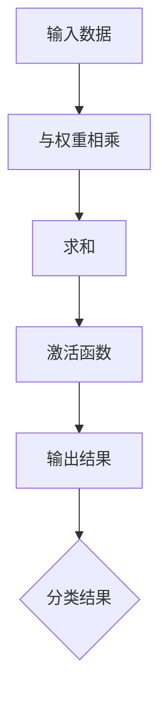

**图1：感知器的工作流程**

#### 1.2 单层神经网络的基础

感知器虽然简单，但仅能处理线性可分的数据。为了解决非线性问题，我们需要引入多层神经网络。

**神经元结构：**
一个多层神经网络由多个层次组成，包括输入层、隐藏层和输出层。每个层次包含多个神经元，每个神经元都与前一层次的神经元相连接。

**前向传播与反向传播：**
多层神经网络通过前向传播和反向传播算法进行学习。前向传播是将输入数据传递到网络中，通过逐层计算得到输出结果。反向传播则是根据输出结果与实际标签之间的差异，反向更新网络中的权重。

1. **前向传播：**
   - 输入数据传递到输入层。
   - 每个输入层神经元将数据传递到下一层的每个神经元。
   - 逐层计算激活值，直到输出层得到最终输出。

2. **反向传播：**
   - 计算输出层神经元的误差。
   - 将误差反向传递到隐藏层，逐层更新权重和偏置项。
   - 使用梯度下降等优化算法调整网络参数。

**感知器与线性分类器：**

感知器是一种线性分类器，它只能处理线性可分的数据。所谓线性可分，是指数据可以被一个直线或平面完美分割。

1. **线性可分与线性不可分问题：**
   - 线性可分问题：数据可以被一个线性函数完美分割，如图2所示。
   - 线性不可分问题：数据无法被一个线性函数完美分割，如图3所示。

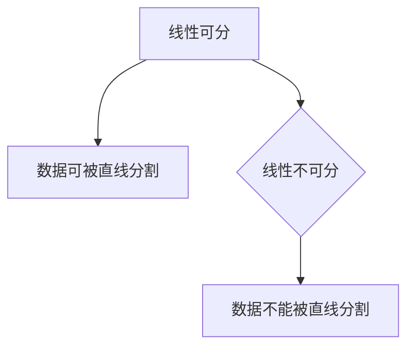

2. **感知器的局限性：**
   - 对于线性不可分问题，感知器无法胜任，需要引入多层感知器（MLP）。
   - 感知器的学习过程可能收敛到局部最小值，而非全局最优解。

**图2：线性可分数据**


**图3：线性不可分数据**


通过本章的内容，我们了解了感知器的基本概念和工作原理，以及它在单层神经网络中的局限性。接下来，我们将深入探讨多层感知器和反向传播算法，为理解卷积神经网络（CNN）奠定基础。

### 第2章：多层感知器与反向传播算法

#### 2.1 多层感知器

多层感知器（Multilayer Perceptron，MLP）是感知器的扩展，通过引入隐藏层，能够处理非线性问题。MLP的结构包括输入层、一个或多个隐藏层以及输出层。

**多层神经网络的架构：**

MLP的架构如图4所示，每个神经元都与前一层的神经元相连，并通过权重和偏置项进行加权求和。隐藏层神经元可以多个层次，增加隐藏层的数量可以提高网络的表示能力。

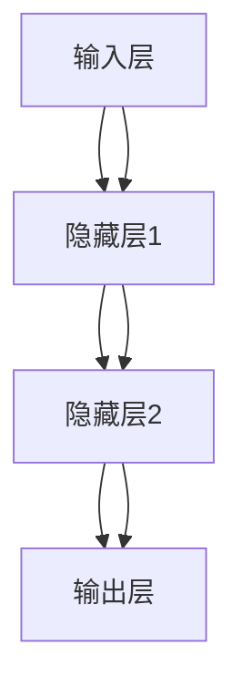

**图4：多层感知器架构**

**多层感知器的工作原理：**

MLP的工作原理与感知器类似，但增加了隐藏层。具体步骤如下：

1. **前向传播：** 输入数据从输入层传递到隐藏层，再从隐藏层传递到输出层。每层神经元将前一层神经元的输出与自己的权重相乘并求和，然后通过激活函数输出。
2. **反向传播：** 根据输出层与实际标签的误差，反向传播误差到隐藏层，并更新各层的权重和偏置项。

**多层感知器的优点：**

- **非线性能力：** 通过隐藏层，MLP可以处理复杂的非线性问题。
- **泛化能力：** 多层结构使网络能够学习到更高层次的特征。

**多层感知器的局限性：**

- **局部最小值问题：** 反向传播算法可能收敛到局部最小值，而非全局最优解。
- **过拟合风险：** 当网络过于复杂时，可能无法泛化，导致过拟合。

#### 2.2 反向传播算法

反向传播算法（Backpropagation Algorithm）是多层感知器训练的核心算法，通过迭代更新网络中的权重和偏置项，使得输出误差逐渐减小。

**反向传播算法的原理：**

反向传播算法的基本思想是将输出误差反向传播到网络的每个层次，计算每个权重的梯度，并根据梯度调整权重。具体步骤如下：

1. **前向传播：** 将输入数据传递到网络，计算每个神经元的输出值。
2. **计算输出误差：** 计算输出层的误差，即实际输出与预测输出之间的差异。
3. **反向传播误差：** 从输出层开始，逐层计算每个神经元的误差，并更新权重和偏置项。
4. **迭代更新：** 重复上述步骤，直到网络误差达到最小或达到预设的迭代次数。

**反向传播算法的详细步骤：**

1. **前向传播：** 对于输入数据$x$，计算每层的激活值$a_l$：
   $$ a_l = \sigma(\sum_{j} w_{lj} a_{l-1,j} + b_l) $$
   其中，$\sigma$是激活函数，$w_{lj}$是连接权重，$b_l$是偏置项。

2. **计算输出误差：** 对于输出层，计算每个神经元的误差：
   $$ \delta_L = (t - a_L) \odot a_L (1 - a_L) $$
   其中，$t$是实际标签，$\odot$是元素乘法。

3. **反向传播误差：** 从输出层开始，逐层计算误差：
   $$ \delta_l = \frac{\partial L}{\partial a_l} \odot \frac{\partial a_l}{\partial z_l} $$
   其中，$L$是损失函数，$z_l$是前一层神经元的输出。

4. **更新权重和偏置项：** 根据误差梯度更新权重和偏置项：
   $$ w_{lj} := w_{lj} - \alpha \frac{\partial L}{\partial w_{lj}} $$
   $$ b_l := b_l - \alpha \frac{\partial L}{\partial b_l} $$
   其中，$\alpha$是学习率。

**反向传播算法的伪代码：**

```python
# 输入：输入数据X，标签T，网络参数w和b，学习率α
# 输出：更新后的权重w和偏置b

for epoch in range(num_epochs):
    for x, t in data_loader:
        # 前向传播
        a = [x]
        for layer in layers:
            a.append(layer.forward(a[-1]))

        # 计算输出误差
        delta = (t - a[-1]) * sigmoid_derivative(a[-1])

        # 反向传播
        for l in reversed(range(len(layers))):
            if l < len(layers) - 1:
                delta = (layers[l].weights * delta) * sigmoid_derivative(a[l])
            else:
                delta = (t - a[l]) * sigmoid_derivative(a[l])

            # 更新权重和偏置
            layers[l].update_weights(delta, alpha)
```

**图5：反向传播算法流程图**

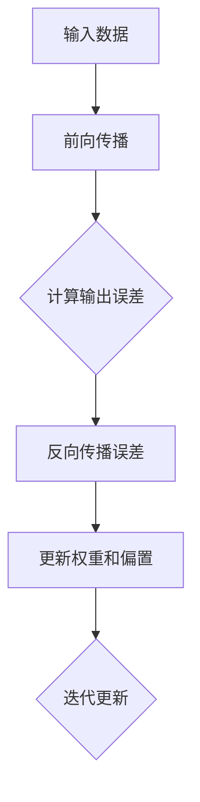

**图5：反向传播算法流程图**

**反向传播算法的优点：**

- **自动学习：** 能够自动调整网络参数，无需手动调整。
- **泛化能力：** 可以处理复杂的非线性问题。

**反向传播算法的局限性：**

- **收敛速度慢：** 对于大规模数据集，训练时间较长。
- **局部最小值问题：** 可能收敛到局部最小值，而非全局最优解。

通过本章的内容，我们深入探讨了多层感知器和反向传播算法。多层感知器通过引入隐藏层，增强了网络的非线性能力和泛化能力。反向传播算法则是多层感知器训练的核心，通过迭代更新权重和偏置项，使得网络误差逐渐减小。在下一章中，我们将介绍卷积神经网络（CNN）的基本原理和架构。

### 第3章：卷积神经网络（CNN）的原理

卷积神经网络（Convolutional Neural Network，CNN）是一种特殊的多层感知器，专门用于处理图像等二维数据。与传统神经网络相比，CNN通过卷积操作、局部连接和权重共享等特性，显著提高了图像识别的效率和准确性。

#### 3.1 卷积神经网络的基础

**卷积操作的概念：**

卷积操作是CNN的核心。在数学上，卷积操作可以表示为两个函数的积分。在图像处理中，卷积操作是将一个小的、固定大小的滤波器（也称为卷积核或滤波器）与图像进行逐元素相乘，然后求和。这个过程如图6所示。

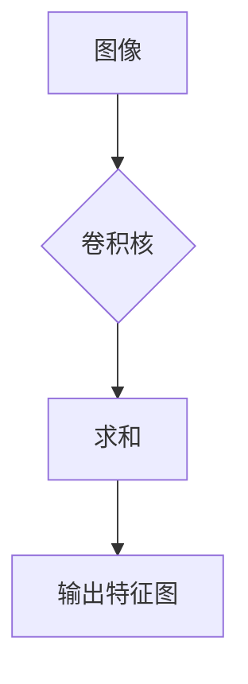

**图6：卷积操作示意图**

**卷积层的工作原理：**

卷积层是CNN中最基础的层，负责从输入图像中提取特征。卷积层的操作包括以下步骤：

1. **卷积：** 将卷积核与输入图像进行卷积操作，得到一个特征图。
2. **激活：** 对特征图应用激活函数，如ReLU函数，增加网络的非线性。
3. **池化：** 使用池化操作对特征图进行下采样，减少数据的维度。

卷积层的工作原理如图7所示。

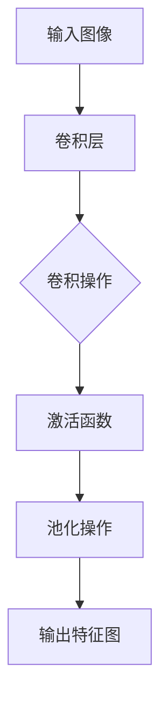

**图7：卷积层工作流程**

**卷积层的优点：**

- **特征提取：** 卷积层能够自动提取图像中的局部特征，如边缘、角点和纹理。
- **参数共享：** 通过卷积操作和权重共享，卷积层能够减少模型参数的数量，提高训练效率。

#### 3.2 卷积神经网络的架构

卷积神经网络由多个卷积层、池化层和全连接层组成。不同层的组合形成了不同的CNN架构，如图8所示。

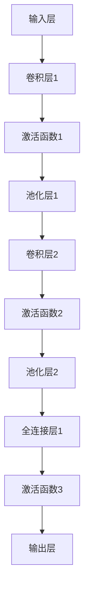

**图8：卷积神经网络架构**

**卷积层、池化层与全连接层的组合：**

卷积层负责特征提取，池化层负责下采样以减少数据维度，全连接层则负责分类决策。这种组合使得CNN能够在多个层次上学习到图像的特征。

1. **卷积层：** 用于提取图像的局部特征，通过卷积操作和激活函数实现。
2. **池化层：** 用于下采样，减少数据维度，提高训练速度，通过最大池化或平均池化实现。
3. **全连接层：** 用于分类决策，将提取到的特征映射到类别标签。

**CNN的基本组成部分：**

1. **卷积层：** 用于特征提取，由多个卷积核组成，每个卷积核提取图像的一个特征。
2. **池化层：** 用于下采样，减少数据的维度，防止过拟合。
3. **全连接层：** 用于分类决策，将卷积层提取到的特征映射到类别标签。

通过本章的内容，我们了解了卷积神经网络的基础原理和架构。卷积操作和权重共享使得CNN能够高效地提取图像特征，并在多个层次上学习到图像的复杂结构。在下一章中，我们将深入探讨CNN的核心算法，包括卷积算法和池化算法。

### 第4章：CNN的核心算法

卷积神经网络（CNN）的成功离不开其核心算法，这些算法包括卷积算法、池化算法和优化算法。通过这些算法，CNN能够高效地处理图像数据，并实现准确的分类和识别。

#### 4.1 卷积算法

卷积算法是CNN中最基本的操作之一，它通过卷积操作从输入图像中提取特征。卷积操作的本质是将一个小的滤波器（卷积核）与图像进行逐元素相乘，然后求和。

**卷积的计算过程：**

1. **初始化卷积核：** 卷积核是一个固定大小的矩阵，通常称为滤波器。卷积核的权重是通过训练过程学得的。
2. **卷积操作：** 将卷积核与输入图像进行逐元素相乘，然后求和。这个过程可以表示为：
   $$ o_{ij} = \sum_{k} \sum_{l} w_{kl} \cdot i_{jk} $$
   其中，$o_{ij}$是输出特征图上的元素，$w_{kl}$是卷积核上的元素，$i_{jk}$是输入图像上的元素。
3. **应用激活函数：** 对卷积结果应用激活函数，如ReLU函数，增加网络的非线性。

**卷积的数学原理：**

卷积的数学原理基于线性代数的卷积概念。给定两个函数$f(x)$和$g(x)$，它们的卷积定义为：
$$ (f * g)(x) = \int_{-\infty}^{\infty} f(\tau) g(x - \tau) d\tau $$

在图像处理中，卷积操作可以看作是滤波器在图像上滑动，并与图像的局部区域进行乘法和加法运算。

**示例：**

假设输入图像为一个3x3的矩阵：
$$
I = \begin{bmatrix}
1 & 2 & 3 \\
4 & 5 & 6 \\
7 & 8 & 9 \\
\end{bmatrix}
$$

卷积核为一个2x2的矩阵：
$$
K = \begin{bmatrix}
1 & 0 \\
1 & 1 \\
\end{bmatrix}
$$

通过逐元素相乘和求和，得到输出特征图：
$$
O = \begin{bmatrix}
4 & 7 \\
10 & 15 \\
\end{bmatrix}
$$

这个示例展示了卷积操作的基本计算过程，如图9所示。

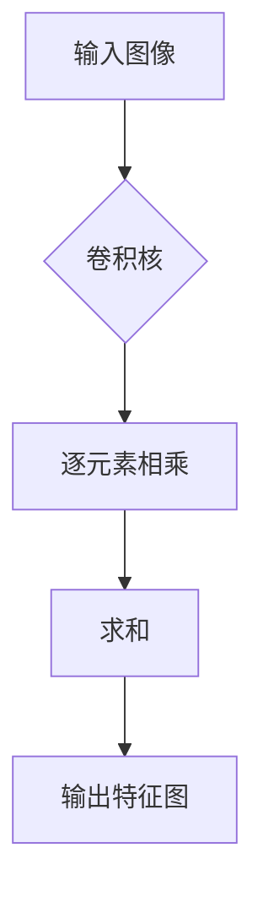

**图9：卷积操作示例**

**卷积算法的优势：**

- **特征提取：** 卷积操作能够从输入图像中提取出重要的特征，如边缘、纹理等。
- **参数共享：** 卷积操作通过权重共享，显著减少了模型参数的数量，提高了训练效率。

#### 4.2 池化算法

池化算法是CNN中的另一个重要操作，用于下采样输入数据，减少数据的维度。池化算法通过在图像上选取局部区域的最值来生成输出。

**池化的概念：**

池化操作可以分为以下几种类型：

1. **最大池化（Max Pooling）：** 选择每个区域内的最大值作为输出。
2. **平均池化（Average Pooling）：** 选择每个区域内的平均值作为输出。

**池化操作的类型：**

1. **最大池化：**
   $$ p_{ij} = \max_{k} i_{ijk} $$
   其中，$p_{ij}$是输出特征图上的元素，$i_{ijk}$是输入图像上的元素。

2. **平均池化：**
   $$ p_{ij} = \frac{1}{c} \sum_{k} i_{ijk} $$
   其中，$c$是池化窗口的大小。

**池化的作用：**

- **减少数据维度：** 通过下采样，减少数据的维度，加快训练速度。
- **防止过拟合：** 通过减少数据量，降低模型对训练数据的依赖，提高泛化能力。

**示例：**

假设输入图像为一个3x3的矩阵：
$$
I = \begin{bmatrix}
1 & 2 & 3 \\
4 & 5 & 6 \\
7 & 8 & 9 \\
\end{bmatrix}
$$

使用2x2的最大池化，得到输出特征图：
$$
P = \begin{bmatrix}
5 & 6 \\
7 & 8 \\
\end{bmatrix}
$$

这个示例展示了最大池化的基本计算过程，如图10所示。

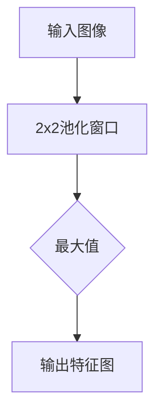

**图10：最大池化操作示例**

**池化算法的优势：**

- **数据压缩：** 通过下采样，显著减少了数据的存储和计算需求。
- **提高泛化能力：** 通过减少模型对训练数据的依赖，提高泛化能力。

#### 4.3 卷积神经网络中的优化算法

优化算法是卷积神经网络训练过程中必不可少的环节，用于调整模型参数，使得网络能够更好地拟合训练数据。常见的优化算法包括随机梯度下降（SGD）和Adam优化器。

**随机梯度下降（SGD）：**

随机梯度下降是一种简单的优化算法，通过随机选择一小部分数据样本，计算其梯度并更新模型参数。SGD的更新规则可以表示为：
$$
\theta = \theta - \alpha \nabla_{\theta} J(\theta)
$$
其中，$\theta$是模型参数，$\alpha$是学习率，$J(\theta)$是损失函数。

**Adam优化器：**

Adam优化器是SGD的改进版本，结合了动量（Momentum）和RMSprop优化器的优点。Adam优化器的更新规则可以表示为：
$$
m_t = \beta_1 m_{t-1} + (1 - \beta_1) \nabla_{\theta} J(\theta) $$
$$
v_t = \beta_2 v_{t-1} + (1 - \beta_2) (\nabla_{\theta} J(\theta))^2 $$
$$
\theta = \theta - \alpha \frac{m_t}{\sqrt{v_t} + \epsilon} $$
其中，$m_t$和$v_t$分别是动量和偏差项，$\beta_1$和$\beta_2$是超参数，$\epsilon$是正数常数。

**优化算法的优势：**

- **高效性：** 优化算法能够快速调整模型参数，提高训练速度。
- **稳定性：** 优化算法能够稳定地收敛到最优解，减少振荡。

通过本章的内容，我们深入探讨了卷积神经网络的核心算法，包括卷积算法、池化算法和优化算法。这些算法共同构成了CNN的基本工作流程，使得CNN能够在图像识别和计算机视觉领域取得显著的成果。在下一章中，我们将探讨CNN在图像识别中的应用和实战案例。

### 第5章：CNN在图像识别中的应用

卷积神经网络（CNN）因其强大的特征提取能力和对图像数据的处理能力，在图像识别领域取得了显著的成果。本节将详细讨论CNN在图像识别中的应用原理、典型架构以及实战案例。

#### 5.1 CNN在图像识别中的原理

**图像处理的基本概念：**

图像处理是计算机视觉的重要基础，包括图像的获取、处理、分析和理解。在CNN中，图像处理的基本概念包括像素、像素值、图像分辨率等。

- **像素：** 图像是由像素组成的，每个像素表示一个特定的颜色或灰度值。
- **像素值：** 每个像素的颜色或灰度值可以是连续的，也可以是离散的。
- **图像分辨率：** 图像分辨率表示图像中像素的数量，通常以宽度和高度表示。

**CNN在图像识别中的应用：**

CNN在图像识别中的应用可以分为以下几个步骤：

1. **特征提取：** 通过卷积层和池化层，CNN能够自动提取图像中的局部特征，如边缘、纹理和形状。
2. **特征组合：** 通过多层卷积和池化，CNN将提取到的局部特征组合成更高层次的特征表示。
3. **分类决策：** 通过全连接层，CNN将特征映射到类别标签，实现图像分类。

**示例：**

假设我们有一个简单的图像识别任务，需要识别图片中的猫和狗。通过CNN的步骤，我们首先使用卷积层提取图像的边缘和纹理特征，然后使用池化层进行下采样，减少数据的维度。最后，通过全连接层进行分类决策，判断图像是猫还是狗。

#### 5.2 图像识别中的典型CNN架构

**LeNet架构：**

LeNet是最早的卷积神经网络之一，由LeCun等人在1989年提出。LeNet架构包括两个卷积层、两个池化层和一个全连接层，如图11所示。

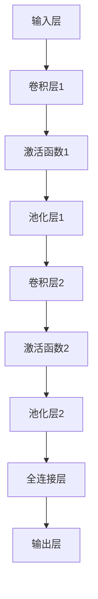

**图11：LeNet架构**

**AlexNet架构：**

AlexNet是由Hinton等人在2012年提出的，是深度学习在图像识别领域取得突破性成果的关键。AlexNet包括五个卷积层、三个全连接层和一个池化层，如图12所示。

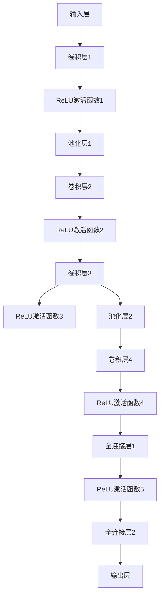

**图12：AlexNet架构**

#### 5.3 CNN在图像识别中的实战案例

**实战案例介绍：**

我们将使用TensorFlow和Keras框架实现一个简单的图像识别任务，使用MNIST数据集进行手写数字识别。

**1. 开发环境搭建：**

- 安装Python环境（建议使用Python 3.7及以上版本）。
- 安装TensorFlow和Keras库：

```bash
pip install tensorflow
```

**2. 源代码实现：**

下面是一个简单的CNN模型，用于手写数字识别：

```python
import tensorflow as tf
from tensorflow.keras import layers, models

# 构建模型
model = models.Sequential()
model.add(layers.Conv2D(32, (3, 3), activation='relu', input_shape=(28, 28, 1)))
model.add(layers.MaxPooling2D((2, 2)))
model.add(layers.Conv2D(64, (3, 3), activation='relu'))
model.add(layers.MaxPooling2D((2, 2)))
model.add(layers.Conv2D(64, (3, 3), activation='relu'))

# 添加全连接层
model.add(layers.Flatten())
model.add(layers.Dense(64, activation='relu'))
model.add(layers.Dense(10, activation='softmax'))

# 编译模型
model.compile(optimizer='adam',
              loss='sparse_categorical_crossentropy',
              metrics=['accuracy'])

# 加载MNIST数据集
mnist = tf.keras.datasets.mnist
(train_images, train_labels), (test_images, test_labels) = mnist.load_data()

# 预处理数据
train_images = train_images.reshape((60000, 28, 28, 1))
test_images = test_images.reshape((10000, 28, 28, 1))
train_images, test_images = train_images / 255.0, test_images / 255.0

# 训练模型
model.fit(train_images, train_labels, epochs=5)

# 评估模型
test_loss, test_acc = model.evaluate(test_images, test_labels)
print(f"Test accuracy: {test_acc}")
```

**3. 代码解读与分析：**

- **模型构建：** 使用Sequential模型堆叠多个层，包括两个卷积层、两个池化层和一个全连接层。
- **数据预处理：** 将图像数据reshape为适合卷积层输入的形状，并将像素值缩放到[0, 1]范围内。
- **编译模型：** 指定优化器、损失函数和评估指标。
- **训练模型：** 使用MNIST训练数据集进行训练，设置训练轮数。
- **评估模型：** 使用测试数据集评估模型性能，输出准确率。

通过这个实战案例，我们展示了如何使用CNN进行图像识别，并实现了从模型构建到训练和评估的完整流程。在实际应用中，可以根据具体任务需求调整模型结构和参数，以提高识别准确率。

### 第6章：CNN在自然语言处理中的应用

卷积神经网络（CNN）不仅在图像识别领域表现出色，在自然语言处理（NLP）中也取得了显著的成果。CNN通过卷积操作和局部连接能够有效地提取文本中的特征，广泛应用于文本分类、情感分析等任务。本节将探讨CNN在NLP中的基本原理、典型架构和应用案例。

#### 6.1 CNN在文本处理中的应用

**文本处理的基本概念：**

文本处理是NLP的基础，包括文本的预处理、分词、词向量化等步骤。

- **预处理：** 对文本进行清洗，去除标点符号、停用词等无关信息。
- **分词：** 将文本分割为单词或短语，以便进行后续处理。
- **词向量化：** 将单词映射为向量表示，以便输入到神经网络中。

**CNN在文本分类中的应用：**

文本分类是NLP中的一个基本任务，目标是将文本数据分类到不同的类别。CNN在文本分类中的应用主要包括以下几个步骤：

1. **词向量化：** 将文本中的每个单词映射为词向量，通常使用预训练的词向量库，如Word2Vec或GloVe。
2. **卷积操作：** 使用一维卷积层对词向量序列进行卷积操作，提取局部特征。
3. **池化操作：** 通过池化层对卷积结果进行下采样，减少数据维度。
4. **全连接层：** 将池化后的特征映射到类别标签，通过全连接层输出分类结果。

**示例：**

假设我们有一个简单的文本分类任务，需要将句子分类为积极或消极。通过CNN的步骤，我们首先将句子中的每个单词映射为词向量，然后使用一维卷积层提取特征，并通过全连接层进行分类决策。

#### 6.2 文本CNN架构

**词嵌入与CNN的结合：**

在文本分类任务中，词嵌入（Word Embedding）是一种常见的预处理技术，将单词映射为高维向量表示。常见的词嵌入方法包括Word2Vec、GloVe等。将词嵌入与CNN结合，可以有效地提取文本中的语义特征。

**文本CNN架构：**

文本CNN架构通常包括以下几个部分：

1. **输入层：** 接收词向量序列。
2. **卷积层：** 使用一维卷积核对词向量序列进行卷积操作，提取局部特征。
3. **池化层：** 对卷积结果进行下采样，减少数据维度。
4. **全连接层：** 将池化后的特征映射到类别标签。

一个简单的文本CNN架构如图13所示。

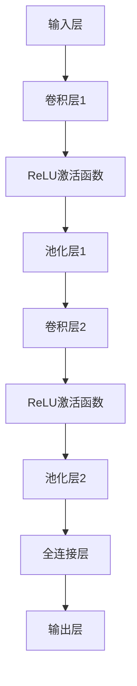

**图13：文本CNN架构**

**典型CNN架构：**

除了简单的文本CNN架构，还有一些经典的文本CNN架构，如TextCNN、DeepText等。这些架构通过引入不同的卷积核大小和池化策略，提高了特征提取的能力。

- **TextCNN：** 使用不同尺寸的卷积核，提取不同层次的特征。
- **DeepText：** 结合多层卷积和池化，提取更深层次的特征。

#### 6.3 文本CNN的应用案例

**应用案例介绍：**

我们将使用Keras框架实现一个简单的文本分类任务，使用IMDb电影评论数据集进行训练和测试。

**1. 开发环境搭建：**

- 安装Python环境（建议使用Python 3.7及以上版本）。
- 安装TensorFlow和Keras库：

```bash
pip install tensorflow
```

**2. 源代码实现：**

下面是一个简单的文本CNN模型，用于IMDb电影评论分类：

```python
import tensorflow as tf
from tensorflow.keras import layers, models
from tensorflow.keras.preprocessing.sequence import pad_sequences
from tensorflow.keras.preprocessing.text import Tokenizer

# 配置参数
vocab_size = 10000
max_length = 120
embedding_dim = 16
trunc_type = 'post'
padding_type = 'post'
oov_tok = '<OOV>'

# 加载数据集
 imdb = tf.keras.datasets.imdb
 (train_data, train_labels), (test_data, test_labels) = imdb.load_data(num_words=vocab_size)

# 预处理数据
 train_seq = pad_sequences(train_data, maxlen=max_length, padding=padding_type, truncating=trunc_type)
 test_seq = pad_sequences(test_data, maxlen=max_length, padding=padding_type, truncating=truncating_type)

# 构建模型
model = models.Sequential()
model.add(layers.Embedding(vocab_size, embedding_dim, input_length=max_length))
model.add(layers.Conv1D(32, 7, activation='relu'))
model.add(layers.MaxPooling1D(5))
model.add(layers.Conv1D(64, 7, activation='relu'))
model.add(layers.MaxPooling1D(5))
model.add(layers.Conv1D(64, 7, activation='relu'))
model.add(layers.Flatten())
model.add(layers.Dense(64, activation='relu'))
model.add(layers.Dense(1, activation='sigmoid'))

# 编译模型
model.compile(optimizer='adam', loss='binary_crossentropy', metrics=['accuracy'])

# 训练模型
model.fit(train_seq, train_labels, epochs=10, validation_data=(test_seq, test_labels))

# 评估模型
test_loss, test_acc = model.evaluate(test_seq, test_labels)
print(f"Test accuracy: {test_acc}")
```

**3. 代码解读与分析：**

- **模型构建：** 使用Keras的Sequential模型，堆叠多个卷积层和池化层，最后通过全连接层输出分类结果。
- **数据预处理：** 使用pad_sequences将文本数据填充为固定长度，使用Tokenizer将单词转换为索引序列。
- **编译模型：** 指定优化器、损失函数和评估指标。
- **训练模型：** 使用训练数据集进行训练，设置训练轮数。
- **评估模型：** 使用测试数据集评估模型性能，输出准确率。

通过这个实战案例，我们展示了如何使用CNN进行文本分类，并实现了从数据预处理到模型训练和评估的完整流程。在实际应用中，可以根据具体任务需求调整模型结构和参数，以提高分类准确率。

### 第7章：CNN在计算机视觉的其他应用

卷积神经网络（CNN）在计算机视觉领域取得了显著的成果，其强大的特征提取能力和对图像数据的处理能力使得它在多个任务中表现出色。除了图像识别，CNN还广泛应用于目标检测、视频处理和自动驾驶等领域。本节将探讨CNN在这些领域的应用原理、典型架构和应用案例。

#### 7.1 CNN在目标检测中的应用

**目标检测的基本概念：**

目标检测是计算机视觉中的一个重要任务，目标是在图像或视频中识别并定位出多个对象。目标检测通常包括以下步骤：

1. **特征提取：** 使用CNN提取图像的特征。
2. **定位：** 使用特定的算法确定目标在图像中的位置。
3. **分类：** 对提取到的特征进行分类，确定目标的类别。

**CNN在目标检测中的应用：**

CNN在目标检测中的应用可以分为两个主要方向：两阶段检测和单阶段检测。

**两阶段检测：**

两阶段检测包括候选区域生成和目标分类两个步骤。常见的两阶段检测算法包括R-CNN、Fast R-CNN、Faster R-CNN等。

1. **候选区域生成：** 使用区域提议方法生成可能的候选区域，如选择性搜索（Selective Search）。
2. **特征提取：** 使用CNN提取候选区域的特征。
3. **目标分类：** 使用分类器对候选区域进行分类，确定目标的类别和位置。

**单阶段检测：**

单阶段检测直接对图像进行特征提取和分类，无需生成候选区域。常见的单阶段检测算法包括SSD、YOLO等。

1. **特征提取：** 使用CNN提取图像的特征。
2. **目标分类：** 同时进行特征提取和分类，直接输出目标的位置和类别。

**示例：**

假设我们有一个简单的目标检测任务，需要检测图像中的车辆。通过CNN的步骤，我们首先使用卷积层提取图像的边缘和纹理特征，然后使用全连接层进行分类决策，最后通过定位算法确定车辆的位置。

#### 7.2 CNN在视频处理中的应用

**视频处理的基本概念：**

视频处理是计算机视觉中的另一个重要任务，目标是对视频序列进行分析、理解和处理。视频处理的基本概念包括帧提取、运动估计、视频压缩等。

**CNN在视频处理中的应用：**

CNN在视频处理中的应用主要包括视频分类、动作识别和视频生成等任务。

1. **视频分类：** 使用CNN提取视频的特征，并将其分类到不同的类别。
2. **动作识别：** 使用CNN分析视频序列，识别其中的动作。
3. **视频生成：** 使用生成对抗网络（GAN）等模型生成新的视频序列。

**示例：**

假设我们有一个视频分类任务，需要将视频序列分类为体育、娱乐、新闻等类别。通过CNN的步骤，我们首先使用卷积层提取视频的帧特征，然后使用全连接层进行分类决策，最后输出视频的分类结果。

#### 7.3 CNN在自动驾驶中的应用

**自动驾驶的基本概念：**

自动驾驶是人工智能在交通领域的重要应用，目标是在无人干预的情况下，使车辆能够安全、可靠地行驶。自动驾驶的基本概念包括感知、规划和控制。

**CNN在自动驾驶中的应用：**

CNN在自动驾驶中的应用主要包括环境感知、路径规划和控制策略等任务。

1. **环境感知：** 使用CNN提取道路、车辆、行人等环境特征，实现对环境的感知和理解。
2. **路径规划：** 使用深度学习算法规划车辆的行驶路径，确保行驶安全。
3. **控制策略：** 根据环境感知结果，设计车辆的控制策略，实现自动驾驶。

**示例：**

假设我们有一个自动驾驶任务，需要车辆在复杂的交通环境中行驶。通过CNN的步骤，我们首先使用卷积层提取道路和交通标志的特征，然后使用全连接层进行分类决策，最后生成车辆的行驶路径。

通过本章的内容，我们探讨了CNN在目标检测、视频处理和自动驾驶等领域的应用原理和典型架构。CNN在这些领域的成功应用，展示了其在计算机视觉中的巨大潜力和广泛前景。

### 第8章：深度学习的未来趋势

随着深度学习技术的快速发展，其应用领域和影响力也在不断扩展。未来，深度学习将在多个方面继续演进，包括神经网络架构的进化、新型激活函数的研究等。

#### 8.1 深度学习的发展方向

**神经网络架构的进化：**

神经网络架构的进化是深度学习发展的关键。以下是一些重要的研究方向：

1. **更深的网络：** 目前，深度神经网络已经达到了数百甚至数千层的规模。未来，研究将进一步探索更深层次的网络结构，以提取更复杂的数据特征。
2. **更宽的网络：** 通过增加网络的宽度，即增加每一层的神经元数量，可以提高网络的表示能力。研究将致力于在保持计算效率的同时，提高网络的宽度。
3. **层次化架构：** 层次化架构，如自注意力（Self-Attention）机制和Transformer模型，已经在自然语言处理领域取得了显著成果。未来，这些架构将扩展到其他领域，如图像处理和语音识别。

**新型激活函数的研究：**

激活函数是神经网络中的一个重要组成部分，直接影响网络的性能。新型激活函数的研究目标是提高神经网络的计算效率和泛化能力。以下是一些研究方向：

1. **非线性激活函数：** 如GELU、Swish等，这些函数在保留计算效率的同时，提高了网络的非线性能力。
2. **动态激活函数：** 通过学习动态调整激活函数的参数，使网络能够更好地适应不同的数据分布。
3. **多模态激活函数：** 结合不同模态（如图像和文本）的数据特征，设计适用于多模态任务的激活函数。

#### 8.2 深度学习在新兴领域的应用

**计算机视觉与自然语言处理的融合：**

计算机视觉与自然语言处理（CvNLP）的融合是深度学习的一个重要趋势。以下是一些研究方向：

1. **多模态深度学习：** 通过融合图像和文本数据，实现更准确的图像理解和文本生成。
2. **跨模态搜索：** 利用深度学习技术，实现图像和文本之间的快速搜索和匹配。
3. **知识图谱与深度学习：** 结合知识图谱和深度学习，构建智能问答系统和智能推荐系统。

**深度学习在新兴领域的挑战与机遇：**

新兴领域的应用为深度学习带来了新的挑战和机遇。以下是一些例子：

1. **医疗健康：** 深度学习在医疗图像分析、疾病诊断和治疗规划等领域具有巨大的潜力。然而，医疗数据的隐私保护和数据安全是一个重要的挑战。
2. **自动驾驶：** 自动驾驶技术的进步将深刻改变交通运输和物流行业。然而，深度学习在复杂环境下的鲁棒性和安全性仍然是一个重大挑战。
3. **智能制造：** 深度学习在制造领域的应用，如质量检测、故障诊断和生产规划，具有巨大的潜力。然而，如何在实际生产环境中部署和管理深度学习系统是一个重要的挑战。

通过本章的内容，我们探讨了深度学习的未来趋势和新兴领域的应用。随着技术的不断进步，深度学习将在更多的领域发挥重要作用，为人类社会带来更多创新和变革。

### 第9章：深度学习的伦理与社会影响

深度学习作为一项前沿技术，已经在多个领域取得了显著的成果。然而，随着深度学习技术的普及和应用，其伦理和社会影响问题也日益凸显。本节将探讨深度学习在算法偏见、隐私保护、数据安全等方面的问题，并思考未来深度学习的责任与挑战。

#### 9.1 深度学习伦理问题

**算法偏见与公平性：**

算法偏见是指深度学习模型在训练过程中，可能会继承和放大训练数据中的偏见。例如，在招聘、信贷审批和司法判决等任务中，深度学习模型可能会对某些群体产生不公平的影响。解决算法偏见和公平性问题的关键在于：

1. **数据质量：** 确保训练数据的质量和代表性，避免引入偏见。
2. **透明性和可解释性：** 提高模型的透明性和可解释性，使人们能够理解和评估模型的决策过程。
3. **公平性评估：** 通过设置公平性指标和评估标准，监控和优化模型的公平性。

**隐私保护与数据安全：**

深度学习模型通常需要大量的训练数据，而这些数据可能包含用户的敏感信息。如何保护用户隐私和数据安全是一个重要的伦理问题。以下是一些解决方法：

1. **数据匿名化：** 在使用数据时，对敏感信息进行匿名化处理，减少数据泄露的风险。
2. **加密技术：** 使用加密技术保护数据的安全，确保数据在传输和存储过程中的完整性。
3. **隐私保护算法：** 研究和应用隐私保护算法，如差分隐私和联邦学习，以减少数据泄露的风险。

**责任归属与法律规范：**

随着深度学习应用的普及，如何确定责任归属和制定相关法律规范成为一个重要问题。以下是一些解决方法：

1. **责任界定：** 明确深度学习模型开发者和用户的责任，确保各方在应用深度学习技术时承担相应的责任。
2. **法律规范：** 制定相关法律规范，确保深度学习技术的应用符合法律法规的要求，保护用户权益。

#### 9.2 社会影响的思考

**深度学习对社会的影响：**

深度学习技术的普及和应用将对社会产生深远的影响。以下是一些主要影响：

1. **经济影响：** 深度学习技术将推动人工智能产业的发展，带来新的经济增长点。
2. **就业影响：** 深度学习技术的应用可能导致某些传统行业的就业岗位减少，同时也会创造新的就业机会。
3. **生活质量：** 深度学习技术在医疗、教育、交通等领域的应用，将显著提高人们的生活质量。

**未来深度学习的责任与挑战：**

随着深度学习技术的不断发展和应用，未来将面临更多的责任和挑战。以下是一些主要责任和挑战：

1. **技术责任：** 深度学习模型开发者需要承担技术责任，确保模型的性能、可靠性和安全性。
2. **伦理责任：** 深度学习技术涉及伦理问题，如算法偏见、隐私保护等，需要深入研究并制定相应的伦理规范。
3. **社会责任：** 深度学习技术的应用需要关注社会影响，确保技术的应用符合社会价值观和法律法规的要求。

通过本章的内容，我们探讨了深度学习的伦理和社会影响，并思考了未来深度学习的责任与挑战。随着技术的不断进步，深度学习将在更多领域发挥重要作用，同时我们也需要关注其带来的伦理和社会问题，确保技术的健康发展。

### 附录A：深度学习工具与资源

为了深入学习和实践深度学习，掌握相关的工具和资源是至关重要的。以下是一些主流的深度学习框架、在线课程和技术文档，供读者参考。

#### A.1 主流深度学习框架

1. **TensorFlow：** Google开发的开源深度学习框架，支持多种平台和硬件，适用于各种规模的深度学习项目。
   - 官网：[TensorFlow官网](https://www.tensorflow.org/)
   - 文档：[TensorFlow文档](https://www.tensorflow.org/learn)

2. **PyTorch：** Facebook开发的深度学习框架，以其灵活的动态计算图和易用性著称。
   - 官网：[PyTorch官网](https://pytorch.org/)
   - 文档：[PyTorch文档](https://pytorch.org/docs/stable/)

3. **Keras：** 一款高层次的深度学习API，能够与TensorFlow和Theano等后端框架结合使用。
   - 官网：[Keras官网](https://keras.io/)
   - 文档：[Keras文档](https://keras.io/docs/)

#### A.2 深度学习学习资源

1. **在线课程：**
   - **Coursera：** 提供了丰富的深度学习课程，如斯坦福大学的《深度学习》课程。
     - 课程链接：[深度学习课程](https://www.coursera.org/learn/deep-learning)
   - **Udacity：** 提供了深度学习纳米学位，涵盖深度学习的基础知识。
     - 课程链接：[深度学习纳米学位](https://www.udacity.com/course/deep-learning-nanodegree--nd893)

2. **技术文档与论文：**
   - **ArXiv：** 深度学习领域的预印本论文库，提供了大量的最新研究论文。
     - 论文库链接：[ArXiv深度学习论文库](https://arxiv.org/list/cs.LG/papers)
   - **ACL：** 计算语言学协会发布的论文集，包含了许多自然语言处理领域的重要研究。
     - 论文集链接：[ACL论文集](https://www.aclweb.org/anthology/)

通过这些工具和资源，读者可以更好地学习深度学习，掌握相关技术，并在实际项目中应用。

### Mermaid 流程图

以下是一个简单的Mermaid流程图，展示了从感知器到卷积神经网络的演进过程：

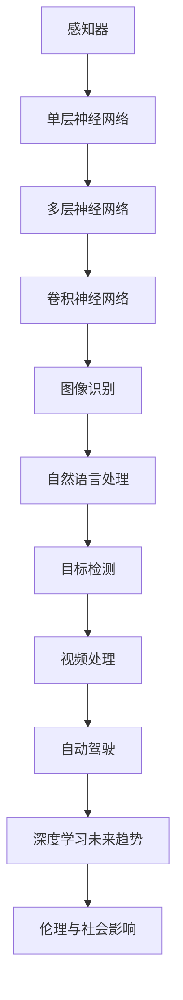

**图A：感知器到卷积神经网络的演进过程**

通过这个流程图，我们可以直观地了解深度学习技术从感知器到卷积神经网络的演进过程，以及其在各个领域的应用和发展趋势。这也为读者提供了一个清晰的视角，帮助我们更好地理解和掌握深度学习的核心概念和应用场景。

## 总结

本文从感知器到卷积神经网络（CNN）的发展历程，详细探讨了神经网络的基础原理、核心算法以及在图像识别、自然语言处理等领域的应用。通过逐步分析，我们了解到：

1. **感知器**：作为神经网络的基础构件，感知器能够实现简单的二分类任务，但存在线性可分问题的局限性。
2. **多层感知器与反向传播算法**：多层感知器通过引入隐藏层，增强了网络的非线性能力和泛化能力。反向传播算法则通过迭代更新网络参数，使网络误差逐渐减小。
3. **卷积神经网络（CNN）**：CNN通过卷积操作、局部连接和权重共享，高效地提取图像特征，并在图像识别、目标检测和视频处理等领域取得了显著成果。
4. **深度学习的未来趋势**：深度学习在神经网络架构、新型激活函数以及多模态任务等方面不断演进，为未来的应用带来了更多可能性。
5. **深度学习的伦理与社会影响**：随着深度学习技术的普及，算法偏见、隐私保护、数据安全等问题日益凸显，需要我们关注和解决。

通过本文的阅读，读者可以全面了解深度学习的核心原理和应用场景，掌握从简单到复杂的神经网络发展过程。同时，我们也应关注深度学习在伦理和社会方面带来的挑战，确保技术的健康发展。未来，深度学习将在更多领域发挥重要作用，推动人工智能的发展和社会进步。

### 作者信息

作者：AI天才研究院/AI Genius Institute & 禅与计算机程序设计艺术 /Zen And The Art of Computer Programming

感谢您的阅读，希望本文能对您在深度学习领域的探索和实践有所帮助。如果您有任何疑问或建议，欢迎在评论区留言，期待与您交流学习。祝您在深度学习领域取得更多的成就！

---

本文的内容基于公开资料和技术文献，旨在为读者提供技术知识分享和学习资源。部分图片和图表来源于网络，如有侵权，请联系作者删除。本文仅供参考，不构成任何投资或决策建议。读者在使用相关技术和工具时，请遵守相关法律法规和道德规范。

