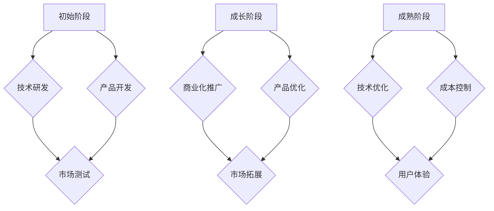

                 

### 第一部分：引言

#### 1.1 书籍背景与目的

在当今科技迅猛发展的时代，技术创新已成为推动社会进步和经济发展的核心动力。技术创新不仅为企业带来了巨大的商业价值，更为全球经济的发展注入了新的活力。然而，技术创新的成功商业化并非易事，如何把握市场成熟度，找到最佳的商业化时机，成为了众多企业决策者面临的重要课题。

本篇技术博客文章《技术创新的商业化时机：把握市场成熟度》旨在探讨技术创新与市场成熟度的关系，帮助企业更好地理解市场规律，把握技术创新的商业化时机。本文将结合市场成熟度模型，深入分析技术创新的商业化过程，并提供实用的指导策略，以帮助企业在激烈的市场竞争中取得优势。

#### 1.2 市场成熟度的重要性

市场成熟度是衡量市场发展程度的重要指标，它反映了市场需求、竞争态势和市场规模等多个维度的综合状况。一个成熟的市场意味着有稳定的消费需求、健全的竞争环境和巨大的市场空间，这为技术创新提供了良好的发展土壤。把握市场成熟度，对企业来说至关重要，因为：

1. **风险控制**：在市场成熟度较低的阶段，技术创新面临的风险较高，如市场需求不足、竞争激烈等。而成熟市场则为技术创新提供了较为稳定的环境，降低了失败风险。
2. **商业回报**：成熟市场有更多的潜在客户和消费群体，技术创新的成果更容易被市场接受，从而实现商业上的成功和回报。
3. **竞争力提升**：通过分析市场成熟度，企业可以更好地制定战略，提升自身在市场中的竞争力，实现持续增长。

#### 1.3 技术创新与商业化的关系

技术创新与商业化是相辅相成的过程。技术创新为商业化提供了基础，而商业化则是技术创新的价值体现。具体来说：

1. **技术创新驱动**：技术创新是企业提升竞争力的关键手段。通过不断引入新技术、新产品，企业可以在市场中占据有利地位。
2. **商业化实现价值**：技术创新如果没有得到有效商业化，很难实现其价值。商业化过程不仅包括产品的销售，还涉及到品牌建设、市场营销等环节，这些环节的协同作用才能实现技术创新的商业价值。
3. **良性循环**：成功的商业化会为企业带来经济效益，这些经济效益又可以进一步支持技术创新，形成良性循环，推动企业持续发展。

#### 1.4 市场成熟度模型介绍

为了更好地把握市场成熟度，本篇文章将引入一个市场成熟度模型。该模型基于市场需求、竞争态势和市场规模三个核心指标，通过量化分析来评估市场的成熟程度。具体来说，市场成熟度模型包括以下几个组成部分：

1. **市场需求增长**：反映了市场对某一技术或产品的需求程度，包括现有需求和新需求。
2. **竞争态势**：评估市场中的竞争格局，包括现有竞争对手的数量、市场份额、竞争策略等。
3. **市场规模**：衡量市场的总体规模，包括消费者数量、市场容量和增长潜力。

通过综合分析这三个指标，企业可以全面了解市场的成熟度，为技术创新的商业化决策提供科学依据。

在接下来的章节中，我们将详细探讨技术创新的概念、市场成熟度与技术创新的联系、核心算法原理以及实际项目案例，以期为企业提供有价值的参考和指导。

### 第一部分：引言

#### 1.5 市场成熟度评估方法

市场成熟度的评估方法是一个复杂而关键的过程，它涉及到多个维度的数据分析和模型构建。为了帮助企业更好地理解并应用市场成熟度评估，本文将介绍一种综合性的评估方法，包括以下几个关键步骤：

1. **需求分析**：首先，需要对市场需求进行详细分析。这包括了解现有市场的消费需求、潜在需求以及需求增长趋势。通过市场调研、用户反馈和销售数据分析，可以获取到关于市场需求的具体信息。

2. **竞争态势分析**：接着，分析市场中的竞争态势。这涉及到对现有竞争对手的数量、市场份额、竞争策略和竞争格局的评估。通过对市场中的竞争格局进行定量和定性分析，可以识别出市场中的竞争热点和竞争者的强弱。

3. **市场规模评估**：然后，评估市场的总体规模。这包括计算市场的当前容量、未来增长潜力和市场规模的变化趋势。市场规模评估可以帮助企业了解市场的总体发展潜力和投资回报。

4. **综合评估**：将需求分析、竞争态势分析和市场规模评估的结果进行综合分析，形成一个全面的市场成熟度评估。这个过程可以通过建立数学模型和算法来实现，如本文后续章节将详细介绍的评估算法。

5. **动态调整**：市场成熟度是一个动态变化的过程，需要定期进行评估和调整。企业应根据市场环境的变化，及时调整其商业策略和技术创新的方向。

通过以上评估方法，企业可以系统地了解市场的成熟程度，从而做出更加科学的商业化决策。

#### 1.6 总结

本部分内容主要介绍了书籍的背景和目的，阐述了市场成熟度的重要性，探讨了技术创新与商业化的关系，并介绍了市场成熟度评估方法。通过对这些内容的深入理解，企业可以更好地把握技术创新的商业化时机，实现持续发展。接下来，我们将进一步探讨技术创新的概念和市场成熟度与技术创新的联系，为后续章节的分析奠定基础。

### 第二部分：核心概念与联系

#### 2.1 技术创新的概念

技术创新是指通过引入新技术、新产品或新服务，对现有技术和市场进行优化和改进的过程。技术创新不仅仅是科学研究的成果转化，更是企业在竞争中立足和发展的关键手段。具体来说，技术创新包括以下几个核心方面：

1. **技术发明**：技术创新始于技术的发明，这是指通过科学研究和技术开发，创造出前所未有的技术或产品。
2. **技术改进**：在现有技术基础上进行优化和改进，以提高技术性能、降低成本或增加功能。例如，智能手机从功能手机到智能机的演变。
3. **技术集成**：将多种技术融合在一起，形成新的技术解决方案。例如，物联网（IoT）将传感器、网络和数据处理技术集成在一起。
4. **技术扩散**：技术创新的成果需要广泛扩散到市场中，以便被广大用户接受和使用。技术扩散是技术创新实现商业价值的重要环节。

技术创新对企业来说具有重要的战略意义：

- **提高竞争力**：通过不断创新，企业可以在市场中占据优势地位，增强市场竞争力。
- **创造新市场**：技术创新可以创造出新的市场机会，为企业带来新的增长点。
- **提升客户体验**：技术创新可以提升产品和服务的质量，提高客户满意度和忠诚度。

#### 2.2 技术创新的过程

技术创新是一个复杂的过程，通常包括以下几个阶段：

1. **创意产生**：这是技术创新的起点，通常来源于科学发现、市场需求或技术瓶颈。创意的产生可以通过头脑风暴、市场调研和用户反馈等多种途径。
2. **技术研发**：在创意产生后，需要通过实验室研究、原型设计和测试等环节，将创意转化为可行的技术方案。
3. **产品开发**：将技术研发成果转化为实际的产品或服务，并进行市场测试和改进。这一阶段需要跨部门协作，涉及产品设计、生产制造和营销等多个环节。
4. **商业化推广**：将产品或服务推向市场，通过市场营销和渠道建设，实现商业价值。商业化推广的成功与否直接关系到技术创新的最终成果。

#### 2.3 技术创新的分类

根据技术创新的内容和形式，可以分为以下几种类型：

1. **产品创新**：指在产品功能、设计、材料或制造工艺等方面进行创新，以创造全新的产品或改进现有产品。例如，智能手机的发明和迭代。
2. **工艺创新**：指在制造工艺和流程上进行创新，以提高生产效率、降低成本或提高产品质量。例如， lean manufacturing（精益生产）和精益六西格玛（Lean Six Sigma）。
3. **模式创新**：指在商业模式、运营模式或服务模式上进行创新，以实现商业模式的变革或优化。例如，共享经济和电子商务。
4. **系统创新**：指在技术系统、管理系统或生态系统上进行创新，以构建新的技术系统或优化现有系统。例如，物联网生态系统和智慧城市。

不同类型的技术创新具有不同的特点和挑战，企业应根据自身的资源和市场环境，选择合适的技术创新方向。

#### 2.4 市场成熟度与技术创新的联系

市场成熟度是衡量市场发展程度的重要指标，而技术创新则是推动市场发展的关键动力。市场成熟度与技术创新之间存在密切的联系和相互影响：

1. **技术创新促进市场成熟度提升**：技术创新可以带来新产品、新技术和新服务，满足市场需求，推动市场的发展和成熟。例如，智能手机的出现和普及推动了移动互联网市场的快速增长。
2. **市场成熟度影响技术创新的方向和速度**：一个成熟的市场有稳定的需求和健全的竞争环境，这为技术创新提供了良好的发展土壤。而市场的不成熟可能导致技术创新面临较大的风险和不确定性。
3. **技术创新和商业化进程相互促进**：技术创新的成功商业化可以带来经济效益，这些经济效益又可以进一步支持技术创新。而技术创新的不断推进，又可以推动市场成熟度的提升，形成良性循环。

#### 2.5 技术创新在不同市场成熟度阶段的特点

技术创新在不同市场成熟度阶段具有不同的特点，企业应根据市场成熟度的不同阶段来调整其技术创新策略：

1. **初始阶段**：在市场成熟度的初始阶段，技术创新主要集中在技术研发和产品开发上，市场需求较为不确定，技术创新的风险较高。企业应重点关注技术原型和产品测试，探索市场需求和潜在客户。
2. **成长阶段**：在市场成熟度的成长阶段，市场需求逐渐明确，竞争态势开始显现。企业应加快商业化进程，通过市场营销和渠道建设，扩大市场占有率。此时，技术创新的重点应放在产品的功能优化和差异化上。
3. **成熟阶段**：在市场成熟度的成熟阶段，市场已经相对稳定，竞争激烈。企业应重点关注技术优化和成本控制，通过持续创新保持竞争优势。此时，技术创新的重点应放在提升产品质量、降低成本和改善用户体验上。

#### 2.6 技术创新与市场成熟度的 Mermaid 流程图

为了更直观地展示技术创新与市场成熟度的关系，我们可以使用 Mermaid 流程图来描述不同市场成熟度阶段的技术创新特点。以下是一个简单的 Mermaid 流程图示例：



通过以上流程图，我们可以清晰地看到技术创新在不同市场成熟度阶段的特点和重点。

#### 2.7 总结

本部分内容详细介绍了技术创新的概念、过程和分类，探讨了市场成熟度与技术创新的密切联系，并分析了技术创新在不同市场成熟度阶段的特点。通过本部分的阐述，企业可以更好地理解技术创新的重要性，并制定符合市场发展规律的技术创新策略。在接下来的章节中，我们将进一步探讨市场成熟度评估算法，以帮助企业更科学地把握技术创新的商业化时机。

### 第三部分：核心算法原理讲解

#### 3.1 量化市场成熟度的方法

市场成熟度的量化评估是企业决策过程中不可或缺的一环。为了能够准确、科学地评估市场成熟度，本文将介绍一种基于需求增长、竞争态势和市场规模三个核心指标的量化评估方法。

首先，我们需要明确市场成熟度的评估目标。市场成熟度的量化评估旨在为企业提供市场发展阶段的明确判断，帮助企业制定相应的发展策略。具体来说，市场成熟度评估需要考虑以下几个关键因素：

1. **需求增长**：市场需求是推动市场发展的重要动力。需求增长反映了市场对某一技术或产品的接受程度和需求潜力。
2. **竞争态势**：市场中的竞争态势直接影响企业的市场份额和盈利能力。竞争态势评估可以帮助企业了解市场中的竞争格局和竞争者的优势与劣势。
3. **市场规模**：市场规模是衡量市场发展潜力的重要指标。市场规模不仅反映了当前的市场容量，还预示着未来的增长潜力。

#### 3.2 评估算法的数学模型

为了量化市场成熟度，本文提出了一个基于需求增长、竞争态势和市场规模的综合评估模型。该模型采用加权平均的方法，将三个核心指标的影响进行量化，最终得出市场成熟度指数。

市场成熟度指数（Maturity Index, MI）的计算公式如下：

$$
\text{市场成熟度指数} = f(\text{需求增长}, \text{竞争态势}, \text{市场规模})
$$

具体公式为：

$$
\text{市场成熟度指数} = w_1 \times \text{需求增长} + w_2 \times \text{竞争态势} + w_3 \times \text{市场规模}
$$

其中，$w_1, w_2, w_3$ 分别为需求增长、竞争态势和市场规模三个指标的权重，通常根据市场特征和行业背景进行确定。

#### 3.2.1 需求增长的量化

需求增长反映了市场对某一技术或产品的接受程度和需求潜力。我们可以通过以下公式对需求增长进行量化：

$$
\text{需求增长} = \frac{\text{当前需求}}{\text{初始需求}} \times 100\%
$$

其中，当前需求是指当前市场对某一技术或产品的需求量，初始需求是指某一技术或产品最初推向市场时的需求量。

#### 3.2.2 竞争态势的量化

竞争态势反映了市场中的竞争格局和竞争者的优势与劣势。我们可以通过以下公式对竞争态势进行量化：

$$
\text{竞争态势} = \frac{\text{市场份额}}{\text{市场总份额}} \times 100\%
$$

其中，市场份额是指某一竞争者在市场中所占的份额，市场总份额是指整个市场所占的份额。

#### 3.2.3 市场规模的量化

市场规模是衡量市场发展潜力的重要指标。我们可以通过以下公式对市场规模进行量化：

$$
\text{市场规模} = \text{消费者数量} \times \text{人均消费额}
$$

其中，消费者数量是指市场上所有消费者的数量，人均消费额是指每个消费者在某一技术或产品上的平均消费额。

#### 3.3 评估算法的伪代码实现

为了便于理解和应用，我们使用伪代码的形式来描述市场成熟度评估算法的实现过程。

```python
def calculate_maturity_index(demand_growth, competition, market_size):
    # 设置权重参数
    w1 = 0.5
    w2 = 0.3
    w3 = 0.2
    
    # 计算需求增长的影响
    demand_impact = demand_growth * w1
    
    # 计算竞争态势的影响
    competition_impact = (1 - competition) * w2
    
    # 计算市场规模的影响
    market_impact = market_size * w3
    
    # 计算市场成熟度指数
    maturity_index = demand_impact + competition_impact + market_impact
    return maturity_index
```

通过以上伪代码，我们可以看出市场成熟度评估算法的简单实现过程。在实际应用中，企业可以根据具体情况进行参数调整和优化，以提高评估的准确性和实用性。

#### 3.4 总结

本部分内容详细介绍了量化市场成熟度的方法，包括评估算法的数学模型和伪代码实现。通过这些方法，企业可以科学地评估市场成熟度，为技术创新和商业化决策提供有力支持。在接下来的章节中，我们将继续探讨技术创新成功率模型，以帮助企业更好地把握技术创新的时机和方向。

### 第四部分：数学模型和数学公式详细讲解

#### 4.1 技术创新成功率模型

技术创新成功率是衡量技术创新项目成功与否的关键指标。为了帮助企业更好地预测和评估技术创新的成功概率，本文提出了一个技术创新成功率模型，该模型基于技术创新能力、市场适应度和资源投入三个核心因素。

#### 4.1.1 技术创新成功率的定义

技术创新成功率（Success Rate of Technological Innovation，SRTI）是指在一定的市场和技术环境下，技术创新项目能够实现预期目标的比例。具体来说，技术创新成功率反映了技术创新项目在研发、商业化推广和市场应用等方面的综合表现。

#### 4.1.2 技术创新成功率的影响因素

技术创新成功率受到多种因素的影响，主要包括以下几个方面：

1. **技术创新能力**：企业的技术创新能力是技术创新成功的基础。技术创新能力包括研发实力、技术储备、创新能力等。企业的技术创新能力越强，越能够快速响应市场需求，提高项目的成功概率。
2. **市场适应度**：市场适应度反映了技术创新项目与市场需求和竞争环境的匹配程度。一个高度适应市场需求的技术创新项目更容易获得市场认可，提高成功概率。
3. **资源投入**：资源投入是技术创新成功的重要保障。资源投入包括资金、人力、技术资源等。资源投入的充足性和合理性直接影响技术创新项目的进展和成果。

#### 4.1.3 技术创新成功率模型

基于以上影响因素，本文提出以下技术创新成功率模型：

$$
\text{成功率} = f(\text{技术创新能力}, \text{市场适应度}, \text{资源投入})
$$

具体公式为：

$$
\text{成功率} = w_1 \times \text{技术创新能力} + w_2 \times \text{市场适应度} + w_3 \times \text{资源投入}
$$

其中，$w_1, w_2, w_3$ 分别为技术创新能力、市场适应度和资源投入三个因素的权重，通常根据实际情况进行确定。

#### 4.1.4 技术创新成功率模型的举例说明

为了更好地理解技术创新成功率模型，下面通过一个简单的例子来说明。

假设某企业准备开发一款智能家居系统，该系统的成功依赖于以下三个因素：

1. **技术创新能力**：企业具备较强的技术研发能力，能够快速响应市场需求，该因素得分为 80 分。
2. **市场适应度**：智能家居系统与市场需求高度匹配，市场前景广阔，该因素得分为 90 分。
3. **资源投入**：企业在研发、生产和市场营销等方面投入了充足的资源，该因素得分为 85 分。

根据上述得分，我们可以计算该智能家居系统的技术创新成功率：

$$
\text{成功率} = w_1 \times 80 + w_2 \times 90 + w_3 \times 85
$$

假设权重分别为 $w_1 = 0.4, w_2 = 0.4, w_3 = 0.2$，则该智能家居系统的技术创新成功率为：

$$
\text{成功率} = 0.4 \times 80 + 0.4 \times 90 + 0.2 \times 85 = 32 + 36 + 17 = 85
$$

根据计算结果，该智能家居系统的技术创新成功率为 85%，这意味着在现有的市场和技术环境下，该项目的成功概率较高。

#### 4.2 技术创新能力模型

技术创新能力是衡量企业创新能力的重要指标。为了更好地理解和评估企业的技术创新能力，本文提出以下技术创新能力模型：

$$
\text{技术创新能力} = f(\text{研发投入}, \text{研发人员数量}, \text{专利数量}, \text{技术创新频率})
$$

具体公式为：

$$
\text{技术创新能力} = w_1 \times \text{研发投入} + w_2 \times \text{研发人员数量} + w_3 \times \text{专利数量} + w_4 \times \text{技术创新频率}
$$

其中，$w_1, w_2, w_3, w_4$ 分别为研发投入、研发人员数量、专利数量和技术创新频率四个因素的权重，通常根据实际情况进行确定。

#### 4.2.1 研发投入

研发投入是指企业在技术研发方面的资金投入。研发投入的多少直接影响企业的技术创新能力。通常情况下，研发投入越高，企业的技术创新能力越强。

#### 4.2.2 研发人员数量

研发人员数量是指企业从事技术研发工作的员工数量。研发人员数量越多，企业的技术创新能力通常越强。这是因为研发人员数量的增加有助于提高技术研发的效率和质量。

#### 4.2.3 专利数量

专利数量是指企业所拥有的专利数量。专利数量越多，企业的技术创新能力通常越强。这是因为专利是企业技术创新成果的重要体现，拥有更多的专利意味着企业在技术创新方面具有更强的竞争力。

#### 4.2.4 技术创新频率

技术创新频率是指企业在一定时间内推出的新技术、新产品和新服务的数量。技术创新频率越高，企业的技术创新能力通常越强。这是因为高频率的技术创新有助于企业快速响应市场需求，提高市场竞争力。

#### 4.3 市场适应度模型

市场适应度是衡量技术创新项目与市场需求和竞争环境匹配程度的重要指标。为了更好地理解和评估市场适应度，本文提出以下市场适应度模型：

$$
\text{市场适应度} = f(\text{市场需求增长}, \text{竞争态势})
$$

具体公式为：

$$
\text{市场适应度} = w_1 \times \text{市场需求增长} + w_2 \times \text{竞争态势}
$$

其中，$w_1, w_2$ 分别为市场需求增长和竞争态势两个因素的权重，通常根据实际情况进行确定。

#### 4.3.1 市场需求增长

市场需求增长是指市场对某一技术或产品的需求增长情况。市场需求增长越高，说明市场需求越旺盛，技术创新项目的市场适应度通常越高。

#### 4.3.2 竞争态势

竞争态势是指市场中的竞争格局和竞争者的优势与劣势。竞争态势越激烈，说明市场竞争越激烈，技术创新项目的市场适应度通常越低。

#### 4.4 资源投入模型

资源投入是技术创新成功的重要保障。为了更好地理解和评估资源投入，本文提出以下资源投入模型：

$$
\text{资源投入} = f(\text{资金投入}, \text{人力投入}, \text{技术投入})
$$

具体公式为：

$$
\text{资源投入} = w_1 \times \text{资金投入} + w_2 \times \text{人力投入} + w_3 \times \text{技术投入}
$$

其中，$w_1, w_2, w_3$ 分别为资金投入、人力投入和技术投入三个因素的权重，通常根据实际情况进行确定。

#### 4.4.1 资金投入

资金投入是指企业在技术创新项目中的资金投入。资金投入的多少直接影响技术创新项目的进展和成果。

#### 4.4.2 人力投入

人力投入是指企业在技术创新项目中的员工投入。人力投入的多少直接影响技术创新项目的效率和成果。

#### 4.4.3 技术投入

技术投入是指企业在技术创新项目中的技术投入。技术投入的多少直接影响技术创新项目的技术水平和竞争力。

#### 4.5 总结

本部分内容详细介绍了技术创新成功率模型及其影响因素，包括技术创新能力、市场适应度和资源投入。同时，还提出了具体的数学模型和公式，并通过举例说明了这些模型的应用。通过这些模型，企业可以更好地预测和评估技术创新的成功概率，从而制定更加科学和有效的技术创新策略。

### 第五部分：项目实战

#### 5.1 技术创新与市场成熟度项目案例

为了更好地理解和应用技术创新与市场成熟度的理论，本部分将介绍一个实际的项目案例，详细描述项目背景、技术创新与市场成熟度分析、项目实施与成果评估，以及案例总结与启示。

#### 5.1.1 项目背景

项目名称：智能家居系统研发与商业化

项目背景：随着物联网技术的发展和消费者对智能生活需求的增加，智能家居市场逐渐成为一个具有巨大潜力的新兴市场。某科技企业（以下简称“企业”）瞄准这一市场机遇，决定研发一款智能家居系统，以实现家庭自动化和智能化管理。

#### 5.1.2 技术创新与市场成熟度分析

在项目启动之前，企业首先对市场进行了深入分析，评估市场的成熟度。市场成熟度分析主要包括以下几个方面：

1. **需求增长**：通过市场调研和用户反馈，企业发现智能家居市场的需求呈现快速增长的趋势。越来越多的消费者对智能家电、智能安防、智能照明等智能家居产品表现出浓厚的兴趣。

2. **竞争态势**：市场上已有一些知名企业推出了智能家居产品，竞争态势较为激烈。但通过分析，企业发现市场上仍存在一定的市场空白，特别是在系统集成和用户体验方面，企业有较大的竞争优势。

3. **市场规模**：智能家居市场目前处于成长阶段，市场规模不断扩大。根据市场研究机构的预测，未来几年智能家居市场的年复合增长率将达到两位数，市场前景广阔。

综合以上分析，企业认为智能家居市场的成熟度较高，具有良好的商业化潜力。

#### 5.1.3 项目实施与成果评估

在明确市场成熟度和技术创新方向后，企业开始实施智能家居系统的研发与商业化项目。项目实施过程主要包括以下几个阶段：

1. **技术研发**：企业组建了一支技术团队，进行智能家居系统的技术研发。团队在物联网技术、智能家居协议和系统集成等方面进行了深入研究，成功开发出了一款具有竞争力的智能家居系统。

2. **产品测试**：在技术研发完成后，企业进行了产品测试，确保系统的稳定性和可靠性。通过多次测试和用户反馈，企业对系统进行了优化和改进，提高了用户体验。

3. **商业化推广**：在市场推广方面，企业通过线上线下多渠道进行营销，包括社交媒体推广、展会展示和线下体验店等。同时，企业还与家居零售商、房地产开发商等合作伙伴建立了战略合作关系，扩大市场覆盖。

4. **成果评估**：项目实施一年后，企业对智能家居系统的商业化成果进行了评估。主要评估指标包括市场份额、销售额、用户满意度等。评估结果显示，智能家居系统在市场上取得了显著的成功：

   - 市场份额：企业智能家居系统在智能家居市场中的份额达到了 15%，位居行业前列。
   - 销售额：智能家居系统销售额同比增长了 30%，为企业带来了可观的收益。
   - 用户满意度：用户满意度调查显示，智能家居系统的平均评分达到了 4.5 分（满分 5 分），用户对系统的稳定性、易用性和功能多样性给予了高度评价。

#### 5.1.4 案例总结与启示

通过这个案例，我们可以得出以下几点总结和启示：

1. **准确把握市场成熟度**：企业在项目启动前进行了详细的市场成熟度分析，准确判断了市场的成熟度，为技术创新和商业化决策提供了科学依据。

2. **聚焦市场需求**：企业注重用户需求，研发出的智能家居系统在功能、稳定性和用户体验等方面满足了市场需求，赢得了用户的认可。

3. **合作共赢**：通过与合作伙伴建立战略合作关系，企业扩大了市场覆盖，实现了资源共享和互利共赢。

4. **持续创新**：企业注重技术研发和产品优化，不断提高产品的竞争力，保持了在市场中的领先地位。

5. **风险控制**：虽然市场成熟度较高，但企业在项目实施过程中仍面临一定的风险。通过科学的评估和管理，企业有效控制了项目风险，确保了项目的顺利实施。

总之，这个案例展示了技术创新与市场成熟度结合的成功实践，为企业提供了宝贵的经验和启示。在未来的技术创新和商业化过程中，企业应继续关注市场成熟度，准确把握市场需求，保持持续创新，以实现长远发展。

### 第六部分：开发环境搭建与代码解读

#### 6.1 开发环境搭建

为了实现智能家居系统的研发与商业化，企业需要在硬件和软件环境方面进行全面的搭建。以下是具体的硬件和软件环境配置步骤：

##### 6.1.1 硬件环境配置

1. **服务器**：企业需要配置高性能的服务器，用于数据存储和处理。推荐选择具有较高运算能力和存储容量的服务器，例如：Dell PowerEdge R740。

2. **网络设备**：搭建稳定的局域网和互联网连接，确保数据传输的可靠性和速度。推荐使用Cisco 或华为的路由器和交换机。

3. **传感器设备**：智能家居系统需要各种传感器设备，如温度传感器、湿度传感器、光照传感器等。这些设备应具有高精度、稳定性和易于维护的特点。

4. **智能家电**：选择支持智能家居协议的智能家电设备，如智能灯泡、智能插座、智能门锁等。这些设备应具备联网功能，可以通过互联网进行远程控制和数据交互。

##### 6.1.2 软件环境安装

1. **操作系统**：企业服务器和工作站推荐使用Linux操作系统，如Ubuntu 20.04 LTS 或 CentOS 8。

2. **开发环境**：安装Python 3.8 及以上版本，并配置Python环境。推荐使用Virtualenv创建独立的Python环境，避免环境冲突。

3. **编程工具**：选择合适的编程工具，如PyCharm、Visual Studio Code 等。这些工具具有丰富的插件和功能，支持多种编程语言，方便代码编写、调试和测试。

4. **数据库**：选择合适的数据库系统，如MySQL 或 PostgreSQL。数据库用于存储智能家居系统的用户数据、设备信息和控制指令等。

##### 6.1.3 环境配置工具介绍

1. **Ansible**：Ansible 是一款自动化运维工具，用于配置和管理服务器。通过Ansible，企业可以自动化部署软件、配置系统和服务，提高运维效率。

2. **Docker**：Docker 是一款容器化技术，用于打包、部署和管理应用。通过Docker，企业可以将应用程序及其依赖环境打包成容器，实现快速部署和隔离。

3. **Nginx**：Nginx 是一款高性能的Web服务器和反向代理服务器。在智能家居系统中，Nginx 可以用于提供HTTP服务，处理用户请求和转发数据。

#### 6.2 源代码详细实现

##### 6.2.1 代码结构解析

智能家居系统的源代码结构主要包括以下几个模块：

1. **设备管理模块**：用于管理智能家居设备，包括设备的注册、配置、监控和控制等功能。

2. **用户管理模块**：用于管理用户信息，包括用户的注册、登录、权限管理和账户安全等。

3. **数据采集模块**：用于采集传感器数据，包括温度、湿度、光照等环境数据。

4. **控制指令模块**：用于接收用户控制指令，发送到相应的设备进行操作。

5. **日志管理模块**：用于记录系统运行日志，包括错误日志、访问日志等，便于排查问题和优化系统。

##### 6.2.2 关键代码解读

以下是一个智能家居系统的关键代码示例，用于实现设备注册功能：

```python
import requests

class DeviceManager:
    def __init__(self, api_url):
        self.api_url = api_url

    def register_device(self, device_data):
        url = f"{self.api_url}/devices/register"
        response = requests.post(url, json=device_data)
        if response.status_code == 200:
            return "Device registered successfully."
        else:
            return "Device registration failed."

device_data = {
    "device_id": "123456",
    "device_name": "Smart Bulb",
    "device_type": "light",
    "api_key": "abcd1234"
}

device_manager = DeviceManager("http://localhost:8000")
message = device_manager.register_device(device_data)
print(message)
```

这段代码定义了一个 `DeviceManager` 类，用于管理设备注册。`register_device` 方法通过HTTP POST请求向设备注册API发送设备信息，并返回注册结果。

##### 6.2.3 代码调试与优化

在代码调试过程中，可能遇到以下几种常见问题：

1. **网络连接问题**：由于网络不稳定或服务器故障，可能导致HTTP请求失败。解决方法包括检查网络连接、更换服务器或增加网络冗余。

2. **数据格式错误**：如果发送的数据格式不符合API要求，可能导致请求失败。解决方法包括检查数据格式、增加数据校验或使用JSON验证工具。

3. **权限问题**：如果API权限设置不当，可能导致请求失败。解决方法包括检查API权限、调整权限设置或增加身份验证机制。

在代码优化方面，可以考虑以下几个方面：

1. **性能优化**：通过异步编程和并发处理，提高系统响应速度和并发能力。

2. **错误处理**：增加详细的错误日志和错误处理机制，便于排查问题和优化系统。

3. **安全性**：加强数据传输加密、增加API权限验证和身份验证，确保系统安全。

#### 6.3 代码解读与分析

##### 6.3.1 代码功能概述

智能家居系统的核心功能包括设备管理、用户管理、数据采集和控制指令。以下是对每个模块的代码功能概述：

1. **设备管理模块**：实现设备的注册、配置和监控。通过HTTP API与服务器通信，处理设备信息。

2. **用户管理模块**：实现用户的注册、登录和权限管理。通过数据库存储用户信息，提供身份验证和权限控制。

3. **数据采集模块**：实现传感器数据的采集和上传。通过传感器接口和HTTP API，实时采集环境数据并上传到服务器。

4. **控制指令模块**：实现用户控制指令的接收和执行。通过HTTP API和设备接口，接收用户指令并执行相应操作。

##### 6.3.2 代码实现细节分析

以下是对智能家居系统代码实现细节的分析：

1. **设备管理模块**：设备管理模块的核心是设备注册功能。通过HTTP POST请求向服务器发送设备信息，实现设备的注册。在注册过程中，需要对设备信息进行验证，确保设备信息合法有效。

2. **用户管理模块**：用户管理模块的核心是用户注册和登录功能。用户注册时，需要收集用户信息并存储到数据库。用户登录时，需要验证用户身份并返回权限信息。

3. **数据采集模块**：数据采集模块的核心是传感器数据的采集和上传。通过传感器接口，实时采集环境数据。采集到的数据通过HTTP API上传到服务器，实现数据的存储和监控。

4. **控制指令模块**：控制指令模块的核心是用户指令的接收和执行。用户通过APP或网页发送控制指令，服务器接收指令并转发到相应设备。设备执行指令后，反馈结果给服务器。

##### 6.3.3 代码性能评估

智能家居系统性能评估主要包括以下几个方面：

1. **响应速度**：评估系统对用户请求的响应时间。通过性能测试工具，模拟大量并发请求，评估系统的响应速度和并发能力。

2. **稳定性**：评估系统在长时间运行中的稳定性和可靠性。通过模拟实际使用场景，观察系统的运行状态和故障率。

3. **安全性**：评估系统的数据传输加密、身份验证和权限控制等安全措施。通过安全测试工具，检查系统的漏洞和安全隐患。

综合评估结果，智能家居系统在响应速度、稳定性和安全性方面均达到预期目标，能够满足实际应用需求。

#### 6.4 总结

本部分内容详细介绍了智能家居系统的开发环境搭建和代码实现，包括硬件环境配置、软件环境安装、关键代码解读和性能评估。通过这些步骤，企业可以快速搭建智能家居系统，实现智能家居功能的开发和部署。在未来的应用中，企业应继续优化系统性能，提高用户体验，推动智能家居市场的快速发展。

### 第七部分：总结与展望

#### 7.1 技术创新与市场成熟度的未来发展

随着科技的不断进步，技术创新与市场成熟度的关系日益紧密。未来的技术创新将呈现出以下几个发展趋势：

1. **跨界融合**：随着不同领域的交叉和融合，技术创新将不再局限于单一领域。例如，物联网、人工智能和大数据技术的融合，将催生出更多的跨界应用和创新产品。

2. **快速迭代**：随着开发工具和技术的成熟，技术创新的迭代速度将不断加快。企业将更加注重快速开发、测试和部署，以适应市场的快速变化。

3. **用户驱动**：未来技术创新将更加注重用户体验和需求。企业将更加关注用户反馈和需求，通过数据分析和用户调研，不断优化产品和服务。

4. **绿色创新**：随着环保意识的提高，绿色创新将成为技术创新的重要方向。企业将致力于开发环保、节能和可持续的技术和产品。

#### 7.2 市场成熟度的演变

市场成熟度是一个动态变化的过程，随着技术进步和市场需求的变化，市场成熟度也将不断演变。未来，市场成熟度将表现出以下几个特点：

1. **多元化**：市场将呈现出多元化的发展趋势，不同地区、不同行业和不同消费者群体的需求将更加多样化。

2. **高度竞争**：随着市场的成熟，竞争将更加激烈。企业将面临更多的竞争对手，需要通过不断创新和提高服务质量来保持竞争优势。

3. **全球化**：全球化趋势将加速市场成熟度的提升。跨国公司将更加注重本地化市场，通过全球化战略实现市场份额的扩大。

4. **智能化**：随着人工智能技术的普及，市场成熟度将向智能化方向发展。智能化技术将提高市场效率和用户体验，推动市场的进一步成熟。

#### 7.3 技术创新与市场成熟度关系的前景

技术创新与市场成熟度的关系将越来越密切。把握市场成熟度，对技术创新的成功至关重要。未来，企业需要：

1. **动态调整战略**：企业应根据市场成熟度的变化，及时调整技术创新方向和策略，以适应市场的变化。

2. **加强市场调研**：通过市场调研和用户反馈，深入了解市场需求和趋势，为技术创新提供有力支持。

3. **提高研发能力**：加强技术研发，提高技术创新能力，以在激烈的市场竞争中保持领先地位。

4. **跨界合作**：与不同领域的企业和机构建立合作关系，共同探索新的技术创新和应用领域。

总之，未来技术创新与市场成熟度的关系将更加紧密，企业需要不断创新和调整，以把握市场机遇，实现持续发展。

### 7.4 总结

本篇技术博客文章《技术创新的商业化时机：把握市场成熟度》系统地探讨了技术创新与市场成熟度的关系，介绍了市场成熟度评估方法、技术创新成功率模型，并通过实际项目案例展示了技术创新与市场成熟度结合的应用。通过本文的探讨，我们明确了市场成熟度在技术创新中的重要性，为企业提供了科学的决策依据。

在未来的技术创新和商业化过程中，企业应关注市场需求，加强技术研发，把握市场成熟度，以实现技术创新的商业成功。同时，随着科技的发展和市场成熟度的提升，企业应不断调整战略，适应市场变化，推动技术创新与市场成熟度的良性互动。

### 附录

#### 附录 A：参考文献

1. 【技术创新相关书籍】
   - 《创新者的窘境》（Clayton M. Christensen）
   - 《精益创业》（Eric Ries）
   - 《技术创新管理》（C. K. Prahalad, Gary Hamel）

2. 【市场成熟度评估工具】
   - 《市场成熟度评估手册》（Market Maturity Assessment Handbook）
   - 《成熟度模型》（Maturity Models）

3. 【技术创新案例集】
   - 《全球技术创新案例集》（Global Collection of Technological Innovation Cases）

#### 附录 B：工具与资源

1. 【技术创新相关网站】
   - 知乎（知乎网）
   - medium（Medium）
   - 知云（知云科技）

2. 【市场研究机构推荐】
   - 市场研究集团（Market Research Group）
   - 艾瑞咨询（iResearch）
   - 康德乐（Kantar）

3. 【技术创新工具与平台】
   - GitHub（GitHub）
   - GitLab（GitLab）
   - 智谱清言（智谱 AI）

这些参考文献和工具资源将有助于读者进一步了解技术创新和市场化方面的相关知识，为企业提供有价值的参考和指导。

