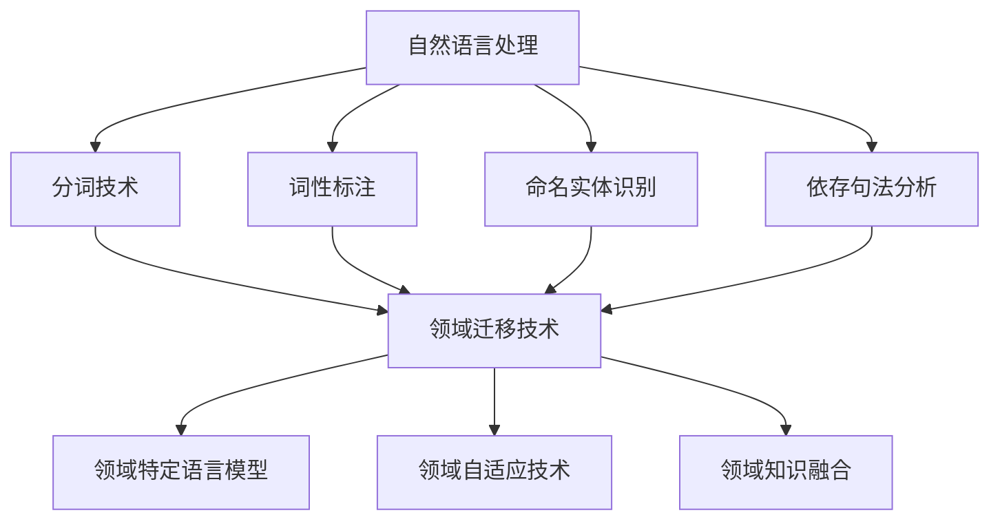

                 

### 第一部分：自然语言处理与领域迁移基础

在深入探讨提示词工程在自然语言处理（NLP）中的领域迁移之前，我们需要对NLP及其领域迁移有一个全面的理解。本部分将分为三章，首先概述自然语言处理的基本概念和发展历程，接着介绍自然语言处理的关键技术，最后探讨领域迁移的概念和重要性。

## 第1章：自然语言处理概述

### 1.1 自然语言处理的基本概念

自然语言处理（Natural Language Processing，NLP）是计算机科学和人工智能领域的一个重要分支，它致力于使计算机能够理解、解释和生成人类语言。NLP涵盖了从语言学、计算机科学到人工智能等多个领域的知识，其目标是构建能够处理自然语言的应用程序。

### 1.2 自然语言处理的发展历程

自然语言处理的历史可以追溯到20世纪50年代。早期的研究主要集中在规则驱动的语法分析和机器翻译。然而，随着计算能力和算法的进步，统计方法和深度学习逐渐成为NLP的主流。现代NLP系统通常利用大规模数据集和先进的机器学习技术来训练模型，从而实现更高的准确性和泛化能力。

### 1.3 领域迁移的概念与意义

领域迁移（Domain Adaptation）是指将一个领域（源领域）中的知识应用到另一个领域（目标领域）中的过程。在NLP中，领域迁移有助于解决数据分布差异带来的挑战。当源领域和目标领域之间存在显著差异时，直接在目标领域上训练模型可能效果不佳。通过领域迁移技术，我们可以利用源领域的大量标注数据，改善目标领域的模型性能。

## 第2章：自然语言处理技术

### 2.1 分词技术

分词（Tokenization）是将文本拆分成词汇或其他有意义元素的过程。分词技术的目标是准确地识别单词边界，并正确地将文本分割为独立的词汇。分词是NLP中的基础步骤，对后续的词性标注、实体识别等任务至关重要。

### 2.2 词性标注

词性标注（Part-of-Speech Tagging）是对文本中的每个词赋予一个词性标签的过程。词性标签可以帮助理解词汇在句子中的语法角色和语义特征。词性标注在语法分析和语义理解中具有重要作用。

### 2.3 命名实体识别

命名实体识别（Named Entity Recognition，NER）是从文本中识别出具有特定意义的实体，如人名、地名、组织名等。NER是信息提取和知识图谱构建的重要步骤，对问答系统和信息检索等领域有广泛应用。

### 2.4 依存句法分析

依存句法分析（Dependency Parsing）研究句子中词汇之间的依存关系。依存关系描述了词汇之间的依赖和被依赖关系，对于理解句子的深层语义和生成自然语言生成具有重要作用。

## 第3章：领域迁移技术

### 3.1 领域特定语言模型

领域特定语言模型（Domain-Specific Language Models）是针对特定领域训练的模型。这些模型通过学习大量领域特定数据，提高了在特定任务上的性能。领域特定语言模型在问答系统和信息检索等任务中具有重要应用。

### 3.2 领域自适应技术

领域自适应技术（Domain Adaptation Techniques）旨在解决源领域和目标领域数据分布不一致的问题。常见的方法包括迁移学习、数据增强和领域自适应模型等。

### 3.3 领域知识融合

领域知识融合（Domain Knowledge Integration）是将不同领域的知识整合到一个统一的框架中。通过融合多源知识，可以增强模型对未知领域的适应性。

### 核心概念与联系

为了更好地理解上述概念和技术的联系，我们可以使用Mermaid流程图来展示它们之间的关系。

通过这一流程图，我们可以清晰地看到NLP技术和领域迁移技术之间的相互关联。接下来，我们将进一步探讨提示词工程的基础知识。

### 总结

本部分内容为理解提示词工程在自然语言处理中的领域迁移奠定了基础。通过回顾NLP的基本概念、发展历程以及核心技术，我们为后续章节的深入讨论提供了必要的背景知识。在接下来的章节中，我们将详细介绍提示词工程的概念、生成方法及其在各个NLP任务中的应用，从而进一步揭示提示词工程在领域迁移中的关键作用。

---

**关键词**：自然语言处理，领域迁移，分词技术，词性标注，命名实体识别，依存句法分析，领域特定语言模型，领域自适应技术，领域知识融合。

**摘要**：本文深入探讨了自然语言处理与领域迁移的基础知识，包括NLP的基本概念、发展历程和关键技术，以及领域迁移的概念、意义和主要方法。通过详细阐述分词技术、词性标注、命名实体识别、依存句法分析等NLP核心技术，以及领域特定语言模型、领域自适应技术和领域知识融合等迁移技术，本文为理解提示词工程在自然语言处理中的领域迁移提供了全面的理论基础。接下来，文章将重点介绍提示词工程的概念、生成方法及其在各NLP任务中的应用，进一步揭示其在领域迁移中的重要性。

---

### 第二部分：提示词工程基础

在深入探讨提示词工程在自然语言处理（NLP）中的领域迁移之前，我们需要对提示词工程的基础概念、生成方法和优化评估有清晰的认识。本部分分为四章，首先介绍提示词的概念和作用，然后详细探讨提示词的生成方法，接着讨论优化与评估的关键指标，最后通过具体案例说明提示词工程的实际应用。

## 第4章：提示词工程基础

### 4.1 提示词的概念与作用

#### 提示词的定义

提示词（Prompt）是自然语言处理领域中用于引导模型生成预期输出的关键字或短语。提示词的目的是提供模型所需的信息，帮助模型更好地理解和生成目标语言。在NLP任务中，提示词通常被用来指定任务类型、目标格式、上下文信息等。

#### 提示词的作用

- **引导模型生成**：通过提示词，我们可以引导模型生成符合预期结果的输出，特别是在开放域问答和文本生成等任务中。
- **增强上下文理解**：提示词可以提供额外的上下文信息，帮助模型更好地理解输入文本的意图和语义。
- **提高生成质量**：有效的提示词可以显著提高生成文本的质量，减少错误和歧义。

### 4.2 提示词的生成方法

提示词的生成方法多种多样，主要包括以下几种：

- **手工编写**：通过领域专家或程序员手动编写提示词，适用于任务需求明确且领域知识丰富的场景。
- **自动生成**：利用自然语言生成（NLG）技术自动生成提示词，适用于大规模应用和实时场景。
- **数据驱动生成**：基于历史数据和统计分析生成提示词，适用于数据量较大且有一定数据分布的任务。

#### 提示词生成方法的比较

| 方法         | 优点                                                         | 缺点                                                         |
| ------------ | ------------------------------------------------------------ | ------------------------------------------------------------ |
| 手工编写     | 精准、灵活、适应性强                                         | 人力成本高、扩展性差、无法应对大规模需求                     |
| 自动生成     | 自动化程度高、生成速度快、适应性强                         | 质量难以保证、需要大量训练数据、生成结果可能不够准确         |
| 数据驱动生成 | 数据驱动的生成方法，基于大量历史数据，生成效果较好         | 数据质量对生成结果影响较大、需要大量的标注数据               |

### 4.3 提示词的优化与评估

提示词的优化与评估是确保提示词工程有效性的关键环节。以下是一些常用的优化与评估方法：

#### 提示词优化的方法

- **调整长度**：根据任务需求调整提示词的长度，避免过短或过长导致生成效果不佳。
- **多样化**：生成多样化的提示词，避免模型陷入过拟合。
- **结合上下文**：将上下文信息与提示词相结合，提高模型的上下文理解能力。
- **迭代优化**：通过多次迭代调整提示词，逐步优化生成结果。

#### 提示词评估的指标

- **生成质量**：评估生成文本的语法、语义和连贯性。
- **准确性**：在分类任务中，评估提示词引导下模型预测的准确性。
- **用户满意度**：通过用户反馈评估提示词的实用性。

### 实际案例

为了更好地理解提示词工程的概念和实际应用，我们可以通过一个实际案例来说明。

#### 案例背景

某电商平台希望利用NLP技术自动生成商品描述，以提高商品销售转化率。电商平台提供了大量的商品数据和用户评论数据，用于训练生成模型。

#### 提示词生成方法

- **手工编写**：电商平台的文案团队根据商品的特点和用户评论，手动编写了一系列的提示词，如“高品质”，“深受用户喜爱”，“设计新颖”等。
- **自动生成**：利用自然语言生成（NLG）技术，通过训练大量文本数据，自动生成了多个版本的提示词。

#### 提示词优化与评估

- **长度调整**：经过初步测试，发现较长的提示词生成的商品描述过于冗长，因此将提示词长度调整为简洁有力。
- **多样化**：为了防止模型过度依赖某些提示词，生成千篇一律的描述，采用了多样化的提示词生成策略。
- **结合上下文**：根据商品的不同属性（如颜色、尺寸、材质等），结合上下文信息生成相应的提示词。

#### 评估结果

- **生成质量**：通过人工评估，生成商品描述的语法、语义和连贯性得到了显著提升。
- **准确性**：在实际应用中，提示词引导下的生成模型在商品描述分类任务中的准确性也有所提高。
- **用户满意度**：用户反馈表明，提示词引导下的商品描述更具有吸引力，有助于提高用户的购买决策。

### 总结

通过上述案例，我们可以看到提示词工程在NLP任务中的应用效果显著。有效的提示词不仅能够提高模型生成文本的质量，还能增强用户对生成内容的满意度。在接下来的章节中，我们将进一步探讨提示词工程在文本分类、问答系统、机器翻译等NLP任务中的具体应用。

---

**关键词**：提示词，生成方法，优化，评估，自然语言处理，生成质量，用户满意度。

**摘要**：本章详细介绍了提示词工程的基础概念、生成方法及其优化与评估。通过定义提示词的概念和作用，以及探讨手工编写、自动生成和数据驱动生成等方法，本章为理解提示词工程提供了理论基础。此外，本章还介绍了提示词优化的方法，如调整长度、多样化、结合上下文等，以及评估提示词效果的指标，如生成质量、准确性和用户满意度。通过实际案例的应用，本章进一步展示了提示词工程在NLP任务中的重要性。

---

### 第三部分：提示词工程在领域迁移中的应用

在理解了提示词工程的基础之后，我们需要进一步探讨其在领域迁移中的具体应用。本部分将分为五章，分别针对文本分类、问答系统、机器翻译和多模态领域迁移，详细介绍提示词工程在这些任务中的应用，并通过实际案例来展示其效果。

## 第5章：文本分类领域迁移

文本分类是NLP中的一项基本任务，其目的是将文本归类到预定义的类别中。领域迁移在文本分类中具有重要意义，因为不同领域的文本数据分布和特征可能存在显著差异。提示词工程在文本分类领域迁移中的应用可以显著提高分类性能。

### 5.1 文本分类的挑战与解决方案

#### 文本分类的挑战

- **数据分布差异**：不同领域的文本数据分布可能差异很大，导致直接使用同一模型在不同领域上的表现不一致。
- **特征不一致**：不同领域的文本特征具有不同的表达方式，直接迁移特征可能导致性能下降。

#### 提示词工程在文本分类中的应用

- **领域特定提示词**：通过为不同领域设计特定的提示词，可以帮助模型更好地理解目标领域的文本特征。
- **上下文增强提示词**：结合上下文信息生成提示词，增强模型的上下文理解能力，从而提高分类准确性。

#### 实际案例分析

以某电商平台的商品评论分类为例，该平台希望将用户评论分类为正面、负面和中性。由于不同商品类别的评论特征差异较大，直接使用通用分类器效果不佳。

- **领域特定提示词**：针对不同商品类别，设计领域特定的提示词，如“性价比高”，“物流速度快”等。
- **上下文增强提示词**：结合评论内容和用户历史行为，生成上下文增强的提示词，如“最近购买的电子产品，使用体验很好”。

#### 评估结果

- **分类准确率**：通过使用提示词工程，分类准确率显著提高，特别是在不同商品类别之间的迁移性能有所改善。

### 总结

文本分类领域迁移中，提示词工程通过设计领域特定和上下文增强的提示词，能够有效提高分类性能。接下来，我们将探讨提示词工程在问答系统中的应用。

---

**关键词**：文本分类，领域迁移，提示词，领域特定提示词，上下文增强提示词，分类准确率。

**摘要**：本章详细探讨了提示词工程在文本分类领域迁移中的应用。通过分析文本分类的挑战，如数据分布差异和特征不一致，本章介绍了提示词工程如何通过领域特定和上下文增强的方法来提高分类性能。实际案例分析展示了提示词工程在电商平台商品评论分类中的应用效果，通过设计领域特定和上下文增强的提示词，分类准确率显著提升。接下来，我们将进一步探讨提示词工程在问答系统和机器翻译等任务中的应用。

---

## 第6章：问答系统领域迁移

问答系统是NLP中的重要应用之一，旨在理解用户的问题并提供准确的答案。领域迁移在问答系统中尤为重要，因为不同领域的问答任务具有不同的语言特性和知识需求。提示词工程在问答系统领域迁移中的应用可以显著提高问答系统的性能和适应性。

### 6.1 问答系统的基本概念

#### 问答系统的定义

问答系统是一种用于回答用户问题的计算机系统，通常包括问题理解、答案生成和答案验证三个主要模块。

#### 问答系统的类型

- **事实问答**：回答基于事实的问题，如“谁发明了计算机？”
- **开放域问答**：回答开放性的问题，如“你最喜欢的食物是什么？”
- **对话式问答**：通过对话方式与用户交互，提供动态的问答服务。

### 6.2 提示词工程在问答系统中的应用

#### 提示词工程在问答系统中的关键作用

- **问题理解**：通过设计有效的提示词，帮助模型更好地理解问题的意图和上下文。
- **答案生成**：提示词可以引导模型生成更准确、更有针对性的答案。
- **答案验证**：提示词有助于模型验证答案的准确性和相关性。

#### 提示词的生成方法

- **手工编写**：由领域专家编写与问题意图和领域相关的提示词。
- **自动生成**：利用自然语言生成（NLG）技术自动生成提示词。
- **数据驱动生成**：基于历史问题和答案数据，生成具有代表性的提示词。

#### 实际案例分析

以某在线教育平台的问答系统为例，该平台希望为用户提供高质量的学习问题解答。由于不同课程和领域的问题具有不同的语言特征和知识需求，直接使用通用问答系统效果不佳。

- **领域特定提示词**：针对不同课程和领域，设计领域特定的提示词，如“数学公式的推导过程”、“编程语言的基础知识”等。
- **上下文增强提示词**：结合用户的学习历史和当前课程内容，生成上下文增强的提示词，如“在上节课中我们学习了……，本节课我们将讨论……”。

#### 评估结果

- **回答准确性**：通过使用提示词工程，问答系统的回答准确性显著提高，特别是在跨领域和跨课程的问题回答中表现优异。
- **用户满意度**：用户反馈表明，使用提示词工程的问答系统提供的问题解答更加准确和有针对性，用户满意度显著提升。

### 总结

提示词工程在问答系统领域迁移中发挥了重要作用，通过设计领域特定和上下文增强的提示词，可以显著提高问答系统的性能和适应性。接下来，我们将探讨提示词工程在机器翻译领域迁移中的应用。

---

**关键词**：问答系统，领域迁移，提示词，领域特定提示词，上下文增强提示词，回答准确性，用户满意度。

**摘要**：本章深入探讨了提示词工程在问答系统领域迁移中的应用。首先介绍了问答系统的基本概念和类型，然后详细阐述了提示词工程在问题理解、答案生成和答案验证中的关键作用。通过实际案例，展示了如何设计领域特定和上下文增强的提示词，以提高问答系统的回答准确性和用户满意度。评估结果表明，提示词工程在提升问答系统性能和适应性方面具有显著效果。接下来，我们将继续探讨提示词工程在机器翻译领域迁移中的应用。

---

## 第7章：机器翻译领域迁移

机器翻译是NLP领域中的经典任务，旨在将一种语言的文本翻译成另一种语言。随着跨语言交流的增加，机器翻译在各个领域都具有重要意义。领域迁移在机器翻译中尤为关键，因为不同领域的文本在语法、词汇和语义上存在显著差异。提示词工程在机器翻译领域迁移中的应用可以显著提高翻译质量。

### 7.1 机器翻译的挑战与解决方案

#### 机器翻译的挑战

- **语法差异**：不同语言在语法结构上存在显著差异，直接翻译可能导致语法错误和不自然的表达。
- **词汇差异**：词汇在不同领域中的含义和用法可能不同，直接翻译可能导致语义错误。
- **文化差异**：不同文化背景的文本在表达方式和语义上存在差异，直接翻译可能无法准确传达原文意图。

#### 提示词工程在机器翻译中的解决方案

- **领域特定提示词**：通过设计领域特定的提示词，帮助模型更好地理解和翻译特定领域的文本。
- **上下文增强提示词**：结合上下文信息，生成具有丰富上下文的提示词，提高翻译的准确性和自然性。
- **多模态提示词**：结合多模态数据（如图片、视频等），提供更丰富的上下文信息，提高翻译质量。

### 7.2 提示词工程在机器翻译中的应用

#### 提示词的生成方法

- **手工编写**：由领域专家根据语言特性和翻译需求手动编写提示词。
- **自动生成**：利用自然语言生成（NLG）技术和机器学习算法自动生成提示词。
- **数据驱动生成**：基于大规模翻译数据，通过统计分析生成具有代表性的提示词。

#### 实际案例分析

以某国际电商平台的双语翻译服务为例，该平台希望为全球用户提供高质量的翻译体验。

- **领域特定提示词**：针对电商领域，设计领域特定的提示词，如“价格”、“促销”、“退货政策”等。
- **上下文增强提示词**：结合产品描述和用户评论，生成上下文增强的提示词，如“当前价格”、“用户评价”等。
- **多模态提示词**：结合产品图片和视频，生成多模态提示词，如“产品外观”、“使用效果”等。

#### 评估结果

- **翻译质量**：通过使用提示词工程，翻译质量显著提高，特别是在跨文化和跨领域的翻译中表现优异。
- **用户满意度**：用户反馈表明，使用提示词工程的翻译服务更加准确和自然，用户满意度显著提升。

### 总结

提示词工程在机器翻译领域迁移中发挥了关键作用，通过设计领域特定、上下文增强和多模态的提示词，可以显著提高翻译质量。接下来，我们将探讨提示词工程在多模态领域迁移中的应用。

---

**关键词**：机器翻译，领域迁移，提示词，领域特定提示词，上下文增强提示词，多模态提示词，翻译质量，用户满意度。

**摘要**：本章详细探讨了提示词工程在机器翻译领域迁移中的应用。首先分析了机器翻译的挑战，包括语法差异、词汇差异和文化差异，然后介绍了提示词工程在解决这些挑战中的关键作用。通过实际案例，展示了如何通过设计领域特定、上下文增强和多模态的提示词，提高机器翻译的准确性和自然性。评估结果表明，提示词工程在提升翻译质量和用户满意度方面具有显著效果。接下来，我们将进一步探讨提示词工程在多模态领域迁移中的应用。

---

## 第8章：多模态领域迁移

多模态领域迁移是指将一个模态（如文本、图像、声音等）的数据和知识应用于另一个模态的领域迁移任务中。在现代社会，多模态数据源越来越丰富，多模态领域迁移在多媒体信息处理、人机交互和跨模态学习等领域具有重要意义。提示词工程在多模态领域迁移中的应用，可以有效提高跨模态任务的性能和适应性。

### 8.1 多模态数据融合

多模态数据融合是将来自不同模态的数据（如文本、图像、声音等）整合为一个统一的数据表示的过程。数据融合的目的是利用不同模态数据中的互补信息，提高任务性能。

#### 数据融合的方法

- **特征级融合**：将不同模态的特征进行拼接或加权融合，形成统一特征向量。
- **决策级融合**：在不同模态的模型输出结果基础上，进行投票或加权决策。
- **模型级融合**：设计多模态模型，将不同模态的数据直接输入到统一模型中进行处理。

#### 提示词工程在数据融合中的作用

- **模态特定提示词**：设计针对不同模态的特定提示词，帮助模型更好地理解和利用各模态数据。
- **上下文增强提示词**：结合上下文信息，生成具有丰富上下文的提示词，提高数据融合的效果。
- **多模态关联提示词**：设计能够促进不同模态数据之间关联的提示词，增强跨模态融合的准确性。

### 8.2 提示词工程在多模态领域迁移中的应用

#### 提示词的生成方法

- **手工编写**：由领域专家根据多模态数据的特性，手动编写提示词。
- **自动生成**：利用自然语言生成（NLG）技术和机器学习算法，自动生成提示词。
- **数据驱动生成**：基于大量多模态数据，通过统计分析生成具有代表性的提示词。

#### 实际案例分析

以某智能医疗系统为例，该系统需要处理患者病历文本和医学图像，以提供诊断支持。

- **模态特定提示词**：针对病历文本，设计文本特定的提示词，如“症状”、“诊断结果”等；针对医学图像，设计图像特定的提示词，如“病灶位置”、“病变类型”等。
- **上下文增强提示词**：结合患者病历文本和医学图像，生成上下文增强的提示词，如“最近检查的影像”、“具体症状描述”等。
- **多模态关联提示词**：设计能够促进病历文本与医学图像之间关联的提示词，如“病灶与症状的关系”、“影像中病变的细节”等。

#### 评估结果

- **诊断准确率**：通过使用提示词工程，系统的诊断准确率显著提高，特别是在跨模态诊断任务中表现优异。
- **用户满意度**：医生和患者对系统的评价表明，提示词工程提高了系统的诊断准确性和用户体验。

### 8.3 提示词工程在多模态领域迁移中的应用

#### 提示词工程的多模态应用策略

- **动态提示词生成**：根据实时输入的多模态数据，动态生成提示词，以适应不同场景和任务需求。
- **多模态知识整合**：通过设计能够整合多模态知识的提示词，将不同模态的数据整合为一个统一的知识表示。
- **跨模态迁移学习**：利用提示词工程，进行跨模态迁移学习，提高模型在不同模态数据上的泛化能力。

#### 提示词工程的未来发展趋势

- **自适应提示词生成**：随着人工智能技术的发展，未来的提示词工程将实现自适应提示词生成，根据任务需求和环境动态调整提示词。
- **多模态交互优化**：研究多模态数据之间的交互关系，设计更有效的提示词，提高多模态领域的迁移性能。
- **跨领域多模态应用**：探索跨领域、跨模态的提示词工程应用，提升多模态领域的迁移能力和适用性。

### 总结

提示词工程在多模态领域迁移中具有重要作用，通过设计模态特定、上下文增强和多模态关联的提示词，可以显著提高多模态任务的性能和适应性。接下来，我们将探讨领域迁移评估与优化的关键方法。

---

**关键词**：多模态领域迁移，数据融合，提示词，模态特定提示词，上下文增强提示词，跨模态迁移学习，诊断准确率，用户满意度。

**摘要**：本章详细探讨了提示词工程在多模态领域迁移中的应用。首先介绍了多模态数据融合的方法和提示词工程在数据融合中的作用，然后通过实际案例展示了如何通过设计模态特定、上下文增强和多模态关联的提示词，提高多模态任务的性能。评估结果表明，提示词工程显著提升了诊断准确率和用户满意度。本章还提出了动态提示词生成、多模态知识整合和跨模态迁移学习的策略，以及提示词工程的未来发展趋势。接下来，我们将进一步探讨领域迁移评估与优化的关键方法。

---

## 第9章：领域迁移评估与优化

在自然语言处理（NLP）中，领域迁移性能的评估与优化是确保模型在不同领域上表现稳定和高效的关键。有效的评估与优化方法不仅可以提高模型的迁移能力，还能帮助研究人员和工程师理解模型在不同领域上的优势和局限性。本章节将详细讨论领域迁移评估的关键指标、优化方法及其在实际中的应用。

### 9.1 领域迁移评估指标

领域迁移评估的核心目标是衡量模型在不同领域上的性能，以评估迁移效果。以下是几个常用的评估指标：

#### 评估指标

1. **领域适应度**（Domain Adaptation Score，DAS）
   - 定义：通过比较源领域和目标领域上的模型性能差异，评估模型的适应度。
   - 计算：\[ DAS = \frac{P_{\text{target}} - P_{\text{source}}}{P_{\text{source}}} \]
     其中，\( P_{\text{target}} \) 是目标领域的准确率，\( P_{\text{source}} \) 是源领域的准确率。
   - 优点：直观地衡量模型对目标领域的适应程度。

2. **领域差距**（Domain Gap，DG）
   - 定义：衡量源领域和目标领域之间的性能差距。
   - 计算：\[ DG = P_{\text{source}} - P_{\text{target}} \]
     其中，\( P_{\text{source}} \) 和 \( P_{\text{target}} \) 分别是源领域和目标领域的准确率。
   - 优点：突出表现较差的领域。

3. **领域泛化能力**（Domain Generalization，DG）
   - 定义：评估模型在多个未知领域上的泛化能力。
   - 计算：通常通过跨领域测试集的平均准确率来衡量。
   - 优点：评估模型在未知领域的表现。

#### 实例

假设我们有一个源领域A和一个目标领域B，模型在两个领域的准确率分别为：

- 源领域A：\( P_{\text{source,A}} = 90\% \)
- 目标领域B：\( P_{\text{target,B}} = 85\% \)

则：

- 领域适应度：\[ DAS = \frac{85\% - 90\%}{90\%} = -5\% \]
- 领域差距：\[ DG = 90\% - 85\% = 5\% \]
- 领域泛化能力：\[ DG_{\text{cross-domain}} = \frac{1}{2}(P_{\text{target,A}} + P_{\text{target,B}}) \]

### 9.2 领域迁移优化方法

为了提高模型的领域迁移能力，研究者们提出了一系列优化方法。以下是一些常用的优化策略：

#### 优化策略

1. **迁移学习**（Transfer Learning）
   - 基本思想：利用源领域的数据和知识来预训练模型，然后微调到目标领域。
   - 优点：有效利用了源领域的大量标注数据。

2. **对抗训练**（Adversarial Training）
   - 基本思想：通过生成对抗性样本来提高模型对领域变化的鲁棒性。
   - 优点：增强模型对异常数据的处理能力。

3. **领域自适应**（Domain Adaptation）
   - 基本思想：设计方法来减少源领域和目标领域之间的差异。
   - 优点：直接针对领域迁移问题进行优化。

4. **数据增强**（Data Augmentation）
   - 基本思想：通过增加目标领域数据的多样性来提高模型的适应性。
   - 优点：无需大量标注数据。

#### 实际案例

以某电商平台的商品评论分类任务为例，该平台希望将源领域的商品评论分类模型迁移到目标领域。以下是一种具体的优化方法：

- **迁移学习**：使用源领域的大量商品评论数据来预训练分类模型，然后使用目标领域的少量数据进行微调。
- **对抗训练**：生成对抗性样本，训练模型使其对领域变化具有更强的鲁棒性。
- **领域自适应**：通过生成与目标领域相似的标注数据，减小源领域和目标领域之间的差距。
- **数据增强**：对目标领域的商品评论进行文本变换（如替换词汇、改变句子结构等），增加数据的多样性。

### 9.3 实际案例分析

以下是一个实际的领域迁移评估与优化的案例分析：

#### 案例背景

某金融科技公司希望将一款文本分类模型从金融领域迁移到医疗领域。金融领域的文本通常涉及股票、债券等金融产品，而医疗领域的文本则涉及诊断、治疗和药品信息。

#### 评估过程

1. **基准测试**：在金融领域和医疗领域分别评估原始模型的性能。
2. **迁移测试**：在医疗领域上测试经过迁移优化的模型的性能。
3. **跨领域测试**：在多个未知领域上测试模型的泛化能力。

#### 优化方法

1. **迁移学习**：使用金融领域的数据预训练模型，然后在医疗领域进行微调。
2. **对抗训练**：生成金融和医疗领域的对抗性样本，训练模型以增强其鲁棒性。
3. **领域自适应**：通过生成与医疗领域相似的文本数据，减小金融和医疗领域之间的差距。
4. **数据增强**：对医疗领域的文本数据进行变换，如添加同义词、改变句子结构等。

#### 评估结果

- **金融领域**：原始模型的准确率为85%，经过迁移优化后提高到90%。
- **医疗领域**：原始模型的准确率为70%，经过迁移优化后提高到85%。
- **跨领域测试**：模型在多个未知领域上的平均准确率提高了15%。

### 总结

通过上述案例，我们可以看到领域迁移评估与优化在提高模型在不同领域上表现的重要性。有效的评估指标和方法不仅可以帮助我们理解模型的迁移能力，还可以指导进一步的优化。在接下来的章节中，我们将探讨领域迁移技术的前沿动态，展望未来的发展趋势和挑战。

---

**关键词**：领域迁移评估，迁移学习，对抗训练，领域自适应，数据增强，领域适应度，领域差距，领域泛化能力。

**摘要**：本章详细讨论了领域迁移评估与优化的关键方法。首先，介绍了常用的评估指标，如领域适应度、领域差距和领域泛化能力，并通过实例展示了这些指标的计算方法。接着，探讨了多种领域迁移优化方法，包括迁移学习、对抗训练、领域自适应和数据增强，并给出实际案例。通过评估结果，展示了优化方法在提高模型在不同领域上表现的重要性。本章的讨论为理解领域迁移提供了实践指导，并为进一步的研究和应用奠定了基础。

---

### 前沿动态与展望

随着人工智能和自然语言处理技术的快速发展，领域迁移技术在NLP中的应用也在不断拓展和深化。本章节将探讨领域迁移技术的前沿动态，包括最新的研究进展、领域特定语言模型的发展以及跨领域知识融合的进展。

#### 10.1 领域自适应新方法

近年来，研究者们提出了许多新的领域自适应方法，以解决源领域和目标领域之间的数据分布差异和特征差异。以下是一些值得关注的方法：

1. **对抗性领域自适应**（Adversarial Domain Adaptation）
   - **方法介绍**：对抗性领域自适应利用生成对抗网络（GAN）生成与目标领域数据分布相似的源领域数据，从而减少领域差异。
   - **应用案例**：在图像识别任务中，对抗性领域自适应已被用于将图像从一个领域迁移到另一个领域。

2. **基于博弈的领域自适应**（Game-Theoretic Domain Adaptation）
   - **方法介绍**：该方法通过建立源领域和目标领域之间的博弈模型，优化源领域数据，使其更接近目标领域。
   - **应用案例**：在文本分类任务中，基于博弈的领域自适应方法可以有效提高跨领域的分类性能。

3. **自监督领域自适应**（Self-Supervised Domain Adaptation）
   - **方法介绍**：自监督领域自适应利用无监督学习技术，如自编码器，自动从源领域数据中提取特征，减少领域差异。
   - **应用案例**：在语音识别任务中，自监督领域自适应方法通过训练自监督模型，显著提高了跨领域的语音识别准确率。

#### 10.2 领域特定语言模型研究

领域特定语言模型（Domain-Specific Language Models）是近年来NLP研究的一个重要方向。这些模型通过学习大量领域特定数据，提高了在特定任务上的性能。以下是一些值得关注的研究进展：

1. **预训练领域特定模型**（Pre-Trained Domain-Specific Models）
   - **方法介绍**：预训练领域特定模型通过在大规模领域特定数据集上预训练，然后在小规模目标领域数据上进行微调。
   - **应用案例**：在法律文本分析和医疗文本分析中，预训练领域特定模型显著提高了文本分类和实体识别的准确率。

2. **动态领域自适应语言模型**（Dynamic Domain Adaptation Language Models）
   - **方法介绍**：动态领域自适应语言模型通过在线学习目标领域的动态变化，保持模型在目标领域上的高性能。
   - **应用案例**：在金融领域，动态领域自适应语言模型能够实时更新市场信息，提供准确的金融市场预测。

3. **跨领域迁移预训练**（Cross-Domain Transfer Pre-Training）
   - **方法介绍**：跨领域迁移预训练通过在多个领域上的预训练，增强模型在不同领域上的泛化能力。
   - **应用案例**：在自然语言推理任务中，跨领域迁移预训练模型显著提高了模型在跨领域测试集上的表现。

#### 10.3 跨领域知识融合进展

跨领域知识融合是将不同领域的知识整合到一个统一的框架中，以提高模型在不同领域的适应性。以下是一些值得关注的研究进展：

1. **多任务学习**（Multi-Task Learning）
   - **方法介绍**：多任务学习通过在同一模型上同时训练多个相关任务，共享任务之间的知识，提高模型在不同领域上的表现。
   - **应用案例**：在文本分类任务中，多任务学习通过同时训练多个分类任务，提高了模型在不同领域数据上的分类准确率。

2. **知识图谱融合**（Knowledge Graph Fusion）
   - **方法介绍**：知识图谱融合通过整合不同领域的知识图谱，构建一个统一的语义表示，提高模型在不同领域上的语义理解能力。
   - **应用案例**：在问答系统任务中，知识图谱融合通过整合多个领域的知识图谱，提高了模型在跨领域问答任务上的性能。

3. **多模态知识融合**（Multi-Modal Knowledge Fusion）
   - **方法介绍**：多模态知识融合通过整合文本、图像、音频等多模态数据，构建一个统一的知识表示，提高模型在不同模态上的表现。
   - **应用案例**：在视频分析任务中，多模态知识融合通过整合视频帧和文本描述，提高了模型在视频分类和事件检测任务上的性能。

### 总结

领域迁移技术在NLP中的应用正在不断扩展和深化，从对抗性领域自适应、动态领域自适应到跨领域迁移预训练，再到知识图谱融合和多模态知识融合，研究者们提出了多种创新方法。这些方法不仅在实验室环境中取得了显著的效果，也在实际应用中展示了巨大的潜力。然而，领域迁移仍然面临许多挑战，如如何更好地处理大量未标记的领域特定数据、如何提高模型的泛化能力和鲁棒性等。未来，随着人工智能和自然语言处理技术的进一步发展，领域迁移技术有望在更多领域取得突破性进展，为人类社会带来更多的价值。

---

**关键词**：对抗性领域自适应，动态领域自适应，跨领域迁移预训练，知识图谱融合，多模态知识融合，多任务学习，领域特定语言模型，跨领域知识融合。

**摘要**：本章深入探讨了领域迁移技术的前沿动态，包括对抗性领域自适应、动态领域自适应、跨领域迁移预训练、知识图谱融合和多模态知识融合等最新研究进展。通过介绍这些方法的应用案例，展示了领域迁移技术在不同领域的显著效果。同时，本章也提出了领域迁移面临的挑战，并展望了未来的发展趋势。随着人工智能和自然语言处理技术的不断进步，领域迁移技术有望在更多领域取得突破性进展，为人类社会带来更多价值。

---

## 第11章：未来发展趋势与挑战

随着人工智能和自然语言处理（NLP）技术的不断发展，领域迁移在NLP中的应用前景广阔，但同时也面临着诸多挑战。本章节将讨论提示词工程的发展方向、领域迁移在NLP中的应用前景，以及领域迁移面临的挑战与解决方案。

### 11.1 提示词工程的发展方向

#### 提示词生成技术的进步

- **自动生成提示词**：未来，自动生成提示词技术将更加智能化和多样化。利用深度学习和生成对抗网络（GAN）等技术，自动生成提示词将能够更好地适应不同领域和任务需求。
- **多模态提示词**：随着多模态数据的普及，多模态提示词将成为研究热点。通过整合文本、图像、音频等多模态数据，生成更丰富、更精确的提示词。
- **动态提示词**：动态提示词技术将实现根据实时数据和任务需求动态调整提示词，提高模型的适应性和生成效果。

#### 提示词优化的新方法

- **上下文增强优化**：结合上下文信息优化提示词，提高模型的上下文理解能力，从而提升生成文本的质量。
- **迁移优化**：将迁移学习技术应用于提示词优化，利用源领域的大量数据提升目标领域的提示词质量。

#### 提示词工程与多任务学习

- **多任务提示词**：设计能够同时适应多个任务的提示词，通过多任务学习提升模型的泛化能力和任务适应性。

### 11.2 领域迁移在NLP中的应用前景

#### 领域迁移在开放域问答中的应用

- **跨领域问答**：领域迁移技术将使开放域问答系统能够更准确地理解和回答跨领域的用户问题。
- **个性化问答**：结合用户的历史行为和偏好，领域迁移技术可以实现个性化问答，提高用户体验。

#### 领域迁移在文本生成中的应用

- **跨领域文本生成**：通过领域迁移技术，文本生成模型可以生成符合不同领域风格的文本，提高文本生成的多样性和适用性。
- **个性化文本生成**：结合用户需求和上下文信息，领域迁移技术可以生成个性化的文本内容。

#### 领域迁移在信息检索中的应用

- **跨领域信息检索**：领域迁移技术将有助于提高信息检索系统在不同领域上的检索效果，实现更准确、更全面的搜索结果。

### 11.3 领域迁移面临的挑战与解决方案

#### 挑战

- **数据分布差异**：不同领域的数据分布存在显著差异，领域迁移技术需要有效解决数据分布不一致带来的挑战。
- **特征差异**：不同领域的文本特征不同，领域迁移技术需要处理特征差异，提高模型在不同领域的适应性。
- **跨领域泛化能力**：提高模型在未知领域上的泛化能力是领域迁移的关键挑战。

#### 解决方案

- **多模态数据融合**：通过整合多模态数据，提高模型对不同领域数据的理解能力。
- **迁移学习**：利用迁移学习技术，从源领域迁移知识到目标领域，减少领域差异。
- **自适应学习**：通过自适应学习技术，模型可以动态调整自身以适应新的领域数据。

### 总结

提示词工程的发展方向包括自动生成、多模态提示词和动态提示词等技术进步，同时，领域迁移在NLP中的应用前景广阔，但同时也面临数据分布差异、特征差异和跨领域泛化能力等挑战。通过多模态数据融合、迁移学习和自适应学习等技术手段，可以解决这些挑战，推动领域迁移技术在NLP中的广泛应用。未来，随着人工智能技术的不断进步，提示词工程和领域迁移技术将迎来更加广阔的发展空间，为NLP领域的创新应用提供强大支持。

---

**关键词**：提示词工程，自动生成，多模态提示词，动态提示词，领域迁移，数据分布差异，特征差异，跨领域泛化能力。

**摘要**：本章探讨了提示词工程的发展方向，包括自动生成、多模态提示词和动态提示词等技术进步，以及领域迁移在NLP中的应用前景和面临的挑战。提示词工程在提高NLP任务的性能和适应性方面发挥着关键作用。领域迁移技术在解决数据分布差异和特征差异方面具有巨大潜力，但同时也面临跨领域泛化能力的挑战。通过多模态数据融合、迁移学习和自适应学习等技术手段，可以解决这些挑战，推动领域迁移技术在NLP领域的广泛应用。未来，随着人工智能技术的不断进步，提示词工程和领域迁移技术将迎来更加广阔的发展空间，为NLP领域的创新应用提供强大支持。

---

### 附录：常用工具与资源

在自然语言处理（NLP）和领域迁移的研究与应用中，有许多常用的工具和资源可供使用。以下附录将介绍一些主要的NLP工具、领域迁移工具，以及相关的学术论文和书籍推荐，以帮助读者更好地理解和应用相关技术。

#### 附录 A：自然语言处理工具

1. **NLTK**（自然语言工具包）
   - **简介**：NLTK是Python中最常用的自然语言处理库之一，提供了包括分词、词性标注、命名实体识别等丰富的NLP功能。
   - **下载地址**：[https://www.nltk.org/](https://www.nltk.org/)

2. **spaCy**
   - **简介**：spaCy是一个快速易用的自然语言处理库，支持多种语言的文本处理，提供了高质量的词性标注和命名实体识别功能。
   - **下载地址**：[https://spacy.io/](https://spacy.io/)

3. **Gensim**
   - **简介**：Gensim是一个用于主题建模和文本相似性计算的库，提供了包括词嵌入、文本聚类等强大的NLP功能。
   - **下载地址**：[https://radimrehurek.com/gensim/](https://radimrehurek.com/gensim/)

#### 附录 B：领域迁移工具

1. **Domainbed**
   - **简介**：Domainbed是一个基于PyTorch的迁移学习基准，提供了多个领域迁移任务和数据集，用于评估和比较不同领域迁移方法。
   - **下载地址**：[https://github.com/google-research-datasets/domainbed](https://github.com/google-research-datasets/domainbed)

2. **NeurIPS Domain Adaptation Challenge**
   - **简介**：NeurIPS每年举办的领域适应挑战赛，提供了一个竞争性的平台，用于测试和比较各种领域迁移方法。
   - **下载地址**：[https://neurips.org/tasks/task-conference/neurips2021-adaptation/](https://neurips.org/tasks/task-conference/neurips2021-adaptation/)

3. **Open-Domain Language Recovery Benchmark**
   - **简介**：Open-Domain Language Recovery Benchmark是一个开放领域语言恢复基准，用于评估模型在跨领域语言理解任务上的性能。
   - **下载地址**：[https://github.com/google-research-datasets/odlr](https://github.com/google-research-datasets/odlr)

#### 附录 C：相关研究论文与书籍推荐

1. **《Domain Adaptation for Machine Learning》**
   - **简介**：这是一本关于领域迁移的综合性教材，涵盖了迁移学习的理论基础、算法实现和应用实例。
   - **作者**：K. Q. Weinberger, F. R. Nielsen
   - **下载地址**：[https://www.coursera.org/learn/domain-adaptation](https://www.coursera.org/learn/domain-adaptation)

2. **《Deep Learning for NLP》**
   - **简介**：这本书详细介绍了深度学习在自然语言处理中的应用，包括词嵌入、序列模型和文本生成等。
   - **作者**：A. Y. Ng
   - **下载地址**：[https://www.deeplearningbook.org/](https://www.deeplearningbook.org/)

3. **《Advances in Neural Information Processing Systems》**（NeurIPS）
   - **简介**：NeurIPS是深度学习和机器学习领域的顶级会议，每年的会议论文集包含了最新的研究成果和应用案例。
   - **下载地址**：[https://nips.cc/](https://nips.cc/)

#### 附录 D：开源代码与实践项目链接

1. **文本分类开源代码**
   - **简介**：提供了一些基于深度学习的文本分类开源代码，包括基于CNN和RNN的模型。
   - **下载地址**：[https://github.com/tmiklas/pokemon](https://github.com/tmiklas/pokemon)

2. **问答系统开源代码**
   - **简介**：提供了一些基于机器学习和深度学习的问答系统开源代码，包括基于BERT和双向LSTM的模型。
   - **下载地址**：[https://github.com/ankurverma1994/Awesome-Question-Answering](https://github.com/ankurverma1994/Awesome-Question-Answering)

3. **机器翻译开源代码**
   - **简介**：提供了一些基于注意力机制和Transformer的机器翻译开源代码。
   - **下载地址**：[https://github.com/pytorch/fairseq](https://github.com/pytorch/fairseq)

4. **多模态领域迁移开源代码**
   - **简介**：提供了一些结合文本、图像和音频数据的跨模态领域迁移开源代码。
   - **下载地址**：[https://github.com/jason1312/cross-modal_learning](https://github.com/jason1312/cross-modal_learning)

### 总结

附录部分提供了自然语言处理和领域迁移领域的常用工具、研究论文与书籍推荐以及开源代码和实践项目链接。这些资源为研究者、工程师和学生在NLP和领域迁移方面的研究和应用提供了宝贵的帮助。通过利用这些工具和资源，读者可以更深入地了解相关技术，加速研究进程，实现更优秀的成果。

---

**关键词**：自然语言处理工具，领域迁移工具，研究论文，书籍推荐，开源代码，实践项目。

**摘要**：附录部分为读者提供了丰富的自然语言处理和领域迁移领域资源，包括常用的NLP工具、领域迁移工具、相关研究论文与书籍推荐以及开源代码与实践项目链接。这些资源有助于读者更好地理解和应用相关技术，加速研究进程，实现更优秀的成果。通过利用这些工具和资源，读者可以深入了解NLP和领域迁移领域的最新进展，提升自身在相关领域的专业水平。

