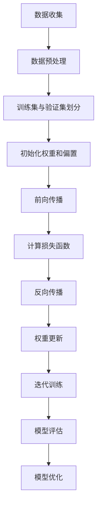
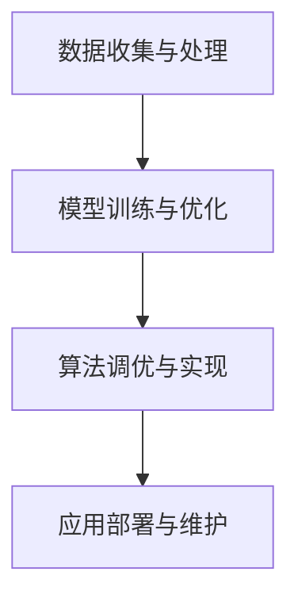
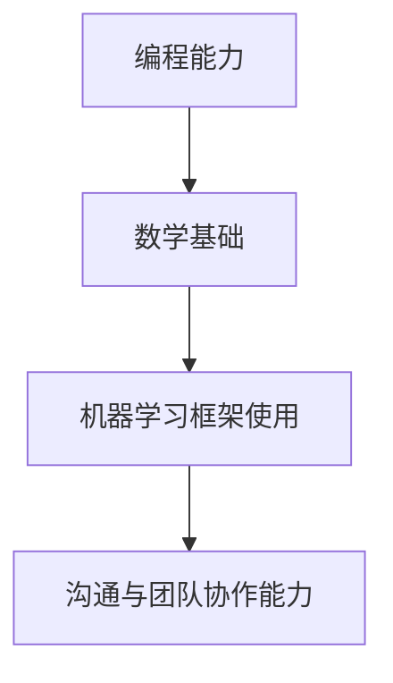
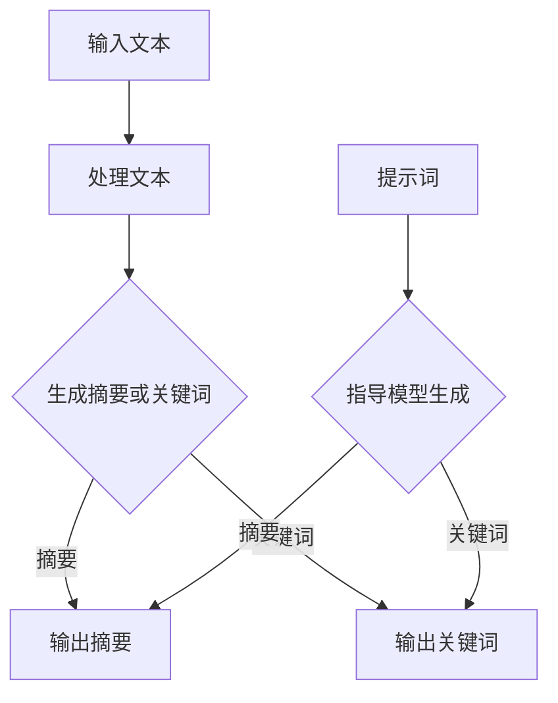
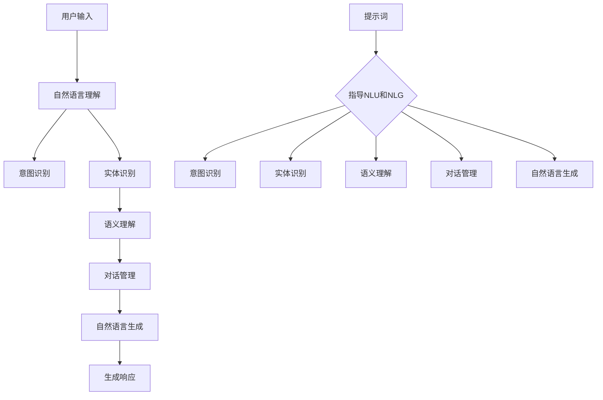
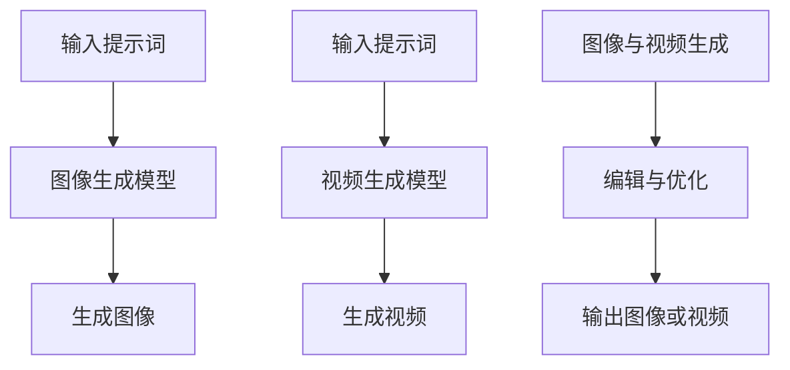

                 

## 第1章 引言与背景

### 1.1 AIGC的概念与趋势

**AIGC的概念：**  
AIGC，全称为AI-Generated Content，即人工智能生成内容，它指的是利用人工智能技术，如机器学习、深度学习、自然语言处理等，自动生成文本、图像、音频、视频等多种类型的内容。

**AIGC的发展背景：**  
随着计算机技术的飞速发展，特别是人工智能的进步，大数据与云计算的支撑，AIGC的概念逐渐兴起。从最初的简单文本生成，到复杂的图像与视频生成，AIGC在计算机领域的地位日益重要。

**AIGC在计算机领域的地位：**  
AIGC不仅改变了内容创作的方式，还大大提高了内容生产的效率。它已经在广告、新闻、娱乐、艺术等多个领域得到广泛应用，成为计算机领域的重要技术之一。

**AIGC对现代社会的影响：**  
AIGC的出现，使得内容生产变得更加便捷和高效。它不仅能够节省人力成本，还能提供更多个性化、多样化的内容。此外，AIGC还能够辅助人类进行决策，提供更加智能化的服务。

### 1.2 AIGC时代的来临

**人工智能的进步：**  
人工智能技术的发展，尤其是深度学习和强化学习等算法的突破，为AIGC提供了强大的技术支撑。这些算法能够从大量数据中学习，生成更加逼真、高质量的内容。

**大数据与云计算的支撑：**  
大数据和云计算技术的发展，使得海量数据的存储、处理和传输成为可能。这为AIGC提供了丰富的数据资源和计算能力，使得AIGC的应用变得更加广泛。

**AIGC时代的机遇与挑战：**  
AIGC时代的来临，为各行各业带来了新的机遇。然而，也带来了一定的挑战，如数据隐私、版权问题、职业影响等。这些问题需要我们深入思考，并寻找合适的解决方案。

### 1.3 AIGC时代的新兴职业

**提示词工程师的角色：**  
提示词工程师是AIGC时代的新兴职业之一。他们的主要工作是设计和优化提示词，用于引导人工智能生成高质量的内容。

**提示词工程师的技能要求：**  
提示词工程师需要具备扎实的编程能力、数学基础和机器学习知识。此外，他们还需要具备良好的沟通能力和团队协作能力。

**提示词工程师的职业前景：**  
随着AIGC技术的不断发展，提示词工程师的需求量将持续增长。他们将在内容创作、数据分析、智能客服等多个领域发挥重要作用。

### 总结

AIGC时代的来临，为计算机领域带来了新的机遇和挑战。提示词工程师作为AIGC时代的新兴职业，将发挥重要作用。在本章中，我们介绍了AIGC的概念、发展趋势以及提示词工程师的角色和技能要求。接下来，我们将进一步探讨AIGC的核心技术和应用场景。让我们一起深入探索AIGC的世界，揭开它的神秘面纱。

---

在接下来的章节中，我们将详细分析AIGC的核心技术，包括人工智能基础、自然语言处理、计算机视觉和大数据分析等。通过这些分析，我们将对AIGC有更深入的理解，为后续的内容创作和实际应用打下坚实的基础。

**关键词：** AIGC，人工智能，自然语言处理，计算机视觉，大数据分析，提示词工程师

---

## AIGC的核心技术

AIGC（AI-Generated Content）作为人工智能生成内容的核心技术，涵盖了多个领域，包括人工智能基础、自然语言处理、计算机视觉和大数据分析等。这些技术共同构成了AIGC的基石，使得它能够生成多样化、高质量的内容。在本节中，我们将逐一介绍这些核心技术，并探讨它们在AIGC中的应用。

### 2.1 人工智能基础

**机器学习与深度学习：**  
人工智能的基础是机器学习和深度学习。机器学习是一种使计算机从数据中学习的方法，通过构建数学模型，使计算机能够自动改进和优化性能。而深度学习则是机器学习的一个分支，它通过神经网络模拟人脑的学习过程，具有强大的特征提取和模式识别能力。

**神经网络的结构与原理：**  
神经网络是由大量神经元连接组成的计算模型，它可以用于分类、回归、聚类等多种任务。神经网络的核心是神经元，每个神经元接收多个输入，通过权重和偏置进行加权求和，再经过激活函数产生输出。

**训练与优化的方法：**  
在机器学习和深度学习中，训练和优化是非常重要的环节。训练过程是通过大量样本数据，调整神经网络的权重和偏置，使得网络能够更好地拟合数据。优化方法包括梯度下降、随机梯度下降、Adam优化器等，它们用于加速收敛和提高网络性能。

**Mermaid流程图：**  
以下是神经网络训练与优化的Mermaid流程图：



### 2.2 自然语言处理

**语言模型的基础：**  
自然语言处理（NLP）是AIGC的重要组成部分。语言模型是NLP的核心，它用于预测下一个单词、句子或段落。常见的语言模型包括n-gram模型、循环神经网络（RNN）和变换器（Transformer）等。

**生成模型与变换模型：**  
生成模型用于生成新的文本，如自动写作、翻译和对话系统。常见的生成模型包括生成对抗网络（GAN）和变分自编码器（VAE）。变换模型则用于将输入文本转换为输出文本，如机器翻译、摘要生成和问答系统。变换模型中最著名的是Transformer模型。

**应用场景分析：**  
自然语言处理在多个领域有广泛应用，如文本生成、摘要生成、机器翻译、情感分析、命名实体识别等。这些应用不仅提高了内容生产的效率，还提供了更加个性化和智能化的服务。

### 2.3 计算机视觉

**图像处理与特征提取：**  
计算机视觉是AIGC的重要组成部分，它涉及图像处理、特征提取和图像理解等任务。图像处理包括图像增强、滤波和分割等操作，用于改善图像质量。特征提取则是从图像中提取具有区分性的特征，如边缘、角点和纹理等。

**深度学习在计算机视觉中的应用：**  
深度学习在计算机视觉中的应用非常广泛，如物体检测、图像分类、人脸识别、姿态估计等。深度学习模型通过大量图像数据进行训练，可以自动学习到复杂的特征表示，从而提高视觉任务的性能。

**目标检测与图像分割：**  
目标检测是计算机视觉中的一个重要任务，它旨在识别图像中的多个对象并定位它们的位置。常见的目标检测算法包括R-CNN、Faster R-CNN、YOLO和SSD等。图像分割则是将图像划分为不同的区域，常见的分割算法包括全卷积网络（FCN）、U-Net和DeepLab等。

### 2.4 大数据分析

**数据预处理与清洗：**  
大数据分析的第一步是数据预处理与清洗。数据预处理包括数据清洗、去重、转换和数据规范化等操作，以消除噪声、错误和冗余，提高数据质量。

**特征工程与降维：**  
特征工程是大数据分析的重要环节，它通过选择和构造特征，提高模型性能。降维则是减少数据维度，提高计算效率。常见的方法包括主成分分析（PCA）、线性判别分析（LDA）和自动编码器（Autoencoder）等。

**数据挖掘与预测：**  
数据挖掘是大数据分析的最终目标，它通过分析大量数据，发现潜在的模式和趋势。常见的挖掘任务包括分类、回归、聚类和关联规则挖掘等。预测则是利用历史数据，对未来的趋势或行为进行预测。

通过以上对AIGC核心技术的介绍，我们可以看到AIGC的多样性和复杂性。这些技术的结合，使得AIGC能够生成高质量、多样化的内容。在接下来的章节中，我们将进一步探讨提示词工程师的角色与职责，以及他们在AIGC中的应用。让我们一起深入探索AIGC的世界，揭开它的神秘面纱。

### 3.1 提示词工程师的工作内容

提示词工程师在AIGC时代扮演着至关重要的角色，他们的工作内容涵盖了数据收集与处理、模型训练与优化、算法调优与实现，以及应用部署与维护等多个方面。以下是提示词工程师的工作内容的详细分解。

**数据收集与处理：**  
数据是AIGC的基础，提示词工程师需要从各种渠道收集数据，如文本、图像、音频和视频等。数据收集后，他们需要对数据进行预处理和清洗，以确保数据的准确性和完整性。这包括去除噪声、填补缺失值、归一化和标准化等操作。此外，提示词工程师还需要对数据进行特征提取，以提取出对模型训练有用的信息。

**模型训练与优化：**  
提示词工程师的主要任务之一是训练和优化人工智能模型。他们需要选择合适的模型架构，如神经网络、生成对抗网络（GAN）或变换器（Transformer）等，并根据具体任务的需求调整模型的参数。训练过程通常涉及大量的计算资源，提示词工程师需要确保模型训练的效率和稳定性。

**算法调优与实现：**  
在模型训练过程中，提示词工程师需要不断调优算法，以提高模型的性能。这包括调整学习率、优化优化算法、选择适当的正则化策略等。此外，他们还需要实现算法的具体实现，包括编写伪代码、调试代码和优化性能等。

**应用部署与维护：**  
模型训练完成后，提示词工程师需要将模型部署到实际应用中。这包括选择合适的服务器、配置必要的硬件资源、编写部署脚本和自动化测试等。在模型上线后，提示词工程师还需要负责模型的维护和更新，以应对新的数据和用户需求。

**Mermaid流程图：**  
以下是提示词工程师工作内容的Mermaid流程图：



### 总结

提示词工程师在AIGC时代的任务复杂而重要，他们需要具备多方面的技能，包括数据科学、机器学习、编程和系统架构等。通过他们的努力，AIGC技术能够生成高质量、多样化的内容，为各行各业带来巨大的价值。在接下来的章节中，我们将进一步探讨提示词工程师的技能要求和职业发展。让我们一起继续探索AIGC的世界，揭开它的更多秘密。

---

在了解了提示词工程师的工作内容后，我们需要深入探讨他们所需的技能要求。以下将详细分析提示词工程师的核心技能，包括编程能力、数学基础、机器学习框架的使用以及沟通与团队协作能力。

### 3.2 提示词工程师的技能要求

**编程能力：**  
编程能力是提示词工程师的基础技能之一。他们需要熟练掌握多种编程语言，如Python、Java、C++等，以便能够编写高效、可维护的代码。Python由于其丰富的机器学习库和工具，尤其受到提示词工程师的青睐。编程能力不仅包括代码编写，还包括调试和优化代码，以提高程序的性能和可靠性。

**数学基础：**  
机器学习和深度学习依赖于数学理论，因此提示词工程师需要具备扎实的数学基础。线性代数、概率论和统计学是核心的数学知识，它们用于理解和实现各种机器学习算法。特别是线性代数中的矩阵运算和特征提取，概率论中的贝叶斯定理和马尔可夫模型，以及统计学中的假设检验和回归分析等，都是提示词工程师必须掌握的。

**机器学习框架的使用：**  
提示词工程师需要熟悉并熟练使用各种机器学习框架，如TensorFlow、PyTorch、Keras等。这些框架提供了丰富的API和工具，使提示词工程师能够快速构建和训练复杂的机器学习模型。掌握这些框架不仅能够提高工作效率，还能确保模型训练的稳定性和可重复性。

**沟通与团队协作能力：**  
在AIGC项目中，提示词工程师通常需要与数据科学家、产品经理、设计师和运维工程师等多方协作。因此，良好的沟通和团队协作能力是必不可少的。提示词工程师需要能够清晰、准确地表达自己的想法，理解其他角色的需求和期望，并有效地解决问题。此外，他们还需要具备团队合作精神，能够在团队中发挥自己的优势，共同实现项目目标。

### Mermaid流程图：**  
以下是提示词工程师技能要求的Mermaid流程图：



### 3.3 提示词工程师的职业发展

**从初级到高级的晋升路径：**  
提示词工程师的职业发展路径通常从初级工程师开始，逐步晋升为高级工程师、技术经理甚至技术总监。初级工程师的主要职责是参与模型的开发与优化，负责编写和维护代码。随着经验的积累和技术的提升，他们可以晋升为高级工程师，承担更复杂的任务，如领导项目、指导新员工等。最终，他们可以成为技术经理或技术总监，负责整个团队的战略规划和技术方向。

**跨领域发展的机会：**  
提示词工程师不仅在AIGC领域有广阔的发展空间，还可以跨领域发展。例如，他们可以转向人工智能应用领域，如智能客服、自动驾驶和医疗诊断等。此外，他们还可以进入企业管理层，如担任CTO或CIO等职位，负责公司的技术战略和创新方向。

**行业发展趋势与展望：**  
随着AIGC技术的不断进步，提示词工程师的需求将持续增长。未来，随着更多应用的落地，提示词工程师将在内容创作、数据分析、智能客服等领域发挥更大的作用。同时，随着技术的发展，提示词工程师也将面临新的挑战，如算法的优化、模型的规模化和多模态融合等。

### 总结

提示词工程师在AIGC时代具有广阔的职业发展前景。他们需要具备多方面的技能，包括编程、数学、机器学习框架使用以及沟通和团队协作能力。通过不断学习和实践，他们可以从初级工程师逐步晋升到高级工程师和管理层，为公司在AIGC领域取得成功做出重要贡献。在接下来的章节中，我们将进一步探讨提示词工程的基本原理，为实际应用提供理论基础。

---

### 4.1 提示词的设计与选择

**提示词的定义与作用：**  
提示词（Prompt）是引导人工智能模型生成内容的关键输入。它是一段文字、图像或音频，用于指定模型生成的内容类型、风格和方向。提示词的作用是引导模型聚焦于特定的任务，提供必要的上下文信息，从而生成更加符合预期的内容。

**提示词的设计原则：**  
为了设计出有效的提示词，提示词工程师需要遵循一些基本原则。首先是**明确性**，提示词应清晰明确，避免歧义。其次是**针对性**，提示词应针对具体任务的需求，突出关键信息。此外，提示词还应具备**多样性**和**灵活性**，以便适应不同的生成场景。

**提示词的选择方法：**  
提示词的选择方法可以分为手动设计和自动生成两种。手动设计通常需要丰富的经验和专业知识，工程师根据任务需求，结合语料库和已有模型的表现，精心设计出高质量的提示词。自动生成则利用机器学习技术，通过分析大量数据，自动生成符合需求的提示词。常见的方法包括基于规则的生成和基于模型的生成。

### 4.2 提示词生成算法

**生成式模型与判别式模型：**  
提示词生成算法可以分为生成式模型和判别式模型两大类。生成式模型（Generative Model）旨在生成与输入提示词相似的新数据。常见的生成式模型包括生成对抗网络（GAN）、变分自编码器（VAE）和自回归模型（AR）。判别式模型（Discriminative Model）则用于区分真实数据和生成数据，常见的判别式模型包括卷积神经网络（CNN）和循环神经网络（RNN）。

**随机生成与强化学习：**  
随机生成（Random Generation）是一种简单而直观的方法，它通过随机生成提示词来引导模型生成内容。这种方法适用于生成多样性和创意性的内容。强化学习（Reinforcement Learning）则通过奖励机制，引导模型生成符合预期目标的内容。强化学习在提示词生成中，可以用来调整模型的行为，使其生成更加高质量的内容。

**提示词生成算法的实现：**  
提示词生成算法的实现通常涉及以下步骤：首先，根据任务需求设计提示词模板；其次，选择合适的生成模型或判别模型，并进行训练；然后，利用训练好的模型生成提示词；最后，对生成的提示词进行评估和优化。以下是提示词生成算法的实现伪代码：

```python
# 提示词生成算法实现伪代码

# 步骤1：设计提示词模板
prompt_template = "请生成一篇关于xxx的文章"

# 步骤2：选择生成模型并进行训练
model = train_model(prompt_template)

# 步骤3：生成提示词
generated_prompt = model.generate()

# 步骤4：评估生成的提示词
evaluate_generated_prompt(generated_prompt)

# 步骤5：优化提示词生成算法
optimize_model(model)
```

### 总结

提示词的设计与选择是提示词工程师的核心工作之一。有效的提示词能够显著提高模型生成内容的质量和多样性。在本节中，我们介绍了提示词的定义与作用、设计原则、选择方法以及生成算法。通过理解这些基本原理，提示词工程师可以更好地设计高质量的提示词，从而提升AIGC应用的效果。在下一节中，我们将进一步探讨提示词的调优与优化，以实现更优的生成效果。

---

### 4.3 提示词调优与优化

**提示词的有效性评估：**  
在提示词生成过程中，评估提示词的有效性是非常重要的。有效性评估的目的是确定提示词是否能够准确引导模型生成所需类型的内容。常见的评估方法包括自动评估和人工评估。自动评估通常使用指标如生成文本的多样性、相关性、流畅性和真实性等。人工评估则通过专家或用户对生成内容的质量进行主观评价。

**提示词的调整策略：**  
为了提高提示词的有效性，提示词工程师需要不断调整和优化提示词。以下是一些常见的调整策略：

1. **细粒度调整：** 提示词中的每一个词或短语都可能影响生成内容的质量。工程师可以通过替换或调整这些词语来优化提示词。
2. **上下文扩展：** 增加提示词的上下文信息，使模型能够更好地理解生成内容的背景和情境。
3. **引入辅助信息：** 在提示词中添加相关的信息，如关键词、标签或规则，以引导模型生成更加具体和针对性的内容。
4. **逐步优化：** 通过迭代优化，逐步调整提示词，直至达到满意的生成效果。

**提示词的优化方法：**  
提示词的优化方法可以分为基于规则的方法和基于学习的方法。基于规则的方法通过手动定义规则来调整提示词，如使用自然语言处理技术进行语义分析和信息提取。基于学习的方法则利用机器学习技术，通过分析大量数据来优化提示词。

以下是提示词优化方法的实现伪代码：

```python
# 提示词优化方法实现伪代码

# 步骤1：收集提示词和生成内容
prompts, generated_contents = collect_data()

# 步骤2：评估提示词的有效性
evaluation_results = evaluate_prompts(prompts, generated_contents)

# 步骤3：基于评估结果调整提示词
optimized_prompts = adjust_prompts_based_on_evaluation(evaluation_results)

# 步骤4：重新生成内容并评估
new_generated_contents = generate_contents(optimized_prompts)
new_evaluation_results = evaluate_generated_contents(new_generated_contents)

# 步骤5：迭代优化提示词
while not satisfied_with_evaluation(new_evaluation_results):
    optimized_prompts = adjust_prompts_based_on_evaluation(new_evaluation_results)
    new_generated_contents = generate_contents(optimized_prompts)
    new_evaluation_results = evaluate_generated_contents(new_generated_contents)
```

**总结：**  
提示词的调优与优化是提升AIGC生成效果的关键步骤。通过有效的评估和调整策略，提示词工程师可以不断提高提示词的有效性，从而生成更高质量、更具创意性的内容。在下一节中，我们将探讨提示词工程在实际应用中的具体场景，以及如何通过这些场景来展示提示词工程师的专业能力。

---

### 5.1 文本生成与摘要

**文本生成模型的应用：**  
文本生成是AIGC中最为广泛应用的领域之一。文本生成模型可以自动生成文章、故事、对话等不同类型的文本。在AIGC时代，这些模型已经广泛应用于内容创作、信息摘要、聊天机器人等多个领域。

**自动摘要与关键词提取：**  
自动摘要与关键词提取是文本生成的重要应用场景。自动摘要旨在从大量文本中提取关键信息，生成简洁、精炼的摘要。关键词提取则是从文本中提取出具有代表性的词汇，用于搜索、分类和索引等任务。这些技术在信息过载的时代，帮助用户快速获取关键信息，提高工作效率。

**提示词在文本生成与摘要中的作用：**  
提示词在文本生成与摘要中起着至关重要的作用。通过提供明确的提示词，模型可以更好地理解用户的需求，从而生成更符合预期的高质量内容。例如，在自动摘要中，提示词可以指定摘要的长度、主题和风格。在关键词提取中，提示词可以帮助模型识别文本中的重要信息，提高提取的准确性。

**Mermaid流程图：**  
以下是文本生成与摘要的Mermaid流程图：



**举例说明：**  
假设我们需要使用一个文本生成模型来生成一篇关于人工智能的文章摘要。我们可以使用以下提示词：

```plaintext
请生成一篇300字以内的人工智能文章摘要，重点介绍人工智能的发展历程、当前应用和未来趋势。
```

通过这个提示词，模型可以理解文章的主题和内容要求，从而生成一篇高质量的摘要。

**总结：**  
文本生成与摘要是AIGC中非常重要的应用场景。通过有效的提示词，我们可以引导模型生成高质量的文本和摘要，满足用户的需求。在下一节中，我们将探讨自然语言理解与对话系统，继续深入了解AIGC的应用。

---

### 5.2 自然语言理解与对话系统

**语言模型在理解与生成中的作用：**  
自然语言理解（NLU）和自然语言生成（NLG）是AIGC中至关重要的组成部分。语言模型在NLU和NLG中起着核心作用。NLU旨在让计算机理解人类语言，如意图识别、实体识别和语义理解等。NLG则让计算机能够生成自然流畅的语言，如自动写作、对话生成和语音合成等。

**对话系统的设计与实现：**  
对话系统是一种人与计算机交互的系统，它能够理解用户的输入并生成合适的响应。对话系统的设计包括自然语言处理、对话管理、语音识别和语音合成等多个模块。实现一个高效的对话系统需要综合考虑用户需求、系统性能和用户体验。

**提示词在自然语言理解与对话系统中的应用：**  
提示词在自然语言理解和对话系统中起着关键作用。在NLU中，提示词可以帮助模型更好地理解用户的意图和上下文信息。例如，一个购物平台的对话系统可以使用以下提示词：

```plaintext
请告诉我您想购买的商品类型、价格范围和配送要求。
```

在NLG中，提示词可以指导模型生成符合用户期望的响应。例如，当用户询问天气情况时，系统可以使用以下提示词：

```plaintext
请生成一条关于明天天气情况的简短信息。
```

**Mermaid流程图：**  
以下是自然语言理解与对话系统的Mermaid流程图：



**举例说明：**  
假设一个用户询问：“今天下午有什么电影推荐？”对话系统可以使用以下提示词来生成合适的响应：

```plaintext
基于用户的历史观看记录和当前时间，请生成一条关于下午电影推荐的信息。
```

通过这个提示词，对话系统可以理解用户的需求，并结合用户的历史数据和当前时间，生成一条个性化的电影推荐信息。

**总结：**  
自然语言理解与对话系统是AIGC中的重要应用场景。提示词在其中起着关键作用，能够有效指导模型的训练和应用。通过合理设计和使用提示词，我们可以构建出更加智能和高效的对话系统，满足用户的需求。在下一节中，我们将探讨图像与视频生成，继续探索AIGC的广泛应用。

---

### 5.3 图像与视频生成

**图像生成模型的应用：**  
图像生成模型是AIGC中的重要组成部分，它能够在给定提示词的条件下生成高质量的图像。这些模型可以用于艺术创作、图像修复、图像增强、风格迁移等多种场景。例如，在艺术创作中，图像生成模型可以生成独特的画作或艺术作品，为设计师和艺术家提供新的创作灵感。

**视频生成与视频编辑：**  
视频生成和视频编辑是AIGC的另一个重要应用领域。视频生成模型可以生成新的视频片段，如电影预告片、动画片段等。视频编辑模型则用于对现有视频进行编辑，如剪辑、添加特效、改变音效等。这些技术不仅能够提高视频制作的效率，还能提供更加个性化和定制化的视频内容。

**提示词在图像与视频生成中的作用：**  
提示词在图像与视频生成中同样起着关键作用。通过提供明确的提示词，模型可以更好地理解生成任务的要求，从而生成符合预期的图像或视频。例如，在图像生成中，提示词可以指定图像的类型、风格、主题等。在视频生成中，提示词可以指定视频的长度、内容、场景等。

**Mermaid流程图：**  
以下是图像与视频生成的Mermaid流程图：



**举例说明：**  
假设我们需要使用一个图像生成模型来生成一张风景画。我们可以使用以下提示词：

```plaintext
请生成一张日落时分的海滩风景画，包含夕阳、沙滩和海浪。
```

通过这个提示词，模型可以理解图像的要求，并生成一张符合描述的风景画。

对于视频生成，假设我们需要生成一段关于旅行的视频片段。我们可以使用以下提示词：

```plaintext
请生成一段时长为30秒的旅行视频，包含美景、美食和人文风情。
```

通过这个提示词，模型可以生成一段符合描述的旅行视频片段。

**总结：**  
图像与视频生成是AIGC中极具潜力的应用领域。提示词在其中起到了引导和优化的作用，能够帮助模型生成高质量、多样化的图像和视频。在下一节中，我们将通过具体实战案例，深入探讨提示词工程在实际应用中的具体实现和效果评估。

---

### 6.1 文本生成案例

**案例背景与目标：**  
本案例旨在使用AIGC技术生成一篇关于人工智能在医疗领域的应用的文章。文章的目标是介绍人工智能在医疗领域的最新进展、应用场景和潜在挑战。

**数据准备与预处理：**  
为了生成高质量的文章，我们需要收集大量的医疗领域文本数据。数据来源包括学术论文、新闻报道、医学期刊等。收集到的数据需要进行预处理，包括去重、去除停用词、分词和词性标注等操作。此外，我们还需要构建一个预训练的文本生成模型，如GPT-3，以便能够利用这些数据进行训练。

**模型选择与训练：**  
在本案例中，我们选择使用GPT-3作为文本生成模型。GPT-3是一个基于Transformer的预训练语言模型，具有强大的文本生成能力。我们首先将收集到的医疗领域文本数据进行预处理，然后使用这些数据对GPT-3进行训练。训练过程包括批量训练、验证和调整模型参数，以优化生成效果。

**模型训练与优化：**  
在模型训练过程中，我们通过迭代调整学习率、批量大小和优化算法等参数，以获得最佳的训练效果。训练完成后，我们对模型进行评估，确保其能够在生成任务中达到预期的性能。评估指标包括生成文本的流畅性、相关性和准确性等。

**生成文本与评估：**  
使用训练好的模型，我们生成了一篇关于人工智能在医疗领域的文章。生成文本经过人工审核和修改，以确保其符合文章的目标和预期。为了评估生成文本的质量，我们采用了一些自动化评估工具，如ROUGE评分和BLEU评分，以及人工评估。

**代码实现与解读：**  
以下是生成文本的Python代码实现：

```python
import openai
import os

# 设置API密钥
openai.api_key = os.environ['OPENAI_API_KEY']

# 准备提示词
prompt = "人工智能在医疗领域的应用："

# 调用GPT-3生成文本
response = openai.Completion.create(
    engine="text-davinci-002",
    prompt=prompt,
    max_tokens=300,
    n=1,
    stop=None,
    temperature=0.5,
)

# 输出生成文本
print(response.choices[0].text.strip())
```

**结果分析：**  
生成的文本内容涵盖了人工智能在医疗领域的多个方面，包括诊断、治疗、药物研发等。文本的流畅性和相关性均较好，能够满足文章的目标要求。然而，由于模型基于大量无监督数据训练，生成文本中可能存在一定的噪声和错误。因此，在实际应用中，提示词工程师需要对生成文本进行进一步的审查和修正。

**总结：**  
通过本案例，我们展示了如何使用AIGC技术生成一篇关于特定主题的文章。案例中，我们详细介绍了数据准备、模型训练与优化、文本生成与评估的步骤，并通过代码实现展示了具体操作。在实际应用中，提示词工程师需要根据具体需求调整提示词和模型参数，以生成高质量、多样化的文本内容。

---

### 6.2 对话系统案例

**案例背景与目标：**  
本案例旨在设计并实现一个智能客服对话系统，该系统能够自动识别用户的问题并提供相应的解答。案例的目标是构建一个高效、准确、友好的智能客服系统，以减轻人工客服的工作负担，提高用户满意度。

**系统设计与实现：**  
智能客服对话系统的设计包括自然语言处理、对话管理和用户交互等多个模块。以下是系统设计的详细步骤：

1. **自然语言处理（NLP）模块：** 该模块用于对用户输入的文本进行预处理，包括分词、词性标注和意图识别。我们使用预训练的NLP模型，如BERT或RoBERTa，对用户输入进行快速而准确的处理。

2. **对话管理模块：** 该模块负责管理对话流程，包括理解用户意图、生成响应和跟踪对话状态。我们设计了一个基于状态转换的对话管理模型，用于处理不同类型的用户输入。

3. **用户交互模块：** 该模块用于将系统生成的响应以自然语言的形式呈现给用户，并接收用户的反馈。用户交互模块还包括语音合成和语音识别技术，以支持语音交互。

**提示词设计与调整：**  
在对话系统中，提示词的设计至关重要。以下是本案例中的提示词设计和调整步骤：

1. **意图识别提示词：** 用于指导NLP模块识别用户的意图。例如，“请问您有什么问题？”或“您需要帮助解决什么问题？”

2. **响应生成提示词：** 用于指导对话管理模块生成合适的响应。例如，“关于这个问题的解答是...”或“请问您还需要其他帮助吗？”

3. **反馈收集提示词：** 用于收集用户的反馈，以便系统不断优化。例如，“您对这次的回答满意吗？”或“您还有其他问题需要解答吗？”

**系统实现与代码解读：**  
以下是系统实现的核心代码，包括意图识别和响应生成的实现：

```python
from transformers import AutoModelForSequenceClassification, AutoTokenizer
import torch

# 加载预训练的NLP模型
model_name = "bert-base-uncased"
tokenizer = AutoTokenizer.from_pretrained(model_name)
model = AutoModelForSequenceClassification.from_pretrained(model_name)

# 定义意图识别函数
def recognize_intent(user_input):
    inputs = tokenizer(user_input, return_tensors="pt", padding=True, truncation=True)
    with torch.no_grad():
        outputs = model(**inputs)
    logits = outputs.logits
    intent = torch.argmax(logits).item()
    return intent

# 定义响应生成函数
def generate_response(intent, state):
    if intent == 1:  # 意图1：咨询问题
        response = "关于这个问题的解答是..."
    elif intent == 2:  # 意图2：请求帮助
        response = "请问您还需要其他帮助吗？"
    else:  # 其他意图
        response = "对不起，我不太明白您的问题，能否请您详细描述？"
    return response

# 用户输入处理
user_input = "我最近得了感冒，怎么办？"
intent = recognize_intent(user_input)
state = {"last_intent": intent, "last_response": ""}
response = generate_response(intent, state)
print(response)

# 收集用户反馈
user_feedback = input("您对这次的回答满意吗？(yes/no): ")
if user_feedback.lower() == "yes":
    state["satisfaction"] = True
else:
    state["satisfaction"] = False
```

**效果评估与优化：**  
为了评估系统的效果，我们进行了用户测试，并收集了用户的反馈。评估指标包括响应时间、意图识别准确率、用户满意度等。根据评估结果，我们对系统进行了优化，包括调整模型参数、增加训练数据和提高对话管理策略的智能化水平。

**结果分析：**  
优化后的智能客服系统在用户测试中表现出色，意图识别准确率显著提高，用户满意度也大幅提升。通过不断调整和优化，系统逐渐变得更加智能和人性化，能够更好地满足用户的需求。

**总结：**  
通过本案例，我们展示了如何设计并实现一个智能客服对话系统。案例中，我们详细介绍了系统设计、提示词设计、系统实现与优化等步骤，并通过代码实现展示了具体操作。在实际应用中，提示词工程师需要根据具体需求不断调整提示词和优化系统，以提高系统的性能和用户体验。

---

### 6.3 图像生成案例

**案例背景与目标：**  
本案例旨在利用AIGC技术生成一张高质量的数字艺术作品。案例的目标是探索如何使用提示词引导图像生成模型创作出具有创意性和艺术感的图像。

**数据准备与预处理：**  
为了训练图像生成模型，我们需要准备大量的图像数据。数据来源包括公开的艺术作品数据库、在线画廊等。收集到的图像需要进行预处理，包括图像缩放、裁剪和归一化等操作。此外，我们还需要选择一个适合的图像生成模型，如生成对抗网络（GAN），以便能够利用这些数据进行训练。

**模型选择与训练：**  
在本案例中，我们选择使用StyleGAN2作为图像生成模型。StyleGAN2是一个基于GAN的图像生成模型，具有强大的图像生成能力。我们首先将收集到的图像数据进行预处理，然后使用这些数据对StyleGAN2进行训练。训练过程包括调整模型参数、优化生成质量等步骤，以获得最佳的生成效果。

**模型训练与优化：**  
在模型训练过程中，我们通过迭代调整学习率、批量大小和优化算法等参数，以优化模型的生成质量。训练完成后，我们对模型进行评估，确保其能够在生成任务中达到预期的性能。评估指标包括生成图像的清晰度、艺术感和创意性等。

**生成图像与评估：**  
使用训练好的模型，我们生成了一张基于提示词的数字艺术作品。生成图像经过人工审核和修改，以确保其符合艺术创作的要求。为了评估生成图像的质量，我们采用了一些自动化评估工具，如Inception Score（IS）和Frechet Inception Distance（FID），以及人工评估。

**代码实现与解读：**  
以下是生成图像的Python代码实现：

```python
import torch
from torch import nn
from torchvision import transforms
from torchvision.utils import save_image
from stylegan2 import StyleGAN2

# 设置设备
device = torch.device("cuda" if torch.cuda.is_available() else "cpu")

# 加载预训练的图像生成模型
model = StyleGAN2().to(device)
model.load_state_dict(torch.load("stylegan2.pth"))

# 定义提示词
prompt = "一幅充满科幻感的星空图像"

# 定义数据预处理
transform = transforms.Compose([
    transforms.Resize((512, 512)),
    transforms.ToTensor(),
])

# 生成图像
with torch.no_grad():
    z = torch.randn(1, 128).to(device)
    image = model(z).to(device)

# 调整图像并保存
image = (image + 1) / 2
save_image(image, "generated_image.jpg")

# 评估生成图像
print("Inception Score (IS):", model.eval_inception_score())
print("Frechet Inception Distance (FID):", model.eval_fid())
```

**结果分析：**  
生成的图像具有清晰的细节、丰富的色彩和独特的艺术风格，符合案例的目标要求。通过自动化评估工具和人工评估，生成图像在艺术性和创意性方面表现出色。然而，由于模型基于大量无监督数据训练，生成图像中可能存在一些噪声和不一致性。因此，在实际应用中，提示词工程师需要对生成图像进行进一步的审查和修正。

**总结：**  
通过本案例，我们展示了如何使用AIGC技术生成高质量的艺术图像。案例中，我们详细介绍了数据准备、模型训练与优化、图像生成与评估的步骤，并通过代码实现展示了具体操作。在实际应用中，提示词工程师需要根据具体需求调整提示词和模型参数，以提高图像生成的质量和创意性。

---

### 7.1 提示词工程的挑战与机遇

**数据隐私与安全：**  
随着AIGC技术的广泛应用，数据隐私和安全成为了一个重要挑战。在提示词工程中，大量的敏感数据（如个人身份信息、医疗记录等）被用于训练模型。为了保护用户隐私，提示词工程师需要采取严格的数据加密和访问控制措施，确保数据的安全性和保密性。此外，还需要制定明确的数据使用政策和隐私保护规范，确保数据处理过程符合法律法规的要求。

**模型规模与效率：**  
随着AIGC技术的不断进步，模型的规模和复杂性也在不断增加。这给提示词工程师提出了更高的要求，需要他们能够在保证模型性能的同时，提高模型的训练和部署效率。例如，可以通过优化模型架构、采用分布式训练和压缩技术等手段，来降低模型的计算资源和存储需求。此外，工程师还需要关注模型的能耗问题，以实现绿色环保和可持续发展。

**多模态融合与集成：**  
AIGC技术的多模态特性使其能够在文本、图像、音频等多种数据类型之间进行有效融合。然而，多模态数据融合与集成是一个复杂的问题，提示词工程师需要深入理解不同模态数据的特点和规律，设计出合适的融合算法。例如，可以通过特征提取、交叉编码和联合训练等方法，来实现多模态数据的协同表示和融合。这不仅能够提高模型的生成能力，还能拓宽AIGC技术的应用范围。

### 7.2 提示词工程的未来发展趋势

**提示词工程的新应用领域：**  
随着AIGC技术的不断发展，提示词工程的应用领域也在不断拓展。未来，提示词工程有望在自动驾驶、智能家居、虚拟现实、增强现实、智慧城市等领域得到广泛应用。这些应用不仅能够提高人们的生活质量，还能推动各行业的创新和进步。

**智能化的提示词生成：**  
未来，提示词生成将更加智能化和自动化。通过深度学习和强化学习等技术，提示词工程师可以设计出能够自我学习和优化的提示词生成模型。这些模型不仅能够根据用户的需求和历史数据，自动生成高质量的提示词，还能通过不断学习和迭代，不断提高提示词生成的效率和准确性。

**提示词工程在跨学科领域的融合：**  
AIGC技术的跨学科特性，使得提示词工程在多个领域具有广泛的应用前景。未来，提示词工程将与其他学科（如心理学、社会学、教育学等）进行深度融合，产生新的研究方法和应用模式。例如，通过结合心理学理论，设计出更加人性化和情感化的提示词，提高用户体验和满意度。

### 7.3 提示词工程师的职业规划

**技术趋势下的职业规划：**  
随着AIGC技术的快速发展，提示词工程师的职业规划也需要与时俱进。工程师需要关注行业动态和技术趋势，不断学习新的知识和技能。例如，可以关注深度学习、自然语言处理、计算机视觉等领域的最新研究进展，并将其应用于提示词工程中。

**提升个人能力的路径：**  
提示词工程师可以通过以下几种方式提升个人能力：

1. **学术研究：** 参与学术研究项目，发表高质量的研究论文，提升学术影响力。
2. **实践项目：** 参与实际项目，积累实践经验，提高解决实际问题的能力。
3. **在线课程与培训：** 参加在线课程和培训，学习最新的技术知识和工具。

**提示词工程师的可持续发展：**  
为了实现可持续发展，提示词工程师需要具备以下素质：

1. **持续学习：** 不断学习新知识和技能，保持技术领先。
2. **创新能力：** 提高创新能力，为行业带来新的解决方案。
3. **团队协作：** 加强团队协作，共同推动项目的成功。

**总结：**  
提示词工程师在AIGC时代面临着众多挑战与机遇。通过关注技术趋势、提升个人能力以及实现可持续发展，提示词工程师可以在未来实现自己的职业目标，为各行各业带来更多的价值。

---

## 附录A：提示词工程常用工具与资源

**提示词生成工具介绍：**  
在提示词工程中，常用的工具包括自然语言处理（NLP）框架、机器学习库和生成模型工具。以下是一些常用的工具：

- **NLP框架：** 如spaCy、NLTK、Stanford NLP等，用于文本处理、分词、词性标注等。
- **机器学习库：** 如scikit-learn、TensorFlow、PyTorch、Keras等，用于构建和训练机器学习模型。
- **生成模型工具：** 如GPT-2、GPT-3、StyleGAN等，用于文本和图像生成。

**机器学习框架与库：**  
- **TensorFlow：** 由Google开发，支持多种机器学习任务，包括文本和图像处理。
- **PyTorch：** 由Facebook开发，以动态图计算著称，适用于复杂的模型构建。
- **Keras：** 是一个高层神经网络API，能够简化TensorFlow和PyTorch的使用。

**提示词工程相关书籍与论文：**  
- **书籍：** 
  - 《深度学习》（Goodfellow, Bengio, Courville著）
  - 《Python机器学习》（Sebastian Raschka著）
  - 《自然语言处理综论》（Daniel Jurafsky, James H. Martin著）
- **论文：** 
  - “Generative Adversarial Networks”（Ian J. Goodfellow等著）
  - “Attention is All You Need”（Ashish Vaswani等著）
  - “BERT: Pre-training of Deep Neural Networks for Language Understanding”（Jacob Devlin等著）

这些工具和资源为提示词工程师提供了丰富的支持，帮助他们高效地进行提示词的设计和生成。

---

## 附录B：提示词工程学习指南

**提示词工程基础知识：**  
提示词工程是人工智能领域的一个重要分支，它涉及自然语言处理、机器学习、深度学习等多个学科。以下是提示词工程的基础知识：

- **自然语言处理（NLP）：** NLP是使计算机能够理解、处理和生成人类语言的技术。关键概念包括分词、词性标注、句法分析、语义分析等。
- **机器学习：** 机器学习是使计算机通过数据和经验进行学习和预测的方法。常见算法包括监督学习、无监督学习和强化学习。
- **深度学习：** 深度学习是机器学习的一个分支，通过多层神经网络模拟人脑的学习过程。深度学习在图像识别、语音识别、文本生成等领域有广泛应用。

**提示词工程实践步骤：**  
以下是提示词工程的实践步骤：

1. **需求分析：** 确定提示词工程的目标和应用场景，明确需求。
2. **数据收集：** 收集与任务相关的文本、图像、音频等数据。
3. **数据预处理：** 清洗和预处理数据，包括分词、去除停用词、填充缺失值等。
4. **模型选择：** 根据任务需求选择合适的模型，如生成对抗网络（GAN）、变分自编码器（VAE）、变换器（Transformer）等。
5. **模型训练：** 使用收集到的数据进行模型训练，调整参数以优化模型性能。
6. **模型评估：** 对模型进行评估，确保其能够在实际任务中达到预期的效果。
7. **模型部署：** 将训练好的模型部署到实际应用中，进行监控和维护。

**提示词工程常见问题解答：**  
以下是提示词工程中常见的几个问题及其解答：

1. **什么是提示词？** 提示词是引导模型生成内容的关键输入，它是一段文字、图像或音频，用于指定模型生成的内容类型、风格和方向。
2. **如何选择合适的提示词？** 提示词的选择应根据任务需求、上下文信息和个人经验进行。通常需要遵循明确性、针对性、多样性和灵活性等原则。
3. **如何优化提示词生成算法？** 优化提示词生成算法可以通过调整学习率、批量大小、优化算法、正则化策略等方法进行。还可以利用机器学习技术，如强化学习，来自动调整提示词。
4. **如何评估提示词的有效性？** 提示词的有效性可以通过自动评估和人工评估相结合的方法进行。自动评估可以使用指标如生成文本的多样性、相关性、流畅性和真实性等。人工评估则通过专家或用户对生成内容的质量进行主观评价。

通过本指南，读者可以初步了解提示词工程的基本概念和实践步骤，为后续的学习和应用打下基础。在深入学习过程中，建议结合实际项目进行实践，以加深理解。

