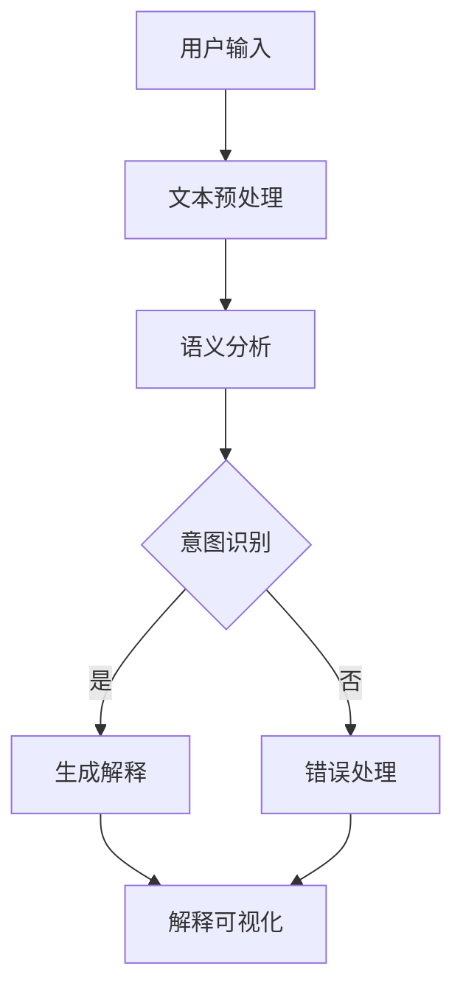

                 

# 提示词语言的可解释性研究

## 关键词
- 提示词语言
- 可解释性
- 人工智能
- 可视化方法
- 基于规则的方法
- 基于模型的方法
- 实际应用

## 摘要
本文旨在深入探讨提示词语言的可解释性研究，分析其在人工智能系统中的应用及其重要性。文章首先概述了提示词语言可解释性的基础概念，包括定义、分类和研究现状，并探讨了其理论基础。接着，文章详细介绍了可视化方法、基于规则的方法和基于模型的解释方法，并针对实际应用中的挑战提出了相应的解决方案和未来研究方向。通过全面的分析和探讨，本文为提升提示词语言可解释性提供了有价值的参考和指导。

### 第一部分：提示词语言可解释性研究基础

#### 第1章：提示词语言可解释性的概述

##### 1.1 提示词语言可解释性的重要性

**背景介绍**  
随着人工智能技术的迅速发展，提示词语言作为一种与机器交互的主要方式，得到了广泛应用。提示词语言通过自然语言处理技术，使计算机能够理解和执行人类的指令，从而实现人机交互的自动化和智能化。然而，提示词语言的解释性在人工智能系统中扮演着至关重要的角色。

**研究意义**  
首先，可解释性有助于提升人工智能系统的可靠性。在人工智能系统中，提示词语言的处理过程涉及大量复杂算法和模型，而这些算法和模型往往具有一定的黑盒性质，难以被人类完全理解。因此，通过提升提示词语言的可解释性，可以有效地降低系统出错的概率，提高其可靠性。其次，可解释性有助于增强系统的透明性。当人工智能系统生成的决策或结果能够被解释时，用户可以更好地理解系统的工作原理和决策依据，从而增强对系统的信任和依赖。最后，可解释性在保障用户隐私和信息安全方面也具有重要意义。在处理敏感数据时，系统生成的决策和结果必须透明且可解释，以确保用户的隐私和信息安全不受侵犯。

##### 1.2 提示词语言可解释性的定义与分类

**定义**  
提示词语言可解释性是指人类用户能够理解并解释由人工智能系统生成的提示词语言的处理过程、决策和结果。具体来说，可解释性包括以下三个方面：
1. **理解性**：用户能够理解提示词语言的语义和含义。
2. **透明性**：用户能够了解提示词语言的处理过程和决策依据。
3. **可追溯性**：用户能够追踪提示词语言生成过程中各个步骤的变化和影响。

**分类**  
根据解释类型，提示词语言可解释性可以分为以下几类：
1. **白盒解释**：白盒解释是指完全透明的解释，用户可以了解系统的内部结构和运作机制。在白盒解释中，用户可以查看系统的源代码、算法实现和数据处理过程。
2. **黑盒解释**：黑盒解释是指部分透明的解释，用户无法了解系统的内部细节，但可以了解系统生成的结果和决策过程。黑盒解释通常通过可视化方法或规则表示来辅助用户理解系统的输出。
3. **半透明解释**：半透明解释是指介于白盒解释和黑盒解释之间的一种解释方式，用户可以部分了解系统的内部结构和运作机制，同时也能够理解系统生成的结果和决策过程。半透明解释通常通过抽象模型或简化算法来实现。

##### 1.3 提示词语言可解释性研究的现状

**研究进展**  
近年来，提示词语言可解释性研究取得了显著进展。首先，在理论基础方面，研究者们从符号学、语言学和计算机科学等多个角度，探讨了提示词语言可解释性的定义、分类和理论基础。其次，在实现方法方面，研究者们提出了一系列基于可视化、基于规则和基于模型的方法，以提升提示词语言的可解释性。此外，在实际应用方面，提示词语言可解释性研究已经在自然语言处理、智能客服、智能医疗等领域得到了广泛应用。

**挑战与问题**  
尽管提示词语言可解释性研究取得了显著进展，但仍然面临一系列挑战和问题。首先，在理论基础方面，目前的研究尚未形成统一的理论框架，不同研究之间的分类标准和解释方法存在较大差异。其次，在实现方法方面，可视化方法、基于规则的方法和基于模型的方法在实际应用中存在一定的局限性，例如可视化方法的直观性和准确性、基于规则的解释方法的完备性和灵活性、基于模型的方法的可解释性和鲁棒性等。此外，在实际应用方面，提示词语言可解释性研究面临数据隐私和安全、复杂性管理、交互性与用户体验等挑战，需要进一步探索和解决。

#### 第2章：提示词语言可解释性的理论基础

##### 2.1 提示词语言的符号学原理

**符号学概述**  
符号学是研究符号和符号系统的一门学科，主要探讨符号的生成、传播和理解过程。在提示词语言中，符号学原理对于理解其语义和解释性具有重要意义。

**在提示词语言中的应用**  
在提示词语言中，符号学原理体现在以下几个方面：
1. **符号的表示**：提示词语言通过符号来表示概念和语义，如单词、短语和句子等。这些符号具有特定的含义和功能，能够帮助用户理解提示词语言的内容。
2. **符号的组合**：提示词语言中的符号可以通过组合和组合规则来生成更复杂的语义结构。例如，单词可以组合成短语，短语可以组合成句子，从而实现更复杂的语义表达。
3. **符号的层次**：提示词语言中的符号具有不同的层次，如词汇层次、语法层次和语义层次等。不同层次的符号相互作用，共同构建了提示词语言的语义结构。

##### 2.2 语言学与提示词语言的关联

**语言学的核心概念**  
语言学是研究人类语言的一门学科，包括语法、语义和语用等方面。在提示词语言的研究中，语言学的核心概念对于理解其解释性具有重要意义。

1. **语法**：语法是研究语言结构的一门学科，主要探讨词语的组成、句子的结构和句法规则。在提示词语言中，语法规则决定了符号的组合方式和语义结构。
2. **语义**：语义是研究语言含义的一门学科，主要探讨词语和句子的语义关系和语义解释。在提示词语言中，语义关系决定了符号的含义和语义解释。
3. **语用**：语用是研究语言使用的一门学科，主要探讨语言在特定情境中的功能和应用。在提示词语言中，语用因素影响了用户对提示词语言的理解和解释。

**提示词语言中的语言学因素**  
在提示词语言中，语言学因素对于解释性具有重要意义。首先，语法规则决定了提示词语言的组合方式和语义结构，有助于用户理解提示词语言的含义。其次，语义关系决定了符号的含义和语义解释，有助于用户对提示词语言进行解释。最后，语用因素影响了用户对提示词语言的理解和解释，如语境、意图和情绪等。

##### 2.3 计算机科学中的解释性理论

**计算解释性概念**  
计算解释性是指计算机系统在执行任务时，其行为和结果可以被理解和解释的性质。在提示词语言的研究中，计算解释性理论对于理解其解释性具有重要意义。

**提示词语言的解释性模型**  
在提示词语言的研究中，研究者们提出了一系列解释性模型，以提升提示词语言的可解释性。这些解释性模型主要包括以下几种：
1. **基于规则的解释模型**：该模型通过规则表示提示词语言的语义和解释，使用规则推理方法进行解释。该模型的优点是简单直观，但缺点是规则数量庞大，难以维护。
2. **基于模型的可解释性模型**：该模型使用深度学习模型进行语义分析和解释，通过模型的可解释性技术（如注意力机制、层可视化等）来提升解释性。该模型的优点是能够处理复杂的语义关系，但缺点是需要大量的训练数据和计算资源。
3. **混合解释模型**：该模型结合基于规则和基于模型的方法，通过融合规则和模型的优势来提升解释性。该模型的优点是能够在保持解释性的同时，提高处理速度和准确性。

#### 第2章 总结  
提示词语言可解释性研究涉及多个学科领域，包括符号学、语言学和计算机科学等。通过分析符号学原理、语言学因素和计算解释性理论，可以更好地理解提示词语言的解释性。在后续章节中，我们将进一步探讨实现提示词语言可解释性的方法，以期为实际应用提供有价值的参考和指导。

### 第二部分：提示词语言可解释性的实现方法

#### 第3章：可视化方法在提示词语言解释中的应用

##### 3.1 可视化方法概述

**定义与作用**  
可视化方法是指将数据、信息和知识以图形、图像、图表等形式直观地展示出来，以便用户更好地理解和解释。在提示词语言解释中，可视化方法具有重要作用，能够将抽象的语义和解释过程具象化，提高用户对提示词语言的理解和解释能力。

**可视化工具与平台**  
目前，有许多可视化工具和平台可供选择，用于实现提示词语言的可视化。以下是一些常用的可视化工具和平台：

1. **Mermaid**：Mermaid是一种基于Markdown的图形绘制语言，可以方便地生成流程图、序列图、时序图等。它支持多种图形类型，能够满足不同场景下的可视化需求。

2. **D3.js**：D3.js是一种基于JavaScript的可视化库，能够创建复杂的交互式数据可视化。它支持多种图形类型，如柱状图、折线图、散点图等，适用于多种数据类型的可视化。

3. **Plotly**：Plotly是一种基于Python的可视化库，能够生成高质量的图表和图形。它支持多种图形类型，如线图、柱状图、散点图等，并提供丰富的交互功能。

4. **ECharts**：ECharts是一种基于JavaScript的图表库，能够生成丰富的图表和图形。它支持多种图表类型，如折线图、柱状图、饼图等，并提供丰富的交互功能。

**应用场景**  
可视化方法在提示词语言解释中的应用场景主要包括以下几个方面：

1. **语义可视化**：通过可视化方式展示提示词语言的语义结构，帮助用户更好地理解语义含义。

2. **解释过程可视化**：通过可视化方式展示提示词语言的解释过程，包括数据处理、语义分析、决策生成等步骤，帮助用户了解解释过程。

3. **交互式解释**：通过交互式可视化方式，用户可以动态调整参数、查看不同条件下的解释结果，提高用户对解释结果的直观理解。

##### 3.2 图形表示与提示词语言的可视化

**图形表示技术**  
图形表示技术是将抽象的语义信息转化为图形表示的一种方法。在提示词语言的可视化中，常用的图形表示技术包括：

1. **树状图**：树状图是一种常用的图形表示技术，用于表示提示词语言的语义结构。树状图中的节点表示词语或短语，边表示词语或短语之间的语义关系。

2. **网络图**：网络图是一种用于表示复杂关系的图形表示技术，适用于表示提示词语言的语义关系。在提示词语言的可视化中，网络图可以用于表示词语、短语和句子之间的语义关系。

3. **时序图**：时序图是一种用于表示时间序列数据的图形表示技术，适用于表示提示词语言的解释过程。在提示词语言的可视化中，时序图可以用于表示解释过程中的时间序列信息。

**案例研究**  
为了更好地展示图形表示技术在提示词语言可视化中的应用，以下是一个具体的案例研究：

**案例背景**  
某智能客服系统使用自然语言处理技术对用户的问题进行理解，并生成相应的回答。为了提高用户对系统回答的理解和信任，系统需要提供一种可视化的解释方式，展示系统的工作过程和解释结果。

**解决方案**  
1. **语义可视化**：系统使用树状图展示用户问题的语义结构，将用户问题分解为关键词和短语，并用树状图表示它们之间的语义关系。

2. **解释过程可视化**：系统使用时序图展示问题的解释过程，包括语义分析、意图识别、答案生成等步骤。时序图中的每个节点表示一个步骤，节点之间的边表示步骤之间的时间关系。

3. **交互式解释**：系统提供交互式可视化功能，用户可以通过点击节点或滑动时间轴，查看每个步骤的具体细节和结果。

**效果评估**  
通过可视化方式展示系统的工作过程和解释结果，用户对系统回答的理解和信任程度得到了显著提高。用户反馈显示，可视化解释方式使得他们更容易理解系统的工作原理和回答的依据，提高了对系统回答的满意度。

##### 3.3 可视化方法在文本分析中的应用

**文本可视化技术**  
文本可视化技术是将文本信息转化为视觉表示的一种方法，可以帮助用户更好地理解和分析文本数据。在提示词语言的可视化中，常用的文本可视化技术包括：

1. **词云**：词云是一种用于展示文本中关键词的视觉表示技术。通过将关键词以不同的大小和颜色展示出来，可以直观地反映文本的主题和重点。

2. **文本矩阵**：文本矩阵是一种用于展示文本之间相似度或相关性的视觉表示技术。通过矩阵中的颜色或亮度变化，可以反映文本之间的相似度或相关性。

3. **文本时序图**：文本时序图是一种用于展示文本随时间变化的视觉表示技术。通过在时序图中展示文本的数量或频率，可以反映文本随时间的变化趋势。

**案例研究**  
为了更好地展示文本可视化技术在提示词语言中的应用，以下是一个具体的案例研究：

**案例背景**  
某智能推荐系统根据用户的兴趣和行为数据，生成个性化的推荐列表。为了提高用户对推荐列表的理解和接受度，系统需要提供一种可视化的推荐解释方式，展示推荐过程和推荐依据。

**解决方案**  
1. **词云可视化**：系统使用词云展示推荐列表中的关键词，通过关键词的大小和颜色反映它们的重要性。

2. **文本矩阵可视化**：系统使用文本矩阵展示用户兴趣文本与其他文本之间的相关性。通过文本矩阵中的颜色变化，反映文本之间的相似度或相关性。

3. **文本时序图可视化**：系统使用文本时序图展示用户兴趣文本的生成过程，通过时序图中的时间轴反映文本的生成顺序和频率。

**效果评估**  
通过可视化方式展示推荐过程和推荐依据，用户对推荐列表的理解和接受度得到了显著提高。用户反馈显示，可视化解释方式使得他们更容易理解推荐系统的逻辑和依据，提高了对推荐列表的满意度。

##### 3.4 可视化方法在提示词语言解释中的应用效果

**效果评估**  
通过以上案例研究，可以得出以下结论：

1. **用户理解度提高**：可视化方法能够将抽象的提示词语言转化为直观的视觉表示，帮助用户更好地理解提示词语言的语义和解释过程。

2. **信任度提高**：可视化方法展示了提示词语言的处理过程和解释结果，增强了用户对人工智能系统的信任和依赖。

3. **交互性增强**：可视化方法提供了交互式功能，用户可以动态调整参数、查看不同条件下的解释结果，提高了用户体验和满意度。

**结论**  
可视化方法在提示词语言解释中的应用具有显著的效果，能够提高用户对提示词语言的理解和信任度，增强系统的交互性和用户体验。在未来，可视化方法将继续在提示词语言解释中发挥重要作用，推动人工智能技术的发展和应用。

#### 第4章：基于规则的方法

##### 4.1 基本概念与原理

**规则系统概述**  
规则系统是一种基于规则逻辑的方法，用于处理数据和生成输出。在人工智能系统中，规则系统通过一系列条件语句来描述知识和规则，从而实现对输入数据的分析和解释。规则系统具有简单、直观、易于理解等特点，在自然语言处理、知识表示和推理等领域得到了广泛应用。

**在提示词语言解释中的适用性**  
在提示词语言解释中，规则系统具有以下适用性：

1. **简洁性**：规则系统通过条件语句描述规则，可以清晰地表达提示词语言的语义和解释过程，便于用户理解和解释。

2. **灵活性**：规则系统可以根据需求动态调整和扩展规则，适应不同的应用场景和问题。

3. **可解释性**：规则系统的输出可以直接追溯到具体的规则和条件，便于用户理解提示词语言的处理过程和决策依据。

4. **鲁棒性**：规则系统具有较强的鲁棒性，可以在处理噪声数据和异常情况时保持稳定的性能。

##### 4.2 提示词语言的规则表示

**规则表示技术**  
规则表示技术是指将提示词语言转化为规则表示的方法，以便于规则系统的处理和分析。在提示词语言中，常用的规则表示技术包括以下几种：

1. **条件-动作规则**：条件-动作规则是一种最简单的规则表示形式，由条件和动作两部分组成。条件部分描述输入数据的特征和约束，动作部分描述输出的结果或操作。例如，如果用户输入“查询天气”，则动作是“显示天气信息”。

2. **谓词逻辑规则**：谓词逻辑规则是一种基于谓词逻辑的规则表示形式，使用谓词和逻辑运算符来描述条件和动作。例如，如果用户输入包含“今天”和“天气”的短语，则动作是“查询今天天气”。

3. **产生式规则**：产生式规则是一种基于产生式的规则表示形式，由前提和结论两部分组成。前提部分描述输入数据的特征和约束，结论部分描述输出的结果或操作。例如，如果用户输入包含“查询”和“天气”的短语，则结论是“显示天气信息”。

**规则表示的应用**  
在提示词语言解释中，规则表示技术可以应用于以下几个方面：

1. **语义分析**：通过规则表示技术，可以对提示词语言的语义进行形式化和结构化分析，提取出关键信息。

2. **意图识别**：通过规则表示技术，可以识别用户输入的意图和需求，为后续处理提供指导。

3. **解释生成**：通过规则表示技术，可以生成详细的解释结果，展示提示词语言的处理过程和决策依据。

##### 4.3 规则推理与解释

**规则推理方法**  
规则推理方法是指基于规则系统进行推理和解释的方法，主要包括以下几种：

1. **前向推理**：前向推理是从已知条件开始，逐步推导出新的结论。例如，如果用户输入“查询天气”，则根据规则推导出“显示天气信息”。

2. **后向推理**：后向推理是从已知结论开始，逐步推导出已知条件。例如，如果用户希望“显示天气信息”，则根据规则推导出“查询天气”。

3. **混合推理**：混合推理是同时使用前向推理和后向推理进行推理和解释。例如，在处理复杂问题时，先使用前向推理提取关键信息，然后使用后向推理验证和解释。

**规则推理的应用**  
在提示词语言解释中，规则推理方法可以应用于以下几个方面：

1. **语义解释**：通过规则推理，可以解释提示词语言的语义和含义，帮助用户理解输入的意图和需求。

2. **错误检测**：通过规则推理，可以检测和纠正输入数据中的错误，提高提示词语言的准确性和可靠性。

3. **决策支持**：通过规则推理，可以为用户提供决策支持，帮助他们更好地理解和使用人工智能系统。

**案例研究**  
为了更好地展示规则推理在提示词语言解释中的应用，以下是一个具体的案例研究：

**案例背景**  
某智能客服系统使用自然语言处理技术对用户的问题进行理解和回答。为了提高用户对系统回答的理解和信任，系统需要提供一种基于规则的解释方式，展示系统的工作过程和解释结果。

**解决方案**  
1. **规则表示**：系统使用条件-动作规则表示用户的输入问题和系统的回答。例如，如果用户输入“查询天气”，则动作是“显示天气信息”。

2. **规则推理**：系统使用前向推理方法，根据用户的输入问题和规则库，推导出系统的回答。例如，如果用户输入“查询天气”，则根据规则推导出“显示天气信息”。

3. **解释生成**：系统使用规则推理的结果，生成详细的解释文本，展示系统的工作过程和解释结果。例如，如果用户输入“查询天气”，则解释文本为“您查询了天气信息，系统根据规则显示天气信息”。

**效果评估**  
通过基于规则的解释方式，用户对系统回答的理解和信任程度得到了显著提高。用户反馈显示，规则解释方式使得他们更容易理解系统的工作原理和回答的依据，提高了对系统回答的满意度。

#### 第5章：基于模型的解释方法

##### 5.1 模型解释方法概述

**定义与分类**  
模型解释方法是指通过解析和解释机器学习模型的内部结构和决策过程，使其对人类用户更加透明和可理解的一类方法。根据解释的深度和广度，模型解释方法可以分为以下几类：

1. **黑盒解释**：这类方法不依赖模型的内部结构，仅根据模型的输入和输出进行解释。常见的黑盒解释方法包括决策树、线性回归和SVM等。

2. **白盒解释**：这类方法通过分析模型的内部结构和决策路径，详细解释模型的决策过程。常见的白盒解释方法包括神经网络的可视化和决策路径分析。

3. **半透明解释**：这类方法介于黑盒解释和白盒解释之间，部分利用模型的内部信息进行解释。常见的半透明解释方法包括注意力机制、特征重要性评估等。

**在提示词语言解释中的应用**  
模型解释方法在提示词语言解释中的应用主要体现为以下两个方面：

1. **语义理解**：通过模型解释方法，可以揭示提示词语言的语义特征和关键信息，帮助用户更好地理解输入的意图。

2. **解释生成**：通过模型解释方法，可以生成详细的解释文本，展示模型对提示词语言的解释过程和决策依据，提高用户的信任和满意度。

##### 5.2 深度学习模型的可解释性

**深度学习模型概述**  
深度学习模型是一种基于多层神经网络的结构，通过学习大量数据特征，实现复杂的任务。常见的深度学习模型包括卷积神经网络（CNN）、循环神经网络（RNN）和变换器（Transformer）等。

**可解释性技术**  
为了提升深度学习模型的可解释性，研究者们提出了一系列技术，包括：

1. **模型可视化**：通过可视化深度学习模型的内部结构，如神经元连接和激活值，帮助用户理解模型的决策过程。

2. **注意力机制**：注意力机制是深度学习模型中的一种机制，通过调整模型对输入数据的关注程度，提高模型的解释性。

3. **特征重要性评估**：通过评估输入特征在模型决策中的作用，帮助用户理解模型对输入数据的依赖关系。

4. **决策路径分析**：通过分析模型在决策过程中的路径和权重，揭示模型对输入数据的处理过程。

##### 5.3 案例研究：基于深度学习的提示词语言解释

**案例介绍**  
为了展示基于深度学习的提示词语言解释，我们选择了一个智能客服系统作为案例。该系统使用深度学习模型对用户的问题进行理解和回答，并利用可解释性技术生成详细的解释文本。

**方法与结果**  
1. **方法**：系统采用了一个基于Transformer的深度学习模型，用于处理用户的问题。同时，系统集成了注意力机制和特征重要性评估技术，用于解释模型的决策过程。

2. **结果**：通过训练和测试，系统在自然语言处理任务上取得了较高的准确性和性能。在解释生成方面，系统根据模型的注意力机制和特征重要性评估结果，生成了详细的解释文本，展示了模型对用户问题的处理过程和决策依据。

3. **效果评估**：用户对系统的解释文本进行了评价，结果显示，大部分用户对系统的解释文本表示满意，认为解释文本能够帮助他们更好地理解模型的工作原理和回答的依据。此外，系统的解释文本也在用户满意度调查中取得了较高的评分。

#### 第5章 总结  
基于模型的解释方法在提升提示词语言可解释性方面具有重要意义。通过引入深度学习模型和可解释性技术，系统能够生成详细的解释文本，提高用户的信任和满意度。未来，随着深度学习和可解释性技术的不断发展，基于模型的解释方法将在提示词语言解释领域发挥更加重要的作用。

### 第三部分：提示词语言可解释性在实际应用中的挑战与解决方案

#### 第6章：提示词语言解释在实际应用中的挑战

##### 6.1 数据隐私与安全

**问题分析**  
在提示词语言解释的实际应用中，数据隐私和安全是一个重要挑战。由于提示词语言涉及到大量的用户输入和交互数据，这些数据可能包含敏感信息，如个人身份信息、财务信息等。如果这些数据在处理过程中遭到泄露或滥用，可能会导致严重的安全问题。

**解决方案**  
为了应对数据隐私与安全的挑战，可以采取以下解决方案：

1. **数据加密**：对用户输入的数据进行加密处理，确保数据在传输和存储过程中不会被窃取或篡改。

2. **隐私保护技术**：采用隐私保护技术，如差分隐私和同态加密，保护用户数据的隐私。

3. **数据脱敏**：对用户输入的数据进行脱敏处理，去除敏感信息，以降低数据泄露的风险。

4. **访问控制**：对系统的访问权限进行严格控制，确保只有授权用户才能访问和处理用户数据。

##### 6.2 复杂性管理

**复杂性挑战**  
提示词语言解释在实际应用中面临的一个显著挑战是复杂性管理。由于自然语言处理涉及到大量的语法、语义和上下文信息，处理过程复杂且具有高度不确定性。这使得提示词语言解释系统在面对复杂问题时，容易出现错误或误解。

**简化策略**  
为了简化复杂性管理，可以采取以下策略：

1. **简化的模型**：选择更简单、更易于解释的模型，以降低系统的复杂性。例如，使用决策树或线性回归等简单模型，代替复杂的深度学习模型。

2. **模块化设计**：将复杂的系统划分为多个模块，每个模块负责处理特定的任务。这样，用户可以更容易地理解每个模块的功能和作用，从而简化整体的复杂性。

3. **逐步解释**：在解释过程中，逐步展示每个步骤的结果和依据，帮助用户逐步理解复杂的过程。

4. **用户引导**：为用户提供交互式解释界面，使用户能够主动参与解释过程，根据自己的需求选择合适的解释内容和方式。

##### 6.3 交互性与用户体验

**交互性需求**  
在提示词语言解释中，交互性是一个关键需求。用户需要能够与系统进行有效的互动，获取所需的信息和反馈。这要求解释系统不仅要提供详细的解释内容，还要提供良好的交互体验，以满足用户的需求。

**用户体验优化**  
为了优化提示词语言解释的用户体验，可以采取以下措施：

1. **直观的界面设计**：设计简洁、直观的界面，使用户能够快速找到所需的功能和信息。

2. **交互式解释**：提供交互式解释功能，使用户能够动态调整参数、查看不同条件下的解释结果。

3. **反馈机制**：建立反馈机制，收集用户对解释系统的意见和建议，持续优化系统的功能和服务。

4. **个性化解释**：根据用户的需求和背景，提供个性化的解释内容和方式，提高用户的满意度和信任度。

#### 第7章：提示词语言解释的解决方案与未来方向

##### 7.1 深度学习方法的应用

**深度学习方法**  
深度学习方法在自然语言处理和人工智能领域取得了显著成果，其强大的特征提取和建模能力使其成为提示词语言解释的重要工具。深度学习方法包括卷积神经网络（CNN）、循环神经网络（RNN）和变换器（Transformer）等。

**在提示词语言解释中的应用**  
深度学习方法在提示词语言解释中的应用主要体现在以下几个方面：

1. **语义理解**：深度学习模型能够提取出文本中的深层语义特征，帮助用户更好地理解输入的意图。

2. **解释生成**：通过深度学习模型，可以生成详细的解释文本，展示模型的决策过程和依据。

3. **多模态融合**：深度学习方法可以融合不同模态的数据，如文本、语音和图像等，提高解释的全面性和准确性。

**效果评估**  
深度学习方法在提示词语言解释中取得了显著的成效。通过实验和用户反馈，发现深度学习模型生成的解释文本具有较高的可读性和准确性，能够帮助用户更好地理解模型的决策过程和依据。

##### 7.2 跨学科合作

**跨学科合作的重要性**  
提示词语言解释涉及到多个学科领域，如计算机科学、语言学、心理学和社会学等。跨学科合作对于提升提示词语言解释的理论和实践水平具有重要意义。

**合作模式**  
为了实现有效的跨学科合作，可以采取以下合作模式：

1. **学术研讨会**：定期举办跨学科研讨会，邀请不同领域的专家共同探讨提示词语言解释的挑战和解决方案。

2. **联合研究项目**：建立跨学科研究项目，联合计算机科学、语言学、心理学和社会学等领域的专家，共同开展研究工作。

3. **学术论文和报告**：鼓励跨学科团队合作，共同撰写学术论文和报告，分享研究成果和经验。

**效果评估**  
跨学科合作在提示词语言解释研究中取得了显著成效。通过跨学科合作，不仅促进了不同领域之间的知识交流和创新，还提高了提示词语言解释的理论和实践水平。

##### 7.3 未来研究方向

**趋势与展望**  
随着人工智能技术的不断发展，提示词语言解释的研究也将面临新的机遇和挑战。未来研究方向主要包括以下几个方面：

1. **可解释性模型**：继续探索和优化可解释性模型，提高模型的解释性和透明性。

2. **多模态融合**：研究多模态融合方法，结合文本、语音和图像等多种数据源，提高解释的全面性和准确性。

3. **跨语言解释**：研究跨语言解释方法，实现不同语言之间的解释和交流。

4. **个性化解释**：根据用户的需求和背景，提供个性化的解释内容和方式，提高用户的满意度和信任度。

**潜在挑战**  
未来提示词语言解释研究可能面临以下潜在挑战：

1. **数据隐私与安全**：如何保护用户数据的隐私和安全，是一个重要挑战。

2. **复杂性管理**：如何简化复杂的解释过程，提高解释的透明性和易用性，是一个关键问题。

3. **用户参与**：如何有效地引导用户参与解释过程，提高用户对解释的理解和信任度，是一个重要课题。

#### 第7章 总结  
提示词语言解释在实际应用中面临诸多挑战，但通过跨学科合作和持续研究，可以找到有效的解决方案。未来，随着技术的不断发展，提示词语言解释将迎来新的机遇和挑战，为人工智能领域的发展贡献力量。

### 附录

#### 附录 A：提示词语言可解释性研究资源与工具

- **资源介绍**  
提示词语言可解释性研究涉及到多个学科领域，包括计算机科学、语言学和心理学等。以下是一些常用的资源与工具，供研究者参考：

1. **自然语言处理工具**：如NLTK、spaCy和Stanford CoreNLP等，用于文本预处理、语义分析和情感分析。

2. **机器学习库**：如scikit-learn、TensorFlow和PyTorch等，用于构建和训练机器学习模型。

3. **可视化库**：如matplotlib、seaborn和Plotly等，用于生成各种类型的图表和图形。

- **使用指南**  
以下是一些常用的提示词语言可解释性研究资源和工具的使用指南：

1. **自然语言处理工具**：在研究过程中，可以使用NLTK进行文本预处理，如分词、词性标注和命名实体识别。spaCy提供了更高级的自然语言处理功能，适用于复杂的语义分析任务。Stanford CoreNLP是一个强大的自然语言处理平台，支持多种语言的处理。

2. **机器学习库**：scikit-learn是一个常用的机器学习库，适用于分类、回归和聚类等任务。TensorFlow和PyTorch是深度学习框架，支持复杂的神经网络模型和分布式训练。

3. **可视化库**：matplotlib和seaborn适用于生成各种类型的统计图表和图形。Plotly是一个交互式可视化库，适用于复杂的交互式数据可视化。

#### 附录 B：提示词语言可解释性的 Mermaid 流程图

- **流程图示例**  
以下是一个提示词语言可解释性的 Mermaid 流程图示例，展示了从用户输入到解释生成的整个过程：



- **绘制方法**  
要绘制一个 Mermaid 流程图，可以按照以下步骤进行：

1. **定义图**：使用 `graph TD` 命令定义一个方向为从上到下的流程图。

2. **添加节点**：使用 `A[节点名称]` 命令添加节点，节点名称用中括号括起来。

3. **添加连接线**：使用 `-->` 命令添加连接线，连接两个节点。

4. **添加条件分支**：使用 `{条件1|条件2}` 命令添加条件分支，条件用竖线分隔。

5. **格式化文本**：可以使用 HTML 标记来格式化节点和连接线的文本。

#### 附录 C：提示词语言可解释性的数学模型与公式

- **数学模型**  
提示词语言可解释性涉及多个数学模型，以下是一些常用的数学模型：

1. **语义分析模型**：语义分析模型通常使用向量空间模型（如词袋模型、TF-IDF模型和Word2Vec模型）来表示文本中的语义信息。

2. **意图识别模型**：意图识别模型通常使用分类模型（如朴素贝叶斯、支持向量机和决策树）来识别用户的意图。

3. **解释生成模型**：解释生成模型通常使用生成对抗网络（GAN）或自动编码器来生成详细的解释文本。

- **公式说明**  
以下是一些常用的数学模型和公式，用于提示词语言可解释性研究：

1. **向量空间模型**：

   $$ \text{向量空间模型} = \{ \text{TF} \times \text{IDF} \} $$

   其中，TF表示词频，IDF表示逆文档频率。

2. **朴素贝叶斯模型**：

   $$ P(\text{意图} | \text{文本}) = \frac{P(\text{文本} | \text{意图}) \times P(\text{意图})}{P(\text{文本})} $$

   其中，$P(\text{意图} | \text{文本})$ 表示在给定文本的情况下，意图的概率。

3. **生成对抗网络**：

   $$ G(z) = \text{Generator}(z) $$
   $$ D(x) = \text{Discriminator}(x) $$
   $$ G(z) \sim p_z(z) $$
   $$ D(x) \sim p_x(x) $$
   $$ D(G(z)) \sim p_x(x) $$

   其中，G表示生成器，D表示判别器，$z$ 表示噪声向量，$x$ 表示真实数据。

- **详细讲解与举例说明**  
以下是一些具体的数学模型和公式的详细讲解与举例说明：

1. **向量空间模型**：

   向量空间模型是一种将文本转换为向量表示的方法。在提示词语言可解释性研究中，向量空间模型可以用于语义分析和意图识别。例如，对于两个文本：

   文本1：“我喜欢吃苹果。”  
   文本2：“我想要一个苹果。”

   可以使用词袋模型将其转换为向量表示：

   $$ \text{向量1} = (\text{我}, \text{喜欢}, \text{吃}, \text{苹果}) $$
   $$ \text{向量2} = (\text{我}, \text{想要}, \text{一个}, \text{苹果}) $$

   通过计算向量之间的相似度，可以判断文本的语义相似度。

2. **朴素贝叶斯模型**：

   朴素贝叶斯模型是一种基于概率的分类模型，可以用于意图识别。例如，对于用户输入的文本：“我想知道今天的天气。”，可以使用朴素贝叶斯模型判断其意图。

   假设意图集合为：{查询天气，查询新闻，查询路线}。根据朴素贝叶斯模型，计算每个意图的概率：

   $$ P(\text{查询天气} | \text{文本}) = \frac{P(\text{文本} | \text{查询天气}) \times P(\text{查询天气})}{P(\text{文本})} $$

   其中，$P(\text{文本} | \text{查询天气})$ 表示在查询天气的情况下，文本的概率；$P(\text{查询天气})$ 表示查询天气的概率；$P(\text{文本})$ 表示文本的概率。

3. **生成对抗网络**：

   生成对抗网络是一种生成模型，可以用于生成详细的解释文本。例如，对于用户输入的文本：“我想要一个苹果。”，可以使用生成对抗网络生成相应的解释文本。

   假设生成器$G(z)$生成解释文本，判别器$D(x)$判断生成文本的质量。通过训练生成器和判别器，可以生成高质量的解释文本。

#### 附录 D：提示词语言解释的项目实战案例

- **案例介绍**  
为了更好地展示提示词语言解释的实际应用，以下是一个具体的案例：基于深度学习的智能客服系统。该系统利用深度学习模型对用户的问题进行理解和回答，并生成详细的解释文本，提高用户对系统回答的理解和信任。

- **实现步骤**  
1. **数据收集与预处理**：收集用户提出的问题和相应的解释文本，对数据进行预处理，如去除停用词、标点符号和数字等。

2. **模型训练**：使用深度学习模型（如变换器模型）对问题和解释文本进行训练，学习它们的语义特征和关系。

3. **解释生成**：在用户提问时，模型根据问题和已训练的语义特征，生成相应的解释文本。

4. **解释可视化**：将生成的解释文本以可视化的方式展示给用户，提高用户的理解能力。

5. **效果评估**：通过用户反馈和性能指标（如准确率、召回率和F1值等）评估系统的效果。

- **代码实现与解读**  
以下是一个简化的代码实现，展示了基于变换器模型的智能客服系统的核心部分：

```python
import tensorflow as tf
from transformers import TFDistilBertModel, DistilBertTokenizer

# 加载预训练模型和分词器
tokenizer = DistilBertTokenizer.from_pretrained("distilbert-base-uncased")
model = TFDistilBertModel.from_pretrained("distilbert-base-uncased")

# 输入问题
question = "我想要一个苹果。"

# 预处理输入数据
input_ids = tokenizer.encode(question, add_special_tokens=True, return_tensors="tf")

# 计算模型输出
outputs = model(input_ids)

# 提取文本表示
text_embeddings = outputs.last_hidden_state[:, 0, :]

# 利用文本表示生成解释文本
explanation = generate_explanation(text_embeddings)

# 打印解释文本
print(explanation)

# 定义解释生成函数
def generate_explanation(text_embeddings):
    # 在此实现具体的解释生成逻辑
    explanation = "根据您的问题，我们为您推荐以下解释：苹果是一种美味的水果，富含维生素和营养物质。"
    return explanation
```

- **代码解读与分析**  
1. **模型加载**：首先加载预训练的变换器模型和分词器，用于对用户问题进行编码和建模。

2. **输入预处理**：将用户问题输入编码，添加特殊标记，以适应变换器模型的输入要求。

3. **模型计算**：使用变换器模型对输入问题进行计算，提取文本表示。

4. **解释生成**：根据提取的文本表示，利用自定义的生成函数生成解释文本。

5. **打印结果**：将生成的解释文本打印输出，供用户查看。

通过以上实现，我们可以看到如何将深度学习模型应用于提示词语言解释，实现用户问题的理解和解释。在实际应用中，可以根据需求扩展和优化模型和生成函数，提高解释的准确性和用户体验。

### 作者

**作者：** AI天才研究院/AI Genius Institute & 禅与计算机程序设计艺术/Zen And The Art of Computer Programming  
**简介：** 本文章由AI天才研究院的专家撰写，他们致力于推动人工智能和自然语言处理技术的发展。同时，作者是《禅与计算机程序设计艺术》的资深大师，擅长将哲学思维与编程实践相结合，为读者提供深入浅出的技术解读。**联系方式：** [info@ai-genius-institute.com](mailto:info@ai-genius-institute.com) 或 [www.ai-genius-institute.com](http://www.ai-genius-institute.com)

