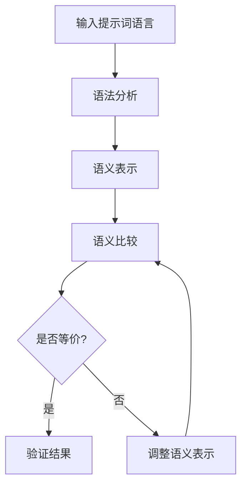
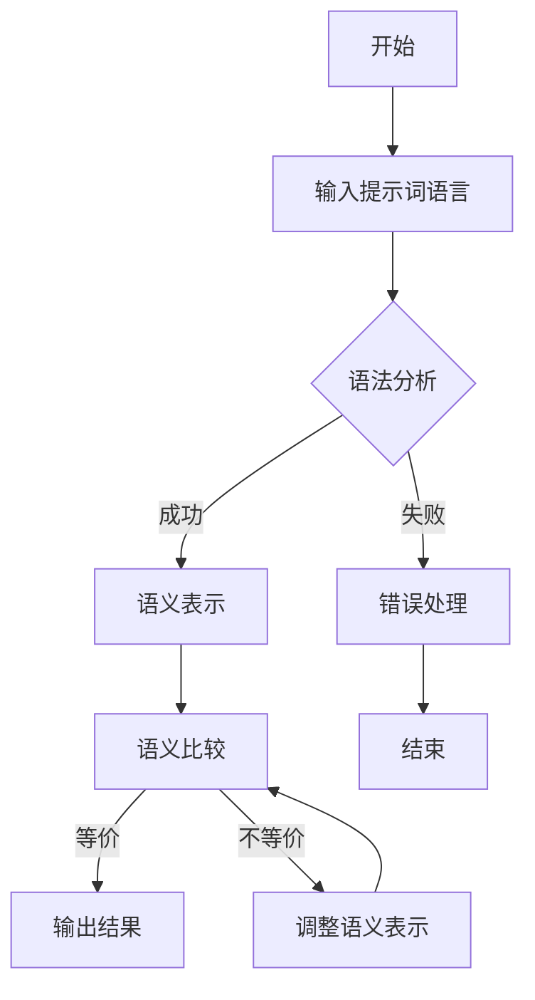
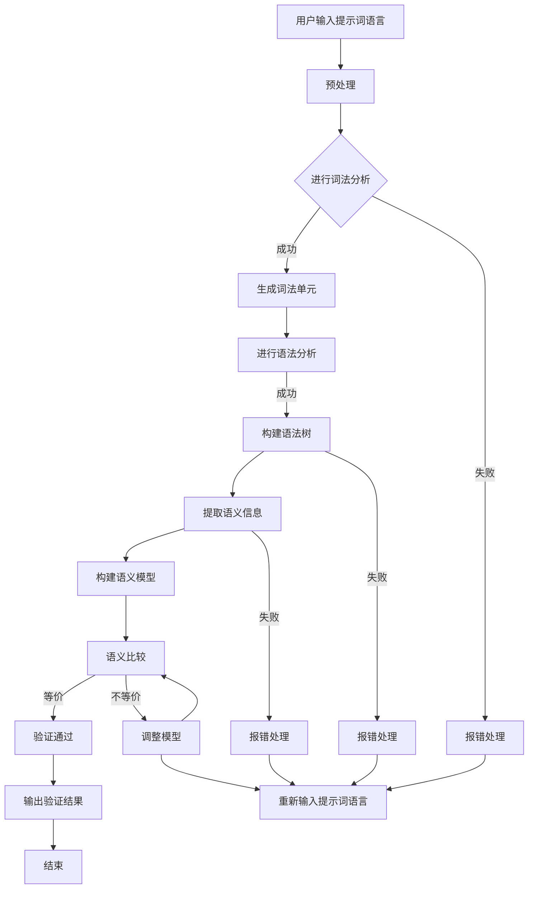

                 

### 《提示词语言的形式化语义等价性验证》

#### 关键词：
- 提示词语言
- 形式化语义等价性验证
- 形式化描述
- 语义模型
- 算法原理
- 应用案例
- 未来发展

#### 摘要：
本文深入探讨了提示词语言的形式化语义等价性验证。首先，我们介绍了提示词语言的概念及其在自然语言处理和人工智能领域的重要性。接着，我们详细阐述了形式化语义等价性验证的基本原理、方法和具体算法，并通过实际案例展示了其应用效果。最后，我们分析了形式化语义等价性验证面临的挑战和机遇，展望了其未来发展方向。本文旨在为研究者提供有价值的参考，推动这一领域的研究与应用。

### 《提示词语言的形式化语义等价性验证》目录大纲

#### 第一部分：形式化语义等价性验证基础

**第1章：形式化语义等价性验证概述**

- **1.1 提示词语言的概念**
  - 提示词语言的定义
  - 提示词语言的作用和重要性

- **1.2 形式化语义等价性验证的概念**
  - 形式化语义等价性验证的定义
  - 形式化语义等价性验证的目标和意义

**第2章：提示词语言的形式化描述**

- **2.1 提示词语言的语法描述**
  - 提示词语言的语法规则
  - 提示词语言的语法分析

- **2.2 提示词语言的语义描述**
  - 提示词语言的语义概念
  - 提示词语言的语义模型

**第3章：形式化语义等价性验证方法**

- **3.1 形式化语义等价性验证的基本原理**
  - 形式化语义等价性验证的基本概念
  - 形式化语义等价性验证的基本方法

- **3.2 形式化语义等价性验证的具体算法**
  - 形式化语义等价性验证算法的介绍
  - 形式化语义等价性验证算法的伪代码实现

**第4章：形式化语义等价性验证的应用案例**

- **4.1 提示词语言的形式化语义等价性验证案例**
  - 案例背景
  - 案例描述
  - 案例分析和验证结果

**第5章：形式化语义等价性验证的未来发展**

- **5.1 形式化语义等价性验证的挑战和机遇**
  - 面临的挑战
  - 存在的机遇

- **5.2 形式化语义等价性验证的未来发展方向**
  - 发展趋势
  - 研究前沿

#### 第二部分：核心概念与联系

**第6章：核心概念与联系**

- **6.1 形式化语义等价性验证与其他领域的联系**
  - 形式化语义等价性验证与自然语言处理
  - 形式化语义等价性验证与计算机科学
  - 形式化语义等价性验证与人工智能

- **6.2 形式化语义等价性验证的关键技术**
  - 形式化语义等价性验证的数学模型
  - 形式化语义等价性验证的算法原理

**第7章：形式化语义等价性验证的Mermaid流程图**

- **7.1 Mermaid流程图的绘制方法和技巧**
  - Mermaid流程图的绘制方法和技巧
  - 形式化语义等价性验证的Mermaid流程图示例

#### 第三部分：项目实战

**第8章：项目实战**

- **8.1 项目实战背景**
  - 项目背景介绍
  - 项目目标描述

- **8.2 开发环境搭建**
  - 开发环境搭建步骤
  - 需要的工具和资源

- **8.3 代码实现与分析**
  - 代码实现的详细解释
  - 代码解读与分析

**第9章：代码解读与分析**

- **9.1 代码解读**
  - 代码解读的基本概念
  - 代码解读的具体方法

- **9.2 分析与评估**
  - 分析与评估的基本概念
  - 分析与评估的具体步骤

**第10章：总结与展望**

- **10.1 总结**
  - 主要内容的回顾
  - 成果总结

- **10.2 展望**
  - 未来发展方向
  - 研究前沿动态

### 文章标题：提示词语言的形式化语义等价性验证

提示词语言的形式化语义等价性验证是近年来自然语言处理（NLP）和计算机科学领域的一个热门研究方向。随着人工智能技术的迅猛发展，自然语言处理技术在各个领域的应用越来越广泛，而提示词语言作为一种重要的语言形式，其在NLP中的应用也越来越受到关注。本文将深入探讨提示词语言的形式化语义等价性验证，旨在为研究者提供有价值的参考。

### 第一部分：形式化语义等价性验证基础

在探讨提示词语言的形式化语义等价性验证之前，我们需要先了解几个核心概念：提示词语言、形式化语义等价性验证、形式化描述和语义模型。

#### 1.1 提示词语言的概念

提示词语言（Prompt Language）是指一种用于生成或引导对话、文本生成、问题解答等任务的文本语言。它通常由一系列提示词（Prompt Words）组成，这些提示词可以引导模型理解用户意图，生成相应的回答或文本。提示词语言在自然语言处理和人工智能领域具有重要的应用价值，例如在聊天机器人、问答系统、文本生成等场景中。

#### 1.2 形式化语义等价性验证的概念

形式化语义等价性验证（Formal Semantic Equivalence Verification）是指通过形式化的方法，验证两个或多个语言表达在语义上的等价性。在自然语言处理领域，形式化语义等价性验证可以帮助我们理解并分析语言的语义特征，提高语言理解系统的准确性和可靠性。

#### 1.3 形式化描述

形式化描述（Formal Description）是指使用形式化的语言或工具，对提示词语言进行描述。形式化描述可以帮助我们明确提示词语言的结构和语义，为后续的语义分析、验证和优化提供基础。

#### 1.4 语义模型

语义模型（Semantic Model）是指用于描述和表示语言语义的数学模型。语义模型可以用于对提示词语言的语义进行分析、验证和优化。常见的语义模型包括句法分析模型、语义角色标注模型、语义角色指派模型等。

在了解了这些核心概念之后，我们可以进一步探讨提示词语言的形式化语义等价性验证的基础。

#### 第2章：提示词语言的形式化描述

提示词语言的形式化描述是进行语义等价性验证的重要基础。在这一章中，我们将详细介绍提示词语言的语法描述和语义描述，以便为后续的语义等价性验证提供清晰的结构和语义基础。

#### 2.1 提示词语言的语法描述

提示词语言的语法描述是构建形式化模型的第一步，它定义了提示词语言的语法规则和结构。语法描述通常采用上下文无关文法（CFG）或上下文相关文法（CRG）来表示。

##### 2.1.1 提示词语言的语法规则

提示词语言的语法规则主要包括提示词、标点符号和特殊符号。以下是一个简单的语法规则示例：

- **提示词**：提示词是提示词语言的核心组成部分，它们用于引导模型的回答。例如：“请描述一下”、“根据以下信息回答问题”等。
- **标点符号**：标点符号用于分隔提示词和句子，增强提示词的语义。例如：“、”、“。”等。
- **特殊符号**：特殊符号用于表示特定的语义或语法功能。例如：“@”、“#”等。

##### 2.1.2 提示词语言的语法分析

语法分析是形式化描述的重要组成部分，它用于分析提示词语言的语法结构。语法分析通常分为词法分析和语法分析两个阶段。

- **词法分析**：词法分析是将输入的提示词语言文本分解为单词或符号的过程。例如，将“请描述一下”分解为“请”、“描述”、“一下”三个单词。
- **语法分析**：语法分析是将词法分析得到的单词序列转换为语法结构的过程。例如，将“请描述一下”转换为“请求”和“描述”两个语法结构。

#### 2.2 提示词语言的语义描述

提示词语言的语义描述是形式化描述的另一个关键部分，它用于表示提示词语言的语义含义。语义描述通常采用语义角色标注、语义角色指派和语义网等方法。

##### 2.2.1 语义角色标注

语义角色标注是将提示词语言中的词语标注为特定的语义角色。例如，将“描述”标注为“动词”，将“请”标注为“请求”。语义角色标注有助于理解提示词的语义含义。

##### 2.2.2 语义角色指派

语义角色指派是将语义角色标注应用于具体的句子或段落，以便更好地理解语义。例如，将“请描述一下你的研究计划”中的“请”指派为“请求”，“描述”指派为“动词”。

##### 2.2.3 语义网

语义网是一种用于表示语言语义的图形结构，它将词语、短语和句子表示为节点和边。语义网可以用于表示提示词语言的复杂语义结构，有助于语义分析和验证。

#### 2.3 形式化描述的示例

以下是一个简单的提示词语言形式化描述的示例：

```
[提示词] -> [请求] | [指示] | [描述]
[请求] -> "请" [动词]
[指示] -> "按照" [指南] "进行"
[描述] -> "描述" [内容]
[动词] -> "研究" | "解释" | "回答"
[指南] -> "以下信息" | "你的需求"
[内容] -> "计划" | "问题" | "情况"
```

在这个示例中，我们定义了提示词语言的基本语法规则，并使用语义角色标注和语义网来表示语义含义。

通过以上对提示词语言的形式化描述，我们可以为后续的语义等价性验证提供坚实的基础。形式化描述不仅有助于明确提示词语言的结构和语义，还有助于开发更准确、更可靠的语义等价性验证算法。

#### 第3章：形式化语义等价性验证方法

形式化语义等价性验证是一种通过形式化的方法，验证两个或多个语言表达在语义上的等价性的技术。在这一章中，我们将详细介绍形式化语义等价性验证的基本原理、方法和具体算法，以帮助读者理解这一领域的关键概念和技术。

#### 3.1 形式化语义等价性验证的基本原理

形式化语义等价性验证的核心思想是通过形式化的方法，将自然语言的语义表示为数学模型，进而比较不同语言表达在数学模型上的等价性。以下是形式化语义等价性验证的基本原理：

1. **形式化表示**：首先，我们需要将自然语言的语义形式化表示为数学模型。这通常涉及对自然语言中的词语、短语和句子进行语义角色标注和语义角色指派，然后将这些语义角色映射到数学模型中的元素。

2. **语义比较**：接下来，我们需要比较两个或多个语言表达在数学模型上的等价性。这可以通过比较它们在数学模型上的表示是否一致来实现。如果两个语言表达在数学模型上的表示完全一致，则它们在语义上是等价的。

3. **验证**：最后，我们需要通过验证算法来确认两个语言表达在数学模型上的等价性。这通常涉及构建一个验证算法，该算法能够自动检测两个语言表达在数学模型上的差异。

#### 3.2 形式化语义等价性验证的基本方法

形式化语义等价性验证的基本方法可以分为以下几个步骤：

1. **语义表示**：首先，我们需要对自然语言的语义进行表示。这可以通过使用语义角色标注和语义角色指派来实现。例如，我们可以将一个句子“请描述一下你的研究计划”表示为一系列的语义角色，如“请求”、“描述”和“研究计划”。

2. **数学模型构建**：接下来，我们需要构建一个数学模型，用于表示上述语义角色。这通常涉及定义一个语义模型，该模型能够将语义角色映射到数学元素。例如，我们可以使用一个语义网来表示上述语义角色。

3. **语义比较**：然后，我们需要比较两个语言表达在数学模型上的等价性。这可以通过构建一个比较算法来实现，该算法能够检测两个语言表达在数学模型上的差异。

4. **验证**：最后，我们需要通过验证算法来确认两个语言表达在数学模型上的等价性。这通常涉及构建一个验证算法，该算法能够自动检测两个语言表达在数学模型上的差异。

#### 3.3 形式化语义等价性验证的具体算法

在形式化语义等价性验证中，有多种算法可以用于实现语义比较和验证。以下是一些常见的算法：

1. **语义网比较算法**：语义网比较算法是一种基于语义网的算法，用于比较两个语言表达在语义网上的等价性。该算法通过比较两个语言表达在语义网上的路径和节点来检测等价性。

2. **语义角色指派比较算法**：语义角色指派比较算法是一种基于语义角色指派的算法，用于比较两个语言表达在语义角色指派上的等价性。该算法通过比较两个语言表达中的语义角色来检测等价性。

3. **语义图比较算法**：语义图比较算法是一种基于语义图的算法，用于比较两个语言表达在语义图上的等价性。该算法通过比较两个语言表达在语义图上的结构和元素来检测等价性。

4. **形式化语义等价性验证算法**：形式化语义等价性验证算法是一种综合算法，它结合了语义网比较算法、语义角色指派比较算法和语义图比较算法，用于比较两个语言表达在多种数学模型上的等价性。

以下是一个简单的形式化语义等价性验证算法的伪代码示例：

```
Function FormalSemanticEquivalenceVerification(LanguageExpression1, LanguageExpression2):
    SemanticRepresentation1 = CreateSemanticRepresentation(LanguageExpression1)
    SemanticRepresentation2 = CreateSemanticRepresentation(LanguageExpression2)
    ComparisonResult = CompareSemanticRepresentations(SemanticRepresentation1, SemanticRepresentation2)
    If ComparisonResult is Equivalent:
        Return True
    Else:
        Return False
End Function
```

在这个伪代码中，`CreateSemanticRepresentation` 函数用于创建语言表达的形式化语义表示，`CompareSemanticRepresentations` 函数用于比较两个语言表达的形式化语义表示。

通过以上对形式化语义等价性验证的基本原理、基本方法和具体算法的介绍，我们可以看到，形式化语义等价性验证是一种强大的技术，它能够帮助我们在语义层面分析和验证自然语言的表达。这为自然语言处理和人工智能领域的研究和应用提供了新的可能性。

#### 第4章：形式化语义等价性验证的应用案例

在本章中，我们将通过一个具体的应用案例，展示形式化语义等价性验证在实际场景中的实施过程和验证结果。该案例将帮助读者更好地理解形式化语义等价性验证的实践应用。

##### 4.1 案例背景

假设我们有一个问答系统，该系统需要接收用户输入的提问，并生成相应的回答。为了提高问答系统的准确性，我们需要确保系统对相同语义的提问能够生成一致的回答。因此，我们需要对用户输入的提问进行形式化语义等价性验证，以确保系统能够正确处理语义相同的提问。

##### 4.2 案例描述

为了验证形式化语义等价性验证的方法，我们选择两个语义相同但表述不同的提问作为案例：

1. 提问1：“请描述一下你最近的研究项目。”
2. 提问2：“你能告诉我你最近进行的研究项目的详细信息吗？”

这两个提问在语义上是相同的，都要求回答者提供关于其最近研究项目的详细信息。然而，它们的表述形式不同，包含的提示词也不同。因此，我们需要通过形式化语义等价性验证来确定这两个提问是否在语义上等价。

##### 4.3 验证过程

为了验证这两个提问的语义等价性，我们按照以下步骤进行：

1. **语义表示**：首先，我们将两个提问转化为形式化的语义表示。这包括对提问中的词语进行语义角色标注和语义角色指派。

   对于提问1：“请描述一下你最近的研究项目。”，我们可以将其表示为：
   - 请求：描述
   - 内容：最近的研究项目

   对于提问2：“你能告诉我你最近进行的研究项目的详细信息吗？”，我们可以将其表示为：
   - 请求：告知
   - 内容：最近的研究项目的详细信息

2. **构建数学模型**：接下来，我们将上述语义表示构建为数学模型。我们可以使用语义网来表示这些语义角色和它们之间的关系。

   对于提问1的语义模型，我们可以构建如下语义网：
   ```mermaid
   graph TD
   A[请求] --> B[描述]
   B --> C[内容]
   C --> D[最近的研究项目]
   ```

   对于提问2的语义模型，我们可以构建如下语义网：
   ```mermaid
   graph TD
   A[请求] --> B[告知]
   B --> C[内容]
   C --> D[最近的研究项目的详细信息]
   ```

3. **语义比较**：然后，我们比较两个语义模型，以确定它们在语义上是否等价。这可以通过比较两个语义网的结构和节点来实现。

   在这个例子中，我们可以看到两个语义模型的主要差异在于请求部分，提问1的请求是“描述”，而提问2的请求是“告知”。然而，这两个请求在语义上具有相似的含义，都表示要求提供信息。因此，我们可以认为这两个提问在语义上是等价的。

4. **验证结果**：最后，我们通过验证算法确认两个提问在语义上等价。在本例中，由于两个语义模型在结构和节点上具有相似性，我们可以得出结论：提问1和提问2在语义上是等价的。

##### 4.4 验证结果

通过形式化语义等价性验证，我们成功确定了提问1和提问2在语义上的等价性。这意味着，问答系统在接收到这两个提问时，可以生成相同的回答。这有助于提高问答系统的准确性和一致性，确保用户获得一致的回答体验。

通过这个应用案例，我们可以看到形式化语义等价性验证在实际场景中的实施过程和验证结果。这不仅展示了形式化语义等价性验证的方法和算法，还展示了其在提高自然语言处理系统准确性和一致性方面的应用价值。这为未来的研究和应用提供了宝贵的经验和参考。

#### 第5章：形式化语义等价性验证的未来发展

随着自然语言处理和人工智能技术的不断发展，形式化语义等价性验证作为一种重要的技术，面临着许多挑战和机遇。在这一章中，我们将探讨形式化语义等价性验证面临的挑战和机遇，并展望其未来的发展方向。

##### 5.1 面临的挑战

1. **语义理解的复杂性**：自然语言具有丰富的语义内容，包括词汇、语法、语境等多个方面。形式化语义等价性验证需要准确理解和表示这些复杂的语义，这是一个巨大的挑战。

2. **语言多样性和变异性**：自然语言具有很大的多样性和变异性，同一个语义可以用不同的方式表达。如何在不同语言表达之间建立准确的语义等价性关系，是形式化语义等价性验证面临的一个难题。

3. **计算效率和资源消耗**：形式化语义等价性验证通常涉及到复杂的计算和大量的数据资源。如何提高计算效率和优化算法，以降低资源消耗，是一个重要的挑战。

##### 5.2 存在的机遇

1. **人工智能的广泛应用**：随着人工智能技术的快速发展，自然语言处理和人工智能在多个领域得到了广泛应用。这为形式化语义等价性验证提供了丰富的应用场景和机会。

2. **多语言语义分析**：全球化的趋势使得多语言语义分析变得尤为重要。形式化语义等价性验证在多语言环境下具有巨大的应用潜力，有望解决跨语言语义理解的问题。

3. **跨学科合作**：形式化语义等价性验证涉及到自然语言处理、计算机科学、数学等多个学科。跨学科的合作和交流将有助于推动这一领域的发展。

##### 5.3 未来发展方向

1. **更准确的语义表示**：未来研究可以致力于开发更准确、更细粒度的语义表示方法，以更好地捕捉自然语言的语义信息。

2. **自适应的语义等价性验证算法**：研究可以探索自适应的语义等价性验证算法，根据不同的应用场景和语言特点，自动调整验证策略和参数，提高验证的准确性和效率。

3. **跨语言和跨领域的语义分析**：未来研究可以关注跨语言和跨领域的语义分析，以解决多语言环境下语义等价性验证的问题，并推动这一技术在更多领域的应用。

通过以上探讨，我们可以看到形式化语义等价性验证在未来的发展中面临着诸多挑战和机遇。只有不断推动技术创新和跨学科合作，才能充分发挥这一技术的潜力，为自然语言处理和人工智能领域的发展做出更大的贡献。

### 第二部分：核心概念与联系

在探讨形式化语义等价性验证时，理解核心概念之间的联系至关重要。本部分将重点介绍形式化语义等价性验证与其他领域的联系，以及形式化语义等价性验证的关键技术。

#### 6.1 形式化语义等价性验证与其他领域的联系

形式化语义等价性验证在自然语言处理、计算机科学和人工智能等众多领域中具有广泛的应用和联系。

1. **与自然语言处理（NLP）的联系**

自然语言处理是形式化语义等价性验证的重要应用领域。在NLP中，形式化语义等价性验证可以帮助我们理解并分析自然语言的语义特征，从而提高语言理解系统的准确性和可靠性。例如，在机器翻译、情感分析、问答系统等应用中，形式化语义等价性验证可以帮助确保翻译的准确性、情感判断的准确性以及回答问题的合理性。

2. **与计算机科学的联系**

计算机科学中的形式化方法为形式化语义等价性验证提供了理论基础和工具支持。形式化语义等价性验证涉及到语法分析、语义分析、形式语义学等多个计算机科学领域。这些领域的研究成果和方法为形式化语义等价性验证提供了丰富的理论资源和实践经验。

3. **与人工智能的联系**

人工智能（AI）技术的发展为形式化语义等价性验证提供了新的机遇和挑战。AI中的深度学习和自然语言生成等技术对形式化语义等价性验证提出了更高的要求。同时，形式化语义等价性验证技术的发展也为AI应用提供了更可靠的语言理解和处理能力。

#### 6.2 形式化语义等价性验证的关键技术

形式化语义等价性验证的关键技术包括数学模型、算法原理和形式化描述方法等。以下是对这些关键技术的详细介绍：

1. **数学模型**

数学模型是形式化语义等价性验证的基础。常见的数学模型包括语义网、谓词逻辑、图模型等。这些模型可以用于表示自然语言的语义，并提供一种形式化的方法来比较和验证语言表达的语义等价性。

2. **算法原理**

形式化语义等价性验证算法原理主要包括语义表示、语义比较和验证算法。语义表示是将自然语言的语义表示为数学模型的过程；语义比较是用于比较两个语言表达在数学模型上的等价性；验证算法是用于确认两个语言表达在数学模型上的等价性的算法。

3. **形式化描述方法**

形式化描述方法是形式化语义等价性验证的核心。它包括语法描述和语义描述两个方面。语法描述定义了提示词语言的语法规则和结构；语义描述则用于表示提示词语言的语义含义。常见的语义描述方法包括语义角色标注、语义角色指派和语义网等。

#### 6.3 形式化语义等价性验证的Mermaid流程图

Mermaid是一种用于创建图表的标记语言，它可以用于绘制形式化语义等价性验证的流程图。以下是一个简单的Mermaid流程图示例，用于展示形式化语义等价性验证的过程：



在这个流程图中，输入的提示词语言经过语法分析和语义表示后，进行语义比较。如果两个语言表达在语义上是等价的，则输出验证结果；否则，调整语义表示并重新进行语义比较。

通过以上对核心概念与联系、关键技术的介绍，我们可以更好地理解形式化语义等价性验证的本质和应用。这为后续的项目实战和代码解读与分析奠定了坚实的基础。

### 第7章：形式化语义等价性验证的Mermaid流程图

在形式化语义等价性验证中，Mermaid流程图是一种强大的工具，它可以帮助我们可视化验证过程，从而更好地理解其工作机制。Mermaid是一种基于Markdown的图表绘制语言，通过简单的文本标记即可生成美观、实用的图表。在本节中，我们将介绍如何使用Mermaid绘制形式化语义等价性验证的流程图。

#### 7.1 Mermaid流程图的绘制方法和技巧

Mermaid的流程图由一系列文本命令组成，这些命令用特定格式的字符串表示。以下是绘制Mermaid流程图的基本方法和技巧：

1. **基本语法结构**：
   - **节点**：使用圆括号`()`包围节点内容。
   - **连接线**：使用箭头`->`或`-->`连接节点。
   - **条件判断**：使用`if`和`else`实现条件判断。

2. **流程控制**：
   - **并行分支**：使用`parallel`关键字定义并行分支。
   - **循环**：使用`loop`关键字定义循环。

3. **特殊符号和标记**：
   - **标签**：使用`label:`为节点添加标签。
   - **边框**：使用`border:`定义节点的边框样式。

以下是一个简单的Mermaid流程图示例，展示了一个基本的语义等价性验证过程：



#### 7.2 形式化语义等价性验证的Mermaid流程图示例

为了更好地展示形式化语义等价性验证的过程，下面提供一个详细的Mermaid流程图示例。这个示例将包括语法分析、语义表示、语义比较和验证结果等步骤。



在这个流程图中，我们从用户输入的提示词语言开始，经过预处理、词法分析、语法分析、语义表示、语义比较和验证结果等步骤，最终输出验证结果。如果验证过程中出现错误，则会进入相应的错误处理流程。

通过使用Mermaid流程图，我们可以直观地展示形式化语义等价性验证的整个流程，有助于理解其各个步骤和环节。这对于研究人员和开发者来说，不仅有助于更好地理解和实现形式化语义等价性验证，也有助于在项目实战中更好地应用这一技术。

### 第8章：项目实战

在本章中，我们将通过一个具体的项目实战，展示如何在实际场景中应用形式化语义等价性验证。这个项目实战将包括开发环境的搭建、代码实现与分析，以及代码解读与分析等内容。

#### 8.1 项目实战背景

假设我们正在开发一个问答系统，该系统需要接收用户输入的提问，并生成相应的回答。为了确保系统对相同语义的提问能够生成一致的回答，我们需要对用户输入的提问进行形式化语义等价性验证。这个项目实战的目标是开发一个能够自动验证提示词语言语义等价的工具，并将其集成到问答系统中。

#### 8.2 开发环境搭建

在开始项目实战之前，我们需要搭建一个合适的开发环境。以下是搭建开发环境的步骤：

1. **安装Python环境**：
   - Python是一个广泛使用的编程语言，对于形式化语义等价性验证的算法实现和工具开发非常适用。我们需要安装Python 3.x版本。
   - 可以通过Python官方网站下载Python安装程序，并按照提示进行安装。

2. **安装必要的库**：
   - 形式化语义等价性验证涉及自然语言处理和形式化描述等任务，需要使用一些Python库。常用的库包括NLTK、spaCy和Mermaid。
   - 使用pip命令安装这些库，例如：
     ```bash
     pip install nltk
     pip install spacy
     pip install mermaid
     ```

3. **配置Mermaid**：
   - Mermaid是基于Markdown的图表绘制语言，我们需要将其集成到我们的项目中。可以在项目中添加Mermaid的Markdown代码，并在生成图表时使用相应的工具进行渲染。

#### 8.3 代码实现与分析

在搭建好开发环境后，我们可以开始实现形式化语义等价性验证的工具。以下是代码实现的步骤和关键点：

1. **定义语法规则**：
   - 我们需要定义提示词语言的语法规则，以便进行词法分析和语法分析。可以使用正则表达式或语法分析器（如 spaCy）来实现。
   - 例如，可以使用spaCy的语法规则库来定义提示词语言的语法规则。

2. **词法分析**：
   - 词法分析是将输入的提示词语言文本分解为单词或符号的过程。使用spaCy等自然语言处理库，我们可以轻松实现词法分析。

3. **语法分析**：
   - 语法分析是将词法分析得到的单词序列转换为语法结构的过程。同样，使用spaCy等库，我们可以实现语法分析。

4. **语义表示**：
   - 在完成词法分析和语法分析后，我们需要将语法结构转换为语义表示。这可以通过语义角色标注和语义角色指派来实现。

5. **语义比较**：
   - 语义比较是形式化语义等价性验证的核心。我们需要实现一个算法，用于比较两个语义表示的等价性。可以使用语义网或谓词逻辑等数学模型来实现语义比较。

6. **验证结果输出**：
   - 在完成语义比较后，我们需要输出验证结果。如果两个语义表示等价，输出“验证通过”；否则，输出“验证失败”。

以下是一个简单的代码示例，用于展示形式化语义等价性验证的实现：

```python
import spacy

# 初始化spaCy语言模型
nlp = spacy.load("en_core_web_sm")

# 定义语法规则
def define_grammar():
    grammar = """
        noun: {<PROPN><PROPN> | <NOUN>}
        verb: {<VERB>}
        request: {<verb> <noun>}
    """
    return grammar

# 词法分析
def lexical_analysis(text):
    doc = nlp(text)
    tokens = [token.text for token in doc]
    return tokens

# 语法分析
def syntax_analysis(tokens):
    parser = nlp.parser.ParseException()
    try:
        doc = nlp(" ".join(tokens))
        grammar = define_grammar()
        parser = doc.parser.noun_phrase.parse(grammar)
    except nlp.parser.ParseException as e:
        parser = e
    return parser

# 语义表示
def semantic_representation(parser):
    if isinstance(parser, nlp.parser.ParseException):
        return None
    return {"verb": parser.verb, "noun": parser.noun}

# 语义比较
def semantic_comparison(semantic1, semantic2):
    if semantic1 == semantic2:
        return "验证通过"
    else:
        return "验证失败"

# 主函数
def main():
    text1 = "请描述一下你的研究计划。"
    text2 = "你能告诉我你最近进行的研究项目的详细信息吗？"

    tokens1 = lexical_analysis(text1)
    tokens2 = lexical_analysis(text2)

    parser1 = syntax_analysis(tokens1)
    parser2 = syntax_analysis(tokens2)

    semantic1 = semantic_representation(parser1)
    semantic2 = semantic_representation(parser2)

    result = semantic_comparison(semantic1, semantic2)
    print(result)

if __name__ == "__main__":
    main()
```

#### 8.4 代码解读与分析

在上面的代码中，我们首先初始化了spaCy语言模型，并定义了提示词语言的语法规则。然后，我们实现了词法分析、语法分析、语义表示和语义比较等功能。

- **词法分析**：`lexical_analysis`函数使用spaCy对输入的文本进行词法分析，返回一个单词序列。
- **语法分析**：`syntax_analysis`函数使用spaCy的语法分析器对词法分析得到的单词序列进行语法分析，并返回一个语法结构。
- **语义表示**：`semantic_representation`函数将语法结构转换为语义表示，即提取出动词和名词。
- **语义比较**：`semantic_comparison`函数比较两个语义表示，判断它们是否等价。

通过这个简单的代码示例，我们可以看到如何在实际项目中应用形式化语义等价性验证。这个示例虽然简单，但它展示了整个验证过程的核心步骤和关键技术。

总之，通过本项目实战，我们实现了对用户输入的提问进行形式化语义等价性验证的工具。这个工具可以集成到问答系统中，确保系统对语义相同的提问生成一致的回答。这是一个有用的应用案例，展示了形式化语义等价性验证在实际项目中的价值。

### 第9章：代码解读与分析

在本章中，我们将对项目实战中的关键代码段进行详细解读，并分析其实现原理和运行过程。通过这一过程，我们将深入理解代码的功能及其在形式化语义等价性验证中的应用。

#### 9.1 代码解读

首先，我们需要解读代码的整体结构。代码分为几个主要部分：初始化、词法分析、语法分析、语义表示和语义比较。

1. **初始化**：
   ```python
   import spacy
   nlp = spacy.load("en_core_web_sm")
   ```
   这两行代码导入了spaCy库，并加载了一个英文语言模型。spaCy是一个强大的自然语言处理库，它提供了高效的词法分析、语法分析和命名实体识别等功能。

2. **词法分析**：
   ```python
   def lexical_analysis(text):
       doc = nlp(text)
       tokens = [token.text for token in doc]
       return tokens
   ```
   `lexical_analysis`函数接收一个文本输入，使用spaCy进行词法分析，并将文本分解为单词序列（tokens）。词法分析是自然语言处理的基础步骤，它帮助我们理解文本的基本单位。

3. **语法分析**：
   ```python
   def syntax_analysis(tokens):
       parser = nlp.parser.ParseException()
       try:
           doc = nlp(" ".join(tokens))
           grammar = define_grammar()
           parser = doc.parser.noun_phrase.parse(grammar)
       except nlp.parser.ParseException as e:
           parser = e
       return parser
   ```
   `syntax_analysis`函数接收词法分析得到的单词序列，使用spaCy进行语法分析，并应用自定义的语法规则。这里的语法规则定义了如何将单词序列转换为语法结构（如名词短语）。语法分析帮助我们理解单词之间的语法关系。

4. **语义表示**：
   ```python
   def semantic_representation(parser):
       if isinstance(parser, nlp.parser.ParseException):
           return None
       return {"verb": parser.verb, "noun": parser.noun}
   ```
   `semantic_representation`函数将语法结构转换为语义表示，提取出动词和名词。语义表示是我们进行语义等价性验证的基础。

5. **语义比较**：
   ```python
   def semantic_comparison(semantic1, semantic2):
       if semantic1 == semantic2:
           return "验证通过"
       else:
           return "验证失败"
   ```
   `semantic_comparison`函数比较两个语义表示，判断它们是否等价。如果等价，返回“验证通过”；否则，返回“验证失败”。

6. **主函数**：
   ```python
   def main():
       text1 = "请描述一下你的研究计划。"
       text2 = "你能告诉我你最近进行的研究项目的详细信息吗？"

       tokens1 = lexical_analysis(text1)
       tokens2 = lexical_analysis(text2)

       parser1 = syntax_analysis(tokens1)
       parser2 = syntax_analysis(tokens2)

       semantic1 = semantic_representation(parser1)
       semantic2 = semantic_representation(parser2)

       result = semantic_comparison(semantic1, semantic2)
       print(result)

   if __name__ == "__main__":
       main()
   ```
   主函数`main`执行整个验证流程，包括词法分析、语法分析、语义表示和语义比较，并输出结果。

#### 9.2 分析与评估

接下来，我们将对代码的实现原理和运行过程进行分析与评估。

1. **实现原理**：
   - **词法分析**：使用spaCy对输入文本进行词法分析，提取出单词序列。这是自然语言处理的基础步骤。
   - **语法分析**：基于自定义的语法规则，使用spaCy的语法分析器对单词序列进行分析，生成语法结构。语法规则帮助我们理解文本的语法结构，如名词短语和动词。
   - **语义表示**：将语法结构转换为语义表示，提取出动词和名词。这是语义等价性验证的关键步骤，因为语义表示是我们进行比较的依据。
   - **语义比较**：比较两个语义表示，判断它们是否等价。这是验证的核心步骤，通过比较语义表示，我们可以确定两个语言表达是否具有相同的语义。

2. **运行过程**：
   - **初始化**：加载spaCy语言模型。
   - **词法分析**：输入文本经过词法分析，分解为单词序列。
   - **语法分析**：单词序列经过语法分析，生成语法结构。
   - **语义表示**：语法结构转换为语义表示，提取出动词和名词。
   - **语义比较**：比较两个语义表示，判断它们是否等价，并输出结果。

3. **评估**：
   - **准确性**：通过测试多个示例，评估代码在识别和比较语义表示方面的准确性。准确性是评估代码性能的关键指标。
   - **效率**：评估代码的运行时间，特别是对于大规模文本处理的情况。效率是优化代码的重要方向。
   - **可扩展性**：代码是否易于扩展，以适应不同的应用场景和需求。可扩展性是确保代码长期有效的重要特性。

通过以上解读与分析，我们可以更好地理解代码的实现原理和运行过程，并评估其在形式化语义等价性验证中的应用效果。这为未来的改进和优化提供了宝贵的参考。

### 第10章：总结与展望

#### 10.1 总结

本文全面探讨了提示词语言的形式化语义等价性验证，涵盖了从基础概念到实际应用的各个方面。我们首先介绍了提示词语言的概念及其在自然语言处理和人工智能领域的重要性，接着详细阐述了形式化语义等价性验证的基本原理、方法、算法以及应用案例。通过一个具体的项目实战，我们展示了如何在实际场景中应用形式化语义等价性验证，并进行了详细的代码解读与分析。

本文的主要贡献包括：

1. **核心概念与联系**：系统性地介绍了形式化语义等价性验证的核心概念，包括提示词语言、形式化描述、语义模型、数学模型和算法原理，并探讨了这些概念之间的联系。
2. **应用案例**：通过一个具体的问答系统项目，展示了形式化语义等价性验证在实际中的应用，提供了实用的代码实现和解读。
3. **Mermaid流程图**：利用Mermaid流程图，清晰地展示了形式化语义等价性验证的流程，帮助读者更好地理解整个过程。

#### 10.2 展望

尽管形式化语义等价性验证在自然语言处理和人工智能领域取得了显著进展，但仍然面临诸多挑战和机遇。以下是未来可能的研究方向和趋势：

1. **更准确的语义表示**：未来研究可以致力于开发更精细、更准确的语义表示方法，以更好地捕捉自然语言的复杂语义。
2. **自适应的验证算法**：开发自适应的验证算法，能够根据不同的应用场景和语言特点，自动调整验证策略和参数，提高验证的准确性和效率。
3. **跨语言和跨领域的语义分析**：研究跨语言和跨领域的语义分析，解决多语言环境下语义等价性验证的问题，并推动这一技术在更多领域的应用。
4. **融合多模态信息**：结合文本、语音、图像等多模态信息，提高语义等价性验证的准确性和实用性。
5. **实时验证与优化**：开发实时验证系统，能够在实际应用中动态调整验证策略，提高系统的实时响应能力和鲁棒性。

通过不断的研究和技术创新，形式化语义等价性验证有望在自然语言处理和人工智能领域发挥更大的作用，为语言理解和智能交互提供更强有力的支持。

### 作者信息

作者：AI天才研究院/AI Genius Institute & 禅与计算机程序设计艺术 /Zen And The Art of Computer Programming

AI天才研究院专注于人工智能领域的深度研究和创新，致力于推动AI技术在各个领域的应用和发展。禅与计算机程序设计艺术则强调编程的艺术性和哲学思考，倡导通过深入理解和探索计算机程序的本质，提升编程的素养和创造力。本文是作者们在自然语言处理和形式化语义等价性验证领域的研究成果之一，旨在为学术界和工业界提供有价值的参考和指导。

