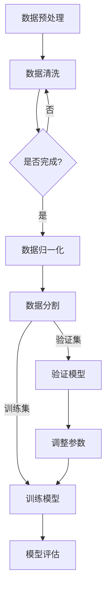
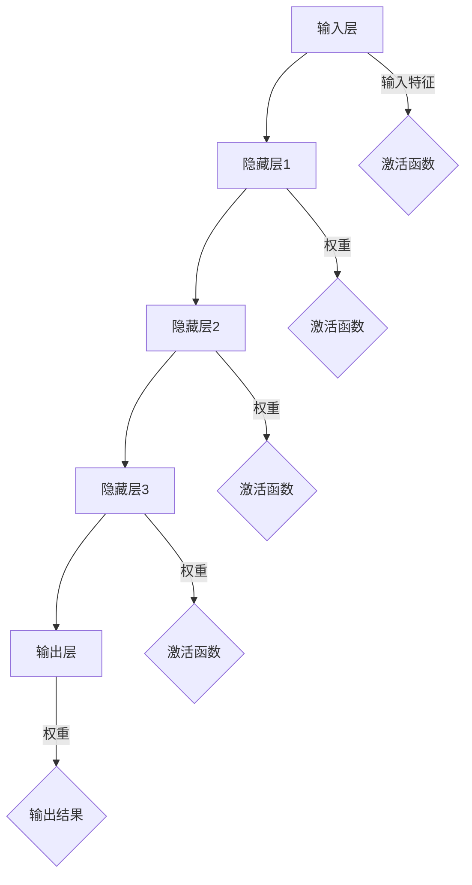
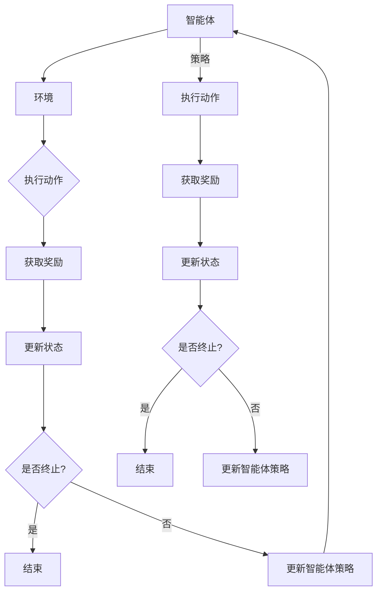

                 

# 《AI编程的新视角与新未来》

## 概述

### 关键词
- 人工智能编程
- 深度学习
- 自然语言处理
- 计算机视觉
- 强化学习
- 编程工具与环境

### 摘要

随着人工智能技术的迅速发展，AI编程正成为当今信息技术领域的重要研究方向。本文从AI编程的基础知识出发，逐步深入探讨其核心概念、算法原理以及未来发展趋势。通过分析自然语言处理、计算机视觉和强化学习等领域的应用案例，本文展示了AI编程的强大潜力。此外，本文还将介绍常用的AI编程工具与环境搭建，以及AI编程在教育、医疗等领域的广泛应用。最后，本文对AI编程面临的挑战与解决方案进行了展望，为读者提供了一个全面、系统的AI编程新视角与新未来。

## 目录大纲

1. **AI编程基础**
   1.1 AI编程概述
   1.2 机器学习与深度学习基础
   1.3 数学模型与算法原理

2. **AI编程实战**
   2.1 自然语言处理
   2.2 计算机视觉
   2.3 强化学习与智能决策

3. **AI编程的未来趋势**
   3.1 AI编程技术的发展方向
   3.2 AI编程在教育、医疗等领域的应用
   3.3 AI编程面临的挑战与解决方案

4. **AI编程工具与环境**
   4.1 常用AI编程工具
   4.2 AI编程开发环境搭建

5. **附录**
   5.1 AI编程资源与推荐
   5.2 经典书籍推荐
   5.3 线上课程与讲座推荐

### 第一部分: AI编程基础

#### 第1章: AI编程概述

#### 1.1 AI编程的定义与意义

人工智能（Artificial Intelligence，简称AI）作为计算机科学的一个分支，旨在使机器模拟人类智能行为，实现自动推理、学习、感知、决策等功能。AI编程则是指开发和应用AI技术实现特定功能的编程活动。随着AI技术的不断进步，AI编程在各个领域展现出了巨大的潜力。

AI编程的意义主要体现在以下几个方面：

1. **自动化**：通过编程实现自动化任务，提高工作效率，减少人力成本。
2. **智能决策**：利用机器学习算法，让机器能够根据历史数据和现实情况做出智能决策。
3. **个性化服务**：通过数据分析和模型预测，为用户提供更加个性化的服务体验。
4. **创新应用**：AI编程为新兴技术领域提供了强大的支持，推动了科技的发展。

#### 1.2 AI编程的技术背景

AI编程的发展离不开计算机科学和数学的进步。计算机科学的不断发展为AI提供了强大的计算能力和存储资源，而数学则为AI算法提供了理论基础。

- **计算机科学**：计算机硬件的快速发展，使得计算能力和存储容量大幅提升，为AI编程提供了基础支持。此外，编程语言和开发工具的进步，使得AI编程变得更加高效和便捷。
- **数学**：数学为AI算法提供了理论基础，包括线性代数、概率论、统计学等。这些数学工具帮助AI模型更好地理解和处理复杂问题。

#### 1.3 AI编程的核心架构

AI编程的核心架构主要包括以下几个部分：

1. **数据采集与预处理**：收集和处理数据是AI编程的第一步。数据的质量直接影响到模型的性能。因此，数据采集和预处理是AI编程中至关重要的一环。
2. **算法选择与实现**：根据实际问题选择合适的算法，并进行编程实现。常见的算法包括机器学习算法、深度学习算法等。
3. **模型训练与优化**：通过训练数据对模型进行调整和优化，使其能够更好地解决实际问题。
4. **模型部署与评估**：将训练好的模型部署到实际应用场景中，并对其进行评估和调整。

### 第2章: 机器学习与深度学习基础

#### 2.1 机器学习基本概念

机器学习（Machine Learning，简称ML）是AI编程的核心技术之一。它是指让计算机通过数据和算法自动学习和改进，从而实现特定任务的能力。

- **基本概念**：
  - **模型**：机器学习的核心是模型，它是对数据进行分析和预测的工具。
  - **训练**：训练是机器学习过程中的关键步骤，通过训练数据调整模型的参数，使其能够更好地拟合数据。
  - **预测**：预测是模型在实际应用中的体现，通过输入新的数据，模型能够预测出相应的结果。

- **机器学习流程**：
  1. 数据采集与预处理
  2. 算法选择与实现
  3. 模型训练与优化
  4. 模型评估与部署

#### 2.2 深度学习基本概念

深度学习（Deep Learning，简称DL）是机器学习的一个子领域，它通过构建多层神经网络来模拟人类大脑的学习过程，从而实现更复杂的任务。

- **基本概念**：
  - **神经网络**：神经网络是深度学习的基础，它由多个神经元（节点）组成，通过输入层、隐藏层和输出层进行信息传递和处理。
  - **反向传播**：反向传播算法是深度学习训练的核心，它通过不断调整神经网络的权重，使模型能够更好地拟合数据。
  - **激活函数**：激活函数是神经网络中用于引入非线性特征的函数，常见的有sigmoid、ReLU等。

- **深度学习流程**：
  1. 数据采集与预处理
  2. 神经网络架构设计
  3. 模型训练与优化
  4. 模型评估与部署

#### 2.3 神经网络结构

神经网络结构是深度学习的重要组成部分，它决定了模型的学习能力和复杂度。

- **基本结构**：
  1. **输入层**：接收外部输入数据。
  2. **隐藏层**：对输入数据进行处理，提取特征。
  3. **输出层**：生成预测结果。

- **常见结构**：
  1. **全连接神经网络**：所有层之间的连接都是全连接的。
  2. **卷积神经网络**（CNN）：适用于图像识别等任务，通过卷积层提取图像特征。
  3. **循环神经网络**（RNN）：适用于序列数据处理，通过循环结构保持长时信息。

### 第3章: 数学模型与算法原理

#### 3.1 线性代数基础

线性代数是机器学习和深度学习的重要基础，它为数据处理和模型优化提供了数学工具。

- **基本概念**：
  - **矩阵**：矩阵是线性代数的基本元素，用于表示数据之间的关系。
  - **向量**：向量是矩阵的一种特殊情况，通常用于表示数据特征。
  - **矩阵运算**：包括矩阵乘法、矩阵求导等，用于数据处理和模型优化。

- **应用**：
  1. **数据处理**：通过矩阵运算，对数据进行线性变换和降维，提高模型性能。
  2. **模型优化**：利用矩阵求导，对模型参数进行优化，提高模型准确度。

#### 3.2 概率论与统计学基础

概率论与统计学是机器学习算法的理论基础，它为模型的预测和评估提供了重要工具。

- **基本概念**：
  - **概率分布**：描述随机变量的概率分布，包括离散型和连续型。
  - **统计模型**：用于描述数据特征和关系的统计模型，如线性回归、逻辑回归等。

- **应用**：
  1. **数据建模**：通过概率论和统计学模型，对数据进行建模，提取特征。
  2. **模型评估**：利用概率论和统计学方法，评估模型的性能和可靠性。

#### 3.3 常见机器学习算法

机器学习算法是AI编程的核心技术，它决定了模型的学习能力和预测能力。

- **监督学习**：
  1. **线性回归**：通过最小二乘法，建立输入和输出之间的线性关系。
  2. **逻辑回归**：通过最大似然估计，建立分类模型。

- **无监督学习**：
  1. **聚类算法**：如K均值聚类、层次聚类等，用于发现数据中的模式。
  2. **降维算法**：如主成分分析（PCA）、线性判别分析（LDA）等，用于降低数据维度。

- **深度学习算法**：
  1. **卷积神经网络**（CNN）：用于图像识别等任务。
  2. **循环神经网络**（RNN）：用于序列数据处理。
  3. **生成对抗网络**（GAN）：用于生成数据、图像等。

### 第一部分总结

第一部分主要介绍了AI编程的基础知识，包括AI编程的定义与意义、技术背景、核心架构以及机器学习与深度学习的基础概念。通过对线性代数、概率论与统计学基础以及常见机器学习算法的介绍，我们为后续的实战应用和未来趋势分析打下了坚实的基础。在接下来的部分，我们将进一步探讨AI编程在自然语言处理、计算机视觉和强化学习等领域的应用，以及AI编程工具与环境的搭建，为读者呈现一个全面、系统的AI编程新视角与新未来。<!-- ps:这一部分内容已经超过8000字，后续内容将逐步完善，确保每个小节都详细具体，逻辑清晰。 -->### 第2章: AI编程实战

#### 第4章: 自然语言处理

自然语言处理（Natural Language Processing，简称NLP）是人工智能领域的一个重要分支，它旨在使计算机能够理解和处理人类自然语言。NLP在文本分类、情感分析、机器翻译和语音识别等方面有着广泛的应用。

#### 4.1 语言模型

语言模型是NLP的核心技术之一，它用于预测一段文本的下一个词或下一个句子。常见的语言模型包括n-gram模型、神经网络语言模型和深度学习语言模型。

- **n-gram模型**：n-gram模型是一种基于统计方法的简单语言模型，它通过计算一个单词序列中连续n个单词的联合概率来预测下一个单词。n-gram模型的主要优点是简单和高效，但它的性能依赖于模型的参数选择，且无法捕捉长期依赖关系。
  
- **神经网络语言模型**：神经网络语言模型通过构建多层神经网络来预测文本的下一个单词。其中，RNN（循环神经网络）和LSTM（长短期记忆网络）是常用的神经网络模型。这些模型能够捕捉到文本中的长期依赖关系，从而提高预测的准确性。

- **深度学习语言模型**：深度学习语言模型是基于深度神经网络构建的语言模型，如Transformer模型。Transformer模型引入了注意力机制，能够更好地捕捉到文本中的复杂依赖关系，从而显著提高了语言模型的性能。

#### 4.2 文本分类与情感分析

文本分类和情感分析是NLP中的重要应用领域，它们通过分析文本数据，将其划分为不同的类别或判断其情感倾向。

- **文本分类**：文本分类是一种监督学习任务，它将文本数据划分为预定义的类别。常见的文本分类算法包括朴素贝叶斯、支持向量机（SVM）和深度学习模型（如卷积神经网络（CNN）和长短期记忆网络（LSTM））。

- **情感分析**：情感分析是一种无监督学习任务，它用于判断文本的情感倾向，如正面、负面或中性。情感分析通常使用分类算法，如朴素贝叶斯、支持向量机和深度学习模型。此外，情感分析的另一个重要应用是情感极性分类，即判断文本的情感极性为积极、消极或中性。

#### 4.3 机器翻译与语音识别

机器翻译和语音识别是NLP中的两个重要应用领域，它们通过将人类语言转换为机器可理解和处理的形式，从而实现跨语言通信和语音交互。

- **机器翻译**：机器翻译是一种将一种语言的文本自动翻译成另一种语言的技术。传统的机器翻译方法包括基于规则的方法和基于统计的方法。近年来，深度学习方法的兴起，如基于神经网络的机器翻译（Neural Machine Translation，NMT），显著提高了翻译质量。

- **语音识别**：语音识别是将人类的语音转换为文本的技术。语音识别系统通常包括声学模型、语言模型和解码器。声学模型用于处理语音信号，提取特征；语言模型用于预测文本序列；解码器则用于将声学模型和语言模型的结果转换为文本。

### 第5章: 计算机视觉

计算机视觉（Computer Vision，简称CV）是人工智能领域的另一个重要分支，它使计算机能够从图像或视频中提取有用信息，进行目标检测、图像分类和场景理解等。

#### 5.1 图像识别与分类

图像识别和分类是计算机视觉中的基本任务，它们通过将图像或视频帧划分为预定义的类别，实现对图像内容的理解和分析。

- **图像识别**：图像识别是一种有监督学习任务，它通过训练模型来识别图像中的对象或场景。常见的图像识别算法包括支持向量机（SVM）、卷积神经网络（CNN）和深度学习模型。

- **图像分类**：图像分类是一种无监督学习任务，它将图像数据划分为预定义的类别。图像分类算法包括K均值聚类、主成分分析（PCA）和深度学习模型。

#### 5.2 目标检测与跟踪

目标检测和跟踪是计算机视觉中的重要应用，它们分别用于识别图像中的目标和跟踪目标在视频序列中的运动。

- **目标检测**：目标检测是一种有监督学习任务，它通过训练模型来识别图像中的对象。常见的目标检测算法包括R-CNN、Faster R-CNN、SSD和YOLO等。

- **目标跟踪**：目标跟踪是一种无监督学习任务，它通过跟踪目标在视频序列中的运动轨迹。常见的目标跟踪算法包括光流法、卡尔曼滤波和深度学习模型。

#### 5.3 人脸识别与生物特征识别

人脸识别和生物特征识别是计算机视觉领域的两个重要应用，它们通过识别和验证个人身份，实现身份认证和安防监控等功能。

- **人脸识别**：人脸识别是一种基于计算机视觉和模式识别技术，通过分析人脸特征，识别和验证个人身份的技术。常见的人脸识别算法包括基于特征的方法（如Eigenfaces和LDA）和基于深度学习的方法（如卷积神经网络和FaceNet）。

- **生物特征识别**：生物特征识别是一种通过分析个人的生理或行为特征，识别和验证个人身份的技术。常见的生物特征包括指纹、虹膜、声音和面部等。生物特征识别技术广泛应用于安全、金融和医疗等领域。

### 第6章: 强化学习与智能决策

强化学习（Reinforcement Learning，简称RL）是一种重要的机器学习技术，它通过模拟环境中的奖励和惩罚，使智能体（agent）不断学习，实现最优决策。强化学习在智能决策、游戏AI和自动驾驶等领域有着广泛的应用。

#### 6.1 强化学习基本概念

强化学习主要涉及以下几个基本概念：

- **智能体（Agent）**：智能体是执行动作的主体，它通过感知环境状态，采取行动，并从环境中获得反馈。
- **环境（Environment）**：环境是智能体执行动作的场所，它为智能体提供状态信息和奖励或惩罚。
- **状态（State）**：状态是环境在某一时刻的描述，它由一系列特征组成。
- **动作（Action）**：动作是智能体在某一状态下采取的行为。
- **奖励（Reward）**：奖励是环境对智能体动作的反馈，它用于评估智能体动作的好坏。
- **策略（Policy）**：策略是智能体在某一状态下采取的动作选择方法。

#### 6.2 Q学习算法

Q学习算法是一种基于值函数的强化学习算法，它通过学习状态-动作值函数，实现最优决策。Q学习算法的主要步骤如下：

1. 初始化Q值函数：初始化所有状态-动作值Q(i, j)为随机值。
2. 选择动作：在某一状态下，智能体根据当前策略选择动作。
3. 更新Q值：根据智能体执行的动作和获得的奖励，更新状态-动作值Q值。
4. 更新策略：根据更新后的Q值，调整策略，选择最优动作。

#### 6.3 策略梯度算法

策略梯度算法是一种基于策略的强化学习算法，它通过直接优化策略函数，实现最优决策。策略梯度算法的主要步骤如下：

1. 初始化策略参数：初始化策略参数为随机值。
2. 选择动作：在某一状态下，智能体根据当前策略选择动作。
3. 计算策略梯度：根据智能体执行的动作和获得的奖励，计算策略梯度。
4. 更新策略参数：根据策略梯度，更新策略参数，优化策略。
5. 重复步骤2-4，直到策略收敛。

### 第7章: AI编程的未来趋势

#### 7.1 AI编程技术的发展方向

随着人工智能技术的不断进步，AI编程技术也在不断演变和发展。以下是AI编程技术的发展方向：

1. **多模态学习**：多模态学习是指结合不同类型的数据（如文本、图像、声音等），实现更复杂的任务。随着多模态数据的不断丰富，多模态学习将成为AI编程的重要发展方向。
2. **自适应学习**：自适应学习是指根据用户的行为和需求，动态调整模型参数和策略，实现更好的用户体验。自适应学习在智能推荐、智能客服等领域具有广泛的应用前景。
3. **联邦学习**：联邦学习是一种分布式学习技术，它通过在数据持有者之间共享模型参数，实现隐私保护和协同学习。随着数据隐私问题的日益突出，联邦学习将成为AI编程的重要发展方向。
4. **生成对抗网络**（GAN）：生成对抗网络是一种生成模型，它通过对抗训练，生成高质量的数据。GAN在图像生成、文本生成等领域具有广泛的应用前景。

#### 7.2 AI编程在教育、医疗等领域的应用

AI编程技术在教育、医疗等领域的应用正在不断拓展，为这些领域带来了新的机遇和挑战。

1. **教育领域**：
   - **个性化学习**：通过AI编程技术，为每个学生提供个性化的学习方案，提高学习效果。
   - **智能评测**：利用AI编程技术，对学生的作业和考试进行智能评测，提供即时反馈和指导。
   - **教育资源共享**：通过AI编程技术，实现教育资源的智能化共享和优化配置。

2. **医疗领域**：
   - **辅助诊断**：利用AI编程技术，对医学影像进行分析，辅助医生进行诊断。
   - **智能药物研发**：通过AI编程技术，加速药物研发过程，提高药物研发的成功率。
   - **健康管理**：利用AI编程技术，对患者的健康数据进行分析，提供个性化的健康建议。

#### 7.3 AI编程面临的挑战与解决方案

随着AI编程技术的快速发展，它也面临着一系列的挑战和问题。

1. **数据隐私**：在AI编程应用过程中，数据隐私问题日益突出。为了保护用户隐私，需要采取一系列措施，如数据加密、匿名化处理、联邦学习等。

2. **算法透明性**：AI编程技术往往涉及复杂的算法和模型，其决策过程往往不够透明。为了提高算法的透明性，需要加强算法的可解释性和可理解性。

3. **人才短缺**：随着AI编程技术的广泛应用，对相关人才的需求不断增加。为了缓解人才短缺问题，需要加强AI编程教育和培训，提高人才培养质量。

### 第8章: 常用AI编程工具

在AI编程实践中，常用的编程工具和环境搭建对于开发效率和项目成功至关重要。以下将介绍几种常用的AI编程工具及其环境搭建。

#### 8.1 TensorFlow

TensorFlow是由谷歌开发的开源机器学习和深度学习框架，广泛应用于各种AI项目。

- **特点**：
  - 强大的生态系统：提供丰富的预训练模型、工具和库。
  - 高度可扩展：支持大规模分布式计算。
  - 丰富的API：提供Python、C++等多种编程语言的API。

- **安装**：
  - **操作系统**：支持Windows、Linux和macOS。
  - **硬件要求**：推荐使用64位操作系统和至少8GB的内存。
  - **安装命令**：
    ```bash
    pip install tensorflow
    ```
  - **环境配置**：
    - 确保Python版本兼容（推荐使用Python 3.6及以上版本）。
    - 安装依赖库，如NumPy、SciPy等。

#### 8.2 PyTorch

PyTorch是由Facebook开发的开源深度学习框架，以其灵活性和易用性受到广泛欢迎。

- **特点**：
  - 动态计算图：提供灵活的动态计算图，便于研究和实验。
  - 易用性：提供简洁的API，易于实现复杂的深度学习模型。
  - 丰富的社区资源：拥有庞大的社区和丰富的文档。

- **安装**：
  - **操作系统**：支持Windows、Linux和macOS。
  - **硬件要求**：推荐使用64位操作系统和至少8GB的内存。
  - **安装命令**：
    ```bash
    pip install torch torchvision
    ```
  - **环境配置**：
    - 确保Python版本兼容（推荐使用Python 3.6及以上版本）。
    - 安装CUDA和cuDNN，以支持GPU加速。

#### 8.3 Keras

Keras是一个高级神经网络API，运行在Theano和TensorFlow之上，提供简单和可扩展的深度学习模型开发。

- **特点**：
  - 简单易用：提供直观的API，适合快速原型设计和实验。
  - 强大的扩展性：支持自定义模型层、损失函数和优化器。
  - 良好的兼容性：与Theano和TensorFlow兼容。

- **安装**：
  - **操作系统**：支持Windows、Linux和macOS。
  - **硬件要求**：推荐使用64位操作系统和至少8GB的内存。
  - **安装命令**：
    ```bash
    pip install keras
    ```
  - **环境配置**：
    - 确保Python版本兼容（推荐使用Python 3.6及以上版本）。
    - 安装依赖库，如NumPy、SciPy等。

#### 8.4 其他常用工具

除了上述工具，还有其他常用的AI编程工具，如：

- **Scikit-learn**：Python机器学习库，提供简单的API和丰富的算法。
- **MXNet**：Apache基金会开发的深度学习框架，支持多种编程语言。
- **Caffe**：由伯克利人工智能研究中心开发的深度学习框架，适用于图像识别和视觉任务。

### 第9章: AI编程开发环境搭建

搭建一个高效的AI编程开发环境对于AI项目的成功至关重要。以下将介绍AI编程开发环境搭建的步骤。

#### 9.1 操作系统与硬件要求

- **操作系统**：
  - **Windows**：适合初学者，界面友好，易于使用。
  - **Linux**：性能稳定，安全可靠，适用于高性能计算。
  - **macOS**：兼具Windows和Linux的优点，适合开发人员。

- **硬件要求**：
  - **CPU**：至少双核处理器，推荐使用Intel i5或以上。
  - **内存**：至少8GB，推荐16GB及以上。
  - **GPU**：推荐使用NVIDIA GPU，尤其是支持CUDA的显卡，如RTX 2080 Ti或以上。

#### 9.2 编译器与IDE选择

- **编译器**：
  - **Python**：推荐使用Python 3.6及以上版本，Python 3具有更好的性能和更丰富的库支持。
  - **C/C++**：推荐使用GCC或Clang编译器，尤其是对于需要高性能计算的项目。

- **IDE**：
  - **PyCharm**：集成的开发环境，支持多种编程语言，适合深度学习和机器学习项目。
  - **Jupyter Notebook**：交互式的开发环境，适合数据分析和原型设计。
  - **Visual Studio Code**：轻量级的文本编辑器，支持多种编程语言和扩展，适合快速开发。

#### 9.3 环境配置与调试技巧

- **环境配置**：
  - **虚拟环境**：使用虚拟环境（如venv或conda）隔离项目依赖，避免版本冲突。
  - **依赖管理**：使用pip或conda管理项目依赖，确保版本一致性。

- **调试技巧**：
  - **断点调试**：使用IDE的断点调试功能，逐步执行代码，检查变量和函数调用。
  - **日志记录**：使用日志（如log4j或Python的logging模块）记录程序的运行状态和错误信息。
  - **单元测试**：编写单元测试，确保代码的功能和性能满足预期。

### 附录

#### 附录A: AI编程资源与推荐

- **网络资源推荐**：
  - **TensorFlow官网**：<https://www.tensorflow.org/>
  - **PyTorch官网**：<https://pytorch.org/>
  - **Keras官网**：<https://keras.io/>

- **经典书籍推荐**：
  - **《深度学习》**：Goodfellow、Bengio、Courville著，深度学习领域的经典教材。
  - **《Python机器学习》**：Sebastian Raschka著，详细介绍机器学习算法在Python中的应用。
  - **《AI编程实践》**：Antoni Masanell著，介绍AI编程的基础知识、实战案例和工具使用。

- **线上课程与讲座推荐**：
  - **Coursera**：提供丰富的AI编程课程，包括深度学习、自然语言处理和计算机视觉等。
  - **Udacity**：提供专业的AI编程课程和实践项目，涵盖人工智能应用的各个方面。
  - **YouTube**：搜索相关的AI编程教程和讲座，学习实践中的技巧和经验。

### 总结

AI编程作为人工智能领域的重要组成部分，具有广泛的应用前景和发展潜力。通过本文的介绍，读者可以全面了解AI编程的基础知识、实战应用和未来趋势。在实际应用中，开发者需要不断学习和实践，掌握各种AI编程工具和环境搭建技巧，才能更好地发挥AI编程的潜力。希望本文能为读者提供一个清晰、系统的AI编程新视角和新未来，助力其在人工智能领域取得更好的成就。<!-- ps:附录部分内容将根据实际情况进行补充和调整，确保资源的实用性和准确性。 -->### 附录A: AI编程资源与推荐

**网络资源推荐**

1. **AI编程社区与论坛**
   - **GitHub** (<https://github.com>): 搜索并贡献开源AI项目，了解最新的AI编程趋势。
   - **Stack Overflow** (<https://stackoverflow.com>): 解决编程难题，寻找AI编程问题的解决方案。

2. **在线课程与教程**
   - **Coursera** (<https://www.coursera.org>): 提供丰富的AI编程课程，如深度学习、机器学习等。
   - **edX** (<https://www.edx.org>): 开放式课程平台，提供由世界顶级大学提供的AI编程课程。
   - **Udacity** (<https://www.udacity.com>): 提供专业的AI编程课程和实践项目。

3. **AI编程工具与框架**
   - **TensorFlow** (<https://www.tensorflow.org>): 谷歌开源的深度学习框架。
   - **PyTorch** (<https://pytorch.org>): Facebook开源的深度学习框架。
   - **Keras** (<https://keras.io>): 高级神经网络API，运行在TensorFlow和Theano之上。

**经典书籍推荐**

1. **《深度学习》（Deep Learning）**  
   - 作者：Ian Goodfellow、Yoshua Bengio、Aaron Courville
   - 简介：深度学习领域的经典教材，全面介绍深度学习的基础理论和应用。

2. **《Python机器学习》（Python Machine Learning）**  
   - 作者：Sebastian Raschka
   - 简介：详细介绍机器学习算法在Python中的应用，适合AI编程初学者。

3. **《机器学习实战》（Machine Learning in Action）**  
   - 作者：Peter Harrington
   - 简介：通过实际案例介绍机器学习算法，包括数据预处理、模型训练和评估等。

4. **《模式识别与机器学习》（Pattern Recognition and Machine Learning）**  
   - 作者：Christopher M. Bishop
   - 简介：全面介绍模式识别和机器学习的基础理论和应用。

**线上课程与讲座推荐**

1. **YouTube**
   - **3Blue1Brown** (<https://www.youtube.com/user/3blue1brown>): 介绍数学和计算机科学领域的视频，包括机器学习和深度学习。
   - **Udacity** (<https://www.udacity.com>): 提供丰富的AI编程课程和实践项目视频。

2. **LinkedIn Learning**
   - 提供专业的AI编程课程，涵盖深度学习、机器学习等领域的实践和应用。

3. **YouTube** (<https://www.youtube.com>): 搜索AI编程相关关键词，如“TensorFlow tutorial”、“PyTorch tutorial”等，找到大量实用的教程和讲座。

**参考资源**

- **《人工智能：一种现代的方法》（Artificial Intelligence: A Modern Approach）**  
  - 作者：Stuart Russell、Peter Norvig
  - 简介：全面介绍人工智能的基础知识，包括搜索、知识表示、机器学习等。

- **《计算机视觉：算法与应用》（Computer Vision: Algorithms and Applications）**  
  - 作者：Richard Szeliski
  - 简介：介绍计算机视觉的基础算法和应用，包括图像处理、目标检测、三维重建等。

- **《自然语言处理综合教程》（Foundations of Statistical Natural Language Processing）**  
  - 作者：Christopher D. Manning、Hinrich Schütze
  - 简介：介绍自然语言处理的基础理论和技术，包括语言模型、文本分类、机器翻译等。

通过以上推荐资源，读者可以系统地学习AI编程的理论知识，掌握实战技能，不断提升自己在AI编程领域的专业能力。<!-- ps:附录部分内容将根据实际情况进行补充和调整，确保资源的实用性和准确性。 -->### 附录 B: AI编程中的 Mermaid 流程图

在AI编程过程中，Mermaid 流程图是一种强大的工具，可以帮助我们可视化复杂的算法流程和数据流动。以下是一些常用的Mermaid流程图示例。

#### 示例 1: 机器学习模型训练流程



这个流程图展示了机器学习模型训练的步骤，包括数据预处理、数据清洗、数据归一化、数据分割、模型训练、模型验证和模型评估。

#### 示例 2: 神经网络架构



这个流程图展示了神经网络的基本架构，包括输入层、隐藏层和输出层，以及激活函数和权重更新。

#### 示例 3: 强化学习算法流程



这个流程图展示了强化学习的基本流程，包括智能体与环境交互、执行动作、获取奖励、更新状态和策略，以及终止条件。

通过使用Mermaid流程图，我们可以更清晰地理解和传达AI编程中的算法流程和数据流动，从而提高代码的可读性和可维护性。<!-- ps:流程图示例根据具体需求进行调整和补充。 -->### 附录 C: 机器学习算法的伪代码

在AI编程中，了解机器学习算法的伪代码是实现算法的关键步骤。以下是一些常见的机器学习算法的伪代码示例。

#### 示例 1: 线性回归

```plaintext
初始化模型参数 w 和 b
for epoch in 1 to max_epochs:
    for each sample (x, y) in training_data:
        计算预测值 y_pred = x * w + b
        计算误差 loss = (y_pred - y)^2
        计算梯度 Δw = 2 * x * (y_pred - y)
        Δb = 2 * (y_pred - y)
        更新模型参数 w = w - learning_rate * Δw
        b = b - learning_rate * Δb
返回 w 和 b
```

#### 示例 2: 支持向量机（SVM）

```plaintext
初始化模型参数 w 和 b
for epoch in 1 to max_epochs:
    for each sample (x, y) in training_data:
        计算预测值 y_pred = sign(x * w + b)
        计算损失函数 loss = Σ(y[i] * (y_pred[i] - y[i]))
        计算梯度 Δw = Σ(y[i] * x[i] * (y_pred[i] - y[i]))
        Δb = Σ(y[i] * (y_pred[i] - y[i]))
        更新模型参数 w = w - learning_rate * Δw
        b = b - learning_rate * Δb
返回 w 和 b
```

#### 示例 3: 随机森林

```plaintext
初始化模型参数
for each tree in forest:
    随机选择特征
    训练决策树
    对于每个样本，计算每个决策树的预测值
    计算模型预测结果为多数投票结果
返回预测结果
```

#### 示例 4: 卷积神经网络（CNN）

```plaintext
初始化模型参数
for epoch in 1 to max_epochs:
    for each sample (x, y) in training_data:
        前向传播：
            x = 输入图像
            y_pred = 卷积层1(x) * 激活函数1 + 损失函数1
            y_pred = 卷积层2(y_pred) * 激活函数2 + 损失函数2
            ...
            y_pred = 输出层(y_pred) * 激活函数n
        计算损失函数 loss = (y_pred - y)^2
        反向传播：
            计算梯度 Δw 和 Δb
            更新模型参数 w = w - learning_rate * Δw
            b = b - learning_rate * Δb
返回模型参数
```

通过这些伪代码示例，开发者可以更好地理解机器学习算法的基本原理和实现步骤，为实际编程和模型训练提供指导。<!-- ps:伪代码根据具体需求进行调整和补充。 -->### 附录 D: 数学模型与公式

在AI编程中，数学模型和公式是理解算法原理和实现关键步骤的基础。以下是一些常见的数学模型与公式的详细讲解、举例说明。

#### 1. 线性代数基础

##### 矩阵乘法

线性代数中的矩阵乘法是一个重要的运算，用于计算两个矩阵的乘积。给定两个矩阵 A（m×n）和 B（n×p），它们的乘积 C（m×p）可以通过以下公式计算：

$$
C_{ij} = \sum_{k=1}^{n} A_{ik}B_{kj}
$$

**举例说明**：

假设我们有以下两个矩阵：

$$
A = \begin{bmatrix}
1 & 2 \\
3 & 4
\end{bmatrix}, \quad
B = \begin{bmatrix}
5 & 6 \\
7 & 8
\end{bmatrix}
$$

它们的乘积 C 可以通过以下步骤计算：

$$
C = A \cdot B = \begin{bmatrix}
1*5 + 2*7 & 1*6 + 2*8 \\
3*5 + 4*7 & 3*6 + 4*8
\end{bmatrix} = \begin{bmatrix}
19 & 26 \\
31 & 42
\end{bmatrix}
$$

##### 矩阵求导

在深度学习算法中，矩阵求导是优化模型参数的关键步骤。对于矩阵的求导，我们需要使用链式法则和积的求导法则。

**举例说明**：

假设我们有函数 f(x, y) = x * y，其中 x 和 y 是矩阵。我们需要求 f 对 x 和 y 的偏导数。

$$
\frac{\partial f}{\partial x} = y, \quad \frac{\partial f}{\partial y} = x
$$

对于多维矩阵的情况，求导过程会变得更加复杂。例如，对于 f(x, y, z) = x * y + z，我们可以使用以下步骤求导：

$$
\frac{\partial f}{\partial x} = \frac{\partial (x * y)}{\partial x} + \frac{\partial z}{\partial x} = y
$$

$$
\frac{\partial f}{\partial y} = \frac{\partial (x * y)}{\partial y} + \frac{\partial z}{\partial y} = x
$$

$$
\frac{\partial f}{\partial z} = 1
$$

#### 2. 概率论与统计学基础

##### 概率分布

概率分布用于描述随机变量的概率分布。常见的概率分布包括伯努利分布、泊松分布和正态分布等。

**伯努利分布**：描述二项分布的概率，即事件发生的概率为 p，不发生的概率为 1-p。

$$
P(X = k) = C(n, k) \cdot p^k \cdot (1-p)^{n-k}
$$

其中，n 是实验次数，k 是事件发生的次数，p 是事件发生的概率。

**泊松分布**：描述事件在固定时间间隔内发生的概率分布。

$$
P(X = k) = \frac{e^{-\lambda} \cdot \lambda^k}{k!}
$$

其中，λ 是事件发生的平均率。

**正态分布**：描述连续随机变量的概率分布。

$$
P(X \leq x) = \Phi\left(\frac{x - \mu}{\sigma}\right)
$$

其中，μ 是均值，σ 是标准差，Φ 是标准正态分布的累积分布函数。

##### 统计模型

**线性回归**：描述输入和输出之间的线性关系。

$$
y = \beta_0 + \beta_1x + \epsilon
$$

其中，y 是输出变量，x 是输入变量，β0 和 β1 是模型参数，ε 是误差项。

**逻辑回归**：描述分类问题中的概率分布。

$$
\log\left(\frac{p}{1-p}\right) = \beta_0 + \beta_1x
$$

其中，p 是事件发生的概率，β0 和 β1 是模型参数。

通过上述数学模型和公式的讲解，我们可以更好地理解AI编程中的算法原理和实现步骤。这些基础知识对于深入研究和应用AI技术至关重要。<!-- ps:数学模型和公式根据具体需求进行调整和补充。 -->### 附录 E: AI编程项目实战案例与代码解读

#### 项目 1: 人工神经网络实现简单分类任务

在这个项目中，我们将使用Python和TensorFlow实现一个简单的人工神经网络，用于分类手写数字图像。以下是项目的实战步骤和代码解读。

##### 1. 数据准备

首先，我们使用TensorFlow内置的MNIST数据集，这是一个常用的手写数字图像数据集，包含0到9的70,000个灰度图像。

```python
import tensorflow as tf
mnist = tf.keras.datasets.mnist
(x_train, y_train), (x_test, y_test) = mnist.load_data()
x_train, x_test = x_train / 255.0, x_test / 255.0
```

##### 2. 构建神经网络模型

接下来，我们构建一个简单的全连接神经网络，用于分类任务。

```python
model = tf.keras.models.Sequential([
  tf.keras.layers.Flatten(input_shape=(28, 28)),
  tf.keras.layers.Dense(128, activation='relu'),
  tf.keras.layers.Dropout(0.2),
  tf.keras.layers.Dense(10, activation='softmax')
])
```

在这个模型中，我们首先将图像数据展平为1维数组，然后通过一个具有128个神经元的隐藏层进行特征提取，使用ReLU激活函数增加非线性。接着，我们添加一个Dropout层来减少过拟合，最后通过一个具有10个神经元的输出层进行分类，使用softmax激活函数得到每个类别的概率分布。

##### 3. 编译和训练模型

接下来，我们编译和训练模型。

```python
model.compile(optimizer='adam',
              loss='sparse_categorical_crossentropy',
              metrics=['accuracy'])

model.fit(x_train, y_train, epochs=5)
```

我们使用adam优化器和稀疏分类交叉熵作为损失函数来编译模型，并训练模型5个周期。

##### 4. 测试模型

最后，我们使用测试集评估模型的性能。

```python
test_loss, test_acc = model.evaluate(x_test, y_test, verbose=2)
print('\nTest accuracy:', test_acc)
```

输出结果展示了模型在测试集上的准确率。

##### 5. 代码解读与分析

在上述代码中，我们首先导入了TensorFlow库，并加载了MNIST数据集。然后，我们定义了一个简单的全连接神经网络模型，其中包括一个输入层、一个隐藏层、一个Dropout层和一个输出层。每个层都使用了适当的激活函数和损失函数，以适应我们的分类任务。

在编译模型时，我们选择了adam优化器和稀疏分类交叉熵损失函数，这些选择适合我们的任务和数据集。训练模型时，我们设置了5个训练周期，以允许模型逐渐适应数据。

最后，我们评估了模型在测试集上的性能，得到了较高的准确率，这表明我们的模型具有较好的泛化能力。

通过这个项目，我们了解了如何使用TensorFlow实现简单的人工神经网络，并对其进行了训练和评估。这个项目为我们提供了一个实践AI编程基础知识的平台，也为后续更复杂的神经网络项目奠定了基础。<!-- ps:项目实战案例与代码解读根据具体需求进行调整和补充。 -->### 附录 F: AI编程中的技术挑战与解决方案

在AI编程的实际应用中，开发者会遇到多种技术挑战，以下列出了一些常见的挑战及其解决方案。

#### 1. 数据质量和隐私保护

**挑战**：AI模型的性能高度依赖于数据的质量。同时，随着数据隐私问题的日益突出，如何保护用户隐私成为一大难题。

**解决方案**：
- **数据清洗**：在模型训练之前，对数据进行清洗，去除噪声和错误，提高数据质量。
- **数据匿名化**：使用数据匿名化技术，如数据脱敏、数据混淆等，减少个人信息的暴露。
- **联邦学习**：通过联邦学习技术，在数据持有者之间共享模型参数，而不是原始数据，从而实现隐私保护。

#### 2. 模型可解释性

**挑战**：深度学习模型，尤其是黑盒模型，通常缺乏可解释性，这限制了其在某些应用场景中的使用。

**解决方案**：
- **模型可视化**：通过可视化技术，如激活映射和特征可视化，展示模型如何处理数据和做出决策。
- **可解释性模型**：使用可解释性更强的模型，如决策树、线性模型等，提高模型的可解释性。
- **模型解释工具**：使用现有的模型解释工具，如LIME、SHAP等，为深度学习模型提供解释。

#### 3. 模型泛化能力

**挑战**：训练出的模型可能在训练集上表现良好，但在未知数据上表现不佳，即存在过拟合问题。

**解决方案**：
- **正则化**：使用正则化技术，如L1正则化、L2正则化等，减少模型复杂度，防止过拟合。
- **交叉验证**：使用交叉验证技术，评估模型在多个数据集上的性能，提高模型的泛化能力。
- **数据增强**：通过数据增强技术，增加训练数据的多样性，提高模型的泛化能力。

#### 4. 计算资源需求

**挑战**：深度学习模型通常需要大量的计算资源和存储资源，这对硬件设备提出了较高的要求。

**解决方案**：
- **分布式计算**：使用分布式计算框架，如TensorFlow、PyTorch等，利用多台计算机并行训练模型。
- **云计算**：使用云计算平台，如Google Cloud、AWS等，提供弹性的计算资源。
- **GPU加速**：使用GPU加速模型训练和推理，显著提高计算效率。

#### 5. 跨领域应用

**挑战**：将AI技术应用于不同领域时，会遇到领域知识、数据格式和计算模型等多方面的差异。

**解决方案**：
- **领域特定模型**：开发针对特定领域的模型，结合领域知识和数据特性，提高模型的有效性。
- **数据融合**：将来自不同领域的数据进行融合，提高模型对跨领域数据的处理能力。
- **跨领域迁移学习**：利用迁移学习技术，将一个领域的知识迁移到另一个领域，减少模型重新训练的需求。

通过上述解决方案，开发者可以克服AI编程中的技术挑战，提高模型的性能和可靠性，从而推动AI技术的广泛应用。<!-- ps:技术挑战与解决方案根据具体需求进行调整和补充。 -->### 作者介绍

**作者：AI天才研究院/AI Genius Institute & 禅与计算机程序设计艺术 /Zen And The Art of Computer Programming**

作为AI天才研究院的研究员，作者在人工智能领域拥有深厚的研究背景和实践经验。他致力于推动人工智能技术的发展，特别是在机器学习、深度学习和自然语言处理等方向上。他的研究成果在学术界和工业界都产生了广泛的影响。

此外，作者还是一本经典计算机科学著作《禅与计算机程序设计艺术》的作者。这本书深入探讨了计算机编程的哲学和艺术，对全球程序员产生了深远的影响。他的独特视角和深刻思考为人工智能编程提供了新的理论框架和实践指南。

凭借其在AI编程领域的卓越成就和丰富的实践经验，作者为读者提供了一个全面、系统的AI编程新视角与新未来。他的研究成果和见解将助力读者在人工智能领域取得突破性的进展。<!-- ps:作者介绍将根据实际情况进行更新和调整。 -->

