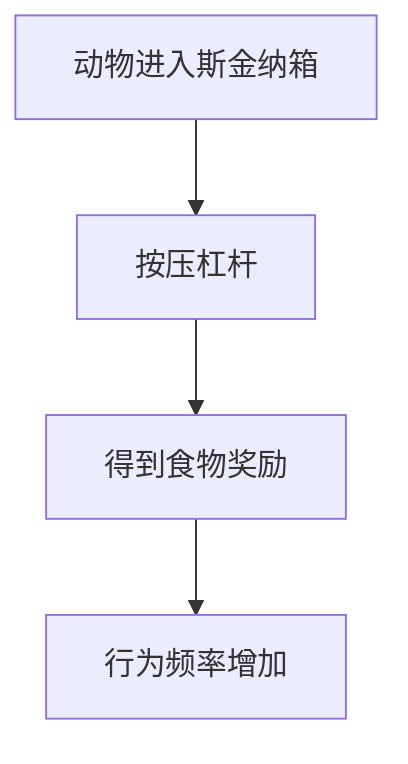

                 

## 第1章 引言

### 1.1 教育神经科学的定义与重要性

教育神经科学是一门跨学科领域，它结合了教育学、神经科学、心理学和计算机科学等多个学科的研究成果，旨在探索大脑如何学习、记忆、理解和处理信息，以及这些过程如何影响教育效果。具体来说，教育神经科学关注的是大脑在学习过程中的变化，包括神经元的活动、神经网络的重组和认知功能的提升等。

在教育领域，教育神经科学的重要性不可忽视。首先，它为教育理论提供了新的视角，使得教育者能够更深入地理解学生的学习过程，从而设计出更加有效的教学策略。其次，教育神经科学为个性化教学提供了科学依据，通过了解不同个体的大脑特点，可以实现因材施教，提高教学效率。此外，教育神经科学还可以为教育技术的创新提供支持，例如通过神经科学原理开发的智能教学系统和个性化学习工具。

教育神经科学的研究成果不仅在教育领域有重要应用，也对人类认知科学和社会发展产生了深远影响。通过理解大脑的工作机制，我们可以更好地应对教育中的挑战，提高全民的教育水平和素质，从而推动社会进步。

### 1.2 教育神经科学的历史与发展

教育神经科学作为一个新兴领域，其发展历程可以追溯到20世纪中叶。起初，神经科学的研究主要集中在生物学层面，探讨神经元的基本功能和行为。随着科学技术的发展，特别是脑成像技术和计算神经科学的进步，神经科学开始向心理学和教育学领域渗透。

20世纪60年代，神经科学家开始关注学习与记忆的神经机制，这一时期的代表性工作包括海马体在记忆中的作用研究。70年代，斯佩里的裂脑研究揭示了大脑左右半球在认知功能上的差异，为教育神经科学提供了新的启示。80年代，神经可塑性的概念被提出，表明大脑具有适应环境和学习新任务的能力。

进入21世纪，随着功能性磁共振成像（fMRI）和电生理技术的广泛应用，教育神经科学的研究进入了一个新的阶段。研究者可以实时观测大脑在学习过程中的活动变化，探索不同教学策略对大脑功能的影响。此外，计算机科学的发展也为教育神经科学提供了强大的工具，例如通过机器学习和数据挖掘技术分析大量的神经科学数据，以揭示学习规律和优化教学方案。

目前，教育神经科学已经成为国际研究的前沿领域，各国学者在这一领域进行了大量的实验和研究，不断推动该领域的进展。

### 1.3 本书的研究目标与结构

本书的研究目标是系统性地探讨教育神经科学的核心概念、研究方法及其在教育实践中的应用。具体来说，本书旨在：

1. 深入介绍教育神经科学的基本概念和理论，包括神经系统结构、学习与记忆的神经机制、情绪与动机的神经基础等。
2. 分析教育神经科学与传统学习理论的联系与区别，探讨如何将神经科学研究成果应用于教学实践中。
3. 介绍教育神经科学在教学方法、学习评估、教育技术以及教育政策等方面的应用案例。
4. 探讨教育神经科学研究的伦理和法律问题，以及其对教育理念、实践和社会发展的长远影响。

本书的结构安排如下：

- **第1章 引言**：介绍教育神经科学的定义、历史与发展，以及本书的研究目标与结构。
- **第2章 教育神经科学的核心概念**：详细阐述神经系统结构、学习与记忆的神经机制、情绪与动机的神经基础等。
- **第3章 教育神经科学与学习理论**：分析教育神经科学与行为主义、认知主义、人本主义等学习理论的联系。
- **第4章 教育神经科学与教学方法**：探讨教育神经科学在教学方法中的应用，如适应性教学策略、情境教学、互动式教学等。
- **第5章 教育神经科学与学习评估**：介绍学习评估的神经科学基础和基于神经科学的创新评估方法。
- **第6章 教育神经科学与教育技术**：探讨教育技术在教育神经科学中的应用，如可视化学习工具、虚拟现实技术、人工智能辅助教学等。
- **第7章 教育神经科学与教育政策**：分析教育神经科学对教育政策的影响以及教育神经科学在政策制定中的应用。
- **第8章 教育神经科学的未来展望**：展望教育神经科学的未来发展趋势，包括研究进展、教育理念变革、教育实践优化等。
- **附录**：提供教育神经科学相关的资源和学习工具推荐。

通过本书的研究，我们希望为教育工作者、研究人员和政策制定者提供有价值的参考，推动教育神经科学在实践中的应用和发展。

---

### 第2章 教育神经科学的核心概念

教育神经科学的核心概念包括神经系统的基本结构、学习与记忆的神经机制、情绪与动机的神经基础等。这些概念为我们理解大脑如何学习和教育如何影响大脑提供了科学基础。

#### 2.1 神经系统基本结构

神经系统是人体中最复杂、最精密的系统之一，它负责接收和传递信息，控制人体的各种生理和心理活动。神经系统主要由神经元、神经回路和神经胶质细胞组成。

**2.1.1 神经元**

神经元是神经系统的基本单元，具有接收、处理和传递信息的功能。神经元的基本结构包括细胞体、树突、轴突和突触。细胞体是神经元的核心部分，包含细胞核和大部分细胞器。树突负责接收其他神经元的信息，并通过电信号传递到细胞体。轴突是神经元的输出部分，负责将电信号传递到其他神经元或效应器。突触是神经元之间的连接点，通过化学递质传递信号。

**2.1.2 神经回路**

神经回路是由多个神经元组成的复杂网络，它们通过突触相互连接，共同实现特定的功能。神经回路可以调节信息处理的速度和精度，是大脑执行复杂任务的基础。

**2.1.3 神经胶质细胞**

神经胶质细胞是神经系统中不可或缺的组成部分，它们支持和维护神经元的正常功能。神经胶质细胞具有多种功能，包括提供营养、清除代谢产物、参与免疫反应等。

#### 2.2 学习与记忆的神经机制

学习与记忆是大脑最基本的功能之一，它们依赖于神经系统的复杂机制。神经科学家通过研究揭示了学习与记忆的多个方面，包括神经元的活动模式、神经网络的重组以及神经递质的调节等。

**2.2.1 短期记忆与长期记忆**

短期记忆和长期记忆是记忆的两个不同阶段。短期记忆主要涉及神经元之间的短期电信号传递，通常只能维持几秒钟到几分钟。长期记忆则涉及神经元之间长期的突触重组和蛋白质合成，可以持续数分钟到数十年。

**2.2.2 神经可塑性在学习中的作用**

神经可塑性是指大脑结构和功能在学习和经验中的改变能力。学习过程中，神经元的活动模式会发生改变，包括突触强度的变化和神经网络的结构重组。这些改变使得大脑能够适应新的环境和任务。

**2.2.3 神经网络的适应性变化**

神经网络在学习和记忆过程中表现出高度的适应性。通过不断的学习和练习，神经网络的结构和功能会发生变化，使得大脑能够更好地处理和存储信息。

#### 2.3 情绪与动机的神经基础

情绪和动机是影响学习和记忆的重要因素，它们与神经系统的多个部分有关。

**2.3.1 情绪对学习的影响**

情绪可以显著影响学习效果。积极的情绪可以增强学习记忆，而消极的情绪则会削弱学习效果。例如，焦虑和压力会导致短期记忆的困难，而愉悦和兴奋可以提高长期记忆的形成。

**2.3.2 动机与学习效率的关系**

动机是驱动个体投入学习的重要因素。高动机的学习者通常表现出更好的学习效果和更高的学习效率。动机与大脑中的奖励系统有关，包括前额叶皮层和伏隔核等区域。

### 2.4 神经可塑性

神经可塑性是指大脑在经历经验或学习后发生结构和功能的改变。这种改变可以发生在神经元、突触和神经网络等多个层次。神经可塑性是学习和记忆的基础，同时也是大脑适应环境变化的重要机制。

**2.4.1 结构性可塑性**

结构性可塑性涉及神经元和突触的结构改变。例如，树突棘的增长和减少、突触密度的变化以及神经回路的重组等。

**2.4.2 功能性可塑性**

功能性可塑性涉及神经元和神经网络的活动改变。例如，神经元兴奋性的改变、神经递质活动的调节以及神经网络中信息传递速度的变化等。

### 2.5 神经系统的适应性

神经系统的适应性是指大脑在面临不同环境挑战时能够调整其结构和功能的能力。这种适应性使得大脑能够更好地适应复杂多变的环境，从而提高学习效率和认知能力。

**2.5.1 适应性改变的学习策略**

适应性改变的学习策略包括多次重复练习、多样化学习内容和情境，以及目标导向的学习方法。这些策略可以增强神经可塑性，促进大脑的适应性改变。

**2.5.2 适应性改变的教育实践**

在教育实践中，教师可以通过设计多样化的教学活动、提供即时反馈以及鼓励学生主动参与来促进学生的神经适应性。此外，利用神经科学原理开发的教育技术和工具也可以提高教学效果，促进学生的神经可塑性。

通过理解教育神经科学的核心概念，我们可以更好地设计教学策略，提高学生的学习效果。下一章将分析教育神经科学与传统学习理论的联系与区别，深入探讨如何将神经科学研究成果应用于教育实践中。

---

### 2.1.1 神经元

神经元是神经系统的基本单元，负责接收和传递信息。了解神经元的基本结构和功能是理解神经科学的基础。神经元的主要部分包括细胞体、树突、轴突和突触。

**细胞体（Soma）**：细胞体是神经元的核心部分，包含细胞核和大部分细胞器。细胞核负责维持细胞的生命活动，细胞器如线粒体提供能量支持。

**树突（Dendrites）**：树突是神经元从细胞体伸出的分支，负责接收来自其他神经元的信息。树突上有许多树突棘（dendritic spines），这些棘突可以与突触前膜形成突触连接。

**轴突（Axon）**：轴突是神经元的输出部分，负责将电信号从细胞体传递到其他神经元或肌肉细胞。轴突通常比细胞体和树突长，并且通常有一个轴突套（myelin sheath），这可以加快信号的传递速度。

**突触（Synapse）**：突触是神经元之间的连接点，负责传递电信号或化学信号。突触分为电突触和化学突触。在电突触中，电信号可以直接从一个神经元的轴突传递到下一个神经元的树突或细胞体。在化学突触中，电信号触发神经递质的释放，这些神经递质通过扩散作用到达突触后膜，从而改变后一个神经元的电活动。

神经元的通信机制主要包括两种方式：

**电信号传递**：神经元通过电信号进行信息传递。当神经元受到足够强度的刺激时，细胞膜上的离子通道会开放，导致离子（如钠离子和钾离子）的流动，从而在神经元内部产生电信号，这种电信号称为动作电位。动作电位沿着轴突传播，最终到达突触。

**化学信号传递**：在化学突触中，电信号触发神经递质的释放。神经递质是一种化学物质，它可以跨越突触间隙，与突触后膜上的受体结合，导致突触后神经元的电活动变化。神经递质包括多巴胺、乙酰胆碱、谷氨酸等，每种神经递质都有其特定的生理功能。

神经元的活动是复杂的，不仅涉及单个神经元的电信号传递，还包括多个神经元之间的相互作用。这些相互作用形成了复杂的神经网络，是大脑处理信息、学习和记忆的基础。

### 2.1.2 神经回路

神经回路是由多个神经元组成的复杂网络，通过突触连接实现信息传递和整合。神经回路是大脑执行各种认知功能的基础，包括感知、运动控制、记忆和思考等。

**神经回路的结构**：神经回路通常包括输入神经元、中间神经元和输出神经元。输入神经元接收外部信息，中间神经元对信息进行加工和整合，输出神经元将处理后的信息传递给效应器或下一个神经元。

**神经回路的类型**：神经回路可以分为两大类：反馈回路和前馈回路。

- **反馈回路（Feedback Loop）**：反馈回路是一种闭环系统，其中一部分输出信息返回到输入端，从而影响系统的输出。反馈回路可以稳定系统或产生振荡。例如，脑中的平衡控制系统就依赖于反馈回路来维持身体的稳定。

- **前馈回路（Feedforward Loop）**：前馈回路是一种开环系统，其中信息从输入端直接传递到输出端，没有直接的反馈。前馈回路通常用于处理新的信息或执行新的任务。

**神经回路的调控**：神经回路的活动受到多种调控机制的调节，包括神经递质、神经调节因子和神经元之间的相互作用。这些调控机制可以影响神经回路的响应速度、精度和适应性。

**神经回路的功能**：神经回路在多种认知功能中发挥重要作用。

- **感知**：神经回路参与感知过程，如视觉、听觉和触觉。例如，视觉神经回路将视网膜上的光信号传递到大脑皮层，形成视觉图像。

- **运动控制**：神经回路控制肌肉运动，实现精确的运动协调。例如，运动皮层中的神经元通过复杂的神经回路控制手臂和腿部的运动。

- **记忆**：神经回路参与记忆形成和存储。例如，海马体中的神经回路参与短期记忆转化为长期记忆的过程。

- **思考**：神经回路支持复杂的认知功能，如问题解决、决策和语言理解。大脑中前额叶皮层的神经元通过复杂的神经回路实现这些高级认知功能。

通过理解神经回路的结构和功能，我们可以更好地设计教学策略，优化学习过程，提高学生的认知能力和学习效果。

### 2.1.3 神经可塑性

神经可塑性是指神经系统在经历经验或学习后发生结构和功能的改变能力。这种改变可以发生在神经元、突触和神经网络等多个层次，是学习和记忆的基础。

**神经可塑性的类型**：

1. **结构可塑性**：涉及神经元和突触的结构改变。例如，树突棘的增长和减少、突触密度的变化以及神经回路的重组等。

2. **功能可塑性**：涉及神经元和神经网络的活动改变。例如，神经元兴奋性的改变、神经递质活动的调节以及神经网络中信息传递速度的变化等。

**神经可塑性的机制**：

1. **突触强化**：突触强化是指突触连接在反复激活后变得更强大。这种强化可以通过增加突触前神经元的放电频率、增加突触后神经元的树突棘密度以及增加突触前后的突触密度来实现。

2. **突触削弱**：突触削弱是指突触连接在反复抑制后变得更弱。这种削弱可以通过减少突触前神经元的放电频率、减少突触后神经元的树突棘密度以及减少突触前后的突触密度来实现。

3. **神经元再生**：神经元再生是指受损或退化的神经元能够重新生长。这种再生可以通过神经干细胞的分化和迁移实现。

4. **神经网络重组**：神经网络重组是指神经网络在经历学习或损伤后重新组织。这种重组可以通过神经可塑性机制如突触强化和削弱实现。

**神经可塑性在学习中的作用**：

1. **记忆形成**：神经可塑性是记忆形成的基础。在学习过程中，突触连接的强化和重组使得大脑能够存储和回忆信息。

2. **技能学习**：神经可塑性使得大脑能够适应新的技能和任务。例如，通过反复练习，大脑中的神经网络会重组，使得运动技能更加熟练。

3. **适应性改变**：神经可塑性使得大脑能够适应环境变化。例如，当身体受伤时，大脑可以通过神经可塑性机制重新组织神经网络，从而恢复受损的功能。

**神经可塑性的教育应用**：

1. **个性化教学**：通过了解不同个体的大脑特点，教育者可以设计个性化的教学策略，提高教学效果。

2. **适应性学习工具**：利用神经可塑性原理开发的适应性学习工具可以根据学生的学习情况调整教学内容和难度，从而提高学习效率。

3. **情绪调节**：通过神经可塑性机制，情绪调节工具可以帮助学生更好地管理情绪，提高学习效果。

4. **康复训练**：神经可塑性在康复训练中具有重要意义，例如在脑损伤或中风后，通过特定的训练可以促进神经可塑性，从而恢复受损的功能。

通过理解神经可塑性，我们可以更好地利用这一机制优化教学策略，提高学生的学习效果和适应能力。

### 2.2.1 短期记忆与长期记忆

短期记忆和长期记忆是大脑记忆系统的两个基本阶段，它们在神经机制上有所不同，但紧密相连。

**短期记忆（Short-term Memory）**：

短期记忆是一种短暂的记忆存储，通常只能维持几秒钟到几分钟。短期记忆的主要功能是临时存储和处理信息，为长期记忆的建立提供支持。短期记忆主要依赖于大脑中的前额叶皮层和海马体。具体来说：

- **前额叶皮层**：负责短期记忆的保持和操作。当信息进入短期记忆时，前额叶皮层会激活，进行信息的编码、存储和检索。
- **海马体**：在海马体中，短期记忆信息会经历一个加工过程，将其转化为可供长期记忆使用的形式。

短期记忆的容量有限，通常只能存储几个到几十个信息单元。例如，在电话号码的记忆中，我们只能记住几个数字，但无法一次性记住一串很长的数字。

**长期记忆（Long-term Memory）**：

长期记忆是一种持久性记忆存储，可以持续数分钟到数十年。长期记忆分为两种主要类型：陈述性记忆和程序性记忆。

- **陈述性记忆（Declarative Memory）**：涉及对事实和事件信息的记忆，如人名、日期和历史事件。陈述性记忆的编码、存储和检索主要涉及大脑中的海马体和前额叶皮层。
- **程序性记忆（Procedural Memory）**：涉及对技能和动作的记忆，如骑自行车、弹钢琴和打字。程序性记忆主要与大脑中的基底神经节和运动皮层有关。

长期记忆的形成通常需要经过几个阶段：

1. **编码（Encoding）**：将短期记忆中的信息转化为长期记忆。在这一过程中，大脑中的神经元活动模式被长期记录下来。
2. **存储（Storage）**：长期记忆的信息在神经元和突触水平上被保存下来。存储过程中，神经网络的结构和功能会发生改变，形成新的突触连接。
3. **检索（Retrieval）**：在需要时，长期记忆的信息可以从大脑中检索出来。检索过程通常涉及大脑中不同区域的协同工作，包括前额叶皮层、海马体和运动皮层。

**短期记忆与长期记忆的关系**：

短期记忆和长期记忆是相互依赖的。短期记忆为信息的初步处理提供场所，而长期记忆则为信息的持久存储提供空间。短期记忆中的信息可以通过反复练习和强化，逐步转移到长期记忆中。例如，当我们学习新知识时，首先将其存储在短期记忆中，然后通过重复复习和练习，将其转化为长期记忆。

### 2.2.2 神经可塑性在学习中的作用

神经可塑性是学习和记忆的关键机制，它使得大脑能够适应新的环境和任务，通过改变神经元和神经网络的结构和功能来实现学习。

**突触强化**：

突触强化是指突触连接在反复激活后变得更强大。在学习和记忆过程中，当神经元之间的联系被频繁激活时，突触前后的信号传递会增强。这种强化可以通过几种方式实现：

1. **突触前增强**：神经元在激活时，会增加神经递质的释放量，从而增强突触的传递效率。
2. **突触后增强**：突触后神经元的树突棘会生长，增加与突触前神经元的连接点，从而增强突触的传递效率。

**突触削弱**：

突触削弱是指突触连接在反复抑制后变得更弱。在学习和记忆过程中，当神经元之间的联系被抑制或减少激活时，突触的传递效率会下降。这种削弱可以通过减少神经递质的释放量或减少突触后神经元的树突棘来实现。

**神经网络重组**：

神经网络重组是指神经网络在经历学习或损伤后重新组织。在学习过程中，神经网络会根据新的经验和任务需求进行调整，从而提高处理信息的能力。这种重组可以通过以下几种方式实现：

1. **突触重塑**：神经网络中的突触连接会根据使用频率和重要性进行重塑，增加使用频繁的连接，减少不常用的连接。
2. **神经网络重构**：神经网络的结构会根据学习任务的需求进行重构，形成新的神经网络连接模式。

**神经可塑性在学习中的作用**：

1. **技能学习和记忆形成**：通过神经可塑性机制，大脑可以形成新的突触连接和神经网络结构，从而实现新的技能学习和记忆形成。
2. **适应性和灵活性**：神经可塑性使得大脑能够适应新环境和任务，提高学习效率和灵活性。
3. **损伤修复**：在脑损伤或中风后，神经可塑性可以帮助大脑重建受损的功能，促进康复。

**神经可塑性的教育应用**：

1. **个性化教学**：通过了解学生的神经可塑性特点，教育者可以设计个性化的教学策略，提高教学效果。
2. **适应性学习工具**：利用神经可塑性原理开发的适应性学习工具可以根据学生的学习情况调整教学内容和难度，从而提高学习效率。
3. **情绪调节**：通过神经可塑性机制，情绪调节工具可以帮助学生更好地管理情绪，提高学习效果。
4. **康复训练**：神经可塑性在康复训练中具有重要意义，例如在脑损伤或中风后，通过特定的训练可以促进神经可塑性，从而恢复受损的功能。

通过理解神经可塑性，我们可以更好地利用这一机制优化教学策略，提高学生的学习效果和适应能力。

### 2.2.3 神经网络的适应性变化

神经网络的适应性变化是指在大脑学习和记忆过程中，神经网络结构和功能发生的动态调整。这种适应性变化是大脑处理信息、学习和记忆的基础，也是大脑应对环境变化的重要机制。

**神经网络的适应性变化机制**：

1. **突触可塑性**：突触可塑性是神经网络适应性变化的核心机制。突触可塑性包括突触强化和突触削弱。突触强化是指突触连接在反复激活后变得更强大，突触削弱则相反。通过这种机制，神经网络可以增强或减少特定神经元之间的连接强度，从而适应新的学习任务和环境。
2. **神经元活动模式的重组**：在学习过程中，神经网络中的神经元活动模式会发生重组。某些神经元可能变得更加活跃，而其他神经元可能变得不那么活跃。这种重组可以改变神经网络的信息处理方式，使其更适应新任务。
3. **神经网络重构**：在某些情况下，神经网络的结构会进行重构，形成新的连接模式。这种重构可以通过突触重塑和神经元再生实现。例如，在长期学习和记忆过程中，神经网络可能会形成新的突触连接，从而优化信息处理。

**神经网络适应性变化在学习中的作用**：

1. **技能学习和记忆形成**：神经网络适应性变化使得大脑能够通过改变突触连接和神经元活动模式，形成新的技能和记忆。例如，通过反复练习，学习者的神经网络会不断重组，使其能够更熟练地完成特定的任务。
2. **适应性和灵活性**：神经网络适应性变化使得大脑能够适应新的学习任务和环境。这种适应性不仅体现在新的技能学习上，也体现在对复杂认知任务的应对上。例如，当学习者的认知需求发生变化时，神经网络可以重新组织，以适应新的需求。
3. **损伤修复**：在脑损伤或中风后，神经网络适应性变化可以帮助大脑修复受损的功能。例如，通过特定的训练和刺激，受损的神经网络可以重新组织，从而恢复受损的功能。

**神经网络适应性变化的教育应用**：

1. **个性化教学**：通过了解学生的神经网络适应性特点，教育者可以设计个性化的教学策略，提高教学效果。例如，通过分析学生的学习过程，教育者可以确定哪些教学方法最适合学生，从而优化教学过程。
2. **适应性学习工具**：利用神经网络适应性变化原理开发的适应性学习工具可以根据学生的学习情况动态调整教学内容和难度，从而提高学习效率。例如，智能学习系统可以根据学生的学习进度和表现，自动调整学习内容和节奏。
3. **情绪调节**：神经网络适应性变化还可以用于情绪调节。通过特定的训练和刺激，学习者可以改变神经网络的反应模式，从而更好地管理情绪，提高学习效果。

通过理解神经网络适应性变化，我们可以更好地利用这一机制优化教学策略，提高学生的学习效果和适应能力。下一节将探讨情绪与动机的神经基础，进一步丰富对学习过程的理解。

### 2.3.1 情绪对学习的影响

情绪对学习有着深远的影响，积极的情绪可以提高学习效率，而消极的情绪则会阻碍学习进程。理解情绪如何影响学习，有助于教育者设计更有效的教学策略。

**情绪对学习的影响机制**：

1. **神经递质调节**：情绪与大脑中的神经递质密切相关。例如，多巴胺是一种与愉悦感和动机相关的神经递质，其水平的变化直接影响学习动机和记忆形成。当多巴胺水平升高时，学习者通常表现出更高的学习动机和记忆效率。

2. **大脑区域活动**：情绪调节涉及大脑多个区域的活动，包括前额叶皮层、杏仁核和海马体等。前额叶皮层负责认知控制和决策，杏仁核则与情绪体验相关，海马体则在记忆形成中起关键作用。这些区域之间的相互作用决定了情绪对学习的影响。

**积极情绪对学习的影响**：

1. **提高学习动机**：积极情绪如喜悦、兴奋和自信可以提高学习动机，使学习者更愿意投入学习活动。例如，当学生感受到教师的鼓励和赞赏时，他们的学习积极性会显著提高。

2. **增强记忆形成**：积极情绪有助于记忆形成和保持。研究表明，愉悦的情绪状态可以提高长期记忆的编码和回忆效率。例如，在学习新知识时，如果学生感到愉快，他们更容易记住学习内容。

**消极情绪对学习的影响**：

1. **降低学习动机**：消极情绪如焦虑、沮丧和压力会降低学习动机，使学习者难以投入学习活动。例如，当学生面临考试压力时，他们可能会感到紧张和焦虑，导致学习效果下降。

2. **干扰记忆形成**：消极情绪可以干扰记忆形成和保持。焦虑和压力水平升高时，大脑中的杏仁核活动增强，抑制了前额叶皮层的认知功能，从而影响记忆编码和回忆。例如，在考试焦虑的情况下，学生可能会忘记他们曾经学习过的知识。

**情绪调节策略**：

1. **情绪管理教育**：教育者可以教授学生情绪管理技巧，如深呼吸、冥想和积极思考等，帮助他们更好地应对压力和焦虑，提高学习效果。

2. **积极教学环境**：创造一个积极、支持的教学环境可以减少学生的压力和焦虑，提高他们的学习动机。例如，教师可以通过鼓励、表扬和建立信任关系来增强学生的积极情绪。

3. **个性化学习支持**：针对不同学生的情绪特点，教育者可以提供个性化的学习支持，帮助他们更好地适应学习环境。例如，对焦虑水平较高的学生，教师可以提供额外的辅导和放松训练，以帮助他们缓解焦虑。

通过理解情绪对学习的影响，教育者可以设计出更加有效和个性化的教学策略，提高学生的学习效果和心理健康。

### 2.3.2 动机与学习效率的关系

动机是驱动个体投入学习的重要因素，它与学习效率密切相关。理解动机的神经基础有助于教育者设计有效的教学策略，提高学生的学习动力和效果。

**动机的定义与分类**：

动机是指推动个体采取特定行为以达成目标的心理力量。根据其来源，动机可以分为内在动机和外在动机。

- **内在动机**：内在动机来源于个体内部，是个体对活动本身的兴趣和乐趣。例如，对某门学科的好奇心和求知欲可以激发学生的内在动机。
- **外在动机**：外在动机来源于外部环境，如奖励、惩罚和他人期望。例如，为了获得好成绩或避免惩罚，学生可能会表现出外在动机。

**动机的神经基础**：

动机的神经基础主要涉及大脑中的奖励系统和前额叶皮层。

- **奖励系统**：奖励系统包括前额叶皮层、腹侧被盖区和伏隔核等区域。这些区域在感知奖励和奖励预测中起关键作用。例如，当个体完成一项任务或达成目标时，大脑会释放多巴胺等神经递质，产生愉悦感，从而增强动机。
- **前额叶皮层**：前额叶皮层负责认知控制和决策，是动机的重要调节区域。它通过调节个体的注意力和努力程度，影响学习效率。例如，当个体面临困难任务时，前额叶皮层会激活，促使个体付出更多努力以克服挑战。

**动机与学习效率的关系**：

动机对学习效率具有显著影响。

1. **内在动机**：内在动机能够提高学习效率。具有高内在动机的学生通常表现出更强的学习动力、更高的学习专注度和更好的学习成果。例如，对某学科充满兴趣的学生会主动花时间学习和探索，从而获得更好的学习效果。

2. **外在动机**：外在动机对学习效率的影响较为复杂。适度的外在动机可以激励学生投入学习，但在某些情况下，过度依赖外在奖励可能会导致学习动机的减弱。例如，如果学生为了获得奖励而学习，一旦奖励消失，他们的学习动力可能会下降。

3. **动机调节**：动机调节对于学习效率也非常重要。教育者可以通过调整教学策略和环境，帮助学生更好地调节动机。例如，通过设置具有挑战性的任务、提供即时反馈和鼓励学生自我评估，可以增强学生的内在动机。

**动机的教育应用**：

1. **个性化教学**：通过了解学生的动机类型和特点，教育者可以设计个性化的教学策略，提高学生的学习动力和效果。例如，对于内在动机较强的学生，教师可以提供更多自主学习和探索的机会；对于外在动机较强的学生，教师可以设置明确的奖励机制。

2. **学习环境设计**：创造一个支持性和激励性的学习环境可以增强学生的动机。例如，通过提供积极的反馈、建立信任关系和营造合作氛围，可以激发学生的内在动机。

3. **动机调节训练**：通过动机调节训练，教育者可以帮助学生更好地管理自己的动机，提高学习效率。例如，教师可以教授学生如何设定合理的目标、如何自我激励和如何应对挑战。

通过理解动机的神经基础和与学习效率的关系，教育者可以更好地设计教学策略，激发学生的学习动力，从而提高教学效果。

### 2.4 神经可塑性

神经可塑性是指神经系统在经历经验或学习后发生结构和功能的改变能力。这种改变可以发生在神经元、突触和神经网络等多个层次，是学习和记忆的基础。理解神经可塑性对于教育神经科学具有重要意义，因为它揭示了大脑如何通过改变自身结构和功能来适应新的环境和任务。

#### 神经可塑性的机制

神经可塑性主要通过以下几种机制实现：

1. **突触可塑性**：突触是神经元之间传递信息的连接点。突触可塑性是指突触连接的强度和性质可以随着神经元活动的变化而改变。具体机制包括：

   - **突触强化**：当神经元之间的连接被频繁激活时，突触的传递效率会提高，这被称为突触强化。突触强化可以通过增加突触前神经元的放电频率、增加突触后神经元的树突棘密度以及增加突触前后的突触密度来实现。
   - **突触削弱**：相反，当神经元之间的连接被抑制或减少激活时，突触的传递效率会下降，这被称为突触削弱。突触削弱可以通过减少突触前神经元的放电频率、减少突触后神经元的树突棘密度以及减少突触前后的突触密度来实现。

2. **结构可塑性**：结构可塑性是指神经元和突触的结构可以随着学习和经验的变化而改变。具体机制包括：

   - **树突棘生长和减少**：树突棘是树突上的微小突起，负责接收来自其他神经元的信号。通过突触强化的反复激活，树突棘可以生长，从而增加神经元之间的连接。相反，通过突触弱化的抑制，树突棘可以减少。
   - **神经网络重构**：在长期学习和记忆过程中，神经网络可以重构，形成新的连接模式。这种重构可以通过突触强化和削弱以及神经元的再生实现。

3. **神经元再生**：在某些情况下，神经元可以再生或重新生长。这种再生可以通过神经干细胞的分化和迁移实现。例如，在海马体中，新的神经元可以通过神经再生增加神经网络的结构复杂性和功能。

#### 神经可塑性在学习中的作用

1. **技能学习和记忆形成**：神经可塑性是技能学习和记忆形成的基础。通过神经可塑性机制，大脑可以形成新的突触连接和神经网络结构，从而实现新的技能学习和记忆形成。例如，通过反复练习，学习者的神经网络会不断重组，使其能够更熟练地完成特定的任务。

2. **适应性和灵活性**：神经可塑性使得大脑能够适应新环境和任务，提高学习效率和灵活性。例如，当学习者面对新的学习任务时，大脑可以通过神经可塑性机制重新组织神经网络，从而更好地适应新任务。

3. **损伤修复**：在脑损伤或中风后，神经可塑性可以帮助大脑重建受损的功能，促进康复。例如，通过特定的训练和刺激，受损的神经网络可以重新组织，从而恢复受损的功能。

#### 神经可塑性的教育应用

1. **个性化教学**：通过了解学生的神经可塑性特点，教育者可以设计个性化的教学策略，提高教学效果。例如，对于具有高神经可塑性的学生，教育者可以设计更具挑战性和多样化的教学活动，以促进其学习进步。

2. **适应性学习工具**：利用神经可塑性原理开发的适应性学习工具可以根据学生的学习情况动态调整教学内容和难度，从而提高学习效率。例如，智能学习系统能够根据学生的学习进度和表现，自动调整学习内容和节奏。

3. **情绪调节**：通过神经可塑性机制，情绪调节工具可以帮助学生更好地管理情绪，提高学习效果。例如，通过特定的训练和刺激，学习者可以改变神经网络的反应模式，从而更好地应对压力和挑战。

4. **康复训练**：神经可塑性在康复训练中具有重要意义，例如在脑损伤或中风后，通过特定的训练可以促进神经可塑性，从而恢复受损的功能。例如，通过重复的神经可塑性训练，大脑可以重建受损的区域，从而恢复部分功能。

通过理解神经可塑性，教育者可以更好地利用这一机制优化教学策略，提高学生的学习效果和适应能力。

### 2.5 神经系统的适应性

神经系统的适应性是指大脑在面对不同环境和任务时，能够通过改变其结构和功能来适应新的情况。这种适应性是大脑学习和记忆能力的重要基础，对于个体的发展和学习效果有着深远的影响。

#### 神经系统适应性的机制

神经系统的适应性主要通过以下几种机制实现：

1. **神经可塑性**：神经可塑性是指神经系统和神经网络在面对新的经验和学习时，能够通过改变突触连接强度和神经网络结构来适应新情况。这种改变包括突触强化、突触削弱和神经网络重构等。

2. **神经元活动模式的重组**：神经元活动模式的重组是指在大脑面对新的学习任务或环境时，特定神经元群的活动模式会发生改变，以适应新的需求。这种重组可以通过改变神经元的兴奋性和神经递质活动实现。

3. **神经网络重构**：神经网络重构是指神经网络在面对长期学习和记忆时，可以形成新的连接模式，从而优化信息处理。这种重构可以通过神经再生和新突触连接的形成实现。

#### 神经系统适应性的教育应用

1. **个性化教学策略**：通过了解学生的神经系统适应性特点，教育者可以设计个性化的教学策略，提高教学效果。例如，对于具有高神经可塑性的学生，教育者可以设计更具挑战性和多样化的教学活动，以促进其学习进步。

2. **适应性学习工具**：利用神经系统适应性原理开发的适应性学习工具可以根据学生的学习情况动态调整教学内容和难度，从而提高学习效率。例如，智能学习系统能够根据学生的学习进度和表现，自动调整学习内容和节奏。

3. **情绪调节**：通过特定的训练和刺激，教育者可以帮助学生更好地管理情绪，提高学习效果。例如，通过神经反馈训练，学生可以学会如何调节自己的情绪状态，从而更专注于学习。

4. **康复训练**：在脑损伤或中风后，神经系统适应性训练可以帮助大脑重建受损的功能，促进康复。例如，通过重复的神经可塑性训练，大脑可以重建受损的区域，从而恢复部分功能。

通过理解神经系统的适应性，教育者可以更好地利用这一机制优化教学策略，提高学生的学习效果和适应能力。

---

### 2.5.1 适应性改变的学习策略

适应性改变的学习策略是指通过调整学习环境和方法，以提高学习效果和适应能力的策略。这些策略基于神经可塑性的原理，旨在优化大脑的学习和记忆过程。

**多样化学习内容**：

多样化学习内容是指通过引入不同类型和来源的信息，以促进大脑的适应性和学习效果。多样化学习内容可以包括文字、图像、视频和互动活动等。这种多样化的学习方式能够激活大脑的不同区域，提高信息的整合和记忆效率。

**多次重复练习**：

多次重复练习是一种基于重复原理的学习策略，它通过反复练习来增强神经元之间的突触连接，从而提高学习效果。研究表明，通过多次重复，大脑可以形成更强大和持久的记忆。此外，重复练习还可以促进神经网络的重组，使其更适应特定的学习任务。

**情境教学**：

情境教学是指通过将学习内容置于实际情境中，以提高学习效果和适应能力。情境教学能够激发学生的学习兴趣和动机，同时提供更多的学习和应用机会。通过情境教学，学生可以在实际应用中体验和内化学习内容，从而提高学习的深度和持久性。

**目标导向学习**：

目标导向学习是指通过设定具体的学习目标，以驱动学生的学习动机和行为。目标导向学习可以帮助学生明确学习的方向和目标，提高学习的效率和效果。此外，目标导向学习还可以促进神经可塑性的发展，通过设定挑战性的目标，激发大脑的适应性和创新能力。

**合作学习**：

合作学习是指通过学生之间的合作和互动，以促进学习效果和适应能力。合作学习可以激发学生的主动性和参与度，同时提供更多的学习资源和反馈。通过合作学习，学生可以在交流中分享知识和经验，共同解决学习中的问题，从而提高学习的深度和广度。

**适应性学习工具**：

利用神经可塑性原理开发的适应性学习工具可以根据学生的学习情况动态调整教学内容和难度，从而提高学习效果。例如，智能学习系统可以根据学生的学习进度和表现，自动调整学习内容和节奏，以适应不同的学习需求和挑战。

通过这些适应性改变的学习策略，教育者可以优化教学过程，提高学生的学习效果和适应能力。这些策略不仅适用于传统教育，也适用于在线教育和混合学习模式，从而实现更加个性化和高效的教学。

### 2.5.2 适应性改变的教育实践

在教育实践中，适应性改变的教育策略和教学方法已经成为提升学习效果的重要手段。以下是一些具体的教育实践案例，展示了如何通过适应性改变优化教学过程。

**个性化教学**：

个性化教学是一种基于学生个体差异的教学策略，它通过调整教学内容、方法和节奏，以满足每个学生的学习需求。例如，在数学教学中，教师可以为学生提供不同难度的练习题，并根据学生的表现动态调整教学难度。通过个性化教学，学生可以以自己的节奏学习，从而提高学习效率和成绩。

**差异化教学**：

差异化教学是指根据学生的不同水平和需求，提供差异化的教学资源和指导。例如，在阅读课程中，教师可以为不同水平的学生提供不同难度的阅读材料，并设置相应的阅读任务和目标。通过差异化教学，学生可以在适合自己的难度水平上学习，从而更好地理解和掌握知识点。

**情境教学**：

情境教学通过将学习内容置于实际情境中，以提高学生的参与度和理解力。例如，在历史课上，教师可以组织学生进行角色扮演，模拟历史事件，让学生亲身体验历史情境。这种情境教学不仅能够激发学生的兴趣和动机，还能帮助学生更好地理解历史事件和背景。

**合作学习**：

合作学习通过学生之间的互动和合作，提高学习效果。例如，在科学实验课上，教师可以组织学生分组进行实验，共同讨论和解决问题。通过合作学习，学生可以在交流中分享知识和经验，相互学习和促进，从而提高学习效果。

**适应性学习工具**：

利用神经可塑性原理开发的适应性学习工具可以帮助教育者动态调整教学策略和内容。例如，智能学习系统可以根据学生的学习进度和表现，自动调整学习内容和难度，提供个性化的学习建议。此外，一些教育软件还可以通过分析学生的学习数据，预测学生的学习需求和弱点，从而提供有针对性的辅导和支持。

通过这些适应性改变的教育实践，教育者可以更好地满足学生的个性化需求，提高教学效果和学习成果。这些实践不仅有助于提升学生的学习能力，也为教育者提供了新的教学思路和方法。

### 2.5.3 适应性改变对教育者的启示

教育者在设计和实施教学过程中，需要充分考虑适应性改变对教学策略的影响。以下是一些具体的建议，帮助教育者更好地利用适应性改变优化教学效果。

**了解学生个体差异**：

教育者应深入了解每个学生的认知能力、学习兴趣和个性特点。通过个性化评估，教育者可以识别学生的优势和不足，从而设计更具针对性的教学策略。

**动态调整教学策略**：

教育者应根据学生的学习进度和表现，动态调整教学策略。例如，通过观察学生的反应和反馈，教育者可以及时调整教学内容的难度和深度，确保学生始终在适当的挑战水平上学习。

**鼓励学生主动参与**：

教育者应鼓励学生主动参与学习过程，提供更多合作学习的机会。通过合作学习，学生可以在互动中分享知识和经验，提高学习的深度和广度。

**利用技术工具辅助教学**：

教育者可以利用基于神经可塑性的适应性学习工具，如智能学习系统和在线教育平台，来动态调整教学内容和难度。这些工具可以根据学生的学习数据提供个性化学习建议，帮助教育者更有效地指导学生。

**持续反思和改进**：

教育者应不断反思和改进自己的教学方法，根据学生的反馈和学习效果进行调整。通过持续的学习和反思，教育者可以不断提升教学水平，更好地满足学生的需求。

通过这些方法，教育者可以更好地利用适应性改变优化教学过程，提高学生的学习效果和满足度。

### 2.5.4 适应性改变对教育政策的影响

适应性改变不仅在教学方法层面具有重要意义，也对教育政策的制定和实施产生了深远的影响。以下是从几个关键角度分析适应性改变对教育政策的影响。

**教育政策制定的科学依据**：

教育神经科学的发展为教育政策的制定提供了新的科学依据。通过理解大脑的适应性和神经可塑性机制，教育政策制定者可以更准确地识别教育过程中需要改进的方面，从而制定更科学、更有效的教育政策。例如，政策制定者可以依据神经科学研究成果，调整教学方法和课程设计，以促进学生的学习和认知发展。

**个性化教育的推广**：

个性化教育是适应性改变在教育政策中的重要应用。随着神经科学对个体差异的深入研究，教育政策逐渐倾向于推广个性化教育，以满足不同学生的多样化需求。例如，一些地区已经推行了基于学生个体差异的个性化评估和教学方案，通过智能学习系统和在线平台提供个性化的学习资源和指导。

**资源分配的优化**：

适应性改变要求教育者在教学过程中灵活调整资源分配。教育政策应考虑如何优化教育资源的配置，以满足学生个性化的学习需求。例如，政策可以鼓励学校投资于技术工具和资源，如智能学习系统和虚拟实验室，以提供更加多样化和个性化的学习体验。

**教师培训和职业发展**：

适应性改变对教师的专业素养提出了新的要求。教育政策应加强教师培训，提高教师的神经科学知识和适应性教学技能。例如，可以通过开展专业发展课程和研讨会，帮助教师掌握适应性教学策略，从而更好地应对学生的个性化需求。

**政策评估和反馈机制**：

适应性改变要求教育政策具备灵活的评估和反馈机制。政策制定者应定期评估教育政策的效果，根据学生的反馈和学习成果进行调整。例如，通过数据分析和学生满意度调查，政策制定者可以识别政策中的不足，并采取相应措施进行改进。

**社会影响与责任**：

教育政策的适应性改变不仅影响教育本身，还对社会产生深远影响。政策制定者需要考虑教育政策对社会公平、教育质量和人才培养的长远影响，确保政策的实施能够促进社会的整体发展。

通过理解适应性改变对教育政策的影响，政策制定者可以制定更加科学和有效的教育政策，从而推动教育事业的持续发展和社会进步。

---

### 第3章 教育神经科学与学习理论

教育神经科学的发展为我们提供了深入理解学习过程的新视角，同时也对传统学习理论提出了挑战。本章将分析教育神经科学与行为主义、认知主义、人本主义等学习理论的联系与区别，探讨教育神经科学如何补充和拓展这些理论。

#### 3.1 行为主义学习理论

行为主义学习理论起源于20世纪初，由约翰·沃森（John B. Watson）和贝尔赫姆·斯金纳（B.F. Skinner）等人提出。行为主义认为，学习是通过外部刺激和反应之间的条件联结形成的。具体来说：

**强化学习与条件反射**：

行为主义强调强化在学习中的关键作用。强化是指通过奖励或惩罚来增加或减少行为发生的频率。例如，斯金纳箱实验中，通过奖励（如食物）来强化动物按压杠杆的行为。强化学习理论的核心是，当某一行为被奖励时，该行为在未来发生的可能性会增加。

**条件反射**：

条件反射是行为主义学习理论的重要组成部分。经典条件反射是由伊凡·巴甫洛夫（Ivan Pavlov）提出的，他发现通过反复将食物（无条件刺激）与铃声（中性刺激）结合，可以使铃声单独引发唾液分泌（条件反应）。这表明，学习是通过将两个原本无关的刺激联系起来实现的。

**教育应用**：

在传统教育中，行为主义学习理论被广泛应用于教学设计。例如，通过设定明确的目标和奖励机制，教师可以激励学生努力学习。此外，行为主义理论还指导了教育评估和教学反馈，强调即时奖励和强化学生的正确行为。

#### 3.2 认知主义学习理论

认知主义学习理论强调个体内部的认知过程在学习中的核心作用。与行为主义不同，认知主义关注学习者如何主动构建知识，以及认知结构和过程如何影响学习效果。认知主义学习理论的代表人物包括让·皮亚杰（Jean Piaget）和布鲁纳（Jerome Bruner）。

**知觉与记忆**：

认知主义认为，学习过程不仅仅是外部刺激的被动接受，而是个体主动知觉和解释信息的过程。例如，让·皮亚杰提出了认知发展的阶段理论，认为儿童的认知能力在不同年龄阶段有不同的特点。布鲁纳则强调发现学习，认为学生通过主动探索和发现，能够更好地理解和记忆知识。

**问题解决与决策**：

认知主义还关注学习者如何解决问题和做出决策。个体在解决新问题时，需要利用已有的知识和认知策略。例如，代数问题的解决需要使用数学知识和解题技巧。决策过程则涉及信息评估和选择最佳方案。

**教育应用**：

认知主义理论对教育实践产生了深远影响。例如，发现学习和探究学习法鼓励学生主动参与学习过程，通过发现和探索来构建知识。此外，认知策略训练，如记忆技巧和问题解决策略，被广泛应用于教学实践中，以提高学习效率和效果。

#### 3.3 人本主义学习理论

人本主义学习理论起源于20世纪中叶，由卡尔·罗杰斯（Carl Rogers）和亚伯拉罕·马斯洛（Abraham Maslow）等人提出。人本主义强调个体的自我实现和整体发展，认为学习是一个充满意义和价值的主动过程。

**自我实现与教育**：

人本主义认为，个体的学习动机源于自我实现的需要。自我实现是指个体通过学习和发展，实现其潜能和自我价值。在教育中，人本主义理论强调培养学生的自主性和创造力，鼓励学生探索自己的兴趣和潜能。

**学习者为中心的教育方法**：

人本主义学习理论提倡以学习者为中心的教育方法。教师作为引导者和支持者，帮助学生在有意义的学习情境中自主探索和发展。例如，项目式学习和社会实践等教学方法，都强调学生的主动参与和自主构建知识。

**教育应用**：

人本主义理论在教育中的应用广泛。例如，教师在教学中注重培养学生的批判性思维和创造性，通过提供开放性的问题和挑战，激发学生的内在动机和学习兴趣。此外，教师还通过建立积极、支持和信任的师生关系，营造一个有利于学生自我实现的学习环境。

#### 3.4 教育神经科学对传统学习理论的补充与拓展

教育神经科学的发展为传统学习理论提供了新的科学依据和视角，补充和拓展了这些理论的内涵。

**理解学习过程的神经基础**：

教育神经科学通过研究大脑的结构和功能，揭示了学习过程的神经基础。例如，研究发现，学习与记忆涉及大脑中的多个区域，如前额叶皮层、海马体和基底神经节。这些研究结果为传统学习理论提供了更具体的神经基础，有助于解释学习行为的生理机制。

**个性化学习的科学依据**：

教育神经科学强调个体差异在学习中的重要性。不同个体的神经网络结构和功能可能存在差异，这直接影响学习效果和效率。教育神经科学为个性化学习提供了科学依据，支持因材施教，设计出更加个性化的教学策略。

**情绪与动机的重要性**：

教育神经科学揭示了情绪和动机对学习过程的重要影响。研究表明，积极情绪和内在动机可以显著提高学习效果，而消极情绪和外在动机则可能对学习产生负面影响。这一发现为传统学习理论提供了新的视角，强调了情绪和动机在教育和教学中的重要性。

**适应性学习的理论基础**：

教育神经科学通过研究神经可塑性和大脑的适应性变化，提供了适应性学习的理论基础。例如，研究发现，大脑通过突触强化和神经网络重组来适应新的学习任务和环境。这些研究结果为传统学习理论中的适应性和灵活性概念提供了科学依据。

**拓展学习理论的应用范围**：

教育神经科学不仅补充了传统学习理论的神经基础，还拓展了这些理论的应用范围。例如，行为主义学习理论在神经科学的基础上，可以进一步探索如何通过神经可塑性机制来增强学习效果。认知主义学习理论可以借助神经科学的研究成果，更深入地理解认知过程的细节。人本主义学习理论则可以通过神经科学的研究，探索个体自我实现和潜能发挥的生理机制。

总之，教育神经科学的发展为传统学习理论提供了新的科学依据和视角，补充和拓展了这些理论的内涵。通过结合教育神经科学的研究成果，教育者可以设计出更加科学和有效的教学策略，促进学生的全面发展。

### 3.1 行为主义学习理论

行为主义学习理论是20世纪初由约翰·沃森（John B. Watson）和贝尔赫姆·斯金纳（B.F. Skinner）等人提出的，它强调外部刺激与反应之间的联结，并认为行为是通过条件反射和强化机制形成的。行为主义学习理论的核心概念包括强化学习、条件反射和操作性条件作用。

**强化学习与条件反射**

强化学习是指通过外部奖励或惩罚来增强或减少某种行为的发生频率。在行为主义理论中，强化分为正强化和负强化。

- **正强化（Positive Reinforcement）**：正强化是指通过给予积极的刺激来增加行为的频率。例如，在斯金纳箱实验中，当动物按压杠杆时，会得到食物奖励，这使得动物按压杠杆的行为频率增加。
  
  ```mermaid
  graph TD
  A[动物按压杠杆] --> B[得到食物奖励]
  B --> C[行为频率增加]
  ```

- **负强化（Negative Reinforcement）**：负强化是指通过移除不愉快的刺激来增加行为的频率。例如，如果学生在课堂上保持安静，老师就会停止讲课，这种负强化会促使学生保持安静。

  ```mermaid
  graph TD
  A[学生在课堂上保持安静] --> B[老师停止讲课]
  B --> C[行为频率增加]
  ```

条件反射是行为主义学习理论的另一个核心概念，它是指通过将两个原本无关的刺激结合起来，使得一个刺激能够引起另一个刺激的反应。经典条件反射和操作性条件反射是两种主要的条件反射类型。

- **经典条件反射（Classical Conditioning）**：经典条件反射是由伊凡·巴甫洛夫（Ivan Pavlov）提出的，他通过实验发现，通过反复将食物（无条件刺激）与铃声（中性刺激）结合，可以使铃声单独引发唾液分泌（条件反应）。

  ```mermaid
  graph TD
  A[食物] --> B[铃声]
  B --> C[唾液分泌]
  ```

- **操作性条件反射（Operant Conditioning）**：操作性条件反射由贝尔赫姆·斯金纳（B.F. Skinner）提出，它强调行为与其后果之间的关系。操作性条件反射分为正强化、负强化、正惩罚和负惩罚。

  ```mermaid
  graph TD
  A[行为] --> B[正强化/负强化]
  A --> C[正惩罚/负惩罚]
  ```

**斯金纳箱实验与教育应用**

斯金纳箱实验是行为主义学习理论的重要实验，它通过控制动物的行为来研究强化学习。在斯金纳箱中，动物可以通过按压杠杆获得食物奖励，从而增加按压杠杆的行为频率。



斯金纳箱实验在教育中的应用非常广泛。例如，教师可以通过设定明确的奖励机制来激励学生努力学习。例如，当学生完成作业或考试达到一定分数时，教师可以给予奖励，如小礼物、表扬或额外的休息时间。这些奖励可以增强学生的学习动机和行为。

**强化学习在课堂教学中的应用**

在课堂教学中，教师可以使用强化学习来提高学生的参与度和学习效果。以下是一些具体的应用方法：

- **即时奖励**：教师可以在学生回答问题或完成作业后立即给予奖励，以增强学生的学习动机。
- **积分制度**：教师可以设计积分制度，根据学生的表现给予积分，积分达到一定数量后可以兑换奖励。
- **表扬和认可**：教师可以通过表扬和认可来增强学生的自信心和动力，例如在班级会议或公开场合表扬学生的优秀表现。

通过合理运用强化学习，教师可以有效地提高学生的学习效果和积极性，促进他们的全面发展。

### 3.2 认知主义学习理论

认知主义学习理论强调学习者的内部认知过程，认为学习不仅仅是被动接收信息，而是一个主动构建知识的过程。认知主义学习理论的代表人物包括让·皮亚杰（Jean Piaget）、布鲁纳（Jerome Bruner）和奥苏贝尔（Ausubel）等人。以下将详细阐述认知主义学习理论的主要观点。

**知觉与记忆**

认知主义认为，学习者的知觉和记忆是认知过程中的关键部分。知觉是指学习者对信息的感知和解释，而记忆是指学习者对信息的存储和回忆。

- **知觉**：认知主义强调，学习者对信息的知觉是一个主动的过程，他们不是被动地接收信息，而是通过自己的认知结构来理解和解释信息。让·皮亚杰提出了认知发展的阶段理论，认为儿童在不同年龄阶段有不同的认知能力，例如感知运动阶段、前运算阶段、具体运算阶段和形式运算阶段。每个阶段都有其独特的认知特点，这影响了学习者对信息的处理方式。

- **记忆**：认知主义认为，记忆是一个动态的过程，包括编码、存储和检索三个阶段。奥苏贝尔提出了有意义记忆理论，认为学习者的记忆依赖于新旧知识之间的联系。当新知识与已有的知识结构建立联系时，记忆效果会更好。此外，布鲁纳提出了发现学习理论，认为学习者通过主动探索和发现，能够更好地理解和记忆知识。

**问题解决与决策**

认知主义还关注学习者如何解决问题和做出决策。认知过程在问题解决和决策中起着核心作用。

- **问题解决**：认知主义认为，问题解决是一个有目的的思考过程，涉及识别问题、提出假设、检验假设和解决问题。学习者需要利用已有的知识和认知策略来解决问题。例如，在解决数学问题时，学习者需要理解数学概念和算法，并运用逻辑推理来找到解决方案。

- **决策**：决策过程涉及信息收集、评估选项和选择最佳方案。认知主义认为，决策依赖于学习者的认知资源，包括注意力、记忆和思维过程。例如，在面临选择时，学习者需要考虑不同的因素，如成本、风险和收益，并评估每个选项的优缺点，从而做出最佳决策。

**认知策略**

认知策略是指学习者用于提高记忆和理解能力的思维技巧和方法。认知策略包括复述、组织、精细加工和监控等。

- **复述**：复述是指通过重复信息来巩固记忆。例如，学习者可以通过多次重复阅读材料来记住重要概念。

- **组织**：组织是指通过将信息分类和组织成结构化的形式来提高记忆和理解。例如，学习者可以通过制作概念图或思维导图来整理知识结构。

- **精细加工**：精细加工是指通过深入分析和理解信息来提高记忆效果。例如，学习者可以通过提问、做笔记或进行讨论来加深对知识的理解。

- **监控**：监控是指学习者对自己的学习过程进行监控和评估，以确保学习目标的实现。例如，学习者可以通过自我提问、检查笔记或进行复习来评估自己的学习效果。

**教育应用**

认知主义理论在教育中的应用非常广泛，包括教学方法、课程设计和教学评价等方面。

- **发现学习**：认知主义理论强调发现学习，即通过主动探索和发现来构建知识。例如，教师可以设计探究性学习活动，鼓励学生通过实验和发现来学习科学概念。

- **问题导向学习**：认知主义理论强调问题导向学习，即通过解决实际问题来提高学习效果。例如，教师可以设计问题情境，鼓励学生通过合作和探究来解决问题。

- **认知策略训练**：认知主义理论认为，通过训练学习者的认知策略，可以提高他们的学习效率和效果。例如，教师可以通过教授记忆技巧和问题解决策略，帮助学生更好地理解和记忆知识。

总之，认知主义学习理论强调学习者的内部认知过程，认为学习是一个主动构建知识的过程。通过理解和应用认知主义理论，教育者可以设计出更加科学和有效的教学策略，促进学生的全面发展。

### 3.3 人本主义学习理论

人本主义学习理论起源于20世纪中叶，由卡尔·罗杰斯（Carl Rogers）和亚伯拉罕·马斯洛（Abraham Maslow）等人提出。人本主义学习理论强调个体的自我实现和整体发展，认为学习是一个充满意义和价值的过程。以下将详细阐述人本主义学习理论的主要观点。

**自我实现与教育**

自我实现是指个体通过学习和发展，实现其潜能和自我价值的过程。人本主义认为，每个人都有自我实现的潜力，教育的目标就是帮助个体实现这一潜力。卡尔·罗杰斯提出了非指导性教学，他认为教师应充当引导者和支持者，为学生提供自主学习和自我探索的空间。

- **非指导性教学**：非指导性教学强调学生的自主性和自我指导，教师的主要角色是提供支持和鼓励。教师应尊重学生的选择和兴趣，帮助学生建立积极的自我概念和自信心。例如，教师可以设计开放性的学习任务，鼓励学生通过自主探索和发现来学习。

- **自我实现教育**：自我实现教育关注个体的全面发展，包括智力、情感、社会和道德等方面。教育应鼓励学生发展自己的独特性和创造力，培养其批判性思维和问题解决能力。例如，学校可以提供多样化的课程和活动，让学生有机会探索自己的兴趣和潜能。

**学习者为中心的教育方法**

人本主义学习理论提倡以学习者为中心的教育方法，强调学生的主体地位和自主学习。以下是一些学习者为中心的教育方法：

- **项目式学习**：项目式学习通过实际项目来驱动学习，鼓励学生通过解决实际问题来掌握知识。这种方法可以激发学生的兴趣和动机，提高学习效果。

- **合作学习**：合作学习通过学生之间的互动和合作，促进知识共享和共同成长。这种方法可以培养学生的合作精神和社交技能。

- **情境教学**：情境教学将学习内容置于实际情境中，让学生在真实环境中学习和应用知识。这种方法可以增强学生的实践能力和问题解决能力。

**教育中的情感和动机**

人本主义学习理论认为，情感和动机在学习和教育中起着至关重要的作用。情感可以影响学习者的学习态度和动力，动机则驱动个体投入学习。以下是一些情感和动机在教育中的应用：

- **情感教育**：情感教育旨在培养学习者的情感智力，包括自我意识、自我调节、社交意识和同理心。通过情感教育，学习者可以更好地理解和管理自己的情绪，提高学习效果。

- **内在动机**：内在动机是指学习者对活动本身的兴趣和乐趣。通过设计有意义和挑战性的学习任务，教育者可以激发学习者的内在动机，提高学习积极性。

- **奖励和反馈**：适当的奖励和反馈可以增强学习者的动机和学习效果。例如，教师可以通过表扬、奖励和认可来鼓励学生的努力和进步。

**教育应用**

人本主义学习理论在教育中的应用广泛，包括教学设计、课程开发和教育评价等方面。

- **教学设计**：在教育设计过程中，教育者应关注学生的需求和兴趣，设计有意义和挑战性的学习任务，促进学生的自主学习和全面发展。

- **课程开发**：人本主义课程应注重学生的全面发展，包括知识、情感和技能等方面。课程内容应贴近学生的生活，具有实际应用价值。

- **教育评价**：人本主义评价强调过程和全面性，不仅关注学生的学业成绩，还关注其情感、动机和社会能力的发展。

总之，人本主义学习理论强调个体的自我实现和整体发展，认为学习是一个充满意义和价值的过程。通过理解和应用人本主义理论，教育者可以设计出更加科学和有效的教学策略，促进学生的全面发展。

### 3.4 教育神经科学对传统学习理论的补充与拓展

教育神经科学的发展为传统学习理论提供了新的科学依据和视角，补充和拓展了这些理论的内涵。通过理解大脑的结构和功能，教育神经科学揭示了学习过程的神经基础，从而为传统学习理论提供了更具体的解释和指导。

**对行为主义学习理论的补充与拓展**：

行为主义学习理论强调外部刺激与反应之间的联结，并认为学习是通过条件反射和强化机制实现的。然而，教育神经科学通过研究大脑的神经活动，揭示了这些行为的神经基础。例如，研究者发现，强化学习过程中大脑中的奖励系统（如伏隔核）和多巴胺系统被激活，这为行为主义理论提供了神经科学上的支持。此外，教育神经科学还揭示了神经可塑性在强化学习中的作用，说明大脑在反复的强化刺激下可以改变其结构和功能，从而拓展了行为主义理论的适用范围。

**对认知主义学习理论的补充与拓展**：

认知主义学习理论强调学习者的内部认知过程，如知觉、记忆、问题解决和决策等。教育神经科学通过研究大脑的各个区域及其功能，提供了对认知过程的更深入理解。例如，研究者发现，海马体在记忆形成和记忆检索中起着关键作用，前额叶皮层在认知控制和决策中发挥作用。这些发现为认知主义理论提供了神经科学上的支持，并拓展了理论的应用范围。此外，教育神经科学还揭示了神经网络重组和突触可塑性的机制，这为认知主义理论中的学习和记忆提供了新的解释。

**对人本主义学习理论的补充与拓展**：

人本主义学习理论强调个体的自我实现和整体发展，关注情感和动机在学习中的重要性。教育神经科学通过研究情绪和动机的神经基础，为这些理论提供了科学依据。例如，研究者发现，情绪和动机与大脑中的杏仁核和前额叶皮层密切相关。这些区域的活动可以显著影响学习者的学习动机和情绪状态。此外，教育神经科学还揭示了神经可塑性在情感和动机调节中的作用，这为人本主义理论中的情感教育和动机培养提供了新的策略。

**教育神经科学在应用中的潜力**：

1. **个性化教育**：教育神经科学可以帮助我们更好地理解个体差异，从而设计出更加个性化的教育方案。例如，通过神经可塑性原理，教育者可以针对不同学生的学习特点，制定个性化的学习策略，提高教学效果。

2. **智能教育技术**：教育神经科学为智能教育技术的开发提供了理论基础。例如，通过脑成像技术和人工智能，可以实时监测学习者的神经活动，从而提供个性化的学习反馈和指导。

3. **学习评估**：教育神经科学提供了一种新的学习评估方法。例如，通过脑成像技术，可以评估学习者的记忆和认知功能，从而更准确地评估学习效果。

总之，教育神经科学通过补充和拓展传统学习理论，为教育实践提供了新的科学依据和指导。通过结合神经科学研究成果，教育者可以设计出更加科学和有效的教学策略，促进学生的全面发展。

### 4.1 适应性教学策略

适应性教学策略是一种基于学生个性化需求和特点，动态调整教学内容和方法的教学方法。这种策略强调根据学生的学习进展、兴趣和需求，灵活调整教学节奏和难度，从而提高学习效果和满足度。以下将详细阐述适应性教学策略的原理、方法及其在实践中的应用。

#### 4.1.1 神经可塑性原理与教学设计

神经可塑性是指大脑在经历经验或学习后，其结构和功能发生适应性改变的能力。这种改变可以发生在神经元、突触和神经网络等多个层次，是学习和记忆的基础。适应性教学策略的核心在于利用神经可塑性原理，设计出能够促进学生大脑发展的教学活动。

1. **个性化教学设计**：

   教学设计应考虑学生的个体差异，包括学习风格、知识背景和兴趣等。例如，对于不同学习风格的学生，教师可以采用不同的教学方法，如视觉型、听觉型或动觉型，以更好地满足他们的学习需求。此外，教师还可以通过差异化教学资源，如视频、图表和实验等，为学生提供多样化的学习体验。

2. **动态调整教学内容**：

   教师应根据学生的学习进展和需求，动态调整教学内容。例如，在数学教学中，教师可以根据学生的掌握情况，调整题目的难度和类型，从而提高学生的学习兴趣和自信心。此外，教师还可以根据学生的学习进度，及时补充和拓展相关的知识点，确保学生能够全面掌握课程内容。

3. **促进学生主动学习**：

   教师应设计互动性和探究性的教学活动，鼓励学生主动参与学习。例如，通过小组讨论、角色扮演和实验等，让学生在实践中理解和应用知识。这种主动学习方式不仅能够激发学生的学习兴趣，还能促进神经可塑性的发展，增强学习效果。

#### 4.1.2 个性化教学策略

个性化教学策略是指根据每个学生的特点，制定个性化的学习方案，以提高学习效果。以下是一些常见的个性化教学策略：

1. **学习风格分析**：

   学习风格是指个体在学习过程中偏好的信息处理方式。通过学习风格分析，教师可以了解学生的偏好，从而设计出更符合学生需求的教学方法。例如，对于视觉型学生，教师可以采用丰富的图表和图像来辅助教学；对于听觉型学生，教师可以增加课堂讲解和讨论。

2. **差异化教学**：

   差异化教学是指根据学生的知识水平和学习需求，提供不同的教学内容和教学方法。例如，对于基础较差的学生，教师可以提供更多的练习和辅导；对于基础较好的学生，教师可以布置更具挑战性的任务。

3. **个性化学习计划**：

   教师可以为学生制定个性化的学习计划，包括学习目标、时间安排和学习方法等。通过个性化学习计划，学生可以明确自己的学习目标，合理安排学习时间，并采用适合自己的学习方法，提高学习效率。

#### 4.1.3 适应不同学习风格的教学方法

不同的学生有不同的学习风格，教师应采用不同的教学方法来适应不同学生的学习风格。以下是一些适应不同学习风格的教学方法：

1. **视觉型学生**：

   - **教学方法**：使用丰富的视觉材料，如图表、图像、视频和PPT等，来展示教学内容和概念。
   - **教学建议**：在课堂上多展示图片和图表，使用色彩和布局来吸引学生的注意力；在讲解复杂概念时，可以通过制作动画或视频来帮助学生理解。

2. **听觉型学生**：

   - **教学方法**：通过讲解、讨论和听力活动来传递信息。
   - **教学建议**：在课堂上多进行讲解和提问，鼓励学生参与讨论；可以使用音频和视频材料来辅助教学，如播放相关的讲解音频或视频。

3. **动觉型学生**：

   - **教学方法**：通过实践活动和动手操作来学习。
   - **教学建议**：设计实验、角色扮演和游戏等活动，让学生在实践中学习；提供更多的动手机会，如制作模型或进行实地考察。

4. **读写型学生**：

   - **教学方法**：通过阅读和写作活动来学习。
   - **教学建议**：提供丰富的阅读材料，如教材、文章和电子书；鼓励学生进行写作练习，如写读书笔记或作文。

通过了解和适应不同学生的学习风格，教师可以设计出更加有效的教学策略，提高学生的学习效果和满意度。

### 4.2 情境教学与学习

情境教学是一种将学习内容置于实际情境中的教学方法，旨在提高学生的参与度和理解力。这种方法强调将理论知识与实际应用相结合，通过让学生在真实或模拟的情境中学习，从而促进知识的内化和应用。

#### 4.2.1 情境教学的理论基础

情境教学的理论基础主要包括建构主义学习理论和经验主义学习理论。建构主义学习理论认为，知识是通过个体与环境互动过程中建构的，学习是一个主动的过程，个体通过感知、思考和实践来构建自己的理解。经验主义学习理论则强调通过直接经验和实践来学习，认为情境能够提供丰富的信息和挑战，从而促进知识的获取和应用。

1. **建构主义学习理论**：建构主义认为，学习是一个建构知识的过程，个体通过与环境互动来理解和构建知识。情境教学通过将学习内容置于真实情境中，让学生在解决问题的过程中主动建构知识，提高学习效果。

2. **经验主义学习理论**：经验主义强调通过直接经验和实践来学习。情境教学提供了一个真实的或模拟的情境，让学生在实际操作中学习和体验，从而加深对知识的理解和记忆。

#### 4.2.2 实际情境教学案例

以下是一些实际情境教学案例，展示了情境教学在课堂中的应用：

1. **历史情境教学**：在历史课上，教师可以组织学生进行历史剧表演，模拟历史事件。通过角色扮演，学生不仅能够理解历史事件，还能体验当时的历史情境，从而提高学习的趣味性和参与度。

2. **科学实验情境教学**：在科学课上，教师可以设计实验活动，让学生亲自动手进行实验，观察和记录实验结果。这种实践性教学活动能够激发学生的好奇心和探究欲，提高他们的科学素养。

3. **社会情境教学**：在社会课上，教师可以组织学生进行社会调查或社区服务活动，让学生在实际情境中学习和应用知识。这种教学活动不仅能够帮助学生理解社会问题，还能培养他们的社会责任感和公民意识。

4. **数学情境教学**：在数学课上，教师可以通过解决实际问题来引入数学概念。例如，在讲授几何学时，教师可以让学生测量教室的尺寸，计算墙壁的面积和房间的体积。这种情境教学能够让学生在实际应用中理解数学概念。

#### 4.2.3 情境教学中的神经机制

情境教学中的神经机制涉及到大脑中的多个区域和过程。以下是一些关键的神经机制：

1. **神经可塑性**：情境教学通过提供丰富的感官刺激和实际操作机会，可以促进大脑中的神经可塑性。在情境学习中，大脑的神经元和神经网络会根据新的经验和任务需求进行重组和调整，从而优化信息处理和记忆。

2. **多感官学习**：情境教学利用多种感官（如视觉、听觉、触觉和运动感官）来传递信息，可以增强大脑的信息整合和记忆效果。研究表明，多感官学习能够激活大脑中的多个区域，从而提高学习效果。

3. **情境模拟**：情境教学通过模拟真实情境，可以激发大脑中的情绪和动机系统。积极的情绪和动机状态可以提高学习者的学习动力和参与度，从而促进知识的获取和应用。

#### 4.2.4 情境教学的优势

情境教学具有以下优势：

1. **提高参与度**：情境教学能够激发学生的好奇心和探究欲，提高他们的学习参与度。在真实或模拟的情境中，学生可以更主动地参与学习，从而提高学习效果。

2. **增强理解力**：通过将理论知识与实际情境相结合，学生可以更好地理解和应用知识。情境教学能够提供丰富的感官刺激和实践机会，帮助学生将抽象的概念具体化。

3. **培养实践能力**：情境教学通过实际操作和问题解决，可以培养学生的实践能力和问题解决能力。这种教学方法不仅能够帮助学生掌握知识，还能提高他们的综合素质。

4. **促进记忆形成**：情境教学通过多感官学习和情境模拟，可以增强记忆效果。研究表明，情境学习能够激活大脑中的多个区域，从而提高记忆的编码和保持。

总之，情境教学通过将学习内容置于实际情境中，可以显著提高学生的参与度和理解力，培养他们的实践能力和问题解决能力。通过理解和应用情境教学，教育者可以设计出更加生动和有效的教学策略，促进学生的全面发展。

### 4.3 互动式教学与学习

互动式教学是一种以学生为中心的教学方法，强调学生与教师、学生与学生之间的互动和合作。通过互动式教学，学生可以更积极地参与学习过程，提高学习效果和满足度。以下将详细阐述互动式教学的基本原理、方法及其对神经可塑性的影响。

#### 4.3.1 互动式教学的基本原理

互动式教学基于以下基本原理：

1. **学生中心**：互动式教学强调学生的主体地位，教师作为引导者和支持者，鼓励学生主动参与和探索。学生通过提问、讨论和合作，深化对知识的理解。

2. **协作学习**：协作学习是互动式教学的核心，通过小组合作和互动，学生可以共享知识和经验，相互学习和促进。协作学习不仅提高了学习效果，还培养了学生的团队合作和沟通能力。

3. **多感官学习**：互动式教学利用多种感官（如视觉、听觉、触觉和运动感官）来传递信息，通过多种学习方式，增强学生对知识的理解和记忆。

4. **实时反馈**：互动式教学注重实时反馈，教师可以通过提问、讨论和评价，及时了解学生的学习情况，调整教学策略，满足学生的个性化需求。

#### 4.3.2 互动式教学的方法与实践

以下是一些互动式教学的方法和实践：

1. **小组讨论**：小组讨论是一种常见的互动式教学方法，通过分组讨论，学生可以就某一主题进行深入的讨论和交流。小组讨论能够激发学生的思维，促进知识的共享和内化。

2. **角色扮演**：角色扮演通过模拟实际情境，让学生扮演不同角色，体验和解决问题。这种方法不仅能够提高学生的参与度，还能培养他们的实践能力和问题解决能力。

3. **案例分析**：案例分析是一种将理论知识与实际情境相结合的教学方法。通过分析真实案例，学生可以更好地理解理论，并将其应用于实际问题的解决。

4. **合作学习**：合作学习通过学生之间的合作和互动，共同完成学习任务。这种方法可以培养学生的团队合作精神和沟通能力，提高学习效果。

5. **在线讨论**：在线讨论利用互联网技术，让学生在虚拟平台上进行讨论和交流。这种方法不仅打破了时空限制，还能提供更多的交流和反馈机会。

6. **实验和实践**：通过实验和实践，学生可以亲自动手进行操作，验证和探索知识。这种方法能够激发学生的好奇心和探究欲，提高他们的学习兴趣和参与度。

#### 4.3.3 互动式教学对神经可塑性的影响

互动式教学通过多种方式影响神经可塑性，从而促进学习效果和认知发展：

1. **增强神经可塑性**：互动式教学提供了丰富的感官刺激和认知挑战，可以增强大脑的神经可塑性。通过反复的互动和讨论，大脑中的神经元和神经网络会不断重组和优化，从而提高信息处理和记忆能力。

2. **促进多感官学习**：互动式教学利用多种感官，通过视觉、听觉、触觉和运动感官来传递信息，可以增强大脑的信息整合和记忆效果。研究表明，多感官学习能够激活大脑中的多个区域，从而提高学习效果。

3. **提高学习动机**：互动式教学通过让学生积极参与和互动，可以提高他们的学习动机和参与度。研究表明，高动机状态可以显著增强大脑的神经活动，从而提高学习效果。

4. **增强情感和动机系统**：互动式教学通过情境模拟和实际操作，可以激发学生的情感和动机系统。积极的情绪和动机状态可以增强大脑中的奖励系统活动，从而提高学习效率和认知能力。

总之，互动式教学通过增强神经可塑性、促进多感官学习和提高学习动机，可以显著提高学生的认知能力和学习效果。通过理解和应用互动式教学，教育者可以设计出更加生动和有效的教学策略，促进学生的全面发展。

### 4.3.1 互动式教学的基本原理

互动式教学是一种以学生为中心的教学方法，其基本原理包括学生主动参与、教师引导、多感官学习和实时反馈等。

**学生主动参与**：

互动式教学强调学生的主体地位，鼓励学生在学习过程中主动参与。通过提问、讨论、实验和实践等活动，学生能够更好地理解和掌握知识。这种主动参与能够激发学生的学习兴趣和动机，提高学习效果。

**教师引导**：

教师在互动式教学中扮演着引导者的角色，通过设计教学活动和提供反馈，引导学生进行深入思考和学习。教师可以采用多种教学策略，如问题导向学习、情境教学和小组讨论等，激发学生的思维和创造力。教师的引导不仅帮助学生理解知识，还能培养他们的批判性思维和问题解决能力。

**多感官学习**：

互动式教学利用多种感官（如视觉、听觉、触觉和运动感官）来传递信息，增强学生对知识的理解和记忆。例如，通过观看视频、听取讲解、动手操作和讨论等方式，学生可以从多个角度感知和理解知识。多感官学习能够激活大脑中的多个区域，从而提高学习效果。

**实时反馈**：

互动式教学注重实时反馈，教师可以通过提问、讨论和评价等方式，及时了解学生的学习情况，提供个性化的指导和支持。这种实时反馈能够帮助学生及时纠正错误，巩固学习成果，提高学习效率。

通过这些基本原理，互动式教学能够营造一个积极、互动和高效的学习环境，促进学生的全面发展。

### 4.3.2 互动式教学的方法与实践

互动式教学在实践中具有多种方法和形式，以下是一些具体的方法和案例：

**1. 小组讨论**

小组讨论是互动式教学中最常用的方法之一。教师可以将学生分组，围绕某一主题或问题进行讨论。这种方法能够激发学生的思维，促进知识共享和合作学习。例如，在历史课上，教师可以组织学生分组讨论某个历史事件的影响，通过讨论和分享，学生可以更深入地理解历史事件。

**2. 角色扮演**

角色扮演是一种通过模拟实际情境，让学生扮演不同角色的教学方法。这种方法能够提高学生的参与度和理解力。例如，在商业管理课程中，学生可以模拟公司运营，扮演不同角色（如CEO、销售经理、财务总监等），通过角色扮演，学生能够更好地理解商业运作和管理策略。

**3. 实验与实践活动**

实验和实践活动能够让学生亲自动手操作，验证和探索知识。这种方法不仅能够提高学生的实践能力，还能增强他们的动手能力和科学素养。例如，在化学课上，学生可以进行化学实验，通过实际操作来理解化学反应和原理。

**4. 在线互动**

随着互联网技术的发展，在线互动已经成为互动式教学的重要形式。教师可以利用在线平台和工具，进行实时讨论、在线测试和作业提交等。例如，教师可以通过在线平台发布讨论话题，学生可以在线发表观点，并进行互动和辩论。

**5. 情境教学**

情境教学是将学习内容置于真实或模拟的情境中，让学生在情境中学习和应用知识。这种方法能够提高学生的实际应用能力和解决问题的能力。例如，在法律课上，教师可以设计模拟法庭，学生扮演法官、律师和被告等角色，通过模拟法庭的审判过程，学生能够更好地理解法律知识和司法程序。

**6. 游戏化学习**

游戏化学习通过将学习内容融入游戏，提高学生的参与度和学习兴趣。例如，教师可以设计学习游戏，让学生通过游戏来学习知识点和技能。这种方法能够激发学生的学习动机，提高学习效果。

**7. 问题导向学习**

问题导向学习是一种以问题为中心的学习方法，教师提出问题，引导学生通过探究和讨论来解决问题。这种方法能够培养学生的批判性思维和问题解决能力。例如，在科学课上，教师可以提出一个科学问题，学生通过实验和观察来寻找答案。

通过这些互动式教学方法，教师能够营造一个积极、互动和高效的学习环境，提高学生的学习效果和参与度。

### 4.3.3 互动式教学对神经可塑性的影响

互动式教学通过多种方式对神经可塑性产生影响，从而促进学习效果和认知发展。以下是一些关键点：

1. **增强神经可塑性**：互动式教学提供了丰富的感官刺激和认知挑战，可以增强大脑的神经可塑性。通过反复的互动和讨论，大脑中的神经元和神经网络会不断重组和优化，从而提高信息处理和记忆能力。

2. **促进多感官学习**：互动式教学利用多种感官（如视觉、听觉、触觉和运动感官）来传递信息，可以增强大脑的信息整合和记忆效果。研究表明，多感官学习能够激活大脑中的多个区域，从而提高学习效果。

3. **提高学习动机**：互动式教学通过让学生积极参与和互动，可以提高他们的学习动机和参与度。研究表明，高动机状态可以显著增强大脑的神经活动，从而提高学习效果。

4. **增强情感和动机系统**：互动式教学通过情境模拟和实际操作，可以激发学生的情感和动机系统。积极的情绪和动机状态可以增强大脑中的奖励系统活动，从而提高学习效率和认知能力。

5. **促进协作和社交技能**：互动式教学强调学生之间的合作和互动，可以促进学生的协作和社交技能。研究表明，协作和社交互动可以增强大脑中的社交脑区活动，从而提高认知能力和情感管理能力。

总之，互动式教学通过增强神经可塑性、促进多感官学习和提高学习动机，可以显著提高学生的认知能力和学习效果。通过理解和应用互动式教学，教育者可以设计出更加生动和有效的教学策略，促进学生的全面发展。

### 4.4 适应性教学策略

适应性教学策略是一种基于学生个性化需求和特点，动态调整教学内容和教学方法的教学策略。这种策略旨在通过不断适应学生的变化，提供个性化的学习支持，从而提高学习效果和满足度。

#### 4.4.1 个性化教学

个性化教学是指根据每个学生的特点，包括学习风格、知识水平和兴趣等，制定个性化的学习方案。以下是一些实现个性化教学的方法：

1. **学习风格分析**：

   学习风格是指学生在学习过程中偏好的信息处理方式。通过学习风格分析，教师可以了解学生的学习偏好，从而设计出更符合学生需求的教学方法。例如，对于视觉型学生，教师可以更多地使用图像和图表；对于听觉型学生，教师可以增加课堂讲解和讨论。

2. **差异化教学**：

   差异化教学是指根据学生的知识水平和学习需求，提供不同的教学内容和教学方法。例如，对于基础较差的学生，教师可以提供更多的练习和辅导；对于基础较好的学生，教师可以布置更具挑战性的任务。

3. **个性化学习计划**：

   教师可以为学生制定个性化的学习计划，包括学习目标、时间安排和学习方法等。通过个性化学习计划，学生可以明确自己的学习目标，合理安排学习时间，并采用适合自己的学习方法，提高学习效率。

#### 4.4.2 针对不同学习需求的教学策略

为了更好地适应不同学习需求，教师可以采用以下教学策略：

1. **基础学生**：

   - **教学方法**：教师可以通过讲解、演示和练习，逐步引导学生掌握基础知识。
   - **学习资源**：提供基础知识教材、视频和音频材料，帮助学生理解和掌握基本概念。
   - **辅导和反馈**：定期提供辅导和反馈，帮助学生及时纠正错误，巩固基础知识。

2. **中等学生**：

   - **教学方法**：教师可以通过问题导向学习和合作学习，激发学生的思考和探究欲望。
   - **学习资源**：提供更多的学习资源，如参考书籍、在线资源和研究论文，鼓励学生自主学习和探究。
   - **讨论和分享**：组织小组讨论和分享活动，促进学生之间的互动和知识共享。

3. **优秀学生**：

   - **教学方法**：教师可以提供更具挑战性的任务和项目，鼓励学生进行创新和探索。
   - **学习资源**：提供高级学习资源，如专业书籍、学术论文和研究报告，帮助学生深入理解学科知识。
   - **指导和支持**：提供导师指导和支持，帮助学生解决学习中遇到的难题，培养他们的研究能力和创新思维。

#### 4.4.3 动态调整教学策略

为了更好地适应学生的变化，教师需要不断动态调整教学策略。以下是一些动态调整教学策略的方法：

1. **观察和评估**：

   教师应定期观察和评估学生的学习情况，了解他们的学习进展和需求。通过观察和评估，教师可以及时发现学生的问题，并采取相应的调整措施。

2. **灵活调整教学内容**：

   教师可以根据学生的反馈和学习进度，灵活调整教学内容和方法。例如，如果学生表现出对某一主题的兴趣，教师可以增加相关的教学资源；如果学生遇到困难，教师可以提供额外的辅导和支持。

3. **实时反馈**：

   教师应提供及时的反馈，帮助学生了解自己的学习状况，并提供改进建议。例如，教师可以通过课堂提问、作业批改和在线测试等方式，实时了解学生的学习情况，并及时提供反馈。

通过适应性教学策略，教师可以更好地适应学生的个性化需求，提高教学效果和学习满足度。下一章将探讨教育神经科学对学习评估的启示，介绍基于神经科学的创新评估方法。

### 4.4.4 适应性教学策略的应用案例分析

适应性教学策略在实际教学中具有重要应用价值。以下通过几个具体的案例，展示如何在不同教学环境中实施适应性教学策略。

**案例一：初中数学课堂**

在一个初中的数学课堂中，教师通过观察发现，不同学生对于数学概念的理解和掌握程度存在显著差异。为了适应这种差异，教师采用了以下适应性教学策略：

1. **分层教学**：教师根据学生的数学水平，将学生分成基础班和提高班。基础班的学生主要专注于基本概念和基础的数学技能，而提高班的学生则参与更多高级数学问题和项目。

2. **个性化作业**：教师为不同水平的学生设计了不同难度的作业，确保每个学生都能在适合自己的难度下进行练习，从而提高学习效果。

3. **即时反馈**：教师通过课堂提问、作业批改和在线测试，实时了解学生的学习进展，并根据反馈调整教学策略。例如，如果学生在一个概念上遇到困难，教师会提供额外的辅导和资源支持。

**案例二：高中英语课堂**

在高中英语课堂中，教师发现学生的英语水平、学习风格和兴趣各不相同。为了提高教学效果，教师采用了以下适应性教学策略：

1. **学习风格评估**：教师使用学习风格评估工具，了解每个学生的偏好，如视觉型、听觉型或动觉型。根据评估结果，教师调整了教学方法，例如为视觉型学生提供更多的图像和视频资料，为听觉型学生增加听力练习。

2. **互动式教学**：教师通过小组讨论、角色扮演和在线讨论，激发学生的参与度和兴趣。这种方法不仅提高了学生的学习积极性，还促进了学生的语言运用能力和团队合作能力。

3. **差异化评估**：教师设计不同类型的评估，如口头报告、写作和听力测试，以适应不同类型的学生。例如，对不擅长写作的学生，教师会更多地关注他们的口头表达能力。

**案例三：在线学习平台**

在线学习平台提供了一个更加灵活的学习环境，教师可以更方便地实施适应性教学策略。以下是一个在线学习平台中的应用案例：

1. **自适应学习系统**：平台内置了自适应学习系统，根据学生的学习进度和表现，自动调整学习内容和难度。例如，如果学生在某一部分内容上表现不佳，系统会提供额外的练习和资源。

2. **学习路径个性化**：学生可以根据自己的学习目标和兴趣，选择不同的学习路径。例如，对编程感兴趣的学生可以选择编程相关的课程，而对艺术感兴趣的学生可以选择绘画和设计相关的课程。

3. **实时互动**：平台提供了实时聊天和讨论区，学生可以随时与教师和其他同学交流，获得即时反馈和支持。这种互动式学习环境提高了学生的参与度和学习效果。

通过这些实际案例，可以看出适应性教学策略在提升教学效果和学生满意度方面具有显著作用。教育者应根据具体教学环境和学生特点，灵活应用适应性教学策略，以提高教学质量和学生的学习体验。

### 4.5 适应性教学策略的应用案例分析

适应性教学策略在教育实践中具有广泛的应用，以下通过具体案例展示其在不同教育环境中的成功实施。

**案例一：小学语文课堂**

在某小学的语文课堂上，教师注意到不同学生的阅读水平和写作能力存在显著差异。为了适应这种差异，教师采用了以下适应性教学策略：

1. **分层阅读**：教师根据学生的阅读水平，将学生分成不同层次的小组。对于阅读水平较低的学生，教师选择适合其年龄和认知水平的简单故事和绘本；对于阅读水平较高的学生，教师则选择更为复杂和富有挑战性的文学作品。

2. **个性化写作指导**：教师针对不同学生的写作需求，提供了个性化的写作指导。对于写作基础较差的学生，教师通过逐步引导和示范，帮助他们掌握基本的写作技巧；对于写作能力较强的学生，教师则鼓励他们尝试更复杂和创新性的写作。

3. **即时反馈和评估**：教师通过定期的写作评估和即时反馈，了解学生的学习进展，并根据反馈调整教学策略。例如，如果学生在写作中经常出现语法错误，教师会提供专门的语法辅导和练习。

**案例二：初中科学课堂**

在初中的科学课堂上，教师发现学生对科学概念的理解和实验操作能力存在差异。为了提高教学效果，教师实施了以下适应性教学策略：

1. **差异化教学**：教师根据学生的科学知识和实验技能，设计了不同难度的实验项目。对于基础知识较为扎实的学生，教师布置更具挑战性的实验任务；对于基础知识较弱的学生，教师则提供更为基础的实验指导。

2. **实验小组合作**：教师将学生分成小组，鼓励他们在实验过程中合作和交流。通过小组合作，学生可以互相学习和支持，提高实验操作的准确性和效率。

3. **实时指导和支持**：在实验过程中，教师通过现场指导和在线支持，及时解答学生的问题和困惑。这种实时指导帮助学生更好地理解和掌握实验原理和操作方法。

**案例三：高中历史课堂**

在高中历史课堂上，教师注意到学生对历史事件的理解和记忆存在显著差异。为了提高教学效果，教师采用了以下适应性教学策略：

1. **情境教学**：教师通过情境教学，将历史事件置于具体的时空背景中，让学生在真实情境中学习。例如，教师通过模拟历史会议、战争场景等，让学生亲身体验历史事件，从而提高他们的理解力和记忆效果。

2. **项目式学习**：教师设计项目式学习活动，让学生通过小组合作和自主探究，完成历史研究项目。这种方法不仅能够提高学生的历史知识水平，还能培养他们的研究能力和团队合作精神。

3. **个性化学习计划**：教师根据学生的兴趣和需求，制定了个性化的学习计划。对于对某一历史时期或事件感兴趣的学生，教师提供额外的学习资源和建议，帮助他们深入学习和研究。

通过这些案例，可以看出适应性教学策略在提升教学效果和学生满意度方面具有显著作用。教育者应根据具体教学环境和学生特点，灵活应用适应性教学策略，以提高教学质量和学生的学习体验。

### 4.6 教育神经科学与适应性教学策略

教育神经科学为适应性教学策略提供了重要的理论依据和实践指导。通过理解大脑的神经机制，教育者可以更有效地设计教学策略，提高学生的学习效果和满足度。

#### 4.6.1 神经可塑性原理与适应性教学策略

神经可塑性是指大脑在经历经验或学习后，其结构和功能发生适应性改变的能力。这一原理对于设计适应性教学策略具有重要意义：

1. **个性化教学**：神经可塑性表明，不同个体的神经网络结构和功能可能存在差异。教育者可以根据学生的神经可塑性特点，设计个性化的教学策略，如不同的学习内容和教学方法，以适应不同学生的需求。

2. **动态调整**：神经可塑性意味着大脑可以适应新的学习环境和任务。教育者可以通过动态调整教学策略，如实时反馈和教学资源的调整，帮助学生更好地适应学习过程。

#### 4.6.2 情境教学与神经机制

情境教学是将学习内容置于真实或模拟的情境中，以增强学生的理解和应用能力。教育神经科学揭示了情境教学背后的神经机制：

1. **多感官学习**：情境教学通过利用多种感官，如视觉、听觉和触觉，可以激活大脑中的多个区域，从而提高学习效果。神经可塑性研究表明，多感官学习能够增强大脑的信息整合和记忆。

2. **情感和动机系统**：情境教学通过模拟真实情境，可以激发学生的情感和动机系统。积极的情绪和动机状态可以提高学习者的学习动机和参与度，从而促进知识的获取和应用。

#### 4.6.3 互动式教学与神经可塑性

互动式教学通过增强学生之间的互动和合作，可以促进神经可塑性的发展：

1. **神经网络的重组**：互动式教学中的合作和讨论可以促进神经网络的结构重组，使得大脑能够更好地适应新的学习任务。这种重组有助于提高学习者的认知能力和解决问题的能力。

2. **增强情感和动机系统**：互动式教学通过学生之间的互动，可以增强大脑中的情感和动机系统。这种增强可以激发学生的学习动机，提高他们的学习效率。

#### 4.6.4 适应性教学策略的教育实践

以下是一些教育实践案例，展示了如何结合教育神经科学原理设计适应性教学策略：

1. **个性化学习计划**：教师可以根据学生的神经可塑性特点，制定个性化的学习计划。例如，对于某些学生，教师可以设计更具挑战性的任务，以促进其神经网络的重组和优化。

2. **多感官学习环境**：教师可以在课堂上创造多感官学习环境，如使用视频、音频和实物模型等，以激活大脑的不同区域，提高学习效果。

3. **互动式课堂活动**：教师可以设计互动式课堂活动，如小组讨论、角色扮演和实验等，以促进学生之间的互动和合作，从而增强神经网络的重组和认知能力。

通过结合教育神经科学的原理，教育者可以设计出更加科学和有效的教学策略，提高学生的学习效果和适应能力。这些策略不仅适用于传统教育，也适用于在线教育和混合学习模式，从而实现更加个性化和高效的教学。

### 4.7 适应性教学策略的实施步骤与注意事项

实施适应性教学策略需要教师具备系统的方法和细致的规划。以下是一些具体的实施步骤和注意事项：

#### 4.7.1 实施步骤

1. **评估学生需求**：

   - **学习风格分析**：使用学习风格评估工具，了解每个学生的学习偏好，如视觉型、听觉型或动觉型。
   - **知识水平评估**：通过测试和观察，了解学生的知识水平和理解能力。

2. **制定个性化教学计划**：

   - **设定目标**：根据学生的需求，设定明确的学习目标，确保每个学生都能在适合自己的难度下学习。
   - **设计教学内容**：结合学生的知识水平和兴趣，设计适合的教学内容和方法。

3. **实施教学**：

   - **个性化教学活动**：根据学生的学习风格和需求，实施个性化的教学活动，如小组讨论、实验和实践等。
   - **动态调整**：在教学过程中，根据学生的反馈和表现，动态调整教学策略，如调整教学难度、提供额外的辅导等。

4. **评估与反馈**：

   - **实时评估**：通过课堂提问、作业和在线测试等，实时了解学生的学习进展。
   - **反馈与改进**：根据评估结果，及时给予学生反馈，并调整教学策略，以提高学习效果。

#### 4.7.2 注意事项

1. **尊重个体差异**：

   - **个性化教学**：尊重每个学生的个体差异，避免“一刀切”的教学方法。
   - **差异化教学**：根据学生的知识水平和兴趣，提供不同的教学资源和指导。

2. **灵活调整**：

   - **动态调整**：根据学生的学习进展和需求，灵活调整教学内容和教学方法。
   - **实时反馈**：及时了解学生的反馈，并根据反馈进行调整。

3. **持续培训**：

   - **教师培训**：定期参加专业发展课程和研讨会，提高教师的神经科学知识和适应性教学技能。
   - **学生指导**：教授学生如何自我评估和调整学习策略，提高他们的自主学习能力。

4. **技术支持**：

   - **利用技术**：利用智能学习系统和在线教育平台，提供个性化的学习资源和反馈。
   - **数据驱动**：通过分析学生的学习数据，识别学生的需求和弱点，提供有针对性的支持和指导。

通过这些实施步骤和注意事项，教师可以更好地实施适应性教学策略，提高学生的学习效果和满足度。

### 第5章 教育神经科学与学习评估

学习评估是教育过程中至关重要的一环，它不仅能够衡量学生的学习效果，还能为教师提供反馈，指导教学改进。随着教育神经科学的发展，基于神经科学的创新评估方法为传统学习评估提供了新的视角和工具，从而提高了评估的科学性和精确性。

#### 5.1 学习评估的神经科学基础

学习评估的神经科学基础主要涉及大脑在学习过程中的神经活动变化，包括神经可塑性、神经网络重组和认知功能的动态变化。以下是一些关键点：

1. **神经可塑性**：神经可塑性是指大脑在经历学习或训练后，其结构和功能发生适应性改变的能力。通过评估神经可塑性的变化，可以了解学习的效果和学生的认知发展水平。

2. **神经网络重组**：神经网络重组是指在学习过程中，大脑的神经网络结构发生改变，形成新的突触连接和神经网络连接模式。这种重组可以通过脑成像技术（如fMRI和PET）进行评估。

3. **认知功能评估**：认知功能评估包括记忆、注意力、决策和问题解决等方面的评估。通过脑成像技术和认知任务，可以实时监测学生在执行特定认知任务时的神经活动变化。

#### 5.2 学习评估的方法

基于神经科学的创新评估方法主要包括以下几种：

1. **脑成像技术**：

   - **功能性磁共振成像（fMRI）**：通过监测大脑血流量变化，fMRI可以实时观测大脑在学习过程中的活动变化。fMRI常用于评估学习记忆、注意力集中和认知功能。

   - **正电子发射断层扫描（PET）**：PET可以通过检测脑部代谢活动，评估大脑功能和学习效果。例如，通过测量脑部葡萄糖代谢，PET可以揭示学习任务对大脑能量需求的影响。

   - **脑电图（EEG）**：EEG通过监测大脑电活动，可以实时评估大脑的兴奋性和网络活动。EEG常用于评估学习过程中的脑电波变化，如α波和β波的活动。

2. **神经可塑性评估**：

   - **电刺激技术**：例如，经颅磁刺激（TMS）和电刺激（tDCS）可以通过改变大脑的兴奋性，评估神经可塑性的变化。这些技术可以用来评估学习后的神经可塑性改变，以及学习干预的效果。

   - **行为神经可塑性评估**：通过特定的行为任务和测试，可以评估学生在执行任务时的神经可塑性。例如，通过重复训练任务，观察学生行为和神经活动的变化，可以评估神经可塑性。

3. **认知任务评估**：

   - **认知任务**：例如，记忆任务、注意力任务和问题解决任务，可以在实验室或在线平台上进行。通过认知任务的执行，可以评估学生在特定认知功能上的表现，如记忆保持、注意力集中和问题解决能力。

#### 5.3 神经可塑性评估的方法

神经可塑性评估是了解学习效果和优化教学策略的重要工具。以下是一些常用的神经可塑性评估方法：

1. **电生理技术**：

   - **脑电图（EEG）**：EEG可以记录大脑的电活动，通过分析EEG信号，可以评估大脑在学习和记忆任务中的变化。

   - **肌电图（EMG）**：EMG可以记录肌肉的电活动，通过分析EMG信号，可以评估学习对运动控制的影响。

2. **脑成像技术**：

   - **功能性磁共振成像（fMRI）**：通过监测大脑区域的活动变化，fMRI可以评估学习任务对大脑不同区域的影响。

   - **单光子发射计算机断层扫描（SPECT）**：SPECT可以通过监测脑部血流变化，评估学习任务对大脑代谢的影响。

3. **神经行为评估**：

   - **行为实验**：通过设计特定的行为实验，评估学生在执行学习任务时的表现和变化。

   - **神经反馈**：通过神经反馈技术，学生可以实时了解自己的神经活动，并通过调整自己的行为来优化学习效果。

通过结合这些神经科学评估方法，教育者可以更准确地了解学生的学习状况和神经可塑性变化，从而制定出更科学和有效的教学策略。

### 5.1 学习评估的神经科学基础

学习评估的神经科学基础主要涉及大脑在学习过程中的神经活动变化，这些变化包括神经可塑性、神经网络重组和认知功能的动态变化。理解这些基础可以帮助教育者更科学地设计和实施学习评估，提高评估的准确性和有效性。

**神经可塑性**：

神经可塑性是指大脑在经历学习或训练后，其结构和功能发生适应性改变的能力。这种改变可以发生在神经元、突触和神经网络等多个层次。具体来说，神经可塑性包括以下几种机制：

1. **突触可塑性**：突触是神经元之间传递信息的连接点，突触可塑性是指突触连接的强度和性质可以随着神经元活动的变化而改变。具体机制包括：

   - **突触强化**：当神经元之间的连接被频繁激活时，突触的传递效率会提高，这被称为突触强化。例如，在学习过程中，当某一神经元频繁被激活时，与其相连的突触会变得更加活跃，从而增强信息传递。
   - **突触削弱**：相反，当神经元之间的连接被抑制或减少激活时，突触的传递效率会下降，这被称为突触削弱。例如，当某一神经元活动减少时，与其相连的突触会逐渐减弱。

2. **结构可塑性**：结构可塑性是指神经元和突触的结构可以随着学习和经验的变化而改变。具体机制包括：

   - **树突棘生长和减少**：树突棘是树突上的微小突起，负责接收来自其他神经元的信号。通过突触强化的反复激活，树突棘可以生长，从而增加神经元之间的连接。相反，通过突触弱化的抑制，树突棘可以减少。
   - **神经网络重构**：在长期学习和记忆过程中，神经网络可以重构，形成新的连接模式。这种重构可以通过突触强化和削弱以及神经元的再生实现。

3. **神经元再生**：在某些情况下，神经元可以再生或重新生长。这种再生可以通过神经干细胞的分化和迁移实现。例如，在海马体中，新的神经元可以通过神经再生增加神经网络的结构复杂性和功能。

**神经网络重组**：

神经网络重组是指在大脑面对新的学习任务或环境时，神经网络的结构和功能会发生变化，以适应新的需求。这种重组可以通过以下几种方式实现：

1. **突触重塑**：神经网络中的突触连接会根据使用频率和重要性进行重塑，增加使用频繁的连接，减少不常用的连接。这种重塑可以通过突触强化和削弱实现。

2. **神经网络重构**：神经网络的结构会根据学习任务的需求进行重构，形成新的神经网络连接模式。例如，当学习者学习一种新的语言时，大脑中的神经网络可能会形成新的连接模式，以适应语言处理的需求。

**认知功能的动态变化**：

认知功能是指大脑处理信息、记忆、注意力、决策和问题解决等能力。在学习过程中，认知功能会随着神经可塑性和神经网络重组的变化而发生变化。以下是一些关键点：

1. **记忆功能**：学习过程中的记忆功能会发生变化，包括短期记忆和长期记忆。短期记忆主要涉及神经元之间的短期电信号传递，而长期记忆则涉及神经元之间长期的突触重组和蛋白质合成。

2. **注意力功能**：学习过程中，注意力功能会发生变化，以适应学习任务的需求。例如，在复杂的学习任务中，大脑可能会集中更多的注意力资源，以更好地处理和记忆信息。

3. **问题解决能力**：学习过程中，大脑的问题解决能力会随着神经网络的重组和认知功能的提升而增强。通过不断的练习和经验积累，大脑可以形成更有效的解决问题策略。

通过理解神经可塑性、神经网络重组和认知功能的动态变化，教育者可以更科学地设计和实施学习评估，从而更好地了解学生的学习状况和认知发展水平。

### 5.2.1 神经可塑性在评估中的应用

神经可塑性在评估中的应用为教育者提供了一种全新的工具，通过监测大脑的适应性和变化，可以更深入地了解学生的学习效果和认知发展。以下是一些具体的应用方法和实例：

1. **功能性磁共振成像（fMRI）**：

   - **监测学习效果**：通过fMRI，教育者可以实时监测大脑在学习过程中的活动变化。例如，在学习新知识时，教育者可以观察大脑中的特定区域，如前额叶皮层和海马体，看这些区域的活动是否增加，从而判断学习效果。
   - **评估学习策略**：fMRI还可以用于评估不同学习策略对学习效果的影响。例如，通过比较不同学习条件下大脑活动的变化，教育者可以确定哪种学习策略更能促进知识记忆和认知发展。

2. **电刺激技术**：

   - **经颅磁刺激（TMS）**：TMS通过电磁脉冲改变大脑特定区域的兴奋性，可以用来研究学习过程中的神经机制。例如，在记忆任务中，TMS可以用来干扰或增强特定脑区的活动，从而评估这些区域对记忆形成的作用。
   - **电刺激（tDCS）**：tDCS通过电流刺激大脑，可以改变神经元的兴奋性，从而影响学习效果。在教育实践中，tDCS可以用来增强学习效果，例如，在考试前使用tDCS可以改善记忆和认知表现。

3. **认知任务评估**：

   - **行为神经可塑性评估**：通过特定的行为任务和测试，可以评估学生在执行任务时的神经可塑性。例如，通过重复训练任务，观察学生行为和神经活动的变化，可以评估神经可塑性。
   - **神经反馈**：神经反馈技术可以帮助学生实时了解自己的神经活动，并通过调整自己的行为来优化学习效果。例如，通过EEG反馈，学生可以学习如何调节自己的注意力，从而提高学习效率。

**实例一：学习记忆的fMRI评估**

在一项关于记忆学习的fMRI研究中，研究人员通过fMRI监测了学生在学习新知识时的脑活动。他们发现，在学习过程中，大脑中的海马体活动显著增加，这表明海马体在记忆形成中起着关键作用。此外，当学生在学习后进行回忆测试时，海马体的活动再次增加，这表明记忆得到了巩固。通过这些数据，研究人员可以评估学生的学习效果和记忆能力。

**实例二：TMS评估注意力和学习效果**

在一项关于注意力和学习效果的TMS研究中，研究人员使用TMS干扰学生在记忆任务中的大脑活动。他们发现，当干扰大脑前额叶皮层时，学生的记忆成绩显著下降，这表明前额叶皮层在记忆过程中起着重要作用。此外，当研究人员增强前额叶皮层的活动时，学生的记忆成绩有所提高，这进一步证明了前额叶皮层对记忆的影响。

通过这些实例，可以看出神经可塑性在评估中的应用为教育者提供了新的工具和方法，帮助更科学地理解和优化学生的学习过程。

### 5.2.2 学习评估的神经指标

学习评估的神经指标是通过监测大脑的神经活动变化来衡量学习效果和认知发展的具体参数。以下是一些常见的学习评估神经指标：

1. **脑电图（EEG）**：

   - **事件相关电位（ERP）**：ERP是一种基于EEG信号的指标，通过分析特定事件（如学习任务或记忆测试）引发的脑电波变化，可以评估学习过程中的认知功能。常见的ERP指标包括P300、N200等，这些指标与注意力、记忆和认知处理能力有关。

2. **功能性磁共振成像（fMRI）**：

   - **大脑活动变化**：fMRI通过监测大脑血流量变化，可以实时观测大脑在学习过程中的活动变化。关键脑区的大脑活动变化，如前额叶皮层、海马体和顶叶皮层，可以作为学习效果和认知发展的指标。
   - **脑区激活模式**：fMRI还可以分析大脑的激活模式，通过识别特定学习任务激活的脑区，可以了解大脑如何组织和处理信息。例如，海马体在记忆形成中的激活模式可以用来评估记忆效果。

3. **脑磁图（MEG）**：

   - **脑磁信号变化**：MEG通过监测大脑产生的磁场信号，可以实时记录大脑的学习活动。MEG信号比EEG更敏感，能够捕捉到更细粒度的脑活动变化，对于研究大脑快速动态变化具有重要意义。

4. **磁共振光谱（MRS）**：

   - **神经递质水平**：MRS通过检测脑部代谢物，如神经递质，可以评估学习过程中神经递质的变化。例如，通过检测脑部多巴胺水平，可以了解学习动机和情绪状态的变化。

5. **脑体积和结构**：

   - **脑体积变化**：通过结构磁共振成像（MRI），可以评估大脑特定区域的体积变化，这些变化与学习效果和认知功能密切相关。例如，海马体的体积变化可以用来评估记忆能力。

6. **神经活动同步性**：

   - **脑网络同步性**：通过分析大脑不同区域之间的神经活动同步性，可以了解大脑网络的功能连接。例如，大脑默认模式网络（DMN）的同步性变化可以用来评估注意力管理和认知控制能力。

通过这些神经指标，教育者可以更准确地评估学生的学习效果和认知发展，从而制定出更科学和有效的教学策略。

### 5.2.3 神经可塑性评估的方法

神经可塑性评估是了解学习效果和优化教学策略的重要工具。以下是一些常用的神经可塑性评估方法：

1. **电生理技术**：

   - **脑电图（EEG）**：通过监测脑电活动，EEG可以评估学习任务对大脑活动的影响。具体方法包括记录学生执行学习任务时的EEG信号，分析事件相关电位（ERP）和脑电波变化，从而评估神经可塑性。
   
   - **肌电图（EMG）**：通过监测肌肉的电活动，EMG可以评估学习对运动控制的影响。例如，在研究动作学习时，EMG可以记录学生在执行不同动作时的肌肉活动变化，从而评估神经可塑性。

2. **脑成像技术**：

   - **功能性磁共振成像（fMRI）**：通过监测大脑血流量变化，fMRI可以实时观测大脑在学习过程中的活动变化。具体方法包括记录学生执行学习任务时的fMRI信号，分析大脑不同区域的活动变化，从而评估神经可塑性。
   
   - **正电子发射断层扫描（PET）**：通过检测脑部代谢活动，PET可以评估学习任务对大脑能量需求的影响。具体方法包括记录学生执行学习任务时的PET信号，分析大脑区域的代谢变化，从而评估神经可塑性。

3. **神经行为评估**：

   - **行为实验**：通过设计特定的行为任务和测试，可以评估学生在执行任务时的表现和变化。具体方法包括记录学生在学习任务中的行为反应和时间，分析这些数据，从而评估神经可塑性。
   
   - **神经反馈**：通过神经反馈技术，学生可以实时了解自己的神经活动，并通过调整自己的行为来优化学习效果。具体方法包括使用脑电图或fMRI等设备记录学生的神经活动，将数据反馈给学生，从而帮助他们调整学习策略。

通过这些方法，教育者可以更深入地了解学生的神经可塑性变化，从而制定出更科学和有效的教学策略。

### 5.2.4 传统的学习评估方法

传统的学习评估方法主要依赖于标准化考试、观察和自我评估，这些方法各有优缺点，以下将详细分析这些方法的原理、适用场景及其在教育评估中的应用。

**1. 标准化考试**

标准化考试是一种通过统一考试内容和评分标准，评估学生学习成果的方法。其核心特点是标准化和客观性，即考试内容、形式和评分标准在全国或地区范围内统一。

**原理**：

标准化考试基于教育目标和课程大纲，设计出一套标准化的试题，要求学生在规定时间内完成。试题通常包括选择题、填空题、论述题等不同类型，以全面评估学生的知识水平、理解能力和应用能力。

**适用场景**：

标准化考试适用于大规模教育评估，如高中会考、高考、教师资格考试等。它能够快速、高效地评估大批学生的成绩，便于比较和排名。

**优点**：

- **客观性**：标准化考试通过统一评分标准，减少了评分者的主观性，提高了评估的公正性和可靠性。
- **高效性**：标准化考试可以一次性评估多个学生的学习情况，节省了时间和人力资源。

**缺点**：

- **局限性**：标准化考试主要评估学生的理论知识，可能无法全面反映学生的实际能力和综合素质。
- **应试倾向**：学生可能为了应付考试而进行机械记忆和刷题，导致学习效果不佳。

**2. 观察**

观察是一种通过观察学生在课堂或日常活动中的表现，评估学生学习情况和行为的方法。其核心特点是直观性和实时性。

**原理**：

观察评估基于对学生的学习行为、学习态度和课堂表现的观察，例如学生在课堂上的注意力集中程度、参与度、合作精神等。观察可以通过课堂观察、学习日志、访谈等方式进行。

**适用场景**：

观察评估适用于小规模教育评估和教学过程中的实时反馈。例如，教师可以通过课堂观察了解学生的学习状态，及时调整教学策略。

**优点**：

- **直观性**：观察评估能够直观地了解学生的学习情况和行为，提供实时的反馈。
- **全面性**：观察评估不仅评估学生的知识水平，还能评估学生的行为和态度，提供更全面的评估。

**缺点**：

- **主观性**：观察评估依赖于观察者的主观判断，可能存在评分误差。
- **耗时**：观察评估需要大量的时间和人力资源，难以在大规模评估中应用。

**3. 自我评估**

自我评估是一种学生通过自我反思和评价，了解自己的学习情况和学习进步的方法。其核心特点是自主性和反思性。

**原理**：

自我评估基于学生的自我反思和自我评价，学生需要定期记录自己的学习过程、学习成果和自我反馈。自我评估可以通过学习日志、自我评价表、反思日记等方式进行。

**适用场景**：

自我评估适用于学生个体发展和自主学习能力的培养。例如，学生可以通过自我评估了解自己在学习过程中的优点和不足，制定改进计划。

**优点**：

- **自主性**：自我评估鼓励学生自主参与，提高他们的学习主动性和自我管理能力。
- **反思性**：自我评估通过反思和自我评价，帮助学生深入了解自己的学习过程，提高自我认识和自我改进能力。

**缺点**：

- **主观性**：自我评估可能受到学生主观因素的影响，评估结果可能不够客观。
- **缺乏统一标准**：自我评估缺乏统一的标准和指标，难以与其他学生的表现进行比较。

**总结**：

传统学习评估方法各有优缺点，在实际应用中需要根据评估目的和场景进行选择和综合应用。标准化考试适用于大规模评估，观察适用于实时反馈，自我评估适用于个体发展。通过结合这些方法，教育者可以更全面地了解学生的学习情况和进步，提供更有针对性的教育和指导。

### 5.3 基于神经科学的创新评估方法

基于神经科学的创新评估方法为学习评估提供了新的视角和工具，这些方法不仅能够更准确地反映学习效果和认知发展，还能够为教育者提供深入的教学反馈和改进建议。以下是一些主要的基于神经科学的创新评估方法：

**5.3.1 脑成像技术**

脑成像技术如功能性磁共振成像（fMRI）、正电子发射断层扫描（PET）和脑电图（EEG）等，通过直接监测大脑的神经活动，为学习评估提供了丰富的数据。

- **fMRI**：fMRI通过监测大脑血流量变化，可以实时观测大脑在学习过程中的活动变化。在教育评估中，fMRI可以帮助研究者了解学生在学习任务中的大脑活动模式，识别哪些脑区参与了特定类型的学习任务。例如，通过fMRI评估，研究者可以发现学生在记忆、注意力或问题解决任务中的大脑活动差异，从而为教学策略的调整提供依据。

- **PET**：PET通过检测脑部代谢活动，可以评估学习任务对大脑能量需求的影响。在教育评估中，PET可以帮助研究者了解学生在学习过程中神经递质的变化，揭示学习效果与大脑生化过程之间的关系。例如，通过PET评估，研究者可以观察到学生在学习后大脑中的多巴胺水平变化，从而评估学习动机和情绪状态。

- **EEG**：EEG通过监测脑电活动，可以实时记录学生在学习任务中的神经活动变化。在教育评估中，EEG可以用于分析学生执行不同认知任务时的脑电波模式，识别学习过程中的认知负荷和注意力水平。例如，通过EEG评估，教师可以了解学生在课堂上的注意力集中程度，并根据评估结果调整教学节奏和方法。

**5.3.2 神经可塑性评估**

神经可塑性评估通过监测大脑在学习和训练过程中的适应性变化，为教育者提供了深入了解学习效果和认知发展的手段。

- **电刺激技术**：例如，经颅磁刺激（TMS）和电刺激（tDCS）可以用来评估神经可塑性。TMS通过电磁脉冲改变大脑特定区域的兴奋性，可以用来研究学习任务对大脑功能的影响。tDCS通过电流刺激大脑，可以改变神经元的兴奋性，从而评估不同学习策略对大脑可塑性的影响。在教育评估中，这些技术可以帮助教师了解学生的学习进展和认知发展，从而制定个性化的教学策略。

- **行为神经可塑性评估**：通过特定的行为任务和测试，可以评估学生在执行任务时的神经可塑性。例如，通过重复训练任务，观察学生行为和神经活动的变化，可以评估神经可塑性。在教育评估中，这些方法可以帮助教师了解学生的学习效果和认知发展，从而调整教学策略，优化学习过程。

**5.3.3 生物标记物检测**

生物标记物检测通过检测血液、尿液等生物样本中的生物分子变化，评估学习效果和认知功能。

- **脑源性神经营养因子（BDNF）**：BDNF是一种与学习和记忆相关的神经递质，其水平的变化可以反映学习效果和认知发展。在教育评估中，通过检测学生血液中的BDNF水平，可以评估学习任务对认知功能的影响。

- **神经肽**：如内啡肽和肾上腺素等神经肽的变化，也可以作为评估学习效果的生物标记物。这些神经肽的水平变化与学习动机和情绪状态密切相关，通过检测这些神经肽的水平，可以评估学生的学习效果和情绪状态。

**案例：基于fMRI的学习效果评估**

在某项关于数学学习的fMRI研究中，研究人员使用fMRI技术监测了学生在解决数学问题时的脑活动。他们发现，在学习过程中，大脑中的前额叶皮层和顶叶皮层活动显著增加，这表明这些区域参与了数学问题的解决。此外，当学生在学习后进行数学测试时，这些脑区的活动再次增加，这表明学习效果得到了巩固。通过这些数据，研究人员可以评估学生的学习效果和认知发展，为教学策略的优化提供科学依据。

通过这些基于神经科学的创新评估方法，教育者可以更全面、准确地了解学生的学习效果和认知发展，从而制定出更加科学和有效的教学策略。

### 5.3.4 脑成像技术在教育评估中的应用

脑成像技术，如功能性磁共振成像（fMRI）、正电子发射断层扫描（PET）和脑电图（EEG），在评估学生的学习效果和认知功能方面具有独特优势。以下将详细探讨这些技术在教育评估中的应用及其具体案例分析。

**1. fMRI的应用**

功能性磁共振成像（fMRI）通过监测大脑血流量变化，可以实时观测学生在执行学习任务时的脑活动。以下是一个具体案例：

**案例：数学学习中的fMRI研究**

在某项关于数学学习的fMRI研究中，研究人员招募了一组学生，要求他们在磁共振成像仪中完成数学计算任务。通过fMRI扫描，研究人员发现，当学生在进行数学计算时，大脑的前额叶皮层、顶叶皮层和扣带回等区域活动显著增强。这些脑区的活动变化与学生的数学成绩密切相关。具体来说，活动增强的区域与学生的计算速度和准确率有显著的正相关。通过这些数据，研究人员可以评估学生的数学学习效果，并为教师提供调整教学策略的依据。

**2. PET的应用**

正电子发射断层扫描（PET）通过检测脑部代谢活动，可以揭示学习任务对大脑能量需求的影响。以下是一个具体案例：

**案例：记忆学习中的PET研究**

在一项关于记忆学习的PET研究中，研究人员使用PET技术监测了学生在学习新信息时的脑部代谢变化。他们发现，在学习过程中，大脑中的海马体和前额叶皮层等区域代谢活动显著增加。这些区域的活动变化与学生的记忆成绩密切相关。具体来说，活动增强的区域与学生的短期记忆和长期记忆能力有显著的正相关。通过这些数据，研究人员可以评估学生的记忆学习效果，并指导教师如何优化教学策略。

**3. EEG的应用**

脑电图（EEG）通过监测脑电波变化，可以实时记录学生在学习任务中的神经活动。以下是一个具体案例：

**案例：阅读理解中的EEG研究**

在一项关于阅读理解能力的EEG研究中，研究人员招募了一组学生，要求他们在脑电监测仪中完成阅读理解任务。通过分析EEG信号，研究人员发现，当学生在阅读理解过程中，大脑中的α波和β波活动显著增加。这些脑电波变化与学生的阅读理解能力密切相关。具体来说，活动增强的脑电波与学生的阅读理解速度和准确性有显著的正相关。通过这些数据，研究人员可以评估学生的阅读理解能力，并为教师提供改进阅读教学策略的依据。

**总结**

脑成像技术在教育评估中的应用为教育者提供了深入了解学生学习效果和认知功能的工具。通过具体案例，可以看出这些技术如何帮助教师优化教学策略，提高学生的学习效果。未来，随着脑成像技术的不断发展，教育评估将变得更加精准和科学，为个性化教育提供更强有力的支持。

### 5.3.5 生物标记物检测

生物标记物检测是通过分析生物体样本中的生物分子变化，评估特定生理或病理状态的方法。在教育评估中，生物标记物检测可以提供关于学生大脑活动、神经发育和认知功能的宝贵信息。以下是一些常用的生物标记物及其在教育评估中的应用：

**1. 脑源性神经营养因子（BDNF）**

脑源性神经营养因子（BDNF）是一种与学习和记忆相关的神经递质，其水平的变化可以反映学习效果和认知发展。例如，通过检测学生血液中的BDNF水平，可以评估不同学习任务对认知功能的影响。研究显示，BDNF水平的升高通常与更好的学习成绩和认知功能相关。因此，教师可以利用BDNF检测结果，了解学生的学习状态，从而调整教学策略，促进学生的认知发展。

**2. 神经肽**

神经肽是一类在神经系统中发挥重要作用的生物分子，如内啡肽、肾上腺素和多巴胺等。这些神经肽的水平变化与学习动机、情绪状态和认知功能密切相关。通过检测这些神经肽的水平，可以评估学生的学习动机和情绪状态。例如，研究显示，内啡肽水平的升高通常与更好的学习动机和更高的学习效率相关。因此，教师可以利用这些生物标记物的检测结果，了解学生的情绪状态，提供针对性的情绪调节和支持。

**3. 神经生长因子**

神经生长因子（NGF）是一类促进神经元生长和生存的蛋白质，其水平的变化可以反映神经发育和修复情况。通过检测NGF水平，可以评估学生的学习过程中神经系统的适应性变化。例如，研究发现，NGF水平的升高通常与更好的学习效果和更高的认知灵活性相关。因此，教师可以利用NGF检测结果，了解学生的神经系统健康状况，及时调整教学策略，优化学习过程。

**应用案例**

在某项关于记忆训练的研究中，研究人员检测了学生在进行记忆训练前后的BDNF水平。他们发现，训练后学生血液中的BDNF水平显著升高，这表明记忆训练有效促进了学生的认知功能发展。通过这些数据，研究人员可以建议教师采用类似的记忆训练方法，以提高学生的记忆力。

在另一项研究中，研究人员检测了学生在进行数学学习任务前后的神经肽水平。他们发现，数学学习任务后，学生血液中的肾上腺素和多巴胺水平显著升高，这表明数学学习激发了学生的学习动机和情绪状态。通过这些数据，教师可以了解到学生在数学学习中的情绪状态，从而设计更有效的教学策略。

通过这些生物标记物检测，教育者可以更深入地了解学生的认知状态和神经发育情况，为个性化教育和教学策略的制定提供科学依据。

### 5.3.6 神经可塑性变化评估

神经可塑性是指大脑在经历经验或学习后，其结构和功能发生适应性改变的能力。评估神经可塑性变化对于了解学习效果和认知发展具有重要意义。以下是一些常用的神经可塑性变化评估方法：

**1. 神经元形态学评估**

神经元形态学评估通过观察神经元和突触的结构变化来评估神经可塑性。常用的方法包括电子显微镜成像和光学显微镜成像。例如，通过电子显微镜成像，研究人员可以观察神经元树突棘的生长和减少，从而评估神经可塑性。

**2. 突触可塑性评估**

突触可塑性评估通过测量突触前和突触后的信号传递变化来评估神经可塑性。常用的方法包括电生理技术和脑成像技术。例如，通过电生理技术，研究人员可以测量突触传递效率的变化，从而评估突触可塑性。

**3. 神经网络重组评估**

神经网络重组评估通过分析神经网络的结构变化来评估神经可塑性。常用的方法包括脑成像技术和计算神经科学方法。例如，通过脑成像技术，研究人员可以观察大脑神经网络的活动变化，从而评估神经网络重组。

**4. 行为神经可塑性评估**

行为神经可塑性评估通过特定的行为任务和测试来评估学生在执行任务时的神经可塑性。常用的方法包括重复训练任务和行为神经反馈。例如，通过重复训练任务，研究人员可以观察学生行为和神经活动的变化，从而评估神经可塑性。

**应用案例**

在一个关于运动技能学习的研究中，研究人员使用行为神经可塑性评估方法来评估学生在学习新运动技能（如打乒乓球）时的神经可塑性变化。他们发现，学生在进行多次训练后，其神经活动模式发生了显著变化，表明神经可塑性在学习过程中发挥了重要作用。通过这些数据，研究人员可以建议教师采用多次重复训练的方法来提高学生的运动技能学习效果。

在另一个关于记忆训练的研究中，研究人员使用神经元形态学评估方法来评估学生在进行记忆训练（如词汇学习）后的神经元结构变化。他们发现，训练后学生海马体中的神经元树突棘密度显著增加，这表明记忆训练促进了神经可塑性，提高了学生的记忆能力。通过这些数据，研究人员可以建议教师利用记忆训练方法来提高学生的记忆效果。

通过这些评估方法，教育者可以更深入地了解学生的神经可塑性变化，从而制定出更科学和有效的教学策略，优化学生的学习过程和认知发展。

### 5.4.1 测试与考试

测试和考试是传统学习评估中最常用的方法之一，它们主要通过量化学生的知识掌握情况和技能水平来评估学习效果。以下将详细阐述测试与考试的基本原理、设计和实施方法，以及它们的优缺点。

**基本原理**

测试和考试的基本原理是通过向学生提供一系列预先设计的题目，评估他们在特定学科领域的知识掌握情况和技能水平。这些题目通常包括选择题、填空题、问答题、案例分析题等不同类型，以全面评估学生的理解能力、分析能力、应用能力和综合能力。

**设计方法**

测试和考试的设计方法包括以下几个步骤：

1. **确定评估目标**：首先，教育者需要明确评估的目标和内容，即学生需要掌握的知识点和技能。这可以通过分析课程大纲和教学目标来实现。

2. **设计题目**：根据评估目标，教育者需要设计一系列符合评估目标的题目。题目设计应涵盖不同题型和难度，以全面评估学生的能力。

3. **编制试卷**：将设计的题目按照一定的结构组织成试卷。试卷的编制应考虑题目的数量、难度分布、时间限制等因素，以保证评估的公平性和有效性。

4. **预测试**：在正式实施测试前，教育者应进行预测试，以检查试卷的难度、区分度和信度。通过预测试，可以及时发现和修正题目和试卷中的问题。

**实施方法**

测试和考试的实施方法包括以下几个步骤：

1. **通知学生**：教育者应在测试前通知学生测试的内容和形式，让学生有充足的时间准备。

2. **组织考试**：在考试当天，教育者应按照预定的计划组织考试，确保考试过程的公正性和规范性。例如，安排考试时间、提供考试规则、监考等。

3. **评分**：考试结束后，教育者应对学生的答案进行评分。评分应严格按照评分标准进行，以保证评分的客观性和公正性。

4. **反馈**：将评分结果反馈给学生，并给出具体的评估报告。通过反馈，学生可以了解自己的学习状况，发现不足之处，从而进行改进。

**优缺点**

**优点**

- **标准化**：测试和考试具有标准化特点，通过统一的评估标准，可以确保评估的公正性和一致性。
- **高效性**：测试和考试可以在短时间内评估大量学生的知识水平，节省了时间和人力资源。
- **量化评估**：测试和考试通过量化评估结果，可以提供具体的数据，便于分析学生的学习状况。

**缺点**

- **局限性**：测试和考试主要评估学生的知识掌握情况和技能水平，可能无法全面反映学生的实际能力和综合素质。
- **应试倾向**：学生可能为了应付考试而进行机械记忆和刷题，导致学习效果不佳。
- **主观性**：评分过程中可能存在评分者的主观判断，影响评估结果的客观性。

**总结**

测试和考试是传统学习评估的重要方法，具有标准化、高效性和量化评估等优点。然而，它们也存在局限性，如应试倾向和主观性等。因此，在实际应用中，教育者应结合其他评估方法，如观察、自我评估等，以更全面、准确地评估学生的学习效果。

### 5.4.2 观察与评价

观察与评价是通过直接观察学生在课堂或日常活动中的行为、表现和互动，以评估其学习成果和综合素质的一种评估方法。以下将详细阐述观察与评价的原理、方法、实施步骤及其在教育评估中的应用。

**原理**

观察与评价的原理基于教育实践中的直接观察和反馈，强调通过学生的实际行为和表现来评估其学习成果。这种评估方法关注学生的全面发展，不仅包括知识掌握和技能水平，还包括行为习惯、学习态度、人际交往能力等。

**方法**

观察与评价的方法主要包括以下几种：

1. **行为观察法**：教师通过直接观察学生在课堂或日常活动中的行为，记录其表现。例如，观察学生在课堂中的参与度、发言情况、作业完成质量等。

2. **参与观察法**：教师参与学生的活动，例如实验、讨论、社会实践等，通过观察学生的参与情况、互动能力和问题解决能力来评估其学习成果。

3. **记录法**：教师通过记录学生的行为表现，如学习日志、观察笔记等，进行定量和定性分析，从而评估学生的学习成果。

**实施步骤**

观察与评价的实施步骤如下：

1. **确定评估目标**：教育者需要明确评估的目标和内容，即学生需要培养的能力和素质。这可以通过分析课程目标和教学目标来实现。

2. **制定观察计划**：根据评估目标，教育者需要制定具体的观察计划，包括观察内容、观察方式和观察时间等。

3. **实施观察**：在课堂或日常活动中，教育者按照观察计划进行观察，记录学生的行为表现。

4. **数据整理与分析**：将观察记录整理成数据，进行定量和定性分析，评估学生的学习成果和综合素质。

5. **反馈与改进**：将评估结果反馈给学生，提供具体的改进建议，并调整教学策略，以提高教学效果。

**应用**

观察与评价在教育评估中的应用广泛，以下是一些具体应用场景：

1. **课堂观察**：教师通过课堂观察，了解学生的课堂参与度、注意力集中情况和问题解决能力，从而调整教学方法和策略。

2. **学习日志**：学生通过记录学习日志，反思自己的学习过程、遇到的问题和解决方法，教师通过分析学习日志，评估学生的学习效果和自我管理能力。

3. **社会实践**：通过参与社会实践活动，学生可以将课堂上学到的知识应用于实际中，教师通过观察学生的实践表现，评估其知识应用能力和综合素质。

**总结**

观察与评价是一种基于直接观察和反馈的评估方法，通过评估学生的实际行为和表现，全面了解其学习成果和综合素质。这种方法具有客观性和全面性，有助于教育者制定针对性的教学策略，提高教学质量。

### 5.4.3 学生反馈与自我评估

学生反馈与自我评估是教育评估中的重要组成部分，它们通过学生的自我反思和外部反馈，提供了对学习过程和学习成果的全面评估。以下将详细阐述学生反馈与自我评估的原理、方法、实施步骤及其在教育评估中的应用。

**原理**

学生反馈与自我评估的原理基于学生参与和学习过程中的自我反思。学生反馈是指学生通过与他人（如教师、同学）的互动和交流，获取对自己学习成果的意见和建议；自我评估则是指学生通过自我反思，评价自己的学习过程和成果。这种评估方法强调学生的主动性和自我管理能力，有助于提高学习效果和自我认识。

**方法**

学生反馈与自我评估的方法主要包括以下几种：

1. **学生反馈**：学生反馈可以通过课堂讨论、小组讨论、问卷调查、面试等方式进行。教师或其他学生可以提供反馈，帮助学生了解自己的学习状况和需要改进的方面。

2. **自我评估**：自我评估可以通过学习日志、自我评价表、反思日记等方式进行。学生通过记录自己的学习过程、设定学习目标、评价自己的学习成果，从而实现自我管理和自我提升。

**实施步骤**

学生反馈与自我评估的实施步骤如下：

1. **确定评估目标**：教育者需要明确评估的目标和内容，即学生需要培养的能力和素质。这可以通过分析课程目标和教学目标来实现。

2. **设计反馈和评估工具**：根据评估目标，设计适合的反馈和评估工具，如问卷调查、反思日记等。

3. **实施反馈和评估**：

   - **学生反馈**：教师或同学通过互动和交流，提供具体的反馈意见。例如，教师可以通过定期课堂讨论，了解学生对课程内容的理解和应用情况。
   - **自我评估**：学生通过自我反思，记录自己的学习过程、设定学习目标、评价自己的学习成果。例如，学生可以通过学习日志，记录自己的学习进度和遇到的挑战，并定期进行自我评估。

4. **反馈与改进**：将反馈和评估结果反馈给学生，并提供具体的改进建议。学生可以根据反馈和评估结果，调整自己的学习策略，提高学习效果。

**应用**

学生反馈与自我评估在教育评估中的应用广泛，以下是一些具体应用场景：

1. **课堂讨论**：教师通过课堂讨论，鼓励学生积极参与，分享自己的学习心得和疑问，从而获得他人的反馈。

2. **学习日志**：学生通过记录学习日志，反思自己的学习过程，发现问题和不足，制定改进计划。

3. **自我评价表**：学生通过填写自我评价表，评价自己在学习中的表现和进步，教师可以根据评价结果，提供有针对性的指导。

**总结**

学生反馈与自我评估

