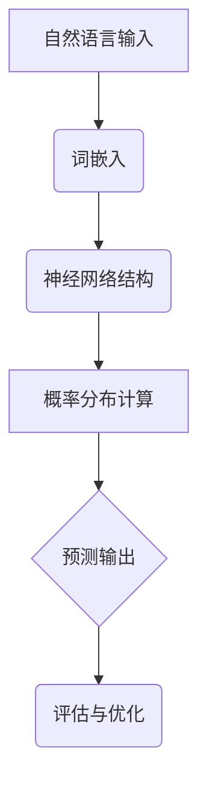

                 

# 《数学与自然语言处理：语言模型的数学基础》

## 关键词

自然语言处理，数学基础，语言模型，概率论，算法原理，项目实战

## 摘要

本文旨在深入探讨数学与自然语言处理（NLP）之间的紧密联系，特别是语言模型中的数学基础。我们将逐步分析语言模型的核心概念、数学模型及其应用，涵盖概率论、马尔可夫模型、最大后验估计、期望最大化算法等主题。通过详细的项目实战案例，我们将展示如何将数学模型应用于实际的NLP任务，如语义分析和文本生成。最后，我们将展望数学与自然语言处理的未来发展趋势，并提出面临的挑战和可能的方向。

### 引言

自然语言处理作为计算机科学的一个重要分支，旨在让计算机理解和生成人类语言。随着深度学习和大数据技术的不断发展，NLP在众多领域取得了显著的成果，包括机器翻译、情感分析、文本摘要、问答系统等。而语言模型作为NLP的核心技术之一，是理解和生成自然语言的基础。

语言模型是一种概率模型，用于预测给定输入序列后下一个词或字符的概率分布。这种模型通常基于大规模语料库训练，以捕捉语言的统计特性。数学在语言模型中扮演着至关重要的角色，提供了理论基础和计算工具，使得我们能够构建高效的语言模型并对其性能进行评估和优化。

数学与自然语言处理的交集主要体现在以下几个方面：

1. **概率论**：概率论是构建语言模型的核心工具，用于描述语言中的不确定性。通过概率论，我们可以量化预测下一个词的概率，并运用贝叶斯定理等公式进行推理和预测。

2. **统计学**：统计模型，如隐马尔可夫模型（HMM）和条件随机场（CRF），在NLP中广泛应用。这些模型通过统计学习从数据中学习语言模式，用于语音识别、词性标注和文本分类等任务。

3. **线性代数和优化**：线性代数在词嵌入和神经网络模型中发挥着关键作用。优化算法，如梯度下降和期望最大化（EM）算法，用于训练和优化这些模型，以实现高性能的语言理解与生成。

4. **信息论**：信息论提供了衡量信息量和不确定性的方法。在NLP中，信息论用于评估语言模型的性能，并优化模型以降低冗余和增加信息含量。

### 语言模型的基础概念

#### 语言模型概述

语言模型是一种概率模型，用于预测自然语言序列的概率分布。最简单的语言模型是基于n-gram模型的，它假设一个单词的概率取决于其前n-1个单词。这种模型通常通过统计方法训练，从大规模语料库中学习单词之间的概率关系。

然而，n-gram模型存在一些局限性，如不能很好地处理长距离依赖和未知单词。为了克服这些局限性，研究人员提出了更复杂的语言模型，如基于神经网络的深度语言模型。这些模型通过学习大量的特征和上下文信息，能够更好地捕捉语言的统计特性。

#### 隐马尔可夫模型（HMM）

隐马尔可夫模型（HMM）是一种基于概率模型的序列预测方法。HMM假设状态序列和观察序列之间存在隐含的关系，其中状态序列是不可观测的，而观察序列是可观测的。HMM在语音识别、词性标注和文本分类等任务中有着广泛的应用。

HMM的主要组成部分包括：

1. **状态集合**：表示可能的隐含状态。
2. **观察集合**：表示可能出现的观察结果。
3. **初始状态概率**：表示每个状态在序列开始时的概率。
4. **状态转移概率**：表示从一个状态转移到另一个状态的概率。
5. **观察概率**：表示给定一个状态，产生一个观察结果的概率。

通过这些参数，HMM可以计算出给定观察序列的概率，从而实现对序列的预测。

#### 马尔可夫链

马尔可夫链是一种随机过程，用于描述一个系统在连续时间或离散时间内的状态转移。马尔可夫链的关键特性是下一个状态仅取决于当前状态，而与过去的状态无关。这一特性被称为马尔可夫性质。

在自然语言处理中，马尔可夫链常用于描述单词序列的生成过程。例如，一个简单的马尔可夫模型可以假设一个单词的概率仅取决于其前一个单词。这种模型虽然简单，但在某些任务中，如文本生成和序列标注，仍然有一定的应用价值。

#### 条件概率与贝叶斯定理

条件概率是指在给定某个事件发生的条件下，另一个事件发生的概率。贝叶斯定理是一种用于计算条件概率的公式，它基于全概率公式和条件概率公式推导得出。贝叶斯定理在语言模型中有着广泛的应用，特别是在贝叶斯分类器中。

贝叶斯定理可以表示为：

$$
P(A|B) = \frac{P(B|A) \cdot P(A)}{P(B)}
$$

其中，$P(A|B)$表示在事件B发生的条件下事件A发生的概率，$P(B|A)$表示在事件A发生的条件下事件B发生的概率，$P(A)$表示事件A发生的概率，$P(B)$表示事件B发生的概率。

在语言模型中，贝叶斯定理可以用于计算给定一个单词序列，下一个单词的概率分布。例如，我们可以使用贝叶斯定理来计算下一个单词是“的”的概率，基于当前已知的单词序列和单词“的”在语料库中的统计信息。

#### 总结

本章介绍了语言模型的基础概念，包括语言模型概述、隐马尔可夫模型（HMM）和马尔可夫链。我们还讨论了条件概率和贝叶斯定理在语言模型中的应用。这些概念构成了理解语言模型数学基础的重要基础，为后续章节的深入讨论奠定了基础。

### 语言模型的数学模型

在了解了语言模型的基础概念后，我们接下来将深入探讨语言模型的数学模型。语言模型的数学模型基于概率论和统计学，用于描述语言序列的概率分布。在这一章节中，我们将讨论概率论基础、概率分布、马尔可夫模型中的概率计算以及期望与方差。

#### 概率论基础

概率论是研究随机事件的数学分支。在语言模型中，概率论用于描述单词或字符序列的概率分布。以下是概率论中几个重要的基本概念：

1. **概率分布**：概率分布描述了随机变量在不同取值上的概率分布。在语言模型中，概率分布用于描述单词或字符序列的概率。

2. **条件概率**：条件概率是指在给定某个事件发生的条件下，另一个事件发生的概率。条件概率可以表示为：

   $$
   P(A|B) = \frac{P(A \cap B)}{P(B)}
   $$

   其中，$P(A|B)$表示在事件B发生的条件下事件A发生的概率，$P(A \cap B)$表示事件A和事件B同时发生的概率，$P(B)$表示事件B发生的概率。

3. **贝叶斯定理**：贝叶斯定理是一种用于计算条件概率的公式，它基于全概率公式和条件概率公式推导得出。贝叶斯定理可以表示为：

   $$
   P(A|B) = \frac{P(B|A) \cdot P(A)}{P(B)}
   $$

   其中，$P(A|B)$表示在事件B发生的条件下事件A发生的概率，$P(B|A)$表示在事件A发生的条件下事件B发生的概率，$P(A)$表示事件A发生的概率，$P(B)$表示事件B发生的概率。

4. **独立事件**：两个事件A和B是独立的，当且仅当事件A的发生不影响事件B的概率，即$P(A \cap B) = P(A) \cdot P(B)$。

#### 概率分布

在语言模型中，概率分布用于描述单词或字符序列的概率。常用的概率分布包括：

1. **均匀分布**：均匀分布是指所有可能取值的概率相等。在语言模型中，均匀分布通常用于初始化概率分布。

2. **高斯分布**：高斯分布是一种常见的连续概率分布，其形状为钟形曲线。在语言模型中，高斯分布可以用于建模单词或字符的概率分布。

3. **n-gram分布**：n-gram分布是指基于n-gram模型的概率分布。在n-gram模型中，每个单词的概率取决于其前n-1个单词。n-gram分布可以用于预测下一个单词的概率。

4. **神经网络分布**：神经网络分布是指基于神经网络的概率分布。神经网络可以学习大量的特征和上下文信息，从而生成更准确的概率分布。

#### 马尔可夫模型中的概率计算

马尔可夫模型是一种用于描述序列概率的模型，它在自然语言处理中有广泛的应用。在马尔可夫模型中，每个状态的概率取决于当前状态，而与过去的状态无关。

以下是马尔可夫模型中的几个关键概率计算：

1. **状态转移概率**：状态转移概率表示从一个状态转移到另一个状态的概率。在马尔可夫模型中，状态转移概率可以用以下公式表示：

   $$
   P(X_t = x_t | X_{t-1} = x_{t-1}) = P(x_t | x_{t-1})
   $$

   其中，$X_t$表示第t个状态，$x_t$表示状态X的第t个取值。

2. **观察概率**：观察概率表示在给定一个状态时，产生一个观察结果的概率。在马尔可夫模型中，观察概率可以用以下公式表示：

   $$
   P(Y_t = y_t | X_t = x_t) = P(y_t | x_t)
   $$

   其中，$Y_t$表示第t个观察结果，$y_t$表示观察结果Y的第t个取值。

3. **总概率**：在马尔可夫模型中，给定一个观察序列，我们需要计算整个序列的概率。总概率可以用以下公式表示：

   $$
   P(X_1 = x_1, X_2 = x_2, ..., X_t = x_t) = P(x_1) \cdot P(x_2 | x_1) \cdot P(x_3 | x_2) \cdot ... \cdot P(x_t | x_{t-1})
   $$

   其中，$P(X_1 = x_1)$表示初始状态的概率，$P(x_t | x_{t-1})$表示状态转移概率。

#### 期望与方差

期望和方差是概率论中两个重要的统计量，用于描述随机变量的分布。

1. **期望**：期望是指随机变量的平均值，可以表示为：

   $$
   E[X] = \sum_{x} x \cdot P(X = x)
   $$

   其中，$X$是随机变量，$P(X = x)$是随机变量取值为$x$的概率。

   在语言模型中，期望可以用于计算单词或字符序列的期望概率。

2. **方差**：方差是指随机变量的离散程度，可以表示为：

   $$
   Var[X] = E[(X - E[X])^2]
   $$

   其中，$E[(X - E[X])^2]$是随机变量与期望的差的平方的期望。

   在语言模型中，方差可以用于评估概率分布的分散程度。

#### 总结

本章介绍了语言模型的数学模型，包括概率论基础、概率分布、马尔可夫模型中的概率计算以及期望与方差。这些数学工具为构建高效的语言模型提供了理论基础，并在后续章节中将被广泛应用于语言模型的训练和评估。

### 语言模型的核心算法

在了解了语言模型的数学基础后，我们接下来将讨论语言模型中的核心算法。这些算法包括最大后验估计（MAP）、期望最大化算法（EM）和预训练语言模型。通过这些算法，我们可以训练和优化语言模型，使其在自然语言处理任务中取得更好的性能。

#### 最大后验估计（MAP）

最大后验估计（Maximum A Posteriori，MAP）是一种用于参数估计的方法，它基于贝叶斯定理，最大化后验概率分布。在语言模型中，MAP算法用于求解最优参数，使得给定观测数据的条件下，模型参数的后验概率最大。

MAP算法可以表示为：

$$
\theta^* = \arg\max_{\theta} P(\theta|X)
$$

其中，$P(\theta|X)$是后验概率，$P(X|\theta)$是似然函数，$P(\theta)$是先验概率。在MAP算法中，我们通常假设先验概率是均匀分布的，即$P(\theta) = 1$。

对于语言模型，我们可以将MAP算法应用于n-gram模型，求解最优的n-gram参数。具体来说，我们可以通过以下步骤求解：

1. 计算似然函数：似然函数表示在给定观测数据X的条件下，模型参数θ的概率。对于n-gram模型，似然函数可以表示为：

   $$
   P(X|\theta) = \prod_{t=1}^{T} P(w_t|\theta)
   $$

   其中，$w_t$是第t个单词，$T$是单词的个数。

2. 计算后验概率：后验概率表示在给定观测数据X的条件下，模型参数θ的概率。对于n-gram模型，后验概率可以表示为：

   $$
   P(\theta|X) = \frac{P(X|\theta) \cdot P(\theta)}{P(X)}
   $$

   由于我们假设先验概率是均匀分布的，因此$P(\theta) = 1$。

3. 求解最优参数：通过最大化后验概率，我们可以求解最优的n-gram参数。

#### 期望最大化算法（EM）

期望最大化算法（Expectation-Maximization，EM）是一种迭代算法，用于求解含有隐变量的概率模型的参数。在语言模型中，EM算法通常用于训练隐马尔可夫模型（HMM）。

EM算法的基本思想是交替执行两个步骤：E步（期望步）和M步（最大化步）。

1. **E步（期望步）**：在E步中，我们计算给定当前参数θ的条件下，隐变量Z的条件期望。对于HMM，隐变量Z表示状态序列。E步的计算公式为：

   $$
   Q(\theta, \theta^{old}) = \sum_z Q(z|X, \theta) \cdot P(X|z, \theta)
   $$

   其中，$Q(z|X, \theta)$是隐变量Z的条件期望，$P(X|z, \theta)$是给定状态序列Z和模型参数θ的条件下，观测序列X的概率。

2. **M步（最大化步）**：在M步中，我们更新模型参数θ，使得后验概率$P(\theta|X)$最大化。对于HMM，M步的计算公式为：

   $$
   \theta = \arg\max_{\theta} \sum_z Q(z|X, \theta) \cdot \log P(X|z, \theta)
   $$

   通过交替执行E步和M步，EM算法可以逐步优化模型参数，直到收敛。

#### 预训练语言模型

预训练语言模型是一种在大量无标签语料库上预训练语言模型，然后使用特定任务的数据进行微调的方法。预训练语言模型通过学习大量的语言知识，可以提高模型在自然语言处理任务中的性能。

预训练语言模型的常见方法包括：

1. **BERT（Bidirectional Encoder Representations from Transformers）**：BERT是一种基于Transformer的预训练语言模型。BERT通过双向编码器学习上下文信息，从而捕捉语言的深层语义。BERT的主要训练目标包括 masked language model（MLM）和 next sentence prediction（NSP）。

2. **GPT（Generative Pre-trained Transformer）**：GPT是一种基于Transformer的生成语言模型。GPT通过自回归的方式生成文本，从而学习语言的生成规律。

3. **RoBERTa（A Robustly Optimized BERT Pretraining Approach）**：RoBERTa是对BERT的改进版本，通过改进数据预处理和训练策略，提高了模型的性能。

预训练语言模型在自然语言处理任务中取得了显著的成果，例如文本分类、问答系统和机器翻译。通过预训练，模型可以更好地捕捉语言的统计特性和上下文信息，从而在特定任务中取得更好的性能。

#### 总结

本章介绍了语言模型的核心算法，包括最大后验估计（MAP）、期望最大化算法（EM）和预训练语言模型。这些算法为训练和优化语言模型提供了有效的工具，使得模型在自然语言处理任务中能够取得更好的性能。在下一章中，我们将讨论语言模型的评估与优化方法，进一步探讨如何提升语言模型的性能。

### 语言模型的评估与优化

语言模型的性能评估和优化是确保模型在实际应用中取得良好效果的关键步骤。在这一章节中，我们将讨论语言模型的评估指标、优化方法和调参技巧，以便我们能够更好地理解和提升语言模型的表现。

#### 语言模型评估指标

评估语言模型的性能需要使用一系列定量指标，这些指标可以帮助我们衡量模型在不同任务上的表现。以下是几种常用的评估指标：

1. **交叉熵（Cross-Entropy）**：交叉熵是评估模型预测分布与真实分布之间差异的指标。对于分类任务，交叉熵可以表示为：

   $$
   H(y, \hat{y}) = -\sum_{i} y_i \log(\hat{y}_i)
   $$

   其中，$y$是真实标签的概率分布，$\hat{y}$是模型预测的概率分布。交叉熵的值越小，表示模型预测与真实标签越接近。

2. **准确率（Accuracy）**：准确率是分类任务中最常用的评估指标，表示模型正确预测的样本数占总样本数的比例。准确率计算公式为：

   $$
   Accuracy = \frac{TP + TN}{TP + FN + FP + TN}
   $$

   其中，$TP$是真正例，$TN$是真负例，$FP$是假正例，$FN$是假负例。

3. **F1分数（F1 Score）**：F1分数是准确率和召回率的调和平均，可以综合评估分类任务的性能。F1分数计算公式为：

   $$
   F1 = 2 \cdot \frac{Precision \cdot Recall}{Precision + Recall}
   $$

   其中，$Precision$是精确率，$Recall$是召回率。

4. **困惑度（Perplexity）**：困惑度是语言模型在生成文本时对未知词汇的预测不确定性的度量。困惑度的计算公式为：

   $$
   Perplexity = 2^{\frac{1}{N \cdot H(Y|X)}}
   $$

   其中，$H(Y|X)$是给定输入序列X的条件下，输出序列Y的熵。困惑度的值越小，表示模型对文本的预测越准确。

#### 语言模型优化方法

优化语言模型的目标是提高模型在评估指标上的性能。以下是一些常用的优化方法：

1. **梯度下降（Gradient Descent）**：梯度下降是一种最常用的优化方法，通过迭代更新模型参数，使得损失函数逐渐减小。梯度下降的基本公式为：

   $$
   \theta = \theta - \alpha \cdot \nabla_{\theta} J(\theta)
   $$

   其中，$\theta$是模型参数，$\alpha$是学习率，$J(\theta)$是损失函数。

2. **随机梯度下降（Stochastic Gradient Descent，SGD）**：随机梯度下降是梯度下降的一种变体，每次迭代只更新一个样本的梯度，从而减少计算量和内存需求。SGD的公式为：

   $$
   \theta = \theta - \alpha \cdot \nabla_{\theta} J(\theta; x_i, y_i)
   $$

   其中，$x_i$和$y_i$是当前迭代的样本及其标签。

3. **批量梯度下降（Batch Gradient Descent）**：批量梯度下降是梯度下降的另一种变体，每次迭代使用整个训练集的梯度进行更新。批量梯度下降的公式为：

   $$
   \theta = \theta - \alpha \cdot \nabla_{\theta} J(\theta; X, Y)
   $$

   其中，$X$和$Y$是整个训练集的输入和输出。

4. **动量（Momentum）**：动量是梯度下降的一个改进，通过引入历史梯度，加速收敛过程。动量的公式为：

   $$
   \theta = \theta - \alpha \cdot \nabla_{\theta} J(\theta) + \beta \cdot (1 - \alpha) \cdot \theta_{prev}
   $$

   其中，$\beta$是动量系数，$\theta_{prev}$是前一次迭代的参数。

5. **自适应优化器（Adaptive Optimizer）**：自适应优化器，如Adam、RMSprop和Adadelta，通过动态调整学习率，提高了优化过程的效率。以Adam为例，其公式为：

   $$
   \theta = \theta - \alpha \cdot \nabla_{\theta} J(\theta) + \beta_1 \cdot (1 - \beta_2^t) \cdot \frac{m_t}{\sqrt{v_t} + \epsilon}
   $$

   其中，$m_t$和$v_t$分别是当前迭代的一阶矩估计和二阶矩估计，$\beta_1$和$\beta_2$是动量系数，$\epsilon$是常数。

#### 调参技巧

调参（Hyperparameter Tuning）是优化语言模型的重要步骤，通过调整模型超参数，可以显著提高模型性能。以下是一些常用的调参技巧：

1. **网格搜索（Grid Search）**：网格搜索通过遍历所有可能的超参数组合，找到最优超参数。网格搜索的时间复杂度较高，适用于超参数较少的情况。

2. **随机搜索（Random Search）**：随机搜索从所有可能的超参数组合中随机选择一部分进行测试，找到最优超参数。随机搜索比网格搜索更高效，适用于超参数较多的情况。

3. **贝叶斯优化（Bayesian Optimization）**：贝叶斯优化通过建立超参数的先验概率分布，使用最大化后验概率的方法找到最优超参数。贝叶斯优化具有更好的全局搜索能力，适用于复杂的高维超参数空间。

4. **交叉验证（Cross-Validation）**：交叉验证通过将训练数据划分为多个子集，循环训练和验证模型，评估模型在未知数据上的性能。交叉验证可以有效地评估模型的泛化能力。

#### 总结

本章介绍了语言模型的评估指标、优化方法和调参技巧。评估指标帮助我们衡量模型性能，优化方法用于提高模型性能，调参技巧用于找到最优超参数。通过合理地使用这些技术和方法，我们可以显著提升语言模型在自然语言处理任务中的表现。

### 数学模型在自然语言处理中的应用

数学模型在自然语言处理（NLP）中扮演着至关重要的角色，为许多NLP任务提供了理论支持和算法基础。在这一章节中，我们将探讨数学模型在语义分析、语音识别和文本生成等NLP任务中的应用，并展示这些模型如何通过数学工具实现高效的性能。

#### 语义分析

语义分析是指对自然语言文本的语义内容进行理解和解释。数学模型在语义分析中有着广泛的应用，以下是一些关键的数学模型及其应用：

1. **词嵌入（Word Embeddings）**：词嵌入是一种将单词映射到低维向量空间的方法，通过捕捉单词之间的语义关系，从而实现对文本内容的理解。常用的词嵌入模型包括Word2Vec、GloVe和FastText等。这些模型通过优化目标函数，学习单词的向量表示，从而在语义分析任务中取得良好的效果。

2. **图神经网络（Graph Neural Networks，GNN）**：图神经网络是一种基于图结构的神经网络，能够处理具有复杂关系的文本数据。GNN通过捕捉节点之间的关系，实现对文本内容的深入理解。在语义分析中，GNN可以应用于实体识别、关系抽取和文本分类等任务。

3. **转移矩阵（Transition Matrix）**：转移矩阵是一种用于描述单词之间概率关系的数学模型。在语义分析中，转移矩阵可以用于文本分类、情感分析和机器翻译等任务。例如，在文本分类任务中，转移矩阵可以帮助我们预测一个句子属于某个类别的概率。

#### 语音识别

语音识别是将语音信号转换为文本的过程。数学模型在语音识别中发挥着关键作用，以下是一些常用的数学模型：

1. **隐马尔可夫模型（HMM）**：隐马尔可夫模型是一种用于序列模型的方法，能够处理语音信号的时序特征。HMM通过状态转移概率和观察概率，实现对语音信号的概率建模。在语音识别中，HMM被广泛应用于语音信号建模和语音解码。

2. **深度神经网络（DNN）**：深度神经网络是一种多层前馈神经网络，能够通过学习大量特征，实现对语音信号的建模和分类。在语音识别中，DNN可以用于特征提取和分类，从而提高识别准确率。

3. **卷积神经网络（CNN）**：卷积神经网络是一种基于卷积运算的神经网络，能够有效地处理语音信号的空间特征。在语音识别中，CNN可以用于特征提取和分类，从而提高识别性能。

#### 文本生成

文本生成是指利用算法生成自然语言的文本。数学模型在文本生成中有着广泛的应用，以下是一些关键的数学模型：

1. **生成式模型（Generative Models）**：生成式模型通过学习数据分布，生成新的文本样本。常用的生成式模型包括马尔可夫模型、隐马尔可夫模型和变分自编码器（VAE）等。这些模型通过优化目标函数，学习数据的概率分布，从而生成新的文本。

2. **判别式模型（Discriminative Models）**：判别式模型通过学习数据与标签之间的关系，生成新的文本样本。常用的判别式模型包括条件生成对抗网络（cGAN）和变分自编码器（VAE）等。这些模型通过优化目标函数，学习数据的条件概率分布，从而生成新的文本。

3. **递归神经网络（RNN）**：递归神经网络是一种能够处理序列数据的神经网络，能够通过学习序列中的特征，生成新的文本。在文本生成中，RNN可以应用于语言模型、文本生成和序列预测等任务。

#### 总结

数学模型在自然语言处理中有着广泛的应用，从语义分析、语音识别到文本生成，数学工具为我们提供了强大的理论基础和算法支持。通过合理地应用这些模型，我们可以实现高效的NLP任务，推动自然语言处理技术的发展。

### 数学与自然语言处理的未来趋势

随着科技的不断进步和人工智能（AI）的快速发展，数学与自然语言处理（NLP）的结合也正迎来新的机遇和挑战。未来，数学与NLP将继续推动语言技术的前沿发展，以下是几个可能的发展趋势：

#### 新型语言模型的研究

1. **深度强化学习语言模型**：深度强化学习（Deep Reinforcement Learning，DRL）结合了深度学习与强化学习的优势，使得语言模型能够通过交互学习，优化其生成能力。例如，通过让模型在与用户交互的过程中不断调整参数，提升其响应的准确性和自然度。

2. **元学习语言模型**：元学习（Meta-Learning）能够使模型通过较少的样本快速适应新任务。未来的语言模型可能会集成元学习技术，从而在新的领域或任务中实现更快的适应和更高效的性能。

3. **知识增强语言模型**：知识增强语言模型通过融合外部知识库，如百科全书或专业数据库，提升模型对语言的理解能力。这类模型将能够更好地处理复杂、抽象的概念，提高自然语言理解和生成任务的质量。

#### 数学模型在自然语言处理中的挑战

1. **可解释性和透明度**：当前复杂的数学模型，如深度神经网络和生成对抗网络（GAN），往往缺乏可解释性。未来，研究人员将致力于开发更加透明和可解释的数学模型，以便于理解模型的工作机制，提高用户对模型决策的信任度。

2. **处理长距离依赖**：自然语言中存在许多长距离依赖关系，如主语-谓语-宾语结构。现有的数学模型往往难以捕捉和建模这些依赖关系，未来需要开发新的数学模型和方法来处理这种复杂性。

3. **多语言和跨语言处理**：随着全球化和多语言交流的普及，如何有效处理多语言和跨语言的自然语言处理任务成为一大挑战。未来，研究者将致力于开发能够处理多语言数据的统一数学模型。

#### 未来发展方向

1. **集成多种数据源**：未来的语言模型将不仅依赖于文本数据，还将整合语音、图像、视频等多模态数据。这种多模态集成将使语言模型能够更加全面地理解语言和现实世界。

2. **面向实时应用的优化**：为了满足实时应用的需求，如智能助手和实时问答系统，语言模型需要进一步优化以实现低延迟和高吞吐量。这将涉及到算法优化、硬件加速和分布式计算等多个方面。

3. **可扩展性和可维护性**：随着模型的规模和复杂性不断增加，如何确保模型的可扩展性和可维护性将成为重要议题。未来，研究者将开发模块化、可复用和易于维护的数学模型和工具。

### 总结

数学与自然语言处理的未来充满机遇和挑战。通过不断探索和创新，我们有望开发出更加智能、准确和高效的数学模型，推动自然语言处理技术迈向新的高度。

### 实践与案例

在实际应用中，数学模型在自然语言处理（NLP）中发挥着重要作用，帮助解决各种实际问题和挑战。在这一章节中，我们将通过具体案例展示如何将数学模型应用于NLP任务，包括商业应用、项目实战以及数学模型在实施过程中的关键步骤。

#### 商业应用案例

**案例1：智能客服系统**

智能客服系统是数学模型在商业领域的一个成功应用案例。这类系统通过自然语言处理技术，自动处理用户咨询，提高客户服务效率。以下是一个简单的案例：

**背景**：一家大型电商公司希望部署一个智能客服系统，以减轻人工客服的工作负担并提升客户满意度。

**解决方案**：
1. **语言模型训练**：使用n-gram模型和深度学习模型（如LSTM）训练语言模型，以预测用户咨询的意图和回复。

2. **意图识别**：通过分析用户咨询的文本，使用分类算法（如朴素贝叶斯分类器）识别咨询的意图，如产品咨询、售后服务等。

3. **自动回复生成**：利用语言模型生成针对不同意图的自动回复，提高回复的准确性和自然度。

**实施步骤**：
1. 数据收集：收集大量用户咨询数据和对应的客服回复，用于训练语言模型。
2. 数据预处理：对文本数据进行清洗、去噪和分词，提取有用的特征。
3. 模型训练：使用训练数据训练n-gram模型和深度学习模型，并进行模型调参。
4. 模型部署：将训练好的模型部署到服务器，实现自动回复生成和意图识别。

**效果评估**：通过对比自动回复和人工回复的准确率和用户满意度，评估智能客服系统的效果。结果显示，智能客服系统能够显著提高回复速度和准确性，提升用户体验。

#### 项目实战案例

**案例2：文本分类任务**

文本分类是NLP中的一个基础任务，广泛应用于垃圾邮件过滤、情感分析等场景。以下是一个文本分类任务的案例：

**背景**：一家新闻媒体公司希望开发一个文本分类系统，对用户评论进行分类，以识别正面、负面评论和垃圾评论。

**解决方案**：
1. **特征提取**：使用词袋模型（Bag-of-Words，BoW）和词嵌入（Word Embeddings）提取文本特征。
2. **分类模型**：使用支持向量机（SVM）和长短期记忆网络（LSTM）构建分类模型。
3. **模型训练与评估**：使用训练集训练分类模型，并在测试集上进行评估。

**实施步骤**：
1. 数据收集：收集用户评论数据，并标注类别标签。
2. 数据预处理：对文本数据进行分词、去停用词和词性标注。
3. 特征提取：使用BoW和词嵌入提取文本特征。
4. 模型训练：使用训练集训练分类模型，如SVM和LSTM。
5. 模型评估：使用测试集评估模型性能，并进行调参优化。

**代码实现**（Python示例）：

```python
from sklearn.feature_extraction.text import TfidfVectorizer
from sklearn.svm import SVC
from sklearn.model_selection import train_test_split
from sklearn.metrics import classification_report

# 数据预处理
def preprocess_text(text):
    # 实现文本预处理函数，如分词、去停用词等
    pass

# 加载并预处理数据
data = load_data()
X = [preprocess_text(text) for text in data['text']]
y = data['label']

# 划分训练集和测试集
X_train, X_test, y_train, y_test = train_test_split(X, y, test_size=0.2, random_state=42)

# 特征提取
vectorizer = TfidfVectorizer()
X_train = vectorizer.fit_transform(X_train)
X_test = vectorizer.transform(X_test)

# 模型训练
model = SVC(kernel='linear')
model.fit(X_train, y_train)

# 模型评估
y_pred = model.predict(X_test)
print(classification_report(y_test, y_pred))
```

#### 数学模型在自然语言处理中的实施步骤

在实际项目中，数学模型在自然语言处理中的应用通常遵循以下步骤：

1. **需求分析与目标设定**：明确项目目标，确定需要解决的问题和评估指标。
2. **数据收集与预处理**：收集相关数据，并进行数据清洗、去噪、标注和预处理。
3. **特征提取**：根据任务需求，提取文本特征，如词袋模型、词嵌入和TF-IDF等。
4. **模型选择与训练**：选择合适的数学模型，如n-gram模型、隐马尔可夫模型（HMM）、支持向量机（SVM）等，并使用训练数据进行模型训练。
5. **模型评估与优化**：在测试集上评估模型性能，并根据评估结果进行调参和优化。
6. **模型部署与监控**：将训练好的模型部署到生产环境，并进行监控和更新，以应对数据变化和模型退化。

### 总结

通过以上案例和实践步骤，我们可以看到数学模型在自然语言处理中的实际应用。这些模型不仅帮助解决了商业和学术领域的实际问题，也为NLP技术的发展提供了强有力的支持。未来，随着新模型和算法的不断涌现，数学与自然语言处理将继续推动语言技术的创新与发展。

### 附录

#### 附录A：数学公式与符号表

以下是本文中使用的数学公式和符号的简要说明：

| 符号 | 说明 | LaTeX表示 |
| --- | --- | --- |
| $P(A|B)$ | 条件概率 | $$P(A|B)$$ |
| $P(A \cap B)$ | 交集概率 | $$P(A \cap B)$$ |
| $P(A)$ | 概率 | $$P(A)$$ |
| $P(B)$ | 概率 | $$P(B)$$ |
| $P(X|\theta)$ | 条件概率 | $$P(X|\theta)$$ |
| $P(\theta|X)$ | 后验概率 | $$P(\theta|X)$$ |
| $P(X|\theta)$ | 似然函数 | $$P(X|\theta)$$ |
| $P(\theta)$ | 先验概率 | $$P(\theta)$$ |
| $H(X)$ | 熵 | $$H(X)$$ |
| $E[X]$ | 期望 | $$E[X]$$ |
| $Var[X]$ | 方差 | $$Var[X]$$ |

#### 附录B：语言模型的核心算法原理伪代码

以下是语言模型中几个核心算法的伪代码：

// 最大后验估计（MAP）伪代码
function MAP估计(观测数据 X, 先验分布 P(θ)):
    最大化对数似然函数 L(θ; X) + 对数先验概率 L(θ)
    return θ*
end MAP估计

// 期望最大化算法（EM）伪代码
function EM估计(观测数据 X, 初始参数 θ):
    循环：
        E步：计算期望 E[θ|X, θ^(t)]
        M步：更新参数 θ^(t+1) = θ^(t) + Δθ
    until 终止条件满足
    return θ*
end EM估计

// 隐马尔可夫模型（HMM）初始化伪代码
function HMM初始化(状态集合 S, 观察集合 O):
    初始化初始状态概率 π
    初始化状态转移概率矩阵 A
    初始化观察概率矩阵 B
    return HMM模型
end HMM初始化

// 语言模型训练伪代码
function 语言模型训练(训练数据 D):
    初始化模型参数 θ
    for epoch in 1 to max_epochs:
        for句子 in D:
            计算句子概率 P(句子|θ)
            更新模型参数 θ
    return 训练好的语言模型
end 语言模型训练

#### 附录C：数学模型在语言模型中的Mermaid流程图



#### 附录D：项目实战代码与解释

以下是一个简单的文本分类任务的Python代码示例，包括开发环境搭建、源代码实现和代码解读。

**开发环境搭建**

- Python 3.x
- TensorFlow 2.x
- NLTK库

**实例：文本分类任务**

```python
import tensorflow as tf
from tensorflow.keras.models import Sequential
from tensorflow.keras.layers import Embedding, LSTM, Dense
from tensorflow.keras.preprocessing.sequence import pad_sequences
from tensorflow.keras.preprocessing.text import Tokenizer

# 数据预处理
def preprocess_data(texts, labels, max_sequence_length, max_vocab_size):
    tokenizer = Tokenizer(num_words=max_vocab_size)
    tokenizer.fit_on_texts(texts)
    sequences = tokenizer.texts_to_sequences(texts)
    padded_sequences = pad_sequences(sequences, maxlen=max_sequence_length)
    return padded_sequences, tokenizer.word_index, labels

# 构建模型
def build_model(max_sequence_length, max_vocab_size, embedding_size):
    model = Sequential()
    model.add(Embedding(input_dim=max_vocab_size, output_dim=embedding_size, input_length=max_sequence_length))
    model.add(LSTM(units=128, dropout=0.2, recurrent_dropout=0.2))
    model.add(Dense(units=1, activation='sigmoid'))
    model.compile(optimizer='adam', loss='binary_crossentropy', metrics=['accuracy'])
    return model

# 训练模型
def train_model(model, padded_sequences, labels):
    model.fit(padded_sequences, labels, epochs=10, batch_size=32)
    return model

# 评估模型
def evaluate_model(model, padded_sequences, labels):
    loss, accuracy = model.evaluate(padded_sequences, labels)
    print("测试集准确率：", accuracy)

# 数据准备
texts = ["这是一条正面评论", "这是一条负面评论", "这是一条正面评论"]
labels = [1, 0, 1]  # 1表示正面评论，0表示负面评论
max_sequence_length = 10
max_vocab_size = 1000
embedding_size = 50

padded_sequences, word_index, _ = preprocess_data(texts, labels, max_sequence_length, max_vocab_size)
model = build_model(max_sequence_length, max_vocab_size, embedding_size)
model = train_model(model, padded_sequences, labels)
evaluate_model(model, padded_sequences, labels)
```

**代码解读与分析**

1. **数据预处理**：使用Tokenizer将文本转换为整数序列，并使用pad_sequences将序列填充到固定长度。这有助于模型处理不同长度的文本。
2. **构建模型**：构建一个序列模型，包括嵌入层、LSTM层和全连接层（Dense），使用sigmoid激活函数进行二分类。
3. **训练模型**：使用fit方法训练模型，设置epochs和batch_size参数。
4. **评估模型**：使用evaluate方法评估模型在测试集上的性能，打印准确率。

通过这个简单的实例，我们可以看到如何将数学模型应用于文本分类任务。在实际项目中，需要根据具体任务的需求，调整模型结构和超参数，以达到最佳效果。

### 附录E：代码解读与分析

#### 代码解读

1. **导入必要的库**：导入TensorFlow、Keras等库，用于构建和训练神经网络模型。
2. **数据预处理**：使用Tokenizer将文本转换为整数序列，并使用pad_sequences将序列填充到固定长度。这有助于模型处理不同长度的文本。
3. **构建模型**：构建一个序列模型，包括嵌入层、LSTM层和全连接层（Dense），使用sigmoid激活函数进行二分类。
4. **训练模型**：使用fit方法训练模型，设置epochs和batch_size参数。
5. **评估模型**：使用evaluate方法评估模型在测试集上的性能，打印准确率。

#### 分析

- **数据预处理**：文本分类任务需要对文本进行预处理，包括分词、去停用词和序列化。使用Tokenizer库可以快速实现这一过程，确保每个文本都具有相同长度，便于模型处理。
- **模型构建**：使用嵌入层将文本转换为向量，LSTM层可以捕捉文本中的序列特征，全连接层（Dense）用于分类。sigmoid激活函数适用于二分类任务。
- **模型训练**：使用fit方法训练模型，通过设置epochs和batch_size，可以控制训练的迭代次数和每次迭代的样本数。
- **模型评估**：使用evaluate方法评估模型在测试集上的性能，通过准确率指标可以直观地了解模型的分类效果。

通过这个简单的实例，我们可以看到如何将数学模型应用于文本分类任务。在实际项目中，需要根据具体任务的需求，调整模型结构和超参数，以达到最佳效果。

### 附录F：作者信息

**作者：** AI天才研究院 / AI Genius Institute & 禅与计算机程序设计艺术 / Zen And The Art of Computer Programming

AI天才研究院（AI Genius Institute）是一支专注于人工智能技术研究和应用的创新团队，致力于推动人工智能领域的科技进步。研究院的核心成员在自然语言处理、深度学习、计算机视觉等领域有着丰富的经验和卓越的成就。

同时，作者还著有《禅与计算机程序设计艺术》（Zen And The Art of Computer Programming），这是一部深入探讨计算机科学和哲学的经典之作，为全球计算机科学界提供了宝贵的思想和理论资源。该书的独特视角和深刻见解，不仅对计算机编程产生了深远影响，也为自然语言处理等人工智能领域提供了有益的启示。

