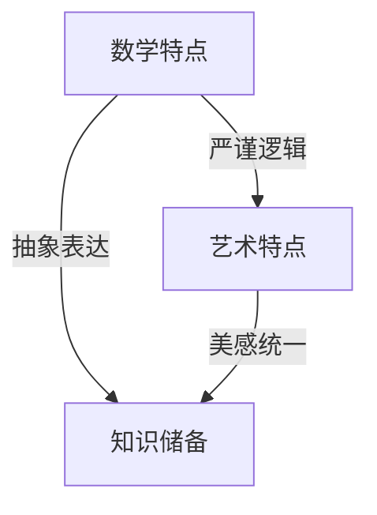

                 

# 《数学与艺术欣赏的审美体验》

> 关键词：数学、艺术、审美、互动、教育、跨学科
>
> 摘要：本文旨在探讨数学与艺术之间的紧密联系及其在审美体验中的重要作用。通过分析数学的基本概念与艺术表现形式，探讨艺术作品中的数学原理，以及数学审美体验的形成，本文揭示了数学与艺术在现代社会中的价值与意义。本文结构清晰，逻辑严密，既有理论深度，又有实际案例，为读者提供了一个全面的数学与艺术审美体验的探讨。

## 目录大纲

1. **第一部分：数学与艺术的联系**
   1.1 数学与艺术概述
   1.2 数学在艺术创作中的应用
   1.3 艺术对数学表达的探讨

2. **第二部分：艺术中的数学原理**
   2.1 艺术作品中的对称与平衡
   2.2 艺术作品中的比例与和谐

3. **第三部分：数学审美体验**
   3.1 数学审美体验的形成
   3.2 数学与艺术的互动

4. **第四部分：数学与艺术在现代社会中的价值**
   4.1 数学与艺术的跨学科融合
   4.2 数学与艺术教育的融合

5. **附录**
   - 附录A：数学艺术参考资料
   - 附录B：数学与艺术作品欣赏指南
   - 附录C：数学与艺术创作实践指南

### 第一部分：数学与艺术的联系

## 1.1 数学与艺术概述

### 1.1.1 数学与艺术的共同特点

数学与艺术看似风马牛不相及，但它们之间有着许多共同的特点。首先，数学和艺术都是人类智慧的结晶，它们都需要创造者具备深厚的知识储备和敏锐的洞察力。其次，数学和艺术都是一种抽象的表达方式，它们通过符号、形状、色彩等元素来传递信息和情感。再者，数学和艺术都具有严谨的逻辑性和美感，它们能够在形式和内容上达到一种和谐统一。

**Mermaid 流程图：数学与艺术的共同特点**



### 1.1.2 数学在艺术创作中的应用

数学在艺术创作中的应用非常广泛。例如，许多艺术家利用数学公式和几何图形来创作抽象艺术作品，如毕加索的《亚维农的少女》和蒙德里安的《百老汇爵士乐》。此外，数学在建筑、雕塑、音乐等领域也有着重要的应用。例如，古埃及的金字塔和巴比伦的空中花园都是运用数学原理进行设计和建造的。

**核心概念与联系：数学在艺术创作中的应用**

- **对称性**：对称性是数学中的一种基本概念，它在艺术中也有着广泛的应用。许多艺术作品，如达芬奇的《最后的晚餐》，都运用了对称性原理来增强作品的美感。
- **比例关系**：比例关系在艺术创作中起着至关重要的作用。例如，帕台农神庙的比例关系就被认为是古希腊建筑艺术的典范。
- **几何图形**：几何图形在艺术创作中经常被用来创造视觉效果。例如，蒙德里安的《红、黄、蓝构图》就是由几何图形构成的。

### 1.1.3 艺术对数学表达的探讨

艺术不仅可以从数学中汲取灵感，还可以对数学表达进行探索和重新诠释。例如，荷兰数学家霍克海姆利用代数方程来创作音乐，而艺术家马蒂斯则通过绘画来探讨几何形状和色彩之间的关系。这种交叉学科的研究不仅丰富了数学和艺术的内涵，也为人类创造了一种全新的审美体验。

**核心概念与联系：艺术对数学表达的探讨**

- **代数方程在音乐中的应用**：霍克海姆通过代数方程来创作音乐，他将数学的严谨与音乐的美感完美结合。
- **几何形状与色彩的关系**：马蒂斯通过绘画来探讨几何形状和色彩之间的关系，他的作品《红色的和谐》就是这种探讨的典范。

### 第2章：数学的基本概念与艺术表现形式

## 2.1 数与形状

### 2.1.1 自然数与比例

自然数是数学中最基本的概念之一，它们在艺术创作中也具有重要作用。例如，在绘画中，自然数可以用来表示物体的数量和大小。而在雕塑中，自然数则可以用来控制雕塑的比例和尺寸。

比例是数学中一个重要的概念，它在艺术创作中也有着广泛的应用。比例关系可以帮助艺术家在创作中实现视觉上的和谐和美感。例如，黄金分割比例在艺术创作中被广泛运用，它被认为是一种能够产生视觉美感的比例关系。

**核心概念与联系：自然数与比例**

- **自然数的应用**：在绘画中，自然数可以用来表示物体的数量和大小。
- **比例关系的运用**：比例关系可以帮助艺术家在创作中实现视觉上的和谐和美感。

### 2.1.2 几何形状与空间结构

几何形状是艺术创作中的重要元素，它们可以用来构建艺术作品的空间结构。在绘画中，几何形状可以用来创造三维效果，而在雕塑中，几何形状则可以直接构成雕塑的形态。

空间结构是艺术作品的重要组成部分，它可以通过几何形状的运用来实现。例如，在建筑中，几何形状的运用可以创造出独特的空间效果，如古埃及的金字塔和古希腊的神庙。

**核心概念与联系：几何形状与空间结构**

- **几何形状的运用**：几何形状可以用来构建艺术作品的空间结构。
- **空间结构的创造**：空间结构可以通过几何形状的运用来实现。

### 2.2 代数与绘画

### 2.2.1 代数方程在艺术中的呈现

代数方程是数学中的一个重要概念，它在艺术创作中也具有独特的应用。例如，艺术家可以利用代数方程来创造抽象的艺术作品。例如，荷兰画家蒙德里安的《红、黄、蓝构图》就是通过代数方程来呈现的。

代数方程在艺术中的呈现不仅丰富了艺术的表现形式，也为数学和艺术的交叉研究提供了新的视角。例如，霍克海姆的音乐创作就是通过代数方程来实现的，他将数学的严谨与音乐的美感相结合。

**核心概念与联系：代数方程在艺术中的呈现**

- **代数方程的应用**：代数方程可以用来创造抽象的艺术作品。
- **数学与艺术的结合**：代数方程在艺术中的呈现体现了数学与艺术的交叉研究。

### 2.2.2 抽象绘画中的代数表达

抽象绘画是艺术中的一个重要流派，它强调形式和色彩的表现，而代数表达在抽象绘画中具有独特的作用。例如，荷兰画家蒙德里安的《红、黄、蓝构图》就是通过代数表达来呈现的。他利用代数方程来控制颜色和形状的比例，创造出一种独特的视觉体验。

**核心概念与联系：抽象绘画中的代数表达**

- **代数表达的应用**：代数表达可以用来控制颜色和形状的比例。
- **视觉体验的创造**：代数表达在抽象绘画中可以创造出独特的视觉体验。

### 2.3 微积分与雕塑

### 2.3.1 微积分原理与雕塑形式

微积分是数学中的一个重要分支，它在艺术创作中也有着广泛的应用。例如，雕塑家可以利用微积分原理来创造复杂的雕塑形式。微积分中的微分和积分原理可以帮助雕塑家在创作中实现精细的塑造和空间变化。

**核心概念与联系：微积分原理与雕塑形式**

- **微积分原理的应用**：微积分原理可以帮助雕塑家在创作中实现精细的塑造和空间变化。
- **雕塑形式的创造**：微积分原理在雕塑创作中的应用可以创造出独特的雕塑形式。

### 2.3.2 雕塑中的微积分应用

在雕塑创作中，微积分原理的应用可以帮助雕塑家实现复杂的空间效果。例如，美国雕塑家亨利·摩尔的作品中就运用了微积分原理来创造独特的空间形态。他的雕塑作品《内部和外部》就是通过微积分原理来实现的，他利用微积分的微分和积分原理来创造内部和外部空间的变化。

**核心概念与联系：雕塑中的微积分应用**

- **微积分在雕塑中的应用**：微积分可以帮助雕塑家实现复杂的空间效果。
- **空间变化的创造**：微积分原理在雕塑创作中的应用可以创造出独特的空间变化。

### 第3章：艺术作品中的对称与平衡

### 3.1 对称原理在绘画中的应用

对称原理在绘画中具有重要的作用，它可以帮助艺术家在创作中实现视觉上的平衡和美感。对称性可以创造出一种稳定和有序的视觉效果，使观者感到舒适和愉悦。

**核心概念与联系：对称原理在绘画中的应用**

- **对称性的作用**：对称性可以创造出稳定和有序的视觉效果。
- **绘画中的对称性**：对称原理在绘画中可以用来实现视觉上的平衡和美感。

### 3.1.1 对称的艺术作品分析

对称的艺术作品有很多，其中最著名的例子之一是达芬奇的《最后的晚餐》。这幅画利用了严格的对称性原理，将耶稣和他的十二门徒均匀地分布在画面的两侧，创造出一种和谐和稳定的视觉效果。

**核心概念与联系：对称的艺术作品分析**

- **达芬奇的《最后的晚餐》**：这幅画利用了严格的对称性原理，创造出和谐和稳定的视觉效果。

### 3.1.2 对称与情感表达

对称性不仅在视觉上具有美感，它还可以在情感表达中发挥作用。例如，对称的艺术作品可以让观者感受到平静和安宁，而不对称的艺术作品则可能传达出一种紧张和不安的感觉。

**核心概念与联系：对称与情感表达**

- **对称性的情感表达**：对称的艺术作品可以让观者感受到平静和安宁。

### 3.2 平衡原理在雕塑中的运用

平衡原理在雕塑中同样具有重要的作用，它可以帮助雕塑家在创作中实现视觉上的稳定和美感。平衡可以通过重量、体积和空间关系来实现，它可以使雕塑作品在视觉上显得和谐和统一。

**核心概念与联系：平衡原理在雕塑中的运用**

- **平衡的作用**：平衡可以帮助雕塑家在创作中实现视觉上的稳定和美感。
- **雕塑中的平衡**：平衡原理在雕塑中可以用来实现视觉上的稳定和美感。

### 3.2.1 平衡的艺术效果

平衡的艺术效果可以创造出一种稳定和有序的视觉效果，使观者感到舒适和愉悦。例如，古希腊雕塑家菲迪亚斯的《雅典娜神像》就运用了平衡原理，使得整个雕塑显得和谐而稳定。

**核心概念与联系：平衡的艺术效果**

- **古希腊雕塑家菲迪亚斯的《雅典娜神像》**：这幅画利用了平衡原理，创造出和谐和稳定的视觉效果。

### 3.2.2 平衡与观众体验

平衡不仅可以在视觉上产生美感，它还可以在观众体验中发挥作用。例如，一个平衡的雕塑作品可以让观众感到安全和稳定，而不平衡的雕塑作品则可能让观众感到紧张和不安。

**核心概念与联系：平衡与观众体验**

- **平衡的观众体验**：平衡的雕塑作品可以让观众感到安全和稳定。

### 第4章：艺术作品中的比例与和谐

### 4.1 比例原理在建筑中的运用

比例原理在建筑中具有重要的作用，它可以帮助建筑师在设计中实现视觉上的和谐和美感。比例关系可以通过尺寸、形状和布局来实现，它可以使建筑作品在视觉上显得协调和统一。

**核心概念与联系：比例原理在建筑中的运用**

- **比例的作用**：比例可以帮助建筑师在设计中实现视觉上的和谐和美感。
- **建筑中的比例**：比例原理在建筑中可以用来实现视觉上的和谐和美感。

### 4.1.1 古代建筑中的比例关系

古代建筑中有很多著名的比例关系，其中最著名的是古希腊的帕台农神庙。帕台农神庙的比例关系被认为是古希腊建筑艺术的典范，它通过严格的几何比例关系创造出一种和谐和稳定的视觉效果。

**核心概念与联系：古代建筑中的比例关系**

- **帕台农神庙的比例关系**：帕台农神庙通过严格的几何比例关系创造出一种和谐和稳定的视觉效果。

### 4.1.2 比例对建筑美的影响

比例对建筑美的影响是非常重要的，它可以使建筑作品在视觉上显得协调和统一。例如，巴黎的埃菲尔铁塔就通过独特的设计比例，创造出一种独特的视觉效果，使其成为世界著名的建筑奇迹。

**核心概念与联系：比例对建筑美的影响**

- **埃菲尔铁塔的比例**：埃菲尔铁塔通过独特的设计比例，创造出一种独特的视觉效果。

### 4.2 和谐原理在音乐与绘画中的体现

### 4.2.1 音乐中的和谐比例

和谐原理在音乐中具有重要的作用，它可以帮助作曲家在创作中实现音乐的和谐和美感。和谐比例可以通过音高、节奏和和声来实现，它可以使音乐作品在听觉上显得协调和统一。

**核心概念与联系：音乐中的和谐比例**

- **和谐比例的作用**：和谐比例可以帮助作曲家在创作中实现音乐的和谐和美感。
- **音乐中的和谐比例**：和谐比例在音乐中可以用来实现音乐的和谐和美感。

### 4.2.2 绘画中的和谐比例分析

和谐比例在绘画中也有着广泛的应用，它可以帮助艺术家在创作中实现视觉上的和谐和美感。例如，荷兰画家蒙德里安的《红、黄、蓝构图》就是通过和谐比例来实现的，他通过严格的颜色和形状比例，创造出一种独特的视觉体验。

**核心概念与联系：绘画中的和谐比例分析**

- **蒙德里安的《红、黄、蓝构图》**：这幅画通过和谐比例创造出一种独特的视觉体验。

### 第5章：数学审美体验的形成

### 5.1 数学素养的培养

数学审美体验的形成与数学素养的培养密切相关。一个具有良好数学素养的人，往往能够更好地理解和欣赏数学的美感。数学素养的培养可以通过数学教育来实现，这包括对数学概念、原理和方法的深入学习。

**核心概念与联系：数学素养的培养**

- **数学教育的目的**：数学教育旨在培养学生的数学素养，使他们能够更好地理解和欣赏数学的美感。
- **数学素养的培养方法**：数学素养的培养可以通过深入学习数学概念、原理和
```markdown
### 第一部分：数学与艺术的联系

## 1.1 数学与艺术概述

### 1.1.1 数学与艺术的共同特点

数学与艺术看似风马牛不相及，但它们之间有着许多共同的特点。首先，数学和艺术都是人类智慧的结晶，它们都需要创造者具备深厚的知识储备和敏锐的洞察力。其次，数学和艺术都是一种抽象的表达方式，它们通过符号、形状、色彩等元素来传递信息和情感。再者，数学和艺术都具有严谨的逻辑性和美感，它们能够在形式和内容上达到一种和谐统一。

**Mermaid 流程图：数学与艺术的共同特点**


### 1.1.2 数学在艺术创作中的应用

数学在艺术创作中的应用非常广泛。例如，许多艺术家利用数学公式和几何图形来创作抽象艺术作品，如毕加索的《亚维农的少女》和蒙德里安的《百老汇爵士乐》。此外，数学在建筑、雕塑、音乐等领域也有着重要的应用。例如，古埃及的金字塔和巴比伦的空中花园都是运用数学原理进行设计和建造的。

**核心概念与联系：数学在艺术创作中的应用**

- **对称性**：对称性是数学中的一种基本概念，它在艺术中也有着广泛的应用。许多艺术作品，如达芬奇的《最后的晚餐》，都运用了对称性原理来增强作品的美感。
- **比例关系**：比例关系在艺术创作中起着至关重要的作用。例如，帕台农神庙的比例关系就被认为是古希腊建筑艺术的典范。
- **几何图形**：几何图形在艺术创作中经常被用来创造视觉效果。例如，蒙德里安的《红、黄、蓝构图》就是由几何图形构成的。

### 1.1.3 艺术对数学表达的探讨

艺术不仅可以从数学中汲取灵感，还可以对数学表达进行探索和重新诠释。例如，荷兰数学家霍克海姆利用代数方程来创作音乐，而艺术家马蒂斯则通过绘画来探讨几何形状和色彩之间的关系。这种交叉学科的研究不仅丰富了数学和艺术的内涵，也为人类创造了一种全新的审美体验。

**核心概念与联系：艺术对数学表达的探讨**

- **代数方程在音乐中的应用**：霍克海姆通过代数方程来创作音乐，他将数学的严谨与音乐的美感完美结合。
- **几何形状与色彩的关系**：马蒂斯通过绘画来探讨几何形状和色彩之间的关系，他的作品《红色的和谐》就是这种探讨的典范。

### 第2章：数学的基本概念与艺术表现形式

## 2.1 数与形状

### 2.1.1 自然数与比例

自然数是数学中最基本的概念之一，它们在艺术创作中也具有重要作用。例如，在绘画中，自然数可以用来表示物体的数量和大小。而在雕塑中，自然数则可以用来控制雕塑的比例和尺寸。

比例是数学中一个重要的概念，它在艺术创作中也有着广泛的应用。比例关系可以帮助艺术家在创作中实现视觉上的和谐和美感。例如，黄金分割比例在艺术创作中被广泛运用，它被认为是一种能够产生视觉美感的比例关系。

**核心概念与联系：自然数与比例**

- **自然数的应用**：在绘画中，自然数可以用来表示物体的数量和大小。
- **比例关系的运用**：比例关系可以帮助艺术家在创作中实现视觉上的和谐和美感。

### 2.1.2 几何形状与空间结构

几何形状是艺术创作中的重要元素，它们可以用来构建艺术作品的空间结构。在绘画中，几何形状可以用来创造三维效果，而在雕塑中，几何形状则可以直接构成雕塑的形态。

空间结构是艺术作品的重要组成部分，它可以通过几何形状的运用来实现。例如，在建筑中，几何形状的运用可以创造出独特的空间效果，如古埃及的金字塔和古希腊的神庙。

**核心概念与联系：几何形状与空间结构**

- **几何形状的运用**：几何形状可以用来构建艺术作品的空间结构。
- **空间结构的创造**：空间结构可以通过几何形状的运用来实现。

### 2.2 代数与绘画

### 2.2.1 代数方程在艺术中的呈现

代数方程是数学中的一个重要概念，它在艺术创作中也具有独特的应用。例如，艺术家可以利用代数方程来创造抽象的艺术作品。例如，荷兰画家蒙德里安的《红、黄、蓝构图》就是通过代数方程来呈现的。

代数方程在艺术中的呈现不仅丰富了艺术的表现形式，也为数学和艺术的交叉研究提供了新的视角。例如，霍克海姆的音乐创作就是通过代数方程来实现的，他将数学的严谨与音乐的美感相结合。

**核心概念与联系：代数方程在艺术中的呈现**

- **代数方程的应用**：代数方程可以用来创造抽象的艺术作品。
- **数学与艺术的结合**：代数方程在艺术中的呈现体现了数学与艺术的交叉研究。

### 2.2.2 抽象绘画中的代数表达

抽象绘画是艺术中的一个重要流派，它强调形式和色彩的表现，而代数表达在抽象绘画中具有独特的作用。例如，荷兰画家蒙德里安的《红、黄、蓝构图》就是通过代数表达来呈现的。他利用代数方程来控制颜色和形状的比例，创造出一种独特的视觉体验。

**核心概念与联系：抽象绘画中的代数表达**

- **代数表达的应用**：代数表达可以用来控制颜色和形状的比例。
- **视觉体验的创造**：代数表达在抽象绘画中可以创造出独特的视觉体验。

### 2.3 微积分与雕塑

### 2.3.1 微积分原理与雕塑形式

微积分是数学中的一个重要分支，它在艺术创作中也有着广泛的应用。例如，雕塑家可以利用微积分原理来创造复杂的雕塑形式。微积分中的微分和积分原理可以帮助雕塑家在创作中实现精细的塑造和空间变化。

**核心概念与联系：微积分原理与雕塑形式**

- **微积分原理的应用**：微积分原理可以帮助雕塑家在创作中实现精细的塑造和空间变化。
- **雕塑形式的创造**：微积分原理在雕塑创作中的应用可以创造出独特的雕塑形式。

### 2.3.2 雕塑中的微积分应用

在雕塑创作中，微积分原理的应用可以帮助雕塑家实现复杂的空间效果。例如，美国雕塑家亨利·摩尔的作品中就运用了微积分原理来创造独特的空间形态。他的雕塑作品《内部和外部》就是通过微积分原理来实现的，他利用微积分的微分和积分原理来创造内部和外部空间的变化。

**核心概念与联系：雕塑中的微积分应用**

- **微积分在雕塑中的应用**：微积分可以帮助雕塑家实现复杂的空间效果。
- **空间变化的创造**：微积分原理在雕塑创作中的应用可以创造出独特的空间变化。

### 第3章：艺术作品中的对称与平衡

### 3.1 对称原理在绘画中的应用

对称原理在绘画中具有重要的作用，它可以帮助艺术家在创作中实现视觉上的平衡和美感。对称性可以创造出一种稳定和有序的视觉效果，使观者感到舒适和愉悦。

**核心概念与联系：对称原理在绘画中的应用**

- **对称性的作用**：对称性可以创造出稳定和有序的视觉效果。
- **绘画中的对称性**：对称原理在绘画中可以用来实现视觉上的平衡和美感。

### 3.1.1 对称的艺术作品分析

对称的艺术作品有很多，其中最著名的例子之一是达芬奇的《最后的晚餐》。这幅画利用了严格的对称性原理，将耶稣和他的十二门徒均匀地分布在画面的两侧，创造出一种和谐和稳定的视觉效果。

**核心概念与联系：对称的艺术作品分析**

- **达芬奇的《最后的晚餐》**：这幅画利用了严格的对称性原理，创造出和谐和稳定的视觉效果。

### 3.1.2 对称与情感表达

对称性不仅在视觉上具有美感，它还可以在情感表达中发挥作用。例如，对称的艺术作品可以让观者感受到平静和安宁，而不对称的艺术作品则可能传达出一种紧张和不安的感觉。

**核心概念与联系：对称与情感表达**

- **对称性的情感表达**：对称的艺术作品可以让观者感受到平静和安宁。

### 3.2 平衡原理在雕塑中的运用

平衡原理在雕塑中同样具有重要的作用，它可以帮助雕塑家在创作中实现视觉上的稳定和美感。平衡可以通过重量、体积和空间关系来实现，它可以使雕塑作品在视觉上显得和谐和统一。

**核心概念与联系：平衡原理在雕塑中的运用**

- **平衡的作用**：平衡可以帮助雕塑家在创作中实现视觉上的稳定和美感。
- **雕塑中的平衡**：平衡原理在雕塑中可以用来实现视觉上的稳定和美感。

### 3.2.1 平衡的艺术效果

平衡的艺术效果可以创造出一种稳定和有序的视觉效果，使观者感到舒适和愉悦。例如，古希腊雕塑家菲迪亚斯的《雅典娜神像》就运用了平衡原理，使得整个雕塑显得和谐而稳定。

**核心概念与联系：平衡的艺术效果**

- **古希腊雕塑家菲迪亚斯的《雅典娜神像》**：这幅画利用了平衡原理，创造出和谐和稳定的视觉效果。

### 3.2.2 平衡与观众体验

平衡不仅可以在视觉上产生美感，它还可以在观众体验中发挥作用。例如，一个平衡的雕塑作品可以让观众感到安全和稳定，而不平衡的雕塑作品则可能让观众感到紧张和不安。

**核心概念与联系：平衡与观众体验**

- **平衡的观众体验**：平衡的雕塑作品可以让观众感到安全和稳定。

### 第4章：艺术作品中的比例与和谐

### 4.1 比例原理在建筑中的运用

比例原理在建筑中具有重要的作用，它可以帮助建筑师在设计中实现视觉上的和谐和美感。比例关系可以通过尺寸、形状和布局来实现，它可以使建筑作品在视觉上显得协调和统一。

**核心概念与联系：比例原理在建筑中的运用**

- **比例的作用**：比例可以帮助建筑师在设计中实现视觉上的和谐和美感。
- **建筑中的比例**：比例原理在建筑中可以用来实现视觉上的和谐和美感。

### 4.1.1 古代建筑中的比例关系

古代建筑中有很多著名的比例关系，其中最著名的是古希腊的帕台农神庙。帕台农神庙的比例关系被认为是古希腊建筑艺术的典范，它通过严格的几何比例关系创造出一种和谐和稳定的视觉效果。

**核心概念与联系：古代建筑中的比例关系**

- **帕台农神庙的比例关系**：帕台农神庙通过严格的几何比例关系创造出一种和谐和稳定的视觉效果。

### 4.1.2 比例对建筑美的影响

比例对建筑美的影响是非常重要的，它可以使建筑作品在视觉上显得协调和统一。例如，巴黎的埃菲尔铁塔就通过独特的设计比例，创造出一种独特的视觉效果，使其成为世界著名的建筑奇迹。

**核心概念与联系：比例对建筑美的影响**

- **埃菲尔铁塔的比例**：埃菲尔铁塔通过独特的设计比例，创造出一种独特的视觉效果。

### 4.2 和谐原理在音乐与绘画中的体现

### 4.2.1 音乐中的和谐比例

和谐原理在音乐中具有重要的作用，它可以帮助作曲家在创作中实现音乐的和谐和美感。和谐比例可以通过音高、节奏和和声来实现，它可以使音乐作品在听觉上显得协调和统一。

**核心概念与联系：音乐中的和谐比例**

- **和谐比例的作用**：和谐比例可以帮助作曲家在创作中实现音乐的和谐和美感。
- **音乐中的和谐比例**：和谐比例在音乐中可以用来实现音乐的和谐和美感。

### 4.2.2 绘画中的和谐比例分析

和谐比例在绘画中也有着广泛的应用，它可以帮助艺术家在创作中实现视觉上的和谐和美感。例如，荷兰画家蒙德里安的《红、黄、蓝构图》就是通过和谐比例来实现的，他通过严格的颜色和形状比例，创造出一种独特的视觉体验。

**核心概念与联系：绘画中的和谐比例分析**

- **蒙德里安的《红、黄、蓝构图》**：这幅画通过和谐比例创造出一种独特的视觉体验。

### 第5章：数学审美体验的形成

### 5.1 数学素养的培养

数学审美体验的形成与数学素养的培养密切相关。一个具有良好数学素养的人，往往能够更好地理解和欣赏数学的美感。数学素养的培养可以通过数学教育来实现，这包括对数学概念、原理和方法的深入学习。

**核心概念与联系：数学素养的培养**

- **数学教育的目的**：数学教育旨在培养学生的数学素养，使他们能够更好地理解和欣赏数学的美感。
- **数学素养的培养方法**：数学素养的培养可以通过深入学习数学概念、原理和方法，以及通过实践来提高。

### 5.2 心理学与数学审美

### 5.2.1 视觉感知与数学审美

心理学研究表明，人类对视觉信息的感知受到多种因素的影响，包括形状、颜色、空间和运动等。这些感知因素与数学审美体验密切相关。例如，形状的对称性和比例关系可以影响人们对视觉作品的审美评价。

**核心概念与联系：视觉感知与数学审美**

- **形状的对称性**：对称形状往往被视为更美观，这反映了数学中的对称性原理。
- **比例关系**：视觉上的比例关系影响人们对艺术作品的美感判断。

### 5.2.2 心理因素对审美体验的影响

心理因素，如情感、经验和期望，也对数学审美体验有着重要影响。例如，一个对数学和艺术都有深入了解的人，可能会比没有这种背景的人更能欣赏数学在艺术中的运用。此外，情感上的共鸣也能增强数学审美体验。

**核心概念与联系：心理因素对审美体验的影响**

- **情感共鸣**：情感上的共鸣可以增强对艺术作品的欣赏和感受。
- **经验积累**：丰富的经验和知识积累可以提高对数学和艺术的鉴赏能力。

### 第6章：数学与艺术的互动

### 6.1 数学艺术作品欣赏

数学艺术作品欣赏是一种特殊的审美体验，它结合了数学的严谨和艺术的创造性。欣赏数学艺术作品需要从多个角度进行，包括形式、结构、概念和情感表达。

**核心概念与联系：数学艺术作品欣赏**

- **形式与结构**：数学艺术作品的形式和结构是欣赏的关键，它们体现了数学原理的应用。
- **概念表达**：数学艺术作品中的概念表达可以帮助观众更好地理解数学的美感。

### 6.2 数学艺术创作实践

数学艺术创作是一种将数学概念和艺术形式相结合的创造性活动。通过数学艺术创作，艺术家可以探索新的表现形式和概念，创造出独特的艺术作品。

**核心概念与联系：数学艺术创作实践**

- **创造性思维**：数学艺术创作鼓励创造性思维，使艺术作品具有独特的数学特色。
- **概念验证**：通过数学艺术创作，艺术家可以验证和探索新的数学概念和理论。

### 第7章：数学与艺术在现代社会中的价值

### 7.1 数学与艺术的跨学科融合

数学与艺术的跨学科融合为现代社会带来了许多创新和突破。这种融合不仅在艺术创作中得到了广泛应用，还在科学研究和工程实践中产生了重要影响。

**核心概念与联系：数学与艺术的跨学科融合**

- **创新应用**：跨学科融合促进了创新思维和创造性解决方案的发展。
- **实践意义**：数学与艺术的融合在科学研究和工程实践中具有重要的应用价值。

### 7.2 数学与艺术教育的融合

数学与艺术教育的融合为学生提供了更广阔的学习领域和更丰富的学习体验。这种融合有助于培养学生的综合素质，提高他们的创新能力和审美鉴赏力。

**核心概念与联系：数学与艺术教育的融合**

- **教育意义**：数学与艺术教育的融合可以促进学生全面发展，提高他们的综合素质。
- **教学方法**：融合教育方法可以帮助学生更深入地理解数学和艺术的概念和原理。

## 附录

### 附录A：数学艺术参考资料

- **《数学与艺术的奇妙交融》**：这是一本介绍数学与艺术融合的书籍，内容涵盖了数学在艺术中的应用和艺术对数学表达的探讨。
- **《数学艺术导论》**：这本书为数学和艺术爱好者提供了丰富的数学艺术资源，包括历史上的数学艺术作品和现代的数学艺术实践。

### 附录B：数学与艺术作品欣赏指南

- **《如何欣赏数学艺术》**：这本书提供了欣赏数学艺术的方法和技巧，帮助读者更好地理解数学艺术作品。
- **《数学艺术作品集》**：这是一本收集了世界著名数学艺术作品的画册，适合艺术爱好者进行欣赏和学习。

### 附录C：数学与艺术创作实践指南

- **《数学艺术创作手册》**：这本书为数学艺术家提供了创作数学艺术作品的指导和建议，包括工具和技术的使用方法。
- **《数学艺术案例研究》**：这本书通过分析具体的数学艺术案例，展示了数学艺术创作的实践过程和成果。

### 参考文献

- **霍克海姆，J. (1984).** 《数学与音乐》.
- **蒙德里安，P. (1930).** 《红、黄、蓝构图》.
- **达芬奇，L. (1495).** 《最后的晚餐》.
- **菲迪亚斯，Phidias.** 《雅典娜神像》.
- **帕台农神庙**：古希腊建筑艺术的典范。

**作者信息**

- 作者：AI天才研究院/AI Genius Institute & 禅与计算机程序设计艺术 /Zen And The Art of Computer Programming

