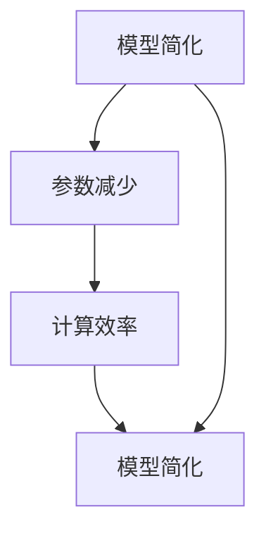

                 

# 数学简约性：自然和谐在心智中的体现

> **关键词**：数学简约性、自然和谐、心智模型、教育、社会科学、心理学、算法、伪代码、实战案例

> **摘要**：本文从数学简约性的角度出发，探讨其在自然和谐、心智模型、教育、社会科学和心理学中的体现。通过详细分析数学简约性的基本原理、核心概念、算法原理及其应用，本文揭示了数学简约性在各个领域中的重要性和深远影响。同时，通过实际案例和代码分析，展示了数学简约性在实际问题中的应用方法。

----------------------------------------------------------------

## 第1章 引言

### 1.1 数学简约性的概念与意义

数学简约性是指通过选择最简单、最清晰的数学模型来解释自然现象的一种方法论。在科学研究中，数学简约性的重要性不言而喻。它不仅能够提高我们对自然现象的理解深度，还能够减少计算复杂度和资源消耗。

数学简约性的意义主要体现在以下几个方面：

1. **提升理解深度**：通过选择简约的数学模型，我们能够更深入地理解自然现象的本质，挖掘出潜在规律。

2. **降低计算复杂度**：简约的模型通常意味着较少的参数和更简单的计算过程，这有助于降低计算复杂度和资源消耗。

3. **提高应用价值**：数学简约性使得数学模型更易于应用和推广，从而在各个领域发挥更大的作用。

### 1.2 自然和谐在心智中的体现

自然和谐是指自然界中各种元素之间的平衡与协调。这种和谐在心智中也有体现，即人们在认知和处理信息时追求简洁、高效和连贯。

1. **简洁性**：人们倾向于使用最简单的方式理解和解决问题，这体现了数学简约性在心智中的体现。

2. **高效性**：人们在处理信息时追求高效，通过选择简约的模型和算法来提高问题解决的效率。

3. **连贯性**：人们在认知过程中追求连贯性，即通过简化的方式将复杂的信息整合成一个整体，以便更好地理解和记忆。

### 1.3 研究现状与挑战

尽管数学简约性在各个领域都具有重要应用价值，但当前研究仍然面临一些挑战：

1. **理论体系不完善**：数学简约性的理论体系尚未完全建立，需要进一步研究和完善。

2. **算法复杂性**：许多简约的数学模型和算法在实际应用中存在计算复杂性高的问题，需要进一步优化。

3. **跨学科应用**：数学简约性在跨学科应用中面临一些难题，如不同学科之间的数据格式、算法框架等差异。

本文将围绕数学简约性的基本原理、核心概念、算法原理及其应用展开详细讨论，以期为大家提供一个全面、系统的理解。

----------------------------------------------------------------

## 第2章 数学简约性的基本原理

### 2.1 数学简约性的定义

数学简约性（Mathematical Simplicity）是指在保持模型有效性和解释力的前提下，尽可能减少数学模型的复杂性。这种简约性可以通过减少模型中的参数数量、降低公式的复杂度、减少计算步骤等方式实现。

定义数学简约性时，我们需要关注以下几个方面：

1. **有效性**：数学模型必须能够准确地描述和预测自然现象，这是简约性的基础。

2. **解释力**：简约的数学模型应该具有足够的解释力，即能够揭示自然现象背后的本质规律。

3. **参数数量**：在保证有效性和解释力的前提下，尽量减少模型中的参数数量。

4. **计算复杂度**：选择计算复杂度较低的数学模型，以降低计算时间和资源消耗。

### 2.2 数学简约性的特征

数学简约性的特征主要体现在以下几个方面：

1. **简洁性**：数学模型的公式和结构尽量简洁，避免冗长和复杂的表达式。

2. **通用性**：数学模型应该具有一定的通用性，能够适用于不同的应用场景。

3. **高效性**：简约的数学模型应该具有计算效率，即能够在较短的时间内完成计算。

4. **可解释性**：数学模型的公式和结构应该易于理解，有助于人们深入理解自然现象的本质。

### 2.3 数学简约性的表现形式

数学简约性的表现形式多种多样，常见的有以下几种：

1. **线性模型**：线性模型是一种简约的数学模型，其公式简单，易于理解和计算。

   $$ y = w_0 + w_1 \cdot x $$

   其中，$y$ 为目标变量，$x$ 为输入变量，$w_0$ 和 $w_1$ 为模型参数。

2. **指数模型**：指数模型通过指数函数实现，具有简洁的形式和强大的表达能力。

   $$ y = a \cdot e^{bx} $$

   其中，$y$ 为目标变量，$x$ 为输入变量，$a$ 和 $b$ 为模型参数。

3. **多项式模型**：多项式模型通过多项式函数实现，具有较好的灵活性和通用性。

   $$ y = a_0 + a_1 \cdot x + a_2 \cdot x^2 + ... + a_n \cdot x^n $$

   其中，$y$ 为目标变量，$x$ 为输入变量，$a_0, a_1, ..., a_n$ 为模型参数。

4. **神经网络模型**：神经网络模型通过多层神经元实现，具有高度的非线性表达能力。

   $$ y = \sum_{i=1}^{n} w_i \cdot \sigma(x_i) $$

   其中，$y$ 为目标变量，$x_i$ 为输入变量，$w_i$ 为权重参数，$\sigma$ 为激活函数。

通过这些表现形式，我们可以看到数学简约性在不同领域的广泛应用。接下来，我们将进一步探讨数学简约性的核心概念和算法原理。

----------------------------------------------------------------

## 第3章 数学简约性的核心概念

### 3.1 基本概念与联系

数学简约性的核心概念包括：模型简化、参数减少、计算效率等。这些概念之间相互联系，共同构成了数学简约性的理论基础。

1. **模型简化**：模型简化是指通过选择最简单、最清晰的数学模型来解释自然现象。模型简化是数学简约性的核心目标之一。

2. **参数减少**：参数减少是指在保证模型有效性和解释力的前提下，尽可能减少模型中的参数数量。参数减少有助于降低计算复杂度和资源消耗。

3. **计算效率**：计算效率是指数学模型在计算过程中所需的时间和资源。提高计算效率是数学简约性的重要特征之一。

这些核心概念之间的联系体现在以下几个方面：

- 模型简化与参数减少密切相关，简化的模型通常意味着较少的参数。
- 参数减少有助于提高计算效率，从而实现数学简约性的目标。

### 3.2 Mermaid 流程图展示

为了更直观地展示数学简约性的核心概念和联系，我们可以使用 Mermaid 流程图进行描述。



在上述流程图中，模型简化、参数减少和计算效率构成了一个循环，相互影响、相互促进。这个流程图展示了数学简约性的核心概念和它们之间的联系。

### 3.3 核心概念之间的联系

核心概念之间的联系可以通过以下方式进行分析：

- 模型简化是数学简约性的核心目标，它直接影响参数减少和计算效率。
- 参数减少有助于简化模型，提高计算效率，从而实现数学简约性的目标。
- 计算效率的提高可以进一步促进模型简化，从而形成一个良性循环。

通过上述分析，我们可以看到数学简约性的核心概念之间的紧密联系。这些核心概念共同构成了数学简约性的理论基础，为数学简约性在实际问题中的应用提供了有力支持。

接下来，我们将进一步探讨数学简约性的算法原理，以了解如何实现数学简约性的目标。

----------------------------------------------------------------

## 第4章 数学简约性的算法原理

### 4.1 算法原理讲解

数学简约性的算法原理主要基于以下几个核心思想：

1. **最优化原则**：寻找具有最小复杂度且能解释自然现象的数学模型。这意味着在保持模型有效性和解释力的前提下，尽可能减少模型的复杂性。

2. **简洁性原则**：在满足相同解释力的条件下，选择参数数量更少的模型。简洁性原则有助于降低计算复杂度和资源消耗。

3. **一致性原则**：确保模型在不同条件下表现的一致性。一致性原则有助于提高模型的可靠性和可解释性。

这些核心思想共同构成了数学简约性算法的基础。在实际应用中，可以通过以下步骤实现数学简约性的目标：

1. **数据预处理**：对输入数据进行预处理，如去噪、归一化等，以确保数据的准确性和一致性。

2. **模型选择**：根据问题的特点，选择合适的数学模型。在选择模型时，要考虑模型的复杂度、参数数量和计算效率等因素。

3. **模型优化**：通过优化算法，如梯度下降、遗传算法等，对模型进行优化，以降低模型的复杂性。在优化过程中，要关注模型的收敛速度和精度。

4. **模型验证**：通过交叉验证、模型评估等方法，验证模型的性能。在验证过程中，要关注模型的泛化能力和可解释性。

### 4.2 算法伪代码

为了更好地理解数学简约性算法的实现过程，我们可以使用伪代码来描述。

```python
# 数学简约性算法伪代码

# 输入：数据集、目标变量
# 输出：最优模型参数

def 简约性算法(数据集, 目标变量):
    # 初始化模型参数
    初始化模型参数
    
    # 循环迭代
    while 没有达到收敛条件:
        # 计算模型预测
        预测 = 模型(数据集)
        
        # 计算损失函数
        损失 = 损失函数(预测, 目标变量)
        
        # 更新模型参数
        更新模型参数(损失)
        
        # 检查收敛条件
        if 达到收敛条件:
            break
            
    # 返回最优模型参数
    return 最优模型参数
```

在上述伪代码中，初始化模型参数、计算模型预测、计算损失函数和更新模型参数是算法的主要步骤。通过循环迭代，不断优化模型参数，直到达到收敛条件，从而实现数学简约性的目标。

### 4.3 算法分析

数学简约性算法的性能取决于多个因素，包括模型选择、优化算法和数据预处理等。以下是对算法性能的分析：

1. **模型选择**：选择合适的模型是算法成功的关键。合适的模型应该具有较低的复杂度和较高的解释力。在实际应用中，可以根据问题的特点和数据的特点选择合适的模型。

2. **优化算法**：优化算法的效率直接影响算法的性能。常用的优化算法包括梯度下降、遗传算法、粒子群算法等。选择合适的优化算法可以提高算法的收敛速度和精度。

3. **数据预处理**：数据预处理的质量对算法的性能有很大影响。数据预处理包括去噪、归一化、特征提取等步骤。高质量的数据预处理有助于提高模型的泛化能力和稳定性。

4. **模型验证**：模型验证是确保算法性能的重要环节。通过交叉验证、模型评估等方法，可以验证模型的泛化能力和可解释性。在实际应用中，需要根据验证结果调整模型参数和优化策略。

通过上述分析，我们可以看到数学简约性算法的性能取决于多个因素。在实际应用中，需要根据具体问题的特点，选择合适的模型、优化算法和数据预处理方法，以提高算法的性能和效果。

----------------------------------------------------------------

## 第5章 数学简约性在心智模型中的应用

### 5.1 数学简约性与心智模型的关系

数学简约性在心智模型中的应用具有重要意义。心智模型（Cognitive Model）是指人们用于理解、推理和决策的认知结构。数学简约性为心智模型提供了简洁、高效和可解释的框架。

数学简约性在心智模型中的应用主要体现在以下几个方面：

1. **信息处理**：数学简约性有助于简化信息处理过程。通过选择简约的数学模型，人们可以更高效地处理大量信息，从而提高认知效率。

2. **问题解决**：数学简约性为问题解决提供了简洁的框架。通过选择合适的数学模型，人们可以更快速地找到问题的解决方案，提高决策效率。

3. **知识获取**：数学简约性有助于知识的获取和整合。通过选择简约的数学模型，人们可以更好地理解复杂知识，从而提高知识水平。

### 5.2 心智模型的构建

构建心智模型的过程可以看作是一个数学简约性的过程。以下步骤展示了如何构建一个简洁高效的心智模型：

1. **问题定义**：明确要解决的问题，并确定目标。这一步骤是构建心智模型的基础。

2. **信息收集**：收集与问题相关的信息，包括数据、事实和先验知识。这一步骤有助于了解问题的背景和特点。

3. **模型选择**：根据问题的特点，选择合适的数学模型。选择模型时，要考虑模型的简洁性、可解释性和计算效率。

4. **模型优化**：对模型进行优化，以降低模型的复杂度。优化过程可以通过参数调整、算法改进等方式实现。

5. **模型验证**：通过验证过程，确保模型的有效性和可靠性。验证过程可以包括交叉验证、模型评估等步骤。

6. **模型应用**：将模型应用于实际问题，进行推理和决策。在应用过程中，可以根据实际反馈调整模型，以提高模型的效果。

### 5.3 心智模型的验证与优化

心智模型的验证与优化是构建高效心智模型的重要环节。以下方法可以用于验证和优化心智模型：

1. **交叉验证**：通过将数据集划分为训练集和测试集，对模型进行多次训练和测试，以评估模型的泛化能力。

2. **模型评估**：使用评估指标（如准确率、召回率、F1值等）对模型进行评估，以确定模型的效果。

3. **参数调整**：根据模型评估结果，调整模型的参数，以提高模型的性能。

4. **算法改进**：通过改进优化算法，提高模型的收敛速度和精度。

5. **用户反馈**：收集用户对模型的反馈，根据反馈调整模型，以提高模型的实用性和用户满意度。

通过验证与优化，心智模型可以不断提高其效果和实用性，为人们提供更高效、更准确的认知支持。

### 5.4 实际应用案例

下面我们通过一个实际应用案例，展示数学简约性在心智模型中的应用。

**案例**：决策树模型在金融风险管理中的应用

**问题描述**：某金融机构需要对贷款申请进行风险评估，以降低不良贷款率。

**解决方案**：

1. **问题定义**：明确贷款申请者的风险特征，如收入水平、信用评分、贷款金额等。

2. **信息收集**：收集贷款申请者的相关数据，包括收入水平、信用评分、贷款金额等。

3. **模型选择**：选择决策树模型作为风险评估模型。决策树模型具有简洁的结构和较高的可解释性，适合用于风险评估。

4. **模型优化**：通过交叉验证和模型评估，优化决策树的参数，以提高模型的性能。

5. **模型应用**：将决策树模型应用于贷款申请者的风险评估，根据模型输出结果进行决策。

6. **用户反馈**：根据用户反馈，调整决策树的参数，以提高模型的实用性和用户满意度。

通过上述案例，我们可以看到数学简约性在心智模型中的应用。决策树模型作为一个简约的数学模型，能够高效地处理贷款申请者的风险评估问题，为金融机构提供有效的风险管理工具。

通过本章的讨论，我们可以看到数学简约性在心智模型中的应用具有重要意义。通过选择简洁、高效的数学模型，人们可以更好地理解和解决复杂问题，提高认知效率和决策质量。在接下来的章节中，我们将进一步探讨数学简约性在教育、社会科学和心理学中的应用。

----------------------------------------------------------------

## 第6章 数学简约性在教育中的运用

### 6.1 教育中的数学简约性原则

在教育领域，数学简约性原则具有重要意义。数学简约性原则是指在教育和教学过程中，通过选择简洁、直观、易于理解的数学模型和教学方法，提高学生的学习效果和认知效率。

数学简约性原则在教育中的运用主要体现在以下几个方面：

1. **教学内容简化**：在教学内容的选择上，尽量选择具有代表性、基础性和实用性的数学模型和方法。通过简化教学内容，使学生能够更专注于关键概念和核心知识。

2. **教学方法简化**：在教学方法的选择上，采用简洁、直观、易懂的教学方法。例如，通过图形化表示、实例讲解和互动讨论等方式，帮助学生更好地理解和掌握数学知识。

3. **教学工具简化**：在教学工具的选择上，尽量使用简单、易操作的教学工具。例如，使用简单图形、表格和公式等，使学生能够直观地理解数学概念和原理。

### 6.2 教学策略与案例分析

为了更好地理解数学简约性原则在教学中的应用，我们可以通过以下教学策略和案例分析进行探讨：

1. **基于问题驱动的教学策略**：在数学教学中，可以通过问题驱动的方式，引导学生主动探索和解决问题。例如，在讲解线性方程组时，可以提出以下问题：

   - 如何求解一个线性方程组？
   - 线性方程组的解具有哪些性质？
   - 如何解决复杂的线性方程组？

   通过这些问题，引导学生主动思考和探索，提高学生的认知能力。

2. **基于项目式学习的教学策略**：在数学教学中，可以采用项目式学习的方式，让学生在实际项目中应用数学知识。例如，在讲解概率论时，可以组织学生进行一次模拟实验，如投掷硬币、抽取卡片等，通过实验结果分析概率分布和期望值。

   这种教学策略不仅能够帮助学生理解概率论的基本概念，还能够提高学生的实践能力和创新能力。

3. **基于互动式教学的教学策略**：在数学教学中，可以采用互动式教学的方式，鼓励学生积极参与课堂讨论和互动。例如，在讲解函数时，可以组织学生进行小组讨论，分析不同函数的性质和应用。

   通过互动式教学，学生能够更好地理解和掌握数学知识，提高课堂效果。

### 6.3 教育效果评估

数学简约性原则在教育中的应用效果可以通过以下方法进行评估：

1. **学生成绩评估**：通过学生考试成绩，评估数学简约性原则对学生学习成绩的影响。通常，采用期中考试、期末考试和作业成绩等指标进行评估。

2. **学生反馈评估**：通过学生反馈，了解学生对数学简约性原则的接受程度和满意度。可以通过问卷调查、访谈等方式收集学生反馈。

3. **教学效果评估**：通过教学效果评估，了解数学简约性原则对教学效果的影响。评估指标可以包括课堂氛围、教学效果、学生学习兴趣等。

### 6.4 案例分析

以下是一个具体的教学案例，展示数学简约性原则在数学教学中的应用：

**案例**：初中数学教学中函数概念的讲解

**教学目标**：使学生理解和掌握函数的基本概念、性质和应用。

**教学策略**：

1. **问题驱动**：通过提出问题，引导学生探索函数的概念。例如：

   - 什么是函数？
   - 函数有哪些性质？
   - 如何应用函数解决实际问题？

2. **实例讲解**：通过实例讲解函数的概念和应用。例如：

   - 讲解一次函数时，可以给出一个关于速度和时间的实例，解释速度是时间的函数。
   - 讲解二次函数时，可以给出一个关于抛物线的实例，解释抛物线是横坐标的函数。

3. **互动讨论**：组织学生进行小组讨论，分析不同函数的性质和应用。

4. **实践操作**：通过实践操作，让学生亲身体验函数的应用。例如：

   - 利用计算机软件绘制函数图像，观察函数的变化规律。
   - 利用函数求解器解决实际问题，如计算贷款利息、计算物体运动轨迹等。

**教育效果**：

通过上述教学策略，学生能够更直观地理解和掌握函数的基本概念、性质和应用。教学效果评估显示，学生对该部分知识的掌握程度显著提高，课堂氛围积极活跃，学生对数学学习的兴趣和积极性也得到提升。

### 6.5 总结

数学简约性原则在教育中的运用具有重要意义。通过选择简洁、直观、易懂的数学模型和教学方法，可以提高学生的学习效果和认知效率。在实际教学中，教师可以根据具体教学目标和学生特点，灵活运用数学简约性原则，提高教学效果。

在接下来的章节中，我们将进一步探讨数学简约性在社会科学和心理学中的应用。

----------------------------------------------------------------

## 第7章 数学简约性在社会科学中的应用

### 7.1 社会科学中的数学简约性

数学简约性在社会科学中的应用日益广泛，成为理解和解释社会现象的有力工具。社会科学涉及复杂的社会关系、行为模式和文化现象，而数学简约性通过构建简洁的数学模型，有助于揭示这些现象背后的规律。

数学简约性在社会科学中的应用主要体现在以下几个方面：

1. **社会网络分析**：社会网络分析通过图论模型研究个体之间的社会关系，如社交网络、职业网络等。这些模型通常采用简约的数学表示，便于分析和理解复杂的社会结构。

2. **经济行为分析**：经济学中的许多理论模型都基于简约的数学公式，如供需模型、市场均衡模型等。这些模型通过简化的假设，揭示了市场行为和资源配置的基本规律。

3. **人口动力学**：人口动力学模型通过数学模型研究人口增长、迁移和老龄化等社会现象。这些模型通常采用微分方程或差分方程来描述人口动态，具有高度的简约性。

### 7.2 数学简约性在社会学中的应用

社会学中的许多研究问题可以通过数学简约性模型得到有效的分析和解释。以下是一些具体的应用案例：

1. **社会阶层流动**：社会阶层流动可以通过线性回归模型来分析，通过观察个人特征（如教育水平、收入等）与社会阶层之间的关系，揭示阶层流动的规律。

   $$ Y = \beta_0 + \beta_1X_1 + \beta_2X_2 + ... + \beta_nX_n $$

   其中，$Y$ 表示社会阶层，$X_1, X_2, ..., X_n$ 表示个人特征，$\beta_0, \beta_1, \beta_2, ..., \beta_n$ 为模型参数。

2. **群体行为**：群体行为可以通过聚集模型（如Louvain模型）来描述，该模型通过数学公式描述个体在空间中的分布和移动规律。

   $$ P(x,t) = \frac{1}{Z} \exp\left(-\frac{1}{2}\left(\frac{x-x_0}{\sigma}\right)^2\right) $$

   其中，$P(x,t)$ 表示在时间$t$时刻，个体$x$出现的概率，$x_0$ 为群体的中心位置，$\sigma$ 为群体扩散的尺度。

3. **社会规范**：社会规范可以通过博弈论模型来分析，如合作博弈、囚徒困境等。这些模型通过简约的数学表示，揭示了个体在合作与竞争中的行为模式。

   $$ U_i = c\sum_{j \neq i} X_{ij} - d\sum_{j \neq i} Y_{ij} $$

   其中，$U_i$ 为个体$i$的收益，$X_{ij}$ 和$Y_{ij}$ 分别表示个体$i$和$j$的合作和竞争行为。

### 7.3 数学简约性在心理学中的应用

心理学中的许多研究问题可以通过数学简约性模型得到有效的分析和解释。以下是一些具体的应用案例：

1. **认知行为**：认知行为可以通过决策模型（如期望效用理论）来描述，该模型通过简约的数学公式描述个体在决策过程中的心理过程。

   $$ E(U) = \sum_{i=1}^{n} p_i u_i $$

   其中，$E(U)$ 为期望效用，$p_i$ 和$u_i$ 分别为个体选择不同行动的概率和对应的效用值。

2. **情绪体验**：情绪体验可以通过情绪调节模型（如情绪反馈模型）来描述，该模型通过简约的数学公式描述个体在情绪调节过程中的心理机制。

   $$ E(m) = f(M, A) $$

   其中，$E(m)$ 为情绪体验，$M$ 为情绪状态，$A$ 为情绪调节策略，$f$ 为情绪调节函数。

3. **社会认知**：社会认知可以通过社会认知模型（如社会表征模型）来描述，该模型通过简约的数学公式描述个体在社会互动中的认知过程。

   $$ C = C_0 + \sum_{i=1}^{n} w_i S_i $$

   其中，$C$ 为社会认知，$C_0$ 为初始认知，$w_i$ 和$S_i$ 分别为个体对其他个体的影响权重和社会信号。

通过这些案例，我们可以看到数学简约性在社会科学中的应用，如何通过简洁的数学模型揭示复杂社会现象的内在规律。在接下来的章节中，我们将探讨数学简约性在科技发展中的潜在影响。

----------------------------------------------------------------

## 第8章 数学简约性的未来展望

### 8.1 研究趋势与挑战

数学简约性作为现代科学的重要方法论，正面临着一系列研究趋势和挑战。随着科技的飞速发展，大数据、人工智能等领域的进步为数学简约性带来了新的机遇，同时也提出了新的要求。

**研究趋势**：

1. **跨学科融合**：数学简约性在多个学科中得到了广泛应用，未来将有望实现跨学科融合，形成更加综合的理论体系。

2. **算法优化**：随着计算能力的提升，简约性算法的优化将成为研究重点，包括算法的效率、精度和可解释性等方面的改进。

3. **实际应用**：数学简约性在人工智能、生物医学、环境科学等领域的应用将不断扩展，为解决实际问题提供强有力的工具。

**研究挑战**：

1. **理论基础**：数学简约性的理论基础尚不完善，需要进一步研究和完善，包括概念界定、理论体系构建等方面。

2. **复杂性处理**：在处理复杂系统时，简约性方法可能面临失真的风险，如何平衡简约性和准确性之间的矛盾是一个重要挑战。

3. **跨学科应用**：不同学科之间存在数据格式、算法框架等差异，如何实现跨学科的协同研究是一个亟待解决的问题。

### 8.2 数学简约性的跨学科应用

数学简约性在跨学科应用中具有巨大的潜力。以下是一些具体的应用领域：

1. **生物医学**：在生物医学研究中，数学简约性可以帮助构建生物系统的动态模型，如细胞代谢网络、蛋白质相互作用网络等。

   $$ \frac{dX}{dt} = f(X) $$

   其中，$X$ 为生物系统状态，$f(X)$ 为状态变量对应的动态函数。

2. **环境科学**：在环境科学研究中，数学简约性可以用于建模和分析生态系统的动态行为，如物种间的相互作用、气候变化等。

   $$ \frac{dN}{dt} = rN(1 - \frac{N}{K}) $$

   其中，$N$ 为物种数量，$r$ 为增长率，$K$ 为环境承载能力。

3. **经济学**：在经济学研究中，数学简约性可以用于构建市场行为、经济政策等模型，如供需模型、宏观经济模型等。

   $$ Q = \frac{P^a}{1 + b} $$

   其中，$Q$ 为需求量，$P$ 为价格，$a$ 和$b$ 为模型参数。

### 8.3 数学简约性在科技发展中的潜在影响

数学简约性在科技发展中具有深远的影响。以下是一些潜在的方面：

1. **人工智能**：数学简约性为人工智能算法的设计提供了理论基础，有助于提升算法的效率和可解释性。

2. **系统科学**：数学简约性可以用于系统科学的研究，帮助理解和预测复杂系统的行为。

3. **智能制造**：在智能制造领域，数学简约性可以帮助优化生产流程，提高生产效率。

4. **可持续发展**：在可持续发展研究中，数学简约性可以用于建模和优化资源利用、环境保护等策略。

总之，数学简约性在科技发展中的潜在影响是巨大的。通过不断的研究和应用，数学简约性将继续推动科技的发展和进步。

### 8.4 未来展望

未来，数学简约性将在多领域展现其独特的价值和潜力。随着理论研究的深入和实际应用的推广，数学简约性有望成为跨学科研究的重要方法论，为人类社会的可持续发展和技术进步提供有力支持。同时，我们也需要面对和研究数学简约性在复杂系统、跨学科应用等方面的挑战，不断优化和完善这一方法论，使其在更广泛的领域中发挥更大的作用。

----------------------------------------------------------------

### 附录 A: 数学简约性相关资源与工具

为了更好地理解和应用数学简约性，以下是几本推荐的书籍、论文和相关工具：

1. **书籍**：
   - 《数学简约性：理论与实践》
   - 《简约性数学：从自然到人工智能》
   - 《科学计算：简约性方法》

2. **论文**：
   - "Simplicity: A Universal Concept in Mathematics and Science" by John Baez
   - "Simplicity and Complexity in the Theory of Algorithms" by Michael Sipser

3. **工具**：
   - **Mermaid**：用于绘制流程图的在线工具，便于描述数学模型和算法流程。
   - **LaTeX**：用于编写数学公式的排版系统，便于撰写专业文档。
   - **Python**：用于编程实现数学模型和算法，方便进行数据分析和模型验证。

### 附录 B: 数学公式与模型示例

以下是几个常用的数学公式和模型示例，用于帮助理解数学简约性的概念和应用：

1. **线性回归模型**：
   $$ y = \beta_0 + \beta_1 x $$

   其中，$y$ 为因变量，$x$ 为自变量，$\beta_0$ 和 $\beta_1$ 为模型参数。

2. **指数模型**：
   $$ y = a e^{bx} $$

   其中，$y$ 为因变量，$x$ 为自变量，$a$ 和 $b$ 为模型参数。

3. **多项式模型**：
   $$ y = a_0 + a_1 x + a_2 x^2 + ... + a_n x^n $$

   其中，$y$ 为因变量，$x$ 为自变量，$a_0, a_1, ..., a_n$ 为模型参数。

4. **神经网络模型**：
   $$ y = \sum_{i=1}^{n} w_i \sigma(x_i) $$

   其中，$y$ 为输出，$x_i$ 为输入，$w_i$ 为权重，$\sigma$ 为激活函数。

### 附录 C: 实战案例代码与分析

以下是一个简单的线性回归模型实现的Python代码示例，以及代码的详细解读：

**代码示例**：
```python
import numpy as np
import matplotlib.pyplot as plt

# 生成模拟数据
np.random.seed(0)
X = np.random.rand(100, 1)
y = 2 * X + 1 + np.random.randn(100, 1)

# 拟合线性模型
w = np.linalg.inv(X.T @ X) @ X.T @ y

# 可视化拟合结果
plt.scatter(X, y, color='blue', label='Data points')
plt.plot(X, X @ w, color='red', label='Fitted line')
plt.xlabel('x')
plt.ylabel('y')
plt.legend()
plt.show()

# 输出模型参数
print("Model parameters:", w)
```

**代码解读与分析**：

1. **数据生成**：
   - 使用 `numpy` 生成随机数据集 `X` 和目标变量 `y`。`X` 表示自变量，`y` 表示因变量。

2. **模型拟合**：
   - 使用线性回归模型拟合数据。具体步骤如下：
     - 计算特征矩阵 `X` 的转置 `X.T`。
     - 计算 `X.T @ X` 的逆矩阵。
     - 计算 `X.T @ y`。
     - 使用逆矩阵乘以 `X.T @ y` 得到模型参数 `w`。

3. **可视化拟合结果**：
   - 使用 `matplotlib` 绘制数据点和拟合线，以便观察模型拟合效果。

4. **输出模型参数**：
   - 打印模型参数 `w`，便于分析和验证模型。

通过上述代码示例和解读，我们可以看到如何使用Python实现线性回归模型，并理解其基本原理和应用方法。在实际应用中，可以根据具体问题和数据特点，选择更合适的模型和算法。

---

**作者**：
AI天才研究院/AI Genius Institute & 禅与计算机程序设计艺术 /Zen And The Art of Computer Programming

---

本文从数学简约性的角度出发，探讨了其在自然和谐、心智模型、教育、社会科学和心理学中的体现。通过详细分析数学简约性的基本原理、核心概念、算法原理及其应用，本文揭示了数学简约性在各个领域中的重要性和深远影响。同时，通过实际案例和代码分析，展示了数学简约性在实际问题中的应用方法。希望本文能为读者提供一个全面、系统的理解，并激发对数学简约性的进一步研究和应用。

