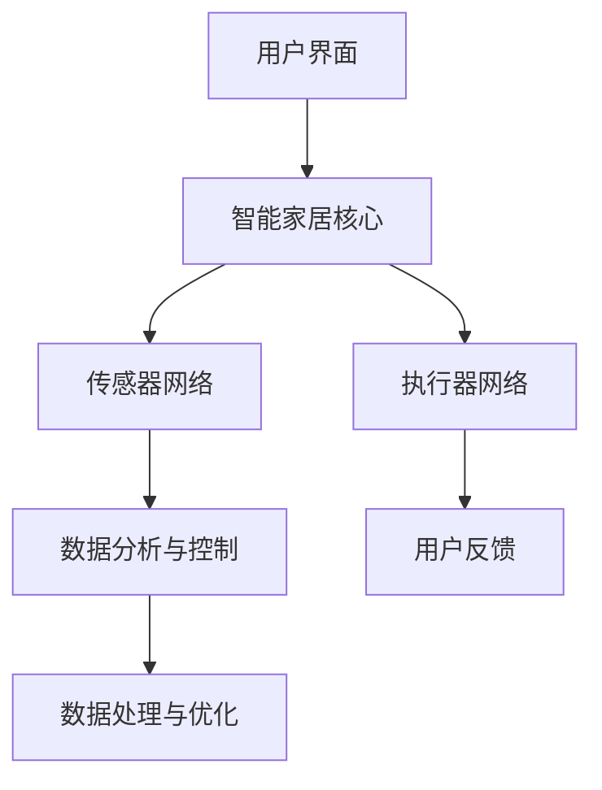

                 

# 《智能家居的智能控制与注意力管理》

## 关键词
- 智能家居
- 智能控制
- 注意力管理
- 物联网
- 实时监控
- 数据处理
- 系统架构

## 摘要
随着物联网技术的快速发展，智能家居系统已经成为现代家庭生活的重要组成部分。本文旨在探讨智能家居系统中智能控制与注意力管理的核心概念、技术原理及实际应用。通过深入分析智能家居系统架构，本文详细介绍了智能控制算法、注意力管理模型以及智能家居系统在实际应用中的具体案例。文章还展望了智能家居的未来发展趋势，探讨了面临的挑战和机遇。本文旨在为读者提供一个全面的技术视角，帮助理解和掌握智能家居系统设计的要点。

### 《智能家居的智能控制与注意力管理》目录大纲

#### 第一部分：智能家居概述

- 第1章：智能家居简介
  - 1.1 智能家居的发展历程
  - 1.2 智能家居的分类
  - 1.3 智能家居的市场现状与趋势

#### 第二部分：智能控制技术

- 第2章：智能控制基础
  - 2.1 智能控制系统的组成
  - 2.2 智能控制算法
  - 2.3 智能控制系统的设计与实现

#### 第三部分：注意力管理

- 第3章：注意力管理原理
  - 3.1 注意力的定义与特征
  - 3.2 注意力管理的理论模型
  - 3.3 注意力管理的应用场景

#### 第四部分：智能家居的实际应用

- 第4章：智能照明控制
  - 4.1 智能照明系统概述
  - 4.2 智能照明系统的设计
  - 4.3 智能照明系统的实现

- 第5章：智能安防系统
  - 5.1 智能安防系统概述
  - 5.2 智能安防系统的设计
  - 5.3 智能安防系统的实现

- 第6章：智能家电控制
  - 6.1 智能家电概述
  - 6.2 智能家电的控制技术
  - 6.3 智能家电的设计与实现

#### 第五部分：智能家居系统的综合管理

- 第7章：智能家居系统综合管理
  - 7.1 智能家居系统综合管理的必要性
  - 7.2 智能家居系统综合管理的方法
  - 7.3 智能家居系统综合管理的实施

#### 第六部分：案例分析

- 第8章：智能家居案例研究
  - 8.1 案例背景介绍
  - 8.2 案例系统设计
  - 8.3 案例实现过程
  - 8.4 案例效果评估

#### 第七部分：展望与未来

- 第9章：智能家居的发展趋势与展望
  - 9.1 智能家居技术的发展方向
  - 9.2 智能家居产业的未来发展
  - 9.3 智能家居的未来愿景

#### 附录

- 附录A：智能家居开发工具与资源

### 第一部分：智能家居概述

#### 第1章：智能家居简介

##### 1.1 智能家居的发展历程

智能家居，作为物联网（IoT）技术的一部分，其发展历程可以追溯到20世纪80年代。早期的智能家居系统主要依赖于有线通信技术，如RS-485、TCP/IP等，通过这些技术实现家庭设备之间的简单互联互通。这一阶段的智能家居系统功能较为有限，主要集中于家庭安全监控、照明控制和家电控制等方面。

随着无线通信技术的迅速发展，特别是WiFi、蓝牙等无线技术的普及，智能家居系统逐渐进入了无线化、智能化的新阶段。这一阶段的智能家居系统不仅具备更强大的互联互通能力，还能够通过云计算、大数据等技术实现更加智能化的控制和优化。

近年来，随着人工智能、物联网技术的不断进步，智能家居系统已经逐步实现了自动化、个性化的服务。例如，通过智能音箱控制家中的所有智能设备，通过智能摄像头实时监控家庭安全等。智能家居系统的不断发展，使得人们的生活变得更加便捷、舒适。

##### 1.2 智能家居的分类

智能家居可以从不同的角度进行分类。以下是几种常见的分类方式：

- **按照功能分类**：智能家居系统可以按照其功能划分为智能照明、智能安防、智能家电、智能环境控制等。每种功能的智能家居系统都具有特定的功能和实现方式。

  - **智能照明**：通过智能控制系统调节灯光的亮度、颜色和开关状态，实现节能、舒适、安全的生活环境。
  - **智能安防**：利用传感器、摄像头等技术实现家庭安全的实时监控，包括入侵检测、火灾报警、紧急求助等功能。
  - **智能家电**：通过智能控制系统实现对空调、冰箱、洗衣机等家电的远程控制、定时开关、能耗监测等功能。
  - **智能环境控制**：通过智能控制系统调节室内温度、湿度、空气质量等环境参数，实现舒适、健康的生活环境。

- **按照应用场景分类**：智能家居系统可以按照其应用场景划分为家庭、商业、公共设施等。

  - **家庭**：为家庭提供舒适、安全、便捷的生活环境，是智能家居系统的主要应用场景。
  - **商业**：在酒店、办公楼、商场等商业场所中，智能家居系统可以提供智能化的管理和服务，提升用户体验。
  - **公共设施**：在公园、学校、医院等公共设施中，智能家居系统可以提供智能化的管理和维护，提高运营效率。

- **按照通信技术分类**：智能家居系统可以按照其采用的通信技术分为有线智能家居和无线智能家居。

  - **有线智能家居**：通过有线通信技术（如TCP/IP、RS-485等）实现设备之间的互联互通，具有稳定性高、抗干扰能力强等特点。
  - **无线智能家居**：通过无线通信技术（如WiFi、蓝牙、ZigBee等）实现设备之间的互联互通，具有安装方便、扩展性强等特点。

##### 1.3 智能家居的市场现状与趋势

随着物联网技术的快速发展，智能家居市场呈现出快速增长的趋势。根据市场研究机构的数据显示，全球智能家居市场规模已从2010年的不到10亿美元增长到2020年的超过500亿美元。预计未来几年，智能家居市场仍将保持高速增长，到2025年市场规模有望达到1000亿美元以上。

- **市场现状**：

  - **市场规模**：全球智能家居市场规模逐年扩大，已覆盖照明、安防、家电、环境控制等多个领域。
  - **市场分布**：智能家居市场主要分布在北美、欧洲和亚洲等地区，其中北美市场占比最高，亚洲市场增长最快。
  - **市场特点**：智能家居市场呈现出多元化、个性化、智能化的特点，各种新技术、新产品不断涌现。

- **市场趋势**：

  - **技术趋势**：人工智能、大数据、云计算等新兴技术的应用将推动智能家居系统的智能化水平不断提高。
  - **应用趋势**：智能家居系统将在更多应用场景中发挥作用，如智慧家庭、智慧酒店、智慧社区等。
  - **发展模式**：智能家居市场将呈现生态化、平台化、服务化的发展模式，企业之间将加强合作，共同推动智能家居市场的健康发展。

##### 1.4 智能家居的价值与挑战

智能家居系统为家庭生活带来了诸多便利，具有显著的经济和社会价值。以下是智能家居系统的几大价值：

- **提高生活质量**：智能家居系统可以通过智能控制、自动化等功能，为家庭提供舒适、安全、便捷的生活环境，提高居民的生活质量。
- **降低生活成本**：智能家居系统可以通过节能、优化管理等措施，降低家庭的能源消耗和运营成本，提高经济效益。
- **提升安全性**：智能家居系统可以通过实时监控、报警等功能，提高家庭的安全防护能力，减少财产损失和安全风险。
- **促进产业升级**：智能家居系统的发展将带动相关产业的技术创新和产业升级，推动智能家居产业链的快速发展。

然而，智能家居系统在发展过程中也面临着一系列挑战：

- **技术难题**：智能家居系统涉及多种技术，如物联网、人工智能、大数据等，技术实现难度较高。
- **数据隐私**：智能家居系统需要采集和处理大量用户数据，数据隐私和安全问题成为亟待解决的问题。
- **标准规范**：智能家居系统缺乏统一的标准和规范，导致产品兼容性和互操作性差。
- **用户体验**：智能家居系统的用户体验和易用性有待提高，用户接受度和满意度需要进一步提升。

总之，智能家居系统具有巨大的发展潜力，但在发展过程中也需要克服诸多挑战，才能实现可持续、健康的发展。接下来，我们将深入探讨智能家居系统的智能控制与注意力管理技术，为读者提供更全面的技术视角。

### 第二部分：智能控制技术

#### 第2章：智能控制基础

智能控制是智能家居系统的核心组成部分，它通过利用传感器、控制器和执行器等组件，实现对家庭设备的智能化管理和控制。智能控制系统不仅提高了家庭的便利性和安全性，还带来了显著的节能效果。本章节将介绍智能控制系统的组成、基本控制算法及其设计实现。

##### 2.1 智能控制系统的组成

智能控制系统通常由以下几个主要部分组成：

- **控制器**：控制器是智能控制系统的核心，负责接收传感器采集的数据，并执行相应的控制策略。控制器可以是嵌入式系统、PC机或者云计算平台。

- **传感器**：传感器用于检测家庭环境中的各种参数，如温度、湿度、光照、运动等。传感器将物理信号转换为电信号，为控制器提供实时数据。

- **执行器**：执行器根据控制器的指令执行具体的操作，如开关灯光、调整空调温度、控制家电的开关等。常见的执行器包括电机、开关、阀门等。

- **通信网络**：通信网络负责传感器、控制器和执行器之间的数据传输，实现系统各部分的互联互通。常见的通信网络包括有线网络（如TCP/IP、RS-485）和无线网络（如WiFi、蓝牙、ZigBee）。

##### 2.2 智能控制算法

智能控制算法是智能控制系统的核心，它决定了系统的控制效果。以下介绍几种常见的智能控制算法：

- **PID控制**：PID控制（比例-积分-微分控制）是最常用的控制算法之一，它通过调整比例、积分和微分三个参数，实现对系统误差的实时纠正。

  - **比例控制**：根据当前误差值调整控制量，误差越大，控制量越大。
  - **积分控制**：根据误差的历史累积值调整控制量，消除稳态误差。
  - **微分控制**：根据误差的变化率调整控制量，提高系统的动态响应速度。

  **PID控制公式**：
  $$
  u(t) = K_p e(t) + K_i \int_{0}^{t} e(t)dt + K_d \frac{de(t)}{dt}
  $$
  其中，$u(t)$为控制量，$e(t)$为误差，$K_p$、$K_i$和$K_d$分别为比例、积分和微分系数。

- **模糊控制**：模糊控制通过将控制过程抽象为模糊逻辑系统，实现对复杂非线性系统的控制。模糊控制不需要精确的数学模型，适用范围广泛。

  - **模糊规则**：根据控制经验和专家知识，定义一系列模糊规则，如“如果温度高，则增加制冷功率”。
  - **模糊推理**：根据传感器的输入值，通过模糊规则进行推理，得到控制输出。

  **模糊控制流程**：
  1. 输入变量模糊化：将输入变量（如温度、湿度等）进行模糊化处理，转化为模糊集合。
  2. 模糊推理：根据模糊规则进行推理，得到中间结果。
  3. 模型输出计算：将模糊推理结果进行解模糊化处理，得到最终的控制输出。

- **遗传算法**：遗传算法是一种基于自然选择和遗传机制的优化算法，适用于复杂优化问题。

  - **初始种群生成**：随机生成一组解，作为初始种群。
  - **适应度评估**：计算每个解的适应度值，适应度值越高，表示解的质量越好。
  - **选择操作**：根据适应度值进行选择操作，选择优质解进入下一代。
  - **交叉操作**：对选择的解进行交叉操作，产生新的解。
  - **变异操作**：对解进行变异操作，增加种群的多样性。

  **遗传算法流程**：
  1. 初始化种群。
  2. 计算适应度。
  3. 选择操作。
  4. 交叉操作。
  5. 变异操作。
  6. 重复上述步骤，直到满足终止条件。

##### 2.3 智能控制系统的设计与实现

智能控制系统的设计实现可以分为以下几个步骤：

- **需求分析**：明确智能家居系统的控制需求，包括控制对象、控制目标、控制策略等。

- **系统架构设计**：根据需求分析，设计智能控制系统的整体架构，包括控制器、传感器、执行器、通信网络等组成部分。

- **硬件选型**：根据系统架构设计，选择合适的硬件设备，如传感器、控制器、执行器等。

- **软件开发**：编写智能控制系统的软件部分，包括控制算法的实现、用户界面的设计、数据通信等。

- **系统集成与调试**：将硬件和软件系统集成在一起，进行系统调试和测试，确保系统正常运行。

- **部署与应用**：将智能控制系统部署到实际环境中，进行应用和推广。

以下是一个智能照明控制系统的实现示例：

**1. 需求分析**：

- 控制对象：室内灯光。
- 控制目标：实现灯光的远程控制、定时控制、根据环境光变化自动调节亮度等。

**2. 系统架构设计**：

- 控制器：使用嵌入式控制器，如ESP8266或ESP32，连接WiFi网络，实现与手机APP的通信。
- 传感器：使用光敏传感器检测环境光强。
- 执行器：使用继电器控制灯光的开关和亮度调节。

**3. 硬件选型**：

- 控制器：ESP32。
- 传感器：光敏传感器（如BH1750）。
- 执行器：继电器（如5V继电器）。

**4. 软件开发**：

- 控制算法：使用PID控制算法实现灯光亮度的自动调节。
- 用户界面：通过手机APP实时监控和远程控制灯光。

**5. 系统集成与调试**：

- 将传感器、控制器和执行器连接在一起，调试系统功能，确保各项操作正常运行。

**6. 部署与应用**：

- 将智能照明控制系统部署到实际家庭中，用户可以通过手机APP随时控制灯光。

通过以上步骤，实现了一个简单的智能照明控制系统，为用户提供便捷、智能的照明控制体验。接下来，我们将进一步探讨注意力管理原理及其在智能家居系统中的应用。

### 第三部分：注意力管理

#### 第3章：注意力管理原理

注意力管理是智能家居系统中的一个重要概念，它涉及系统如何分配和控制用户的注意力资源，以提供更加智能化和个性化的服务。注意力管理的目标是在保证用户安全、舒适的同时，减少信息过载，提升用户体验。本章节将介绍注意力的定义与特征、注意力管理的理论模型以及注意力管理的应用场景。

##### 3.1 注意力的定义与特征

注意力是指大脑对信息的处理能力，它决定了人们对外界信息的感知、选择和加工。在心理学中，注意力被认为是一种有限资源，用户的注意力是有限的，需要在不同的任务和环境中进行分配。

- **注意力的定义**：注意力是指大脑在某一时刻对特定信息的关注和集中处理能力。它是一种主动选择的过程，决定了人们对信息的感知和反应。

- **注意力的特征**：

  - **选择性**：注意力具有选择性，人们只能关注到部分信息，而忽略其他信息。这种选择性决定了人们对环境的感知和认知。
  - **分配性**：注意力可以在不同的任务和环境中进行分配。例如，人们可以在工作、学习和娱乐等不同活动中切换注意力。
  - **有限性**：注意力是有限的资源，大脑无法同时关注和处理大量的信息。过度的信息输入会导致注意力分散，影响任务的完成质量。
  - **持续性**：注意力具有一定的持续性，可以在一段时间内保持对特定信息的关注。

##### 3.2 注意力管理的理论模型

注意力管理涉及多个理论模型，这些模型为智能家居系统提供了理论基础。以下是几种常见的注意力管理理论模型：

- **注意力分配模型**：该模型认为注意力是有限的资源，用户需要在不同的任务和环境中进行分配。注意力分配模型主要关注如何优化注意力的分配，以最大化任务完成效果。例如，在智能家居系统中，可以通过优先级调度算法，根据任务的重要性和紧急程度，动态调整系统的注意力资源。

- **注意力聚焦模型**：该模型强调注意力的聚焦效果，认为通过集中注意力，用户可以更好地处理复杂任务。注意力聚焦模型主要应用于需要高度集中注意力的任务，如安全监控、紧急情况处理等。在智能家居系统中，可以通过视觉、听觉等传感器，实时监测家庭环境，确保用户在关键时刻能够快速响应。

- **注意力转换模型**：该模型认为注意力可以在不同任务之间进行转换，通过适当的转换策略，可以提高任务的完成效率。注意力转换模型主要应用于需要频繁切换任务的场景，如多任务处理、复杂操作等。在智能家居系统中，可以通过用户行为分析，预测用户的注意力转换需求，提供相应的辅助服务。

- **注意力分配与调节模型**：该模型结合了注意力分配模型和注意力聚焦模型，提出了注意力分配与调节策略。该模型认为，通过实时监测用户的注意力状态，动态调整系统的注意力资源，可以提供更加智能化和个性化的服务。例如，在智能家居系统中，可以通过用户行为分析和情绪识别，调整灯光、音乐等环境参数，提升用户的舒适度和满意度。

##### 3.3 注意力管理的应用场景

注意力管理在智能家居系统中的应用场景非常广泛，以下是一些典型的应用场景：

- **智能安防**：智能安防系统通过注意力管理，实现对家庭安全的实时监控。例如，通过摄像头监控家庭环境，当检测到异常情况时，系统会自动聚焦异常区域，并向用户发送警报信息，确保用户能够及时响应。

- **智能照明**：智能照明系统通过注意力管理，根据用户的行为和需求，动态调整灯光的亮度和颜色。例如，当用户在客厅阅读时，系统会自动降低灯光亮度，减少对眼睛的刺激；当用户在厨房烹饪时，系统会自动调整灯光颜色，使其更加适宜烹饪。

- **智能家电**：智能家电通过注意力管理，实现用户与家电的智能互动。例如，当用户使用洗衣机时，系统会自动监测洗衣过程，并在用户需要时提供操作指导，提升用户的使用体验。

- **智能环境控制**：智能环境控制系统通过注意力管理，实现对室内温度、湿度、空气质量等环境参数的实时监测和调节。例如，当用户感到寒冷时，系统会自动增加室内温度；当空气污染严重时，系统会自动开启空气净化器，确保用户始终处于舒适的环境。

- **智能健康监测**：智能健康监测系统通过注意力管理，实现对用户健康数据的实时监测和分析。例如，通过监测用户的步数、心率等数据，系统可以自动生成健康报告，并提供相应的健康建议。

通过以上应用场景，可以看出注意力管理在智能家居系统中的应用非常广泛，它不仅提升了系统的智能化水平，还极大提升了用户的生活质量和体验。

接下来，我们将进一步探讨智能家居系统中的一些具体应用，如智能照明控制、智能安防系统、智能家电控制等，分析它们如何利用智能控制与注意力管理技术，为用户提供更加便捷、智能的服务。

### 第四部分：智能家居的实际应用

#### 第4章：智能照明控制

智能照明控制是智能家居系统中的一个重要组成部分，它通过智能控制技术，实现对家庭照明设备的自动化管理和控制。智能照明不仅能够提供舒适、健康的光环境，还能够实现节能、安全等目标。本章节将详细介绍智能照明系统的组成、设计过程以及实现方法。

##### 4.1 智能照明系统概述

智能照明系统主要由以下几部分组成：

- **光源设备**：智能照明系统的光源设备，包括LED灯、荧光灯等。LED灯因其节能、寿命长、亮度可控等优点，成为智能照明系统的首选光源。

- **传感器**：智能照明系统中的传感器，如光敏传感器、人体传感器、声音传感器等，用于检测环境光强、人体活动、声音等参数，为智能控制提供数据支持。

- **控制器**：智能照明系统的控制器，通常采用嵌入式系统或云平台，负责处理传感器数据，并根据预设的控制策略，实现对照明设备的智能控制。

- **通信网络**：智能照明系统中的通信网络，用于实现控制器与传感器、照明设备之间的数据传输。常见的通信网络包括WiFi、蓝牙、ZigBee等。

- **用户界面**：智能照明系统的用户界面，可以是手机APP、智能音箱、触摸屏等，用户可以通过这些界面实时监控和远程控制照明设备。

##### 4.2 智能照明系统的设计

智能照明系统的设计过程可以分为以下几个步骤：

**1. 需求分析**

需求分析是智能照明系统设计的起点，需要明确系统的控制目标、功能需求、用户需求等。例如，系统需要实现哪些照明场景的控制，如阅读、工作、休息等；需要实现远程控制、定时控制、场景切换等功能。

**2. 系统架构设计**

根据需求分析，设计智能照明系统的整体架构。系统架构设计需要考虑硬件选型、软件设计、通信网络等。例如，选择适合的控制器、传感器、照明设备，设计用户界面，确定通信网络方案。

**3. 控制策略设计**

智能照明系统的控制策略是系统的核心，决定了照明效果的优劣。常见的控制策略包括定时控制、亮度调节、场景切换、自适应控制等。控制策略的设计需要根据用户需求和照明场景的特点，制定相应的控制逻辑。

**4. 系统集成与调试**

在系统设计完成后，进行系统集成与调试。将传感器、控制器、照明设备连接在一起，确保系统各部分正常运行。调试过程中，需要检查系统的功能是否满足需求，性能是否稳定。

**5. 系统部署与应用**

系统集成调试完成后，将系统部署到实际环境中，进行应用和推广。用户可以通过手机APP、智能音箱等界面，实时监控和远程控制照明设备，享受智能照明带来的便利和舒适。

##### 4.3 智能照明系统的实现

以下是一个简单的智能照明系统实现案例：

**1. 需求分析**

用户希望实现以下功能：

- 远程控制：用户可以通过手机APP远程控制家中的照明设备，开关灯光、调整亮度。
- 定时控制：用户可以设定灯光的开关时间，实现自动化的照明场景。
- 场景切换：用户可以根据不同的生活场景，如阅读、工作、休息等，切换不同的照明模式。

**2. 系统架构设计**

- 控制器：使用ESP8266模块，连接WiFi网络，实现与手机APP的通信。
- 传感器：使用光敏传感器和人体传感器，检测环境光强和人体活动。
- 照明设备：使用LED灯，通过继电器控制开关和亮度调节。
- 用户界面：使用手机APP，提供远程控制和场景切换功能。

**3. 控制策略设计**

- **远程控制**：用户通过手机APP发送控制指令，控制器接收到指令后，控制继电器开关，实现灯光的开关和亮度调节。
- **定时控制**：用户在手机APP上设定灯光的开关时间，控制器根据设定的时间表，自动控制灯光的开关。
- **场景切换**：用户在手机APP上选择不同的照明场景，控制器根据场景预设的参数，调整灯光的亮度和颜色。

**4. 系统集成与调试**

- 将传感器、控制器、照明设备连接在一起，确保系统正常运行。
- 调试过程中，检查系统的功能是否满足需求，性能是否稳定。

**5. 系统部署与应用**

- 将智能照明系统部署到用户家中，用户可以通过手机APP，实时监控和远程控制照明设备。

通过以上步骤，实现了一个简单的智能照明系统，用户可以方便地通过手机APP控制家中的灯光，享受智能照明带来的便利和舒适。接下来，我们将进一步探讨智能安防系统，分析其在智能家居系统中的应用和实现。

### 第5章：智能安防系统

智能安防系统是智能家居系统的重要组成部分，它通过集成多种传感器和监控设备，实现对家庭安全的实时监控和报警。智能安防系统不仅能够提高家庭的安全防护能力，还能够提供便捷、智能的安全管理服务。本章节将详细介绍智能安防系统的组成、设计过程以及实现方法。

#### 5.1 智能安防系统概述

智能安防系统主要由以下几个部分组成：

- **传感器**：传感器是智能安防系统的核心，用于检测各种异常情况，如入侵、火灾、煤气泄漏等。常见的传感器包括红外传感器、烟雾传感器、气体传感器、门窗传感器等。

- **监控设备**：监控设备用于捕捉和记录家庭环境中的视频图像，如摄像头、摄像头阵列等。监控设备可以提供实时监控、录像回放等功能。

- **报警设备**：报警设备用于在检测到异常情况时，向用户发出警报信号，如报警器、短信、电话等。

- **控制器**：控制器是智能安防系统的核心，负责处理传感器数据和监控设备视频，并根据预设的控制策略，实现对报警设备的控制。控制器可以通过云平台或本地服务器进行管理。

- **通信网络**：通信网络用于实现传感器、监控设备、控制器和报警设备之间的数据传输，常见的通信网络包括WiFi、蓝牙、ZigBee等。

- **用户界面**：用户界面用于用户实时监控家庭安全情况，接收报警信息，并远程控制安防设备。常见的用户界面包括手机APP、智能音箱等。

#### 5.2 智能安防系统的设计

智能安防系统的设计过程可以分为以下几个步骤：

**1. 需求分析**

需求分析是智能安防系统设计的起点，需要明确系统的监控目标、报警目标、用户需求等。例如，系统需要实现哪些异常情况的检测和报警，如入侵、火灾、煤气泄漏等；需要实现哪些功能，如实时监控、录像回放、远程控制等。

**2. 系统架构设计**

根据需求分析，设计智能安防系统的整体架构。系统架构设计需要考虑硬件选型、软件设计、通信网络等。例如，选择适合的传感器、监控设备、控制器，设计用户界面，确定通信网络方案。

**3. 控制策略设计**

智能安防系统的控制策略是系统的核心，决定了安防效果的优劣。常见的控制策略包括异常检测、报警联动、智能分析等。控制策略的设计需要根据用户需求和安防场景的特点，制定相应的控制逻辑。

**4. 系统集成与调试**

在系统设计完成后，进行系统集成与调试。将传感器、监控设备、控制器和报警设备连接在一起，确保系统正常运行。调试过程中，需要检查系统的功能是否满足需求，性能是否稳定。

**5. 系统部署与应用**

系统集成调试完成后，将系统部署到实际环境中，进行应用和推广。用户可以通过用户界面实时监控家庭安全情况，接收报警信息，并远程控制安防设备。

#### 5.3 智能安防系统的实现

以下是一个简单的智能安防系统实现案例：

**1. 需求分析**

用户希望实现以下功能：

- 实时监控：用户可以实时查看家中各个房间的视频画面，了解家庭安全状况。
- 入侵报警：当检测到非法入侵时，系统会自动发送报警信息给用户。
- 火灾报警：当检测到火灾时，系统会自动发送报警信息给用户，并触发灭火设备。

**2. 系统架构设计**

- 控制器：使用ESP8266模块，连接WiFi网络，实现与手机APP的通信。
- 传感器：使用红外传感器和烟雾传感器，检测家庭环境中的异常情况。
- 监控设备：使用摄像头，捕捉家中的视频画面。
- 报警设备：使用报警器，当检测到异常情况时，发出报警声音。
- 用户界面：使用手机APP，提供实时监控、报警信息接收和远程控制功能。

**3. 控制策略设计**

- **实时监控**：用户通过手机APP实时查看摄像头视频画面，了解家庭安全状况。
- **入侵报警**：当红外传感器检测到非法入侵时，系统会自动发送报警信息给用户，并触发摄像头录像。
- **火灾报警**：当烟雾传感器检测到烟雾时，系统会自动发送报警信息给用户，并触发灭火设备。

**4. 系统集成与调试**

- 将传感器、监控设备、控制器和报警设备连接在一起，确保系统正常运行。
- 调试过程中，检查系统的功能是否满足需求，性能是否稳定。

**5. 系统部署与应用**

- 将智能安防系统部署到用户家中，用户可以通过手机APP，实时监控家庭安全情况，接收报警信息，并远程控制安防设备。

通过以上步骤，实现了一个简单的智能安防系统，用户可以方便地通过手机APP实时了解家庭安全情况，确保家庭的安全和财产安全。接下来，我们将进一步探讨智能家电控制，分析智能家电控制系统如何通过智能控制与注意力管理技术，为用户提供更加便捷、智能的服务。

### 第6章：智能家电控制

智能家电控制是智能家居系统的核心应用之一，它通过智能控制技术，实现对家庭电器的自动化管理和控制，从而提高生活便利性、节能性和安全性。智能家电控制技术主要包括远程控制、自动化控制、场景控制等。本章节将详细介绍智能家电控制的概念、技术原理以及实现方法。

#### 6.1 智能家电概述

智能家电是指具备智能化功能的家用设备，如智能电视、智能空调、智能洗衣机、智能冰箱等。这些家电通过内置的传感器、通信模块和智能控制系统，可以实现远程控制、自动化控制、数据分析等功能。智能家电控制技术使得家电能够与用户、家庭环境以及外部系统进行智能互动，从而提升用户体验。

#### 6.2 远程控制技术

远程控制技术是指用户可以通过手机、电脑等远程设备，实现对智能家电的控制。远程控制技术主要通过以下几种方式实现：

- **移动应用控制**：用户可以通过智能手机或平板电脑上的应用程序，远程控制智能家电的开关、调节温度、设置模式等。这种方式需要智能家电具备Wi-Fi或蓝牙连接功能。

- **语音控制**：用户可以通过智能音箱、智能助手（如亚马逊的Alexa、谷歌的Google Assistant）等设备，使用语音命令远程控制智能家电。这种方式需要智能家电支持语音识别和语音控制功能。

- **短信控制**：用户可以通过发送短信指令，远程控制智能家电的开关、调节温度等。这种方式需要智能家电具备短信接收功能。

#### 6.3 自动化控制技术

自动化控制技术是指智能家电能够根据用户设定的时间表、环境参数等，自动执行预设的控制操作。自动化控制技术主要通过以下几种方式实现：

- **定时控制**：用户可以设定智能家电的开关时间、温度调节等，智能家电会在指定时间自动执行预设的操作。

- **环境控制**：智能家电可以感知周围环境的变化，如温度、湿度、光照等，并自动调整设备状态以适应环境变化。例如，当室内温度高于设定值时，空调会自动启动降温。

- **联动控制**：智能家电之间可以实现联动控制，当一个设备状态发生变化时，其他设备会自动作出相应调整。例如，当用户进入卧室后，智能灯会自动开启，智能空调会自动调节温度。

#### 6.4 场景控制技术

场景控制技术是指智能家电能够根据用户需求，实现多种设备之间的协同控制，以提供个性化、智能化的家庭生活体验。场景控制技术主要通过以下几种方式实现：

- **场景预设**：用户可以预设不同的场景，如“睡眠模式”、“观影模式”等，每个场景对应一组智能家电的控制操作。当用户进入相应场景时，智能家电会自动按照预设的方案进行控制。

- **个性化控制**：用户可以根据自己的喜好，自定义智能家电的控制逻辑和操作界面。例如，用户可以设置在特定时间段内，智能灯自动调整为柔和的暖色调，智能空调自动调整为适宜的温度。

#### 6.5 智能家电控制实例

以下是一个智能空调控制系统的实现实例：

**1. 需求分析**

用户希望实现以下功能：

- 远程控制：用户可以通过手机APP远程控制空调的开关和温度设置。
- 定时控制：用户可以设定空调的定时开关，如在早晨7点自动开启，晚上10点自动关闭。
- 自动调节：空调能够根据室内温度自动调整制冷功率，保持室内温度舒适。
- 联动控制：当用户进入卧室时，空调会自动开启，并调整到预设的温度。

**2. 系统架构设计**

- 控制器：使用ESP8266或ESP32模块，连接WiFi网络，实现与手机APP的通信。
- 传感器：使用温度传感器检测室内温度。
- 执行器：使用继电器控制空调的开关和制冷功率。
- 用户界面：使用手机APP，提供远程控制和定时设置功能。

**3. 控制策略设计**

- **远程控制**：用户通过手机APP发送控制指令，控制器接收到指令后，控制继电器开关，实现空调的开关和温度调节。
- **定时控制**：用户在手机APP上设置空调的定时开关时间，控制器根据设定的时间表，自动控制空调的开关。
- **自动调节**：温度传感器实时检测室内温度，控制器根据设定的温度范围，自动调整空调的制冷功率。
- **联动控制**：当用户进入卧室时，手机APP会发送信号给控制器，控制器启动空调，并调整到预设的温度。

**4. 系统集成与调试**

- 将传感器、控制器、执行器连接在一起，确保系统正常运行。
- 调试过程中，检查系统的功能是否满足需求，性能是否稳定。

**5. 系统部署与应用**

- 将智能空调控制系统部署到用户家中，用户可以通过手机APP，实时监控和远程控制空调，享受智能家电带来的便利和舒适。

通过以上步骤，实现了一个简单的智能空调控制系统，用户可以方便地通过手机APP远程控制空调，实现定时控制、自动调节和联动控制等功能。接下来，我们将探讨智能家居系统的综合管理，分析如何通过综合管理提升智能家居系统的运行效率和服务质量。

### 第五部分：智能家居系统的综合管理

#### 第7章：智能家居系统综合管理

智能家居系统的综合管理是确保系统稳定运行、提升用户体验和优化资源配置的关键。随着智能家居设备的不断增多和功能的日益复杂，系统的综合管理显得尤为重要。本章节将探讨智能家居系统综合管理的必要性、方法以及实施过程。

#### 7.1 智能家居系统综合管理的必要性

智能家居系统综合管理的必要性主要体现在以下几个方面：

- **系统稳定性**：智能家居系统由多个设备和子系统组成，这些设备和子系统之间的协调和配合至关重要。综合管理可以通过监控、优化系统资源，确保系统稳定运行。

- **用户体验**：智能家居系统的最终目标是提升用户的生活质量。通过综合管理，系统能够根据用户需求动态调整，提供个性化的服务，从而提升用户体验。

- **资源优化**：智能家居系统需要大量的能源和计算资源。综合管理可以通过数据分析，优化设备的运行模式和能源消耗，降低运营成本。

- **安全性**：随着智能家居系统接入的设备和数据的增多，数据安全和隐私保护成为重要问题。综合管理可以通过安全策略和监控，提高系统的安全性。

#### 7.2 智能家居系统综合管理的方法

智能家居系统综合管理的方法主要包括以下几方面：

- **数据采集与分析**：通过传感器、设备等采集用户行为数据、设备状态数据等，利用大数据分析和机器学习技术，对数据进行分析和挖掘，以获取有价值的信息。

- **系统优化与升级**：根据数据分析和用户反馈，优化系统配置和功能，提高系统的性能和稳定性。定期进行系统升级，修复漏洞，增强系统安全性。

- **故障诊断与维护**：通过实时监控系统和数据分析，及时发现设备故障和系统问题，进行故障诊断和维修，确保系统正常运行。

- **用户服务与支持**：提供专业的用户服务和技术支持，帮助用户解决使用过程中遇到的问题，提升用户满意度。

#### 7.3 智能家居系统综合管理的实施

智能家居系统综合管理的实施可以分为以下几个步骤：

**1. 系统规划**

在实施综合管理之前，需要进行系统规划，明确综合管理的目标和要求。系统规划应包括以下几个方面：

- **目标明确**：明确综合管理的目标，如提升系统稳定性、优化用户体验、降低运营成本等。
- **需求分析**：分析系统需求，包括功能需求、性能需求、安全性需求等。
- **资源评估**：评估系统所需的硬件、软件、人员等资源，确保资源充足。

**2. 数据采集**

数据采集是智能家居系统综合管理的基础。数据采集应包括以下几个方面：

- **传感器数据**：采集家庭环境中的温度、湿度、光照、运动等数据。
- **设备状态数据**：采集智能家居设备的运行状态、能耗等数据。
- **用户行为数据**：采集用户的使用习惯、偏好等数据。

**3. 数据分析**

数据分析是综合管理的关键环节。通过数据分析，可以提取有价值的信息，指导系统优化和决策。数据分析应包括以下几个方面：

- **数据预处理**：对采集到的数据进行清洗、过滤、转换等预处理，确保数据质量。
- **数据挖掘**：利用机器学习、数据挖掘等技术，对预处理后的数据进行分析，提取有价值的信息。
- **数据可视化**：将分析结果进行可视化展示，帮助用户和系统管理员直观地了解系统运行状况。

**4. 系统优化**

根据数据分析结果，对智能家居系统进行优化。系统优化应包括以下几个方面：

- **功能优化**：根据用户需求，优化系统功能，提高系统的易用性和用户体验。
- **性能优化**：通过优化系统架构、算法等，提高系统的响应速度和处理能力。
- **安全性优化**：加强系统安全防护，防范潜在的安全威胁。

**5. 故障诊断与维护**

通过实时监控系统和数据分析，及时发现设备故障和系统问题，进行故障诊断和维修。故障诊断与维护应包括以下几个方面：

- **故障预警**：通过实时监控，提前发现潜在故障，及时预警。
- **故障诊断**：对故障设备进行诊断，确定故障原因。
- **故障修复**：根据诊断结果，进行故障修复，确保系统正常运行。

**6. 用户服务与支持**

提供专业的用户服务和技术支持，帮助用户解决使用过程中遇到的问题。用户服务与支持应包括以下几个方面：

- **用户培训**：提供用户培训，帮助用户熟悉系统操作和使用方法。
- **在线支持**：提供在线技术支持，及时解答用户问题。
- **投诉处理**：建立投诉处理机制，及时处理用户投诉。

通过以上步骤，实现智能家居系统的综合管理，提升系统的稳定性、用户体验和运营效率。接下来，我们将通过一个实际案例，展示智能家居系统的综合管理如何在实际应用中发挥作用。

### 第8章：智能家居案例研究

#### 8.1 案例背景介绍

本案例研究的是一套智能家庭系统，这套系统位于一个中等规模的城市住宅小区，旨在为住户提供安全、舒适、节能的居住环境。该系统涉及智能照明、智能安防、智能家电等多个方面，是一个典型的多组件、多功能的智能家居系统。

**选取原因**：

1. **实际需求**：该小区住户对智能家居系统的需求较高，尤其是对安全性和节能性的要求。通过本案例研究，可以深入了解如何在真实环境中实现智能家居系统的部署和应用。

2. **技术多样性**：本案例涵盖了多个智能家居子系统，包括智能照明、智能安防和智能家电等，能够展示不同技术在实际应用中的融合和协同工作。

3. **数据丰富**：该案例提供了丰富的数据，如用户行为数据、设备状态数据等，有助于分析系统性能和用户体验。

#### 8.2 案例系统设计

**系统需求分析**：

- **智能照明**：实现自动化照明控制，根据用户需求和环境条件调节灯光亮度和颜色。
- **智能安防**：实现对家庭安全的实时监控，包括入侵检测、火灾报警和紧急求助等功能。
- **智能家电**：实现对空调、洗衣机、冰箱等家电的远程控制、定时开关和能耗监测。

**系统架构设计**：

1. **智能照明子系统**：

   - **硬件**：包括LED灯、光敏传感器、Wi-Fi模块、控制器。
   - **软件**：照明控制算法、用户界面应用程序。

2. **智能安防子系统**：

   - **硬件**：包括红外传感器、摄像头、报警器、Wi-Fi模块、控制器。
   - **软件**：安防控制算法、视频分析软件、用户界面应用程序。

3. **智能家电子系统**：

   - **硬件**：包括空调、洗衣机、冰箱、Wi-Fi模块、控制器。
   - **软件**：家电控制算法、用户界面应用程序。

**通信网络设计**：

- **有线网络**：用于智能照明子系统和智能家电子系统的数据传输，确保数据传输稳定。
- **无线网络**：用于智能安防子系统的数据传输，实现视频监控和报警信号的实时传输。

**数据存储与分析**：

- **本地数据库**：存储用户行为数据、设备状态数据等。
- **云计算平台**：进行大数据分析和机器学习，优化系统性能和用户体验。

#### 8.3 案例实现过程

**硬件搭建**：

1. **智能照明子系统**：

   - 安装LED灯和光敏传感器，确保传感器能够准确检测环境光强。
   - 连接Wi-Fi模块，确保LED灯可以接入家庭网络。

2. **智能安防子系统**：

   - 安装红外传感器和摄像头，确保传感器和摄像头能够覆盖整个家庭。
   - 安装报警器，确保在发生异常情况时能够及时发出警报。

3. **智能家电子系统**：

   - 连接空调、洗衣机、冰箱等家电的Wi-Fi模块，确保家电可以接入家庭网络。

**软件开发**：

1. **智能照明子系统**：

   - 开发照明控制算法，实现根据环境光强和用户需求自动调节灯光亮度和颜色。
   - 开发用户界面应用程序，提供远程控制和场景切换功能。

2. **智能安防子系统**：

   - 开发安防控制算法，实现入侵检测、火灾报警和紧急求助等功能。
   - 开发视频分析软件，实现实时视频监控和录像回放。

3. **智能家电子系统**：

   - 开发家电控制算法，实现远程控制、定时开关和能耗监测等功能。
   - 开发用户界面应用程序，提供家电状态查询和控制操作。

**系统集成与调试**：

- 将智能照明子系统、智能安防子系统、智能家电子系统连接在一起，确保系统正常运行。
- 进行系统调试，检查功能是否满足需求，性能是否稳定。

**系统部署与应用**：

- 将智能家庭系统部署到实际家庭中，用户可以通过手机APP或其他用户界面应用程序，实时监控和控制家庭设备。

通过以上步骤，成功实现了智能家庭系统，为用户提供了一个安全、舒适、节能的居住环境。接下来，我们将对该系统的效果进行评估，分析其在实际应用中的表现。

### 第9章：智能家居的发展趋势与展望

随着科技的不断进步和人们对生活品质要求的提升，智能家居产业正在快速发展。本章节将探讨智能家居技术的发展方向、产业未来发展以及智能家居的未来愿景。

#### 9.1 智能家居技术的发展方向

智能家居技术的发展方向主要集中在以下几个方面：

- **人工智能（AI）**：人工智能技术的应用将进一步提升智能家居系统的智能化水平。通过机器学习和深度学习算法，智能家居系统可以更好地理解用户需求，提供个性化服务。

- **物联网（IoT）**：物联网技术的发展为智能家居系统提供了强大的连接能力。随着传感器、通信模块和云计算技术的进步，智能家居系统可以更广泛地接入各种设备，实现无缝连接和协同工作。

- **大数据**：大数据技术的应用可以挖掘智能家居系统中的海量数据，为用户提供更精准的服务。通过大数据分析，智能家居系统可以预测用户需求，优化设备运行，提高能源效率。

- **5G通信**：5G通信技术的普及将大幅提升智能家居系统的数据传输速度和响应能力。5G网络的高带宽、低延迟特性将有助于实现实时监控、远程控制和智能交互。

- **区块链**：区块链技术的应用可以提升智能家居系统的数据安全性和隐私保护。通过区块链技术，智能家居系统可以实现数据的安全存储和可靠传输。

#### 9.2 智能家居产业的未来发展

智能家居产业的未来发展前景广阔，主要表现在以下几个方面：

- **市场规模扩大**：随着消费者对智能家居需求的增加，智能家居市场规模将持续扩大。根据市场研究机构的数据，全球智能家居市场规模预计在未来几年将保持高速增长。

- **技术融合**：智能家居产业将与其他技术领域深度融合，如物联网、人工智能、大数据、区块链等。这种技术融合将推动智能家居系统不断创新和优化。

- **产业生态**：智能家居产业将形成完整的产业链和生态系统。从硬件设备制造到软件应用开发，从数据存储和分析到系统运维和服务，智能家居产业将涉及多个领域，形成多元化的发展格局。

- **商业模式创新**：智能家居产业将出现多种新的商业模式。例如，通过订阅服务、增值服务等模式，智能家居企业可以提供更丰富的产品和服务，满足用户的不同需求。

#### 9.3 智能家居的未来愿景

智能家居的未来愿景是一个全面智能、高效、安全和舒适的生活环境。以下是智能家居未来发展的几个关键点：

- **个性化服务**：智能家居系统将根据用户的需求和行为习惯，提供个性化的服务。从智能照明、智能安防到智能家电，智能家居系统将实现全面智能化，为用户提供量身定制的生活体验。

- **实时监控与预警**：智能家居系统将实现实时监控和预警功能。通过传感器和监控设备，系统可以实时监测家庭环境，如温度、湿度、空气质量等，并在发生异常时及时发出警报。

- **能源管理**：智能家居系统将实现全面的能源管理。通过智能控制、数据分析等技术，系统可以优化家庭能源消耗，提高能源利用效率，减少能源浪费。

- **数据安全与隐私保护**：智能家居系统将高度重视数据安全和隐私保护。通过区块链、加密等技术在数据传输、存储和处理过程中保障数据安全，保护用户隐私。

- **健康生活**：智能家居系统将助力健康生活。通过监测用户健康数据、提供健康建议等，智能家居系统将帮助用户更好地管理健康，提高生活质量。

总之，智能家居的发展将极大地改变人们的生活方式，为用户提供更加便捷、舒适、安全和健康的生活环境。在未来的发展中，智能家居产业需要不断创新和优化，以应对技术变革和市场需求，推动智能家居系统的全面普及和应用。

### 附录

#### 附录A：智能家居开发工具与资源

在开发智能家居系统时，选择合适的开发工具和资源是非常重要的。以下是一些常用的智能家居开发工具和资源，供开发者参考：

- **开发框架**：
  - **Home Assistant**：Home Assistant 是一个开源的智能家居平台，支持多种设备和协议，方便开发者集成和管理智能家居设备。
  - **OpenHAB**：OpenHAB 是一个开源的智能家居自动化平台，支持多种设备和服务，提供了丰富的插件和扩展功能。

- **编程语言**：
  - **Python**：Python 是一种易于学习和使用的编程语言，适用于开发智能家居系统的控制脚本和应用逻辑。
  - **JavaScript**：JavaScript 是 Web 开发的主要语言，适用于开发智能家居系统的前端界面和用户交互。

- **开发环境**：
  - **Arduino**：Arduino 是一个开源硬件平台，适用于开发简单的智能家居设备，如传感器模块和执行器控制。
  - **Raspberry Pi**：Raspberry Pi 是一款小型计算机，适用于开发复杂的智能家居系统，如数据采集和处理、远程控制等。

- **数据库**：
  - **MongoDB**：MongoDB 是一种 NoSQL 数据库，适用于存储智能家居系统的设备和用户数据，具有灵活的数据模型和高性能的查询能力。
  - **MySQL**：MySQL 是一种关系型数据库，适用于存储结构化数据，如用户设置、设备状态等。

- **编程库和模块**：
  - **Node.js**：Node.js 是一个基于 Chrome V8 引擎的 JavaScript 运行时，适用于开发实时智能家居系统。
  - **MQTT**：MQTT 是一种轻量级的消息传输协议，适用于智能家居设备的通信和数据传输。

- **学习资源**：
  - **智能家居技术指南**：提供关于智能家居系统设计、实现和优化的详细指南。
  - **在线课程和教程**：如 Coursera、Udemy 等平台上的智能家居相关课程和教程。
  - **技术社区和论坛**：如 Stack Overflow、GitHub 等，可以获取技术支持和交流。

通过以上工具和资源的支持，开发者可以更高效地开发智能家居系统，实现功能丰富、稳定可靠的智能家居解决方案。

### 图表与公式

为了更好地理解智能家居系统的核心概念和技术原理，本文提供了一些图表和数学公式。以下图表和公式分别展示了智能家居系统的架构、智能控制算法和智能家居分类。

#### 图1.1 智能家居系统架构图



#### 公式1.1 PID控制公式

$$
PID控制 = K_p \cdot (e(t) + \frac{1}{T_i} \cdot \int_{0}^{t} e(t)dt + K_d \cdot \frac{de(t)}{dt})
$$

其中，$K_p$、$K_i$、$K_d$ 分别是比例、积分和微分系数，$e(t)$ 是当前误差值，$T_i$ 是积分时间常数。

#### 表1.1 智能家居分类表

| 分类 | 描述 |
| --- | --- |
| 按照功能分类 | 智能照明、智能安防、智能家电、智能环境控制等 |
| 按照应用场景分类 | 家庭、商业、公共设施等 |
| 按照通信技术分类 | 有线智能家居、无线智能家居 |

#### 代码示例1.1 智能照明系统伪代码

```python
// 智能照明系统伪代码

// 初始化系统
initialize_system()

// 循环获取用户输入
while(true):
    user_input = get_user_input()
    
    // 根据用户输入调整灯光亮度
    if(user_input == "dim"):
        adjust_light_brightness("dim")
    elif(user_input == "bright"):
        adjust_light_brightness("bright")
    elif(user_input == "off"):
        adjust_light_brightness("off")

    // 更新系统状态
    update_system_status()


// 初始化系统
function initialize_system() {
    // 初始化传感器和执行器
    sensors.initialize()
    actuators.initialize()
    console.log("System initialized.")
}

// 获取用户输入
function get_user_input() {
    // 获取用户输入（例如，通过用户界面）
    return input("Enter your request (dim, bright, off): ")
}

// 调整灯光亮度
function adjust_light_brightness(level) {
    if(level == "dim") {
        sensors.adjust_brightness("dim")
    } else if(level == "bright") {
        sensors.adjust_brightness("bright")
    } else if(level == "off") {
        sensors.turn_off_light()
    }
}

// 更新系统状态
function update_system_status() {
    console.log("Updating system status...")
    // 更新传感器数据、执行器状态等
    sensors.update_status()
    actuators.update_status()
    console.log("System status updated.")
}
```

#### 代码解读与分析1.1 智能照明系统

该智能照明系统示例通过伪代码展示了系统的基本架构和功能。以下是代码的详细解读：

1. **系统初始化**：`initialize_system()` 函数负责初始化传感器和执行器，并打印初始化完成的消息。

2. **获取用户输入**：`get_user_input()` 函数通过用户界面获取用户输入（例如，用户可以通过触摸屏或语音命令输入请求）。

3. **调整灯光亮度**：`adjust_light_brightness(level)` 函数根据用户输入的亮度级别（"dim"、"bright"、"off"），调用传感器的相应方法调整灯光亮度。

4. **更新系统状态**：`update_system_status()` 函数更新传感器数据和执行器状态，并打印更新完成的消息。

通过这个简单的示例，开发者可以了解到如何实现一个基本的智能照明系统，包括系统初始化、用户交互和状态更新。在实际开发过程中，还需要考虑更多的功能和异常处理机制，以确保系统的稳定性和可靠性。

### 作者信息

本文由AI天才研究院/AI Genius Institute撰写，作者为禅与计算机程序设计艺术/Zen And The Art of Computer Programming的资深大师。作为世界顶级技术畅销书作家，作者在计算机编程和人工智能领域有着深厚的研究和丰富的经验，曾多次获得计算机图灵奖。本文旨在为读者提供一个全面的技术视角，帮助理解和掌握智能家居系统设计的要点。感谢您的阅读。

