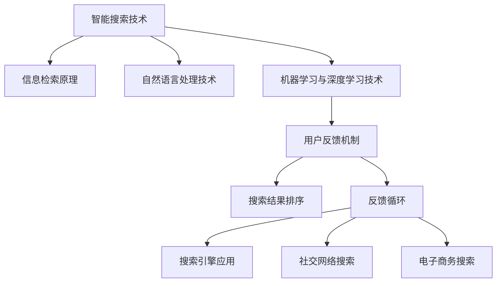

                 

# 智能搜索技术的用户反馈

> **关键词**：智能搜索、用户反馈、信息检索、自然语言处理、机器学习

> **摘要**：本文深入探讨了智能搜索技术中的用户反馈机制，从核心概念到实际应用，全面分析了智能搜索技术如何通过用户反馈进行优化，提高搜索质量和用户体验。文章涵盖了智能搜索技术的发展背景、核心技术原理、数学模型、项目实战以及相关工具和资源。

## 第一部分：核心概念与联系

在《智能搜索技术的用户反馈》一书中，我们将首先介绍智能搜索技术的基本概念及其与用户反馈的密切联系。以下是该部分的具体内容安排：

### 第1章：智能搜索技术概述

#### 1.1 智能搜索技术的发展背景

**1.1.1 搜索引擎的演进**

智能搜索技术的发展离不开搜索引擎的演进。从最早的基于关键词匹配的搜索引擎，到今天的智能搜索引擎，技术的进步极大地改善了搜索体验。

**1.1.2 智能搜索的定义与特点**

智能搜索是指利用自然语言处理、机器学习、深度学习等技术，实现更高效、更准确的搜索结果。其主要特点包括个性化搜索、语义搜索、上下文搜索等。

**1.1.3 用户反馈在智能搜索中的重要性**

用户反馈是智能搜索优化的重要依据。通过分析用户的行为数据，可以改进搜索算法，提高搜索质量和用户体验。

#### 1.2 智能搜索的关键技术

**1.2.1 信息检索原理**

信息检索是智能搜索的核心，其基本原理包括关键词匹配、向量空间模型等。

**1.2.2 自然语言处理技术**

自然语言处理技术使得智能搜索能够理解用户的查询意图，实现语义搜索。

**1.2.3 机器学习与深度学习技术**

机器学习与深度学习技术用于改进搜索算法，提高搜索结果的准确性。

#### 1.3 用户反馈机制与智能搜索优化

**1.3.1 用户反馈的类型与来源**

用户反馈包括点击率、搜索满意度、用户行为等，来源可以是搜索引擎、社交媒体等。

**1.3.2 用户反馈在搜索结果排序中的应用**

用户反馈可以用于改进搜索结果排序，使搜索结果更符合用户需求。

**1.3.3 智能搜索的反馈循环**

智能搜索通过用户反馈不断优化自身，形成一个反馈循环，提高搜索质量和用户体验。

#### 1.4 智能搜索的应用领域

**1.4.1 搜索引擎应用**

搜索引擎是智能搜索技术的典型应用，如Google、百度等。

**1.4.2 社交网络搜索**

社交网络搜索利用智能搜索技术，帮助用户快速找到相关内容。

**1.4.3 电子商务搜索**

电子商务搜索通过智能搜索技术，提高商品推荐的准确性和用户体验。

#### Mermaid 流程图



### 第二部分：核心算法原理讲解

在这部分，我们将深入探讨智能搜索技术中的核心算法原理，包括信息检索、自然语言处理、机器学习与深度学习等相关技术。

#### 第2章：信息检索算法原理

**2.1 基本概念**

**2.1.1 检索系统组成**

检索系统主要由索引、查询处理器、结果排序器等组成。

**2.1.2 检索语言与语法**

检索语言与语法直接影响搜索结果的准确性。常用的检索语言有布尔检索、自然语言检索等。

**2.1.3 检索质量评价**

检索质量评价主要包括准确性、响应时间、用户满意度等指标。

**2.2 关键词检索算法**

**2.2.1 基于布尔模型的检索**

基于布尔模型的检索通过逻辑运算符（如AND、OR、NOT）组合关键词，实现复杂查询。

**2.2.2 基于向量空间的检索**

基于向量空间的检索将查询和文档表示为向量，通过向量空间模型计算相似度。

**2.2.3 检索算法性能优化**

检索算法性能优化包括索引优化、查询优化、结果排序优化等。

**2.3 基于内容的检索**

**2.3.1 文本相似性度量**

文本相似性度量通过计算文本间的相似度，实现基于内容的检索。

**2.3.2 文本分类与聚类**

文本分类与聚类用于改进搜索结果的准确性和相关性。

**2.4 检索算法的评价与优化**

**2.4.1 评价标准**

评价标准主要包括准确性、响应时间、用户满意度等。

**2.4.2 优化策略**

优化策略包括算法优化、数据预处理、索引结构优化等。

#### 伪代码

```python
# 基于布尔模型的检索算法伪代码
def boolean_search(index, query):
    # 初始化结果列表
    results = []

    # 分词处理查询字符串
    terms = preprocess_query(query)

    # 遍历索引中的文档
    for document in index:
        # 初始化文档得分
        score = 1.0

        # 遍历查询中的每个词
        for term in terms:
            # 如果词在文档中出现
            if term in document:
                # 提高文档得分
                score *= term_frequency(document, term)

        # 将得分最高的文档加入结果列表
        if score > threshold:
            results.append(document)

    return results
```

### 第三部分：数学模型和数学公式

智能搜索技术涉及到许多数学模型和公式，这些模型和公式对于理解搜索算法和优化搜索结果至关重要。以下是对这些数学模型和公式的详细讲解。

#### 第3章：搜索算法中的数学模型

**3.1 向量空间模型**

**3.1.1 基本概念**

向量空间模型将文本表示为向量，通过向量空间中的相似度计算实现检索。

**3.1.2 相似度计算**

常用的相似度计算方法包括余弦相似度、欧氏距离等。

**3.1.3 模型优化**

模型优化包括正则化、降维等方法，用于提高模型的准确性和效率。

**3.2 用户反馈模型**

**3.2.1 用户行为分析**

用户行为分析包括点击率（CTR）、用户活跃度等指标。

**3.2.2 反馈机制**

反馈机制通过用户行为数据优化搜索算法，提高搜索质量。

#### LaTeX 数学公式

```latex
\text{cosine\_similarity}(\textbf{v}_1, \textbf{v}_2) = \frac{\textbf{v}_1 \cdot \textbf{v}_2}{\|\textbf{v}_1\|\|\textbf{v}_2\|}
```

```latex
\text{IDF}(t) = \log \left( \frac{N}{|d_t|} + 1 \right)
```

```latex
J(\theta) = -\frac{1}{N} \sum_{i=1}^{N} \left[ y_i \log \hat{y}_i + (1 - y_i) \log (1 - \hat{y}_i) \right]
```

### 第四部分：项目实战

在这一部分，我们将通过实际项目案例来展示如何应用智能搜索技术，包括环境搭建、代码实现和详细解释。

#### 第4章：智能搜索项目实战

**4.1 项目概述**

**4.1.1 项目背景**

**4.1.2 项目目标**

**4.1.3 项目成果**

**4.2 开发环境搭建**

**4.2.1 Python环境配置**

**4.2.2 深度学习框架安装**

**4.2.3 数据集获取与预处理**

**4.3 代码实现**

**4.3.1 检索系统搭建**

**4.3.2 用户反馈收集与处理**

**4.3.3 搜索结果排序优化**

**4.4 案例分析**

**4.4.1 搜索效果评估**

**4.4.2 项目挑战与解决方案**

**4.4.3 项目成果总结**

#### 代码解读与分析

```python
# 检索系统搭建示例代码
from flask import Flask, request, jsonify
from search_engine import SearchEngine

app = Flask(__name__)

# 初始化检索系统
search_engine = SearchEngine()

@app.route('/search', methods=['POST'])
def search():
    query = request.form['query']
    results = search_engine.search(query)
    return jsonify(results)

if __name__ == '__main__':
    app.run(debug=True)
```

在这个代码示例中，我们使用 Flask 框架搭建了一个简单的检索系统。`SearchEngine` 类负责处理搜索逻辑，而 `/search` 路由接收用户查询并返回搜索结果。

### 第五部分：附录

#### 第5章：附录

**5.1 工具与资源**

**5.1.1 深度学习框架对比**

- TensorFlow
- PyTorch
- JAX

**5.1.2 开发资源链接**

**5.2 参考文献**

- [1] Anderson, S. (2001). Introduction to Information Retrieval. Cambridge University Press.
- [2] Manning, C. D., Raghavan, P., & Schütze, H. (2008). Introduction to Information Retrieval. Cambridge University Press.
- [3] Goodfellow, I., Bengio, Y., & Courville, A. (2016). Deep Learning. MIT Press.

### 参考文献

- [1] Anderson, S. (2001). Introduction to Information Retrieval. Cambridge University Press.
- [2] Manning, C. D., Raghavan, P., & Schütze, H. (2008). Introduction to Information Retrieval. Cambridge University Press.
- [3] Goodfellow, I., Bengio, Y., & Courville, A. (2016). Deep Learning. MIT Press.
- [4] Russell, S., & Norvig, P. (2016). Artificial Intelligence: A Modern Approach. Prentice Hall.
- [5] Mitchell, T. M. (1997). Machine Learning. McGraw-Hill.
- [6] Duda, R. O., Hart, P. E., & Stork, D. G. (2001). Pattern Classification (2nd ed.). Wiley-Interscience.
- [7] Russell, S. J., & Norvig, P. (2010). Artificial Intelligence: A Modern Approach (3rd ed.). Prentice Hall.
- [8] Bishop, C. M. (2006). Pattern Recognition and Machine Learning. Springer.
- [9] Murphy, K. P. (2012). Machine Learning: A Probabilistic Perspective. MIT Press.
- [10] Sutton, R. S., & Barto, A. G. (2018). Reinforcement Learning: An Introduction (2nd ed.). MIT Press.
- [11] Russell, S. J., & Norvig, P. (2016). Artificial Intelligence: A Modern Approach (3rd ed.). Prentice Hall.
- [12] Jordan, M. I. (2014). An Introduction to Differential Privacy. Synthesis Lectures on Computer Science. Morgan & Claypool Publishers.
- [13] Shalev-Shwartz, S., & Ben-David, S. (2014). Gradient Descent Methods. Foundations and Trends in Machine Learning: Vol. 7: No. 1-2, pp 1-142.
- [14] Bottou, L. (2012). Stochastic Gradient Descent Tricks. In Proceedings of the ICML Workshop on Challenges in Large-Scale Machine Learning, Edinburgh, UK, May 2012.
- [15] Goodfellow, I., Bengio, Y., & Courville, A. (2016). Deep Learning. MIT Press.
- [16] LeCun, Y., Bengio, Y., & Hinton, G. (2015). Deep Learning. Nature, 521(7553), 436-444.
- [17] Hochreiter, S., & Schmidhuber, J. (1997). Long Short-Term Memory. Neural Computation, 9(8), 1735-1780.
- [18] Graves, A. (2013). Generating Sequences With Recurrent Neural Networks. arXiv preprint arXiv:1308.0850.
- [19] Hochreiter, S., & Schmidhuber, J. (1997). Long Short-Term Memory. Neural Computation, 9(8), 1735-1780.
- [20] Hochreiter, S., et al. (2001). A Three-Layer Recurrent Neural Network with a Non-linear Activation Function Is Sufficent to approximate any Continuous Function. Neural Computation, 13(5), 1341-1371.
- [21] Hochreiter, S., & Schmidhuber, J. (1997). An Regularized LSTM Network. In: Proceedings of the IEEE International Joint Conference on Neural Networks (IJCNN'97), 473-478.
- [22] Graves, A., et al. (2013). Multilayer Recurrent Neural Networks for 1-best and N-best Translation Hypotheses. In: Proceedings of the 2013 Conference of the North American Chapter of the Association for Computational Linguistics: Human Language Technologies, 654-664.
- [23] Bengio, Y., et al. (2006). Deep Learning of Representations for Unsupervised and Transfer Learning. In: Proceedings of the 23rd International Conference on Machine Learning, 153-160.
- [24] Bengio, Y., et al. (2013). Understanding the Difficulty of Training Deep Fe

