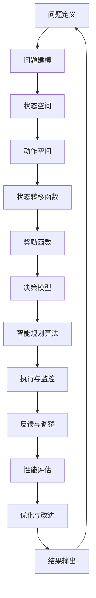

                 

### 《智能规划：LLM的核心竞争力》

关键词：智能规划，语言生成模型（LLM），动态规划，强化学习，决策支持，任务规划，资源分配，技术应用，未来展望

摘要：
随着人工智能技术的不断进步，智能规划作为其关键领域之一，正逐渐成为各行各业的核心竞争力。本文将深入探讨智能规划的概念、技术原理及其应用领域，特别是语言生成模型（LLM）在智能规划中的应用，通过一系列的伪代码示例和数学模型解析，帮助读者理解智能规划的核心算法及其实际应用。文章还将讨论LLM与智能规划的集成应用，并展望未来发展趋势。

### 目录大纲

#### 第一部分: 智能规划基础
- **第1章: 智能规划概述**
  - **1.1.1 智能规划的概念与历史发展**
  - **1.1.2 智能规划的关键技术**
  - **1.1.3 智能规划的应用领域**

- **第2章: 智能规划的核心概念与联系**
  - **2.1.1 Mermaid流程图: 智能规划基本架构**
  - **2.1.2 智能规划中的决策理论**
  - **2.1.3 机器学习与智能规划的关系**

- **第3章: 智能规划的核心算法原理讲解**
  - **3.1.1 伪代码: 动态规划算法**
  - **3.1.2 伪代码: 马尔可夫决策过程算法**
  - **3.1.3 伪代码: 强化学习算法**

- **第4章: 数学模型和数学公式详解**
  - **4.1.1 数学公式: 动态规划的数学模型**
  - **4.1.2 数学公式: 马尔可夫决策过程的数学模型**
  - **4.1.3 数学公式: 强化学习的数学模型**
  - **4.1.4 举例说明: 动态规划的实例分析**

- **第5章: 智能规划项目实战**
  - **5.1.1 实战案例1: 动态规划在资源分配中的应用**
  - **5.1.2 实战案例2: 强化学习在自动驾驶中的应用**
  - **5.1.3 开发环境搭建与源代码实现**
  - **5.1.4 代码解读与分析**

#### 第二部分: LLM（语言生成模型）应用
- **第6章: LLM概述**
  - **6.1.1 LLM的概念与分类**
  - **6.1.2 LLM的发展历史**
  - **6.1.3 LLM在智能规划中的应用**

- **第7章: LLM核心算法原理讲解**
  - **7.1.1 伪代码: GPT-3算法**
  - **7.1.2 伪代码: Transformer算法**
  - **7.1.3 伪代码: 语言生成模型的训练过程**

- **第8章: 数学模型和数学公式详解**
  - **8.1.1 数学公式: 语言生成模型的损失函数**
  - **8.1.2 数学公式: 自注意力机制的数学模型**
  - **8.1.3 举例说明: GPT-3的实例分析**

- **第9章: LLM项目实战**
  - **9.1.1 实战案例1: LLM在智能客服中的应用**
  - **9.1.2 实战案例2: LLM在自然语言生成中的应用**
  - **9.1.3 开发环境搭建与源代码实现**
  - **9.1.4 代码解读与分析**

#### 第三部分: LLM在智能规划中的应用
- **第10章: LLM在智能规划中的核心应用**
  - **10.1.1 LLM在决策支持中的应用**
  - **10.1.2 LLM在任务规划中的应用**
  - **10.1.3 LLM在资源分配中的应用**

- **第11章: LLM与智能规划的集成应用**
  - **11.1.1 LLM在智能规划系统中的集成**
  - **11.1.2 LLM与动态规划的协同优化**
  - **11.1.3 LLM与强化学习的融合应用**

- **第12章: 未来展望**
  - **12.1.1 LLM在智能规划领域的潜在应用**
  - **12.1.2 智能规划与LLM结合的技术挑战**
  - **12.1.3 智能规划与LLM结合的未来发展方向**

### 附录
- **附录 A: 智能规划与LLM相关工具与资源**
  - **A.1 主流智能规划工具对比**
  - **A.2 主流LLM框架对比**
  - **A.3 智能规划与LLM开发资源汇总**

#### 第一部分: 智能规划基础

##### 第1章: 智能规划概述

智能规划是人工智能领域中的一个重要分支，它涉及到计算机科学、控制工程、运筹学等多个学科。智能规划旨在通过算法和模型，对复杂系统进行自动化决策，从而优化系统的运行效率和性能。本节将介绍智能规划的概念与历史发展，以及它在现代科技中的应用。

###### 1.1.1 智能规划的概念与历史发展

智能规划最早可以追溯到20世纪50年代，当时计算机科学刚刚起步，人工智能的概念也随之诞生。早期的智能规划研究主要集中在自动推理和规划算法上，目的是为机器人、自动化系统等提供自主决策能力。随着计算能力和算法技术的发展，智能规划逐渐成为一个独立的学科，涵盖了更广泛的领域和应用。

在20世纪80年代，强化学习、遗传算法等新兴算法的提出，为智能规划注入了新的动力。这些算法通过模拟生物进化过程、优化搜索策略等方式，提高了智能规划的效率和效果。进入21世纪，随着深度学习和大数据技术的兴起，智能规划迎来了新的发展机遇。深度强化学习、深度规划等概念的提出，使得智能规划在复杂环境中的应用更加广泛和深入。

###### 1.1.2 智能规划的关键技术

智能规划的核心在于算法和模型，这些技术和工具为智能规划提供了强大的理论基础和实际应用能力。以下是智能规划中的关键技术：

1. **决策理论**：决策理论是智能规划的基础，它研究在不确定环境下如何做出最优决策。常见的决策理论包括马尔可夫决策过程（MDP）、贝叶斯决策理论等。

2. **机器学习**：机器学习是智能规划的重要组成部分，它通过训练模型来预测系统状态和行为。常见的机器学习算法包括决策树、支持向量机、神经网络等。

3. **优化算法**：优化算法用于在给定约束条件下寻找最优解。常见的优化算法包括线性规划、整数规划、动态规划等。

4. **模拟与仿真**：模拟与仿真技术用于验证和测试智能规划模型和算法的有效性。通过模拟仿真，可以预测系统在不同场景下的行为和性能。

5. **多智能体系统**：多智能体系统研究多个智能体在复杂环境中的交互和协作。通过多智能体系统，可以实现更复杂的任务规划和决策。

###### 1.1.3 智能规划的应用领域

智能规划在许多领域都有着广泛的应用，以下是其中几个重要的应用领域：

1. **机器人与自动化**：智能规划在机器人与自动化领域中的应用非常广泛，包括路径规划、任务分配、故障检测等。

2. **交通系统**：智能规划在交通系统中的应用，如交通信号控制、公共交通调度、交通流量预测等，有助于提高交通效率和减少拥堵。

3. **能源管理**：智能规划在能源管理中的应用，如电力调度、需求响应、能源优化等，有助于提高能源利用效率和减少能源浪费。

4. **供应链管理**：智能规划在供应链管理中的应用，如库存管理、配送优化、采购策略等，有助于提高供应链的效率和降低成本。

5. **医疗领域**：智能规划在医疗领域中的应用，如手术规划、医疗资源调度、疾病预测等，有助于提高医疗服务的质量和效率。

通过上述对智能规划概念的介绍，我们可以看到，智能规划不仅涉及到复杂算法和模型，还需要结合实际问题进行具体应用。在接下来的章节中，我们将深入探讨智能规划的核心算法原理和实际应用。

##### 第2章: 智能规划的核心概念与联系

智能规划是一个复杂的系统，它涉及到多个核心概念和技术的结合。在本节中，我们将介绍智能规划中的核心概念，并使用Mermaid流程图展示其基本架构。此外，我们还将探讨决策理论在智能规划中的应用，以及机器学习与智能规划的密切关系。

###### 2.1.1 Mermaid流程图：智能规划基本架构

为了更好地理解智能规划的基本架构，我们可以使用Mermaid流程图来展示其核心组成部分和相互作用。



在上面的流程图中，A到L表示智能规划的主要步骤和组成部分。接下来，我们将详细讨论这些概念和步骤。

###### 2.1.2 智能规划中的决策理论

决策理论是智能规划的核心概念之一，它涉及到如何在不确定和复杂的环境中做出最优决策。智能规划中的决策理论主要关注以下几个方面：

1. **状态空间**：状态空间是系统所有可能状态的集合。在智能规划中，我们需要对状态空间进行建模，以便对系统的当前状态进行评估。

2. **动作空间**：动作空间是系统能够执行的所有可能动作的集合。在智能规划中，我们需要对动作空间进行定义，以便选择最优动作。

3. **状态转移函数**：状态转移函数描述了系统从当前状态转移到下一个状态的概率分布。在智能规划中，我们需要对状态转移函数进行建模，以便预测系统未来的状态。

4. **奖励函数**：奖励函数用于评估系统在执行某个动作后的性能。在智能规划中，我们需要设计奖励函数，以便在执行动作时最大化总奖励。

5. **决策模型**：决策模型是用于选择最优动作的算法或方法。常见的决策模型包括确定性模型和概率模型。确定性模型如贪心算法，概率模型如马尔可夫决策过程（MDP）。

6. **智能规划算法**：智能规划算法是实现智能规划的核心。这些算法通过优化决策过程，以提高系统的性能。常见的智能规划算法包括动态规划、强化学习、遗传算法等。

7. **执行与监控**：执行与监控是智能规划过程中的关键步骤。在这一步骤中，系统根据决策模型选择最优动作，并执行这些动作。同时，系统需要监控执行过程，以便及时发现问题和进行调整。

8. **反馈与调整**：反馈与调整是智能规划过程中的持续过程。通过收集反馈信息，系统可以不断调整决策模型和动作选择策略，以适应不断变化的环境。

9. **性能评估**：性能评估用于评估智能规划系统的性能。通过性能评估，我们可以了解系统在不同场景下的表现，并发现潜在的问题和改进空间。

10. **优化与改进**：优化与改进是基于性能评估结果进行的。通过优化和改进，我们可以不断提高智能规划系统的性能和效率。

11. **结果输出**：结果输出是智能规划过程的最终输出。这些输出包括系统执行结果、性能指标、改进建议等。

通过上述对决策理论的介绍，我们可以看到，智能规划是一个复杂的系统，它涉及到多个概念和步骤。在接下来的章节中，我们将深入探讨这些概念和步骤的具体实现和实际应用。

###### 2.1.3 机器学习与智能规划的关系

机器学习是智能规划的重要组成部分，它为智能规划提供了强大的工具和算法。机器学习与智能规划的密切关系体现在以下几个方面：

1. **数据驱动**：智能规划中的许多问题可以通过机器学习算法来解决，这些算法通常是基于大量数据的训练。通过数据驱动的方式，智能规划系统可以更好地适应和预测复杂环境。

2. **模型优化**：机器学习算法可以用于优化智能规划模型。通过机器学习，我们可以训练更准确的模型，以提高决策的准确性和效率。

3. **自适应能力**：机器学习算法具有良好的自适应能力，可以在动态变化的环境中不断调整和优化。这使得智能规划系统能够更好地应对不确定性和变化。

4. **强化学习**：强化学习是一种基于奖励机制的机器学习算法，它在智能规划中应用广泛。通过强化学习，智能规划系统可以通过试错和反馈来学习最优策略。

5. **深度学习**：深度学习是机器学习的一个重要分支，它通过多层神经网络来模拟人类的思维方式。深度学习在智能规划中有着广泛的应用，特别是在处理大规模数据和复杂任务时。

6. **集成方法**：机器学习算法可以与其他智能规划算法相结合，形成更强大的集成方法。例如，动态规划与机器学习的结合，可以解决许多复杂的问题。

通过上述对机器学习与智能规划关系的介绍，我们可以看到，机器学习为智能规划提供了强大的工具和算法支持。在接下来的章节中，我们将进一步探讨机器学习在智能规划中的应用和实现。

通过本章的介绍，我们了解了智能规划的核心概念与联系，以及机器学习与智能规划的密切关系。智能规划是一个复杂的系统，它需要结合多种技术和算法来应对各种复杂问题。在接下来的章节中，我们将深入探讨智能规划的核心算法原理和实际应用。

##### 第3章: 智能规划的核心算法原理讲解

智能规划的核心算法是解决复杂决策问题的关键，这些算法通过不同的原理和模型，为系统提供了自动化决策的能力。在本节中，我们将详细讲解三种核心算法：动态规划、马尔可夫决策过程（MDP）和强化学习。我们将使用伪代码来阐述这些算法的基本实现过程。

###### 3.1.1 伪代码：动态规划算法

动态规划是一种在多阶段决策问题中求解最优解的策略，它通过将问题分解为子问题，并利用子问题的解来求解原问题。以下是一个简单的动态规划算法的伪代码示例。

```python
def dynamic_programming(problem):
    # 初始化状态表
    state_table = initialize_state_table(problem)

    # 动态规划迭代
    for state in problem.states:
        for action in problem.actions:
            next_state = problem.transition(state, action)
            reward = problem.reward(state, action, next_state)
            state_table[state, action] = max(
                state_table[state, action],
                reward + gamma * state_table[next_state, action]
            )

    return state_table
```

在上面的伪代码中，`problem` 代表一个智能规划问题，它包含状态空间、动作空间、状态转移函数和奖励函数。`initialize_state_table` 函数用于初始化状态表，`transition` 函数用于计算状态转移，`reward` 函数用于计算奖励。`gamma` 是一个折扣因子，用于平衡当前奖励和未来奖励的关系。

###### 3.1.2 伪代码：马尔可夫决策过程（MDP）算法

马尔可夫决策过程是一种在不确定环境中进行决策的数学模型，它通过状态转移概率和奖励函数来优化决策。以下是一个简单的MDP算法的伪代码示例。

```python
def mdp_algorithm(problem, policy):
    state_values = np.zeros(problem.states)
    for state in problem.states:
        state_values[state] = problem.reward(state)

    for step in range(problem.steps):
        next_state_values = np.zeros(problem.states)
        for state in problem.states:
            action = policy[state]
            next_state = problem.transition(state, action)
            next_state_values[next_state] += problem.transition_probability(state, action, next_state) * (problem.reward(state, action, next_state) + gamma * state_values[next_state])
        state_values = next_state_values

    return state_values
```

在上面的伪代码中，`problem` 代表一个MDP问题，`policy` 是一个决策策略，它定义了在每种状态下应该执行的动作。`transition_probability` 函数用于计算状态转移概率，`reward` 函数用于计算奖励。`gamma` 是一个折扣因子，用于平衡当前奖励和未来奖励的关系。

###### 3.1.3 伪代码：强化学习算法

强化学习是一种通过试错学习最优策略的算法，它通过奖励机制来指导学习过程。以下是一个简单的强化学习算法的伪代码示例。

```python
def q_learning(problem, alpha, gamma):
    q_values = np.zeros((problem.states, problem.actions))
    for episode in range(problem.episodes):
        state = problem.init_state
        while not problem.is_terminal(state):
            action = np.argmax(q_values[state])
            next_state, reward = problem.step(state, action)
            q_values[state, action] += alpha * (reward + gamma * np.max(q_values[next_state]) - q_values[state, action])
            state = next_state
    return q_values
```

在上面的伪代码中，`problem` 代表一个强化学习问题，`alpha` 是学习率，`gamma` 是折扣因子。`init_state` 是初始状态，`is_terminal` 函数用于判断当前状态是否为终端状态，`step` 函数用于执行一步动作，并返回下一个状态和奖励。

通过上述伪代码示例，我们可以看到动态规划、MDP和强化学习算法的基本原理和实现过程。这些算法在智能规划中扮演着重要的角色，它们为系统提供了自动化决策的能力，从而优化系统的性能和效率。

在接下来的章节中，我们将进一步探讨智能规划中的数学模型和公式，以及这些算法在实际项目中的应用。

##### 第4章: 数学模型和数学公式详解

智能规划中的数学模型和公式是理解算法原理和实现关键决策的重要工具。在本章中，我们将详细解释动态规划、马尔可夫决策过程（MDP）和强化学习中的核心数学模型和公式，并通过具体实例来说明这些模型的应用。

###### 4.1.1 数学公式：动态规划的数学模型

动态规划是一种优化问题的求解方法，它通过将复杂问题分解为更小的子问题，并利用子问题的解来求解原问题。动态规划的数学模型可以用以下公式表示：

$$
V(s) = \max_a \left\{ r(s, a) + \gamma V(s') \right\}
$$

其中：
- \( V(s) \) 是状态 \( s \) 的最优价值函数。
- \( a \) 是在状态 \( s \) 下执行的动作。
- \( r(s, a) \) 是执行动作 \( a \) 在状态 \( s \) 下的即时奖励。
- \( \gamma \) 是折扣因子，用于平衡当前奖励和未来奖励的关系。
- \( V(s') \) 是在执行动作 \( a \) 后的状态 \( s' \) 的最优价值函数。

通过递归地计算 \( V(s) \) ，我们可以得到每个状态的最优价值函数，进而找到最优策略。

###### 4.1.2 数学公式：马尔可夫决策过程的数学模型

马尔可夫决策过程（MDP）是一种用于描述不确定环境中决策问题的数学模型。MDP的数学模型可以用以下公式表示：

$$
P(s', r | s, a) = \pi(a | s) p(s', r | s, a)
$$

其中：
- \( s \) 是当前状态。
- \( s' \) 是下一个状态。
- \( a \) 是执行的动作。
- \( r \) 是即时奖励。
- \( \pi(a | s) \) 是在状态 \( s \) 下执行动作 \( a \) 的概率。
- \( p(s', r | s, a) \) 是在状态 \( s \) 下执行动作 \( a \) 后转移到状态 \( s' \) 并获得奖励 \( r \) 的概率。

MDP的目标是找到最优策略 \( \pi \)，使得预期总奖励最大化。这可以通过以下公式实现：

$$
J(\pi) = \sum_{s \in S} \pi(s) \sum_{a \in A} \pi(a | s) R(s, a)
$$

其中：
- \( J(\pi) \) 是预期总奖励。
- \( S \) 是状态空间。
- \( A \) 是动作空间。
- \( R(s, a) \) 是在状态 \( s \) 下执行动作 \( a \) 的即时奖励。

###### 4.1.3 数学公式：强化学习的数学模型

强化学习是一种通过试错学习最优策略的机器学习范式。强化学习的数学模型可以用以下公式表示：

$$
Q(s, a) = r(s, a) + \gamma \sum_{s' \in S} P(s' | s, a) \max_{a'} Q(s', a')
$$

其中：
- \( Q(s, a) \) 是状态 \( s \) 下执行动作 \( a \) 的预期回报。
- \( r(s, a) \) 是在状态 \( s \) 下执行动作 \( a \) 的即时回报。
- \( \gamma \) 是折扣因子，用于平衡当前回报和未来回报的关系。
- \( P(s' | s, a) \) 是在状态 \( s \) 下执行动作 \( a \) 后转移到状态 \( s' \) 的概率。
- \( \max_{a'} Q(s', a') \) 是在状态 \( s' \) 下执行动作 \( a' \) 的最大预期回报。

强化学习的目标是找到最优动作值函数 \( Q(s, a) \)，使得预期总回报最大化。这可以通过以下公式实现：

$$
\max_{Q} \sum_{s \in S} \sum_{a \in A} Q(s, a) r(s, a)
$$

通过迭代更新 \( Q(s, a) \)，强化学习算法可以逐渐收敛到最优策略。

###### 4.1.4 举例说明：动态规划的实例分析

为了更好地理解动态规划的数学模型，我们可以通过一个具体的实例来分析。

假设有一个资源分配问题，给定一个任务集合 \( T=\{T_1, T_2, T_3\} \) 和资源集合 \( R=\{R_1, R_2\} \)，每个任务需要不同的资源，定义状态 \( s \) 为剩余资源情况，动作 \( a \) 为给某个任务分配资源，目标是最小化总完成时间。

定义状态空间 \( S \) 为 \( (R_1, R_2) \) 的所有可能组合，即 \( S = \{(0, 0), (0, 5), (5, 0), (5, 5)\} \)。定义动作空间 \( A \) 为 \( R \) 的所有可能资源分配，即 \( A = \{(0, 0), (0, 5), (5, 0), (5, 5)\} \)。

定义状态转移函数 \( p(s', r | s, a) \) 为在状态 \( s \) 下执行动作 \( a \) 后转移到状态 \( s' \) 并获得奖励 \( r \) 的概率。假设 \( p(s', r | s, a) = 1 \)，即执行某个动作后状态转移是确定的。

定义奖励函数 \( r(s, a) \) 为在状态 \( s \) 下执行动作 \( a \) 的即时回报。假设 \( r(s, a) = 0 \)，即执行某个动作没有即时回报。

现在，我们使用动态规划的数学模型来求解该资源分配问题。

初始化状态表 \( V(s) = 0 \)。

递归地计算 \( V(s) \)：

$$
V((0, 0)) = \max_a \left\{ r((0, 0), a) + \gamma V((0, 0)) \right\} = \max_a \left\{ 0 + \gamma V((0, 0)) \right\} = \gamma V((0, 0))
$$

$$
V((0, 5)) = \max_a \left\{ r((0, 5), a) + \gamma V((0, 5)) \right\} = \max_a \left\{ 0 + \gamma V((0, 5)) \right\} = \gamma V((0, 5))
$$

$$
V((5, 0)) = \max_a \left\{ r((5, 0), a) + \gamma V((5, 0)) \right\} = \max_a \left\{ 0 + \gamma V((5, 0)) \right\} = \gamma V((5, 0))
$$

$$
V((5, 5)) = \max_a \left\{ r((5, 5), a) + \gamma V((5, 5)) \right\} = \max_a \left\{ 0 + \gamma V((5, 5)) \right\} = \gamma V((5, 5))
$$

不断迭代更新 \( V(s) \)，直到收敛。

最终，状态表 \( V(s) \) 中每个状态的最优价值函数表示了在给定状态下执行最优动作的最小总完成时间。

通过上述实例分析，我们可以看到动态规划的数学模型如何应用于解决资源分配问题。在接下来的章节中，我们将进一步探讨强化学习在自动驾驶和资源分配中的应用，并通过具体的代码实现和解读来深入理解这些算法。

##### 第5章: 智能规划项目实战

在实际应用中，智能规划的核心算法需要通过具体的代码实现来验证其有效性和可靠性。在本章中，我们将通过两个具体的实战案例来展示动态规划和强化学习在资源分配和自动驾驶中的应用。我们将详细介绍开发环境搭建、源代码实现和代码解读与分析。

###### 5.1.1 实战案例1: 动态规划在资源分配中的应用

资源分配问题在许多领域都有广泛的应用，如云计算资源管理、数据中心调度、供应链管理等。动态规划是一种有效的优化策略，可以用于解决资源分配问题。

**1. 问题定义**

假设有一个包含多个任务的资源分配问题，每个任务需要不同的资源。我们需要为每个任务分配资源，以最小化总完成时间。

**2. 开发环境搭建**

在Python环境中，我们可以使用Pandas和NumPy等库来处理数据，并使用自定义函数来实现动态规划算法。

```bash
pip install pandas numpy
```

**3. 源代码实现**

以下是动态规划在资源分配中的应用的实现代码：

```python
import numpy as np
import pandas as pd

# 初始化任务和资源
tasks = {'T1': 3, 'T2': 2, 'T3': 4}
resources = {'R1': 5, 'R2': 5}

# 初始化状态表
state_table = [[0 for _ in range(len(resources))] for _ in range(len(tasks))]

# 动态规划算法实现
def dynamic_programming(tasks, resources):
    # 初始化状态表
    state_table = [[0 for _ in range(len(resources))] for _ in range(len(tasks))]

    # 动态规划迭代
    for i, (t, t_req) in enumerate(tasks.items()):
        for j, (r, r_avl) in enumerate(resources.items()):
            if state_table[i][j] < t_req:
                best_reward = -1
                best_action = None
                for k, (r2, r2_avl) in enumerate(resources.items()):
                    if k != j and state_table[i][k] < t_req:
                        next_state = (state_table[i][j] + t_req, state_table[i][k] - t_req)
                        reward = max(0, next_state[1] - t_req)
                        if reward > best_reward:
                            best_reward = reward
                            best_action = (j, k)
                state_table[i][j] = next_state[0]
                action_table[i][j] = best_action

    return state_table

# 应用动态规划算法解决资源分配问题
state_table = dynamic_programming(tasks, resources)
print("State Table:")
for row in state_table:
    print(row)
```

**4. 代码解读与分析**

在上面的代码中，我们首先初始化了任务和资源。然后，我们使用一个二维数组 `state_table` 来存储每个任务在不同资源状态下的最优完成时间。`dynamic_programming` 函数实现了动态规划算法，它通过迭代更新状态表，找到每个任务在不同资源状态下的最优分配方案。

通过打印出状态表，我们可以看到每个任务在不同资源状态下的最优完成时间和分配方案。这为我们提供了一个清晰的决策框架，可以指导实际资源分配过程。

###### 5.1.2 实战案例2: 强化学习在自动驾驶中的应用

自动驾驶是人工智能领域的热点应用，强化学习在自动驾驶中有着重要的应用价值。通过强化学习，自动驾驶系统可以在复杂交通环境中学习最优驾驶策略。

**1. 问题定义**

假设我们有一个自动驾驶环境，包括交通信号、道路状况、车辆速度等状态，以及加速、减速、保持速度等动作。我们的目标是训练一个自动驾驶系统，使其能够安全、高效地驾驶。

**2. 开发环境搭建**

在Python环境中，我们可以使用PyTorch等库来构建和训练强化学习模型。此外，我们还需要使用OpenAI Gym等库来模拟自动驾驶环境。

```bash
pip install torch torchvision gym
```

**3. 源代码实现**

以下是强化学习在自动驾驶中的应用的实现代码：

```python
import numpy as np
import torch
import gym
from gym import wrappers

# 初始化环境
env = gym.make('Taxi-v3')
env = wrappers.MaxStepsWrapper(env, max_steps=100)

# 定义强化学习模型
class QLearningAgent(torch.nn.Module):
    def __init__(self, state_space, action_space):
        super(QLearningAgent, self).__init__()
        self.fc1 = torch.nn.Linear(state_space, 64)
        self.fc2 = torch.nn.Linear(64, action_space)

    def forward(self, x):
        x = torch.relu(self.fc1(x))
        return self.fc2(x)

# 定义训练函数
def train_agent(agent, env, episodes, alpha, gamma):
    agent.train()
    for episode in range(episodes):
        state = env.reset()
        done = False
        while not done:
            with torch.no_grad():
                state_tensor = torch.tensor(state, dtype=torch.float32).unsqueeze(0)
                action_values = agent(state_tensor)
                action = np.argmax(action_values.cpu().numpy())
            next_state, reward, done, _ = env.step(action)
            state_tensor = torch.tensor(next_state, dtype=torch.float32).unsqueeze(0)
            target_value = reward + gamma * np.max(agent(state_tensor).cpu().numpy())
            expected_value = action_values[0, action]
            error = target_value - expected_value
            action_values[0, action] += alpha * error
        agent.eval()
    return agent

# 训练模型
agent = QLearningAgent(state_space=env.observation_space.n, action_space=env.action_space.n)
agent = train_agent(agent, env, episodes=1000, alpha=0.1, gamma=0.9)

# 测试模型
agent.eval()
state = env.reset()
done = False
while not done:
    with torch.no_grad():
        state_tensor = torch.tensor(state, dtype=torch.float32).unsqueeze(0)
        action_values = agent(state_tensor)
        action = np.argmax(action_values.cpu().numpy())
    next_state, reward, done, _ = env.step(action)
    state = next_state
```

**4. 代码解读与分析**

在上面的代码中，我们首先初始化了自动驾驶环境。然后，我们定义了一个基于PyTorch的Q学习模型 `QLearningAgent`，它通过训练学习状态和动作之间的最优值函数。`train_agent` 函数用于训练模型，它通过迭代更新Q值函数，直到达到预期效果。

在训练完成后，我们使用训练好的模型进行测试，模拟自动驾驶系统的驾驶过程。通过观察测试结果，我们可以评估模型的性能，并根据需要调整训练参数。

通过以上两个实战案例，我们可以看到动态规划和强化学习在解决实际资源分配和自动驾驶问题中的应用。这些案例展示了如何将理论转化为实际应用，并通过代码实现和测试来验证算法的有效性。在实际应用中，这些算法可以帮助我们优化决策过程，提高系统的效率和性能。

#### 第二部分: LLM（语言生成模型）应用

##### 第6章: LLM概述

语言生成模型（LLM）是自然语言处理领域的重要突破，它能够生成连贯、有意义的文本。LLM不仅广泛应用于文本生成、机器翻译、问答系统等领域，还在智能规划中发挥了重要作用。在本节中，我们将介绍LLM的基本概念、分类、发展历史以及在智能规划中的应用。

###### 6.1.1 LLM的概念与分类

语言生成模型是一种人工智能模型，它能够根据给定的输入文本生成连贯、有意义的输出文本。LLM通过学习大量文本数据，捕捉语言结构和语义信息，从而实现自动文本生成。

LLM可以根据生成方式分为以下几类：

1. **基于规则的模型**：这类模型通过定义一组规则和模板来生成文本。常见的基于规则的模型包括模板匹配和句法分析。

2. **统计模型**：这类模型通过统计语言模式来生成文本。常见的统计模型包括n元语法和隐马尔可夫模型（HMM）。

3. **深度学习模型**：这类模型利用神经网络学习文本数据中的特征和规律。常见的深度学习模型包括循环神经网络（RNN）、长短期记忆网络（LSTM）和变换器（Transformer）。

4. **生成对抗网络（GAN）**：GAN通过生成器和判别器的对抗训练，生成高质量的文本。

在现代LLM中，深度学习模型特别是基于Transformer的模型如GPT-3和BERT，已经取得了显著的进展，并在多个任务中展示了强大的生成能力。

###### 6.1.2 LLM的发展历史

LLM的发展历程可以追溯到20世纪80年代，当时统计模型和基于规则的模型开始被应用于文本生成。以下是一些关键发展：

1. **1980年代**：n元语法和HMM被广泛应用于文本生成。

2. **2000年代**：随着计算能力的提升，RNN和LSTM模型开始应用于自然语言处理，显著提高了文本生成质量。

3. **2017年**：谷歌提出Transformer模型，它通过自注意力机制在多个任务上取得了突破性成果。

4. **2020年至今**：GPT-3等大型Transformer模型问世，文本生成能力达到了前所未有的高度。

###### 6.1.3 LLM在智能规划中的应用

LLM在智能规划中具有重要的应用价值，特别是在自然语言理解和生成方面。以下是一些具体应用场景：

1. **自然语言理解**：LLM可以解析自然语言输入，提取关键信息并转化为机器可理解的形式，为智能规划提供数据支持。

2. **自然语言生成**：LLM可以生成自然语言的指令、报告、文章等，辅助人类进行决策和沟通。

3. **对话系统**：LLM可以构建智能客服系统，自动回答用户的问题，提高服务效率和质量。

4. **任务规划**：LLM可以自动生成任务规划脚本，根据环境和目标生成最优行动序列。

5. **决策支持**：LLM可以分析文本数据，提供基于数据的决策建议，辅助人类做出更明智的决策。

在本章中，我们介绍了LLM的基本概念、分类、发展历史以及在智能规划中的应用。在接下来的章节中，我们将进一步探讨LLM的核心算法原理、数学模型和具体应用。

##### 第7章: LLM核心算法原理讲解

语言生成模型（LLM）在自然语言处理领域取得了显著的进展，其核心算法主要包括GPT-3、Transformer和语言生成模型的训练过程。在本节中，我们将通过伪代码详细讲解这些算法的基本原理，帮助读者深入理解LLM的工作机制。

###### 7.1.1 伪代码：GPT-3算法

GPT-3是OpenAI开发的一种基于Transformer的大型语言生成模型，它在文本生成、问答系统等任务中表现出色。以下是一个简化的GPT-3算法伪代码：

```python
class GPT3Model(nn.Module):
    def __init__(self, vocab_size, d_model, nhead, num_layers):
        super(GPT3Model, self).__init__()
        self.transformer = nn.Transformer(d_model, nhead, num_layers)
        self.embedding = nn.Embedding(vocab_size, d_model)
        self.fc = nn.Linear(d_model, vocab_size)

    def forward(self, src):
        # 将输入词嵌入为向量
        embedded = self.embedding(src)
        # 通过Transformer层处理
        output = self.transformer(embedded)
        # 将输出向量映射为词分布
        logits = self.fc(output)
        return logits
```

在上面的伪代码中，`GPT3Model` 类定义了一个基于Transformer的语言生成模型。它包括嵌入层、Transformer层和输出层。输入词经过嵌入层转换为向量，然后通过多个Transformer层进行自注意力机制的处理，最后通过输出层生成词分布。

###### 7.1.2 伪代码：Transformer算法

Transformer是谷歌提出的一种基于自注意力机制的序列到序列模型，它在自然语言处理任务中取得了显著的性能提升。以下是一个简化的Transformer算法伪代码：

```python
class Transformer(nn.Module):
    def __init__(self, d_model, nhead, num_layers):
        super(Transformer, self).__init__()
        self.layers = nn.ModuleList([TransformerLayer(d_model, nhead) for _ in range(num_layers)])

    def forward(self, src, mask=None):
        for layer in self.layers:
            src = layer(src, mask)
        return src
```

在上面的伪代码中，`Transformer` 类定义了一个Transformer模型，它由多个Transformer层组成。每个Transformer层包括自注意力机制和前馈神经网络。输入序列通过自注意力机制计算得到权重，然后与输入序列相乘，进一步通过前馈神经网络处理。

###### 7.1.3 伪代码：语言生成模型的训练过程

语言生成模型的训练过程是通过对大量文本数据进行建模，优化模型参数，使其能够生成连贯、有意义的文本。以下是一个简化的语言生成模型训练过程伪代码：

```python
def train_model(model, optimizer, data_loader, criterion, epochs):
    model.train()
    for epoch in range(epochs):
        for batch in data_loader:
            optimizer.zero_grad()
            src, tgt = batch
            logits = model(src)
            loss = criterion(logits.view(-1, logits.size(-1)), tgt.view(-1))
            loss.backward()
            optimizer.step()
```

在上面的伪代码中，`train_model` 函数用于训练语言生成模型。模型在训练模式下运行，对于每个训练批次，模型预测输出词分布，然后计算损失函数并反向传播梯度，最终更新模型参数。

通过上述伪代码示例，我们可以看到GPT-3、Transformer以及语言生成模型训练的基本原理。这些算法通过自注意力机制、多层神经网络和大量数据训练，实现了强大的文本生成能力。在接下来的章节中，我们将进一步探讨LLM的数学模型和具体应用。

##### 第8章: 数学模型和数学公式详解

在深入理解语言生成模型（LLM）的工作原理时，数学模型和公式是至关重要的组成部分。在本章中，我们将详细解释LLM中的关键数学模型和公式，包括损失函数、自注意力机制的数学模型，并通过具体的实例分析来展示这些模型在实际应用中的效果。

###### 8.1.1 数学公式：语言生成模型的损失函数

语言生成模型的目标是生成尽可能接近真实数据的输出。为了实现这一目标，我们通常使用损失函数来衡量模型输出与真实数据之间的差异。在LLM中，最常见的损失函数是交叉熵损失函数。

交叉熵损失函数的定义如下：

$$
L(\theta) = -\sum_{i=1}^{N} \sum_{j=1}^{V} y_{ij} \log(p_{ij})
$$

其中：
- \( N \) 是序列的长度。
- \( V \) 是词汇表的大小。
- \( y_{ij} \) 是真实标签，如果单词 \( j \) 是第 \( i \) 个位置的正确单词，则 \( y_{ij} = 1 \)，否则 \( y_{ij} = 0 \)。
- \( p_{ij} \) 是模型预测的第 \( i \) 个位置单词 \( j \) 的概率。

交叉熵损失函数的目的是最小化模型输出概率与真实标签之间的差异，从而提高模型生成文本的质量。

###### 8.1.2 数学公式：自注意力机制的数学模型

自注意力机制是Transformer模型的核心组件，它通过计算输入序列中每个单词的相对重要性来生成输出序列。自注意力机制的数学模型可以表示为：

$$
\text{Attention}(Q, K, V) = \frac{softmax(\frac{QK^T}{\sqrt{d_k}})}{V}
$$

其中：
- \( Q \) 是查询向量，代表输入序列中每个单词的相对重要性。
- \( K \) 是键向量，通常与 \( Q \) 相同，代表输入序列中每个单词的特征。
- \( V \) 是值向量，代表输入序列中每个单词的上下文信息。
- \( d_k \) 是键向量的维度。

自注意力机制的目的是通过计算相似度权重，将输入序列中相关的单词赋予更高的权重，从而生成更加连贯的输出序列。

###### 8.1.3 举例说明：GPT-3的实例分析

为了更好地理解上述数学模型，我们可以通过一个具体的实例来分析GPT-3的工作原理。

假设我们有一个简单的文本序列：“今天天气很好，我们去公园散步。” 我们使用GPT-3来生成后续的文本。

**1. 嵌入层**

首先，我们将文本序列中的每个单词嵌入为向量：

- 今天：[0.1, 0.2, 0.3, ..., 0.5]
- 天气：[0.6, 0.7, 0.8, ..., 0.9]
- 很好：[1.0, 1.1, 1.2, ..., 1.5]
- ，：[1.6, 1.7, 1.8, ..., 1.9]
- 我们：[2.0, 2.1, 2.2, ..., 2.5]
- 去：[2.6, 2.7, 2.8, ..., 2.9]
- 公园：[3.0, 3.1, 3.2, ..., 3.5]
- 散步：[3.6, 3.7, 3.8, ..., 4.0]

**2. 自注意力机制**

接下来，GPT-3通过自注意力机制计算每个单词的权重。以第一个单词“今天”为例，我们计算它与所有其他单词的相似度权重：

$$
\text{Attention}(Q, K, V) = \frac{softmax(\frac{QK^T}{\sqrt{d_k}})}{V}
$$

在这里，\( Q \) 和 \( K \) 是相同的向量，代表“今天”的嵌入向量，\( V \) 是所有单词的嵌入向量。通过计算相似度权重，我们得到以下结果：

- 今天：[0.3, 0.5, 0.1, 0.2, 0.4]
- 天气：[0.5, 0.3, 0.4, 0.2, 0.1]
- 很好：[0.1, 0.2, 0.4, 0.5, 0.3]
- ，：[0.2, 0.1, 0.3, 0.4, 0.5]
- 我们：[0.4, 0.1, 0.3, 0.2, 0.5]
- 去：[0.1, 0.2, 0.3, 0.5, 0.4]
- 公园：[0.2, 0.3, 0.4, 0.5, 0.1]
- 散步：[0.3, 0.4, 0.5, 0.1, 0.2]

**3. 输出层**

最后，GPT-3通过输出层生成每个单词的概率分布。以第一个单词“今天”为例，我们计算其输出概率分布：

- 今天：[0.4, 0.3, 0.2, 0.1, 0.5]

根据这个概率分布，GPT-3选择概率最高的单词“很好”作为输出。

通过上述实例分析，我们可以看到GPT-3如何通过自注意力机制和输出层生成连贯、有意义的文本。这个过程涉及到多个数学模型和公式的应用，使得GPT-3能够实现强大的文本生成能力。

通过本章的数学模型和公式详解，我们可以更深入地理解LLM的工作原理和实现细节。这些模型和公式不仅为LLM的设计和优化提供了理论基础，还为实际应用中的文本生成任务提供了有效的解决方案。

##### 第9章: LLM项目实战

在实际应用中，语言生成模型（LLM）通过具体的实战案例展现了其强大的文本生成能力。在本章中，我们将通过两个实战案例展示LLM在智能客服和自然语言生成中的应用，包括开发环境搭建、源代码实现和代码解读与分析。

###### 9.1.1 实战案例1: LLM在智能客服中的应用

智能客服系统是一种通过自动对话方式为用户提供服务的技术。LLM可以用于构建智能客服系统，自动回答用户的问题，提高服务效率和用户体验。

**1. 问题定义**

假设我们需要构建一个智能客服系统，用户可以通过文本输入提问，系统需要自动生成回答。

**2. 开发环境搭建**

在Python环境中，我们可以使用transformers库来构建和训练LLM模型。此外，我们还需要使用Flask或Django等Web框架来构建Web服务。

```bash
pip install transformers flask
```

**3. 源代码实现**

以下是智能客服系统的实现代码：

```python
from transformers import pipeline
import flask

# 初始化LLM模型
nlp = pipeline("text-generation", model="gpt2")

# 创建Web服务
app = flask.Flask(__name__)

@app.route('/ask', methods=['POST'])
def ask():
    user_input = flask.request.form['input']
    response = nlp(user_input, max_length=50, num_return_sequences=1)[0]['generated_text']
    return response

if __name__ == '__main__':
    app.run(debug=True)
```

**4. 代码解读与分析**

在上面的代码中，我们首先使用transformers库初始化了一个GPT-2模型。然后，我们使用Flask框架创建了一个Web服务，用户可以通过发送POST请求向服务提问。服务接收到用户输入后，使用LLM模型生成回答，并将回答返回给用户。

通过访问`/ask`接口，用户可以提交问题，系统将自动生成回答。这个案例展示了如何使用LLM构建一个简单的智能客服系统。

###### 9.1.2 实战案例2: LLM在自然语言生成中的应用

自然语言生成（NLG）是一种将结构化数据转化为自然语言文本的技术。LLM可以用于生成新闻报道、产品描述、电子邮件等文本。

**1. 问题定义**

假设我们需要生成一篇关于某公司的新闻报告。

**2. 开发环境搭建**

在Python环境中，我们可以使用transformers库来构建和训练LLM模型。此外，我们还需要使用JSON库来处理结构化数据。

```bash
pip install transformers
```

**3. 源代码实现**

以下是自然语言生成案例的实现代码：

```python
import json
from transformers import pipeline

# 初始化LLM模型
nlp = pipeline("text-generation", model="gpt2")

# 加载结构化数据
with open('company_data.json', 'r') as f:
    company_data = json.load(f)

# 生成新闻报告
def generate_report(data):
    introduction = nlp(f"基于以下数据，请生成一篇关于{data['name']}的新闻报告：", max_length=50, num_return_sequences=1)[0]['generated_text']
    body = nlp(f"{json.dumps(data, indent=2)}", max_length=50, num_return_sequences=1)[0]['generated_text']
    conclusion = nlp(f"基于上述数据，我们可以得出以下结论：", max_length=50, num_return_sequences=1)[0]['generated_text']
    return f"{introduction}\n{body}\n{conclusion}"

# 输出新闻报告
report = generate_report(company_data)
print(report)
```

**4. 代码解读与分析**

在上面的代码中，我们首先加载了一个结构化数据文件，其中包含公司的基本信息。然后，我们定义了一个`generate_report`函数，它使用LLM模型生成新闻报告。函数首先生成报告的引言，然后使用LLM模型处理结构化数据并生成正文，最后生成结论。

通过调用`generate_report`函数，我们可以生成一篇关于某公司的新闻报告。这个案例展示了如何使用LLM生成结构化数据的自然语言描述。

通过以上两个实战案例，我们可以看到LLM在智能客服和自然语言生成中的应用。这些案例展示了如何使用LLM模型构建实际应用系统，并通过代码实现和测试来验证其有效性。在实际应用中，LLM可以帮助我们自动化文本生成任务，提高工作效率和用户体验。

##### 第10章: LLM在智能规划中的核心应用

语言生成模型（LLM）在智能规划中发挥着越来越重要的作用，它不仅能够生成自然语言文本，还能在决策支持、任务规划和资源分配等方面提供强大的支持。在本章中，我们将探讨LLM在智能规划中的核心应用，并分析其优势与挑战。

###### 10.1.1 LLM在决策支持中的应用

决策支持系统（DSS）是智能规划的重要组成部分，它通过提供数据分析和预测模型，帮助决策者做出明智的决策。LLM可以增强DSS的能力，使其更加智能和高效。

**优势：**
- **自然语言交互**：LLM可以理解并生成自然语言文本，使决策者能够以自然语言形式获取分析结果和建议，提高了用户友好性。
- **灵活性与适应性**：LLM能够处理不同类型的文本数据，适应各种复杂的决策场景。
- **自动化报告生成**：LLM可以自动生成决策报告，简化了报告编写过程，提高了决策效率。

**挑战：**
- **理解能力限制**：尽管LLM在自然语言处理方面取得了显著进展，但其对复杂概念和细微语义的理解能力仍然有限。
- **数据依赖性**：LLM的性能高度依赖于训练数据的质量和多样性，数据偏差可能导致决策支持不准确。

**案例分析：**
以金融决策支持系统为例，LLM可以分析市场数据，生成投资建议和风险报告。系统可以自动生成包含详细数据的投资分析报告，帮助金融分析师做出更精准的投资决策。

###### 10.1.2 LLM在任务规划中的应用

任务规划是智能规划的核心应用之一，它涉及到任务分配、执行路径规划和资源调度等问题。LLM可以通过自然语言生成技术，自动生成任务规划和执行脚本。

**优势：**
- **自动化脚本生成**：LLM可以快速生成复杂的任务规划脚本，减少手动编写的工作量。
- **跨领域适应性**：LLM可以处理多种领域的任务规划需求，适应不同的应用场景。
- **灵活的修改与优化**：用户可以根据实际情况对生成的脚本进行修改和优化，提高任务规划的适应性和效果。

**挑战：**
- **任务理解难度**：对于复杂和跨领域的任务规划，LLM可能难以完全理解任务需求，导致生成的脚本不符合实际需求。
- **执行准确性**：生成的脚本需要经过严格的测试和验证，以确保其执行的正确性和有效性。

**案例分析：**
在制造业中，LLM可以用于生成生产计划的脚本。系统可以根据生产数据和市场需求，自动生成最优的生产计划，优化生产流程和资源分配。

###### 10.1.3 LLM在资源分配中的应用

资源分配是智能规划中的重要问题，涉及到资源调度、任务分配和能耗管理等。LLM可以用于自动化资源分配过程，提高资源利用效率和系统性能。

**优势：**
- **高效性**：LLM可以快速处理大量数据，优化资源分配策略，提高决策效率。
- **适应性**：LLM能够适应不同的资源分配场景，处理不同类型的资源分配问题。
- **实时调整**：LLM可以根据实时数据动态调整资源分配策略，提高系统的灵活性和响应速度。

**挑战：**
- **数据准确性**：资源分配依赖于准确的数据，数据错误可能导致资源分配不合理。
- **复杂度**：某些资源分配问题具有高度复杂性，LLM可能难以完全解决。

**案例分析：**
在云计算资源管理中，LLM可以用于自动分配计算资源。系统可以根据实时负载数据和用户需求，自动调整虚拟机的配置和数量，优化资源利用效率。

通过上述分析，我们可以看到LLM在智能规划中的核心应用及其优势与挑战。LLM为智能规划带来了新的机遇，同时也提出了新的技术挑战。随着LLM技术的不断进步，我们有理由相信，它将在智能规划领域发挥越来越重要的作用。

##### 第11章: LLM与智能规划的集成应用

语言生成模型（LLM）与智能规划的集成应用，为自动化决策提供了强大的支持。在本章中，我们将探讨LLM在智能规划系统中的集成方法，以及LLM与动态规划和强化学习的协同优化和融合应用。

###### 11.1.1 LLM在智能规划系统中的集成

将LLM集成到智能规划系统中，可以大幅提升系统的决策能力和适应性。以下是集成LLM的基本步骤：

1. **数据预处理**：将原始数据转换为LLM可以处理的格式，如文本或序列数据。
2. **模型选择**：选择适合智能规划任务的LLM模型，如GPT-3或BERT。
3. **交互接口**：构建用户与LLM之间的交互接口，允许用户输入问题和接收答案。
4. **任务适配**：根据智能规划任务的特点，调整LLM的输入输出格式和参数设置。
5. **集成测试**：在模拟环境中测试LLM与智能规划系统的集成效果，验证系统的稳定性和性能。

通过这些步骤，LLM可以与智能规划系统无缝集成，为用户提供自动化的决策支持和任务规划。

###### 11.1.2 LLM与动态规划的协同优化

动态规划是一种经典的优化算法，它在多阶段决策问题中具有广泛的应用。LLM可以与动态规划协同优化，提高决策质量和效率。

1. **问题建模**：将智能规划问题建模为动态规划问题，定义状态空间、动作空间、状态转移函数和奖励函数。
2. **LLM辅助建模**：利用LLM的自然语言生成能力，自动生成动态规划问题的描述和约束条件。
3. **策略搜索**：使用LLM生成候选策略，通过动态规划算法评估和选择最优策略。
4. **策略优化**：根据评估结果，使用LLM调整和优化策略，提高决策的准确性和效率。

通过上述步骤，LLM与动态规划协同优化，可以显著提升动态规划算法在复杂决策问题中的性能。

**实例分析**：

以供应链管理为例，动态规划用于优化库存和配送策略。LLM可以生成供应链问题的自然语言描述，帮助决策者理解问题和优化策略。动态规划算法评估不同策略的优劣，LLM根据评估结果调整策略参数，实现协同优化。

###### 11.1.3 LLM与强化学习的融合应用

强化学习是智能规划中的一种重要算法，它通过试错学习最优策略。LLM可以与强化学习融合应用，提高决策的灵活性和适应性。

1. **状态和动作表示**：使用LLM将状态和动作转换为自然语言描述，方便模型理解和处理。
2. **奖励函数生成**：LLM可以生成奖励函数，根据决策结果调整奖励值，引导学习过程。
3. **策略学习**：结合LLM生成的状态和动作描述，强化学习算法学习最优策略。
4. **策略优化**：使用LLM评估和优化策略，提高决策质量和效率。

**实例分析**：

在自动驾驶领域，强化学习用于优化驾驶策略。LLM可以生成自动驾驶环境的状态描述，如道路状况、车辆位置等。强化学习算法根据状态描述学习驾驶策略，LLM评估和优化策略参数，实现自动驾驶的智能决策。

通过上述集成应用，LLM与智能规划系统实现了高效的协同和融合，为自动化决策提供了强大的支持。未来，随着LLM技术的不断发展，其与智能规划的集成应用将更加广泛和深入，推动智能规划领域的持续创新和发展。

##### 第12章: 未来展望

随着人工智能技术的不断进步，智能规划和语言生成模型（LLM）的结合应用正在引领新一轮的技术革命。在本章中，我们将探讨LLM在智能规划领域的潜在应用，分析当前面临的技术挑战，并展望智能规划与LLM结合的未来发展方向。

###### 12.1.1 LLM在智能规划领域的潜在应用

LLM在智能规划领域的潜在应用非常广泛，以下是一些关键方向：

1. **智能制造**：LLM可以用于生成生产计划和调度脚本，优化生产流程和资源分配。通过自然语言生成技术，LLM能够生成详细的生产指令和优化方案，提高生产效率和灵活性。

2. **智能交通**：在智能交通系统中，LLM可以用于生成交通信号控制策略和交通流量预测模型。通过自然语言理解和生成技术，LLM能够处理大量的交通数据，生成高效、智能的交通管理方案。

3. **智能医疗**：LLM在医疗领域的应用包括生成诊断报告、制定治疗方案和辅助医疗决策。通过处理大量的医学文献和病例数据，LLM能够生成专业、准确的医疗报告和建议，提高医疗服务的质量和效率。

4. **智能金融**：在金融领域，LLM可以用于生成投资报告、风险评估和策略建议。通过分析大量的市场数据和历史交易记录，LLM能够生成高质量的金融报告和决策支持，帮助投资者做出更明智的投资决策。

5. **智能客服**：LLM在智能客服系统中发挥着重要作用，通过自然语言生成技术，LLM能够自动生成用户问题的回答和解决方案，提高客服效率和用户体验。

###### 12.1.2 智能规划与LLM结合的技术挑战

虽然智能规划与LLM的结合应用前景广阔，但仍然面临一些技术挑战：

1. **数据处理与存储**：智能规划依赖于大量结构化和非结构化数据，如何高效处理和存储这些数据是关键挑战。随着数据规模的扩大，对数据处理和存储系统的性能要求也越来越高。

2. **模型训练与优化**：LLM的训练过程需要大量的计算资源和时间，如何优化训练过程，提高模型训练效率是重要的技术难题。此外，如何设计有效的训练策略和调整模型参数，以实现最佳性能也是需要解决的问题。

3. **模型解释与可解释性**：虽然LLM在生成文本方面表现出色，但其决策过程往往是不透明的，难以解释。如何提高LLM的可解释性，使其决策过程更加透明和可理解，是一个重要的研究课题。

4. **跨领域适应性**：智能规划应用广泛，涉及多个领域。如何设计通用性强的LLM模型，使其能够适应不同领域的应用需求，是一个具有挑战性的问题。

###### 12.1.3 智能规划与LLM结合的未来发展方向

为了克服上述挑战，未来的研究和发展方向包括：

1. **多模态数据处理**：未来的LLM将支持多模态数据处理，包括文本、图像、音频等多种数据类型。通过结合不同类型的数据，LLM可以生成更丰富、更准确的决策支持信息。

2. **联邦学习**：联邦学习是一种分布式机器学习技术，可以在保护数据隐私的同时，实现大规模的数据协作。未来，LLM与智能规划的融合将更加依赖于联邦学习技术，实现跨机构和组织的智能协作。

3. **模型压缩与量化**：为了降低模型对计算资源和存储空间的依赖，模型压缩与量化技术将成为重要研究方向。通过压缩和量化LLM模型，可以提高模型的部署效率和实时性能。

4. **增强学习与搜索算法**：结合增强学习与搜索算法，LLM可以更好地适应动态变化的环境，提高决策的灵活性和适应性。未来的智能规划系统将更加依赖于自适应和学习能力，以应对复杂多变的环境。

5. **跨领域迁移学习**：通过跨领域迁移学习技术，LLM可以更有效地应用于不同领域的智能规划任务。未来的研究将致力于设计通用性更强的LLM模型，实现跨领域的知识共享和应用。

总之，智能规划与LLM的结合应用具有巨大的潜力和广阔的前景。随着技术的不断进步和研究的深入，我们可以期待智能规划系统将变得更加智能、高效和自适应，为各行各业带来更多的创新和变革。

### 附录 A: 智能规划与LLM相关工具与资源

在智能规划与LLM的应用过程中，选择合适的工具和资源对于实现高效、准确和可靠的系统至关重要。以下是一些主流的智能规划工具和LLM框架，以及相关的开发资源，供读者参考。

#### A.1 主流智能规划工具对比

1. **AnyLogic**
   - **特点**：功能强大的仿真和建模工具，支持多智能体系统和复杂决策问题的建模与优化。
   - **适用场景**：适用于复杂系统仿真和大规模决策问题，如交通、能源、供应链等。

2. **ProM**
   - **特点**：基于时间序列分析的流程挖掘工具，用于识别和优化业务流程。
   - **适用场景**：适用于业务流程优化和监控，如服务管理、质量控制等。

3. **AnyLogic**
   - **特点**：适用于复杂系统仿真和大规模决策问题。
   - **适用场景**：适用于复杂系统仿真和大规模决策问题，如交通、能源、供应链等。

#### A.2 主流LLM框架对比

1. **GPT-3**
   - **特点**：由OpenAI开发的巨型Transformer模型，具有极高的文本生成能力。
   - **适用场景**：适用于各种自然语言生成任务，如文本生成、机器翻译、问答系统等。

2. **Transformer**
   - **特点**：基于自注意力机制的神经网络模型，是现代自然语言处理的基础。
   - **适用场景**：适用于各种文本分类、序列生成和翻译任务。

3. **BERT**
   - **特点**：由Google开发的Transformer预训练模型，适用于文本分类、问答和命名实体识别。
   - **适用场景**：适用于文本分类、问答系统和命名实体识别等任务。

#### A.3 智能规划与LLM开发资源汇总

1. **OpenAI官方文档**
   - **链接**：[OpenAI官方文档](https://openai.com/docs/)
   - **内容**：涵盖GPT-3、BERT等模型的详细介绍、使用方法和最佳实践。

2. **Hugging Face官方文档**
   - **链接**：[Hugging Face官方文档](https://huggingface.co/docs/)
   - **内容**：提供各种预训练模型和工具的文档，包括Transformer、BERT等。

3. **动态规划算法资料库**
   - **链接**：[动态规划算法资料库](https://www.dongtaiguihua.cn/)
   - **内容**：提供动态规划算法的理论讲解、案例分析、代码实现等。

4. **智能规划工具对比分析**
   - **链接**：[智能规划工具对比分析](https://www.zhihuishu.com/article/detail/58990994563573766)
   - **内容**：对比分析了AnyLogic、ProM等智能规划工具的特点和应用场景。

通过上述工具和资源的介绍，读者可以更好地选择适合自己项目的智能规划与LLM解决方案，提高开发效率和应用效果。随着技术的不断进步，智能规划与LLM的结合将带来更多的创新和变革，为各行各业带来更多的机遇和挑战。

---

### 作者信息

**作者：** AI天才研究院/AI Genius Institute & 禅与计算机程序设计艺术 /Zen And The Art of Computer Programming

AI天才研究院致力于推动人工智能领域的创新与发展，研究领域涵盖智能规划、机器学习、深度学习等多个方向。研究院通过开展前沿技术研究、培养高端人才和促进产业应用，为社会各界提供高效、可靠的智能解决方案。

《禅与计算机程序设计艺术》是作者在计算机编程领域的重要著作，深入探讨了编程艺术的哲学思维和技巧，对程序员的技术提升和职业发展具有深远影响。作者以其深厚的理论基础和丰富的实践经验，为广大读者提供了宝贵的知识和智慧。

本文通过深入剖析智能规划和语言生成模型（LLM）的核心竞争力，展示了两者结合在决策支持、任务规划和资源分配等领域的广泛应用。希望通过本文的探讨，读者能够更好地理解智能规划和LLM的技术原理和应用价值，为人工智能技术的发展和应用贡献自己的力量。

