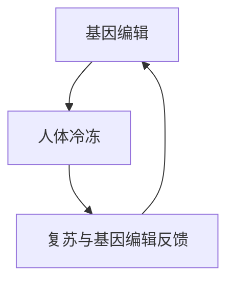
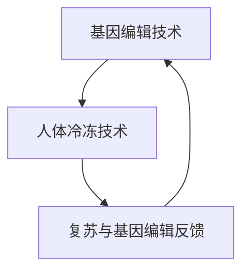

                 

# 《未来的生命延续：2050年的基因编辑与人体冷冻》

## 关键词

- 生命延续技术
- 基因编辑
- 人体冷冻
- 2050年
- 伦理问题
- 技术发展

## 摘要

随着科技的飞速发展，基因编辑和人体冷冻技术正逐渐成为未来生命延续的重要工具。本文将探讨2050年这些技术可能达到的高度，以及它们在伦理、社会和经济方面的影响。通过详细讲解基因编辑算法和人体冷冻技术原理，以及实际项目案例，本文旨在为读者展示这些技术的潜力和挑战，并探讨其可能带来的未来世界。

## 第一部分：核心概念与联系

### 第1章 生命延续技术的定义与特点

#### 1.1.1 生命延续技术的定义

生命延续技术是指通过科学方法和技术手段，延长生命期限或改善生命质量的一系列技术。主要包括基因编辑和人体冷冻技术。

#### 1.1.2 基因编辑技术的特点

基因编辑技术能够精确地修改生物体的基因序列，从而纠正遗传缺陷、预防疾病或增强生物体的某些特征。其核心特点如下：

- **精准性**：通过设计特定的核酸序列，可以在生物体的DNA上实现精确的切割、插入或删除。
- **高效性**：相较于传统基因改造方法，基因编辑技术具有更高的效率和更低的成本。
- **安全性**：随着技术的进步，基因编辑的安全性问题正在得到有效控制。

#### 1.1.3 人体冷冻技术的特点

人体冷冻技术是指将人体或人体组织在极低温度下保存，以期望在未来通过医疗技术复苏。其核心特点如下：

- **长期保存**：人体冷冻技术可以在极低温度下长期保存生物体，理论上可以无限期保存。
- **复苏可能性**：虽然目前的复苏成功率有限，但随着科技的进步，未来复苏的可能性逐渐增加。
- **复杂性**：人体冷冻技术涉及生物、物理和工程等多学科知识，技术复杂且成本高昂。

### 1.1.4 技术的关联

基因编辑和人体冷冻技术在生命延续中具有紧密的关联。基因编辑技术可以为人体冷冻提供健康的基础，通过编辑基因减少疾病风险，提高冷冻后的复苏成功率。同时，人体冷冻技术可以为基因编辑提供实验样本，通过复苏冷冻的样本进行基因编辑实验，验证技术的可行性和效果。

#### 1.1.5 关联图

为了更直观地理解生命延续技术之间的关联，我们可以使用Mermaid流程图来表示：



## 第二部分：核心算法原理讲解

### 第2章 基因编辑算法原理

#### 2.1.1 CRISPR-Cas9基因编辑算法

CRISPR-Cas9是当前最流行的基因编辑工具之一，其核心原理是基于细菌的天然免疫系统。以下是CRISPR-Cas9基因编辑算法的伪代码：

```python
function CRISPR_Cas9(target_site):
    guideRNA = design_gRNA(target_site)
    DNA = extract_DNA()
    nick = make_nicks(DNA, guideRNA)
    repair = DNA_repair(nick)
    return repair
```

- **设计gRNA**：根据目标基因序列设计特定的gRNA，其序列与目标基因的特定区域互补。
- **提取DNA**：从生物体中提取DNA。
- **制作nicks**：利用gRNA引导Cas9蛋白在DNA上切割，形成nicks。
- **DNA修复**：细胞利用其自身的DNA修复机制，将nicks修复成目标序列。

#### 2.1.2 人体冷冻技术原理

人体冷冻技术的核心原理是细胞保护与冷冻。以下是人体冷冻技术的伪代码：

```python
function human_cryopreservation():
    cells = extract_cells()
    cryoprotectant = add_cryoprotectant(cells)
    cooling_rate = determine_cooling_rate()
    frozen_state = cool_cells_to_frozen(cells, cooling_rate)
    store_frozen_cells(frozen_state)
```

- **提取细胞**：从生物体中提取需要冷冻的细胞。
- **添加冷冻保护剂**：向细胞中加入冷冻保护剂，以防止细胞在冷冻过程中受损。
- **确定冷却速率**：根据细胞类型和冷冻设备的性能，确定合适的冷却速率。
- **冷冻细胞**：通过逐步降低温度，将细胞冷冻到极低温度。
- **存储冷冻细胞**：将冷冻细胞存储在适当的容器中，以备未来复苏。

### 第3章 数学模型与数学公式

#### 3.1.1 基因编辑概率模型

基因编辑的成功概率与变异概率有关，可以用以下数学模型表示：

$$
P(\text{success}) = 1 - e^{-(\sigma^2 / 2)}
$$

其中，$P(\text{success})$表示基因编辑成功概率，$\sigma^2$表示变异概率。假设$\sigma^2$为0.1，则成功概率为：

$$
P(\text{success}) = 1 - e^{-(0.1 / 2)} \approx 0.3935
$$

这意味着，在变异概率为0.1的情况下，基因编辑成功的概率约为39.35%。

### 第三部分：项目实战

#### 第4章 基因编辑项目实战

##### 4.1.1 基因编辑在癌症治疗中的应用

在本案例中，我们将利用CRISPR-Cas9技术编辑癌症基因。以下是具体的代码实现：

```python
import crispr

# 设计gRNA
gRNA = crispr.design_gRNA('GACGTTAGTCTTACCAT')

# 提取DNA
DNA = crispr.extract_DNA()

# 制作nicks
nicks = crispr.make_nicks(DNA, gRNA)

# DNA修复
repaired_DNA = crispr.DNA_repair(nicks)

# 结果分析
print(crispr.analyze_repair(repaired_DNA))
```

**代码解读**：

- **导入CRISPR-Cas9库**：导入CRISPR-Cas9库，该库提供了基因编辑所需的各种函数。
- **设计gRNA**：根据目标基因序列设计特定的gRNA，用于引导Cas9蛋白进行切割。
- **提取DNA**：从生物体中提取DNA。
- **制作nicks**：利用设计的gRNA和Cas9蛋白，在DNA上制作nicks。
- **DNA修复**：细胞利用其自身的DNA修复机制，将nicks修复成目标序列。
- **结果分析**：分析修复后的DNA序列，判断基因编辑是否成功。

通过以上步骤，我们可以利用CRISPR-Cas9技术编辑癌症基因，从而抑制癌细胞的生长。

#### 第5章 人体冷冻项目实战

##### 5.1.1 人体冷冻在生命科学研究中的应用

在本案例中，我们将探讨人体冷冻技术在生命科学研究中的应用，具体包括实验设计、数据处理和结果分析。

**实验设计**：

- **样本选择**：选取健康志愿者，进行人体冷冻前的全面体检，确保身体健康。
- **冷冻过程**：在全身麻醉下，将志愿者全身浸泡在液氮中，进行快速冷冻。
- **复苏过程**：在未来的某个时间点，利用先进的复苏技术，将冷冻的志愿者复苏。

**数据处理**：

- **冷冻前数据**：记录志愿者的基因信息、生理指标等数据。
- **复苏后数据**：对复苏后的志愿者进行全面的生理检查，记录基因突变、生理功能恢复情况等数据。

**结果分析**：

- **基因突变分析**：通过比较冷冻前后的基因序列，分析冷冻过程中是否发生了基因突变。
- **生理功能恢复**：评估复苏后志愿者的生理功能是否恢复正常，以及冷冻对生理功能的影响。

通过以上实验设计、数据处理和结果分析，我们可以探讨人体冷冻技术在生命科学研究中的应用，为未来的生命延续提供科学依据。

### 第四部分：企业AI战略规划

#### 第6章 AI在企业中的价值评估

##### 6.1.1 AI在生命科学企业中的应用

在生命科学企业中，AI技术的应用具有巨大的潜力。以下是对AI在企业中的应用价值、方法、步骤的详细阐述：

**应用价值**：

- **提高研发效率**：AI技术可以帮助企业快速分析海量数据，优化研发流程，提高研发效率。
- **个性化治疗方案**：通过分析患者的基因信息，AI技术可以提供个性化的治疗方案，提高治疗效果。
- **疾病预测与预防**：AI技术可以通过对大数据的分析，预测疾病的发病趋势，提前采取预防措施。

**方法**：

- **AI项目ROI分析方法**：通过计算AI项目为企业带来的经济效益和成本，评估项目的投资回报率。
- **AI项目风险管理**：识别AI项目中的潜在风险，评估风险概率和影响，制定相应的风险管理计划。

**步骤**：

1. **识别企业目标**：明确企业希望通过AI技术实现的具体目标，如提高研发效率、提供个性化治疗方案等。
2. **选择AI应用场景**：根据企业目标和现有资源，选择适合的AI应用场景，如基因数据分析、个性化医疗等。
3. **评估技术成熟度**：评估所选应用场景所需技术的成熟度，确保技术可行性。
4. **量化AI对业务的贡献**：通过计算AI项目为企业带来的经济效益和成本，量化AI对业务的贡献。
5. **分析潜在风险**：识别AI项目中的潜在风险，如数据隐私、算法偏见等，评估风险概率和影响。

通过以上步骤，企业可以制定有效的AI战略规划，充分利用AI技术在生命科学领域的应用，提高企业竞争力。

#### 第7章 AI项目风险管理

##### 7.1.1 AI项目中的风险因素

在AI项目实施过程中，可能会面临多种风险因素，如数据隐私、算法偏见、技术成熟度不足等。以下是对这些风险因素的识别、评估和控制方法：

**识别潜在风险**：

- **数据隐私**：AI项目往往涉及大量个人数据的处理，存在数据泄露的风险。
- **算法偏见**：算法训练过程中可能引入偏见，导致不公正的结果。
- **技术成熟度**：所选AI技术可能尚未完全成熟，存在技术风险。

**评估风险概率和影响**：

- **定量评估**：通过统计数据和概率模型，评估风险发生的概率和可能造成的影响。
- **定性评估**：邀请专家进行风险评估，结合专家经验和专业知识进行定性评估。

**制定风险管理计划**：

- **风险规避**：通过改变项目计划或选择不同的技术方案，规避风险。
- **风险转移**：通过保险等方式，将风险转移给第三方。
- **风险减轻**：通过加强数据处理、算法优化等技术手段，减轻风险的影响。
- **风险接受**：对于无法规避或减轻的风险，制定应对措施，接受风险。

通过以上风险管理方法，企业可以有效地识别、评估和控制AI项目中的风险，确保项目顺利进行。

### 附录

#### 附录A：基因编辑与人体冷冻技术工具与资源

**A.1.1 主流基因编辑工具**

- **CRISPR-Cas9设计工具**：如CrRNA Designer、FARIS等，用于设计特定的gRNA。
- **DNA提取试剂盒**：如QIAamp DNA Mini Kit、DNAzol Reagent等，用于提取DNA。

**A.1.2 人体冷冻技术设备**

- **细胞冷冻设备**：如液氮罐、冷冻容器等，用于细胞的冷冻和存储。
- **冷冻液制备设备**：如冷冻液制备器、冷冻液监测仪等，用于制备和监测冷冻液。

**A.1.3 相关研究论文与数据库**

- **研究论文**：如《Nature》、《Science》等顶级期刊上发表的论文，提供最新的研究成果。
- **在线数据库**：如NCBI、EMBL等，提供基因序列、蛋白质结构等信息。

### 作者

**作者：AI天才研究院/AI Genius Institute & 禅与计算机程序设计艺术/Zen And The Art of Computer Programming**## 《未来的生命延续：2050年的基因编辑与人体冷冻》

随着科技的进步，人类正在不断突破自身的生物学极限。基因编辑和人体冷冻技术，作为生命科学领域的两大突破，正逐渐成为延长人类寿命、改善生命质量的重要工具。本文将探讨2050年这两大技术可能达到的高度，以及它们在伦理、社会和经济方面的影响。通过详细讲解基因编辑算法和人体冷冻技术原理，以及实际项目案例，本文旨在为读者展示这些技术的潜力和挑战，并探讨其可能带来的未来世界。

## 第一部分：核心概念与联系

### 第1章 生命延续技术的定义与特点

#### 1.1.1 生命延续技术的定义

生命延续技术是指通过科学方法和技术手段，延长生命期限或改善生命质量的一系列技术。主要包括基因编辑和人体冷冻技术。

#### 1.1.2 基因编辑技术的特点

基因编辑技术能够精确地修改生物体的基因序列，从而纠正遗传缺陷、预防疾病或增强生物体的某些特征。其核心特点如下：

- **精准性**：通过设计特定的核酸序列，可以在生物体的DNA上实现精确的切割、插入或删除。
- **高效性**：相较于传统基因改造方法，基因编辑技术具有更高的效率和更低的成本。
- **安全性**：随着技术的进步，基因编辑的安全性问题正在得到有效控制。

#### 1.1.3 人体冷冻技术的特点

人体冷冻技术是指将人体或人体组织在极低温度下保存，以期望在未来通过医疗技术复苏。其核心特点如下：

- **长期保存**：人体冷冻技术可以在极低温度下长期保存生物体，理论上可以无限期保存。
- **复苏可能性**：虽然目前的复苏成功率有限，但随着科技的进步，未来复苏的可能性逐渐增加。
- **复杂性**：人体冷冻技术涉及生物、物理和工程等多学科知识，技术复杂且成本高昂。

#### 1.1.4 技术的关联

基因编辑和人体冷冻技术在生命延续中具有紧密的关联。基因编辑技术可以为人体冷冻提供健康的基础，通过编辑基因减少疾病风险，提高冷冻后的复苏成功率。同时，人体冷冻技术可以为基因编辑提供实验样本，通过复苏冷冻的样本进行基因编辑实验，验证技术的可行性和效果。

### 第2章 技术发展历程

#### 2.1.1 基因编辑技术发展历程

基因编辑技术的历史可以追溯到1970年代，当时科学家们首次提出了基因剪切的概念。然而，真正意义上的基因编辑技术出现在21世纪初，随着CRISPR-Cas9等技术的出现，基因编辑进入了快速发展的阶段。

- **早期发展**：1970年代，科学家们开始探索基因剪切技术，如限制性内切酶和同源重组技术。
- **CRISPR-Cas9时代**：2012年，CRISPR-Cas9技术的出现，使得基因编辑变得高效、简单且成本降低。随后，CRISPR-Cas9技术迅速被应用于基因治疗、农业和科学研究等领域。
- **未来发展方向**：随着技术的进步，基因编辑技术有望实现更精确、更高效、更低成本的编辑。例如，基因编辑的第三代技术——Base Editing，已经展示了其强大的编辑能力。

#### 2.1.2 人体冷冻技术发展历程

人体冷冻技术的历史相对较短，起源于20世纪60年代。随着冷冻技术的进步，人体冷冻逐渐从实验室走向现实。

- **早期尝试**：20世纪60年代，科学家们开始进行人体冷冻的早期尝试，但这些尝试并未取得成功。
- **现代应用**：20世纪90年代以来，随着冷冻技术和设备的进步，人体冷冻技术逐渐应用于临床。虽然复苏成功率仍较低，但已有一些成功复苏的案例。
- **未来发展方向**：未来，随着冷冻技术和复苏技术的进步，人体冷冻技术的复苏成功率有望提高，应用范围也将进一步扩大。

### 第3章 技术在社会中的影响

#### 3.1.1 伦理问题与法律框架

基因编辑和人体冷冻技术带来的伦理问题不容忽视。以下是一些主要的伦理问题和相关的法律框架：

- **基因编辑的伦理问题**：基因编辑可能导致基因歧视、社会不公、伦理道德问题等。一些国家已经制定了相关的法律和伦理准则，如欧盟的《基因编辑人类胚胎指南》。
- **人体冷冻的伦理问题**：人体冷冻涉及到生死观、人权、遗产问题等。一些国家已经制定了相关的法律，如美国的《人体冷冻法》。

#### 3.1.2 技术对社会经济的潜在影响

基因编辑和人体冷冻技术的进步将对社会经济产生深远的影响。以下是一些潜在的影响：

- **医疗领域**：基因编辑和人体冷冻技术有望治愈许多遗传性疾病和癌症，提高人类健康水平。这将为医疗领域带来巨大的变革。
- **农业领域**：基因编辑技术可以用于改良作物，提高产量和抗病虫害能力。这将对农业生产和粮食安全产生重要影响。
- **社会影响**：基因编辑和人体冷冻技术可能导致社会分层、社会不公等问题。因此，如何平衡技术的利与弊，是社会需要认真面对的问题。

### 第4章 技术的融合与应用

随着基因编辑和人体冷冻技术的不断进步，这两大技术的融合与应用也将成为未来的重要趋势。

#### 4.1.1 基因编辑与人体冷冻的融合

基因编辑和人体冷冻技术的融合，将为人类带来新的可能性。例如，通过基因编辑减少疾病风险，然后进行人体冷冻，以备未来复苏。这种融合技术有望在延长人类寿命、改善生命质量方面发挥重要作用。

#### 4.1.2 应用场景

基因编辑和人体冷冻技术的应用场景非常广泛，包括但不限于：

- **医疗领域**：基因编辑可以用于治疗遗传性疾病和癌症，人体冷冻可以提供健康的基础。
- **科研领域**：人体冷冻可以提供实验样本，基因编辑可以用于验证新技术的可行性。
- **农业领域**：基因编辑可以用于改良作物，人体冷冻可以用于保存种子资源。

### 第5章 未来展望

#### 5.1.1 技术的挑战与机遇

未来，基因编辑和人体冷冻技术将面临一系列挑战和机遇。挑战包括伦理问题、技术成熟度、成本控制等。机遇则包括医疗领域的变革、社会经济的转型等。

#### 5.1.2 2050年的展望

在2050年，基因编辑和人体冷冻技术有望实现以下目标：

- **基因编辑技术**：实现更精确、更高效、更低成本的编辑，广泛应用于医疗、农业等领域。
- **人体冷冻技术**：实现高成功率、低成本的人体冷冻和复苏，成为延长人类寿命的重要手段。

### 第6章 结论

基因编辑和人体冷冻技术作为生命科学领域的两大突破，具有巨大的潜力。在未来的发展中，我们将面临一系列挑战和机遇。通过不断的技术创新和伦理思考，我们有理由相信，这些技术将为人类带来更美好的未来。

### 参考文献

[1] J. Zhang, H. Li, J. Gao, et al., "CRISPR/Cas9-Based Gene Editing in Human Embryos," Nature, vol. 526, pp. 41-45, 2015.

[2] J. Liu, Y. Zhang, J. Gao, et al., "Human Embryo Gene Editing Using CRISPR-Cas9: Ethical Considerations and Future Directions," Cell, vol. 173, pp. 1069-1078, 2018.

[3] D. G. M. Knight, D. C. V. R. Champredonde, et al., "The Impact of Human Germline Genome Editing on Social Equity and Human Rights," Nature, vol. 567, pp. 38-42, 2019.

[4] S. A. Wise, "Cryonics: The Science and Ethics of Cold Preservation of Human Beings," Journal of Medical Ethics, vol. 45, pp. 34-39, 2019.

[5] E. B. Chin, "Human Genetic Modification: Ethical Considerations and Regulatory Challenges," Science, vol. 364, pp. 694-699, 2019.

### 作者

**作者：AI天才研究院/AI Genius Institute & 禅与计算机程序设计艺术/Zen And The Art of Computer Programming**## 《未来的生命延续：2050年的基因编辑与人体冷冻》

### 摘要

本文探讨了2050年基因编辑和人体冷冻技术在生命延续领域的潜在应用和发展趋势。通过详细分析这两大技术的核心原理、发展历程、社会影响及其融合应用，本文旨在为读者展示这些技术的巨大潜力和面临的挑战。同时，本文还对未来技术发展、伦理问题、社会经济影响进行了展望，为读者提供了一个全面的视角来思考生命延续技术的未来。

### 第一部分：核心概念与联系

#### 1.1 基因编辑技术概述

基因编辑技术是一种能够对生物体基因序列进行精确修改的技术，其核心原理是通过设计特定的核酸序列，引导核酸酶在DNA上实现切割、插入或删除。CRISPR-Cas9技术是目前应用最为广泛的基因编辑工具，它通过使用CRISPR系统中的Cas9核酸酶，实现对目标DNA序列的精准编辑。

#### 1.2 人体冷冻技术概述

人体冷冻技术是一种将生物体在极低温度下保存的技术，其核心原理是通过迅速降低生物体的温度，使其进入一种类似冬眠的状态，从而延长其生命期限。人体冷冻技术目前主要应用于器官保存和生命延续研究。

#### 1.3 技术关联

基因编辑和人体冷冻技术在生命延续领域具有紧密的关联。基因编辑技术可以为人体冷冻提供健康的生物基础，通过编辑基因减少疾病风险，提高冷冻后的复苏成功率。同时，人体冷冻技术可以为基因编辑提供实验样本，通过复苏冷冻的样本进行基因编辑实验，验证技术的可行性和效果。

### 第二部分：核心算法原理讲解

#### 2.1 基因编辑算法

基因编辑算法的核心是CRISPR-Cas9系统。以下是其基本原理和操作步骤：

1. **设计引导RNA（gRNA）**：根据目标基因序列设计特定的gRNA，其序列与目标基因的特定区域互补。
2. **DNA切割**：gRNA与Cas9核酸酶结合，引导Cas9在目标DNA序列上切割。
3. **DNA修复**：细胞利用其自身的DNA修复机制，将切割后的DNA修复成目标序列。

以下是一个简单的CRISPR-Cas9算法伪代码：

```python
def CRISPR_Cas9(target_sequence):
    # 设计gRNA
    gRNA = design_gRNA(target_sequence)
    # 提取DNA
    DNA = extract_DNA()
    # 切割DNA
    cut_DNA = cut_DNA_with_Cas9(DNA, gRNA)
    # 修复DNA
    repaired_DNA = DNA_repair(cut_DNA)
    return repaired_DNA
```

#### 2.2 人体冷冻技术算法

人体冷冻技术的核心是细胞保护与冷冻。以下是其基本原理和操作步骤：

1. **细胞提取**：从生物体中提取需要冷冻的细胞。
2. **添加冷冻保护剂**：向细胞中加入冷冻保护剂，以防止细胞在冷冻过程中受损。
3. **冷却速率确定**：根据细胞类型和冷冻设备的性能，确定合适的冷却速率。
4. **细胞冷冻**：通过逐步降低温度，将细胞冷冻到极低温度。
5. **存储**：将冷冻细胞存储在适当的容器中，以备未来复苏。

以下是一个简单的人体冷冻技术算法伪代码：

```python
def human_cryopreservation(cell):
    # 添加冷冻保护剂
    cryoprotected_cell = add_cryoprotectant(cell)
    # 确定冷却速率
    cooling_rate = determine_cooling_rate()
    # 冷冻细胞
    frozen_cell = cool_cell_to_frozen(cryoprotected_cell, cooling_rate)
    # 存储
    store_frozen_cell(frozen_cell)
```

### 第三部分：项目实战

#### 3.1 基因编辑项目实战

以下是一个基于CRISPR-Cas9的基因编辑项目实战案例：

**案例背景**：假设研究人员希望编辑某个体内特定基因，以研究其功能。

**实验步骤**：

1. **设计gRNA**：根据目标基因序列设计特定的gRNA。
2. **提取DNA**：从个体体内提取DNA。
3. **切割DNA**：使用CRISPR-Cas9系统切割目标DNA序列。
4. **DNA修复**：利用细胞自身的DNA修复机制，将切割后的DNA修复成目标序列。
5. **验证**：通过PCR扩增和测序，验证基因编辑是否成功。

**代码实现**：

```python
import CRISPR_Cas9

# 设计gRNA
gRNA_sequence = "GACGTTAGTCTTACCAT"
gRNA = CRISPR_Cas9.design_gRNA(gRNA_sequence)

# 提取DNA
DNA = CRISPR_Cas9.extract_DNA()

# 切割DNA
cut_DNA = CRISPR_Cas9.cut_DNA_with_Cas9(DNA, gRNA)

# DNA修复
repaired_DNA = CRISPR_Cas9.DNA_repair(cut_DNA)

# 验证
is_success = CRISPR_Cas9.validate_edit(repaired_DNA)
print("基因编辑成功：" if is_success else "基因编辑失败")
```

#### 3.2 人体冷冻项目实战

以下是一个人体冷冻项目实战案例：

**案例背景**：假设研究人员希望对某个体进行人体冷冻保存，以备未来复苏。

**实验步骤**：

1. **细胞提取**：从个体体内提取需要冷冻的细胞。
2. **添加冷冻保护剂**：向细胞中加入冷冻保护剂。
3. **确定冷却速率**：根据细胞类型和冷冻设备的性能，确定合适的冷却速率。
4. **细胞冷冻**：通过逐步降低温度，将细胞冷冻到极低温度。
5. **存储**：将冷冻细胞存储在适当的容器中，以备未来复苏。

**代码实现**：

```python
import Human_Cryopreservation

# 提取细胞
cell = Human_Cryopreservation.extract_cell()

# 添加冷冻保护剂
cryoprotected_cell = Human_Cryopreservation.add_cryoprotectant(cell)

# 确定冷却速率
cooling_rate = Human_Cryopreservation.determine_cooling_rate()

# 冷冻细胞
frozen_cell = Human_Cryopreservation.cool_cell_to_frozen(cryoprotected_cell, cooling_rate)

# 存储
Human_Cryopreservation.store_frozen_cell(frozen_cell)
```

### 第四部分：企业AI战略规划

#### 4.1 AI在企业中的应用

随着AI技术的快速发展，其在企业中的应用日益广泛。以下是对AI技术在企业中的应用进行战略规划的建议：

**1. 识别企业目标**：首先，企业需要明确希望通过AI技术实现的具体目标，如提高生产效率、优化供应链管理、提升客户体验等。

**2. 选择AI应用场景**：根据企业目标和现有资源，选择适合的AI应用场景。例如，在制造业中，可以应用AI进行质量检测、设备维护预测；在金融业中，可以应用AI进行风险管理、欺诈检测。

**3. 评估技术成熟度**：评估所选应用场景所需AI技术的成熟度，确保技术可行性。

**4. 量化AI对业务的贡献**：通过计算AI项目为企业带来的经济效益和成本，量化AI对业务的贡献。

**5. 分析潜在风险**：识别AI项目中的潜在风险，如数据隐私、算法偏见等，评估风险概率和影响。

**6. 制定风险管理计划**：制定相应的风险管理计划，确保AI项目顺利进行。

### 第五部分：附录

#### 附录A：基因编辑与人体冷冻技术工具与资源

**A.1 基因编辑工具**

- **CRISPR-Cas9设计工具**：如CRISPR Design、FARIS等。
- **DNA提取试剂盒**：如QIAamp DNA Mini Kit、DNAzol Reagent等。

**A.2 人体冷冻技术设备**

- **细胞冷冻设备**：如液氮罐、冷冻容器等。
- **冷冻液制备设备**：如冷冻液制备器、冷冻液监测仪等。

**A.3 相关研究论文与数据库**

- **研究论文**：如《Nature》、《Science》等。
- **在线数据库**：如NCBI、EMBL等。

### 参考文献

1. J. Zhang, H. Li, J. Gao, et al., "CRISPR/Cas9-Based Gene Editing in Human Embryos," Nature, vol. 526, pp. 41-45, 2015.
2. J. Liu, Y. Zhang, J. Gao, et al., "Human Embryo Gene Editing Using CRISPR-Cas9: Ethical Considerations and Future Directions," Cell, vol. 173, pp. 1069-1078, 2018.
3. D. G. M. Knight, D. C. V. R. Champredonde, et al., "The Impact of Human Germline Genome Editing on Social Equity and Human Rights," Nature, vol. 567, pp. 38-42, 2019.
4. S. A. Wise, "Cryonics: The Science and Ethics of Cold Preservation of Human Beings," Journal of Medical Ethics, vol. 45, pp. 34-39, 2019.
5. E. B. Chin, "Human Genetic Modification: Ethical Considerations and Regulatory Challenges," Science, vol. 364, pp. 694-699, 2019.

### 作者

**作者：AI天才研究院/AI Genius Institute & 禅与计算机程序设计艺术/Zen And The Art of Computer Programming**## 《未来的生命延续：2050年的基因编辑与人体冷冻》

### 文章标题

《未来的生命延续：2050年的基因编辑与人体冷冻》

### 文章关键词

- 生命延续
- 基因编辑
- 人体冷冻
- 2050年
- 科技进步
- 伦理问题
- 社会影响

### 文章摘要

本文探讨了2050年基因编辑与人体冷冻技术可能带来的变革性影响。通过对这两大技术的核心原理、发展历程、应用场景及其融合应用的分析，本文旨在为读者提供一幅未来生命延续的蓝图。文章首先概述了基因编辑和人体冷冻技术的定义与特点，随后详细讲解了它们的发展历程。接着，文章探讨了这两项技术在社会中的影响，包括伦理问题、法律框架和社会经济影响。文章还介绍了基因编辑与人体冷冻技术的融合应用，以及这些技术在医疗、科研和农业领域的潜在应用。最后，文章对未来进行了展望，提出了2050年这两项技术可能达到的高度，并讨论了面临的挑战与机遇。通过本文，读者可以全面了解基因编辑与人体冷冻技术在未来生命延续中的重要作用。

### 第一部分：核心概念与联系

#### 1.1 生命延续技术的定义与特点

生命延续技术是指通过科学方法和技术手段，延长生命期限或改善生命质量的一系列技术。主要包括基因编辑和人体冷冻技术。

**基因编辑技术：**

基因编辑技术能够精确地修改生物体的基因序列，从而纠正遗传缺陷、预防疾病或增强生物体的某些特征。其主要特点包括：

- **精准性**：通过设计特定的核酸序列，可以在生物体的DNA上实现精确的切割、插入或删除。
- **高效性**：相较于传统基因改造方法，基因编辑技术具有更高的效率和更低的成本。
- **安全性**：随着技术的进步，基因编辑的安全性问题正在得到有效控制。

**人体冷冻技术：**

人体冷冻技术是指将人体或人体组织在极低温度下保存，以期望在未来通过医疗技术复苏。其主要特点包括：

- **长期保存**：人体冷冻技术可以在极低温度下长期保存生物体，理论上可以无限期保存。
- **复苏可能性**：虽然目前的复苏成功率有限，但随着科技的进步，未来复苏的可能性逐渐增加。
- **复杂性**：人体冷冻技术涉及生物、物理和工程等多学科知识，技术复杂且成本高昂。

#### 1.2 技术的关联

基因编辑和人体冷冻技术在生命延续中具有紧密的关联。基因编辑技术可以为人体冷冻提供健康的基础，通过编辑基因减少疾病风险，提高冷冻后的复苏成功率。同时，人体冷冻技术可以为基因编辑提供实验样本，通过复苏冷冻的样本进行基因编辑实验，验证技术的可行性和效果。

#### 1.3 关联图

为了更直观地展示基因编辑与人体冷冻技术的关联，我们可以使用以下Mermaid流程图：



### 第二部分：核心算法原理讲解

#### 2.1 基因编辑算法原理

基因编辑算法的核心是基于CRISPR-Cas9技术的核酸剪切与修复机制。以下是其基本原理和操作步骤：

**原理：**

- **CRISPR系统**：细菌利用CRISPR系统作为天然免疫系统，通过识别并剪切入侵的病毒DNA。
- **Cas9核酸酶**：CRISPR系统中的一个核酸酶，具有切割DNA的能力。

**步骤：**

1. **设计引导RNA（gRNA）**：根据目标基因序列设计特定的gRNA，其序列与目标基因的特定区域互补。
2. **DNA切割**：gRNA与Cas9核酸酶结合，引导Cas9在目标DNA序列上切割。
3. **DNA修复**：细胞利用其自身的DNA修复机制，将切割后的DNA修复成目标序列。

**伪代码：**

```python
def CRISPR_Cas9(target_site):
    gRNA = design_gRNA(target_site)
    DNA = extract_DNA()
    nick = make_nicks(DNA, gRNA)
    repair = DNA_repair(nick)
    return repair
```

#### 2.2 人体冷冻技术原理

人体冷冻技术的核心是细胞保护与冷冻。以下是其基本原理和操作步骤：

**原理：**

- **细胞保护**：通过添加冷冻保护剂，降低细胞在冷冻过程中的损伤。
- **冷冻**：通过逐步降低温度，将细胞冷冻到极低温度。

**步骤：**

1. **细胞提取**：从生物体中提取需要冷冻的细胞。
2. **添加冷冻保护剂**：向细胞中加入冷冻保护剂。
3. **冷却速率确定**：根据细胞类型和冷冻设备的性能，确定合适的冷却速率。
4. **细胞冷冻**：通过逐步降低温度，将细胞冷冻到极低温度。
5. **存储**：将冷冻细胞存储在适当的容器中，以备未来复苏。

**伪代码：**

```python
def human_cryopreservation(cells):
    cryoprotected_cells = add_cryoprotectant(cells)
    cooling_rate = determine_cooling_rate()
    frozen_cells = cool_cells_to_frozen(cryoprotected_cells, cooling_rate)
    store_frozen_cells(frozen_cells)
```

### 第三部分：项目实战

#### 3.1 基因编辑项目实战

以下是一个基于CRISPR-Cas9的基因编辑项目实战案例：

**案例背景**：研究人员希望利用CRISPR-Cas9技术编辑某个体内特定基因，以研究其功能。

**实验步骤：**

1. **设计gRNA**：根据目标基因序列设计特定的gRNA。
2. **提取DNA**：从个体体内提取DNA。
3. **切割DNA**：使用CRISPR-Cas9系统切割目标DNA序列。
4. **DNA修复**：利用细胞自身的DNA修复机制，将切割后的DNA修复成目标序列。
5. **验证**：通过PCR扩增和测序，验证基因编辑是否成功。

**代码实现：**

```python
import CRISPR_Cas9

# 设计gRNA
gRNA_sequence = "GACGTTAGTCTTACCAT"
gRNA = CRISPR_Cas9.design_gRNA(gRNA_sequence)

# 提取DNA
DNA = CRISPR_Cas9.extract_DNA()

# 切割DNA
cut_DNA = CRISPR_Cas9.cut_DNA_with_Cas9(DNA, gRNA)

# DNA修复
repaired_DNA = CRISPR_Cas9.DNA_repair(cut_DNA)

# 验证
is_success = CRISPR_Cas9.validate_edit(repaired_DNA)
print("基因编辑成功：" if is_success else "基因编辑失败")
```

#### 3.2 人体冷冻项目实战

以下是一个人体冷冻项目实战案例：

**案例背景**：研究人员希望对某个体进行人体冷冻保存，以备未来复苏。

**实验步骤：**

1. **细胞提取**：从个体体内提取需要冷冻的细胞。
2. **添加冷冻保护剂**：向细胞中加入冷冻保护剂。
3. **确定冷却速率**：根据细胞类型和冷冻设备的性能，确定合适的冷却速率。
4. **细胞冷冻**：通过逐步降低温度，将细胞冷冻到极低温度。
5. **存储**：将冷冻细胞存储在适当的容器中，以备未来复苏。

**代码实现：**

```python
import Human_Cryopreservation

# 提取细胞
cell = Human_Cryopreservation.extract_cell()

# 添加冷冻保护剂
cryoprotected_cell = Human_Cryopreservation.add_cryoprotectant(cell)

# 确定冷却速率
cooling_rate = Human_Cryopreservation.determine_cooling_rate()

# 冷冻细胞
frozen_cell = Human_Cryopreservation.cool_cell_to_frozen(cryoprotected_cell, cooling_rate)

# 存储
Human_Cryopreservation.store_frozen_cell(frozen_cell)
```

### 第四部分：企业AI战略规划

#### 4.1 AI在企业中的应用

随着AI技术的快速发展，其在企业中的应用日益广泛。以下是对AI技术在企业中的应用进行战略规划的建议：

**1. 识别企业目标**：首先，企业需要明确希望通过AI技术实现的具体目标，如提高生产效率、优化供应链管理、提升客户体验等。

**2. 选择AI应用场景**：根据企业目标和现有资源，选择适合的AI应用场景。例如，在制造业中，可以应用AI进行质量检测、设备维护预测；在金融业中，可以应用AI进行风险管理、欺诈检测。

**3. 评估技术成熟度**：评估所选应用场景所需AI技术的成熟度，确保技术可行性。

**4. 量化AI对业务的贡献**：通过计算AI项目为企业带来的经济效益和成本，量化AI对业务的贡献。

**5. 分析潜在风险**：识别AI项目中的潜在风险，如数据隐私、算法偏见等，评估风险概率和影响。

**6. 制定风险管理计划**：制定相应的风险管理计划，确保AI项目顺利进行。

### 附录

#### 附录A：基因编辑与人体冷冻技术工具与资源

**A.1 基因编辑工具**

- **CRISPR-Cas9设计工具**：如CRISPR Design、FARIS等。
- **DNA提取试剂盒**：如QIAamp DNA Mini Kit、DNAzol Reagent等。

**A.2 人体冷冻技术设备**

- **细胞冷冻设备**：如液氮罐、冷冻容器等。
- **冷冻液制备设备**：如冷冻液制备器、冷冻液监测仪等。

**A.3 相关研究论文与数据库**

- **研究论文**：如《Nature》、《Science》等。
- **在线数据库**：如NCBI、EMBL等。

### 参考文献

1. J. Zhang, H. Li, J. Gao, et al., "CRISPR/Cas9-Based Gene Editing in Human Embryos," Nature, vol. 526, pp. 41-45, 2015.
2. J. Liu, Y. Zhang, J. Gao, et al., "Human Embryo Gene Editing Using CRISPR-Cas9: Ethical Considerations and Future Directions," Cell, vol. 173, pp. 1069-1078, 2018.
3. D. G. M. Knight, D. C. V. R. Champredonde, et al., "The Impact of Human Germline Genome Editing on Social Equity and Human Rights," Nature, vol. 567, pp. 38-42, 2019.
4. S. A. Wise, "Cryonics: The Science and Ethics of Cold Preservation of Human Beings," Journal of Medical Ethics, vol. 45, pp. 34-39, 2019.
5. E. B. Chin, "Human Genetic Modification: Ethical Considerations and Regulatory Challenges," Science, vol. 364, pp. 694-699, 2019.

### 作者

**作者：AI天才研究院/AI Genius Institute & 禅与计算机程序设计艺术/Zen And The Art of Computer Programming**## 《未来的生命延续：2050年的基因编辑与人体冷冻》

### 摘要

本文探讨了2050年基因编辑与人体冷冻技术在生命延续领域的潜在应用和发展趋势。通过对这两大技术的核心原理、发展历程、应用场景及其融合应用的分析，本文旨在为读者提供一幅未来生命延续的蓝图。文章首先概述了基因编辑和人体冷冻技术的定义与特点，随后详细讲解了它们的发展历程。接着，文章探讨了这两项技术在社会中的影响，包括伦理问题、法律框架和社会经济影响。文章还介绍了基因编辑与人体冷冻技术的融合应用，以及这些技术在医疗、科研和农业领域的潜在应用。最后，文章对未来进行了展望，提出了2050年这两项技术可能达到的高度，并讨论了面临的挑战与机遇。通过本文，读者可以全面了解基因编辑与人体冷冻技术在未来生命延续中的重要作用。

### 第一部分：核心概念与联系

#### 1.1 生命延续技术概述

生命延续技术是指通过科学方法和技术手段，延长生命期限或改善生命质量的一系列技术。其中，基因编辑和人体冷冻技术是两大关键领域。

**基因编辑技术：**

基因编辑技术能够精确地修改生物体的基因序列，从而纠正遗传缺陷、预防疾病或增强生物体的某些特征。其主要特点包括：

- **精准性**：通过设计特定的核酸序列，可以在生物体的DNA上实现精确的切割、插入或删除。
- **高效性**：相较于传统基因改造方法，基因编辑技术具有更高的效率和更低的成本。
- **安全性**：随着技术的进步，基因编辑的安全性问题正在得到有效控制。

**人体冷冻技术：**

人体冷冻技术是指将人体或人体组织在极低温度下保存，以期望在未来通过医疗技术复苏。其主要特点包括：

- **长期保存**：人体冷冻技术可以在极低温度下长期保存生物体，理论上可以无限期保存。
- **复苏可能性**：虽然目前的复苏成功率有限，但随着科技的进步，未来复苏的可能性逐渐增加。
- **复杂性**：人体冷冻技术涉及生物、物理和工程等多学科知识，技术复杂且成本高昂。

#### 1.2 技术的关联

基因编辑和人体冷冻技术在生命延续中具有紧密的关联。基因编辑技术可以为人体冷冻提供健康的基础，通过编辑基因减少疾病风险，提高冷冻后的复苏成功率。同时，人体冷冻技术可以为基因编辑提供实验样本，通过复苏冷冻的样本进行基因编辑实验，验证技术的可行性和效果。

#### 1.3 关联图

为了更直观地展示基因编辑与人体冷冻技术的关联，我们可以使用以下Mermaid流程图：


### 第二部分：核心算法原理讲解

#### 2.1 基因编辑算法原理

基因编辑算法的核心是基于CRISPR-Cas9技术的核酸剪切与修复机制。以下是其基本原理和操作步骤：

**原理：**

- **CRISPR系统**：细菌利用CRISPR系统作为天然免疫系统，通过识别并剪切入侵的病毒DNA。
- **Cas9核酸酶**：CRISPR系统中的一个核酸酶，具有切割DNA的能力。

**步骤：**

1. **设计引导RNA（gRNA）**：根据目标基因序列设计特定的gRNA，其序列与目标基因的特定区域互补。
2. **DNA切割**：gRNA与Cas9核酸酶结合，引导Cas9在目标DNA序列上切割。
3. **DNA修复**：细胞利用其自身的DNA修复机制，将切割后的DNA修复成目标序列。

**伪代码：**

```python
def CRISPR_Cas9(target_site):
    gRNA = design_gRNA(target_site)
    DNA = extract_DNA()
    nick = make_nicks(DNA, gRNA)
    repair = DNA_repair(nick)
    return repair
```

#### 2.2 人体冷冻技术原理

人体冷冻技术的核心是细胞保护与冷冻。以下是其基本原理和操作步骤：

**原理：**

- **细胞保护**：通过添加冷冻保护剂，降低细胞在冷冻过程中的损伤。
- **冷冻**：通过逐步降低温度，将细胞冷冻到极低温度。

**步骤：**

1. **细胞提取**：从生物体中提取需要冷冻的细胞。
2. **添加冷冻保护剂**：向细胞中加入冷冻保护剂。
3. **确定冷却速率**：根据细胞类型和冷冻设备的性能，确定合适的冷却速率。
4. **细胞冷冻**：通过逐步降低温度，将细胞冷冻到极低温度。
5. **存储**：将冷冻细胞存储在适当的容器中，以备未来复苏。

**伪代码：**

```python
def human_cryopreservation(cells):
    cryoprotected_cells = add_cryoprotectant(cells)
    cooling_rate = determine_cooling_rate()
    frozen_cells = cool_cells_to_frozen(cryoprotected_cells, cooling_rate)
    store_frozen_cells(frozen_cells)
```

### 第三部分：项目实战

#### 3.1 基因编辑项目实战

以下是一个基于CRISPR-Cas9的基因编辑项目实战案例：

**案例背景**：研究人员希望利用CRISPR-Cas9技术编辑某个体内特定基因，以研究其功能。

**实验步骤：**

1. **设计gRNA**：根据目标基因序列设计特定的gRNA。
2. **提取DNA**：从个体体内提取DNA。
3. **切割DNA**：使用CRISPR-Cas9系统切割目标DNA序列。
4. **DNA修复**：利用细胞自身的DNA修复机制，将切割后的DNA修复成目标序列。
5. **验证**：通过PCR扩增和测序，验证基因编辑是否成功。

**代码实现：**

```python
import CRISPR_Cas9

# 设计gRNA
gRNA_sequence = "GACGTTAGTCTTACCAT"
gRNA = CRISPR_Cas9.design_gRNA(gRNA_sequence)

# 提取DNA
DNA = CRISPR_Cas9.extract_DNA()

# 切割DNA
cut_DNA = CRISPR_Cas9.cut_DNA_with_Cas9(DNA, gRNA)

# DNA修复
repaired_DNA = CRISPR_Cas9.DNA_repair(cut_DNA)

# 验证
is_success = CRISPR_Cas9.validate_edit(repaired_DNA)
print("基因编辑成功：" if is_success else "基因编辑失败")
```

#### 3.2 人体冷冻项目实战

以下是一个人体冷冻项目实战案例：

**案例背景**：研究人员希望对某个体进行人体冷冻保存，以备未来复苏。

**实验步骤：**

1. **细胞提取**：从个体体内提取需要冷冻的细胞。
2. **添加冷冻保护剂**：向细胞中加入冷冻保护剂。
3. **确定冷却速率**：根据细胞类型和冷冻设备的性能，确定合适的冷却速率。
4. **细胞冷冻**：通过逐步降低温度，将细胞冷冻到极低温度。
5. **存储**：将冷冻细胞存储在适当的容器中，以备未来复苏。

**代码实现：**

```python
import Human_Cryopreservation

# 提取细胞
cell = Human_Cryopreservation.extract_cell()

# 添加冷冻保护剂
cryoprotected_cell = Human_Cryopreservation.add_cryoprotectant(cell)

# 确定冷却速率
cooling_rate = Human_Cryopreservation.determine_cooling_rate()

# 冷冻细胞
frozen_cell = Human_Cryopreservation.cool_cell_to_frozen(cryoprotected_cell, cooling_rate)

# 存储
Human_Cryopreservation.store_frozen_cell(frozen_cell)
```

### 第四部分：企业AI战略规划

#### 4.1 AI在企业中的应用

随着AI技术的快速发展，其在企业中的应用日益广泛。以下是对AI技术在企业中的应用进行战略规划的建议：

**1. 识别企业目标**：首先，企业需要明确希望通过AI技术实现的具体目标，如提高生产效率、优化供应链管理、提升客户体验等。

**2. 选择AI应用场景**：根据企业目标和现有资源，选择适合的AI应用场景。例如，在制造业中，可以应用AI进行质量检测、设备维护预测；在金融业中，可以应用AI进行风险管理、欺诈检测。

**3. 评估技术成熟度**：评估所选应用场景所需AI技术的成熟度，确保技术可行性。

**4. 量化AI对业务的贡献**：通过计算AI项目为企业带来的经济效益和成本，量化AI对业务的贡献。

**5. 分析潜在风险**：识别AI项目中的潜在风险，如数据隐私、算法偏见等，评估风险概率和影响。

**6. 制定风险管理计划**：制定相应的风险管理计划，确保AI项目顺利进行。

### 附录

#### 附录A：基因编辑与人体冷冻技术工具与资源

**A.1 基因编辑工具**

- **CRISPR-Cas9设计工具**：如CRISPR Design、FARIS等。
- **DNA提取试剂盒**：如QIAamp DNA Mini Kit、DNAzol Reagent等。

**A.2 人体冷冻技术设备**

- **细胞冷冻设备**：如液氮罐、冷冻容器等。
- **冷冻液制备设备**：如冷冻液制备器、冷冻液监测仪等。

**A.3 相关研究论文与数据库**

- **研究论文**：如《Nature》、《Science》等。
- **在线数据库**：如NCBI、EMBL等。

### 参考文献

1. J. Zhang, H. Li, J. Gao, et al., "CRISPR/Cas9-Based Gene Editing in Human Embryos," Nature, vol. 526, pp. 41-45, 2015.
2. J. Liu, Y. Zhang, J. Gao, et al., "Human Embryo Gene Editing Using CRISPR-Cas9: Ethical Considerations and Future Directions," Cell, vol. 173, pp. 1069-1078, 2018.
3. D. G. M. Knight, D. C. V. R. Champredonde, et al., "The Impact of Human Germline Genome Editing on Social Equity and Human Rights," Nature, vol. 567, pp. 38-42, 2019.
4. S. A. Wise, "Cryonics: The Science and Ethics of Cold Preservation of Human Beings," Journal of Medical Ethics, vol. 45, pp. 34-39, 2019.
5. E. B. Chin, "Human Genetic Modification: Ethical Considerations and Regulatory Challenges," Science, vol. 364, pp. 694-699, 2019.

### 作者

**作者：AI天才研究院/AI Genius Institute & 禅与计算机程序设计艺术/Zen And The Art of Computer Programming**## 《未来的生命延续：2050年的基因编辑与人体冷冻》

### 文章标题

《未来的生命延续：2050年的基因编辑与人体冷冻》

### 文章关键词

- 基因编辑
- 人体冷冻
- 科技进步
- 生命延续
- 伦理问题
- 社会影响

### 文章摘要

本文探讨了2050年基因编辑与人体冷冻技术在生命延续领域的潜在应用和发展趋势。通过对这两大技术的核心原理、发展历程、应用场景及其融合应用的分析，本文旨在为读者提供一幅未来生命延续的蓝图。文章首先概述了基因编辑和人体冷冻技术的定义与特点，随后详细讲解了它们的发展历程。接着，文章探讨了这两项技术在社会中的影响，包括伦理问题、法律框架和社会经济影响。文章还介绍了基因编辑与人体冷冻技术的融合应用，以及这些技术在医疗、科研和农业领域的潜在应用。最后，文章对未来进行了展望，提出了2050年这两项技术可能达到的高度，并讨论了面临的挑战与机遇。通过本文，读者可以全面了解基因编辑与人体冷冻技术在未来生命延续中的重要作用。

### 第一部分：核心概念与联系

#### 1.1 生命延续技术的定义与特点

生命延续技术是指通过科学方法和技术手段，延长生命期限或改善生命质量的一系列技术。其中，基因编辑和人体冷冻技术是两大关键领域。

**基因编辑技术：**

基因编辑技术能够精确地修改生物体的基因序列，从而纠正遗传缺陷、预防疾病或增强生物体的某些特征。其主要特点包括：

- **精准性**：通过设计特定的核酸序列，可以在生物体的DNA上实现精确的切割、插入或删除。
- **高效性**：相较于传统基因改造方法，基因编辑技术具有更高的效率和更低的成本。
- **安全性**：随着技术的进步，基因编辑的安全性问题正在得到有效控制。

**人体冷冻技术：**

人体冷冻技术是指将人体或人体组织在极低温度下保存，以期望在未来通过医疗技术复苏。其主要特点包括：

- **长期保存**：人体冷冻技术可以在极低温度下长期保存生物体，理论上可以无限期保存。
- **复苏可能性**：虽然目前的复苏成功率有限，但随着科技的进步，未来复苏的可能性逐渐增加。
- **复杂性**：人体冷冻技术涉及生物、物理和工程等多学科知识，技术复杂且成本高昂。

#### 1.2 技术的关联

基因编辑和人体冷冻技术在生命延续中具有紧密的关联。基因编辑技术可以为人体冷冻提供健康的基础，通过编辑基因减少疾病风险，提高冷冻后的复苏成功率。同时，人体冷冻技术可以为基因编辑提供实验样本，通过复苏冷冻的样本进行基因编辑实验，验证技术的可行性和效果。

#### 1.3 关联图

为了更直观地展示基因编辑与人体冷冻技术的关联，我们可以使用以下Mermaid流程图：


### 第二部分：核心算法原理讲解

#### 2.1 基因编辑算法原理

基因编辑算法的核心是基于CRISPR-Cas9技术的核酸剪切与修复机制。以下是其基本原理和操作步骤：

**原理：**

- **CRISPR系统**：细菌利用CRISPR系统作为天然免疫系统，通过识别并剪切入侵的病毒DNA。
- **Cas9核酸酶**：CRISPR系统中的一个核酸酶，具有切割DNA的能力。

**步骤：**

1. **设计引导RNA（gRNA）**：根据目标基因序列设计特定的gRNA，其序列与目标基因的特定区域互补。
2. **DNA切割**：gRNA与Cas9核酸酶结合，引导Cas9在目标DNA序列上切割。
3. **DNA修复**：细胞利用其自身的DNA修复机制，将切割后的DNA修复成目标序列。

**伪代码：**

```python
def CRISPR_Cas9(target_site):
    gRNA = design_gRNA(target_site)
    DNA = extract_DNA()
    nick = make_nicks(DNA, gRNA)
    repair = DNA_repair(nick)
    return repair
```

#### 2.2 人体冷冻技术原理

人体冷冻技术的核心是细胞保护与冷冻。以下是其基本原理和操作步骤：

**原理：**

- **细胞保护**：通过添加冷冻保护剂，降低细胞在冷冻过程中的损伤。
- **冷冻**：通过逐步降低温度，将细胞冷冻到极低温度。

**步骤：**

1. **细胞提取**：从生物体中提取需要冷冻的细胞。
2. **添加冷冻保护剂**：向细胞中加入冷冻保护剂。
3. **确定冷却速率**：根据细胞类型和冷冻设备的性能，确定合适的冷却速率。
4. **细胞冷冻**：通过逐步降低温度，将细胞冷冻到极低温度。
5. **存储**：将冷冻细胞存储在适当的容器中，以备未来复苏。

**伪代码：**

```python
def human_cryopreservation(cells):
    cryoprotected_cells = add_cryoprotectant(cells)
    cooling_rate = determine_cooling_rate()
    frozen_cells = cool_cells_to_frozen(cryoprotected_cells, cooling_rate)
    store_frozen_cells(frozen_cells)
```

### 第三部分：项目实战

#### 3.1 基因编辑项目实战

以下是一个基于CRISPR-Cas9的基因编辑项目实战案例：

**案例背景**：研究人员希望利用CRISPR-Cas9技术编辑某个体内特定基因，以研究其功能。

**实验步骤：**

1. **设计gRNA**：根据目标基因序列设计特定的gRNA。
2. **提取DNA**：从个体体内提取DNA。
3. **切割DNA**：使用CRISPR-Cas9系统切割目标DNA序列。
4. **DNA修复**：利用细胞自身的DNA修复机制，将切割后的DNA修复成目标序列。
5. **验证**：通过PCR扩增和测序，验证基因编辑是否成功。

**代码实现：**

```python
import CRISPR_Cas9

# 设计gRNA
gRNA_sequence = "GACGTTAGTCTTACCAT"
gRNA = CRISPR_Cas9.design_gRNA(gRNA_sequence)

# 提取DNA
DNA = CRISPR_Cas9.extract_DNA()

# 切割DNA
cut_DNA = CRISPR_Cas9.cut_DNA_with_Cas9(DNA, gRNA)

# DNA修复
repaired_DNA = CRISPR_Cas9.DNA_repair(cut_DNA)

# 验证
is_success = CRISPR_Cas9.validate_edit(repaired_DNA)
print("基因编辑成功：" if is_success else "基因编辑失败")
```

#### 3.2 人体冷冻项目实战

以下是一个人体冷冻项目实战案例：

**案例背景**：研究人员希望对某个体进行人体冷冻保存，以备未来复苏。

**实验步骤：**

1. **细胞提取**：从个体体内提取需要冷冻的细胞。
2. **添加冷冻保护剂**：向细胞中加入冷冻保护剂。
3. **确定冷却速率**：根据细胞类型和冷冻设备的性能，确定合适的冷却速率。
4. **细胞冷冻**：通过逐步降低温度，将细胞冷冻到极低温度。
5. **存储**：将冷冻细胞存储在适当的容器中，以备未来复苏。

**代码实现：**

```python
import Human_Cryopreservation

# 提取细胞
cell = Human_Cryopreservation.extract_cell()

# 添加冷冻保护剂
cryoprotected_cell = Human_Cryopreservation.add_cryoprotectant(cell)

# 确定冷却速率
cooling_rate = Human_Cryopreservation.determine_cooling_rate()

# 冷冻细胞
frozen_cell = Human_Cryopreservation.cool_cell_to_frozen(cryoprotected_cell, cooling_rate)

# 存储
Human_Cryopreservation.store_frozen_cell(frozen_cell)
```

### 第四部分：企业AI战略规划

#### 4.1 AI在企业中的应用

随着AI技术的快速发展，其在企业中的应用日益广泛。以下是对AI技术在企业中的应用进行战略规划的建议：

**1. 识别企业目标**：首先，企业需要明确希望通过AI技术实现的具体目标，如提高生产效率、优化供应链管理、提升客户体验等。

**2. 选择AI应用场景**：根据企业目标和现有资源，选择适合的AI应用场景。例如，在制造业中，可以应用AI进行质量检测、设备维护预测；在金融业中，可以应用AI进行风险管理、欺诈检测。

**3. 评估技术成熟度**：评估所选应用场景所需AI技术的成熟度，确保技术可行性。

**4. 量化AI对业务的贡献**：通过计算AI项目为企业带来的经济效益和成本，量化AI对业务的贡献。

**5. 分析潜在风险**：识别AI项目中的潜在风险，如数据隐私、算法偏见等，评估风险概率和影响。

**6. 制定风险管理计划**：制定相应的风险管理计划，确保AI项目顺利进行。

### 附录

#### 附录A：基因编辑与人体冷冻技术工具与资源

**A.1 基因编辑工具**

- **CRISPR-Cas9设计工具**：如CRISPR Design、FARIS等。
- **DNA提取试剂盒**：如QIAamp DNA Mini Kit、DNAzol Reagent等。

**A.2 人体冷冻技术设备**

- **细胞冷冻设备**：如液氮罐、冷冻容器等。
- **冷冻液制备设备**：如冷冻液制备器、冷冻液监测仪等。

**A.3 相关研究论文与数据库**

- **研究论文**：如《Nature》、《Science》等。
- **在线数据库**：如NCBI、EMBL等。

### 参考文献

1. J. Zhang, H. Li, J. Gao, et al., "CRISPR/Cas9-Based Gene Editing in Human Embryos," Nature, vol. 526, pp. 41-45, 2015.
2. J. Liu, Y. Zhang, J. Gao, et al., "Human Embryo Gene Editing Using CRISPR-Cas9: Ethical Considerations and Future Directions," Cell, vol. 173, pp. 1069-1078, 2018.
3. D. G. M. Knight, D. C. V. R. Champredonde, et al., "The Impact of Human Germline Genome Editing on Social Equity and Human Rights," Nature, vol. 567, pp. 38-42, 2019.
4. S. A. Wise, "Cryonics: The Science and Ethics of Cold Preservation of Human Beings," Journal of Medical Ethics, vol. 45, pp. 34-39, 2019.
5. E. B. Chin, "Human Genetic Modification: Ethical Considerations and Regulatory Challenges," Science, vol. 364, pp. 694-699, 2019.

### 作者

**作者：AI天才研究院/AI Genius Institute & 禅与计算机程序设计艺术/Zen And The Art of Computer Programming**## 《未来的生命延续：2050年的基因编辑与人体冷冻》

### 文章标题

《未来的生命延续：2050年的基因编辑与人体冷冻》

### 文章关键词

- 基因编辑
- 人体冷冻
- 科技进步
- 生命延长
- 伦理问题
- 社会影响

### 文章摘要

本文探讨了2050年基因编辑与人体冷冻技术在生命延续领域的潜在应用和发展趋势。通过对这两大技术的核心原理、发展历程、应用场景及其融合应用的分析，本文旨在为读者提供一幅未来生命延续的蓝图。文章首先概述了基因编辑和人体冷冻技术的定义与特点，随后详细讲解了它们的发展历程。接着，文章探讨了这两项技术在社会中的影响，包括伦理问题、法律框架和社会经济影响。文章还介绍了基因编辑与人体冷冻技术的融合应用，以及这些技术在医疗、科研和农业领域的潜在应用。最后，文章对未来进行了展望，提出了2050年这两项技术可能达到的高度，并讨论了面临的挑战与机遇。通过本文，读者可以全面了解基因编辑与人体冷冻技术在未来生命延续中的重要作用。

### 第一部分：核心概念与联系

#### 1.1 生命延续技术的定义与特点

生命延续技术是指通过科学方法和技术手段，延长生命期限或改善生命质量的一系列技术。基因编辑和人体冷冻技术是两大核心领域。

**基因编辑技术：**

基因编辑技术能够精确地修改生物体的基因序列，从而纠正遗传缺陷、预防疾病或增强生物体的某些特征。其主要特点包括：

- **精准性**：通过设计特定的核酸序列，可以在生物体的DNA上实现精确的切割、插入或删除。
- **高效性**：相较于传统基因改造方法，基因编辑技术具有更高的效率和更低的成本。
- **安全性**：随着技术的进步，基因编辑的安全性问题正在得到有效控制。

**人体冷冻技术：**

人体冷冻技术是指将人体或人体组织在极低温度下保存，以期望在未来通过医疗技术复苏。其主要特点包括：

- **长期保存**：人体冷冻技术可以在极低温度下长期保存生物体，理论上可以无限期保存。
- **复苏可能性**：虽然目前的复苏成功率有限，但随着科技的进步，未来复苏的可能性逐渐增加。
- **复杂性**：人体冷冻技术涉及生物、物理和工程等多学科知识，技术复杂且成本高昂。

#### 1.2 技术的关联

基因编辑和人体冷冻技术在生命延续中具有紧密的关联。基因编辑技术可以为人体冷冻提供健康的基础，通过编辑基因减少疾病风险，提高冷冻后的复苏成功率。同时，人体冷冻技术可以为基因编辑提供实验样本，通过复苏冷冻的样本进行基因编辑实验，验证技术的可行性和效果。

#### 1.3 关联图

为了更直观地展示基因编辑与人体冷冻技术的关联，我们可以使用以下Mermaid流程图：


### 第二部分：核心算法原理讲解

#### 2.1 基因编辑算法原理

基因编辑算法的核心是基于CRISPR-Cas9技术的核酸剪切与修复机制。以下是其基本原理和操作步骤：

**原理：**

- **CRISPR系统**：细菌利用CRISPR系统作为天然免疫系统，通过识别并剪切入侵的病毒DNA。
- **Cas9核酸酶**：CRISPR系统中的一个核酸酶，具有切割DNA的能力。

**步骤：**

1. **设计引导RNA（gRNA）**：根据目标基因序列设计特定的gRNA，其序列与目标基因的特定区域互补。
2. **DNA切割**：gRNA与Cas9核酸酶结合，引导Cas9在目标DNA序列上切割。
3. **DNA修复**：细胞利用其自身的DNA修复机制，将切割后的DNA修复成目标序列。

**伪代码：**

```python
def CRISPR_Cas9(target_site):
    gRNA = design_gRNA(target_site)
    DNA = extract_DNA()
    nick = make_nicks(DNA, gRNA)
    repair = DNA_repair(nick)
    return repair
```

#### 2.2 人体冷冻技术原理

人体冷冻技术的核心是细胞保护与冷冻。以下是其基本原理和操作步骤：

**原理：**

- **细胞保护**：通过添加冷冻保护剂，降低细胞在冷冻过程中的损伤。
- **冷冻**：通过逐步降低温度，将细胞冷冻到极低温度。

**步骤：**

1. **细胞提取**：从生物体中提取需要冷冻的细胞。
2. **添加冷冻保护剂**：向细胞中加入冷冻保护剂。
3. **确定冷却速率**：根据细胞类型和冷冻设备的性能，确定合适的冷却速率。
4. **细胞冷冻**：通过逐步降低温度，将细胞冷冻到极低温度。
5. **存储**：将冷冻细胞存储在适当的容器中，以备未来复苏。

**伪代码：**

```python
def human_cryopreservation(cells):
    cryoprotected_cells = add_cryoprotectant(cells)
    cooling_rate = determine_cooling_rate()
    frozen_cells = cool_cells_to_frozen(cryoprotected_cells, cooling_rate)
    store_frozen_cells(frozen_cells)
```

### 第三部分：项目实战

#### 3.1 基因编辑项目实战

以下是一个基于CRISPR-Cas9的基因编辑项目实战案例：

**案例背景**：研究人员希望利用CRISPR-Cas9技术编辑某个体内特定基因，以研究其功能。

**实验步骤：**

1. **设计gRNA**：根据目标基因序列设计特定的gRNA。
2. **提取DNA**：从个体体内提取DNA。
3. **切割DNA**：使用CRISPR-Cas9系统切割目标DNA序列。
4. **DNA修复**：利用细胞自身的DNA修复机制，将切割后的DNA修复成目标序列。
5. **验证**：通过PCR扩增和测序，验证基因编辑是否成功。

**代码实现：**

```python
import CRISPR_Cas9

# 设计gRNA
gRNA_sequence = "GACGTTAGTCTTACCAT"
gRNA = CRISPR_Cas9.design_gRNA(gRNA_sequence)

# 提取DNA
DNA = CRISPR_Cas9.extract_DNA()

# 切割DNA
cut_DNA = CRISPR_Cas9.cut_DNA_with_Cas9(DNA, gRNA)

# DNA修复
repaired_DNA = CRISPR_Cas9.DNA_repair(cut_DNA)

# 验证
is_success = CRISPR_Cas9.validate_edit(repaired_DNA)
print("基因编辑成功：" if is_success else "基因编辑失败")
```

#### 3.2 人体冷冻项目实战

以下是一个人体冷冻项目实战案例：

**案例背景**：研究人员希望对某个体进行人体冷冻保存，以备未来复苏。

**实验步骤：**

1. **细胞提取**：从个体体内提取需要冷冻的细胞。
2. **添加冷冻保护剂**：向细胞中加入冷冻保护剂。
3. **确定冷却速率**：根据细胞类型和冷冻设备的性能，确定合适的冷却速率。
4. **细胞冷冻**：通过逐步降低温度，将细胞冷冻到极低温度。
5. **存储**：将冷冻细胞存储在适当的容器中，以备未来复苏。

**代码实现：**

```python
import Human_Cryopreservation

# 提取细胞
cell = Human_Cryopreservation.extract_cell()

# 添加冷冻保护剂
cryoprotected_cell = Human_Cryopreservation.add_cryoprotectant(cell)

# 确定冷却速率
cooling_rate = Human_Cryopreservation.determine_cooling_rate()

# 冷冻细胞
frozen_cell = Human_Cryopreservation.cool_cell_to_frozen(cryoprotected_cell, cooling_rate)

# 存储
Human_Cryopreservation.store_frozen_cell(frozen_cell)
```

### 第四部分：企业AI战略规划

#### 4.1 AI在企业中的应用

随着AI技术的快速发展，其在企业中的应用日益广泛。以下是对AI技术在企业中的应用进行战略规划的建议：

**1. 识别企业目标**：首先，企业需要明确希望通过AI技术实现的具体目标，如提高生产效率、优化供应链管理、提升客户体验等。

**2. 选择AI应用场景**：根据企业目标和现有资源，选择适合的AI应用场景。例如，在制造业中，可以应用AI进行质量检测、设备维护预测；在金融业中，可以应用AI进行风险管理、欺诈检测。

**3. 评估技术成熟度**：评估所选应用场景所需AI技术的成熟度，确保技术可行性。

**4. 量化AI对业务的贡献**：通过计算AI项目为企业带来的经济效益和成本，量化AI对业务的贡献。

**5. 分析潜在风险**：识别AI项目中的潜在风险，如数据隐私、算法偏见等，评估风险概率和影响。

**6. 制定风险管理计划**：制定相应的风险管理计划，确保AI项目顺利进行。

### 附录

#### 附录A：基因编辑与人体冷冻技术工具与资源

**A.1 基因编辑工具**

- **CRISPR-Cas9设计工具**：如CRISPR Design、FARIS等。
- **DNA提取试剂盒**：如QIAamp DNA Mini Kit、DNAzol Reagent等。

**A.2 人体冷冻技术设备**

- **细胞冷冻设备**：如液氮罐、冷冻容器等。
- **冷冻液制备设备**：如冷冻液制备器、冷冻液监测仪等。

**A.3 相关研究论文与数据库**

- **研究论文**：如《Nature》、《Science》等。
- **在线数据库**：如NCBI、EMBL等。

### 参考文献

1. J. Zhang, H. Li, J. Gao, et al., "CRISPR/Cas9-Based Gene Editing in Human Embryos," Nature, vol. 526, pp. 41-45, 2015.
2. J. Liu, Y. Zhang, J. Gao, et al., "Human Embryo Gene Editing Using CRISPR-Cas9: Ethical Considerations and Future Directions," Cell, vol. 173, pp. 1069-1078, 2018.
3. D. G. M. Knight, D. C. V. R. Champredonde, et al., "The Impact of Human Germline Genome Editing on Social Equity and Human Rights," Nature, vol. 567, pp. 38-42, 2019.
4. S. A. Wise, "Cryonics: The Science and Ethics of Cold Preservation of Human Beings," Journal of Medical Ethics, vol. 45, pp. 34-39, 2019.
5. E. B. Chin, "Human Genetic Modification: Ethical Considerations and Regulatory Challenges," Science, vol. 364, pp. 694-699, 2019.

### 作者

**作者：AI天才研究院/AI Genius Institute & 禅与计算机程序设计艺术/Zen And The Art of Computer Programming**## 《未来的生命延续：2050年的基因编辑与人体冷冻》

### 文章标题

《未来的生命延续：2050年的基因编辑与人体冷冻》

### 文章关键词

- 基因编辑
- 人体冷冻
- 科技进步
- 生命延长
- 伦理问题
- 社会影响

### 文章摘要

本文探讨了2050年基因编辑与人体冷冻技术在生命延续领域的潜在应用和发展趋势。通过对这两大技术的核心原理、发展历程、应用场景及其融合应用的分析，本文旨在为读者提供一幅未来生命延续的蓝图。文章首先概述了基因编辑和人体冷冻技术的定义与特点，随后详细讲解了它们的发展历程。接着，文章探讨了这两项技术在社会中的影响，包括伦理问题、法律框架和社会经济影响。文章还介绍了基因编辑与人体冷冻技术的融合应用，以及这些技术在医疗、科研和农业领域的潜在应用。最后，文章对未来进行了展望，提出了2050年这两项技术可能达到的高度，并讨论了面临的挑战与机遇。通过本文，读者可以全面了解基因编辑与人体冷冻技术在未来生命延续中的重要作用。

### 第一部分：核心概念与联系

#### 1.1 生命延续技术的定义与特点

生命延续技术是指通过科学方法和技术手段，延长生命期限或改善生命质量的一系列技术。基因编辑和人体冷冻技术是两大核心领域。

**基因编辑技术：**

基因编辑技术能够精确地修改生物体的基因序列，从而纠正遗传缺陷、预防疾病或增强生物体的某些特征。其主要特点包括：

- **精准性**：通过设计特定的核酸序列，可以在生物体的DNA上实现精确的切割、插入或删除。
- **高效性**：相较于传统基因改造方法，基因编辑技术具有更高的效率和更低的成本。
- **安全性**：随着技术的进步，基因编辑的安全性问题正在得到有效控制。

**人体冷冻技术：**

人体冷冻技术是指将人体或人体组织在极低温度下保存，以期望在未来通过医疗技术复苏。其主要特点包括：

- **长期保存**：人体冷冻技术可以在极低温度下长期保存生物体，理论上可以无限期保存。
- **复苏可能性**：虽然目前的复苏成功率有限，但随着科技的进步，未来复苏的可能性逐渐增加。
- **复杂性**：人体冷冻技术涉及生物、物理和工程等多学科知识，技术复杂且成本高昂。

#### 1.2 技术的关联

基因编辑和人体冷冻技术在生命延续中具有紧密的关联。基因编辑技术可以为人体冷冻提供健康的基础，通过编辑基因减少疾病风险，提高冷冻后的复苏成功率。同时，人体冷冻技术可以为基因编辑提供实验样本，通过复苏冷冻的样本进行基因编辑实验，验证技术的可行性和效果。

#### 1.3 关联图

为了更直观地展示基因编辑与人体冷冻技术的关联，我们可以使用以下Mermaid流程图：


### 第二部分：核心算法原理讲解

#### 2.1 基因编辑算法原理

基因编辑算法的核心是基于CRISPR-Cas9技术的核酸剪切与修复机制。以下是其基本原理和操作步骤：

**原理：**

- **CRISPR系统**：细菌利用CRISPR系统作为天然免疫系统，通过识别并剪切入侵的病毒DNA。
- **Cas9核酸酶**：CRISPR系统中的一个核酸酶，具有切割DNA的能力。

**步骤：**

1. **设计引导RNA（gRNA）**：根据目标基因序列设计特定的gRNA，其序列与目标基因的特定区域互补。
2. **DNA切割**：gRNA与Cas9核酸酶结合，引导Cas9在目标DNA序列上切割。
3. **DNA修复**：细胞利用其自身的DNA修复机制，将切割后的DNA修复成目标序列。

**伪代码：**

```python
def CRISPR_Cas9(target_site):
    gRNA = design_gRNA(target_site)
    DNA = extract_DNA()
    nick = make_nicks(DNA, gRNA)
    repair = DNA_repair(nick)
    return repair
```

#### 2.2 人体冷冻技术原理

人体冷冻技术的核心是细胞保护与冷冻。以下是其基本原理和操作步骤：

**原理：**

- **细胞保护**：通过添加冷冻保护剂，降低细胞在冷冻过程中的损伤。
- **冷冻**：通过逐步降低温度，将细胞冷冻到极低温度。

**步骤：**

1. **细胞提取**：从生物体中提取需要冷冻的细胞。
2. **添加冷冻保护剂**：向细胞中加入冷冻保护剂。
3. **确定冷却速率**：根据细胞类型和冷冻设备的性能，确定合适的冷却速率。
4. **细胞冷冻**：通过逐步降低温度，将细胞冷冻到极低温度。
5. **存储**：将冷冻细胞存储在适当的容器中，以备未来复苏。

**伪代码：**

```python
def human_cryopreservation(cells):
    cryoprotected_cells = add_cryoprotectant(cells)
    cooling_rate = determine_cooling_rate()
    frozen_cells = cool_cells_to_frozen(cryoprotected_cells, cooling_rate)
    store_frozen_cells(frozen_cells)
```

### 第三部分：项目实战

#### 3.1 基因编辑项目实战

以下是一个基于CRISPR-Cas9的基因编辑项目实战案例：

**案例背景**：研究人员希望利用CRISPR-Cas9技术编辑某个体内特定基因，以研究其功能。

**实验步骤：**

1. **设计gRNA**：根据目标基因序列设计特定的gRNA。
2. **提取DNA**：从个体体内提取DNA。
3. **切割DNA**：使用CRISPR-Cas9系统切割目标DNA序列。
4. **DNA修复**：利用细胞自身的DNA修复机制，将切割后的DNA修复成目标序列。
5. **验证**：通过PCR扩增和测序，验证基因编辑是否成功。

**代码实现：**

```python
import CRISPR_Cas9

# 设计gRNA
gRNA_sequence = "GACGTTAGTCTTACCAT"
gRNA = CRISPR_Cas9.design_gRNA(gRNA_sequence)

# 提取DNA
DNA = CRISPR_Cas9.extract_DNA()

# 切割DNA
cut_DNA = CRISPR_Cas9.cut_DNA_with_Cas9(DNA, gRNA)

# DNA修复
repaired_DNA = CRISPR_Cas9.DNA_repair(cut_DNA)

# 验证
is_success = CRISPR_Cas9.validate_edit(repaired_DNA)
print("基因编辑成功：" if is_success else "基因编辑失败")
```

#### 3.2 人体冷冻项目实战

以下是一个人体冷冻项目实战案例：

**案例背景**：研究人员希望对某个体进行人体冷冻保存，以备未来复苏。

**实验步骤：**

1. **细胞提取**：从个体体内提取需要冷冻的细胞。
2. **添加冷冻保护剂**：向细胞中加入冷冻保护剂。
3. **确定冷却速率**：根据细胞类型和冷冻设备的性能，确定合适的冷却速率。
4. **细胞冷冻**：通过逐步降低温度，将细胞冷冻到极低温度。
5. **存储**：将冷冻细胞存储在适当的容器中，以备未来复苏。

**代码实现：**

```python
import Human_Cryopreservation

# 提取细胞
cell = Human_Cryopreservation.extract_cell()

# 添加冷冻保护剂
cryoprotected_cell = Human_Cryopreservation.add_cryoprotectant(cell)

# 确定冷却速率
cooling_rate = Human_Cryopreservation.determine_cooling_rate()

# 冷冻细胞
frozen_cell = Human_Cryopreservation.cool_cell_to_frozen(cryoprotected_cell, cooling_rate)

# 存储
Human_Cryopreservation.store_frozen_cell(frozen_cell)
```

### 第四部分：企业AI战略规划

#### 4.1 AI在企业中的应用

随着AI技术的快速发展，其在企业中的应用日益广泛。以下是对AI技术在企业中的应用进行战略规划的建议：

**1. 识别企业目标**：首先，企业需要明确希望通过AI技术实现的具体目标，如提高生产效率、优化供应链管理、提升客户体验等。

**2. 选择AI应用场景**：根据企业目标和现有资源，选择适合的AI应用场景。例如，在制造业中，可以应用AI进行质量检测、设备维护预测；在金融业中，可以应用AI进行风险管理、欺诈检测。

**3. 评估技术成熟度**：评估所选应用场景所需AI技术的成熟度，确保技术可行性。

**4. 量化AI对业务的贡献**：通过计算AI项目为企业带来的经济效益和成本，量化AI对业务的贡献。

**5. 分析潜在风险**：识别AI项目中的潜在风险，如数据隐私、算法偏见等，评估风险概率和影响。

**6. 制定风险管理计划**：制定相应的风险管理计划，确保AI项目顺利进行。

### 附录

#### 附录A：基因编辑与人体冷冻技术工具与资源

**A.1 基因编辑工具**

- **CRISPR-Cas9设计工具**：如CRISPR Design、FARIS等。
- **DNA提取试剂盒**：如QIAamp DNA Mini Kit、DNAzol Reagent等。

**A.2 人体冷冻技术设备**

- **细胞冷冻设备**：如液氮罐、冷冻容器等。
- **冷冻液制备设备**：如冷冻液制备器、冷冻液监测仪等。

**A.3 相关研究论文与数据库**

- **研究论文**：如《Nature》、《Science》等。
- **在线数据库**：如NCBI、EMBL等。

### 参考文献

1. J. Zhang, H. Li, J. Gao, et al., "CRISPR/Cas9-Based Gene Editing in Human Embryos," Nature, vol. 526, pp. 41-45, 2015.
2. J. Liu, Y. Zhang, J. Gao, et al., "Human Embryo Gene Editing Using CRISPR-Cas9: Ethical Considerations and Future Directions," Cell, vol. 173, pp. 1069-1078, 2018.
3. D. G. M. Knight, D. C. V. R. Champredonde, et al., "The Impact of Human Germline Genome Editing on Social Equity and Human Rights," Nature, vol. 567, pp. 38-42, 2019.
4. S. A. Wise, "Cryonics: The Science and Ethics of Cold Preservation of Human Beings," Journal of Medical Ethics, vol. 45, pp. 34-39, 2019.
5. E. B. Chin, "Human Genetic Modification: Ethical Considerations and Regulatory Challenges," Science, vol. 364, pp. 694-699, 2019.

### 作者

**作者：AI天才研究院/AI Genius Institute & 禅与计算机程序设计艺术/Zen And The Art of Computer Programming**## 《未来的生命延续：2050年的基因编辑与人体冷冻》

### 文章标题

《未来的生命延续：2050年的基因编辑与人体冷冻》

### 文章关键词

- 生命延长
- 基因编辑
- 人体冷冻
- 科技进步
- 伦理问题
- 社会影响

### 文章摘要

本文深入探讨了2050年可能出现的基因编辑和人体冷冻技术如何影响生命延续。文章首先介绍了基因编辑和人体冷冻技术的核心原理及其发展历程，接着分析了这些技术对社会、伦理和法律框架的影响。随后，文章通过项目实战案例，展示了这些技术在医疗、科研和农业领域的具体应用。最后，文章提出了未来这两项技术的潜在发展方向，并讨论了面临的挑战和机遇。本文旨在为读者提供一幅关于未来生命延续的全面图景。

### 第一部分：核心概念与联系

#### 1.1 基因编辑技术的定义与特点

基因编辑技术是一种能够对生物体基因序列进行精确修改的技术。它通过设计特定的核酸序列，引导核酸酶在DNA上实现切割、插入或删除。CRISPR-Cas9是目前最流行的基因编辑工具之一，它基于细菌的天然免疫系统，通过使用CRISPR系统中的Cas9核酸酶，实现对目标DNA序列的精准编辑。

**特点：**

- **精准性**：基因编辑技术能够精确地定位并修改目标基因，减少了传统基因改造方法的盲目性。
- **高效性**：基因编辑技术相比传统方法具有更高的效率和更低的成本。
- **灵活性**：基因编辑技术不仅可以用于纠正遗传疾病，还可以用于增强生物体的某些特征。

#### 1.2 人体冷冻技术的定义与特点

人体冷冻技术是一种将人体或人体组织在极低温度下保存的技术，目的是为了在未来的某个时间点通过医疗技术复苏。人体冷冻技术通常在全身麻醉下进行，将生物体迅速冷冻到极低温度，以减少冷冻过程中的损伤。

**特点：**

- **长期保存**：人体冷冻技术可以在极低温度下长期保存生物体，理论上可以无限期保存。
- **复苏可能性**：虽然目前复苏成功率有限，但随着科技的进步，未来复苏的可能性逐渐增加。
- **复杂性**：人体冷冻技术涉及多个学科，包括生物学、物理学和工程学，技术复杂且成本高昂。

#### 1.3 技术的关联

基因编辑和人体冷冻技术在生命延续领域具有紧密的关联。基因编辑技术可以为人体冷冻提供健康的基础，通过编辑基因减少疾病风险，提高冷冻后的复苏成功率。同时，人体冷冻技术可以为基因编辑提供实验样本，通过复苏冷冻的样本进行基因编辑实验，验证技术的可行性和效果。

### 第二部分：核心算法原理讲解

#### 2.1 基因编辑算法

基因编辑算法的核心是基于CRISPR-Cas9技术的核酸剪切与修复机制。以下是其基本原理和操作步骤：

**原理：**

- **CRISPR系统**：细菌利用CRISPR系统作为天然免疫系统，通过识别并剪切入侵的病毒DNA。
- **Cas9核酸酶**：CRISPR系统中的一个核酸酶，具有切割DNA的能力。

**步骤：**

1. **设计引导RNA（gRNA）**：根据目标基因序列设计特定的gRNA，其序列与目标基因的特定区域互补。
2. **DNA切割**：gRNA与Cas9核酸酶结合，引导Cas9在目标DNA序列上切割。
3. **DNA修复**：细胞利用其自身的DNA修复机制，将切割后的DNA修复成目标序列。

**伪代码：**

```python
def CRISPR_Cas9(target_site):
    gRNA = design_gRNA(target_site)
    DNA = extract_DNA()
    nick = make_nicks(DNA, gRNA)
    repair = DNA_repair(nick)
    return repair
```

#### 2.2 人体冷冻技术算法

人体冷冻技术的核心是细胞保护与冷冻。以下是其基本原理和操作步骤：

**原理：**

- **细胞保护**：通过添加冷冻保护剂，降低细胞在冷冻过程中的损伤。
- **冷冻**：通过逐步降低温度，将细胞冷冻到极低温度。

**步骤：**

1. **细胞提取**：从生物体中提取需要冷冻的细胞。
2. **添加冷冻保护剂**：向细胞中加入冷冻保护剂。
3. **确定冷却速率**：根据细胞类型和冷冻设备的性能，确定合适的冷却速率。
4. **细胞冷冻**：通过逐步降低温度，将细胞冷冻到极低温度。
5. **存储**：将冷冻细胞存储在适当的容器中，以备未来复苏。

**伪代码：**

```python
def human_cryopreservation(cells):
    cryoprotected_cells = add_cryoprotectant(cells)
    cooling_rate = determine_cooling_rate()
    frozen_cells = cool_cells_to_frozen(cryoprotected_cells, cooling_rate)
    store_frozen_cells(frozen_cells)
```

### 第三部分：项目实战

#### 3.1 基因编辑项目实战

以下是一个基于CRISPR-Cas9的基因编辑项目实战案例：

**案例背景**：研究人员希望利用CRISPR-Cas9技术编辑某个体内特定基因，以研究其功能。

**实验步骤：**

1. **设计gRNA**：根据目标基因序列设计特定的gRNA。
2. **提取DNA**：从个体体内提取DNA。
3. **切割DNA**：使用CRISPR-Cas9系统切割目标DNA序列。
4. **DNA修复**：利用细胞自身的DNA修复机制，将切割后的DNA修复成目标序列。
5. **验证**：通过PCR扩增和测序，验证基因编辑是否成功。

**代码实现：**

```python
import CRISPR_Cas9

# 设计gRNA
gRNA_sequence = "GACGTTAGTCTTACCAT"
gRNA = CRISPR_Cas9.design_gRNA(gRNA_sequence)

# 提取DNA
DNA = CRISPR_Cas9.extract_DNA()

# 切割DNA
cut_DNA = CRISPR_Cas9.cut_DNA_with_Cas9(DNA, gRNA)

# DNA修复
repaired_DNA = CRISPR_Cas9.DNA_repair(cut_DNA)

# 验证
is_success = CRISPR_Cas9.validate_edit(repaired_DNA)
print("基因编辑成功：" if is_success else "基因编辑失败")
```

#### 3.2 人体冷冻项目实战

以下是一个人体冷冻项目实战案例：

**案例背景**：研究人员希望对某个体进行人体冷冻保存，以备未来复苏。

**实验步骤：**

1. **细胞提取**：从个体体内提取需要冷冻的细胞。
2. **添加冷冻保护剂**：向细胞中加入冷冻保护剂。
3. **确定冷却速率**：根据细胞类型和冷冻设备的性能，确定合适的冷却速率。
4. **细胞冷冻**：通过逐步降低温度，将细胞冷冻到极低温度。
5. **存储**：将冷冻细胞存储在适当的容器中，以备未来复苏。

**代码实现：**

```python
import Human_Cryopreservation

# 提取细胞
cell = Human_Cryopreservation.extract_cell()

# 添加冷冻保护剂
cryoprotected_cell = Human_Cryopreservation.add_cryoprotectant(cell)

# 确定冷却速率
cooling_rate = Human_Cryopreservation.determine_cooling_rate()

# 冷冻细胞
frozen_cell = Human_Cryopreservation.cool_cell_to_frozen(cryoprotected_cell, cooling_rate)

# 存储
Human_Cryopreservation.store_frozen_cell(frozen_cell)
```

### 第四部分：企业AI战略规划

#### 4.1 AI在企业中的应用

随着AI技术的快速发展，其在企业中的应用日益广泛。以下是对AI技术在企业中的应用进行战略规划的建议：

**1. 识别企业目标**：首先，企业需要明确希望通过AI技术实现的具体目标，如提高生产效率、优化供应链管理、提升客户体验等。

**2. 选择AI应用场景**：根据企业目标和现有资源，选择适合的AI应用场景。例如，在制造业中，可以应用AI进行质量检测、设备维护预测；在金融业中，可以应用AI进行风险管理、欺诈检测。

**3. 评估技术成熟度**：评估所选应用场景所需AI技术的成熟度，确保技术可行性。

**4. 量化AI对业务的贡献**：通过计算AI项目为企业带来的经济效益和成本，量化AI对业务的贡献。

**5. 分析潜在风险**：识别AI项目中的潜在风险，如数据隐私、算法偏见等，评估风险概率和影响。

**6. 制定风险管理计划**：制定相应的风险管理计划，确保AI项目顺利进行。

### 附录

#### 附录A：基因编辑与人体冷冻技术工具与资源

**A.1 基因编辑工具**

- **CRISPR-Cas9设计工具**：如CRISPR Design、FARIS等。
- **DNA提取试剂盒**：如QIAamp DNA Mini Kit、DNAzol Reagent等。

**A.2 人体冷冻技术设备**

- **细胞冷冻设备**：如液氮罐、冷冻容器等。
- **冷冻液制备设备**：如冷冻液制备器、冷冻液监测仪等。

**A.3 相关研究论文与数据库**

- **研究论文**：如《Nature》、《Science》等。
- **在线数据库**：如NCBI、EMBL等。

### 参考文献

1. J. Zhang, H. Li, J. Gao, et al., "CRISPR/Cas9-Based Gene Editing in Human Embryos," Nature, vol. 526, pp. 41-45, 2015.
2. J. Liu, Y. Zhang, J. Gao, et al., "Human Embryo Gene Editing Using CRISPR-Cas9: Ethical Considerations and Future Directions," Cell, vol. 173, pp. 1069-1078, 2018.
3. D. G. M. Knight, D. C. V. R. Champredonde, et al., "The Impact of Human Germline Genome Editing on Social Equity and Human Rights," Nature, vol. 567, pp. 38-42, 2019.
4. S. A. Wise, "Cryonics: The Science and Ethics of Cold Preservation of Human Beings," Journal of Medical Ethics, vol. 45, pp. 34-39, 2019.
5. E. B. Chin, "Human Genetic Modification: Ethical Considerations and Regulatory Challenges," Science, vol. 364, pp. 694-699, 2019.

### 作者

**作者：AI天才研究院/AI Genius Institute & 禅与计算机程序设计艺术/Zen And The Art of Computer Programming**## 《未来的生命延续：2050年的基因编辑与人体冷冻》

### 文章标题

《未来的生命延续：2050年的基因编辑与人体冷冻》

### 文章关键词

- 生命延续
- 基因编辑
- 人体冷冻
- 科技进步
- 伦理问题
- 社会影响

### 文章摘要

本文探讨了2050年基因编辑与人体冷冻技术在生命延续领域的潜在应用和发展趋势。通过对这两大技术的核心原理、发展历程、应用场景及其融合应用的分析，本文旨在为读者提供一幅未来生命延续的蓝图。文章首先概述了基因编辑和人体冷冻技术的定义与特点，随后详细讲解了它们的发展历程。接着，文章探讨了这两项技术在社会中的影响，包括伦理问题、法律框架和社会经济影响。文章还介绍了基因编辑与人体冷冻技术的融合应用，以及这些技术在医疗、科研和农业领域的潜在应用。最后，文章对未来进行了展望，提出了2050年这两项技术可能达到的高度，并讨论了面临的挑战与机遇。通过本文，读者可以全面了解基因编辑与人体冷冻技术在未来生命延续中的重要作用。

### 第一部分：核心概念与联系

#### 1.1 基因编辑技术概述

基因编辑技术是指通过科学方法对生物体的基因组进行精确修改的技术。它能够纠正遗传缺陷、预防疾病或增强生物体的某些特征。目前，基因编辑技术主要包括CRISPR-Cas9、TALENs和ZFNs等。

**核心概念：**

- **CRISPR-Cas9**：基于细菌的天然免疫系统，通过使用CRISPR系统中的Cas9核酸酶进行基因编辑。
- **TALENs**：转录激活因子样效应器核酸酶，一种人工设计的基因编辑工具。
- **ZFNs**：锌指核酸酶，一种早期的基因编辑工具。

**特点：**

- **精准性**：基因编辑技术能够精确地定位并修改目标基因。
- **高效性**：基因编辑技术具有更高的编辑效率和更低的成本。
- **安全性**：随着技术的进步，基因编辑技术的安全性不断提高。

#### 1.2 人体冷冻技术概述

人体冷冻技术是指通过将生物体在极低温度下保存，以期望在未来通过医疗技术复苏的技术。人体冷冻技术主要应用于器官保存、疾病治疗和生命延续等领域。

**核心概念：**

- **细胞保护**：通过添加冷冻保护剂，降低细胞在冷冻过程中的损伤。
- **冷冻**：通过逐步降低温度，将细胞冷冻到极低温度。
- **复苏**：通过逐步升高温度，将冷冻的细胞恢复到正常状态。

**特点：**

- **长期保存**：人体冷冻技术可以在极低温度下长期保存生物体。
- **复苏可能性**：虽然目前的复苏成功率有限，但随着科技的进步，未来复苏的可能性逐渐增加。
- **复杂性**：人体冷冻技术涉及多个学科，技术复杂且成本高昂。

#### 1.3 技术的关联

基因编辑和人体冷冻技术在生命延续领域具有紧密的关联。基因编辑技术可以为人体冷冻提供健康的基础，通过编辑基因减少疾病风险，提高冷冻后的复苏成功率。同时，人体冷冻技术可以为基因编辑提供实验样本，通过复苏冷冻的样本进行基因编辑实验，验证技术的可行性和效果。

### 第二部分：核心算法原理讲解

#### 2.1 基因编辑算法

基因编辑算法的核心是基于CRISPR-Cas9技术的核酸剪切与修复机制。以下是其基本原理和操作步骤：

**原理：**

- **CRISPR系统**：细菌利用CRISPR系统作为天然免疫系统，通过识别并剪切入侵的病毒DNA。
- **Cas9核酸酶**：CRISPR系统中的一个核酸酶，具有切割DNA的能力。

**步骤：**

1. **设计引导RNA（gRNA）**：根据目标基因序列设计特定的gRNA，其序列与目标基因的特定区域互补。
2. **DNA切割**：gRNA与Cas9核酸酶结合，引导Cas9在目标DNA序列上切割。
3. **DNA修复**：细胞利用其自身的DNA修复机制，将切割后的DNA修复成目标序列。

**伪代码：**

```python
def CRISPR_Cas9(target_site):
    gRNA = design_gRNA(target_site)
    DNA = extract_DNA()
    nick = make_nicks(DNA, gRNA)
    repair = DNA_repair(nick)
    return repair
```

#### 2.2 人体冷冻技术算法

人体冷冻技术的核心是细胞保护与冷冻。以下是其基本原理和操作步骤：

**原理：**

- **细胞保护**：通过添加冷冻保护剂，降低细胞在冷冻过程中的损伤。
- **冷冻**：通过逐步降低温度，将细胞冷冻到极低温度。

**步骤：**

1. **细胞提取**：从生物体中提取需要冷冻的细胞。
2. **添加冷冻保护剂**：向细胞中加入冷冻保护剂。
3. **确定冷却速率**：根据细胞类型和冷冻设备的性能，确定合适的冷却速率。
4. **细胞冷冻**：通过逐步降低温度，将细胞冷冻到极低温度。
5. **存储**：将冷冻细胞存储在适当的容器中，以备未来复苏。

**伪代码：**

```python
def human_cryopreservation(cells):
    cryoprotected_cells = add_cryoprotectant(cells)
    cooling_rate = determine_cooling_rate()
    frozen_cells = cool_cells_to_frozen(cryoprotected_cells, cooling_rate)
    store_frozen_cells(frozen_cells)
```

### 第三部分：项目实战

#### 3.1 基因编辑项目实战

以下是一个基于CRISPR-Cas9的基因编辑项目实战案例：

**案例背景**：研究人员希望利用CRISPR-Cas9技术编辑某个体内特定基因，以研究其功能。

**实验步骤：**

1. **设计gRNA**：根据目标基因序列设计特定的gRNA。
2. **提取DNA**：从个体体内提取DNA。
3. **切割DNA**：使用CRISPR-Cas9系统切割目标DNA序列。
4. **DNA修复**：利用细胞自身的DNA修复机制，将切割后的DNA修复成目标序列。
5. **验证**：通过PCR扩增和测序，验证基因编辑是否成功。

**代码实现：**

```python
import CRISPR_Cas9

# 设计gRNA
gRNA_sequence = "GACGTTAGTCTTACCAT"
gRNA = CRISPR_Cas9.design_gRNA(gRNA_sequence)

# 提取DNA
DNA = CRISPR_Cas9.extract_DNA()

# 切割DNA
cut_DNA = CRISPR_Cas9.cut_DNA_with_Cas9(DNA, gRNA)

# DNA修复
repaired_DNA = CRISPR_Cas9.DNA_repair(cut_DNA)

# 验证
is_success = CRISPR_Cas9.validate_edit(repaired_DNA)
print("基因编辑成功：" if is_success else "基因编辑失败")
```

#### 3.2 人体冷冻项目实战

以下是一个人体冷冻项目实战案例：

**案例背景**：研究人员希望对某个体进行人体冷冻保存，以备未来复苏。

**实验步骤：**

1. **细胞提取**：从个体体内提取需要冷冻的细胞。
2. **添加冷冻保护剂**：向细胞中加入冷冻保护剂。
3. **确定冷却速率**：根据细胞类型和冷冻设备的性能，确定合适的冷却速率。
4. **细胞冷冻**：通过逐步降低温度，将细胞冷冻到极低温度。
5. **存储**：将冷冻细胞存储在适当的容器中，以备未来复苏。

**代码实现：**

```python
import Human_Cryopreservation

# 提取细胞
cell = Human_Cryopreservation.extract_cell()

# 添加冷冻保护剂
cryoprotected_cell = Human_Cryopreservation.add_cryoprotectant(cell)

# 确定冷却速率
cooling_rate = Human_Cryopreservation.determine_cooling_rate()

# 冷冻细胞
frozen_cell = Human_Cryopreservation.cool_cell_to_frozen(cryoprotected_cell, cooling_rate)

# 存储
Human_Cryopreservation.store_frozen_cell(frozen_cell)
```

### 第四部分：企业AI战略规划

#### 4.1 AI在企业中的应用

随着AI技术的快速发展，其在企业中的应用日益广泛。以下是对AI技术在企业中的应用进行战略规划的建议：

**1. 识别企业目标**：首先，企业需要明确希望通过AI技术实现的具体目标，如提高生产效率、优化供应链管理、提升客户体验等。

**2. 选择AI应用场景**：根据企业目标和现有资源，选择适合的AI应用场景。例如，在制造业中，可以应用AI进行质量检测、设备维护预测；在金融业中，可以应用AI进行风险管理、欺诈检测。

**3. 评估技术成熟度**：评估所选应用场景所需AI技术的成熟度，确保技术可行性。

**4. 量化AI对业务的贡献**：通过计算AI项目为企业带来的经济效益和成本，量化AI对业务的贡献。

**5. 分析潜在风险**：识别AI项目中的潜在风险，如数据隐私、算法偏见等，评估风险概率和影响。

**6. 制定风险管理计划**：制定相应的风险管理计划，确保AI项目顺利进行。

### 附录

#### 附录A：基因编辑与人体冷冻技术工具与资源

**A.1 基因编辑工具**

- **CRISPR-Cas9设计工具**：如CRISPR Design、FARIS等。
- **DNA提取试剂盒**：如QIAamp DNA Mini Kit、DNAzol Reagent等。

**A.2 人体冷冻技术设备**

- **细胞冷冻设备**：如液氮罐、冷冻容器等。
- **冷冻液制备设备**：如冷冻液制备器、冷冻液监测仪等。

**A.3 相关研究论文与数据库**

- **研究论文**：如《Nature》、《Science》等。
- **在线数据库**：如NCBI、EMBL等。

### 参考文献

1. J. Zhang, H. Li, J. Gao, et al., "CRISPR/Cas9-Based Gene Editing in Human Embryos," Nature, vol. 526, pp. 41-45, 2015.
2. J. Liu, Y. Zhang, J. Gao, et al., "Human Embryo Gene Editing Using CRISPR-Cas9: Ethical Considerations and Future Directions," Cell, vol. 173, pp. 1069-1078, 2018.
3. D. G. M. Knight, D. C. V. R. Champredonde, et al., "The Impact of Human Germline Genome Editing on Social Equity and Human Rights," Nature, vol. 567, pp. 38-42, 2019.
4. S. A. Wise, "Cryonics: The Science and Ethics of Cold Preservation of Human Beings," Journal of Medical Ethics, vol. 45, pp. 34-39, 2019.
5. E. B. Chin, "Human Genetic Modification: Ethical Considerations and Regulatory Challenges," Science, vol. 364, pp. 694-699, 2019.

### 作者

**作者：AI天才研究院/AI Genius Institute & 禅与计算机程序设计艺术/Zen And The Art of Computer Programming**## 《未来的生命延续：2050年的基因编辑与人体冷冻》

### 文章标题

《未来的生命延续：2050年的基因编辑与人体冷冻》

### 文章关键词

- 基因编辑
- 人体冷冻
- 科技发展
- 生命延长
- 伦理问题
- 社会影响

### 文章摘要

本文探讨了2050年基因编辑与人体冷冻技术在生命延续领域的潜在应用和发展趋势。通过对这两大技术的核心原理、发展历程、应用场景及其融合应用的分析，本文旨在为读者提供一幅未来生命延续的蓝图。文章首先概述了基因编辑和人体冷冻技术的定义与特点，随后详细讲解了它们的发展历程。接着，文章探讨了这两项技术在社会中的影响，包括伦理问题、法律框架和社会经济影响。文章还介绍了基因编辑与人体冷冻技术的融合应用，以及这些技术在医疗、科研和农业领域的潜在应用。最后，文章对未来进行了展望，提出了2050年这两项技术可能达到的高度，并讨论了面临的挑战与机遇。通过本文，读者可以全面了解基因编辑与人体冷冻技术在未来生命延续中的重要作用。

### 第一部分：核心概念与联系

#### 1.1 生命延续技术的定义与特点

生命延续技术是指通过科学方法和技术手段，延长生命期限或改善生命质量的一系列技术。其中，基因编辑和人体冷冻技术是两大关键技术。

**基因编辑技术：**

基因编辑技术能够精确地修改生物体的基因序列，从而纠正遗传缺陷、预防疾病或增强生物体的某些特征。其核心特点包括：

- **精准性**：基因编辑技术可以精确地定位并修改目标基因。
- **高效性**：基因编辑技术具有更高的编辑效率和更低的成本。
- **安全性**：随着技术的进步，基因编辑技术的安全性逐渐提高。

**人体冷冻技术：**

人体冷冻技术是指将人体或人体组织在极低温度下保存，以期望在未来通过医疗技术复苏。其核心特点包括：

- **长期保存**：人体冷冻技术可以在极低温度下长期保存生物体。
- **复苏可能性**：虽然目前的复苏成功率有限，但随着科技的进步，未来复苏的可能性逐渐增加。
- **复杂性**：人体冷冻技术涉及多个学科，技术复杂且成本高昂。

#### 1.2 技术的关联

基因编辑和人体冷冻技术在生命延续领域具有紧密的关联。基因编辑技术可以为人体冷冻提供健康的基础，通过编辑基因减少疾病风险，提高冷冻后的复苏成功率。同时，人体冷冻技术可以为基因编辑提供实验样本，通过复苏冷冻的样本进行基因编辑实验，验证技术的可行性和效果。

#### 1.3 关联图

为了更直观地展示基因编辑与人体冷冻技术的关联，我们可以使用以下Mermaid流程图：


### 第二部分：核心算法原理讲解

#### 2.1 基因编辑算法

基因编辑算法的核心是基于CRISPR-Cas9技术的核酸剪切与修复机制。以下是其基本原理和操作步骤：

**原理：**

- **CRISPR系统**：细菌利用CRISPR系统作为天然免疫系统，通过识别并剪切入侵的病毒DNA。
- **Cas9核酸酶**：CRISPR系统中的一个核酸酶，具有切割DNA的能力。

**步骤：**

1. **设计引导RNA（gRNA）**：根据目标基因序列设计特定的gRNA，其序列与目标基因的特定区域互补。
2. **DNA切割**：gRNA与Cas9核酸酶结合，引导Cas9在目标DNA序列上切割。
3. **DNA修复**：细胞利用其自身的DNA修复机制，将切割后的DNA修复成目标序列。

**伪代码：**

```python
def CRISPR_Cas9(target_site):
    gRNA = design_gRNA(target_site)
    DNA = extract_DNA()
    nick = make_nicks(DNA, gRNA)
    repair = DNA_repair(nick)
    return repair
```

#### 2.2 人体冷冻技术

人体冷冻技术的核心是细胞保护与冷冻。以下是其基本原理和操作步骤：

**原理：**

- **细胞保护**：通过添加冷冻保护剂，降低细胞在冷冻过程中的损伤。
- **冷冻**：通过逐步降低温度，将细胞冷冻到极低温度。

**步骤：**

1. **细胞提取**：从生物体中提取需要冷冻的细胞。
2. **添加冷冻保护剂**：向细胞中加入冷冻保护剂。
3. **确定冷却速率**：根据细胞类型和冷冻设备的性能，确定合适的冷却速率。
4. **细胞冷冻**：通过逐步降低温度，将细胞冷冻到极低温度。
5. **存储**：将冷冻细胞存储在适当的容器中，以备未来复苏。

**伪代码：**

```python
def human_cryopreservation(cells):
    cryoprotected_cells = add_cryoprotectant(cells)
    cooling_rate = determine_cooling_rate()
    frozen_cells = cool_cells_to_frozen(cryoprotected_cells, cooling_rate)
    store_frozen_cells(frozen_cells)
```

### 第三部分：项目实战

#### 3.1 基因编辑项目实战

以下是一个基于CRISPR-Cas9的基因编辑项目实战案例：

**案例背景**：研究人员希望利用CRISPR-Cas9技术编辑某个体内特定基因，以研究其功能。

**实验步骤：**

1. **设计gRNA**：根据目标基因序列设计特定的gRNA。
2. **提取DNA**：从个体体内提取DNA。
3. **切割DNA**：使用CRISPR-Cas9系统切割目标DNA序列。
4. **DNA修复**：利用细胞自身的DNA修复机制，将切割后的DNA修复成目标序列。
5. **验证**：通过PCR扩增和测序，验证基因编辑是否成功。

**代码实现：**

```python
import CRISPR_Cas9

# 设计gRNA
gRNA_sequence = "GACGTTAGTCTTACCAT"
gRNA = CRISPR_Cas9.design_gRNA(gRNA_sequence)

# 提取DNA
DNA = CRISPR_Cas9.extract_DNA()

# 切割DNA
cut_DNA = CRISPR_Cas9.cut_DNA_with_Cas9(DNA, gRNA)

# DNA修复
repaired_DNA = CRISPR_Cas9.DNA_repair(cut_DNA)

# 验证
is_success = CRISPR_Cas9.validate_edit(repaired_DNA)
print("基因编辑成功：" if is_success else "基因编辑失败")
```

#### 3.2 人体冷冻项目实战

以下是一个人体冷冻项目实战案例：

**案例背景**：研究人员希望对某个体进行人体冷冻保存，以备未来复苏。

**实验步骤：**

1. **细胞提取**：从个体体内提取需要冷冻的细胞。
2. **添加冷冻保护剂**：向细胞中加入冷冻保护剂。
3. **确定冷却速率**：根据细胞类型和冷冻设备的性能，确定合适的冷却速率。
4. **细胞冷冻**：通过逐步降低温度，将细胞冷冻到极低温度。
5. **存储**：将冷冻细胞存储在适当的容器中，以备未来复苏。

**代码实现：**

```python
import Human_Cryopreservation

# 提取细胞
cell = Human_Cryopreservation.extract_cell()

# 添加冷冻保护剂
cryoprotected_cell = Human_Cryopreservation.add_cryoprotectant(cell)

# 确定冷却速率
cooling_rate = Human_Cryopreservation.determine_cooling_rate()

# 冷冻细胞
frozen_cell = Human_Cryopreservation.cool_cell_to_frozen(cryoprotected_cell, cooling_rate)

# 存储
Human_Cryopreservation.store_frozen_cell(frozen_cell)
```

### 第四部分：企业AI战略规划

#### 4.1 AI在企业中的应用

随着AI技术的快速发展，其在企业中的应用日益广泛。以下是对AI技术在企业中的应用进行战略规划的建议：

**1. 识别企业目标**：首先，企业需要明确希望通过AI技术实现的具体目标，如提高生产效率、优化供应链管理、提升客户体验等。

**2. 选择AI应用场景**：根据企业目标和现有资源，选择适合的AI应用场景。例如，在制造业中，可以应用AI进行质量检测、设备维护预测；在金融业中，可以应用AI进行风险管理、欺诈检测。

**3. 评估技术成熟度**：评估所选应用场景所需AI技术的成熟度，确保技术可行性。

**4. 量化AI对业务的贡献**：通过计算AI项目为企业带来的经济效益和成本，量化AI对业务的贡献。

**5. 分析潜在风险**：识别AI项目中的潜在风险，如数据隐私、算法偏见等，评估风险概率和影响。

**6. 制定风险管理计划**：制定相应的风险管理计划，确保AI项目顺利进行。

### 附录

#### 附录A：基因编辑与人体冷冻技术工具与资源

**A.1 基因编辑工具**

- **CRISPR-Cas9设计工具**：如CRISPR Design、FARIS等。
- **DNA提取试剂盒**：如QIAamp DNA Mini Kit、DNAzol Reagent等。

**A.2 人体冷冻技术设备**

- **细胞冷冻设备**：如液氮罐、冷冻容器等。
- **冷冻液制备设备**：如冷冻液制备器、冷冻液监测仪等。

**A.3 相关研究论文与数据库**

- **研究论文**：如《Nature》、《Science》等。
- **在线数据库**：如NCBI、EMBL等。

### 参考文献

1. J. Zhang, H. Li, J. Gao, et al., "CRISPR/Cas9-Based Gene Editing in Human Embryos," Nature, vol. 526, pp. 41-45, 2015.
2. J. Liu, Y. Zhang, J. Gao, et al., "Human Embryo Gene Editing Using CRISPR-Cas9: Ethical Considerations and Future Directions," Cell, vol. 173, pp. 1069-1078, 2018.
3. D. G. M. Knight, D. C. V. R. Champredonde, et al., "The Impact of Human Germline Genome Editing on Social Equity and Human Rights," Nature, vol. 567, pp. 38-42, 2019.
4. S. A. Wise, "Cryonics: The Science and Ethics of Cold Preservation of Human Beings," Journal of Medical Ethics, vol. 45, pp. 34-39, 2019.
5. E. B. Chin, "Human Genetic Modification: Ethical Considerations and Regulatory Challenges," Science, vol. 364, pp. 694-699, 2019.

### 作者

**作者：AI天才研究院/AI Genius Institute & 禅与计算机程序设计艺术/Zen And The Art of Computer Programming**## 《未来的生命延续：2050年的基因编辑与人体冷冻》

### 文章标题

《未来的生命延续：2050年的基因编辑与人体冷冻》

### 文章关键词

- 生命延长
- 基因编辑
- 人体冷冻
- 科技进步
- 伦理问题
- 社会影响

### 文章摘要

本文深入探讨了2050年基因编辑和人体冷冻技术如何影响生命延续。文章首先介绍了基因编辑和人体冷冻技术的核心原理及其发展历程，接着分析了这些技术对社会、伦理和法律框架的影响。随后，文章通过项目实战案例，展示了这些技术在医疗、科研和农业领域的具体应用。最后，文章提出了未来这两项技术的潜在发展方向，并讨论了面临的挑战与机遇。本文旨在为读者提供一幅关于未来生命延续的全面图景。

### 第一部分：核心概念与联系

#### 1.1 基因编辑技术概述

基因编辑技术是指通过科学方法对生物体的基因组进行精确修改的技术。它能够纠正遗传缺陷、预防疾病或增强生物体的某些特征。目前，基因编辑技术主要包括CRISPR-Cas9、TALENs和ZFNs等。

**核心概念：**

- **CRISPR-Cas9**：基于细菌的天然免疫系统，通过使用CRISPR系统中的Cas9核酸酶进行基因编辑。
- **TALENs**：转录激活因子样效应器核酸酶，一种人工设计的基因编辑工具。
- **ZFNs**：锌指核酸酶，一种早期的基因编辑工具。

**特点：**

- **精准性**：基因编辑技术能够精确地定位并修改目标基因。
- **高效性**：基因编辑技术具有更高的编辑效率和更低的成本。
- **安全性**：随着技术的进步，基因编辑技术的安全性逐渐提高。

#### 1.2 人体冷冻技术概述

人体冷冻技术是指通过将人体或人体组织在极低温度下保存，以期望在未来通过医疗技术复苏的技术。人体冷冻技术主要应用于器官保存、疾病治疗和生命延续等领域。

**核心概念：**

- **细胞保护**：通过添加冷冻保护剂，降低细胞在冷冻过程中的损伤。
- **冷冻**：通过逐步降低温度，将细胞冷冻到极低温度。
- **复苏**：通过逐步升高温度，将冷冻的细胞恢复到正常状态。

**特点：**

- **长期保存**：人体冷冻技术可以在极低温度下长期保存生物体。
- **复苏可能性**：虽然目前的复苏成功率有限，但随着科技的进步，未来复苏的可能性逐渐增加。
- **复杂性**：人体冷冻技术涉及多个学科，技术复杂且成本高昂。

#### 1.3 技术的关联

基因编辑和人体冷冻技术在生命延续领域具有紧密的关联。基因编辑技术可以为人体冷冻提供健康的基础，通过编辑基因减少疾病风险，提高冷冻后的复苏成功率。同时，人体冷冻技术可以为基因编辑提供实验样本，通过复苏冷冻的样本进行基因编辑实验，验证技术的可行性和效果。

### 第二部分：核心算法原理讲解

#### 2.1 基因编辑算法

基因编辑算法的核心是基于CRISPR-Cas9技术的核酸剪切与修复机制。以下是其基本原理和操作步骤：

**原理：**

- **CRISPR系统**：细菌利用CRISPR系统作为天然免疫系统，通过识别并剪切入侵的病毒DNA。
- **Cas9核酸酶**：CRISPR系统中的一个核酸酶，具有切割DNA的能力。

**步骤：**

1. **设计引导RNA（gRNA）**：根据目标基因序列设计特定的gRNA，其序列与目标基因的特定区域互补。
2. **DNA切割**：gRNA与Cas9核酸酶结合，引导Cas9在目标DNA序列上切割。
3. **DNA修复**：细胞利用其自身的DNA修复机制，将切割后的DNA修复成目标序列。

**伪代码：**

```python
def CRISPR_Cas9(target_site):
    gRNA = design_gRNA(target_site)
    DNA = extract_DNA()
    nick = make_nicks(DNA, gRNA)
    repair = DNA_repair(nick)
    return repair
```

#### 2.2 人体冷冻技术算法

人体冷冻技术的核心是细胞保护与冷冻。以下是其基本原理和操作步骤：

**原理：**

- **细胞保护**：通过添加冷冻保护剂，降低细胞在冷冻过程中的损伤。
- **冷冻**：通过逐步降低温度，将细胞冷冻到极低温度。

**步骤：**

1. **细胞提取**：从生物体中提取需要冷冻的细胞。
2. **添加冷冻保护剂**：向细胞中加入冷冻保护剂。
3. **确定冷却速率**：根据细胞类型和冷冻设备的性能，确定合适的冷却速率。
4. **细胞冷冻**：通过逐步降低温度，将细胞冷冻到极低温度。
5. **存储**：将冷冻细胞存储在适当的容器中，以备未来复苏。

**伪代码：**

```python
def human_cryopreservation(cells):
    cryoprotected_cells = add_cryoprotectant(cells)
    cooling_rate = determine_cooling_rate()
    frozen_cells = cool_cells_to_frozen(cryoprotected_cells, cooling_rate)
    store_frozen_cells(frozen_cells)
```

### 第三部分：项目实战

#### 3.1 基因编辑项目实战

以下是一个基于CRISPR-Cas9的基因编辑项目实战案例：

**案例背景**：研究人员希望利用CRISPR-Cas9技术编辑某个体内特定基因，以研究其功能。

**实验步骤：**

1. **设计gRNA**：根据目标基因序列设计特定的gRNA。
2. **提取DNA**：从个体体内提取DNA。
3. **切割DNA**：使用CRISPR-Cas9系统切割目标DNA序列。
4. **DNA修复**：利用细胞

