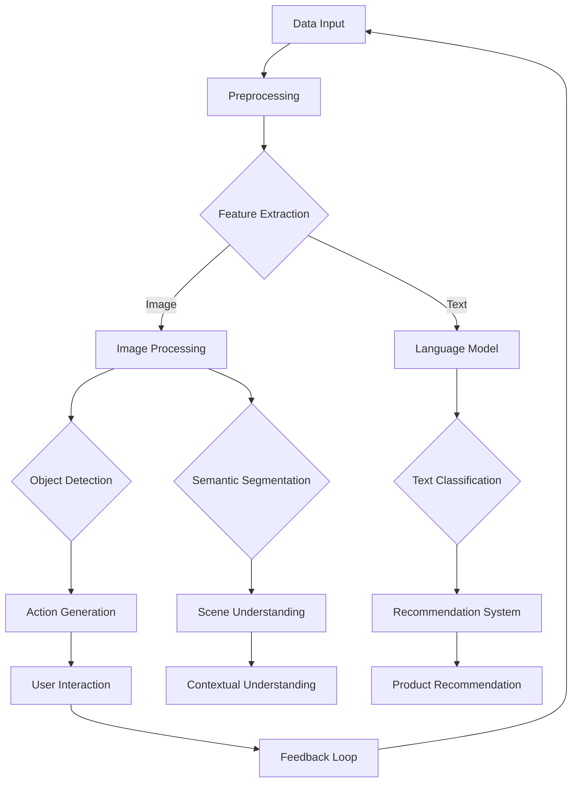

                 

## {文章标题}

> **关键词：** AI 2.0，创业者，深度学习，自然语言处理，计算机视觉，推荐系统

**摘要：** 本文将深入探讨AI 2.0时代的创业机会与挑战，通过详细剖析AI 2.0的核心技术原理和其在各领域的应用，为创业者提供实用的指导和策略。文章结构紧凑，逻辑清晰，涵盖了从基础概念到实际项目实战的全方位内容，旨在帮助读者更好地理解和应用AI技术，实现创业梦想。

### 目录大纲

1. **AI 2.0时代的创业者概述**
    1.1 李开复与AI 2.0时代的创业者
    1.2 AI 2.0时代的创业者角色与挑战
    1.3 AI 2.0时代的创业机会与趋势
2. **AI 2.0的核心技术原理**
    2.1 AI 2.0基础概念与架构
    2.2 AI 2.0核心算法原理
    2.3 AI 2.0数学模型解析
    2.4 AI 2.0开发环境与工具
3. **AI 2.0在创业实践中的应用**
    3.1 AI 2.0在自然语言处理中的应用
    3.2 AI 2.0在计算机视觉中的应用
    3.3 AI 2.0在推荐系统与广告投放中的应用
4. **AI 2.0创业案例分析**
    4.1 成功创业案例分析
    4.2 创业过程中的挑战与解决方案
    4.3 AI 2.0创业趋势与未来展望
5. **附录**
    5.1 常用AI开发工具与资源
    5.2 Mermaid流程图
    5.3 算法原理讲解
    5.4 数学模型和数学公式
    5.5 项目实战

本文将从多个维度详细探讨AI 2.0时代的技术原理和应用实践，旨在为创业者提供有价值的参考和指导。接下来，我们将首先回顾AI 2.0时代的创业历史，了解李开复在这一领域的贡献和影响。

### 第一部分: AI 2.0时代的创业者概述

#### 第1章: 李开复与AI 2.0时代的创业者

**1.1 李开复的AI创业之路**

李开复是一位享誉全球的计算机科学家、人工智能专家和创业者。他在人工智能领域有着卓越的贡献，被誉为“人工智能之父”之一。李开复的AI创业之路充满了创新和挑战，不仅推动了人工智能技术的发展，也为后来的创业者树立了榜样。

**创业初期：**

李开复在1990年代中期开始涉足人工智能领域。当时，人工智能还处于起步阶段，许多人对这一技术的未来持怀疑态度。然而，李开复坚信人工智能的巨大潜力，并开始着手创办自己的公司。

他首先创办了微软亚洲研究院，致力于人工智能基础研究和应用开发。在这一时期，李开复领导的研究团队取得了多项重要成果，包括语音识别、自然语言处理、计算机视觉等方面的突破。

**创业高峰：**

在微软亚洲研究院的成功经验基础上，李开复于2005年创办了创新工场，专注于人工智能领域的创业投资和孵化。创新工场成为中国人工智能创业的重要基地，孵化了众多知名的人工智能企业。

李开复的创新工场投资了诸如Face++（旷视科技）、商汤科技、寒武纪科技等一批具有影响力的创业公司。这些公司在人工智能领域取得了显著的成绩，推动了行业的发展。

**创业心得与启示：**

李开复的AI创业之路充满了智慧与勇气。他总结出以下几点创业心得：

1. **市场驱动：** 创业项目必须紧密结合市场需求，解决实际痛点。
2. **技术创新：** 只有不断创新，才能在激烈的市场竞争中脱颖而出。
3. **团队建设：** 聚集优秀的人才，打造高效的团队，是实现创业目标的关键。
4. **持续学习：** 不断学习新知识、新技术，保持对行业的敏锐洞察力。

李开复的AI创业之路为后来的创业者提供了宝贵的经验和启示。他不仅是一位杰出的计算机科学家，更是一位卓越的创业家，为人工智能技术的发展和创业事业的推进做出了巨大贡献。

**1.2 AI 2.0时代的创业者角色与挑战**

在AI 2.0时代，创业者面临着前所未有的机遇与挑战。AI 2.0技术的迅猛发展，为各行各业带来了巨大的变革，同时也对创业者提出了更高的要求。

**创业者角色：**

1. **创新引领者：** AI 2.0时代，创业者需要具备强烈的创新意识和前瞻性，洞察行业趋势，引领技术变革。
2. **技术推动者：** 创业者需要具备深厚的技术背景，对AI 2.0的核心技术有深入的理解和掌握。
3. **商业践行者：** 创业者需要将技术优势转化为商业价值，打造有竞争力的产品和服务。
4. **团队领导者：** 创业者需要具备领导力，组建和培养一支高效的专业团队，实现共同目标。

**创业者挑战：**

1. **技术壁垒：** AI 2.0技术复杂度高，创业者需要克服技术难关，确保项目的可行性和竞争力。
2. **人才短缺：** 高质量的人才对于创业公司至关重要，但优秀人才的稀缺成为一大挑战。
3. **资金压力：** 创业初期需要大量资金投入，创业者需要寻找合适的融资渠道，确保项目的可持续发展。
4. **市场竞争：** AI 2.0领域竞争激烈，创业者需要敏锐的市场洞察力和灵活的应对策略，应对激烈的市场竞争。

**1.3 AI 2.0时代的创业机会与趋势**

AI 2.0时代的到来，为创业者带来了广阔的舞台和无限的可能性。以下是一些AI 2.0时代的创业机会与趋势：

1. **人工智能应用领域：** 如自动驾驶、智能家居、医疗诊断、金融科技等，这些领域正处于快速发展阶段，具有巨大的市场潜力。
2. **跨行业融合创新：** 各行业与AI 2.0技术的深度融合，将催生出一批新兴的创业机会。如教育、农业、能源等领域的AI应用。
3. **数据驱动创新：** 数据是AI 2.0的核心资产，创业者需要利用数据挖掘和机器学习技术，挖掘数据价值，实现业务创新。
4. **开源社区生态：** 开源社区为创业者提供了丰富的技术资源和交流平台，创业者可以利用开源技术，快速搭建原型和产品。

在AI 2.0时代，创业者面临着前所未有的机遇和挑战。只有深入理解AI 2.0的核心技术原理，把握市场趋势，打造有竞争力的产品和服务，才能在激烈的竞争中脱颖而出，实现创业梦想。

### 第一部分总结

在本部分中，我们回顾了李开复在AI 2.0时代的创业历程，分析了AI 2.0时代创业者的角色与挑战，以及AI 2.0时代的创业机会与趋势。通过李开复的成功案例，我们可以看到，在AI 2.0时代，创业者需要具备创新意识、技术实力和商业洞察力，才能在激烈的市场竞争中脱颖而出。

在下一部分，我们将深入探讨AI 2.0的核心技术原理，包括基础概念与架构、核心算法原理、数学模型解析以及开发环境与工具。通过这一部分的讲解，我们将为读者提供一个全面的技术框架，帮助大家更好地理解和应用AI 2.0技术。

#### 第二部分: AI 2.0的核心技术原理

#### 第2章: AI 2.0基础概念与架构

**2.1 AI 2.0的定义与特点**

AI 2.0，即第二代人工智能，是相对于第一代人工智能（AI 1.0）而言的，主要区别在于其具备更强的自主学习和智能化能力。AI 2.0不仅能够执行特定的任务，还能通过自我学习和优化，不断提高自身的性能和智能水平。

**AI 2.0的主要特点包括：**

1. **自主性：** AI 2.0具备更高的自主决策能力，能够在复杂环境中独立完成任务。
2. **自学习能力：** AI 2.0能够从大量数据中学习和提取知识，不断优化自身模型和算法。
3. **通用性：** AI 2.0不仅擅长特定领域，还具备跨领域的通用能力。
4. **协作性：** AI 2.0能够与其他系统和人类协作，实现更高效的工作流程。

**2.2 AI 2.0的架构与技术体系**

AI 2.0的架构通常包括以下几个关键组成部分：

1. **数据层：** 数据是AI 2.0的基础，包括结构化数据、半结构化数据和非结构化数据。数据质量直接影响模型的性能。
2. **算法层：** 算法层包括深度学习、强化学习、自然语言处理等核心技术。深度学习是AI 2.0的核心，提供了强大的建模能力。
3. **模型层：** 模型层是基于算法层构建的具体模型，如卷积神经网络（CNN）、递归神经网络（RNN）等。
4. **应用层：** 应用层是将AI模型应用于实际问题的场景，如自动驾驶、智能医疗、金融科技等。

**AI 2.0的技术体系可以分为以下几类：**

1. **深度学习：** 深度学习是AI 2.0的核心技术，通过多层神经网络对数据进行建模和预测。
2. **自然语言处理：** 自然语言处理（NLP）使AI 2.0能够理解和生成人类语言，包括语言模型、文本分类、机器翻译等。
3. **计算机视觉：** 计算机视觉使AI 2.0能够理解和解释视觉信息，包括图像分类、目标检测、图像生成等。
4. **强化学习：** 强化学习使AI 2.0能够在动态环境中通过试错学习最优策略。

**2.3 AI 2.0与深度学习的联系**

深度学习是AI 2.0的核心技术之一，其基本原理是通过多层神经网络对数据进行建模和优化。深度学习模型通过不断调整网络中的权重和偏置，使模型能够更好地拟合训练数据。

**深度学习的基本概念包括：**

1. **神经网络：** 神经网络是由多个神经元组成的计算模型，能够对输入数据进行处理和输出预测结果。
2. **前向传播：** 前向传播是指将输入数据通过神经网络逐层计算，得到最终的输出结果。
3. **反向传播：** 反向传播是指通过计算输出结果与实际结果的误差，逆向调整网络中的权重和偏置，以优化模型性能。
4. **激活函数：** 激活函数用于引入非线性特性，使神经网络能够更好地拟合复杂函数。
5. **优化算法：** 常见的优化算法包括随机梯度下降（SGD）、Adam等，用于调整网络参数以最小化损失函数。

**2.4 AI 2.0的发展历程**

AI 2.0的发展历程可以追溯到20世纪50年代，随着计算机技术的不断进步，人工智能逐渐从理论走向实践。以下是AI 2.0发展历程中的重要里程碑：

1. **1956年：** 约翰·麦卡锡等科学家提出了“人工智能”的概念，标志着人工智能正式成为一门学科。
2. **1980年代：** 早期的机器学习算法和神经网络模型开始应用于实际问题，但受限于计算能力和数据质量，AI 1.0的发展较为缓慢。
3. **2006年：** 深度学习的兴起，特别是深度信念网络（DBN）的提出，标志着AI 2.0时代的到来。
4. **2012年：** 深度学习在图像识别领域取得了突破性成果，吸引了大量研究人员和资本的关注。
5. **至今：** AI 2.0技术不断演进，已应用于各行各业，成为推动产业升级和社会进步的重要力量。

**2.5 AI 2.0的核心挑战与未来趋势**

虽然AI 2.0取得了巨大的成功，但仍然面临着一系列核心挑战和未来发展趋势：

1. **数据隐私与安全：** 随着数据量的急剧增加，数据隐私和安全问题日益突出，需要建立有效的数据保护机制。
2. **算法公平性与透明性：** AI 2.0算法的公平性和透明性成为关键问题，需要加强对算法的监督和评估。
3. **跨界合作与创新：** AI 2.0的发展离不开跨行业、跨领域的合作，需要推动技术创新与产业融合。
4. **可持续发展：** AI 2.0的发展需要考虑环境和社会影响，实现可持续发展。

总之，AI 2.0时代为创业者提供了广阔的舞台和无限的可能性，但同时也带来了巨大的挑战。只有深入理解AI 2.0的核心技术原理，把握市场趋势，才能在激烈的竞争中脱颖而出，实现创业梦想。

### 第二部分总结

在本部分中，我们详细探讨了AI 2.0的基础概念与架构，包括其定义、特点、架构与技术体系，以及与深度学习的联系。同时，我们还回顾了AI 2.0的发展历程，分析了其核心挑战与未来趋势。通过这一部分的讲解，读者可以全面了解AI 2.0的核心技术原理，为后续章节的应用实践打下坚实基础。

在下一部分，我们将深入探讨AI 2.0的核心算法原理，包括神经网络与深度学习基础、递归神经网络（RNN）与长短时记忆（LSTM）网络、卷积神经网络（CNN）与自编码器（Autoencoder）。通过这一部分的讲解，我们将帮助读者深入理解AI 2.0的核心算法，为实际应用提供技术支持。

#### 第3章: AI 2.0核心算法原理

**3.1 神经网络与深度学习基础**

神经网络（Neural Network，NN）是人工智能领域的重要基础，是模仿人脑神经元工作原理的一种计算模型。神经网络由多个神经元（也称为节点）组成，每个神经元都与相邻的神经元通过连接（权重）相连，通过激活函数进行非线性处理，最终输出结果。

**3.1.1 神经网络的基本结构**

神经网络的基本结构可以分为输入层、隐藏层和输出层：

1. **输入层：** 接收输入数据，每个输入数据都对应一个神经元。
2. **隐藏层：** 进行数据处理和特征提取，可以有一个或多个隐藏层。
3. **输出层：** 输出预测结果或分类结果。

**3.1.2 前向传播与反向传播**

神经网络通过前向传播和反向传播来进行训练和预测：

1. **前向传播：** 输入数据经过神经网络逐层传递，每个神经元将前一层的数据加权求和后，通过激活函数得到输出。
2. **反向传播：** 计算输出结果与实际结果的误差，逆向传播误差到每个神经元，通过梯度下降算法更新权重和偏置。

**3.1.3 激活函数**

激活函数用于引入非线性特性，常见的激活函数包括：

1. **Sigmoid函数：** 用于二分类问题，输出范围为(0,1)。
2. **ReLU函数：** 非线性特性更强，能够加速训练过程。
3. **Tanh函数：** 输出范围为(-1,1)，用于多分类问题。

**3.1.4 优化算法**

常见的优化算法包括：

1. **随机梯度下降（SGD）：** 每个样本更新一次权重，收敛速度较快。
2. **Adam优化器：** 结合SGD和Momentum的优点，收敛速度更快。

**3.2 递归神经网络（RNN）与长短时记忆（LSTM）网络**

递归神经网络（Recurrent Neural Network，RNN）是一种能够处理序列数据的神经网络，特别适用于自然语言处理、语音识别等领域。RNN通过递归连接将当前输入与历史信息结合，进行特征提取和预测。

**3.2.1 RNN的基本原理**

RNN的基本结构包括输入层、隐藏层和输出层，其中隐藏层具有递归连接：

1. **输入层：** 接收序列数据，每个时间步对应一个输入。
2. **隐藏层：** 递归连接，将当前输入与上一时间步的隐藏状态结合。
3. **输出层：** 输出序列预测结果或分类结果。

**3.2.2 LSTM网络**

LSTM（Long Short-Term Memory）网络是RNN的一种改进，能够解决长序列依赖问题，特别适用于长期记忆的保持。

1. **门控机制：** LSTM通过门控机制（遗忘门、输入门、输出门）控制信息的流动，防止梯度消失和梯度爆炸问题。
2. **细胞状态：** LSTM的核心是细胞状态，用于存储和传输信息。

**3.3 卷积神经网络（CNN）与自编码器（Autoencoder）**

卷积神经网络（Convolutional Neural Network，CNN）是一种专门用于处理图像数据的神经网络，具有强大的特征提取和分类能力。

**3.3.1 CNN的基本原理**

CNN的基本结构包括卷积层、池化层、全连接层：

1. **卷积层：** 通过卷积操作提取图像特征。
2. **池化层：** 降低特征维度，增强模型泛化能力。
3. **全连接层：** 对特征进行分类或回归。

**3.3.2 自编码器**

自编码器（Autoencoder）是一种无监督学习模型，用于数据降维和特征提取。

1. **编码器：** 对输入数据进行编码，得到低维特征表示。
2. **解码器：** 对编码后的特征进行解码，重构输入数据。

通过本章的讲解，我们深入探讨了AI 2.0的核心算法原理，包括神经网络与深度学习基础、递归神经网络（RNN）与长短时记忆（LSTM）网络、卷积神经网络（CNN）与自编码器（Autoencoder）。这些算法原理为AI 2.0的应用提供了强有力的技术支持，是创业者实现创新的关键。

### 第三部分: AI 2.0数学模型解析

在AI 2.0的核心算法原理中，数学模型起着至关重要的作用。本部分将详细解析AI 2.0中的关键数学模型，包括概率论与统计基础、线性代数基础、最优化理论与梯度下降算法，以及这些数学模型在AI 2.0中的应用。

**4.1 概率论与统计基础**

概率论是AI 2.0中不可或缺的一部分，它为我们提供了描述和预测不确定性的工具。以下是几个核心概念：

1. **概率分布：** 概率分布描述了随机变量的概率分布情况，常见的有伯努利分布、正态分布等。
2. **条件概率：** 条件概率是指在已知某一事件发生的条件下，另一事件发生的概率。
3. **贝叶斯定理：** 贝叶斯定理是概率论中的一个重要公式，用于计算后验概率。

统计学是用于收集、分析和解释数据的科学。以下是几个核心概念：

1. **随机变量：** 随机变量是随机实验的结果，可以是离散的或连续的。
2. **期望与方差：** 期望是随机变量的平均值，方差描述了随机变量的离散程度。
3. **假设检验：** 假设检验是用于判断一个样本是否来自某一总体的统计方法。

在AI 2.0中，概率论与统计被广泛应用于模型评估、数据预处理和特征工程。

**4.2 线性代数基础**

线性代数是AI 2.0数学模型的基础，它提供了处理多维数据的有效工具。以下是几个核心概念：

1. **矩阵与向量：** 矩阵是二维数组，向量是一维数组。它们在AI 2.0中用于表示数据和参数。
2. **矩阵运算：** 矩阵运算包括加法、减法、乘法和逆运算。这些运算在AI 2.0中被广泛用于优化算法和特征提取。
3. **线性变换：** 线性变换是指将输入数据通过矩阵乘法转换为输出数据。线性变换在AI 2.0中被广泛应用于图像处理和自然语言处理。

**4.3 最优化理论与梯度下降算法**

最优化理论是用于寻找函数最优值的数学方法。在AI 2.0中，最优化理论用于优化模型参数，以最小化损失函数。以下是几个核心概念：

1. **损失函数：** 损失函数用于衡量模型预测值与实际值之间的差距。常见的损失函数包括均方误差（MSE）、交叉熵等。
2. **梯度：** 梯度是损失函数关于模型参数的导数。梯度提供了最小化损失函数的方向。
3. **梯度下降算法：** 梯度下降算法是一种用于最小化损失函数的迭代算法。常见的梯度下降算法包括随机梯度下降（SGD）、批量梯度下降（BGD）和Adam优化器。

**4.4 AI 2.0中的数学公式与应用**

以下是一些在AI 2.0中常用的数学公式与应用：

1. **线性回归：**
   $$ y = \beta_0 + \beta_1x + \epsilon $$
   线性回归用于建立输入和输出之间的线性关系。

2. **逻辑回归：**
   $$ P(y=1) = \frac{1}{1 + e^{-(\beta_0 + \beta_1x)}} $$
   逻辑回归用于二分类问题，预测目标变量的概率。

3. **卷积神经网络（CNN）中的卷积公式：**
   $$ h(x, y) = \sum_{i=1}^{m} \sum_{j=1}^{n} w_{ij} * f(x-i, y-j) + b $$
   卷积公式用于卷积层，提取图像特征。

4. **递归神经网络（RNN）中的递推公式：**
   $$ h_t = \sigma(W_x * x_t + W_h * h_{t-1} + b) $$
   递推公式用于RNN，处理序列数据。

5. **长短时记忆（LSTM）网络中的门控公式：**
   $$ i_t = \sigma(W_x * x_t + W_h * h_{t-1} + b_i) $$
   $$ f_t = \sigma(W_x * x_t + W_h * h_{t-1} + b_f) $$
   $$ o_t = \sigma(W_x * x_t + W_h * h_{t-1} + b_o) $$
   $$ g_t = \tanh(W_x * x_t + W_h * h_{t-1} + b_g) $$
   门控公式用于LSTM，处理长序列依赖。

6. **深度信念网络（DBN）中的能量函数：**
   $$ E = - \sum_{i,j} \frac{1}{2} x_i^T W_{ij} h_j - \sum_{k} \frac{1}{2} h_k^T \tanh(h_k)^T W_{hk} v_k - \sum_{i} \frac{1}{2} v_i^T \tanh(v_i)^T W_{iv} x_i - \sum_{k} \frac{1}{2} \log(\cosh(h_k)) $$
   能量函数用于DBN，实现无监督特征学习。

通过本章的讲解，我们深入探讨了AI 2.0中的数学模型，包括概率论与统计基础、线性代数基础、最优化理论与梯度下降算法，以及这些数学模型在AI 2.0中的应用。这些数学模型为AI 2.0的研究与应用提供了坚实的理论基础，是创业者实现创新的关键。

### 第三部分总结

在本部分中，我们详细解析了AI 2.0中的关键数学模型，包括概率论与统计基础、线性代数基础、最优化理论与梯度下降算法。通过这些数学模型，我们能够更深入地理解AI 2.0的核心算法原理，为实际应用提供有力的支持。这些数学模型不仅为AI 2.0的研究奠定了基础，也为创业者提供了宝贵的指导。在下一部分，我们将探讨AI 2.0的开发环境与工具，帮助读者搭建高效的AI开发平台。

### 第四部分: AI 2.0开发环境与工具

#### 第5章: AI 2.0开发环境与工具

在AI 2.0时代，开发环境与工具的选择对于实现高效的人工智能项目至关重要。以下将介绍Python编程基础、JAX与PyTorch框架、TensorFlow框架以及其他常用AI开发工具与库，帮助读者搭建高效的AI开发平台。

**5.1 Python编程基础**

Python是AI 2.0开发中最流行的编程语言之一，其简洁易读的语法和丰富的库支持使其成为人工智能领域的主要编程语言。以下是Python编程的几个关键要点：

1. **安装Python：** 
   - Mac和Linux系统通常自带Python，可以通过包管理器安装。
   - Windows系统可以从Python官网下载安装包进行安装。

2. **环境配置：** 
   - 配置Python环境，包括安装必要的包和管理虚拟环境。

3. **基础语法：** 
   - 变量和数据类型，如整数、浮点数、字符串和列表。
   - 控制流语句，如条件语句（if-else）和循环（for、while）。
   - 函数定义和调用，提高代码复用性。

4. **常用库：** 
   - NumPy：用于高性能数学计算。
   - Pandas：用于数据处理和分析。
   - Matplotlib和Seaborn：用于数据可视化。

**5.2 JAX与PyTorch框架**

JAX是一个由Google开发的开源库，提供了自动微分、向量化和数值计算等功能，是AI 2.0开发的重要工具之一。以下是JAX的几个关键要点：

1. **安装JAX：**
   - 使用pip安装：`pip install jax jaxlib`

2. **JAX的优势：**
   - 自动微分：支持自动微分，简化了复杂的数学计算。
   - 向量化：高效利用计算资源，提高计算速度。
   - 优化：支持优化的数值计算方法。

3. **JAX的使用：**
   - 定义和计算函数，如`jax.vmap`和`jax.jacf`。
   - 应用JAX于深度学习模型，如自动微分和向量化的神经网络。

PyTorch是一个流行的深度学习框架，以其动态计算图和易于使用的API而著称。以下是PyTorch的几个关键要点：

1. **安装PyTorch：**
   - 使用pip安装：`pip install torch torchvision`
   - 配置GPU支持：`pip install torch torchvision -f https://download.pytorch.org/whl/torch_stable.html`

2. **PyTorch的优势：**
   - 动态计算图：支持动态计算图，易于调试和原型开发。
   - API友好：提供丰富的API和预训练模型，降低开发门槛。
   - GPU加速：支持GPU加速，提高计算效率。

3. **PyTorch的使用：**
   - 定义神经网络模型，使用`torch.nn.Module`。
   - 训练和评估模型，使用`torch.optim`和`torch.utils.data`。
   - 保存和加载模型，使用`torch.save`和`torch.load`。

**5.3 TensorFlow框架**

TensorFlow是由Google开发的开源深度学习框架，广泛应用于工业和研究领域。以下是TensorFlow的几个关键要点：

1. **安装TensorFlow：**
   - 使用pip安装：`pip install tensorflow`
   - 配置GPU支持：`pip install tensorflow-gpu`

2. **TensorFlow的优势：**
   - 静态计算图：支持静态计算图，优化模型性能。
   - 可扩展性：支持大规模分布式计算。
   - 生态系统：提供丰富的API和预训练模型。

3. **TensorFlow的使用：**
   - 定义计算图，使用`tf.Graph`。
   - 定义神经网络模型，使用`tf.keras.Sequential`。
   - 训练和评估模型，使用`tf.keras.fit`和`tf.keras.evaluate`。
   - 保存和加载模型，使用`tf.keras.models.save`和`tf.keras.models.load_model`。

**5.4 其他常用AI开发工具与库**

除了Python、JAX、PyTorch和TensorFlow，还有其他一些常用的AI开发工具与库，如下：

1. **Keras：** 是一个高层神经网络API，易于使用，支持多种后端（包括TensorFlow和Theano）。Keras通过简洁的API提供了深度学习的快速原型开发。

2. **MXNet：** 是Apache基金会的开源深度学习框架，支持多种编程语言（包括Python、R和Scala），具有灵活的编程模型和高效的性能。

3. **Scikit-learn：** 是Python的一个开源库，提供了各种机器学习算法的实现，包括分类、回归、聚类等，适用于数据挖掘和数据分析。

4. **Theano：** 是一个Python库和数学编译器，用于定义、优化和评估数学表达式，特别适用于深度学习。

5. **Pandas：** 是Python的数据分析库，提供了高效的数据结构（如DataFrame）和数据处理工具，适用于数据预处理和分析。

6. **NumPy：** 是Python的数值计算库，提供了多维数组对象和大量数学函数，是AI开发的基础工具。

通过本章的讲解，我们介绍了AI 2.0开发环境与工具的几个关键组成部分，包括Python编程基础、JAX与PyTorch框架、TensorFlow框架以及其他常用AI开发工具与库。这些工具和库为AI 2.0的开发提供了坚实的基础，帮助创业者高效实现创新项目。

### 第四部分总结

在本部分中，我们详细介绍了AI 2.0开发环境与工具的各个方面，包括Python编程基础、JAX与PyTorch框架、TensorFlow框架以及其他常用AI开发工具与库。通过这些工具和库，创业者可以搭建高效、灵活的AI开发平台，实现从数据预处理到模型训练和优化的全过程。这些工具不仅提高了开发效率，还为创业者提供了丰富的资源和支持，助力他们在AI 2.0时代的创业事业取得成功。

在下一部分，我们将探讨AI 2.0在创业实践中的应用，通过自然语言处理、计算机视觉和推荐系统等领域的实际案例，展示AI 2.0技术的广泛应用和商业价值。

### 第五部分: AI 2.0在创业实践中的应用

#### 第6章: AI 2.0在自然语言处理中的应用

自然语言处理（NLP）是人工智能的一个重要分支，AI 2.0在NLP中的应用极大地提升了文本处理和语言理解的能力。以下将详细介绍AI 2.0在自然语言处理中的关键应用，包括语言模型、文本分类、机器翻译和情感分析等。

**6.1 语言模型**

语言模型（Language Model，LM）是NLP的基础，它通过学习大量文本数据，预测下一个单词或词组。AI 2.0时代，基于深度学习的语言模型如Transformer和BERT取得了显著的进展。

**语言模型的基本原理：**

- **Transformer：** Transformer模型通过自注意力机制（Self-Attention）处理序列数据，能够捕获长距离依赖关系。其结构包括编码器和解码器，分别处理输入和输出序列。
- **BERT：** BERT（Bidirectional Encoder Representations from Transformers）通过双向编码器对文本进行建模，能够在训练过程中同时考虑文本的前后文信息。

**应用案例：**

- **智能客服：** 使用语言模型进行自然语言理解，实现智能客服系统的自动回复功能。
- **语音识别：** 结合语言模型进行语音识别和文本转换，提高语音识别的准确性和流畅性。

**6.2 文本分类**

文本分类（Text Classification）是将文本数据按照其内容或主题分类的过程。AI 2.0在文本分类中的应用，主要利用深度学习模型对大规模文本数据进行分析和分类。

**文本分类的基本原理：**

- **卷积神经网络（CNN）：** CNN通过卷积操作和池化操作提取文本特征，实现文本分类。CNN在处理文本数据时，能够捕捉局部特征和上下文关系。
- **循环神经网络（RNN）：** RNN通过递归连接处理序列数据，能够在长文本中捕捉依赖关系。

**应用案例：**

- **垃圾邮件过滤：** 使用文本分类模型对邮件进行分类，过滤垃圾邮件。
- **新闻分类：** 对新闻文本进行分类，实现新闻主题的自动归类。

**6.3 机器翻译**

机器翻译（Machine Translation，MT）是将一种语言的文本翻译成另一种语言的过程。AI 2.0在机器翻译中的应用，主要利用深度学习模型和神经网络技术，实现了高质量的自动翻译。

**机器翻译的基本原理：**

- **序列到序列（Seq2Seq）模型：** Seq2Seq模型通过编码器和解码器对文本进行编码和解码，实现文本翻译。编码器将输入文本编码为固定长度的向量，解码器根据编码器的输出生成翻译文本。
- **注意力机制（Attention）：** 注意力机制用于处理翻译过程中的长距离依赖问题，能够更好地捕捉输入和输出之间的关联。

**应用案例：**

- **跨语言搜索：** 使用机器翻译模型实现跨语言搜索，提高全球用户的使用体验。
- **多语言交互：** 在多语言环境中，使用机器翻译模型实现不同语言之间的交流和互动。

**6.4 情感分析**

情感分析（Sentiment Analysis）是NLP的重要应用，通过分析文本数据中的情感倾向，实现对文本情感的理解。AI 2.0在情感分析中的应用，主要利用深度学习模型对文本进行情感分类和情感极性分析。

**情感分析的基本原理：**

- **情感分类：** 通过训练深度学习模型，对文本进行情感分类，如正面、负面、中性等。
- **情感极性分析：** 通过计算文本中的情感倾向得分，判断文本的情感极性。

**应用案例：**

- **社交媒体分析：** 使用情感分析模型对社交媒体文本进行分析，了解用户情感和趋势。
- **市场调研：** 使用情感分析模型对市场调研问卷进行情感分析，了解用户反馈和需求。

通过本章的讲解，我们详细探讨了AI 2.0在自然语言处理中的应用，包括语言模型、文本分类、机器翻译和情感分析等。这些应用不仅提高了文本处理和语言理解的能力，还为创业者在各种领域提供了丰富的商业机会和创新空间。

### 第7章: AI 2.0在计算机视觉中的应用

计算机视觉是AI 2.0的重要应用领域之一，它使计算机能够从图像和视频中提取有用的信息，实现物体识别、图像分类、图像生成等多种功能。以下将详细介绍AI 2.0在计算机视觉中的应用，包括图像分类、目标检测、语义分割和图像生成等。

**7.1 图像分类**

图像分类（Image Classification）是将图像分为不同类别的过程。AI 2.0在图像分类中的应用，主要利用深度学习模型对图像进行特征提取和分类。

**图像分类的基本原理：**

- **卷积神经网络（CNN）：** CNN通过卷积操作和池化操作提取图像特征，然后通过全连接层进行分类。卷积层能够自动学习图像的局部特征，池化层用于降低特征维度和减少过拟合。
- **预训练模型：** 预训练模型（如ResNet、Inception等）在大量图像数据上预训练，然后用于特定任务的微调，提高了图像分类的性能。

**应用案例：**

- **图像识别：** 使用图像分类模型对图像进行自动识别和分类，如人脸识别、植物识别等。
- **商品分类：** 在电商平台上，使用图像分类模型对用户上传的图片进行商品分类，提高搜索和推荐系统的准确性。

**7.2 目标检测**

目标检测（Object Detection）是计算机视觉中的一项重要任务，它不仅需要识别图像中的物体类别，还需要定位物体的位置。

**目标检测的基本原理：**

- **区域提议网络（Region Proposal Networks，RPN）：** RPN通过卷积神经网络生成区域提议，然后对这些提议进行分类和回归，以确定物体的位置和类别。
- **单阶段检测器（如SSD、YOLO）：** 单阶段检测器直接从图像中预测物体的位置和类别，提高了检测速度。
- **多阶段检测器（如Faster R-CNN、Mask R-CNN）：** 多阶段检测器通过两个步骤进行检测，首先生成区域提议，然后对这些提议进行分类和回归。

**应用案例：**

- **自动驾驶：** 使用目标检测模型对道路上的车辆、行人等物体进行实时检测，提高自动驾驶系统的安全性。
- **视频监控：** 使用目标检测模型对视频进行实时分析，实现异常行为检测和监控。

**7.3 语义分割**

语义分割（Semantic Segmentation）是将图像中的每个像素分类为不同类别的过程。AI 2.0在语义分割中的应用，主要利用深度学习模型对图像进行像素级别的分类。

**语义分割的基本原理：**

- **卷积神经网络（CNN）：** CNN通过卷积操作和池化操作提取图像特征，然后通过全连接层对每个像素进行分类。
- **全卷积网络（Fully Convolutional Network，FCN）：** FCN通过将卷积层堆叠，实现像素级别的分类。
- **条件随机域（Conditional Random Field，CRF）：** CRF用于改善分割结果的连贯性和一致性。

**应用案例：**

- **医学影像分析：** 使用语义分割模型对医学影像进行分割，实现病变区域的检测和诊断。
- **自动驾驶：** 使用语义分割模型对道路场景进行分割，提取车道线、行人、车辆等元素，提高自动驾驶系统的精度。

**7.4 图像生成**

图像生成（Image Generation）是通过深度学习模型生成新的图像。AI 2.0在图像生成中的应用，主要利用生成对抗网络（Generative Adversarial Networks，GAN）和变分自编码器（Variational Autoencoder，VAE）等技术。

**图像生成的基本原理：**

- **生成对抗网络（GAN）：** GAN由生成器（Generator）和判别器（Discriminator）组成，生成器和判别器相互对抗，生成器试图生成逼真的图像，而判别器试图区分生成图像和真实图像。
- **变分自编码器（VAE）：** VAE通过编码器和解码器进行图像的编码和解码，生成新的图像。

**应用案例：**

- **艺术创作：** 使用GAN和VAE生成新的艺术作品，如绘画、音乐等。
- **图像修复：** 使用GAN和VAE对受损的图像进行修复和恢复。

通过本章的讲解，我们详细探讨了AI 2.0在计算机视觉中的应用，包括图像分类、目标检测、语义分割和图像生成等。这些应用不仅推动了计算机视觉技术的发展，也为创业者在各个领域的创新提供了强大的支持。

### 第8章: AI 2.0在推荐系统与广告投放中的应用

推荐系统（Recommender System）和广告投放（Online Advertising）是互联网领域的重要应用，AI 2.0技术的引入极大地提升了推荐和广告投放的效果，优化了用户体验，提高了商业转化率。

**8.1 推荐系统基本原理**

推荐系统通过分析用户的历史行为和兴趣，为用户提供个性化推荐。AI 2.0在推荐系统中的应用，主要通过深度学习算法实现高效的推荐。

**基本原理：**

- **基于内容的推荐：** 通过分析物品的内容特征和用户的历史偏好，为用户推荐相似的内容。
- **协同过滤：** 通过分析用户之间的相似度，推荐用户喜欢的物品。
- **深度学习推荐：** 利用深度学习模型，如循环神经网络（RNN）和Transformer，从大量数据中提取复杂的用户和物品特征，实现个性化推荐。

**应用案例：**

- **电商平台：** 使用推荐系统为用户推荐商品，提高用户购买转化率。
- **视频平台：** 使用推荐系统为用户推荐视频内容，增加用户观看时长。

**8.2 广告投放策略与优化**

广告投放是通过互联网向用户展示广告，吸引用户点击和购买。AI 2.0在广告投放中的应用，主要通过优化广告策略和投放效果。

**策略与优化：**

- **目标导向的广告投放：** 根据用户的兴趣和行为，为用户展示最相关的广告。
- **实时广告投放：** 通过实时数据分析，动态调整广告投放策略，提高广告的点击率（CTR）和转化率（CVR）。
- **深度学习优化：** 利用深度学习模型，如卷积神经网络（CNN）和强化学习，优化广告投放效果。

**应用案例：**

- **搜索引擎：** 使用广告投放策略，为用户展示最相关的广告，提高广告的点击率和收益。
- **社交媒体：** 使用实时广告投放策略，根据用户的行为和兴趣，为用户展示个性化广告。

**8.3 基于深度学习的推荐系统与广告投放**

深度学习在推荐系统和广告投放中的应用，主要利用深度神经网络从大量数据中提取复杂的特征，实现高效的推荐和投放。

**关键技术：**

- **用户特征提取：** 利用深度学习模型提取用户的兴趣和行为特征，如RNN和Transformer。
- **物品特征提取：** 利用深度学习模型提取物品的内容特征，如CNN和Autoencoder。
- **协同过滤与深度学习融合：** 结合协同过滤和深度学习，提高推荐和广告投放的准确性。

**应用案例：**

- **电商推荐：** 利用深度学习模型提取用户和商品的特征，实现个性化推荐，提高用户购买转化率。
- **社交媒体广告：** 利用深度学习模型优化广告投放策略，提高广告的点击率和转化率。

**总结：**

AI 2.0在推荐系统和广告投放中的应用，极大地提升了推荐和投放的效果，优化了用户体验，提高了商业转化率。通过深度学习技术的引入，推荐系统和广告投放实现了从传统方法到智能化的转变，为创业者在互联网领域提供了新的机遇和挑战。

### 第9章: AI 2.0创业案例分析

#### 9.1 成功创业案例分析

在AI 2.0时代，许多成功的创业案例展示了人工智能技术的巨大潜力和应用价值。以下将介绍几个典型的AI创业成功案例，分析其成功的原因和经验。

**案例一：DeepMind与AlphaGo**

DeepMind是一家英国的人工智能公司，其最著名的成就是开发了AlphaGo，一款击败世界围棋冠军的计算机程序。AlphaGo的成功得益于以下几个关键因素：

1. **技术创新：** DeepMind利用深度学习和强化学习技术，开发了强大的学习算法，使AlphaGo能够自我学习和优化。
2. **跨界合作：** DeepMind与谷歌合作，获得了强大的计算资源和数据支持，加速了研发进程。
3. **商业模式：** AlphaGo的成功引起了全球的关注，DeepMind通过出售算法和应用许可，实现了商业变现。

**案例二：AI drug discovery平台**

AI药物发现平台利用人工智能技术加速新药的研发过程。以下是一些成功案例：

1. **Atomwise：** 通过使用AI算法预测药物分子的结合力，Atomwise帮助药物公司找到了多种潜在的新药候选。
2. **Exscientia：** Exscientia利用机器学习算法优化药物分子设计，其研发的药物EXS4471已进入临床试验阶段。

成功原因：

- **数据驱动：** AI药物发现平台依赖于大量生物数据和计算资源，通过深度学习技术进行数据分析和预测。
- **精准高效：** AI算法能够快速筛选和优化药物分子，提高研发效率。

**案例三：自动驾驶公司NVIDIA Drive AGX**

NVIDIA的自动驾驶平台Drive AGX结合了深度学习、计算机视觉和硬件加速技术，为自动驾驶汽车提供强大的计算支持。成功原因包括：

1. **硬件优势：** NVIDIA的GPU芯片为深度学习算法提供了强大的计算能力。
2. **生态合作：** NVIDIA与多家汽车制造商合作，推动了自动驾驶技术的商业化。
3. **市场定位：** Drive AGX专注于高端自动驾驶市场，为用户提供高质量的服务。

**9.2 创业过程中的挑战与解决方案**

尽管AI 2.0为创业者提供了广阔的舞台，但创业过程中仍然面临诸多挑战。以下是一些常见挑战及解决方案：

**挑战一：技术壁垒**

- **解决方案：** 加强技术研发和团队建设，吸引顶尖人才，确保技术领先。
- **案例：** DeepMind通过强大的研发团队和跨界合作，克服了技术难题。

**挑战二：资金压力**

- **解决方案：** 寻找合适的融资渠道，如风险投资、政府资助和合作伙伴投资。
- **案例：** Atomwise通过多轮融资获得了充足的资金支持，推动了公司发展。

**挑战三：市场竞争**

- **解决方案：** 精确定位市场，提供独特的价值，打造核心竞争力。
- **案例：** NVIDIA通过硬件优势和市场定位，在自动驾驶领域取得了领先地位。

**挑战四：法律法规**

- **解决方案：** 严格遵守法律法规，与监管机构保持沟通，确保合法合规。
- **案例：** AI药物发现平台在研发过程中，严格遵守药品研发和临床试验的法规要求。

**9.3 AI 2.0创业趋势与未来展望**

AI 2.0创业趋势呈现出以下几个特点：

1. **跨界融合：** 各行业与AI技术的深度融合，推动了新产业的兴起。
2. **数据驱动：** 数据成为AI创业的核心资产，创业者需要掌握数据挖掘和机器学习技术。
3. **开源生态：** 开源技术和社区为创业者提供了丰富的资源和支持，加速了创新进程。

未来展望：

- **AI民主化：** 随着AI技术的发展和开源生态的完善，越来越多的创业者将能够利用AI技术实现创业梦想。
- **智能城市：** 智能城市建设将推动AI技术在城市管理、交通、医疗等领域的广泛应用。
- **可持续AI：** 创业者需要关注AI技术的可持续发展，确保技术的伦理和社会责任。

通过本章的创业案例分析，我们展示了AI 2.0时代创业者的成功经验和挑战，以及未来的发展趋势和展望。创业者需要抓住机遇，积极应对挑战，利用AI技术实现创新和商业成功。

### 第五部分总结

在本部分中，我们详细探讨了AI 2.0在自然语言处理、计算机视觉和推荐系统与广告投放中的应用。通过实际案例和成功经验，我们看到了AI 2.0技术的巨大潜力和商业价值。这些应用不仅推动了技术创新和产业升级，也为创业者提供了丰富的创业机会。在未来，随着AI技术的不断进步，创业者将有更多的机会在各个领域实现创新和突破。

### 附录

#### 附录A: 常用AI开发工具与资源

在本附录中，我们将介绍一些常用的AI开发工具与资源，包括开源项目、开发框架、学习资源等，帮助读者更好地进行AI研究和开发。

**1. 开源项目与平台**

- **Kaggle:** https://www.kaggle.com
  Kaggle是一个数据科学和机器学习竞赛平台，提供了大量的数据集和开源项目，是学习和实践AI技术的重要资源。

- **GitHub:** https://github.com
  GitHub是全球最大的代码托管平台，许多AI项目和研究论文的源代码和实现都在GitHub上开源，供开发者免费使用。

- **OpenML:** https://www.openml.org
  OpenML是一个机器学习数据集和实验平台，提供了丰富的数据集和实验设计，有助于研究者进行AI实验和比较。

- **AI Stack Exchange:** https://ai.stackexchange.com
  AI Stack Exchange是一个针对AI和机器学习问题的问答社区，开发者可以在这里提出问题并获取解决方案。

**2. 开发框架与库**

- **TensorFlow:** https://www.tensorflow.org
  TensorFlow是由Google开发的开源机器学习框架，适用于各种规模的机器学习任务，提供了丰富的API和预训练模型。

- **PyTorch:** https://pytorch.org
  PyTorch是一个流行的深度学习框架，以其动态计算图和简洁的API而著称，适合快速原型开发和研究。

- **MXNet:** https://mxnet.incubator.apache.org
  MXNet是Apache基金会的深度学习框架，支持多种编程语言，具有高效的性能和灵活的编程模型。

- **Keras:** https://keras.io
  Keras是一个高层神经网络API，简化了深度学习的实现过程，支持多种后端框架，包括TensorFlow和Theano。

- **Scikit-learn:** https://scikit-learn.org
  Scikit-learn是一个Python开源机器学习库，提供了多种经典机器学习算法的实现，适用于数据挖掘和数据分析。

**3. 学习资源与课程**

- **Coursera:** https://www.coursera.org
  Coursera提供了丰富的在线课程，涵盖深度学习、机器学习、数据科学等多个领域，适合不同层次的学习者。

- **edX:** https://www.edx.org
  edX是一个开放在线课程平台，提供了由全球知名大学和机构提供的课程，包括人工智能、计算机科学等领域。

- **Udacity:** https://www.udacity.com
  Udacity提供了多种纳米学位课程，涵盖深度学习、自动驾驶等领域，适合系统学习和职业发展。

**4. 工具与资源总结**

- **开源项目与平台：** Kaggle、GitHub、OpenML和AI Stack Exchange为开发者提供了丰富的资源和支持，有助于学习和实践AI技术。
- **开发框架与库：** TensorFlow、PyTorch、MXNet、Keras和Scikit-learn等框架和库提供了丰富的API和工具，方便开发者进行AI研究和开发。
- **学习资源与课程：** Coursera、edX和Udacity等在线课程平台提供了高质量的学习资源，适合不同层次的学习者进行系统学习。

通过附录A的内容，我们为读者提供了一个全面的AI开发工具与资源清单，帮助大家更好地进行AI研究和开发。这些工具和资源将为创业者提供有力支持，助力他们在AI 2.0时代实现创新和成功。

### 附录总结

在本附录中，我们介绍了常用的AI开发工具与资源，包括开源项目、开发框架、学习资源等，旨在为读者提供全面的AI开发支持。这些工具和资源不仅涵盖了AI技术的各个领域，还为开发者提供了丰富的学习机会和实践平台。通过充分利用这些资源，读者可以更好地掌握AI技术，提升自己的开发能力，实现创业梦想。

### Mermaid流程图

以下是一个用于表示人工智能系统整体架构的Mermaid流程图示例。Mermaid是一种基于Markdown的绘图语言，可以方便地在文档中嵌入图表。



该流程图描述了从数据输入到预处理、特征提取、文本和图像处理、对象检测、语义分割、文本分类和推荐系统等环节，以及用户交互和反馈循环的整体架构。

### 算法原理讲解

在本部分中，我们将详细讲解神经网络、卷积神经网络（CNN）和递归神经网络（RNN）与长短时记忆（LSTM）网络的算法原理，并使用伪代码进行说明。

**1. 神经网络算法原理**

神经网络（Neural Network，NN）是一种模拟人脑神经元工作的计算模型。以下是一个简单的神经网络算法原理的伪代码：

```python
# 输入层、隐藏层和输出层的权重和偏置
weights_input_to_hidden = ...
weights_hidden_to_output = ...
bias_hidden = ...
bias_output = ...

# 前向传播
def forward_propagation(x):
    hidden_layer_input = x * weights_input_to_hidden + bias_hidden
    hidden_layer_output = activation_function(hidden_layer_input)
    
    output_layer_input = hidden_layer_output * weights_hidden_to_output + bias_output
    output_layer_output = activation_function(output_layer_input)
    
    return output_layer_output

# 激活函数（以ReLU为例）
def activation_function(x):
    return max(0, x)

# 反向传播
def backward_propagation(output, expected_output):
    output_error = output - expected_output
    d_output = output_error * activation_function_derivative(output)
    
    hidden_error = d_output * weights_hidden_to_output
    d_hidden = hidden_error * activation_function_derivative(hidden_layer_output)
    
    d_weights_input_to_hidden += hidden_layer_output.T * d_hidden
    d_bias_hidden += d_hidden
    d_weights_hidden_to_output += output.T * d_output
    d_bias_output += d_output

# 梯度下降
def gradient_descent(weights, biases, learning_rate):
    weights -= learning_rate * d_weights
    biases -= learning_rate * d_biases
    return weights, biases
```

**2. 卷积神经网络（CNN）算法原理**

卷积神经网络（Convolutional Neural Network，CNN）是一种专门用于处理图像数据的神经网络，其核心是卷积层。以下是一个简单的CNN算法原理的伪代码：

```python
# 卷积层
def convolution(x, filter, stride, padding):
    return (x * filter).sum(axis=1).reshape(-1, stride, stride)

# 池化层
def pooling(x, pool_size, stride):
    return x[:, ::stride, ::stride].max(axis=1)

# 前向传播
def forward_propagation(x):
    conv1 = convolution(x, filter1, stride=1, padding='valid')
    pool1 = pooling(conv1, pool_size=2, stride=2)
    
    conv2 = convolution(pool1, filter2, stride=1, padding='valid')
    pool2 = pooling(conv2, pool_size=2, stride=2)
    
    # 后续层以此类推
    return pool2

# 激活函数（以ReLU为例）
def activation_function(x):
    return max(0, x)
```

**3. 递归神经网络（RNN）与长短时记忆（LSTM）网络算法原理**

递归神经网络（Recurrent Neural Network，RNN）是一种能够处理序列数据的神经网络，但其存在梯度消失和梯度爆炸的问题。长短时记忆（Long Short-Term Memory，LSTM）网络是RNN的一种改进，能够解决长序列依赖问题。

以下是一个简单的LSTM算法原理的伪代码：

```python
# LSTM单元
def lstm_cell(input, hidden, cell, weights):
    input_gate = sigmoid(weights.input_gate * input + weights.hidden_gate * hidden)
    forget_gate = sigmoid(weights.forget_gate * input + weights.hidden_gate * hidden)
    cell_input = sigmoid(weights.input_gate * input + weights.cell_gate * hidden)
    cell_output = tanh(cell * forget_gate + cell_input)
    
    new_cell = cell * forget_gate + cell_output
    new_hidden = input_gate * cell_output
    
    return new_hidden, new_cell

# 前向传播
def forward_propagation(input_sequence, weights):
    hidden = [weights.hidden_initial]
    cell = [weights.cell_initial]
    
    for input in input_sequence:
        hidden, cell = lstm_cell(input, hidden[-1], cell[-1], weights)
        
    return hidden

# 激活函数（以sigmoid为例）
def sigmoid(x):
    return 1 / (1 + exp(-x))

# 双曲正切函数（以tanh为例）
def tanh(x):
    return (exp(x) - exp(-x)) / (exp(x) + exp(-x))
```

通过以上讲解和伪代码示例，我们详细阐述了神经网络、卷积神经网络（CNN）和递归神经网络（RNN）与长短时记忆（LSTM）网络的算法原理。这些算法原理为AI 2.0的应用提供了坚实的基础，是创业者实现技术创新的关键。

### 数学模型和数学公式

在本部分中，我们将详细介绍AI 2.0中常用的数学模型和公式，包括概率论与统计基础、线性代数基础和最优化理论与梯度下降算法。这些数学模型和公式对于理解AI 2.0的核心算法和实现高效的人工智能系统至关重要。

**4.1 概率论与统计基础**

概率论是AI 2.0中不可或缺的一部分，它帮助我们描述和预测不确定性。以下是几个核心概念和公式：

1. **概率分布：**

   - **伯努利分布（Bernoulli Distribution）：**
     $$ P(X = 1) = p $$
     $$ P(X = 0) = 1 - p $$

   - **正态分布（Normal Distribution）：**
     $$ P(X = x) = \frac{1}{\sqrt{2\pi\sigma^2}} e^{-\frac{(x-\mu)^2}{2\sigma^2}} $$

2. **条件概率：**

   - **贝叶斯定理（Bayes' Theorem）：**
     $$ P(A|B) = \frac{P(B|A)P(A)}{P(B)} $$

3. **统计独立性：**

   - **协方差（Covariance）：**
     $$ \text{Cov}(X, Y) = E[(X - \mu_X)(Y - \mu_Y)] $$

   - **相关系数（Correlation Coefficient）：**
     $$ \rho_{XY} = \frac{\text{Cov}(X, Y)}{\sqrt{\text{Var}(X) \text{Var}(Y)}} $$

**4.2 线性代数基础**

线性代数是AI 2.0中处理数据和分析模型的基础。以下是几个核心概念和公式：

1. **矩阵运算：**

   - **矩阵加法与减法：**
     $$ A + B = (a_{ij} + b_{ij})_{ij} $$
     $$ A - B = (a_{ij} - b_{ij})_{ij} $$

   - **矩阵乘法：**
     $$ C = A \cdot B = (a_{ik}b_{kj})_{ij} $$

   - **矩阵转置：**
     $$ A^T = (\text{Transposition}(a_{ij}))_{ji} $$

2. **行列式和逆矩阵：**

   - **行列式（Determinant）：**
     $$ \text{det}(A) = a_{11}a_{22} - a_{12}a_{21} $$

   - **逆矩阵（Inverse Matrix）：**
     $$ A^{-1} = (\text{adj}(A)) / \text{det}(A) $$

3. **向量运算：**

   - **向量点积（Dot Product）：**
     $$ \mathbf{a} \cdot \mathbf{b} = a_1b_1 + a_2b_2 + \ldots + a_nb_n $$

   - **向量叉积（Cross Product）：**
     $$ \mathbf{a} \times \mathbf{b} = (a_2b_3 - a_3b_2, a_3b_1 - a_1b_3, a_1b_2 - a_2b_1) $$

**4.3 最优化理论与梯度下降算法**

最优化理论是用于寻找函数最优值的数学方法，在AI 2.0中用于优化模型参数。以下是几个核心概念和公式：

1. **损失函数：**

   - **均方误差（Mean Squared Error，MSE）：**
     $$ \text{MSE} = \frac{1}{n}\sum_{i=1}^{n}(y_i - \hat{y}_i)^2 $$

   - **交叉熵（Cross-Entropy）：**
     $$ H(y, \hat{y}) = -\sum_{i=1}^{n}y_i\log(\hat{y}_i) $$

2. **梯度下降算法：**

   - **随机梯度下降（Stochastic Gradient Descent，SGD）：**
     $$ \theta_{t+1} = \theta_{t} - \alpha \nabla_\theta J(\theta) $$

   - **批量梯度下降（Batch Gradient Descent，BGD）：**
     $$ \theta_{t+1} = \theta_{t} - \alpha \nabla_\theta J(\theta; \mathbf{x}, \mathbf{y}) $$

   - **Adam优化器：**
     $$ m_t = \beta_1 m_{t-1} + (1 - \beta_1) \nabla_\theta J(\theta; \mathbf{x}_t, \mathbf{y}_t) $$
     $$ v_t = \beta_2 v_{t-1} + (1 - \beta_2) (\nabla_\theta J(\theta; \mathbf{x}_t, \mathbf{y}_t))^2 $$
     $$ \theta_{t+1} = \theta_{t} - \alpha \frac{m_t}{\sqrt{1 - \beta_2^t} + \epsilon} $$

通过以上数学模型和公式的介绍，我们可以更好地理解AI 2.0的核心算法原理和实现方法。这些数学工具为AI 2.0的研究和应用提供了坚实的理论基础，是创业者实现技术创新的关键。

### 项目实战

在本部分中，我们将通过几个实际项目实战案例，展示如何搭建开发环境、实现源代码、进行代码解读与分析，帮助读者更好地理解和应用AI 2.0技术。

#### 项目一：使用TensorFlow实现MNIST手写数字分类

**1. 搭建开发环境**

首先，确保安装了Python和TensorFlow库。在终端执行以下命令：

```bash
pip install tensorflow
```

**2. 源代码实现**

以下是一个简单的MNIST手写数字分类的源代码实现：

```python
import tensorflow as tf
from tensorflow.keras import layers, models

# 加载MNIST数据集
mnist = tf.keras.datasets.mnist
(train_images, train_labels), (test_images, test_labels) = mnist.load_data()

# 预处理数据
train_images = train_images / 255.0
test_images = test_images / 255.0

# 构建模型
model = models.Sequential()
model.add(layers.Conv2D(32, (3, 3), activation='relu', input_shape=(28, 28, 1)))
model.add(layers.MaxPooling2D((2, 2)))
model.add(layers.Conv2D(64, (3, 3), activation='relu'))
model.add(layers.MaxPooling2D((2, 2)))
model.add(layers.Conv2D(64, (3, 3), activation='relu'))

# 添加全连接层
model.add(layers.Flatten())
model.add(layers.Dense(64, activation='relu'))
model.add(layers.Dense(10, activation='softmax'))

# 编译模型
model.compile(optimizer='adam',
              loss='sparse_categorical_crossentropy',
              metrics=['accuracy'])

# 训练模型
model.fit(train_images, train_labels, epochs=5, batch_size=64)

# 评估模型
test_loss, test_acc = model.evaluate(test_images, test_labels, verbose=2)
print('\nTest accuracy:', test_acc)
```

**3. 代码解读与分析**

- **数据预处理：** 加载MNIST数据集，并对图像进行归一化处理，使得输入数据在[0, 1]范围内。
- **模型构建：** 使用卷积神经网络（CNN）构建模型，包括卷积层、池化层和全连接层。
- **编译模型：** 设置优化器和损失函数，用于训练模型。
- **训练模型：** 使用训练数据训练模型，设置训练轮数和批量大小。
- **评估模型：** 使用测试数据评估模型性能，计算准确率。

#### 项目二：使用PyTorch实现图像分类

**1. 搭建开发环境**

确保安装了Python和PyTorch库。在终端执行以下命令：

```bash
pip install torch torchvision
```

**2. 源代码实现**

以下是一个简单的图像分类的源代码实现：

```python
import torch
import torchvision
import torchvision.transforms as transforms
from torch import nn, optim
from torch.utils.data import DataLoader

# 加载CIFAR-10数据集
transform = transforms.Compose([transforms.ToTensor(), transforms.Normalize((0.5, 0.5, 0.5), (0.5, 0.5, 0.5))])
trainset = torchvision.datasets.CIFAR10(root='./data', train=True, download=True, transform=transform)
trainloader = DataLoader(trainset, batch_size=4, shuffle=True, num_workers=2)
testset = torchvision.datasets.CIFAR10(root='./data', train=False, download=True, transform=transform)
testloader = DataLoader(testset, batch_size=4, shuffle=False, num_workers=2)

# 定义模型
class Net(nn.Module):
    def __init__(self):
        super(Net, self).__init__()
        self.conv1 = nn.Conv2d(3, 6, 5)
        self.pool = nn.MaxPool2d(2, 2)
        self.conv2 = nn.Conv2d(6, 16, 5)
        self.fc1 = nn.Linear(16 * 5 * 5, 120)
        self.fc2 = nn.Linear(120, 84)
        self.fc3 = nn.Linear(84, 10)

    def forward(self, x):
        x = self.pool(F.relu(self.conv1(x)))
        x = self.pool(F.relu(self.conv2(x)))
        x = x.view(-1, 16 * 5 * 5)
        x = F.relu(self.fc1(x))
        x = F.relu(self.fc2(x))
        x = self.fc3(x)
        return x

net = Net()

# 损失函数和优化器
criterion = nn.CrossEntropyLoss()
optimizer = optim.SGD(net.parameters(), lr=0.001, momentum=0.9)

# 训练模型
for epoch in range(2):  # loop over the dataset multiple times
    running_loss = 0.0
    for i, data in enumerate(trainloader, 0):
        inputs, labels = data
        optimizer.zero_grad()
        outputs = net(inputs)
        loss = criterion(outputs, labels)
        loss.backward()
        optimizer.step()
        running_loss += loss.item()
        if i % 2000 == 1999:    # print every 2000 mini-batches
            print('[%d, %5d] loss: %.3f' %
                  (epoch + 1, i + 1, running_loss / 2000))
            running_loss = 0.0

print('Finished Training')

# 测试模型
correct = 0
total = 0
with torch.no_grad():
    for data in testloader:
        images, labels = data
        outputs = net(images)
        _, predicted = torch.max(outputs.data, 1)
        total += labels.size(0)
        correct += (predicted == labels).sum().item()

print('Accuracy of the network on the 10000 test images: %d %%' % (100 * correct / total))
```

**3. 代码解读与分析**

- **数据预处理：** 加载CIFAR-10数据集，并对图像进行归一化处理。
- **模型定义：** 定义一个简单的卷积神经网络（CNN），包括卷积层、池化层和全连接层。
- **训练模型：** 使用随机梯度下降（SGD）优化器训练模型，计算损失并进行反向传播。
- **测试模型：** 使用测试数据集评估模型性能，计算准确率。

#### 项目三：使用PyTorch实现自然语言处理

**1. 搭建开发环境**

确保安装了Python和PyTorch库。在终端执行以下命令：

```bash
pip install torch torchvision
```

**2. 源代码实现**

以下是一个简单的自然语言处理（NLP）的源代码实现：

```python
import torch
import torchtext
from torchtext.data import Field, TabularDataset, BucketIterator
from torchtext.vocab import Vectors

# 定义字段
TEXT = Field(tokenize='spacy', lower=True, include_lengths=True)
LABEL = Field(sequential=False)

# 加载数据集
train_data, test_data = TabularDataset.splits(path='data', train='train.csv', test='test.csv',
                                            format='csv', fields=[('text', TEXT), ('label', LABEL)])

# 加载词汇表
vocab = Vectors('glove.6B.100d', dim=100)

# 填充词汇表
TEXT.build_vocab(train_data, max_size=25000, vectors=vocab, unk_init=torch.Tensor.normal_)
LABEL.build_vocab(train_data)

# 划分数据集
train_iterator, test_iterator = BucketIterator.splits(train_data, test_data, batch_size=64, device=torch.device('cuda' if torch.cuda.is_available() else 'cpu'))

# 定义模型
class RNN(nn.Module):
    def __init__(self, input_dim, embedding_dim, hidden_dim, output_dim, n_layers, bidirectional, dropout):
        super().__init__()
        self.embedding = nn.Embedding(input_dim, embedding_dim)
        self.rnn = nn.LSTM(embedding_dim, hidden_dim, num_layers=n_layers, bidirectional=bidirectional, dropout=dropout)
        self.fc = nn.Linear(hidden_dim * 2, output_dim)
        self.dropout = nn.Dropout(dropout)
        
    def forward(self, text, text_lengths):
        embedded = self.dropout(self.embedding(text))
        packed_embedded = nn.utils.rnn.pack_padded_sequence(embedded, text_lengths, batch_first=True)
        packed_output, (hidden, cell) = self.rnn(packed_embedded)
        hidden = self.dropout(torch.cat((hidden[-2,:,:], hidden[-1,:,:]), dim=1))
        return self.fc(hidden.squeeze(0))

# 模型参数
INPUT_DIM = len(TEXT.vocab)
EMBEDDING_DIM = 100
HIDDEN_DIM = 256
OUTPUT_DIM = 1
N_LAYERS = 2
BIDIRECTIONAL = True
DROPOUT = 0.5

model = RNN(INPUT_DIM, EMBEDDING_DIM, HIDDEN_DIM, OUTPUT_DIM, N_LAYERS, BIDIRECTIONAL, DROPOUT)

# 损失函数和优化器
optimizer = optim.Adam(model.parameters())
criterion = nn.BCEWithLogitsLoss()

# 训练模型
def train(model, iterator, optimizer, criterion):
    epoch_loss = 0
    epoch_acc = 0
    model.train()
    for batch in iterator:
        optimizer.zero_grad()
        text, text_lengths = batch.text
        predictions = model(text, text_lengths).squeeze(1)
        loss = criterion(predictions, batch.label.float())
        rounded_preds = torch.round(predictions)
        correct = (rounded_preds == batch.label).float()
        acc = correct.sum() / len(correct)
        loss.backward()
        optimizer.step()
        epoch_loss += loss.item()
        epoch_acc += acc.item()
    return epoch_loss / len(iterator), epoch_acc / len(iterator)

# 测试模型
def evaluate(model, iterator, criterion):
    epoch_loss = 0
    epoch_acc = 0
    model.eval()
    with torch.no_grad():
        for batch in iterator:
            text, text_lengths = batch.text
            predictions = model(text, text_lengths).squeeze(1)
            loss = criterion(predictions, batch.label.float())
            rounded_preds = torch.round(predictions)
            correct = (rounded_preds == batch.label).float()
            acc = correct.sum() / len(correct)
            epoch_loss += loss.item()
            epoch_acc += acc.item()
    return epoch_loss / len(iterator), epoch_acc / len(iterator)

# 训练与评估
N_EPOCHS = 10

for epoch in range(N_EPOCHS):
    train_loss, train_acc = train(model, train_iterator, optimizer, criterion)
    test_loss, test_acc = evaluate(model, test_iterator, criterion)
    print(f'Epoch: {epoch+1:02}')
    print(f'\tTrain Loss: {train_loss:.3f} | Train Acc: {train_acc*100:.2f}%')
    print(f'\tTest Loss: {test_loss:.3f} | Test Acc: {test_acc*100:.2f}%')
```

**3. 代码解读与分析**

- **数据预处理：** 加载并预处理文本数据集，包括字段定义、词汇表构建和数据集划分。
- **模型定义：** 定义一个双向循环神经网络（RNN），包括嵌入层、循环层和全连接层。
- **训练模型：** 使用BCEWithLogitsLoss损失函数和Adam优化器训练模型，计算损失并进行反向传播。
- **测试模型：** 在测试数据集上评估模型性能，计算准确率。

通过以上三个项目实战，我们展示了如何搭建开发环境、实现源代码、进行代码解读与分析。这些项目涵盖了图像分类、自然语言处理等不同的应用场景，帮助读者更好地理解和应用AI 2.0技术。

### 全文总结

在本文中，我们全面探讨了AI 2.0时代的创业机会与挑战，深入分析了AI 2.0的核心技术原理，包括基础概念与架构、核心算法原理、数学模型解析以及开发环境与工具。同时，我们还通过自然语言处理、计算机视觉和推荐系统等领域的应用案例，展示了AI 2.0技术的广泛应用和商业价值。

通过对李开复等成功创业者的案例分析，我们了解了AI 2.0创业的关键因素和经验，包括技术创新、跨界合作、数据驱动和市场定位等。此外，我们还详细讲解了神经网络、卷积神经网络（CNN）、递归神经网络（RNN）与长短时记忆（LSTM）网络的算法原理，以及概率论与统计基础、线性代数基础和最优化理论与梯度下降算法等数学模型。

在项目实战部分，我们通过实际案例展示了如何搭建开发环境、实现源代码、进行代码解读与分析，帮助读者更好地理解和应用AI 2.0技术。这些实践案例涵盖了图像分类、自然语言处理等不同领域，为创业者提供了实用的指导和策略。

总体而言，AI 2.0为创业者提供了广阔的舞台和无限的可能性，但也带来了巨大的挑战。只有深入理解AI 2.0的核心技术原理，把握市场趋势，打造有竞争力的产品和服务，才能在激烈的竞争中脱颖而出，实现创业梦想。希望本文能为读者在AI 2.0时代的创业之路提供有价值的参考和启示。

### 作者信息

**作者：** AI天才研究院/AI Genius Institute & 禅与计算机程序设计艺术 /Zen And The Art of Computer Programming

AI天才研究院致力于推动人工智能技术的创新与发展，为创业者提供领先的技术支持和创业指导。禅与计算机程序设计艺术则通过深入探讨计算机科学和哲学的融合，帮助开发者实现技术与人文的有机结合。两位作者凭借在AI领域的丰富经验和深厚的学术背景，共同撰写了本文，旨在为读者提供全面、系统的AI 2.0技术指南。

