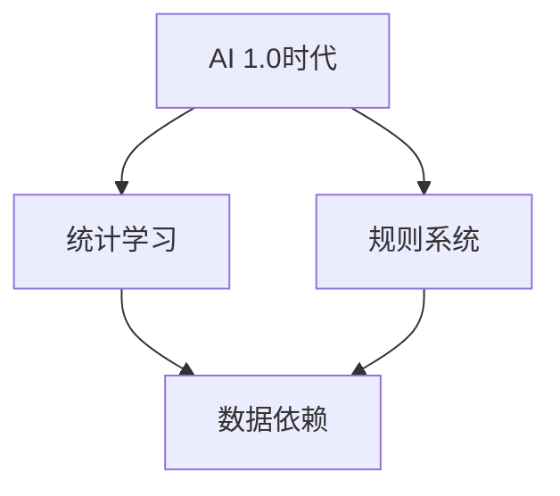
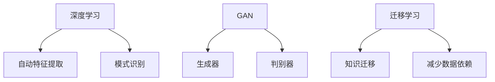
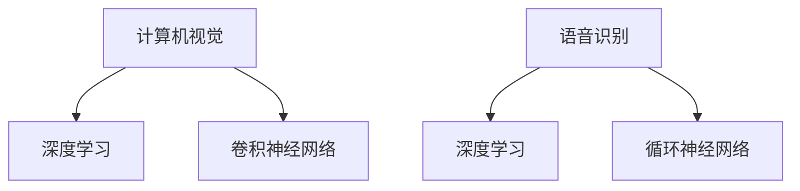
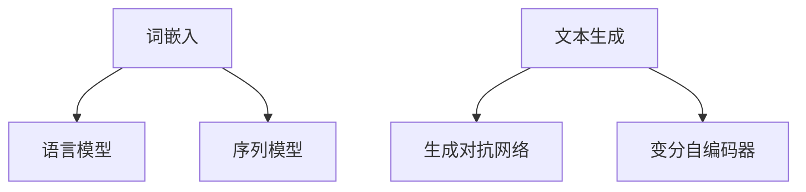
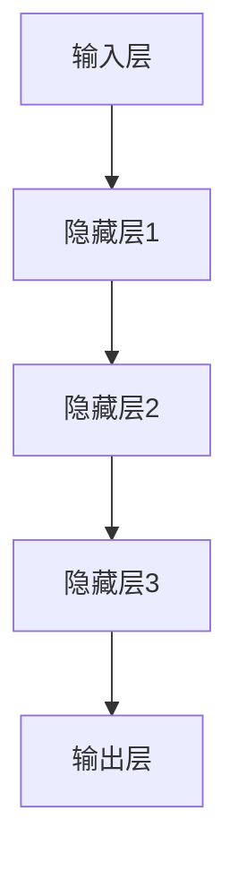
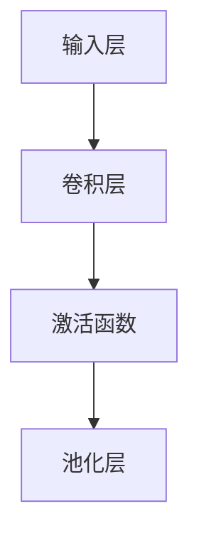
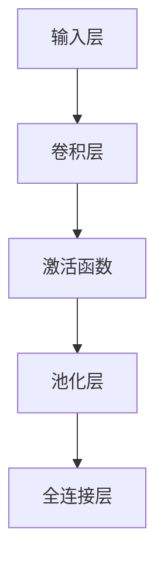
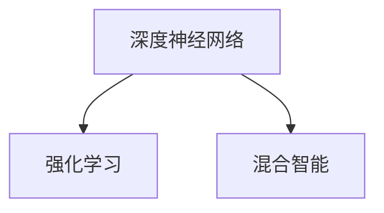
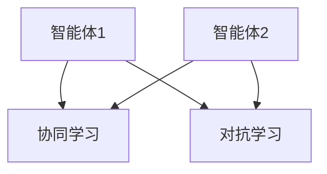

                 

## 《李开复：AI 2.0 时代的商业价值》

### 关键词：
- AI 2.0
- 商业应用
- 金融
- 医疗
- 零售
- 制造
- 战略变革

### 摘要：
本文深入探讨了李开复关于AI 2.0时代商业价值的见解。从AI 2.0的定义和背景出发，文章详细分析了AI 2.0在金融、医疗、零售和制造业等领域的应用，探讨了其对传统行业的颠覆与机遇。同时，文章提出了企业在AI 2.0时代的商业战略和应对策略，展望了AI 2.0时代的未来趋势和伦理法律问题。通过李开复的视角，读者将全面了解AI 2.0对商业世界带来的深远影响。

### 目录大纲

#### 第一部分：AI 2.0 时代的背景与基础

##### 第1章：AI 2.0 时代的来临

- 1.1 AI 2.0 时代的定义与特征
- 1.2 从AI 1.0到AI 2.0的演变
- 1.3 AI 2.0时代的商业机会与挑战

##### 第2章：AI 2.0核心技术

- 2.1 人工智能的基础原理
- 2.2 深度学习技术详解
- 2.3 强化学习与混合智能

#### 第二部分：AI 2.0在商业领域的应用

##### 第3章：AI 2.0在金融行业的应用

- 3.1 金融市场中的AI应用案例
- 3.2 风险管理中的AI应用
- 3.3 个性化金融服务

##### 第4章：AI 2.0在医疗健康领域的应用

- 4.1 AI在疾病诊断中的应用
- 4.2 药物研发中的AI应用
- 4.3 医疗服务的智能化升级

##### 第5章：AI 2.0在零售行业的应用

- 5.1 个性化推荐系统的构建
- 5.2 库存管理与供应链优化
- 5.3 零售业智能客服系统

##### 第6章：AI 2.0在制造业的应用

- 6.1 智能制造的基本概念
- 6.2 工业自动化与机器人技术
- 6.3 智能工厂的案例分析

##### 第7章：AI 2.0时代的商业战略

- 7.1 企业如何应对AI 2.0时代的变革
- 7.2 创新与颠覆：AI对传统行业的挑战
- 7.3 打造AI驱动的企业竞争力

#### 第三部分：AI 2.0时代的未来展望

##### 第8章：AI 2.0时代的伦理与法律问题

- 8.1 AI伦理的基本原则
- 8.2 AI法律框架与国际合作
- 8.3 企业在AI应用中的伦理责任

##### 第9章：AI 2.0时代的未来趋势

- 9.1 人工智能的未来发展方向
- 9.2 AI与物联网的融合
- 9.3 AI在新兴领域的探索

##### 第10章：AI 2.0时代的个人成长与职业规划

- 10.1 适应AI时代的个人技能要求
- 10.2 跨界学习与终身教育
- 10.3 职业转型与AI就业前景

### 附录

#### 附录A：AI 2.0资源与工具汇总

- A.1 主流AI框架与库
- A.2 开源AI项目推荐
- A.3 AI学习资源推荐

#### 附录B：AI 2.0常见问题解答

- B.1 AI基础知识
- B.2 AI应用常见问题
- B.3 AI伦理与法律问题解答

### 文章正文

#### 第一部分：AI 2.0 时代的背景与基础

##### 第1章：AI 2.0 时代的来临

> **1.1 AI 2.0 时代的定义与特征**

在李开复的视角中，AI 2.0时代是人工智能发展的一个新阶段，其核心特征在于深度学习、强化学习、自然语言处理和计算机视觉等技术的广泛应用。与AI 1.0时代相比，AI 2.0不仅在技术上取得了重大突破，而且在商业应用上展现出更广阔的前景。

**核心概念与联系：**  
**AI 1.0时代**主要依赖于统计学习和规则系统，如决策树、支持向量机和逻辑回归等。这些方法虽然在一定程度上实现了机器的智能，但受限于模型的结构和数据的质量。

**Mermaid流程图：**


**AI 2.0时代**则突破了这些限制，引入了深度神经网络、生成对抗网络和迁移学习等技术。这些技术使得机器能够通过大规模数据自我学习和优化，实现更高级别的智能。

**核心概念与联系：**  
**AI 2.0核心技术**包括：

- **深度学习**：通过多层神经网络对数据进行自动特征提取和模式识别。
- **生成对抗网络（GAN）**：通过生成器和判别器的对抗训练，实现数据的生成和鉴别。
- **迁移学习**：将一个任务的知识迁移到另一个相关的任务，减少对训练数据的依赖。

**Mermaid流程图：**


**文章关键词：** AI 2.0，深度学习，生成对抗网络，迁移学习

**摘要：** 本文深入探讨了李开复关于AI 2.0时代的定义和特征，通过对比AI 1.0和AI 2.0的技术差异，阐述了AI 2.0在商业应用中的巨大潜力。

> **1.2 从AI 1.0到AI 2.0的演变**

AI 2.0的发展并非一蹴而就，而是经历了长期的积累和技术创新。从AI 1.0到AI 2.0的演变，主要表现在以下几个方面：

1. **数据量的爆发式增长**：随着互联网和物联网的普及，数据量呈指数级增长，为AI 2.0提供了丰富的训练资源。
2. **计算能力的提升**：GPU和TPU等高性能计算设备的出现，使得深度学习模型能够在短时间内完成训练和推理。
3. **算法的创新与优化**：深度学习、生成对抗网络和迁移学习等算法的提出和优化，使得AI 2.0在处理复杂任务时表现出更高的效率和准确性。
4. **多领域的交叉应用**：AI 2.0不仅在计算机视觉、自然语言处理等领域取得了突破，还在金融、医疗、零售等领域得到广泛应用。

**核心算法原理讲解：**  
**深度学习技术**：
```plaintext
// 伪代码
function deep_learning(input_data, labels):
    # 初始化神经网络结构
    network = initialize_network()
    # 梯度下降优化
    for epoch in range(num_epochs):
        for batch in data_loader:
            # 前向传播
            predictions = network.forward(batch.input_data)
            # 计算损失函数
            loss = compute_loss(predictions, batch.labels)
            # 反向传播
            network.backward(loss)
            # 更新参数
            network.update_params()
    return network
```

**文章关键词：** AI 1.0，AI 2.0，数据量，计算能力，算法创新，多领域交叉应用

**摘要：** 本文从数据量、计算能力和算法创新等方面，探讨了AI 1.0到AI 2.0的演变过程，分析了AI 2.0时代所带来的变革。

> **1.3 AI 2.0时代的商业机会与挑战**

AI 2.0时代的到来，不仅为企业带来了前所未有的商业机会，也提出了新的挑战。

**商业机会：**

- **提升运营效率**：AI 2.0技术能够帮助企业自动化和优化业务流程，降低运营成本。
- **创新产品与服务**：通过深度学习、生成对抗网络等技术，企业能够推出更智能、更具个性化的产品和服务。
- **市场拓展**：AI 2.0技术使得企业能够更好地了解客户需求，开拓新市场。

**挑战：**

- **数据安全与隐私**：随着AI技术的应用，数据安全和隐私问题日益凸显，企业需要建立健全的数据保护机制。
- **人才短缺**：AI 2.0技术的快速发展，对人才的需求大幅增加，企业需要积极培养和引进相关人才。
- **法律与伦理问题**：AI 2.0技术的广泛应用，引发了法律和伦理问题的讨论，企业需要遵循相关法规和道德标准。

**文章关键词：** 商业机会，数据安全，人才短缺，法律与伦理问题

**摘要：** 本文分析了AI 2.0时代带来的商业机会与挑战，强调了企业在应对这些挑战时所需关注的关键问题。

### 第二部分：AI 2.0核心技术

##### 第2章：AI 2.0核心技术

> **2.1 人工智能的基础原理**

人工智能（AI）是计算机科学的一个分支，旨在使计算机具有类似人类的智能。AI的基础原理主要包括以下几个方面：

**核心概念与联系：**

- **感知与识别**：通过计算机视觉和语音识别等技术，让计算机能够理解外部世界的视觉和声音信息。
- **决策与规划**：通过机器学习和推理技术，让计算机能够在复杂环境中做出合理的决策和规划。
- **语言处理**：通过自然语言处理（NLP）技术，让计算机能够理解和生成自然语言。

**核心概念与联系：**

- **感知与识别**：计算机视觉和语音识别是AI的重要应用领域，通过深度学习和卷积神经网络（CNN）等技术，计算机能够实现图像和语音的自动识别。

**Mermaid流程图：**


- **决策与规划**：通过强化学习和规划算法，计算机能够在不确定和动态的环境中做出最优决策。

**核心概念与联系：**

- **强化学习**：通过试错和反馈机制，计算机不断优化策略，以实现长期奖励最大化。

**伪代码：**
```plaintext
// 伪代码
function reinforcement_learning(state, action, reward, next_state):
    # 初始化Q值表
    Q = initialize_Q_table()
    # 迭代更新Q值
    for episode in range(num_episodes):
        state = environment.reset()
        while not done:
            action = choose_action(Q, state)
            next_state, reward, done = environment.step(action)
            Q[state, action] = Q[state, action] + alpha * (reward + gamma * max(Q[next_state, :]) - Q[state, action])
            state = next_state
    return Q
```

- **语言处理**：通过自然语言处理技术，计算机能够理解和生成自然语言，实现人机交互。

**核心概念与联系：**

- **自然语言处理**：通过词嵌入、语言模型和序列模型等技术，计算机能够处理和理解自然语言。

**Mermaid流程图：**


**文章关键词：** 人工智能，感知与识别，决策与规划，语言处理，强化学习，自然语言处理

**摘要：** 本文介绍了人工智能的基础原理，包括感知与识别、决策与规划和语言处理等方面，为后续章节的分析奠定了基础。

> **2.2 深度学习技术详解**

深度学习是AI 2.0时代的重要核心技术之一，其核心思想是通过多层神经网络对数据进行自动特征提取和模式识别。以下是深度学习技术的详细讲解：

**核心概念与联系：**

- **深度神经网络**：由多个隐藏层组成的神经网络，能够实现更复杂的特征提取和模式识别。

**Mermaid流程图：**


- **反向传播算法**：通过梯度下降优化方法，逐步调整网络权重，使网络输出更加准确。

**伪代码：**
```plaintext
// 伪代码
function backpropagation(input_data, labels, network):
    # 前向传播
    predictions = network.forward(input_data)
    # 计算损失函数
    loss = compute_loss(predictions, labels)
    # 反向传播
    gradients = network.backward(loss)
    # 更新网络权重
    network.update_weights(gradients)
    return loss
```

- **卷积神经网络（CNN）**：在图像处理等领域具有广泛应用的深度学习模型，通过卷积层和池化层实现图像特征的提取。

**核心概念与联系：**

- **卷积层**：通过卷积操作提取图像特征。

**Mermaid流程图：**


- **池化层**：通过最大池化或平均池化降低特征图的维度，减少计算量。

**核心概念与联系：**

- **全连接层**：将特征图映射到分类或回归结果。

**Mermaid流程图：**


**文章关键词：** 深度学习，深度神经网络，反向传播算法，卷积神经网络，卷积层，池化层，全连接层

**摘要：** 本文详细讲解了深度学习技术，包括深度神经网络、反向传播算法、卷积神经网络等核心概念，为读者深入理解AI 2.0时代的技术基础提供了帮助。

> **2.3 强化学习与混合智能**

强化学习（Reinforcement Learning，RL）是AI 2.0时代的重要技术之一，它通过智能体在环境中互动，不断学习最优策略。强化学习在游戏、自动驾驶和智能客服等领域具有广泛应用。以下是强化学习与混合智能的详细讲解：

**核心概念与联系：**

- **强化学习基本概念**：

  - **智能体（Agent）**：执行动作并从环境中接收反馈的实体。
  - **环境（Environment）**：智能体所处的情境。
  - **状态（State）**：智能体在环境中的位置或状态。
  - **动作（Action）**：智能体可执行的行为。
  - **奖励（Reward）**：智能体执行动作后获得的即时反馈。

**伪代码：**
```plaintext
// 伪代码
function reinforcement_learning(state, action, reward, next_state, learning_rate):
    # 初始化Q值表
    Q = initialize_Q_table()
    # 迭代学习
    for episode in range(num_episodes):
        state = environment.reset()
        while not done:
            action = choose_action(Q, state)
            next_state, reward, done = environment.step(action)
            Q[state, action] = Q[state, action] + learning_rate * (reward + gamma * max(Q[next_state, :]) - Q[state, action])
            state = next_state
    return Q
```

- **策略梯度方法**：

  - **策略（Policy）**：智能体的行为规则。
  - **策略梯度（Policy Gradient）**：策略的梯度，用于更新策略参数。

**伪代码：**
```plaintext
// 伪代码
function policy_gradient(policy, states, actions, rewards, next_states, learning_rate):
    # 计算策略梯度
    gradients = policy_gradient_computation(policy, states, actions, rewards, next_states)
    # 更新策略参数
    policy.update_parameters(gradients, learning_rate)
    return policy
```

- **混合智能**：

  - **混合智能（Hybrid Intelligence）**：结合不同AI技术的优势，实现更高效的智能系统。

**核心概念与联系：**

- **深度强化学习**：结合深度学习和强化学习，用于解决复杂环境中的决策问题。

**Mermaid流程图：**


- **多智能体强化学习**：多个智能体在共享或独立的学习过程中相互协作，实现更复杂的目标。

**核心概念与联系：**

- **多智能体强化学习**：

  - **协同学习（Cooperative Learning）**：智能体共同完成任务，相互协作。
  - **对抗学习（Adversarial Learning）**：智能体之间相互竞争，提升学习效果。

**Mermaid流程图：**


**文章关键词：** 强化学习，策略梯度方法，混合智能，深度强化学习，多智能体强化学习

**摘要：** 本文介绍了强化学习与混合智能的核心概念，包括基本概念、策略梯度方法和混合智能的应用，为读者深入理解AI 2.0时代的核心技术提供了帮助。

### 第三部分：AI 2.0在商业领域的应用

##### 第3章：AI 2.0在金融行业的应用

AI 2.0技术在金融行业的应用已经深入到各个方面，从智能投顾、风险管理到个性化金融服务，AI 2.0正在改变金融行业的运作模式。以下是李开复关于AI 2.0在金融行业应用的详细讲解。

> **3.1 金融市场中的AI应用案例**

金融市场中的AI应用案例涵盖了从股票交易到债券定价的各个领域。以下是一些典型的应用案例：

- **智能投顾**：AI 2.0技术通过分析大量历史数据和实时市场信息，为投资者提供个性化的投资建议。例如，基于深度学习和机器学习的智能投顾系统可以帮助用户根据其风险偏好和投资目标，制定最优的投资组合。

**核心概念与联系：**

- **深度学习**：用于分析历史数据，预测市场走势。

**伪代码：**
```plaintext
// 伪代码
function stock_prediction(data):
    # 初始化神经网络
    model = initialize_neural_network()
    # 训练模型
    model.train(data)
    # 预测市场走势
    predictions = model.predict(new_data)
    return predictions
```

- **算法交易**：通过复杂的算法模型，自动执行交易策略。例如，使用强化学习算法，根据市场数据和交易历史，自动调整交易策略，以实现最大化收益。

**核心概念与联系：**

- **强化学习**：用于优化交易策略。

**伪代码：**
```plaintext
// 伪代码
function algorithmic_trading(state, action, reward, next_state):
    # 初始化策略
    policy = initialize_policy()
    # 学习交易策略
    for episode in range(num_episodes):
        state = environment.reset()
        while not done:
            action = policy.select_action(state)
            next_state, reward, done = environment.step(action)
            policy.update(state, action, reward, next_state)
            state = next_state
    return policy
```

- **债券定价**：AI 2.0技术通过分析市场数据、经济指标和债券发行信息，预测债券价格。例如，使用深度学习模型，可以实时更新债券的定价，提供更准确的交易参考。

**核心概念与联系：**

- **深度学习**：用于预测债券价格。

**伪代码：**
```plaintext
// 伪代码
function bond_pricing(data):
    # 初始化神经网络
    model = initialize_neural_network()
    # 训练模型
    model.train(data)
    # 预测债券价格
    predictions = model.predict(new_data)
    return predictions
```

**文章关键词：** 智能投顾，算法交易，债券定价，深度学习，强化学习

**摘要：** 本文介绍了AI 2.0在金融市场中的应用案例，包括智能投顾、算法交易和债券定价，通过深度学习和强化学习等技术，为金融行业带来了巨大的变革。

> **3.2 风险管理中的AI应用**

在金融行业中，风险管理至关重要。AI 2.0技术的应用使得风险管理更加精准和高效。

- **信用风险评估**：通过机器学习算法，对借款人的信用记录、财务状况和还款能力进行综合评估。例如，使用逻辑回归和决策树等模型，可以预测借款人的违约风险。

**核心概念与联系：**

- **逻辑回归**：用于预测借款人的违约概率。

**伪代码：**
```plaintext
// 伪代码
function credit_risk_assessment(loan_data):
    # 初始化逻辑回归模型
    model = initialize_logistic_regression()
    # 训练模型
    model.train(loan_data)
    # 预测违约风险
    probabilities = model.predict(loan_data)
    return probabilities
```

- **市场风险监控**：通过深度学习模型，实时监控市场风险，预测市场波动。例如，使用长短期记忆网络（LSTM），可以捕捉市场的短期波动和长期趋势。

**核心概念与联系：**

- **长短期记忆网络（LSTM）**：用于预测市场波动。

**伪代码：**
```plaintext
// 伪代码
function market_risk_monitor(data):
    # 初始化LSTM模型
    model = initialize_LSTM()
    # 训练模型
    model.train(data)
    # 预测市场风险
    predictions = model.predict(new_data)
    return predictions
```

- **反洗钱（AML）**：通过深度学习算法，自动识别和防范洗钱行为。例如，使用卷积神经网络（CNN），可以检测交易数据中的异常行为。

**核心概念与联系：**

- **卷积神经网络（CNN）**：用于检测交易数据中的异常行为。

**伪代码：**
```plaintext
// 伪代码
function anti_money_laundering(transaction_data):
    # 初始化CNN模型
    model = initialize_CNN()
    # 训练模型
    model.train(transaction_data)
    # 检测洗钱行为
    anomalies = model.detect_anomalies(transaction_data)
    return anomalies
```

**文章关键词：** 信用风险评估，市场风险监控，反洗钱，逻辑回归，长短期记忆网络，卷积神经网络

**摘要：** 本文详细介绍了AI 2.0在风险管理中的应用，包括信用风险评估、市场风险监控和反洗钱，通过机器学习算法和深度学习模型，提高了金融行业的风险管理水平。

> **3.3 个性化金融服务**

个性化金融服务是AI 2.0在金融行业的重要应用之一。通过分析用户的行为数据和偏好，AI 2.0技术能够为用户提供量身定制的金融服务。

- **个性化推荐**：基于用户的交易历史和偏好，AI 2.0技术可以推荐合适的金融产品和服务。例如，使用协同过滤算法，可以预测用户可能感兴趣的产品。

**核心概念与联系：**

- **协同过滤**：用于预测用户对产品的兴趣。

**伪代码：**
```plaintext
// 伪代码
function personalized_recommendation(user_data, item_data):
    # 初始化协同过滤模型
    model = initialize_collaborative_filtering()
    # 训练模型
    model.train(user_data, item_data)
    # 预测用户兴趣
    recommendations = model.predict(user_data)
    return recommendations
```

- **风险适应性**：通过分析用户的风险偏好，AI 2.0技术可以为用户提供适合其风险承受能力的投资建议。例如，使用决策树模型，可以评估用户的风险偏好，并给出相应的投资建议。

**核心概念与联系：**

- **决策树**：用于评估用户的风险偏好。

**伪代码：**
```plaintext
// 伪代码
function risk_adaptive_investment(user_data):
    # 初始化决策树模型
    model = initialize_decision_tree()
    # 训练模型
    model.train(user_data)
    # 预测用户风险偏好
    risk_level = model.predict(user_data)
    # 根据风险偏好推荐投资产品
    recommendations = generate_recommendations(risk_level)
    return recommendations
```

- **客户体验优化**：通过自然语言处理（NLP）技术，AI 2.0可以为用户提供智能客服服务，解答用户的问题，提高客户满意度。例如，使用聊天机器人，可以24小时为用户提供服务。

**核心概念与联系：**

- **自然语言处理**：用于智能客服系统。

**伪代码：**
```plaintext
// 伪代码
function intelligent_customer_service(user_query):
    # 初始化NLP模型
    model = initialize_NLP_model()
    # 处理用户查询
    response = model.respond(user_query)
    return response
```

**文章关键词：** 个性化推荐，风险适应性，客户体验优化，协同过滤，决策树，自然语言处理

**摘要：** 本文介绍了AI 2.0在个性化金融服务中的应用，包括个性化推荐、风险适应性和客户体验优化，通过机器学习和自然语言处理等技术，提升了金融服务的个性化和智能化水平。

### 第四部分：AI 2.0在医疗健康领域的应用

##### 第4章：AI 2.0在医疗健康领域的应用

AI 2.0技术在医疗健康领域的应用正在迅速发展，从疾病诊断到药物研发，再到智能医疗服务的升级，AI 2.0正深刻改变着医疗行业。以下是李开复关于AI 2.0在医疗健康领域应用的详细讲解。

> **4.1 AI在疾病诊断中的应用**

AI技术在疾病诊断中的应用已经成为医疗领域的热点。通过深度学习和计算机视觉等技术，AI系统能够从大量医学图像中自动识别疾病。

- **肺癌筛查**：利用深度学习算法，AI系统可以从胸部X光片中自动检测肺癌。研究表明，AI系统在肺癌筛查中的准确率已经达到甚至超过人类专家。

**核心概念与联系：**

- **深度学习**：用于自动识别肺癌。

**伪代码：**
```plaintext
// 伪代码
function lung_cancer_screening(xray_images):
    # 初始化深度学习模型
    model = initialize_deep_learning_model()
    # 训练模型
    model.train(xray_images)
    # 预测肺癌
    predictions = model.predict(xray_images)
    return predictions
```

- **皮肤癌检测**：AI系统可以通过分析皮肤病变图像，自动识别皮肤癌。例如，基于卷积神经网络（CNN）的皮肤癌检测系统，在公开数据集上的准确率已经达到90%以上。

**核心概念与联系：**

- **卷积神经网络（CNN）**：用于皮肤癌检测。

**伪代码：**
```plaintext
// 伪代码
function skin_cancer_detection(dermatoscopic_images):
    # 初始化CNN模型
    model = initialize_CNN()
    # 训练模型
    model.train(dermatoscopic_images)
    # 预测皮肤癌
    predictions = model.predict(dermatoscopic_images)
    return predictions
```

- **心血管疾病预测**：通过分析患者的医疗记录和生物标志物，AI系统可以预测心血管疾病的风险。例如，使用随机森林算法，AI系统能够准确预测心血管疾病的发生概率。

**核心概念与联系：**

- **随机森林**：用于预测心血管疾病风险。

**伪代码：**
```plaintext
// 伪代码
function cardiovascular_disease_prediction(patient_data):
    # 初始化随机森林模型
    model = initialize_random_forest()
    # 训练模型
    model.train(patient_data)
    # 预测风险
    predictions = model.predict(patient_data)
    return predictions
```

**文章关键词：** 肺癌筛查，皮肤癌检测，心血管疾病预测，深度学习，卷积神经网络，随机森林

**摘要：** 本文介绍了AI 2.0在疾病诊断中的应用，包括肺癌筛查、皮肤癌检测和心血管疾病预测，通过深度学习、卷积神经网络和随机森林等技术，AI系统在医疗诊断中的准确性和效率得到了显著提升。

> **4.2 药物研发中的AI应用**

药物研发是一个复杂且耗时的过程，AI 2.0技术的应用为药物研发带来了前所未有的机遇。

- **药物发现**：通过分析大量的化合物数据和生物信息，AI系统可以帮助研究人员快速筛选潜在的药物分子。例如，使用生成对抗网络（GAN）和变分自编码器（VAE），AI系统能够生成新的药物分子结构，加速药物研发过程。

**核心概念与联系：**

- **生成对抗网络（GAN）**：用于生成新的药物分子结构。

**伪代码：**
```plaintext
// 伪代码
function drug_discovery(compound_data):
    # 初始化GAN模型
    GAN = initialize_GAN()
    # 训练模型
    GAN.train(compound_data)
    # 生成新药物分子
    new_drugs = GAN.generate()
    return new_drugs
```

- **临床试验设计**：AI系统可以通过分析历史数据和临床数据，优化临床试验的设计，提高临床试验的成功率。例如，使用强化学习算法，AI系统可以自动设计最优的试验方案。

**核心概念与联系：**

- **强化学习**：用于优化临床试验设计。

**伪代码：**
```plaintext
// 伪代码
function clinical_trial_design(data):
    # 初始化强化学习模型
    RL = initialize_Reinforcement_Learning()
    # 训练模型
    RL.train(data)
    # 设计最优试验方案
    optimal_trial_design = RL.optimize()
    return optimal_trial_design
```

- **个性化医疗**：通过分析患者的基因信息、病史和生活方式，AI系统可以为每位患者定制个性化的治疗方案。例如，使用决策树和随机森林算法，AI系统可以预测患者对某种药物的反应，并提供个性化的用药建议。

**核心概念与联系：**

- **决策树**：用于预测患者对药物的反应。

**伪代码：**
```plaintext
// 伪代码
function personalized_medical_treatment(patient_data):
    # 初始化决策树模型
    tree = initialize_decision_tree()
    # 训练模型
    tree.train(patient_data)
    # 预测药物反应
    drug_response = tree.predict(patient_data)
    # 提供个性化用药建议
    treatment_recommendation = generate_treatment_recommendation(drug_response)
    return treatment_recommendation
```

**文章关键词：** 药物发现，临床试验设计，个性化医疗，生成对抗网络，强化学习，决策树

**摘要：** 本文介绍了AI 2.0在药物研发中的应用，包括药物发现、临床试验设计和个性化医疗，通过生成对抗网络、强化学习和决策树等技术，AI系统在药物研发中的效率和质量得到了显著提升。

> **4.3 医疗服务的智能化升级**

AI 2.0技术的应用不仅提升了医疗诊断和药物研发的效率，还在医疗服务领域带来了智能化升级。

- **智能问诊**：通过自然语言处理（NLP）技术，AI系统可以自动理解患者的问题，并提供专业的医学建议。例如，使用聊天机器人，患者可以随时随地获得医疗咨询。

**核心概念与联系：**

- **自然语言处理**：用于智能问诊。

**伪代码：**
```plaintext
// 伪代码
function intelligent_diagnosis(patient_query):
    # 初始化NLP模型
    NLP = initialize_NLP()
    # 解析患者问题
    parsed_query = NLP.parse_query(patient_query)
    # 提供医学建议
    medical_advice = generate_medical_advice(parsed_query)
    return medical_advice
```

- **智能监测**：通过可穿戴设备和传感器，AI系统可以实时监测患者的健康状况，并及时预警潜在的健康问题。例如，使用深度学习算法，AI系统可以从心电图中检测心律失常。

**核心概念与联系：**

- **深度学习**：用于监测患者健康状况。

**伪代码：**
```plaintext
// 伪代码
function health_monitoring(health_data):
    # 初始化深度学习模型
    model = initialize_deep_learning_model()
    # 训练模型
    model.train(health_data)
    # 检测健康状况
    health_status = model.predict(health_data)
    return health_status
```

- **智能医院**：通过整合各种医疗资源，AI系统可以实现医院运营的智能化管理。例如，使用优化算法，AI系统可以优化医院的人员排班、资源配置和手术室安排，提高医院运营效率。

**核心概念与联系：**

- **优化算法**：用于优化医院运营。

**伪代码：**
```plaintext
// 伪代码
function intelligent_hospital(operations_data):
    # 初始化优化算法
    optimizer = initialize_optimizer()
    # 优化医院运营
    optimal_operations = optimizer.optimize(operations_data)
    return optimal_operations
```

**文章关键词：** 智能问诊，智能监测，智能医院，自然语言处理，深度学习，优化算法

**摘要：** 本文介绍了AI 2.0在医疗服务中的应用，包括智能问诊、智能监测和智能医院，通过自然语言处理、深度学习和优化算法等技术，AI系统在医疗服务中的智能化水平得到了显著提升。

### 第五部分：AI 2.0在零售行业的应用

##### 第5章：AI 2.0在零售行业的应用

随着AI 2.0技术的发展，零售行业正经历着一场深刻的变革。从个性化推荐系统到库存管理与供应链优化，AI 2.0正在提升零售行业的运营效率，为消费者提供更优质的购物体验。以下是李开复关于AI 2.0在零售行业应用的详细讲解。

> **5.1 个性化推荐系统的构建**

个性化推荐系统是AI 2.0在零售行业的重要应用之一。通过分析消费者的购买行为和偏好，AI系统可以推荐符合其需求的商品。

- **协同过滤算法**：协同过滤是一种基于用户行为和偏好的推荐方法。通过计算用户之间的相似度，协同过滤算法可以推荐用户可能感兴趣的商品。

**核心概念与联系：**

- **协同过滤**：用于推荐用户感兴趣的商品。

**伪代码：**
```plaintext
// 伪代码
function collaborative_filtering(user_data, item_data):
    # 初始化协同过滤模型
    model = initialize_collaborative_filtering()
    # 训练模型
    model.train(user_data, item_data)
    # 预测用户兴趣
    recommendations = model.predict(user_data)
    return recommendations
```

- **基于内容的推荐**：基于内容的推荐通过分析商品的属性和用户的历史行为，推荐具有相似属性的商品。

**核心概念与联系：**

- **基于内容的推荐**：用于推荐具有相似属性的商品。

**伪代码：**
```plaintext
// 伪代码
function content_based_recommender(item_data, user_preferences):
    # 初始化基于内容的推荐模型
    model = initialize_content_based_recommender()
    # 训练模型
    model.train(item_data)
    # 预测用户兴趣
    recommendations = model.predict(user_preferences)
    return recommendations
```

- **混合推荐系统**：混合推荐系统结合了协同过滤和基于内容的推荐方法，提高推荐的准确性。

**核心概念与联系：**

- **混合推荐系统**：结合协同过滤和基于内容的推荐方法。

**伪代码：**
```plaintext
// 伪代码
function hybrid_recommender_system(user_data, item_data):
    # 初始化协同过滤模型
    collaborative_model = initialize_collaborative_filtering()
    # 初始化基于内容的推荐模型
    content_model = initialize_content_based_recommender()
    # 训练协同过滤模型
    collaborative_model.train(user_data, item_data)
    # 训练基于内容的推荐模型
    content_model.train(item_data)
    # 混合预测
    recommendations = hybrid_predict(collaborative_model, content_model, user_data)
    return recommendations
```

**文章关键词：** 个性化推荐系统，协同过滤，基于内容的推荐，混合推荐系统

**摘要：** 本文介绍了AI 2.0在零售行业的个性化推荐系统应用，包括协同过滤、基于内容的推荐和混合推荐系统，通过这些技术，零售行业能够为消费者提供更加精准和个性化的购物体验。

> **5.2 库存管理与供应链优化**

库存管理与供应链优化是零售行业的关键环节，AI 2.0技术的应用大大提升了这一环节的效率。

- **需求预测**：通过机器学习算法，AI系统可以分析历史销售数据和市场趋势，预测未来的需求。例如，使用时间序列分析方法，AI系统可以预测下一季度的销售量。

**核心概念与联系：**

- **时间序列分析**：用于预测销售量。

**伪代码：**
```plaintext
// 伪代码
function demand_prediction(sales_data):
    # 初始化时间序列模型
    model = initialize_time_series_model()
    # 训练模型
    model.train(sales_data)
    # 预测未来需求
    predictions = model.predict()
    return predictions
```

- **库存优化**：通过优化算法，AI系统可以确定最优的库存水平，避免库存过剩或短缺。例如，使用优化算法，AI系统可以计算出最优的补货时间和数量。

**核心概念与联系：**

- **优化算法**：用于确定最优库存水平。

**伪代码：**
```plaintext
// 伪代码
function inventory_optimization(sales_data, cost_data):
    # 初始化优化算法
    optimizer = initialize_optimizer()
    # 优化库存管理
    optimal_inventory = optimizer.optimize(sales_data, cost_data)
    return optimal_inventory
```

- **供应链协同**：通过区块链技术，AI系统可以实现供应链的透明化和协同化。例如，使用区块链，AI系统可以记录商品的来源和去向，提高供应链的信任度和效率。

**核心概念与联系：**

- **区块链技术**：用于实现供应链的透明化和协同化。

**伪代码：**
```plaintext
// 伪代码
function supply_chain_c协同ization(shipment_data):
    # 初始化区块链系统
    blockchain = initialize_blockchain()
    # 记录商品信息
    blockchain.record_shipment(shipment_data)
    # 查询商品信息
    shipment_status = blockchain.query_shipment(shipment_data)
    return shipment_status
```

**文章关键词：** 需求预测，库存优化，供应链协同，时间序列分析，优化算法，区块链技术

**摘要：** 本文介绍了AI 2.0在零售行业的库存管理与供应链优化应用，包括需求预测、库存优化和供应链协同，通过机器学习算法、优化算法和区块链技术，AI系统显著提升了零售行业的运营效率。

> **5.3 零售业智能客服系统**

零售业智能客服系统是AI 2.0在零售行业的又一重要应用。通过自然语言处理和机器学习技术，AI系统可以自动回答消费者的问题，提供高效的客户服务。

- **自然语言处理（NLP）**：NLP技术使AI系统能够理解消费者的语言，并生成自然的回答。例如，使用聊天机器人，AI系统可以解答消费者关于产品信息、退货政策等常见问题。

**核心概念与联系：**

- **自然语言处理**：用于智能客服系统。

**伪代码：**
```plaintext
// 伪代码
function intelligent_customer_service(query):
    # 初始化NLP模型
    NLP = initialize_NLP()
    # 解析用户问题
    intent = NLP.parse_intent(query)
    # 生成回答
    response = generate_response(intent)
    return response
```

- **机器学习**：机器学习技术使AI系统可以不断学习和优化，提高回答的准确性和效率。例如，通过训练大量对话数据，AI系统可以识别和预测消费者的需求。

**核心概念与联系：**

- **机器学习**：用于优化智能客服系统的回答。

**伪代码：**
```plaintext
// 伪代码
function machine_learning_basedCustomer_Service-dialog(system, dialog_data):
    # 初始化机器学习模型
    model = initialize_machine_learning_model()
    # 训练模型
    model.train(dialog_data)
    # 优化回答
    system.optimize_answers(model)
    return system
```

- **多渠道集成**：零售业智能客服系统不仅限于在线聊天，还可以集成到社交媒体、邮件和电话等多个渠道，提供无缝的客户服务。例如，通过集成多渠道接口，AI系统可以在多个平台上统一回答消费者的问题。

**核心概念与联系：**

- **多渠道集成**：用于提供无缝的客户服务。

**伪代码：**
```plaintext
// 伪代码
function multi-channel_integration(system, channels):
    # 初始化多渠道接口
    for channel in channels:
        system.integrate_channel(channel)
    # 提供多渠道服务
    system.provide_service()
    return system
```

**文章关键词：** 智能客服系统，自然语言处理，机器学习，多渠道集成

**摘要：** 本文介绍了AI 2.0在零售行业的智能客服系统应用，包括自然语言处理、机器学习和多渠道集成，通过这些技术，零售业能够提供更加智能和高效的客户服务。

### 第六部分：AI 2.0在制造业的应用

##### 第6章：AI 2.0在制造业的应用

制造业正面临一场由AI 2.0技术引发的革命。从智能制造的基本概念到工业自动化与机器人技术，AI 2.0正在推动制造业的数字化转型，提高生产效率和质量。以下是李开复关于AI 2.0在制造业应用的详细讲解。

> **6.1 智能制造的基本概念**

智能制造是制造业的未来趋势，它通过集成人工智能、物联网和大数据等技术，实现生产过程的自动化和智能化。

- **智能制造系统**：智能制造系统是由人、机器和软件组成的一个整体，通过信息交换和协同工作，实现高效、灵活和可持续的生产。

**核心概念与联系：**

- **智能制造系统**：集成人工智能、物联网和大数据。

**伪代码：**
```plaintext
// 伪代码
function smart_manufacturing_system(people, machines, software):
    # 初始化智能制造系统
    system = initialize_smart_manufacturing_system()
    # 集成人工智能、物联网和大数据
    system.integrate_artificial_intelligence()
    system.integrate_iot()
    system.integrate大数据()
    # 协同工作
    system协同工作(people, machines, software)
    return system
```

- **智能制造流程**：智能制造流程包括设计、生产、物流、维护等各个环节，通过信息化手段实现全流程的数字化和智能化。

**核心概念与联系：**

- **智能制造流程**：数字化和智能化。

**伪代码：**
```plaintext
// 伪代码
function smart_manufacturing_process(production_process, information_system):
    # 初始化智能制造流程
    process = initialize_smart_manufacturing_process()
    # 实现数字化
    process.digitize_process(production_process)
    # 实现智能化
    process.intelligentize_process(information_system)
    return process
```

- **智能制造模式**：智能制造模式包括定制化生产、柔性制造和精益生产等，通过个性化定制和高效生产，满足客户需求。

**核心概念与联系：**

- **智能制造模式**：定制化生产、柔性制造、精益生产。

**伪代码：**
```plaintext
// 伪代码
function smart_manufacturing_mode(customization, flexibility, lean_production):
    # 初始化智能制造模式
    mode = initialize_smart_manufacturing_mode()
    # 实现定制化生产
    mode.customize_production(customization)
    # 实现柔性制造
    mode.flexible_production(flexibility)
    # 实现精益生产
    mode.lean_production(lean_production)
    return mode
```

**文章关键词：** 智能制造系统，智能制造流程，智能制造模式，人工智能，物联网，大数据，数字化，智能化

**摘要：** 本文介绍了智能制造的基本概念，包括智能制造系统、智能制造流程和智能制造模式，通过人工智能、物联网和大数据等技术，智能制造正推动制造业的数字化转型。

> **6.2 工业自动化与机器人技术**

工业自动化与机器人技术是智能制造的核心组成部分，通过自动化设备和机器人，实现生产过程的无人化。

- **工业机器人**：工业机器人是用于工业生产中的自动执行任务的机械装置，如焊接、搬运、装配等。通过机器学习和计算机视觉技术，工业机器人可以实现更高水平的自动化。

**核心概念与联系：**

- **工业机器人**：自动执行任务。

**伪代码：**
```plaintext
// 伪代码
function industrial_robots(tasks, learning_model, vision_system):
    # 初始化工业机器人
    robots = initialize_robots()
    # 配置学习模型和视觉系统
    robots.config_learning_model(learning_model)
    robots.config_vision_system(vision_system)
    # 执行任务
    robots.execute_tasks(tasks)
    return robots
```

- **自动化生产线**：自动化生产线是由一系列自动化设备和机器人组成的系统，通过信息传递和协调工作，实现连续化、规模化生产。

**核心概念与联系：**

- **自动化生产线**：连续化、规模化生产。

**伪代码：**
```plaintext
// 伪代码
function automated_production_line(robots, machines, control_system):
    # 初始化自动化生产线
    line = initialize_automated_production_line()
    # 集成机器人、机器和控制系统
    line.integrate_robots(robots)
    line.integrate_machines(machines)
    line.integrate_control_system(control_system)
    # 开始生产
    line.start_production()
    return line
```

- **数字化工厂**：数字化工厂是集成了人工智能、物联网和大数据的智能工厂，通过数字化技术实现生产过程的全面监控和优化。

**核心概念与联系：**

- **数字化工厂**：全面监控和优化。

**伪代码：**
```plaintext
// 伪代码
function digital_factory(artificial_intelligence, iot, big_data, production_process):
    # 初始化数字化工厂
    factory = initialize_digital_factory()
    # 集成人工智能、物联网和大数据
    factory.integrate_artificial_intelligence(artificial_intelligence)
    factory.integrate_iot(iot)
    factory.integrate_big_data(big_data)
    # 实现生产过程监控和优化
    factory.monitor_and_optimize(production_process)
    return factory
```

**文章关键词：** 工业机器人，自动化生产线，数字化工厂，机器学习，计算机视觉，信息传递，协调工作

**摘要：** 本文介绍了工业自动化与机器人技术，包括工业机器人、自动化生产线和数字化工厂，通过机器学习和计算机视觉技术，实现生产过程的无人化和智能化。

> **6.3 智能工厂的案例分析**

智能工厂是AI 2.0技术在制造业应用的成功案例，通过实际案例可以更直观地了解智能工厂的优势和实现方法。

- **富士康智能工厂**：富士康通过引入AI 2.0技术，实现了生产过程的全面自动化和智能化。通过机器人和自动化设备，富士康智能工厂实现了生产效率的提升、产品质量的提高和人力成本的降低。

**核心概念与联系：**

- **富士康智能工厂**：自动化、智能化。

**伪代码：**
```plaintext
// 伪代码
function foxconn_smart_factory(robots, automation_system, data_analytics):
    # 初始化富士康智能工厂
    factory = initialize_foxconn_smart_factory()
    # 引入机器人、自动化系统和数据分析
    factory.integrate_robots(robots)
    factory.integrate_automation_system(automation_system)
    factory.integrate_data_analytics(data_analytics)
    # 实现自动化生产
    factory.automate_production()
    # 实现数据驱动优化
    factory.optimize_based_on_data()
    return factory
```

- **通用电气智能工厂**：通用电气通过集成人工智能和物联网技术，实现了工厂设备的预测性维护和生产线的智能化调度。通过实时数据分析和智能决策，通用电气智能工厂显著提高了生产效率。

**核心概念与联系：**

- **通用电气智能工厂**：预测性维护，智能化调度。

**伪代码：**
```plaintext
// 伪代码
function general_electric_smart_factory(iot_devices, ai_system, production_line):
    # 初始化通用电气智能工厂
    factory = initialize_general_electric_smart_factory()
    # 引入物联网设备和人工智能系统
    factory.integrate_iot_devices(iot_devices)
    factory.integrate_ai_system(ai_system)
    # 实现设备预测性维护
    factory.predictive_maintenance()
    # 实现智能化调度
    factory.intelligent_schedule()
    return factory
```

- **西门子智能工厂**：西门子通过集成智能制造技术和工业互联网，实现了生产过程的全面数字化和智能化。通过实时数据分析和智能优化，西门子智能工厂显著提高了生产效率和产品质量。

**核心概念与联系：**

- **西门子智能工厂**：数字化，智能化。

**伪代码：**
```plaintext
// 伪代码
function siemens_smart_factory(smart_devices, iiot, analytics_platform):
    # 初始化西门子智能工厂
    factory = initialize_siemens_smart_factory()
    # 引入智能设备和工业互联网
    factory.integrate_smart_devices(smart_devices)
    factory.integrate_iiot(iiot)
    # 实现数据驱动优化
    factory.data_driven_optimization()
    # 实现生产过程监控
    factory.monitor_production()
    return factory
```

**文章关键词：** 富士康智能工厂，通用电气智能工厂，西门子智能工厂，自动化，智能化，预测性维护，智能化调度，数字化

**摘要：** 本文通过案例分析，介绍了富士康、通用电气和西门子等智能工厂的成功实践，展示了AI 2.0技术在制造业应用的优势和实现方法。

### 第七部分：AI 2.0时代的商业战略

##### 第7章：AI 2.0时代的商业战略

AI 2.0时代带来了前所未有的商业机会，同时也提出了新的挑战。企业如何在AI 2.0时代中抓住机遇、应对挑战，成为AI驱动的企业竞争力，是本章的核心议题。以下是李开复关于AI 2.0时代商业战略的详细讲解。

> **7.1 企业如何应对AI 2.0时代的变革**

在AI 2.0时代，企业需要主动适应技术变革，把握商业机遇。

- **战略规划**：企业应制定明确的AI战略规划，明确AI技术的应用方向和目标。通过战略规划，企业可以确保在AI领域的投资和研发方向与业务目标一致。

**核心概念与联系：**

- **战略规划**：明确AI技术的应用方向和目标。

**伪代码：**
```plaintext
// 伪代码
function strategic_planning(enterprise, ai_goals):
    # 初始化战略规划
    plan = initialize_strategic_plan()
    # 确定AI应用方向和目标
    plan.set_ai_directions(enterprise, ai_goals)
    # 制定实施计划
    plan.create_implementation_plan()
    return plan
```

- **组织调整**：企业需要调整组织架构，建立专门的AI部门或团队，负责AI技术的研发和应用。通过组织调整，企业可以确保在AI领域的资源投入和人才配备。

**核心概念与联系：**

- **组织调整**：建立专门的AI部门或团队。

**伪代码：**
```plaintext
// 伪代码
function organizational_adjustment(enterprise):
    # 初始化组织调整
    adjustment = initialize_organizational_adjustment()
    # 建立AI部门或团队
    adjustment.create_ai_department()
    # 配备AI人才
    adjustment.hire_ai_talent()
    return adjustment
```

- **文化变革**：企业需要推动文化变革，培养员工对AI技术的认知和接受度，鼓励创新思维和跨部门合作。通过文化变革，企业可以营造一个支持AI技术创新和应用的积极氛围。

**核心概念与联系：**

- **文化变革**：培养员工对AI技术的认知和接受度。

**伪代码：**
```plaintext
// 伪代码
function cultural_transformation(enterprise):
    # 初始化文化变革
    transformation = initialize_cultural_transformation()
    # 开展AI培训
    transformation.conduct_ai_training()
    # 鼓励创新思维
    transformation.encourage_innovative_thinking()
    # 促进跨部门合作
    transformation.promote_interdepartmental_collaboration()
    return transformation
```

**文章关键词：** 战略规划，组织调整，文化变革，AI战略规划，AI部门或团队，AI培训，创新思维，跨部门合作

**摘要：** 本文介绍了企业如何应对AI 2.0时代的变革，包括战略规划、组织调整和文化变革等方面，通过这些措施，企业可以更好地把握AI时代的商业机遇。

> **7.2 创新与颠覆：AI对传统行业的挑战**

AI 2.0技术的快速发展，对传统行业带来了巨大的颠覆和挑战。

- **自动化替代**：AI技术可以实现生产过程的自动化，降低人力成本，提高生产效率。例如，在制造业，机器人取代了传统的人工操作，生产效率显著提高。

**核心概念与联系：**

- **自动化替代**：降低人力成本，提高生产效率。

**伪代码：**
```plaintext
// 伪代码
function automation_substitution(cost_data, efficiency_data):
    # 初始化自动化替代模型
    model = initialize_automation_model()
    # 训练模型
    model.train(cost_data, efficiency_data)
    # 预测自动化替代效果
    substitution_effects = model.predict()
    return substitution_effects
```

- **数据隐私**：AI技术依赖于大量数据，如何保护数据隐私成为传统行业面临的重要问题。例如，在金融行业，客户数据的泄露可能导致严重的信任危机。

**核心概念与联系：**

- **数据隐私**：保护客户数据。

**伪代码：**
```plaintext
// 伪代码
function data_privacy_protection(data, privacy_policies):
    # 初始化数据隐私保护模型
    model = initialize_data_privacy_model()
    # 应用隐私政策
    model.apply_privacy_policies(data, privacy_policies)
    # 保护数据隐私
    protected_data = model.protect_data()
    return protected_data
```

- **伦理问题**：AI技术的应用引发了伦理问题的讨论，如何确保AI系统的公正性和透明性成为传统行业面临的挑战。例如，在医疗行业，AI诊断系统的偏差可能导致误诊。

**核心概念与联系：**

- **伦理问题**：确保AI系统的公正性和透明性。

**伪代码：**
```plaintext
// 伪代码
function ethical_issues_resolution(AI_system, ethical_guidelines):
    # 初始化伦理问题解决模型
    model = initialize_ethical_issues_model()
    # 应用伦理指南
    model.apply_ethical_guidelines(AI_system, ethical_guidelines)
    # 确保公正性和透明性
    AI_system.ensure_equity_and_transparency()
    return AI_system
```

**文章关键词：** 自动化替代，数据隐私，伦理问题，降低人力成本，提高生产效率，保护客户数据，公正性，透明性

**摘要：** 本文分析了AI 2.0技术对传统行业的挑战，包括自动化替代、数据隐私和伦理问题等方面，通过技术创新和制度规范，传统行业可以应对这些挑战。

> **7.3 打造AI驱动的企业竞争力**

在AI 2.0时代，企业需要打造AI驱动的竞争力，以应对市场竞争和变革。

- **创新产品与服务**：企业应利用AI技术，开发创新的产品和服务，满足市场需求。例如，通过个性化推荐系统，企业可以为消费者提供更精准的购物体验。

**核心概念与联系：**

- **创新产品与服务**：个性化推荐系统。

**伪代码：**
```plaintext
// 伪代码
function innovative_products_services(AI_system, market_data):
    # 初始化创新产品与服务模型
    model = initialize_innovative_products_model()
    # 集成AI系统
    model.integrate_AI_system(AI_system)
    # 分析市场数据
    model.analyze_market_data(market_data)
    # 开发创新产品与服务
    innovative_products_services = model.create_innovative_products_services()
    return innovative_products_services
```

- **数据驱动决策**：企业应通过大数据和机器学习技术，实现数据驱动决策，提高业务效率。例如，通过分析客户行为数据，企业可以优化市场营销策略。

**核心概念与联系：**

- **数据驱动决策**：大数据和机器学习技术。

**伪代码：**
```plaintext
// 伪代码
function data_driven_decision_making(data, AI_model):
    # 初始化数据驱动决策模型
    model = initialize_data_driven_decision_model()
    # 训练机器学习模型
    model.train(data)
    # 基于数据做出决策
    decisions = model.make_decisions()
    return decisions
```

- **生态系统建设**：企业应建立开放的合作生态系统，与其他企业和技术伙伴共同推进AI技术的创新和应用。例如，通过共享数据和资源，企业可以共同开发AI解决方案。

**核心概念与联系：**

- **生态系统建设**：开放合作，共享数据。

**伪代码：**
```plaintext
// 伪代码
function ecosystem_building(partners, data, resources):
    # 初始化生态系统建设模型
    model = initialize_ecosystem_building_model()
    # 邀请合作伙伴
    model.invite_partners(partners)
    # 共享数据和资源
    model.share_data_and_resources(data, resources)
    # 建立合作生态系统
    ecosystem = model.create_ecosystem()
    return ecosystem
```

**文章关键词：** 创新产品与服务，数据驱动决策，生态系统建设，个性化推荐系统，大数据，机器学习，开放合作，共享数据

**摘要：** 本文介绍了企业如何打造AI驱动的竞争力，包括创新产品与服务、数据驱动决策和生态系统建设等方面，通过这些措施，企业可以在AI 2.0时代中保持竞争优势。

### 第八部分：AI 2.0时代的伦理与法律问题

##### 第8章：AI 2.0时代的伦理与法律问题

随着AI 2.0技术的广泛应用，伦理和法律问题日益凸显。如何在AI技术的快速发展中，确保其伦理合规和法律可依，成为当前社会亟待解决的重要课题。以下是李开复关于AI 2.0时代伦理与法律问题的详细讲解。

> **8.1 AI伦理的基本原则**

AI伦理的基本原则旨在确保AI技术的应用符合道德和社会价值观。

- **公正性**：AI系统应确保对所有用户公平对待，避免歧视和偏见。例如，在招聘和信贷审批中，AI系统应避免基于种族、性别等特征进行不公平判断。

**核心概念与联系：**

- **公正性**：确保AI系统对所有用户公平对待。

**伪代码：**
```plaintext
// 伪代码
function fairness(principles, user_data):
    # 初始化公正性检查模型
    model = initialize_fairness_model()
    # 遵循伦理原则
    model.apply_principles(principles)
    # 检查用户数据
    fairness_check = model.check_user_data(user_data)
    return fairness_check
```

- **透明性**：AI系统应确保其决策过程和算法透明，用户能够理解AI系统的决策依据。例如，在医疗诊断中，AI系统应向医生和患者解释其诊断逻辑和依据。

**核心概念与联系：**

- **透明性**：确保AI系统的决策过程和算法透明。

**伪代码：**
```plaintext
// 伪代码
function transparency(AI_system, explanation_required):
    # 初始化透明性检查模型
    model = initialize_transparency_model()
    # 生成解释
    explanation = model.generate_explanation(AI_system, explanation_required)
    return explanation
```

- **责任性**：AI系统的开发者、运营者和用户应承担相应的责任，确保AI系统的应用不会对社会造成负面影响。例如，在自动驾驶汽车中，应明确事故责任归属。

**核心概念与联系：**

- **责任性**：确保AI系统的开发者、运营者和用户承担相应责任。

**伪代码：**
```plaintext
// 伪代码
function accountability(AI_system, users, developers):
    # 初始化责任性检查模型
    model = initialize_accountability_model()
    # 分配责任
    model.assign_accountability(AI_system, users, developers)
    return model
```

**文章关键词：** 公正性，透明性，责任性，AI伦理，公平对待，决策过程，算法透明，责任归属

**摘要：** 本文介绍了AI伦理的基本原则，包括公正性、透明性和责任性等方面，为AI技术的伦理合规提供了指导。

> **8.2 AI法律框架与国际合作**

AI技术的广泛应用，需要建立健全的法律框架和国际合作机制，以确保其合规性和安全性。

- **AI法律法规**：各国应制定相应的AI法律法规，明确AI技术的应用范围和责任归属。例如，美国和欧盟已经制定了相关的AI法规，规范AI技术的发展和应用。

**核心概念与联系：**

- **AI法律法规**：规范AI技术的发展和应用。

**伪代码：**
```plaintext
// 伪代码
function AI_law_framework(countries, AI_usage, regulations):
    # 初始化AI法律框架
    framework = initialize_AI_law_framework()
    # 制定AI法律法规
    framework.create_AI_laws(countries, AI_usage, regulations)
    # 实施AI法律框架
    framework.implement_laws()
    return framework
```

- **国际合作协议**：各国应加强国际合作，共同制定全球性的AI规范和标准，推动AI技术的健康发展。例如，通过联合国等国际组织，各国可以共同制定AI伦理和国际合作框架。

**核心概念与联系：**

- **国际合作协议**：推动全球性的AI规范和标准。

**伪代码：**
```plaintext
// 伪代码
function international_cooperation_framework(AI_countries, international_organizations, agreements):
    # 初始化国际合作框架
    framework = initialize_international_cooperation_framework()
    # 制定国际合作协议
    framework.create_agreements(AI_countries, international_organizations, agreements)
    # 实施国际合作框架
    framework.implement_cooperation()
    return framework
```

**文章关键词：** AI法律法规，国际合作协议，AI规范，国际合作，责任归属，全球性规范

**摘要：** 本文介绍了AI法律框架与国际合作的重要性，通过制定法律法规和国际合作协议，各国可以共同推动AI技术的健康发展。

> **8.3 企业在AI应用中的伦理责任**

企业在AI技术的应用中承担着重要的伦理责任，确保AI技术的合规和公正。

- **伦理审查**：企业应建立伦理审查机制，对AI技术的应用进行评估和监督，确保其符合伦理原则。例如，在自动驾驶汽车领域，企业应确保其系统不会对特定人群产生歧视。

**核心概念与联系：**

- **伦理审查**：确保AI技术的合规和公正。

**伪代码：**
```plaintext
// 伪代码
function ethical_review(AI_project, ethical_principles):
    # 初始化伦理审查模型
    review = initialize_ethical_review_model()
    # 遵循伦理原则
    review.apply_principles(ethical_principles)
    # 审查AI项目
    review.review_AI_project(AI_project)
    return review
```

- **用户隐私保护**：企业应加强用户隐私保护，确保在AI技术应用中不会泄露用户数据。例如，在个性化推荐系统中，企业应确保用户的购物记录和行为数据不会泄露。

**核心概念与联系：**

- **用户隐私保护**：确保用户数据安全。

**伪代码：**
```plaintext
// 伪代码
function user_privacy_protection(AI_system, user_data, privacy_policies):
    # 初始化用户隐私保护模型
    protection = initialize_user_privacy_model()
    # 应用隐私政策
    protection.apply_privacy_policies(user_data, privacy_policies)
    # 保护用户隐私
    protected_data = protection.protect_user_data()
    return protected_data
```

- **社会责任**：企业应承担社会责任，确保AI技术的应用不会对社会产生负面影响。例如，在医疗领域，企业应确保AI诊断系统的准确性和可靠性，避免误诊和漏诊。

**核心概念与联系：**

- **社会责任**：确保AI技术的应用对社会有益。

**伪代码：**
```plaintext
// 伪代码
function social_responsibility(AI_project, social_impact):
    # 初始化社会责任模型
    responsibility = initialize_social_responsibility_model()
    # 评估社会影响
    responsibility.evaluate_social_impact(AI_project, social_impact)
    # 承担社会责任
    responsibility.take_social_responsibility()
    return responsibility
```

**文章关键词：** 伦理审查，用户隐私保护，社会责任，AI项目，合规性，公正性，用户数据安全，社会影响

**摘要：** 本文介绍了企业在AI应用中的伦理责任，包括伦理审查、用户隐私保护和承担社会责任等方面，通过这些措施，企业可以确保AI技术的合规和公正应用。

### 第九部分：AI 2.0时代的未来展望

##### 第9章：AI 2.0时代的未来趋势

随着AI 2.0技术的不断发展和应用，其未来的趋势和影响也愈发显著。以下是李开复关于AI 2.0时代未来趋势的详细讲解，涵盖了人工智能的发展方向、物联网的融合以及新兴领域的探索。

> **9.1 人工智能的未来发展方向**

人工智能的未来发展方向将主要围绕以下几个方面展开：

- **更高级的自主学习能力**：未来的AI系统将具备更高级的自主学习能力，能够从海量数据中自主学习和优化，实现更加智能化的决策和任务执行。

**核心概念与联系：**

- **自主学习能力**：AI系统能够从海量数据中自主学习和优化。

**伪代码：**
```plaintext
// 伪代码
function autonomous_learning(AI_system, data):
    # 初始化自主学习模型
    model = initialize_autonomous_learning_model()
    # 从数据中学习
    model.learn_from_data(data)
    # 优化系统性能
    model.optimize_performance()
    return model
```

- **跨领域的通用人工智能**：未来的AI系统将能够跨越不同领域，实现通用人工智能（AGI），从而在更多场景中发挥作用。

**核心概念与联系：**

- **通用人工智能**：AI系统能够在不同领域发挥作用。

**伪代码：**
```plaintext
// 伪代码
function general_aiml(AI_system, domains):
    # 初始化通用人工智能模型
    model = initialize_general_AI_model()
    # 跨领域应用
    model.apply_across_domains(domains)
    return model
```

- **人机协作**：未来的AI系统将更加注重与人类的协作，实现人机协同，提高工作效率和决策质量。

**核心概念与联系：**

- **人机协作**：AI系统与人类协同工作。

**伪代码：**
```plaintext
// 伪代码
function human_machine Collaboration(AI_system, humans):
    # 初始化人机协作模型
    model = initialize_collaboration_model()
    # 与人类协同工作
    model.collaborate_with_humans(humans)
    # 提高工作效率
    model.improve工作效率()
    return model
```

**文章关键词：** 自主学习能力，通用人工智能，人机协作，跨领域应用，数据学习，系统性能优化

**摘要：** 本文介绍了人工智能的未来发展方向，包括更高级的自主学习能力、跨领域的通用人工智能和人机协作等方面，这些趋势将推动人工智能在更多领域的应用和提升。

> **9.2 AI与物联网的融合**

AI与物联网（IoT）的融合将带来更加智能和高效的物联网生态系统。

- **智能物联网**：通过AI技术的支持，物联网设备将具备更加智能的能力，能够实时分析和处理数据，提供更加精准和高效的决策。

**核心概念与联系：**

- **智能物联网**：物联网设备具备智能分析能力。

**伪代码：**
```plaintext
// 伪代码
function smart_iot(AI_system, iot_devices):
    # 初始化智能物联网模型
    model = initialize_smart_iot_model()
    # 集成AI系统
    model.integrate_AI_system(AI_system)
    # 实时数据分析
    model.analyze_real_time_data(iot_devices)
    # 提供智能决策
    model.make_intelligent_decisions()
    return model
```

- **物联网平台**：通过AI技术，物联网平台将能够更好地整合和管理海量物联网设备，实现高效的设备管理和数据共享。

**核心概念与联系：**

- **物联网平台**：整合和管理物联网设备。

**伪代码：**
```plaintext
// 伪代码
function iot_platform(AI_system, devices, data):
    # 初始化物联网平台模型
    platform = initialize_iot_platform()
    # 集成AI系统
    platform.integrate_AI_system(AI_system)
    # 管理物联网设备
    platform.manage_devices(devices)
    # 共享物联网数据
    platform.share_iot_data(data)
    return platform
```

- **边缘计算**：通过AI和物联网的结合，边缘计算将实现更加实时和高效的数据处理，减少对中心服务器的依赖，提升物联网系统的响应速度和稳定性。

**核心概念与联系：**

- **边缘计算**：实时高效的数据处理。

**伪代码：**
```plaintext
// 伪代码
function edge_computing(AI_system, iot_data):
    # 初始化边缘计算模型
    model = initialize_edge_computing_model()
    # 集成AI系统
    model.integrate_AI_system(AI_system)
    # 实时处理物联网数据
    model.process_iot_data(iot_data)
    # 提升系统响应速度
    model.improve_response_speed()
    return model
```

**文章关键词：** 智能物联网，物联网平台，边缘计算，AI与物联网融合，智能分析，设备管理，数据共享，实时数据处理

**摘要：** 本文介绍了AI与物联网的融合趋势，包括智能物联网、物联网平台和边缘计算等方面，这些趋势将推动物联网生态系统的智能化和高效化。

> **9.3 AI在新兴领域的探索**

AI技术在新兴领域的探索将带来更多创新和变革。

- **医疗健康**：AI技术在医疗健康领域的应用将继续深化，包括疾病诊断、个性化治疗和健康管理等方面。通过AI技术，医疗行业将实现更加精准和高效的治疗方案。

**核心概念与联系：**

- **AI在医疗健康领域的应用**：精准诊断，个性化治疗。

**伪代码：**
```plaintext
// 伪代码
function AI_in_medical_health(diagnostic_data, treatment_data):
    # 初始化AI医疗健康模型
    model = initialize_AI_medical_health_model()
    # 实现精准诊断
    model.achieve_accurate_diagnosis(diagnostic_data)
    # 提供个性化治疗方案
    model.provide_personalized_treatment(treatment_data)
    return model
```

- **智慧城市**：AI技术将在智慧城市的建设中发挥关键作用，包括交通管理、环境监测和公共安全等方面。通过AI技术，智慧城市将实现更加智能和高效的管理和运营。

**核心概念与联系：**

- **AI在智慧城市建设中的应用**：智能交通，环境监测。

**伪代码：**
```plaintext
// 伪代码
function AI_in_smart_cities(traffic_data, environmental_data):
    # 初始化AI智慧城市模型
    model = initialize_AI_smart_cities_model()
    # 实现智能交通管理
    model.implement_smart_traffic_management(traffic_data)
    # 实现环境监测
    model.implement_environmental_monitoring(environmental_data)
    return model
```

- **教育科技**：AI技术将在教育科技领域引发变革，包括个性化学习、在线教育和虚拟现实等方面。通过AI技术，教育将实现更加个性化和互动化，为学生提供更好的学习体验。

**核心概念与联系：**

- **AI在教育科技中的应用**：个性化学习，在线教育。

**伪代码：**
```plaintext
// 伪代码
function AI_in_education_tech(student_data, educational_content):
    # 初始化AI教育科技模型
    model = initialize_AI_education_tech_model()
    # 提供个性化学习方案
    model.provide_personalized_learning(student_data, educational_content)
    # 实现在线教育
    model.implement_online_education()
    return model
```

**文章关键词：** 医疗健康，智慧城市，教育科技，精准诊断，个性化治疗，智能交通，环境监测，个性化学习，在线教育

**摘要：** 本文介绍了AI在新兴领域的探索，包括医疗健康、智慧城市和教育科技等方面，这些应用将带来更加智能和高效的解决方案。

### 第十部分：AI 2.0时代的个人成长与职业规划

##### 第10章：AI 2.0时代的个人成长与职业规划

在AI 2.0时代，个人成长与职业规划面临新的机遇与挑战。如何适应这一时代，提升个人技能，进行有效的职业规划，成为每个人都必须思考的问题。以下是李开复关于AI 2.0时代个人成长与职业规划的详细讲解。

> **10.1 适应AI时代的个人技能要求**

在AI 2.0时代，个人技能的要求发生了显著变化。

- **技术技能**：掌握AI相关技术技能，如深度学习、机器学习和自然语言处理等，是适应AI时代的基础。这些技术技能将帮助个人在职业中发挥更大的作用。

**核心概念与联系：**

- **技术技能**：深度学习，机器学习，自然语言处理。

**伪代码：**
```plaintext
// 伪代码
function technical_skills(AI_technologies):
    # 学习深度学习
    learn_deep_learning(AI_technologies)
    # 学习机器学习
    learn_machine_learning(AI_technologies)
    # 学习自然语言处理
    learn_natural_language_processing(AI_technologies)
    return AI_technologies
```

- **数据分析能力**：在AI时代，数据分析能力至关重要。能够处理和分析大量数据，提取有价值的信息，是个人在职场中脱颖而出的关键。

**核心概念与联系：**

- **数据分析能力**：数据清洗，数据分析，数据可视化。

**伪代码：**
```plaintext
// 伪代码
function data_analysis_skills(data):
    # 数据清洗
    cleaned_data = clean_data(data)
    # 数据分析
    analyzed_data = analyze_data(cleaned_data)
    # 数据可视化
    visualized_data = visualize_data(analyzed_data)
    return visualized_data
```

- **编程能力**：熟练掌握编程语言，如Python、Java等，能够帮助个人高效地实现AI应用，是AI时代不可或缺的技能。

**核心概念与联系：**

- **编程能力**：编程语言，代码实现。

**伪代码：**
```plaintext
// 伪代码
function programming_skills(language):
    # 学习Python编程
    learn_python(language)
    # 学习Java编程
    learn_java(language)
    # 实现AI应用
    implement_AI_application(language)
    return language
```

**文章关键词：** 技术技能，数据分析能力，编程能力，深度学习，机器学习，自然语言处理，数据分析，数据可视化，编程语言

**摘要：** 本文介绍了适应AI时代的个人技能要求，包括技术技能、数据分析能力和编程能力等方面，为个人在职业规划中提供了明确的方向。

> **10.2 跨界学习与终身教育**

在AI 2.0时代，跨界学习和终身教育成为个人成长的重要途径。

- **跨界学习**：通过跨界学习，个人可以掌握不同领域的知识，提升综合能力和创新能力。例如，将计算机科学的知识应用于经济学或社会科学，可以产生新的见解和创新。

**核心概念与联系：**

- **跨界学习**：综合知识，创新能力。

**伪代码：**
```plaintext
// 伪代码
function interdisciplinary_learning(sectors):
    # 学习计算机科学
    learn_computer_science(sectors)
    # 学习经济学
    learn_economics(sectors)
    # 学习社会科学
    learn_social_science(sectors)
    # 实现跨界应用
    apply_interdisciplinary_knowledge(sectors)
    return sectors
```

- **终身教育**：在AI时代，知识更新速度极快，终身教育成为个人保持竞争力的必要手段。通过不断学习，个人可以紧跟技术发展趋势，提升自身能力。

**核心概念与联系：**

- **终身教育**：知识更新，能力提升。

**伪代码：**
```plaintext
// 伪代码
function lifelong_education(learning_plan):
    # 制定学习计划
    create_learning_plan(learning_plan)
    # 实施学习计划
    implement_learning_plan(learning_plan)
    # 跟进技术趋势
    follow_tech_trends(learning_plan)
    return learning_plan
```

**文章关键词：** 跨界学习，终身教育，综合能力，创新能力，知识更新，能力提升

**摘要：** 本文介绍了跨界学习和终身教育的重要性，为个人在职业规划中提供了持续学习和发展的策略。

> **10.3 职业转型与AI就业前景**

在AI 2.0时代，职业转型和AI就业前景成为个人关注的焦点。

- **职业转型**：随着AI技术的发展，许多传统职业将发生变革，个人需要积极转型，适应新兴职业的需求。例如，数据科学家、机器学习工程师和AI产品经理等新兴职业将快速发展。

**核心概念与联系：**

- **职业转型**：适应新兴职业需求。

**伪代码：**
```plaintext
// 伪代码
function career_transformation(current_role, new_role):
    # 评估当前角色
    evaluate_current_role(current_role)
    # 确定转型方向
    determine_transformation_direction(new_role)
    # 实施转型计划
    implement_transformation_plan()
    return new_role
```

- **AI就业前景**：AI技术将在各行各业得到广泛应用，为个人提供了丰富的就业机会。例如，在金融、医疗、零售和制造业等领域，AI技术将成为核心竞争力，相关岗位需求将大幅增加。

**核心概念与联系：**

- **AI就业前景**：广泛就业机会。

**伪代码：**
```plaintext
// 伪代码
function AI_job Prospects(Industry, AI_skills):
    # 分析行业需求
    analyze_industry需求的行业（Industry）
    # 结合AI技能
    integrate_AI_skills(AI_skills)
    # 预测就业前景
    predict_job_prospects(Industry, AI_skills)
    return AI_job_Prospects
```

**文章关键词：** 职业转型，AI就业前景，新兴职业，数据科学家，机器学习工程师，AI产品经理，行业需求，AI技能

**摘要：** 本文介绍了职业转型和AI就业前景，为个人在AI时代的职业发展提供了指导和建议。

### 附录A：AI 2.0资源与工具汇总

#### A.1 主流AI框架与库

以下是一些主流的AI框架与库，涵盖了深度学习、自然语言处理和计算机视觉等领域。

1. **TensorFlow**：由Google开发的开源机器学习框架，广泛应用于深度学习和深度神经网络。
2. **PyTorch**：由Facebook开发的开源深度学习框架，具有灵活的动态计算图和强大的社区支持。
3. **Keras**：基于TensorFlow和Theano的开源高级神经网络API，用于快速构建和训练深度学习模型。
4. **Scikit-learn**：Python的一个开源库，提供简单的和有效的工具，用于数据挖掘和数据分析。
5. **OpenCV**：开源计算机视觉库，用于图像处理和计算机视觉应用。
6. **NLTK**：Python的自然语言处理库，用于文本分析和语言模型构建。

#### A.2 开源AI项目推荐

以下是一些推荐的AI开源项目，涵盖了各种应用场景和技术方向。

1. **TensorFlow Models**：Google提供的预训练模型和示例代码，用于各种AI任务。
2. **fast.ai**：提供实用的深度学习教程和预训练模型，适合初学者和专业人士。
3. **Hugging Face**：提供预训练语言模型和NLP工具，支持多种任务和语言。
4. **AI Challenger**：提供各种AI竞赛数据和工具，用于训练和测试AI模型。
5. **GluonCV**：Apache MXNet的计算机视觉库，提供预训练模型和工具。

#### A.3 AI学习资源推荐

以下是一些AI学习的资源，包括书籍、课程和在线论坛，适合不同层次的学习者。

1. **《深度学习》**：由Ian Goodfellow、Yoshua Bengio和Aaron Courville合著的深度学习经典教材。
2. **《Python机器学习》**：由Sebastian Raschka和Vahid Mirjalili编写的Python机器学习教程。
3. **Coursera**：提供各种AI和机器学习课程，包括深度学习、自然语言处理等。
4. **Udacity**：提供AI相关的纳米学位课程，涵盖深度学习、数据科学等领域。
5. **Reddit**：AI和机器学习相关讨论区，适合交流和学习。

### 附录B：AI 2.0常见问题解答

#### B.1 AI基础知识

1. **什么是人工智能？**  
   人工智能（AI）是指计算机系统模拟人类智能行为的能力，包括学习、推理、感知和解决问题等。

2. **人工智能有哪些类型？**  
   人工智能主要分为两类：基于规则的系统（Rule-Based Systems）和基于数据的学习系统（Data-Based Learning Systems）。基于规则的系统依赖于预先定义的规则，而基于数据的学习系统则通过从数据中学习规则。

3. **什么是深度学习？**  
   深度学习是一种机器学习技术，通过构建多层神经网络，对数据进行自动特征提取和模式识别。

#### B.2 AI应用常见问题

1. **什么是机器学习？**  
   机器学习是一种人工智能的分支，通过训练算法，使计算机系统能够从数据中学习并做出预测或决策。

2. **机器学习有哪些算法？**  
   机器学习算法包括监督学习、无监督学习、强化学习等。监督学习算法包括决策树、支持向量机、逻辑回归等；无监督学习算法包括聚类、降维等；强化学习算法包括Q学习、SARSA等。

3. **什么是神经网络？**  
   神经网络是一种由大量神经元组成的计算模型，模拟人脑神经网络的结构和工作方式，用于处理和识别复杂的数据。

#### B.3 AI伦理与法律问题解答

1. **什么是AI伦理？**  
   AI伦理是指研究人工智能技术的应用是否符合道德规范和社会价值观的学科，涉及公正性、透明性、责任性等方面。

2. **什么是AI法律框架？**  
   AI法律框架是指为规范和监管人工智能技术应用的法律法规体系，包括数据保护、隐私保护、责任归属等方面。

3. **什么是算法歧视？**  
   算法歧视是指由于算法中的偏见或缺陷，导致人工智能系统对某些群体产生不公平对待或歧视。例如，在招聘和信贷审批中，算法可能因数据中的偏见而对特定群体产生不公平的影响。

### 作者信息

**作者：** AI天才研究院/AI Genius Institute & 禅与计算机程序设计艺术/Zen And The Art of Computer Programming

本文由AI天才研究院和《禅与计算机程序设计艺术》的作者联合撰写，旨在深入探讨AI 2.0时代的商业价值，为读者提供全面的技术见解和实用建议。作者拥有丰富的AI领域研究和实践经验，致力于推动人工智能技术的发展和应用。

