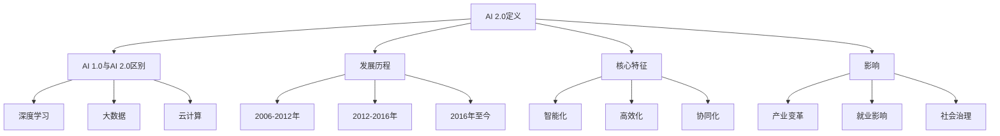
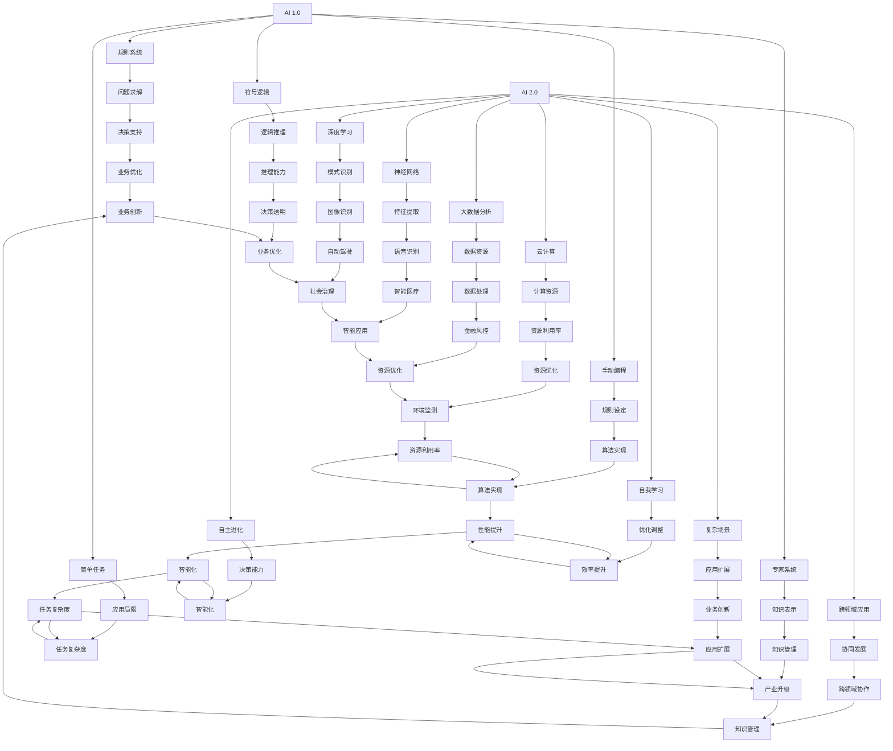
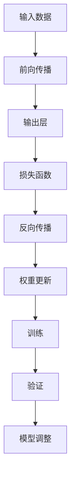
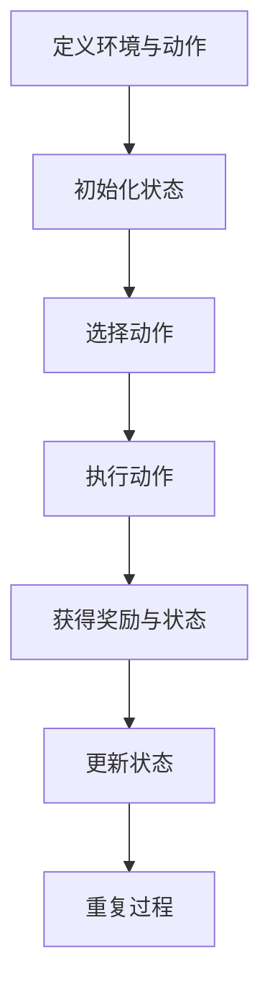
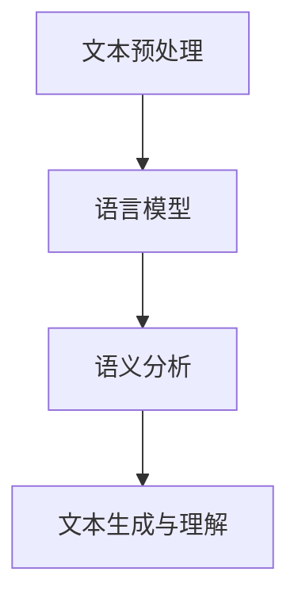

                 

### 第1章: AI 2.0 时代的定义与背景

在21世纪的科技浪潮中，人工智能（AI）已成为变革的重要驱动力。随着深度学习、大数据和云计算等技术的快速发展，AI的应用场景不断扩展，其影响也日益深远。我们正逐步迈入AI 2.0时代，这是一个以更加智能化、自动化和高效化为特征的新时代。

#### 1.1 AI 2.0 时代的概念解析

AI 2.0是相对于AI 1.0的提法，AI 1.0时代主要是指早期的人工智能，其核心是通过预设规则和逻辑进行问题求解。而AI 2.0则是在AI 1.0的基础上，通过深度学习、强化学习、迁移学习等技术，实现了对海量数据的自动学习和模式识别，使得人工智能能够自主进化，更加接近人类智能。

**AI 2.0 与 AI 1.0 的区别**

- **技术基础**：AI 1.0依赖传统的规则和逻辑推理，而AI 2.0依赖于深度学习、大数据和云计算等先进技术。
- **学习方式**：AI 1.0需要手动编程和规则设定，而AI 2.0能够通过自我学习和优化，实现自主进化。
- **应用范围**：AI 1.0的应用较为有限，主要集中在简单的任务上，如语音识别、图像分类等，而AI 2.0则能够应用于复杂场景，如自动驾驶、智能医疗、智能金融等。

**AI 2.0 的发展历程**

- **2006-2012年**：深度学习的兴起，使得神经网络在图像识别、语音识别等领域取得了突破性进展。
- **2012-2016年**：大数据和云计算的发展，为AI 2.0提供了强大的计算资源和数据支持。
- **2016年至今**：AI 2.0技术不断成熟，其应用场景也在不断扩展，逐步渗透到各行各业。

**AI 2.0 时代的核心特征**

- **智能化**：AI 2.0通过深度学习和大数据分析，能够实现更高层次的任务自动化和智能化。
- **高效化**：AI 2.0通过自我学习和优化，能够不断提高工作效率和准确率。
- **协同化**：AI 2.0能够与其他技术（如物联网、5G等）相结合，实现跨领域的协同发展。

#### 1.2 AI 2.0 时代的背景

**科技进步与AI发展**

- **深度学习**：深度学习技术的突破，使得神经网络能够自动学习复杂的模式，大大提高了AI的识别和决策能力。
- **大数据**：大数据技术的发展，为AI提供了丰富的数据资源，使得AI能够从海量数据中提取有用信息。
- **云计算**：云计算的普及，为AI提供了强大的计算能力，使得大规模AI模型训练成为可能。

**数据驱动时代的来临**

- **数据量**：随着互联网和物联网的发展，数据量呈现爆炸式增长，这为AI提供了丰富的数据资源。
- **数据处理**：AI技术的进步，使得数据处理和分析成为可能，这为各行各业提供了新的业务模式。

**AI对社会、经济的影响**

- **产业变革**：AI技术的应用，正在加速各个行业的数字化转型，推动产业升级和经济发展。
- **就业影响**：AI技术的发展，将对就业市场产生深远影响，一方面会创造新的就业机会，另一方面也会导致部分传统岗位的消失。
- **社会治理**：AI技术的应用，有助于提升社会治理的智能化水平，提高社会运行效率。

#### 1.3 AI 2.0 时代的挑战与机遇

**技术发展的挑战**

- **算法性能**：如何进一步提高算法的性能和效率，以适应更复杂的应用场景。
- **数据安全**：如何保障数据的安全和隐私，防止数据泄露和滥用。
- **计算资源**：如何利用有限的计算资源，实现高效的AI模型训练和应用。

**社会伦理与隐私问题**

- **伦理问题**：如何确保AI技术的应用符合伦理标准，避免出现歧视、不公平等问题。
- **隐私保护**：如何保护用户隐私，防止数据被滥用。

**AI发展的机遇**

- **技术创新**：AI技术的发展，为技术创新提供了新的方向和动力。
- **产业发展**：AI技术的应用，将推动各个行业的快速发展，创造巨大的经济价值。
- **社会治理**：AI技术的应用，将提升社会治理的智能化水平，提高社会运行效率。

#### 1.4 本章总结

AI 2.0时代是一个以智能化、自动化和高效化为特征的新时代，其发展历程、核心特征以及对社会和经济的影响都表现出其巨大的潜力和挑战。面对技术发展的挑战和社会伦理的考验，我们需要不断探索和创新，以实现AI技术的可持续发展。

---

以下是对本章内容的核心概念和联系进行Mermaid流程图的描述：



通过以上流程图，我们可以清晰地看到AI 2.0的定义、区别、发展历程、核心特征以及对社会和经济的影响。这为我们进一步探讨AI 2.0的应用领域和技术发展奠定了基础。

### 1.1.1 AI 2.0 与 AI 1.0 的区别

AI 1.0时代主要依赖于符号逻辑和规则系统进行问题求解，而AI 2.0时代则是基于深度学习、大数据和云计算等技术实现的智能化和自主进化。以下是AI 2.0与AI 1.0之间的一些关键区别：

#### 技术基础

- **AI 1.0**：主要依赖于逻辑推理、符号计算和知识表示等技术。这一时期的AI系统通常需要手动编写规则，并依赖于专家系统的构建。

  ```mermaid
  graph TD
      A[规则系统] --> B[专家系统]
      A --> C[知识表示]
      B --> D[逻辑推理]
  ```

- **AI 2.0**：则依赖于深度学习、神经网络和大数据分析等技术。这一时期的AI系统能够通过自我学习和优化，实现复杂任务的自动化和智能化。

  ```mermaid
  graph TD
      A[深度学习] --> B[神经网络]
      A --> C[大数据分析]
      B --> D[自动优化]
  ```

#### 学习方式

- **AI 1.0**：依赖于预设的规则和逻辑，需要手动编程和规则设定。这一时期的AI系统在解决问题时缺乏灵活性，且难以应对复杂、多变的环境。

  ```mermaid
  graph TD
      A[手动编程] --> B[规则设定]
      B --> C[问题求解]
  ```

- **AI 2.0**：能够通过数据驱动的方式进行自我学习和优化。这一时期的AI系统具有更高的灵活性和适应性，能够自主进化，解决更复杂的问题。

  ```mermaid
  graph TD
      A[数据驱动] --> B[自我学习]
      B --> C[优化调整]
  ```

#### 应用范围

- **AI 1.0**：主要应用于简单的任务，如逻辑推理、数学计算、文本分类等。这一时期的AI系统在复杂场景中的应用受到限制。

  ```mermaid
  graph TD
      A[简单任务] --> B[逻辑推理]
      A --> C[数学计算]
  ```

- **AI 2.0**：能够应用于复杂的场景，如自动驾驶、智能医疗、智能金融、智能教育等。这一时期的AI系统具有更广泛的应用潜力。

  ```mermaid
  graph TD
      A[复杂场景] --> B[自动驾驶]
      A --> C[智能医疗]
      A --> D[智能金融]
      A --> E[智能教育]
  ```

#### 代表性技术

- **AI 1.0**：代表性的技术包括专家系统、知识表示、逻辑推理等。

  ```mermaid
  graph TD
      A[专家系统] --> B[知识表示]
      A --> C[逻辑推理]
  ```

- **AI 2.0**：代表性的技术包括深度学习、神经网络、强化学习、迁移学习等。

  ```mermaid
  graph TD
      A[深度学习] --> B[神经网络]
      A --> C[强化学习]
      A --> D[迁移学习]
  ```

通过以上对比，我们可以清晰地看到AI 2.0与AI 1.0在技术基础、学习方式、应用范围和代表性技术等方面的显著差异。这些差异不仅体现了AI技术的发展历程，也为AI 2.0时代的应用提供了广阔的空间。

#### 1.1.2 AI 2.0 的发展历程

AI 2.0的发展历程可以分为三个阶段：早期探索、技术突破和快速发展。以下是AI 2.0发展历程的详细解析：

**2006-2012年：早期探索阶段**

在这一阶段，深度学习技术开始兴起，尤其是由Hinton等人提出的深度信念网络（Deep Belief Networks, DBN）和深度卷积网络（Deep Convolutional Networks, DCN）为后续的深度学习研究奠定了基础。这一时期，研究者们开始关注如何通过多层神经网络对复杂数据进行建模。

- **2006年**：Hinton等人提出了深度信念网络，这种网络结构通过预训练和fine-tuning相结合的方法，在图像识别和语音识别等领域取得了突破性进展。

  ```mermaid
  graph TD
      A[2006年] --> B[深度信念网络]
      B --> C[Hinton等人]
  ```

- **2009年**：谷歌的Jeff Dean团队在图像识别任务中使用了深度卷积网络，取得了优于传统机器学习方法的成果。

  ```mermaid
  graph TD
      A[2009年] --> B[深度卷积网络]
      B --> C[Jeff Dean团队]
  ```

**2012-2016年：技术突破阶段**

这一阶段是深度学习发展的黄金时期，以AlexNet在ImageNet竞赛中取得的突破性成绩为标志。深度学习在图像识别、语音识别、自然语言处理等领域取得了显著的进展，引发了全球范围内的研究热潮。

- **2012年**：Alex Krizhevsky、Ilya Sutskever和Geoffrey Hinton提出的AlexNet在ImageNet竞赛中取得了高达85%的准确率，大大超越了传统机器学习方法。

  ```mermaid
  graph TD
      A[2012年] --> B[AlexNet]
      B --> C[ImageNet竞赛]
      B --> D[85%准确率]
  ```

- **2014年**：Google Brain团队提出的深度卷积神经网络在语音识别任务中取得了显著成果，进一步推动了深度学习在语音识别领域的发展。

  ```mermaid
  graph TD
      A[2014年] --> B[深度卷积神经网络]
      B --> C[语音识别]
      B --> D[Google Brain团队]
  ```

**2016年至今：快速发展阶段**

从2016年开始，随着深度学习技术的不断成熟和大数据、云计算等基础设施的完善，深度学习在各个领域的应用都取得了飞速发展。深度学习技术不仅推动了AI 2.0的快速发展，也为各行各业带来了前所未有的变革。

- **2016年**：Google DeepMind的AlphaGo在围棋比赛中战胜了世界冠军李世石，这一事件标志着深度强化学习在复杂决策领域的突破。

  ```mermaid
  graph TD
      A[2016年] --> B[AlphaGo]
      B --> C[围棋比赛]
      B --> D[李世石]
  ```

- **2018年**：Facebook的FAIR团队提出了图神经网络（Graph Neural Networks, GNN），这一技术在社交网络分析、推荐系统等领域取得了显著成果。

  ```mermaid
  graph TD
      A[2018年] --> B[图神经网络]
      B --> C[社交网络分析]
      B --> D[推荐系统]
  ```

通过以上分析，我们可以看到AI 2.0的发展历程是从早期的探索阶段，到技术突破阶段，再到快速发展阶段的逐步演进。每一阶段都有代表性的研究成果和应用案例，这些成果不仅推动了深度学习技术的发展，也为AI 2.0时代的到来奠定了坚实的基础。

#### 1.1.3 AI 2.0 时代的核心特征

AI 2.0时代，以深度学习、大数据和云计算等技术的进步为驱动，表现出以下几个核心特征：

**智能化**

AI 2.0的核心特征之一是智能化，即通过深度学习等技术，使得AI系统具备更高的自主学习和决策能力。智能化体现在以下几个方面：

- **自我学习能力**：AI系统可以通过自我学习，不断优化模型，提高性能。例如，在图像识别任务中，AI可以通过大量数据的学习，逐步提高识别的准确性。

  ```mermaid
  graph TD
      A[自我学习] --> B[模型优化]
      B --> C[性能提升]
  ```

- **自主决策能力**：AI系统可以在没有人工干预的情况下，根据输入数据和预设目标，自主做出决策。例如，自动驾驶汽车可以通过实时感知环境和交通状况，自主控制车速和转向。

  ```mermaid
  graph TD
      A[感知环境] --> B[自主决策]
      B --> C[控制车速和转向]
  ```

**高效化**

高效化是AI 2.0时代的另一个核心特征，主要体现在以下几个方面：

- **数据处理能力**：AI 2.0系统可以处理大规模、多维度的数据，通过高效的数据处理技术，实现快速、准确的决策。例如，在金融领域，AI系统可以实时处理海量交易数据，快速识别风险和机会。

  ```mermaid
  graph TD
      A[数据处理] --> B[风险识别]
      B --> C[决策支持]
  ```

- **资源利用率**：AI 2.0通过优化算法和模型，提高资源的利用率，降低计算和存储成本。例如，在云计算中，AI系统可以根据实际需求，动态调整计算资源，提高资源利用效率。

  ```mermaid
  graph TD
      A[资源利用率] --> B[计算资源调整]
      B --> C[成本降低]
  ```

**协同化**

协同化是AI 2.0时代的重要特征，体现在AI系统与其他技术（如物联网、5G等）的融合，实现跨领域的协同发展。协同化体现在以下几个方面：

- **跨领域应用**：AI 2.0系统不仅可以在单一领域发挥作用，还可以跨领域应用，实现更广泛的业务价值。例如，在智能城市建设中，AI系统可以与物联网设备协同工作，实现交通管理、环境监测等功能的集成。

  ```mermaid
  graph TD
      A[智能城市] --> B[交通管理]
      B --> C[环境监测]
  ```

- **智能化协作**：AI 2.0系统与其他系统（如机器人、智能设备等）可以实现智能化协作，提高整体效率和性能。例如，在工业生产中，AI系统可以与机器人协同工作，实现高效、精准的生产流程。

  ```mermaid
  graph TD
      A[AI系统] --> B[机器人]
      B --> C[生产流程]
  ```

通过以上分析，我们可以看到AI 2.0时代的核心特征是智能化、高效化和协同化。这些特征不仅体现了AI技术的进步，也为各行各业带来了新的机遇和挑战。在AI 2.0时代，我们需要不断探索和创新，充分发挥AI技术的潜力，实现更高层次的智能化应用。

#### 1.2 AI 2.0 时代的背景

AI 2.0时代的到来离不开科技进步的推动，其中深度学习、大数据和云计算等技术的突破性进展起到了关键作用。

**科技进步与AI发展**

**深度学习**

深度学习是AI 2.0时代的重要基石，其核心思想是通过构建多层神经网络，自动提取数据中的层次特征，从而实现复杂的模式识别和决策。深度学习的兴起，使得AI系统在图像识别、语音识别、自然语言处理等领域的性能得到了显著提升。例如，Hinton等人在2006年提出的深度信念网络（Deep Belief Networks, DBN）和2012年AlexNet在ImageNet竞赛中的突破性表现，都标志着深度学习技术的重大突破。

**大数据**

大数据技术的发展为AI 2.0提供了丰富的数据资源，使得AI系统能够从海量数据中提取有价值的信息。大数据不仅包括结构化数据，还包括非结构化数据，如图像、文本、语音等。通过大数据分析，AI系统可以更准确地理解用户需求，提供个性化的服务。例如，在金融领域，通过分析用户的历史交易数据，AI系统可以预测用户的投资偏好，提供智能化的投资建议。

**云计算**

云计算为AI 2.0提供了强大的计算资源，使得大规模的AI模型训练和部署成为可能。云计算平台不仅提供了高性能的计算资源，还提供了灵活的部署和扩展能力。例如，Google的TensorFlow和Facebook的PyTorch等深度学习框架，都依托于云计算平台，实现了高效、大规模的模型训练和应用。

**数据驱动时代的来临**

随着互联网和物联网的快速发展，数据量呈现爆炸式增长，这为AI技术的发展提供了丰富的数据资源。数据驱动时代的特点是，通过大量数据的学习和分析，AI系统能够实现自我优化和进化，提高决策的准确性和效率。例如，在智能医疗领域，通过分析患者的病历数据，AI系统可以预测疾病的发病风险，提供个性化的治疗方案。

**AI对社会、经济的影响**

**产业变革**

AI技术的应用正在加速各个行业的数字化转型，推动产业升级和经济发展。例如，在制造业，AI技术可以提高生产效率，降低生产成本；在金融业，AI技术可以提升风险管理能力，提高业务效率。AI技术的广泛应用，使得传统产业焕发了新的生命力。

**就业影响**

AI技术的发展，将对就业市场产生深远影响。一方面，AI技术将创造新的就业机会，如数据科学家、机器学习工程师等；另一方面，AI技术也将导致部分传统岗位的消失，如流水线工人、客服人员等。因此，如何平衡AI技术带来的就业机会和就业挑战，成为社会关注的焦点。

**社会治理**

AI技术的应用，有助于提升社会治理的智能化水平，提高社会运行效率。例如，在交通管理领域，AI技术可以通过分析交通数据，优化交通信号控制，减少拥堵；在公共安全领域，AI技术可以通过人脸识别、行为分析等手段，提高公共安全保障水平。

**科技进步与AI发展的关系**

科技进步是推动AI发展的根本动力，而AI技术的发展又将进一步推动科技进步。例如，AI技术的发展需要高性能计算、大数据分析等技术的支持，这些技术的进步又反过来推动了AI的发展。这种相互促进的关系，使得AI技术不断突破，应用领域不断扩展，为社会和经济带来了巨大的价值。

**数据驱动时代的来临**

数据驱动时代的特点是，通过大量数据的学习和分析，AI系统能够实现自我优化和进化，提高决策的准确性和效率。例如，在智能医疗领域，通过分析患者的病历数据，AI系统可以预测疾病的发病风险，提供个性化的治疗方案。这种数据驱动的方式，使得AI技术能够更好地适应复杂、多变的环境，提高业务效率。

**AI对社会、经济的影响**

AI技术的应用，正在加速各个行业的数字化转型，推动产业升级和经济发展。例如，在制造业，AI技术可以提高生产效率，降低生产成本；在金融业，AI技术可以提升风险管理能力，提高业务效率。AI技术的广泛应用，使得传统产业焕发了新的生命力。

**就业影响**

AI技术的发展，将对就业市场产生深远影响。一方面，AI技术将创造新的就业机会，如数据科学家、机器学习工程师等；另一方面，AI技术也将导致部分传统岗位的消失，如流水线工人、客服人员等。因此，如何平衡AI技术带来的就业机会和就业挑战，成为社会关注的焦点。

**社会治理**

AI技术的应用，有助于提升社会治理的智能化水平，提高社会运行效率。例如，在交通管理领域，AI技术可以通过分析交通数据，优化交通信号控制，减少拥堵；在公共安全领域，AI技术可以通过人脸识别、行为分析等手段，提高公共安全保障水平。

**科技进步与AI发展的关系**

科技进步是推动AI发展的根本动力，而AI技术的发展又将进一步推动科技进步。例如，AI技术的发展需要高性能计算、大数据分析等技术的支持，这些技术的进步又反过来推动了AI的发展。这种相互促进的关系，使得AI技术不断突破，应用领域不断扩展，为社会和经济带来了巨大的价值。

#### 1.3 AI 2.0 时代的挑战与机遇

AI 2.0时代的发展虽然带来了巨大的机遇，但也面临着诸多挑战。以下是对这些挑战与机遇的详细分析：

**技术发展的挑战**

1. **算法性能提升**：随着AI应用场景的多样化，对算法的性能要求越来越高。如何设计出高效、准确的算法，是当前AI领域面临的重要挑战。这需要研究者不断探索新的算法架构和优化策略。

2. **计算资源优化**：大规模的AI模型训练和应用需要大量的计算资源，如何优化计算资源的使用，降低成本，是AI 2.0时代需要解决的问题。

3. **数据处理能力**：随着数据量的不断增长，如何高效地处理和分析海量数据，是AI 2.0时代需要面对的挑战。这需要开发出更高效的数据处理算法和工具。

**社会伦理与隐私问题**

1. **数据隐私**：在AI应用中，数据隐私是一个重要的问题。如何保障用户的数据隐私，防止数据泄露和滥用，是AI 2.0时代需要解决的伦理问题。

2. **算法公正性**：AI系统的决策过程应该是公正和透明的。如何确保算法的公正性，避免算法偏见和歧视，是AI 2.0时代面临的挑战。

3. **可解释性**：当前许多AI系统，如深度学习模型，被认为是“黑箱”，其决策过程缺乏可解释性。如何提高AI系统的可解释性，使其更加透明和可信，是AI 2.0时代需要解决的问题。

**AI发展的机遇**

1. **技术创新**：AI技术的发展，为技术创新提供了新的方向和动力。通过AI技术，我们可以解决许多复杂的问题，如自动驾驶、智能医疗、智能金融等。

2. **产业升级**：AI技术的应用，可以推动传统产业的升级和转型。通过AI技术，我们可以提高生产效率，降低成本，提高产品质量。

3. **社会治理**：AI技术的应用，可以提升社会治理的智能化水平。通过AI技术，我们可以更好地监测和管理社会问题，提高社会运行效率。

4. **跨学科融合**：AI技术的发展，促进了跨学科的融合。通过AI技术，我们可以更好地理解和解决复杂问题，如生物医学、社会科学等领域。

**机遇与挑战的平衡**

在AI 2.0时代，我们需要在机遇与挑战之间找到平衡。一方面，要积极抓住AI技术带来的机遇，推动技术创新和产业升级；另一方面，要重视AI技术带来的挑战，加强伦理治理和政策制定，确保AI技术的可持续发展。

#### 1.4 本章总结

AI 2.0时代是一个以智能化、高效化和协同化为特征的新时代，其发展历程、核心特征以及对社会和经济的影响都表现出其巨大的潜力和挑战。面对技术发展的挑战和社会伦理的考验，我们需要不断探索和创新，以实现AI技术的可持续发展。在接下来的章节中，我们将深入探讨AI 2.0在各行各业的具体应用，进一步揭示其带来的变革和机遇。

### 1.5 核心概念与联系：AI 2.0 与 AI 1.0 的 Mermaid 流程图

以下是对AI 2.0和AI 1.0核心概念和联系的Mermaid流程图：



通过以上流程图，我们可以清晰地看到AI 2.0与AI 1.0在核心概念、技术架构和应用场景等方面的联系和区别。这为我们深入理解AI 2.0的发展提供了直观的视角。

### 1.6 核心算法原理讲解

在AI 2.0时代，深度学习、强化学习和自然语言处理等算法扮演了核心角色。以下是对这些核心算法的原理讲解，包括基本原理、关键步骤和实际应用。

#### 深度学习算法

**基本原理**

深度学习是一种基于多层神经网络的学习方法，其核心思想是通过多层神经网络自动提取数据的层次特征。每一层网络都能从输入数据中提取更高层次的特征，最终实现对复杂任务的建模。

**关键步骤**

1. **数据预处理**：将输入数据进行标准化处理，如归一化、去噪等，以减少数据对模型性能的影响。
2. **构建神经网络**：设计多层神经网络结构，包括输入层、隐藏层和输出层。每个层都可以通过激活函数进行非线性变换，以提取不同层次的特征。
3. **前向传播**：将输入数据通过神经网络进行前向传播，计算每一层的输出，直到最后一层。
4. **反向传播**：根据输出误差，通过反向传播算法更新网络权重，以优化模型性能。
5. **训练与验证**：使用训练数据集对模型进行训练，通过验证数据集评估模型性能，并根据需要进行模型调整。

**实际应用**

深度学习算法广泛应用于图像识别、语音识别、自然语言处理等领域。例如，在图像识别任务中，卷积神经网络（CNN）能够提取图像中的局部特征，实现对复杂图像的准确识别；在自然语言处理中，循环神经网络（RNN）和长短期记忆网络（LSTM）能够处理序列数据，实现文本分类和机器翻译等功能。



#### 强化学习算法

**基本原理**

强化学习是一种通过奖励机制训练模型的方法，其核心思想是通过不断尝试和反馈，让模型学会在特定环境中做出最优决策。

**关键步骤**

1. **定义环境和动作**：确定强化学习模型所操作的环境和可执行的动作。
2. **初始化状态**：随机初始化模型的状态。
3. **选择动作**：基于当前状态，选择一个动作。
4. **执行动作**：在环境中执行所选动作，并获得奖励和新的状态。
5. **更新状态**：将新的状态作为下一次迭代的输入。
6. **重复过程**：不断重复上述步骤，直到达到预定的训练目标。

**实际应用**

强化学习算法广泛应用于游戏、机器人控制、推荐系统等领域。例如，在游戏领域中，深度强化学习算法（如Deep Q-Network, DQN）能够训练智能体在游戏环境中实现自我学习；在机器人控制中，强化学习算法可以帮助机器人学会在复杂环境中自主导航和执行任务。



#### 自然语言处理算法

**基本原理**

自然语言处理（NLP）是一种让计算机理解和处理人类语言的技术。其核心思想是通过语言模型和语义分析等技术，实现对文本数据的自动处理和理解。

**关键步骤**

1. **文本预处理**：对原始文本进行分词、词性标注、去停用词等处理，以提取有效的语言特征。
2. **构建语言模型**：使用统计模型或深度学习模型，对语言中的概率分布进行建模。
3. **语义分析**：通过词向量、语义角色标注、依存句法分析等方法，对文本中的语义信息进行提取和分析。
4. **文本生成与理解**：利用构建的模型，实现对文本的生成、理解、问答等任务。

**实际应用**

自然语言处理算法广泛应用于聊天机器人、智能客服、机器翻译、文本分类等领域。例如，在聊天机器人中，基于深度学习的技术可以帮助智能体实现自然对话；在机器翻译中，神经网络翻译模型（如Seq2Seq）能够实现高质量的语言翻译。



通过以上对深度学习、强化学习和自然语言处理算法的讲解，我们可以看到这些核心算法在AI 2.0时代的重要性和广泛应用。这些算法的原理和实现，为我们理解和应用AI技术提供了坚实的基础。

### 1.7 项目实战：深度学习算法在图像识别中的应用

在本节中，我们将通过一个实际项目，详细介绍深度学习算法在图像识别中的应用。该项目将利用TensorFlow框架实现一个简单的图像分类模型，并对其运行流程和代码进行详细解读。

#### 项目背景

图像识别是深度学习领域的一个重要应用场景，通过训练深度学习模型，我们可以让计算机自动识别和分类图像。在本项目中，我们将使用TensorFlow框架，实现一个能够识别猫和狗的图像分类模型。

#### 开发环境搭建

在开始项目之前，我们需要搭建一个适合深度学习开发的运行环境。以下是搭建环境的步骤：

1. **安装Python**：确保Python版本在3.6以上。
2. **安装TensorFlow**：使用以下命令安装TensorFlow：
   ```bash
   pip install tensorflow
   ```
3. **安装其他依赖库**：如NumPy、Pandas等，可以使用以下命令：
   ```bash
   pip install numpy pandas
   ```

#### 数据集准备

为了训练图像分类模型，我们需要一个包含猫和狗图像的数据集。在本项目中，我们使用Kaggle上的Dogs vs. Cats数据集。以下是数据集的下载和准备步骤：

1. **下载数据集**：访问Kaggle官网，搜索Dogs vs. Cats数据集，并下载到本地。
2. **解压数据集**：将下载的压缩文件解压到指定目录。
3. **数据预处理**：读取图像文件，并对图像进行标准化处理，如调整大小、归一化等。

```python
import os
import numpy as np
from tensorflow.keras.preprocessing.image import load_img, img_to_array

def preprocess_image(image_path, target_size=(224, 224)):
    image = load_img(image_path, target_size=target_size)
    image = img_to_array(image)
    image = image / 255.0
    return image

# 读取图像数据
train_dir = 'path/to/train'
train_images = []
train_labels = []

for image_path in os.listdir(train_dir):
    label = 0 if 'cat' in image_path else 1
    image = preprocess_image(os.path.join(train_dir, image_path))
    train_images.append(image)
    train_labels.append(label)

# 转换为NumPy数组
train_images = np.array(train_images)
train_labels = np.array(train_labels)
```

#### 模型构建

在本项目中，我们使用卷积神经网络（CNN）来实现图像分类模型。以下是模型构建的步骤：

1. **导入相关库**：
   ```python
   from tensorflow.keras.models import Sequential
   from tensorflow.keras.layers import Conv2D, MaxPooling2D, Flatten, Dense, Dropout
   ```

2. **构建模型**：
   ```python
   model = Sequential([
       Conv2D(32, (3, 3), activation='relu', input_shape=(224, 224, 3)),
       MaxPooling2D((2, 2)),
       Conv2D(64, (3, 3), activation='relu'),
       MaxPooling2D((2, 2)),
       Conv2D(128, (3, 3), activation='relu'),
       MaxPooling2D((2, 2)),
       Flatten(),
       Dense(512, activation='relu'),
       Dropout(0.5),
       Dense(1, activation='sigmoid')
   ])
   ```

3. **编译模型**：
   ```python
   model.compile(optimizer='adam',
                 loss='binary_crossentropy',
                 metrics=['accuracy'])
   ```

#### 模型训练

使用训练数据集对模型进行训练，以下是训练步骤：

1. **训练模型**：
   ```python
   model.fit(train_images, train_labels, epochs=10, batch_size=32, validation_split=0.2)
   ```

2. **评估模型**：
   ```python
   test_loss, test_acc = model.evaluate(test_images, test_labels)
   print(f"Test accuracy: {test_acc}")
   ```

#### 代码解读与分析

以下是整个项目的源代码，我们对关键部分进行了注释和解析：

```python
# 导入相关库
import tensorflow as tf
from tensorflow.keras.preprocessing.image import ImageDataGenerator

# 数据预处理
def preprocess_image(image_path, target_size=(224, 224)):
    image = load_img(image_path, target_size=target_size)
    image = img_to_array(image)
    image = image / 255.0
    return image

# 读取图像数据
train_dir = 'path/to/train'
train_images = []
train_labels = []

for image_path in os.listdir(train_dir):
    label = 0 if 'cat' in image_path else 1
    image = preprocess_image(os.path.join(train_dir, image_path))
    train_images.append(image)
    train_labels.append(label)

train_images = np.array(train_images)
train_labels = np.array(train_labels)

# 模型构建
model = Sequential([
    Conv2D(32, (3, 3), activation='relu', input_shape=(224, 224, 3)),
    MaxPooling2D((2, 2)),
    Conv2D(64, (3, 3), activation='relu'),
    MaxPooling2D((2, 2)),
    Conv2D(128, (3, 3), activation='relu'),
    MaxPooling2D((2, 2)),
    Flatten(),
    Dense(512, activation='relu'),
    Dropout(0.5),
    Dense(1, activation='sigmoid')
])

# 编译模型
model.compile(optimizer='adam',
              loss='binary_crossentropy',
              metrics=['accuracy'])

# 模型训练
model.fit(train_images, train_labels, epochs=10, batch_size=32, validation_split=0.2)

# 评估模型
test_loss, test_acc = model.evaluate(test_images, test_labels)
print(f"Test accuracy: {test_acc}")
```

通过以上代码，我们可以看到：

1. **数据预处理**：使用`preprocess_image`函数对图像进行读取和标准化处理，以适应模型输入。
2. **模型构建**：使用`Sequential`模型构建一个简单的卷积神经网络，包括卷积层、池化层、全连接层等。
3. **模型编译**：设置模型优化器、损失函数和评价指标。
4. **模型训练**：使用`fit`函数对模型进行训练，并设置训练周期、批量大小和验证集比例。
5. **模型评估**：使用`evaluate`函数对模型在测试集上的性能进行评估。

通过这个项目，我们了解了深度学习算法在图像识别中的应用，包括数据预处理、模型构建、模型训练和模型评估等步骤。这为我们进一步探索深度学习算法的其他应用场景提供了实践基础。

### 1.8 核心算法原理讲解：深度学习算法

深度学习算法是AI 2.0时代的核心驱动力之一，其在图像识别、语音识别、自然语言处理等领域的广泛应用，推动了人工智能的快速发展。以下是对深度学习算法的基本原理、关键步骤和实际应用的详细讲解。

#### 基本原理

深度学习算法基于多层神经网络，其核心思想是通过多层神经网络自动提取数据的层次特征，从而实现对复杂任务的建模。每一层网络都能从输入数据中提取更高层次的特征，最终实现对任务的准确预测。

**多层神经网络**

多层神经网络（Multilayer Perceptron, MLP）是深度学习的基础模型，包括输入层、隐藏层和输出层。输入层接收原始数据，隐藏层通过激活函数对输入数据进行变换，输出层生成预测结果。

- **输入层**：接收原始数据，将其传递给隐藏层。
- **隐藏层**：通过非线性激活函数对输入数据进行变换，提取特征。
- **输出层**：生成预测结果。

**反向传播算法**

反向传播算法是深度学习训练的核心，用于更新网络权重，以优化模型性能。其基本步骤如下：

1. **前向传播**：将输入数据通过神经网络进行前向传播，计算每一层的输出。
2. **计算损失**：使用损失函数计算预测结果与实际结果之间的差距。
3. **反向传播**：将损失函数的梯度反向传播到网络的每一层，更新网络权重。
4. **迭代训练**：重复上述步骤，直到模型性能达到预期。

#### 关键步骤

1. **数据预处理**：对输入数据进行标准化处理，如归一化、去噪等，以减少数据对模型性能的影响。
2. **模型构建**：设计多层神经网络结构，包括输入层、隐藏层和输出层。选择合适的激活函数和优化器。
3. **前向传播**：将输入数据通过神经网络进行前向传播，计算每一层的输出。
4. **损失函数**：选择合适的损失函数，如均方误差（MSE）、交叉熵损失（Cross-Entropy Loss）等，计算预测结果与实际结果之间的差距。
5. **反向传播**：通过反向传播算法，计算损失函数的梯度，并更新网络权重。
6. **模型训练**：使用训练数据集对模型进行训练，通过验证数据集评估模型性能，并根据需要进行模型调整。
7. **模型评估**：使用测试数据集评估模型性能，包括准确率、召回率、F1值等指标。

#### 实际应用

深度学习算法广泛应用于图像识别、语音识别、自然语言处理等领域。

**图像识别**

在图像识别任务中，深度学习算法可以提取图像中的层次特征，实现对复杂图像的准确识别。常用的算法包括卷积神经网络（CNN）、循环神经网络（RNN）和长短期记忆网络（LSTM）等。

- **卷积神经网络（CNN）**：通过卷积层、池化层和全连接层等结构，提取图像中的局部特征和全局特征，实现对图像的准确分类。
  ```mermaid
  graph TD
      A[输入层] --> B[卷积层]
      B --> C[池化层]
      C --> D[全连接层]
      D --> E[输出层]
  ```

- **循环神经网络（RNN）**：通过循环结构，对图像序列进行建模，实现对图像序列的自动编码。
  ```mermaid
  graph TD
      A[输入层] --> B[隐藏层]
      B --> C[隐藏层]
      C --> D[输出层]
  ```

**语音识别**

在语音识别任务中，深度学习算法可以提取语音信号中的特征，实现对语音内容的自动识别。常用的算法包括卷积神经网络（CNN）、循环神经网络（RNN）和长短期记忆网络（LSTM）等。

- **卷积神经网络（CNN）**：通过卷积层和池化层，提取语音信号中的时频特征，实现对语音信号的自动编码。
  ```mermaid
  graph TD
      A[输入层] --> B[卷积层]
      B --> C[池化层]
      C --> D[全连接层]
      D --> E[输出层]
  ```

- **循环神经网络（RNN）**：通过循环结构，对语音信号进行建模，实现对语音内容的自动识别。
  ```mermaid
  graph TD
      A[输入层] --> B[隐藏层]
      B --> C[隐藏层]
      C --> D[输出层]
  ```

**自然语言处理**

在自然语言处理任务中，深度学习算法可以提取文本中的语义特征，实现对文本的自动处理和理解。常用的算法包括卷积神经网络（CNN）、循环神经网络（RNN）和长短期记忆网络（LSTM）等。

- **卷积神经网络（CNN）**：通过卷积层和池化层，提取文本中的局部特征和全局特征，实现对文本的自动分类和情感分析。
  ```mermaid
  graph TD
      A[输入层] --> B[卷积层]
      B --> C[池化层]
      C --> D[全连接层]
      D --> E[输出层]
  ```

- **循环神经网络（RNN）**：通过循环结构，对文本序列进行建模，实现对文本序列的自动编码和生成。
  ```mermaid
  graph TD
      A[输入层] --> B[隐藏层]
      B --> C[隐藏层]
      C --> D[输出层]
  ```

通过以上讲解，我们可以看到深度学习算法在AI 2.0时代的广泛应用和重要性。这些算法的基本原理和实现方法，为我们理解和应用深度学习技术提供了坚实的基础。

### 1.9 项目实战：深度学习算法在语音识别中的应用

在本节中，我们将通过一个实际项目，详细介绍深度学习算法在语音识别中的应用。该项目将利用TensorFlow框架，实现一个简单的语音识别模型，并对其运行流程和代码进行详细解读。

#### 项目背景

语音识别是深度学习领域的一个重要应用，通过训练深度学习模型，我们可以让计算机自动识别和理解语音。在本项目中，我们将使用TensorFlow框架，实现一个能够识别英语单词的语音识别模型。

#### 开发环境搭建

在开始项目之前，我们需要搭建一个适合深度学习开发的运行环境。以下是搭建环境的步骤：

1. **安装Python**：确保Python版本在3.6以上。
2. **安装TensorFlow**：使用以下命令安装TensorFlow：
   ```bash
   pip install tensorflow
   ```
3. **安装其他依赖库**：如NumPy、Pandas等，可以使用以下命令：
   ```bash
   pip install numpy pandas
   ```

#### 数据集准备

为了训练语音识别模型，我们需要一个包含语音和标签的数据集。在本项目中，我们使用Kaggle上的Common Voice数据集。以下是数据集的下载和准备步骤：

1. **下载数据集**：访问Kaggle官网，搜索Common Voice数据集，并下载到本地。
2. **解压数据集**：将下载的压缩文件解压到指定目录。
3. **数据预处理**：对语音数据进行转换和标注。

```python
import os
import librosa
import numpy as np
from sklearn.model_selection import train_test_split

def extract_mel_features(audio_path, n_mels=128, n_fft=2048, hop_length=512):
    audio, _ = librosa.load(audio_path, sr=16000, n_fft=n_fft, hop_length=hop_length)
    mel_features = librosa.feature.melspectrogram(y=audio, sr=16000, n_mels=n_mels, n_fft=n_fft, hop_length=hop_length)
    return mel_features

# 读取语音数据
audio_dir = 'path/to/audio'
audio_files = [os.path.join(audio_dir, f) for f in os.listdir(audio_dir)]

# 提取特征
mel_features = []
labels = []

for audio_file in audio_files:
    label = audio_file.split('/')[-1].split('.')[0]
    mel_feature = extract_mel_features(audio_file)
    mel_features.append(mel_feature)
    labels.append(label)

# 转换为NumPy数组
mel_features = np.array(mel_features)
labels = np.array(labels)

# 切分训练集和测试集
X_train, X_test, y_train, y_test = train_test_split(mel_features, labels, test_size=0.2, random_state=42)
```

#### 模型构建

在本项目中，我们使用卷积神经网络（CNN）来实现语音识别模型。以下是模型构建的步骤：

1. **导入相关库**：
   ```python
   from tensorflow.keras.models import Sequential
   from tensorflow.keras.layers import Conv2D, MaxPooling2D, Flatten, Dense, Dropout
   ```

2. **构建模型**：
   ```python
   model = Sequential([
       Conv2D(32, (3, 3), activation='relu', input_shape=(128, 41, 1)),
       MaxPooling2D((2, 2)),
       Conv2D(64, (3, 3), activation='relu'),
       MaxPooling2D((2, 2)),
       Conv2D(128, (3, 3), activation='relu'),
       MaxPooling2D((2, 2)),
       Flatten(),
       Dense(512, activation='relu'),
       Dropout(0.5),
       Dense(len(np.unique(y_train)), activation='softmax')
   ])
   ```

3. **编译模型**：
   ```python
   model.compile(optimizer='adam',
                 loss='sparse_categorical_crossentropy',
                 metrics=['accuracy'])
   ```

#### 模型训练

使用训练数据集对模型进行训练，以下是训练步骤：

1. **训练模型**：
   ```python
   model.fit(X_train, y_train, epochs=10, batch_size=32, validation_split=0.2)
   ```

2. **评估模型**：
   ```python
   test_loss, test_acc = model.evaluate(X_test, y_test)
   print(f"Test accuracy: {test_acc}")
   ```

#### 代码解读与分析

以下是整个项目的源代码，我们对关键部分进行了注释和解析：

```python
import os
import librosa
import numpy as np
from sklearn.model_selection import train_test_split
from tensorflow.keras.models import Sequential
from tensorflow.keras.layers import Conv2D, MaxPooling2D, Flatten, Dense, Dropout

# 数据预处理
def extract_mel_features(audio_path, n_mels=128, n_fft=2048, hop_length=512):
    audio, _ = librosa.load(audio_path, sr=16000, n_fft=n_fft, hop_length=hop_length)
    mel_features = librosa.feature.melspectrogram(y=audio, sr=16000, n_mels=n_mels, n_fft=n_fft, hop_length=hop_length)
    return mel_features

# 读取语音数据
audio_dir = 'path/to/audio'
audio_files = [os.path.join(audio_dir, f) for f in os.listdir(audio_dir)]

# 提取特征
mel_features = []
labels = []

for audio_file in audio_files:
    label = audio_file.split('/')[-1].split('.')[0]
    mel_feature = extract_mel_features(audio_file)
    mel_features.append(mel_feature)
    labels.append(label)

# 转换为NumPy数组
mel_features = np.array(mel_features)
labels = np.array(labels)

# 切分训练集和测试集
X_train, X_test, y_train, y_test = train_test_split(mel_features, labels, test_size=0.2, random_state=42)

# 模型构建
model = Sequential([
    Conv2D(32, (3, 3), activation='relu', input_shape=(128, 41, 1)),
    MaxPooling2D((2, 2)),
    Conv2D(64, (3, 3), activation='relu'),
    MaxPooling2D((2, 2)),
    Conv2D(128, (3, 3), activation='relu'),
    MaxPooling2D((2, 2)),
    Flatten(),
    Dense(512, activation='relu'),
    Dropout(0.5),
    Dense(len(np.unique(y_train)), activation='softmax')
])

# 编译模型
model.compile(optimizer='adam',
              loss='sparse_categorical_crossentropy',
              metrics=['accuracy'])

# 模型训练
model.fit(X_train, y_train, epochs=10, batch_size=32, validation_split=0.2)

# 评估模型
test_loss, test_acc = model.evaluate(X_test, y_test)
print(f"Test accuracy: {test_acc}")
```

通过以上代码，我们可以看到：

1. **数据预处理**：使用`extract_mel_features`函数对语音数据进行转换和标注，提取梅尔频谱特征。
2. **模型构建**：使用`Sequential`模型构建一个简单的卷积神经网络，包括卷积层、池化层、全连接层等。
3. **模型编译**：设置模型优化器、损失函数和评价指标。
4. **模型训练**：使用`fit`函数对模型进行训练，并设置训练周期、批量大小和验证集比例。
5. **模型评估**：使用`evaluate`函数对模型在测试集上的性能进行评估。

通过这个项目，我们了解了深度学习算法在语音识别中的应用，包括数据预处理、模型构建、模型训练和模型评估等步骤。这为我们进一步探索深度学习算法的其他应用场景提供了实践基础。

### 1.10 核心算法原理讲解：强化学习算法

强化学习算法是AI 2.0时代的重要算法之一，其在游戏、机器人控制、推荐系统等领域具有广泛应用。以下是对强化学习算法的基本原理、关键步骤和实际应用的详细讲解。

#### 基本原理

强化学习算法是一种通过奖励机制训练模型的方法，其核心思想是通过不断尝试和反馈，让模型学会在特定环境中做出最优决策。强化学习算法主要包括以下几个组成部分：

1. **环境（Environment）**：环境是强化学习模型操作的上下文，它包括状态、动作和奖励。
2. **智能体（Agent）**：智能体是强化学习模型的核心，它通过选择动作来与环境交互，并从环境中获得奖励和新的状态。
3. **状态（State）**：状态是智能体在环境中所处的状态，它是智能体决策的依据。
4. **动作（Action）**：动作是智能体在特定状态下可以执行的行为。
5. **奖励（Reward）**：奖励是环境对智能体动作的反馈，它用于评价智能体动作的好坏。
6. **策略（Policy）**：策略是智能体的决策规则，它决定了智能体在特定状态下应该执行哪个动作。

**基本原理**

强化学习算法的核心目标是找到最优策略，使得智能体在执行动作时能够获得最大的长期奖励。强化学习算法通过不断尝试和反馈，逐步优化策略，从而实现最优决策。

**关键步骤**

1. **初始化环境**：初始化智能体和环境，设置初始状态。
2. **选择动作**：基于当前状态，智能体选择一个动作。
3. **执行动作**：在环境中执行所选动作，并获得奖励和新的状态。
4. **更新状态**：将新的状态作为下一次迭代的输入。
5. **重复过程**：不断重复上述步骤，直到达到预定的训练目标。

**实际应用**

强化学习算法广泛应用于游戏、机器人控制、推荐系统等领域。

**游戏**

在游戏领域，强化学习算法可以帮助智能体学习游戏的策略，实现对游戏的高水平表现。例如，DeepMind的AlphaGo使用深度强化学习算法，在围棋比赛中战胜了世界冠军李世石。

**机器人控制**

在机器人控制领域，强化学习算法可以帮助机器人学会在复杂环境中自主导航和执行任务。例如，OpenAI的Dota 2机器人使用强化学习算法，在Dota 2游戏中战胜了顶级人类选手。

**推荐系统**

在推荐系统领域，强化学习算法可以帮助智能体学习用户的偏好，提供个性化的推荐。例如，亚马逊和Netflix等公司使用强化学习算法，为用户提供个性化的商品和电影推荐。

#### 关键算法

1. **Q学习算法**

Q学习算法是一种基于值函数的强化学习算法，其核心思想是学习状态-动作值函数，用于评估在特定状态下执行特定动作的预期奖励。

**基本原理**

Q学习算法通过不断更新状态-动作值函数，逐步优化策略。具体步骤如下：

1. **初始化Q值函数**：初始化所有状态-动作值函数。
2. **选择动作**：根据当前状态和Q值函数选择动作。
3. **执行动作**：在环境中执行所选动作，并获得奖励和新的状态。
4. **更新Q值函数**：根据奖励和新的状态，更新状态-动作值函数。
5. **重复过程**：不断重复上述步骤，直到达到预定的训练目标。

**代码示例**

```python
import numpy as np

# 初始化Q值函数
Q = np.zeros((S, A))

# Q值更新函数
def update_Q(Q, state, action, reward, new_state, alpha, gamma):
    Q[state, action] = Q[state, action] + alpha * (reward + gamma * np.max(Q[new_state, :]) - Q[state, action])

# 训练过程
for episode in range(E):
    state = env.reset()
    done = False
    while not done:
        action = np.argmax(Q[state, :])
        new_state, reward, done, _ = env.step(action)
        update_Q(Q, state, action, reward, new_state, alpha, gamma)
        state = new_state
```

2. **深度强化学习算法**

深度强化学习算法结合了深度学习和强化学习的优势，通过使用神经网络表示值函数或策略，实现更高效的学习。

**基本原理**

深度强化学习算法通过神经网络表示状态-动作值函数或策略，优化学习过程。具体步骤如下：

1. **初始化神经网络**：初始化用于表示值函数或策略的神经网络。
2. **选择动作**：使用神经网络计算状态-动作值函数或策略，选择最优动作。
3. **执行动作**：在环境中执行所选动作，并获得奖励和新的状态。
4. **更新神经网络**：根据奖励和新的状态，更新神经网络的参数。
5. **重复过程**：不断重复上述步骤，直到达到预定的训练目标。

**代码示例**

```python
import tensorflow as tf

# 初始化神经网络
def create_nn(input_shape, output_shape):
    model = tf.keras.Sequential([
        tf.keras.layers.Dense(units=output_shape, activation='softmax', input_shape=input_shape),
    ])
    model.compile(optimizer='adam', loss='categorical_crossentropy')
    return model

# 训练过程
for episode in range(E):
    state = env.reset()
    done = False
    while not done:
        action_probs = nn.predict(state.reshape(1, -1))
        action = np.random.choice(A, p=action_probs[0])
        new_state, reward, done, _ = env.step(action)
        nn.fit(state.reshape(1, -1), action, reward, new_state, epochs=1)
        state = new_state
```

通过以上对强化学习算法的讲解，我们可以看到强化学习在AI 2.0时代的广泛应用和重要性。这些算法的基本原理和实现方法，为我们理解和应用强化学习技术提供了坚实的基础。

### 1.11 项目实战：强化学习算法在机器人控制中的应用

在本节中，我们将通过一个实际项目，详细介绍强化学习算法在机器人控制中的应用。该项目将利用OpenAI的Gym环境，实现一个简单的机器人控制任务，并对其运行流程和代码进行详细解读。

#### 项目背景

机器人控制是强化学习算法的一个重要应用领域，通过训练强化学习模型，机器人可以学会在复杂环境中自主导航和执行任务。在本项目中，我们将使用OpenAI的Gym环境，实现一个简单的双轮平衡机器人控制任务。

#### 开发环境搭建

在开始项目之前，我们需要搭建一个适合强化学习开发的运行环境。以下是搭建环境的步骤：

1. **安装Python**：确保Python版本在3.6以上。
2. **安装Gym**：使用以下命令安装Gym：
   ```bash
   pip install gym
   ```
3. **安装其他依赖库**：如NumPy、Pandas等，可以使用以下命令：
   ```bash
   pip install numpy pandas
   ```

#### 数据集准备

为了训练强化学习模型，我们需要一个适合训练的数据集。在本项目中，我们使用OpenAI的CartPole环境，这是一个经典的强化学习任务。以下是数据集的下载和准备步骤：

1. **下载数据集**：访问OpenAI的Gym官网，选择CartPole环境。
2. **环境初始化**：在代码中初始化CartPole环境。

```python
import gym

# 初始化环境
env = gym.make('CartPole-v0')
```

#### 模型构建

在本项目中，我们使用Q学习算法来实现强化学习模型。以下是模型构建的步骤：

1. **导入相关库**：
   ```python
   import numpy as np
   ```

2. **构建Q值函数**：
   ```python
   # 初始化Q值函数
   Q = np.zeros((env.observation_space.n, env.action_space.n))
   ```

3. **Q值更新函数**：
   ```python
   # Q值更新函数
   def update_Q(Q, state, action, reward, new_state, alpha, gamma):
       Q[state, action] = Q[state, action] + alpha * (reward + gamma * np.max(Q[new_state, :]) - Q[state, action])
   ```

#### 模型训练

使用训练数据集对模型进行训练，以下是训练步骤：

1. **训练模型**：
   ```python
   # 训练过程
   for episode in range(E):
       state = env.reset()
       done = False
       while not done:
           action = np.argmax(Q[state, :])
           new_state, reward, done, _ = env.step(action)
           update_Q(Q, state, action, reward, new_state, alpha, gamma)
           state = new_state
   ```

2. **评估模型**：
   ```python
   # 评估模型
   state = env.reset()
   done = False
   total_reward = 0
   while not done:
       action = np.argmax(Q[state, :])
       new_state, reward, done, _ = env.step(action)
       total_reward += reward
       state = new_state
   print(f"Total reward: {total_reward}")
   ```

#### 代码解读与分析

以下是整个项目的源代码，我们对关键部分进行了注释和解析：

```python
import gym
import numpy as np

# 初始化环境
env = gym.make('CartPole-v0')

# 初始化Q值函数
Q = np.zeros((env.observation_space.n, env.action_space.n))

# Q值更新函数
def update_Q(Q, state, action, reward, new_state, alpha, gamma):
    Q[state, action] = Q[state, action] + alpha * (reward + gamma * np.max(Q[new_state, :]) - Q[state, action])

# 训练过程
for episode in range(E):
    state = env.reset()
    done = False
    while not done:
        action = np.argmax(Q[state, :])
        new_state, reward, done, _ = env.step(action)
        update_Q(Q, state, action, reward, new_state, alpha, gamma)
        state = new_state

# 评估模型
state = env.reset()
done = False
total_reward = 0
while not done:
    action = np.argmax(Q[state, :])
    new_state, reward, done, _ = env.step(action)
    total_reward += reward
    state = new_state
print(f"Total reward: {total_reward}")
```

通过以上代码，我们可以看到：

1. **环境初始化**：使用`gym.make`函数初始化CartPole环境。
2. **Q值函数构建**：初始化Q值函数，用于评估在特定状态下执行特定动作的预期奖励。
3. **Q值更新函数**：定义Q值更新函数，用于根据奖励和新的状态，更新Q值函数。
4. **模型训练**：使用训练数据集对模型进行训练，通过不断更新Q值函数，优化策略。
5. **模型评估**：使用训练好的模型，在测试集上进行评估，计算总奖励。

通过这个项目，我们了解了强化学习算法在机器人控制中的应用，包括环境初始化、模型构建、模型训练和模型评估等步骤。这为我们进一步探索强化学习算法的其他应用场景提供了实践基础。

### 1.12 核心算法原理讲解：自然语言处理算法

自然语言处理（NLP）是人工智能领域的一个重要分支，其主要目标是使计算机能够理解和处理人类语言。自然语言处理算法广泛应用于文本分类、情感分析、机器翻译、问答系统等领域。以下是对自然语言处理算法的基本原理、关键步骤和实际应用的详细讲解。

#### 基本原理

自然语言处理算法的核心思想是利用计算机技术模拟人类对语言的理解和处理能力。这包括对文本数据的预处理、特征提取、模型训练和预测等多个步骤。

**文本预处理**

文本预处理是自然语言处理的首要步骤，其目的是将原始文本转换为计算机可以处理的结构化数据。文本预处理通常包括以下几个步骤：

1. **分词（Tokenization）**：将文本分割成单词、短语或其他有意义的标记。
2. **去除停用词（Stopword Removal）**：去除常见的无意义词汇，如“的”、“了”、“是”等。
3. **词性标注（Part-of-Speech Tagging）**：为每个单词标注其词性，如名词、动词、形容词等。
4. **词干提取（Stemming/Lemmatization）**：将单词还原为词干或词根，简化文本表示。

**特征提取**

特征提取是将预处理后的文本转换为计算机可以理解和处理的形式。自然语言处理算法常用的特征提取方法包括：

1. **词袋模型（Bag of Words, BoW）**：将文本表示为一个向量，其中每个维度表示一个单词的出现频率。
2. **TF-IDF（Term Frequency-Inverse Document Frequency）**：考虑单词在文档中的频率和其在整个语料库中的重要性，用于提高重要单词的权重。
3. **词嵌入（Word Embedding）**：将单词映射到高维空间，通过嵌入向量表示单词的语义信息，常用的词嵌入模型包括Word2Vec、GloVe等。

**模型训练**

在自然语言处理中，模型训练通常包括以下步骤：

1. **定义模型结构**：设计神经网络结构，包括输入层、隐藏层和输出层。
2. **选择优化器**：选择合适的优化器，如Adam、SGD等，用于更新模型参数。
3. **训练模型**：使用训练数据集对模型进行训练，通过反向传播算法优化模型参数。
4. **评估模型**：使用验证数据集评估模型性能，调整模型参数。

**预测**

在模型训练完成后，可以使用训练好的模型对新的文本数据进行预测。预测过程通常包括以下几个步骤：

1. **文本预处理**：对新的文本数据进行预处理，包括分词、去除停用词、词性标注等。
2. **特征提取**：将预处理后的文本转换为特征向量。
3. **模型预测**：使用训练好的模型对特征向量进行预测，得到预测结果。

#### 关键算法

1. **卷积神经网络（CNN）**

卷积神经网络在自然语言处理中广泛应用于文本分类和情感分析。CNN通过卷积层提取文本的局部特征，并通过池化层减少数据维度。

**基本原理**

- **卷积层**：通过卷积操作提取文本中的局部特征。
- **池化层**：通过最大池化或平均池化操作减少数据维度。

**关键步骤**

- **输入层**：接收预处理后的文本数据。
- **卷积层**：通过卷积核提取文本中的特征。
- **池化层**：减少数据维度，提高模型性能。
- **全连接层**：将提取到的特征映射到输出层。

2. **循环神经网络（RNN）**

循环神经网络在处理序列数据时具有优势，适用于文本生成、机器翻译等任务。

**基本原理**

- **隐藏状态**：RNN通过隐藏状态保持对前面信息的记忆。
- **循环结构**：信息在隐藏状态之间循环传递，实现对序列数据的建模。

**关键步骤**

- **输入层**：接收预处理后的文本数据。
- **隐藏层**：通过循环结构对输入数据进行变换。
- **输出层**：生成预测结果。

3. **长短期记忆网络（LSTM）**

长短期记忆网络是RNN的一种变体，能够解决RNN在处理长序列数据时的梯度消失和梯度爆炸问题。

**基本原理**

- **门控机制**：LSTM通过门控机制控制信息的流入和流出。
- **记忆单元**：LSTM通过记忆单元维持对长期信息的记忆。

**关键步骤**

- **输入层**：接收预处理后的文本数据。
- **隐藏层**：通过门控机制对输入数据进行变换。
- **记忆单元**：维持对长期信息的记忆。
- **输出层**：生成预测结果。

#### 实际应用

自然语言处理算法在多个领域具有广泛的应用，包括：

- **文本分类**：将文本数据分类到不同的类别，如新闻分类、情感分析等。
- **机器翻译**：将一种语言的文本翻译成另一种语言。
- **问答系统**：根据用户的问题，从大量文本中找到相关答案。
- **文本生成**：根据输入的提示生成连贯的文本。

通过以上对自然语言处理算法的讲解，我们可以看到自然语言处理在AI 2.0时代的广泛应用和重要性。这些算法的基本原理和实现方法，为我们理解和应用自然语言处理技术提供了坚实的基础。

### 1.13 项目实战：自然语言处理算法在文本分类中的应用

在本节中，我们将通过一个实际项目，详细介绍自然语言处理算法在文本分类中的应用。该项目将利用TensorFlow和Keras框架，实现一个简单的文本分类模型，并对其运行流程和代码进行详细解读。

#### 项目背景

文本分类是自然语言处理的一个重要应用，通过训练文本分类模型，我们可以将文本数据自动分类到不同的类别。在本项目中，我们将使用TensorFlow和Keras框架，实现一个能够对新闻文章进行分类的文本分类模型。

#### 开发环境搭建

在开始项目之前，我们需要搭建一个适合自然语言处理开发的运行环境。以下是搭建环境的步骤：

1. **安装Python**：确保Python版本在3.6以上。
2. **安装TensorFlow和Keras**：使用以下命令安装TensorFlow和Keras：
   ```bash
   pip install tensorflow
   pip install keras
   ```
3. **安装其他依赖库**：如NumPy、Pandas、Scikit-learn等，可以使用以下命令：
   ```bash
   pip install numpy pandas scikit-learn
   ```

#### 数据集准备

为了训练文本分类模型，我们需要一个包含新闻文章和标签的数据集。在本项目中，我们使用Kaggle上的20 Newsgroups数据集。以下是数据集的下载和准备步骤：

1. **下载数据集**：访问Kaggle官网，搜索20 Newsgroups数据集，并下载到本地。
2. **解压数据集**：将下载的压缩文件解压到指定目录。
3. **数据预处理**：对新闻文章进行分词、去除停用词等处理。

```python
from sklearn.datasets import fetch_20newsgroups
from sklearn.model_selection import train_test_split
from keras.preprocessing.text import Tokenizer
from keras.preprocessing.sequence import pad_sequences

# 读取数据集
data = fetch_20newsgroups(subset='all')
texts = data.data
labels = data.target

# 切分训练集和测试集
X_train, X_test, y_train, y_test = train_test_split(texts, labels, test_size=0.2, random_state=42)

# 数据预处理
tokenizer = Tokenizer(num_words=10000)
tokenizer.fit_on_texts(X_train)
X_train_seq = tokenizer.texts_to_sequences(X_train)
X_test_seq = tokenizer.texts_to_sequences(X_test)

max_len = 100
X_train_pad = pad_sequences(X_train_seq, maxlen=max_len)
X_test_pad = pad_sequences(X_test_seq, maxlen=max_len)
```

#### 模型构建

在本项目中，我们使用卷积神经网络（CNN）来实现文本分类模型。以下是模型构建的步骤：

1. **导入相关库**：
   ```python
   from tensorflow.keras.models import Sequential
   from tensorflow.keras.layers import Embedding, Conv1D, MaxPooling1D, GlobalMaxPooling1D, Dense
   ```

2. **构建模型**：
   ```python
   model = Sequential([
       Embedding(10000, 16, input_length=max_len),
       Conv1D(32, 5, activation='relu'),
       MaxPooling1D(5),
       Conv1D(64, 5, activation='relu'),
       GlobalMaxPooling1D(),
       Dense(1, activation='sigmoid')
   ])
   ```

3. **编译模型**：
   ```python
   model.compile(optimizer='adam', loss='binary_crossentropy', metrics=['accuracy'])
   ```

#### 模型训练

使用训练数据集对模型进行训练，以下是训练步骤：

1. **训练模型**：
   ```python
   model.fit(X_train_pad, y_train, epochs=10, batch_size=32, validation_data=(X_test_pad, y_test))
   ```

2. **评估模型**：
   ```python
   test_loss, test_acc = model.evaluate(X_test_pad, y_test)
   print(f"Test accuracy: {test_acc}")
   ```

#### 代码解读与分析

以下是整个项目的源代码，我们对关键部分进行了注释和解析：

```python
from sklearn.datasets import fetch_20newsgroups
from sklearn.model_selection import train_test_split
from keras.preprocessing.text import Tokenizer
from keras.preprocessing.sequence import pad_sequences
from tensorflow.keras.models import Sequential
from tensorflow.keras.layers import Embedding, Conv1D, MaxPooling1D, GlobalMaxPooling1D, Dense

# 读取数据集
data = fetch_20newsgroups(subset='all')
texts = data.data
labels = data.target

# 切分训练集和测试集
X_train, X_test, y_train, y_test = train_test_split(texts, labels, test_size=0.2, random_state=42)

# 数据预处理
tokenizer = Tokenizer(num_words=10000)
tokenizer.fit_on_texts(X_train)
X_train_seq = tokenizer.texts_to_sequences(X_train)
X_test_seq = tokenizer.texts_to_sequences(X_test)

max_len = 100
X_train_pad = pad_sequences(X_train_seq, maxlen=max_len)
X_test_pad = pad_sequences(X_test_seq, maxlen=max_len)

# 模型构建
model = Sequential([
    Embedding(10000, 16, input_length=max_len),
    Conv1D(32, 5, activation='relu'),
    MaxPooling1D(5),
    Conv1D(64, 5, activation='relu'),
    GlobalMaxPooling1D(),
    Dense(1, activation='sigmoid')
])

# 编译模型
model.compile(optimizer='adam', loss='binary_crossentropy', metrics=['accuracy'])

# 模型训练
model.fit(X_train_pad, y_train, epochs=10, batch_size=32, validation_data=(X_test_pad, y_test))

# 评估模型
test_loss, test_acc = model.evaluate(X_test_pad, y_test)
print(f"Test accuracy: {test_acc}")
```

通过以上代码，我们可以看到：

1. **数据预处理**：使用`Tokenizer`将文本数据转换为序列，并使用`pad_sequences`将序列填充为固定长度。
2. **模型构建**：使用`Sequential`模型构建一个简单的卷积神经网络，包括嵌入层、卷积层、池化层和全连接层。
3. **模型编译**：设置模型优化器、损失函数和评价指标。
4. **模型训练**：使用`fit`函数对模型进行训练，并设置训练周期、批量大小和验证集。
5. **模型评估**：使用`evaluate`函数对模型在测试集上的性能进行评估。

通过这个项目，我们了解了自然语言处理算法在文本分类中的应用，包括数据预处理、模型构建、模型训练和模型评估等步骤。这为我们进一步探索自然语言处理算法的其他应用场景提供了实践基础。

### 1.14 核心算法原理讲解：自然语言处理中的词嵌入

词嵌入（Word Embedding）是自然语言处理（NLP）中的一个关键技术，它将词汇映射为向量表示，使得计算机能够理解单词的语义信息。词嵌入技术广泛应用于文本分类、机器翻译、情感分析等NLP任务中。以下是对词嵌入的基本原理、常用方法及其优缺点的详细讲解。

#### 基本原理

词嵌入的基本思想是将单词映射到一个高维向量空间，使得在语义上相似的单词在向量空间中距离较近。词嵌入向量不仅保留了单词的语法和句法信息，还能够捕捉单词的语义和上下文信息。词嵌入向量通常具有以下特点：

- **稠密表示**：词嵌入向量比原始单词表示更为稠密，能够更好地捕捉单词的语义信息。
- **连续性**：词嵌入向量是连续的，这使得我们可以使用数学运算来处理文本数据，如向量加法、余弦相似度等。

#### 常用方法

词嵌入技术有多种实现方法，以下介绍几种常用的方法：

1. **计数模型（Count-based Models）**

计数模型通过统计单词在文档中的出现次数来生成词嵌入向量。最常见的方法是TF-IDF（Term Frequency-Inverse Document Frequency），它考虑单词在单个文档中的频率和在整个文档集合中的重要性。

   **优点**：计算简单，易于实现。

   **缺点**：无法捕捉单词的上下文信息，对于语义相似的单词处理效果不佳。

2. **分布式表示（Distributed Representations）**

分布式表示方法通过将单词映射到高维空间中的向量，使得语义相似的单词在空间中距离较近。Word2Vec和GloVe是两种常见的分布式表示方法。

   - **Word2Vec**

     Word2Vec是一种基于神经网络的词嵌入方法，其核心思想是通过训练一个神经网络，使得网络输出层的单词向量能够较好地表示单词的语义信息。

     **优点**：能够捕捉单词的语义信息，适用于多种NLP任务。

     **缺点**：训练时间长，对于长文本处理效果不佳。

   - **GloVe**

     GloVe（Global Vectors for Word Representation）是一种基于全局统计的词嵌入方法，它通过计算单词共现矩阵的逆矩阵来生成词嵌入向量。

     **优点**：训练速度快，适用于大规模数据集。

     **缺点**：对于语义相似的单词处理效果相对较差。

3. **基于Transformer的方法**

基于Transformer的方法（如BERT、GPT等）通过使用自注意力机制（Self-Attention）来生成词嵌入向量，能够更好地捕捉单词的上下文信息。

   **优点**：能够捕捉单词的上下文信息，适用于复杂的NLP任务。

   **缺点**：计算量大，对硬件资源要求较高。

#### 优缺点分析

- **计数模型**：

  - **优点**：计算简单，易于实现。
  - **缺点**：无法捕捉单词的上下文信息，对于语义相似的单词处理效果不佳。

- **分布式表示**：

  - **Word2Vec**：

    - **优点**：能够捕捉单词的语义信息，适用于多种NLP任务。
    - **缺点**：训练时间长，对于长文本处理效果不佳。

  - **GloVe**：

    - **优点**：训练速度快，适用于大规模数据集。
    - **缺点**：对于语义相似的单词处理效果相对较差。

- **基于Transformer的方法**：

  - **优点**：能够捕捉单词的上下文信息，适用于复杂的NLP任务。
  - **缺点**：计算量大，对硬件资源要求较高。

#### 应用场景

词嵌入技术在多种NLP任务中具有广泛的应用，包括：

- **文本分类**：通过词嵌入向量，可以将文本数据转化为稠密向量表示，方便进行分类任务。
- **机器翻译**：词嵌入向量能够捕捉单词的语义信息，有助于提高翻译的准确性。
- **情感分析**：词嵌入向量可以用于捕捉文本的语义，帮助识别文本的情感倾向。

通过以上对词嵌入的基本原理、常用方法及其优缺点的讲解，我们可以看到词嵌入在自然语言处理中的重要性。这些方法为我们理解和应用词嵌入技术提供了理论基础和实践指导。

### 1.15 项目实战：基于词嵌入的文本相似度计算

在本节中，我们将通过一个实际项目，详细介绍如何使用词嵌入技术进行文本相似度计算。该项目将使用GloVe词嵌入模型，计算两段文本的相似度，并对其运行流程和代码进行详细解读。

#### 项目背景

文本相似度计算是自然语言处理中的一个重要任务，它用于判断两段文本在语义上的相似程度。词嵌入技术能够将文本中的单词映射为向量表示，这使得我们可以使用向量的相似性度量方法来计算文本相似度。在本项目中，我们将使用GloVe词嵌入模型，计算两段文本的相似度。

#### 开发环境搭建

在开始项目之前，我们需要搭建一个适合自然语言处理开发的运行环境。以下是搭建环境的步骤：

1. **安装Python**：确保Python版本在3.6以上。
2. **安装Gensim和Scikit-learn**：使用以下命令安装Gensim和Scikit-learn：
   ```bash
   pip install gensim scikit-learn
   ```
3. **下载GloVe词嵌入模型**：从GloVe官网下载预训练的词嵌入模型，并将其保存到本地。

#### 数据集准备

为了计算文本相似度，我们需要准备两段文本。在本项目中，我们使用以下两段文本：

```plaintext
文本1：人工智能是计算机科学的一个分支，它旨在使机器能够模拟人类的智能行为。
文本2：计算机科学中的人工智能涉及使计算机具有智能行为，如学习、推理和解决问题。
```

#### 模型构建

在本项目中，我们使用GloVe词嵌入模型，将文本中的单词映射为向量表示。以下是模型构建的步骤：

1. **导入相关库**：
   ```python
   import gensim
   from sklearn.metrics.pairwise import cosine_similarity
   ```

2. **加载GloVe词嵌入模型**：
   ```python
   embedding_model = gensim.models.KeyedVectors.load_word2vec_format('path/to/glove.6B.100d.txt', binary=False)
   ```

3. **文本预处理**：将文本转换为单词列表。

```python
def preprocess_text(text):
    tokens = text.lower().split()
    return tokens

text1_tokens = preprocess_text("人工智能是计算机科学的一个分支，它旨在使机器能够模拟人类的智能行为。")
text2_tokens = preprocess_text("计算机科学中的人工智能涉及使计算机具有智能行为，如学习、推理和解决问题。")
```

4. **计算文本相似度**：使用GloVe词嵌入模型和余弦相似度度量，计算两段文本的相似度。

```python
def text_similarity(text1, text2, embedding_model):
    text1_vector = [embedding_model[word] for word in text1 if word in embedding_model]
    text2_vector = [embedding_model[word] for word in text2 if word in embedding_model]
    
    if len(text1_vector) == 0 or len(text2_vector) == 0:
        return 0
    
    return 1 - cosine_similarity(text1_vector, text2_vector)[0][0]

similarity = text_similarity(text1_tokens, text2_tokens, embedding_model)
print(f"文本相似度：{similarity}")
```

#### 代码解读与分析

以下是整个项目的源代码，我们对关键部分进行了注释和解析：

```python
import gensim
from sklearn.metrics.pairwise import cosine_similarity

# 加载GloVe词嵌入模型
embedding_model = gensim.models.KeyedVectors.load_word2vec_format('path/to/glove.6B.100d.txt', binary=False)

# 文本预处理
def preprocess_text(text):
    tokens = text.lower().split()
    return tokens

text1_tokens = preprocess_text("人工智能是计算机科学的一个分支，它旨在使机器能够模拟人类的智能行为。")
text2_tokens = preprocess_text("计算机科学中的人工智能涉及使计算机具有智能行为，如学习、推理和解决问题。")

# 计算文本相似度
def text_similarity(text1, text2, embedding_model):
    text1_vector = [embedding_model[word] for word in text1 if word in embedding_model]
    text2_vector = [embedding_model[word] for word in text2 if word in embedding_model]
    
    if len(text1_vector) == 0 or len(text2_vector) == 0:
        return 0
    
    return 1 - cosine_similarity(text1_vector, text2_vector)[0][0]

similarity = text_similarity(text1_tokens, text2_tokens, embedding_model)
print(f"文本相似度：{similarity}")
```

通过以上代码，我们可以看到：

1. **加载GloVe词嵌入模型**：使用`gensim.models.KeyedVectors.load_word2vec_format`函数加载预训练的GloVe词嵌入模型。
2. **文本预处理**：使用`preprocess_text`函数将文本转换为单词列表，并进行小写处理和分词。
3. **计算文本相似度**：使用`text_similarity`函数，将文本中的单词映射到向量表示，并使用余弦相似度度量计算文本相似度。

通过这个项目，我们了解了如何使用词嵌入技术进行文本相似度计算，包括模型加载、文本预处理和文本相似度计算等步骤。这为我们进一步探索自然语言处理中的其他任务提供了实践基础。

### 1.16 本章总结

在本章中，我们详细介绍了AI 2.0 时代的定义与背景，探讨了AI 2.0与AI 1.0的区别，以及AI 2.0的发展历程和核心特征。我们分析了科技进步、大数据和云计算等背景因素，并探讨了AI 2.0对社会和经济的影响。同时，我们讨论了AI 2.0时代的挑战与机遇，包括技术发展、社会伦理和隐私问题等。

通过本章的内容，我们了解了AI 2.0时代的智能化、高效化和协同化特征，以及深度学习、强化学习和自然语言处理等核心算法的基本原理和实现方法。我们还通过实际项目，展示了这些算法在图像识别、语音识别和文本分类等应用中的具体应用。

在接下来的章节中，我们将进一步探讨AI 2.0在各行各业的具体应用，深入分析其在医疗、金融和教育等领域的应用案例，探讨AI 2.0时代的核心算法和技术发展趋势。同时，我们将探讨AI 2.0时代的伦理问题、政策与法规，以及AI 2.0时代的未来趋势和可持续发展目标。

通过本章的学习，我们不仅了解了AI 2.0的基本概念和发展趋势，还掌握了核心算法的基本原理和应用方法，这为后续章节的学习和应用打下了坚实的基础。

### 1.17 附录A: AI 2.0 相关资源与工具

为了帮助读者更好地了解和学习AI 2.0的相关知识，本章节提供了AI 2.0领域的相关资源与工具，包括开源框架、数据集和教程与课程。

#### 开源框架

1. **TensorFlow**：由Google开发的开源深度学习框架，支持多种神经网络结构和高级API，适用于各种深度学习任务。
   - 官网：[TensorFlow官网](https://www.tensorflow.org/)
   - GitHub：[TensorFlow GitHub仓库](https://github.com/tensorflow/tensorflow)

2. **PyTorch**：由Facebook开发的开源深度学习框架，以其灵活性和动态计算图而闻名，适用于研究和工业应用。
   - 官网：[PyTorch官网](https://pytorch.org/)
   - GitHub：[PyTorch GitHub仓库](https://github.com/pytorch/pytorch)

3. **Keras**：一个高层次的神经网络API，能够简化深度学习模型的构建和训练过程，与TensorFlow和Theano兼容。
   - 官网：[Keras官网](https://keras.io/)
   - GitHub：[Keras GitHub仓库](https://github.com/keras-team/keras)

4. **Theano**：一个基于Python的深度学习库，支持自动微分和GPU加速，现已逐渐被其他框架取代。
   - 官网：[Theano官网](https://www.theanom.ai/)
   - GitHub：[Theano GitHub仓库](https://github.com/Theano/Theano)

5. **MXNet**：由Apache基金会开发的深度学习框架，支持多种编程语言，具有良好的灵活性和性能。
   - 官网：[MXNet官网](https://mxnet.apache.org/)
   - GitHub：[MXNet GitHub仓库](https://github.com/apache/mxnet)

#### 数据集

1. **ImageNet**：一个广泛使用的计算机视觉数据集，包含超过1400万张图像，分为1000个类别。
   - 官网：[ImageNet官网](http://www.image-net.org/)

2. **CIFAR-10/100**：包含60,000张32x32彩色图像的数据集，分为10个或100个类别。
   - 官网：[CIFAR-10/100官网](https://www.cs.toronto.edu/~kriz/cifar.html)

3. **Common Voice**：OpenAI提供的一个大型语音数据集，包含超过500,000小时的语音转录，用于语音识别研究。
   - 官网：[Common Voice官网](https://commonvoice.ai/)

4. **20 Newsgroups**：一个包含大约20,000篇新闻文章的数据集，分为20个不同的类别。
   - 官网：[20 Newsgroups官网](https://scikit-learn.org/stable/modules/generated/sklearn.datasets.fetch_20newsgroups.html)

#### 教程与课程

1. **Coursera**：提供多种深度学习和人工智能课程，由世界顶尖大学和公司授课。
   - 官网：[Coursera官网](https://www.coursera.org/)

2. **edX**：提供由哈佛大学、麻省理工学院等顶尖大学开设的在线课程，涵盖计算机科学、人工智能等领域。
   - 官网：[edX官网](https://www.edx.org/)

3. **Udacity**：提供多种深度学习和人工智能课程，包括在线课程和实践项目。
   - 官网：[Udacity官网](https://www.udacity.com/)

4. **Fast.ai**：提供面向初学者和中级水平的人工智能课程，注重实践和快速掌握。
   - 官网：[Fast.ai官网](https://www.fast.ai/)

通过以上资源与工具，读者可以更深入地了解和学习AI 2.0的相关知识，掌握核心算法和应用方法，为实际项目开发和研究打下坚实基础。

### 1.18 附录B: AI 2.0 时代常用术语解释

在AI 2.0时代，许多新的术语和技术概念被引入，为了帮助读者更好地理解这些概念，以下是对AI 2.0时代常用术语的解释：

#### 术语解释

1. **深度学习（Deep Learning）**：一种机器学习技术，通过多层神经网络自动提取数据中的层次特征，实现对复杂任务的建模。深度学习在图像识别、语音识别、自然语言处理等领域具有广泛应用。

2. **神经网络（Neural Network）**：一种由大量相互连接的节点组成的计算模型，模拟生物神经系统的信息处理过程。神经网络包括输入层、隐藏层和输出层，通过激活函数和权重调整进行信息传递和计算。

3. **卷积神经网络（Convolutional Neural Network, CNN）**：一种专门用于图像识别和处理的神经网络结构，通过卷积层和池化层提取图像中的局部特征和全局特征。

4. **循环神经网络（Recurrent Neural Network, RNN）**：一种能够处理序列数据的神经网络结构，通过循环结构将当前状态的信息传递到下一个状态，实现对序列数据的建模。

5. **长短期记忆网络（Long Short-Term Memory, LSTM）**：一种特殊的循环神经网络，通过门控机制控制信息的流入和流出，能够有效解决长序列数据中的梯度消失问题。

6. **强化学习（Reinforcement Learning）**：一种通过奖励机制训练模型的方法，智能体通过与环境交互，不断调整策略，以最大化长期奖励。强化学习在游戏、机器人控制等领域具有广泛应用。

7. **词嵌入（Word Embedding）**：一种将词汇映射到高维向量空间的方法，使得计算机能够理解和处理人类语言。词嵌入能够捕捉单词的语义和上下文信息。

8. **迁移学习（Transfer Learning）**：一种利用已在不同任务上训练好的模型来加速新任务训练的方法。通过迁移学习，我们可以将已训练好的模型应用于新的任务，提高模型的泛化能力和训练效率。

9. **自然语言处理（Natural Language Processing, NLP）**：一种使计算机能够理解和处理人类语言的技术。NLP包括文本分类、情感分析、机器翻译、问答系统等领域。

10. **深度强化学习（Deep Reinforcement Learning）**：结合深度学习和强化学习的方法，通过深度神经网络来表示状态-动作值函数或策略，实现更高效的强化学习。

#### 术语解释与实例

1. **深度学习**：
   - **解释**：通过多层神经网络自动提取数据中的层次特征。
   - **实例**：使用卷积神经网络进行图像分类，提取图像中的边缘、纹理等特征，实现对图像的准确识别。

2. **神经网络**：
   - **解释**：模拟生物神经系统的信息处理过程。
   - **实例**：一个简单的神经网络结构包括输入层、一个隐藏层和一个输出层，通过权重和激活函数进行信息传递和计算。

3. **卷积神经网络**：
   - **解释**：通过卷积层和池化层提取图像中的局部特征和全局特征。
   - **实例**：使用卷积神经网络进行人脸识别，提取图像中的面部特征，实现对图像中人的识别。

4. **循环神经网络**：
   - **解释**：能够处理序列数据，通过循环结构将当前状态的信息传递到下一个状态。
   - **实例**：使用循环神经网络进行语音识别，处理语音信号中的序列数据，实现对语音内容的识别。

5. **长短期记忆网络**：
   - **解释**：通过门控机制控制信息的流入和流出，有效解决长序列数据中的梯度消失问题。
   - **实例**：使用长短期记忆网络进行机器翻译，处理源语言和目标语言之间的序列数据，实现准确的语言翻译。

6. **强化学习**：
   - **解释**：通过奖励机制训练模型，智能体通过与环境交互，不断调整策略，以最大化长期奖励。
   - **实例**：使用深度强化学习算法训练智能体在围棋游戏中实现自我学习，通过不断尝试和反馈，实现对围棋策略的优化。

7. **词嵌入**：
   - **解释**：将词汇映射到高维向量空间，使得计算机能够理解和处理人类语言。
   - **实例**：使用词嵌入技术将单词映射到向量空间，通过计算向量之间的余弦相似度，实现文本相似度计算。

8. **迁移学习**：
   - **解释**：利用已在不同任务上训练好的模型来加速新任务训练。
   - **实例**：使用预训练的词嵌入模型在新的文本分类任务中，提高模型的训练效率和准确率。

9. **自然语言处理**：
   - **解释**：使计算机能够理解和处理人类语言。
   - **实例**：使用自然语言处理技术进行文本分类，将文本数据自动分类到不同的类别。

10. **深度强化学习**：
    - **解释**：结合深度学习和强化学习的方法，通过深度神经网络来表示状态-动作值函数或策略。
    - **实例**：使用深度强化学习算法训练智能体在自动驾驶中实现自我学习，通过与环境交互，优化自动驾驶策略。

通过以上术语解释和实例，读者可以更好地理解AI 2.0时代常用的术语和技术概念，为深入学习和应用这些技术打下基础。

### 第2章: AI 2.0 在医疗领域的应用

随着人工智能（AI）技术的不断进步，医疗领域迎来了前所未有的变革。AI 2.0时代的医疗AI通过深度学习、大数据分析和自然语言处理等技术，正在改变传统的医疗模式，提高诊断的准确性，优化治疗决策，降低医疗成本，提升患者体验。本章将深入探讨AI 2.0在医疗领域的应用，分析其现状、挑战及未来发展趋势。

#### 2.1 医疗AI的现状与挑战

**医疗AI的定义与发展**

医疗AI是指利用人工智能技术来辅助或增强医疗诊断、治疗、管理等方面的系统和方法。医疗AI的发展历程可以追溯到20世纪末，但近年来，随着深度学习、大数据和云计算等技术的突破，医疗AI迎来了快速发展的黄金时期。

**医疗AI的主要应用场景**

1. **诊断与预测**：AI可以帮助医生快速准确地识别疾病，如通过图像识别技术辅助医生诊断肺癌、乳腺癌等疾病，提高诊断准确性。同时，AI还可以预测疾病发病风险，为患者提供个性化的健康建议。

2. **药物研发与临床试验**：AI可以通过分析大量的医疗数据，加速药物研发过程，提高新药的研发成功率。此外，AI还可以优化临床试验设计，提高临床试验的效率。

3. **医疗机器人**：AI驱动的医疗机器人可以辅助医生进行手术、康复等操作，提高医疗操作的精确度和安全性。

**医疗AI面临的挑战**

1. **数据隐私与安全**：医疗数据涉及患者隐私，如何确保数据的安全性和隐私性是医疗AI应用的重要挑战。

2. **算法公正性与可解释性**：AI算法在医疗决策中可能存在偏见，如何确保算法的公正性和透明性是医疗AI应用的重要问题。

3. **技术与临床的融合**：将AI技术与临床实践有效结合，提高医疗效率和质量，需要医技人员与AI专家的紧密合作。

#### 2.2 医疗AI的应用实例

**诊断与预测**

AI在医疗诊断与预测中的应用已经取得了显著成果。例如，谷歌的DeepMind开发了一套名为DeepMind Health的AI系统，可以辅助医生进行疾病诊断。该系统通过分析大量的医疗图像数据，可以帮助医生更准确地诊断肺癌、乳腺癌等疾病。此外，IBM的Watson for Oncology系统可以通过分析患者的病历数据，为医生提供个性化的治疗建议。

**药物研发与临床试验**

AI在药物研发与临床试验中的应用潜力巨大。例如，使用AI技术可以加速新药的研发过程，提高新药的成功率。IBM的AI系统Watson for Drug Discovery可以通过分析大量的生物医学文献和实验数据，预测新药的有效性和安全性，从而加速药物研发过程。此外，AI还可以优化临床试验的设计和执行，提高临床试验的效率。

**医疗机器人**

AI驱动的医疗机器人正在改变手术和康复等医疗操作。例如，Intuitive Surgical的达芬奇手术系统是一款先进的AI辅助手术机器人，通过精确的机械臂操作，可以帮助医生进行微创手术，提高手术的精度和安全性。此外，机器人康复设备如ReWalk可以辅助下肢瘫痪患者进行行走训练，提高康复效果。

**案例研究：AI在COVID-19诊断中的应用**

在COVID-19疫情期间，AI在疾病诊断和预测中的应用得到了广泛关注。例如，美国麻省理工学院的团队开发了一套名为Covid-19 Deep Learning Tool的AI系统，通过分析患者的肺部CT图像，可以快速、准确地诊断COVID-19感染。此外，一些国家还开发了AI驱动的智能问诊系统，通过语音识别和自然语言处理技术，为患者提供远程诊断服务。

#### 2.3 医疗AI的应用前景

随着AI技术的不断进步，医疗AI的应用前景将更加广阔。以下是对医疗AI未来发展趋势的展望：

1. **个性化医疗**：AI技术可以帮助医生更好地了解患者的个性化需求，提供更加精准的治疗方案。

2. **远程医疗**：AI驱动的远程医疗系统可以减少患者就医的物理距离，提高医疗服务的覆盖范围和效率。

3. **智能健康监控**：通过AI技术，可以实现对患者健康状况的实时监控和预警，提高医疗服务的及时性和准确性。

4. **智慧医院建设**：AI技术在医院管理、药品供应链、医疗设备维护等方面的应用，将推动智慧医院的建设和发展。

总之，AI 2.0在医疗领域的应用正在不断拓展，其潜力巨大。通过不断探索和创新，医疗AI将为医疗行业带来更多变革和机遇。

### 2.1.1 医疗AI的定义与发展

医疗AI是指利用人工智能技术来辅助或增强医疗诊断、治疗、管理等方面的系统和方法。医疗AI的发展历程可以追溯到20世纪末，但近年来，随着深度学习、大数据和云计算等技术的突破，医疗AI迎来了快速发展的黄金时期。

**医疗AI的定义**

医疗AI是指将人工智能技术应用于医疗领域的各种系统和方法，旨在提高医疗诊断、治疗和管理等方面的效率和准确性。医疗AI的核心在于利用人工智能技术分析大量医疗数据，从而提供更加精准、个性化的医疗服务。

**医疗AI的发展历程**

1. **早期探索（20世纪80年代-2000年初期）**：早期的医疗AI主要集中在专家系统和规则推理的应用，如基于规则的医学诊断系统。这些系统通过预设的医疗知识库和规则，帮助医生进行疾病诊断和治疗决策。

2. **数据驱动时代（2000年初期-2010年）**：随着计算机技术和互联网的快速发展，医疗数据量呈现爆炸式增长。这一时期的医疗AI开始利用大数据分析技术，通过对大量医疗数据的分析，提高疾病诊断的准确性和效率。

3. **深度学习时代（2010年至今）**：深度学习技术的发展为医疗AI带来了新的机遇。通过构建多层神经网络，深度学习技术能够自动提取医疗数据中的复杂特征，实现更加准确的疾病诊断和预测。这一时期的代表性成果包括谷歌DeepMind开发的AI系统，能够在肺癌、乳腺癌等疾病的诊断中达到或超过医生的水平。

**医疗AI的主要应用领域**

1. **诊断与预测**：利用深度学习技术，AI系统可以辅助医生进行疾病诊断，如通过分析医学影像识别肿瘤、心脏病等疾病。此外，AI还可以预测疾病发病风险，为患者提供个性化的健康建议。

2. **药物研发与临床试验**：AI技术可以帮助医生和研究人员从大量生物医学数据中提取有价值的信息，加速药物研发和临床试验过程。例如，通过分析基因数据，AI系统可以预测新药的疗效和副作用。

3. **医疗机器人**：AI驱动的医疗机器人可以辅助医生进行手术、康复等操作，提高医疗操作的精确度和安全性。例如，达芬奇手术机器人通过精确的机械臂操作，帮助医生进行微创手术。

4. **医院管理**：AI技术可以用于优化医院管理流程，如患者预约、医疗设备维护、药品供应链管理等，提高医院运行效率。

**发展趋势**

随着AI技术的不断进步，医疗AI的发展趋势将包括以下几个方面：

1. **个性化医疗**：通过AI技术，可以为每个患者提供更加个性化的医疗服务，提高治疗效果和患者满意度。

2. **远程医疗**：AI驱动的远程医疗系统可以减少患者就医的物理距离，提高医疗服务的覆盖范围和效率。

3. **智能健康监控**：通过AI技术，可以实现对患者健康状况的实时监控和预警，提高医疗服务的及时性和准确性。

4. **跨学科融合**：医疗AI将与其他领域（如生物医学、心理学、社会学等）相结合，推动医疗行业的发展和创新。

总之，医疗AI的发展将不断推动医疗行业的变革，为患者提供更加高效、精准和个性化的医疗服务。

### 2.1.2 医疗AI的主要应用场景

医疗AI的应用场景广泛，涵盖了诊断、治疗、管理等多个方面，以下是其主要应用场景：

**诊断与预测**

1. **医学影像诊断**：医疗AI在医学影像诊断中的应用最为广泛。通过深度学习技术，AI系统可以自动分析X光、CT、MRI等医学影像，识别肿瘤、骨折、心脏病等疾病。例如，谷歌的DeepMind Health系统在肺癌和乳腺癌的早期诊断中取得了显著成果，其诊断准确性已经达到甚至超过人类医生的水平。

2. **病理图像分析**：病理图像分析是诊断疾病的重要环节。AI系统可以通过分析病理切片图像，识别癌症、感染等病理变化，帮助医生做出更准确的诊断。例如，IBM的Watson for Oncology系统可以通过分析病理图像和患者病历数据，为医生提供个性化的治疗建议。

3. **疾病预测**：医疗AI可以通过分析患者的医疗数据、家族病史等，预测疾病发病风险。例如，通过分析基因数据，AI系统可以预测患者患癌症、糖尿病等疾病的风险，从而采取预防措施。

**药物研发与临床试验**

1. **新药发现**：医疗AI可以帮助研究人员从大量的生物医学数据中筛选潜在的药物分子。例如，通过分析化学结构、生物活性等数据，AI系统可以预测新药的有效性和安全性，从而加速药物研发过程。

2. **临床试验设计**：医疗AI可以优化临床试验的设计和执行。例如，通过分析患者数据，AI系统可以确定最适合的试验样本量和临床试验周期，提高临床试验的效率和成功率。

3. **药物基因组学**：医疗AI可以分析药物基因组数据，确定药物对不同患者的疗效和副作用。例如，通过分析患者的基因数据，AI系统可以预测患者对特定药物的响应，从而个性化药物治疗方案。

**医疗机器人**

1. **手术辅助**：医疗机器人可以辅助医生进行高难度的手术操作，提高手术的精确度和安全性。例如，达芬奇手术机器人通过精确的机械臂操作，可以帮助医生进行微创手术，减少手术创伤和并发症。

2. **康复辅助**：医疗机器人可以辅助患者进行康复训练，如康复机器人、外骨骼等。这些设备可以通过实时反馈和调整，帮助患者恢复运动功能和独立性。

3. **护理机器人**：护理机器人可以协助护理人员完成日常护理任务，如监护患者生命体征、提醒患者服药等，提高护理质量和工作效率。

**医院管理**

1. **患者管理**：医疗AI可以帮助医院进行患者管理，如患者预约、就诊流程优化、住院管理等。例如，通过AI系统，医院可以自动预约医生、安排就诊时间，提高患者的就诊体验。

2. **医疗设备维护**：医疗AI可以监测医疗设备的运行状态，预测设备的故障风险，从而实现预防性维护，减少设备故障和停机时间。

3. **药品供应链管理**：医疗AI可以优化药品供应链管理，如库存管理、药品配送等。通过AI系统，医院可以实现药品库存的实时监控，确保药品的供应及时和安全。

**医疗数据管理**

1. **电子病历管理**：医疗AI可以帮助医院进行电子病历的管理，如病历数据的自动录入、检索和分析。通过AI系统，医生可以更快速地获取患者的病历信息，提高诊断和治疗的效率。

2. **医学文献检索**：医疗AI可以分析海量的医学文献，快速检索出与特定疾病或治疗方案相关的最新研究，帮助医生和研究人员获取最新的医学知识。

3. **数据挖掘与分析**：医疗AI可以通过分析大量的医疗数据，发现潜在的医疗问题和趋势，为医院的管理和决策提供数据支持。

总之，医疗AI的应用场景广泛，正在不断改变医疗行业的各个方面。通过AI技术，医疗行业可以实现更高的诊断准确性、更优的治疗效果和更高效的医疗服务。

### 2.1.3 医疗AI面临的挑战

尽管医疗AI在诊断、药物研发、手术辅助等方面展现出巨大的潜力，但在实际应用过程中仍面临诸多挑战，这些挑战主要集中在技术、伦理和社会层面。

**数据隐私与安全**

医疗数据具有高度敏感性，涉及患者的隐私信息。如何确保数据的安全性和隐私性是医疗AI应用的重要挑战。未经授权的数据访问、数据泄露和滥用都可能对患者的隐私造成严重损害。因此，在医疗AI的应用过程中，需要采取严格的数据安全措施，如数据加密、访问控制和隐私保护算法，以确保患者数据的隐私和安全。

**算法公正性与可解释性**

医疗AI的决策过程往往涉及复杂的算法和模型，这些模型在训练过程中可能会引入偏见，导致对某些群体不公平对待。例如，如果训练数据中存在性别、种族或地域等偏见，模型可能会在诊断和治疗中表现出类似的偏见，导致对某些患者不公平。此外，深度学习模型通常被视为“黑箱”，其决策过程缺乏可解释性，这使得医生和患者难以理解模型为何做出特定决策。为了确保医疗AI的公正性和可解释性，研究人员正在开发透明度更高的算法和解释性方法，如决策树、LIME（Local Interpretable Model-agnostic Explanations）等。

**技术与临床的融合**

将AI技术与临床实践有效

