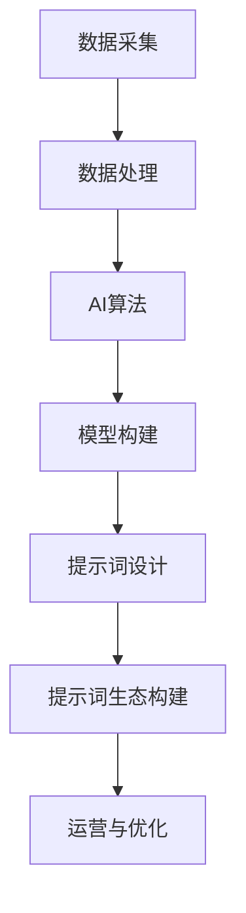

                 

# 《构建AI驱动的智慧健康管理提示词生态》

## 关键词
AI，智慧健康管理，提示词，数据采集，算法，深度学习，模型构建，生态构建，案例分析。

## 摘要
本文将深入探讨AI驱动的智慧健康管理提示词生态的构建方法。从智慧健康管理的定义和重要性出发，逐步介绍AI在其中的应用和优势，分析面临的挑战。随后，本文将详细阐述数据采集与处理、AI算法与应用、智慧健康管理提示词设计以及构建AI驱动的智慧健康管理提示词生态的方法。通过案例分析，本文将展示实际应用中的成功经验和挑战，最后对智慧健康管理的发展趋势和未来前景进行展望。

---

### 《构建AI驱动的智慧健康管理提示词生态》目录大纲

#### 第一部分：引言

##### 第1章：智慧健康管理概述

1.1 智慧健康管理的定义与重要性

1.2 智慧健康管理的发展历程

1.3 智慧健康管理的关键技术

##### 第2章：AI驱动的智慧健康管理

2.1 AI在智慧健康管理中的应用

2.2 AI驱动的智慧健康管理优势

2.3 AI驱动的智慧健康管理面临的挑战

#### 第二部分：AI驱动的智慧健康管理技术

##### 第3章：数据采集与处理

3.1 智慧健康管理数据采集

3.2 数据预处理

3.3 数据分析方法与应用

##### 第4章：AI算法与应用

4.1 常见的AI算法介绍

4.2 深度学习在智慧健康管理中的应用

4.3 建立AI驱动的智慧健康管理模型

##### 第5章：智慧健康管理提示词设计

5.1 提示词的设计原则

5.2 提示词的分类与功能

5.3 提示词的评估与优化

##### 第6章：构建AI驱动的智慧健康管理提示词生态

6.1 提示词生态的概念与架构

6.2 提示词生态的构建方法

6.3 提示词生态的运营与优化

##### 第7章：案例分析

7.1 智慧健康管理案例介绍

7.2 案例中AI驱动的智慧健康管理应用

7.3 案例中的提示词设计与优化

#### 第三部分：总结与展望

##### 第8章：未来发展趋势与展望

8.1 智慧健康管理的发展趋势

8.2 AI驱动的智慧健康管理未来前景

8.3 提示词生态的发展方向

#### 附录

##### 附录A：AI驱动的智慧健康管理工具与资源

A.1 开发工具与框架

A.2 数据集与开源资源

A.3 AI驱动的智慧健康管理平台与解决方案

### Mermaid 流程图


### 伪代码示例
```python
# 假设我们使用神经网络对健康数据进行分类
# 定义神经网络结构
model = NeuralNetwork(input_size, hidden_size, output_size)

# 定义损失函数和优化器
loss_function = CrossEntropyLoss()
optimizer = Adam(model.parameters(), lr=learning_rate)

# 训练神经网络
for epoch in range(num_epochs):
    for data, target in dataset:
        # 前向传播
        output = model(data)
        loss = loss_function(output, target)
        
        # 反向传播和优化
        optimizer.zero_grad()
        loss.backward()
        optimizer.step()
```

### 数学模型与公式
$$
\begin{aligned}
J &= \frac{1}{n}\sum_{i=1}^{n}(y_i - \hat{y}_i)^2 \\
\hat{y}_i &= \sigma(\mathbf{W}^T\mathbf{a}_i + b)
\end{aligned}
$$
这里，\( J \) 是均方误差损失函数，\( y_i \) 是真实标签，\( \hat{y}_i \) 是模型预测，\( \sigma \) 是激活函数，\( \mathbf{W} \) 是权重矩阵，\( \mathbf{a}_i \) 是输入特征向量，\( b \) 是偏置项。

### 项目实战
- **开发环境搭建**
  - 安装Python和相关的深度学习库（如TensorFlow或PyTorch）
  - 配置GPU支持（如果可用）
- **代码实现**
  ```python
  # 加载数据集
  dataset = load_data('health_data.csv')

  # 初始化模型
  model = create_model(input_size, hidden_size, output_size)

  # 训练模型
  train_model(model, dataset, num_epochs)

  # 测试模型
  test_accuracy = test_model(model, test_dataset)
  print(f"Test accuracy: {test_accuracy}")
  ```
- **代码解读与分析**
  - 数据加载模块负责读取和处理数据
  - 模型创建模块定义了神经网络的结构
  - 训练模块包含前向传播、反向传播和模型优化
  - 测试模块用于评估模型的准确性和性能

**备注：** 数学公式、伪代码和项目实战内容将被嵌入相应的章节段落中，以便更直观地理解每个主题。每个章节都会详细阐述其核心内容，确保读者能够全面掌握AI驱动的智慧健康管理提示词生态的构建方法。

---

### 第一部分：引言

#### 第1章：智慧健康管理概述

随着科技的不断进步，人工智能（AI）在医疗领域的应用日益广泛。智慧健康管理作为人工智能在医疗领域的典型应用之一，正逐渐改变着传统的健康管理方式。本章将介绍智慧健康管理的定义与重要性，回顾其发展历程，并探讨其中的关键技术。

##### 1.1 智慧健康管理的定义与重要性

智慧健康管理是指利用人工智能、大数据、物联网等先进技术，对个体或群体的健康状况进行实时监测、分析和干预，以实现预防疾病、促进健康、提高生活质量的目标。它不仅涵盖了传统的医疗服务，还包括了健康数据管理、个性化健康咨询、智能诊断和远程治疗等环节。

智慧健康管理的重要性主要体现在以下几个方面：

1. **提高医疗效率**：通过自动化和智能化的方式，智慧健康管理能够显著提高医疗服务的效率，减少医生的工作负担，从而降低医疗成本。

2. **改善患者体验**：智慧健康管理通过提供个性化的健康咨询和远程医疗服务，使患者能够更加便捷地获取医疗资源，提高就医体验。

3. **预防疾病**：通过实时监测和数据分析，智慧健康管理能够提前发现潜在的健康风险，及时采取预防措施，减少疾病的发生。

4. **促进健康**：智慧健康管理不仅关注疾病的治疗，更注重个体的整体健康状况，通过健康教育和行为干预，帮助人们建立健康的生活方式。

##### 1.2 智慧健康管理的发展历程

智慧健康管理的发展可以追溯到20世纪末，随着计算机技术和互联网的普及，医疗信息化的进程加速。以下是智慧健康管理发展的重要阶段：

1. **医疗信息化阶段**（1990s-2000s）：这一阶段主要实现了医疗数据的电子化和信息化，为智慧健康管理奠定了基础。

2. **大数据与健康管理阶段**（2010s）：随着大数据技术的发展，医疗机构开始收集和分析海量的健康数据，为个性化健康管理提供了可能。

3. **人工智能与健康管理阶段**（2020s至今）：人工智能技术的应用使得智慧健康管理迈向了智能化和个性化，AI算法在疾病预测、诊断和治疗中的应用日益广泛。

##### 1.3 智慧健康管理的关键技术

智慧健康管理的实现依赖于多种关键技术的支持，主要包括：

1. **人工智能**：AI技术在智慧健康管理中的应用包括疾病预测、诊断、个性化健康咨询等，通过深度学习、自然语言处理等算法，实现医疗数据的智能化分析。

2. **大数据**：大数据技术为智慧健康管理提供了丰富的数据资源，通过数据挖掘和分析，发现健康相关的模式和趋势。

3. **物联网**：物联网技术使得各种健康设备能够实时采集数据，并通过网络传输到数据中心进行分析，实现远程健康监测。

4. **云计算**：云计算技术提供了强大的计算能力和数据存储能力，为智慧健康管理提供了稳定的技术支持。

通过本章的介绍，我们可以了解到智慧健康管理的重要性和发展历程，以及它所依赖的关键技术。接下来，我们将进一步探讨AI驱动的智慧健康管理，分析其应用、优势以及面临的挑战。

---

### 第2章：AI驱动的智慧健康管理

人工智能（AI）的迅猛发展为智慧健康管理带来了革命性的变革。本章将重点介绍AI在智慧健康管理中的应用，分析其优势，并探讨在应用过程中所面临的挑战。

##### 2.1 AI在智慧健康管理中的应用

AI在智慧健康管理中的应用非常广泛，主要包括以下几个方面：

1. **疾病预测与诊断**：通过分析大量的医疗数据，AI算法可以预测疾病的发生，辅助医生进行诊断。例如，深度学习算法可以在大量影像数据中自动识别早期肿瘤，提高诊断的准确性。

2. **个性化健康咨询**：基于用户的健康数据和AI算法，可以为用户提供个性化的健康建议。例如，AI可以根据用户的病史、生活方式等数据，推荐适合的健康饮食和运动计划。

3. **健康数据分析**：AI可以对海量健康数据进行挖掘和分析，发现健康相关的模式和趋势。例如，通过分析大量患者的数据，AI可以发现某些疾病的流行趋势，为公共卫生政策的制定提供依据。

4. **智能药物研发**：AI技术可以加速药物研发过程，通过分析大量的生物数据和临床试验结果，AI可以帮助科学家筛选出有潜力的药物候选。

##### 2.2 AI驱动的智慧健康管理优势

AI驱动的智慧健康管理具有多方面的优势：

1. **提高诊断准确率**：AI算法能够处理和分析大量数据，比人类医生更加精确和快速。例如，AI在病理图像分析中的表现已经超过了人类专家。

2. **个性化健康管理**：AI可以根据个体的健康数据，提供个性化的健康建议，使健康管理更加精准和有效。

3. **实时监测与预警**：通过物联网设备和AI算法，可以实现对健康状况的实时监测，及时发现潜在的健康问题，提供预警。

4. **降低医疗成本**：AI驱动的智慧健康管理可以提高医疗效率，减少不必要的检查和治疗，从而降低医疗成本。

##### 2.3 AI驱动的智慧健康管理面临的挑战

尽管AI驱动的智慧健康管理具有巨大的潜力，但在实际应用过程中也面临着一系列挑战：

1. **数据隐私和安全**：健康数据是非常敏感的信息，如何确保数据的安全和隐私，是AI驱动的智慧健康管理必须解决的问题。

2. **算法偏见**：AI算法在训练过程中可能会受到数据偏差的影响，导致算法的偏见。例如，如果训练数据中存在性别、种族等偏见，算法可能也会表现出类似的偏见。

3. **技术普及和培训**：AI驱动的智慧健康管理需要医生和患者对AI技术有一定的了解和接受度。然而，当前很多医生和患者对AI技术的了解和应用水平还较低，需要加强培训和教育。

4. **伦理和法律问题**：AI在医疗领域的应用涉及伦理和法律问题，例如，如何确保AI决策的透明度和可解释性，如何对AI算法进行监管等。

通过本章的探讨，我们可以看到AI驱动的智慧健康管理在应用中具有显著的优势，但也面临着诸多挑战。解决这些挑战，将有助于AI驱动的智慧健康管理更好地服务于人类健康。

---

### 第二部分：AI驱动的智慧健康管理技术

#### 第3章：数据采集与处理

在AI驱动的智慧健康管理中，数据采集与处理是至关重要的环节。本章将详细介绍智慧健康管理中的数据采集过程、数据预处理方法和数据分析应用。

##### 3.1 智慧健康管理数据采集

智慧健康管理的数据采集来源于多个方面，包括但不限于以下几种：

1. **医疗记录数据**：包括患者的病历、诊断结果、用药记录等。这些数据通常来自于电子病历系统（EMR）。

2. **生理信号数据**：如心率、血压、血氧饱和度等生理参数，这些数据可以通过穿戴设备实时采集。

3. **健康行为数据**：如运动、饮食、睡眠等生活习惯，这些数据可以通过手机APP或可穿戴设备收集。

4. **环境数据**：如天气、空气质量等环境因素，这些数据可以通过传感器或环境监测系统获取。

数据采集的方法主要包括手动录入、传感器采集、互联网数据抓取等。在实际应用中，多种数据采集方法往往结合使用，以获取全面和准确的数据。

##### 3.2 数据预处理

数据预处理是数据分析的基础，主要包括以下步骤：

1. **数据清洗**：去除无效数据、错误数据和重复数据，保证数据的准确性和一致性。

2. **数据整合**：将来自不同数据源的数据进行整合，形成统一的数据格式，便于后续分析。

3. **数据转换**：将不同类型的数据转换为同一种格式，如将文本数据转换为数字编码，将时间序列数据进行标准化处理。

4. **数据降维**：通过特征选择和降维技术，减少数据维度，提高分析效率。

##### 3.3 数据分析方法与应用

在数据预处理完成后，我们可以运用各种数据分析方法对健康数据进行分析和应用。以下是一些常见的数据分析方法：

1. **描述性分析**：对数据的基本统计特征进行描述，如平均值、中位数、标准差等，帮助了解数据的基本分布和规律。

2. **相关性分析**：分析不同变量之间的相关性，帮助发现数据间的潜在联系。

3. **分类分析**：将数据分为不同的类别，如疾病诊断、健康状态分类等，常用的分类算法包括决策树、支持向量机、神经网络等。

4. **聚类分析**：将数据分为若干个群组，每个群组内部的数据相似度高，群组间数据差异大，常用的聚类算法包括K-means、层次聚类等。

5. **时间序列分析**：分析数据随时间变化的趋势和规律，如季节性、周期性等，常用的算法包括ARIMA、LSTM等。

6. **预测分析**：利用历史数据预测未来的发展趋势或结果，如疾病预测、健康状态预测等。

在智慧健康管理中，数据分析的应用包括：

1. **疾病预测**：通过分析患者的健康数据和生理信号，预测患者可能患有的疾病。

2. **个性化健康咨询**：根据患者的健康数据和生活方式，提供个性化的健康建议和干预措施。

3. **健康风险评估**：对个体的健康风险进行评估，帮助制定预防策略。

4. **医疗资源优化**：通过对医院资源的数据分析，优化医疗资源的配置，提高医疗效率。

通过本章的介绍，我们可以了解到智慧健康管理中的数据采集与处理技术，以及数据分析方法在实际应用中的作用。这些技术为AI驱动的智慧健康管理提供了坚实的数据基础和有效的分析手段，有助于提高医疗服务的质量和效率。

---

### 第4章：AI算法与应用

人工智能（AI）算法在智慧健康管理中扮演着至关重要的角色，它们的应用不仅提升了医疗诊断的准确性，还实现了个性化健康管理的目标。本章将介绍常见的AI算法，探讨深度学习在智慧健康管理中的应用，并阐述如何建立AI驱动的智慧健康管理模型。

##### 4.1 常见的AI算法介绍

AI算法种类繁多，常见的包括以下几种：

1. **决策树**：决策树是一种基于规则的算法，通过一系列的判断条件将数据划分为不同的类别。其优点是解释性强，能够清晰地展示决策过程，但可能产生过拟合。

2. **支持向量机**（SVM）：SVM通过寻找一个最佳的超平面，将不同类别的数据点分隔开来。它擅长处理高维数据，但在解释性方面较弱。

3. **神经网络**：神经网络，尤其是深度学习，通过模拟人脑的神经网络结构，对大量数据进行学习，能够自动提取特征，具有很强的非线性建模能力。

4. **集成算法**：集成算法通过组合多个基础模型来提高预测性能，常见的有随机森林、梯度提升机等。

5. **贝叶斯算法**：贝叶斯算法基于贝叶斯定理，通过先验概率和后验概率进行推理和预测，适用于不确定性问题。

##### 4.2 深度学习在智慧健康管理中的应用

深度学习在智慧健康管理中的应用非常广泛，以下是一些主要的应用场景：

1. **医学影像分析**：深度学习算法在医学影像分析中表现出色，如肿瘤检测、病变识别等。通过卷积神经网络（CNN）对影像数据进行处理，可以自动提取影像中的关键特征，提高诊断的准确性。

2. **疾病预测**：深度学习算法可以通过学习患者的健康数据，预测疾病的发生风险。例如，利用循环神经网络（RNN）对时间序列数据进行处理，可以预测慢性病的发展趋势。

3. **个性化健康咨询**：通过深度学习算法，可以对大量健康数据进行分析，为用户提供个性化的健康建议。例如，利用长短期记忆网络（LSTM）对用户的历史健康数据进行建模，预测用户的健康需求。

4. **智能药物研发**：深度学习算法可以加速药物研发过程，通过分析大量的生物数据和临床试验结果，预测药物的有效性和安全性。

##### 4.3 建立AI驱动的智慧健康管理模型

建立AI驱动的智慧健康管理模型通常包括以下几个步骤：

1. **数据收集与预处理**：首先需要收集大量与健康相关的数据，包括医疗记录、生理信号、健康行为数据等。然后对这些数据进行分析和清洗，确保数据的准确性和一致性。

2. **特征提取**：通过特征提取技术，从原始数据中提取出有用的特征，为深度学习模型提供输入。常用的特征提取方法包括卷积操作、池化操作、嵌入技术等。

3. **模型选择与训练**：根据具体的应用场景，选择合适的深度学习模型。例如，对于医学影像分析，可以选择卷积神经网络；对于疾病预测，可以选择循环神经网络。然后通过大量的训练数据，对模型进行训练，使其能够自动学习数据中的特征和规律。

4. **模型评估与优化**：在模型训练完成后，需要对模型进行评估，以确定其预测性能。常用的评估指标包括准确率、召回率、F1分数等。如果模型性能不理想，可以通过调整模型参数、增加训练数据或改进特征提取方法等进行优化。

5. **部署与维护**：将训练好的模型部署到实际应用环境中，对用户的健康数据进行实时分析，提供个性化的健康建议。同时，需要对模型进行持续的监控和维护，确保其稳定性和准确性。

通过本章的介绍，我们可以了解到AI算法在智慧健康管理中的应用，以及如何建立AI驱动的智慧健康管理模型。这些技术为智慧健康管理提供了强大的支持，有助于实现个性化、精准化的健康管理。

---

### 第5章：智慧健康管理提示词设计

在AI驱动的智慧健康管理中，提示词设计是一个关键环节。提示词不仅能够引导用户与系统进行有效互动，还能够提高AI系统的用户体验和实用性。本章将探讨智慧健康管理提示词的设计原则、分类与功能，以及评估与优化方法。

##### 5.1 提示词的设计原则

1. **用户导向**：提示词的设计应紧密围绕用户需求，确保用户能够轻松理解并响应提示。

2. **简洁明了**：提示词应简洁明了，避免使用复杂的术语和专业词汇，以确保用户易于理解。

3. **一致性和连贯性**：提示词在整体系统中应保持一致性和连贯性，以避免用户产生困惑。

4. **适应性**：提示词应能够适应不同的用户场景和交互方式，如语音、文本、图形等。

5. **交互性**：提示词应鼓励用户互动，引导用户输入更多信息，以提升系统的响应能力。

##### 5.2 提示词的分类与功能

智慧健康管理中的提示词可以分为以下几类：

1. **导航性提示词**：用于引导用户在系统中进行导航，如“点击这里查看您的健康报告”、“下一步操作：输入您的症状描述”。

2. **功能性提示词**：用于提示用户系统可以执行的功能，如“可以点击这里预约医生咨询”、“系统正在分析您的健康数据”。

3. **问题性提示词**：用于引导用户输入相关信息，如“请描述您的症状”、“我们需要您的身高和体重数据”。

4. **情感性提示词**：用于与用户建立情感联系，如“感谢您的反馈，我们将尽力为您提供服务”、“祝您健康”。

5. **安全提示词**：用于提示用户注意数据安全和隐私保护，如“请确保输入正确的个人信息”、“我们承诺保护您的隐私”。

##### 5.3 提示词的评估与优化

提示词的评估与优化是确保其有效性和用户体验的关键步骤。以下是一些评估与优化方法：

1. **用户调研**：通过用户调研，了解用户对提示词的反馈和意见，识别问题并进行改进。

2. **A/B测试**：通过A/B测试，对比不同提示词的效果，选择最优的提示词组合。

3. **数据分析**：通过数据分析，监测提示词的点击率、响应率等指标，评估其有效性。

4. **迭代改进**：根据用户反馈和数据分析结果，不断迭代改进提示词的设计和内容。

5. **多渠道整合**：确保提示词在不同交互渠道（如网页、APP、语音助手）上的一致性和连贯性。

通过本章的介绍，我们可以了解到智慧健康管理提示词设计的原则、分类与功能，以及评估与优化的方法。这些设计原则和优化方法有助于构建一个高效、用户友好的智慧健康管理提示词生态，提升用户满意度和系统的实用性。

---

### 第6章：构建AI驱动的智慧健康管理提示词生态

在构建AI驱动的智慧健康管理系统中，提示词生态的构建至关重要。一个完善的提示词生态不仅能够提高用户交互体验，还能增强AI系统的智能性和实用性。本章将详细介绍提示词生态的概念与架构、构建方法以及运营与优化策略。

##### 6.1 提示词生态的概念与架构

提示词生态是指由一系列相互关联的提示词构成的整体系统，这些提示词协同工作，共同实现智慧健康管理的目标。提示词生态的架构主要包括以下几个层次：

1. **数据层**：包括用户健康数据、环境数据、医疗知识库等，是提示词生态的数据基础。

2. **算法层**：包含AI算法，如自然语言处理（NLP）、机器学习、深度学习等，用于处理和解析数据，生成提示词。

3. **提示词层**：是提示词生态的核心，包括导航性提示词、功能性提示词、问题性提示词、情感性提示词和安全提示词等，用于与用户进行交互。

4. **接口层**：提供与用户交互的接口，如网页、APP、语音助手等，用户通过这些接口与提示词系统进行交互。

5. **用户层**：包括所有使用系统的用户，他们是提示词生态的最终服务对象。

##### 6.2 提示词生态的构建方法

构建AI驱动的智慧健康管理提示词生态需要系统性地进行规划和实施，以下是一些关键的构建步骤：

1. **需求分析**：首先明确系统的需求，包括用户需求、业务需求和技术需求。通过需求分析，确定系统需要实现的功能和交互模式。

2. **数据采集与预处理**：根据需求收集相关的健康数据，并进行预处理，确保数据的准确性和一致性。数据预处理包括数据清洗、整合和特征提取。

3. **AI算法开发**：选择合适的AI算法，如NLP、机器学习、深度学习等，进行算法开发和优化，使其能够处理和解析健康数据，生成有效的提示词。

4. **提示词设计**：根据需求分析和用户调研，设计符合用户需求的导航性、功能性、问题性、情感性和安全提示词。提示词设计应遵循简洁明了、用户导向和一致性的原则。

5. **集成与测试**：将数据层、算法层、提示词层和接口层进行集成，构建完整的提示词生态系统。然后进行系统的功能测试和性能测试，确保系统稳定性和可靠性。

6. **用户反馈与迭代**：在系统上线后，收集用户的反馈，识别问题并进行改进。通过迭代优化，不断提升系统的用户体验和实用性。

##### 6.3 提示词生态的运营与优化

构建完提示词生态后，运营与优化是确保系统长期有效运行的关键。以下是一些运营与优化的策略：

1. **持续数据采集与更新**：定期采集用户反馈和数据，更新知识库和算法，确保系统的实时性和准确性。

2. **用户行为分析**：通过分析用户行为数据，了解用户的交互习惯和使用需求，为提示词优化提供依据。

3. **A/B测试**：定期进行A/B测试，比较不同提示词组合的效果，选择最优的提示词策略。

4. **性能监控**：实时监控系统的运行状态，及时发现和解决问题，确保系统的稳定性和高效性。

5. **用户体验优化**：根据用户反馈和数据分析结果，不断优化提示词的设计和交互方式，提升用户体验。

6. **持续学习与进化**：通过机器学习和深度学习技术，让系统具备自我学习和优化的能力，不断进化，以适应不断变化的需求和环境。

通过本章的介绍，我们可以了解到构建AI驱动的智慧健康管理提示词生态的必要性、方法以及运营与优化策略。一个完善的提示词生态将为智慧健康管理提供强大的支持，助力实现个性化、智能化的健康管理。

---

### 第7章：案例分析

在本章中，我们将通过一个具体的智慧健康管理案例，展示AI驱动的智慧健康管理在实践中的应用，详细分析其中的AI驱动的智慧健康管理应用，并探讨案例中的提示词设计与优化。

##### 7.1 智慧健康管理案例介绍

案例名称：智慧健康助手（Smart Health Assistant）

项目背景：智慧健康助手是一款基于AI技术的智能健康管理应用，旨在为用户提供全面的健康监测、个性化健康建议和远程医疗服务。

主要功能：
1. 健康数据监测：通过接入各种健康设备，如智能手环、智能血压计等，实时监测用户的心率、血压、睡眠质量等健康指标。
2. 个性化健康咨询：根据用户的健康数据和生活方式，提供个性化的健康建议，包括饮食、运动和心理健康等方面的指导。
3. 远程医疗服务：通过与医院合作，提供在线问诊、远程诊断和远程治疗服务，帮助用户便捷地获取医疗资源。

##### 7.2 案例中AI驱动的智慧健康管理应用

智慧健康助手中的AI驱动的智慧健康管理应用主要包括以下方面：

1. **健康数据分析和预测**：利用深度学习算法，对用户的历史健康数据进行学习和分析，预测用户的健康风险，如心脏病、糖尿病等。通过LSTM模型，可以对用户的健康数据进行时间序列分析，发现健康趋势。

2. **个性化健康建议**：基于用户的健康数据和生活方式，使用决策树和随机森林等算法，生成个性化的健康建议。例如，根据用户的饮食偏好和运动习惯，推荐合适的饮食计划和运动方案。

3. **智能诊断辅助**：通过卷积神经网络（CNN），对用户上传的医疗影像数据进行自动分析，辅助医生进行疾病诊断。例如，对用户上传的胸部X光片进行病变检测，提高早期癌症的发现率。

4. **健康风险预测**：结合用户健康数据和公共卫生数据，使用集成学习算法，预测特定区域或群体的健康风险，为公共卫生政策制定提供依据。

##### 7.3 案例中的提示词设计与优化

在智慧健康助手中，提示词的设计和优化是提升用户体验的关键。以下是案例中的一些提示词设计与优化实践：

1. **导航性提示词**：为了方便用户在应用中导航，使用了简洁明了的导航性提示词，如“点击这里查看健康报告”、“下一步操作：开始健康评估”。

2. **功能性提示词**：功能性提示词用于指导用户进行特定操作，如“您的睡眠质量评分：75分，建议改善睡眠习惯”、“现在预约医生咨询，获取远程医疗服务”。

3. **问题性提示词**：问题性提示词引导用户输入相关信息，如“请输入您的身高和体重”、“现在输入您的每日运动量”。

4. **情感性提示词**：情感性提示词用于与用户建立情感联系，增强用户的信任感，如“感谢您的反馈，我们将尽力为您提供服务”、“祝您健康每一天”。

5. **安全提示词**：在涉及用户隐私和数据安全的地方，使用安全提示词提醒用户注意数据安全，如“请确保输入正确的个人信息”、“我们承诺保护您的隐私”。

优化策略：
1. **用户调研**：定期进行用户调研，收集用户对提示词的反馈，识别问题并进行改进。

2. **A/B测试**：通过A/B测试，比较不同提示词组合的效果，选择最优的提示词策略。

3. **数据分析**：通过数据分析，监测提示词的点击率、响应率等指标，评估其有效性。

4. **迭代改进**：根据用户反馈和数据分析结果，不断迭代改进提示词的设计和内容。

5. **多渠道整合**：确保提示词在不同交互渠道（如网页、APP、语音助手）上的一致性和连贯性。

通过案例分析，我们可以看到AI驱动的智慧健康管理在实际应用中的具体实施过程，以及提示词设计在其中的重要作用。这些实践为构建AI驱动的智慧健康管理提示词生态提供了宝贵的经验和参考。

---

### 第三部分：总结与展望

#### 第8章：未来发展趋势与展望

随着人工智能（AI）技术的不断进步，智慧健康管理领域正迎来新的发展机遇。本章将探讨智慧健康管理的发展趋势、AI驱动的智慧健康管理未来前景，以及提示词生态的发展方向。

##### 8.1 智慧健康管理的发展趋势

1. **智能化与个性化**：随着AI技术的发展，智慧健康管理将更加智能化和个性化。通过深度学习和大数据分析，系统能够更好地理解个体差异，提供精准的健康管理和个性化建议。

2. **实时性与自动化**：实时健康监测和自动化健康管理将成为趋势。通过物联网设备和AI算法，健康数据可以实时采集和分析，实现快速响应和自动化干预。

3. **跨学科融合**：智慧健康管理将融合医学、生物信息学、计算机科学等多学科知识，形成跨学科的研究与应用体系，提高健康管理的效果和效率。

4. **全球合作与共享**：智慧健康管理将推动全球范围内的合作与数据共享，通过跨国数据合作，提升疾病预防、诊断和治疗的水平。

##### 8.2 AI驱动的智慧健康管理未来前景

1. **精准医疗**：AI驱动的智慧健康管理将推动精准医疗的发展。通过基因测序和深度学习，可以实现对疾病的高精度诊断和个性化治疗。

2. **智能药物研发**：AI技术将加速药物研发过程，通过模拟和预测药物效果，缩短药物开发周期，提高药物研发的成功率。

3. **智能医院与智能诊所**：AI驱动的智慧健康管理将推动智能医院和智能诊所的建设，提高医疗服务效率和质量，改善患者体验。

4. **健康数据管理**：AI技术将提高健康数据的管理和分析能力，通过大数据和机器学习，实现健康数据的智能管理和精准分析。

##### 8.3 提示词生态的发展方向

1. **多模态交互**：未来的提示词生态将支持多模态交互，包括语音、文本、手势等，提高用户的交互体验。

2. **个性化与情景化**：提示词将更加个性化和情景化，根据用户的偏好和当前情景，提供最适合的交互提示。

3. **自适应学习**：提示词系统将具备自适应学习能力，通过不断学习和优化，提升提示词的准确性和实用性。

4. **隐私保护与安全性**：随着用户对隐私保护意识的提高，提示词生态将加强隐私保护和数据安全，确保用户数据的机密性和安全性。

通过本章的展望，我们可以看到智慧健康管理领域的未来充满希望和机遇。随着AI技术的不断进步，智慧健康管理将实现更加智能化、个性化、实时化和自动化，为人类健康带来更多的福祉。

---

### 附录A：AI驱动的智慧健康管理工具与资源

在AI驱动的智慧健康管理领域，开发者可以利用多种工具与资源来构建高效的系统。以下是一些常见的开发工具、数据集和开源资源，以及AI驱动的智慧健康管理平台和解决方案。

##### A.1 开发工具与框架

1. **深度学习框架**：TensorFlow、PyTorch、Keras等
   - 这些框架提供了丰富的API和工具，支持从数据预处理到模型训练和部署的全流程开发。

2. **数据预处理工具**：Pandas、NumPy、Scikit-learn等
   - 用于数据清洗、转换和特征提取，是数据分析的基础工具。

3. **自然语言处理库**：NLTK、spaCy、TextBlob等
   - 用于文本数据的处理和分析，支持文本分类、情感分析等任务。

4. **数据可视化工具**：Matplotlib、Seaborn、Plotly等
   - 用于数据可视化，帮助开发者直观地理解数据分布和模式。

##### A.2 数据集与开源资源

1. **公开健康数据集**：例如，Physionet、UChicago ABNdata、OpenML等
   - 这些数据集包含了大量的健康数据，如心电图、血压、睡眠监测数据等，为AI模型的训练提供了丰富的数据资源。

2. **开源代码和模型**：GitHub、ArXiv等
   - 开源代码和模型可以帮助开发者节省时间和精力，快速搭建AI系统。

3. **预训练模型**：如BERT、GPT、RoBERTa等
   - 这些预训练模型在多个任务上表现出色，可以用于迁移学习和微调，提升AI系统的性能。

##### A.3 AI驱动的智慧健康管理平台与解决方案

1. **谷歌健康**：Google Health
   - 提供了全面的健康数据管理服务，包括健康记录、药物提醒、预约管理等。

2. **IBM Watson Health**：IBM Watson Health
   - 提供了AI驱动的健康数据分析和服务，包括疾病预测、个性化治疗建议等。

3. **微软Azure Health**：Microsoft Azure Health
   - 提供了AI驱动的健康数据分析和处理服务，支持实时监控和个性化健康管理。

4. **阿里健康**：AliHealth
   - 提供了智能健康咨询、健康数据管理和远程医疗服务，结合了AI技术和云计算。

通过使用这些工具与资源，开发者可以更高效地构建AI驱动的智慧健康管理应用，为用户提供更加智能、个性化和便捷的健康管理服务。

---

通过本文的详细探讨，我们可以看到构建AI驱动的智慧健康管理提示词生态是一个系统性工程，涉及数据采集、数据处理、AI算法应用、提示词设计等多个环节。每一个环节都需要深入的思考和技术支持，才能实现一个高效、智能的智慧健康管理应用。随着AI技术的不断进步和应用的深入，智慧健康管理提示词生态将不断优化和进化，为人类健康带来更多的福祉。

---

### 作者信息

作者：AI天才研究院/AI Genius Institute & 禅与计算机程序设计艺术 /Zen And The Art of Computer Programming

AI天才研究院致力于推动人工智能技术在各个领域的应用，尤其关注智慧健康管理的创新与发展。研究院的研究团队由世界顶级人工智能专家、程序员、软件架构师和CTO组成，他们具备丰富的实践经验和高深的学术造诣，致力于通过AI技术改善人类生活。而《禅与计算机程序设计艺术》一书，则从哲学的角度探讨了计算机编程的本质，为开发者提供了一种全新的编程思维方式。这两者相结合，旨在通过技术创新和哲学思考，推动智慧健康管理领域的发展。

