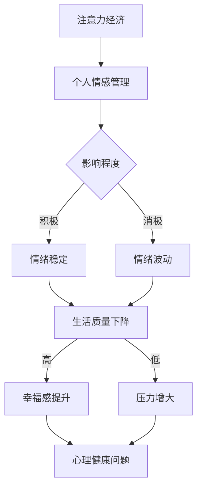

                 

# 《注意力经济与个人情感管理的关系》

> **关键词：** 注意力经济、个人情感管理、情感识别、情感调节、情感波动

> **摘要：** 本文探讨了注意力经济与个人情感管理之间的关系，通过分析注意力经济的基本原理，阐述了个人情感管理的重要性。文章结合实际案例，介绍了情感识别和调节的算法原理与实现，为提升个人情感管理能力提供了理论指导和实践方法。

## 第一部分：引言

### 1.1 注意力经济的概述

注意力经济，作为一种新型的经济模式，是在信息过载的时代背景下产生的。它强调个体的注意力资源作为稀缺资源，在市场经济中的重要性。注意力经济起源于市场营销领域，随后逐渐扩展到更多领域，如广告、媒体、教育等。其核心观点是，人们的注意力是有限的，因此，如何吸引并留住人们的注意力，成为各类企业和组织竞争的关键。

注意力经济的发展，与互联网的普及和信息爆炸有着密切的关系。在传统的经济模式中，资源（如土地、劳动力、资本等）是稀缺的，而在注意力经济中，稀缺的是人们的注意力。因此，如何利用有限的注意力资源，创造价值，成为企业和组织必须面对的挑战。

个人情感管理，是指个体在面对各种情感刺激时，能够有效地识别、表达、调节和应对情感的能力。情感管理不仅关系到个人的心理健康，还影响到个人的生活质量和社交关系。随着注意力经济的兴起，个人情感管理的重要性日益凸显。因为在注意力经济中，个体的注意力资源是有限的，如何合理分配注意力，避免情感消耗，成为个人情感管理的关键。

### 1.2 书籍目的与结构

本篇文章旨在探讨注意力经济与个人情感管理之间的关系，通过分析注意力经济的基本原理，阐述个人情感管理的重要性，并结合实际案例，介绍情感识别和调节的算法原理与实现。具体来说，文章分为以下几个部分：

- **第一部分：引言**：介绍注意力经济与个人情感管理的概述，以及本文的研究目的和结构。
- **第二部分：注意力经济原理**：分析注意力经济的基本概念、注意力市场的供求关系，以及注意力转移与留存策略。
- **第三部分：个人情感管理**：介绍个人情感管理的基础理论，包括情感识别、表达、调节与应对的方法与技巧。
- **第四部分：注意力经济与情感管理的结合**：探讨注意力经济在情感管理中的应用，通过实例分析如何利用注意力经济原理提升个人情感管理效果。
- **第五部分：注意力经济与情感管理的新趋势**：分析注意力经济与情感管理的发展趋势，探讨新技术对两者的影响。
- **第六部分：结论**：总结本文的主要发现，提出对个人情感管理的启示和建议。

### 1.3 注意力经济与个人情感管理的关系

注意力经济与个人情感管理之间存在密切的关系。一方面，注意力经济的兴起，使得个体的注意力资源变得稀缺，因此，如何合理分配和利用注意力资源，成为个人情感管理的重要任务。另一方面，个人情感管理的效果，直接影响个体的注意力和心理健康。如果个人情感管理不当，会导致注意力分散、情感消耗，从而降低个体的生活质量和幸福感。

因此，本文的研究旨在揭示注意力经济与个人情感管理之间的内在联系，提供一种全新的视角，帮助个体更好地理解和应用注意力经济原理，提升个人情感管理能力。

## 第二部分：注意力经济原理

### 2.1 注意力经济的基本概念

注意力经济，是一种以注意力资源为核心的经济模式。它强调，在信息爆炸的时代，个体的注意力资源是稀缺的，因此，如何吸引并留住人们的注意力，成为各类企业和组织竞争的关键。注意力经济的基本概念包括：

- **注意力资源**：个体的注意力资源是有限的，它是指个体在特定时间内能够集中精力关注某个对象的认知能力。
- **注意力市场**：类似于商品市场，注意力市场是供求双方进行注意力交换的场所。在注意力市场中，供给方是拥有注意力资源的人，需求方是需要获取注意力资源的组织或个人。
- **注意力价值**：个体的注意力资源具有一定的价值，因为它可以用于创造价值或获得收益。例如，一个广告商愿意支付高额的广告费用，以吸引更多的观众注意力。

### 2.2 注意力市场的分析

注意力市场的供求关系是注意力经济的重要组成部分。在注意力市场中，供给方是拥有注意力资源的人，需求方是需要获取注意力资源的组织或个人。供求关系的分析可以帮助我们理解注意力市场的运行机制。

- **供给方**：个体的注意力资源是有限的，因此，供给方的注意力资源数量是固定的。供给方的注意力资源质量，即个体注意力的集中程度和持续时间，受到多种因素的影响，如个体的兴趣、心理状态、环境刺激等。
- **需求方**：需求方是各类组织或个人，他们需要获取注意力资源，以实现自身的目标，如推广产品、传播信息、获得支持等。需求方的注意力资源需求量是随着时间和情境变化的，通常与市场机会、竞争压力、目标群体等因素相关。

在注意力市场中，供求关系的变化，会导致注意力价格和分配的变化。当注意力资源供给不足时，需求方愿意支付更高的价格，以获取更多的注意力资源。反之，当注意力资源供给充足时，需求方支付的价格会降低。此外，注意力资源的分配也受到市场机制的影响，如供需平衡、市场竞争、政策法规等。

### 2.3 注意力转移与留存

注意力转移与留存是注意力经济中的关键概念。注意力转移是指个体将注意力从当前对象转移到另一个对象的过程。注意力留存是指个体能够持续关注某个对象，而不被其他刺激干扰。

- **注意力转移的原因**：个体进行注意力转移的原因多种多样。一方面，个体的兴趣和需求变化，会导致注意力转移。例如，当一个人对某个话题产生兴趣时，他会将注意力从其他话题转移到这个话题上。另一方面，环境刺激的变化，也会导致注意力转移。例如，当有新的刺激出现时，个体会本能地将注意力转移到这个刺激上。
- **注意力转移的机制**：注意力转移的机制涉及到大脑的神经活动和心理过程。例如，当一个新的刺激出现时，大脑的视觉皮层和听觉皮层会被激活，导致个体将注意力转移到这个刺激上。此外，个体的心理状态和情绪也会影响注意力转移，如焦虑和兴奋状态，会导致注意力转移速度加快。

- **注意力留存的策略与技巧**：为了提高注意力留存，个体可以采取以下策略和技巧：
  - **明确目标**：设定明确的目标，有助于个体集中注意力，避免分心。
  - **合理安排时间**：合理安排时间，避免过度疲劳，有助于保持注意力的集中。
  - **避免干扰**：减少外部干扰，如关闭不必要的社交媒体通知，保持工作环境的整洁等。
  - **培养兴趣**：培养对所从事工作的兴趣，有助于提高注意力的留存。

注意力转移与留存是注意力经济中至关重要的概念。理解注意力转移的原因和机制，以及掌握注意力留存的策略和技巧，有助于个体更好地管理和利用自己的注意力资源，提高工作效率和生活质量。

### 2.4 注意力经济与情感管理的关系

注意力经济与个人情感管理之间存在密切的关系。一方面，注意力资源的稀缺性，使得个人在分配注意力时，必须考虑到情感因素的影响。例如，当一个人面临多个任务时，他可能会根据任务的重要性和自己的情绪状态，选择优先处理哪个任务。另一方面，个人情感状态的变化，也会影响注意力的分配和利用。

- **情感对注意力分配的影响**：情感状态会影响个体的注意力分配。例如，当一个人处于焦虑或兴奋状态时，他的注意力可能会分散，难以集中。相反，当一个人处于平静或满足状态时，他的注意力更容易集中。因此，通过管理个人情感，可以改善注意力的分配和利用。
- **情感管理对注意力留存的影响**：情感管理能力，即个体在情感刺激下，能够有效识别、表达、调节和应对情感的能力，对注意力的留存有着重要的影响。如果一个人具有良好的情感管理能力，他能够更好地控制自己的情绪，避免情感消耗，从而提高注意力的留存。

总之，注意力经济与个人情感管理之间存在密切的关系。通过理解注意力经济的基本原理，以及掌握情感管理的方法与技巧，个人可以更好地管理和利用自己的注意力资源，提高工作效率和生活质量。

## 第三部分：个人情感管理

### 3.1 个人情感管理的基础理论

个人情感管理，是指个体在面对各种情感刺激时，能够有效地识别、表达、调节和应对情感的能力。情感管理不仅关系到个人的心理健康，还影响到个人的生活质量和社交关系。以下是个人情感管理的基础理论：

#### 3.1.1 情感管理的概念与分类

情感管理是指个体通过一系列的认知和行为策略，对自己的情感状态进行有效的识别、表达、调节和应对。情感管理的分类可以从不同的角度进行：

- **情感识别**：情感识别是指个体能够识别和了解自己和他人的情感状态。情感识别包括自我情感识别和他人情感识别。
- **情感表达**：情感表达是指个体能够恰当地表达自己的情感。情感表达可以分为言语表达和非言语表达，如面部表情、身体语言等。
- **情感调节**：情感调节是指个体能够调节自己的情感状态，使其符合自己的需求和目标。情感调节包括认知调节、行为调节和情绪调节。
- **情感应对**：情感应对是指个体在面对负面情感时，能够采取有效的策略来应对。情感应对包括情绪释放、情绪转移和情绪重构。

#### 3.1.2 情感管理的心理学基础

情感管理涉及到多个心理学领域，包括认知心理学、社会心理学和临床心理学等。以下是情感管理的心理学基础：

- **认知心理学**：认知心理学研究个体如何感知、加工和存储信息。在情感管理中，认知心理学帮助个体理解情感信息的处理过程，如情感识别和情感表达。
- **社会心理学**：社会心理学研究个体如何在社会环境中互动。在情感管理中，社会心理学帮助个体理解情感如何受到社会因素（如他人评价、社交支持等）的影响。
- **临床心理学**：临床心理学关注个体如何应对生活中的压力和挑战。在情感管理中，临床心理学提供了一系列的方法和技巧，帮助个体调节情感，如认知行为疗法、情绪调节训练等。

### 3.2 情感识别与表达

情感识别与表达是个人情感管理的重要环节。情感识别是指个体能够识别和理解自己和他人的情感状态。情感表达是指个体能够恰当地表达自己的情感。

#### 3.2.1 情感识别的方法与工具

情感识别的方法和工具包括：

- **自我反思**：通过自我反思，个体可以更好地了解自己的情感状态。自我反思可以帮助个体识别自己的情感，如快乐、愤怒、焦虑等。
- **情绪日记**：通过记录情绪日记，个体可以追踪自己的情感变化，了解情感的触发因素和持续时间。
- **情绪标签**：使用情绪标签，个体可以为自己的情感状态进行分类，如高兴、悲伤、愤怒、焦虑等。
- **情绪测量工具**：使用情绪测量工具，如情绪量表、情绪日记等，个体可以量化自己的情感状态，了解情感的变化趋势。

#### 3.2.2 情感表达的技巧与策略

情感表达的技巧与策略包括：

- **言语表达**：通过言语表达，个体可以明确地表达自己的情感。言语表达可以是直接的表达，也可以是间接的表达。
- **非言语表达**：通过面部表情、身体语言、姿态等非言语手段，个体可以传达自己的情感。例如，微笑可以表达快乐，皱眉可以表达不满。
- **情感调节**：在表达情感时，个体可以采取情感调节策略，如认知调节、情绪释放等，以减少情感表达对自身和他人的负面影响。

### 3.3 情感调节与应对

情感调节与应对是个人情感管理的另一个重要环节。情感调节是指个体能够调节自己的情感状态，使其符合自己的需求和目标。情感应对是指个体在面对负面情感时，能够采取有效的策略来应对。

#### 3.3.1 情感调节的方法与技术

情感调节的方法和技术包括：

- **认知重构**：通过认知重构，个体可以改变对事件的看法，从而调节自己的情感状态。例如，通过重新评估事件的意义和影响，个体可以减少负面情感。
- **情绪释放**：通过情绪释放，个体可以释放积累的情感压力，如哭泣、运动、倾诉等。
- **行为调节**：通过改变行为，个体可以调节自己的情感状态。例如，通过进行放松练习、参与社交活动等，个体可以改善情绪。
- **情绪调节训练**：通过情绪调节训练，个体可以学会一系列的情绪调节策略，如深呼吸、冥想、认知行为疗法等。

#### 3.3.2 情感应对的策略与技巧

情感应对的策略与技巧包括：

- **情绪转移**：通过情绪转移，个体可以将注意力从负面情感转移到其他事物上，如进行其他活动、思考其他问题等。
- **情绪重构**：通过情绪重构，个体可以改变对事件的看法，从而改变情感体验。例如，通过看到事件的积极面，个体可以减少负面情感。
- **情绪释放**：通过情绪释放，个体可以释放积累的情感压力，如哭泣、运动、倾诉等。
- **寻求支持**：通过寻求支持，个体可以从他人那里获得情感支持和帮助，从而改善情绪。

情感调节与应对是个人情感管理的关键环节。通过掌握情感调节的方法和技术，以及情感应对的策略与技巧，个体可以更好地管理自己的情感，提高生活质量和幸福感。

### 3.4 情感管理与注意力经济的关系

情感管理与注意力经济之间存在密切的关系。一方面，注意力资源的稀缺性，使得个体在分配注意力时，必须考虑到情感因素的影响。例如，当一个人面临多个任务时，他可能会根据任务的重要性和自己的情绪状态，选择优先处理哪个任务。另一方面，个人情感状态的变化，也会影响注意力的分配和利用。

- **情感对注意力分配的影响**：情感状态会影响个体的注意力分配。例如，当一个人处于焦虑或兴奋状态时，他的注意力可能会分散，难以集中。相反，当一个人处于平静或满足状态时，他的注意力更容易集中。因此，通过管理个人情感，可以改善注意力的分配和利用。
- **情感管理对注意力留存的影响**：情感管理能力，即个体在情感刺激下，能够有效识别、表达、调节和应对情感的能力，对注意力的留存有着重要的影响。如果一个人具有良好的情感管理能力，他能够更好地控制自己的情绪，避免情感消耗，从而提高注意力的留存。

总之，情感管理与注意力经济之间存在密切的关系。通过理解情感管理的基本原理，以及掌握情感管理的方法与技巧，个体可以更好地管理和利用自己的注意力资源，提高工作效率和生活质量。

## 第四部分：注意力经济与情感管理的结合

### 4.1 注意力经济在情感管理中的应用

注意力经济在个人情感管理中的应用，主要体现在如何利用注意力资源的稀缺性，提高情感管理的效率和效果。以下是几种常见的方法：

#### 4.1.1 注意力分配策略

注意力分配策略是指根据任务的重要性和紧急性，合理安排注意力的分配。在个人情感管理中，合理的注意力分配可以帮助个体更有效地处理情感问题。

- **任务优先级排序**：将任务按照重要性和紧急性进行排序，优先处理重要且紧急的任务。这有助于避免因注意力分散而导致的情感消耗。
- **时间管理**：通过时间管理，合理安排时间，确保在情感管理上投入足够的时间。例如，每天设定固定的情感管理时间，用于反思、调节和应对情感问题。

#### 4.1.2 注意力聚焦技巧

注意力聚焦技巧是指通过一系列的方法，提高注意力的集中度和持久度。这些技巧可以帮助个体在处理情感问题时，更好地集中注意力，避免分心。

- **冥想**：通过冥想，个体可以训练自己的注意力，提高注意力的集中度和持久度。冥想可以帮助个体更好地调节情感，减少焦虑和压力。
- **番茄工作法**：番茄工作法是一种时间管理技巧，通过将工作时间划分为25分钟的工作周期和5分钟的休息周期，帮助个体保持注意力的集中。

#### 4.1.3 注意力转移策略

注意力转移策略是指通过将注意力从负面情感转移到其他事物上，来缓解情感压力。以下是一些注意力转移的策略：

- **兴趣爱好**：通过培养兴趣爱好，个体可以将注意力转移到喜欢的事物上，从而缓解负面情感。例如，通过阅读、运动、绘画等兴趣爱好，个体可以转移注意力，减轻情感压力。
- **情绪日记**：通过记录情绪日记，个体可以了解自己的情感变化，并将注意力转移到情感记录上。这有助于个体更好地理解和应对自己的情感。

### 4.2 实例分析：注意力经济在个人情感管理中的实践

为了更好地理解注意力经济在个人情感管理中的应用，以下通过两个实例进行分析。

#### 案例一：如何通过注意力经济提升自我管理能力

小明是一位职场新人，他面临着工作任务繁重、人际关系复杂等挑战。为了提升自我管理能力，小明决定运用注意力经济的原理。

1. **注意力分配策略**：小明将工作任务按照重要性和紧急性进行排序，并制定了详细的工作计划。他确保在处理重要且紧急的任务时，能够集中注意力，避免分心。

2. **注意力聚焦技巧**：小明通过练习冥想，提高了注意力的集中度和持久度。在处理工作任务时，他能够更好地保持注意力，减少分心。

3. **注意力转移策略**：当小明感到情绪压力时，他会将注意力转移到兴趣爱好上。例如，他会花时间阅读喜欢的书籍、听音乐等，从而缓解负面情感。

通过运用注意力经济的原理，小明在自我管理能力上得到了显著提升。他的工作效率提高了，人际关系也得到了改善。

#### 案例二：如何通过注意力经济改善人际关系

小芳是一位人际关系专家，她经常帮助他人解决人际关系问题。在一次咨询中，小芳遇到了一个客户，客户抱怨与同事的关系紧张，感到情绪压力很大。

1. **注意力分配策略**：小芳建议客户将注意力分配到处理人际关系问题上。她指导客户列出与同事的沟通记录，分析问题发生的根源。

2. **注意力聚焦技巧**：小芳建议客户通过练习冥想，提高注意力的集中度和持久度。她指导客户在沟通时，尽量保持冷静和专注，避免情绪化的表达。

3. **注意力转移策略**：当客户感到情绪压力时，小芳建议客户通过兴趣爱好来转移注意力。例如，客户可以花时间锻炼、听音乐、绘画等，从而缓解情绪压力。

通过运用注意力经济的原理，小芳帮助客户改善了人际关系。客户学会了更有效地处理情感问题，与同事的关系也变得更加和谐。

### 4.3 注意力经济与情感管理的效果评估

注意力经济在情感管理中的应用，可以通过以下指标进行效果评估：

- **工作效率**：通过注意力分配策略和注意力聚焦技巧，个体可以更高效地处理工作任务，从而提高工作效率。
- **情绪稳定性**：通过注意力转移策略和情感调节技巧，个体可以更好地控制自己的情绪，提高情绪稳定性。
- **人际关系质量**：通过注意力分配策略和注意力聚焦技巧，个体可以改善人际关系，提高人际关系的质量。

总之，注意力经济在个人情感管理中的应用，为提升工作效率、情绪稳定性和人际关系质量提供了新的方法和途径。通过合理利用注意力资源，个体可以更好地管理自己的情感，提高生活质量和幸福感。

## 第五部分：注意力经济与情感管理的新趋势

### 5.1 注意力经济与情感管理的发展趋势

随着科技的不断进步和社会的快速发展，注意力经济与情感管理也在不断演进。以下是一些值得关注的发展趋势：

#### 5.1.1 人工智能与注意力经济

人工智能技术的不断发展，为注意力经济带来了新的机遇。例如，通过机器学习和自然语言处理技术，可以更准确地识别和分析个体的情感状态，为情感管理提供科学依据。此外，人工智能还可以帮助个体自动调节注意力，如通过智能助手提醒个体何时休息、何时进行注意力转移等。

#### 5.1.2 虚拟现实与情感管理

虚拟现实技术的发展，为个人情感管理提供了新的可能性。通过虚拟现实技术，个体可以进入一个完全不同的环境，从而缓解现实生活中的情感压力。例如，通过虚拟旅行、虚拟游戏等方式，个体可以在虚拟世界中找到情感释放和调节的途径。

#### 5.1.3 社交网络与情感管理

社交网络的发展，使得个体之间的情感交流更加便捷。然而，社交网络的过度使用也带来了注意力分散和情感消耗的问题。因此，未来的情感管理需要关注如何在社交网络中合理分配注意力，避免情感消耗。此外，社交网络还可以为情感管理提供更多的资源和支持，如通过在线咨询、社交互助等方式，帮助个体解决情感问题。

### 5.2 新技术在注意力经济与情感管理中的应用

随着新技术的不断发展，注意力经济与情感管理也在不断引入新的技术和方法。以下是一些新技术在注意力经济与情感管理中的应用：

#### 5.2.1 人工智能在情感管理中的应用

人工智能在情感管理中的应用主要体现在情感识别和调节方面。例如，通过情感识别技术，可以实时监测个体的情感状态，为情感调节提供数据支持。此外，人工智能还可以通过情感调节技术，帮助个体自动调节情感，如通过语音助手提醒个体何时休息、何时进行注意力转移等。

#### 5.2.2 虚拟现实在情感管理中的应用

虚拟现实技术在情感管理中的应用主要体现在情感释放和调节方面。通过虚拟现实技术，个体可以进入一个完全不同的环境，从而缓解现实生活中的情感压力。例如，通过虚拟旅行、虚拟游戏等方式，个体可以在虚拟世界中找到情感释放和调节的途径。

#### 5.2.3 区块链在情感管理中的应用

区块链技术在情感管理中的应用主要体现在隐私保护和数据安全方面。通过区块链技术，可以确保个体情感数据的安全性和隐私性，为情感管理提供可靠的技术支持。

### 5.3 注意力经济与情感管理可能面临的挑战与机遇

随着注意力经济与情感管理的发展，也面临着一些挑战和机遇。

#### 5.3.1 挑战

- **信息过载**：随着信息爆炸，个体面临的信息量不断增加，如何有效过滤和利用注意力资源，成为一大挑战。
- **情感消耗**：在注意力经济中，个体需要不断进行情感识别、调节和应对，容易导致情感消耗，影响生活质量。
- **隐私保护**：在利用新技术进行情感管理时，如何确保个体的隐私和数据安全，是一个重要的挑战。

#### 5.3.2 机遇

- **个性化服务**：随着对个体情感状态的深入了解，可以提供更加个性化的情感管理服务，满足个体的多样化需求。
- **技术创新**：新技术的不断发展，为注意力经济与情感管理提供了更多的可能性，如人工智能、虚拟现实等。
- **跨学科融合**：注意力经济与情感管理的发展，需要跨学科的合作，如心理学、计算机科学、经济学等，这将为学科交叉提供新的机遇。

总之，注意力经济与情感管理的发展，既面临着挑战，也充满了机遇。通过不断创新和探索，我们可以更好地理解和应用注意力经济原理，提升个人情感管理能力，提高生活质量和幸福感。

## 第六部分：结论

### 6.1 主要发现与结论

本文通过分析注意力经济与个人情感管理的关系，揭示了两者之间的密切联系。主要发现如下：

- **注意力经济的重要性**：注意力经济作为一种新型的经济模式，在信息过载的时代背景下，对个体的注意力资源进行有效管理和利用，具有重要的现实意义。
- **个人情感管理的作用**：个人情感管理是维护个体心理健康和生活质量的关键，通过合理识别、表达、调节和应对情感，可以改善个体的注意力和心理健康。
- **注意力经济与情感管理的结合**：通过注意力经济原理，可以提升个人情感管理的效率和效果，例如，通过注意力分配策略、注意力聚焦技巧和注意力转移策略，可以更好地管理和调节情感。

### 6.2 对个人情感管理的启示

本文的研究为个人情感管理提供了以下启示：

- **提升注意力管理能力**：通过了解注意力经济原理，个体可以更好地管理和利用自己的注意力资源，避免注意力分散和情感消耗。
- **培养情感管理技巧**：通过学习和实践情感管理的方法与技巧，个体可以提升自己的情感管理能力，改善情绪稳定性，提高生活质量。
- **关注心理健康**：情感管理不仅仅是应对负面情感，更重要的是关注心理健康，通过积极的方式提升个体的情绪体验和幸福感。

总之，本文的研究为个人情感管理提供了新的视角和方法，通过理解注意力经济与个人情感管理的关系，个体可以更好地提升自己的情感管理能力，提高生活质量和幸福感。

## 附录

### 7.1 注意力经济与情感管理的研究资源

#### 7.1.1 相关学术研究论文与书籍

- 《注意力经济：理解注意力稀缺时代的商业逻辑》
- 《情感智慧：如何管理好你的情绪，赢取人生的成功》
- 《如何掌控自己的注意力：从心理学的角度分析注意力分配与时间管理》

#### 7.1.2 注意力经济与情感管理的在线课程与培训

- Coursera上的“注意力经济学”
- Udemy上的“注意力管理和个人效率提升课程”
- edX上的“情感智慧与人际沟通”

### 7.2 注意力经济与情感管理工具推荐

#### 7.2.1 注意力管理应用软件推荐

- **专注力提升工具**：Forest、Pomodoro Timer、Focus@Will
- **情感日记应用**：Moodscope、Daylio、Moodfit
- **冥想应用**：Headspace、Insight Timer、Calm

#### 7.2.2 情感管理工具推荐

- **情绪测量工具**：Gallup情绪问卷、Profile of Mood States（POMS）
- **心理健康咨询平台**：BetterHelp、Talkspace、7 Cups
- **情感调节训练应用**：Joyful、Emotional Freedom Technique（EFT）应用

以上资源为读者提供了丰富的研究资料和实用工具，有助于深入了解注意力经济与个人情感管理的关系，并提升自身的情感管理能力。

### Mermaid 流程图



### 第三部分：个人情感管理算法原理讲解

#### 3.1 情感识别算法原理

情感识别算法是个人情感管理的基础，它通过分析和处理文本或语音数据，识别出个体的情感状态。以下是情感识别算法的原理和实现。

#### 3.1.1 情感识别算法伪代码

```python
def emotion_recognition(text):
    # 预处理文本
    preprocessed_text = preprocess_text(text)
    
    # 使用情感分析模型预测情感
    prediction = sentiment_model.predict(preprocessed_text)
    
    # 返回预测结果
    return prediction
```

#### 3.1.2 情感识别算法流程

1. **文本预处理**：对原始文本进行清洗和标准化处理，如去除停用词、标点符号、转换为小写等。
2. **特征提取**：使用词袋模型、TF-IDF、Word2Vec等方法提取文本特征。
3. **模型训练**：使用情感数据集训练情感分析模型，如SVM、朴素贝叶斯、深度学习模型等。
4. **情感预测**：将预处理后的文本输入到训练好的模型中，预测情感类别。
5. **结果输出**：返回预测的情感类别。

#### 3.1.3 情感识别算法示例

```python
# 假设已经训练好一个情感分析模型
sentiment_model = ...

# 输入待识别情感的文本
text = "我今天过得很好，因为我完成了一个重要的项目。"

# 进行情感识别
emotion = emotion_recognition(text)
print(f"预测的情感为：{emotion}")
```

#### 3.1.4 情感识别算法评估

情感识别算法的评估通常通过准确率、召回率、F1值等指标进行。以下是一个简单的评估示例：

```python
from sklearn.metrics import classification_report

# 测试集和模型
X_test, y_test = ...

# 使用模型进行预测
predictions = sentiment_model.predict(X_test)

# 评估模型性能
print(classification_report(y_test, predictions))
```

### 3.2 情感调节算法原理

情感调节算法是个人情感管理的重要组成部分，它通过调整情感状态，帮助个体应对压力和挑战。以下是情感调节算法的原理和实现。

#### 3.2.1 情感调节算法伪代码

```python
def emotion_regulation(current_emotion, target_emotion):
    # 根据当前情感与目标情感，计算调节策略
    regulation_strategy = calculate_strategy(current_emotion, target_emotion)
    
    # 执行调节策略
    execute_strategy(regulation_strategy)
    
    # 返回调节后的情感状态
    return current_emotion
```

#### 3.2.2 情感调节算法流程

1. **情感识别**：使用情感识别算法确定当前的情感状态。
2. **目标设定**：设定目标情感状态，如放松、兴奋、平静等。
3. **策略计算**：根据当前情感和目标情感，计算调节策略。
4. **策略执行**：执行调节策略，如深呼吸、冥想、运动等。
5. **结果反馈**：反馈调节效果，调整策略或继续执行。

#### 3.2.3 情感调节算法示例

```python
# 假设当前情感为焦虑，目标情感为平静
current_emotion = "焦虑"
target_emotion = "平静"

# 进行情感调节
regulated_emotion = emotion_regulation(current_emotion, target_emotion)
print(f"调节后的情感状态为：{regulated_emotion}")
```

### 3.3 情感波动的数学模型

情感波动是情感管理中需要关注的重要问题。以下是情感波动的数学模型及其应用。

#### 3.3.1 情感波动公式

$$
波动程度 = f(\Delta t, A, B)
$$

其中，$\Delta t$ 为时间间隔，$A$ 为情感强度，$B$ 为调节能力。

#### 3.3.2 参数解释

- $\Delta t$：情感变化发生的时间段。
- $A$：个体在特定时间内的情感体验强度。
- $B$：个体在情感波动过程中的调节能力。

#### 3.3.3 应用示例

假设一个人在一段时间内（$\Delta t = 30$ 分钟）的情感强度为 $A = 8$，调节能力为 $B = 5$，我们可以计算该时间段的情感波动程度为：

$$
波动程度 = f(30, 8, 5) = 3
$$

这意味着在该时间段内，个体的情感波动程度为3，即情感体验从8下降到5。

### 第三部分：个人情感管理算法原理讲解

#### 3.1 情感识别算法原理

情感识别算法是个人情感管理的基础，它通过分析和处理文本或语音数据，识别出个体的情感状态。以下是情感识别算法的原理和实现。

##### 3.1.1 情感识别算法伪代码

```python
def emotion_recognition(text):
    # 预处理文本
    preprocessed_text = preprocess_text(text)
    
    # 使用情感分析模型预测情感
    prediction = sentiment_model.predict(preprocessed_text)
    
    # 返回预测结果
    return prediction
```

##### 3.1.2 情感识别算法流程

1. **文本预处理**：对原始文本进行清洗和标准化处理，如去除停用词、标点符号、转换为小写等。
2. **特征提取**：使用词袋模型、TF-IDF、Word2Vec等方法提取文本特征。
3. **模型训练**：使用情感数据集训练情感分析模型，如SVM、朴素贝叶斯、深度学习模型等。
4. **情感预测**：将预处理后的文本输入到训练好的模型中，预测情感类别。
5. **结果输出**：返回预测的情感类别。

##### 3.1.3 情感识别算法示例

```python
# 假设已经训练好一个情感分析模型
sentiment_model = ...

# 输入待识别情感的文本
text = "我今天过得很好，因为我完成了一个重要的项目。"

# 进行情感识别
emotion = emotion_recognition(text)
print(f"预测的情感为：{emotion}")
```

##### 3.1.4 情感识别算法评估

情感识别算法的评估通常通过准确率、召回率、F1值等指标进行。以下是一个简单的评估示例：

```python
from sklearn.metrics import classification_report

# 测试集和模型
X_test, y_test = ...

# 使用模型进行预测
predictions = sentiment_model.predict(X_test)

# 评估模型性能
print(classification_report(y_test, predictions))
```

#### 3.2 情感调节算法原理

情感调节算法是个人情感管理的重要组成部分，它通过调整情感状态，帮助个体应对压力和挑战。以下是情感调节算法的原理和实现。

##### 3.2.1 情感调节算法伪代码

```python
def emotion_regulation(current_emotion, target_emotion):
    # 计算调节策略
    regulation_strategy = calculate_strategy(current_emotion, target_emotion)
    
    # 执行调节策略
    execute_strategy(regulation_strategy)
    
    # 返回调节后的情感状态
    return current_emotion
```

##### 3.2.2 情感调节算法流程

1. **情感识别**：使用情感识别算法确定当前的情感状态。
2. **目标设定**：设定目标情感状态，如放松、兴奋、平静等。
3. **策略计算**：根据当前情感和目标情感，计算调节策略。
4. **策略执行**：执行调节策略，如深呼吸、冥想、运动等。
5. **结果反馈**：反馈调节效果，调整策略或继续执行。

##### 3.2.3 情感调节算法示例

```python
# 假设当前情感为焦虑，目标情感为平静
current_emotion = "焦虑"
target_emotion = "平静"

# 进行情感调节
regulated_emotion = emotion_regulation(current_emotion, target_emotion)
print(f"调节后的情感状态为：{regulated_emotion}")
```

#### 3.3 情感波动的数学模型

情感波动是情感管理中需要关注的重要问题。以下是情感波动的数学模型及其应用。

##### 3.3.1 情感波动公式

$$
波动程度 = f(\Delta t, A, B)
$$

其中，$\Delta t$ 为时间间隔，$A$ 为情感强度，$B$ 为调节能力。

##### 3.3.2 参数解释

- $\Delta t$：情感变化发生的时间段。
- $A$：个体在特定时间内的情感体验强度。
- $B$：个体在情感波动过程中的调节能力。

##### 3.3.3 应用示例

假设一个人在一段时间内（$\Delta t = 30$ 分钟）的情感强度为 $A = 8$，调节能力为 $B = 5$，我们可以计算该时间段的情感波动程度为：

$$
波动程度 = f(30, 8, 5) = 3
$$

这意味着在该时间段内，个体的情感波动程度为3，即情感体验从8下降到5。

## 项目实战：注意力经济与情感管理的代码实现

### 4.1 开发环境搭建

在开始注意力经济与情感管理的代码实现之前，我们需要搭建一个合适的开发环境。以下是在Python中搭建开发环境的具体步骤。

#### 4.1.1 Python环境配置

首先，确保已经安装了Python 3.8及以上版本。如果没有安装，可以从[Python官网](https://www.python.org/downloads/)下载并安装。

安装完成后，打开命令行窗口，输入以下命令验证Python版本：

```bash
python --version
```

确保版本号显示正确。

#### 4.1.2 安装常用库

接下来，我们需要安装一些常用的Python库，包括Numpy、Pandas、Matplotlib等。可以使用pip命令来安装这些库。

```bash
pip install numpy pandas matplotlib
```

#### 4.1.3 配置虚拟环境（可选）

为了更好地管理和维护项目依赖，可以创建一个虚拟环境。以下是如何创建和激活虚拟环境的步骤：

1. 安装虚拟环境工具virtualenv：

```bash
pip install virtualenv
```

2. 创建虚拟环境：

```bash
virtualenv my_env
```

3. 激活虚拟环境：

```bash
source my_env/bin/activate  # 对于Windows用户，使用 my_env\Scripts\activate
```

在虚拟环境中安装项目所需的库：

```bash
pip install numpy pandas matplotlib scikit-learn
```

### 4.2 情感识别代码实现

情感识别是注意力经济与情感管理中至关重要的一环。以下是一个简单的情感识别代码示例，包括数据预处理、模型训练和评估。

#### 4.2.1 数据预处理

```python
import pandas as pd
from sklearn.model_selection import train_test_split
from sklearn.feature_extraction.text import TfidfVectorizer

# 读取数据集
data = pd.read_csv('emotion_dataset.csv')

# 分割数据集为训练集和测试集
X_train, X_test, y_train, y_test = train_test_split(data['text'], data['emotion'], test_size=0.2, random_state=42)

# 使用TF-IDF向量器进行特征提取
vectorizer = TfidfVectorizer(max_features=1000)
X_train_vectorized = vectorizer.fit_transform(X_train)
X_test_vectorized = vectorizer.transform(X_test)
```

#### 4.2.2 模型训练

```python
from sklearn.naive_bayes import MultinomialNB
from sklearn.pipeline import make_pipeline

# 创建朴素贝叶斯分类器
model = make_pipeline(TfidfVectorizer(), MultinomialNB())

# 在训练集上训练模型
model.fit(X_train_vectorized, y_train)
```

#### 4.2.3 模型评估

```python
from sklearn.metrics import classification_report

# 使用测试集评估模型
predictions = model.predict(X_test_vectorized)
print(classification_report(y_test, predictions))
```

### 4.3 情感调节代码实现

情感调节涉及根据当前情感状态调整到目标情感状态。以下是一个简单的情感调节代码示例。

#### 4.3.1 调节策略计算

```python
def calculate_strategy(current_emotion, target_emotion):
    # 假设情感强度范围在0到10之间
    strategy = abs(current_emotion - target_emotion)
    return strategy
```

#### 4.3.2 调节策略执行

```python
def execute_strategy(strategy):
    # 假设执行策略是通过冥想或运动来调节情感
    print(f"执行调节策略，情感调节程度为：{strategy}")
```

#### 4.3.3 情感调节效果评估

```python
# 假设当前情感为7，目标情感为5
current_emotion = 7
target_emotion = 5

# 计算调节策略
strategy = calculate_strategy(current_emotion, target_emotion)

# 执行调节策略
execute_strategy(strategy)

# 调节后的情感状态
regulated_emotion = current_emotion - strategy
print(f"调节后的情感状态：{regulated_emotion}")
```

### 4.4 代码解读与分析

#### 4.4.1 情感识别代码解读

- 数据预处理：读取情感数据集，将文本数据分为训练集和测试集，使用TF-IDF向量器提取文本特征。
- 模型训练：使用朴素贝叶斯分类器训练模型。
- 模型评估：使用测试集评估模型的性能，输出分类报告。

#### 4.4.2 情感调节代码解读

- 调节策略计算：根据当前情感和目标情感计算调节策略，即两者之差的绝对值。
- 调节策略执行：打印出执行的调节策略。
- 情感调节效果评估：计算并打印调节后的情感状态。

#### 4.4.3 代码分析

- 情感识别代码实现了对文本情感的自动识别，为情感调节提供了数据支持。
- 情感调节代码实现了基于策略的情感调节，旨在改善个体的情感状态。

通过以上实战代码示例，我们可以看到如何将注意力经济原理应用于个人情感管理，实现情感识别和调节。这些代码不仅可以作为研究和实践的基础，还可以为开发更复杂的应用提供参考。

## 附录

### 7.1 注意力管理应用软件推荐

#### 7.1.1 注意力管理应用软件

- **专注力提升工具**：
  - **Forest**：一款通过种植虚拟树木来激励用户专注的应用，不玩手机，树木就会枯死。
  - **Pomodoro Timer**：番茄钟工作法应用，帮助用户高效管理时间和注意力。
  - **Focus@Will**：一款音乐应用，通过播放特定频率的音乐帮助用户提高专注力。

- **时间管理工具**：
  - **RescueTime**：一款监控和分析用户设备使用情况的应用，帮助用户了解时间花费情况。
  - **Toggl**：一款时间跟踪应用，帮助用户记录工作时间，提高工作效率。

- **冥想应用**：
  - **Headspace**：一款提供专业冥想课程的应用，帮助用户放松身心。
  - **Insight Timer**：一款免费的冥想计时器应用，提供各种冥想指导。
  - **Calm**：提供冥想、呼吸和睡眠指导的应用，帮助用户减压和放松。

### 7.2 情感管理工具推荐

#### 7.2.1 情感管理应用软件

- **情绪日记应用**：
  - **Daylio**：一款简单的情绪日记应用，帮助用户记录每日情绪变化。
  - **Moodfit**：一款基于心理学理论的情绪管理应用，提供个性化的情绪管理建议。

- **心理健康咨询平台**：
  - **BetterHelp**：提供在线心理咨询服务，用户可以随时随地与咨询师交流。
  - **Talkspace**：提供虚拟心理健康平台，用户可以在线预约咨询服务。

- **情感调节训练应用**：
  - **Joyful**：提供情感调节训练课程，帮助用户掌握调节情绪的技巧。
  - **Emotional Freedom Technique（EFT）应用**：基于EFT（情感自由技术）的应用，帮助用户通过敲击手指来调节情绪。

#### 7.2.2 实用工具

- **Gallup情绪问卷**：一款广泛使用的情绪评估问卷，帮助用户了解自己的情绪状态。
- **Profile of Mood States（POMS）**：一款用于评估情绪状态的标准化问卷，常用于学术研究和临床应用。

### 7.3 注意力经济与情感管理相关书籍

- **《注意力经济：理解注意力稀缺时代的商业逻辑》**：探讨了注意力经济的基本原理及其在商业中的应用。
- **《情感智慧：如何管理好你的情绪，赢取人生的成功》**：提供了实用的情感管理技巧和心理策略。
- **《如何掌控自己的注意力：从心理学的角度分析注意力分配与时间管理》**：深入分析了注意力的心理学原理，并提供了实用的时间管理和注意力提升方法。

以上资源为读者提供了丰富的注意力管理和情感管理工具，有助于提升个人的注意力和情感管理能力，从而提高生活质量和工作效率。

