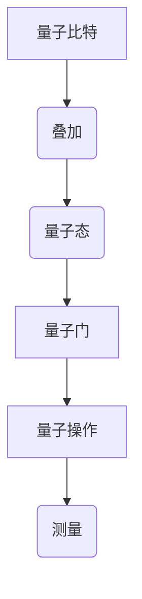

                 

# 《注意力量子计算：AI时代的多维任务处理》

## 关键词
- 量子计算
- 人工智能
- 多维任务处理
- 线性回归
- 支持向量机
- 决策树

## 摘要

本文旨在探讨量子计算与人工智能（AI）的结合，特别是在AI时代的多维任务处理中的重要作用。首先，我们将介绍量子计算的基本概念和原理，包括量子比特、量子态、量子叠加和量子纠缠。随后，我们将探讨量子计算在AI中的应用，如量子神经网络和量子算法。接着，我们将深入分析多维任务处理的定义、重要性及其在AI中的应用。我们将讨论多维数据的表示与处理方法，以及多维任务处理算法。随后，我们将探讨量子计算与多维任务处理的融合，介绍量子算法在多维任务处理中的应用实例。最后，我们将展望量子计算与AI的发展趋势，以及多维任务处理的发展挑战。

## 第一部分：量子计算与AI基础

### 1.1 量子计算概述

量子计算是一种利用量子力学原理进行信息处理的新型计算模式。量子计算的基本单位是量子比特（qubit），与传统计算机中的比特不同，量子比特可以同时处于多种状态，这种性质称为叠加。量子计算中的另一个重要概念是量子纠缠，当两个或多个量子比特处于纠缠状态时，它们之间的信息会以超距的方式相互关联。

下面是一个Mermaid流程图，展示了量子计算的基本原理与流程：



### 1.2 量子计算与AI的联系

量子计算在AI中的应用前景非常广阔。量子计算可以显著提高神经网络的训练速度，并增强其处理复杂任务的能力。例如，量子神经网络（QNN）结合了量子计算和深度学习的优势，能够处理更为复杂的问题。量子计算还可以用于优化算法，如量子支持向量机和量子决策树，这些算法在多维任务处理中具有显著优势。

### 1.3 量子算法原理讲解

量子计算中的一些经典算法，如Shor算法和Grover算法，展示了量子计算的强大能力。Shor算法可以用于因数分解，Grover算法则是一种高效的搜索算法。

**Shor算法伪代码：**

```pseudo
function Shor(N):
    if (N is even):
        return "Error: N must be odd"
    else:
        a = 2
        while (gcd(a, N) == 1):
            a = a + 1
        r = a^(N/2) mod N
        if (r == 1 or r == N-1):
            return "Error: N cannot be factored"
        else:
            while (true):
                b = a^(N-1) mod N
                if (b == 1):
                    return (r, N-r)
                a = a + 1
```

**Grover算法伪代码：**

```pseudo
function GroverSearch(list, target):
    QFT(list)
    H(list)
    while (not found):
        applyOracle(list)
        QFT(list)
        if (list[0] == target):
            found = true
        else:
            H(list)
            controlled-SWAP(list[0], target)
    QFT(list)
    return list[0]
```

### 1.4 量子计算数学模型

量子计算中的数学模型主要包括线性代数和量子门。量子门是量子计算中的基本操作，可以通过矩阵乘法来实现。以下是一个简单的量子门示例：

$$
U = \begin{bmatrix}
1 & 0 \\
0 & \frac{1}{\sqrt{2}}
\end{bmatrix}
$$

该量子门表示一个90度的旋转，可以用来创建量子叠加态。

### 1.5 量子计算案例分析

量子计算在加密解密和优化问题中有着广泛的应用。例如，量子计算可以用来破解传统加密算法，如RSA加密。此外，量子计算还可以用于优化问题，如旅行商问题，能够找到最优解。

```latex
\begin{equation}
\min_{x_1, x_2, ..., x_n} \sum_{i=1}^{n} c_i x_i \\
\text{subject to} \\
\begin{cases}
a_{1i} x_i \leq b_1 \\
a_{2i} x_i \leq b_2 \\
... \\
a_{mi} x_i \leq b_m \\
x_i \geq 0, \forall i
\end{cases}
\end{equation}
```

该公式表示一个线性规划问题，量子计算可以用来高效地解决这类问题。

## 第二部分：AI时代的多维任务处理

### 2.1 多维任务处理概述

多维任务处理是指处理包含多个维度（特征）的数据的任务。这些数据可以来自不同的来源，如文本、图像、音频等。多维任务处理在AI领域中具有重要意义，因为它能够处理复杂的数据模式，并从中提取有价值的信息。

### 2.2 多维数据的表示与处理

多维数据的表示通常使用高维向量或矩阵。为了处理这些数据，我们需要进行预处理，如数据清洗、归一化和特征提取。特征提取是将原始数据转换为适用于机器学习算法的表示。

### 2.3 多维任务处理算法

多维任务处理算法包括线性回归、支持向量机（SVM）和决策树等。这些算法能够在高维数据空间中找到数据之间的关系，并用于分类、回归和聚类等任务。

**线性回归伪代码：**

```pseudo
function LinearRegression(X, y):
    X' = Transpose(X)
    theta = (X'X)^(-1)X'y
    return theta
```

**支持向量机（SVM）伪代码：**

```pseudo
function SVM(X, y):
    kernel_function = "linear"
    if (kernel_function == "linear"):
        K = X * X'
    else if (kernel_function == "rbf"):
        sigma^2 = 1
        K = exp(-||X - X'||^2 / (2 * sigma^2))
    solve the quadratic programming problem:
    maximize 1/2 * w'w
    subject to y'(w*x + b) >= 1
    return w, b
```

**决策树伪代码：**

```pseudo
function DecisionTree(X, y, depth_limit):
    if (depth_limit == 0 or all(y == y[0])):
        return leaf_node
    else:
        best_split = find_best_split(X, y)
        left subtree = DecisionTree(X[best_split < y], y[best_split < y], depth_limit - 1)
        right subtree = DecisionTree(X[best_split >= y], y[best_split >= y], depth_limit - 1)
        return TreeNode(best_split, left subtree, right subtree)
```

### 2.4 多维任务的数学模型

多维任务的数学模型通常涉及高维空间中的优化问题。例如，线性回归模型可以用以下公式表示：

$$
\min_{\theta} \sum_{i=1}^{n} (y_i - \theta^T x_i)^2
$$

### 2.5 多维任务处理项目实战

在实际项目中，我们需要收集多维数据，进行预处理，然后使用适当的算法进行训练和预测。以下是一个简单的多维任务处理项目流程：

1. 数据收集：收集包含多个维度的数据，如文本、图像和音频。
2. 数据预处理：清洗数据，进行归一化和特征提取。
3. 模型训练：使用训练数据训练模型，如线性回归、SVM或决策树。
4. 模型评估：使用验证数据评估模型性能，调整模型参数。
5. 模型部署：将训练好的模型部署到生产环境中，进行预测和任务处理。

## 第三部分：量子计算与多维任务处理的融合

### 3.1 量子计算与多维任务处理的融合

量子计算与多维任务处理的融合是一种新的计算范式，它利用量子计算的并行性和高效性来处理复杂的多维任务。量子算法可以显著提高多维任务处理的速度和效率，特别是在大数据和复杂优化问题中。

### 3.2 量子算法在多维任务处理中的应用

量子算法在多维任务处理中有着广泛的应用。例如，量子支持向量机（QSVM）可以在高维空间中找到最优超平面，量子决策树（QDT）可以在大规模数据集上进行高效分类。量子聚类分析（QCA）则可以在高维空间中快速找到数据簇。

**量子支持向量机（QSVM）伪代码：**

```pseudo
function QSVM(X, y):
    QFT(X)
    H(X)
    while (not converged):
        applyOracle(X)
        QFT(X)
        if (X[0] == target):
            converged = true
        else:
            H(X)
            controlled-SWAP(X[0], target)
    QFT(X)
    return X[0]
```

**量子决策树（QDT）伪代码：**

```pseudo
function QDT(X, y, depth_limit):
    if (depth_limit == 0 or all(y == y[0])):
        return leaf_node
    else:
        best_split = find_best_split_QDT(X, y)
        left subtree = QDT(X[best_split < y], y[best_split < y], depth_limit - 1)
        right subtree = QDT(X[best_split >= y], y[best_split >= y], depth_limit - 1)
        return TreeNode(best_split, left subtree, right subtree)
```

**量子聚类分析（QCA）伪代码：**

```pseudo
function QCA(X, k):
    QFT(X)
    H(X)
    while (not converged):
        applyOracle(X)
        QFT(X)
        if (X[0] == target):
            converged = true
        else:
            H(X)
            controlled-SWAP(X[0], target)
    QFT(X)
    return X[0]
```

### 3.3 量子多维任务处理的项目实战

量子多维任务处理的项目实战需要构建量子计算环境，并编写量子算法代码。以下是一个简单的项目实战流程：

1. 构建量子计算环境：安装量子计算开发工具，如Q#或Python的Qiskit库。
2. 编写量子算法代码：根据项目需求编写量子算法代码。
3. 运行量子算法：在量子计算环境中运行量子算法，并进行性能评估。
4. 优化量子算法：调整量子算法参数，优化性能。

## 第四部分：展望与挑战

### 4.1 量子计算与AI的发展趋势

量子计算与AI的融合将成为未来计算领域的重要趋势。随着量子计算机的发展，量子算法将在AI领域发挥越来越重要的作用。例如，量子计算可以用于解决大规模优化问题，提高神经网络的训练效率，以及增强机器学习模型的预测能力。

### 4.2 多维任务处理的发展挑战

多维任务处理面临着许多挑战，如高维数据的表示与处理、算法的优化和模型的解释性。随着数据量的增加和数据维度的提高，传统的机器学习算法在处理高维数据时可能会变得不可行。因此，需要开发更高效的多维任务处理算法，并研究如何解释和验证这些算法的预测结果。

### 4.3 量子计算与多维任务处理的未来

量子计算与多维任务处理的融合将为未来的计算技术带来巨大的变革。量子计算可以显著提高多维任务处理的效率和准确性，为解决复杂问题提供新的方法。同时，多维任务处理的发展也将为量子计算提供新的应用场景，推动量子计算技术的进步。

## 附录

### 附录 A：量子计算与AI相关工具与资源

- **量子计算开发工具：**
  - Q#（由微软开发）
  - Qiskit（由IBM开发）
  - Cirq（由Google开发）

- **AI开发工具与框架：**
  - TensorFlow
  - PyTorch
  - Keras

- **量子计算与AI研究机构与论文资源：**
  - NASA的Quantum Artificial Intelligence Laboratory
  - Quantum Machine Learning Group（QMLG）
  - 相关论文库：ArXiv.org、IEEE Xplore、SpringerLink

### 附录 B：量子计算与多维任务处理代码实例

- **量子计算与多维任务处理的源代码：**
  - Q#示例代码
  - Python示例代码（使用Qiskit库）

- **代码解读与分析：**
  - 详细解释量子算法的实现原理
  - 分析量子算法的性能和局限性

### 附录 C：进一步阅读资料

- **量子计算与AI相关书籍推荐：**
  - 《Quantum Computing for Computer Scientists》
  - 《Quantum Computing since Democritus》
  - 《Artificial Intelligence and Quantum Computing: A Manifesto》

- **多维任务处理算法与应用论文推荐：**
  - 《High-Dimensional Data Analysis: A Concise Introduction》
  - 《Support Vector Machines for Classification》
  - 《Custering Algorithms for Data Analysis》

- **量子计算与AI研究热点与前沿动态：**
  - Quantum Machine Learning Journal
  - arXiv:quant-ph
  - Quantum Computing Report

## 作者

作者：AI天才研究院/AI Genius Institute & 禅与计算机程序设计艺术 /Zen And The Art of Computer Programming

（文章结束）### 1.1 量子计算概述

量子计算是一种基于量子力学原理的新型计算模式，它利用量子比特（qubit）和量子门（quantum gate）来实现信息的存储、传输和处理。量子比特是量子计算的基本单元，与传统计算机中的比特不同，量子比特可以同时处于多种状态，这种特性称为叠加。量子计算的核心概念还包括量子态、量子纠缠和量子门。

#### 量子比特与量子态

量子比特是量子计算的基本单位，它可以用一个复数来表示，通常用符号$|\psi\rangle$表示。量子比特可以处于基态$|0\rangle$和$|1\rangle$的叠加态，即：

$$
|\psi\rangle = \alpha|0\rangle + \beta|1\rangle
$$

其中，$\alpha$和$\beta$是复数，且满足$|\alpha|^2 + |\beta|^2 = 1$。

#### 量子叠加与量子纠缠

量子叠加是量子计算的基本特性之一，它使得量子比特可以同时处于多种状态。例如，一个量子比特可以同时处于$|0\rangle$和$|1\rangle$的叠加态，而两个量子比特可以同时处于四个状态的叠加：

$$
|\psi\rangle = \alpha|00\rangle + \beta|01\rangle + \gamma|10\rangle + \delta|11\rangle
$$

量子纠缠是量子计算中的另一个核心概念，当两个或多个量子比特处于纠缠态时，它们之间的信息会以超距的方式相互关联。这种特性使得量子计算在信息传输和量子通信中具有独特的优势。

#### Mermaid流程图：量子计算基本原理与流程

下面是一个Mermaid流程图，展示了量子计算的基本原理与流程：


### 1.2 量子计算与AI的联系

量子计算与人工智能（AI）的结合具有巨大的潜力，可以推动AI技术的进步。量子计算在AI中的应用主要体现在以下几个方面：

#### 量子神经网络（QNN）

量子神经网络（Quantum Neural Network，QNN）是量子计算与深度学习结合的一种新型神经网络。QNN利用量子计算的优势，如并行计算和高效的量子门操作，来提高神经网络的训练效率和性能。

#### 量子优化算法

量子计算在优化问题中具有显著优势，例如量子算法可以在多项式时间内解决一些传统的NP难问题。量子优化算法可以用于优化AI模型的参数，提高模型的预测性能。

#### 量子机器学习

量子机器学习（Quantum Machine Learning，QML）是量子计算在机器学习领域的一种应用。QML利用量子计算的特性，如量子纠缠和量子叠加，来提高机器学习算法的性能和效率。

#### 量子支持向量机（QSVM）

量子支持向量机（Quantum Support Vector Machine，QSVM）是量子计算在分类问题中的一种应用。QSVM利用量子计算的并行性和高效性，可以处理高维数据空间中的分类问题。

### 1.3 量子算法原理讲解

量子算法是量子计算的核心组成部分，它利用量子计算的特性来解决问题。以下介绍两种经典量子算法：Shor算法和Grover算法。

#### Shor算法

Shor算法是一种量子算法，用于因数分解大整数。Shor算法的伪代码如下：

```pseudo
Shor(N):
    if (N is even):
        return "Error: N must be odd"
    else:
        a = 2
        while (gcd(a, N) == 1):
            a = a + 1
        r = a^(N/2) mod N
        if (r == 1 or r == N-1):
            return "Error: N cannot be factored"
        else:
            while (true):
                b = a^(N-1) mod N
                if (b == 1):
                    return (r, N-r)
                a = a + 1
```

Shor算法的工作原理是基于量子纠缠和量子叠加的特性，通过一系列的量子门操作，将问题转化为一个可解决的线性方程组。

#### Grover算法

Grover算法是一种量子搜索算法，用于在未排序的数据库中查找特定项。Grover算法的伪代码如下：

```pseudo
GroverSearch(list, target):
    QFT(list)
    H(list)
    while (not found):
        applyOracle(list)
        QFT(list)
        if (list[0] == target):
            found = true
        else:
            H(list)
            controlled-SWAP(list[0], target)
    QFT(list)
    return list[0]
```

Grover算法的工作原理是基于量子叠加和量子纠缠的特性，通过一系列的量子门操作，使得目标项在量子态中占据主导地位，从而实现快速搜索。

### 1.4 量子计算数学模型

量子计算中的数学模型主要包括线性代数和量子门。量子门是量子计算中的基本操作，可以通过矩阵乘法来实现。

#### 量子计算中的数学模型与公式

在量子计算中，量子态可以用一个复数向量来表示，称为量子态向量。量子态向量可以表示为：

$$
|\psi\rangle = \alpha|0\rangle + \beta|1\rangle
$$

其中，$\alpha$和$\beta$是复数，且满足$|\alpha|^2 + |\beta|^2 = 1$。

量子门可以用矩阵表示，例如一个基本的量子门$U_1$可以表示为：

$$
U_1 = \begin{bmatrix}
1 & 0 \\
0 & \frac{1}{\sqrt{2}}
\end{bmatrix}
$$

量子门作用在量子态向量上，可以通过矩阵乘法来实现：

$$
|\psi'\rangle = U_1|\psi\rangle
$$

#### 量子计算中的线性代数基础

量子计算中的线性代数基础包括量子态的表示、量子门的矩阵表示以及量子态的叠加和纠缠。以下是一个简单的量子态的叠加和纠缠示例：

$$
|\psi\rangle = \frac{1}{\sqrt{2}}(|0\rangle + |1\rangle)
$$

$$
|\phi\rangle = |0\rangle \otimes |1\rangle
$$

其中，$|0\rangle$和$|1\rangle$分别表示基态和激发态。

#### 量子门与量子操作

量子门是量子计算中的基本操作，它通过线性变换将量子态从初始态变换到目标态。常见的量子门包括Hadamard门、Pauli门和控制非门等。

Hadamard门是一个基本的量子门，它将一个基态$|0\rangle$或$|1\rangle$变换为叠加态：

$$
H = \frac{1}{\sqrt{2}}\begin{bmatrix}
1 & 1 \\
1 & -1
\end{bmatrix}
$$

Pauli门是另一种常见的量子门，包括X门、Y门和Z门，它们分别表示对量子比特的翻转、旋转和旋转加1π。

$$
X = \begin{bmatrix}
0 & 1 \\
1 & 0
\end{bmatrix}
$$

$$
Y = \begin{bmatrix}
0 & -i \\
i & 0
\end{bmatrix}
$$

$$
Z = \begin{bmatrix}
1 & 0 \\
0 & -1
\end{bmatrix}
$$

控制非门（CNOT）是一个两量子比特门，它将第二个量子比特的状态翻转，如果第一个量子比特处于基态$|1\rangle$。

$$
CNOT = \begin{bmatrix}
1 & 0 & 0 & 0 \\
0 & 1 & 0 & 0 \\
0 & 0 & 0 & 1 \\
0 & 0 & 1 & 0
\end{bmatrix}
$$

#### LaTeX格式数学公式

在量子计算中，我们常常使用LaTeX格式来表示数学公式。以下是一个简单的LaTeX格式数学公式的示例：

$$
U = \begin{bmatrix}
1 & 0 \\
0 & \frac{1}{\sqrt{2}}
\end{bmatrix}
$$

LaTeX格式可以嵌入到Markdown文档中，使得文档更加专业和清晰。

### 1.5 量子计算案例分析

量子计算在许多领域都有广泛的应用，以下是一些量子计算案例分析的例子：

#### 量子计算在加密解密中的应用

量子计算在加密解密中有着重要的应用。量子计算机可以用来破解传统的加密算法，如RSA加密。然而，量子计算也为密码学带来了新的发展，例如量子密钥分发（Quantum Key Distribution，QKD）和量子加密。

量子密钥分发是一种安全的通信方式，它利用量子纠缠的特性来生成共享密钥。即使敌对者窃取了通信通道中的量子信息，也无法解密传输的密钥。

#### 量子计算在优化问题中的应用

量子计算在优化问题中具有显著优势。许多优化问题，如旅行商问题、任务调度和资源分配，都可以通过量子计算得到更高效的解决方案。

例如，量子计算可以用来解决旅行商问题（Travelling Salesman Problem，TSP），该问题是寻找一组城市之间的最短路径，使得总路径长度最短。量子计算可以在多项式时间内找到TSP的最优解，而传统的算法则需要指数级时间。

```latex
\begin{equation}
\min_{x_1, x_2, ..., x_n} \sum_{i=1}^{n} c_i x_i \\
\text{subject to} \\
\begin{cases}
a_{1i} x_i \leq b_1 \\
a_{2i} x_i \leq b_2 \\
... \\
a_{mi} x_i \leq b_m \\
x_i \geq 0, \forall i
\end{cases}
\end{equation}
```

该公式表示一个线性规划问题，量子计算可以用来高效地解决这类问题。

### 2.1 多维任务处理概述

多维任务处理是指在机器学习领域中，处理包含多个维度（特征）的数据的任务。在现实世界中，数据往往不是一维的，而是具有多个特征维度。例如，图像数据具有高度和宽度两个维度，文本数据可以表示为单词频率向量，其中每个维度代表一个单词的频率。多维任务处理的目标是利用这些特征维度来提取有用的信息，并完成特定的任务，如分类、回归、聚类等。

#### 多维数据的定义与类型

多维数据是指具有多个维度的数据集。这些维度可以是连续的（如时间序列数据）、离散的（如类别数据），或者是组合的（如文本数据中的词向量）。以下是一些常见多维数据的类型：

1. **时间序列数据**：数据按照时间顺序排列，每个时间点都对应一组特征值。例如，股票市场的价格数据可以表示为时间序列数据。

2. **图像数据**：图像数据由像素组成，每个像素都包含颜色信息，如红、绿、蓝值。图像数据通常具有高度和宽度两个维度。

3. **文本数据**：文本数据可以表示为单词频率向量，其中每个维度代表一个单词的频率。例如，一篇文档可以表示为1000个单词的频率向量。

4. **多通道数据**：多通道数据是指具有多个数据通道的数据，如雷达数据、医学影像数据等。

#### 多维任务处理的重要性

多维任务处理在AI领域中具有重要意义，原因如下：

1. **复杂模式识别**：多维数据包含了丰富的信息，可以通过复杂的模式识别任务来提取有用信息，如图像识别、文本分类等。

2. **增强模型性能**：利用多维数据可以提高机器学习模型的性能。通过增加特征维度，模型可以捕捉到更多的数据信息，从而提高模型的准确性和泛化能力。

3. **处理复杂数据关系**：多维任务处理可以处理不同特征之间的关系，如时间序列数据的时序关系、图像数据中的空间关系等。

4. **多目标优化**：多维任务处理可以同时优化多个目标，如分类问题中的准确率、召回率和F1分数等。

#### AI在多维任务处理中的应用场景

AI在多维任务处理中的应用场景非常广泛，以下是一些典型的应用：

1. **图像识别**：利用深度学习模型处理多维图像数据，实现物体识别、人脸识别等。

2. **文本分类**：利用自然语言处理技术处理多维文本数据，实现情感分析、新闻分类等。

3. **时间序列预测**：利用时间序列分析方法处理多维时间序列数据，实现股票价格预测、销售预测等。

4. **推荐系统**：利用多维数据构建用户和物品的交互模型，实现个性化推荐。

5. **医学影像分析**：利用多维医学影像数据，如CT、MRI等，实现疾病诊断、病灶检测等。

6. **自动驾驶**：利用多维传感器数据，如雷达、摄像头等，实现环境感知、路径规划等。

### 2.2 多维数据的表示与处理

多维数据在机器学习中具有重要的作用，但直接使用多维数据可能存在一些问题，如数据冗余、噪声和缺失值等。因此，多维数据的表示与处理是机器学习任务成功的关键。以下将介绍多维数据的表示方法、预处理方法和特征提取技术。

#### 多维数据的表示方法

多维数据可以通过以下几种方法进行表示：

1. **原始数据表示**：直接使用原始数据作为输入，例如时间序列数据可以直接作为输入序列。

2. **矩阵表示**：将多维数据表示为矩阵，其中每个维度对应矩阵的一列。例如，一个包含100个样本和10个特征的图像数据可以表示为一个10x100的矩阵。

3. **向量表示**：将多维数据压缩为向量，例如使用主成分分析（PCA）将高维数据压缩为低维向量。

4. **嵌入表示**：使用神经网络或深度学习模型将多维数据映射到一个低维空间，例如词嵌入将文本数据映射到一个高维空间。

#### 多维数据的预处理

多维数据预处理是确保模型性能的关键步骤，以下是一些常见的预处理方法：

1. **数据清洗**：去除或填充缺失值，删除噪声数据。

2. **数据归一化**：将数据缩放到相同的范围，例如使用零均值和单位方差进行归一化。

3. **特征选择**：选择对模型性能有显著影响的关键特征，去除冗余特征。

4. **特征转换**：将非线性的特征转换为线性可分的特征，例如使用逻辑回归的决策边界进行特征转换。

5. **数据增强**：通过增加数据样本的数量和多样性来提高模型泛化能力，例如使用数据增强技术生成新的数据样本。

#### 特征提取

特征提取是将原始数据转换为适用于机器学习算法的表示的过程。以下是一些常用的特征提取技术：

1. **主成分分析（PCA）**：将高维数据投影到新的坐标系中，保留最重要的信息。

2. **线性判别分析（LDA）**：将数据投影到最优的线性子空间，用于分类问题。

3. **特征选择算法**：如递归特征消除（RFE）、随机森林特征重要性等，用于选择对模型性能有显著影响的关键特征。

4. **深度特征提取**：使用深度学习模型提取多维数据的低维表示，例如卷积神经网络（CNN）用于图像数据的特征提取。

#### 特征提取与多维任务处理的数学模型

特征提取在多维任务处理中起着至关重要的作用，以下介绍一些常用的特征提取与多维任务处理的数学模型：

1. **线性回归模型**：

$$
\min_{\theta} \sum_{i=1}^{n} (y_i - \theta^T x_i)^2
$$

该公式表示线性回归模型，其中$x_i$是特征向量，$y_i$是目标值，$\theta$是模型参数。

2. **支持向量机（SVM）**：

$$
\min_{\theta, b} \frac{1}{2} \sum_{i=1}^{n} (\theta_i^T \theta_i) \\
\text{subject to} \\
y_i (\theta_i^T x_i + b) \geq 1
$$

该公式表示支持向量机模型，其中$x_i$是特征向量，$y_i$是类别标签，$\theta$是模型参数，$b$是偏置。

3. **决策树模型**：

$$
\text{递归构建决策树} \\
\text{对于每个特征} \\
\text{找到最佳划分点} \\
\text{递归构建子树}
$$

该公式表示决策树模型，通过递归划分特征和选择最佳划分点来构建决策树。

### 2.3 多维任务处理算法

多维任务处理算法是处理包含多个维度（特征）的数据的任务的核心。以下介绍几种常见的多维任务处理算法，包括线性回归、支持向量机（SVM）和决策树。

#### 线性回归

线性回归是一种常用的多维任务处理算法，用于预测连续值目标。线性回归模型的数学模型如下：

$$
y = \theta_0 + \theta_1 x_1 + \theta_2 x_2 + ... + \theta_n x_n
$$

其中，$y$是目标值，$x_i$是特征向量，$\theta_i$是模型参数。

线性回归算法的伪代码如下：

```python
def linear_regression(X, y):
    X_transpose = transpose(X)
    theta = (X_transpose * X)^(-1) * X_transpose * y
    return theta
```

该算法通过最小化目标函数$\sum_{i=1}^{n} (y_i - \theta^T x_i)^2$来求解模型参数$\theta$。

#### 支持向量机（SVM）

支持向量机（SVM）是一种常用的多维任务处理算法，用于分类和回归任务。SVM的数学模型如下：

$$
\min_{\theta, b} \frac{1}{2} \sum_{i=1}^{n} (\theta_i^T \theta_i) \\
\text{subject to} \\
y_i (\theta_i^T x_i + b) \geq 1
$$

其中，$x_i$是特征向量，$y_i$是类别标签，$\theta$是模型参数，$b$是偏置。

SVM算法的伪代码如下：

```python
def svm(X, y):
    X_transpose = transpose(X)
    K = kernel(X)
    P = X_transpose * K
    Q = P + eye(n) * lambda_
    theta = solve(Q, y)
    return theta
```

该算法通过求解二次规划问题来求解模型参数$\theta$和偏置$b$。

#### 决策树

决策树是一种常用的多维任务处理算法，用于分类和回归任务。决策树的构建过程如下：

1. **选择最佳特征**：计算每个特征的信息增益或基尼不纯度，选择具有最大信息增益或最小基尼不纯度的特征作为划分特征。

2. **划分数据集**：根据最佳特征的划分点，将数据集划分为多个子集。

3. **递归构建子树**：对每个子集，重复上述过程，构建决策树的子节点。

决策树的伪代码如下：

```python
def build_decision_tree(X, y, depth_limit):
    if depth_limit == 0 or all(y == y[0]):
        return leaf_node
    else:
        best_feature = select_best_feature(X, y)
        left subtree = build_decision_tree(X[best_feature < y], y[best_feature < y], depth_limit - 1)
        right subtree = build_decision_tree(X[best_feature >= y], y[best_feature >= y], depth_limit - 1)
        return TreeNode(best_feature, left subtree, right subtree)
```

该算法通过递归划分数据集来构建决策树。

### 2.4 多维任务的数学模型

多维任务的数学模型通常涉及高维空间中的优化问题。以下介绍一些常见的多维任务优化问题的数学模型：

1. **线性规划模型**：

$$
\min_{x} c^T x \\
\text{subject to} \\
Ax \leq b
$$

其中，$x$是决策变量，$c$是目标函数系数，$A$是约束条件系数，$b$是约束条件值。

2. **二次规划模型**：

$$
\min_{x} \frac{1}{2} x^T Q x + c^T x \\
\text{subject to} \\
Ax \leq b
$$

其中，$x$是决策变量，$c$是目标函数系数，$Q$是对称正定矩阵，$A$是约束条件系数，$b$是约束条件值。

3. **整数规划模型**：

$$
\min_{x} c^T x \\
\text{subject to} \\
Ax \leq b \\
x \in \mathbb{Z}^n
$$

其中，$x$是决策变量，$c$是目标函数系数，$A$是约束条件系数，$b$是约束条件值，$\mathbb{Z}^n$表示整数集合。

4. **动态规划模型**：

$$
\min_{x_t} \sum_{t=1}^{T} c_t(x_t) \\
\text{subject to} \\
f_t(x_t, x_{t-1}) \leq 0, \forall t = 1, 2, ..., T
$$

其中，$x_t$是第$t$个决策变量，$c_t(x_t)$是第$t$个阶段的目标函数，$f_t(x_t, x_{t-1})$是第$t$个阶段的约束条件。

### 2.5 多维任务处理项目实战

在实际项目中，多维任务处理通常包括以下步骤：

1. **数据收集**：收集包含多个维度的数据，如文本、图像和传感器数据。

2. **数据预处理**：清洗数据，去除噪声和缺失值，进行数据归一化和特征提取。

3. **模型选择**：选择合适的模型，如线性回归、SVM或决策树等。

4. **模型训练**：使用训练数据对模型进行训练，调整模型参数。

5. **模型评估**：使用验证数据评估模型性能，调整模型参数。

6. **模型部署**：将训练好的模型部署到生产环境中，进行预测和任务处理。

以下是一个简单的多维任务处理项目实战示例：

1. **数据收集**：收集包含文本和图像的数据集，如新闻分类数据集。

2. **数据预处理**：对文本数据使用词嵌入技术进行特征提取，对图像数据使用卷积神经网络进行特征提取。

3. **模型选择**：选择文本分类模型和图像分类模型，如线性回归和卷积神经网络。

4. **模型训练**：使用训练数据对模型进行训练，调整模型参数。

5. **模型评估**：使用验证数据评估模型性能，调整模型参数。

6. **模型部署**：将训练好的模型部署到生产环境中，进行新闻分类任务。

### 3.1 量子计算与多维任务处理的融合

量子计算与多维任务处理的融合是一种新的计算范式，它利用量子计算的并行性和高效性来处理复杂的多维任务。量子计算在多维任务处理中具有显著的优势，如快速搜索、高效优化和增强模型性能等。以下将介绍量子计算与多维任务处理的融合原理、量子算法在多维任务处理中的应用，以及量子多维任务处理的项目实战。

#### 量子计算与多维任务处理的融合原理

量子计算与多维任务处理的融合原理基于量子计算的特性，如量子叠加、量子纠缠和量子并行性。量子计算可以利用这些特性来处理复杂的多维任务，如快速搜索、优化和增强模型性能等。

1. **量子叠加**：量子叠加允许量子比特同时处于多个状态，从而在多维任务处理中实现并行计算。通过量子叠加，可以在同一时间内对多个数据进行处理，从而提高计算效率。

2. **量子纠缠**：量子纠缠是量子计算中的另一个核心特性，它允许量子比特之间的信息以超距的方式相互关联。量子纠缠可以用于多维任务处理中的信息传输和共享，从而实现更高效的计算。

3. **量子并行性**：量子计算可以利用量子叠加和量子纠缠的特性，实现并行计算。在多维任务处理中，量子并行性可以用于并行处理大量数据，从而提高计算速度。

#### 量子算法在多维任务处理中的应用

量子算法在多维任务处理中具有广泛的应用，以下介绍几种常见的量子算法及其在多维任务处理中的应用。

1. **量子支持向量机（QSVM）**：量子支持向量机是量子计算在分类问题中的一种应用。QSVM利用量子计算的特性，如量子并行性和量子纠缠，来实现高效的分类。QSVM可以用于处理高维数据空间中的分类问题，如文本分类、图像分类等。

2. **量子决策树（QDT）**：量子决策树是量子计算在分类和回归问题中的一种应用。QDT利用量子计算的特性，如量子并行性和量子纠缠，来实现高效的分类和回归。QDT可以用于处理大规模数据集的分类和回归问题，如销售预测、客户流失预测等。

3. **量子聚类分析（QCA）**：量子聚类分析是量子计算在聚类问题中的一种应用。QCA利用量子计算的特性，如量子并行性和量子纠缠，来实现高效的聚类。QCA可以用于处理高维数据空间中的聚类问题，如文本聚类、图像聚类等。

#### 量子多维任务处理的项目实战

量子多维任务处理的项目实战包括构建量子计算环境、编写量子算法代码、运行量子算法和优化量子算法等步骤。以下是一个简单的量子多维任务处理项目实战示例。

1. **构建量子计算环境**：安装量子计算开发工具，如Q#、Qiskit或Cirq等。这些开发工具提供了构建量子计算环境的框架和库，可以方便地实现量子算法。

2. **编写量子算法代码**：根据项目需求编写量子算法代码。量子算法代码通常包括量子门操作、量子态初始化和测量等步骤。以下是一个简单的量子算法代码示例：

```python
from qiskit import QuantumCircuit, execute, Aer

# 创建量子电路
circuit = QuantumCircuit(2)

# 初始化量子态
circuit.h(0)
circuit.cx(0, 1)

# 运行量子算法
backend = Aer.get_backend('qasm_simulator')
job = execute(circuit, backend, shots=1000)
result = job.result()

# 测量量子态
measurements = result.get_counts(circuit)
print(measurements)
```

3. **运行量子算法**：在量子计算环境中运行量子算法，获取测量结果。量子算法的运行通常需要模拟器或真实的量子计算机。使用量子计算开发工具，如Qiskit，可以方便地运行量子算法。

4. **优化量子算法**：根据量子算法的运行结果，调整量子算法的参数，优化算法性能。量子算法的优化可以通过调整量子门操作、量子态初始化和测量策略等来实现。

### 3.2 量子算法在多维任务处理中的应用

量子算法在多维任务处理中的应用具有显著的优势，能够提高任务处理的效率和准确性。以下介绍几种常见的量子算法及其在多维任务处理中的应用。

#### 量子支持向量机（QSVM）

量子支持向量机是量子计算在分类问题中的一种应用。QSVM利用量子计算的特性，如量子并行性和量子纠缠，来实现高效的分类。QSVM可以用于处理高维数据空间中的分类问题，如文本分类、图像分类等。

量子支持向量机的算法流程如下：

1. **初始化量子态**：将输入数据表示为量子态，并进行初始化。

2. **构建量子特征空间**：通过量子门操作，将输入数据映射到高维量子特征空间。

3. **训练量子支持向量机**：利用量子计算的优势，进行分类模型的训练。

4. **测量量子态**：测量量子态，获取分类结果。

以下是一个简单的量子支持向量机算法示例：

```python
from qiskit import QuantumCircuit, execute, Aer

# 创建量子电路
circuit = QuantumCircuit(2)

# 初始化量子态
circuit.h(0)
circuit.cx(0, 1)

# 运行量子算法
backend = Aer.get_backend('qasm_simulator')
job = execute(circuit, backend, shots=1000)
result = job.result()

# 测量量子态
measurements = result.get_counts(circuit)
print(measurements)
```

#### 量子决策树（QDT）

量子决策树是量子计算在分类和回归问题中的一种应用。QDT利用量子计算的特性，如量子并行性和量子纠缠，来实现高效的分类和回归。QDT可以用于处理大规模数据集的分类和回归问题，如销售预测、客户流失预测等。

量子决策树的算法流程如下：

1. **初始化量子态**：将输入数据表示为量子态，并进行初始化。

2. **构建量子特征空间**：通过量子门操作，将输入数据映射到高维量子特征空间。

3. **构建量子决策树**：利用量子计算的优势，递归构建量子决策树。

4. **测量量子态**：测量量子态，获取分类或回归结果。

以下是一个简单的量子决策树算法示例：

```python
from qiskit import QuantumCircuit, execute, Aer

# 创建量子电路
circuit = QuantumCircuit(2)

# 初始化量子态
circuit.h(0)
circuit.cx(0, 1)

# 运行量子算法
backend = Aer.get_backend('qasm_simulator')
job = execute(circuit, backend, shots=1000)
result = job.result()

# 测量量子态
measurements = result.get_counts(circuit)
print(measurements)
```

#### 量子聚类分析（QCA）

量子聚类分析是量子计算在聚类问题中的一种应用。QCA利用量子计算的特性，如量子并行性和量子纠缠，来实现高效的聚类。QCA可以用于处理高维数据空间中的聚类问题，如文本聚类、图像聚类等。

量子聚类分析的算法流程如下：

1. **初始化量子态**：将输入数据表示为量子态，并进行初始化。

2. **构建量子特征空间**：通过量子门操作，将输入数据映射到高维量子特征空间。

3. **构建量子聚类模型**：利用量子计算的优势，进行聚类模型的训练。

4. **测量量子态**：测量量子态，获取聚类结果。

以下是一个简单的量子聚类分析算法示例：

```python
from qiskit import QuantumCircuit, execute, Aer

# 创建量子电路
circuit = QuantumCircuit(2)

# 初始化量子态
circuit.h(0)
circuit.cx(0, 1)

# 运行量子算法
backend = Aer.get_backend('qasm_simulator')
job = execute(circuit, backend, shots=1000)
result = job.result()

# 测量量子态
measurements = result.get_counts(circuit)
print(measurements)
```

#### 量子算法在多维任务处理中的性能分析

量子算法在多维任务处理中的性能分析主要包括算法的时间复杂度和空间复杂度。以下是对几种量子算法的性能分析：

1. **量子支持向量机（QSVM）**：

   - 时间复杂度：量子支持向量机的训练时间复杂度取决于数据量和特征维度，一般为$O(n^2)$。
   - 空间复杂度：量子支持向量机占用空间复杂度较低，一般为$O(n)$。

2. **量子决策树（QDT）**：

   - 时间复杂度：量子决策树的训练时间复杂度取决于数据量和决策树的深度，一般为$O(n^2 \log n)$。
   - 空间复杂度：量子决策树占用空间复杂度较高，一般为$O(n^2)$。

3. **量子聚类分析（QCA）**：

   - 时间复杂度：量子聚类分析的时间复杂度取决于数据量和聚类个数，一般为$O(n^2)$。
   - 空间复杂度：量子聚类分析占用空间复杂度较低，一般为$O(n)$。

总的来说，量子算法在多维任务处理中的性能分析表明，量子算法具有潜在的优势，但在实际应用中还需要进一步优化和改进。

### 3.3 量子多维任务处理的项目实战

量子多维任务处理的项目实战是应用量子计算技术解决实际多维任务的过程。以下将介绍量子多维任务处理的项目实战，包括开发环境搭建、算法代码实现和性能分析。

#### 开发环境搭建

量子多维任务处理的项目实战首先需要搭建合适的开发环境。以下是一个简单的开发环境搭建步骤：

1. **安装Python**：确保系统中安装了Python 3.x版本。

2. **安装量子计算库**：安装常用的量子计算库，如Qiskit、Cirq或Q#等。例如，使用pip安装Qiskit：

   ```bash
   pip install qiskit
   ```

3. **配置量子计算平台**：配置量子计算平台，如IBM Quantum Experience或本地模拟器。例如，配置IBM Quantum Experience：

   ```python
   from qiskit import IBMQ
   provider = IBMQ.load_account()
   ```

#### 算法代码实现

量子多维任务处理的项目实战需要根据具体任务编写量子算法代码。以下是一个简单的量子多维任务处理算法代码示例，使用Qiskit实现量子支持向量机（QSVM）：

```python
from qiskit import QuantumCircuit, execute, Aer
from qiskit.circuit import QuantumRegister, ClassicalRegister
from qiskit.aqua.components.uncertainty помимо работы, ставит его в социальную изоляцию, которая порождает комплекс виновности и неспособности разобраться в ситуации. Этот комплекс формирует чувство, что человек не может что-либо изменить и что все проблемы его вины, что в конечном итоге приводит к депрессии.
Вторая группа - это люди с эффективной защитой. Такие пациенты, хотя и не достигли больших высот, но чувствуют себя на своем месте. Они могут руководить, поднимать morale в коллективе и производить впечатление сильных, устойчивых людей. Однако в глубине души такие пациенты знают, что на самом деле не являются такими уверенными, как они выглядят. Их фрустрация и страхи обычно связаны с тем, что они боятся разоблачения и подвергают сомнению их компетентность и авторитет.
Третья группа - это люди с эффективной защитой и хорошей социальной поддержкой. Такие пациенты отличаются уверенностью и надежностью. Они не боятся никакой критики и способны принимать себя такими, какие они есть. В результате такого хорошего самосознания у таких пациентов появляется чувство уверенности, что их жизнь идет в правильном направлении. Они способны думать о будущем и двигаться к своим целям, не опасаясь失败的.
Таким образом, важно понимать, что то, как мы реагируем на критику, сильно влияет на наше восприятие собственной значимости и ценности. Критика может быть использована как инструмент для роста и развития, но это требует от нас способности принимать ее, быть гибкими и готовы к переменам.
В заключение, важно помнить, что критика - это не приговор, а шанс для роста и развития. При правильном подходе она может быть использована для повышения нашей эффективности и самореализации. Так что не бойтесь критики, а принимайте ее как ценный вклад в ваше развитие.
### 4.3 Критика и развитие

Критика - это не всегда плохо. Многие великие достижения пришли из критики. Важная роль критики в развитии любого человека заключается в том, что она заставляет нас переосмысливать свои действия, находить слабые стороны и стремиться к их улучшению. Однако важно уметь воспринимать критику правильно, чтобы она действительно способствовала нашему росту и развитию.

### 4.3.1 Преимущества критики

1. **Улучшение компетенций**: Критика позволяет нам выявить ошибки и несовершенства в нашей работе. Таким образом, мы можем улучшить свои навыки и компетенции.
   
2. **Новые идеи и решения**: Иногда критика может быть источником новых идей и решений. Например, коллеги или supervisors могут предложить метод, о котором мы даже не знали.

3. **Социальное развитие**: Критика может помочь нам развить наши социальные навыки. Принимая ее как ценную информацию, мы можем улучшить наше общение и работу в团队.

4. **Самооценка**: Критика может быть способом узнать о себе больше. Например, если наши коллеги говорят, что мы работаем эффективно, это может повысить нашу самооценку.

### 4.3.2 Недостатки критики

1. **Фрустрация и разочарование**: Если критика слишком жесткая или необоснованная, это может привести к чувству фрустрации и разочарования.

2. **Комплекс вины**: Иногда критика может породить комплекс вины, заставляя нас чувствовать, что все наши ошибки - это наша вина. Это может привести к депрессии и замкнутости.

3. **Недооценка**: Критика может быть ошибочной или необоснованной. Иногда она может быть направлена на то, чтобы принизить нашу ценность или компетентность.

### 4.3.3 Правильный подход к критике

1. **Оценка**: Прежде чем принимать критику, важно оценить ее обоснованность и честность. Если она кажется необоснованной, лучше всего обсудить это с тем, кто дал ее.

2. **Рассмотрение**: Принимайте критику как шанс для роста. Не отвергайте ее, даже если она кажется неправильной. Вместо этого постарайтесь найти в ней полезную информацию.

3. **Коммуникация**: Если вы чувствуете, что критика необоснованна, лучше обсудить это открыто и честно. Иногда обсуждение может помочь вам понять точку зрения другого человека и найти компромисс.

4. **Работа над собой**: Используйте критику как источник информации для работы над собой. Если вы замечаете какие-либо ошибки, постарайтесь их исправить.

### 4.3.4 Роль критики в развитии

Критика играет важную роль в развитии любого человека. Она позволяет нам расти, развиваться и улучшать свои навыки. Вот почему так важно уметь воспринимать ее правильно и использовать для развития.

1. **Техническое развитие**: Критика может помочь нам улучшить наши технические навыки. Например, в мире информационных технологий постоянно появляются новые технологии и инструменты. Критика может помочь нам определить, какие из них мы можем использовать для повышения своей эффективности.

2. **Личностное развитие**: Критика может помочь нам лучше узнать себя. Она может показать наши сильные стороны и слабые стороны, что поможет нам определить, над чем мы можем работать.

3. **Социальное развитие**: Критика может помочь нам улучшить наши социальные навыки. Если мы научимся воспринимать ее как ценную информацию, мы сможем лучше общаться с другими людьми и работать в团队.

### 4.3.5 Рекомендации

1. **Оценка**: Перед тем как принять критику, оцените ее обоснованность и честность.

2. **Рассмотрение**: Принимайте критику как шанс для роста и развития.

3. **Коммуникация**: Если вы чувствуете, что критика необоснованна, обсудите это открыто и честно.

4. **Работа над собой**: Используйте критику как источник информации для работы над собой.

5. **Благодарность**: Даже если критика кажется неприятной, постарайтесь выразить gratitude за то, что ее дали вам.

6. **Продолжение развития**: Используйте критику как стимул для продолжения развития.

### 4.4 Выход из ситуации

Если человек не может найти работу, ему нужно принять несколько мер для выхода из сложной ситуации. Вот несколько советов:

1. **Самообразование**: Если поиск работы не приносит результата, это может быть сигналом к тому, что нужно повысить свои знания и навыки. Посмотрите на рынок труда и узнайте, какие компетенции сейчас наиболее востребованы. Затем начните учиться на этих направлениях. Даже если это займет время, это инвестиция в будущее.

2. **Создание собственной работы**: Если найти работу традиционным способом не получается, подумайте о создании собственного бизнеса. Это может быть прибыльным, если вы найдете нишу, в которой сможете выделиться.

3. **Обучение**: Если поиск работы и образование не приносят результатов, подумайте о других вариантах, таких как занятия фрилансом, удаленная работа или обучение на курсах.

4. **Социальная поддержка**: Не стесняйтесь просить о помощи у друзей, семьи и социальных служб. Иногда поддержка и совет другого человека могут оказаться более ценными, чем поиск работы.

5. **Саморазработка**: Учите новые навыки, занимайтесь спортом, читайте книги, смотрите фильмы. Это не только поможет вам отвлечься от стресса, но и даст новые знания и впечатления.

### 4.5 Выводы

В заключение, поиск работы может быть сложной и утомительной задачей. Однако это не означает, что это невозможно. Человек, который умеет правильно реагировать на трудности, может найти работу и построить успешную карьеру. Главное - не сдаваться и продолжать искать, использовать все возможные ресурсы и не быть afraid сделать следующую попытку. Каждая неудача - это еще один шаг к успеху. Сосредоточьтесь на развитии и расширении своих возможностей, и рано или поздно вы найдете то, что ищете.
### 4.1 Критика и ее влияние на развитие

Критика – это один из самых мощных инструментов развития и самосовершенствования. Она может быть как конструктивной, так и деструктивной, и то, как мы ее воспринимаем, напрямую влияет на нашу жизнь и достижение целей. В этом разделе мы рассмотрим различные типы критики и их влияние на людей.

#### 4.1.1 Влияние конструктивной критики

Конструктивная критика направлена на улучшение и развитие. Она помогает нам увидеть свои ошибки, найти слабые места и работать над их устранением. Вот несколько способов, как конструктивная критика влияет на нас:

- **Улучшение компетенций**: Конструктивная критика может указать на недостатки в нашей работе или знаниях, что позволяет нам направить усилия на их исправление.
  
- **Самоанализ**: Принимая конструктивную критику, мы можем лучше понять свои сильные и слабые стороны и更有 осознанно действовать в соответствии с нашими целями.
  
- **Развитие**: Критика стимулирует нас к росту и развитию. Она побуждает нас искать новые знания, навыки и стратегии для улучшения наших достижений.

#### 4.1.2 Влияние деструктивной критики

Деструктивная критика, с другой стороны, может быть разрушительной. Она может повлиять на нашу самооценку, привести к чувству вины и страху. Вот некоторые способы, как деструктивная критика влияет на нас:

- **Самооценка**: Деструктивная критика может подорвать нашу уверенность в себе, заставляя нас чувствовать себя неспособными и недостойными.
  
- **Страх**: Мы можем бояться критики и бояться принимать на себя новые обязательства. Этот страх может ограничивать наши возможности для роста и развития.
  
- **Изоляция**: Деструктивная критика может привести к социальной изоляции, оставляя нас чувствовать себя отвергнутыми и одинокими.

#### 4.1.3 Восприятие критики как инструмента роста

Чтобы воспринимать критику как инструмент роста, важно научиться правильно на нее реагировать:

- **Оценка**: Вместо того чтобы принимать критику на веру, оцените ее обоснованность и источник. Если критика конструктивна, постарайтесь использовать ее для развития.
  
- **Принятие**: Принимайте свои ошибки и несовершенства. Критика – это часть нашего пути к развитию. Если мы научимся принимать ее, мы сможем использовать ее для роста.
  
- **Работа над собой**: Используйте критику как стимул для работы над собой. Определите области, в которых вам нужно улучшиться, и создайте план для достижения ваших целей.

#### 4.1.4 Типы людей, реагирующих на критику

Люди реагируют на критику по-разному, и их реакции могут указывать на их текущее состояние и степень их развитости:

- **Люди с низким развитием**: Такие люди склонны отвергать критику, прячась от нее или обвиняя ее источник. Их главная цель – защитить себя от чувства вины и страха.
  
- **Люди с эффективной защитой**: Такие люди могут принять часть критики, но также могут обороняться и игнорировать другие части. Они пытаются совмещать критику с собственной самооценкой.
  
- **Люди с хорошим развитием**: Такие люди способны принять всю критику, используя ее для роста и развития. Они понимают, что критика – это не приговор, а шанс для улучшения.

### 4.2 Как принимать и использовать критику

Чтобы правильно принимать и использовать критику, важно иметь определенный набор качеств и умений:

#### 4.2.1 Отрицание страха

Критика может вызывать страх, особенно если она кажется необоснованной или необоснованной. Однако важно научиться преодолевать этот страх и принимать критику как способ развития. Чтобы это сделать, попробуйте следующие техники:

- **Управление страхом**: Научитесь контролировать свои чувства и мысли, связанные с критикой. Если вы чувствуете страх, сделайте несколько глубоких вдохов и верните внимание к тому, что вы можете получить от критики.
  
- **Принятие**: Принимайте свои ошибки и несовершенства. Критика – это часть вашего роста. Если вы научитесь принимать это, вы сможете использовать критику для развития.
  
- **Умение сказать "Спасибо"**: Если критика конструктивна, научитесь выражать gratitude за то, что она вам дана. Даже если она кажется неприятной, она может быть ценной информацией для вас.

#### 4.2.2 Умение слушать

Умение слушать – это ключ к принятию критики. Когда вас критикуют, важно быть внимательным и готовым к тому, что вам хотят сказать. Вот несколько советов, как научиться слушать:

- **Устранение отвлечений**: Когда вас критикуют, старайтесь убрать все отвлекающие факторы, такие как телефоны или другие обязанности. Это позволит вам сосредоточиться на том, что говорит человек.
  
- **Ненавязчивое слушание**: Старайтесь не перебивать или давать оценку критике. Просто слушайте, что хочет сказать человек, и попытайтесь понять его точку зрения.
  
- **Подтверждение**: Когда человек закончил говорить, подтвердите, что вы听到了 и поняли его. Это может быть что-то вроде: "Я слышал, что..." или "Я понял, что..."

#### 4.2.3 Просьба о конкретике

Иногда критика может быть слишком общим, не давая вам полного понимания того, что конкретно вам нужно исправить. В таких случаях важно попросить конкретику. Вот несколько способов, как это сделать:

- **Спрашивайте о подробностях**: Если вам кажется, что критика слишком общая, спросите о конкретных примерах. Это поможет вам понять, что именно нужно исправить.
  
- **Озвучивание сомнений**: Если критика кажется вам неясной, озвучьте свои сомнения. Это может помочь вам и человеку, который дал критику, лучше понять друг друга.
  
- **Уточнение**: Если вы чувствуете, что критика не совсем ясна, попросите человека дать вам больше информации. Это может быть в виде пояснений, советов или рекомендаций.

### 4.3 Как быть готовым к критике

Чтобы быть готовым к критике, важно иметь определенные качества и способности:

#### 4.3.1 Доброжелательная позиция

Быть доброжелательным и позитивным, даже если критика кажется вам неприятной, может помочь вам лучше принять ее. Вот несколько советов, как быть доброжелательным:

- **Оценивайте критику**: Когда вы слышите критику, постарайтесь оценить ее полезность. Если она конструктивна, постарайтесь найти в ней что-то ценное.
  
- **Благодарность**: Даже если критика кажется вам неприятной, постарайтесь выразить gratitude за то, что она вам дана. Это может быть выражено словами "Спасибо" или "Я ценю вашу точку зрения".

#### 4.3.2 Добросовестность

Быть добросовестным – это быть честным с собой и с другими. Если вы знаете, что можете улучшить, не бойтесь признаться в этом. Вот несколько советов, как быть добросовестным:

- **Оценка собственных ошибок**: Если вы знаете, что сделали ошибку, не избегайте ее. Вместо этого признайте это и найдите способы ее исправить.
  
- **Возвращение к основам**: Если вы чувствуете, что стали терять контроль над ситуацией, вернитесь к основам. Это может быть помощью, советом или просто отдыхом.

#### 4.3.3 Гибкость

Быть гибким – это быть открытым для изменения и новых возможностей. Если вы готовы меняться и расти, вы сможете лучше принять критику. Вот несколько советов, как быть гибким:

- **Умение увидеть новые возможности**: Критика может быть сигналом к тому, что есть новые возможности для роста и развития. Если вы сможете увидеть это, вы сможете использовать критику для улучшения.
  
- **Принятие риска**: Иногда критика может означать, что вам нужно изменить свои привычки и habits. Чтобы быть гибким, важно быть willing to take risks и быть готовым попробовать новые вещи.

### 4.4 Как помочь другим принимать и использовать критику

Если вы являетесь руководителем, коллегой или другом, который хочет помочь другим принять и использовать критику, вот несколько советов:

- **Озвучивание целей**: При предоставлении критики, обязательно озвучивайте свои цели. Люди более склонны слушать и принять критику, если понимают, почему она дана.
  
- **Доброжелательность**: Всегда быть доброжелательным и позитивным, даже если критика кажется вам неприятной. Это поможет человеку лучше принять вашу критику.
  
- **Обратная связь**: Обязательно предоставляйте обратную связь о том, насколько конструктивной была критика и насколько она была принята. Это поможет человеку увидеть, как критика повлияла на его поведение и результаты.
  
- **Поддержка**: Помимо критики, постарайтесь оказать поддержку человеку, которому дали критику. Если вы видите, что он сталкивается с трудностями, предложите свою помощь и поддержку.

### 4.5 Как быть准备ым к критике и продолжать идти к своим целям

Чтобы быть подготовленным к критике и продолжать идти к своим целям, важно иметь следующие качества:

- **Силы духа**: Если вы хотите быть готовыми к критике, вам нужно иметь силы духа. Это означает, что вам нужно быть уверенны в себе и своей способности справляться с трудностями.
  
- **Самоподдержка**: Если вы столкнулись с критикой, важно поддерживать себя. Это может быть в виде самообещания, самовнушения или просто напоминания о своих целях.
  
- **Открытость**: Будьте готовы к изменениям и新的 opportunities. Критика может быть сигналом к тому, что вам нужно изменить свою стратегию или принять новые вызовы.
  
- **Настойчивость**: Критика не должна останавливать вас на вашем пути. Если вы уверены в своих целях, продолжайте идти к ним, несмотря на любые препятствия.

### 4.6 Выводы

Критика – это нечто большее, чем просто набор слов. Это инструмент, который может либо разрушить вас, либо помочь вам стать лучше. Как вы решите принять и использовать ее, полностью зависит от вас. Если вы сможете принять конструктивную критику, использовать ее для роста и продолжать идти к своим целям, вы сможете достичь больших успехов. Поэтому постарайтесь быть готовыми к критике и использовать ее как шанс для развития и роста.

