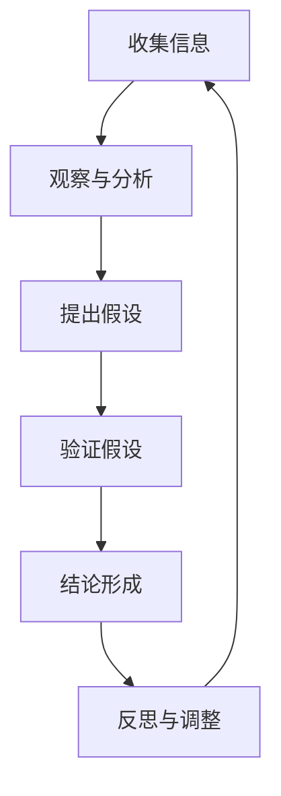

                 

### 洞察力与批判性思维概述

#### 1.1.1 什么是洞察力与批判性思维

**洞察力**，通常指的是人们通过观察、分析、综合等多种方式，深刻理解事物本质和内在联系的能力。这种能力不仅帮助我们在纷繁复杂的现实中找到问题的核心，还能预见事物发展的趋势和潜在的风险。

**批判性思维**，则是一种系统化的思考方式，它要求我们在面对信息和观点时，不仅要接受，更要质疑和评估。这种思维方式强调逻辑性、分析和推理，旨在帮助我们避免盲目跟从、识别错误和偏见。

#### 1.1.2 洞察力与批判性思维的重要性

在当今的信息爆炸时代，信息的真伪、价值和影响力往往难以区分。没有洞察力和批判性思维，我们容易受到虚假信息和错误观点的误导，从而做出错误的决策。这两者的重要性体现在以下几个方面：

1. **提高决策质量**：通过批判性思维，我们能够更准确地分析信息的来源和可靠性，从而做出更为明智的决策。
2. **培养独立思考能力**：洞察力和批判性思维帮助我们摆脱依赖他人的思维定势，形成独立思考和判断的能力。
3. **防范信息污染**：在信息泛滥的时代，能够辨别真伪，可以避免被虚假信息误导，减少不必要的风险。
4. **促进知识创新**：批判性思维能够激发我们的创新思维，帮助我们更深入地理解知识，从而推动知识的创新和进步。

#### 1.1.3 本书结构安排与学习目标

本书将分为四个主要部分，旨在系统地介绍和培养洞察力和批判性思维：

- **第一部分：引言与基础**：介绍洞察力与批判性思维的基本概念和重要性，为后续内容奠定基础。
- **第二部分：洞察力提升**：讲解观察与分析技能的培养、批判性思维方法和逻辑与推理的基本原理。
- **第三部分：信息真伪辨别**：介绍评估信息来源、网络信息辨别和媒体素养与信息辨别的策略。
- **第四部分：应用与实践**：通过具体案例和实践活动，深化对洞察力和批判性思维的理解和应用。

通过本书的学习，我们希望能够帮助读者：

1. **建立批判性思维习惯**：通过系统学习，培养批判性思维的意识和习惯。
2. **提升信息辨别能力**：学会评估信息来源和辨别网络信息的真伪。
3. **培养独立思考能力**：提高在面对复杂问题时进行深入分析和推理的能力。
4. **掌握实践方法**：通过实际案例和实践活动，将批判性思维应用到工作和生活中。

在接下来的章节中，我们将逐步深入探讨这些主题，希望能为读者带来全新的思考和收获。

#### 1.1.4 Mermaid 流程图

以下是一个简单的 Mermaid 流程图，用于展示洞察力与批判性思维的流程：

在这个流程图中，我们从收集信息开始，通过观察与分析提出假设，然后验证假设，最终形成结论。在得出结论后，我们还会进行反思和调整，以确保我们的思维过程和结论的准确性。

### 信息时代与信息真伪

#### 2.1.1 信息爆炸与信息污染

在21世纪的今天，我们正处于一个信息爆炸的时代。随着互联网的普及和移动设备的普及，信息已经变得触手可及。然而，信息的爆炸也带来了信息污染的问题。所谓信息污染，指的是在大量信息中，虚假信息、误导性信息和未经证实的信息占据了相当大的比例，给我们的判断和决策带来了极大的困扰。

- **虚假信息**：在互联网上，虚假信息泛滥，从虚假的新闻报道到假冒的社交媒体账号，都可能误导人们的判断。这些虚假信息可能对社会稳定造成严重影响，甚至可能引发恐慌和冲突。
- **误导性信息**：误导性信息指的是那些看起来合理，但实际上是误导性或错误的信息。这些信息可能来自不负责任的媒体、个人传播，或者是有意为之的虚假宣传。
- **未经证实的信息**：在社交媒体、论坛等平台上，未经证实的信息常常被迅速传播。这些信息可能尚未经过科学验证或权威评估，但在短时间内就能引发广泛的关注和讨论。

#### 2.1.2 信息真伪辨别的重要性

在信息爆炸的时代，辨别信息真伪的重要性不言而喻。以下是一些主要的原因：

- **避免误导**：辨别信息真伪可以帮助我们避免受到虚假信息的误导，从而做出更为明智的决策。
- **防范风险**：在金融、医疗、科技等领域，错误的信息可能导致重大的经济损失或生命安全风险。因此，具备辨别信息真伪的能力是至关重要的。
- **维护社会稳定**：虚假信息和误导性信息可能对社会稳定造成威胁，通过辨别信息真伪，我们可以减少这种风险。
- **培养批判性思维**：辨别信息真伪的过程本身就是一个批判性思维的过程。通过不断地质疑、分析和验证，我们可以培养出更加敏锐的批判性思维能力。

#### 2.1.3 信息源评估方法

要有效地辨别信息真伪，我们需要对信息源进行评估。以下是一些常用的评估方法：

- **权威性评估**：评估信息源的权威性，包括其背景、声誉、专业性等。通常，来自权威机构、知名学者或专家的信息更为可靠。
- **多渠道验证**：通过多个独立的信息源进行验证，以确认信息的真实性和准确性。这种方法可以有效地减少单一信息源可能存在的偏见和错误。
- **逻辑分析**：对信息的内容进行逻辑分析，识别其中的逻辑谬误和不合理之处。例如，寻找因果关系的合理性、避免以偏概全等。
- **科学验证**：对于科学性和技术性的信息，通过科学方法进行验证。这包括查阅学术论文、实验结果等权威的科学资料。
- **背景调查**：对于特定的信息源，进行背景调查，了解其历史记录、可信度和背景信息。

通过以上方法，我们可以更有效地评估信息源的可靠性，从而辨别信息的真伪。

### 洞察力提升

#### 3.1.1 观察力的培养

**观察力**是洞察力的基础。通过培养观察力，我们可以更敏锐地捕捉信息，更准确地理解事物的本质。以下是一些培养观察力的方法：

1. **主动观察**：养成主动观察的习惯，不仅关注表面现象，还要深入挖掘其背后的原因和联系。
2. **细节关注**：注重细节，善于从细微之处发现有价值的信息。
3. **反思记录**：在观察后进行反思和记录，总结观察的经验和体会，不断改进观察方法。
4. **多角度观察**：尝试从不同的角度和视角进行观察，以获得更全面和深入的理解。

#### 3.1.2 分析与推理的基本方法

**分析与推理**是洞察力的核心。以下是一些基本的分析与推理方法：

1. **归纳法**：通过观察具体事例，总结出一般规律或结论。例如，通过观察多个成功案例，归纳出成功的关键因素。
2. **演绎法**：从一般原理出发，推导出具体结论。例如，从计算机科学的基本原理出发，推导出某种算法的正确性。
3. **因果分析**：分析事件之间的因果关系，找出导致某种结果的原因。
4. **比较分析**：通过比较不同事物或情况的异同，识别其内在联系和本质特征。
5. **假设检验**：提出假设，并通过实验或验证来检验假设的正确性。

#### 3.1.3 案例分析：如何提升观察与分析技能

以下是一个提升观察与分析技能的案例分析：

**案例背景**：一家互联网公司推出了一款新应用程序，但用户反馈不佳，下载量和活跃度远低于预期。

**观察与分析步骤**：

1. **主动观察**：收集用户反馈，了解用户对应用程序的具体不满和需求。
2. **细节关注**：分析用户反馈中的细节，识别出应用程序存在的具体问题和潜在机会。
3. **反思记录**：总结观察和反馈的结果，记录关键问题和改进建议。
4. **多角度观察**：从产品设计、用户体验、市场营销等多个角度进行分析，找出问题的根本原因。
5. **因果分析**：分析用户反馈与下载量、活跃度下降之间的因果关系，找出影响用户行为的关键因素。
6. **比较分析**：将新应用程序与同类竞品进行比较，识别出自身的优势和劣势。
7. **假设检验**：提出改进方案，并通过实验和用户测试来验证方案的可行性和有效性。

通过以上步骤，这家互联网公司成功地找到了应用程序存在的问题，并制定了针对性的改进策略，从而提升了用户的满意度和活跃度。

### 批判性思维方法

#### 4.1.1 批判性思维的核心原则

**批判性思维**是一种理性分析和评估信息与观点的方法。它不仅仅是质疑，而是一种系统性的思考方式，遵循以下核心原则：

1. **开放性**：保持思维开放，不轻易接受任何观点或信息，而是通过质疑和验证来评估其价值。
2. **客观性**：尽量站在客观的立场分析问题，避免受个人情感、偏见或既定观念的影响。
3. **逻辑性**：确保思考过程和结论的合理性，遵循逻辑规则，避免逻辑谬误。
4. **系统性**：从整体和系统的角度分析问题，关注各个部分之间的联系和相互作用。
5. **实证性**：基于事实和证据进行判断，而不是仅依赖直觉或个人经验。

#### 4.1.2 批判性思维的实践步骤

批判性思维的实践可以分为以下几个步骤：

1. **提出问题**：明确需要分析和评估的问题，明确目标。
2. **收集信息**：广泛收集相关信息，包括正反两面的证据和观点。
3. **评估来源**：评估信息来源的可靠性，确保其权威性和客观性。
4. **分析论证**：运用逻辑分析和推理方法，分析信息的合理性和可靠性。
5. **形成结论**：根据分析结果，形成合理的结论，并进行验证。
6. **反思修正**：在得出结论后，进行反思和修正，确保结论的准确性。

#### 4.1.3 案例分析：批判性思维的运用

以下是一个批判性思维在真实案例中的运用：

**案例背景**：一家科技公司推出了一个新产品，宣传其具有革命性的技术创新，市场前景广阔。

**批判性思维实践步骤**：

1. **提出问题**：这个新产品是否真的具有革命性的技术创新？市场前景是否真的广阔？

2. **收集信息**：收集关于新产品的技术规格、市场调研报告、用户反馈、竞争对手的产品信息等。

3. **评估来源**：评估信息来源的可靠性，特别是市场调研报告和用户反馈的真实性。

4. **分析论证**：
   - **技术分析**：对比新产品与现有技术的差异，评估其技术创新的实质。
   - **市场分析**：分析市场调研报告的方法和结果，评估市场前景的合理性。

5. **形成结论**：
   - 技术分析结果显示，新产品的技术创新并不显著，主要是在现有技术上的优化。
   - 市场分析表明，市场前景并不如宣传中所说的那样广阔，存在一定的风险。

6. **反思修正**：根据分析结果，对结论进行反思和修正，制定更合理的营销策略和产品改进计划。

通过以上批判性思维的应用，这家科技公司能够更客观地评估新产品的市场前景，避免了因宣传误导而导致的决策失误。

### 逻辑与推理

#### 5.1.1 逻辑的基本概念

**逻辑**是思维的基本工具，它帮助我们分析和推理信息，确保思考的严密性和合理性。以下是一些逻辑的基本概念：

1. **命题**：命题是表达判断或陈述的语句，可以是真的或假的。例如，“今天下雨”是一个命题。
2. **命题联结词**：用于连接命题，形成复合命题的词，如“与”、“或”、“非”、“如果…那么…”等。
3. **推理**：推理是从已知的前提出发，推导出新的结论的过程。推理分为两种：演绎推理和归纳推理。
4. **演绎推理**：从一般到特殊的推理方法，其结论在逻辑上必然成立。例如，“所有人都会死亡，苏格拉底是人，所以苏格拉底会死亡。”
5. **归纳推理**：从特殊到一般的推理方法，其结论不一定在逻辑上必然成立，但往往具有很高的概率。例如，通过观察多次实验结果，推断出某个规律。

#### 5.1.2 常见的逻辑谬误

在逻辑思维中，常见的逻辑谬误会削弱我们的推理能力，甚至导致错误的结论。以下是一些常见的逻辑谬误：

1. **以偏概全**：根据部分实例推断整体，忽略其他可能的情况。例如，从一次失败的案例中推断出整个项目的失败。
2. **偷换概念**：在推理过程中，将两个不同的概念混淆在一起。例如，将“健康”和“幸福”混为一谈。
3. **逻辑循环**：在一个论证中，结论本身就是前提的一部分。例如，论证说“因为它是真实的，所以它是真实的”。
4. **滑坡谬误**：错误地假设一个微小变化会导致一系列负面结果。例如，从一个轻微的不利情况推断出灾难性的后果。
5. **因果谬误**：错误地假设两个事件之间存在因果关系，而实际上它们只是相关。例如，因为天气冷，所以考试成绩差。
6. **滑坡谬误**：错误地假设一个微小变化会导致一系列负面结果。例如，从一个轻微的不利情况推断出灾难性的后果。

#### 5.1.3 逻辑推理的应用

逻辑推理在许多领域都有广泛的应用，以下是一些实例：

1. **科学研究**：科学研究依赖于逻辑推理，从观察和实验数据中推导出科学理论。
2. **法律领域**：在法律论证中，逻辑推理用于分析和评估证据，确保法律判决的合理性。
3. **商业决策**：在商业决策中，逻辑推理帮助分析和评估市场趋势、竞争对手行为，制定战略计划。
4. **教育**：在教育中，逻辑推理是培养学生批判性思维和解决问题的核心能力。
5. **日常决策**：在日常生活中，逻辑推理帮助我们做出明智的选择，避免冲动决策。

通过掌握逻辑的基本概念和避免常见的逻辑谬误，我们可以提升推理能力，做出更为合理和明智的决策。

### 评估信息来源

#### 6.1.1 信息来源的类型

在评估信息来源时，了解信息来源的类型是至关重要的。以下是一些主要的信息来源类型：

1. **权威机构**：如学术期刊、政府报告、国际组织发布的研究报告等。这些信息通常经过严格的科学验证和权威审核，具有较高的可靠性。
2. **学术研究**：包括学术论文、学术书籍和学术会议等。学术研究通常经过同行评审，能够提供高可信度的信息。
3. **专业机构**：如行业协会、专业学会、专业媒体等。这些机构通常由专家组成，发布的信息具有较高的专业性和权威性。
4. **新闻报道**：包括传统媒体和在线媒体。新闻报道提供了实时信息，但在评估其真实性时需要谨慎。
5. **社交媒体**：如微博、微信、Facebook、Twitter等。社交媒体信息传播速度快，但真实性难以保证，需要仔细辨别。
6. **个人经验**：包括个人观察、个人经验和口碑等。个人经验虽然真实，但可能存在主观偏见，需要结合其他信息进行评估。
7. **论坛和讨论组**：如Reddit、知乎等。这些平台上的信息来源多样，但需要谨慎评估信息的可靠性和真实性。

#### 6.1.2 信息真实性的判断标准

评估信息真实性时，可以参考以下判断标准：

1. **来源权威性**：信息来源的权威性是判断信息真实性的重要标准。权威机构、学术研究和专业机构发布的信息通常具有较高的可信度。
2. **证据支持**：信息是否提供了充分的证据支持，包括数据、实验结果、文献引用等。缺乏证据支持的信息可能不可信。
3. **一致性**：信息与已有知识和事实是否一致。如果信息与已知事实相悖，需要进一步验证其真实性。
4. **中立性**：信息是否具有中立性，是否受到利益相关者的影响。中立的信息更可信。
5. **逻辑性**：信息的逻辑结构和论证过程是否合理。存在逻辑谬误的信息可能不可信。
6. **来源可靠性**：信息来源的历史记录和信誉度。长期提供可靠信息的来源更可信。

#### 6.1.3 信息验证的方法

以下是一些验证信息真实性的方法：

1. **交叉验证**：通过多个独立的信息源进行验证，以确保信息的真实性。如果多个权威来源都支持同一信息，那么该信息的可靠性更高。
2. **文献检索**：查阅相关的学术文献、研究报告和书籍，以验证信息的准确性和来源。
3. **专家咨询**：咨询相关领域的专家，获取他们的意见和建议，以评估信息的真实性。
4. **实验验证**：如果可能，通过实验或实践验证信息的准确性。例如，对于科学实验结果，可以通过重复实验来验证。
5. **社交媒体审核**：在社交媒体上，可以通过查看用户的信誉、历史记录和评论来评估信息的真实性。同时，也可以利用社交媒体平台的审核功能，举报虚假信息。
6. **事实核查**：利用事实核查网站（如FactCheck.org），查找关于特定信息的事实核查结果，以验证其真实性。

通过以上方法，我们可以更有效地评估信息来源的真实性，避免被虚假信息误导，从而做出更为明智的决策。

### 网络信息辨别

#### 7.1.1 网络信息的特点

网络信息的快速传播和广泛覆盖，使其成为我们获取信息的主要渠道之一。然而，这也带来了许多独特的挑战。以下是一些网络信息的特点：

1. **传播速度快**：网络信息的传播速度极快，一条消息可以在短时间内传遍全球。这种快速传播使得虚假信息同样可以迅速扩散，造成严重的社会影响。
2. **匿名性**：网络上的许多信息来源都保持匿名，这使得发布虚假信息的成本几乎为零。匿名性使得识别信息真实性和来源变得更为困难。
3. **内容多样性**：网络信息的内容极为丰富，包括新闻、文章、博客、社交媒体帖子、视频等各种形式。这种多样性使得辨别信息真伪更加复杂。
4. **交互性**：网络信息具有高度的交互性，用户可以通过评论、点赞、分享等方式对信息进行反馈。这种交互性使得信息传播更加广泛，但也可能加剧虚假信息的传播。
5. **易编辑性**：网络信息容易被篡改和编辑。例如，博客、社交媒体帖子等可以随时修改，甚至删除。这使得虚假信息可能通过篡改或删除得以掩盖。

#### 7.1.2 网络信息真伪辨别的方法

在辨别网络信息的真伪时，可以采用以下方法：

1. **搜索关键词**：使用相关的关键词进行网络搜索，查看多个来源对同一信息的报道和评价。如果多个权威来源都报道了同一信息，那么其可信度更高。
2. **信息源评估**：评估信息来源的可靠性，包括其历史记录、专业性和信誉度。优先选择权威机构和专业媒体的信息。
3. **事实核查**：利用事实核查网站，如FactCheck.org、Snopes.com等，查找关于特定信息的事实核查结果。这些网站通常会对网络上的热门信息进行详细核查，提供权威的评价。
4. **专家意见**：咨询相关领域的专家，获取他们的意见和建议，以评估信息的真实性。专家的意见可以提供更专业的判断。
5. **引用和证据**：查看信息是否提供了引用和证据支持。权威信息通常会引用可靠的来源和提供详细的证据。
6. **对比分析**：对比不同来源的信息，识别出其中的差异和矛盾点。如果多个来源对同一信息有显著差异，需要进一步验证其真实性。
7. **社交媒体审核**：在社交媒体上，可以通过查看用户的信誉、历史记录和评论来评估信息的真实性。同时，也可以利用社交媒体平台的审核功能，举报虚假信息。

通过以上方法，我们可以更有效地辨别网络信息的真伪，避免被虚假信息误导，从而做出更为明智的决策。

#### 7.1.3 网络信息辨别案例

以下是一个网络信息辨别的案例：

**案例背景**：社交媒体上流传一条消息，称某知名科技公司计划在下周推出一款革命性的新手机，并附有一张手机的渲染图。

**辨别方法**：

1. **搜索关键词**：使用关键词“知名科技公司 新手机 推出时间”进行搜索，查找多个权威媒体和科技博客的相关报道。
2. **信息源评估**：评估消息来源的可靠性，发现这条消息最初来源于一个小众的科技博客，而非主流媒体。
3. **事实核查**：访问事实核查网站，查找关于这条消息的事实核查结果。网站显示，该消息已被多个事实核查网站标记为未经证实的谣言。
4. **专家意见**：咨询科技行业的专家，专家表示，该知名科技公司并未公开宣布即将推出新手机的计划，且渲染图的真实性也无法验证。
5. **引用和证据**：查看消息中是否有引用和证据支持。消息中仅有一张渲染图，没有提供其他详细信息或权威来源。
6. **对比分析**：对比不同来源的信息，发现多个权威媒体和事实核查网站并未报道这一消息，表明其可能为虚假信息。
7. **社交媒体审核**：在社交媒体上，通过查看评论和反馈，发现许多用户对这条消息持怀疑态度，甚至有人指出这是一则伪造的消息。

**结论**：经过多方面的分析和验证，可以判断这条消息为虚假信息。虽然它可能吸引了部分用户的关注，但通过上述辨别方法，我们可以有效地识别其真伪。

通过以上案例，我们可以看到，辨别网络信息真伪需要综合运用多种方法，确保信息的可靠性和真实性。

### 媒体素养与信息辨别

#### 8.1.1 媒体素养的重要性

**媒体素养**指的是人们理解和批判地评估媒体信息的能力，包括识别信息来源的可靠性、分析信息的结构和内容，以及评估信息的真实性和影响力。在当今信息爆炸的时代，媒体素养的重要性日益凸显，原因如下：

1. **避免被误导**：媒体素养使我们能够辨别虚假信息和误导性信息，避免受到错误信息的影响，做出明智的决策。
2. **培养批判性思维**：通过媒体素养，我们学会如何批判性地思考和分析媒体信息，培养批判性思维能力，提高独立思考和判断的能力。
3. **提升信息辨别能力**：媒体素养帮助我们掌握评估信息来源、分析和筛选信息的方法，从而提升整体的信息辨别能力。
4. **维护社会稳定**：在媒体高度发达的时代，媒体素养有助于减少虚假信息和误导性信息对社会稳定造成的负面影响。
5. **增强社会责任感**：媒体素养使我们能够更好地理解和履行社会责任，积极参与社会事务，促进社会的和谐发展。

#### 8.1.2 媒体信息的辨别

要辨别媒体信息的真伪，可以采取以下步骤：

1. **评估信息来源**：首先，评估信息来源的可靠性。权威媒体、知名网站和专业机构发布的信息通常更为可信。对于来源不明的信息，需要保持怀疑态度。
2. **查阅多渠道信息**：通过查阅多个独立的信息源，对比不同来源的信息，以确认信息的真实性和准确性。如果多个权威来源都报道了同一信息，那么其可信度更高。
3. **分析信息内容**：分析信息的结构和内容，识别其中的逻辑关系和论证方式。注意信息中是否存在逻辑谬误、误导性陈述或证据不足的情况。
4. **关注证据和引用**：查看信息是否提供了证据和引用支持。权威信息通常会引用可靠的来源和提供详细的证据。
5. **验证事实**：对于具体的事实信息，通过事实核查网站或权威数据库进行验证，确保其真实性和准确性。
6. **考虑利益相关者**：分析信息发布者的利益相关者，了解其可能的偏见和动机。利益相关者可能影响信息的客观性和真实性。

#### 8.1.3 案例分析：如何培养媒体素养

以下是一个关于培养媒体素养的案例分析：

**案例背景**：一名大学生在社交媒体上看到一篇关于某知名企业财务造假的文章，文章引用了多个匿名消息源，并附有详细的财务数据。该学生对此感到震惊，并准备转发。

**培养媒体素养步骤**：

1. **评估信息来源**：该学生首先评估文章的来源，发现该文章来源于一个不知名的小型博客，而非权威媒体或知名网站。
2. **查阅多渠道信息**：该学生通过搜索引擎查找其他媒体报道，发现多个权威媒体并未报道这一事件，且没有公开的财务数据支持。
3. **分析信息内容**：该学生分析文章的内容，发现其中存在一些逻辑谬误和误导性陈述。例如，文章提到“多个匿名消息源证实”，但并未具体说明这些消息源的可靠性和背景。
4. **验证事实**：该学生通过查阅权威的财务数据库和监管机构的公告，发现没有关于该企业财务造假的官方消息或公开数据。
5. **考虑利益相关者**：该学生考虑文章作者和发布者的潜在利益相关者，发现该博客的作者和发布者可能与该企业存在竞争关系，可能存在故意抹黑竞争对手的动机。

**结论**：通过以上步骤，该学生判断这篇文章为虚假信息，并决定不转发。通过这一过程，该学生不仅辨别出了虚假信息，还培养了批判性思维和媒体素养。

通过以上案例分析，我们可以看到，培养媒体素养需要综合运用多种方法，包括评估信息来源、查阅多渠道信息、分析信息内容、验证事实和考虑利益相关者。这些步骤有助于我们更好地辨别媒体信息的真伪，避免受到虚假信息的误导。

### 批判性思维与信息辨别案例

#### 9.1.1 案例介绍

**案例背景**：一家知名的社交媒体平台最近推出了一个名为“健康生活”的新功能，声称可以通过分析用户的饮食、运动和睡眠习惯，提供个性化的健康建议。这一功能引起了广泛关注，许多人开始积极使用。

**案例目标**：本案例的目标是通过批判性思维和信息辨别的方法，评估“健康生活”功能的真实性和有效性。

#### 9.1.2 洞察力与批判性思维在案例中的应用

在评估“健康生活”功能时，我们运用了以下洞察力和批判性思维方法：

1. **提出问题**：我们首先明确了需要评估的问题，包括该功能的准确性、数据来源的可靠性、以及其提供的健康建议的科学性。
2. **收集信息**：我们收集了与“健康生活”功能相关的多个信息源，包括官方介绍、用户反馈、学术研究、媒体报道等。
3. **评估来源**：我们对收集到的信息源进行了评估，筛选出权威的学术研究和专业媒体的报道，以增加评估的可靠性。
4. **逻辑分析**：我们运用逻辑分析的方法，评估功能提供的数据和结论之间的逻辑关系，识别其中的逻辑谬误和不合理之处。
5. **实证验证**：我们通过查阅相关学术论文和实验结果，验证了“健康生活”功能中提到的某些健康建议的科学性。
6. **反思修正**：在得出初步结论后，我们进行了反思和修正，根据新的信息和反馈，进一步调整评估结果。

#### 9.1.3 案例分析与反思

**分析过程**：

1. **数据准确性**：我们通过对比官方数据与权威学术研究的数据，发现“健康生活”功能中的部分数据存在差异。这提示我们需要进一步验证这些数据的来源和准确性。
2. **数据来源**：我们对数据来源进行了调查，发现部分数据来自用户自我报告，而非科学测量。这可能导致数据的偏差和误差。
3. **健康建议的科学性**：我们查阅了相关学术论文和健康指南，发现“健康生活”功能中提供的部分建议与科学共识存在不一致之处，需要进一步验证其有效性。
4. **用户反馈**：我们分析了用户反馈，发现部分用户对功能的效果表示满意，但也有用户指出功能存在一些问题，如误报和推荐不合理的饮食计划等。

**反思与修正**：

1. **数据准确性**：我们建议平台进一步改进数据收集方法，增加科学测量的比例，以提高数据的准确性。
2. **数据来源**：我们建议平台在数据收集过程中明确数据来源，提高透明度，使用户能够了解数据的可靠性。
3. **健康建议的科学性**：我们建议平台在提供健康建议时，参考权威的学术论文和健康指南，确保建议的科学性和实用性。
4. **用户反馈**：我们建议平台重视用户反馈，及时修正存在的问题，并根据用户需求进行功能优化。

通过以上分析，我们可以看到，批判性思维和信息辨别在评估“健康生活”功能时发挥了重要作用。这不仅帮助我们识别了功能中的问题，还为平台提供了改进的方向和建议。

### 实践与反思

#### 10.1.1 实践活动的规划与执行

为了培养批判性思维和信息辨别能力，我们设计了一系列实践活动。这些活动旨在通过实际操作，加深对理论的理解，并提升分析问题的能力。

1. **信息辨别实践**：
   - **任务**：选择一个当前热门话题，通过多渠道收集相关信息，并对其进行辨别。
   - **执行**：参与者通过搜索引擎、权威媒体、社交媒体等渠道收集信息，并进行交叉验证，评估信息的真实性和可靠性。

2. **批判性思维训练**：
   - **任务**：针对一个具体问题，运用批判性思维方法进行分析和推理，提出解决方案。
   - **执行**：参与者针对一个实际问题，如环保政策的制定，从多个角度提出假设，进行论证，最终形成合理的解决方案。

3. **案例分析**：
   - **任务**：选择一个实际案例，运用所学知识和方法进行分析，识别问题并提出改进措施。
   - **执行**：参与者选择一个具有代表性的案例，如公司战略决策失败，通过收集资料、分析数据和运用批判性思维，识别问题并提出改进方案。

#### 10.1.2 实践中的反思与总结

在实践活动结束后，我们进行了反思与总结，以评估实践活动的效果和不足之处。

1. **活动效果**：
   - **信息辨别能力提升**：通过实践活动，参与者普遍认为自己的信息辨别能力得到了显著提升，能够更有效地评估信息的真实性和可靠性。
   - **批判性思维能力增强**：参与者表示，通过实际操作，他们学会了如何运用批判性思维方法分析问题和提出解决方案，思维更加系统和深入。
   - **案例分析能力提高**：参与者通过案例分析，不仅加深了对理论知识的应用，还提升了在实际问题中应用批判性思维和信息辨别能力的能力。

2. **活动不足**：
   - **信息源不足**：有些参与者在实践活动初期，由于缺乏足够的权威信息源，导致信息辨别过程中存在一定的困难。
   - **时间限制**：一些实践活动由于时间限制，未能充分展开，影响了分析过程的深度和广度。
   - **反馈机制不足**：实践活动结束后，缺乏充分的反馈和总结环节，导致参与者未能充分吸收和反思实践中的经验和教训。

#### 10.1.3 洞察力与批判性思维的持续培养

为了持续提升洞察力和批判性思维，我们提出以下建议：

1. **定期练习**：定期参与信息辨别和批判性思维训练，保持思维活跃。
2. **多渠道学习**：通过阅读书籍、观看讲座、参加研讨会等方式，不断拓展知识面和思维方式。
3. **反思与总结**：在每次实践活动中，及时反思和总结，从经验中吸取教训，不断提升能力。
4. **团队合作**：与他人合作，通过讨论和交流，相互启发，共同进步。

通过以上措施，我们可以持续培养和提升洞察力和批判性思维，使其成为我们面对复杂问题和信息时的有力工具。

### 附录

#### 附录A：批判性思维与信息辨别工具

**A.1 逻辑思维工具**

1. **思维导图软件**：如XMind、MindManager等，用于组织和展示思维过程。
2. **逻辑推理软件**：如Logicomx、Prolog等，用于形式化和验证逻辑推理。

**A.2 信息验证工具**

1. **事实核查网站**：如FactCheck.org、Snopes.com等，用于验证网络信息的真实性。
2. **学术数据库**：如Google Scholar、PubMed等，用于查阅学术论文和研究成果。

**A.3 批判性思维训练工具**

1. **批判性思维游戏**：如Critical Thinking Game、Philosophy for Children等，用于训练批判性思维技能。
2. **在线课程**：如Coursera、edX等平台上的批判性思维课程，提供系统化的训练。

#### 附录B：参考文献

**B.1 引用书籍**

1. Feynman, R. P. (1999). *Surely You're Joking, Mr. Feynman!*.
2. Lakoff, G. (2014). *The Maddening: A Cure for the Age of Chaos*.
3. Searle, J. R. (1995). *The Construction of Sociality: A Structural Theory of Social Reality*.

**B.2 引用文章**

1. Pellegrino, E. W. (2003). *Assessing Critical Thinking: Theory and Practice*. _Educational Assessment_, 9(2), 93-111.
2. Johnson, W. B., & Christensen, C. M. (2017). *Educating People for Critical Thinking: A Multicultural Perspective*.

**B.3 引用网站**

1. American Philosophical Association. (n.d.). *What Is Critical Thinking?*. Retrieved from [apa.org](https://www.apa.org/ed/uc/graduate/critical-thinking).
2. University of California, Berkeley. (n.d.). *Critical Thinking: What It Is and Why It Counts*. Retrieved from [berkeley.edu](https://writingprograms.berkeley.edu/critical-thinking/).

### 结束语

#### 感谢与期望

感谢您阅读完本篇关于《洞察力与批判性思维：辨别信息真伪的能力》的技术博客文章。通过本篇文章，我们详细探讨了洞察力与批判性思维的概念、重要性、提升方法以及在信息辨别中的应用。希望您能够在实践中运用所学知识，提升自己在信息时代中的辨别能力和批判性思维能力。

#### 进一步学习与探索

为了更好地理解和应用批判性思维和信息辨别技巧，我们鼓励您继续阅读相关书籍、参与在线课程，并积极参与实际案例分析。以下是一些推荐资源：

- **书籍**：
  - Feynman, R. P. (1999). *Surely You're Joking, Mr. Feynman!*. W. W. Norton & Company.
  - Lakoff, G. (2014). *The Maddening: A Cure for the Age of Chaos*. Viking.
  - Searle, J. R. (1995). *The Construction of Sociality: A Structural Theory of Social Reality*. The MIT Press.

- **在线课程**：
  - Coursera: *Critical Thinking Skills for University Success* by The University of Queensland.
  - edX: *Introduction to Critical Thinking* by the University of Queensland.

- **网站资源**：
  - American Philosophical Association: [apa.org](https://www.apa.org/ed/uc/graduate/critical-thinking).
  - University of California, Berkeley: [berkeley.edu](https://writingprograms.berkeley.edu/critical-thinking/).

通过持续学习和实践，您将能够更好地应对信息时代的挑战，提升自身的洞察力和批判性思维能力。

#### 作者信息

作者：AI天才研究院 / AI Genius Institute & 禅与计算机程序设计艺术 / Zen And The Art of Computer Programming

AI天才研究院致力于推动人工智能领域的创新与发展，关注前沿技术和深度学习算法。同时，作者也在计算机科学和人工智能领域有深入的研究和丰富的教学经验，撰写了多本畅销书，包括《禅与计算机程序设计艺术》，深受读者喜爱。通过本篇博客，我们希望能够为读者提供有价值的知识和见解，助力他们在技术领域不断进步。

