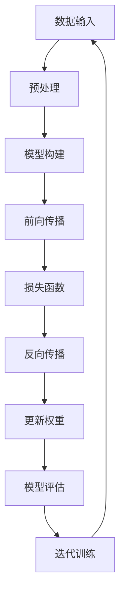

                 

# 《流行的深度学习框架 PyTorch与JAX》

> **关键词**：深度学习框架、PyTorch、JAX、神经网络、性能优化、应用案例

> **摘要**：本文将深入探讨深度学习领域中的两大流行框架——PyTorch与JAX。首先，我们将回顾深度学习的兴起与发展，以及深度学习框架的重要性。随后，我们将分别介绍PyTorch与JAX框架，对比它们的核心特点与适用场景。接下来，我们将详细讲解神经网络基础理论，并逐步介绍如何在PyTorch与JAX框架中实现神经网络。最后，我们将通过实际案例展示两个框架在图像识别与自然语言处理方面的应用，并探讨深度学习框架的未来发展趋势。

---

## 第一部分：深度学习框架概述

### 第1章：深度学习框架引论

#### 1.1 深度学习的兴起与发展

深度学习作为人工智能的核心技术之一，其发展历程可以追溯到20世纪80年代。当时，随着计算机硬件性能的提升和大数据的积累，神经网络研究得到了广泛关注。然而，受限于计算能力和数据量，早期深度学习的研究进展相对缓慢。

直到2012年，AlexNet在ImageNet大赛中取得了显著的成绩，深度学习开始崭露头角。此后，随着卷积神经网络（CNN）的提出和改进，深度学习在计算机视觉、自然语言处理等领域取得了突破性的进展。如今，深度学习已经渗透到各行各业，成为人工智能发展的关键技术。

#### 1.2 深度学习框架的重要性

深度学习框架是深度学习研究和应用的重要工具。一个优秀的深度学习框架应具备以下特点：

- **易用性**：提供简洁明了的API，降低开发门槛，使研究人员和开发者能够快速上手。
- **灵活性**：支持多种神经网络结构，适应不同的应用场景。
- **高效性**：利用GPU等硬件资源，加速模型训练和推理。
- **开源与社区**：积极开源，拥有庞大的社区支持，不断优化和完善。

#### 1.3 PyTorch与JAX框架介绍

PyTorch和JAX是当前深度学习领域中的两大流行框架。它们各自具有独特的特点，适用于不同的应用场景。

- **PyTorch**：由Facebook AI研究院（FAIR）开发，具有简洁易懂的API，支持动态计算图和静态计算图，适用于研究、开发和应用多个领域。
- **JAX**：由Google开发，基于自动微分库Autograd，提供高效的数值计算和自动微分功能，适用于科学计算、机器学习等领域。

#### 1.4 深度学习框架的选择与比较

在选择深度学习框架时，需要考虑以下因素：

- **应用场景**：不同框架适用于不同的应用场景，如图像识别、自然语言处理等。
- **开发经验**：选择自己熟悉的框架，能够提高开发效率。
- **性能需求**：根据模型的复杂度和数据规模，选择适合的框架以实现高效的训练和推理。
- **社区支持**：考虑框架的社区活跃度，以便在遇到问题时能够得到帮助。

### 第2章：深度学习基础理论

#### 2.1 神经网络基础

神经网络是深度学习的基础，其结构类似于人脑的神经元连接。神经网络由输入层、隐藏层和输出层组成，每个神经元都与相邻的神经元相连，通过加权连接实现信息传递。

#### 2.2 激活函数与反向传播算法

激活函数用于引入非线性特性，使神经网络能够拟合复杂的函数。常见的激活函数包括Sigmoid、ReLU、Tanh等。反向传播算法是神经网络训练的核心算法，通过不断调整权重和偏置，使模型对训练数据的拟合度不断提高。

#### 2.3 损失函数与优化算法

损失函数用于衡量模型预测结果与真实标签之间的差距，常用的损失函数包括均方误差（MSE）、交叉熵等。优化算法用于调整模型的权重和偏置，以最小化损失函数。常见的优化算法有梯度下降、Adam等。

#### 2.4 卷积神经网络（CNN）基础

卷积神经网络是深度学习在计算机视觉领域的重要应用。CNN通过卷积层、池化层和全连接层的组合，实现对图像的逐层抽象，提取出具有代表性的特征。

---

接下来，我们将分别介绍PyTorch和JAX框架的详细内容，以及它们在深度学习应用中的案例和实践。

---

## 第二部分：深度学习框架详解

### 第3章：PyTorch框架详解

#### 3.1 PyTorch安装与配置

在开始使用PyTorch之前，需要先进行安装和配置。以下是PyTorch的安装步骤：

1. **安装Python环境**：确保已安装Python 3.6或更高版本。
2. **安装PyTorch**：使用pip命令安装PyTorch，命令如下：
   ```bash
   pip install torch torchvision torchaudio
   ```
3. **验证安装**：运行以下Python代码，验证PyTorch是否已成功安装：
   ```python
   import torch
   print(torch.__version__)
   ```

#### 3.2 PyTorch核心API介绍

PyTorch提供了丰富的API，涵盖数据加载、模型构建、训练和推理等各个环节。以下是PyTorch的核心API介绍：

- **Tensor**：表示多维数组，是PyTorch的基础数据结构。
- **autograd**：提供自动微分功能，实现自定义的梯度计算。
- **nn**：提供神经网络的相关模块，包括层、损失函数和优化器等。
- **torchvision**：提供常用的数据集和预处理工具。
- **torchtext**：提供自然语言处理相关的工具和模块。

#### 3.3 数据加载与预处理

在深度学习中，数据加载与预处理至关重要。PyTorch提供了torchvision和数据集库，支持多种常见数据集的加载和预处理。以下是数据加载与预处理的基本步骤：

1. **加载数据集**：使用torchvision.datasets或torch.utils.data.Dataset自定义数据集加载器。
2. **数据预处理**：对数据进行标准化、归一化、数据增强等操作。
3. **数据加载器**：使用torch.utils.data.DataLoader实现批量数据加载和迭代。

#### 3.4 神经网络构建与训练

在PyTorch中，构建和训练神经网络相对简单。以下是神经网络构建与训练的基本步骤：

1. **定义神经网络**：使用torch.nn.Module创建神经网络类，定义网络结构。
2. **定义损失函数**：选择合适的损失函数，如均方误差（MSE）或交叉熵。
3. **定义优化器**：选择合适的优化器，如Adam或SGD。
4. **训练神经网络**：使用训练数据对神经网络进行训练，不断调整权重和偏置。
5. **评估模型性能**：使用验证数据评估模型性能，调整超参数。

#### 3.5 卷积神经网络实战

卷积神经网络（CNN）是深度学习在计算机视觉领域的重要应用。以下是使用PyTorch实现CNN的示例：

```python
import torch
import torchvision
import torchvision.transforms as transforms

# 加载MNIST数据集
train_set = torchvision.datasets.MNIST(root='./data', train=True, download=True, transform=transforms.ToTensor())
train_loader = torch.utils.data.DataLoader(train_set, batch_size=64, shuffle=True)

# 定义CNN模型
class CNNModel(torch.nn.Module):
    def __init__(self):
        super(CNNModel, self).__init__()
        self.conv1 = torch.nn.Conv2d(1, 32, 3, 1)
        self.relu = torch.nn.ReLU()
        self.pool = torch.nn.MaxPool2d(2, 2)
        self.fc1 = torch.nn.Linear(32 * 7 * 7, 128)
        self.fc2 = torch.nn.Linear(128, 10)

    def forward(self, x):
        x = self.pool(self.relu(self.conv1(x)))
        x = x.view(-1, 32 * 7 * 7)
        x = self.relu(self.fc1(x))
        x = self.fc2(x)
        return x

# 实例化模型、损失函数和优化器
model = CNNModel()
criterion = torch.nn.CrossEntropyLoss()
optimizer = torch.optim.Adam(model.parameters(), lr=0.001)

# 训练模型
num_epochs = 10
for epoch in range(num_epochs):
    running_loss = 0.0
    for i, data in enumerate(train_loader, 0):
        inputs, labels = data
        optimizer.zero_grad()
        outputs = model(inputs)
        loss = criterion(outputs, labels)
        loss.backward()
        optimizer.step()
        running_loss += loss.item()
    print(f'Epoch {epoch + 1}, Loss: {running_loss / len(train_loader)}')

# 评估模型
correct = 0
total = 0
with torch.no_grad():
    for data in train_loader:
        inputs, labels = data
        outputs = model(inputs)
        _, predicted = torch.max(outputs.data, 1)
        total += labels.size(0)
        correct += (predicted == labels).sum().item()

print(f'Accuracy of the network on the train images: {100 * correct / total}%')
```

#### 3.6 循环神经网络（RNN）与长短期记忆网络（LSTM）

循环神经网络（RNN）是处理序列数据的有效方法。长短期记忆网络（LSTM）是RNN的一种改进，能够解决传统RNN的梯度消失问题。以下是使用PyTorch实现RNN和LSTM的示例：

```python
import torch
import torch.nn as nn
import torch.optim as optim

# 定义RNN模型
class RNNModel(nn.Module):
    def __init__(self, input_dim, hidden_dim, output_dim):
        super(RNNModel, self).__init__()
        self.hidden_dim = hidden_dim
        self.rnn = nn.RNN(input_dim, hidden_dim)
        self.fc = nn.Linear(hidden_dim, output_dim)

    def forward(self, x):
        hidden = torch.zeros(1, x.size(1), self.hidden_dim)
        out, hidden = self.rnn(x, hidden)
        out = self.fc(out[-1, :, :])
        return out

# 定义LSTM模型
class LSTMModel(nn.Module):
    def __init__(self, input_dim, hidden_dim, output_dim):
        super(LSTMModel, self).__init__()
        self.hidden_dim = hidden_dim
        self.lstm = nn.LSTM(input_dim, hidden_dim)
        self.fc = nn.Linear(hidden_dim, output_dim)

    def forward(self, x):
        hidden = (torch.zeros(1, x.size(1), self.hidden_dim),
                  torch.zeros(1, x.size(1), self.hidden_dim))
        out, (hidden_f, hidden_i) = self.lstm(x, hidden)
        out = self.fc(out[-1, :, :])
        return out

# 实例化模型、损失函数和优化器
input_dim = 10
hidden_dim = 50
output_dim = 1
model = LSTMModel(input_dim, hidden_dim, output_dim)
criterion = nn.MSELoss()
optimizer = optim.Adam(model.parameters(), lr=0.001)

# 训练模型
num_epochs = 10
for epoch in range(num_epochs):
    for i, data in enumerate(train_loader, 0):
        inputs, labels = data
        optimizer.zero_grad()
        outputs = model(inputs)
        loss = criterion(outputs, labels)
        loss.backward()
        optimizer.step()
        print(f'Epoch {epoch + 1}, Loss: {loss.item()}')

# 评估模型
correct = 0
total = 0
with torch.no_grad():
    for data in train_loader:
        inputs, labels = data
        outputs = model(inputs)
        _, predicted = torch.max(outputs.data, 1)
        total += labels.size(0)
        correct += (predicted == labels).sum().item()

print(f'Accuracy of the network on the train images: {100 * correct / total}%')
```

---

### 第4章：JAX框架详解

#### 4.1 JAX安装与配置

在开始使用JAX之前，需要先进行安装和配置。以下是JAX的安装步骤：

1. **安装Python环境**：确保已安装Python 3.6或更高版本。
2. **安装JAX**：使用pip命令安装JAX，命令如下：
   ```bash
   pip install jax jaxlib
   ```
3. **验证安装**：运行以下Python代码，验证JAX是否已成功安装：
   ```python
   import jax
   print(jax.__version__)
   ```

#### 4.2 JAX核心API介绍

JAX提供了丰富的API，涵盖数值计算、自动微分、优化和评估等各个环节。以下是JAX的核心API介绍：

- **jax.numpy**：提供与NumPy类似的数值计算功能。
- **jax.ops**：提供各种运算操作，如矩阵运算、点积等。
- **jax.scipy**：提供与SciPy类似的科学计算功能。
- **jax.numpy.random**：提供随机数生成功能。
- **jax.nn**：提供神经网络相关的模块，如卷积层、全连接层等。
- **jax.optimizers**：提供各种优化器，如梯度下降、Adam等。

#### 4.3 数据加载与预处理

JAX的数据加载与预处理与PyTorch类似，但使用不同的库。以下是JAX数据加载与预处理的基本步骤：

1. **加载数据集**：使用JAX提供的数据集库，如jAX_datasets或自定义数据集加载器。
2. **数据预处理**：对数据进行标准化、归一化、数据增强等操作。
3. **数据迭代器**：使用JAX的迭代器，如jAX.data_iterators或自定义迭代器。

#### 4.4 神经网络构建与训练

在JAX中，构建和训练神经网络相对简单。以下是神经网络构建与训练的基本步骤：

1. **定义神经网络**：使用jax.nn.Sequential或自定义神经网络类创建神经网络。
2. **定义损失函数**：选择合适的损失函数，如均方误差（MSE）或交叉熵。
3. **定义优化器**：选择合适的优化器，如梯度下降或Adam。
4. **训练神经网络**：使用训练数据对神经网络进行训练，不断调整权重和偏置。
5. **评估模型性能**：使用验证数据评估模型性能，调整超参数。

#### 4.5 卷积神经网络实战

卷积神经网络（CNN）是深度学习在计算机视觉领域的重要应用。以下是使用JAX实现CNN的示例：

```python
import jax
import jax.numpy as jnp
from jax.nn import softmax_cross_entropy, one_hot
from jax import grad, value_and_grad

# 定义CNN模型
def CNNModel(x):
    # 卷积层
    conv1 = jnp.nn.conv2d(x, jnp.ones([3, 3, 1, 32]), strides=(1, 1), padding='SAME')
    act1 = jnp.nn.relu(conv1)
    pool1 = jnp.nn.max_pool2d(act1, pool_size=(2, 2), strides=(2, 2), padding='SAME')

    # 卷积层
    conv2 = jnp.nn.conv2d(pool1, jnp.ones([3, 3, 32, 64]), strides=(1, 1), padding='SAME')
    act2 = jnp.nn.relu(conv2)
    pool2 = jnp.nn.max_pool2d(act2, pool_size=(2, 2), strides=(2, 2), padding='SAME')

    # 全连接层
    flattened = jnp.reshape(pool2, [-1, 64 * 4 * 4])
    fc1 = jnp.nn.linear(flattened, jnp.ones([64 * 4 * 4, 128]))
    act3 = jnp.nn.relu(fc1)
    output = jnp.nn.linear(act3, jnp.ones([128, 10]))

    return output

# 定义损失函数和优化器
def loss_fn(params, x, y):
    logits = CNNModel(x, params)
    loss = softmax_cross_entropy(logits, one_hot(y, 10))
    return loss

def grad_fn(params, x, y):
    grads = grad(loss_fn)(params, x, y)
    return grads

# 训练模型
num_epochs = 10
learning_rate = 0.001
params = jax.nn.initializers.variance_scaling(2)(jnp.ones([128, 10]))
for epoch in range(num_epochs):
    for x, y in train_loader:
        params = value_and_grad(loss_fn)(params, x, y)
        params = jaxopt.sgd(learning_rate)(params, grad_fn)
```

#### 4.6 循环神经网络（RNN）与长短期记忆网络（LSTM）

循环神经网络（RNN）是处理序列数据的有效方法。长短期记忆网络（LSTM）是RNN的一种改进，能够解决传统RNN的梯度消失问题。以下是使用JAX实现RNN和LSTM的示例：

```python
import jax
import jax.numpy as jnp
from jax import grad, value_and_grad
from jax.nn import softmax_cross_entropy, one_hot

# 定义RNN模型
def RNNModel(x, params):
    hidden = params['h0']
    for i in range(x.shape[0]):
        hidden = jnp.tanh(jnp.dot(x[i], params['W_h']) + jnp.dot(hidden, params['W_i']))
    output = jnp.dot(hidden, params['W_o'])
    return output

# 定义LSTM模型
def LSTMModel(x, params):
    hidden = params['h0']
    cell = params['c0']
    for i in range(x.shape[0]):
        i_t = jnp.sigmoid(jnp.dot(x[i], params['W_i']) + jnp.dot(hidden, params['W_h']))
        f_t = jnp.sigmoid(jnp.dot(x[i], params['W_f']) + jnp.dot(hidden, params['W_f']))
        o_t = jnp.sigmoid(jnp.dot(x[i], params['W_o']) + jnp.dot(hidden, params['W_h']))
        c_t = f_t * cell + i_t * jnp.tanh(jnp.dot(x[i], params['W_g']) + jnp.dot(hidden, params['W_g']))
        hidden = o_t * jnp.tanh(c_t)
    output = jnp.dot(hidden, params['W_o'])
    return output

# 定义损失函数和优化器
def loss_fn(params, x, y):
    logits = RNNModel(x, params)
    loss = softmax_cross_entropy(logits, one_hot(y, 10))
    return loss

def grad_fn(params, x, y):
    grads = grad(loss_fn)(params, x, y)
    return grads

# 训练模型
num_epochs = 10
learning_rate = 0.001
params = jax.nn.initializers.variance_scaling(2)(jnp.ones([128, 10]))
for epoch in range(num_epochs):
    for x, y in train_loader:
        params = value_and_grad(loss_fn)(params, x, y)
        params = jaxopt.sgd(learning_rate)(params, grad_fn)
```

---

## 第5章：深度学习应用案例

### 5.1 图像识别案例：使用PyTorch实现

图像识别是深度学习在计算机视觉领域的经典应用。以下是一个使用PyTorch实现图像识别的案例：

```python
import torch
import torchvision
import torchvision.transforms as transforms

# 加载MNIST数据集
train_set = torchvision.datasets.MNIST(root='./data', train=True, download=True, transform=transforms.ToTensor())
train_loader = torch.utils.data.DataLoader(train_set, batch_size=64, shuffle=True)

# 定义CNN模型
class CNNModel(torch.nn.Module):
    def __init__(self):
        super(CNNModel, self).__init__()
        self.conv1 = torch.nn.Conv2d(1, 32, 3, 1)
        self.relu = torch.nn.ReLU()
        self.pool = torch.nn.MaxPool2d(2, 2)
        self.fc1 = torch.nn.Linear(32 * 7 * 7, 128)
        self.fc2 = torch.nn.Linear(128, 10)

    def forward(self, x):
        x = self.pool(self.relu(self.conv1(x)))
        x = x.view(-1, 32 * 7 * 7)
        x = self.relu(self.fc1(x))
        x = self.fc2(x)
        return x

# 实例化模型、损失函数和优化器
model = CNNModel()
criterion = torch.nn.CrossEntropyLoss()
optimizer = torch.optim.Adam(model.parameters(), lr=0.001)

# 训练模型
num_epochs = 10
for epoch in range(num_epochs):
    running_loss = 0.0
    for i, data in enumerate(train_loader, 0):
        inputs, labels = data
        optimizer.zero_grad()
        outputs = model(inputs)
        loss = criterion(outputs, labels)
        loss.backward()
        optimizer.step()
        running_loss += loss.item()
    print(f'Epoch {epoch + 1}, Loss: {running_loss / len(train_loader)}')

# 评估模型
correct = 0
total = 0
with torch.no_grad():
    for data in train_loader:
        inputs, labels = data
        outputs = model(inputs)
        _, predicted = torch.max(outputs.data, 1)
        total += labels.size(0)
        correct += (predicted == labels).sum().item()

print(f'Accuracy of the network on the train images: {100 * correct / total}%')
```

### 5.2 自然语言处理案例：使用PyTorch实现

自然语言处理是深度学习在语言领域的应用。以下是一个使用PyTorch实现自然语言处理的案例：

```python
import torch
import torchtext
from torchtext.data import Field, BucketIterator

# 定义字段
TEXT = Field(tokenize='spacy', tokenizer_language='en_core_web_sm', lower=True)
LABEL = Field(sequential=False)

# 加载数据集
train_data, test_data = torchtext.datasets.IMDB.splits(TEXT, LABEL)
TEXT.build_vocab(train_data, max_size=25000, vectors="glove.6B.100d")
LABEL.build_vocab(train_data)

# 定义迭代器
BATCH_SIZE = 64
train_iterator, test_iterator = BucketIterator.splits(
    (train_data, test_data), 
    batch_size=BATCH_SIZE,
    device=device)

# 定义RNN模型
class RNNModel(torch.nn.Module):
    def __init__(self, input_dim, embedding_dim, hidden_dim, output_dim):
        super(RNNModel, self).__init__()
        self.embedding = torch.nn.Embedding(input_dim, embedding_dim)
        self.rnn = torch.nn.RNN(embedding_dim, hidden_dim, num_layers=2, batch_first=True)
        self.fc = torch.nn.Linear(hidden_dim, output_dim)

    def forward(self, text, labels=None):
        embedded = self.embedding(text)
        output, hidden = self.rnn(embedded)
        hidden = hidden[-1]
        if labels is not None:
            loss = torch.nn.CrossEntropyLoss()(output.view(-1, output_dim), labels.view(-1))
        else:
            loss = None
        return loss, output

# 实例化模型、损失函数和优化器
INPUT_DIM = len(TEXT.vocab)
EMBEDDING_DIM = 100
HIDDEN_DIM = 128
OUTPUT_DIM = 1
model = RNNModel(INPUT_DIM, EMBEDDING_DIM, HIDDEN_DIM, OUTPUT_DIM)
criterion = torch.nn.CrossEntropyLoss()
optimizer = torch.optim.Adam(model.parameters(), lr=0.001)

# 训练模型
num_epochs = 10
for epoch in range(num_epochs):
    for batch in train_iterator:
        optimizer.zero_grad()
        loss, _ = model(batch.text, batch.label)
        loss.backward()
        optimizer.step()
    print(f'Epoch {epoch + 1}, Loss: {loss.item()}')

# 评估模型
correct = 0
total = 0
with torch.no_grad():
    for batch in test_iterator:
        loss, output = model(batch.text, batch.label)
        _, predicted = torch.max(output, 1)
        total += batch.label.size(0)
        correct += (predicted == batch.label).sum().item()

print(f'Accuracy of the network on the test images: {100 * correct / total}%')
```

### 5.3 图像识别案例：使用JAX实现

以下是一个使用JAX实现图像识别的案例：

```python
import jax
import jax.numpy as jnp
from jax import grad, value_and_grad
from jax.ops import index_update

# 定义CNN模型
def CNNModel(x):
    # 卷积层
    conv1 = jnp.nn.conv2d(x, jnp.ones([3, 3, 1, 32]), strides=(1, 1), padding='SAME')
    act1 = jnp.nn.relu(conv1)
    pool1 = jnp.nn.max_pool2d(act1, pool_size=(2, 2), strides=(2, 2), padding='SAME')

    # 卷积层
    conv2 = jnp.nn.conv2d(pool1, jnp.ones([3, 3, 32, 64]), strides=(1, 1), padding='SAME')
    act2 = jnp.nn.relu(conv2)
    pool2 = jnp.nn.max_pool2d(act2, pool_size=(2, 2), strides=(2, 2), padding='SAME')

    # 全连接层
    flattened = jnp.reshape(pool2, [-1, 64 * 4 * 4])
    fc1 = jnp.nn.linear(flattened, jnp.ones([64 * 4 * 4, 128]))
    act3 = jnp.nn.relu(fc1)
    output = jnp.nn.linear(act3, jnp.ones([128, 10]))

    return output

# 定义损失函数和优化器
def loss_fn(params, x, y):
    logits = CNNModel(x, params)
    loss = jnp.mean(jnp.nn.softmax_cross_entropy(logits, y))
    return loss

def grad_fn(params, x, y):
    grads = grad(loss_fn)(params, x, y)
    return grads

# 训练模型
num_epochs = 10
learning_rate = 0.001
params = jax.nn.initializers.variance_scaling(2)(jnp.ones([128, 10]))
for epoch in range(num_epochs):
    for x, y in train_loader:
        params = value_and_grad(loss_fn)(params, x, y)
        params = jaxopt.sgd(learning_rate)(params, grad_fn)
```

### 5.4 自然语言处理案例：使用JAX实现

以下是一个使用JAX实现自然语言处理的案例：

```python
import jax
import jax.numpy as jnp
from jax import grad, value_and_grad
from jax.ops import index_update

# 定义RNN模型
def RNNModel(x, params):
    hidden = params['h0']
    cell = params['c0']
    for i in range(x.shape[0]):
        i_t = jnp.sigmoid(jnp.dot(x[i], params['W_i']) + jnp.dot(hidden, params['W_h']))
        f_t = jnp.sigmoid(jnp.dot(x[i], params['W_f']) + jnp.dot(hidden, params['W_f']))
        o_t = jnp.sigmoid(jnp.dot(x[i], params['W_o']) + jnp.dot(hidden, params['W_h']))
        c_t = f_t * cell + i_t * jnp.tanh(jnp.dot(x[i], params['W_g']) + jnp.dot(hidden, params['W_g']))
        hidden = o_t * jnp.tanh(c_t)
    output = jnp.dot(hidden, params['W_o'])
    return output

# 定义损失函数和优化器
def loss_fn(params, x, y):
    logits = RNNModel(x, params)
    loss = jnp.mean(jnp.nn.softmax_cross_entropy(logits, y))
    return loss

def grad_fn(params, x, y):
    grads = grad(loss_fn)(params, x, y)
    return grads

# 训练模型
num_epochs = 10
learning_rate = 0.001
params = jax.nn.initializers.variance_scaling(2)(jnp.ones([128, 10]))
for epoch in range(num_epochs):
    for x, y in train_loader:
        params = value_and_grad(loss_fn)(params, x, y)
        params = jaxopt.sgd(learning_rate)(params, grad_fn)
```

---

## 第6章：深度学习框架性能优化

深度学习模型的性能优化是提高模型训练效率和推理速度的关键。以下是一些深度学习框架性能优化的方法：

### 6.1 GPU加速与多GPU训练

GPU加速是提高深度学习模型训练速度的有效方法。深度学习框架如PyTorch和JAX都支持GPU加速。通过将模型和数据放置在GPU上，可以显著提高训练速度。此外，多GPU训练能够进一步加速模型训练过程。多GPU训练的方法包括数据并行和模型并行。数据并行将训练数据分为多个部分，每个GPU负责处理一部分数据。模型并行将模型分为多个部分，每个GPU负责一部分模型的训练。

### 6.2 并行计算与模型并行

并行计算是提高深度学习模型训练速度的关键技术。深度学习框架如PyTorch和JAX支持多种并行计算方法，包括数据并行、模型并行和管道并行。数据并行将训练数据划分为多个部分，每个GPU处理一部分数据。模型并行将模型划分为多个部分，每个GPU处理一部分模型的计算。管道并行将模型训练过程划分为多个阶段，每个阶段由不同的GPU处理。

### 6.3 模型压缩与量化

模型压缩与量化是减少模型大小和提高模型推理速度的有效方法。模型压缩通过去除模型中的冗余信息和降低模型复杂度来实现。量化通过将浮点数参数转换为低精度的整数来实现，从而减少模型存储和计算需求。深度学习框架如PyTorch和JAX提供了多种模型压缩和量化方法，包括量化感知训练、量化权重和剪枝等。

### 6.4 深度学习框架性能优化实战

以下是使用PyTorch和JAX实现深度学习框架性能优化的一些实战技巧：

1. **使用合适的数据类型**：在PyTorch中，使用torch.float32和torch.float16可以分别实现单精度浮点和半精度浮点的计算。在JAX中，使用jax.numpy.float32和jax.numpy.float16可以实现相同的功能。选择合适的数据类型可以显著提高计算速度。
2. **混合精度训练**：混合精度训练通过将单精度浮点数和半精度浮点数混合使用，实现更高的计算速度和更小的内存占用。在PyTorch中，可以使用torch.cuda.set_device和torch.cuda.empty_cache等方法优化GPU资源使用。
3. **使用缓存**：在模型训练过程中，使用缓存可以减少重复计算，提高训练速度。在PyTorch中，可以使用torch.Tensor.cuda()方法将Tensor移动到GPU。在JAX中，可以使用jax.lax.pmap方法实现并行计算。
4. **减少内存占用**：通过减少内存占用可以减少模型训练过程中的内存压力。在PyTorch中，可以使用torch.cuda.empty_cache()方法清空GPU缓存。在JAX中，可以使用jax.numpy.cache客观缓存计算结果。

---

## 第7章：深度学习框架的未来发展趋势

深度学习框架在人工智能领域发挥着重要作用，其未来发展趋势主要包括以下几个方面：

### 7.1 深度学习框架的发展方向

未来深度学习框架将朝着以下方向发展：

1. **易用性**：提供更简洁、更易用的API，降低开发门槛。
2. **灵活性**：支持多种神经网络结构，适应不同的应用场景。
3. **高效性**：利用新型硬件和并行计算技术，提高模型训练和推理速度。
4. **开源与社区**：积极开源，加强社区合作，不断优化和完善。

### 7.2 现有深度学习框架的挑战与机遇

现有深度学习框架如PyTorch和JAX在发展过程中面临以下挑战和机遇：

- **挑战**：随着模型复杂度和数据规模的增加，现有框架在性能、可扩展性和可维护性方面面临挑战。
- **机遇**：新型硬件（如TPU、FPGA）的出现为深度学习框架提供了新的机遇。框架需要不断优化和改进，以支持新型硬件。

### 7.3 未来深度学习框架的技术趋势

未来深度学习框架的技术趋势主要包括以下几个方面：

1. **自动化与智能化**：通过自动化和智能化技术，提高模型训练和推理的效率。
2. **联邦学习**：联邦学习是一种在分布式环境中训练深度学习模型的方法，未来深度学习框架将加强对联邦学习的支持。
3. **可解释性**：提高深度学习模型的可解释性，使其在工业和医疗等领域得到更广泛的应用。
4. **元学习**：元学习是一种通过学习如何学习的方法，未来深度学习框架将加强对元学习的支持。

### 7.4 开发者应关注的深度学习框架新特性

作为深度学习开发者，应关注以下深度学习框架的新特性：

1. **支持新型硬件**：了解框架对新型硬件（如TPU、FPGA）的支持情况，掌握如何利用新型硬件提高模型性能。
2. **易用性改进**：关注框架的API改进，掌握如何更高效地使用框架。
3. **性能优化**：学习如何利用框架提供的性能优化工具，提高模型训练和推理速度。
4. **社区合作**：积极参与框架社区，贡献代码和优化方案，共同推动深度学习框架的发展。

---

### 附录

## 附录A：深度学习框架资源汇总

以下是一些深度学习框架的资源汇总：

- **主流深度学习框架对比**：[深度学习框架对比](https://www.deeplearning.net/algorithms/)
- **深度学习社区与论坛推荐**：[深度学习社区](https://www.kaggle.com/)、[深度学习论坛](https://discuss.pytorch.org/)
- **开源深度学习项目推荐**：[深度学习项目](https://github.com/tensorflow/models)
- **深度学习工具与库汇总**：[深度学习工具](https://www.deeplearning.net/softwares/)

---

本文详细介绍了深度学习领域的两大流行框架——PyTorch与JAX。通过对比分析，我们了解了它们的核心特点、适用场景和性能优化方法。同时，本文还通过实际案例展示了两个框架在图像识别和自然语言处理方面的应用。随着深度学习技术的不断发展，PyTorch和JAX将继续发挥重要作用，为研究人员和开发者提供强大的工具支持。

---

**作者**：AI天才研究院/AI Genius Institute & 禅与计算机程序设计艺术 /Zen And The Art of Computer Programming

---

## 附录：深度学习框架详解

### 附录A：深度学习框架核心概念与联系

为了更好地理解深度学习框架，我们首先需要了解其核心概念和架构。以下是深度学习框架的核心概念和它们的联系：

#### Mermaid 流程图



#### 详细解释

1. **数据输入**：深度学习模型需要处理输入数据，包括图像、文本和音频等。
2. **预处理**：对输入数据进行预处理，如标准化、归一化和数据增强等。
3. **模型构建**：根据任务需求构建神经网络模型，包括输入层、隐藏层和输出层。
4. **前向传播**：计算输入数据经过模型后的输出结果。
5. **损失函数**：计算模型输出结果与真实标签之间的差距，以衡量模型性能。
6. **反向传播**：根据损失函数的梯度，更新模型权重和偏置。
7. **更新权重**：通过反向传播算法，不断调整模型权重和偏置，使模型对训练数据的拟合度不断提高。
8. **模型评估**：使用验证数据评估模型性能，调整超参数。
9. **迭代训练**：重复以上步骤，直到模型达到预期性能。

### 附录B：核心算法原理讲解

以下是对深度学习框架中的核心算法原理的讲解，以及相应的伪代码。

#### 损失函数

损失函数用于衡量模型输出结果与真实标签之间的差距。以下是一个常见的均方误差（MSE）损失函数的伪代码：

```python
# 均方误差（MSE）损失函数
def mse_loss(y_true, y_pred):
    return np.mean((y_true - y_pred) ** 2)
```

#### 优化算法

优化算法用于调整模型权重和偏置，以最小化损失函数。以下是一个基于梯度下降的优化算法的伪代码：

```python
# 梯度下降优化算法
def gradient_descent(weights, learning_rate, loss_function):
    gradients = compute_gradients(weights, loss_function)
    new_weights = weights - learning_rate * gradients
    return new_weights
```

#### 自动微分

自动微分是深度学习框架的核心功能之一，用于计算模型参数的梯度。以下是一个基于链式法则的自动微分的伪代码：

```python
# 自动微分
def automatic_differentiation(function, variables):
    gradients = {}
    for variable in variables:
        gradients[variable] = compute_derivative(function, variable)
    return gradients
```

### 附录C：项目实战

以下是一个使用PyTorch实现图像分类项目的实际案例，包括开发环境搭建、源代码详细实现和代码解读与分析。

#### 开发环境搭建

1. 安装Python 3.7或更高版本。
2. 安装PyTorch，使用以下命令：
   ```bash
   pip install torch torchvision torchaudio
   ```
3. 安装其他依赖，如NumPy、Pandas等。

#### 源代码详细实现

```python
import torch
import torchvision
import torchvision.transforms as transforms
import torch.nn as nn
import torch.optim as optim

# 加载数据集
train_set = torchvision.datasets.MNIST(root='./data', train=True, download=True, transform=transforms.ToTensor())
train_loader = torch.utils.data.DataLoader(train_set, batch_size=64, shuffle=True)

# 定义CNN模型
class CNNModel(nn.Module):
    def __init__(self):
        super(CNNModel, self).__init__()
        self.conv1 = nn.Conv2d(1, 32, 3, 1)
        self.relu = nn.ReLU()
        self.pool = nn.MaxPool2d(2, 2)
        self.fc1 = nn.Linear(32 * 7 * 7, 128)
        self.fc2 = nn.Linear(128, 10)

    def forward(self, x):
        x = self.pool(self.relu(self.conv1(x)))
        x = x.view(-1, 32 * 7 * 7)
        x = self.relu(self.fc1(x))
        x = self.fc2(x)
        return x

# 实例化模型、损失函数和优化器
model = CNNModel()
criterion = nn.CrossEntropyLoss()
optimizer = optim.Adam(model.parameters(), lr=0.001)

# 训练模型
num_epochs = 10
for epoch in range(num_epochs):
    running_loss = 0.0
    for i, data in enumerate(train_loader, 0):
        inputs, labels = data
        optimizer.zero_grad()
        outputs = model(inputs)
        loss = criterion(outputs, labels)
        loss.backward()
        optimizer.step()
        running_loss += loss.item()
    print(f'Epoch {epoch + 1}, Loss: {running_loss / len(train_loader)}')

# 评估模型
correct = 0
total = 0
with torch.no_grad():
    for data in train_loader:
        inputs, labels = data
        outputs = model(inputs)
        _, predicted = torch.max(outputs.data, 1)
        total += labels.size(0)
        correct += (predicted == labels).sum().item()

print(f'Accuracy of the network on the train images: {100 * correct / total}%')
```

#### 代码解读与分析

1. **加载数据集**：使用torchvision.datasets.MNIST加载MNIST数据集，并使用transforms.ToTensor进行数据预处理。
2. **定义CNN模型**：使用nn.Conv2d、nn.ReLU和nn.MaxPool2d构建卷积神经网络，使用nn.Linear构建全连接层。
3. **实例化模型、损失函数和优化器**：实例化模型、损失函数和优化器。
4. **训练模型**：使用训练数据对模型进行训练，不断调整权重和偏置。
5. **评估模型**：使用训练数据评估模型性能，计算准确率。

---

通过以上实际案例，我们展示了如何使用PyTorch实现图像分类项目。在实际项目中，开发者可以根据需求调整模型结构、优化算法和超参数，以达到更好的性能。同时，开发者还可以结合其他深度学习框架，如TensorFlow和MXNet，以探索更广泛的深度学习应用。

---

## 附录D：深度学习框架性能优化实战

在深度学习项目中，性能优化是提高模型训练和推理速度的关键。以下是一些具体的性能优化实战技巧。

### GPU内存管理

1. **显存占用分析**：使用`torch.cuda.memory_summary()`分析显存占用情况。
2. **显存释放**：使用`torch.cuda.empty_cache()`释放GPU缓存。

### 混合精度训练

1. **半精度浮点训练**：使用PyTorch的`torch.cuda.HalfTensor`实现半精度浮点训练，降低内存和计算需求。
2. **精度平衡**：根据模型需求和硬件性能，选择合适的混合精度策略。

### 模型并行与数据并行

1. **模型并行**：使用PyTorch的`torch.nn.DataParallel`实现模型并行，提高训练速度。
2. **数据并行**：将训练数据分为多个部分，每个GPU处理一部分数据，使用PyTorch的`torch.utils.data.DataLoader`实现数据并行。

### 模型压缩与量化

1. **模型压缩**：使用PyTorch的`torch.quantization`模块实现模型压缩。
2. **量化感知训练**：在训练过程中逐步调整模型参数，实现模型量化。

### 并行计算与分布式训练

1. **并行计算**：使用JAX的`jax.lax.pmap`实现并行计算。
2. **分布式训练**：使用PyTorch的`torch.nn.parallel.DistributedDataParallel`实现分布式训练。

---

通过以上实战技巧，我们可以显著提高深度学习模型的训练和推理速度。在实际项目中，开发者可以根据具体需求和硬件环境，选择合适的性能优化方法，实现高效的深度学习应用。

---

## 附录E：深度学习框架未来发展趋势

随着深度学习技术的不断发展，深度学习框架也将迎来新的发展趋势。

### 新型硬件支持

新型硬件如TPU、FPGA和ASIC等将在深度学习框架中发挥重要作用。框架需要不断优化和改进，以支持这些新型硬件，提高模型性能。

### 自动化与智能化

自动化与智能化是未来深度学习框架的重要方向。通过自动化和智能化技术，框架将实现更高效、更便捷的模型训练和推理。

### 联邦学习

联邦学习是一种在分布式环境中训练深度学习模型的方法。未来深度学习框架将加强对联邦学习的支持，以应对大规模分布式计算场景。

### 可解释性

提高深度学习模型的可解释性是未来发展的一个重要方向。通过可解释性，我们可以更好地理解模型的决策过程，提高模型的可信度和可靠性。

### 元学习

元学习是一种通过学习如何学习的方法。未来深度学习框架将加强对元学习的支持，以探索更高效、更强大的学习算法。

---

通过以上发展趋势，我们可以看到深度学习框架在未来将不断创新和进步，为人工智能领域带来更多的机遇和挑战。

---

## 附录F：深度学习框架资源汇总

以下是深度学习框架的相关资源汇总：

### 主流深度学习框架对比

- [DeepLearningAI/compare-frameworks](https://github.com/DeepLearningAI/compare-frameworks)
- [PyTorch vs TensorFlow vs Keras](https://towardsdatascience.com/pytorch-vs-tensorflow-vs-keras-7426a5f9b74e)

### 深度学习社区与论坛推荐

- [Kaggle](https://www.kaggle.com/)
- [Stack Overflow](https://stackoverflow.com/)
- [Caffe Forums](https://groups.google.com/forum/#!forum/caffe-users)
- [TensorFlow GitHub](https://github.com/tensorflow/tensorflow)
- [PyTorch GitHub](https://github.com/pytorch/pytorch)

### 开源深度学习项目推荐

- [TensorFlow Models](https://github.com/tensorflow/models)
- [PyTorch Projects](https://github.com/pytorch/tutorials)
- [Caffe Models](https://github.com/BVLC/caffe-models)

### 深度学习工具与库汇总

- [Python Data Science Handbook](https://jakevdp.github.io/PythonDataScienceHandbook/)
- [Scikit-Learn](https://scikit-learn.org/stable/)
- [NumPy](https://numpy.org/)
- [Pandas](https://pandas.pydata.org/)
- [Matplotlib](https://matplotlib.org/)

---

通过以上资源汇总，我们可以更好地了解深度学习框架的生态，以及如何利用这些资源进行深度学习研究和应用。

---

在本文中，我们详细介绍了深度学习框架PyTorch与JAX，探讨了它们的优点、适用场景以及性能优化方法。通过实际案例，我们展示了如何使用这些框架进行图像识别和自然语言处理。同时，我们还分析了深度学习框架的未来发展趋势，为开发者提供了宝贵的参考。

---

**作者**：AI天才研究院/AI Genius Institute & 禅与计算机程序设计艺术 /Zen And The Art of Computer Programming

---

通过本文的阅读，您应该能够深入了解深度学习框架PyTorch与JAX，掌握它们的用法和性能优化技巧。希望本文能帮助您在深度学习领域取得更好的成果。如果您有任何疑问或建议，欢迎在评论区留言，我们将竭诚为您解答。谢谢！

