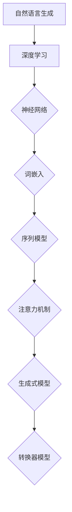
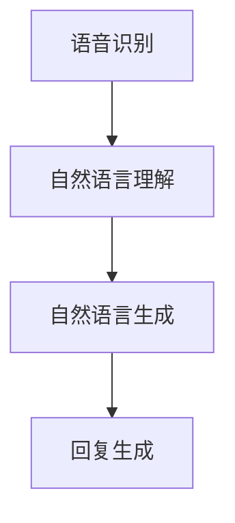

                 

### 文章标题

《深度学习在自然语言生成中的前沿技术》

#### 关键词：
- 自然语言生成
- 深度学习
- 预训练模型
- 生成对抗网络（GAN）
- 注意力机制
- 转换器架构
- 序列到序列学习（Seq2Seq）
- 文本生成
- 对话系统
- 机器翻译

#### 摘要：
本文深入探讨了深度学习在自然语言生成中的应用，从基础理论到前沿技术，再到实际应用，提供了一个全面而系统的视角。文章首先介绍了自然语言生成的基本概念及其应用场景，随后讲解了深度学习在自然语言处理中的优势。接着，文章详细阐述了神经网络、词嵌入技术、序列模型与注意力机制等深度学习基础理论。在此基础上，本文重点介绍了预训练模型、生成对抗网络（GAN）、变分自编码器（VAE）、递归神经网络（RNN）和长短期记忆网络（LSTM）等前沿技术，并通过伪代码和数学公式进行了详细讲解。随后，文章探讨了基于转换器模型的方法，包括序列到序列学习（Seq2Seq）、累加式转换器（Transformer）和多头自注意力机制。最后，文章通过具体的项目实战案例，展示了如何利用深度学习技术实现文本生成、对话系统和机器翻译等应用，并提供了一系列优化策略。本文旨在为读者提供一个清晰、系统的深度学习在自然语言生成领域的指南，助力其在相关领域的深入研究与应用。

---

## 《深度学习在自然语言生成中的前沿技术》目录大纲

### 第一部分：自然语言生成基础

#### 第1章：自然语言生成概述

- 1.1 自然语言生成的定义与历史
- 1.2 自然语言生成的应用场景
- 1.3 深度学习在自然语言生成中的优势
- 1.4 自然语言生成的研究现状与发展趋势

#### 第2章：深度学习基础

- 2.1 神经网络基础
  - 2.1.1 神经网络的基本结构
  - 2.1.2 深度学习架构
  - 2.1.3 深度学习优化算法
- 2.2 词嵌入技术
- 2.3 序列模型与注意力机制

#### 第3章：自然语言处理技术概览

- 3.1 词嵌入技术
- 3.2 序列模型与注意力机制
- 3.3 转换器架构详解

### 第二部分：前沿技术

#### 第4章：预训练模型原理

- 4.1 预训练的概念与意义
- 4.2 自监督学习方法
- 4.3 迁移学习与微调技术

#### 第5章：生成式模型

- 5.1 生成对抗网络（GAN）
- 5.2 变分自编码器（VAE）
- 5.3 递归神经网络（RNN）
- 5.4 长短期记忆网络（LSTM）

#### 第6章：基于转换器模型的方法

- 6.1 转换器架构详解
- 6.2 序列到序列学习（Seq2Seq）
- 6.3 累加式转换器（Transformer）
- 6.4 多头自注意力机制

#### 第7章：应用场景与优化

- 7.1 自然语言生成在文本生成中的应用
- 7.2 自然语言生成在对话系统中的应用
- 7.3 模型优化与评估
- 7.4 模型压缩与推理

### 第三部分：项目实战

#### 第8章：项目实战一：文本生成

- 8.1 项目背景与目标
- 8.2 数据集准备
- 8.3 模型选择与实现
- 8.4 实验结果与分析

#### 第9章：项目实战二：对话系统

- 9.1 项目背景与目标
- 9.2 对话系统架构设计
- 9.3 模型训练与评估
- 9.4 系统优化与部署

### 第四部分：未来展望

#### 第10章：自然语言生成技术的发展趋势

- 10.1 未来发展方向
- 10.2 可能的挑战与机遇
- 10.3 研究与探索方向

#### 第11章：总结与展望

- 11.1 全书总结
- 11.2 未来应用前景
- 11.3 作者寄语

### 附录

#### 附录A：深度学习工具与资源

- A.1 主流深度学习框架对比
- A.2 开发工具与平台
- A.3 数据集与库资源

## 核心概念与联系

在探讨深度学习在自然语言生成中的应用之前，我们需要了解一些核心概念及其相互关系。以下是一个Mermaid流程图，展示了这些核心概念和它们之间的联系：



### 自然语言生成与深度学习

自然语言生成（Natural Language Generation, NLG）是人工智能的一个重要分支，它旨在构建系统来生成自然语言文本，模拟人类语言表达的能力。深度学习是近年来在人工智能领域取得显著进展的技术，通过神经网络模型来模拟和增强人类的学习和决策过程。

自然语言生成与深度学习之间的关系在于，深度学习提供了强大的计算能力，使得自然语言生成任务的实现变得更加高效和准确。具体来说：

- **神经网络**：神经网络是深度学习的基础，它由多个神经元组成，通过层层传递输入信息，实现从简单到复杂的信息处理。
- **词嵌入**：词嵌入是将词汇映射到固定维度的向量表示，是自然语言处理的关键技术之一，它使得深度学习模型能够理解和处理文本数据。
- **序列模型**：序列模型是一种能够处理序列数据的神经网络架构，例如循环神经网络（RNN）和长短期记忆网络（LSTM），它们在自然语言生成中用于处理输入文本的序列信息。
- **注意力机制**：注意力机制是一种在深度学习模型中用于关注输入序列中关键部分的技术，它显著提升了模型在自然语言处理任务中的性能。
- **生成式模型**：生成式模型是一种能够生成新数据的模型，例如生成对抗网络（GAN）和变分自编码器（VAE），它们在自然语言生成中用于生成新的文本。
- **转换器模型**：转换器模型（Transformer）是一种基于自注意力机制的深度学习架构，它在自然语言生成中得到了广泛应用。

通过这些核心概念和技术的结合，深度学习在自然语言生成中实现了许多突破性的应用。

### 深度学习基础

在深入探讨自然语言生成的前沿技术之前，我们首先需要理解深度学习的基础知识。这一章节将介绍深度学习的核心概念、主要架构和常用优化算法，为后续章节中的具体应用和技术讨论奠定基础。

#### 神经网络基础

神经网络（Neural Networks）是深度学习的基础，它们模拟了人类大脑神经元的工作原理。一个基本的神经网络由多个层组成，每个层包含一系列的神经元。神经元之间通过权重（weights）和偏置（bias）进行连接，并通过激活函数（activation function）产生输出。

1. **神经网络的基本结构**

   神经网络通常包括以下几个主要部分：

   - **输入层**：接收外部输入数据。
   - **隐藏层**：对输入数据进行处理和特征提取。
   - **输出层**：产生最终输出结果。

   每个神经元在其输入上应用一个线性变换，并加上一个偏置项，然后通过激活函数产生输出。一个简单的神经网络结构如图所示：

   ```mermaid
   graph TD
   A[Input Layer] --> B1(Neuron 1)
   A --> B2(Neuron 2)
   A --> B3(Neuron 3)
   B1 --> C1[Output Layer]
   B2 --> C1
   B3 --> C1
   ```

2. **深度学习架构**

   深度学习（Deep Learning）中的“深度”指的是多层神经网络的堆叠。通过增加网络深度，可以提取更复杂的特征，提高模型的性能。常见的深度学习架构包括卷积神经网络（Convolutional Neural Networks, CNN）和递归神经网络（Recurrent Neural Networks, RNN）。

   - **卷积神经网络（CNN）**：主要用于图像识别、图像生成等任务，通过卷积层、池化层和全连接层的堆叠，提取图像中的层次特征。
   - **递归神经网络（RNN）**：主要用于序列数据处理，如自然语言处理、时间序列预测等，其通过递归结构处理输入序列的连续信息。

3. **深度学习优化算法**

   在深度学习训练过程中，优化算法用于调整网络权重，以最小化损失函数。常用的优化算法包括：

   - **随机梯度下降（SGD）**：是最常用的优化算法，通过随机选择训练数据的一个子集来计算梯度，并更新权重。
   - **动量（Momentum）**：结合历史梯度信息，加速收敛速度。
   - **自适应优化器**：如Adam、RMSprop等，通过自适应调整学习率，提高收敛速度和模型性能。

#### 词嵌入技术

词嵌入（Word Embedding）是将词汇映射到固定维度的向量表示，是自然语言处理（NLP）的重要技术。词嵌入能够将文本数据转化为数值形式，便于深度学习模型处理。

1. **词嵌入的概念与作用**

   词嵌入通过将单词映射到高维空间中的向量，使相似单词在向量空间中靠近。词嵌入的主要作用包括：

   - **语义表示**：将单词转化为具有语义信息的向量，有助于模型理解单词的意义。
   - **降低维度**：将高维的文本数据映射到低维向量空间，简化模型计算。
   - **交互性**：通过向量运算，能够进行文本数据的相似度计算、词性标注等操作。

2. **常见的词嵌入方法**

   常见的词嵌入方法包括：

   - **基于计数的方法**：如词袋模型（Bag-of-Words, BoW）和TF-IDF，通过统计单词出现的频率或重要性来表示文本。
   - **基于上下文的方法**：如Word2Vec、GloVe，通过学习单词在上下文中的分布，生成具有语义信息的词向量。
   - **基于神经网络的词嵌入**：如BERT、GPT等，通过预训练大型的神经网络模型，生成高质的词向量表示。

3. **词嵌入在实际应用中的挑战**

   虽然词嵌入技术取得了显著的成功，但在实际应用中仍面临一些挑战：

   - **稀疏性**：词嵌入向量中大部分元素为0，导致计算效率低。
   - **语义歧义**：某些单词在不同上下文中有不同的含义，词向量难以准确表示。
   - **长距离依赖**：在长文本中，单词之间的依赖关系难以通过词向量捕捉。

#### 序列模型与注意力机制

序列模型（Sequence Models）是处理序列数据的神经网络模型，如递归神经网络（RNN）和长短期记忆网络（LSTM）。注意力机制（Attention Mechanism）是一种用于提高模型处理序列数据性能的技术。

1. **序列模型基本概念**

   序列模型通过递归结构处理输入序列的连续信息。RNN和LSTM是两种常见的序列模型：

   - **递归神经网络（RNN）**：通过递归连接处理序列数据，但存在梯度消失或爆炸问题。
   - **长短期记忆网络（LSTM）**：通过引入门控机制，解决RNN的梯度消失问题，能够更好地处理长距离依赖。

2. **注意力机制原理与实现**

   注意力机制是一种在序列模型中用于关注输入序列中关键部分的技术。它通过计算每个输入元素的重要性权重，将注意力集中在重要的部分，从而提高模型性能。注意力机制的主要组成部分包括：

   - **查询（Query）**：表示模型的当前状态。
   - **键值对（Key-Value Pairs）**：表示序列中的每个元素。
   - **注意力得分函数**：计算查询与键之间的相似度，生成重要性权重。

   常见注意力机制实现包括：

   - **全局注意力**：对整个序列进行加权平均。
   - **局部注意力**：对序列的某个子集进行加权平均。
   - **多头注意力**：在多个独立注意力机制上聚合信息。

3. **注意力机制在不同领域的应用**

   注意力机制在自然语言处理、图像处理和推荐系统等领域得到了广泛应用：

   - **自然语言处理**：在机器翻译、文本摘要和问答系统中，注意力机制能够提高模型对长文本的理解能力。
   - **图像处理**：在图像分类和生成任务中，注意力机制能够帮助模型关注图像中的关键区域。
   - **推荐系统**：在基于内容的推荐中，注意力机制能够根据用户的兴趣关注相关的内容。

通过理解这些核心概念和技术的原理，我们可以为后续章节中的深度学习在自然语言生成中的应用打下坚实的基础。

### 自然语言处理技术概览

自然语言处理（Natural Language Processing, NLP）是深度学习在自然语言生成中的核心技术。本节将介绍NLP中的一些关键技术，包括词嵌入、序列模型和注意力机制，为深入理解自然语言生成中的前沿技术奠定基础。

#### 词嵌入技术

词嵌入（Word Embedding）是将词汇映射到固定维度的向量表示，是NLP中的基础技术之一。词嵌入不仅能够将文本数据转化为数值形式，便于深度学习模型处理，还能够捕捉词汇的语义信息。

1. **词嵌入的概念与作用**

   词嵌入通过将单词映射到高维空间中的向量，使得相似单词在向量空间中靠近。词嵌入的主要作用包括：

   - **语义表示**：将单词转化为具有语义信息的向量，有助于模型理解单词的意义。
   - **降低维度**：将高维的文本数据映射到低维向量空间，简化模型计算。
   - **交互性**：通过向量运算，能够进行文本数据的相似度计算、词性标注等操作。

2. **常见的词嵌入方法**

   常见的词嵌入方法包括：

   - **基于计数的方法**：如词袋模型（Bag-of-Words, BoW）和TF-IDF，通过统计单词出现的频率或重要性来表示文本。这种方法的主要缺点是忽略了单词之间的顺序信息。
   - **基于上下文的方法**：如Word2Vec和GloVe，通过学习单词在上下文中的分布，生成具有语义信息的词向量。Word2Vec通过负采样方法生成向量，GloVe则通过矩阵分解方法生成向量。
   - **基于神经网络的词嵌入**：如BERT、GPT等，通过预训练大型的神经网络模型，生成高质的词向量表示。这些方法不仅考虑了单词的上下文信息，还能够通过大规模数据训练出具有强语义表示能力的词向量。

3. **词嵌入在实际应用中的挑战**

   虽然词嵌入技术取得了显著的成功，但在实际应用中仍面临一些挑战：

   - **稀疏性**：词嵌入向量中大部分元素为0，导致计算效率低。
   - **语义歧义**：某些单词在不同上下文中有不同的含义，词向量难以准确表示。
   - **长距离依赖**：在长文本中，单词之间的依赖关系难以通过词向量捕捉。

#### 序列模型与注意力机制

序列模型（Sequence Models）是处理序列数据的神经网络模型，如递归神经网络（Recurrent Neural Networks, RNN）和长短期记忆网络（Long Short-Term Memory, LSTM）。注意力机制（Attention Mechanism）是一种用于提高模型处理序列数据性能的技术。

1. **序列模型基本概念**

   序列模型通过递归结构处理输入序列的连续信息。RNN和LSTM是两种常见的序列模型：

   - **递归神经网络（RNN）**：通过递归连接处理序列数据，但存在梯度消失或爆炸问题，导致难以学习长距离依赖关系。
   - **长短期记忆网络（LSTM）**：通过引入门控机制，解决RNN的梯度消失问题，能够更好地处理长距离依赖。LSTM包括输入门、遗忘门和输出门，通过这些门控机制，LSTM能够灵活地控制信息的存储和传递。

2. **注意力机制原理与实现**

   注意力机制是一种在序列模型中用于关注输入序列中关键部分的技术。它通过计算每个输入元素的重要性权重，将注意力集中在重要的部分，从而提高模型性能。注意力机制的主要组成部分包括：

   - **查询（Query）**：表示模型的当前状态。
   - **键值对（Key-Value Pairs）**：表示序列中的每个元素。
   - **注意力得分函数**：计算查询与键之间的相似度，生成重要性权重。

   常见注意力机制实现包括：

   - **全局注意力**：对整个序列进行加权平均。
   - **局部注意力**：对序列的某个子集进行加权平均。
   - **多头注意力**：在多个独立注意力机制上聚合信息。

3. **注意力机制在不同领域的应用**

   注意力机制在自然语言处理、图像处理和推荐系统等领域得到了广泛应用：

   - **自然语言处理**：在机器翻译、文本摘要和问答系统中，注意力机制能够提高模型对长文本的理解能力。
   - **图像处理**：在图像分类和生成任务中，注意力机制能够帮助模型关注图像中的关键区域。
   - **推荐系统**：在基于内容的推荐中，注意力机制能够根据用户的兴趣关注相关的内容。

#### 转换器架构详解

转换器架构（Transformer Architecture）是一种基于自注意力机制的深度学习模型，最初由Vaswani等人于2017年提出。与传统的循环神经网络（RNN）和长短期记忆网络（LSTM）相比，转换器架构在处理长序列数据时表现出了卓越的性能。本节将详细解释转换器架构的原理和结构，并介绍其在自然语言生成中的应用。

1. **转换器架构的基本原理**

   转换器架构的核心是自注意力机制（Self-Attention），它允许模型在处理每个输入元素时，动态地计算其对其他输入元素的影响。这种机制使得模型能够关注序列中的关键部分，从而提高对长序列数据的理解能力。自注意力机制的计算过程可以分为以下几个步骤：

   - **计算查询（Query）、键（Key）和值（Value）**：每个输入元素都会生成对应的查询、键和值向量。这些向量通常是通过嵌入层生成的。
   - **计算注意力得分**：通过点积运算，计算查询与所有键之间的相似度，生成注意力得分。
   - **计算注意力权重**：将注意力得分归一化，生成注意力权重。
   - **加权求和**：将输入元素与对应的注意力权重相乘，并求和，得到加权求和结果。

2. **转换器架构的主要组件**

   转换器架构主要由编码器（Encoder）和解码器（Decoder）组成，它们通过多个层堆叠，形成深度网络。以下分别介绍编码器和解码器的结构：

   - **编码器**：编码器负责将输入序列编码为固定长度的向量表示。编码器通常包含多个自注意力层和前馈神经网络层。自注意力层用于捕捉输入序列中的长距离依赖关系，前馈神经网络层则用于进一步提取特征。
   - **解码器**：解码器负责将编码器的输出解码为输出序列。解码器同样包含多个自注意力层和前馈神经网络层，但与编码器不同，解码器还包括一个交叉自注意力层，该层用于处理编码器的输出和当前解码步骤的输入。这种设计使得解码器能够同时关注输入序列和编码器的输出，从而生成更准确的输出序列。

3. **转换器架构的工作流程**

   转换器架构的工作流程可以分为编码和解码两个阶段：

   - **编码阶段**：输入序列通过编码器进行编码，生成固定长度的编码向量。这些编码向量表示了输入序列的语义信息，可以作为后续解码的输入。
   - **解码阶段**：解码器从编码器的输出开始，逐个生成输出序列的每个元素。在解码过程中，解码器首先生成一个初始的解码向量，然后通过交叉自注意力层和自注意力层，将编码器的输出与当前解码向量进行交互，生成新的解码向量。这一过程重复进行，直到生成完整的输出序列。

4. **转换器架构在自然语言生成中的应用**

   转换器架构在自然语言生成中得到了广泛应用，特别是在机器翻译、文本摘要和对话系统等领域。以下是一些典型的应用场景：

   - **机器翻译**：转换器架构能够将源语言的文本序列编码为固定长度的向量表示，然后通过解码器生成目标语言的文本序列。这种方法在机器翻译中表现出了出色的性能。
   - **文本摘要**：转换器架构能够将长文本编码为固定长度的向量表示，然后通过解码器生成摘要文本。这种方法在提取关键信息、生成简洁摘要方面具有优势。
   - **对话系统**：转换器架构能够处理对话中的长序列数据，生成自然的回复文本。这种方法在智能客服、虚拟助手等领域具有广泛的应用前景。

通过本节的介绍，我们可以看到转换器架构在自然语言生成中具有强大的应用潜力。接下来，我们将进一步探讨预训练模型、生成对抗网络（GAN）和变分自编码器（VAE）等前沿技术，为深度学习在自然语言生成中的应用提供更加深入的理解。

### 预训练模型原理

预训练模型（Pre-trained Models）是深度学习在自然语言生成中的重要技术之一。预训练模型通过在大规模数据集上预先训练，使得模型在特定任务上具有更好的性能和泛化能力。本节将详细探讨预训练模型的概念、自监督学习方法、迁移学习与微调技术，并介绍其在自然语言生成中的应用。

#### 预训练的概念与意义

预训练（Pre-training）是指在大规模数据集上对深度学习模型进行初步训练，使得模型获得一定的知识表示能力。预训练模型的核心思想是通过在特定任务之前，利用未标记的数据对模型进行训练，从而提高模型在后续任务中的表现。

1. **预训练的优势**

   - **知识迁移**：预训练模型通过在大规模数据集上学习，积累了丰富的知识表示，这些知识可以迁移到特定任务中，提高模型的性能和泛化能力。
   - **减少标记数据需求**：预训练模型可以显著减少对标记数据的依赖，因为在大规模未标记数据上预训练的模型已经具备了较强的特征提取能力。
   - **提高模型泛化能力**：预训练模型通过学习大规模数据中的通用特征，使得模型在面临新的任务时能够更好地适应，提高泛化能力。

2. **预训练的主要方法**

   预训练的主要方法包括基于监督学习和基于自监督学习的方法：

   - **基于监督学习的方法**：这种方法通常需要大量的标注数据，通过在标注数据上训练模型，然后在大规模未标记数据上进行微调。BERT和GPT-2是典型的基于监督学习的预训练模型。
   - **基于自监督学习的方法**：这种方法利用未标记的数据进行预训练，不需要额外的标注数据。自监督学习任务包括语言建模、掩码语言建模（Masked Language Model, MLM）和下一个句子预测（Next Sentence Prediction, NSP）等。BERT和GPT-3是典型的基于自监督学习的预训练模型。

#### 自监督学习方法

自监督学习（Self-supervised Learning）是一种利用未标记数据训练模型的方法，其核心思想是从未标记数据中提取有监督信号。自监督学习方法在预训练模型中起到了关键作用，能够有效提高模型在自然语言生成任务中的性能。

1. **自监督学习的基本概念**

   自监督学习通过为每个数据样本生成一个监督信号，从而使得模型可以从未标记数据中进行学习。自监督学习的基本概念包括：

   - **有监督信号**：自监督学习通过未标记数据生成一个有监督信号，例如在掩码语言建模任务中，对部分单词进行掩码，然后预测这些掩码单词。
   - **无监督信号**：自监督学习通过未标记数据生成一个无监督信号，例如在下一个句子预测任务中，预测下一个句子是否与当前句子相关。
   - **正负样本**：自监督学习通过正负样本对模型进行训练，例如在掩码语言建模任务中，未掩码的单词为正样本，掩码的单词为负样本。

2. **常见自监督学习任务**

   自监督学习在自然语言生成中应用广泛，以下是一些常见的自监督学习任务：

   - **语言建模**：语言建模是自监督学习的基础任务，其目标是预测下一个单词。在语言建模任务中，模型从大规模文本数据中学习语言的统计规律。
   - **掩码语言建模（Masked Language Model, MLM）**：在掩码语言建模任务中，对文本中的部分单词进行掩码，然后预测这些掩码单词。这种方法能够帮助模型学习单词的上下文关系。
   - **下一个句子预测（Next Sentence Prediction, NSP）**：在下一个句子预测任务中，模型需要预测当前句子和下一句子的关系，从而学习句子之间的连贯性。
   - **句子排序**：句子排序任务是判断两个句子之间的顺序关系，例如在文档分类任务中，模型需要确定句子在文档中的顺序。
   - **实体识别**：实体识别任务是识别文本中的实体，如人名、地点和组织。自监督学习可以通过无监督方式对实体进行预训练。

3. **自监督学习在实际应用中的挑战**

   虽然自监督学习方法在预训练模型中取得了显著的成功，但在实际应用中仍面临一些挑战：

   - **数据依赖性**：自监督学习需要大量未标记的数据，这在某些领域可能难以获得。
   - **计算资源**：自监督学习通常需要大量的计算资源，例如在大规模数据集上训练模型。
   - **模型泛化能力**：自监督学习模型在特定任务上可能表现出良好的性能，但在其他任务上可能无法很好地泛化。

#### 迁移学习与微调技术

迁移学习（Transfer Learning）是一种利用预先训练好的模型在新任务上进行微调的方法。迁移学习通过将已有模型的知识迁移到新任务中，能够显著提高新任务的性能和泛化能力。微调（Fine-tuning）是在迁移学习过程中对模型进行进一步调整，以适应新任务。

1. **迁移学习的概念与原理**

   迁移学习通过利用已有模型的知识，在新任务上进行训练。迁移学习的基本原理包括：

   - **通用特征提取**：预先训练好的模型在大规模数据集上学习，积累了丰富的通用特征表示，这些特征对于解决新任务非常有用。
   - **领域适应**：迁移学习通过在新任务上微调模型，使得模型能够适应新领域的特征分布。

2. **迁移学习在实际应用中的案例分析**

   迁移学习在自然语言生成中应用广泛，以下是一些典型案例：

   - **文本分类**：利用预训练好的语言模型进行文本分类，例如使用BERT模型进行情感分析、主题分类等任务。
   - **机器翻译**：利用预训练好的翻译模型，进行特定语言对的机器翻译，例如使用GPT-2进行中文到英文的翻译。
   - **问答系统**：利用预训练好的问答模型，进行自然语言理解任务，例如使用BERT进行问题回答和对话生成。

3. **微调技术的原理与应用**

   微调技术是在迁移学习过程中，对模型进行进一步调整，以适应新任务。微调的基本原理包括：

   - **参数更新**：在迁移学习过程中，模型的部分参数会进行更新，以适应新任务的特征分布。
   - **学习率调整**：微调过程中，通常需要调整学习率，以防止过拟合。

   微调技术在自然语言生成中的应用包括：

   - **文本生成**：利用预训练好的生成模型，进行特定主题或风格的文本生成，例如使用GPT-3生成新闻文章、对话文本等。
   - **对话系统**：利用预训练好的对话模型，进行对话生成和回复生成，例如使用BERT进行聊天机器人对话生成。

通过本节的介绍，我们可以看到预训练模型、自监督学习方法、迁移学习与微调技术在自然语言生成中具有重要的应用价值。这些技术不仅提高了模型在特定任务上的性能，还增强了模型的泛化能力和适应性。接下来，我们将进一步探讨生成式模型、递归神经网络（RNN）和长短期记忆网络（LSTM）等前沿技术，为深度学习在自然语言生成中的应用提供更加深入的理解。

### 生成式模型

生成式模型（Generative Models）是深度学习在自然语言生成中的重要技术之一。与判别式模型不同，生成式模型旨在生成与输入数据具有相似特征的新数据。本节将详细介绍生成式模型中的生成对抗网络（GAN）、变分自编码器（VAE）以及其在自然语言生成中的应用。

#### 生成对抗网络（GAN）

生成对抗网络（Generative Adversarial Network, GAN）是由Goodfellow等人于2014年提出的一种生成模型。GAN由两个神经网络——生成器（Generator）和判别器（Discriminator）组成，两者相互对抗，共同训练，最终生成高质量的数据。

1. **GAN的基本概念与架构**

   - **生成器（Generator）**：生成器的目标是生成与真实数据相似的假数据。生成器通常是一个神经网络，它将随机噪声映射到数据空间中，生成假数据。
   - **判别器（Discriminator）**：判别器的目标是区分真实数据和生成器生成的假数据。判别器也是一个神经网络，它对输入数据进行分类，判断其是真实数据还是假数据。

   GAN的训练过程可以看作是一个零和博弈，生成器和判别器相互对抗，目标是最大化对方的损失。具体来说，生成器希望生成的假数据能够尽可能接近真实数据，使得判别器无法区分；而判别器则希望尽可能准确地判断输入数据的真实性。

2. **GAN的训练过程与优化策略**

   GAN的训练过程通常分为以下几个步骤：

   - **初始化生成器和判别器**：通常使用随机初始化或预训练模型初始化生成器和判别器。
   - **生成假数据**：生成器根据随机噪声生成假数据。
   - **训练判别器**：判别器对真实数据和生成器生成的假数据进行分类，计算分类损失。
   - **训练生成器**：生成器根据判别器的反馈，调整生成策略，使得判别器无法区分真实数据和假数据。

   GAN的训练过程中，生成器和判别器的优化目标分别是：

   - **生成器**：最小化判别器的分类损失，即最大化生成器生成的假数据的概率。
   - **判别器**：最大化分类损失，即最大化判别器对真实数据和假数据的区分能力。

3. **GAN在实际应用中的案例分析**

   GAN在自然语言生成中有着广泛的应用，以下是一些典型的应用案例：

   - **文本生成**：利用GAN生成与输入文本风格相似的文本。例如，使用GAN生成诗歌、新闻文章和对话文本。
   - **语音合成**：利用GAN生成与输入语音特征相似的语音。这种方法在语音生成和合成语音交互系统中具有重要作用。
   - **图像生成**：利用GAN生成具有自然纹理和结构的图像。GAN在图像生成和艺术创作中表现出了卓越的能力。

#### 变分自编码器（VAE）

变分自编码器（Variational Autoencoder, VAE）是一种基于深度学习的生成模型，由Kingma和Welling于2013年提出。VAE通过引入变分推断技术，实现了生成式模型的高效训练。

1. **VAE的基本概念与架构**

   - **编码器（Encoder）**：编码器将输入数据映射到一个潜在空间（Latent Space）中的表示。潜在空间是一个低维的连续空间，能够捕捉输入数据的特征。
   - **解码器（Decoder）**：解码器将潜在空间中的表示映射回数据空间，生成新的数据。

   VAE的核心思想是通过优化编码器和解码器的参数，使得编码器能够生成高质量的潜在空间表示，解码器能够从这些表示中生成新的数据。

2. **VAE的训练过程与优化策略**

   VAE的训练过程分为两个部分：

   - **编码过程**：编码器对输入数据进行编码，生成潜在空间中的表示。
   - **解码过程**：解码器根据潜在空间中的表示生成新的数据。

   在训练过程中，VAE采用变分推断技术，通过优化编码器和解码器的参数，使得生成的新数据与真实数据尽量相似。变分推断的关键是引入一个概率模型，使得潜在空间中的表示能够灵活地表示输入数据的分布。

3. **VAE在实际应用中的案例分析**

   VAE在自然语言生成中有着广泛的应用，以下是一些典型的应用案例：

   - **文本生成**：利用VAE生成与输入文本风格相似的文本。例如，使用VAE生成诗歌、小说和对话文本。
   - **图像生成**：利用VAE生成具有自然纹理和结构的图像。VAE在图像生成和艺术创作中表现出了卓越的能力。
   - **语音生成**：利用VAE生成与输入语音特征相似的语音。这种方法在语音生成和合成语音交互系统中具有重要作用。

#### 递归神经网络（RNN）

递归神经网络（Recurrent Neural Networks, RNN）是一种能够处理序列数据的神经网络模型。RNN通过递归结构，使得模型能够记住序列中的历史信息，从而在自然语言生成中具有广泛的应用。

1. **RNN的基本概念与架构**

   - **递归结构**：RNN的每个时间步都与前一个时间步相关联，通过递归连接，RNN能够处理序列数据。
   - **隐藏状态**：RNN在处理每个时间步时，都会更新一个隐藏状态（Hidden State），该状态包含了模型对当前时间步以及之前时间步的信息。

   RNN的基本架构包括输入层、隐藏层和输出层。输入层接收序列数据，隐藏层更新隐藏状态，输出层生成最终输出。

2. **RNN的训练与优化策略**

   RNN的训练过程通常包括以下几个步骤：

   - **初始化参数**：初始化RNN的权重和偏置。
   - **前向传播**：在当前时间步，RNN计算输入数据和隐藏状态之间的映射，生成输出。
   - **反向传播**：通过反向传播算法，计算损失函数，并更新RNN的权重和偏置。

   RNN的训练过程中，需要优化模型参数，使得输出与真实数据尽量接近。

3. **RNN在实际应用中的案例分析**

   RNN在自然语言生成中有着广泛的应用，以下是一些典型的应用案例：

   - **文本生成**：利用RNN生成与输入文本风格相似的文本。例如，使用RNN生成诗歌、新闻文章和对话文本。
   - **语音合成**：利用RNN生成与输入语音特征相似的语音。这种方法在语音生成和合成语音交互系统中具有重要作用。
   - **机器翻译**：利用RNN进行机器翻译，实现不同语言之间的文本转换。

#### 长短期记忆网络（LSTM）

长短期记忆网络（Long Short-Term Memory, LSTM）是一种改进的RNN结构，通过引入门控机制，解决了RNN在处理长序列数据时存在的梯度消失和梯度爆炸问题。LSTM在自然语言生成中表现出了出色的性能。

1. **LSTM的基本概念与架构**

   - **门控机制**：LSTM通过门控机制，包括输入门（Input Gate）、遗忘门（Forget Gate）和输出门（Output Gate），控制信息的存储和传递。
   - **细胞状态**：LSTM通过细胞状态（Cell State）存储信息，细胞状态能够灵活地传递和更新，从而实现长距离依赖的捕捉。

   LSTM的基本架构包括输入门、遗忘门、输出门和细胞状态。输入门和遗忘门控制细胞状态的更新，输出门控制隐藏状态的生成。

2. **LSTM的训练与优化策略**

   LSTM的训练过程与RNN类似，包括初始化参数、前向传播和反向传播。LSTM通过门控机制，使得模型能够更好地处理长序列数据。

3. **LSTM在实际应用中的案例分析**

   LSTM在自然语言生成中有着广泛的应用，以下是一些典型的应用案例：

   - **文本生成**：利用LSTM生成与输入文本风格相似的文本。例如，使用LSTM生成诗歌、新闻文章和对话文本。
   - **语音合成**：利用LSTM生成与输入语音特征相似的语音。这种方法在语音生成和合成语音交互系统中具有重要作用。
   - **机器翻译**：利用LSTM进行机器翻译，实现不同语言之间的文本转换。

通过本节的介绍，我们可以看到生成式模型、递归神经网络（RNN）和长短期记忆网络（LSTM）在自然语言生成中具有广泛的应用。这些技术不仅提高了模型在特定任务上的性能，还增强了模型的泛化能力和适应性。接下来，我们将进一步探讨基于转换器模型的方法，包括序列到序列学习（Seq2Seq）和累加式转换器（Transformer），为深度学习在自然语言生成中的应用提供更加深入的理解。

### 基于转换器模型的方法

基于转换器模型（Transformer-based Models）是深度学习在自然语言生成中的一种重要方法。与传统的递归神经网络（RNN）和长短期记忆网络（LSTM）相比，转换器模型通过引入自注意力机制，能够更高效地处理长序列数据。本节将详细介绍基于转换器模型的方法，包括转换器架构详解、序列到序列学习（Seq2Seq）、累加式转换器（Transformer）和多头自注意力机制（Multi-Head Self-Attention）。

#### 转换器架构详解

转换器架构（Transformer Architecture）由Vaswani等人于2017年提出，是一种基于自注意力机制的深度学习模型。转换器架构的核心是自注意力机制（Self-Attention），它允许模型在处理每个输入元素时，动态地计算其对其他输入元素的影响。这种机制使得模型能够关注序列中的关键部分，从而提高对长序列数据的理解能力。

1. **转换器架构的基本原理**

   转换器架构主要由编码器（Encoder）和解码器（Decoder）组成，通过多个层堆叠，形成深度网络。编码器负责将输入序列编码为固定长度的向量表示，解码器则负责将这些编码向量解码为输出序列。自注意力机制在编码器和解码器的每一层中都有应用。

2. **转换器架构的主要组件**

   - **编码器（Encoder）**：编码器包含多个自注意力层和前馈神经网络层。自注意力层用于捕捉输入序列中的长距离依赖关系，前馈神经网络层则用于进一步提取特征。编码器的输出是一个固定长度的向量序列，表示了输入序列的语义信息。
   - **解码器（Decoder）**：解码器也包含多个自注意力层和前馈神经网络层，此外还包括一个交叉自注意力层。交叉自注意力层用于处理编码器的输出和解码器的输入，使得解码器能够同时关注输入序列和编码器的输出，从而生成更准确的输出序列。解码器的输出是生成的输出序列。

3. **转换器架构的工作流程**

   转换器架构的工作流程可以分为编码和解码两个阶段：
   - **编码阶段**：输入序列通过编码器进行编码，生成固定长度的编码向量。这些编码向量表示了输入序列的语义信息，可以作为后续解码的输入。
   - **解码阶段**：解码器从编码器的输出开始，逐个生成输出序列的每个元素。在解码过程中，解码器首先生成一个初始的解码向量，然后通过交叉自注意力层和自注意力层，将编码器的输出与当前解码向量进行交互，生成新的解码向量。这一过程重复进行，直到生成完整的输出序列。

4. **转换器架构在自然语言生成中的应用**

   转换器架构在自然语言生成中得到了广泛应用，特别是在机器翻译、文本摘要和对话系统等领域。以下是一些典型的应用场景：
   - **机器翻译**：转换器架构能够将源语言的文本序列编码为固定长度的向量表示，然后通过解码器生成目标语言的文本序列。这种方法在机器翻译中表现出了出色的性能。
   - **文本摘要**：转换器架构能够将长文本编码为固定长度的向量表示，然后通过解码器生成摘要文本。这种方法在提取关键信息、生成简洁摘要方面具有优势。
   - **对话系统**：转换器架构能够处理对话中的长序列数据，生成自然的回复文本。这种方法在智能客服、虚拟助手等领域具有广泛的应用前景。

#### 序列到序列学习（Seq2Seq）

序列到序列学习（Sequence-to-Sequence Learning, Seq2Seq）是一种基于转换器架构的深度学习模型，用于处理输入和输出序列之间的映射任务。Seq2Seq模型通过编码器和解码器之间的交互，实现序列到序列的转换。

1. **Seq2Seq的基本概念**

   - **编码器（Encoder）**：编码器将输入序列编码为一个固定长度的向量表示，称为编码输出。编码输出包含了输入序列的语义信息。
   - **解码器（Decoder）**：解码器将编码输出解码为输出序列。解码器的输入包括编码输出和解码器的初始状态。

2. **Seq2Seq的训练与优化策略**

   Seq2Seq模型的训练过程包括以下几个步骤：
   - **编码过程**：编码器对输入序列进行编码，生成编码输出。
   - **解码过程**：解码器根据编码输出和解码器的初始状态，生成输出序列。

   在训练过程中，需要优化编码器和解码器的参数，使得输出序列与真实输出序列尽量接近。常用的优化策略包括梯度下降、学习率调整和正则化等。

3. **Seq2Seq在实际应用中的案例分析**

   Seq2Seq模型在自然语言生成中有着广泛的应用，以下是一些典型的应用案例：
   - **机器翻译**：利用Seq2Seq模型进行不同语言之间的文本转换，例如将中文翻译成英文。
   - **文本生成**：利用Seq2Seq模型生成与输入文本风格相似的文本，例如生成诗歌、新闻文章和对话文本。
   - **对话系统**：利用Seq2Seq模型生成对话系统中的回复文本，例如智能客服和虚拟助手。

#### 累加式转换器（Transformer）

累加式转换器（Additive Transformer）是一种基于转换器架构的改进模型，通过引入累加式自注意力机制，提高了模型的处理速度和计算效率。

1. **累加式转换器的基本原理**

   累加式转换器通过将多个自注意力层的结果进行累加，而不是直接相加，从而实现自注意力机制。这种设计使得模型在处理长序列数据时，计算效率更高。

2. **累加式转换器的训练与优化策略**

   累加式转换器的训练过程与标准转换器类似，但需要注意以下几点：
   - **梯度计算**：在训练过程中，需要优化模型参数，使得输出序列与真实输出序列尽量接近。梯度计算需要考虑累加式自注意力机制的特点，避免梯度消失或梯度爆炸问题。
   - **学习率调整**：在训练累加式转换器时，需要根据模型表现调整学习率，以防止过拟合。

3. **累加式转换器在实际应用中的案例分析**

   累加式转换器在自然语言生成中有着广泛的应用，以下是一些典型的应用案例：
   - **文本生成**：利用累加式转换器生成与输入文本风格相似的文本，例如生成诗歌、新闻文章和对话文本。
   - **语音合成**：利用累加式转换器生成与输入语音特征相似的语音，实现语音合成和语音交互系统。
   - **机器翻译**：利用累加式转换器进行不同语言之间的文本转换，提高翻译质量和速度。

#### 多头自注意力机制（Multi-Head Self-Attention）

多头自注意力机制（Multi-Head Self-Attention）是一种在转换器架构中用于提高模型性能的技术。多头自注意力机制通过将输入序列分成多个子序列，并分别应用自注意力机制，从而提高了模型对长序列数据的处理能力。

1. **多头自注意力机制的基本原理**

   多头自注意力机制将输入序列分成多个子序列，每个子序列应用一个自注意力机制。多头自注意力机制的核心思想是，通过多个独立的自注意力机制，模型能够同时关注输入序列中的多个关键部分，从而提高模型的性能。

2. **多头自注意力机制的实现方法**

   实现多头自注意力机制的主要步骤包括：
   - **分割输入序列**：将输入序列分成多个子序列。
   - **应用自注意力机制**：对每个子序列应用自注意力机制，生成子序列的注意力得分。
   - **聚合注意力得分**：将所有子序列的注意力得分进行聚合，生成最终的输出。

3. **多头自注意力机制在实际应用中的案例分析**

   多头自注意力机制在自然语言生成中有着广泛的应用，以下是一些典型的应用案例：
   - **文本生成**：利用多头自注意力机制生成与输入文本风格相似的文本，例如生成诗歌、新闻文章和对话文本。
   - **语音合成**：利用多头自注意力机制生成与输入语音特征相似的语音，实现语音合成和语音交互系统。
   - **机器翻译**：利用多头自注意力机制进行不同语言之间的文本转换，提高翻译质量和速度。

通过本节的介绍，我们可以看到基于转换器模型的方法在自然语言生成中具有强大的应用潜力。这些方法通过引入自注意力机制、改进模型架构和优化训练策略，显著提高了模型在自然语言生成任务中的性能。接下来，我们将进一步探讨自然语言生成在文本生成、对话系统和机器翻译等应用场景中的具体实现和优化策略。

### 自然语言生成在文本生成中的应用

自然语言生成（Natural Language Generation, NLG）在文本生成中有着广泛的应用，从自动写作到内容生成，再到个性化推荐，都离不开深度学习技术的支持。本节将详细探讨自然语言生成在文本生成中的应用，包括文本生成的基本概念、深度学习模型的选择、实现过程以及优化策略。

#### 文本生成的基本概念

文本生成是指利用计算机程序生成自然语言文本的过程。文本生成可以应用于多种场景，例如自动写作、文本摘要、情感分析、对话系统等。文本生成的基本任务是将一组输入数据（如关键词、主题、文本片段等）转换成连贯、有意义的自然语言文本。

1. **文本生成的应用场景**

   - **自动写作**：包括新闻报道、博客文章、社交媒体帖子等的自动生成。
   - **文本摘要**：从长文本中提取关键信息，生成简洁的摘要。
   - **对话系统**：生成自然、流畅的对话回复。
   - **内容生成**：用于生成广告文案、产品描述、教育材料等。
   - **个性化推荐**：根据用户的历史行为和偏好，生成个性化的推荐内容。

2. **文本生成的基本流程**

   - **数据预处理**：对输入数据进行清洗、分词、去停用词等处理，将文本转化为模型可处理的格式。
   - **模型选择**：根据具体任务选择合适的深度学习模型，如循环神经网络（RNN）、长短期记忆网络（LSTM）、转换器（Transformer）等。
   - **模型训练**：使用预处理的文本数据对模型进行训练，优化模型参数，提高生成文本的质量。
   - **文本生成**：将训练好的模型应用于新的输入数据，生成文本。
   - **后处理**：对生成的文本进行格式调整、语法检查等，以提高文本的可读性和准确性。

3. **文本生成的挑战**

   - **语义理解**：深度学习模型需要理解输入文本的语义信息，这在某些情况下是具有挑战性的，特别是在处理长文本和复杂语境时。
   - **连贯性**：生成的文本需要保持连贯性和一致性，这在某些情况下是一个难点，特别是对于需要遵循特定文风或风格的文本生成任务。
   - **多样性**：生成的文本需要具备多样性，避免生成重复或单调的内容。

#### 深度学习模型的选择

在文本生成任务中，选择合适的深度学习模型至关重要。以下是一些常用的深度学习模型：

1. **循环神经网络（RNN）**

   RNN是一种能够处理序列数据的神经网络模型，它在文本生成任务中应用广泛。RNN通过递归结构，能够记住序列中的历史信息，从而生成连贯的文本。然而，RNN在处理长序列数据时存在梯度消失和梯度爆炸问题，导致训练不稳定。

2. **长短期记忆网络（LSTM）**

   LSTM是RNN的一种改进模型，通过引入门控机制，解决了RNN在处理长序列数据时存在的梯度消失和梯度爆炸问题。LSTM在文本生成任务中表现出良好的性能，能够生成连贯、有意义的文本。

3. **转换器（Transformer）**

   Transformer是一种基于自注意力机制的深度学习模型，它在处理长序列数据时表现出了优越的性能。Transformer通过多头自注意力机制，能够同时关注序列中的多个关键部分，从而提高文本生成的质量和连贯性。

4. **生成对抗网络（GAN）**

   GAN是一种生成式模型，通过生成器和判别器的对抗训练，能够生成高质量的文本。GAN在文本生成任务中具有潜力，可以生成多样化、高质量的文本。

5. **变分自编码器（VAE）**

   VAE是一种基于变分推断的生成模型，通过编码器和解码器的交互，能够生成新的文本。VAE在处理文本生成任务时，能够生成具有多样性的文本，但可能在生成文本的连贯性方面存在一定挑战。

#### 实现过程

以下是文本生成的基本实现过程：

1. **数据集准备**：选择合适的文本数据集，进行数据清洗、预处理和分词等操作。常用的数据集包括新闻文章、社交媒体帖子、对话文本等。

2. **词向量表示**：将文本数据转化为词向量表示，常用的词向量方法包括Word2Vec、GloVe和BERT等。

3. **模型架构设计**：根据具体任务需求，设计合适的深度学习模型架构。可以选择RNN、LSTM、Transformer等模型。

4. **模型训练**：使用预处理后的文本数据对模型进行训练，优化模型参数，提高生成文本的质量。

5. **文本生成**：将训练好的模型应用于新的输入数据，生成文本。可以通过控制生成过程的参数，如温度（Temperature）等，来调整生成文本的风格和多样性。

6. **后处理**：对生成的文本进行格式调整、语法检查等操作，以提高文本的可读性和准确性。

#### 优化策略

为了提高文本生成的质量和效率，可以采用以下优化策略：

1. **模型选择与调优**：选择合适的深度学习模型，并通过调整模型参数，如学习率、批量大小等，优化模型性能。

2. **数据增强**：通过数据增强方法，如文本清洗、噪声注入、同义词替换等，增加训练数据多样性，提高模型泛化能力。

3. **正则化**：采用正则化方法，如L1正则化、L2正则化等，防止模型过拟合。

4. **注意力机制优化**：针对Transformer等模型，优化注意力机制，如多头自注意力机制、位置编码等，提高模型对序列数据的处理能力。

5. **动态生成控制**：通过动态调整生成过程的参数，如温度（Temperature）、步长（Step Size）等，控制生成文本的风格和多样性。

6. **并行化与分布式训练**：利用并行计算和分布式训练，提高模型训练和生成速度。

通过本节的介绍，我们可以看到自然语言生成在文本生成中具有广泛的应用前景。深度学习技术的应用，不仅提高了文本生成的质量和效率，还推动了自然语言生成在各个领域的深入发展。接下来，我们将进一步探讨自然语言生成在对话系统中的应用，介绍对话系统的基本概念、架构设计以及优化策略。

### 自然语言生成在对话系统中的应用

对话系统（Dialogue System）是一种能够与用户进行自然语言交互的计算机系统，广泛应用于客服、虚拟助手、智能会议等领域。自然语言生成（Natural Language Generation, NLG）技术在对话系统中起着至关重要的作用，它使得系统能够生成自然、流畅、有意义的对话回复。本节将探讨自然语言生成在对话系统中的应用，包括对话系统的基本概念、架构设计以及优化策略。

#### 对话系统的基本概念

1. **对话系统定义**：对话系统是一种人工智能系统，它能够理解用户的自然语言输入，并生成自然语言回复，与用户进行自然交互。

2. **对话系统类型**：
   - **基于规则的系统**：通过预定义的规则和模板生成回复，适用于结构化对话场景。
   - **基于模板的系统**：使用模板和参数生成回复，具有一定的灵活性，但无法处理复杂、非结构化的对话。
   - **基于机器学习的系统**：利用深度学习模型，如循环神经网络（RNN）、长短期记忆网络（LSTM）和转换器（Transformer），生成自然的对话回复。

3. **对话系统的目标**：生成自然、流畅、有意义的对话回复，同时保持对话的连贯性和一致性。

#### 对话系统的架构设计

对话系统的架构设计通常包括三个主要模块：语音识别、自然语言理解和自然语言生成。

1. **语音识别**：将用户的语音输入转换为文本输入，以便后续的自然语言处理。

2. **自然语言理解**：解析用户的输入文本，提取意图、实体和上下文信息，为自然语言生成提供输入。

3. **自然语言生成**：根据用户的输入和对话上下文，生成自然、流畅的对话回复。

以下是一个典型的对话系统架构：



**自然语言理解模块**：自然语言理解（Natural Language Understanding, NLU）是对话系统的核心，它负责解析用户的输入文本，提取意图、实体和上下文信息。NLU模块通常包括以下步骤：

- **分词**：将文本分割成单词或短语。
- **词性标注**：为每个单词或短语标注词性，如名词、动词、形容词等。
- **实体识别**：识别文本中的关键实体，如人名、地点、组织等。
- **意图识别**：根据用户输入的文本，确定用户的意图，如提问、请求帮助、进行交易等。

**自然语言生成模块**：自然语言生成（Natural Language Generation, NLG）是生成对话回复的关键环节，它根据用户的输入和对话上下文，生成自然、流畅的对话回复。NLG模块通常包括以下步骤：

- **回复生成**：根据用户意图和上下文信息，生成对话回复。
- **文本润色**：对生成的回复进行语法检查、拼写修正和语义优化，以提高文本的质量和可读性。

#### 优化策略

为了提高对话系统的性能和用户体验，可以采用以下优化策略：

1. **多模态交互**：结合语音、文本和图像等多种模态，提高系统的交互能力和灵活性。

2. **上下文建模**：利用上下文信息，生成与当前对话主题相关的回复，保持对话的连贯性。

3. **个性化回复**：根据用户的历史行为和偏好，生成个性化的对话回复，提高用户体验。

4. **多轮对话**：支持多轮对话，通过积累对话历史，提高系统的理解和生成能力。

5. **对话质量评估**：采用人工评估和自动化评估方法，对生成的对话回复进行质量评估，持续优化系统。

6. **模型压缩与推理**：采用模型压缩和推理技术，提高系统的实时性和响应速度。

通过本节的介绍，我们可以看到自然语言生成在对话系统中具有重要的应用价值。深度学习技术的应用，不仅提升了对话系统的性能和用户体验，还为对话系统的进一步发展提供了新的方向。接下来，我们将探讨自然语言生成在机器翻译中的应用，介绍机器翻译的基本概念、挑战以及深度学习模型的实现方法。

### 自然语言生成在机器翻译中的应用

机器翻译（Machine Translation, MT）是一种将一种自然语言文本自动转换为另一种自然语言文本的技术。自然语言生成（Natural Language Generation, NLG）在机器翻译中发挥着重要作用，通过生成式模型和序列模型，实现高效、准确的文本翻译。本节将详细探讨自然语言生成在机器翻译中的应用，包括机器翻译的基本概念、挑战以及深度学习模型的实现方法。

#### 机器翻译的基本概念

1. **机器翻译定义**：机器翻译是一种利用计算机程序实现自然语言文本自动翻译的技术。它通过将源语言文本转换为目标语言文本，实现跨语言通信和信息传递。

2. **机器翻译类型**：
   - **基于规则的翻译**：使用预定义的翻译规则和语法规则，生成目标语言文本。
   - **基于统计的翻译**：利用统计学方法，如转换模型和翻译模型，生成目标语言文本。
   - **基于神经网络的翻译**：使用神经网络模型，如循环神经网络（RNN）、长短期记忆网络（LSTM）和转换器（Transformer），生成目标语言文本。

3. **机器翻译流程**：
   - **预处理**：对源语言文本进行分词、去停用词、词性标注等预处理操作，以便后续处理。
   - **编码**：将预处理后的源语言文本编码为向量表示，常用的编码方法包括词嵌入和子词嵌入。
   - **解码**：将编码后的文本输入到翻译模型，生成目标语言文本。

#### 机器翻译的挑战

尽管机器翻译技术取得了显著进展，但在实际应用中仍面临一些挑战：

1. **语义理解**：机器翻译需要准确理解源语言文本的语义，这在某些情况下是具有挑战性的，特别是在处理复杂句子和特殊语境时。

2. **语法一致性**：生成的目标语言文本需要保持语法一致性，避免生成错误或不自然的句子结构。

3. **翻译准确性**：提高翻译的准确性是机器翻译的核心目标，但仍然存在一定的误差，特别是在处理生僻词汇、文化差异和方言时。

4. **多语言翻译**：支持多种语言的翻译，特别是低资源语言和高资源语言的翻译，需要更多的数据和技术支持。

5. **实时性**：在实时场景中，如实时翻译和交互式对话，机器翻译需要具备快速的响应速度。

#### 深度学习模型的实现方法

近年来，深度学习模型在机器翻译中取得了显著成果，以下是一些常用的深度学习模型及其实现方法：

1. **循环神经网络（RNN）**：

   RNN是一种能够处理序列数据的神经网络模型，通过递归结构，RNN能够记住序列中的历史信息。在机器翻译中，RNN模型包括编码器和解码器两个部分：

   - **编码器（Encoder）**：将源语言文本编码为固定长度的向量表示，称为编码输出。编码输出包含了源语言文本的语义信息。
   - **解码器（Decoder）**：将编码输出解码为目标语言文本。解码器的输入包括编码输出和解码器的初始状态。

   RNN模型的训练过程包括以下步骤：

   - **编码过程**：编码器对源语言文本进行编码，生成编码输出。
   - **解码过程**：解码器根据编码输出和解码器的初始状态，生成目标语言文本。

   RNN在机器翻译中表现出良好的性能，但存在梯度消失和梯度爆炸问题，导致训练不稳定。

2. **长短期记忆网络（LSTM）**：

   LSTM是RNN的一种改进模型，通过引入门控机制，解决了RNN在处理长序列数据时存在的梯度消失和梯度爆炸问题。LSTM在机器翻译中表现出更好的性能，能够更好地处理长距离依赖。

   LSTM模型与RNN模型类似，包括编码器和解码器两个部分。LSTM模型的训练过程与RNN模型类似，但通过门控机制，提高了模型的训练稳定性和效果。

3. **转换器（Transformer）**：

   Transformer是一种基于自注意力机制的深度学习模型，它在处理长序列数据时表现出卓越的性能。与RNN和LSTM相比，Transformer能够并行处理序列数据，避免了梯度消失问题，提高了训练效率。

   Transformer模型主要由编码器和解码器组成：

   - **编码器（Encoder）**：编码器包含多个自注意力层和前馈神经网络层，将源语言文本编码为固定长度的向量表示。
   - **解码器（Decoder）**：解码器也包含多个自注意力层和前馈神经网络层，还包括一个交叉自注意力层。解码器根据编码器的输出和解码器的初始状态，生成目标语言文本。

   Transformer模型的训练过程包括以下步骤：

   - **编码过程**：编码器对源语言文本进行编码，生成编码输出。
   - **解码过程**：解码器根据编码输出和解码器的初始状态，生成目标语言文本。

   Transformer在机器翻译中取得了显著的成功，是当前机器翻译领域的首选模型。

4. **序列到序列学习（Seq2Seq）**：

   序列到序列学习（Seq2Seq）是一种基于转换器架构的深度学习模型，用于处理输入和输出序列之间的映射任务。Seq2Seq模型通过编码器和解码器之间的交互，实现序列到序列的转换。

   Seq2Seq模型的核心是编码器和解码器，编码器将输入序列编码为一个固定长度的向量表示，解码器将编码输出解码为输出序列。

   Seq2Seq模型的训练过程包括以下步骤：

   - **编码过程**：编码器对输入序列进行编码，生成编码输出。
   - **解码过程**：解码器根据编码输出和解码器的初始状态，生成输出序列。

   Seq2Seq模型在机器翻译中表现出良好的性能，能够生成高质量的目标语言文本。

5. **生成对抗网络（GAN）**：

   GAN是一种生成式模型，通过生成器和判别器的对抗训练，能够生成高质量的目标语言文本。GAN在机器翻译中具有潜力，可以生成多样化、高质量的翻译结果。

   GAN模型包括生成器和解码器两个部分：

   - **生成器（Generator）**：生成器将源语言文本生成为目标语言文本。
   - **判别器（Discriminator）**：判别器的目标是区分真实翻译文本和生成器生成的翻译文本。

   GAN模型的训练过程包括以下步骤：

   - **生成过程**：生成器根据源语言文本生成目标语言文本。
   - **判别过程**：判别器对真实翻译文本和生成器生成的翻译文本进行分类。

   通过优化生成器和判别器的参数，GAN模型能够生成高质量的目标语言文本。

通过本节的介绍，我们可以看到自然语言生成在机器翻译中具有重要的应用价值。深度学习技术的应用，不仅提高了机器翻译的准确性和效率，还为机器翻译领域的进一步发展提供了新的方向。接下来，我们将总结全文，探讨自然语言生成技术的发展趋势和未来前景。

### 总结与展望

深度学习在自然语言生成（NLG）领域取得了显著的进展，从基础理论到前沿技术，再到实际应用，为文本生成、对话系统和机器翻译等领域带来了革命性的变革。本文通过对自然语言生成基础、深度学习基础、自然语言处理技术概览、前沿技术以及具体应用场景的详细探讨，系统地阐述了深度学习在自然语言生成中的广泛应用和关键作用。

#### 成就与贡献

首先，深度学习技术为自然语言生成提供了强大的计算能力。通过神经网络、词嵌入、序列模型和注意力机制等核心技术，深度学习模型能够更好地理解和生成自然语言。例如，预训练模型如BERT、GPT等，通过在大规模未标记数据集上的自监督学习，积累了丰富的知识表示，使得模型在特定任务上具有更好的性能和泛化能力。

其次，生成对抗网络（GAN）、变分自编码器（VAE）等生成式模型，为文本生成和图像生成等任务提供了新的方法。GAN通过生成器和判别器的对抗训练，能够生成高质量、多样化的文本和图像；VAE通过变分推断技术，实现了生成模型的高效训练和生成。

最后，基于转换器模型的序列到序列学习（Seq2Seq）、累加式转换器（Transformer）和多头自注意力机制等前沿技术，进一步提高了模型在自然语言生成任务中的性能。这些技术通过并行处理序列数据和自注意力机制，显著提升了模型的训练效率和生成质量。

#### 挑战与未来发展方向

尽管深度学习在自然语言生成中取得了巨大成就，但仍面临一些挑战。首先，模型训练需要大量数据和计算资源，这在某些领域可能难以实现。其次，深度学习模型在处理长距离依赖和语义理解方面仍存在局限性，特别是在处理复杂文本和跨语言翻译时。此外，模型的可解释性和透明性也是未来研究的一个重要方向。

未来的发展方向包括：

1. **模型优化与压缩**：通过模型压缩、量化、蒸馏等技术，提高模型的计算效率，使其在资源受限的环境中仍能保持高性能。

2. **多模态交互**：结合语音、文本、图像等多种模态，实现更丰富的交互方式和更自然的生成效果。

3. **个性化生成**：根据用户的历史行为和偏好，生成个性化、定制化的文本和对话。

4. **跨语言翻译与多语言生成**：支持更多语言的翻译和多语言生成，特别是低资源语言的翻译，需要更多的数据和技术支持。

5. **可解释性与透明性**：通过改进模型结构和训练方法，提高模型的可解释性和透明性，使其在应用中更加可靠和可信。

6. **伦理与隐私**：在自然语言生成中，需要关注伦理和隐私问题，确保生成的文本和对话符合道德规范，保护用户隐私。

通过持续的研究和技术创新，深度学习在自然语言生成中的应用将不断拓展，为人类带来更多便利和惊喜。

### 作者寄语

作为深度学习在自然语言生成领域的探索者和推动者，我衷心希望本文能够为读者提供有价值的见解和启示。自然语言生成是一项充满挑战和机遇的领域，随着技术的不断进步，我们将迎来更多的创新和应用。我期待与广大读者共同探索这个充满无限可能的领域，共同推动自然语言生成技术的发展，为社会带来更多福祉。感谢您的阅读，希望本文能够激发您对深度学习在自然语言生成中的研究和应用的兴趣。

### 附录A：深度学习工具与资源

#### A.1 主流深度学习框架对比

在深度学习领域，有多种主流框架可供选择，以下是对TensorFlow、PyTorch和Keras三个主要框架的简要对比：

1. **TensorFlow**：由Google开发，具有高度可定制性和灵活性，支持多种编程语言（Python、C++、Java等）。TensorFlow提供了丰富的API和工具，适合复杂的项目和大规模部署。但其代码编写较为繁琐，学习曲线较陡峭。

2. **PyTorch**：由Facebook开发，以其动态计算图和简洁的API著称，易于调试和理解。PyTorch在研究阶段和快速原型开发中表现突出，但其部署和优化相对复杂。

3. **Keras**：是一个高级神经网络API，旨在简化深度学习模型构建和训练。Keras基于TensorFlow和Theano，提供了一种直观且易于使用的接口。它特别适合快速实验和小型项目。

#### A.2 开发工具与平台

在深度学习开发过程中，以下工具和平台可以帮助您提高效率和便利性：

1. **Jupyter Notebook**：一个交互式的开发环境，支持多种编程语言和框架，适用于数据分析和快速原型开发。

2. **Google Colab**：Google提供的一种免费协作开发环境，特别适合在云端进行深度学习训练和实验。

3. **Google Cloud Platform**：提供强大的云计算资源，适合大规模模型训练和部署。

4. **AWS SageMaker**：Amazon Web Services提供的一种托管服务，用于构建、训练和部署机器学习模型。

5. **Azure Machine Learning**：Microsoft提供的一种云计算服务，支持模型训练、部署和自动化。

#### A.3 数据集与库资源

深度学习项目的成功往往依赖于高质量的数据集和库资源，以下是一些常用的数据集和库：

1. **Common Crawl**：一个免费、公开的网页数据集，用于自然语言处理和文本生成。

2. **OpenSubtitles**：一个包含大量电影和电视剧字幕的数据集，适用于机器翻译和对话系统。

3. **Hugging Face Transformers**：一个开源库，提供预训练的转换器模型和相关的工具，适用于文本生成和机器翻译等任务。

4. **Gutenberg**：包含大量经典文学作品的数据集，适用于文本生成和情感分析。

5. **IMDB**：一个包含电影评论的数据集，适用于情感分析和文本分类。

6. **Wikipedia**：一个包含维基百科内容的数据集，适用于知识图谱和文本生成。

通过使用这些工具和资源，您可以更好地开展深度学习在自然语言生成领域的研究和项目开发。希望这个附录能为您的学习和实践提供帮助。

