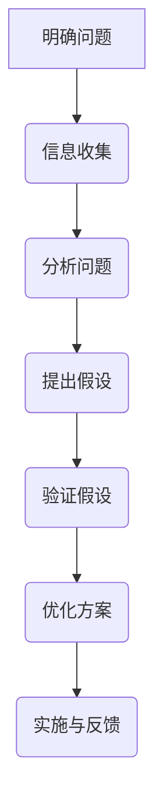
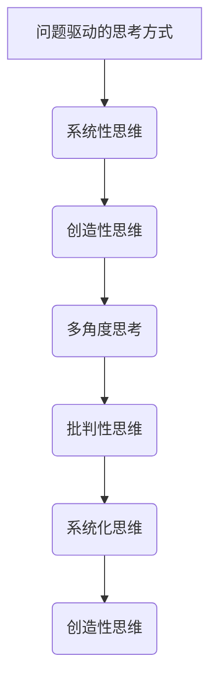
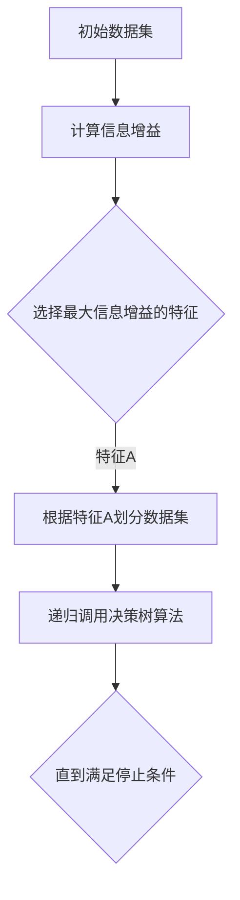
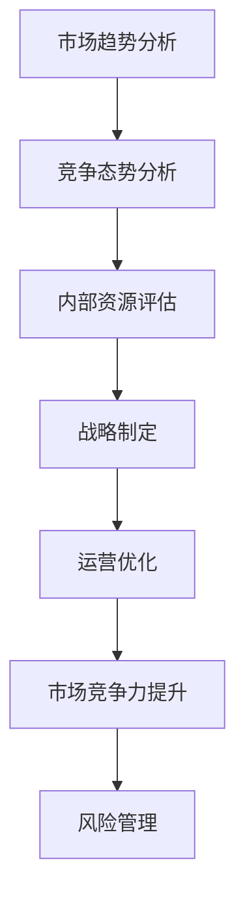

                 

### 第1章：深度思考的概念与重要性

#### 1.1.1 深度思考的定义

深度思考（Deep Thinking）是一种通过深入分析、系统思考和逻辑推理来理解复杂问题和解决难题的思维方式。它不同于浅层思考，不是停留在表面层次的信息处理，而是需要投入时间和精力，进行深入挖掘和探究。深度思考者会努力理解问题的本质，探究潜在原因和根本解决方案，而不仅仅是解决眼前的问题。

在IT领域，深度思考尤为重要。软件开发、算法设计、项目管理等环节都需要深入理解问题的核心，寻找最优解决方案。缺乏深度思考，可能会导致代码冗余、算法效率低下、项目进度延误等问题。因此，培养深度思考能力对于提升IT从业者的综合素质和职业发展具有重要意义。

#### 1.1.2 深度思考与浅层思考的区别

深度思考与浅层思考有明显的区别。浅层思考通常是指对信息的快速处理和表面层次的思考，而深度思考则强调对信息的深入理解和全面分析。以下是一些具体的区别：

1. **思考层次**：浅层思考停留在表面，关注的是问题的一些表象和具体细节，而深度思考则深入到问题的本质和背后的原理，寻找根本原因和解决方案。

2. **思考过程**：浅层思考往往依靠直觉和经验，快速得出结论，而深度思考则需要通过系统化的分析、逻辑推理和实验验证来得出结论。

3. **解决问题**：浅层思考可能只能解决眼前的问题，而深度思考则能够从根本上解决问题，避免类似问题再次发生。

4. **创造力**：深度思考鼓励创造性思维，能够提出独特的解决方案和创新的思路，而浅层思考则较少涉及创新。

#### 1.1.3 深度思考的重要性

深度思考在个人成长、问题解决和决策制定等方面都具有重要作用。以下是深度思考的重要性的具体体现：

1. **个人成长**：深度思考能够帮助人们更深入地理解自己和他人的想法，提高自我认知和沟通能力。同时，深度思考还能够培养批判性思维，使个人在面对复杂问题时能够冷静分析和应对。

2. **问题解决**：在问题解决过程中，深度思考能够帮助人们找到问题的根本原因，提出有效的解决方案。例如，在软件开发中，深度思考有助于发现代码中的潜在缺陷和优化方向，提高代码质量和系统性能。

3. **决策制定**：在决策制定过程中，深度思考能够帮助人们全面考虑各种因素，评估不同方案的优缺点，从而做出更加明智的决策。例如，在商业管理中，深度思考有助于企业制定科学的战略规划和市场策略。

总之，深度思考是一种宝贵的能力，它不仅能够提升个人的综合素质，还能够帮助组织在复杂的环境中取得成功。因此，培养和提升深度思考能力对于个人和组织的可持续发展具有重要意义。

#### 1.1.4 深度思考的步骤与方法

深度思考是一个系统化的过程，可以分为以下步骤：

1. **明确问题**：首先要明确需要解决的问题，理解问题的背景和具体要求。这一步骤非常重要，因为只有明确问题，才能有针对性地进行分析。

2. **信息收集**：收集与问题相关的各种信息，包括数据、文献、案例等。这一步骤的目的是为后续的分析提供充足的基础。

3. **分析问题**：对收集到的信息进行深入分析，寻找问题的根本原因。分析问题时，可以采用多种方法，如逻辑推理、因果分析、比较分析等。

4. **提出假设**：在分析的基础上，提出可能的解决方案或假设。这一步骤是深度思考的核心，需要充分发挥创造性思维。

5. **验证假设**：对提出的假设进行验证，通过实验、数据分析等方式来检验其有效性。验证假设的目的是确保解决方案的科学性和可行性。

6. **优化方案**：根据验证结果，对解决方案进行优化，提出最终的方案。优化方案的过程中，可以借鉴前人的经验和教训，避免重复错误。

7. **实施与反馈**：将最终的方案付诸实施，并在实施过程中进行持续的监控和反馈。通过反馈，可以及时发现问题并进行调整，确保方案的顺利实施。

在深度思考的过程中，还可以采用以下方法来提升思考的质量：

1. **多角度思考**：从不同角度和维度来分析问题，避免片面和短视。

2. **批判性思维**：对信息和分析过程进行批判性思考，识别潜在的错误和偏见。

3. **系统化思维**：将问题放在整个系统中进行分析，考虑各种因素之间的相互作用。

4. **创造性思维**：鼓励创新和尝试，寻找独特的解决方案。

通过上述步骤和方法，可以有效地进行深度思考，解决复杂问题，实现个人和组织的可持续发展。

### 1.1.5 深度思考的实际案例

为了更好地理解深度思考的应用，我们可以通过一个实际案例来具体说明。

**案例背景**：某公司计划开发一款新的手机应用程序，该公司希望通过这款应用程序提升用户满意度，并提高市场份额。

**深度思考过程**：

1. **明确问题**：公司需要解决的问题是如何通过这款应用程序提升用户满意度，并提高市场份额。

2. **信息收集**：
   - 调研现有市场上的类似应用程序，了解其功能、用户评价和市场份额。
   - 收集用户反馈，了解用户对现有应用程序的需求和不满。

3. **分析问题**：
   - 从用户反馈中找出用户最关心的问题，如应用程序的界面设计、功能完整性、性能等。
   - 分析现有应用程序的不足之处，如用户体验差、功能缺失、更新频率低等。

4. **提出假设**：
   - 假设1：通过优化界面设计和增加新功能，可以显著提升用户满意度。
   - 假设2：定期更新应用程序，解决现有问题，可以提升用户满意度。

5. **验证假设**：
   - 对假设1，通过用户调研和A/B测试，验证优化界面设计和增加新功能对用户满意度的影响。
   - 对假设2，通过数据分析，验证定期更新应用程序对用户满意度的影响。

6. **优化方案**：
   - 根据验证结果，对界面设计和功能进行优化，确保用户满意度提升。
   - 制定定期更新计划，确保应用程序持续改进。

7. **实施与反馈**：
   - 实施优化后的应用程序，并持续收集用户反馈。
   - 根据用户反馈，进行持续优化，确保用户满意度持续提升。

通过上述深度思考的过程，公司可以制定出有效的策略，提升用户满意度，从而提高市场份额。

### 总结

本章对深度思考的概念、重要性、区别、方法及其在实际中的应用进行了详细阐述。通过深度思考，我们可以更深入地理解问题，找到根本原因，提出创新性的解决方案。深度思考在个人成长、问题解决和决策制定等方面都具有重要作用，是每个IT从业者必备的能力。在接下来的章节中，我们将进一步探讨深度思考的核心原则、数学模型、实际应用以及如何训练和提升深度思考能力。

---

以下是第1章中提到的深度思考的概念与重要性的Mermaid流程图：



此流程图展示了深度思考的基本步骤，有助于我们更好地理解和应用深度思考的方法。

### 1.1.6 深度思考的重要性

深度思考的重要性不仅体现在个人成长和问题解决方面，还在商业管理和科技创新中发挥着关键作用。在商业管理中，深度思考能够帮助企业制定科学的战略规划、优化运营流程和提高市场竞争力。在科技创新中，深度思考能够推动科学发现和技术创新，促进社会进步。以下将详细探讨深度思考在商业管理和科技创新中的应用及其价值。

#### 深度思考在商业管理中的应用

1. **战略规划**：企业在制定战略规划时，需要深入分析市场环境、竞争对手和自身优势。深度思考能够帮助企业识别市场趋势、预测未来发展方向，从而制定出科学的战略规划。例如，一家电商企业通过深度思考分析用户行为和市场动态，发现社交媒体对电商销售的影响日益增加，于是决定加大社交媒体营销投入，取得了显著的销售增长。

2. **运营优化**：深度思考能够帮助企业优化运营流程，提高生产效率和降低成本。例如，一家制造业企业通过深度思考分析生产流程，发现生产中的瓶颈和资源浪费问题。通过优化生产流程和资源分配，企业不仅提高了生产效率，还降低了生产成本。

3. **风险管理**：深度思考能够帮助企业识别潜在风险，制定有效的风险管理策略。例如，一家金融企业在面临市场波动和信用风险时，通过深度思考分析市场数据和历史案例，制定出合理的风险规避策略，从而在市场波动中保持稳定运营。

4. **决策制定**：深度思考能够帮助企业做出更加明智的决策。在商业管理中，决策的正确与否往往关系到企业的生死存亡。通过深度思考，企业可以全面分析各种因素，评估不同决策的优缺点，从而做出更加科学的决策。例如，一家初创企业通过深度思考分析市场需求、竞争状况和自身资源，最终决定进军一个潜力巨大的市场，成功实现了快速发展。

#### 深度思考在科技创新中的应用

1. **科学发现**：深度思考能够推动科学发现，促进人类对自然世界的认识。科学家在进行研究时，需要通过深度思考理解科学现象、揭示科学规律。例如，爱因斯坦通过深度思考提出了相对论，为物理学领域带来了革命性的变化。

2. **技术创新**：深度思考能够推动技术创新，促进技术进步。在科技创新中，深度思考能够帮助工程师和研究人员理解技术原理、发现技术缺陷和提出改进方案。例如，苹果公司的工程师通过深度思考，不断优化iPhone的设计和性能，推出了具有革命性的新产品，引领了智能手机行业的发展。

3. **跨学科合作**：深度思考能够促进跨学科合作，推动多学科融合。在现代社会，科技创新往往需要多学科知识的融合。通过深度思考，不同学科的专家可以相互借鉴、相互启发，共同解决复杂问题。例如，生物医学领域的研究人员通过深度思考，将生物学、物理学和工程学等领域的知识结合起来，推动了生物医学技术的发展。

4. **社会进步**：深度思考能够推动社会进步，提高人类生活质量。科技创新带来的技术进步不仅改变了人类的生活方式，还改善了社会问题。例如，深度学习技术的发展为人工智能带来了突破，推动了医疗、教育、交通等领域的进步，提高了人类的生活质量。

#### 深度思考的价值

1. **提升创新能力**：深度思考能够激发创新能力，推动个人和组织不断进步。在创新过程中，深度思考可以帮助人们跳出传统思维框架，寻找新的解决方案。例如，乔布斯通过深度思考，提出了许多革命性的产品设计和商业模式，推动了苹果公司的发展。

2. **提高决策质量**：深度思考能够提高决策质量，减少决策失误。在商业管理中，决策的正确与否直接关系到企业的命运。通过深度思考，企业可以全面分析各种因素，评估不同决策的优缺点，从而做出更加科学的决策。

3. **增强竞争力**：深度思考能够增强企业的竞争力，帮助企业在激烈的市场竞争中立于不败之地。通过深度思考，企业可以深入了解市场需求、优化运营流程和提升产品质量，从而提高市场竞争力。

4. **推动社会进步**：深度思考能够推动社会进步，提高人类生活质量。科技创新带来的技术进步不仅改变了人类的生活方式，还改善了社会问题。例如，深度学习技术的发展为人工智能带来了突破，推动了医疗、教育、交通等领域的进步，提高了人类的生活质量。

总之，深度思考在商业管理和科技创新中具有重要作用。通过深度思考，企业可以制定科学的战略规划、优化运营流程和提高市场竞争力，科学家和研究人员可以推动科学发现和技术创新，促进社会进步。因此，培养和提升深度思考能力对于个人和组织的发展具有重要意义。

### 1.1.7 深度思考在个人成长中的应用

深度思考不仅在商业管理和科技创新中具有重要作用，在个人成长中也发挥着关键作用。通过深度思考，个人可以更好地理解自己、提升思维品质，从而实现全面发展。以下将详细探讨深度思考在个人成长中的具体应用和重要性。

#### 深度思考在职业规划中的应用

在职业规划中，深度思考能够帮助个人明确职业目标，制定科学的职业发展路径。通过深度思考，个人可以全面分析自身兴趣、能力和市场需求，从而找到适合自己的职业方向。以下是一个具体步骤：

1. **自我分析**：通过自我分析，了解自己的兴趣、优势和价值观。例如，通过反思过去的经历，找出自己喜欢的工作类型和擅长的技能。

2. **市场调研**：调研市场需求，了解不同职业的发展前景和机会。例如，通过查阅相关报告和行业数据，分析未来几年哪些行业和岗位具有较高需求。

3. **综合评估**：综合评估自身条件和市场状况，确定适合自己的职业方向。例如，如果个人对技术感兴趣，且市场需求旺盛，可以考虑从事软件开发或数据科学等领域。

4. **制定计划**：根据评估结果，制定详细的职业发展计划。例如，设定短期和长期目标，规划所需的学习和提升路径。

通过深度思考，个人可以更清晰地认识自己，明确职业目标，从而避免盲目跟风和职业发展停滞。

#### 深度思考在学习中的应用

深度思考在学习中具有重要意义，它能够帮助个人提高学习效果，掌握知识的核心原理。以下是一个具体的学习过程：

1. **理解概念**：在学习新知识时，首先要理解概念的本质。通过查阅资料、阅读书籍和请教他人，确保对概念有深入的理解。

2. **构建框架**：将新知识与已有的知识框架相结合，构建系统化的知识体系。例如，通过思维导图或笔记整理，将知识点串联起来，形成完整的知识网络。

3. **分析问题**：在学习过程中，遇到问题时不要急于求成，而是要深入分析问题的本质。通过提问和思考，找出问题的核心，从而找到解决问题的方法。

4. **实践应用**：将所学知识应用于实际场景，通过实践来加深理解。例如，通过编程练习、项目实践或案例分析，将理论知识转化为实际能力。

通过深度思考，个人可以更加系统地学习知识，提高学习效果，从而在职业和学术领域中取得更好的成绩。

#### 深度思考在自我提升中的应用

深度思考能够帮助个人自我提升，培养批判性思维和创造性思维，从而在个人成长中取得突破。以下是一个具体步骤：

1. **反思与总结**：定期进行反思和总结，回顾自己的成长经历和取得的成就。通过反思，找出成功和失败的原因，总结经验教训。

2. **设定目标**：根据反思结果，设定具体的个人成长目标。这些目标可以是技能提升、知识拓展或生活习惯的改变。

3. **制定计划**：制定实现目标的详细计划，包括学习、实践和反思的步骤。通过计划，确保个人成长目标的实现。

4. **持续改进**：在实现目标的过程中，不断进行反思和调整。通过持续改进，不断提升自己的能力和素质。

通过深度思考，个人可以更加清晰地认识自己，明确成长方向，从而实现全面发展。

#### 深度思考在人际关系中的应用

深度思考在人际关系中也具有重要意义，它能够帮助个人更好地理解和沟通他人。以下是一个具体的人际关系提升过程：

1. **倾听与理解**：在沟通中，要倾听对方的意见和需求，理解对方的观点和感受。通过深度思考，分析对方的言外之意，从而更好地理解对方。

2. **表达与沟通**：在表达自己的观点时，要用清晰、简洁的语言，确保对方理解。通过深度思考，找到合适的表达方式，提高沟通效果。

3. **解决冲突**：在人际关系中，难免会出现冲突。通过深度思考，分析冲突的原因和影响，找到合适的解决方案，从而化解冲突。

4. **建立信任**：深度思考能够帮助建立信任。通过真诚、理解和支持，赢得他人的信任和尊重。

通过深度思考，个人可以更好地理解和沟通他人，建立和谐的人际关系。

总之，深度思考在个人成长中具有重要作用。通过深度思考，个人可以明确职业目标、提高学习效果、自我提升和建立和谐人际关系，从而实现全面发展。因此，培养和提升深度思考能力对于个人成长具有重要意义。

### 总结

本章对深度思考在个人成长中的应用进行了详细探讨，从职业规划、学习、自我提升和人际关系等多个方面阐述了深度思考的重要性。通过深度思考，个人可以更清晰地认识自己，设定明确的职业目标，提高学习效果，实现自我提升，并建立和谐的人际关系。深度思考是一种宝贵的能力，它不仅能够提升个人的综合素质，还能够帮助个人在复杂的环境中取得成功。在接下来的章节中，我们将进一步探讨深度思考的核心原则、数学模型和实际应用，以帮助读者更好地理解和应用深度思考的方法。

---

以下是第1章中提到的深度思考的核心原则的Mermaid流程图：



此流程图展示了深度思考的核心原则，有助于我们更好地理解和应用这些原则。

### 第2章：深度思考的核心原则

深度思考是一种高度结构化的思维方式，它不仅仅涉及对问题的深入探究，还涉及一系列核心原则，这些原则有助于提升思考的深度和质量。本章将详细探讨深度思考的五个核心原则：问题驱动的思考方式、系统性思维、创造性思维、多角度思考和批判性思维。

#### 2.1 问题驱动的思考方式

问题驱动的思考方式是一种以解决问题为导向的思考模式。它强调在思考过程中始终围绕问题展开，通过对问题的不断追问和深入分析，找到问题的根源和解决策略。以下是一个问题驱动的思考过程：

1. **明确问题**：首先需要明确需要解决的问题，理解问题的背景和具体要求。

2. **分解问题**：将复杂问题分解为更小、更具体的子问题，以便更容易理解和解决。

3. **收集信息**：收集与问题相关的各种信息，包括数据、文献、案例等。

4. **分析信息**：对收集到的信息进行深入分析，寻找问题的根本原因。

5. **提出假设**：在分析的基础上，提出可能的解决方案或假设。

6. **验证假设**：通过实验、数据分析等方式来检验假设的有效性。

7. **优化方案**：根据验证结果，对解决方案进行优化，提出最终的方案。

8. **实施与反馈**：将最终的方案付诸实施，并在实施过程中进行持续的监控和反馈。

问题驱动的思考方式有助于我们更系统地分析和解决问题，避免在思考过程中偏离主题，从而提高思考的针对性和有效性。

#### 2.2 系统性思维

系统性思维是一种从整体和系统的角度来分析和解决问题的思维方式。它强调事物之间的相互关系和相互作用，通过综合考虑各种因素来寻求最佳解决方案。以下是一个系统性思维的思考过程：

1. **识别系统**：首先需要识别和分析问题的系统，理解系统内部的各个组成部分及其相互关系。

2. **分析系统**：对系统内部各个组成部分及其相互关系进行详细分析，找出系统中的关键因素和关键环节。

3. **确定目标**：明确需要解决的问题和目标，确保思考过程围绕目标展开。

4. **设计方案**：根据分析结果，设计出符合目标要求的解决方案，确保方案能够综合考虑系统内部的各种因素。

5. **评估方案**：对设计方案进行评估，确保方案能够有效解决系统中的问题，同时不会对其他部分产生负面影响。

6. **实施方案**：将设计方案付诸实施，并在实施过程中进行持续的监控和调整。

系统性思维有助于我们更全面地分析和解决问题，避免因片面考虑而导致的问题，从而提高解决方案的可行性和有效性。

#### 2.3 创造性思维

创造性思维是一种通过创新的思维方式和思维技巧来解决问题和创造新价值的思维方式。它鼓励跳出传统思维框架，寻找独特的解决方案。以下是一个创造性思维的思考过程：

1. **发现问题**：首先需要识别和明确需要解决的问题。

2. **收集信息**：收集与问题相关的各种信息，包括已有的知识和案例。

3. **头脑风暴**：通过头脑风暴的方式，提出尽可能多的解决方案，不论这些方案是否可行。

4. **筛选方案**：对提出的解决方案进行筛选，选择最有创意且具有可行性的方案。

5. **评估方案**：对筛选出的方案进行评估，评估其可行性、有效性和创新性。

6. **实施与反馈**：将最终选定的方案付诸实施，并在实施过程中进行持续的监控和反馈。

创造性思维有助于我们打破常规，寻找创新的解决方案，从而提高问题的解决质量和效率。

#### 2.4 多角度思考

多角度思考是一种从多个不同角度来分析问题的思维方式。它强调在不同维度和视角下分析问题，避免片面和短视。以下是一个多角度思考的思考过程：

1. **确定问题**：明确需要解决的问题。

2. **分析问题**：从多个角度和维度来分析问题，例如，从技术、经济、社会、环境等不同方面进行思考。

3. **收集信息**：收集与问题相关的各种信息，确保信息来源的多样性和准确性。

4. **综合分析**：对收集到的信息进行综合分析，寻找不同角度之间的关联和相互影响。

5. **提出假设**：基于综合分析的结果，提出可能的解决方案或假设。

6. **验证假设**：通过实验、数据分析等方式来检验假设的有效性。

7. **优化方案**：根据验证结果，对解决方案进行优化，提出最终的方案。

多角度思考有助于我们更全面地分析问题，避免因片面考虑而导致的问题，从而提高解决方案的可行性和有效性。

#### 2.5 批判性思维

批判性思维是一种通过批判性分析和评估来思考和解决问题的思维方式。它强调对信息、分析和解决方案进行批判性思考，识别潜在的错误和偏见。以下是一个批判性思维的思考过程：

1. **确定问题**：明确需要解决的问题。

2. **收集信息**：收集与问题相关的各种信息，确保信息的全面性和准确性。

3. **评估信息**：对收集到的信息进行评估，识别信息的可信度和可靠性。

4. **分析信息**：对评估后的信息进行深入分析，找出问题的主要因素和潜在原因。

5. **提出假设**：基于分析结果，提出可能的解决方案或假设。

6. **评估假设**：对提出的假设进行评估，识别其合理性和可行性。

7. **验证假设**：通过实验、数据分析等方式来检验假设的有效性。

8. **优化方案**：根据验证结果，对解决方案进行优化，提出最终的方案。

批判性思维有助于我们识别和纠正错误，避免因偏见和错误而导致的问题，从而提高思考的质量和解决方案的有效性。

### 总结

本章详细探讨了深度思考的五个核心原则：问题驱动的思考方式、系统性思维、创造性思维、多角度思考和批判性思维。这些原则有助于提升思考的深度和质量，帮助我们更全面、深入地分析问题，提出创新的解决方案。在接下来的章节中，我们将进一步探讨深度思考的数学模型与实际应用，以帮助读者更好地理解和应用深度思考的方法。

---

以下是第2章中提到的深度思考的核心原则的Mermaid流程图：


此流程图展示了深度思考的核心原则，有助于我们更好地理解和应用这些原则。

### 第3章：深度思考的数学模型与数学公式

深度思考不仅仅是直觉和经验的运用，还需要严谨的数学模型和公式的支持。数学作为一种精确的语言，能够帮助我们更加系统地分析和解决复杂问题。本章将介绍深度思考中常用的数学模型和公式，并解释它们在问题解决中的应用。

#### 3.1.1 熵与信息论

信息论是由克劳德·香农创立的，旨在量化信息的不确定性。在深度思考中，信息论的概念可以帮助我们理解信息的价值和处理复杂系统的方法。熵是信息论中的一个核心概念，它描述了一个系统中的不确定性程度。

**熵的计算公式：**
\[ H(X) = -\sum_{i=1}^{n} p(x_i) \log_2 p(x_i) \]

- \( H(X) \) 表示熵，量化了随机变量 \( X \) 的不确定性。
- \( p(x_i) \) 表示事件 \( x_i \) 发生的概率。
- \( \log_2 p(x_i) \) 表示事件发生的概率对数的负值，反映了事件发生的“意外”程度。

熵的应用场景包括：
1. **数据压缩**：通过计算数据中的熵，可以确定数据压缩的潜力。熵越低，数据压缩的效果越好。
2. **信息价值评估**：熵可以帮助我们评估信息的价值，信息量大的事件往往更有价值。

**示例**：
假设有一个随机变量 \( X \)，其可能的取值为 \( \{0, 1\} \)，且 \( p(X=0) = 0.5 \)，\( p(X=1) = 0.5 \)。计算 \( X \) 的熵：
\[ H(X) = - (0.5 \log_2 0.5 + 0.5 \log_2 0.5) = 1 \]
这意味着 \( X \) 的熵为 1，表示事件 \( X \) 的不确定性最大。

#### 3.1.2 基本概率分布与期望

在深度思考中，概率分布和期望是评估和预测系统性能的重要工具。概率分布描述了一个随机变量可能取的值及其概率，而期望则是衡量随机变量平均取值的指标。

**概率分布公式：**
\[ P(X = x) = p(x) \]

**期望公式：**
\[ E(X) = \sum_{i=1}^{n} x_i p(x_i) \]

- \( E(X) \) 表示期望，量化了随机变量 \( X \) 的平均值。
- \( x_i \) 表示随机变量可能取的值。
- \( p(x_i) \) 表示该值的概率。

概率分布和期望的应用场景包括：
1. **风险管理**：通过概率分布和期望，可以评估风险事件的可能性和影响。
2. **预测分析**：期望可以帮助预测随机变量的未来表现。

**示例**：
假设有一个随机变量 \( X \)，其概率分布为 \( P(X=1) = 0.3 \)，\( P(X=2) = 0.4 \)，\( P(X=3) = 0.3 \)。计算 \( X \) 的期望：
\[ E(X) = 1 \cdot 0.3 + 2 \cdot 0.4 + 3 \cdot 0.3 = 2.2 \]
这意味着 \( X \) 的期望值为 2.2。

#### 3.1.3 决策树与随机森林

决策树是一种常用的数据分析方法，它通过一系列的判断节点和结果节点来表示决策过程。随机森林是一种基于决策树的集成学习方法，它通过构建多个决策树并对它们进行集成来提高预测性能。

**决策树基本结构：**
- **根节点**：表示整个数据集。
- **内部节点**：表示特征条件。
- **叶子节点**：表示分类结果。

**决策树算法伪代码：**
```
决策树（数据集 D）：
1. 如果 D 中数据全部属于同一类别，返回该类别作为结果
2. 否则，找到信息增益最大的特征 A
3. 将 D 划分为子数据集 D1, D2, ..., Dk，基于特征 A 的不同取值
4. 对于每个子数据集 Di，递归调用决策树算法
```

**随机森林算法伪代码：**
```
随机森林（数据集 D，特征数 m，树数 n）：
1. 对于每个树，从 D 中随机抽取子数据集 Di
2. 对于每个子数据集 Di，构建决策树
3. 对于新的数据点 x，将 x 通过每棵树进行分类，取多数表决结果作为最终分类结果
```

决策树和随机森林的应用场景包括：
1. **分类问题**：用于对数据进行分类，例如邮件分类、图像识别等。
2. **回归问题**：通过回归树来预测连续值。

**示例**：
假设有一个数据集，包含两个特征 \( X_1 \) 和 \( X_2 \)，我们使用决策树对其进行分类。首先，我们计算每个特征的增益，选择增益最大的特征作为分割依据。然后，递归地对子数据集进行分割，直到满足停止条件（如节点中所有数据属于同一类别）。

通过上述数学模型和公式的介绍，我们可以看到数学在深度思考中扮演着重要的角色。这些模型和公式不仅帮助我们在复杂问题中找到清晰的思路，还能够提高我们的分析和预测能力。在接下来的章节中，我们将继续探讨深度思考的实际应用，以及如何在实际问题中运用这些数学模型。

### 3.1.4 熵与信息论的应用示例

为了更好地理解熵与信息论在实际问题中的应用，我们可以通过一个具体的示例来详细说明。

**案例背景**：假设我们正在设计一个在线广告系统，该系统能够根据用户的兴趣和偏好来推荐广告。为了提高广告的点击率，我们需要分析用户行为数据，并优化广告推荐算法。

**步骤1：收集用户行为数据**
首先，我们收集了大量的用户行为数据，包括用户浏览的网页、点击的广告、搜索的关键词等。这些数据将用于分析用户的行为模式，并为后续的算法优化提供基础。

**步骤2：计算广告内容的熵**
根据用户行为数据，我们可以计算每个广告内容的熵。熵的值反映了广告内容的随机性和不确定性。广告内容的熵可以通过以下公式计算：

\[ H(A) = -\sum_{i=1}^{n} p(a_i) \log_2 p(a_i) \]

其中，\( H(A) \) 表示广告内容的熵，\( p(a_i) \) 表示用户对第 \( i \) 个广告内容感兴趣的概率。

**示例计算**：
假设我们有三个广告内容 \( A_1, A_2, A_3 \)，且用户对这三个广告内容的兴趣概率分别为 \( p(A_1) = 0.3 \)，\( p(A_2) = 0.5 \)，\( p(A_3) = 0.2 \)。计算广告内容的熵：

\[ H(A) = - (0.3 \log_2 0.3 + 0.5 \log_2 0.5 + 0.2 \log_2 0.2) \approx 1.19 \]

这个熵值表示广告内容对用户兴趣的分布具有一定的随机性。

**步骤3：分析广告内容的熵**
通过计算广告内容的熵，我们可以了解广告内容的受欢迎程度和不确定性。熵值越高，表示广告内容对用户的吸引力越低，不确定性越大。相反，熵值越低，表示广告内容对用户的吸引力越高，确定性越大。

**步骤4：优化广告推荐算法**
基于对广告内容熵的分析，我们可以优化广告推荐算法。具体来说，我们可以采取以下措施：

1. **降低熵值高的广告**：对于熵值较高的广告内容，我们可以考虑减少推荐频率，或者优化广告内容，使其更符合用户的兴趣。

2. **提高熵值低的广告**：对于熵值较低的广告内容，我们可以增加推荐频率，确保用户能够更多地看到这些广告。

3. **动态调整推荐策略**：根据用户行为数据的变化，实时调整广告推荐策略。例如，当用户对某个广告内容表现出持续的兴趣时，我们可以增加该广告的推荐频率。

**步骤5：效果评估**
在实施优化措施后，我们需要对广告推荐的效果进行评估。通过比较优化前后的广告点击率、用户满意度等指标，我们可以评估优化措施的有效性。如果优化效果显著，我们可以继续优化广告推荐算法，以提高广告系统的整体性能。

通过这个案例，我们可以看到熵与信息论在实际问题中的应用。通过计算广告内容的熵，我们能够更好地理解用户的行为模式，并优化广告推荐算法，从而提高广告系统的性能和用户满意度。

### 3.1.5 基本概率分布与期望的应用示例

为了更直观地理解基本概率分布和期望在深度思考中的应用，我们可以通过一个实际的例子来说明如何利用这些数学工具进行问题分析和决策。

**案例背景**：假设你是一家电子商务公司的产品经理，正在考虑推出一种新产品。为了决定是否投入市场，你需要对产品的潜在市场需求进行预测和分析。

**步骤1：收集数据**
首先，你收集了市场调查数据，包括过去三年内相似产品的销售记录、目标用户群体的消费习惯和偏好等。这些数据将用于建立概率分布模型。

**步骤2：建立概率分布**
根据收集到的数据，你可以建立一个概率分布模型来预测新产品的市场需求。假设你估计新产品的市场需求有三种可能的水平：低需求（概率为0.2）、中等需求（概率为0.6）和高需求（概率为0.2）。

**概率分布公式：**
\[ P(M = m) = p(m) \]

其中，\( P(M = m) \) 表示市场需求为 \( m \) 的概率，\( p(m) \) 为对应的需求概率。

**步骤3：计算期望**
通过概率分布，你可以计算新产品的市场需求期望值，即平均市场需求。期望值反映了市场需求的中位数，是决策的重要依据。

**期望公式：**
\[ E(M) = \sum_{i=1}^{n} m_i p(m_i) \]

其中，\( E(M) \) 表示期望市场需求，\( m_i \) 表示市场需求水平，\( p(m_i) \) 为对应的需求概率。

**示例计算**：
\[ E(M) = 0.2 \times 1000 + 0.6 \times 1500 + 0.2 \times 2000 = 1400 \]
这意味着，根据概率分布模型预测，新产品的市场需求期望值为1400单位。

**步骤4：分析期望值**
通过计算出的期望值，你可以评估新产品的潜在市场规模和收益。如果期望市场需求高于你的生产和营销成本，那么推出新产品可能是可行的。如果期望市场需求低于成本，则可能需要重新评估产品策略或寻找其他市场机会。

**步骤5：制定决策**
基于期望值的分析，你决定投入市场。在接下来的步骤中，你将制定详细的市场营销策略，并监控产品的实际销售情况，以验证预测模型的准确性。

**步骤6：调整策略**
如果实际销售数据与预测模型存在显著偏差，你可以根据新的数据调整概率分布模型，并重新计算期望值。通过这种迭代过程，你可以不断优化产品策略，提高市场竞争力。

通过这个案例，我们可以看到如何利用基本概率分布和期望来指导商业决策。这种方法不仅提供了定量的预测，还帮助我们在不确定性中做出更加理性的决策。

### 3.1.6 决策树与随机森林的应用示例

为了更好地理解决策树与随机森林在实际应用中的作用，我们可以通过一个具体的案例来说明如何利用这些工具进行数据分析。

**案例背景**：假设你是一家金融机构的数据分析师，负责评估客户贷款申请的风险。你的目标是建立一套模型，能够根据客户的个人信息和行为数据，预测贷款申请是否会被批准。

**步骤1：数据收集**
首先，你收集了大量的历史数据，包括客户的年龄、收入、信用评分、贷款金额、贷款期限等。这些数据将用于训练和评估贷款风险预测模型。

**步骤2：数据预处理**
在数据收集完成后，你需要对数据进行分析和预处理。这包括缺失值的处理、异常值的检测和数据的标准化等步骤。例如，对于收入和贷款金额等数值型特征，你可以使用标准差缩放（Standardization）或最小-最大缩放（Min-Max Scaling）来归一化数据。

**步骤3：构建决策树**
接下来，你可以使用决策树算法来构建贷款风险预测模型。决策树通过一系列的判断节点和结果节点，将数据集划分为不同的类别。例如，你可以根据客户的信用评分和收入水平来划分贷款申请是否被批准。

**决策树算法伪代码：**
```
决策树（数据集 D）：
1. 如果 D 中数据全部属于同一类别，返回该类别作为结果
2. 否则，找到信息增益最大的特征 A
3. 将 D 划分为子数据集 D1, D2, ..., Dk，基于特征 A 的不同取值
4. 对于每个子数据集 Di，递归调用决策树算法
```

**步骤4：评估决策树模型**
在构建决策树后，你需要评估其预测性能。这可以通过交叉验证（Cross-Validation）等方法来完成。通过交叉验证，你可以确定决策树在独立数据集上的表现，从而评估其泛化能力。

**步骤5：构建随机森林**
由于单个决策树可能存在过拟合问题，你可以使用随机森林（Random Forest）来提高模型的预测性能。随机森林通过构建多个决策树并对它们进行集成来提高预测的稳定性和准确性。

**随机森林算法伪代码：**
```
随机森林（数据集 D，特征数 m，树数 n）：
1. 对于每个树，从 D 中随机抽取子数据集 Di
2. 对于每个子数据集 Di，构建决策树
3. 对于新的数据点 x，将 x 通过每棵树进行分类，取多数表决结果作为最终分类结果
```

**步骤6：评估随机森林模型**
与决策树类似，你需要评估随机森林模型的预测性能。通过交叉验证等方法，你可以确定随机森林在独立数据集上的表现，从而选择最佳的模型参数。

**步骤7：应用模型**
最后，你可以将训练好的随机森林模型应用于实际贷款申请数据，预测贷款申请的风险。通过模型预测，你可以为银行提供决策支持，帮助其更好地管理贷款风险。

通过这个案例，我们可以看到如何利用决策树和随机森林进行数据分析。这些工具不仅能够提高预测的准确性，还能够帮助我们在复杂的数据中找到关键特征和规律，从而做出更加科学的决策。

### 总结

本章介绍了深度思考中常用的数学模型和公式，包括熵与信息论、基本概率分布与期望、决策树与随机森林。通过这些模型和公式，我们可以更系统地分析和解决复杂问题。在接下来的章节中，我们将进一步探讨深度思考的实际应用，以及如何在不同的领域中运用这些数学工具。

---

以下是第3章中提到的决策树的Mermaid流程图：



此流程图展示了决策树的基本构建过程，有助于我们更好地理解和应用决策树算法。

### 第4章：深度思考在商业管理中的应用

深度思考在商业管理中具有广泛的应用，通过深入的思考和分析，企业可以更好地制定战略规划、优化运营流程和提高市场竞争力。以下将详细探讨深度思考在商业管理中的具体应用。

#### 4.1.1 深度思考在战略规划中的应用

战略规划是企业长期发展的关键，它需要企业对市场趋势、竞争态势和自身资源进行全面的分析和评估。深度思考在这个过程中起着至关重要的作用。

1. **市场趋势分析**：企业需要通过深度思考，分析市场趋势，预测未来的发展方向。这包括对技术进步、消费者行为变化、政策法规等方面的分析。例如，随着人工智能和大数据技术的快速发展，企业需要考虑如何利用这些新技术来优化产品和服务。

2. **竞争态势分析**：企业需要通过深度思考，分析竞争对手的优劣势，了解自己在市场中的地位。这包括对竞争对手的产品、定价策略、市场份额等方面的分析。例如，通过对比分析，企业可以找到自己的独特竞争优势，从而制定出更具针对性的战略规划。

3. **内部资源评估**：企业需要通过深度思考，评估自身的资源，包括人力、财务、技术等。这包括对资源利用效率、潜在发展空间等方面的分析。例如，通过评估，企业可以找到资源利用不充分的地方，从而进行优化和调整。

4. **战略制定**：在上述分析的基础上，企业需要通过深度思考，制定出符合自身实际情况的战略规划。这包括明确企业的愿景、使命和目标，制定具体的实施策略和行动计划。例如，通过战略制定，企业可以确保在未来的发展中保持竞争力。

#### 4.1.2 深度思考在运营优化中的应用

运营优化是企业提高效率、降低成本、提升客户满意度的重要手段。深度思考在这个过程中可以帮助企业找到优化方向，制定有效的优化策略。

1. **流程分析**：企业需要通过深度思考，分析现有的运营流程，找出存在瓶颈和浪费的地方。这包括对生产、采购、物流、销售等各个环节的分析。例如，通过流程分析，企业可以发现生产过程中的资源浪费和效率低下问题。

2. **数据驱动**：企业需要通过深度思考，利用数据来驱动运营优化。这包括收集和分析运营数据，利用数据分析结果来指导运营决策。例如，通过数据分析，企业可以优化库存管理，减少库存成本，提高资金周转率。

3. **创新思维**：企业需要通过深度思考，运用创新思维来优化运营流程。这包括寻找新的方法和技术，改进现有流程。例如，通过创新思维，企业可以采用自动化技术来提高生产效率，降低人力成本。

4. **持续改进**：企业需要通过深度思考，建立持续改进机制，不断优化运营流程。这包括定期评估运营效果，发现存在的问题，并提出改进措施。例如，通过持续改进，企业可以不断提高运营效率，降低运营成本。

#### 4.1.3 深度思考在市场竞争力提升中的应用

市场竞争力是企业长期发展的关键，通过深度思考，企业可以提升市场竞争力，确保在激烈的市场竞争中立于不败之地。

1. **产品定位**：企业需要通过深度思考，确定产品的市场定位。这包括分析目标市场、竞争对手和自身优势，制定符合市场需求的产品策略。例如，通过产品定位，企业可以确保产品在市场中具有竞争优势。

2. **品牌建设**：企业需要通过深度思考，打造强大的品牌形象。这包括建立品牌价值观、传递品牌理念，提高品牌知名度和美誉度。例如，通过品牌建设，企业可以增强消费者对品牌的忠诚度，提高市场份额。

3. **营销策略**：企业需要通过深度思考，制定有效的营销策略。这包括分析消费者行为、市场环境，制定有针对性的营销方案。例如，通过营销策略，企业可以吸引更多的潜在客户，提高销售额。

4. **客户关系管理**：企业需要通过深度思考，建立良好的客户关系。这包括了解客户需求、提供优质的客户服务，提高客户满意度。例如，通过客户关系管理，企业可以培养忠诚客户，提高客户复购率。

#### 4.1.4 深度思考在风险管理中的应用

风险管理是企业确保稳定发展的关键，通过深度思考，企业可以更好地识别和应对风险，确保企业的安全运营。

1. **风险评估**：企业需要通过深度思考，评估可能面临的风险。这包括分析外部环境、内部运营等方面可能存在的风险。例如，通过风险评估，企业可以提前识别潜在风险，采取预防措施。

2. **风险控制**：企业需要通过深度思考，制定风险控制策略。这包括制定应急预案、风险隔离措施等，确保在风险发生时能够有效应对。例如，通过风险控制，企业可以降低风险对业务的影响，确保企业的正常运营。

3. **风险监测**：企业需要通过深度思考，建立风险监测机制，实时监控风险的变化。这包括定期评估风险状况、收集和分析风险信息等。例如，通过风险监测，企业可以及时发现问题，采取调整措施。

4. **风险应对**：企业需要通过深度思考，制定风险应对策略。这包括分析不同应对方案的优缺点，选择最佳方案。例如，通过风险应对，企业可以降低风险损失，确保企业的稳健发展。

### 总结

深度思考在商业管理中具有广泛的应用，通过深入的思考和分析，企业可以更好地制定战略规划、优化运营流程和提高市场竞争力。在接下来的章节中，我们将进一步探讨深度思考在科技创新和个人成长中的应用，以帮助读者全面了解深度思考的重要性。

---

以下是第4章中提到的战略规划分析的Mermaid流程图：



此流程图展示了深度思考在商业管理中的战略规划分析过程，有助于我们更好地理解和应用深度思考的方法。

### 4.1.1 深度思考在商业管理中的应用示例

为了更好地理解深度思考在商业管理中的应用，我们可以通过一个具体的案例来说明如何利用深度思考来解决实际业务问题。

**案例背景**：某家大型零售企业正在面临市场竞争激烈、销售下滑的问题。为了扭转局面，企业决定通过深度思考进行全面的业务分析和优化。

**步骤1：市场趋势分析**
首先，企业通过市场调查和数据分析，深入了解市场趋势和消费者行为的变化。例如，企业发现随着互联网的发展，越来越多的消费者倾向于在线购物，而传统实体店的客流量明显下降。

**步骤2：竞争态势分析**
接下来，企业对竞争对手进行了详细的调研和分析。通过对比分析，企业发现其主要竞争对手在以下几个方面具有优势：
- 竞争对手的在线渠道更加完善，用户体验更好。
- 竞争对手在产品创新和品牌推广方面更具活力。
- 竞争对手的物流配送速度更快，客户满意度更高。

**步骤3：内部资源评估**
企业对自身的资源进行了全面的评估，包括人力资源、财务状况、技术能力和市场网络等。评估结果显示，企业在某些方面存在不足：
- 企业的人力资源结构不合理，缺乏具备互联网营销和数据分析能力的专业人才。
- 企业在财务方面存在一定的压力，资金周转速度较慢。
- 企业在技术方面相对落后，缺乏创新的在线渠道和营销策略。

**步骤4：战略制定**
基于上述分析，企业制定了以下战略：
- 建立完善的在线渠道，提高用户体验。企业计划投入更多的资源来开发和优化电子商务平台，并引入先进的用户数据分析工具，以提供更加个性化的购物体验。
- 加强产品创新和品牌推广。企业计划增加研发投入，推出更具竞争力的新产品，并通过社交媒体和线上广告等方式加强品牌推广，提高市场知名度。
- 提升物流配送速度。企业计划与第三方物流公司合作，优化物流网络，确保更快的配送速度，从而提高客户满意度。

**步骤5：运营优化**
在战略制定的基础上，企业开始对运营流程进行优化。具体措施包括：
- 优化供应链管理，提高库存周转率，减少库存成本。
- 加强员工培训，提升员工的专业技能和服务水平。
- 优化物流配送流程，提高配送效率。

**步骤6：市场竞争力提升**
通过实施上述战略和优化措施，企业显著提升了市场竞争力。例如：
- 在线渠道的建立和完善，使得企业的销售额大幅增长。
- 产品创新和品牌推广，使得企业市场份额逐步提高。
- 物流配送速度的提升，使得客户满意度显著提高。

**步骤7：风险管理**
企业还通过深度思考，建立了完善的风险管理机制。具体措施包括：
- 定期进行风险评估，识别潜在风险。
- 制定应急预案，确保在风险发生时能够迅速响应。
- 加强内部监控，确保风险管理的有效性。

通过这个案例，我们可以看到深度思考在商业管理中的具体应用。通过深入分析市场趋势、竞争态势和内部资源，企业能够制定出科学的战略规划，优化运营流程，提升市场竞争力，从而实现可持续发展。

### 4.1.2 深度思考在科技创新中的应用

深度思考在科技创新中发挥着至关重要的作用。通过深入分析问题、探索新的解决方案，科技工作者能够推动科学发现和技术创新，为人类社会带来巨大的进步。以下将详细探讨深度思考在科技创新中的具体应用。

#### 4.1.2.1 科学研究中的应用

在科学研究中，深度思考能够帮助科学家们更全面、深入地理解自然现象，发现新的科学规律。以下是一个科学研究中的深度思考应用案例：

**案例背景**：科学家们试图研究黑 Hole 的性质和行为。这是一个极其复杂和抽象的领域，需要深入的思考和分析。

**步骤1：明确问题**：科学家们首先需要明确研究问题，例如，黑 Hole 的引力如何影响周围的时空结构，以及黑 Hole 是否能够辐射能量。

**步骤2：信息收集**：科学家们需要收集与黑 Hole 相关的现有研究成果，包括物理理论、实验数据和模拟结果等。

**步骤3：分析问题**：在收集到足够的信息后，科学家们需要对这些信息进行深入分析，尝试构建一个系统的理论框架来解释黑 Hole 的性质和行为。

**步骤4：提出假设**：在分析的基础上，科学家们提出一系列假设，例如，黑 Hole 是否存在一个事件视界，以及事件视界的性质如何。

**步骤5：验证假设**：为了验证假设，科学家们设计实验或进行数值模拟，收集数据并进行分析，以验证假设的正确性。

**步骤6：优化理论**：根据验证结果，科学家们不断优化和改进理论模型，以更好地解释实验数据和观测结果。

**步骤7：发表研究成果**：最后，科学家们将研究成果发表在学术期刊上，与其他科学家进行交流和讨论，推动科学进步。

通过深度思考，科学家们能够从不同角度和维度来分析问题，提出创新的假设和理论，从而推动科学发现和技术创新。

#### 4.1.2.2 技术创新中的应用

在技术创新中，深度思考能够帮助工程师和研究人员理解技术原理、发现技术缺陷和提出改进方案。以下是一个技术创新中的深度思考应用案例：

**案例背景**：某家科技公司正在开发一种新型电池技术，以提高电动汽车的续航能力和效率。

**步骤1：明确问题**：公司首先需要明确技术创新的目标，例如，如何提高电池的能量密度、降低电池的重量和成本，以及如何延长电池的使用寿命。

**步骤2：信息收集**：公司需要收集与电池技术相关的现有研究成果，包括材料科学、化学工程和电子工程等方面的知识。

**步骤3：分析问题**：在收集到足够的信息后，公司需要对电池技术进行全面分析，包括电池的工作原理、现有技术的优缺点以及潜在的技术改进方向。

**步骤4：提出假设**：在分析的基础上，公司提出一系列假设，例如，通过改进电池材料可以提高电池的能量密度，或者通过优化电池结构可以提高电池的稳定性。

**步骤5：验证假设**：为了验证假设，公司进行实验室实验和数值模拟，测试电池的性能和稳定性，收集数据并进行分析。

**步骤6：优化方案**：根据验证结果，公司不断优化电池设计方案，改进电池材料和结构，以提高电池的性能和效率。

**步骤7：产品开发**：最后，公司将优化后的设计方案应用于产品开发，制造出新型电池，并对其进行测试和验证。

通过深度思考，公司在技术创新过程中能够不断发现和解决问题，提高产品性能和竞争力。

#### 4.1.2.3 跨学科合作中的应用

深度思考在跨学科合作中也具有重要应用。通过深度思考，不同学科的专家能够相互借鉴、相互启发，共同解决复杂问题。以下是一个跨学科合作的深度思考应用案例：

**案例背景**：某家科技公司正在开发一种基于人工智能的自动驾驶技术，需要结合计算机科学、机械工程和心理学等多学科知识。

**步骤1：明确问题**：公司需要明确自动驾驶技术的关键问题，例如，如何确保自动驾驶车辆在复杂交通环境中的安全性和稳定性。

**步骤2：信息收集**：公司需要收集与自动驾驶技术相关的多学科研究成果，包括机器学习算法、传感器技术、人机交互和交通规则等。

**步骤3：分析问题**：在收集到足够的信息后，公司需要对自动驾驶技术进行跨学科分析，包括如何结合不同学科的知识来提高自动驾驶的性能和安全性。

**步骤4：提出假设**：在分析的基础上，公司提出一系列假设，例如，通过改进机器学习算法可以提高自动驾驶的准确性和鲁棒性，或者通过优化传感器布局可以提高自动驾驶的感知能力。

**步骤5：验证假设**：为了验证假设，公司进行实验和模拟测试，验证不同学科的假设是否成立。

**步骤6：优化方案**：根据验证结果，公司不断优化自动驾驶方案，结合不同学科的知识，以提高自动驾驶的性能和安全性。

**步骤7：产品开发**：最后，公司将优化后的自动驾驶方案应用于产品开发，制造出具备高级自动驾驶功能的车辆，并对其进行测试和验证。

通过深度思考，公司在跨学科合作中能够充分发挥各学科的优势，共同解决复杂问题，推动自动驾驶技术的发展。

#### 总结

深度思考在科技创新中具有广泛的应用。通过深度思考，科学家和工程师能够更全面、深入地理解问题，提出创新的解决方案，推动科学发现和技术创新。在接下来的章节中，我们将进一步探讨深度思考在个人成长和综合应用中的重要性，以帮助读者全面了解深度思考的广泛应用。

### 4.1.3 深度思考在个人成长中的应用

深度思考不仅在商业管理和科技创新中发挥着重要作用，在个人成长中也同样具有重要应用。通过深度思考，个人可以更清晰地认识自己、规划职业生涯、提升学习能力，从而实现全面发展。以下将详细探讨深度思考在个人成长中的具体应用。

#### 4.1.3.1 职业规划中的应用

职业规划是每个人都需要面对的重要问题，深度思考能够帮助个人更准确地定位自己的职业方向，制定科学的职业发展路径。

1. **自我分析**：个人需要通过深度思考，分析自己的兴趣、价值观、技能和优势，找到与自身特点相符的职业领域。例如，通过反思自己的兴趣爱好和擅长领域，可以找到自己真正热爱的职业方向。

2. **市场调研**：在明确自己的职业兴趣后，个人需要通过深度思考，调研市场需求和职业发展趋势，了解不同职业的发展前景和机会。例如，通过查阅行业报告和职业指南，可以了解不同行业和岗位的未来发展趋势。

3. **目标设定**：在分析自身条件和市场需求的基础上，个人需要通过深度思考，设定明确的职业目标。这些目标可以是短期和长期的，例如，短期目标是提升某项技能，长期目标是实现职业晋升或转型。

4. **计划实施**：根据设定的职业目标，个人需要通过深度思考，制定详细的行动计划，包括所需的学习和提升路径。例如，如果目标是成为一名数据科学家，可以通过学习数据分析课程、参与项目实践和考取相关证书来实现。

5. **动态调整**：在职业发展过程中，个人需要不断通过深度思考，评估自身进展和市场变化，根据实际情况调整职业规划。例如，如果发现市场需求发生了变化，需要及时调整职业目标和发展路径。

#### 4.1.3.2 学习能力提升中的应用

深度思考能够提高个人的学习能力，帮助个人更好地掌握知识，提升学习效果。

1. **理解概念**：在学习新知识时，个人需要通过深度思考，深入理解概念的本质和原理。例如，在阅读教材或听课时，不仅要理解表面内容，还要思考概念的内在逻辑和适用场景。

2. **构建框架**：个人需要通过深度思考，将新知识与已有的知识框架相结合，构建系统化的知识体系。例如，通过思维导图或笔记整理，将知识点串联起来，形成完整的知识网络。

3. **分析问题**：在学习过程中，个人需要通过深度思考，分析遇到的困难和问题，找出解决问题的方法。例如，在编程学习中，通过分析代码错误，找到问题根源并进行调试。

4. **实践应用**：个人需要通过深度思考，将所学知识应用于实际场景，通过实践来加深理解。例如，通过项目实践、实验和案例分析，将理论知识转化为实际能力。

5. **持续反思**：个人需要通过深度思考，定期反思自己的学习过程，总结经验教训，不断优化学习方法。例如，通过记录学习日志和反思学习过程，找出学习中的问题和不足，并制定改进措施。

#### 4.1.3.3 自我提升中的应用

深度思考能够帮助个人自我提升，培养批判性思维和创造性思维，从而实现全面发展。

1. **批判性思维**：个人需要通过深度思考，培养批判性思维，对信息、分析和解决方案进行批判性思考，识别潜在的错误和偏见。例如，在阅读书籍和文章时，要批判性地分析作者的观点和论据，提出自己的见解。

2. **创造性思维**：个人需要通过深度思考，培养创造性思维，寻找独特的解决方案和创新点。例如，在解决问题时，不仅要考虑常规方法，还要思考创新的解决方案，提出新的思路。

3. **持续学习**：个人需要通过深度思考，保持持续学习的习惯，不断更新知识和技能。例如，通过参加培训课程、阅读专业书籍和参与行业交流活动，不断提升自己的专业素养。

4. **实践反思**：个人需要通过深度思考，将所学知识和技能应用于实际工作中，并通过实践反思来不断提升自己。例如，在工作中遇到问题时，要通过深度思考找到解决方案，并反思解决问题的过程，总结经验教训。

5. **目标设定**：个人需要通过深度思考，设定清晰的目标，并制定实现目标的详细计划。例如，设定职业发展目标、学习目标和自我提升目标，并制定实现这些目标的详细计划。

#### 4.1.3.4 人际关系中的应用

深度思考能够帮助个人更好地理解和沟通他人，建立和谐的人际关系。

1. **倾听与理解**：在沟通中，个人需要通过深度思考，倾听对方的意见和需求，理解对方的观点和感受。例如，在讨论问题时，要站在对方的角度思考，理解对方的立场和利益。

2. **表达与沟通**：在表达自己的观点时，个人需要通过深度思考，用清晰、简洁的语言，确保对方理解。例如，在说明一个复杂问题时，要通过深度思考找到合适的表达方式，使对方容易理解。

3. **解决冲突**：在人际关系中，个人需要通过深度思考，分析冲突的原因和影响，找到合适的解决方案，从而化解冲突。例如，在处理团队冲突时，要通过深度思考找到根本原因，提出有效的解决方案。

4. **建立信任**：深度思考能够帮助个人建立信任，通过真诚、理解和支持，赢得他人的信任和尊重。例如，在团队合作中，通过深度思考了解团队成员的需求和期望，提供帮助和支持，从而建立信任关系。

#### 总结

深度思考在个人成长中具有广泛的应用，通过深度思考，个人可以更清晰地认识自己、提升学习能力、实现自我提升和建立和谐的人际关系。深度思考是一种宝贵的能力，它不仅能够提升个人的综合素质，还能够帮助个人在复杂的环境中取得成功。在接下来的章节中，我们将进一步探讨深度思考的训练与提升方法，以帮助读者更好地掌握深度思考的能力。

### 4.1.4 深度思考在个人成长中的应用示例

为了更好地理解深度思考在个人成长中的应用，我们可以通过一个具体的案例来说明如何利用深度思考来提升自我认知和职业发展。

**案例背景**：小李是一名软件工程师，工作多年后，他意识到自己的职业发展遇到了瓶颈，想要进一步提升自己的能力，以应对未来更大的挑战。

**步骤1：自我分析**
小李首先通过深度思考，分析自己的兴趣、价值观和技能。他发现，自己对编程和算法设计非常感兴趣，而且擅长解决复杂问题。同时，他也意识到自己在项目管理、团队协作和领导力方面还有很大的提升空间。

**步骤2：职业目标设定**
在分析自己的兴趣和优势后，小李通过深度思考，设定了明确的职业目标。他的短期目标是提升自己的编程和算法能力，长期目标是成为一名优秀的项目经理，能够在团队中发挥领导作用。

**步骤3：制定学习计划**
为了实现职业目标，小李制定了详细的学习计划。他通过深度思考，选择了几门与编程和项目管理相关的在线课程，包括算法设计与分析、软件工程、敏捷开发等。他还计划参加一些技术研讨会和行业交流活动，以扩展自己的知识网络。

**步骤4：实践与反思**
小李在学习过程中，通过深度思考，将所学知识应用于实际项目中。他在工作中积极参与新项目的开发，主动承担一些有挑战性的任务，通过实践来提升自己的技能。同时，他定期反思自己的学习过程和工作表现，总结经验教训，不断优化学习方法。

**步骤5：反馈与调整**
小李在工作中积极向同事和领导寻求反馈，通过深度思考，分析反馈信息，找出自己的不足和改进方向。例如，他发现自己在沟通和协调方面存在一些问题，于是通过阅读相关书籍、参加沟通技巧培训等方式来提升自己的沟通能力。

**步骤6：持续提升**
在职业发展的过程中，小李通过深度思考，保持持续学习的习惯。他定期评估自己的职业目标和学习计划，根据实际情况进行调整。例如，当他发现自己在项目管理方面取得了显著进步时，他开始关注领导力和团队管理方面的知识，为未来的职业发展做好准备。

通过这个案例，我们可以看到深度思考在个人成长中的具体应用。通过深度思考，小李能够更清晰地认识自己，设定明确的职业目标，制定科学的学习计划，并通过实践和反思不断提升自己的能力和素质。深度思考不仅帮助小李克服了职业发展的瓶颈，还为他未来的职业发展奠定了坚实的基础。

### 4.1.5 深度思考在决策制定中的应用

深度思考在决策制定中起着至关重要的作用。通过深度思考，个人和组织可以更全面、准确地分析问题，评估不同决策的优缺点，从而做出更加明智的决策。以下将详细探讨深度思考在决策制定中的应用，并通过具体案例来说明如何通过深度思考进行有效的决策。

#### 4.1.5.1 明确决策目标

在进行决策时，首先要明确决策的目标。通过深度思考，可以帮助我们深入理解决策的目标，确保决策方向与总体目标一致。以下是一个明确决策目标的示例：

**案例背景**：一家初创公司计划开发一款新应用程序，公司需要决定是否投入大量资金进行市场推广。

**步骤1：明确目标**：公司通过深度思考，明确决策目标是提高新应用程序的市场占有率，从而实现盈利和长期发展。

**步骤2：分析市场环境**：公司通过调研，分析当前市场环境，包括竞争对手、市场需求和潜在客户群体。

**步骤3：评估推广方案**：公司评估不同的市场推广方案，包括线上广告、社交媒体营销和口碑传播等。

**步骤4：制定决策策略**：在分析的基础上，公司通过深度思考，制定出符合目标的决策策略，选择最适合的推广方案。

#### 4.1.5.2 收集和分析信息

在决策过程中，信息的收集和分析至关重要。通过深度思考，可以帮助我们全面、准确地收集和分析信息，为决策提供有力支持。以下是一个收集和分析信息的示例：

**案例背景**：一家制造企业计划引入新的生产设备，以提高生产效率和降低成本。

**步骤1：收集信息**：企业通过深度思考，收集与生产设备相关的各种信息，包括设备性能、价格、供应商资质和市场反馈等。

**步骤2：分析信息**：企业对收集到的信息进行深入分析，比较不同设备的优缺点，评估其对生产效率和成本的影响。

**步骤3：评估供应商**：企业通过深度思考，评估潜在供应商的资质和信誉，选择最可靠的供应商进行合作。

**步骤4：制定采购策略**：在分析的基础上，企业通过深度思考，制定出合理的采购策略，确保新设备的引入能够达到预期效果。

#### 4.1.5.3 评估不同决策方案

在决策过程中，通常会有多个备选方案。通过深度思考，可以帮助我们全面评估不同决策方案的优缺点，选择最优方案。以下是一个评估不同决策方案的示例：

**案例背景**：一家电商公司计划推出新的促销活动，以提高销售额。

**步骤1：列出备选方案**：公司通过深度思考，列出多个备选促销方案，包括满减优惠、赠品活动和优惠券等。

**步骤2：评估方案**：公司对每个备选方案进行深入评估，分析其对销售额、客户满意度和成本的影响。

**步骤3：制定决策**：在评估的基础上，公司通过深度思考，选择最符合目标且成本效益最高的促销方案。

#### 4.1.5.4 考虑潜在风险

在决策过程中，潜在风险是必须考虑的因素。通过深度思考，可以帮助我们识别和评估潜在风险，制定相应的应对措施。以下是一个考虑潜在风险的示例：

**案例背景**：一家科技公司计划发布一款新产品，公司需要考虑产品发布后的市场风险。

**步骤1：识别风险**：公司通过深度思考，识别产品发布可能面临的风险，包括市场需求不足、技术故障和竞争对手反应等。

**步骤2：评估风险**：公司对每个潜在风险进行评估，分析其发生的概率和对公司的影响。

**步骤3：制定应对措施**：在评估的基础上，公司通过深度思考，制定出相应的应对措施，确保产品发布能够顺利进行。

#### 4.1.5.5 监控和调整

在决策实施过程中，通过深度思考，可以帮助我们监控决策的执行情况，并根据实际情况进行调整。以下是一个监控和调整的示例：

**案例背景**：一家企业实施了一项新的运营策略，以提高客户满意度。

**步骤1：监控实施情况**：企业通过深度思考，监控新策略的实施情况，包括客户反馈、销售数据和员工满意度等。

**步骤2：分析实施效果**：企业对监控数据进行分析，评估新策略对客户满意度的影响。

**步骤3：调整策略**：在分析的基础上，企业通过深度思考，根据实际情况调整策略，确保新策略能够达到预期效果。

### 总结

通过深度思考，我们可以在决策制定过程中更加全面、准确地分析问题，评估不同决策方案的优缺点，考虑潜在风险，并根据实际情况进行调整。深度思考不仅能够帮助我们做出更加明智的决策，还能够提高我们的决策质量和执行力。在接下来的章节中，我们将继续探讨如何通过训练和提升来增强深度思考能力，以帮助我们在生活和工作中更加有效地应用深度思考。

### 第5章：深度思考的训练与提升

深度思考是一种可以通过训练和提升的能力。通过科学的方法和持续的努力，我们可以逐步提高深度思考的能力，使其在生活和工作中发挥更大的作用。本章将详细探讨深度思考的训练方法、实践技巧和自我评估与提升策略。

#### 5.1.1 深度思考的训练方法

要提升深度思考能力，我们需要采取一系列科学的方法和训练策略。以下是一些常见的训练方法：

1. **思维训练**：通过专门的思维训练课程和练习，提高逻辑思维、批判性思维和创造性思维能力。例如，可以通过解决逻辑谜题、玩策略游戏和进行辩论训练来提升思维品质。

2. **问题解决训练**：通过解决实际问题来提升深度思考能力。可以选择具有挑战性的问题，如数学难题、编程问题或商业案例，通过系统化的分析和解决来提升深度思考能力。

3. **案例分析训练**：通过分析经典案例，了解成功和失败的原因，学习如何从不同角度和维度进行分析。例如，可以阅读商业案例书籍、历史案例分析和科技案例研究，从案例中吸取经验教训。

4. **跨学科学习**：跨学科学习可以帮助我们拓宽视野，提高系统性思维和综合分析能力。可以选择与自身专业相关的跨学科课程或阅读相关领域的书籍和文献。

5. **实践锻炼**：将深度思考应用于实际工作和生活中，通过实践来提升深度思考能力。可以选择一些具有挑战性的项目或任务，通过实际操作来锻炼深度思考能力。

#### 5.1.2 深度思考的实践技巧

在实践深度思考时，我们需要掌握一些具体的技巧，以帮助我们在面对复杂问题时能够更加系统和深入地进行分析。以下是一些深度思考的实践技巧：

1. **保持好奇心**：好奇心是深度思考的驱动力。在面对新问题或新知识时，要始终保持好奇，不断提问和探索，以激发深度思考。

2. **批判性思维**：批判性思维是深度思考的核心。在分析问题时，不仅要接受现有的观点和理论，还要对其进行批判性评估，识别潜在的错误和偏见。

3. **系统性思维**：系统性思维是深度思考的重要组成部分。在分析问题时，要从整体和系统的角度出发，考虑各个部分之间的相互关系和相互作用。

4. **多角度思考**：在分析问题时，要从多个不同的角度和维度出发，全面考虑问题的各个方面。这有助于我们更全面地理解问题，找到潜在的解决方案。

5. **创造性思维**：创造性思维是深度思考的重要补充。在解决问题时，要跳出传统思维框架，寻找创新的解决方案和方法。

6. **持续反思**：在深度思考过程中，要不断进行反思，总结经验教训，发现和改进自己的思考方法。通过持续反思，我们可以不断提高深度思考能力。

#### 5.1.3 深度思考的自我评估与提升

自我评估是提升深度思考能力的重要手段。通过自我评估，我们可以了解自己在深度思考方面的优势和不足，并制定相应的提升计划。以下是一些深度思考的自我评估方法：

1. **反思日志**：通过记录反思日志，我们可以总结自己在思考和解决问题过程中的得失，分析成功和失败的原因，从而发现和改进自己的思考方法。

2. **同行评审**：通过与同行或导师交流，获取他们的反馈和建议，了解自己在深度思考方面的表现和不足，并从他们的经验中学习。

3. **定期评估**：定期进行自我评估，如每月或每季度，总结自己在深度思考方面的进步和不足，制定相应的提升计划。

4. **实践项目**：通过参与实际项目，将深度思考应用于实际工作中，通过实践来提升深度思考能力。可以在项目结束后，进行总结和反思，评估深度思考的效果。

5. **参加培训课程**：参加专业的深度思考培训课程，通过系统的学习和实践，提升深度思考能力。可以选择线上或线下的课程，根据自己的时间和需求进行选择。

通过上述方法和策略，我们可以逐步提升深度思考能力，使其在生活和工作中发挥更大的作用。深度思考不仅能够帮助我们更全面、深入地理解问题，还能够提高我们的决策质量和创新能力。在接下来的章节中，我们将进一步探讨深度思考在管理分析能力提升中的应用。

### 5.1.4 深度思考训练方法的具体案例

为了更好地理解深度思考训练方法的具体实施过程，我们可以通过一个实际案例来详细说明。以下是一个基于问题解决训练的案例，展示了如何通过深度思考训练来提高解决问题的能力。

**案例背景**：某企业正在面临一项重要的决策，即是否投资一个新技术项目。该项目涉及较高的成本和较大的市场风险，因此需要通过深度思考来评估其可行性。

**步骤1：明确问题**  
首先，明确需要解决的问题：评估新技术项目的投资可行性，并确定项目的预期收益和潜在风险。

**步骤2：收集信息**  
通过深度思考，系统性地收集与新技术项目相关的信息。这些信息包括：
- 市场需求：新技术在市场上的需求程度，竞争对手的情况，市场增长趋势等。
- 技术可行性：新技术的基本原理，技术实现的难度，现有技术的成熟度等。
- 成本分析：项目开发、生产、运营等各环节的成本，资金需求及筹措方式。
- 风险评估：市场风险、技术风险、财务风险等，并评估其可能的影响。

**步骤3：分析问题**  
在收集到充分的信息后，通过深度思考，对项目进行详细分析。分析过程包括以下几个方面：
- 市场分析：评估市场需求，分析目标客户群体，预测市场接受度，分析竞争对手的策略等。
- 技术分析：评估技术实现的可行性，分析技术风险，探索可能的替代方案，分析技术对市场竞争的影响等。
- 成本分析：分析项目的成本结构，成本控制措施，预期回报，评估项目的盈利能力等。
- 风险分析：评估潜在风险，分析风险的来源，可能的解决方案和风险应对策略。

**步骤4：提出假设**  
基于上述分析，通过深度思考，提出一系列假设，例如：
- 假设1：如果市场需求旺盛，项目有望成功。
- 假设2：如果技术实现难度较高，可能需要延长项目周期。
- 假设3：如果资金筹措困难，可能需要调整项目规模或推迟项目启动。

**步骤5：验证假设**  
通过收集更多的数据和进行实验，验证提出的假设。例如，可以通过市场调研来验证市场需求，通过技术测试来验证技术可行性，通过财务分析来验证成本和盈利预期。

**步骤6：优化方案**  
根据验证结果，通过深度思考，优化投资方案。如果假设得到验证，项目可行性较高，则可以进一步细化项目计划；如果假设未能验证，则需要对项目方案进行调整，甚至放弃投资。

**步骤7：实施与反馈**  
将优化后的投资方案付诸实施，并在实施过程中进行监控和反馈。通过定期评估项目进展，及时调整和优化项目计划，确保项目顺利进行。

通过这个案例，我们可以看到深度思考在问题解决中的应用过程。通过系统性的分析、假设验证和持续优化，企业能够更加科学地做出决策，降低投资风险，提高项目成功率。

### 5.1.5 深度思考实践技巧的具体案例

为了更好地展示深度思考在实践中的应用，我们可以通过一个具体的案例来说明如何运用深度思考的实践技巧来提升解决问题的能力。

**案例背景**：某电商公司在进行一次大型促销活动前的准备工作。公司需要制定一个详细的促销计划，确保活动能够顺利进行，同时达到预期的销售目标。

**步骤1：保持好奇心**  
在制定促销计划之前，团队中的每个成员都要保持好奇心，积极提出问题，如：
- 如何在短时间内吸引更多的潜在客户？
- 促销活动的具体形式和内容应该是什么？
- 活动预算如何分配才能最大化效果？

**步骤2：批判性思维**  
团队成员需要运用批判性思维来评估现有的促销策略和方案。例如：
- 分析过去的促销活动效果，找出成功和失败的原因。
- 评估竞争对手的促销策略，分析他们的优势和不足。
- 推翻假设，如“低价促销总是最有效的”这一观点，考虑其他可能的促销方式。

**步骤3：系统性思维**  
团队通过系统性思维，将促销活动的各个部分整合起来，考虑整体协调和资源分配。例如：
- 制定详细的促销时间表，包括预热期、活动期和恢复期。
- 分析促销活动对供应链的影响，确保库存和物流能够跟上活动需求。
- 考虑促销活动对客户体验的影响，如界面设计、客户服务响应时间等。

**步骤4：多角度思考**  
团队从多个角度来思考促销活动的方案，确保考虑全面。例如：
- 从市场营销的角度，分析不同推广渠道的效果，如社交媒体、电子邮件营销和搜索引擎优化。
- 从财务的角度，评估不同促销方案的成本效益，确保预算合理。
- 从技术角度，评估促销活动的技术实现难度和所需资源。

**步骤5：创造性思维**  
团队成员通过创造性思维，提出创新的促销方式和方案。例如：
- 设计一个互动性强的抽奖活动，增加用户参与度。
- 与知名KOL或网红合作，通过社交媒体宣传，扩大活动影响力。
- 举办限时秒杀活动，利用饥饿营销策略，刺激消费者购买欲望。

**步骤6：持续反思**  
在整个促销计划制定过程中，团队需要持续反思，评估每一步的决策和方案。例如：
- 定期召开会议，讨论促销计划的进展和问题。
- 收集和分析市场反馈，及时调整促销策略。
- 对促销活动进行总结，评估效果，为未来的促销活动提供参考。

通过上述深度思考的实践技巧，电商公司能够制定出一个科学、合理且创新的促销计划，从而提高活动的效果，实现销售目标。

### 5.1.6 深度思考的自我评估与提升策略

自我评估是提升深度思考能力的重要环节。通过定期自我评估，我们可以了解自己的深度思考水平，发现不足之处，并制定相应的提升策略。以下是一些自我评估与提升策略：

1. **建立反思日志**：
   - **目的**：记录思考过程和结果，反思决策的正确性和方法的有效性。
   - **操作**：每天或每周写下反思日志，记录自己在工作和生活中的思考和决策，分析成功的原因和失败的教训。

2. **进行定期回顾**：
   - **目的**：定期总结自己的思考过程，评估深度思考能力的发展。
   - **操作**：每月或每季度进行一次深度思考能力回顾，总结自己在不同场景下的思考表现，识别需要提升的方面。

3. **设定个人目标**：
   - **目的**：明确提升深度思考能力的具体方向和目标。
   - **操作**：根据自我评估的结果，设定具体的提升目标，如提高逻辑思维能力、增强系统性思维、提升批判性思维等。

4. **寻求外部反馈**：
   - **目的**：通过外部反馈了解自己的思考表现，获得改进建议。
   - **操作**：向同事、导师或专业教练寻求反馈，了解他们在深度思考方面的观察和建议，并根据反馈进行调整。

5. **参与思维训练**：
   - **目的**：通过专业的思维训练课程和练习，提升深度思考能力。
   - **操作**：参加逻辑思维、批判性思维和创造性思维的培训课程，通过系统的学习和实践，提高思维能力。

6. **阅读与研究**：
   - **目的**：通过阅读相关书籍和研究，拓展思维深度和广度。
   - **操作**：定期阅读深度思考相关的书籍和论文，研究优秀的思考和决策案例，学习他们的思考方法和策略。

7. **实践应用**：
   - **目的**：将深度思考应用于实际工作和生活中，通过实践来提升能力。
   - **操作**：选择具有挑战性的项目和任务，通过实际操作来锻炼深度思考能力，并在过程中不断反思和调整。

通过上述自我评估与提升策略，我们可以逐步提高深度思考能力，使其在生活和工作中发挥更大的作用。

### 5.1.7 深度思考的自我评估方法

自我评估是提升深度思考能力的关键步骤。通过自我评估，我们可以了解自己在深度思考方面的优势和不足，从而制定针对性的提升计划。以下是一些常见的自我评估方法：

1. **反思日志**：记录每天的思考和决策过程，分析成功和失败的原因，反思思考过程中的优缺点。通过持续记录，可以积累丰富的思考经验，并从中发现提升深度思考能力的方向。

2. **同行评审**：与同事、朋友或导师交流，让他们对你在思考和决策过程中的表现进行评估。通过他人的反馈，可以获得不同的视角和建议，从而发现自己在深度思考方面的盲点。

3. **定期评估**：定期进行深度思考能力的自我评估，如每月或每季度。在评估过程中，回顾自己在不同场景下的思考表现，分析思考的深度、广度和系统性。通过定期评估，可以监控深度思考能力的提升情况。

4. **实践项目**：参与实际项目，将深度思考应用于实际工作中。在项目结束后，对项目的决策过程和结果进行总结和反思，评估深度思考的应用效果。通过实践项目，可以锻炼深度思考能力，并不断优化思考方法。

5. **案例分析**：通过分析经典案例，了解成功和失败的原因，学习如何从不同角度和维度进行分析。通过案例分析，可以借鉴他人的经验教训，提高自己的深度思考能力。

6. **反馈与改进**：在自我评估的基础上，制定具体的提升计划，并根据反馈进行调整。通过持续改进，可以逐步提高深度思考能力，使其在实际应用中发挥更大的作用。

通过上述自我评估方法，我们可以有效地提升深度思考能力，使其在生活和工作中发挥更大的作用。

### 总结

本章详细探讨了深度思考的训练方法、实践技巧和自我评估与提升策略。通过思维训练、问题解决训练、案例分析训练和跨学科学习等训练方法，我们可以逐步提升深度思考能力。在实践过程中，通过保持好奇心、批判性思维、系统性思维、多角度思考和创造性思维等实践技巧，我们可以更加有效地应用深度思考能力。同时，通过反思日志、定期评估、实践项目、案例分析等方法，我们可以不断自我评估和提升深度思考能力。在接下来的章节中，我们将进一步探讨深度思考在管理分析能力提升中的应用。

### 第6章：管理分析能力的基础知识

管理分析能力是现代企业管理中不可或缺的重要能力。它涉及对数据的收集、处理、分析和解释，以便做出明智的决策。为了提升管理分析能力，我们需要掌握一系列基础知识和技能。本章将详细探讨管理分析能力的基础知识，包括数据分析的基础概念、统计学基础和管理会计基础。

#### 6.1.1 数据分析的基础概念

数据分析是指使用统计学、概率论和计算机科学等方法，对数据进行分析和处理，从中提取有价值的信息和知识。数据分析的基础概念包括以下几个方面：

1. **数据类型**：数据可以分为定性数据和定量数据。定性数据通常用来描述事物的类别或属性，如性别、颜色等；定量数据则用来描述事物的数量或程度，如年龄、收入等。

2. **数据质量**：数据质量是数据分析的基础。高质量的数据应该是准确、完整、一致和可靠的。数据清洗和预处理是确保数据质量的重要步骤。

3. **数据可视化**：数据可视化是将数据转化为图形或图表的过程，以便更直观地理解和分析数据。常见的可视化工具包括柱状图、折线图、饼图和散点图等。

4. **数据分析方法**：数据分析方法包括描述性分析、诊断性分析、预测性分析和规范性分析。描述性分析主要用于描述数据的基本特征；诊断性分析用于找出数据中的异常和规律；预测性分析用于预测未来的趋势和变化；规范性分析则用于评估不同决策方案的效果。

5. **数据挖掘**：数据挖掘是从大量数据中提取有价值信息的过程。数据挖掘方法包括分类、聚类、关联规则挖掘、异常检测等。

#### 6.1.2 统计学基础

统计学是数据分析的重要工具，它提供了一系列用于数据分析和决策的方法和模型。以下是一些基本的统计学概念：

1. **概率分布**：概率分布描述了一个随机变量可能取的值及其概率。常见的概率分布包括正态分布、二项分布、泊松分布等。

2. **期望和方差**：期望是衡量随机变量平均值的概念，方差则衡量随机变量的离散程度。期望和方差是概率分布的重要参数。

3. **假设检验**：假设检验是用于评估一个统计假设是否成立的方法。常见的假设检验包括t检验、方差分析（ANOVA）、卡方检验等。

4. **回归分析**：回归分析是一种用于建立自变量和因变量之间关系的方法。常见的回归模型包括线性回归、多项式回归和逻辑回归等。

5. **时间序列分析**：时间序列分析是用于分析随时间变化的数据的方法。常见的时间序列模型包括自回归模型（AR）、移动平均模型（MA）、自回归移动平均模型（ARMA）和自回归积分滑动平均模型（ARIMA）等。

#### 6.1.3 管理会计基础

管理会计是企业管理的重要组成部分，它提供了一系列用于决策分析的工具和方法。以下是一些管理会计的基础概念：

1. **成本计算**：成本计算是管理会计的核心。成本可以分为直接成本和间接成本，直接成本与产品或服务直接相关，如原材料成本和直接人工成本；间接成本则与产品或服务间接相关，如管理费用和销售费用。

2. **利润分析**：利润分析是用于评估企业经营绩效的方法。常见的利润分析指标包括毛利率、营业利润率、净利润率和投资回报率等。

3. **预算编制**：预算编制是企业管理的重要工具，它用于规划企业的财务活动和资源分配。预算编制包括经营预算、资本预算和财务预算等。

4. **绩效评价**：绩效评价是用于评估企业各部门或员工绩效的方法。常见的绩效评价方法包括财务指标评价、非财务指标评价和行为评价等。

5. **决策分析**：决策分析是用于评估不同决策方案的效果和风险的方法。常见的决策分析方法包括成本效益分析、风险分析、敏感性分析和决策树分析等。

通过掌握数据分析、统计学和管理会计的基础知识，我们可以更有效地进行管理分析，为企业的发展提供有力支持。在接下来的章节中，我们将进一步探讨管理分析的方法与工具，以帮助读者更好地理解和应用管理分析能力。

### 6.1.1 数据分析的基础概念

数据分析作为现代管理的重要工具，其基础概念对理解和应用数据分析方法至关重要。以下将详细介绍数据分析的基础概念，包括数据类型、数据质量、数据可视化、数据分析方法和数据挖掘。

#### 数据类型

数据类型是数据分析的基础，根据数据的性质和表现形式，数据可以分为以下几类：

1. **定性数据**：定性数据通常用于描述事物的类别或属性，例如性别、颜色、职业等。定性数据通常以文本或分类变量的形式存在，常见的数据类型包括分类数据（如“男”和“女”）和顺序数据（如“高”、“中”、“低”）。

2. **定量数据**：定量数据用于描述事物的数量或程度，例如年龄、收入、销售额等。定量数据可以分为离散数据和连续数据。离散数据是可数的，如学生人数、产品数量等；连续数据则是可测量的，如温度、身高、时间等。

#### 数据质量

数据质量是数据分析成功的关键，高质量的数据能够确保分析结果的准确性和可靠性。以下是一些确保数据质量的关键因素：

1. **准确性**：数据应当是准确的，没有错误或遗漏。准确的数据是进行有效数据分析的前提。

2. **完整性**：数据应当是完整的，即没有缺失值。缺失数据会影响分析结果的准确性和完整性，需要进行适当的处理，如插值或删除。

3. **一致性**：数据在不同的时间和来源之间应当保持一致。一致性可以避免因数据来源不同而导致的数据矛盾和混淆。

4. **可靠性**：数据的来源和收集方法应当是可靠的，以确保数据的真实性和可信度。

#### 数据可视化

数据可视化是将数据转化为图形或图表的过程，使数据更易于理解和分析。以下是一些常用的数据可视化工具和技术：

1. **柱状图**：柱状图用于显示分类数据的分布情况，可以清晰地展示各个类别的数量或比例。

2. **折线图**：折线图用于显示连续数据的变化趋势，可以直观地展示数据随时间的变化。

3. **饼图**：饼图用于显示各部分占整体的比例，适用于展示分类数据的比例分布。

4. **散点图**：散点图用于显示两个定量变量之间的关系，通过点的分布来观察变量之间的相关性。

5. **热力图**：热力图用于显示数据矩阵的分布情况，可以直观地展示不同区域的数据密度。

6. **地图**：地图用于显示地理数据，如销售数据在各地的分布，可以直观地展示区域差异。

#### 数据分析方法

数据分析方法是指用于处理和分析数据的一系列技术和方法。以下是一些常见的数据分析方法：

1. **描述性分析**：描述性分析用于总结和描述数据的基本特征，如平均值、中位数、标准差等。描述性分析有助于了解数据的基本情况和分布特征。

2. **诊断性分析**：诊断性分析用于识别数据中的异常和趋势，如异常值检测、季节性分析等。诊断性分析有助于发现数据中的潜在问题和规律。

3. **预测性分析**：预测性分析用于预测未来的趋势和变化，如时间序列预测、回归预测等。预测性分析有助于制定未来的战略和计划。

4. **规范性分析**：规范性分析用于评估不同决策方案的效果，如成本效益分析、决策树分析等。规范性分析有助于选择最佳的行动方案。

5. **数据挖掘**：数据挖掘是从大量数据中提取有价值信息的过程，如分类、聚类、关联规则挖掘等。数据挖掘有助于发现数据中的隐藏模式和知识。

#### 数据挖掘

数据挖掘是数据分析的高级阶段，它涉及使用复杂的算法和统计方法来发现数据中的隐藏模式和知识。以下是一些常见的数据挖掘技术：

1. **分类**：分类是一种预测性分析技术，用于将数据点归类到不同的类别中。常见的分类算法包括决策树、支持向量机（SVM）和随机森林等。

2. **聚类**：聚类是一种无监督学习方法，用于将数据点按照相似性进行分组。常见的聚类算法包括K-均值聚类、层次聚类和DBSCAN等。

3. **关联规则挖掘**：关联规则挖掘是一种发现数据中潜在关联规则的技术，如购物篮分析中的“牛奶和面包经常一起购买”的规则。常见的算法包括Apriori算法和FP-Growth算法等。

4. **异常检测**：异常检测是一种用于识别数据中异常值或异常模式的技术。常见的异常检测算法包括孤立森林、局部离群因数（LOF）和基于密度的方法等。

通过掌握数据分析的基础概念，我们可以更有效地应用各种数据分析方法和技术，从而为管理决策提供有力支持。在接下来的章节中，我们将进一步探讨统计学基础和管理会计基础，以完善我们对管理分析能力的理解。

### 6.1.2 统计学基础

统计学是数据分析的核心工具，它提供了一系列用于描述、分析和推断数据的理论和方法。掌握统计学基础对于提升管理分析能力至关重要。以下将介绍统计学中的一些基本概念，包括概率分布、期望和方差、假设检验、回归分析以及时间序列分析。

#### 概率分布

概率分布是统计学中的一个核心概念，用于描述随机变量的可能取值及其对应的概率。常见的概率分布包括以下几种：

1. **正态分布**（Normal Distribution）：正态分布是统计学中最常用的分布，其形状呈钟形曲线。正态分布的概率密度函数为：
   \[ f(x) = \frac{1}{\sqrt{2\pi\sigma^2}} e^{-\frac{(x-\mu)^2}{2\sigma^2}} \]
   其中，\(\mu\) 是均值，\(\sigma^2\) 是方差。

2. **二项分布**（Binomial Distribution）：二项分布用于描述在固定次数的独立试验中，成功次数的概率分布。其概率质量函数为：
   \[ P(X = k) = C(n, k) p^k (1-p)^{n-k} \]
   其中，\(n\) 是试验次数，\(p\) 是每次试验成功的概率，\(k\) 是成功的次数。

3. **泊松分布**（Poisson Distribution）：泊松分布用于描述在固定时间或空间内，事件发生的次数的概率分布。其概率质量函数为：
   \[ P(X = k) = \frac{\lambda^k e^{-\lambda}}{k!} \]
   其中，\(\lambda\) 是平均事件发生次数。

#### 期望和方差

期望和方差是概率分布的两个重要参数，用于描述随机变量的中心位置和离散程度。

1. **期望**（Expected Value）：期望是随机变量的平均值，用于描述随机变量在长期平均下的取值。对于连续分布，期望的计算公式为：
   \[ E(X) = \int_{-\infty}^{\infty} x f(x) dx \]
   对于离散分布，期望的计算公式为：
   \[ E(X) = \sum_{i=1}^{n} x_i p(x_i) \]

2. **方差**（Variance）：方差是衡量随机变量离散程度的指标，用于描述随机变量取值的波动性。方差的计算公式为：
   \[ Var(X) = E[(X - E(X))^2] \]
   或者
   \[ Var(X) = E(X^2) - [E(X)]^2 \]
   其中，\(E(X^2)\) 是随机变量 \(X\) 的二次期望。

#### 假设检验

假设检验是统计学中用于评估某一假设是否成立的方法。常见的假设检验包括以下几种：

1. **单样本t检验**：用于评估一个样本的平均值是否显著不同于一个给定的总体平均值。其原假设和备择假设分别为：
   \[ H_0: \mu = \mu_0 \]
   \[ H_1: \mu \neq \mu_0 \]
   其中，\(\mu\) 是样本均值，\(\mu_0\) 是给定的总体均值。

2. **双样本t检验**：用于评估两个样本的平均值是否显著不同。其原假设和备择假设分别为：
   \[ H_0: \mu_1 = \mu_2 \]
   \[ H_1: \mu_1 \neq \mu_2 \]
   其中，\(\mu_1\) 和 \(\mu_2\) 分别是两个样本的均值。

3. **卡方检验**：用于评估分类变量之间的独立性。其原假设和备择假设分别为：
   \[ H_0: A和B相互独立 \]
   \[ H_1: A和B不相互独立 \]
   其中，\(A\) 和 \(B\) 是两个分类变量。

#### 回归分析

回归分析是一种用于建立自变量和因变量之间关系的统计方法。常见的回归分析包括以下几种：

1. **线性回归**：线性回归用于建立自变量和因变量之间的线性关系。其模型公式为：
   \[ Y = \beta_0 + \beta_1 X_1 + \beta_2 X_2 + ... + \beta_n X_n + \epsilon \]
   其中，\(Y\) 是因变量，\(X_1, X_2, ..., X_n\) 是自变量，\(\beta_0, \beta_1, ..., \beta_n\) 是回归系数，\(\epsilon\) 是误差项。

2. **多项式回归**：多项式回归用于建立自变量和因变量之间的非线性关系。其模型公式为：
   \[ Y = \beta_0 + \beta_1 X_1^2 + \beta_2 X_2^2 + ... + \beta_n X_n^2 + \epsilon \]

3. **逻辑回归**：逻辑回归是一种用于分类问题的回归方法，其模型公式为：
   \[ P(Y = 1) = \frac{1}{1 + e^{-(\beta_0 + \beta_1 X_1 + \beta_2 X_2 + ... + \beta_n X_n)}} \]
   其中，\(P(Y = 1)\) 是因变量为1的概率。

#### 时间序列分析

时间序列分析是一种用于分析随时间变化的数据的方法。常见的时间序列模型包括以下几种：

1. **自回归模型**（AR）：自回归模型用于描述当前值与过去值的依赖关系。其模型公式为：
   \[ Y_t = c + \phi_1 Y_{t-1} + \phi_2 Y_{t-2} + ... + \phi_p Y_{t-p} + \epsilon_t \]
   其中，\(Y_t\) 是时间序列的当前值，\(\phi_1, \phi_2, ..., \phi_p\) 是自回归系数，\(\epsilon_t\) 是误差项。

2. **移动平均模型**（MA）：移动平均模型用于描述当前值与未来值的依赖关系。其模型公式为：
   \[ Y_t = c + \theta_1 \epsilon_{t-1} + \theta_2 \epsilon_{t-2} + ... + \theta_q \epsilon_{t-q} + \epsilon_t \]
   其中，\(\theta_1, \theta_2, ..., \theta_q\) 是移动平均系数。

3. **自回归移动平均模型**（ARMA）：自回归移动平均模型结合了自回归模型和移动平均模型的特点。其模型公式为：
   \[ Y_t = c + \phi_1 Y_{t-1} + ... + \phi_p Y_{t-p} + \theta_1 \epsilon_{t-1} + ... + \theta_q \epsilon_{t-q} + \epsilon_t \]

4. **自回归积分滑动平均模型**（ARIMA）：自回归积分滑动平均模型是一种更一般的模型，用于处理非平稳时间序列数据。其模型公式为：
   \[ Y_t = c + \phi_1 Y_{t-1} + ... + \phi_p Y_{t-p} + (1 - \theta_1 - ... - \theta_q)\epsilon_t + \epsilon_t \]

通过掌握这些统计学基础概念，我们可以更有效地进行管理分析，为企业的决策提供有力支持。在接下来的章节中，我们将进一步探讨管理分析的方法与工具，以帮助读者更好地理解和应用管理分析能力。

### 6.1.3 管理会计基础

管理会计是企业管理的重要组成部分，它通过提供财务和管理信息，帮助企业管理者做出更有效的决策。管理会计的基础知识包括成本计算、利润分析、预算编制和绩效评价等方面。以下将详细介绍这些基础概念。

#### 成本计算

成本计算是管理会计的核心内容之一，它涉及对成本的分类、计算和分配。以下是一些常见的成本计算方法：

1. **直接成本**：直接成本是与产品或服务直接相关的成本，如原材料成本和直接人工成本。直接成本可以直接计入产品成本。

2. **间接成本**：间接成本是与产品或服务间接相关的成本，如管理费用和销售费用。间接成本需要按照一定的标准进行分配，计入产品成本。

3. **固定成本**：固定成本是不随产量或销售量变化的成本，如租金和设备折旧。固定成本通常在整个生产周期内分摊。

4. **变动成本**：变动成本是随产量或销售量变化的成本，如原材料消耗和直接人工工资。变动成本通常与产量或销售量成正比。

5. **单位成本**：单位成本是生产一个单位产品所需的成本，计算公式为：
   \[ 单位成本 = 总成本 / 生产量 \]

6. **总成本**：总成本是生产一定数量产品所需的全部成本，包括固定成本和变动成本。

#### 利润分析

利润分析是管理会计中的重要工具，它用于评估企业的盈利能力和成本控制效果。以下是一些常见的利润分析指标：

1. **毛利率**：毛利率是销售收入与销售成本之间的差额，计算公式为：
   \[ 毛利率 = (销售收入 - 销售成本) / 销售收入 \]

2. **营业利润率**：营业利润率是营业利润与销售收入之间的比率，计算公式为：
   \[ 营业利润率 = 营业利润 / 销售收入 \]

3. **净利润率**：净利润率是净利润与销售收入之间的比率，计算公式为：
   \[ 净利润率 = 净利润 / 销售收入 \]

4. **成本利润率**：成本利润率是利润与总成本之间的比率，计算公式为：
   \[ 成本利润率 = 利润 / 总成本 \]

5. **投资回报率**：投资回报率是净利润与投资成本的比率，计算公式为：
   \[ 投资回报率 = 净利润 / 投资成本 \]

#### 预算编制

预算编制是管理会计中的重要环节，它用于规划和控制企业的财务活动。以下是一些常见的预算编制方法：

1. **经营预算**：经营预算是用于规划企业日常经营活动的预算，包括销售预算、生产预算、采购预算等。

2. **资本预算**：资本预算是用于规划企业长期投资的预算，包括固定资产投资、设备更新等。

3. **财务预算**：财务预算是用于规划企业财务活动的预算，包括现金预算、利润预算、资产负债表预算等。

4. **滚动预算**：滚动预算是一种动态预算编制方法，根据实际情况定期调整预算，以适应市场的变化。

5. **零基预算**：零基预算是一种从零开始编制预算的方法，每个预算周期都重新评估所有费用，以确保资源的最优配置。

#### 绩效评价

绩效评价是管理会计中用于评估企业各部门和员工绩效的方法。以下是一些常见的绩效评价方法：

1. **财务绩效评价**：财务绩效评价是通过财务指标来评估企业的绩效，如净利润率、投资回报率等。

2. **非财务绩效评价**：非财务绩效评价是通过非财务指标来评估企业的绩效，如客户满意度、员工满意度等。

3. **行为评价**：行为评价是通过评估员工的行为表现来评估其绩效，如工作态度、团队合作能力等。

4. **平衡计分卡**：平衡计分卡是一种综合性的绩效评价方法，从财务、客户、内部业务和学习与成长四个方面来评估企业的绩效。

通过掌握管理会计的基础知识，企业可以更有效地进行成本计算、利润分析、预算编制和绩效评价，从而提升管理分析能力，为企业的可持续发展提供有力支持。在接下来的章节中，我们将进一步探讨管理分析的方法与工具，以帮助读者更好地理解和应用管理分析能力。

### 6.1.4 数据分析、统计学和管理会计在管理分析中的综合应用

数据分析、统计学和管理会计在管理分析中具有各自独特的角色，但它们并不是孤立的，而是可以相互补充和结合，形成更全面、系统的管理分析方法。以下将探讨这三个领域在管理分析中的综合应用，并通过具体案例分析其作用。

#### 综合应用概述

1. **数据分析**：数据分析是管理分析的基础，它通过处理和分析大量数据，帮助管理者了解业务现状、发现潜在问题和机会。数据分析方法包括描述性分析、诊断性分析、预测性分析和规范性分析。

2. **统计学**：统计学是数据分析的定量工具，它通过假设检验、回归分析、时间序列分析等方法，帮助管理者进行数据解释和决策支持。统计学方法提供了对数据分布、关系和趋势的深入理解。

3. **管理会计**：管理会计通过成本计算、利润分析、预算编制和绩效评价，提供了对业务运营的财务视角，帮助管理者优化资源配置、控制成本和提升盈利能力。

#### 综合应用案例

**案例背景**：某制造企业面临市场竞争加剧、成本上升的挑战，希望通过管理分析来提高生产效率和降低成本。

**步骤1：数据收集**  
企业收集了生产数据、销售数据、成本数据和员工绩效数据等。这些数据将用于分析生产效率、成本结构和员工绩效。

**步骤2：数据分析**  
通过描述性分析，企业对生产数据进行分析，找出生产过程中的瓶颈和异常点。通过诊断性分析，企业发现某些生产设备故障频繁，影响了整体生产效率。通过预测性分析，企业预测了未来一段时间内的生产需求和库存情况。

**步骤3：统计学应用**  
利用统计学方法，企业对收集到的数据进行了假设检验和回归分析。通过假设检验，企业验证了生产效率与设备维护频率之间的显著关系。通过回归分析，企业建立了生产效率与设备维护频率、员工工时等变量之间的关系模型。

**步骤4：管理会计应用**  
企业通过管理会计方法，对成本结构进行了详细分析。通过成本计算，企业确定了生产成本中各个组成部分的比重，并识别出成本较高的环节。通过利润分析，企业评估了不同成本控制措施对利润的影响。

**步骤5：综合评估与决策**  
在数据分析、统计分析和管理会计的综合评估基础上，企业制定了具体的改进措施。例如，通过优化设备维护计划，减少设备故障，提高生产效率。通过调整人力资源配置，提高员工工作效率，降低人工成本。通过实施这些措施，企业实现了成本下降和生产效率提升。

**步骤6：持续监控与优化**  
企业建立了持续监控机制，定期收集和分析数据，评估改进措施的效果。通过数据分析、统计分析和管理会计的综合应用，企业能够及时发现问题，进行调整和优化，确保管理分析的持续有效性。

#### 综合应用效果

通过数据分析、统计学和管理会计的综合应用，企业在管理分析中实现了以下效果：

1. **提高生产效率**：通过识别生产瓶颈和优化设备维护计划，企业提高了生产效率，减少了设备停机时间。

2. **降低成本**：通过详细成本分析和成本控制措施，企业降低了生产成本，提高了盈利能力。

3. **优化人力资源配置**：通过员工绩效分析和调整人力资源配置，企业提高了员工工作效率，减少了人力成本。

4. **提升决策质量**：通过综合应用数据分析、统计分析和管理会计，企业能够更全面、准确地评估问题和制定决策，提高了决策质量。

通过这个案例，我们可以看到数据分析、统计学和管理会计在管理分析中的综合应用如何帮助企业提升生产效率、降低成本和优化资源配置，从而实现可持续发展。

### 6.1.5 数据分析、统计学和管理会计的互补关系

数据分析、统计学和管理会计在管理分析中各自扮演着不同的角色，但它们并不是孤立的，而是通过互补关系共同发挥作用，为企业的决策提供全面的支持。以下将详细探讨这三个领域的互补关系。

#### 数据分析与统计学

数据分析是管理分析的基础，它通过处理和分析大量数据，帮助企业了解业务现状、发现潜在问题和机会。数据分析方法包括描述性分析、诊断性分析、预测性分析和规范性分析。这些方法不仅帮助管理者理解数据的内在结构和趋势，还能为决策提供数据支持。

统计学则提供了对数据的定量分析工具，通过假设检验、回归分析、时间序列分析等方法，帮助管理者验证数据之间的关系、评估决策的有效性。统计学方法使得数据分析结果更具科学性和可靠性，能够更准确地指导实际操作。

两者的互补关系体现在以下几个方面：

1. **数据解释**：数据分析提供了对数据的基本描述和直观展示，而统计学方法则提供了对数据关系的深入分析。通过结合使用，管理者能够更全面地理解数据，做出更准确的决策。

2. **假设验证**：数据分析可以帮助管理者提出假设，而统计学方法则可以对这些假设进行验证。通过结合使用，管理者能够更科学地验证决策的有效性，减少盲目决策的风险。

3. **预测和优化**：数据分析方法可以帮助管理者预测未来的趋势和变化，而统计学方法则提供了对预测结果的验证和优化。通过结合使用，管理者能够制定更科学的预测模型和优化策略。

#### 数据分析与管理会计

数据分析和管理会计在管理分析中也具有互补关系。数据分析提供了对业务数据的深入分析，帮助管理者了解业务运行状况和潜在问题，而管理会计则提供了对业务财务数据的分析，帮助管理者评估成本、利润和绩效。

两者的互补关系体现在以下几个方面：

1. **成本控制**：数据分析可以帮助管理者识别成本驱动因素和成本结构，而管理会计则提供了成本分配和控制的方法。通过结合使用，管理者能够更有效地进行成本控制和成本优化。

2. **绩效评估**：数据分析方法可以帮助管理者评估业务绩效，而管理会计则提供了绩效评估的指标和方法。通过结合使用，管理者能够更全面、准确地评估业务绩效，发现改进机会。

3. **预算编制**：数据分析可以帮助管理者预测未来的业务需求，而管理会计则提供了预算编制的方法和工具。通过结合使用，管理者能够制定更科学、合理的预算计划，确保资源的有效利用。

#### 统计学与管理会计

统计学和管理会计在管理分析中也具有互补关系。统计学提供了数据分析的定量工具，帮助管理者理解数据之间的关系和趋势，而管理会计则提供了财务管理和决策支持的方法。

两者的互补关系体现在以下几个方面：

1. **决策支持**：统计学方法可以帮助管理者评估决策的可行性和有效性，而管理会计则提供了财务分析和决策支持的工具。通过结合使用，管理者能够更科学地制定决策，减少决策风险。

2. **风险评估**：统计学方法可以帮助管理者评估风险和不确定性，而管理会计则提供了风险分析和管理的工具。通过结合使用，管理者能够更全面地识别和应对风险，确保企业的稳定运营。

3. **财务规划**：统计学方法可以帮助管理者预测未来的财务状况，而管理会计则提供了财务规划和预算编制的方法。通过结合使用，管理者能够制定更科学的财务规划，确保企业的财务健康。

通过数据分析、统计学和管理会计的互补关系，企业能够实现更全面、系统、科学的管理分析。这些领域的综合应用不仅帮助管理者更好地理解业务运行状况，还能提供科学的决策支持，提升企业的整体竞争力。

### 6.1.6 数据分析、统计学和管理会计在管理分析中的协同作用

在管理分析中，数据分析、统计学和管理会计三个领域通过协同作用，为企业提供全面的决策支持。以下将详细阐述这三个领域的协同作用及其在实际应用中的具体体现。

#### 1. 数据驱动的决策制定

数据分析作为管理分析的基础，通过收集、处理和分析大量业务数据，为决策提供了可靠的数据支持。这些数据包括销售数据、生产数据、客户反馈等。通过数据分析，管理者可以深入了解业务现状、发现潜在问题和机会。

统计学则通过假设检验、回归分析等方法，对数据分析的结果进行定量验证，确保决策的准确性。例如，通过t检验或方差分析，管理者可以验证不同策略对业务绩效的影响是否显著。这种方法能够帮助管理者避免基于不充分数据或假设的盲目决策。

管理会计则通过成本计算、利润分析和预算编制，提供了财务视角的决策支持。通过对成本结构、利润率和财务状况的详细分析，管理者可以评估不同策略的财务影响，确保决策的可行性。

#### 2. 预测与优化

数据分析方法如时间序列预测、回归预测等，可以帮助管理者预测未来的业务趋势。这些预测结果为管理会计提供了重要的依据，如预测销售额、库存需求和财务需求等。通过管理会计的预算编制，企业可以提前规划资源分配，确保在预测的业务趋势下能够顺利运营。

统计学方法则可以通过回归分析等手段，对预测结果进行验证和优化。例如，通过调整回归模型的参数，管理者可以优化预测模型的准确性，从而提高决策的可靠性。

#### 3. 成本控制与绩效评估

数据分析可以识别业务运营中的成本驱动因素，通过数据挖掘和关联规则分析，发现成本节约的机会。管理会计则通过成本计算和成本控制方法，帮助企业制定有效的成本节约策略。例如，通过分析生产数据，企业可以优化生产流程，减少浪费，降低生产成本。

统计学方法可以帮助管理者评估成本控制措施的效果。通过假设检验和回归分析，管理者可以验证成本节约策略是否显著，并调整策略以实现最佳效果。

绩效评估是管理会计的重要职能。通过数据分析，管理者可以评估业务绩效，如销售业绩、生产效率等。统计学方法则提供了绩效评估的定量工具，如相关分析、因子分析等，帮助管理者更全面地理解业务绩效。

#### 4. 风险管理

在管理分析中，风险管理至关重要。数据分析可以帮助识别潜在风险，如市场变化、供应链中断等。统计学方法则可以评估这些风险的概率和影响，帮助管理者制定相应的风险管理策略。

管理会计通过风险评估和内部控制系统，提供了风险管理的重要工具。例如，通过预算差异分析和财务审计，管理者可以及时发现和纠正潜在的风险。

#### 5. 持续改进

数据分析、统计学和管理会计在持续改进中发挥着协同作用。通过数据分析，管理者可以识别业务运营中的问题和改进机会。统计学方法可以帮助验证改进措施的有效性，确保改进措施的科学性和可行性。

管理会计则通过预算编制和绩效评估，提供了改进措施实施的财务支持。通过定期评估改进措施的效果，管理者可以持续优化业务流程和决策策略，实现企业的长期发展。

#### 实际应用示例

例如，在一家制造企业中，数据分析可以用于分析生产数据，识别生产瓶颈和浪费。统计学方法可以用于验证生产效率改进措施的有效性。管理会计则通过成本计算和预算编制，评估改进措施对成本和利润的影响。通过这三个领域的协同作用，企业可以制定科学的改进计划，实现生产效率提升和成本降低。

总之，数据分析、统计学和管理会计在管理分析中通过协同作用，为企业提供了全面、科学的决策支持。这些领域的综合应用不仅提高了决策的准确性和可靠性，还帮助企业在竞争激烈的市场中保持竞争优势。

### 总结

本章详细探讨了数据分析、统计学和管理会计在管理分析中的应用及其互补关系。通过数据分析，企业可以深入了解业务现状和趋势；通过统计学，企业可以对数据进行分析和验证，确保决策的科学性；通过管理会计，企业可以提供财务视角的决策支持，优化资源配置和成本控制。这三个领域的综合应用，不仅提高了决策的准确性和可靠性，还帮助企业实现持续改进和长期发展。在接下来的章节中，我们将进一步探讨管理分析的方法与工具，以帮助读者更好地理解和应用管理分析能力。

### 第7章：管理分析的方法与工具

管理分析是企业运营决策过程中不可或缺的一部分。为了提高管理分析的效率和准确性，企业需要掌握一系列的方法和工具。本章将详细探讨管理分析中常用的方法和工具，包括数据分析的方法、决策分析的方法和风险分析的方法。

#### 7.1.1 数据分析的方法

数据分析是管理分析的核心内容之一，它通过对大量数据的处理和分析，帮助管理者了解业务状况、发现潜在问题和机会。以下是一些常见的数据分析方法：

1. **描述性分析**：描述性分析主要用于描述数据的基本特征和趋势。常见的描述性统计量包括均值、中位数、标准差、方差等。描述性分析可以帮助管理者了解数据的分布特征和基本规律。

2. **诊断性分析**：诊断性分析用于识别数据中的异常值和异常模式。常见的方法包括箱线图、散点图、直方图等。诊断性分析可以帮助管理者识别业务运营中的问题，如生产效率低下、库存积压等。

3. **预测性分析**：预测性分析用于预测未来的趋势和变化。常见的方法包括时间序列分析、回归分析、神经网络等。预测性分析可以帮助管理者制定未来的业务计划和决策，如市场需求预测、销售预测等。

4. **规范性分析**：规范性分析用于评估不同决策方案的效果和风险。常见的方法包括成本效益分析、决策树分析、敏感性分析等。规范性分析可以帮助管理者选择最佳的决策方案，降低决策风险。

5. **数据挖掘**：数据挖掘是从大量数据中提取有价值信息的过程。常见的方法包括分类、聚类、关联规则挖掘、异常检测等。数据挖掘可以帮助管理者发现数据中的隐藏模式和知识，为企业提供战略支持。

#### 7.1.2 决策分析的方法

决策分析是管理分析的重要工具，它通过系统化的分析和评估，帮助管理者做出明智的决策。以下是一些常见的决策分析方法：

1. **决策树分析**：决策树分析是一种基于树形结构的方法，用于评估不同决策方案的效果和风险。决策树分析可以帮助管理者系统地评估各种决策路径，选择最优的决策方案。

2. **成本效益分析**：成本效益分析是一种用于评估不同决策方案的成本和收益的方法。成本效益分析可以帮助管理者选择最具成本效益的决策方案，实现资源的最大化利用。

3. **敏感性分析**：敏感性分析是一种用于评估决策方案对关键参数变化的敏感程度的方法。敏感性分析可以帮助管理者了解决策方案的稳健性，识别关键风险因素。

4. **概率分析**：概率分析是一种用于评估决策方案概率分布和风险的方法。概率分析可以帮助管理者了解决策结果的不确定性，制定相应的应对策略。

5. **多属性决策**：多属性决策是一种用于评估多个目标属性的决策方法。多属性决策可以帮助管理者在多个相互冲突的目标之间做出平衡的决策。

#### 7.1.3 风险分析的方法

风险分析是管理分析中的重要环节，它通过评估潜在风险的概率和影响，帮助管理者制定风险管理策略。以下是一些常见的方法：

1. **风险评估矩阵**：风险评估矩阵是一种用于评估风险概率和影响的方法。通过风险评估矩阵，管理者可以了解不同风险的概率和影响程度，制定相应的风险应对措施。

2. **蒙特卡罗模拟**：蒙特卡罗模拟是一种基于随机抽样和统计方法的风险评估技术。蒙特卡罗模拟可以帮助管理者评估决策结果的不确定性，识别潜在的风险因素。

3. **决策树分析**：决策树分析不仅可以用于决策分析，还可以用于风险评估。通过决策树分析，管理者可以评估不同决策路径的风险和收益，选择最佳的风险管理策略。

4. **敏感性分析**：敏感性分析可以帮助管理者评估决策方案对关键参数变化的敏感程度。敏感性分析可以帮助管理者识别关键风险因素，制定相应的应对策略。

5. **情景分析**：情景分析是一种用于评估不同情景下决策结果的方法。通过情景分析，管理者可以了解不同情景对决策结果的影响，制定灵活的风险管理策略。

通过掌握数据分析、决策分析和风险分析的方法和工具，企业可以更有效地进行管理分析，提高决策的准确性和可靠性，实现业务的持续优化和增长。

### 7.1.1 数据分析的方法

数据分析是管理分析的核心，它通过系统化的方法帮助管理者从大量数据中提取有价值的信息，为决策提供支持。以下将详细介绍数据分析的几种常用方法。

#### 描述性分析

描述性分析是数据分析的基础，它用于总结和描述数据的基本特征。常见的描述性统计量包括：

- **均值**（Mean）：数据的平均值，用于衡量数据的中心位置。
  \[ \text{Mean} = \frac{\sum_{i=1}^{n} x_i}{n} \]
  其中，\(x_i\) 是数据中的每个值，\(n\) 是数据的总个数。

- **中位数**（Median）：将数据从小到大排列后，位于中间位置的值。中位数对于不对称分布的数据更具代表性。
  \[ \text{Median} = \left\{
  \begin{array}{ll}
  \frac{x_{\frac{n+1}{2}} + x_{\frac{n+3}{2}}}{2} & \text{如果 } n \text{ 是奇数} \\
  \frac{x_{\frac{n}{2}} + x_{\frac{n}{2}+1}}{2} & \text{如果 } n \text{ 是偶数}
  \end{array}
  \right. \]

- **标准差**（Standard Deviation）：衡量数据离散程度的指标。
  \[ \text{Standard Deviation} = \sqrt{\frac{\sum_{i=1}^{n} (x_i - \text{Mean})^2}{n-1}} \]

- **方差**（Variance）：标准差的平方，用于衡量数据的离散程度。
  \[ \text{Variance} = \frac{\sum_{i=1}^{n} (x_i - \text{Mean})^2}{n-1} \]

描述性分析常用于了解数据的分布情况、识别异常值和趋势。

#### 诊断性分析

诊断性分析用于识别数据中的异常值和异常模式，帮助管理者了解数据中的潜在问题。以下是一些常见的诊断性分析方法：

- **箱线图**（Box Plot）：箱线图展示了数据的分布情况，包括均值、中位数、四分位数和异常值。通过箱线图，可以直观地识别数据中的异常值和分布特征。
  \[ Q1 = \text{First Quartile} \]
  \[ Q3 = \text{Third Quartile} \]
  \[ IQR = Q3 - Q1 \]
  \[ \text{Outliers} = \{ x_i | x_i < Q1 - 1.5 \times IQR \text{ 或 } x_i > Q3 + 1.5 \times IQR \} \]

- **散点图**（Scatter Plot）：散点图用于显示两个变量之间的关系。通过散点图，可以直观地识别变量之间的相关性。
  \[ (x_i, y_i) \text{ 表示数据点} \]

- **直方图**（Histogram）：

