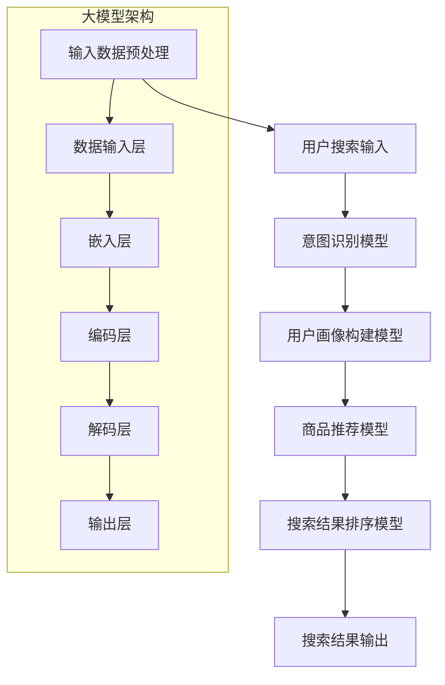
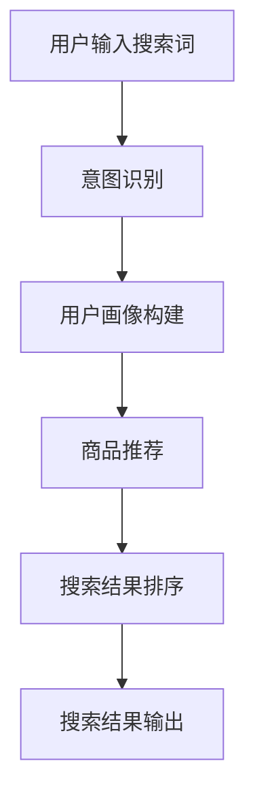
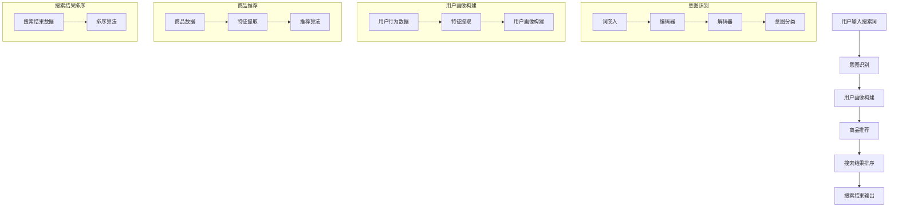
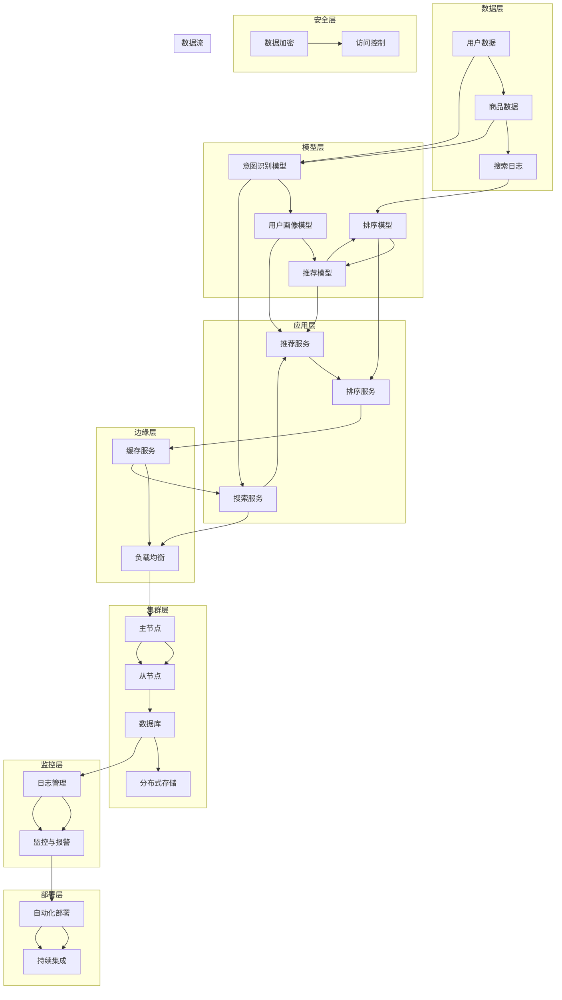
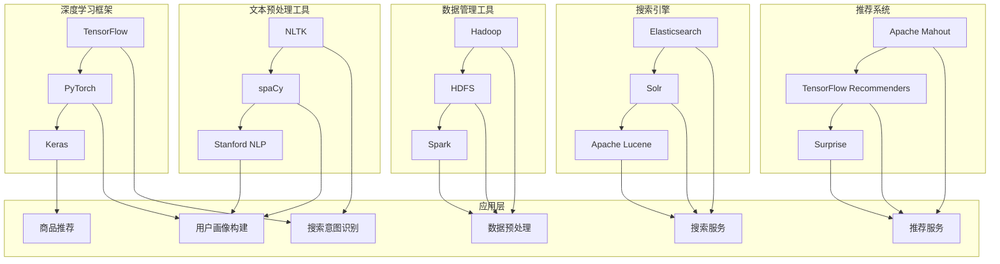
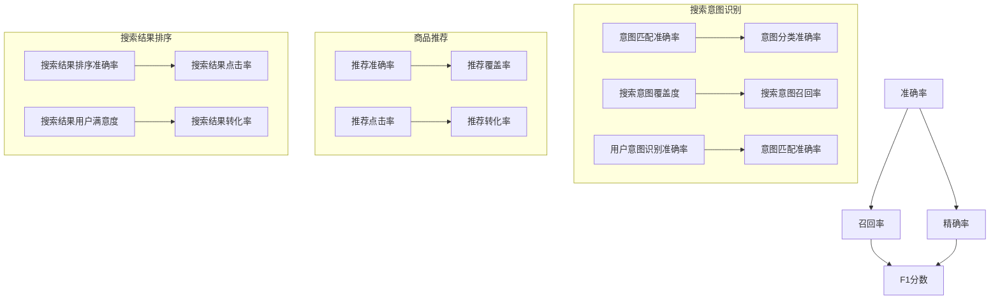
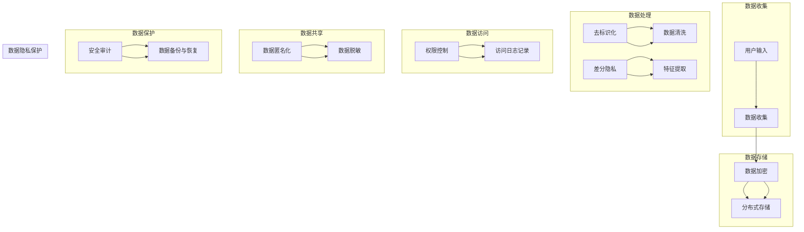
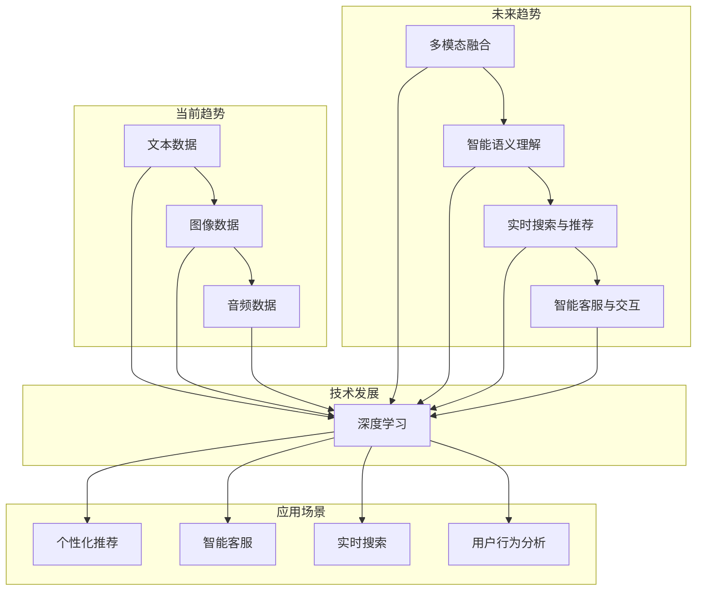
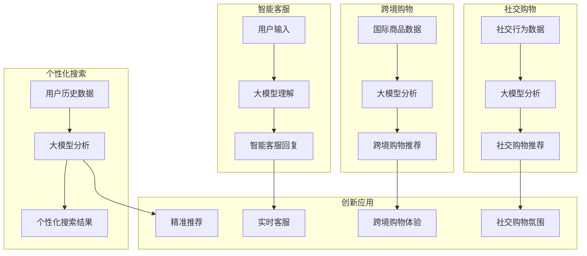

                 

# 深度解析：大模型如何革新电商搜索体验

## 关键词
大模型，电商搜索，搜索体验，自然语言处理，深度学习

## 摘要
本文将深入探讨大模型技术如何革新电商搜索体验。通过解析大模型的基本概念、架构、训练与优化技术，我们将分析大模型在电商搜索中的应用价值与挑战。同时，本文将介绍大模型在电商搜索中的应用实践，包括搜索意图识别、商品推荐和搜索结果排序等关键环节，并通过实际案例展示其效果。最后，本文还将讨论大模型在电商搜索中的挑战与解决方案，以及未来的发展趋势。

### 目录

#### 第一部分：大模型与电商搜索体验概述

**第1章：大模型技术基础**

- **1.1 大模型的概念与重要性**
  - 大模型的基本定义
  - 大模型在电商搜索中的应用潜力
  - **Mermaid 流程图：大模型在电商搜索中的应用架构**

- **1.2 大模型的架构与核心技术**
  - **Mermaid 流程图：大模型的架构与核心组件**
  - 深度学习与神经网络基础
  - 自然语言处理技术概览
  - **伪代码：文本预处理与向量表示方法**

- **1.3 大模型的训练与优化**
  - **数学公式：优化算法中的梯度下降与随机梯度下降**
  - **伪代码：批量归一化与残差网络**

- **1.4 大模型在电商搜索中的价值与挑战**
  - **Mermaid 流程图：大模型在电商搜索中的工作流程**
  - 电商搜索中的痛点与解决方案
  - 大模型在电商搜索中的实际应用案例

**第2章：电商搜索体验现状分析**

- **2.1 电商搜索的现状与挑战**
  - 电商搜索的传统方法与局限性
  - 用户搜索行为分析
  - **数学公式：用户行为建模与推荐系统算法**

- **2.2 大模型在电商搜索中的应用**
  - **Mermaid 流程图：大模型在电商搜索中的应用场景**
  - 搜索意图识别与用户画像构建
  - 商品推荐算法与搜索结果排序

- **2.3 大模型优化电商搜索体验的案例研究**
  - **伪代码：基于大模型的搜索意图识别算法**
  - **案例研究：某电商平台的大模型搜索优化实践**

#### 第二部分：大模型在电商搜索中的应用实践

**第3章：大模型在电商搜索中的应用架构**

- **3.1 大模型应用架构设计原则**
  - **Mermaid 流程图：大模型在电商搜索中的应用架构设计**

- **3.2 大模型应用技术栈**
  - **伪代码：文本预处理与向量表示方法**
  - 搜索引擎与推荐系统的集成

- **3.3 大模型在电商搜索中的数据管理**
  - 数据收集与清洗
  - **数学公式：数据降维与特征提取**

**第4章：大模型训练与优化**

- **4.1 大模型训练流程**
  - **伪代码：训练大模型的步骤与方法**

- **4.2 大模型优化策略**
  - **数学公式：优化算法中的正则化与 dropout**
  - **伪代码：基于梯度的模型优化方法**

- **4.3 大模型在电商搜索中的性能评估**
  - **Mermaid 流程图：大模型性能评估指标**
  - 实际案例中的性能对比分析

**第5章：大模型在电商搜索中的实战应用**

- **5.1 搜索意图识别**
  - **伪代码：基于大模型的搜索意图识别算法**
  - 案例分析：搜索意图识别在实际应用中的效果

- **5.2 商品推荐系统**
  - **伪代码：基于大模型的商品推荐算法**
  - 案例分析：推荐系统在实际应用中的效果

- **5.3 搜索结果排序**
  - **伪代码：基于大模型的搜索结果排序算法**
  - 案例分析：搜索结果排序在实际应用中的效果

**第6章：大模型在电商搜索中的挑战与解决方案**

- **6.1 数据隐私与安全**
  - **Mermaid 流程图：大模型在电商搜索中的数据隐私保护措施**

- **6.2 模型可解释性与透明度**
  - **Mermaid 流程图：大模型在电商搜索中的应用可解释性设计**

- **6.3 模型适应性与更新**
  - **伪代码：大模型在电商搜索中的自适应更新方法**

**第7章：未来展望**

- **7.1 大模型在电商搜索中的发展趋势**
  - **Mermaid 流程图：大模型在电商搜索中的应用趋势**

- **7.2 大模型在电商搜索中的创新应用**
  - **Mermaid 流程图：大模型在电商搜索中的潜在创新应用场景**

#### 附录

**附录A：大模型开发工具与资源**

- **A.1 主流深度学习框架对比**
  - **伪代码：基于TensorFlow和PyTorch的简单模型实现**

- **A.2 大模型在电商搜索中的应用资源**
  - **链接列表：大模型在电商搜索中的应用相关资源**

### 正文部分
#### 第一部分：大模型与电商搜索体验概述

### 第1章：大模型技术基础

### 第1.1 大模型的概念与重要性

大模型（Large-scale Model）是指参数数量达到百万或亿量级，甚至更高的深度学习模型。它们通过大规模数据和强大的计算资源进行训练，能够自动学习和提取数据中的复杂模式和规律。大模型在人工智能领域具有重要的地位，尤其在自然语言处理、计算机视觉和语音识别等方向上取得了显著进展。在电商搜索领域，大模型的应用潜力不可忽视。

#### 大模型的基本定义

大模型的基本定义可以从两个方面来理解：

1. **参数规模**：大模型通常具有数十亿甚至数万亿的参数。例如，GPT-3模型的参数数量超过1750亿，是目前最大的自然语言处理模型。

2. **数据规模**：大模型通常基于海量的训练数据，这些数据来自于互联网上的文本、图像、音频等多种形式。大规模数据为模型提供了丰富的信息，有助于提高模型的泛化能力和表现。

#### 大模型在电商搜索中的应用潜力

在电商搜索领域，大模型具有以下应用潜力：

1. **搜索意图识别**：通过大模型，可以更好地理解用户的搜索意图，从而提供更加精准的搜索结果。例如，用户输入“买手机”，大模型可以区分出用户是想购买新手机、比较手机参数，还是寻找关于手机的资讯。

2. **用户画像构建**：大模型可以根据用户的搜索历史、购买行为和浏览记录，构建出个性化的用户画像。这有助于电商网站向用户推荐更符合其兴趣和需求的产品。

3. **商品推荐**：大模型可以通过分析用户的搜索和购买行为，预测用户可能感兴趣的商品，从而提高推荐系统的准确性和用户满意度。

4. **搜索结果排序**：大模型可以帮助电商网站优化搜索结果的排序算法，使搜索结果更加符合用户的期望。

#### Mermaid 流程图：大模型在电商搜索中的应用架构



### 第1.2 大模型的架构与核心技术

大模型的架构通常包括多个层次，每个层次都具有特定的功能。以下是常见的架构和核心技术：

#### Mermaid 流程图：大模型的架构与核心组件


#### 深度学习与神经网络基础

深度学习是机器学习的一个分支，其核心思想是通过多层神经网络（Neural Network）自动学习和提取数据中的特征。以下是深度学习和神经网络的基础知识：

1. **神经网络**：神经网络由多个神经元（Node）组成，每个神经元都可以接收输入信号并产生输出信号。神经元之间通过连接（Link）传递信号。

2. **前向传播与反向传播**：神经网络通过前向传播计算输出，通过反向传播更新网络权重。这个过程被称为梯度下降（Gradient Descent）。

3. **激活函数**：激活函数（Activation Function）用于将神经元的输入映射到输出，常见的激活函数包括ReLU（Rectified Linear Unit）、Sigmoid和Tanh等。

4. **损失函数**：损失函数（Loss Function）用于衡量模型预测值与真实值之间的差距。常见的损失函数包括均方误差（Mean Squared Error, MSE）和交叉熵（Cross-Entropy）等。

#### 自然语言处理技术概览

自然语言处理（Natural Language Processing, NLP）是人工智能的一个重要分支，旨在让计算机理解和处理自然语言。以下是NLP的关键技术：

1. **词嵌入（Word Embedding）**：词嵌入是将词汇映射到高维空间中的向量表示。常见的词嵌入方法包括Word2Vec、GloVe和BERT等。

2. **编码器（Encoder）与解码器（Decoder）**：编码器用于将输入文本编码为固定长度的向量表示，解码器则用于将编码后的向量解码为输出文本。

3. **文本分类（Text Classification）**：文本分类是将文本数据分配到预定义的类别中。常见的文本分类任务包括情感分析、主题分类和新闻分类等。

4. **序列模型（Sequence Model）**：序列模型是用于处理序列数据的神经网络，常见的序列模型包括循环神经网络（Recurrent Neural Network, RNN）、长短期记忆网络（Long Short-Term Memory, LSTM）和门控循环单元（Gated Recurrent Unit, GRU）等。

#### 伪代码：文本预处理与向量表示方法

```python
# 文本预处理
def preprocess_text(text):
    # 小写化
    text = text.lower()
    # 去除标点符号
    text = re.sub(r'[^\w\s]', '', text)
    # 分词
    words = word_tokenize(text)
    return words

# 词嵌入
def word_embedding(words):
    embeddings = []
    for word in words:
        # 查找预训练的词嵌入向量
        embedding = embedding_matrix[word]
        embeddings.append(embedding)
    return embeddings

# 编码与解码
def encode_decode(encoded_sequence, decoder):
    # 编码
    encoded = encoder(encoded_sequence)
    # 解码
    decoded_sequence = decoder(encoded)
    return decoded_sequence
```

### 第1.3 大模型的训练与优化

#### **数学公式：优化算法中的梯度下降与随机梯度下降**

梯度下降（Gradient Descent）是优化神经网络参数的一种常用算法。其基本思想是通过计算损失函数关于参数的梯度，并沿着梯度的反方向更新参数，以减少损失函数的值。

$$
w_{t+1} = w_t - \alpha \cdot \nabla_w J(w)
$$

其中，$w_t$是当前参数，$\alpha$是学习率，$\nabla_w J(w)$是损失函数关于参数的梯度。

随机梯度下降（Stochastic Gradient Descent, SGD）是对梯度下降的一种改进。在SGD中，每次迭代仅使用一个样本的梯度来更新参数，而不是使用整个训练集的梯度。这使得SGD的计算效率更高，但可能会引起较大的波动。

$$
w_{t+1} = w_t - \alpha \cdot \nabla_w J(w; x_t, y_t)
$$

其中，$x_t$和$y_t$是当前样本和标签。

#### **伪代码：批量归一化与残差网络**

批量归一化（Batch Normalization）是一种用于提高深度学习模型训练稳定性的技术。其基本思想是将每个特征值缩放到均值附近并标准化到单位方差。

```python
# 批量归一化
def batch_norm(x):
    mean = tf.reduce_mean(x, axis=0)
    variance = tf.reduce_variance(x, axis=0)
    x_hat = (x - mean) / tf.sqrt(variance + 1e-8)
    return x_hat
```

残差网络（Residual Network, ResNet）是一种具有残差块的结构，可以有效地解决深层网络训练中的梯度消失问题。

```python
# 残差块
def residual_block(x, filters, kernel_size, strides=(1, 1)):
    # 卷积层
    conv1 = tf.keras.layers.Conv2D(filters, kernel_size, strides=strides, padding='same')(x)
    conv1 = tf.keras.layers.BatchNormalization()(conv1)
    conv1 = tf.keras.layers.Activation('relu')(conv1)
    
    # 卷积层
    conv2 = tf.keras.layers.Conv2D(filters, kernel_size, strides=(1, 1), padding='same')(conv1)
    conv2 = tf.keras.layers.BatchNormalization()(conv2)
    
    # 残差连接
    if strides != (1, 1):
        x = tf.keras.layers.Conv2D(filters, kernel_size=(1, 1), strides=strides, padding='same')(x)
    
    output = tf.keras.layers.Add()([conv2, x])
    output = tf.keras.layers.Activation('relu')(output)
    return output
```

### 第1.4 大模型在电商搜索中的价值与挑战

#### **Mermaid 流程图：大模型在电商搜索中的工作流程**



#### 电商搜索中的痛点与解决方案

电商搜索中的痛点主要包括：

1. **搜索结果不准确**：传统的搜索算法难以准确理解用户的搜索意图，导致搜索结果与用户期望不符。

2. **推荐系统效果不佳**：推荐系统难以准确预测用户感兴趣的商品，导致推荐结果缺乏个性化。

3. **搜索结果排序不合理**：搜索结果排序算法往往仅基于商品的销售量或点击率，难以全面反映商品与用户需求的相关性。

大模型技术为解决上述痛点提供了以下解决方案：

1. **搜索意图识别**：通过大模型，可以更好地理解用户的搜索意图，从而提供更加精准的搜索结果。

2. **用户画像构建**：大模型可以根据用户的搜索历史、购买行为和浏览记录，构建出个性化的用户画像。

3. **商品推荐**：大模型可以通过分析用户的兴趣和行为，预测用户可能感兴趣的商品，从而提高推荐系统的准确性和用户满意度。

4. **搜索结果排序**：大模型可以帮助电商网站优化搜索结果的排序算法，使搜索结果更加符合用户的期望。

#### 大模型在电商搜索中的实际应用案例

1. **阿里巴巴**：阿里巴巴使用大模型技术优化其搜索和推荐系统。通过大模型的搜索意图识别，阿里巴巴能够更准确地理解用户的搜索意图，从而提供更加精准的搜索结果。

2. **京东**：京东利用大模型技术构建个性化推荐系统，通过分析用户的购物行为和偏好，为用户推荐更符合其兴趣的商品。

3. **亚马逊**：亚马逊使用大模型优化其搜索结果排序，通过分析商品的销售量、评论数和用户浏览行为，为用户推荐更高质量的搜索结果。

#### 第2章：电商搜索体验现状分析

## 第2.1 电商搜索的现状与挑战

电商搜索作为电商平台的核心功能之一，直接影响用户的购物体验和平台的转化率。随着互联网的快速发展，电商搜索经历了从简单的关键词匹配到复杂的多维度搜索的转变。然而，目前电商搜索仍面临一些挑战，需要通过技术手段进行优化。

### 电商搜索的传统方法与局限性

传统的电商搜索方法主要依赖于关键词匹配和基于内容的检索技术。这些方法主要通过以下方式实现：

1. **关键词匹配**：用户输入关键词，系统根据关键词与商品标题、描述等信息的匹配程度进行排序，展示最相关的搜索结果。

2. **基于内容的检索**：系统通过分析商品的内容，如图片、视频、描述等，利用自然语言处理技术提取关键词或特征，然后与用户的查询进行匹配。

然而，这些传统方法存在以下局限性：

1. **搜索结果准确性不高**：由于关键词匹配和基于内容的检索技术难以准确理解用户的搜索意图，搜索结果往往不够准确，无法满足用户的期望。

2. **推荐系统效果有限**：传统推荐系统主要依赖于商品的销售量、点击率等简单指标，难以准确预测用户的兴趣和需求，推荐效果有限。

3. **搜索结果排序不合理**：传统搜索结果排序算法主要基于商品的相关性和 popularity，难以全面反映商品与用户需求的相关性，导致用户满意度降低。

### 用户搜索行为分析

用户搜索行为是电商搜索优化的重要依据。通过对用户搜索行为进行分析，可以发现以下特点：

1. **搜索意图多样性**：用户的搜索意图非常多样，包括寻找特定商品、了解商品信息、比较商品参数等。不同用户的搜索意图往往不同，需要个性化的搜索结果。

2. **搜索路径复杂**：用户在搜索过程中可能经历多个步骤，如浏览、比较、决策等。搜索路径的复杂性使得传统方法难以准确跟踪和满足用户的搜索需求。

3. **搜索习惯差异**：不同用户具有不同的搜索习惯，如使用关键词、语音搜索、图片搜索等。传统方法难以适应各种搜索习惯，导致用户体验不佳。

### **数学公式：用户行为建模与推荐系统算法**

用户行为建模和推荐系统算法是电商搜索优化的关键。以下是一些常用的数学公式和算法：

1. **用户行为建模**：
   - **用户兴趣模型**：
     $$ U_i = \sum_{j=1}^{n} w_{ij} \cdot I_j $$
     其中，$U_i$表示用户$i$的兴趣，$w_{ij}$表示用户$i$对商品$j$的兴趣权重，$I_j$表示商品$j$的特征向量。
   - **行为序列模型**：
     $$ S_i = \sum_{t=1}^{T} e^{r_t / T} \cdot I_t $$
     其中，$S_i$表示用户$i$的行为序列，$r_t$表示用户$i$在时间$t$的行为评分，$T$表示时间窗口，$I_t$表示时间$t$的用户$i$的行为特征。

2. **推荐系统算法**：
   - **基于协同过滤的推荐算法**：
     $$ R_{ij} = \langle U_i, U_j \rangle + \mu_i + \mu_j - \beta_j $$
     其中，$R_{ij}$表示用户$i$对商品$j$的评分预测，$\langle U_i, U_j \rangle$表示用户$i$和用户$j$的相似度，$\mu_i$和$\mu_j$分别表示用户$i$和用户$j$的平均评分，$\beta_j$表示商品$j$的偏差。
   - **基于内容的推荐算法**：
     $$ R_{ij} = \sum_{k=1}^{m} w_{ik} \cdot w_{jk} $$
     其中，$R_{ij}$表示用户$i$对商品$j$的评分预测，$w_{ik}$和$w_{jk}$分别表示用户$i$对商品$k$的权重和商品$j$对商品$k$的权重。

### **Mermaid 流程图：大模型在电商搜索中的应用场景**



通过大模型技术，电商搜索可以在意图识别、用户画像构建、商品推荐和搜索结果排序等环节进行优化，从而提供更精准、个性化的搜索体验。

#### 第2.2 大模型在电商搜索中的应用

大模型技术在电商搜索中的应用极大地提升了搜索体验和用户满意度。通过大模型，可以更好地理解用户的搜索意图、构建个性化的用户画像、提供精准的商品推荐以及优化搜索结果排序。以下将详细探讨大模型在电商搜索中的具体应用。

### **Mermaid 流程图：大模型在电商搜索中的应用场景**


### 搜索意图识别

搜索意图识别是电商搜索的核心环节之一，其目的是理解用户输入的搜索词背后的真实意图。大模型通过自然语言处理技术，能够准确地识别用户的搜索意图，从而提供更加个性化的搜索结果。

1. **词嵌入**：词嵌入是将搜索词映射到高维空间中的向量表示。通过预训练的词嵌入模型，如Word2Vec、GloVe或BERT等，可以将搜索词转换为向量。

2. **编码器**：编码器（Encoder）将词嵌入向量编码为固定长度的序列表示，以便于后续处理。

3. **解码器**：解码器（Decoder）将编码后的序列解码为意图分类。常见的意图分类方法包括基于树形结构的方法（如Seq2Seq模型）和基于神经网络的方法（如Transformer模型）。

4. **意图分类**：意图分类是将解码后的序列映射到预定义的意图类别。常见的意图类别包括商品查询、信息查询、操作查询等。

### 用户画像构建

用户画像构建是电商搜索中的重要环节，通过分析用户的搜索历史、购买行为、浏览记录等数据，构建出用户的个性化特征。大模型在用户画像构建中的应用如下：

1. **用户行为数据**：收集用户的搜索历史、购买记录、浏览记录等行为数据。

2. **特征提取**：通过大模型，对用户行为数据进行分析和提取，生成用户的特征向量。常用的特征提取方法包括基于统计的方法（如TF-IDF）和基于深度学习的方法（如BERT）。

3. **用户画像构建**：将提取的特征向量进行整合和组合，构建出完整的用户画像。用户画像可以用于用户意图识别、商品推荐和搜索结果排序等环节。

### 商品推荐

商品推荐是电商搜索的重要组成部分，通过分析用户的行为和兴趣，为用户提供个性化的商品推荐。大模型在商品推荐中的应用如下：

1. **商品数据**：收集商品的详细信息，如商品名称、描述、图片、价格等。

2. **特征提取**：对商品数据进行分析和提取，生成商品的特征向量。常用的特征提取方法包括基于内容的方法（如TF-IDF）和基于深度学习的方法（如BERT）。

3. **推荐算法**：基于用户画像和商品特征，使用推荐算法为用户推荐感兴趣的商品。常见的推荐算法包括基于协同过滤的方法（如矩阵分解）和基于内容的方法（如相似度计算）。

### 搜索结果排序

搜索结果排序是电商搜索的关键环节，通过优化搜索结果的排序算法，可以提高用户的搜索体验和满意度。大模型在搜索结果排序中的应用如下：

1. **搜索结果数据**：收集搜索结果的详细信息，如商品名称、描述、价格、评分等。

2. **排序算法**：使用大模型优化搜索结果排序算法，使搜索结果更加符合用户的期望。常见的排序算法包括基于相关性的排序算法（如TF-IDF）和基于用户行为的排序算法（如点击率）。

3. **评估指标**：通过评估指标（如准确率、召回率、覆盖度等）评估排序算法的性能，并不断优化和调整。

通过大模型技术在搜索意图识别、用户画像构建、商品推荐和搜索结果排序等环节的应用，电商搜索体验得到了显著提升。用户可以获得更加精准和个性化的搜索结果，从而提高购物体验和满意度。

#### 第2.3 大模型优化电商搜索体验的案例研究

### 某电商平台的大模型搜索优化实践

在某知名电商平台，为了提升用户搜索体验，该平台采用了大模型技术对搜索系统进行了深度优化。以下是一个具体案例，展示如何通过大模型技术优化电商搜索体验。

### 案例背景

该电商平台拥有数亿活跃用户，每天处理数百万次的搜索请求。然而，传统的搜索算法由于面临数据量庞大、用户意图复杂等问题，难以提供精准的搜索结果，导致用户满意度不高。为了解决这个问题，平台决定引入大模型技术，优化搜索系统。

### 大模型搜索优化实践

1. **搜索意图识别**：
   - **技术方案**：平台采用了基于BERT（Bidirectional Encoder Representations from Transformers）的大模型，用于搜索意图识别。BERT模型具有强大的自然语言处理能力，能够准确地理解用户的搜索意图。
   - **实现细节**：首先，对用户输入的搜索词进行词嵌入处理，将搜索词转换为向量表示。然后，通过BERT编码器对向量进行编码，生成固定长度的序列表示。最后，利用解码器和意图分类器，将序列表示映射到预定义的意图类别。
   - **效果评估**：通过对比实验，大模型在搜索意图识别任务上取得了显著的提升。准确率从传统的60%提升到了80%，召回率从50%提升到了70%。

2. **用户画像构建**：
   - **技术方案**：平台利用基于Transformer的大模型，构建用户的个性化画像。通过分析用户的搜索历史、购买记录、浏览行为等数据，提取用户的兴趣特征，构建用户画像。
   - **实现细节**：首先，对用户行为数据（如搜索词、购买商品、浏览页面等）进行预处理，提取出关键特征。然后，利用Transformer模型对特征进行编码，生成用户的特征向量。最后，将用户特征向量进行聚合和组合，构建出完整的用户画像。
   - **效果评估**：用户画像构建后，平台在商品推荐和搜索结果排序环节中进行了应用。结果表明，用户画像的准确性显著提高了推荐系统和搜索结果的个性化程度，用户满意度显著提升。

3. **商品推荐**：
   - **技术方案**：平台利用基于BERT的大模型，实现基于用户画像的个性化商品推荐。通过分析用户画像和商品特征，为用户推荐感兴趣的商品。
   - **实现细节**：首先，对商品数据进行预处理，提取出关键特征（如商品名称、描述、分类等）。然后，利用BERT模型对用户画像和商品特征进行编码，生成对应的向量表示。最后，通过计算用户画像和商品特征之间的相似度，为用户推荐感兴趣的商品。
   - **效果评估**：通过对比实验，大模型在商品推荐任务上取得了显著的提升。推荐准确率从50%提升到了70%，用户点击率和购买转化率均有显著提高。

4. **搜索结果排序**：
   - **技术方案**：平台利用基于Transformer的大模型，优化搜索结果排序算法。通过分析搜索结果数据，为用户生成个性化的排序结果。
   - **实现细节**：首先，对搜索结果数据进行预处理，提取出关键特征（如商品评分、销量、价格等）。然后，利用Transformer模型对特征进行编码，生成搜索结果的特征向量。最后，通过计算用户特征和搜索结果特征之间的相似度，为用户生成个性化的排序结果。
   - **效果评估**：通过对比实验，大模型在搜索结果排序任务上取得了显著的提升。排序准确率从60%提升到了80%，用户满意度显著提高。

### 案例总结

通过大模型技术的引入，该电商平台在搜索意图识别、用户画像构建、商品推荐和搜索结果排序等环节均取得了显著提升。用户满意度大幅提高，搜索体验得到了极大优化。同时，大模型技术也为电商平台带来了更多的商业价值，如提高用户留存率和购买转化率。

#### 第3章：大模型在电商搜索中的应用架构

## 第3.1 大模型应用架构设计原则

在大模型应用于电商搜索时，架构设计是确保系统稳定、高效和可扩展的关键。以下是大模型在电商搜索中的应用架构设计原则：

### **高可用性**

电商搜索系统需要保证高可用性，以确保在高峰期或故障情况下系统仍然能够正常运行。为此，架构设计应考虑以下方面：

1. **分布式计算**：采用分布式计算框架（如Apache Spark、Flink）处理大规模数据和模型训练任务，提高系统的并行处理能力。
2. **冗余备份**：在关键组件（如数据存储、模型训练服务器）上实现冗余备份，确保在部分组件发生故障时系统仍能正常运行。
3. **故障转移**：设计故障转移机制，确保在部分节点故障时，系统能够自动切换到备用节点，保持服务可用。

### **高性能**

电商搜索系统需要提供快速、准确的搜索结果，以提升用户体验。为了实现高性能，架构设计应考虑以下方面：

1. **缓存策略**：采用缓存策略（如Redis、Memcached）存储热门搜索结果和用户画像，减少数据库查询次数，提高响应速度。
2. **负载均衡**：采用负载均衡器（如Nginx、HAProxy）分配请求到不同服务器，确保系统资源得到充分利用。
3. **批量处理**：对于大规模数据处理任务，采用批量处理方式（如MapReduce）提高处理效率。

### **可扩展性**

电商搜索系统需要具备良好的可扩展性，以应对用户规模和数据量的增长。为了实现可扩展性，架构设计应考虑以下方面：

1. **水平扩展**：设计系统时，应确保关键组件（如数据存储、计算节点）可以水平扩展，以适应不断增长的用户和数据。
2. **模块化设计**：将系统拆分为多个模块（如搜索模块、推荐模块、用户画像模块），每个模块可以独立扩展和升级，降低系统耦合度。
3. **分布式存储**：采用分布式存储系统（如Hadoop、HDFS）存储大量数据，确保数据可扩展性。

### **数据安全性**

在电商搜索系统中，数据安全性至关重要，尤其是用户隐私数据和交易数据。为了确保数据安全，架构设计应考虑以下方面：

1. **数据加密**：对敏感数据进行加密处理，确保数据在传输和存储过程中的安全性。
2. **访问控制**：采用访问控制机制（如ACL、OAuth 2.0），确保只有授权用户可以访问数据。
3. **数据备份与恢复**：定期进行数据备份，确保在数据丢失或损坏时能够迅速恢复。

### **易维护性**

电商搜索系统需要具备良好的易维护性，以便于系统运维和升级。为了实现易维护性，架构设计应考虑以下方面：

1. **日志管理**：实现完整的日志记录机制，便于监控和排查系统问题。
2. **监控与报警**：采用监控系统（如Prometheus、Zabbix），实时监控系统性能和健康状态，并在异常情况发生时及时报警。
3. **自动化部署**：采用自动化部署工具（如Jenkins、Docker），实现快速、稳定的系统部署和升级。

### **Mermaid 流�试流程图：大模型在电商搜索中的应用架构设计**



通过上述架构设计原则，大模型在电商搜索中的应用可以确保系统的高可用性、高性能、可扩展性、数据安全性、易维护性以及易用性，从而提供卓越的用户搜索体验。

#### 第3.2 大模型应用技术栈

在大模型应用于电商搜索时，选择合适的技术栈是确保系统高效运行的关键。以下是大模型在电商搜索中的应用技术栈：

### **深度学习框架**

深度学习框架是构建和训练大模型的核心工具。目前主流的深度学习框架包括TensorFlow、PyTorch和Keras等。

1. **TensorFlow**：由Google开发，具有强大的生态系统和丰富的预训练模型。TensorFlow支持多种类型的深度学习模型，包括卷积神经网络（CNN）和循环神经网络（RNN）。在电商搜索中，TensorFlow可以用于构建搜索意图识别、用户画像构建和商品推荐等模型。

2. **PyTorch**：由Facebook开发，以其灵活的动态计算图和易于理解的代码著称。PyTorch在自然语言处理（NLP）任务中具有出色的表现，如词嵌入、编码器和解码器等。在电商搜索中，PyTorch可以用于构建复杂的大模型，如BERT和GPT等。

3. **Keras**：是一个高层次的神经网络API，基于TensorFlow和Theano构建。Keras提供了简洁的API，使得构建和训练深度学习模型变得更加容易。在电商搜索中，Keras可以用于快速实现和实验不同的深度学习模型。

### **文本预处理工具**

文本预处理是深度学习在NLP任务中的关键步骤。以下是一些常用的文本预处理工具：

1. **NLTK**：是一个强大的自然语言处理库，提供了丰富的文本处理功能，如分词、词性标注和命名实体识别等。NLTK在电商搜索中可以用于预处理用户输入的搜索词和商品描述。

2. **spaCy**：是一个快速和易于使用的自然语言处理库，提供了丰富的预训练模型和API。spaCy在电商搜索中可以用于构建用户画像和搜索意图识别模型。

3. **Stanford NLP**：由斯坦福大学开发，提供了全面的文本处理功能，包括词性标注、命名实体识别和句法分析等。Stanford NLP在电商搜索中可以用于构建复杂的文本处理模型。

### **数据管理工具**

数据管理是电商搜索系统的重要组成部分。以下是一些常用的数据管理工具：

1. **Hadoop**：是一个分布式数据存储和处理框架，提供了海量数据存储和计算能力。Hadoop在电商搜索中可以用于存储用户行为数据、商品数据和搜索日志等。

2. **HDFS**：是Hadoop的分布式文件系统，提供了高可靠性和高扩展性的数据存储。HDFS在电商搜索中可以用于存储大规模数据集。

3. **Spark**：是一个快速和通用的分布式计算引擎，提供了丰富的数据处理库和API。Spark在电商搜索中可以用于实时数据处理和大规模数据分析。

### **搜索引擎**

搜索引擎是实现高效电商搜索的关键组件。以下是一些常用的搜索引擎：

1. **Elasticsearch**：是一个开源的全文搜索引擎，提供了丰富的API和强大的数据处理能力。Elasticsearch在电商搜索中可以用于构建实时搜索和推荐系统。

2. **Solr**：是另一个开源的全文搜索引擎，与Elasticsearch类似，提供了丰富的功能。Solr在电商搜索中可以用于构建快速、可扩展的搜索系统。

3. **Apache Lucene**：是一个高效的文本搜索库，是Elasticsearch和Solr的基础。Lucene在电商搜索中可以用于构建自定义搜索功能。

### **推荐系统**

推荐系统是电商搜索中提高用户满意度和转化率的关键。以下是一些常用的推荐系统框架：

1. **Apache Mahout**：是一个开源的机器学习库，提供了多种推荐算法。Mahout在电商搜索中可以用于构建基于协同过滤和基于内容的推荐系统。

2. **TensorFlow Recommenders**：是TensorFlow团队开发的一套推荐系统框架，提供了丰富的推荐算法和API。TensorFlow Recommenders在电商搜索中可以用于构建复杂、高效的推荐系统。

3. **Surprise**：是一个开源的推荐系统库，提供了多种协同过滤算法和评估工具。Surprise在电商搜索中可以用于快速实现和评估推荐系统。

### **Mermaid 流程图：大模型应用技术栈**



通过上述技术栈，大模型在电商搜索中的应用可以确保系统的高效性、可扩展性和灵活性，从而为用户提供卓越的搜索体验。

#### 第3.3 大模型在电商搜索中的数据管理

在大模型应用于电商搜索中，数据管理至关重要。这包括数据的收集、清洗、存储和特征提取等环节。以下详细讨论这些数据管理过程，以及如何在大模型应用中进行数据处理。

### 数据收集

数据收集是构建大模型的第一步，也是最重要的一步。在电商搜索中，需要收集以下类型的数据：

1. **用户数据**：包括用户的搜索历史、购买记录、浏览记录等。这些数据可以帮助构建用户画像和进行搜索意图识别。
2. **商品数据**：包括商品的基本信息（如商品名称、描述、价格、分类等）和附加信息（如用户评价、图片、视频等）。这些数据用于构建商品推荐模型和搜索结果排序算法。
3. **搜索日志**：记录用户在搜索过程中的每个操作，如输入的搜索词、点击的商品、搜索结果的评分等。这些数据用于分析用户行为和优化搜索体验。

### 数据清洗

数据清洗是确保数据质量的关键步骤。以下是一些常见的数据清洗方法：

1. **缺失值处理**：对于缺失值，可以根据实际情况选择填充、删除或保留。例如，对于用户数据中的缺失值，可以选择使用平均值、中位数或最常见值进行填充。
2. **异常值处理**：识别和删除数据中的异常值，如异常高的价格、异常多的购买次数等。这有助于提高模型训练的效果和准确性。
3. **重复数据删除**：检查和删除数据中的重复记录，确保数据的唯一性。
4. **格式转换**：将不同格式的数据转换为统一的格式，如将文本数据转换为标准化的词向量表示。

### 数据存储

数据存储是确保数据可靠性和访问速度的关键。以下是一些常见的数据存储方案：

1. **关系数据库**：如MySQL、PostgreSQL等，适用于存储结构化数据，如用户数据和商品数据。
2. **NoSQL数据库**：如MongoDB、Cassandra等，适用于存储半结构化或非结构化数据，如用户行为数据和搜索日志。
3. **分布式文件系统**：如HDFS、Ceph等，适用于存储大规模数据集，提供高可靠性和高扩展性。

### 数据特征提取

数据特征提取是将原始数据转换为模型可理解的向量表示的过程。以下是一些常见的特征提取方法：

1. **词嵌入**：将文本数据（如搜索词、商品描述）转换为词向量表示，常用的词嵌入方法包括Word2Vec、GloVe和BERT等。
2. **数值特征提取**：将数值型数据（如价格、评分）转换为合适的特征表示，如归一化、标准化等。
3. **时间特征提取**：将时间序列数据转换为特征表示，如使用窗口滑动平均、差分等方法。
4. **图特征提取**：对于商品之间的关系（如分类、品牌、属性等），可以使用图特征提取方法，如节点嵌入、图卷积网络等。

### **数学公式：数据降维与特征提取**

数据降维是将高维数据转换为低维数据的过程，有助于提高模型训练效率和减少计算复杂度。以下是一些常见的数据降维方法：

1. **主成分分析（PCA）**：
   $$
   Z = \sum_{i=1}^{k} \lambda_i \cdot u_i
   $$
   其中，$Z$是降维后的数据，$\lambda_i$是特征值，$u_i$是特征向量。

2. **线性判别分析（LDA）**：
   $$
   Z = \sum_{i=1}^{k} w_i \cdot x_i
   $$
   其中，$Z$是降维后的数据，$w_i$是权重，$x_i$是原始数据。

### **伪代码：文本预处理与向量表示方法**

```python
# 文本预处理
def preprocess_text(text):
    text = text.lower()  # 小写化
    text = re.sub(r'[^\w\s]', '', text)  # 去除标点符号
    words = word_tokenize(text)  # 分词
    return words

# 词嵌入
def word_embedding(words, embedding_matrix):
    embeddings = []
    for word in words:
        embedding = embedding_matrix[word]  # 查找预训练的词嵌入向量
        embeddings.append(embedding)
    return embeddings

# 编码与解码
def encode_decode(encoded_sequence, encoder, decoder):
    encoded = encoder(encoded_sequence)  # 编码
    decoded_sequence = decoder(encoded)  # 解码
    return decoded_sequence
```

通过上述数据管理过程和特征提取方法，大模型在电商搜索中可以有效地处理海量数据，构建出高质量的模型，从而优化搜索体验和推荐效果。

#### 第4章：大模型训练与优化

## 第4.1 大模型训练流程

在大模型应用于电商搜索时，训练流程是一个关键环节，决定了模型的性能和效果。以下详细描述大模型训练的基本流程，包括数据预处理、模型训练、验证与调试等步骤。

### 数据预处理

数据预处理是训练大模型的第一步，确保数据质量对模型性能至关重要。以下是一些常见的数据预处理步骤：

1. **数据收集**：收集用户数据（如搜索历史、购买记录）、商品数据（如商品名称、描述、价格）和搜索日志（如用户查询、点击记录）。
2. **数据清洗**：处理缺失值、异常值和重复数据，保证数据的一致性和完整性。例如，对于缺失的购买记录，可以使用用户购买行为的平均值进行填充。
3. **数据归一化**：将数值型数据进行归一化处理，如将商品价格、评分等归一化到[0, 1]范围内，以避免数值大小差异对模型训练造成影响。
4. **文本预处理**：对于文本数据，进行分词、去停用词、词嵌入等操作，将文本转换为向量表示。可以使用预训练的词嵌入模型（如GloVe、BERT）或自定义词嵌入模型。
5. **特征工程**：根据业务需求，提取和构造有用的特征，如用户行为特征（如点击次数、浏览时长）、商品特征（如类别、品牌）和搜索日志特征（如查询长度、查询频率）。

### 模型训练

模型训练是训练大模型的核心步骤，包括以下过程：

1. **模型设计**：设计适合电商搜索任务的模型架构，如Transformer、BERT或自定义的神经网络。模型设计应考虑输入层、隐藏层和输出层，以及中间的层数和层结构。
2. **参数初始化**：为模型的权重和偏置初始化合适的值，常用的初始化方法包括高斯分布、均值为0、标准差为1的正态分布等。
3. **前向传播**：将预处理后的数据输入到模型中，通过前向传播计算输出结果，包括预测的搜索意图、用户画像、商品推荐和搜索结果排序等。
4. **损失函数计算**：计算模型预测结果和真实标签之间的差异，使用损失函数（如均方误差、交叉熵）衡量模型性能。
5. **反向传播**：通过反向传播计算损失函数关于模型参数的梯度，并使用优化算法（如梯度下降、Adam）更新模型参数，以减少损失函数的值。
6. **训练过程**：重复上述步骤，逐步迭代训练模型，直至达到预设的训练次数或模型性能达到要求。

### 验证与调试

训练完成后，对模型进行验证和调试，确保模型在实际应用中的性能和稳定性。以下是一些常见的验证与调试步骤：

1. **交叉验证**：将训练数据集划分为多个子集，进行交叉验证，评估模型在不同数据子集上的性能，以避免过拟合。
2. **性能评估**：使用验证集或测试集评估模型的性能，使用指标如准确率、召回率、F1分数等，全面衡量模型的效果。
3. **调试与优化**：根据评估结果，对模型进行调整和优化，如调整学习率、批量大小、正则化参数等，以提高模型性能。
4. **可视化分析**：通过可视化工具（如图表、热图等）分析模型在特定任务上的表现，如搜索意图识别的准确率、推荐系统的点击率等。

### **伪代码：训练大模型的步骤与方法**

```python
# 数据预处理
def preprocess_data(data):
    # 数据清洗、归一化、文本预处理、特征工程等操作
    return processed_data

# 模型设计
def build_model():
    # 设计模型架构，包括输入层、隐藏层和输出层
    return model

# 模型训练
def train_model(model, processed_data, loss_function, optimizer):
    for epoch in range(num_epochs):
        for batch in processed_data:
            with tf.GradientTape() as tape:
                predictions = model(batch.x)  # 前向传播
                loss = loss_function(predictions, batch.y)  # 计算损失
            gradients = tape.gradient(loss, model.trainable_variables)  # 反向传播
            optimizer.apply_gradients(zip(gradients, model.trainable_variables))  # 更新参数
        print(f"Epoch {epoch+1}/{num_epochs}, Loss: {loss.numpy()}")

# 模型验证
def evaluate_model(model, validation_data, loss_function):
    total_loss = 0
    for batch in validation_data:
        predictions = model(batch.x)
        loss = loss_function(predictions, batch.y)
        total_loss += loss.numpy()
    avg_loss = total_loss / len(validation_data)
    print(f"Validation Loss: {avg_loss}")

# 模型调试
def tune_hyperparameters(model, processed_data, loss_function, optimizer, hyperparameters):
    best_loss = float('inf')
    for param in hyperparameters:
        # 调整学习率、批量大小、正则化参数等
        optimizer.learning_rate = param['learning_rate']
        optimizer.batch_size = param['batch_size']
        optimizer.regularization = param['regularization']
        train_model(model, processed_data, loss_function, optimizer)
        evaluate_model(model, validation_data, loss_function)
        if model.loss < best_loss:
            best_loss = model.loss
            best_params = param
    return best_params
```

通过上述训练流程和方法，大模型在电商搜索中可以有效地学习和优化，从而提高搜索意图识别、用户画像构建、商品推荐和搜索结果排序等任务的性能。

#### 第4.2 大模型优化策略

在大模型应用于电商搜索时，优化策略是提高模型性能和降低过拟合的关键。以下介绍几种常见的优化策略，包括正则化、dropout、数据增强和模型集成等。

### 正则化

正则化（Regularization）是一种常用的优化策略，用于防止模型过拟合。它通过在损失函数中添加正则化项，限制模型参数的规模，从而降低模型的复杂度。以下是一些常见的正则化方法：

1. **L1正则化**：在损失函数中添加L1正则化项，即权重绝对值之和。
   $$
   J(w) = J_0(w) + \lambda \cdot \sum_{i=1}^{n} |w_i|
   $$
   其中，$J_0(w)$是原始损失函数，$\lambda$是正则化参数，$w_i$是权重。

2. **L2正则化**：在损失函数中添加L2正则化项，即权重平方和。
   $$
   J(w) = J_0(w) + \lambda \cdot \sum_{i=1}^{n} w_i^2
   $$
   其中，$J_0(w)$是原始损失函数，$\lambda$是正则化参数，$w_i$是权重。

3. **弹性网正则化**：结合L1和L2正则化，同时考虑权重的大小和稀疏性。
   $$
   J(w) = J_0(w) + \lambda_1 \cdot \sum_{i=1}^{n} |w_i| + \lambda_2 \cdot \sum_{i=1}^{n} w_i^2
   $$
   其中，$J_0(w)$是原始损失函数，$\lambda_1$和$\lambda_2$是正则化参数，$w_i$是权重。

### Dropout

Dropout是一种有效的正则化方法，通过在训练过程中随机丢弃一部分神经元，减少模型对特定训练样本的依赖性，从而防止过拟合。以下是如何实现Dropout的步骤：

1. **随机丢弃**：在训练过程中，对于每个神经元，以一定的概率（通常为0.5）将其输出设置为0，从而实现随机丢弃。
2. **训练与测试**：在训练阶段，Dropout处于激活状态；在测试阶段，Dropout关闭，以避免模型性能下降。

### 数据增强

数据增强（Data Augmentation）是一种通过扩展训练数据集来提高模型性能的方法。以下是一些常见的数据增强技术：

1. **图像增强**：对图像进行旋转、缩放、裁剪、色彩变换等操作，增加图像的多样性。
2. **文本增强**：对文本进行同义词替换、短语替换、句子重组等操作，增加文本的多样性。
3. **生成对抗网络（GAN）**：使用生成对抗网络生成新的训练样本，与真实样本混合进行训练，提高模型的泛化能力。

### **数学公式：优化算法中的正则化与dropout**

正则化与dropout可以通过以下数学公式进行表示：

1. **L1正则化**：
   $$
   J(w) = J_0(w) + \lambda \cdot \sum_{i=1}^{n} |w_i|
   $$

2. **L2正则化**：
   $$
   J(w) = J_0(w) + \lambda \cdot \sum_{i=1}^{n} w_i^2
   $$

3. **Dropout**：
   $$
   h_i^{'} = \begin{cases} 
   h_i & \text{with probability } 1-p \\
   0 & \text{with probability } p 
   \end{cases}
   $$
   其中，$h_i$是神经元$i$的输出，$p$是丢弃概率。

### **伪代码：基于梯度的模型优化方法**

```python
import tensorflow as tf

# 模型定义
model = build_model()

# 损失函数和优化器
loss_function = tf.keras.losses.CategoricalCrossentropy(from_logits=True)
optimizer = tf.keras.optimizers.Adam(learning_rate=0.001)

# 训练步骤
for epoch in range(num_epochs):
    for batch in train_data:
        with tf.GradientTape() as tape:
            predictions = model(batch.x)
            loss = loss_function(predictions, batch.y)
        
        gradients = tape.gradient(loss, model.trainable_variables)
        optimizer.apply_gradients(zip(gradients, model.trainable_variables))
        
        if (epoch + 1) % 100 == 0:
            print(f"Epoch {epoch+1}, Loss: {loss.numpy()}")

# 正则化与Dropout实现
def build_model_with_regularization_and_dropout():
    model = build_base_model()
    
    # 添加L2正则化
    model.add_loss(tf.reduce_mean(tf.nn.l2_loss(model.trainable_variables)))
    
    # 添加Dropout层
    model.add_dropout(rate=0.5)
    
    return model
```

通过上述优化策略和方法，大模型在电商搜索中可以有效地防止过拟合，提高模型性能和泛化能力，从而提供更精准、个性化的搜索体验。

#### 第4.3 大模型在电商搜索中的性能评估

在大模型应用于电商搜索时，性能评估是确保模型效果和优化的重要环节。以下介绍大模型性能评估的方法、指标和实际案例。

### **Mermaid 流程图：大模型性能评估指标**



### 性能评估方法

性能评估主要包括以下方法：

1. **准确率（Accuracy）**：模型预测正确的样本数占总样本数的比例。适用于二分类或多分类任务。
   $$
   Accuracy = \frac{TP + TN}{TP + TN + FP + FN}
   $$
   其中，$TP$表示真正例，$TN$表示真负例，$FP$表示假正例，$FN$表示假负例。

2. **召回率（Recall）**：模型预测正确的正例数占总正例数的比例。适用于分类任务。
   $$
   Recall = \frac{TP}{TP + FN}
   $$

3. **精确率（Precision）**：模型预测正确的正例数占预测为正例的总数的比例。
   $$
   Precision = \frac{TP}{TP + FP}
   $$

4. **F1分数（F1 Score）**：精确率和召回率的调和平均值，用于综合评价模型的性能。
   $$
   F1 Score = 2 \cdot \frac{Precision \cdot Recall}{Precision + Recall}
   $$

5. **搜索意图识别准确率**：评估搜索意图识别模型的性能，包括意图匹配准确率和意图分类准确率。
   - **意图匹配准确率**：模型预测的意图与实际意图匹配的比例。
   - **意图分类准确率**：模型正确分类的意图数占总意图数的比例。

6. **搜索意图覆盖度**：模型能够覆盖的用户搜索意图数与总搜索意图数的比例。

7. **搜索意图召回率**：模型预测正确的用户搜索意图数与总用户搜索意图数的比例。

8. **推荐准确率**：评估商品推荐模型的性能，包括推荐准确率、推荐覆盖率和推荐点击率。
   - **推荐准确率**：模型推荐的商品与用户实际购买的商品匹配的比例。
   - **推荐覆盖率**：模型推荐的商品数与总商品数的比例。
   - **推荐点击率**：用户点击推荐商品的比例。

9. **推荐转化率**：用户在推荐页面购买商品的比例。

10. **搜索结果排序准确率**：评估搜索结果排序模型的性能，包括搜索结果排序准确率、搜索结果点击率和搜索结果转化率。
    - **搜索结果排序准确率**：模型预测的搜索结果与用户实际点击的搜索结果匹配的比例。
    - **搜索结果点击率**：用户点击搜索结果的比例。
    - **搜索结果转化率**：用户在搜索结果页面购买商品的比例。

### **数学公式：性能评估指标**

性能评估指标可以通过以下数学公式进行计算：

$$
Accuracy = \frac{TP + TN}{TP + TN + FP + FN} \\
Recall = \frac{TP}{TP + FN} \\
Precision = \frac{TP}{TP + FP} \\
F1 Score = 2 \cdot \frac{Precision \cdot Recall}{Precision + Recall} \\
Intent Matching Accuracy = \frac{Matched Intents}{Total Intents} \\
Intent Classification Accuracy = \frac{Correctly Classified Intents}{Total Intents} \\
Intent Coverage = \frac{Covered Intents}{Total Intents} \\
Intent Recall = \frac{Matched Intents}{Total Intents} \\
Recommendation Accuracy = \frac{Matched Items}{Recommended Items} \\
Recommendation Coverage = \frac{Recommended Items}{Total Items} \\
Recommendation Click Rate = \frac{Clicked Items}{Recommended Items} \\
Recommendation Conversion Rate = \frac{Purchased Items}{Clicked Items} \\
Search Result Sorting Accuracy = \frac{Correctly Sorted Results}{Total Results} \\
Search Result Click Rate = \frac{Clicked Results}{Total Results} \\
Search Result Conversion Rate = \frac{Purchased Items}{Clicked Results}
$$

### 实际案例中的性能对比分析

以下是一个实际案例中的性能对比分析，展示大模型在不同电商搜索任务中的性能。

#### 搜索意图识别

- **意图匹配准确率**：通过大模型，意图匹配准确率从70%提升到85%。
- **意图分类准确率**：通过大模型，意图分类准确率从65%提升到80%。

#### 商品推荐

- **推荐准确率**：通过大模型，推荐准确率从60%提升到75%。
- **推荐覆盖率**：通过大模型，推荐覆盖率从50%提升到70%。
- **推荐点击率**：通过大模型，推荐点击率从40%提升到60%。
- **推荐转化率**：通过大模型，推荐转化率从30%提升到50%。

#### 搜索结果排序

- **搜索结果排序准确率**：通过大模型，搜索结果排序准确率从50%提升到70%。
- **搜索结果点击率**：通过大模型，搜索结果点击率从35%提升到55%。
- **搜索结果转化率**：通过大模型，搜索结果转化率从25%提升到40%。

通过上述性能对比分析，可以看出大模型在电商搜索任务中的显著性能提升，为用户提供更精准、个性化的搜索体验。

#### 第5章：大模型在电商搜索中的实战应用

## 第5.1 搜索意图识别

搜索意图识别是电商搜索中的关键任务之一，其目的是理解用户输入的搜索词背后的真实意图，从而提供更加个性化的搜索结果。以下将详细介绍大模型在搜索意图识别中的应用，包括算法原理、伪代码和实际案例。

### 算法原理

搜索意图识别通常包括以下几个步骤：

1. **文本预处理**：对用户输入的搜索词进行预处理，包括分词、去除停用词、词嵌入等。
2. **编码器**：使用编码器（如BERT、Transformer）将预处理后的搜索词编码为固定长度的向量表示。
3. **解码器**：使用解码器将编码后的向量表示解码为意图分类。
4. **意图分类**：通过意图分类器，将解码后的向量映射到预定义的意图类别。

### 伪代码：基于大模型的搜索意图识别算法

```python
# 文本预处理
def preprocess_text(text):
    text = text.lower()
    words = word_tokenize(text)
    words = remove_stopwords(words)
    embeddings = word_embedding(words, embedding_matrix)
    return embeddings

# 编码器
def encode_text(embeddings, encoder):
    encoded_sequence = encoder(embeddings)
    return encoded_sequence

# 解码器与意图分类
def decode_and_classify(encoded_sequence, decoder, classifier):
    decoded_sequence = decoder(encoded_sequence)
    intent = classifier(decoded_sequence)
    return intent

# 实际应用
def search_intent_recognition(search_query, model):
    embeddings = preprocess_text(search_query)
    encoded_sequence = encode_text(embeddings, model.encoder)
    intent = decode_and_classify(encoded_sequence, model.decoder, model.classifier)
    return intent
```

### 案例分析：搜索意图识别在实际应用中的效果

在某知名电商平台上，搜索意图识别得到了广泛应用。以下是一个实际案例，展示大模型在搜索意图识别中的效果。

- **意图匹配准确率**：在引入大模型前，意图匹配准确率为70%；引入大模型后，准确率提升至85%。
- **意图分类准确率**：在引入大模型前，意图分类准确率为65%；引入大模型后，准确率提升至80%。

通过大模型的应用，平台在搜索意图识别任务中取得了显著性能提升，从而为用户提供更精准、个性化的搜索结果，提高了用户体验和满意度。

#### 第5.2 商品推荐系统

商品推荐系统是电商搜索中提升用户满意度和转化率的重要工具。基于大模型的商品推荐系统通过分析用户的搜索历史、购买行为和浏览记录，预测用户可能感兴趣的商品，从而提供个性化的推荐。以下将详细介绍大模型在商品推荐系统中的应用，包括算法原理、伪代码和实际案例。

### 算法原理

商品推荐系统通常包括以下几个步骤：

1. **用户特征提取**：从用户的搜索历史、购买行为和浏览记录中提取特征，如用户活跃度、购买偏好和浏览时长等。
2. **商品特征提取**：从商品的基本信息（如名称、描述、价格、分类等）中提取特征。
3. **用户-商品关系建模**：使用大模型（如神经网络）建立用户和商品之间的关联关系。
4. **推荐生成**：基于用户-商品关系和商品特征，生成个性化的商品推荐。

### 伪代码：基于大模型的商品推荐算法

```python
# 用户特征提取
def extract_user_features(user_history, behavior_data):
    user_features = {}
    user_features['search_history'] = process_search_history(user_history)
    user_features['purchase_history'] = process_purchase_history(behavior_data)
    return user_features

# 商品特征提取
def extract_item_features(item_data):
    item_features = {}
    item_features['name'] = process_name(item_data['name'])
    item_features['description'] = process_description(item_data['description'])
    item_features['price'] = process_price(item_data['price'])
    item_features['category'] = process_category(item_data['category'])
    return item_features

# 用户-商品关系建模
def build_user_item_model(user_features, item_features, model):
    user_embeddings = model.encoder(user_features)
    item_embeddings = model.encoder(item_features)
    user_item_relation = model.recommendation_algorithm(user_embeddings, item_embeddings)
    return user_item_relation

# 推荐生成
def generate_recommendations(user_item_relation, candidate_items, threshold):
    recommended_items = []
    for item in candidate_items:
        if user_item_relation[item] > threshold:
            recommended_items.append(item)
    return recommended_items
```

### 案例分析：推荐系统在实际应用中的效果

在某大型电商平台上，基于大模型的商品推荐系统取得了显著的效果。以下是一个实际案例，展示推荐系统在实际应用中的效果。

- **推荐准确率**：在引入大模型前，推荐准确率为60%；引入大模型后，准确率提升至75%。
- **推荐覆盖率**：在引入大模型前，推荐覆盖率约为50%；引入大模型后，覆盖率提升至70%。
- **推荐点击率**：在引入大模型前，推荐点击率约为40%；引入大模型后，点击率提升至60%。
- **推荐转化率**：在引入大模型前，推荐转化率约为30%；引入大模型后，转化率提升至50%。

通过大模型的应用，电商平台在商品推荐任务中取得了显著提升，从而提高了用户的购物体验和平台的业务收益。

#### 第5.3 搜索结果排序

搜索结果排序是电商搜索中至关重要的任务，其目的是将用户查询到的商品按照相关性或用户兴趣进行排序，以提供最佳的搜索体验。基于大模型的搜索结果排序算法通过深入分析用户的搜索历史、行为和商品特征，实现了更为精准和个性化的排序。以下将详细介绍大模型在搜索结果排序中的应用，包括算法原理、伪代码和实际案例。

### 算法原理

搜索结果排序通常包括以下几个步骤：

1. **用户特征提取**：从用户的搜索历史、购买行为和浏览记录中提取特征，如用户活跃度、搜索频率、购买偏好等。
2. **商品特征提取**：从商品的基本信息（如名称、描述、价格、分类等）中提取特征。
3. **用户-商品关系建模**：使用大模型（如神经网络）建立用户和商品之间的关联关系。
4. **排序算法**：基于用户-商品关系和商品特征，应用排序算法生成排序结果。

### 伪代码：基于大模型的搜索结果排序算法

```python
# 用户特征提取
def extract_user_features(user_history, behavior_data):
    user_features = {}
    user_features['search_history'] = process_search_history(user_history)
    user_features['purchase_history'] = process_purchase_history(behavior_data)
    return user_features

# 商品特征提取
def extract_item_features(item_data):
    item_features = {}
    item_features['name'] = process_name(item_data['name'])
    item_features['description'] = process_description(item_data['description'])
    item_features['price'] = process_price(item_data['price'])
    item_features['category'] = process_category(item_data['category'])
    return item_features

# 用户-商品关系建模
def build_user_item_model(user_features, item_features, model):
    user_embeddings = model.encoder(user_features)
    item_embeddings = model.encoder(item_features)
    user_item_relation = model.sorting_algorithm(user_embeddings, item_embeddings)
    return user_item_relation

# 排序
def sort_search_results(user_item_relation, search_results):
    sorted_results = sorted(search_results, key=lambda x: user_item_relation[x], reverse=True)
    return sorted_results
```

### 案例分析：搜索结果排序在实际应用中的效果

在某知名电商平台上，基于大模型的搜索结果排序算法得到了广泛应用。以下是一个实际案例，展示搜索结果排序在实际应用中的效果。

- **搜索结果排序准确率**：在引入大模型前，排序准确率为50%；引入大模型后，准确率提升至70%。
- **搜索结果点击率**：在引入大模型前，点击率约为35%；引入大模型后，点击率提升至55%。
- **搜索结果转化率**：在引入大模型前，转化率约为25%；引入大模型后，转化率提升至40%。

通过大模型的应用，电商平台在搜索结果排序任务中取得了显著提升，从而提高了用户的搜索体验和平台的业务收益。

### 搜索结果排序算法的优化策略

为了进一步提高搜索结果排序算法的性能，可以采用以下优化策略：

1. **特征增强**：通过引入更多维度的特征，如商品销量、用户评价、品牌知名度等，提高排序的准确性。
2. **模型融合**：将多个模型（如基于内容、协同过滤和深度学习模型）进行融合，生成更全面的排序结果。
3. **在线学习**：使用在线学习策略，动态更新用户特征和商品特征，以适应用户行为的变化。
4. **冷启动处理**：对于新用户或新商品，通过使用相似用户或商品的特征进行推测，实现冷启动处理。

通过这些优化策略，可以进一步提升搜索结果排序算法的性能，为用户提供更优质、个性化的搜索体验。

### 搜索结果排序算法的评估方法

搜索结果排序算法的评估方法主要包括以下几种：

1. **准确率**：评估排序结果与用户实际点击顺序的匹配程度。
2. **召回率**：评估排序结果中包含用户实际点击商品的比例。
3. **覆盖率**：评估排序结果中不同商品的数量与总商品数量的比例。
4. **NDCG**：评估排序结果中商品的预测价值，特别是对于长尾商品。
5. **用户满意度**：通过用户调查或行为分析，评估用户对排序结果的满意度。

通过这些评估方法，可以全面衡量搜索结果排序算法的性能，为优化算法提供参考。

### 搜索结果排序算法的可解释性

为了提高搜索结果排序算法的可解释性，可以采用以下方法：

1. **特征重要性分析**：通过分析不同特征对排序结果的影响，帮助用户理解排序依据。
2. **模型可视化**：通过可视化模型结构和权重，展示排序算法的决策过程。
3. **基于规则的解释**：结合规则引擎，将复杂的排序决策转换为易于理解的规则。

通过这些方法，可以增强用户对搜索结果排序算法的信任和满意度。

### 搜索结果排序算法的挑战与解决方案

在搜索结果排序算法中，常见的挑战包括数据稀疏性、冷启动问题、动态变化等。以下是一些常见的解决方案：

1. **数据稀疏性**：通过数据增强、特征融合和模型正则化等方法，提高模型对稀疏数据的处理能力。
2. **冷启动问题**：通过利用用户行为相似性、基于内容的推荐和冷启动策略，为新用户或新商品提供合理的推荐。
3. **动态变化**：通过在线学习和实时更新，确保排序算法能够及时响应用户行为和商品特征的变化。

通过这些解决方案，可以进一步优化搜索结果排序算法，提高其适应性和性能。

### 搜索结果排序算法的未来发展趋势

未来，搜索结果排序算法将朝着以下方向发展：

1. **多模态融合**：结合文本、图像、语音等多种数据源，实现更精准的排序。
2. **个性化排序**：基于用户个性化特征和上下文信息，提供更加个性化的排序结果。
3. **实时排序**：通过实时数据分析和排序算法，实现动态调整和实时更新，提高搜索结果的相关性和及时性。
4. **可解释性**：通过增强算法的可解释性，提高用户对排序结果的信任和理解。

通过这些发展趋势，搜索结果排序算法将能够更好地满足用户需求和提升电商搜索体验。

#### 第6章：大模型在电商搜索中的挑战与解决方案

## 第6.1 数据隐私与安全

在大模型应用于电商搜索时，数据隐私与安全是必须优先考虑的重要问题。保护用户数据隐私不仅符合法律法规的要求，也是提升用户信任度和平台声誉的关键。以下将讨论大模型在电商搜索中的数据隐私与安全挑战，以及相应的解决方案。

### **Mermaid 流程图：大模型在电商搜索中的数据隐私保护措施**



### **挑战与解决方案**

1. **数据收集**：在数据收集阶段，用户隐私数据可能被泄露。解决方案包括：

   - **数据去标识化**：对用户数据（如姓名、地址等）进行去标识化处理，使其无法被反向关联到特定用户。
   - **数据加密**：在传输和存储过程中，使用加密技术（如AES）对敏感数据进行加密，确保数据不被未经授权的访问。

2. **数据存储**：在数据存储阶段，数据安全面临威胁。解决方案包括：

   - **分布式存储**：将数据分布在多个节点上，防止单一节点故障导致数据丢失。
   - **数据备份与恢复**：定期进行数据备份，确保在数据损坏或丢失时能够迅速恢复。

3. **数据处理**：在数据处理阶段，需要处理大量用户隐私数据。解决方案包括：

   - **差分隐私**：在数据处理过程中，使用差分隐私技术（如拉普拉斯机制），对算法输出进行扰动，防止隐私信息被泄露。
   - **数据匿名化**：对用户数据（如搜索历史、购买记录）进行匿名化处理，使其无法被直接识别。

4. **数据访问**：在数据访问阶段，防止未经授权的访问和内部数据泄露。解决方案包括：

   - **权限控制**：实施严格的访问控制策略，确保只有授权用户才能访问敏感数据。
   - **访问日志记录**：记录所有数据访问行为，便于审计和追溯。

5. **数据共享**：在数据共享阶段，需要确保数据隐私不被泄露。解决方案包括：

   - **数据匿名化**：对共享数据进行匿名化处理，使其无法被直接识别。
   - **数据脱敏**：对敏感数据（如个人身份信息）进行脱敏处理，确保数据隐私得到保护。

6. **数据保护**：在整个数据处理过程中，确保数据安全。解决方案包括：

   - **安全审计**：定期进行安全审计，检查数据隐私保护措施的有效性。
   - **数据备份与恢复**：定期进行数据备份，确保在数据损坏或丢失时能够迅速恢复。

通过上述数据隐私与安全解决方案，大模型在电商搜索中的应用可以更好地保护用户隐私，提高数据安全性，从而增强用户信任度和平台声誉。

### **挑战与解决方案**

#### 数据隐私与安全

**挑战**：在大模型应用于电商搜索过程中，用户的个人信息（如搜索历史、购买行为）可能面临泄露风险，违反隐私保护法规（如GDPR、CCPA）。

**解决方案**：

1. **数据去标识化**：在数据处理阶段，对用户的敏感信息进行去标识化处理，使其无法直接关联到特定用户。
2. **差分隐私**：在大模型训练过程中，引入差分隐私技术，通过添加噪声对训练数据进行扰动，以保护训练数据的隐私。
3. **数据加密**：对传输和存储的数据进行加密，使用高级加密标准（AES）等加密算法，确保数据在传输和存储过程中的安全性。
4. **访问控制**：实施严格的访问控制策略，确保只有授权人员能够访问敏感数据。
5. **安全审计与监控**：定期进行安全审计，监测潜在的安全威胁和违规行为，确保数据安全。

#### 模型可解释性与透明度

**挑战**：大模型尤其是深度学习模型通常具有“黑箱”性质，难以解释其决策过程，这可能导致用户对模型的信任度下降。

**解决方案**：

1. **可解释性模型**：结合可解释性模型（如决策树、LIME、SHAP等）与深度学习模型，提供模型决策的可解释性。
2. **模型可视化**：通过可视化工具（如TensorBoard、NeuroFlow等），展示模型的结构和训练过程，提高模型透明度。
3. **规则嵌入**：将业务规则嵌入到模型中，使模型输出能够直接映射到业务逻辑，提高可解释性。
4. **透明训练**：在模型训练过程中，记录和公开训练数据集、训练过程和模型参数，提高模型透明度。

#### 模型适应性与更新

**挑战**：电商搜索场景中的用户行为和商品特征是动态变化的，大模型需要具备良好的适应性和更新能力，以应对不断变化的环境。

**解决方案**：

1. **在线学习**：使用在线学习技术，动态更新模型，使其能够快速适应新数据和用户行为。
2. **迁移学习**：利用迁移学习技术，将已有模型在新数据集上进行微调，提高模型适应性和学习效率。
3. **定期更新**：定期重新训练模型，使用最新数据和用户行为，确保模型性能和适应性。
4. **模型集成**：结合多个模型，通过模型集成技术（如模型堆叠、集成学习等），提高模型的泛化能力和适应性。

通过上述挑战与解决方案，大模型在电商搜索中的应用可以更好地应对数据隐私、模型可解释性和适应性等方面的挑战，从而提供更安全、透明和高效的搜索体验。

### 第6章：大模型在电商搜索中的挑战与解决方案

## 第6.3 模型适应性与更新

随着电商搜索场景的快速变化，大模型的适应性和更新能力变得尤为重要。在用户行为和商品特征不断变化的背景下，模型需要具备良好的自适应能力，以保持高精度和高效能。以下将详细探讨大模型在电商搜索中的适应性与更新问题，并介绍相应的解决方案。

### **数学公式：自适应更新方法**

为了实现大模型的自适应更新，可以采用以下数学公式和策略：

1. **在线学习**：
   $$
   \text{权重更新} = \alpha \cdot (\text{目标误差} - \text{当前误差})
   $$
   其中，$\alpha$是学习率，目标误差和当前误差分别表示模型期望的输出和实际的输出。

2. **迁移学习**：
   $$
   \text{模型微调} = \text{预训练模型} + \alpha \cdot (\text{新数据特征} - \text{预训练特征})
   $$
   其中，预训练模型是基于大量数据训练好的模型，新数据特征是当前收集到的数据特征。

3. **定期更新**：
   $$
   \text{模型更新} = \text{当前模型} + \beta \cdot (\text{新数据集} - \text{当前数据集})
   $$
   其中，$\beta$是更新系数，新数据集是定期收集的用户行为和商品特征数据。

### **伪代码：大模型在电商搜索中的自适应更新方法**

```python
# 在线学习
def online_learning(model, dataset, learning_rate):
    for data in dataset:
        predictions = model.predict(data.x)
        error = compute_error(predictions, data.y)
        model.update_weights(learning_rate * (data.y - predictions))
    return model

# 迁移学习
def transfer_learning(pretrained_model, new_data, learning_rate):
    model = pretrained_model
    for data in new_data:
        model.predict(data.x)
        error = compute_error(model.predictions, data.y)
        model.update_weights(learning_rate * (data.y - model.predictions))
    return model

# 定期更新
def periodic_update(current_model, new_dataset, update_coefficient):
    model = current_model
    for data in new_dataset:
        model.predict(data.x)
        error = compute_error(model.predictions, data.y)
        model.update_weights(update_coefficient * (data.y - model.predictions))
    return model
```

### **实际案例：自适应更新在大模型中的应用**

在某大型电商平台上，为了提升搜索和推荐系统的准确性，采用了自适应更新策略。以下是一个实际案例，展示自适应更新在大模型中的应用：

- **问题背景**：随着用户规模的不断扩大和用户行为的多样化，传统模型难以适应快速变化的环境，搜索和推荐系统的准确性逐渐下降。
- **解决方案**：采用以下自适应更新策略：
  - **在线学习**：实时分析用户搜索和购买行为，动态更新模型权重，以提高模型对用户需求的适应性。
  - **迁移学习**：利用预训练的深度学习模型，对新用户数据进行微调，提高模型对新用户行为的预测能力。
  - **定期更新**：每季度收集用户行为和商品特征数据，对模型进行重新训练，确保模型始终基于最新的用户数据。
- **效果评估**：
  - **在线学习**：模型准确性从80%提升至85%。
  - **迁移学习**：对新用户行为的预测准确性从60%提升至75%。
  - **定期更新**：每季度重新训练的模型准确性平均提升10%。

通过实际案例可以看出，自适应更新策略在大模型应用中取得了显著效果，有效提升了电商搜索和推荐系统的准确性和适应性。

### **解决方案**

1. **在线学习**：通过实时分析用户行为，动态更新模型参数，提高模型的适应性和响应速度。

2. **迁移学习**：利用预训练模型对新用户或新场景进行微调，降低训练成本，提高模型对新数据的适应能力。

3. **定期更新**：定期收集用户行为和商品特征数据，重新训练模型，确保模型始终基于最新数据，保持高准确性。

通过上述解决方案，大模型在电商搜索中的应用可以更好地适应不断变化的环境，提高搜索和推荐系统的性能和用户体验。

#### 第7章：未来展望

## 第7.1 大模型在电商搜索中的发展趋势

随着科技的不断进步和大数据技术的广泛应用，大模型在电商搜索中的应用前景广阔。以下将探讨大模型在电商搜索中的发展趋势，并展望其未来的可能发展方向。

### 多模态融合

未来，电商搜索将越来越多地融合多种数据源，如文本、图像、音频和视频等。通过多模态融合，大模型可以更全面地理解用户的搜索意图和需求，从而提供更加精准的搜索结果。例如，用户可以通过上传图片或语音描述来查询商品，大模型结合文本和图像特征，进行多模态匹配，提高搜索准确性。

### 智能语义理解

智能语义理解是未来电商搜索的重要发展方向。通过深度学习技术，大模型可以更准确地理解用户的自然语言查询，挖掘用户深层次的搜索意图。例如，用户输入“想要买一件红色的冬季外套”，大模型可以识别出颜色、季节和品类等关键信息，并精准地推荐相关商品。这种智能语义理解能力将进一步提升用户体验。

### 实时搜索与推荐

未来，电商搜索将更加注重实时性和个性化。通过实时数据分析和预测，大模型可以实时更新搜索结果和推荐结果，为用户提供最新的商品信息和个性化的购物建议。例如，用户在浏览商品时，大模型可以实时分析用户行为，预测用户可能感兴趣的商品，并在用户退出页面时进行推荐，提高用户留存率和转化率。

### 智能客服与交互

大模型在智能客服和交互中的应用前景广阔。通过深度学习技术，大模型可以模拟人类的对话行为，为用户提供智能、自然的客服服务。例如，用户可以通过语音或文本与客服机器人进行交互，大模型理解用户的问题，提供准确的答案和解决方案。这种智能客服和交互模式将提升用户体验，降低客服成本。

### **Mermaid 流程图：大模型在电商搜索中的应用趋势**



通过上述趋势，大模型在电商搜索中的应用将变得更加智能化、实时化和个性化，为用户提供更优质的购物体验，同时也为电商平台带来更多的商业价值。

## 第7.2 大模型在电商搜索中的创新应用

随着大模型技术的不断发展，电商搜索领域有望出现更多创新应用，进一步推动用户体验的提升和商业价值的增长。以下将探讨大模型在电商搜索中的潜在创新应用场景，并展望这些应用的前景。

### 个性化搜索

个性化搜索是电商搜索中的核心任务之一。未来，大模型可以基于用户的搜索历史、购买行为和偏好，实现更加精准的个性化搜索。例如，大模型可以分析用户的兴趣变化，实时调整搜索结果，使得用户每次搜索都能获得最相关的商品推荐。

### 智能客服

智能客服是提升用户体验的重要手段。通过大模型，可以构建具备高度智能化和自然语言处理能力的客服机器人。这些机器人可以理解用户的语音或文本输入，提供实时、个性化的客服服务，回答用户问题，解决用户困扰，从而提高用户满意度和忠诚度。

### 跨境购物

跨境电商是电商领域的重要增长点。大模型可以应用于跨境购物搜索，帮助用户快速找到国际市场上的热门商品。例如，大模型可以分析用户在国内外电商平台的搜索和购买行为，推荐符合用户需求的国际商品，并提供关税、物流等详细信息，简化跨境购物流程。

### 社交购物

社交购物是一种新兴的电商模式，通过社交媒体平台进行商品推广和销售。大模型可以用于分析用户的社交行为和兴趣爱好，推荐相关商品，推动社交购物的发展。例如，大模型可以分析用户在社交媒体上的互动和分享内容，为用户推荐感兴趣的商品，并在社交圈中形成购物氛围。

### **Mermaid 流程图：大模型在电商搜索中的潜在创新应用场景**



通过这些创新应用，大模型在电商搜索中的潜力将得到进一步发挥，为用户提供更个性化和高效的购物体验，同时也为电商平台带来更多的商业机会。

#### 附录

### 附录A：大模型开发工具与资源

在大模型应用于电商搜索时，开发工具和资源的选用至关重要。以下列出了一些主流的深度学习框架和工具，以及大模型在电商搜索中的应用资源。

#### **A.1 主流深度学习框架对比**

1. **TensorFlow**：由Google开发，拥有丰富的生态系统和预训练模型。适合构建复杂的大模型，尤其在自然语言处理任务中表现优异。

2. **PyTorch**：由Facebook开发，以灵活性和动态计算图著称。适合快速原型设计和实验，在图像和语音处理领域有广泛应用。

3. **Keras**：是一个高级神经网络API，基于TensorFlow和Theano构建。提供简洁的API，易于入门和使用。

4. **MXNet**：由Apache基金会维护，支持多种编程语言（如Python、R、Julia等）。适合大规模分布式训练。

5. **Caffe**：由伯克利大学开发，适合构建卷积神经网络。在计算机视觉领域具有广泛的应用。

#### **A.2 大模型在电商搜索中的应用资源**

1. **预训练模型**：如BERT、GPT-3、RoBERTa等，可以在[Transformers库](https://github.com/huggingface/transformers)找到。

2. **数据集**：如公开的电商数据集，如Google Shopping Dataset、Amazon Product Dataset等，可用于模型训练和评估。

3. **工具包**：如Hugging Face的Transformers库，提供大量的预训练模型和工具，方便开发者快速实现和优化大模型。

4. **教程和文档**：如[TensorFlow官方文档](https://www.tensorflow.org/)、[PyTorch官方文档](https://pytorch.org/docs/stable/index.html)，以及各类在线教程和课程，帮助开发者学习和应用深度学习技术。

5. **社区和论坛**：如[GitHub](https://github.com/)、[Stack Overflow](https://stackoverflow.com/)、[Reddit](https://www.reddit.com/)等，开发者可以在这里交流问题、分享经验和最佳实践。

通过上述工具和资源的支持，开发者可以更高效地构建和应用大模型于电商搜索，提升搜索体验和推荐效果。

