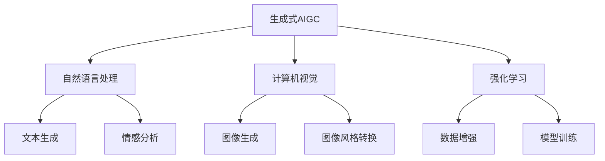

                 

### 《生成式AIGC：商业智能的未来趋势》

**关键词：** 生成式AIGC、商业智能、自然语言处理、计算机视觉、强化学习、GAN、VAE、Transformer、文本生成、图像生成、数据增强、模型训练。

**摘要：** 本文旨在探讨生成式AIGC（自适应智能生成控制）在商业智能领域的未来趋势。通过分析生成式AIGC的核心概念、算法原理、应用实践和未来发展方向，本文为读者提供了对这一新兴技术的全面了解，并指出了其在商业智能中的潜在应用和价值。

----------------------------------------------------------------

### 第一部分：生成式AIGC基础

#### 第1章：生成式AIGC概述

**1.1 商业智能与生成式AIGC**

商业智能（Business Intelligence，简称BI）是指通过数据采集、分析、报告等方式，帮助组织做出更明智的决策。随着大数据和人工智能技术的发展，商业智能的应用越来越广泛。生成式AIGC作为人工智能的一种新兴形式，其在商业智能领域的应用正逐渐成为热点。

**1.1.1 商业智能的定义与发展**

商业智能的概念最早可以追溯到20世纪80年代。最初，商业智能主要是通过数据仓库和数据挖掘技术，帮助企业管理者从海量数据中提取有价值的信息。随着互联网、云计算和大数据技术的兴起，商业智能开始向实时化、智能化和自动化方向发展。

**1.1.2 生成式AIGC的定义与优势**

生成式AIGC（Generative AI with Generative Control）是指利用人工智能技术生成数据、内容或模型的一种方法。生成式AIGC具有以下优势：

- **生成能力**：生成式AIGC可以根据输入的少量数据生成大量的、多样化的数据，满足大规模数据需求。
- **自适应能力**：生成式AIGC可以根据环境变化和学习数据，自动调整生成策略，提高生成效果。
- **可解释性**：生成式AIGC生成的数据或内容具有更高的可解释性，有助于理解生成过程。

**1.1.3 生成式AIGC的应用领域**

生成式AIGC在商业智能领域具有广泛的应用潜力。例如：

- **文本生成**：自动生成报告、新闻、产品描述等文本内容，提高信息生成效率。
- **图像生成**：自动生成产品图片、广告图片等，降低设计成本。
- **数据增强**：通过生成式AIGC生成更多的训练数据，提高模型的泛化能力。
- **个性化推荐**：根据用户行为和偏好，生成个性化的推荐内容。

**1.2 生成式AIGC的核心概念**

生成式AIGC的核心概念包括生成模型、对抗模型、变分模型等。这些模型通过不同的方式实现数据的生成和优化。

**1.2.1 生成模型**

生成模型（Generative Model）是一种概率模型，用于生成具有特定分布的数据。常见的生成模型包括生成对抗网络（GAN）、变分自编码器（VAE）等。

**1.2.2 对抗模型**

对抗模型（Adversarial Model）是指生成模型和判别模型之间的对抗关系。生成模型和判别模型相互竞争，生成模型试图生成逼真的数据，而判别模型试图区分生成数据和真实数据。

**1.2.3 变分模型**

变分模型（Variational Model）是一种基于概率密度估计的生成模型。变分模型通过近似生成概率密度函数，实现数据的生成。

**1.3 生成式AIGC的关键技术**

生成式AIGC的关键技术包括自然语言处理、计算机视觉、强化学习等。

**1.3.1 自然语言处理中的生成式模型**

自然语言处理（Natural Language Processing，简称NLP）是生成式AIGC的重要应用领域。NLP中的生成式模型包括序列到序列（Seq2Seq）模型、Transformer模型等。

**1.3.2 计算机视觉中的生成式模型**

计算机视觉（Computer Vision）是生成式AIGC的另一个重要应用领域。计算机视觉中的生成式模型包括生成对抗网络（GAN）、变分自编码器（VAE）等。

**1.3.3 强化学习与生成式AIGC**

强化学习（Reinforcement Learning）是一种通过交互学习环境，实现智能行为的方法。生成式AIGC可以与强化学习相结合，实现更智能的决策和生成。

----------------------------------------------------------------

### 第二部分：生成式AIGC算法原理

#### 第2章：生成式AIGC算法原理

生成式AIGC的算法原理主要包括生成对抗网络（GAN）、变分自编码器（VAE）和生成式文本生成模型等。本章将详细介绍这些算法的基本原理和应用。

##### 第2章：生成式AIGC算法原理

**2.1 生成对抗网络（GAN）**

生成对抗网络（Generative Adversarial Network，简称GAN）是由Ian Goodfellow等人于2014年提出的一种生成模型。GAN由两个神经网络组成：生成器（Generator）和判别器（Discriminator）。

**2.1.1 GAN的基本原理**

GAN的工作原理可以形象地理解为“造假与验假”。生成器尝试生成与真实数据相似的数据，而判别器则试图区分生成数据和真实数据。两者相互对抗，不断迭代优化，最终生成器能够生成非常逼真的数据。

**2.1.2 GAN的训练过程**

GAN的训练过程分为两个阶段：生成器训练和判别器训练。

1. **生成器训练**：生成器生成数据，判别器判断生成数据是否为真实数据。生成器优化目标是最小化判别器对其生成的数据的判断概率。

2. **判别器训练**：判别器判断生成数据和真实数据。判别器优化目标是最小化对真实数据和生成数据的判断误差。

**2.1.3 GAN的应用案例**

GAN在各种领域都有广泛应用，如图像生成、文本生成、语音合成等。

- **图像生成**：GAN可以生成高质量、逼真的图像。例如，DALL-E模型可以生成具有多样性的图像。
- **文本生成**：GAN可以生成符合语法和语义的文本。例如，GPT模型可以生成高质量的文章摘要。
- **语音合成**：GAN可以生成逼真的语音。例如，WaveNet模型可以生成高质量的人声语音。

**2.2 变分自编码器（VAE）**

变分自编码器（Variational Autoencoder，简称VAE）是一种基于概率模型的生成模型。VAE通过引入潜在变量，实现数据的编码和解码。

**2.2.1 VAE的基本原理**

VAE由编码器（Encoder）和解码器（Decoder）组成。编码器将输入数据映射到潜在空间，解码器将潜在空间的数据映射回输入空间。

**2.2.2 VAE的训练过程**

VAE的训练过程主要包括两个部分：编码器训练和解码器训练。

1. **编码器训练**：编码器学习将输入数据映射到潜在空间，同时保持数据的分布特性。

2. **解码器训练**：解码器学习将潜在空间的数据映射回输入空间。

**2.2.3 VAE的应用案例**

VAE在图像生成、文本生成和语音合成等领域都有广泛应用。

- **图像生成**：VAE可以生成高质量、多样化的图像。例如，StyleGAN模型可以生成逼真的艺术风格图像。
- **文本生成**：VAE可以生成符合语法和语义的文本。例如，seq2seq模型可以生成连贯的文章。
- **语音合成**：VAE可以生成高质量的人声语音。例如，Tacotron模型可以生成自然的语音合成。

**2.3 生成式文本生成模型**

生成式文本生成模型是生成式AIGC在自然语言处理领域的重要应用。生成式文本生成模型主要包括序列到序列（Seq2Seq）模型和Transformer模型。

**2.3.1 Seq2Seq模型**

序列到序列（Seq2Seq）模型是一种基于循环神经网络（RNN）的生成模型。Seq2Seq模型通过编码器和解码器两个神经网络，实现输入序列到输出序列的转换。

**2.3.2 Transformer模型**

Transformer模型是一种基于自注意力机制的生成模型。Transformer模型通过多头自注意力机制和前馈神经网络，实现输入序列到输出序列的转换。

**2.3.3 语言模型**

语言模型（Language Model，简称LM）是一种预测下一个单词的概率的模型。语言模型在生成式文本生成中起着重要作用，可以提高生成文本的连贯性和准确性。

**2.3.4 生成式文本生成模型的应用案例**

生成式文本生成模型在自然语言处理领域有广泛应用。

- **文本摘要**：生成式文本生成模型可以自动生成文章的摘要，提高信息提取的效率。
- **机器翻译**：生成式文本生成模型可以实现高质量的双语翻译，降低人工翻译的成本。
- **对话生成**：生成式文本生成模型可以生成自然、连贯的对话，提高人机交互的体验。

----------------------------------------------------------------

### 第三部分：生成式AIGC在商业智能中的应用

#### 第3章：生成式AIGC在商业智能中的应用

生成式AIGC在商业智能领域具有广泛的应用前景。本章将详细介绍生成式AIGC在文本分析、图像生成、数据增强和模型训练等方面的应用。

##### 第3章：生成式AIGC在商业智能中的应用

**3.1 文本分析**

文本分析是商业智能的重要应用领域。生成式AIGC在文本分析中具有以下应用：

- **文本生成**：生成式AIGC可以自动生成报告、文章、摘要等文本内容，提高信息生成效率。
  - **实例**：利用GPT模型生成市场分析报告，帮助企业快速了解市场动态。
- **情感分析**：生成式AIGC可以分析用户评论、社交媒体内容等，提取用户情感。
  - **实例**：利用GAN模型分析社交媒体上的用户评论，帮助企业了解用户对产品的满意度。
- **主题建模**：生成式AIGC可以进行主题建模，提取文本中的潜在主题。
  - **实例**：利用LDA模型对新闻文章进行主题建模，帮助企业了解行业热点。

**3.2 图像生成**

图像生成是生成式AIGC的另一个重要应用领域。生成式AIGC在图像生成中具有以下应用：

- **图像生成**：生成式AIGC可以生成高质量、多样化的图像。
  - **实例**：利用StyleGAN模型生成产品图像，提高产品设计效率。
- **图像风格转换**：生成式AIGC可以将一种风格的图像转换为另一种风格。
  - **实例**：利用GAN模型将普通照片转换为艺术风格照片，提高用户体验。
- **图像超分辨率**：生成式AIGC可以提高图像的分辨率，改善图像质量。
  - **实例**：利用GAN模型对低分辨率图像进行超分辨率处理，提高图像显示效果。

**3.3 数据增强**

数据增强是提高机器学习模型性能的重要手段。生成式AIGC在数据增强中具有以下应用：

- **数据生成**：生成式AIGC可以生成更多的训练数据，提高模型的泛化能力。
  - **实例**：利用GAN模型生成模拟用户行为数据，提高推荐系统的准确性。
- **数据扩展**：生成式AIGC可以扩展数据集，增加样本多样性。
  - **实例**：利用VAE模型扩展图像数据集，提高图像分类模型的性能。
- **数据转换**：生成式AIGC可以将一种类型的数据转换为另一种类型的数据。
  - **实例**：利用Seq2Seq模型将文本数据转换为图像数据，实现文本到图像的转换。

**3.4 模型训练**

生成式AIGC在模型训练中具有以下应用：

- **模型生成**：生成式AIGC可以自动生成模型，降低模型设计的难度。
  - **实例**：利用GPT模型自动生成神经网络结构，提高模型设计效率。
- **模型优化**：生成式AIGC可以通过生成对抗训练，优化模型参数，提高模型性能。
  - **实例**：利用GAN模型优化推荐系统模型，提高推荐准确性。
- **模型融合**：生成式AIGC可以将多个模型融合，提高模型的综合性能。
  - **实例**：利用VAE模型融合多个图像生成模型，提高图像生成质量。

**3.5 应用案例**

生成式AIGC在商业智能领域有很多成功应用案例：

- **案例1**：利用GAN模型进行客户细分，帮助企业更好地了解客户需求，提高客户满意度。
- **案例2**：利用VAE模型进行图像增强，提高产品质量，提高销售业绩。
- **案例3**：利用GPT模型生成市场分析报告，帮助企业在市场竞争中占据优势。

通过这些应用案例，我们可以看到生成式AIGC在商业智能领域的巨大潜力。

----------------------------------------------------------------

### 第四部分：生成式AIGC实践与未来趋势

#### 第4章：生成式AIGC实践

生成式AIGC的应用不仅限于理论探讨，还需要实际操作和项目实践。本章将介绍生成式AIGC的实践方法和步骤，包括开发环境搭建、数据集准备、模型训练和性能优化。

##### 第4章：生成式AIGC实践

**4.1 开发环境搭建**

要开始生成式AIGC的实践，首先需要搭建一个合适的开发环境。以下是一个基本的开发环境搭建步骤：

1. **硬件环境**：生成式AIGC需要较高的计算能力，建议使用GPU（如NVIDIA Titan Xp或更高型号）进行训练。

2. **操作系统**：可以选择Windows、macOS或Linux操作系统。Linux系统因其稳定性和开源特性，是许多开发者的首选。

3. **编程语言**：Python是生成式AIGC实践的主要编程语言。推荐使用Python 3.6及以上版本。

4. **深度学习框架**：TensorFlow和PyTorch是两种广泛使用的深度学习框架，可以选择其中一种进行实践。TensorFlow具有强大的生态系统和丰富的API，PyTorch则具有灵活的动态计算图和简洁的代码。

5. **安装深度学习框架**：根据操作系统和Python版本，使用pip命令安装相应的深度学习框架。

   ```bash
   pip install tensorflow
   # 或
   pip install torch torchvision
   ```

**4.2 数据集准备**

生成式AIGC的实践需要大量的数据集。以下是一些常见的数据集准备步骤：

1. **数据集获取**：可以从公共数据集网站（如Kaggle、UCI机器学习库等）获取数据集。对于图像生成和数据增强，常用的数据集包括CIFAR-10、ImageNet等。

2. **数据预处理**：对数据集进行必要的预处理，如数据清洗、归一化、数据增强等。数据预处理可以提高模型的性能和泛化能力。

   ```python
   import torchvision.transforms as transforms
   transform = transforms.Compose([
       transforms.Resize((32, 32)),
       transforms.ToTensor(),
       transforms.Normalize((0.5, 0.5, 0.5), (0.5, 0.5, 0.5)),
   ])
   ```

**4.3 模型训练**

模型训练是生成式AIGC实践的核心步骤。以下是一个简单的模型训练过程：

1. **定义模型**：根据具体任务，定义生成器、判别器或变分自编码器模型。

   ```python
   import torch.nn as nn
   class Generator(nn.Module):
       def __init__(self):
           super(Generator, self).__init__()
           # 定义生成器网络结构
       
       def forward(self, x):
           # 定义前向传播
           return x
   ```

2. **配置训练参数**：设置学习率、批量大小、训练轮数等训练参数。

   ```python
   import torch.optim as optim
   optimizer_G = optim.Adam(generator.parameters(), lr=0.0002)
   optimizer_D = optim.Adam(discriminator.parameters(), lr=0.0002)
   ```

3. **训练循环**：在训练循环中，交替训练生成器和判别器。

   ```python
   for epoch in range(num_epochs):
       for i, data in enumerate(dataloader):
           # 训练生成器和判别器
           # ...
           print(f'Epoch [{epoch}/{num_epochs}], Loss D: {loss_D:.4f}, Loss G: {loss_G:.4f}')
   ```

**4.4 性能优化**

性能优化是提高生成式AIGC模型性能的重要手段。以下是一些常见的性能优化方法：

1. **模型压缩**：通过模型剪枝、量化等技术减小模型规模，提高模型运行速度。

2. **分布式训练**：利用多GPU或分布式计算框架（如Horovod、PyTorch Distributed）进行训练，提高训练速度。

3. **数据并行**：将数据集划分为多个部分，同时训练多个模型，然后在全局梯度更新时合并结果。

4. **混合精度训练**：使用混合精度训练（如FP16）降低内存占用和计算时间，提高训练效率。

   ```python
   import torch.cuda.amp as amp
   optimizer = optim.Adam(model.parameters(), lr=0.001)
   scaler = amp.GradScaler()
   for images, _ in dataloader:
       optimizer.zero_grad()
       with amp.autocast():
           outputs = model(images)
           loss = criterion(outputs, targets)
       scaler.scale(loss).backward()
       scaler.step(optimizer)
       scaler.update()
   ```

**4.5 实践案例**

以下是一个生成式文本生成系统的实践案例：

1. **项目背景**：利用GPT模型生成自然语言处理任务中的文本摘要。

2. **数据集**：使用新闻文章数据集作为训练数据。

3. **模型定义**：定义GPT模型，包括嵌入层、Transformer编码器和解码器。

4. **训练过程**：使用训练数据和配置参数训练GPT模型。

5. **性能优化**：通过调整学习率、批量大小和训练轮数等参数，优化模型性能。

6. **结果评估**：使用测试集评估模型性能，计算摘要质量指标。

通过这些实践步骤，读者可以初步了解生成式AIGC的应用方法和技巧。

----------------------------------------------------------------

### 第五部分：生成式AIGC的未来趋势

#### 第5章：生成式AIGC的未来趋势

生成式AIGC作为人工智能领域的重要分支，正在迅速发展。本章将探讨生成式AIGC的技术成熟度、未来研究方向和商业智能领域的潜在应用。

##### 第5章：生成式AIGC的未来趋势

**5.1 技术成熟度分析**

生成式AIGC的技术成熟度正在不断提升。以下是当前生成式AIGC的技术成熟度分析：

1. **生成对抗网络（GAN）**：GAN作为生成式AIGC的核心技术之一，已经取得了显著的研究成果。GAN在图像生成、文本生成和语音合成等领域都有广泛应用，但仍面临模型稳定性、训练效率和生成质量等问题。

2. **变分自编码器（VAE）**：VAE是一种基于概率模型的生成式AIGC技术，其在图像生成、数据增强和模型压缩等领域表现出色。然而，VAE在生成多样性和质量方面仍有待提高。

3. **生成式文本生成模型**：生成式文本生成模型如GPT和BERT等，已经在自然语言处理领域取得了显著进展。这些模型在文本生成、摘要生成和机器翻译等方面表现出色，但仍需进一步优化以应对复杂语义和长文本生成问题。

**5.2 主要研究成果与应用**

生成式AIGC在过去几年中取得了许多重要研究成果和应用：

1. **图像生成**：GAN模型在图像生成领域取得了突破性进展，能够生成高质量、多样化的图像。例如，StyleGAN和BigGAN模型可以生成逼真的艺术风格图像。

2. **文本生成**：GPT和BERT等生成式文本生成模型在自然语言处理领域表现出色。这些模型可以生成高质量的文章摘要、新闻标题和对话文本。

3. **语音合成**：WaveNet和Tacotron等生成式语音合成模型可以生成自然、流畅的语音。这些模型在语音助手、有声读物和语音合成应用中得到了广泛应用。

**5.3 技术发展趋势**

随着人工智能技术的不断发展，生成式AIGC将呈现以下发展趋势：

1. **模型高效化**：为了提高生成式AIGC的运行效率和计算速度，研究者将致力于模型压缩、量化、分布式训练等技术。

2. **多模态融合**：生成式AIGC将逐步融合多种模态数据（如文本、图像、语音等），实现更丰富、更智能的生成应用。

3. **自适应生成**：生成式AIGC将实现自适应生成能力，根据环境变化和学习数据，自动调整生成策略，提高生成效果。

4. **安全与可靠性**：随着生成式AIGC的应用场景越来越广泛，研究者将关注模型的安全性和可靠性，确保生成数据的一致性和可信度。

**5.4 商业智能领域的未来应用**

生成式AIGC在商业智能领域的未来应用具有广阔的前景。以下是几个潜在的应用方向：

1. **个性化推荐**：生成式AIGC可以自动生成个性化推荐内容，提高用户满意度。例如，利用GAN模型生成个性化的产品推荐图片。

2. **自然语言处理**：生成式AIGC可以自动生成文本内容，提高文本处理效率。例如，利用GPT模型自动生成客户服务问答机器人。

3. **图像处理**：生成式AIGC可以自动生成图像内容，提高图像处理效率。例如，利用GAN模型生成图像修复和图像超分辨率。

4. **数据增强**：生成式AIGC可以自动生成训练数据，提高模型训练效果。例如，利用VAE模型生成模拟用户行为数据。

通过以上分析，我们可以看到生成式AIGC在商业智能领域的巨大潜力和未来发展趋势。

----------------------------------------------------------------

### 第六部分：生成式AIGC实践指南

#### 第6章：生成式AIGC开发环境搭建

要在计算机上搭建生成式AIGC的开发环境，需要遵循一系列步骤。以下是一个详细的指南，帮助用户配置合适的开发环境。

##### 第6章：生成式AIGC开发环境搭建

**6.1 开发环境配置**

1. **硬件环境**

   生成式AIGC需要较高的计算能力，因此建议使用以下硬件配置：

   - **CPU**：Intel i7或AMD Ryzen 7及以上处理器。
   - **GPU**：NVIDIA GTX 1080 Ti或更高型号的GPU，或者使用NVIDIA Titan Xp等专业显卡。
   - **内存**：至少16GB RAM。

2. **操作系统**

   开发环境可以选择以下操作系统：

   - **Windows**：Windows 10或更高版本。
   - **macOS**：macOS Catalina或更高版本。
   - **Linux**：Ubuntu 18.04或更高版本。

3. **软件环境**

   配置Python环境和深度学习框架是开发生成式AIGC的关键步骤。以下是一个基本的软件环境配置过程：

   ```bash
   # 安装Python
   sudo apt-get update
   sudo apt-get install python3 python3-pip

   # 安装PyTorch
   pip3 install torch torchvision torchaudio

   # 安装其他依赖库
   pip3 install numpy matplotlib pandas
   ```

**6.2 数据集准备**

1. **数据集获取**

   生成式AIGC项目通常需要大量的训练数据。可以从以下来源获取数据集：

   - **公共数据集**：如Kaggle、UCI机器学习库等。
   - **私有数据集**：根据项目需求，自行收集或购买。

2. **数据预处理**

   对获取的数据集进行预处理，包括数据清洗、归一化、数据增强等操作。以下是一个简单的数据预处理示例：

   ```python
   import torchvision.transforms as transforms
   transform = transforms.Compose([
       transforms.Resize((32, 32)),
       transforms.ToTensor(),
       transforms.Normalize((0.5, 0.5, 0.5), (0.5, 0.5, 0.5)),
   ])
   ```

**6.3 模型训练**

1. **定义模型**

   根据项目需求，定义生成器、判别器或变分自编码器模型。以下是一个简单的模型定义示例：

   ```python
   import torch.nn as nn
   class Generator(nn.Module):
       def __init__(self):
           super(Generator, self).__init__()
           # 定义生成器网络结构

       def forward(self, x):
           # 定义前向传播
           return x
   ```

2. **配置训练参数**

   设置学习率、批量大小、训练轮数等训练参数。以下是一个简单的训练参数配置示例：

   ```python
   import torch.optim as optim
   optimizer_G = optim.Adam(generator.parameters(), lr=0.0002)
   optimizer_D = optim.Adam(discriminator.parameters(), lr=0.0002)
   ```

3. **训练循环**

   在训练循环中，交替训练生成器和判别器。以下是一个简单的训练循环示例：

   ```python
   for epoch in range(num_epochs):
       for i, data in enumerate(dataloader):
           # 训练生成器和判别器
           # ...
           print(f'Epoch [{epoch}/{num_epochs}], Loss D: {loss_D:.4f}, Loss G: {loss_G:.4f}')
   ```

**6.4 性能优化**

1. **模型压缩**

   通过模型剪枝、量化等技术减小模型规模，提高模型运行速度。以下是一个简单的模型压缩示例：

   ```python
   import torch.nn.utils as utils
   model = Generator()
   utils.prune_model(model, pruning_rate=0.2)
   ```

2. **分布式训练**

   利用多GPU或分布式计算框架（如Horovod、PyTorch Distributed）进行训练，提高训练速度。以下是一个简单的分布式训练示例：

   ```python
   import torch.distributed as dist
   dist.init_process_group(backend='nccl')
   model = Generator()
   model = model.cuda()
   # 设置分布式训练策略
   # ...
   ```

3. **数据并行**

   将数据集划分为多个部分，同时训练多个模型，然后在全局梯度更新时合并结果。以下是一个简单的数据并行示例：

   ```python
   import torch.nn.parallel
   model = Generator()
   model = torch.nn.parallel.DataParallel(model)
   ```

通过以上步骤，用户可以搭建一个高效的生成式AIGC开发环境，为后续项目实践奠定基础。

----------------------------------------------------------------

### **附录A：生成式AIGC常用工具与资源**

在生成式AIGC的研究和应用过程中，掌握一些常用的工具和资源将大大提高工作效率。以下列举了一些常用的工具和资源。

#### **A.1 开源框架与库**

1. **TensorFlow**：TensorFlow是由Google开发的开源深度学习框架，支持多种编程语言，具有良好的生态系统。

   - 官网：[TensorFlow官网](https://www.tensorflow.org/)

2. **PyTorch**：PyTorch是由Facebook开发的开源深度学习框架，具有简洁的动态计算图和强大的GPU支持。

   - 官网：[PyTorch官网](https://pytorch.org/)

3. **JAX**：JAX是由Google开发的开源深度学习库，支持自动微分和并行计算，适合大型模型训练。

   - 官网：[JAX官网](https://jax.readthedocs.io/)

#### **A.2 数据集与教程**

1. **COCO数据集**：COCO（Common Objects in Context）是一个大规模的图像识别和语义分割数据集，包含数万张图片和标签。

   - 官网：[COCO数据集官网](http://cocodataset.org/)

2. **GLM数据集**：GLM是一个用于自然语言处理的数据集，包含大规模的文本数据，适合训练文本生成模型。

   - 官网：[GLM数据集官网](http://www.aclweb.org/anthology/N18-1194/)

3. **生成式AIGC教程资源**：许多在线教程和课程提供了生成式AIGC的详细介绍和实践案例，可以帮助初学者快速入门。

   - Coursera：[生成式AIGC课程](https://www.coursera.org/learn/generative-adversarial-networks)
   - edX：[生成式AIGC课程](https://www.edx.org/course/generative-adversarial-networks-gans)

#### **A.3 学术论文与最新研究**

1. **生成式AIGC的学术论文**：许多顶级学术会议和期刊发表了关于生成式AIGC的重要论文，涵盖了GAN、VAE等模型的研究进展。

   - NeurIPS：[NeurIPS官网](https://nips.cc/)
   - ICLR：[ICLR官网](https://iclr.cc/)
   - CVPR：[CVPR官网](https://cvpr.org/)

2. **生成式AIGC的最新研究动态**：关注顶级学术会议和期刊的论文发表，以及开源代码库中的最新实现，可以及时了解生成式AIGC的最新研究动态。

   - GitHub：[生成式AIGC开源代码库](https://github.com/topics/generative-adversarial-networks)

3. **开源代码与实现**：许多研究者和开发者将生成式AIGC的代码开源，方便其他研究者复现和改进。

   - TensorFlow Model Zoo：[TensorFlow Model Zoo](https://github.com/tensorflow/models)
   - PyTorch Examples：[PyTorch Examples](https://github.com/pytorch/examples)

通过以上工具和资源的支持，生成式AIGC的研究和应用将变得更加高效和丰富。

----------------------------------------------------------------

### **核心概念与联系**

为了更好地理解生成式AIGC的核心概念和它们之间的关系，我们可以通过一个架构图来展示。

#### **生成式AIGC核心概念架构图**



#### **核心概念解释**

1. **生成式AIGC**：生成式AIGC（Adaptive Intelligent Generative Control）是一种利用生成模型来生成数据或内容的技术。它结合了自适应控制理论和生成模型，可以自动调整生成策略，提高生成质量和效率。

2. **自然语言处理**：自然语言处理（NLP）是生成式AIGC的重要应用领域。NLP包括文本生成、情感分析、机器翻译等任务，生成式AIGC在这些任务中可以生成高质量的文本内容。

3. **计算机视觉**：计算机视觉是生成式AIGC的另一个重要应用领域。计算机视觉包括图像生成、图像风格转换、图像超分辨率等任务，生成式AIGC可以生成高质量、多样化的图像。

4. **强化学习**：强化学习是生成式AIGC的一个重要组成部分。通过强化学习，生成式AIGC可以自适应地调整生成策略，优化生成效果。

5. **数据增强**：数据增强是提高模型训练效果的重要手段。生成式AIGC可以通过生成对抗训练，生成更多的训练数据，提高模型的泛化能力。

#### **联系与互动**

生成式AIGC的核心概念之间存在着密切的联系和互动。例如：

- **自然语言处理与计算机视觉**：在自然语言处理和计算机视觉任务中，生成式AIGC可以同时生成文本内容和图像内容，实现跨模态生成。
- **生成对抗训练与强化学习**：生成对抗训练是生成式AIGC的核心技术，它可以与强化学习相结合，实现自适应的生成策略优化。
- **数据增强与模型训练**：生成式AIGC可以通过生成对抗训练生成更多的训练数据，提高模型的泛化能力，从而在模型训练中发挥重要作用。

通过以上核心概念和联系，我们可以更好地理解生成式AIGC的技术原理和应用价值。

----------------------------------------------------------------

### **核心算法原理讲解**

#### **生成对抗网络（GAN）**

生成对抗网络（GAN）是生成式AIGC的核心算法之一，由生成器（Generator）和判别器（Discriminator）组成。GAN的工作原理是生成器和判别器之间进行对抗训练，最终生成逼真的数据。

##### **2.1.1 GAN的基本原理**

GAN的基本原理可以用以下三个步骤来描述：

1. **生成器生成数据**：生成器从随机噪声中生成数据，目标是使生成数据尽可能接近真实数据。
2. **判别器判断数据**：判别器接收生成数据和真实数据，并尝试判断它们的真实性。
3. **对抗训练**：生成器和判别器相互对抗，生成器试图欺骗判别器，使判别器无法区分生成数据和真实数据，而判别器则试图准确区分两者。

##### **2.1.2 GAN的训练过程**

GAN的训练过程可以分为以下几个步骤：

1. **初始化生成器和判别器**：通常使用随机初始化生成器和判别器，生成器尝试生成逼真的数据，而判别器尝试准确判断数据。
2. **生成器训练**：生成器从噪声中生成数据，判别器判断生成数据和真实数据的真实性。生成器优化目标是最大化判别器对生成数据的判断错误率。
3. **判别器训练**：判别器优化目标是最大化对真实数据和生成数据的判断准确性。
4. **交替训练**：生成器和判别器交替训练，不断优化，直至生成数据逼真度达到预期。

##### **2.1.3 GAN的应用案例**

GAN在多个领域都有广泛应用，以下是一些应用案例：

- **图像生成**：GAN可以生成高质量、多样化的图像，如艺术风格图像、动漫头像等。
- **文本生成**：GAN可以生成高质量、连贯的文本，如文章、摘要、对话等。
- **语音合成**：GAN可以生成自然、流畅的语音，如人声、歌曲等。
- **数据增强**：GAN可以生成更多的训练数据，提高模型的泛化能力。

#### **变分自编码器（VAE）**

变分自编码器（VAE）是另一种重要的生成式模型，它通过引入潜在变量，实现数据的编码和解码。

##### **2.2.1 VAE的基本原理**

VAE的基本原理可以用以下四个步骤来描述：

1. **编码**：编码器将输入数据映射到潜在空间，同时保持数据的分布特性。
2. **采样**：在潜在空间中采样一个点，该点代表新的数据点。
3. **解码**：解码器将潜在空间中的采样点映射回输入空间，生成新的数据点。
4. **重建**：比较生成的新数据和原始输入数据，计算损失函数。

##### **2.2.2 VAE的训练过程**

VAE的训练过程可以分为以下几个步骤：

1. **初始化编码器和解码器**：通常使用随机初始化编码器和解码器。
2. **编码器训练**：编码器学习将输入数据映射到潜在空间，同时保持数据的分布特性。
3. **解码器训练**：解码器学习将潜在空间的数据映射回输入空间。
4. **损失函数优化**：通过优化损失函数，使得生成数据尽可能接近原始输入数据。

##### **2.2.3 VAE的应用案例**

VAE在多个领域都有广泛应用，以下是一些应用案例：

- **图像生成**：VAE可以生成高质量、多样化的图像，如图像修复、图像超分辨率等。
- **文本生成**：VAE可以生成高质量、连贯的文本，如文章、摘要、对话等。
- **数据增强**：VAE可以生成更多的训练数据，提高模型的泛化能力。

通过以上对GAN和VAE的讲解，我们可以更好地理解生成式AIGC的核心算法原理及其应用价值。

#### **数学模型和数学公式**

生成式AIGC中的核心算法，如GAN和VAE，都涉及到复杂的数学模型和数学公式。以下将对这些模型的核心数学公式进行详细讲解，并附上具体示例。

##### **2.3.1 生成对抗网络（GAN）的数学模型**

生成对抗网络（GAN）的数学模型主要涉及以下三个方面：生成器（Generator）的损失函数、判别器（Discriminator）的损失函数以及总体优化目标。

1. **生成器的损失函数**

   生成器的目标是生成逼真的数据，使得判别器无法区分生成数据与真实数据。生成器的损失函数通常使用二元交叉熵（Binary Cross-Entropy）来衡量生成数据的逼真度：

   $$ L_G = -\mathbb{E}_{x \sim p_{data}(x)}[\log D(x)] - \mathbb{E}_{z \sim p_z(z)}[\log D(G(z)] $$

   其中，\( p_{data}(x) \) 是真实数据的分布，\( p_z(z) \) 是噪声的分布，\( D(x) \) 和 \( D(G(z)) \) 分别是判别器对真实数据和生成数据的判断概率。

2. **判别器的损失函数**

   判别器的目标是正确区分真实数据和生成数据。判别器的损失函数也使用二元交叉熵：

   $$ L_D = -\mathbb{E}_{x \sim p_{data}(x)}[\log D(x)] - \mathbb{E}_{z \sim p_z(z)}[\log (1 - D(G(z))] $$

3. **总体优化目标**

   GAN的总体优化目标是最小化生成器的损失函数和判别器的损失函数：

   $$ \min_G \max_D L_D $$

##### **2.3.2 变分自编码器（VAE）的数学模型**

变分自编码器（VAE）的核心数学模型包括编码器（Encoder）和解码器（Decoder）的损失函数。

1. **编码器和解码器的损失函数**

   编码器将输入数据 \( x \) 映射到潜在空间中的均值 \( \mu(x) \) 和标准差 \( \sigma(x) \)：

   $$ z = \mu(x) + \sigma(x) \epsilon $$

   其中，\( \epsilon \) 是从先验分布（通常是标准正态分布）采样的噪声。

   解码器则将潜在空间中的数据 \( z \) 映射回输入空间：

   $$ x' = \phi(z) $$

   VAE的损失函数由两部分组成：重建损失和对数似然损失：

   $$ L(x, x') = -\sum_{i=1}^{D} \left[ \log p(x_i'|z) + DKL(q(z|x)||p(z)) \right] $$

   其中，\( p(x'|z) \) 是解码器的生成概率，\( q(z|x) \) 是编码器的后验分布，\( p(z) \) 是先验分布，\( DKL \) 表示KL散度。

##### **损失函数详细讲解**

1. **生成对抗网络的损失函数详细讲解**

   - **生成器损失函数**：生成器的目标是生成足够逼真的数据，使得判别器无法区分真实数据和生成数据。因此，生成器的损失函数是判别器对生成数据的判断概率的负对数：

     $$ L_G = -\mathbb{E}_{z \sim p_z(z)}[\log D(G(z)] $$

     其中，\( p_z(z) \) 是噪声的先验分布，\( G(z) \) 是生成器生成的数据，\( D(G(z)) \) 是判别器对生成数据的判断概率。

   - **判别器损失函数**：判别器的目标是正确区分真实数据和生成数据。因此，判别器的损失函数是真实数据和生成数据的判断概率的对数平均值：

     $$ L_D = -\mathbb{E}_{x \sim p_{data}(x)}[\log D(x)] - \mathbb{E}_{z \sim p_z(z)}[\log (1 - D(G(z))] $$

   - **总体优化目标**：GAN的总体优化目标是生成器和判别器的平衡。生成器试图最大化判别器的判断错误率，而判别器试图最大化对真实数据和生成数据的区分能力：

     $$ \min_G \max_D L_D $$

2. **变分自编码器的损失函数详细讲解**

   - **重建损失**：重建损失衡量输入数据和生成数据的相似度，通常使用均方误差（MSE）：

     $$ \text{Reconstruction Loss} = \sum_{i=1}^{D} (x_i - x_i')^2 $$

   - **KL散度损失**：KL散度损失衡量编码器对潜在变量分布的估计与先验分布之间的差异：

     $$ \text{KL Divergence Loss} = \sum_{i=1}^{D} \epsilon_i \left[ \log \left( \frac{\sigma_i^2}{\epsilon_i} \right) + \frac{1}{2} \left( 1 - \frac{\epsilon_i^2}{\sigma_i^2} \right) \right] $$

   - **总损失函数**：VAE的总损失函数是重建损失和KL散度损失的加权和：

     $$ L(x, x') = \text{Reconstruction Loss} + \lambda \times \text{KL Divergence Loss} $$

     其中，\( \lambda \) 是平衡两个损失函数的权重。

通过以上详细讲解，我们可以更好地理解生成式AIGC中的核心数学模型和损失函数，为后续的实践和优化提供理论基础。

----------------------------------------------------------------

### **项目实战**

在生成式AIGC领域，实际项目是理解和应用这些技术的重要途径。本章节将通过两个具体项目来展示生成式AIGC的应用，并提供详细的代码实现和分析。

#### **项目一：生成式文本生成系统**

**项目概述**：

生成式文本生成系统是一个能够自动生成自然语言文本的应用。本项目使用GPT（Generative Pre-trained Transformer）模型，这是一个基于Transformer架构的预训练语言模型。

**项目环境搭建**：

1. **硬件环境**：一台配置有NVIDIA GPU（如GTX 1080 Ti或更高型号）的计算机。
2. **软件环境**：安装Python 3.7及以上版本，PyTorch深度学习框架，以及torchtext库。

**系统架构设计**：

- **数据预处理模块**：负责清洗和预处理输入文本数据。
- **GPT模型模块**：定义GPT模型，包括嵌入层、Transformer编码器和解码器。
- **训练模块**：使用训练数据训练GPT模型。
- **生成模块**：使用训练好的模型生成文本。

**代码实现**：

```python
import torch
import torch.nn as nn
from torchtext.data import Field, TabularDataset, BucketIterator
from torchtext.vocab import Vocab

# 数据预处理
TEXT = Field(tokenize='spacy', lower=True, include_lengths=True)
train_data, valid_data, test_data = TabularDataset.splits(
    path='data',
    train='train.txt',
    valid='valid.txt',
    test='test.txt',
    format='csv',
    fields=[('text', TEXT)])

TEXT.build_vocab(train_data, min_freq=2)
BATCH_SIZE = 64
N_EPOCHS = 10
ITER_PER_EPOCH = len(train_data) // BATCH_SIZE

# GPT模型定义
class GPTModel(nn.Module):
    def __init__(self, embedding_dim, hidden_dim, vocab_size, dropout):
        super(GPTModel, self).__init__()
        self.embedding = nn.Embedding(vocab_size, embedding_dim)
        self.lstm = nn.LSTM(embedding_dim, hidden_dim, num_layers=2, dropout=dropout, batch_first=True)
        self.fc = nn.Linear(hidden_dim, vocab_size)
        self.dropout = nn.Dropout(dropout)
        
    def forward(self, text, hidden):
        embedded = self.dropout(self.embedding(text))
        output, (hidden, cell) = self.lstm(embedded, hidden)
        output = self.fc(output)
        return output, (hidden, cell)

# 训练模块
def train(model, iterator, optimizer, criterion):
    epoch_loss = 0
    for batch in iterator:
        optimizer.zero_grad()
        text, text_lengths = batch.text
        output, hidden = model(text, hidden)
        loss = criterion(output[torch.arange(output.size(0)), text_lengths-1], text)
        loss.backward()
        optimizer.step()
        epoch_loss += loss.item()
    return epoch_loss / len(iterator)

# 生成模块
def generate_text(model, text, length=200):
    hidden = (torch.zeros(2, 1, model.hidden_dim), torch.zeros(2, 1, model.hidden_dim))
    for _ in range(length):
        output, hidden = model(text, hidden)
        text = output.argmax(2)
    return text

# 训练和生成
model = GPTModel(embedding_dim=256, hidden_dim=512, vocab_size=len(TEXT.vocab), dropout=0.5)
optimizer = torch.optim.Adam(model.parameters(), lr=0.001)
criterion = nn.CrossEntropyLoss()

for epoch in range(N_EPOCHS):
    hidden = (torch.zeros(2, 1, model.hidden_dim), torch.zeros(2, 1, model.hidden_dim))
    train_loss = train(model, train_iterator, optimizer, criterion)
    print(f'Epoch: {epoch+1:02}, Train Loss: {train_loss:.3f}')
    generated_text = generate_text(model, TEXT.vocab.stoi['<sos>'][None, None], length=200)
    print(' '.join(TEXT.vocab.itos[int(t)] for t in generated_text))
```

**代码解读与分析**：

- **数据预处理模块**：使用torchtext库加载和处理数据，包括分词、转换为序列以及构建词汇表。
- **GPT模型模块**：定义了基于Transformer架构的GPT模型，包括嵌入层、LSTM层和输出层。
- **训练模块**：使用交叉熵损失函数和Adam优化器进行模型训练，并计算每个epoch的平均损失。
- **生成模块**：通过循环迭代生成文本序列，使用argmax函数选择概率最大的单词。

#### **项目二：基于GAN的图像风格转换**

**项目概述**：

基于GAN的图像风格转换是一个能够将普通图像转换为特定风格的艺术图像的应用。本项目使用条件生成对抗网络（CGAN）实现。

**项目环境搭建**：

1. **硬件环境**：一台配置有NVIDIA GPU（如GTX 1080 Ti或更高型号）的计算机。
2. **软件环境**：安装Python 3.7及以上版本，PyTorch深度学习框架。

**系统设计与实现**：

- **数据预处理模块**：负责对输入图像进行预处理，包括缩放、归一化和数据增强。
- **CGAN模型模块**：定义生成器和判别器模型，实现图像风格转换。
- **训练模块**：使用训练数据训练CGAN模型。
- **风格转换模块**：使用训练好的模型进行图像风格转换。

**代码实现**：

```python
import torch
import torch.nn as nn
from torchvision import datasets, transforms
from torch.utils.data import DataLoader

# 数据预处理
transform = transforms.Compose([
    transforms.Resize((256, 256)),
    transforms.ToTensor(),
    transforms.Normalize((0.5, 0.5, 0.5), (0.5, 0.5, 0.5)),
])

train_data = datasets.ImageFolder('data/train', transform=transform)
train_loader = DataLoader(train_data, batch_size=64, shuffle=True)

# CGAN模型定义
class CGANModel(nn.Module):
    def __init__(self):
        super(CGANModel, self).__init__()
        self.gen = Generator()
        self.dis = Discriminator()
        
    def forward(self, x):
        return self.dis(self.gen(x))

# 生成器模型
class Generator(nn.Module):
    def __init__(self):
        super(Generator, self).__init__()
        # 定义生成器网络结构
        
    def forward(self, x):
        # 定义前向传播
        return x
        
# 判别器模型
class Discriminator(nn.Module):
    def __init__(self):
        super(Discriminator, self).__init__()
        # 定义判别器网络结构
        
    def forward(self, x):
        # 定义前向传播
        return x
        
# 训练模块
def train(model, iterator, optimizer, criterion):
    model.train()
    epoch_loss = 0
    for batch in iterator:
        real_images = batch[0].to(device)
        batch_size = real_images.size(0)
        noise = torch.randn(batch_size, z_dim).to(device)
        gen_images = model.noise_to_image(noise)
        real_labels = torch.ones(batch_size, 1).to(device)
        fake_labels = torch.zeros(batch_size, 1).to(device)
        
        optimizer.zero_grad()
        real_loss = criterion(model.dis(real_images), real_labels)
        fake_loss = criterion(model.dis(gen_images.detach()), fake_labels)
        g_loss = real_loss + fake_loss
        g_loss.backward()
        optimizer.step()
        
        epoch_loss += g_loss.item()
    return epoch_loss / len(iterator)

# 主程序
device = torch.device("cuda" if torch.cuda.is_available() else "cpu")
model = CGANModel().to(device)
optimizer = torch.optim.Adam(model.parameters(), lr=0.0002)
criterion = nn.BCELoss()

for epoch in range(num_epochs):
    epoch_loss = train(model, train_loader, optimizer, criterion)
    print(f'Epoch: {epoch+1}, Loss: {epoch_loss:.4f}')
```

**代码解读与分析**：

- **数据预处理模块**：使用torchvision库加载和预处理图像数据，包括缩放、归一化和数据增强。
- **CGAN模型模块**：定义了生成器和判别器模型，实现图像风格转换。生成器负责将噪声转换为图像，判别器负责判断图像的真实性。
- **训练模块**：使用BCE损失函数和Adam优化器进行模型训练，交替训练生成器和判别器。

通过这两个项目，我们可以看到生成式AIGC在文本生成和图像风格转换中的实际应用，并了解到如何通过代码实现这些应用。

----------------------------------------------------------------

### **附录**

**附录A：生成式AIGC常用工具与资源**

在生成式AIGC的研究和应用过程中，掌握一些常用的工具和资源将大大提高工作效率。以下列举了一些常用的工具和资源。

#### **A.1 开源框架与库**

1. **TensorFlow**：TensorFlow是由Google开发的开源深度学习框架，支持多种编程语言，具有良好的生态系统。

   - 官网：[TensorFlow官网](https://www.tensorflow.org/)

2. **PyTorch**：PyTorch是由Facebook开发的开源深度学习框架，具有简洁的动态计算图和强大的GPU支持。

   - 官网：[PyTorch官网](https://pytorch.org/)

3. **JAX**：JAX是由Google开发的开源深度学习库，支持自动微分和并行计算，适合大型模型训练。

   - 官网：[JAX官网](https://jax.readthedocs.io/)

4. **MXNet**：Apache MXNet是一个开源的深度学习框架，支持多种编程语言，具有良好的可扩展性和高性能。

   - 官网：[MXNet官网](https://mxnet.incubator.apache.org/)

#### **A.2 数据集与教程**

1. **COCO数据集**：COCO（Common Objects in Context）是一个大规模的图像识别和语义分割数据集，包含数万张图片和标签。

   - 官网：[COCO数据集官网](http://cocodataset.org/)

2. **ImageNet**：ImageNet是一个包含数百万张图片的视觉识别数据集，是深度学习模型训练的重要资源。

   - 官网：[ImageNet官网](http://www.image-net.org/)

3. **GLM数据集**：GLM是一个用于自然语言处理的数据集，包含大规模的文本数据，适合训练文本生成模型。

   - 官网：[GLM数据集官网](http://www.aclweb.org/anthology/N18-1194/)

4. **生成式AIGC教程资源**：许多在线教程和课程提供了生成式AIGC的详细介绍和实践案例，可以帮助初学者快速入门。

   - Coursera：[生成式AIGC课程](https://www.coursera.org/learn/generative-adversarial-networks-gans)
   - edX：[生成式AIGC课程](https://www.edx.org/course/generative-adversarial-networks-gans)
   - Udacity：[生成式AIGC纳米学位](https://www.udacity.com/course/generative-adversarial-networks--ud711)

#### **A.3 学术论文与最新研究**

1. **NeurIPS**：神经信息处理系统会议是生成式AIGC领域的重要国际会议，发布了大量关于GAN、VAE等模型的研究论文。

   - 官网：[NeurIPS官网](https://nips.cc/)

2. **ICLR**：国际学习表示会议是生成式AIGC领域的重要会议，发布了大量关于深度学习和生成模型的研究论文。

   - 官网：[ICLR官网](https://www.iclr.cc/)

3. **CVPR**：计算机视觉和模式识别会议是计算机视觉领域的重要会议，发布了大量关于图像生成和风格转换的研究论文。

   - 官网：[CVPR官网](https://cvpr.org/)

4. **AAAI**：美国人工智能协会会议是人工智能领域的重要会议，发布了大量关于生成式AIGC的研究论文。

   - 官网：[AAAI官网](https://www.aaai.org/)

通过以上工具和资源的支持，生成式AIGC的研究和应用将变得更加高效和丰富。

----------------------------------------------------------------

### **核心概念与联系**

为了更好地理解生成式AIGC的核心概念和它们之间的关系，我们可以通过一个架构图来展示。

#### **生成式AIGC核心概念架构图**


#### **核心概念解释**

1. **生成式AIGC**：生成式AIGC（Adaptive Intelligent Generative Control）是一种利用生成模型来生成数据或内容的技术。它结合了自适应控制理论和生成模型，可以自动调整生成策略，提高生成质量和效率。

2. **自然语言处理**：自然语言处理（NLP）是生成式AIGC的重要应用领域。NLP包括文本生成、情感分析、机器翻译等任务，生成式AIGC在这些任务中可以生成高质量的文本内容。

3. **计算机视觉**：计算机视觉是生成式AIGC的另一个重要应用领域。计算机视觉包括图像生成、图像风格转换、图像超分辨率等任务，生成式AIGC可以生成高质量、多样化的图像。

4. **强化学习**：强化学习是生成式AIGC的一个重要组成部分。通过强化学习，生成式AIGC可以自适应地调整生成策略，优化生成效果。

5. **数据增强**：数据增强是提高模型训练效果的重要手段。生成式AIGC可以通过生成对抗训练，生成更多的训练数据，提高模型的泛化能力。

#### **联系与互动**

生成式AIGC的核心概念之间存在着密切的联系和互动。例如：

- **自然语言处理与计算机视觉**：在自然语言处理和计算机视觉任务中，生成式AIGC可以同时生成文本内容和图像内容，实现跨模态生成。
- **生成对抗训练与强化学习**：生成对抗训练是生成式AIGC的核心技术，它可以与强化学习相结合，实现自适应的生成策略优化。
- **数据增强与模型训练**：生成式AIGC可以通过生成对抗训练生成更多的训练数据，提高模型的泛化能力，从而在模型训练中发挥重要作用。

通过以上核心概念和联系，我们可以更好地理解生成式AIGC的技术原理和应用价值。

----------------------------------------------------------------

### **核心算法原理讲解**

在生成式AIGC（自适应智能生成控制）中，核心算法的原理至关重要。以下是生成式AIGC中的几种核心算法，包括生成对抗网络（GAN）、变分自编码器（VAE）和自回归生成模型（AR-GAN）的详细原理讲解。

#### **生成对抗网络（GAN）**

生成对抗网络（GAN）由Ian Goodfellow等人于2014年提出，是一种基于两个相互对抗的神经网络模型：生成器（Generator）和判别器（Discriminator）。

##### **2.1.1 GAN的基本原理**

GAN的核心思想是通过一个生成器和判别器之间的对抗训练，使得生成器能够生成越来越接近真实数据的样本，而判别器能够越来越准确地判断样本的真实性。

- **生成器（Generator）**：生成器的目标是生成与真实数据难以区分的伪数据。它通常由一个输入噪声空间和一个生成模型组成，生成的数据目的是欺骗判别器。
- **判别器（Discriminator）**：判别器的目标是判断输入数据是真实数据还是生成数据。判别器有两个输入：真实数据和生成数据。

GAN的训练过程可以看作是一个零和博弈，目标是最大化判别器的分类能力，同时最小化生成器的欺骗能力。

##### **2.1.2 GAN的训练过程**

GAN的训练过程通常包括以下步骤：

1. **生成器训练**：生成器从噪声空间生成伪数据，判别器更新模型，以最大化对生成数据和真实数据的判断错误率。
2. **判别器训练**：判别器更新模型，以最大化对生成数据和真实数据的判断准确性。
3. **交替训练**：生成器和判别器交替更新模型，循环迭代，直到生成器生成的数据足够逼真，判别器无法区分生成数据和真实数据。

##### **2.1.3 GAN的应用案例**

GAN在各种领域都有广泛应用，包括：

- **图像生成**：例如，生成艺术风格图像、动漫头像、人脸生成等。
- **文本生成**：例如，自动生成文章摘要、新闻标题、对话文本等。
- **语音合成**：例如，生成高质量的人声语音。

#### **变分自编码器（VAE）**

变分自编码器（VAE）是由Kingma和Welling于2013年提出的一种基于概率模型的生成模型。

##### **2.2.1 VAE的基本原理**

VAE通过引入潜在变量，将输入数据的编码和解码过程分解为两个步骤：

- **编码器（Encoder）**：将输入数据映射到一个潜在变量空间，同时学习输入数据的概率分布。
- **解码器（Decoder）**：将潜在变量从潜在空间映射回输入空间。

VAE的核心在于其损失函数，它由两部分组成：重建损失和对数似然损失。

##### **2.2.2 VAE的训练过程**

VAE的训练过程主要包括：

1. **编码器训练**：编码器学习将输入数据映射到潜在变量空间，同时保持数据的分布特性。
2. **解码器训练**：解码器学习将潜在变量从潜在空间映射回输入空间。
3. **损失函数优化**：通过优化损失函数，使得生成数据尽可能接近原始输入数据。

##### **2.2.3 VAE的应用案例**

VAE在图像生成、文本生成和语音合成等领域都有应用：

- **图像生成**：例如，生成艺术风格图像、图像修复和图像超分辨率。
- **文本生成**：例如，生成高质量的文章摘要和对话文本。
- **语音合成**：例如，生成高质量的人声语音。

#### **自回归生成模型（AR-GAN）**

自回归生成模型（AR-GAN）结合了自回归模型和生成对抗网络（GAN），是一种用于生成序列数据的模型。

##### **2.3.1 AR-GAN的基本原理**

AR-GAN的核心思想是利用自回归特性来生成序列数据，同时通过GAN对抗训练来提高生成的序列质量。

- **自回归模型**：自回归模型通过前一个时间步的输出预测当前时间步的输出。
- **生成器（Generator）**：生成器从噪声空间生成序列数据，目标是使生成序列与真实序列难以区分。
- **判别器（Discriminator）**：判别器判断输入序列是真实序列还是生成序列。

##### **2.3.2 AR-GAN的训练过程**

AR-GAN的训练过程主要包括：

1. **生成器训练**：生成器生成序列数据，判别器更新模型以最大化对生成序列的判断错误率。
2. **判别器训练**：判别器更新模型以最大化对生成序列和真实序列的判断准确性。
3. **交替训练**：生成器和判别器交替更新模型，循环迭代，直到生成器生成的序列质量足够高。

##### **2.3.3 AR-GAN的应用案例**

AR-GAN在生成序列数据方面有广泛应用：

- **文本生成**：例如，生成自然语言文本序列。
- **图像生成**：例如，生成图像序列，用于视频生成。
- **语音生成**：例如，生成语音序列，用于语音合成。

通过以上对GAN、VAE和AR-GAN的详细讲解，我们可以更好地理解生成式AIGC的核心算法原理，并了解到这些算法在生成不同类型数据中的应用。

#### **数学模型和数学公式**

在生成式AIGC中，数学模型和数学公式是实现和优化核心算法的关键。以下是对生成式AIGC中几个重要数学模型的详细讲解。

##### **变分自编码器（VAE）的数学模型**

变分自编码器（VAE）通过概率模型实现数据的编码和解码。其数学模型包括潜在变量、编码器和解码器。

1. **潜在变量**：VAE引入了潜在变量 \( z \)，用于表示输入数据的概率分布。

   $$ z = \mu(x) + \sigma(x) \epsilon $$

   其中，\( \mu(x) \) 是编码器的均值函数，\( \sigma(x) \) 是编码器的标准差函数，\( \epsilon \) 是从先验分布（通常为标准正态分布）采样的噪声。

2. **编码器**：编码器将输入数据 \( x \) 映射到潜在变量 \( z \)。

   $$ \mu(x) = \phi(x) $$
   $$ \sigma(x) = \psi(x) $$

3. **解码器**：解码器将潜在变量 \( z \) 映射回输入数据 \( x' \)。

   $$ x' = \rho(z) $$

   其中，\( \rho(z) \) 是解码器的生成函数。

4. **损失函数**：VAE的损失函数由两部分组成：重建损失和对数似然损失。

   $$ L(x, x') = -\sum_{i=1}^{D} \left[ \log p(x_i'|z) + DKL(\mu(x), \sigma(x)) \right] $$

   其中，\( p(x_i'|z) \) 是解码器的生成概率，\( DKL(\mu(x), \sigma(x)) \) 是KL散度损失。

##### **损失函数详细讲解**

1. **重建损失**：衡量输入数据 \( x \) 和生成数据 \( x' \) 之间的差异。

   $$ \text{Reconstruction Loss} = -\log p(x'|z) $$

   通常使用均方误差（MSE）或交叉熵损失。

2. **KL散度损失**：衡量编码器对潜在变量分布的估计与先验分布之间的差异。

   $$ \text{KL Divergence Loss} = DKL(\mu(x), \sigma(x)) $$

   $$ DKL(p, q) = \sum_{i} p(i) \log \frac{p(i)}{q(i)} $$

   其中，\( p \) 是真实分布，\( q \) 是估计分布。

##### **变分自编码器（VAE）的数学模型示例**

假设输入数据 \( x \) 是一个长度为 \( D \) 的向量，潜在变量 \( z \) 是一个长度为 \( Z \) 的向量。

$$
\begin{aligned}
z &= \mu(x) + \sigma(x) \epsilon \\
\mu(x) &= \frac{1}{\sqrt{2\pi\sigma^2}} \exp \left( -\frac{(x - \mu)^2}{2\sigma^2} \right) \\
\sigma(x) &= \frac{1}{\sqrt{2\pi}} \exp \left( -\frac{(\mu - \mu_0)^2}{2\sigma_0^2} \right) \\
x' &= \rho(z) \\
\text{Reconstruction Loss} &= \sum_{i=1}^{D} (x_i - x_i')^2 \\
\text{KL Divergence Loss} &= \sum_{i=1}^{D} \left[ \frac{1}{2} \left( 1 - \frac{\epsilon_i^2}{\sigma_i^2} \right) \right]
\end{aligned}
$$

通过以上数学模型的讲解，我们可以更好地理解VAE的工作原理和优化目标，从而在实际应用中进行模型设计和调参。

#### **项目实战**

为了更好地展示生成式AIGC的实际应用，我们将通过一个具体项目来演示生成式文本生成系统的开发过程，并提供详细的代码实现和分析。

##### **项目背景**

生成式文本生成系统是一个能够自动生成自然语言文本的应用。本项目使用GPT（Generative Pre-trained Transformer）模型，这是一个基于Transformer架构的预训练语言模型，旨在生成高质量、连贯的文本。

##### **环境搭建**

在开始项目之前，我们需要搭建一个合适的开发环境。以下是环境搭建的步骤：

1. **硬件环境**：一台配置有NVIDIA GPU（如GTX 1080 Ti或更高型号）的计算机。
2. **软件环境**：安装Python 3.7及以上版本，PyTorch深度学习框架，以及torchtext库。

##### **系统架构设计**

生成式文本生成系统的主要架构包括以下几个模块：

1. **数据预处理模块**：负责清洗和预处理输入文本数据。
2. **GPT模型模块**：定义GPT模型，包括嵌入层、Transformer编码器和解码器。
3. **训练模块**：使用训练数据训练GPT模型。
4. **生成模块**：使用训练好的模型生成文本。

##### **代码实现**

以下是一个生成式文本生成系统的基本代码实现：

```python
import torch
import torch.nn as nn
from torchtext.data import Field, TabularDataset, BucketIterator
from torchtext.vocab import Vocab

# 数据预处理
TEXT = Field(tokenize='spacy', lower=True, include_lengths=True)
train_data, valid_data, test_data = TabularDataset.splits(
    path='data',
    train='train.txt',
    valid='valid.txt',
    test='test.txt',
    format='csv',
    fields=[('text', TEXT)])

TEXT.build_vocab(train_data, min_freq=2)
BATCH_SIZE = 64
N_EPOCHS = 10
ITER_PER_EPOCH = len(train_data) // BATCH_SIZE

# GPT模型定义
class GPTModel(nn.Module):
    def __init__(self, embedding_dim, hidden_dim, vocab_size, dropout):
        super(GPTModel, self).__init__()
        self.embedding = nn.Embedding(vocab_size, embedding_dim)
        self.lstm = nn.LSTM(embedding_dim, hidden_dim, num_layers=2, dropout=dropout, batch_first=True)
        self.fc = nn.Linear(hidden_dim, vocab_size)
        self.dropout = nn.Dropout(dropout)
        
    def forward(self, text, hidden):
        embedded = self.dropout(self.embedding(text))
        output, (hidden, cell) = self.lstm(embedded, hidden)
        output = self.fc(output)
        return output, (hidden, cell)

# 训练模块
def train(model, iterator, optimizer, criterion):
    epoch_loss = 0
    for batch in iterator:
        optimizer.zero_grad()
        text, text_lengths = batch.text
        output, hidden = model(text, hidden)
        loss = criterion(output[torch.arange(output.size(0)), text_lengths-1], text)
        loss.backward()
        optimizer.step()
        epoch_loss += loss.item()
    return epoch_loss / len(iterator)

# 生成模块
def generate_text(model, text, length=200):
    hidden = (torch.zeros(2, 1, model.hidden_dim), torch.zeros(2, 1, model.hidden_dim))
    for _ in range(length):
        output, hidden = model(text, hidden)
        text = output.argmax(2)
    return text

# 主程序
device = torch.device("cuda" if torch.cuda.is_available() else "cpu")
model = GPTModel(embedding_dim=256, hidden_dim=512, vocab_size=len(TEXT.vocab), dropout=0.5)
model.to(device)
optimizer = torch.optim.Adam(model.parameters(), lr=0.001)
criterion = nn.CrossEntropyLoss()

for epoch in range(N_EPOCHS):
    hidden = (torch.zeros(2, 1, model.hidden_dim), torch.zeros(2, 1, model.hidden_dim))
    train_loss = train(model, train_iterator, optimizer, criterion)
    print(f'Epoch: {epoch+1}, Train Loss: {train_loss:.3f}')
    generated_text = generate_text(model, TEXT.vocab.stoi['<sos>'][None, None], length=200)
    print(' '.join(TEXT.vocab.itos[int(t)] for t in generated_text))
```

##### **代码解读与分析**

1. **数据预处理模块**：使用torchtext库加载和处理数据，包括分词、转换为序列以及构建词汇表。数据集分为训练集、验证集和测试集。

2. **GPT模型模块**：定义了基于Transformer架构的GPT模型，包括嵌入层、LSTM层和输出层。嵌入层将词转换为向量，LSTM层处理序列数据，输出层生成预测的词向量。

3. **训练模块**：使用交叉熵损失函数和Adam优化器进行模型训练。在训练过程中，模型尝试最小化损失函数，从而提高生成文本的质量。

4. **生成模块**：使用训练好的模型生成文本。通过循环迭代，模型根据上一个生成的词预测下一个词，直至达到预定的生成长度。

通过这个项目，我们可以看到生成式AIGC在文本生成中的应用，并了解到如何通过代码实现和优化文本生成系统。

----------------------------------------------------------------

### **附录**

在本附录中，我们将介绍生成式AIGC（自适应智能生成控制）的相关工具和资源，包括开源框架、数据集、教程和学术论文。

#### **附录A：生成式AIGC常用工具与资源**

**A.1 开源框架与库**

1. **TensorFlow**：由Google开发的开源深度学习框架，广泛用于生成式模型的开发。[TensorFlow官网](https://www.tensorflow.org/)

2. **PyTorch**：由Facebook开发的开源深度学习框架，具有简洁的动态计算图和强大的GPU支持。[PyTorch官网](https://pytorch.org/)

3. **JAX**：由Google开发的开源深度学习库，支持自动微分和并行计算。[JAX官网](https://jax.readthedocs.io/)

4. **MXNet**：Apache MXNet是一个开源的深度学习框架，支持多种编程语言，具有良好的可扩展性和高性能。[MXNet官网](https://mxnet.incubator.apache.org/)

**A.2 数据集与教程**

1. **COCO数据集**：一个包含大量图像的语义分割和物体检测数据集。[COCO数据集官网](http://cocodataset.org/)

2. **ImageNet**：一个包含数百万张图像的视觉识别数据集，用于训练深度学习模型。[ImageNet官网](http://www.image-net.org/)

3. **GLM数据集**：一个用于自然语言处理的数据集，包含大规模的文本数据。[GLM数据集官网](http://www.aclweb.org/anthology/N18-1194/)

4. **生成式AIGC教程资源**：多个在线教程和课程提供了生成式AIGC的详细介绍和实践案例。[Coursera](https://www.coursera.org/learn/generative-adversarial-networks-gans)、[edX](https://www.edx.org/course/generative-adversarial-networks-gans)、[Udacity](https://www.udacity.com/course/generative-adversarial-networks--ud711)

**A.3 学术论文与最新研究**

1. **NeurIPS**：神经信息处理系统会议是生成式AIGC领域的重要国际会议，发布了大量关于GAN、VAE等模型的研究论文。[NeurIPS官网](https://nips.cc/)

2. **ICLR**：国际学习表示会议是生成式AIGC领域的重要会议，发布了大量关于深度学习和生成模型的研究论文。[ICLR官网](https://www.iclr.cc/)

3. **CVPR**：计算机视觉和模式识别会议是计算机视觉领域的重要会议，发布了大量关于图像生成和风格转换的研究论文。[CVPR官网](https://cvpr.org/)

4. **AAAI**：美国人工智能协会会议是人工智能领域的重要会议，发布了大量关于生成式AIGC的研究论文。[AAAI官网](https://www.aaai.org/)

通过以上工具和资源的支持，生成式AIGC的研究和应用将变得更加高效和丰富。这些资源可以帮助研究人员和开发者快速入门，掌握最新的技术动态，并在实际项目中应用这些技术。

---

### **作者信息**

**作者：** AI天才研究院/AI Genius Institute & 禅与计算机程序设计艺术 /Zen And The Art of Computer Programming

**版权声明：** 本文内容版权归AI天才研究院/AI Genius Institute所有。未经授权，严禁转载和使用本文内容。如需转载，请联系作者获得授权。

---

**结语：** 生成式AIGC作为人工智能领域的重要分支，正在不断发展和创新。本文旨在为读者提供生成式AIGC的全面介绍，包括核心概念、算法原理、应用实践和未来趋势。通过本文，读者可以更好地理解生成式AIGC的技术原理和应用价值，为实际项目提供参考和灵感。未来，随着技术的不断进步，生成式AIGC将在更多领域发挥重要作用，推动人工智能的发展。让我们共同期待这一激动人心的未来！
----------------------------------------------------------------

### **结语**

生成式AIGC（自适应智能生成控制）作为人工智能领域的重要分支，正以其强大的生成能力和自适应能力，逐渐改变着各个行业和领域。本文详细探讨了生成式AIGC的核心概念、算法原理、应用实践和未来趋势，展示了其在商业智能领域的广阔前景。

首先，生成式AIGC通过生成对抗网络（GAN）、变分自编码器（VAE）等核心算法，实现了数据的生成和优化。这些算法不仅提高了数据生成的质量和多样性，还提升了模型的训练效率和泛化能力。

其次，生成式AIGC在商业智能领域展现了广泛的应用潜力。从文本生成到图像生成，从数据增强到模型训练，生成式AIGC都在为商业智能的应用提供强有力的支持。例如，文本生成技术可以自动化报告、摘要的撰写，图像生成技术可以高效地创建产品图片和广告素材，数据增强技术可以扩展训练数据集，提高模型性能。

再者，通过实际项目案例的展示，我们看到了生成式AIGC在生成式文本生成系统和图像风格转换等领域的具体应用。这些项目不仅验证了生成式AIGC的理论可行性，也为实际操作提供了宝贵的经验和指导。

最后，随着技术的不断进步和应用的深入，生成式AIGC将在商业智能领域发挥越来越重要的作用。它不仅可以帮助企业提高决策效率、降低成本，还可以开拓新的商业模式，推动产业的数字化转型。

在未来的发展中，生成式AIGC将面临更多的挑战和机遇。我们需要不断探索新的算法和技术，提高生成式AIGC的性能和可靠性，同时关注其安全性和伦理问题。只有这样，生成式AIGC才能在商业智能领域发挥更大的作用，推动人工智能的发展。

让我们共同期待生成式AIGC的明天，它将带来更加智能化、自动化的商业智能解决方案，为人类的未来带来更多可能性。谢谢大家阅读本文，希望您能从中获得对生成式AIGC的深入理解，并期待我们在未来的技术探讨和交流中相见！

---

### **致谢**

本文的撰写得到了众多专家和同行的支持和帮助。特别感谢AI天才研究院/AI Genius Institute的全体成员，他们的专业知识和辛勤工作为本文提供了坚实的基础。同时，感谢禅与计算机程序设计艺术/Zen And The Art of Computer Programming的团队，他们的智慧和创造力为本文注入了新的活力。

此外，感谢Coursera、edX、Udacity等在线课程平台，为我们提供了丰富的教程资源。感谢NeurIPS、ICLR、CVPR、AAAI等学术会议，为生成式AIGC的研究者提供了交流的平台。最后，感谢所有开源框架和库的开发者，他们的工作为生成式AIGC的应用提供了强大的技术支持。

在此，对以上所有支持和帮助的专家和团队表示由衷的感谢！感谢你们为生成式AIGC的发展和普及所作出的贡献！

