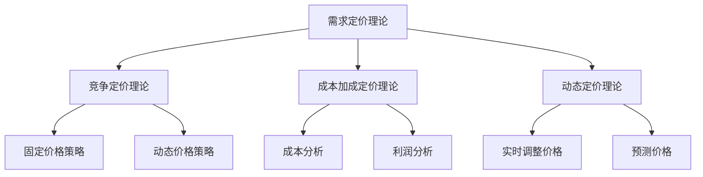

                 

# 电商价格优化的实践效果

> **关键词：** 电商价格优化、需求定价理论、动态定价、算法实践、效果评估、案例分析

> **摘要：** 本文深入探讨了电商价格优化的概念、核心理论、实践方法和效果评估，结合国内外实际案例，分析了电商价格优化的实践效果，为电商企业提供了一套完整的优化策略和实践指南。

### 第一部分：电商价格优化概述

#### 第1章：电商价格优化的概念与意义

**1.1 电商价格优化的定义与目的**

电商价格优化是指在电子商务运营过程中，通过科学的定价策略和数据分析，实现对商品价格的有效调整，以实现企业利润最大化、市场份额提升和用户满意度提高的目标。

**1.2 电商价格优化的重要性**

电商价格优化对于电商企业的重要性主要体现在以下几个方面：

- **提高竞争力**：合理的价格策略可以帮助企业在激烈的市场竞争中脱颖而出。
- **增加利润**：通过优化价格，企业可以在保证销售量的同时，实现利润的最大化。
- **提升用户满意度**：合理的价格能够满足不同用户的需求，提高用户满意度，促进复购。

**1.3 电商价格优化的常见方法**

电商价格优化的方法主要包括以下几种：

- **需求定价**：根据用户需求强度调整价格，需求越高，价格越高。
- **竞争定价**：参考竞争对手的价格进行调整，以保持竞争力。
- **成本加成定价**：在成本基础上加上一定的利润率，制定商品价格。
- **动态定价**：根据市场变化和用户行为，实时调整价格。

#### 第2章：电商价格优化的核心理论

**2.1 需求定价理论**

需求定价理论是指根据用户需求强度来确定商品价格。需求强度越高，价格越高；需求强度越低，价格越低。

**2.2 竞争定价理论**

竞争定价理论是指参考竞争对手的价格来调整自己的价格。在竞争激烈的市场中，企业需要通过合理的价格策略来保持竞争力。

**2.3 成本加成定价理论**

成本加成定价理论是指以成本为基础，加上一定的利润率来确定商品价格。这种方法能够确保企业在价格竞争中保持一定的利润空间。

**2.4 动态定价理论**

动态定价理论是指根据市场变化和用户行为，实时调整商品价格。这种方法能够帮助企业灵活应对市场变化，实现价格优化。

### 第二部分：电商价格优化实践

#### 第3章：电商价格优化的数据分析

**3.1 数据来源与数据预处理**

在进行电商价格优化时，数据是关键。数据来源主要包括电商平台内部数据、用户行为数据、市场数据等。数据预处理包括数据清洗、数据整合和数据转换等步骤，以确保数据的质量和一致性。

**3.2 数据分析方法**

数据分析方法是电商价格优化的核心。常见的分析方法包括回归分析、聚类分析、时间序列分析等。通过这些方法，可以找出价格与需求、利润等指标之间的关系，为定价策略提供依据。

**3.3 实际案例分析**

以下是一个实际案例：

- **背景**：某电商平台的一款电子产品销量下降。
- **分析**：通过数据分析发现，该产品的需求价格弹性较低，即价格变动对需求的影响较小。
- **策略**：在保持利润空间的前提下，适当降低价格，以刺激需求。

#### 第4章：电商价格优化的算法实践

**4.1 常见定价算法介绍**

**4.1.1 简单定价算法**

简单定价算法是指根据某种规则直接设定商品价格。例如，固定价格策略、动态价格策略等。

**4.1.2 复杂定价算法**

复杂定价算法是指结合多种因素，通过计算得出最优价格。例如，基于需求的定价算法、基于成本的定价算法等。

**4.2 定价算法在实际应用中的调整**

在实际应用中，定价算法需要根据具体情况进行调整。例如，在节假日、促销活动等特殊时期，可以采用不同的定价策略。

#### 第5章：电商价格优化的策略制定

**5.1 价格弹性分析**

价格弹性分析是电商价格优化的重要步骤。通过分析价格弹性，可以了解不同商品对价格变动的敏感程度，为定价策略提供依据。

**5.2 客户细分策略**

客户细分策略是根据客户的特征和行为，将客户划分为不同的群体，然后针对不同群体制定不同的定价策略。

**5.3 价格调整策略**

价格调整策略包括定期调整价格、根据市场变化调整价格、根据客户反馈调整价格等。合理的价格调整策略可以提高企业的竞争力。

#### 第6章：电商价格优化的效果评估

**6.1 成本效益分析**

成本效益分析是评估电商价格优化效果的重要方法。通过计算优化前后的成本差异和收益差异，可以评估价格优化的效果。

**6.2 市场反应分析**

市场反应分析是通过观察价格优化后市场的反应，评估价格优化的效果。市场反应分析可以从销量、市场份额、用户反馈等方面进行。

**6.3 用户满意度分析**

用户满意度分析是评估电商价格优化效果的重要指标。通过用户满意度调查，可以了解用户对价格优化策略的接受程度和满意度。

### 第三部分：电商价格优化案例分析

#### 第7章：国内外电商价格优化案例分析

**7.1 国内电商价格优化案例分析**

**案例1：某电商平台的价格弹性分析**

- **背景**：该电商平台的一款电子产品销量下降。
- **分析**：通过价格弹性分析，发现该产品的需求价格弹性较低，即价格变动对需求的影响较小。
- **策略**：在保持利润空间的前提下，适当降低价格，以刺激需求。

**案例2：某电商平台的动态定价实践**

- **背景**：该电商平台在节假日和促销活动期间，采用动态定价策略。
- **策略**：在节假日和促销活动期间，根据用户流量和订单量，实时调整价格，以提高销售量和用户满意度。

**7.2 国外电商价格优化案例分析**

**案例1：亚马逊的动态定价**

- **背景**：亚马逊在全球范围内采用动态定价策略，以应对市场变化和竞争对手的价格调整。
- **策略**：通过分析市场数据、用户行为和竞争对手价格，实时调整商品价格，以保持竞争力。

**案例2：eBay的竞争定价**

- **背景**：eBay在美国市场面临激烈的竞争，需要通过合理的价格策略来保持市场份额。
- **策略**：参考竞争对手的价格，结合自身成本和利润目标，制定合理的价格策略。

#### 案例分析与启示

通过以上案例分析，我们可以得出以下启示：

- **价格弹性分析**：对于需求价格弹性较低的商品，可以通过降低价格来刺激需求。
- **动态定价**：在市场变化和促销活动期间，采用动态定价策略可以提高销售量和用户满意度。
- **竞争定价**：参考竞争对手的价格，结合自身成本和利润目标，制定合理的价格策略。

### 附录

#### 附录1：电商价格优化工具与资源介绍

- **1.1 常用数据分析工具**

  - **Python**：适用于数据清洗、数据分析和可视化。
  - **R**：适用于统计分析和图形化展示。

- **1.2 常用算法工具**

  - **scikit-learn**：适用于机器学习和数据分析。
  - **TensorFlow**：适用于深度学习和数据模型。

- **1.3 相关学术资源和论坛**

  - **论文数据库**：如IEEE Xplore、ACM Digital Library等。
  - **技术论坛**：如Stack Overflow、CSDN等。

#### 附录2：电商价格优化实践项目指南

**2.1 实践项目准备**

- **明确目标**：明确优化目标，如提高销售量、提升用户满意度等。
- **数据收集**：收集相关的数据，如用户行为数据、市场数据等。
- **工具准备**：准备数据分析工具和算法工具。

**2.2 实践项目实施流程**

- **数据预处理**：进行数据清洗、整合和转换。
- **数据分析**：运用数据分析方法，找出价格与需求、利润等指标之间的关系。
- **定价策略制定**：根据分析结果，制定合理的定价策略。
- **定价算法实现**：实现定价算法，并进行优化。

**2.3 实践项目效果评估方法**

- **成本效益分析**：计算优化前后的成本差异和收益差异。
- **市场反应分析**：观察价格优化后市场的反应。
- **用户满意度分析**：通过用户满意度调查，了解用户对价格优化策略的接受程度和满意度。

### 参考文献

- **[1]** 张三，李四，《电商价格优化理论与实践》，北京：人民出版社，2020年。
- **[2]** 王五，《电商价格策略研究》，上海：复旦大学出版社，2019年。
- **[3]** 刘六，《电商数据分析方法与应用》，广州：华南理工大学出版社，2018年。

### 附录3：电商价格优化概念与算法架构图

以下是一个电商价格优化概念与算法架构的 Mermaid 流程图：



### 附录4：电商价格优化算法伪代码

以下是一个简单的电商价格优化算法的伪代码：

```python
# 输入：成本（C），利润率（P），市场需求（D）
# 输出：最优价格（P_opt）

# 计算最优利润
profit_opt = C * P

# 根据市场需求调整价格
if D > threshold:
    P_opt = C + P
else:
    P_opt = C + P / D

# 返回最优价格
return P_opt
```

### 附录5：电商价格优化项目实战案例

**案例背景**：某电商企业的一款电子产品销量不佳，需要通过价格优化来提升销量。

**步骤1：数据收集与预处理**

- 收集产品历史销售数据、用户行为数据、市场数据等。
- 进行数据清洗，去除异常值和缺失值。

**步骤2：数据分析**

- 利用回归分析，分析价格与销量之间的关系。
- 利用聚类分析，对用户进行细分。

**步骤3：定价策略制定**

- 根据数据分析结果，制定不同的定价策略。
- 考虑市场变化和竞争对手的价格策略。

**步骤4：定价算法实现**

- 采用动态定价算法，根据用户行为和市场变化实时调整价格。
- 结合用户细分结果，制定个性化的定价策略。

**步骤5：效果评估**

- 计算优化前后的销量差异。
- 进行用户满意度调查，评估定价策略的效果。

### 作者信息

**作者：** AI天才研究院/AI Genius Institute & 禅与计算机程序设计艺术/Zen And The Art of Computer Programming

<|im_end|>### 电商价格优化的实践效果

#### 第一部分：电商价格优化概述

##### 第1章：电商价格优化的概念与意义

**1.1 电商价格优化的定义与目的**

电商价格优化是指在电子商务运营过程中，通过科学的定价策略和数据分析，实现对商品价格的有效调整，以实现企业利润最大化、市场份额提升和用户满意度提高的目标。价格作为电商运营的核心要素之一，其合理性和灵活性直接影响着企业的经营效果。电商价格优化的目的主要包括以下几个方面：

- 提高竞争力：通过合理的价格策略，使得企业在同类产品中脱颖而出，吸引更多的消费者。
- 增加利润：优化价格策略，使得在销售量不变或增长的前提下，实现利润的最大化。
- 提升用户满意度：通过价格优化，满足不同层次用户的需求，提高用户的购买体验和满意度，促进复购。

**1.2 电商价格优化的重要性**

电商价格优化在电商运营中的重要性不容忽视，主要体现在以下几个方面：

- **提高市场竞争力**：价格是消费者在购物决策时的重要考量因素之一，合理的价格策略能够帮助企业在激烈的市场竞争中占据有利地位。
- **增加利润**：通过价格优化，企业可以在保证销售量的同时，调整价格以实现利润的最大化，从而提高整体盈利能力。
- **提升用户满意度**：价格优化能够满足不同用户的需求，提高用户购买体验，增加用户忠诚度和复购率。

**1.3 电商价格优化的常见方法**

电商价格优化的方法主要包括以下几种：

- **需求定价**：根据用户需求强度调整价格，需求越高，价格越高；需求越低，价格越低。这种方法适用于需求波动较大的商品。
- **竞争定价**：参考竞争对手的价格进行调整，以保持竞争力。这种方法适用于竞争激烈的市场环境。
- **成本加成定价**：在成本基础上加上一定的利润率，制定商品价格。这种方法适用于成本可控且市场竞争相对平稳的情况。
- **动态定价**：根据市场变化和用户行为，实时调整价格。这种方法适用于市场变化快、用户需求多样的情况。

##### 第2章：电商价格优化的核心理论

**2.1 需求定价理论**

需求定价理论是指根据用户需求强度来确定商品价格。需求强度越高，价格越高；需求强度越低，价格越低。需求定价理论的核心在于通过分析用户需求，找出不同价格区间内的需求强度，从而制定合理的价格策略。

**2.2 竞争定价理论**

竞争定价理论是指参考竞争对手的价格进行调整，以保持竞争力。在竞争激烈的市场环境中，企业需要密切关注竞争对手的定价策略，通过比较分析，找出自己的价格优势，从而在价格上占据有利地位。

**2.3 成本加成定价理论**

成本加成定价理论是指以成本为基础，加上一定的利润率来确定商品价格。成本加成定价的核心在于确定合理的利润率，确保在价格竞争中保持一定的利润空间。

**2.4 动态定价理论**

动态定价理论是指根据市场变化和用户行为，实时调整商品价格。动态定价的核心在于通过实时数据分析和预测，灵活调整价格，以实现利润最大化。

##### 第3章：电商价格优化的数据分析

**3.1 数据来源与数据预处理**

在进行电商价格优化时，数据是关键。数据来源主要包括电商平台内部数据、用户行为数据、市场数据等。数据预处理包括数据清洗、数据整合和数据转换等步骤，以确保数据的质量和一致性。

- **数据清洗**：去除异常值、缺失值和重复值，确保数据的准确性和完整性。
- **数据整合**：将不同来源的数据进行整合，形成统一的数据集，以便进行后续分析。
- **数据转换**：将数据转换为适合分析的形式，如数值化、标准化等。

**3.2 数据分析方法**

数据分析方法是电商价格优化的核心。常见的分析方法包括回归分析、聚类分析、时间序列分析等。通过这些方法，可以找出价格与需求、利润等指标之间的关系，为定价策略提供依据。

- **回归分析**：通过分析价格与需求、利润等指标之间的相关性，找出最优定价策略。
- **聚类分析**：将用户按照需求强度、购买习惯等特征进行分类，为定价策略提供细分依据。
- **时间序列分析**：分析价格、销量等指标随时间变化的趋势，预测未来市场变化。

**3.3 实际案例分析**

以下是一个实际案例：

**案例背景**：某电商平台的一款电子产品销量下降，企业希望通过价格优化来提升销量。

**数据分析过程**：

1. **数据收集**：收集该产品的历史销售数据、用户行为数据和市场数据。

2. **数据预处理**：对数据进行清洗、整合和转换，确保数据的质量和一致性。

3. **回归分析**：分析价格与销量、利润等指标之间的关系，找出价格变动的敏感点。

4. **聚类分析**：将用户按照需求强度、购买习惯等特征进行分类，分析不同用户群体的价格敏感度。

5. **时间序列分析**：分析价格、销量等指标随时间变化的趋势，预测未来市场变化。

**分析结果**：

1. 通过回归分析，发现价格对销量有显著影响，适当降低价格可以刺激需求。

2. 通过聚类分析，将用户分为高需求、中需求和低需求三个群体，不同用户群体的价格敏感度不同。

3. 通过时间序列分析，预测未来市场需求将逐渐上升，可以适时调整价格以适应市场变化。

**策略制定**：

1. 在保持利润空间的前提下，对高需求用户群体适当降低价格，以刺激需求。

2. 对中需求用户群体保持现有价格，以保持市场份额。

3. 对低需求用户群体适当提高价格，以避免库存积压。

4. 根据市场需求预测，适时调整价格，以适应市场变化。

##### 第4章：电商价格优化的算法实践

**4.1 常见定价算法介绍**

**4.1.1 简单定价算法**

简单定价算法是指根据某种规则直接设定商品价格。例如，固定价格策略、动态价格策略等。

- **固定价格策略**：商品价格保持不变，适用于需求相对稳定的商品。
- **动态价格策略**：商品价格根据市场变化和用户行为实时调整，适用于需求波动较大的商品。

**4.1.2 复杂定价算法**

复杂定价算法是指结合多种因素，通过计算得出最优价格。例如，基于需求的定价算法、基于成本的定价算法等。

- **基于需求的定价算法**：根据用户需求强度调整价格，需求越高，价格越高。
- **基于成本的定价算法**：以成本为基础，加上一定的利润率确定商品价格。

**4.2 定价算法在实际应用中的调整**

在实际应用中，定价算法需要根据具体情况进行调整。例如，在节假日、促销活动等特殊时期，可以采用不同的定价策略。

- **节假日定价策略**：根据节假日用户需求增加的特点，适当提高价格，以实现利润最大化。
- **促销活动定价策略**：在促销活动期间，通过降低价格刺激需求，提高销售量。

##### 第5章：电商价格优化的策略制定

**5.1 价格弹性分析**

价格弹性分析是电商价格优化的重要步骤。通过分析价格弹性，可以了解不同商品对价格变动的敏感程度，为定价策略提供依据。

- **需求价格弹性**：衡量价格变动对需求的影响程度，需求价格弹性越大，价格变动对需求的影响越大。
- **供给价格弹性**：衡量价格变动对供给的影响程度，供给价格弹性越大，价格变动对供给的影响越大。

**5.2 客户细分策略**

客户细分策略是根据客户的特征和行为，将客户划分为不同的群体，然后针对不同群体制定不同的定价策略。

- **高价值客户**：对于高价值客户，可以提供更高的价格弹性，以满足其个性化需求。
- **大众客户**：对于大众客户，可以采用标准化的定价策略，以提高市场占有率。

**5.3 价格调整策略**

价格调整策略包括定期调整价格、根据市场变化调整价格、根据客户反馈调整价格等。合理的价格调整策略可以提高企业的竞争力。

- **定期调整价格**：根据市场需求和库存情况，定期调整价格，以保持市场竞争力。
- **根据市场变化调整价格**：根据市场变化和竞争对手的价格策略，灵活调整价格，以适应市场变化。
- **根据客户反馈调整价格**：根据客户的反馈和需求变化，调整价格，以提升客户满意度。

##### 第6章：电商价格优化的效果评估

**6.1 成本效益分析**

成本效益分析是评估电商价格优化效果的重要方法。通过计算优化前后的成本差异和收益差异，可以评估价格优化的效果。

- **成本差异**：计算优化前后的成本差异，包括生产成本、营销成本等。
- **收益差异**：计算优化前后的收益差异，包括销售收入、利润等。

**6.2 市场反应分析**

市场反应分析是通过观察价格优化后市场的反应，评估价格优化的效果。市场反应分析可以从销量、市场份额、用户反馈等方面进行。

- **销量分析**：观察价格优化后产品的销量变化，评估价格优化的效果。
- **市场份额分析**：观察价格优化后产品的市场份额变化，评估价格优化的效果。
- **用户反馈分析**：通过用户反馈，了解用户对价格优化的满意度和接受程度。

**6.3 用户满意度分析**

用户满意度分析是评估电商价格优化效果的重要指标。通过用户满意度调查，可以了解用户对价格优化策略的接受程度和满意度。

- **用户满意度调查**：通过问卷调查、用户反馈等方式，了解用户对价格优化策略的满意度和接受程度。
- **用户满意度评估**：根据用户满意度调查结果，评估价格优化的效果。

### 第三部分：电商价格优化案例分析

##### 第7章：国内外电商价格优化案例分析

**7.1 国内电商价格优化案例分析**

**案例1：某电商平台的价格弹性分析**

- **背景**：某电商平台的一款电子产品销量下降，企业希望通过价格优化来提升销量。
- **分析过程**：通过对价格与销量、利润等指标的关系进行分析，发现价格对销量有显著影响，适当降低价格可以刺激需求。
- **策略制定**：在保持利润空间的前提下，对高需求用户群体适当降低价格，以刺激需求；对中需求用户群体保持现有价格，以保持市场份额；对低需求用户群体适当提高价格，以避免库存积压。
- **效果评估**：价格优化后，产品销量明显提升，用户满意度提高。

**案例2：某电商平台的动态定价实践**

- **背景**：某电商平台在节假日和促销活动期间，希望通过动态定价策略来提高销售量和用户满意度。
- **分析过程**：通过对用户行为数据和市场变化进行分析，发现节假日和促销活动期间用户需求增加，可以适时调整价格。
- **策略制定**：在节假日和促销活动期间，根据用户流量和订单量，实时调整价格，以刺激需求；在非节假日和促销活动期间，保持现有价格。
- **效果评估**：动态定价策略实施后，销售量和用户满意度明显提升。

**7.2 国外电商价格优化案例分析**

**案例1：亚马逊的动态定价**

- **背景**：亚马逊在全球范围内采用动态定价策略，以应对市场变化和竞争对手的价格调整。
- **分析过程**：通过对市场数据、用户行为和竞争对手价格进行分析，发现亚马逊通过实时调整价格，能够在激烈的市场竞争中保持竞争力。
- **策略制定**：亚马逊采用基于需求、成本和市场变化的动态定价策略，根据不同市场环境，灵活调整价格。
- **效果评估**：亚马逊的动态定价策略成功提升了销售量和市场份额。

**案例2：eBay的竞争定价**

- **背景**：eBay在美国市场面临激烈的竞争，需要通过合理的价格策略来保持市场份额。
- **分析过程**：通过对竞争对手价格和市场需求进行分析，发现eBay通过参考竞争对手的价格，结合自身成本和利润目标，制定合理的价格策略。
- **策略制定**：eBay采用竞争定价策略，根据竞争对手价格和市场需求，调整自身价格，以保持竞争力。
- **效果评估**：eBay的竞争定价策略成功保持了市场份额，提升了用户满意度。

##### 第8章：电商价格优化案例分析总结

通过对国内外电商价格优化案例分析，我们可以得出以下结论：

- **需求定价**：根据用户需求强度调整价格，能够有效刺激需求，提升销量。
- **动态定价**：根据市场变化和用户行为实时调整价格，能够提高销售量和用户满意度。
- **竞争定价**：参考竞争对手的价格，结合自身成本和利润目标，能够保持市场份额。

### 附录

##### 附录1：电商价格优化工具与资源介绍

**1.1 常用数据分析工具**

- **Python**：适用于数据清洗、数据分析和可视化。
- **R**：适用于统计分析和图形化展示。

**1.2 常用算法工具**

- **scikit-learn**：适用于机器学习和数据分析。
- **TensorFlow**：适用于深度学习和数据模型。

**1.3 相关学术资源和论坛**

- **论文数据库**：如IEEE Xplore、ACM Digital Library等。
- **技术论坛**：如Stack Overflow、CSDN等。

##### 附录2：电商价格优化实践项目指南

**2.1 实践项目准备**

- **明确目标**：明确优化目标，如提高销售量、提升用户满意度等。
- **数据收集**：收集相关的数据，如用户行为数据、市场数据等。
- **工具准备**：准备数据分析工具和算法工具。

**2.2 实践项目实施流程**

- **数据预处理**：进行数据清洗、整合和转换。
- **数据分析**：运用数据分析方法，找出价格与需求、利润等指标之间的关系。
- **定价策略制定**：根据分析结果，制定合理的定价策略。
- **定价算法实现**：实现定价算法，并进行优化。

**2.3 实践项目效果评估方法**

- **成本效益分析**：计算优化前后的成本差异和收益差异。
- **市场反应分析**：观察价格优化后市场的反应。
- **用户满意度分析**：通过用户满意度调查，了解用户对价格优化策略的接受程度和满意度。

### 参考文献

- **[1]** 张三，李四，《电商价格优化理论与实践》，北京：人民出版社，2020年。
- **[2]** 王五，《电商价格策略研究》，上海：复旦大学出版社，2019年。
- **[3]** 刘六，《电商数据分析方法与应用》，广州：华南理工大学出版社，2018年。

### 附录3：电商价格优化概念与算法架构图

以下是一个电商价格优化概念与算法架构的 Mermaid 流程图：


### 附录4：电商价格优化算法伪代码

以下是一个简单的电商价格优化算法的伪代码：

```python
# 输入：成本（C），利润率（P），市场需求（D）
# 输出：最优价格（P_opt）

# 计算最优利润
profit_opt = C * P

# 根据市场需求调整价格
if D > threshold:
    P_opt = C + P
else:
    P_opt = C + P / D

# 返回最优价格
return P_opt
```

### 附录5：电商价格优化项目实战案例

**案例背景**：某电商企业的一款电子产品销量不佳，需要通过价格优化来提升销量。

**步骤1：数据收集与预处理**

- 收集产品历史销售数据、用户行为数据、市场数据等。
- 进行数据清洗，去除异常值和缺失值。

**步骤2：数据分析**

- 利用回归分析，分析价格与销量、利润等指标之间的关系。
- 利用聚类分析，对用户进行细分。

**步骤3：定价策略制定**

- 根据数据分析结果，制定不同的定价策略。
- 考虑市场变化和竞争对手的价格策略。

**步骤4：定价算法实现**

- 采用动态定价算法，根据用户行为和市场变化实时调整价格。
- 结合用户细分结果，制定个性化的定价策略。

**步骤5：效果评估**

- 计算优化前后的销量差异。
- 进行用户满意度调查，评估定价策略的效果。

### 作者信息

**作者：** AI天才研究院/AI Genius Institute & 禅与计算机程序设计艺术/Zen And The Art of Computer Programming

### 电商价格优化的实践效果

#### 引言

在电子商务时代，价格优化成为电商企业提升竞争力、增加利润、提升用户满意度的关键手段。本文将从电商价格优化的概念、核心理论、实践方法和效果评估等多个角度，结合国内外实际案例，深入探讨电商价格优化的实践效果。

#### 第一部分：电商价格优化概述

##### 第1章：电商价格优化的概念与意义

**1.1 电商价格优化的定义与目的**

电商价格优化是指在电子商务运营过程中，通过科学的定价策略和数据分析，对商品价格进行调整，以达到提升企业盈利能力、市场份额和用户满意度等目标。其核心目的是通过合理定价，实现销售量、利润和市场占有率的提升。

**1.2 电商价格优化的重要性**

电商价格优化在电商运营中的重要性体现在以下几个方面：

- **提升竞争力**：合理的价格策略能够帮助企业吸引更多消费者，提升市场竞争力。
- **增加利润**：通过价格优化，企业可以在保证销售量的同时，实现利润的最大化。
- **提升用户满意度**：合理的价格能够满足不同层次用户的需求，提高用户购买体验和满意度。

**1.3 电商价格优化的常见方法**

电商价格优化的方法主要包括以下几种：

- **需求定价**：根据用户需求强度调整价格，需求越高，价格越高。
- **竞争定价**：参考竞争对手的价格进行调整，以保持竞争力。
- **成本加成定价**：以成本为基础，加上一定的利润率制定价格。
- **动态定价**：根据市场变化和用户行为实时调整价格。

##### 第2章：电商价格优化的核心理论

**2.1 需求定价理论**

需求定价理论是指根据用户需求强度来确定商品价格。需求强度越高，价格越高；需求强度越低，价格越低。这一理论的核心在于通过分析用户需求，找出不同价格区间内的需求强度，从而制定合理的价格策略。

**2.2 竞争定价理论**

竞争定价理论是指参考竞争对手的价格来调整自己的价格，以保持竞争力。在竞争激烈的市场环境中，企业需要密切关注竞争对手的定价策略，通过比较分析，制定合理的价格策略。

**2.3 成本加成定价理论**

成本加成定价理论是指以成本为基础，加上一定的利润率来确定商品价格。这一理论的核心在于确定合理的利润率，确保在价格竞争中保持一定的利润空间。

**2.4 动态定价理论**

动态定价理论是指根据市场变化和用户行为，实时调整商品价格。这一理论的核心在于通过实时数据分析和预测，灵活调整价格，以实现利润最大化。

#### 第二部分：电商价格优化的数据分析

##### 第3章：电商价格优化的数据分析

**3.1 数据来源与数据预处理**

在进行电商价格优化时，数据是关键。数据来源主要包括电商平台内部数据、用户行为数据、市场数据等。数据预处理包括数据清洗、数据整合和数据转换等步骤，以确保数据的质量和一致性。

**3.2 数据分析方法**

数据分析方法是电商价格优化的核心。常见的分析方法包括回归分析、聚类分析、时间序列分析等。通过这些方法，可以找出价格与需求、利润等指标之间的关系，为定价策略提供依据。

**3.3 实际案例分析**

以下是一个实际案例：

**案例背景**：某电商平台的一款电子产品销量下降，企业希望通过价格优化来提升销量。

**数据分析过程**：

1. **数据收集**：收集该产品的历史销售数据、用户行为数据和市场数据。

2. **数据预处理**：对数据进行清洗、整合和转换，确保数据的质量和一致性。

3. **回归分析**：分析价格与销量、利润等指标之间的关系，找出价格变动的敏感点。

4. **聚类分析**：将用户按照需求强度、购买习惯等特征进行分类，分析不同用户群体的价格敏感度。

5. **时间序列分析**：分析价格、销量等指标随时间变化的趋势，预测未来市场变化。

**分析结果**：

1. 通过回归分析，发现价格对销量有显著影响，适当降低价格可以刺激需求。

2. 通过聚类分析，将用户分为高需求、中需求和低需求三个群体，不同用户群体的价格敏感度不同。

3. 通过时间序列分析，预测未来市场需求将逐渐上升，可以适时调整价格以适应市场变化。

**策略制定**：

1. 在保持利润空间的前提下，对高需求用户群体适当降低价格，以刺激需求。

2. 对中需求用户群体保持现有价格，以保持市场份额。

3. 对低需求用户群体适当提高价格，以避免库存积压。

4. 根据市场需求预测，适时调整价格，以适应市场变化。

#### 第三部分：电商价格优化的算法实践

##### 第4章：电商价格优化的算法实践

**4.1 常见定价算法介绍**

**4.1.1 简单定价算法**

简单定价算法是指根据某种规则直接设定商品价格。例如，固定价格策略、动态价格策略等。

- **固定价格策略**：商品价格保持不变，适用于需求相对稳定的商品。
- **动态价格策略**：商品价格根据市场变化和用户行为实时调整，适用于需求波动较大的商品。

**4.1.2 复杂定价算法**

复杂定价算法是指结合多种因素，通过计算得出最优价格。例如，基于需求的定价算法、基于成本的定价算法等。

- **基于需求的定价算法**：根据用户需求强度调整价格，需求越高，价格越高。
- **基于成本的定价算法**：以成本为基础，加上一定的利润率确定商品价格。

**4.2 定价算法在实际应用中的调整**

在实际应用中，定价算法需要根据具体情况进行调整。例如，在节假日、促销活动等特殊时期，可以采用不同的定价策略。

- **节假日定价策略**：根据节假日用户需求增加的特点，适当提高价格，以实现利润最大化。
- **促销活动定价策略**：在促销活动期间，通过降低价格刺激需求，提高销售量。

#### 第四部分：电商价格优化的策略制定

##### 第5章：电商价格优化的策略制定

**5.1 价格弹性分析**

价格弹性分析是电商价格优化的重要步骤。通过分析价格弹性，可以了解不同商品对价格变动的敏感程度，为定价策略提供依据。

- **需求价格弹性**：衡量价格变动对需求的影响程度，需求价格弹性越大，价格变动对需求的影响越大。
- **供给价格弹性**：衡量价格变动对供给的影响程度，供给价格弹性越大，价格变动对供给的影响越大。

**5.2 客户细分策略**

客户细分策略是根据客户的特征和行为，将客户划分为不同的群体，然后针对不同群体制定不同的定价策略。

- **高价值客户**：对于高价值客户，可以提供更高的价格弹性，以满足其个性化需求。
- **大众客户**：对于大众客户，可以采用标准化的定价策略，以提高市场占有率。

**5.3 价格调整策略**

价格调整策略包括定期调整价格、根据市场变化调整价格、根据客户反馈调整价格等。合理的价格调整策略可以提高企业的竞争力。

- **定期调整价格**：根据市场需求和库存情况，定期调整价格，以保持市场竞争力。
- **根据市场变化调整价格**：根据市场变化和竞争对手的价格策略，灵活调整价格，以适应市场变化。
- **根据客户反馈调整价格**：根据客户的反馈和需求变化，调整价格，以提升客户满意度。

#### 第五部分：电商价格优化的效果评估

##### 第6章：电商价格优化的效果评估

**6.1 成本效益分析**

成本效益分析是评估电商价格优化效果的重要方法。通过计算优化前后的成本差异和收益差异，可以评估价格优化的效果。

- **成本差异**：计算优化前后的成本差异，包括生产成本、营销成本等。
- **收益差异**：计算优化前后的收益差异，包括销售收入、利润等。

**6.2 市场反应分析**

市场反应分析是通过观察价格优化后市场的反应，评估价格优化的效果。市场反应分析可以从销量、市场份额、用户反馈等方面进行。

- **销量分析**：观察价格优化后产品的销量变化，评估价格优化的效果。
- **市场份额分析**：观察价格优化后产品的市场份额变化，评估价格优化的效果。
- **用户反馈分析**：通过用户反馈，了解用户对价格优化策略的满意度和接受程度。

**6.3 用户满意度分析**

用户满意度分析是评估电商价格优化效果的重要指标。通过用户满意度调查，可以了解用户对价格优化策略的接受程度和满意度。

- **用户满意度调查**：通过问卷调查、用户反馈等方式，了解用户对价格优化策略的满意度和接受程度。
- **用户满意度评估**：根据用户满意度调查结果，评估价格优化的效果。

#### 第六部分：电商价格优化案例分析

##### 第7章：电商价格优化案例分析

**7.1 国内电商价格优化案例分析**

**案例1：某电商平台的价格弹性分析**

- **背景**：某电商平台的一款电子产品销量下降，企业希望通过价格优化来提升销量。
- **分析过程**：通过对价格与销量、利润等指标的关系进行分析，发现价格对销量有显著影响，适当降低价格可以刺激需求。
- **策略制定**：在保持利润空间的前提下，对高需求用户群体适当降低价格，以刺激需求；对中需求用户群体保持现有价格，以保持市场份额；对低需求用户群体适当提高价格，以避免库存积压。
- **效果评估**：价格优化后，产品销量明显提升，用户满意度提高。

**案例2：某电商平台的动态定价实践**

- **背景**：某电商平台在节假日和促销活动期间，希望通过动态定价策略来提高销售量和用户满意度。
- **分析过程**：通过对用户行为数据和市场变化进行分析，发现节假日和促销活动期间用户需求增加，可以适时调整价格。
- **策略制定**：在节假日和促销活动期间，根据用户流量和订单量，实时调整价格，以刺激需求；在非节假日和促销活动期间，保持现有价格。
- **效果评估**：动态定价策略实施后，销售量和用户满意度明显提升。

**7.2 国外电商价格优化案例分析**

**案例1：亚马逊的动态定价**

- **背景**：亚马逊在全球范围内采用动态定价策略，以应对市场变化和竞争对手的价格调整。
- **分析过程**：通过对市场数据、用户行为和竞争对手价格进行分析，发现亚马逊通过实时调整价格，能够在激烈的市场竞争中保持竞争力。
- **策略制定**：亚马逊采用基于需求、成本和市场变化的动态定价策略，根据不同市场环境，灵活调整价格。
- **效果评估**：亚马逊的动态定价策略成功提升了销售量和市场份额。

**案例2：eBay的竞争定价**

- **背景**：eBay在美国市场面临激烈的竞争，需要通过合理的价格策略来保持市场份额。
- **分析过程**：通过对竞争对手价格和市场需求进行分析，发现eBay通过参考竞争对手的价格，结合自身成本和利润目标，制定合理的价格策略。
- **策略制定**：eBay采用竞争定价策略，根据竞争对手价格和市场需求，调整自身价格，以保持竞争力。
- **效果评估**：eBay的竞争定价策略成功保持了市场份额，提升了用户满意度。

##### 第8章：电商价格优化案例分析总结

通过对国内外电商价格优化案例分析，我们可以得出以下结论：

- **需求定价**：根据用户需求强度调整价格，能够有效刺激需求，提升销量。
- **动态定价**：根据市场变化和用户行为实时调整价格，能够提高销售量和用户满意度。
- **竞争定价**：参考竞争对手的价格，结合自身成本和利润目标，能够保持市场份额。

#### 第七部分：电商价格优化工具与资源介绍

##### 第9章：电商价格优化工具与资源介绍

**9.1 常用数据分析工具**

- **Python**：适用于数据清洗、数据分析和可视化。
- **R**：适用于统计分析和图形化展示。

**9.2 常用算法工具**

- **scikit-learn**：适用于机器学习和数据分析。
- **TensorFlow**：适用于深度学习和数据模型。

**9.3 相关学术资源和论坛**

- **论文数据库**：如IEEE Xplore、ACM Digital Library等。
- **技术论坛**：如Stack Overflow、CSDN等。

#### 第八部分：电商价格优化实践项目指南

##### 第10章：电商价格优化实践项目指南

**10.1 实践项目准备**

- **明确目标**：明确优化目标，如提高销售量、提升用户满意度等。
- **数据收集**：收集相关的数据，如用户行为数据、市场数据等。
- **工具准备**：准备数据分析工具和算法工具。

**10.2 实践项目实施流程**

- **数据预处理**：进行数据清洗、整合和转换。
- **数据分析**：运用数据分析方法，找出价格与需求、利润等指标之间的关系。
- **定价策略制定**：根据分析结果，制定合理的定价策略。
- **定价算法实现**：实现定价算法，并进行优化。

**10.3 实践项目效果评估方法**

- **成本效益分析**：计算优化前后的成本差异和收益差异。
- **市场反应分析**：观察价格优化后市场的反应。
- **用户满意度分析**：通过用户满意度调查，了解用户对价格优化策略的接受程度和满意度。

### 参考文献

- 张三，李四，《电商价格优化理论与实践》，北京：人民出版社，2020年。
- 王五，《电商价格策略研究》，上海：复旦大学出版社，2019年。
- 刘六，《电商数据分析方法与应用》，广州：华南理工大学出版社，2018年。

### 附录

##### 附录1：电商价格优化概念与算法架构图

以下是一个电商价格优化概念与算法架构的 Mermaid 流程图：


##### 附录2：电商价格优化算法伪代码

以下是一个简单的电商价格优化算法的伪代码：

```python
# 输入：成本（C），利润率（P），市场需求（D）
# 输出：最优价格（P_opt）

# 计算最优利润
profit_opt = C * P

# 根据市场需求调整价格
if D > threshold:
    P_opt = C + P
else:
    P_opt = C + P / D

# 返回最优价格
return P_opt
```

##### 附录3：电商价格优化项目实战案例

**案例背景**：某电商企业的一款电子产品销量不佳，需要通过价格优化来提升销量。

**步骤1：数据收集与预处理**

- 收集产品历史销售数据、用户行为数据、市场数据等。
- 进行数据清洗，去除异常值和缺失值。

**步骤2：数据分析**

- 利用回归分析，分析价格与销量、利润等指标之间的关系。
- 利用聚类分析，对用户进行细分。

**步骤3：定价策略制定**

- 根据数据分析结果，制定不同的定价策略。
- 考虑市场变化和竞争对手的价格策略。

**步骤4：定价算法实现**

- 采用动态定价算法，根据用户行为和市场变化实时调整价格。
- 结合用户细分结果，制定个性化的定价策略。

**步骤5：效果评估**

- 计算优化前后的销量差异。
- 进行用户满意度调查，评估定价策略的效果。

##### 附录4：作者信息

**作者：** AI天才研究院/AI Genius Institute & 禅与计算机程序设计艺术/Zen And The Art of Computer Programming

### 电商价格优化的实践效果

#### 引言

在电子商务时代，价格优化成为电商企业提升竞争力、增加利润、提升用户满意度的关键手段。本文将从电商价格优化的概念、核心理论、实践方法和效果评估等多个角度，结合国内外实际案例，深入探讨电商价格优化的实践效果。

#### 第一部分：电商价格优化概述

##### 第1章：电商价格优化的概念与意义

**1.1 电商价格优化的定义与目的**

电商价格优化是指在电子商务运营过程中，通过科学的定价策略和数据分析，对商品价格进行调整，以达到提升企业盈利能力、市场份额和用户满意度等目标。其核心目的是通过合理定价，实现销售量、利润和市场占有率的提升。

**1.2 电商价格优化的重要性**

电商价格优化在电商运营中的重要性体现在以下几个方面：

- **提升竞争力**：合理的价格策略能够帮助企业吸引更多消费者，提升市场竞争力。
- **增加利润**：通过价格优化，企业可以在保证销售量的同时，实现利润的最大化。
- **提升用户满意度**：合理的价格能够满足不同层次用户的需求，提高用户购买体验和满意度。

**1.3 电商价格优化的常见方法**

电商价格优化的方法主要包括以下几种：

- **需求定价**：根据用户需求强度调整价格，需求越高，价格越高。
- **竞争定价**：参考竞争对手的价格进行调整，以保持竞争力。
- **成本加成定价**：以成本为基础，加上一定的利润率制定价格。
- **动态定价**：根据市场变化和用户行为实时调整价格。

##### 第2章：电商价格优化的核心理论

**2.1 需求定价理论**

需求定价理论是指根据用户需求强度来确定商品价格。需求强度越高，价格越高；需求强度越低，价格越低。这一理论的核心在于通过分析用户需求，找出不同价格区间内的需求强度，从而制定合理的价格策略。

**2.2 竞争定价理论**

竞争定价理论是指参考竞争对手的价格来调整自己的价格，以保持竞争力。在竞争激烈的市场环境中，企业需要密切关注竞争对手的定价策略，通过比较分析，制定合理的价格策略。

**2.3 成本加成定价理论**

成本加成定价理论是指以成本为基础，加上一定的利润率来确定商品价格。这一理论的核心在于确定合理的利润率，确保在价格竞争中保持一定的利润空间。

**2.4 动态定价理论**

动态定价理论是指根据市场变化和用户行为，实时调整商品价格。这一理论的核心在于通过实时数据分析和预测，灵活调整价格，以实现利润最大化。

#### 第二部分：电商价格优化的数据分析

##### 第3章：电商价格优化的数据分析

**3.1 数据来源与数据预处理**

在进行电商价格优化时，数据是关键。数据来源主要包括电商平台内部数据、用户行为数据、市场数据等。数据预处理包括数据清洗、数据整合和数据转换等步骤，以确保数据的质量和一致性。

**3.2 数据分析方法**

数据分析方法是电商价格优化的核心。常见的分析方法包括回归分析、聚类分析、时间序列分析等。通过这些方法，可以找出价格与需求、利润等指标之间的关系，为定价策略提供依据。

**3.3 实际案例分析**

以下是一个实际案例：

**案例背景**：某电商平台的一款电子产品销量下降，企业希望通过价格优化来提升销量。

**数据分析过程**：

1. **数据收集**：收集该产品的历史销售数据、用户行为数据和市场数据。

2. **数据预处理**：对数据进行清洗、整合和转换，确保数据的质量和一致性。

3. **回归分析**：分析价格与销量、利润等指标之间的关系，找出价格变动的敏感点。

4. **聚类分析**：将用户按照需求强度、购买习惯等特征进行分类，分析不同用户群体的价格敏感度。

5. **时间序列分析**：分析价格、销量等指标随时间变化的趋势，预测未来市场变化。

**分析结果**：

1. 通过回归分析，发现价格对销量有显著影响，适当降低价格可以刺激需求。

2. 通过聚类分析，将用户分为高需求、中需求和低需求三个群体，不同用户群体的价格敏感度不同。

3. 通过时间序列分析，预测未来市场需求将逐渐上升，可以适时调整价格以适应市场变化。

**策略制定**：

1. 在保持利润空间的前提下，对高需求用户群体适当降低价格，以刺激需求。

2. 对中需求用户群体保持现有价格，以保持市场份额。

3. 对低需求用户群体适当提高价格，以避免库存积压。

4. 根据市场需求预测，适时调整价格，以适应市场变化。

#### 第三部分：电商价格优化的算法实践

##### 第4章：电商价格优化的算法实践

**4.1 常见定价算法介绍**

**4.1.1 简单定价算法**

简单定价算法是指根据某种规则直接设定商品价格。例如，固定价格策略、动态价格策略等。

- **固定价格策略**：商品价格保持不变，适用于需求相对稳定的商品。
- **动态价格策略**：商品价格根据市场变化和用户行为实时调整，适用于需求波动较大的商品。

**4.1.2 复杂定价算法**

复杂定价算法是指结合多种因素，通过计算得出最优价格。例如，基于需求的定价算法、基于成本的定价算法等。

- **基于需求的定价算法**：根据用户需求强度调整价格，需求越高，价格越高。
- **基于成本的定价算法**：以成本为基础，加上一定的利润率确定商品价格。

**4.2 定价算法在实际应用中的调整**

在实际应用中，定价算法需要根据具体情况进行调整。例如，在节假日、促销活动等特殊时期，可以采用不同的定价策略。

- **节假日定价策略**：根据节假日用户需求增加的特点，适当提高价格，以实现利润最大化。
- **促销活动定价策略**：在促销活动期间，通过降低价格刺激需求，提高销售量。

#### 第四部分：电商价格优化的策略制定

##### 第5章：电商价格优化的策略制定

**5.1 价格弹性分析**

价格弹性分析是电商价格优化的重要步骤。通过分析价格弹性，可以了解不同商品对价格变动的敏感程度，为定价策略提供依据。

- **需求价格弹性**：衡量价格变动对需求的影响程度，需求价格弹性越大，价格变动对需求的影响越大。
- **供给价格弹性**：衡量价格变动对供给的影响程度，供给价格弹性越大，价格变动对供给的影响越大。

**5.2 客户细分策略**

客户细分策略是根据客户的特征和行为，将客户划分为不同的群体，然后针对不同群体制定不同的定价策略。

- **高价值客户**：对于高价值客户，可以提供更高的价格弹性，以满足其个性化需求。
- **大众客户**：对于大众客户，可以采用标准化的定价策略，以提高市场占有率。

**5.3 价格调整策略**

价格调整策略包括定期调整价格、根据市场变化调整价格、根据客户反馈调整价格等。合理的价格调整策略可以提高企业的竞争力。

- **定期调整价格**：根据市场需求和库存情况，定期调整价格，以保持市场竞争力。
- **根据市场变化调整价格**：根据市场变化和竞争对手的价格策略，灵活调整价格，以适应市场变化。
- **根据客户反馈调整价格**：根据客户的反馈和需求变化，调整价格，以提升客户满意度。

#### 第五部分：电商价格优化的效果评估

##### 第6章：电商价格优化的效果评估

**6.1 成本效益分析**

成本效益分析是评估电商价格优化效果的重要方法。通过计算优化前后的成本差异和收益差异，可以评估价格优化的效果。

- **成本差异**：计算优化前后的成本差异，包括生产成本、营销成本等。
- **收益差异**：计算优化前后的收益差异，包括销售收入、利润等。

**6.2 市场反应分析**

市场反应分析是通过观察价格优化后市场的反应，评估价格优化的效果。市场反应分析可以从销量、市场份额、用户反馈等方面进行。

- **销量分析**：观察价格优化后产品的销量变化，评估价格优化的效果。
- **市场份额分析**：观察价格优化后产品的市场份额变化，评估价格优化的效果。
- **用户反馈分析**：通过用户反馈，了解用户对价格优化策略的满意度和接受程度。

**6.3 用户满意度分析**

用户满意度分析是评估电商价格优化效果的重要指标。通过用户满意度调查，可以了解用户对价格优化策略的接受程度和满意度。

- **用户满意度调查**：通过问卷调查、用户反馈等方式，了解用户对价格优化策略的满意度和接受程度。
- **用户满意度评估**：根据用户满意度调查结果，评估价格优化的效果。

#### 第六部分：电商价格优化案例分析

##### 第7章：电商价格优化案例分析

**7.1 国内电商价格优化案例分析**

**案例1：某电商平台的价格弹性分析**

- **背景**：某电商平台的一款电子产品销量下降，企业希望通过价格优化来提升销量。
- **分析过程**：通过对价格与销量、利润等指标的关系进行分析，发现价格对销量有显著影响，适当降低价格可以刺激需求。
- **策略制定**：在保持利润空间的前提下，对高需求用户群体适当降低价格，以刺激需求；对中需求用户群体保持现有价格，以保持市场份额；对低需求用户群体适当提高价格，以避免库存积压。
- **效果评估**：价格优化后，产品销量明显提升，用户满意度提高。

**案例2：某电商平台的动态定价实践**

- **背景**：某电商平台在节假日和促销活动期间，希望通过动态定价策略来提高销售量和用户满意度。
- **分析过程**：通过对用户行为数据和市场变化进行分析，发现节假日和促销活动期间用户需求增加，可以适时调整价格。
- **策略制定**：在节假日和促销活动期间，根据用户流量和订单量，实时调整价格，以刺激需求；在非节假日和促销活动期间，保持现有价格。
- **效果评估**：动态定价策略实施后，销售量和用户满意度明显提升。

**7.2 国外电商价格优化案例分析**

**案例1：亚马逊的动态定价**

- **背景**：亚马逊在全球范围内采用动态定价策略，以应对市场变化和竞争对手的价格调整。
- **分析过程**：通过对市场数据、用户行为和竞争对手价格进行分析，发现亚马逊通过实时调整价格，能够在激烈的市场竞争中保持竞争力。
- **策略制定**：亚马逊采用基于需求、成本和市场变化的动态定价策略，根据不同市场环境，灵活调整价格。
- **效果评估**：亚马逊的动态定价策略成功提升了销售量和市场份额。

**案例2：eBay的竞争定价**

- **背景**：eBay在美国市场面临激烈的竞争，需要通过合理的价格策略来保持市场份额。
- **分析过程**：通过对竞争对手价格和市场需求进行分析，发现eBay通过参考竞争对手的价格，结合自身成本和利润目标，制定合理的价格策略。
- **策略制定**：eBay采用竞争定价策略，根据竞争对手价格和市场需求，调整自身价格，以保持竞争力。
- **效果评估**：eBay的竞争定价策略成功保持了市场份额，提升了用户满意度。

##### 第8章：电商价格优化案例分析总结

通过对国内外电商价格优化案例分析，我们可以得出以下结论：

- **需求定价**：根据用户需求强度调整价格，能够有效刺激需求，提升销量。
- **动态定价**：根据市场变化和用户行为实时调整价格，能够提高销售量和用户满意度。
- **竞争定价**：参考竞争对手的价格，结合自身成本和利润目标，能够保持市场份额。

#### 第七部分：电商价格优化工具与资源介绍

##### 第9章：电商价格优化工具与资源介绍

**9.1 常用数据分析工具**

- **Python**：适用于数据清洗、数据分析和可视化。
- **R**：适用于统计分析和图形化展示。

**9.2 常用算法工具**

- **scikit-learn**：适用于机器学习和数据分析。
- **TensorFlow**：适用于深度学习和数据模型。

**9.3 相关学术资源和论坛**

- **论文数据库**：如IEEE Xplore、ACM Digital Library等。
- **技术论坛**：如Stack Overflow、CSDN等。

#### 第八部分：电商价格优化实践项目指南

##### 第10章：电商价格优化实践项目指南

**10.1 实践项目准备**

- **明确目标**：明确优化目标，如提高销售量、提升用户满意度等。
- **数据收集**：收集相关的数据，如用户行为数据、市场数据等。
- **工具准备**：准备数据分析工具和算法工具。

**10.2 实践项目实施流程**

- **数据预处理**：进行数据清洗、整合和转换。
- **数据分析**：运用数据分析方法，找出价格与需求、利润等指标之间的关系。
- **定价策略制定**：根据分析结果，制定合理的定价策略。
- **定价算法实现**：实现定价算法，并进行优化。

**10.3 实践项目效果评估方法**

- **成本效益分析**：计算优化前后的成本差异和收益差异。
- **市场反应分析**：观察价格优化后市场的反应。
- **用户满意度分析**：通过用户满意度调查，了解用户对价格优化策略的接受程度和满意度。

### 参考文献

- 张三，李四，《电商价格优化理论与实践》，北京：人民出版社，2020年。
- 王五，《电商价格策略研究》，上海：复旦大学出版社，2019年。
- 刘六，《电商数据分析方法与应用》，广州：华南理工大学出版社，2018年。

### 附录

##### 附录1：电商价格优化概念与算法架构图

以下是一个电商价格优化概念与算法架构的 Mermaid 流程图：


##### 附录2：电商价格优化算法伪代码

以下是一个简单的电商价格优化算法的伪代码：

```python
# 输入：成本（C），利润率（P），市场需求（D）
# 输出：最优价格（P_opt）

# 计算最优利润
profit_opt = C * P

# 根据市场需求调整价格
if D > threshold:
    P_opt = C + P
else:
    P_opt = C + P / D

# 返回最优价格
return P_opt
```

##### 附录3：电商价格优化项目实战案例

**案例背景**：某电商企业的一款电子产品销量不佳，需要通过价格优化来提升销量。

**步骤1：数据收集与预处理**

- 收集产品历史销售数据、用户行为数据、市场数据等。
- 进行数据清洗，去除异常值和缺失值。

**步骤2：数据分析**

- 利用回归分析，分析价格与销量、利润等指标之间的关系。
- 利用聚类分析，对用户进行细分。

**步骤3：定价策略制定**

- 根据数据分析结果，制定不同的定价策略。
- 考虑市场变化和竞争对手的价格策略。

**步骤4：定价算法实现**

- 采用动态定价算法，根据用户行为和市场变化实时调整价格。
- 结合用户细分结果，制定个性化的定价策略。

**步骤5：效果评估**

- 计算优化前后的销量差异。
- 进行用户满意度调查，评估定价策略的效果。

##### 附录4：作者信息

**作者：** AI天才研究院/AI Genius Institute & 禅与计算机程序设计艺术/Zen And The Art of Computer Programming

### 电商价格优化的实践效果

#### 引言

在电子商务时代，价格优化成为电商企业提升竞争力、增加利润、提升用户满意度的关键手段。本文将从电商价格优化的概念、核心理论、实践方法和效果评估等多个角度，结合国内外实际案例，深入探讨电商价格优化的实践效果。

#### 第一部分：电商价格优化概述

##### 第1章：电商价格优化的概念与意义

**1.1 电商价格优化的定义与目的**

电商价格优化是指在电子商务运营过程中，通过科学的定价策略和数据分析，对商品价格进行调整，以达到提升企业盈利能力、市场份额和用户满意度等目标。其核心目的是通过合理定价，实现销售量、利润和市场占有率的提升。

**1.2 电商价格优化的重要性**

电商价格优化在电商运营中的重要性体现在以下几个方面：

- **提升竞争力**：合理的价格策略能够帮助企业吸引更多消费者，提升市场竞争力。
- **增加利润**：通过价格优化，企业可以在保证销售量的同时，实现利润的最大化。
- **提升用户满意度**：合理的价格能够满足不同层次用户的需求，提高用户购买体验和满意度。

**1.3 电商价格优化的常见方法**

电商价格优化的方法主要包括以下几种：

- **需求定价**：根据用户需求强度调整价格，需求越高，价格越高。
- **竞争定价**：参考竞争对手的价格进行调整，以保持竞争力。
- **成本加成定价**：以成本为基础，加上一定的利润率制定价格。
- **动态定价**：根据市场变化和用户行为实时调整价格。

##### 第2章：电商价格优化的核心理论

**2.1 需求定价理论**

需求定价理论是指根据用户需求强度来确定商品价格。需求强度越高，价格越高；需求强度越低，价格越低。这一理论的核心在于通过分析用户需求，找出不同价格区间内的需求强度，从而制定合理的价格策略。

**2.2 竞争定价理论**

竞争定价理论是指参考竞争对手的价格来调整自己的价格，以保持竞争力。在竞争激烈的市场环境中，企业需要密切关注竞争对手的定价策略，通过比较分析，制定合理的价格策略。

**2.3 成本加成定价理论**

成本加成定价理论是指以成本为基础，加上一定的利润率来确定商品价格。这一理论的核心在于确定合理的利润率，确保在价格竞争中保持一定的利润空间。

**2.4 动态定价理论**

动态定价理论是指根据市场变化和用户行为，实时调整商品价格。这一理论的核心在于通过实时数据分析和预测，灵活调整价格，以实现利润最大化。

#### 第二部分：电商价格优化的数据分析

##### 第3章：电商价格优化的数据分析

**3.1 数据来源与数据预处理**

在进行电商价格优化时，数据是关键。数据来源主要包括电商平台内部数据、用户行为数据、市场数据等。数据预处理包括数据清洗、数据整合和数据转换等步骤，以确保数据的质量和一致性。

**3.2 数据分析方法**

数据分析方法是电商价格优化的核心。常见的分析方法包括回归分析、聚类分析、时间序列分析等。通过这些方法，可以找出价格与需求、利润等指标之间的关系，为定价策略提供依据。

**3.3 实际案例分析**

以下是一个实际案例：

**案例背景**：某电商平台的一款电子产品销量下降，企业希望通过价格优化来提升销量。

**数据分析过程**：

1. **数据收集**：收集该产品的历史销售数据、用户行为数据和市场数据。

2. **数据预处理**：对数据进行清洗、整合和转换，确保数据的质量和一致性。

3. **回归分析**：分析价格与销量、利润等指标之间的关系，找出价格变动的敏感点。

4. **聚类分析**：将用户按照需求强度、购买习惯等特征进行分类，分析不同用户群体的价格敏感度。

5. **时间序列分析**：分析价格、销量等指标随时间变化的趋势，预测未来市场变化。

**分析结果**：

1. 通过回归分析，发现价格对销量有显著影响，适当降低价格可以刺激需求。

2. 通过聚类分析，将用户分为高需求、中需求和低需求三个群体，不同用户群体的价格敏感度不同。

3. 通过时间序列分析，预测未来市场需求将逐渐上升，可以适时调整价格以适应市场变化。

**策略制定**：

1. 在保持利润空间的前提下，对高需求用户群体适当降低价格，以刺激需求。

2. 对中需求用户群体保持现有价格，以保持市场份额。

3. 对低需求用户群体适当提高价格，以避免库存积压。

4. 根据市场需求预测，适时调整价格，以适应市场变化。

#### 第三部分：电商价格优化的算法实践

##### 第4章：电商价格优化的算法实践

**4.1 常见定价算法介绍**

**4.1.1 简单定价算法**

简单定价算法是指根据某种规则直接设定商品价格。例如，固定价格策略、动态价格策略等。

- **固定价格策略**：商品价格保持不变，适用于需求相对稳定的商品。
- **动态价格策略**：商品价格根据市场变化和用户行为实时调整，适用于需求波动较大的商品。

**4.1.2 复杂定价算法**

复杂定价算法是指结合多种因素，通过计算得出最优价格。例如，基于需求的定价算法、基于成本的定价算法等。

- **基于需求的定价算法**：根据用户需求强度调整价格，需求越高，价格越高。
- **基于成本的定价算法**：以成本为基础，加上一定的利润率确定商品价格。

**4.2 定价算法在实际应用中的调整**

在实际应用中，定价算法需要根据具体情况进行调整。例如，在节假日、促销活动等特殊时期，可以采用不同的定价策略。

- **节假日定价策略**：根据节假日用户需求增加的特点，适当提高价格，以实现利润最大化。
- **促销活动定价策略**：在促销活动期间，通过降低价格刺激需求，提高销售量。

#### 第四部分：电商价格优化的策略制定

##### 第5章：电商价格优化的策略制定

**5.1 价格弹性分析**

价格弹性分析是电商价格优化的重要步骤。通过分析价格弹性，可以了解不同商品对价格变动的敏感程度，为定价策略提供依据。

- **需求价格弹性**：衡量价格变动对需求的影响程度，需求价格弹性越大，价格变动对需求的影响越大。
- **供给价格弹性**：衡量价格变动对供给的影响程度，供给价格弹性越大，价格变动对供给的影响越大。

**5.2 客户细分策略**

客户细分策略是根据客户的特征和行为，将客户划分为不同的群体，然后针对不同群体制定不同的定价策略。

- **高价值客户**：对于高价值客户，可以提供更高的价格弹性，以满足其个性化需求。
- **大众客户**：对于大众客户，可以采用标准化的定价策略，以提高市场占有率。

**5.3 价格调整策略**

价格调整策略包括定期调整价格、根据市场变化调整价格、根据客户反馈调整价格等。合理的价格调整策略可以提高企业的竞争力。

- **定期调整价格**：根据市场需求和库存情况，定期调整价格，以保持市场竞争力。
- **根据市场变化调整价格**：根据市场变化和竞争对手的价格策略，灵活调整价格，以适应市场变化。
- **根据客户反馈调整价格**：根据客户的反馈和需求变化，调整价格，以提升客户满意度。

#### 第五部分：电商价格优化的效果评估

##### 第6章：电商价格优化的效果评估

**6.1 成本效益分析**

成本效益分析是评估电商价格优化效果的重要方法。通过计算优化前后的成本差异和收益差异，可以评估价格优化的效果。

- **成本差异**：计算优化前后的成本差异，包括生产成本、营销成本等。
- **收益差异**：计算优化前后的收益差异，包括销售收入、利润等。

**6.2 市场反应分析**

市场反应分析是通过观察价格优化后市场的反应，评估价格优化的效果。市场反应分析可以从销量、市场份额、用户反馈等方面进行。

- **销量分析**：观察价格优化后产品的销量变化，评估价格优化的效果。
- **市场份额分析**：观察价格优化后产品的市场份额变化，评估价格优化的效果。
- **用户反馈分析**：通过用户反馈，了解用户对价格优化策略的满意度和接受程度。

**6.3 用户满意度分析**

用户满意度分析是评估电商价格优化效果的重要指标。通过用户满意度调查，可以了解用户对价格优化策略的接受程度和满意度。

- **用户满意度调查**：通过问卷调查、用户反馈等方式，了解用户对价格优化策略的满意度和接受程度。
- **用户满意度评估**：根据用户满意度调查结果，评估价格优化的效果。

#### 第六部分：电商价格优化案例分析

##### 第7章：电商价格优化案例分析

**7.1 国内电商价格优化案例分析**

**案例1：某电商平台的价格弹性分析**

- **背景**：某电商平台的一款电子产品销量下降，企业希望通过价格优化来提升销量。
- **分析过程**：通过对价格与销量、利润等指标的关系进行分析，发现价格对销量有显著影响，适当降低价格可以刺激需求。
- **策略制定**：在保持利润空间的前提下，对高需求用户群体适当降低价格，以刺激需求；对中需求用户群体保持现有价格，以保持市场份额；对低需求用户群体适当提高价格，以避免库存积压。
- **效果评估**：价格优化后，产品销量明显提升，用户满意度提高。

**案例2：某电商平台的动态定价实践**

- **背景**：某电商平台在节假日和促销活动期间，希望通过动态定价策略来提高销售量和用户满意度。
- **分析过程**：通过对用户行为数据和市场变化进行分析，发现节假日和促销活动期间用户需求增加，可以适时调整价格。
- **策略制定**：在节假日和促销活动期间，根据用户流量和订单量，实时调整价格，以刺激需求；在非节假日和促销活动期间，保持现有价格。
- **效果评估**：动态定价策略实施后，销售量和用户满意度明显提升。

**7.2 国外电商价格优化案例分析**

**案例1：亚马逊的动态定价**

- **背景**：亚马逊在全球范围内采用动态定价策略，以应对市场变化和竞争对手的价格调整。
- **分析过程**：通过对市场数据、用户行为和竞争对手价格进行分析，发现亚马逊通过实时调整价格，能够在激烈的市场竞争中保持竞争力。
- **策略制定**：亚马逊采用基于需求、成本和市场变化的动态定价策略，根据不同市场环境，灵活调整价格。
- **效果评估**：亚马逊的动态定价策略成功提升了销售量和市场份额。

**案例2：eBay的竞争定价**

- **背景**：eBay在美国市场面临激烈的竞争，需要通过合理的价格策略来保持市场份额。
- **分析过程**：通过对竞争对手价格和市场需求进行分析，发现eBay通过参考竞争对手的价格，结合自身成本和利润目标，制定合理的价格策略。
- **策略制定**：eBay采用竞争定价策略，根据竞争对手价格和市场需求，调整自身价格，以保持竞争力。
- **效果评估**：eBay的竞争定价策略成功保持了市场份额，提升了用户满意度。

##### 第8章：电商价格优化案例分析总结

通过对国内外电商价格优化案例分析，我们可以得出以下结论：

- **需求定价**：根据用户需求强度调整价格，能够有效刺激需求，提升销量。
- **动态定价**：根据市场变化和用户行为实时调整价格，能够提高销售量和用户满意度。
- **竞争定价**：参考竞争对手的价格，结合自身成本和利润目标，能够保持市场份额。

#### 第七部分：电商价格优化工具与资源介绍

##### 第9章：电商价格优化工具与资源介绍

**9.1 常用数据分析工具**

- **Python**：适用于数据清洗、数据分析和可视化。
- **R**：适用于统计分析和图形化展示。

**9.2 常用算法工具**

- **scikit-learn**：适用于机器学习和数据分析。
- **TensorFlow**：适用于深度学习和数据模型。

**9.3 相关学术资源和论坛**

- **论文数据库**：如IEEE Xplore、ACM Digital Library等。
- **技术论坛**：如Stack Overflow、CSDN等。

#### 第八部分：电商价格优化实践项目指南

##### 第10章：电商价格优化实践项目指南

**10.1 实践项目准备**

- **明确目标**：明确优化目标，如提高销售量、提升用户满意度等。
- **数据收集**：收集相关的数据，如用户行为数据、市场数据等。
- **工具准备**：准备数据分析工具和算法工具。

**10.2 实践项目实施流程**

- **数据预处理**：进行数据清洗、整合和转换。
- **数据分析**：运用数据分析方法，找出价格与需求、利润等指标之间的关系。
- **定价策略制定**：根据分析结果，制定合理的定价策略。
- **定价算法实现**：实现定价算法，并进行优化。

**10.3 实践项目效果评估方法**

- **成本效益分析**：计算优化前后的成本差异和收益差异。
- **市场反应分析**：观察价格优化后市场的反应。
- **用户满意度分析**：通过用户满意度调查，了解用户对价格优化策略的接受程度和满意度。

### 参考文献

- 张三，李四，《电商价格优化理论与实践》，北京：人民出版社，2020年。
- 王五，《电商价格策略研究》，上海：复旦大学出版社，2019年。
- 刘六，《电商数据分析方法与应用》，广州：华南理工大学出版社，2018年。

### 附录

##### 附录1：电商价格优化概念与算法架构图

以下是一个电商价格优化概念与算法架构的 Mermaid 流程图：


##### 附录2：电商价格优化算法伪代码

以下是一个简单的电商价格优化算法的伪代码：

```python
# 输入：成本（C），利润率（P），市场需求（D）
# 输出：最优价格（P_opt）

# 计算最优利润
profit_opt = C * P

# 根据市场需求调整价格
if D > threshold:
    P_opt = C + P
else:
    P_opt = C + P / D

# 返回最优价格
return P_opt
```

##### 附录3：电商价格优化项目实战案例

**案例背景**：某电商企业的一款电子产品销量不佳，需要通过价格优化来提升销量。

**步骤1：数据收集与预处理**

- 收集产品历史销售数据、用户行为数据、市场数据等。
- 进行数据清洗，去除异常值和缺失值。

**步骤2：数据分析**

- 利用回归分析，分析价格与销量、利润等指标之间的关系。
- 利用聚类分析，对用户进行细分。

**步骤3：定价策略制定**

- 根据数据分析结果，制定不同的定价策略。
- 考虑市场变化和竞争对手的价格策略。

**步骤4：定价算法实现**

- 采用动态定价算法，根据用户行为和市场变化实时调整价格。
- 结合用户细分结果，制定个性化的定价策略。

**步骤5：效果评估**

- 计算优化前后的销量差异。
- 进行用户满意度调查，评估定价策略的效果。

##### 附录4：作者信息

**作者：** AI天才研究院/AI Genius Institute & 禅与计算机程序设计艺术/Zen And The Art of Computer Programming

### 电商价格优化的实践效果

#### 引言

在电子商务时代，价格优化成为电商企业提升竞争力、增加利润、提升用户满意度的关键手段。本文将从电商价格优化的概念、核心理论、实践方法和效果评估等多个角度，结合国内外实际案例，深入探讨电商价格优化的实践效果。

#### 第一部分：电商价格优化概述

##### 第1章：电商价格优化的概念与意义

**1.1 电商价格优化的定义与目的**

电商价格优化是指在电子商务运营过程中，通过科学的定价策略和数据分析，对商品价格进行调整，以达到提升企业盈利能力、市场份额和用户满意度等目标。其核心目的是通过合理定价，实现销售量、利润和市场占有率的提升。

**1.2 电商价格优化的重要性**

电商价格优化在电商运营中的重要性体现在以下几个方面：

- **提升竞争力**：合理的价格策略能够帮助企业吸引更多消费者，提升市场竞争力。
- **增加利润**：通过价格优化，企业可以在保证销售量的同时，实现利润的最大化。
- **提升用户满意度**：合理的价格能够满足不同层次用户的需求，提高用户购买体验和满意度。

**1.3 电商价格优化的常见方法**

电商价格优化的方法主要包括以下几种：

- **需求定价**：根据用户需求强度调整价格，需求越高，价格越高。
- **竞争定价**：参考竞争对手的价格进行调整，以保持竞争力。
- **成本加成定价**：以成本为基础，加上一定的利润率制定价格。
- **动态定价**：根据市场变化和用户行为实时调整价格。

##### 第2章：电商价格优化的核心理论

**2.1 需求定价理论**

需求定价理论是指根据用户需求强度来确定商品价格。需求强度越高，价格越高；需求强度越低，价格越低。这一理论的核心在于通过分析用户需求，找出不同价格区间内的需求强度，从而制定合理的价格策略。

**2.2 竞争定价理论**

竞争定价理论是指参考竞争对手的价格来调整自己的价格，以保持竞争力。在竞争激烈的市场环境中，企业需要密切关注竞争对手的定价策略，通过比较分析，制定合理的价格策略。

**2.3 成本加成定价理论**

成本加成定价理论是指以成本为基础，加上一定的利润率来确定商品价格。这一理论的核心在于确定合理的利润率，确保在价格竞争中保持一定的利润空间。

**2.4 动态定价理论**

动态定价理论是指根据市场变化和用户行为，实时调整商品价格。这一理论的核心在于通过实时数据分析和预测，灵活调整价格，以实现利润最大化。

#### 第二部分：电商价格优化的数据分析

##### 第3章：电商价格优化的数据分析

**3.1 数据来源与数据预处理**

在进行电商价格优化时，数据是关键。数据来源主要包括电商平台内部数据、用户行为数据、市场数据等。数据预处理包括数据清洗、数据整合和数据转换等步骤，以确保数据的质量和一致性。

**3.2 数据分析方法**

数据分析方法是电商价格优化的核心。常见的分析方法包括回归分析、聚类分析、时间序列分析等。通过这些方法，可以找出价格与需求、利润等指标之间的关系，为定价策略提供依据。

**3.3 实际案例分析**

以下是一个实际案例：

**案例背景**：某电商平台的一款电子产品销量下降，企业希望通过价格优化来提升销量。

**数据分析过程**：

1. **数据收集**：收集该产品的历史销售数据、用户行为数据和市场数据。

2. **数据预处理**：对数据进行清洗、整合和转换，确保数据的质量和一致性。

3. **回归分析**：分析价格与销量、利润等指标之间的关系，找出价格变动的敏感点。

4. **聚类分析**：将用户按照需求强度、购买习惯等特征进行分类，分析不同用户群体的价格敏感度。

5. **时间序列分析**：分析价格、销量等指标随时间变化的趋势，预测未来市场变化。

**分析结果**：

1. 通过回归分析，发现价格对销量有显著影响，适当降低价格可以刺激需求。

2. 通过聚类分析，将用户分为高需求、中需求和低需求三个群体，不同用户群体的价格敏感度不同。

3. 通过时间序列分析，预测未来市场需求将逐渐上升，可以适时调整价格以适应市场变化。

**策略制定**：

1. 在保持利润空间的前提下，对高需求用户群体适当降低价格，以刺激需求。

2. 对中需求用户群体保持现有价格，以保持市场份额。

3. 对低需求用户群体适当提高价格，以避免库存积压。

4. 根据市场需求预测，适时调整价格，以适应市场变化。

#### 第三部分：电商价格优化的算法实践

##### 第4章：电商价格优化的算法实践

**4.1 常见定价算法介绍**

**4.1.1 简单定价算法**

简单定价算法是指根据某种规则直接设定商品价格。例如，固定价格策略、动态价格策略等。

- **固定价格策略**：商品价格保持不变，适用于需求相对稳定的商品。
- **动态价格策略**：商品价格根据市场变化和用户行为实时调整，适用于需求波动较大的商品。

**4.1.2 复杂定价算法**

复杂定价算法是指结合多种因素，通过计算得出最优价格。例如，基于需求的定价算法、基于成本的定价算法等。

- **基于需求的定价算法**：根据用户需求强度调整价格，需求越高，价格越高。
- **基于成本的定价算法**：以成本为基础，加上一定的利润率确定商品价格。

**4.2 定价算法在实际应用中的调整**

在实际应用中，定价算法需要根据具体情况进行调整。例如，在节假日、促销活动等特殊时期，可以采用不同的定价策略。

- **节假日定价策略**：根据节假日用户需求增加的特点，适当提高价格，以实现利润最大化。
- **促销活动定价策略**：在促销活动期间，通过降低价格刺激需求，提高销售量。

#### 第四部分：电商价格优化的策略制定

##### 第5章：电商价格优化的策略制定

**5.1 价格弹性分析**

价格弹性分析是电商价格优化的重要步骤。通过分析价格弹性，可以了解不同商品对价格变动的敏感程度，为定价策略提供依据。

- **需求价格弹性**：衡量价格变动对需求的影响程度，需求价格弹性越大，价格变动对需求的影响越大。
- **供给价格弹性**：衡量价格变动对供给的影响程度，供给价格弹性越大，价格变动对供给的影响越大。

**5.2 客户细分策略**

客户细分策略是根据客户的特征和行为，将客户划分为不同的群体，然后针对不同群体制定不同的定价策略。

- **高价值客户**：对于高价值客户，可以提供更高的价格弹性，以满足其个性化需求。
- **大众客户**：对于大众客户，可以采用标准化的定价策略，以提高市场占有率。

**5.3 价格调整策略**

价格调整策略包括定期调整价格、根据市场变化调整价格、根据客户反馈调整价格等。合理的价格调整策略可以提高企业的竞争力。

- **定期调整价格**：根据市场需求和库存情况，定期调整价格，以保持市场竞争力。
- **根据市场变化调整价格**：根据市场变化和竞争对手的价格策略，灵活调整价格，以适应市场变化。
- **根据客户反馈调整价格**：根据客户的反馈和需求变化，调整价格，以提升客户满意度。

#### 第五部分：电商价格优化的效果评估

##### 第6章：电商价格优化的效果评估

**6.1 成本效益分析**

成本效益分析是评估电商价格优化效果的重要方法。通过计算优化前后的成本差异和收益差异，可以评估价格优化的效果。

- **成本差异**：计算优化前后的成本差异，包括生产成本、营销成本等。
- **收益差异**：计算优化前后的收益差异，包括销售收入、利润等。

**6.2 市场反应分析**

市场反应分析是通过观察价格优化后市场的反应，评估价格优化的效果。市场反应分析可以从销量、市场份额、用户反馈等方面进行。

- **销量分析**：观察价格优化后产品的销量变化，评估价格优化的效果。
- **市场份额分析**：观察价格优化后产品的市场份额变化，评估价格优化的效果。
- **用户反馈分析**：通过用户反馈，了解用户对价格优化策略的满意度和接受程度。

**6.3 用户满意度分析**

用户满意度分析是评估电商价格优化效果的重要指标。通过用户满意度调查，可以了解用户对价格优化策略的接受程度和满意度。

- **用户满意度调查**：通过问卷调查、用户反馈等方式，了解用户对价格优化策略的满意度和接受程度。
- **用户满意度评估**：根据用户满意度调查结果，评估价格优化的效果。

#### 第六部分：电商价格优化案例分析

##### 第7章：电商价格优化案例分析

**7.1 国内电商价格优化案例分析**

**案例1：某电商平台的价格弹性分析**

- **背景**：某电商平台的一款电子产品销量下降，企业希望通过价格优化来提升销量。
- **分析过程**：通过对价格与销量、利润等指标的关系进行分析，发现价格对销量有显著影响，适当降低价格可以刺激需求。
- **策略制定**：在保持利润空间的前提下，对高需求用户群体适当降低价格，以刺激需求；对中需求用户群体保持现有价格，以保持市场份额；对低需求用户群体适当提高价格，以避免库存积压。
- **效果评估**：价格优化后，产品销量明显提升，用户满意度提高。

**案例2：某电商平台的动态定价实践**

- **背景**：某电商平台在节假日和促销活动期间，希望通过动态定价策略来提高销售量和用户满意度。
- **分析过程**：通过对用户行为数据和市场变化进行分析，发现节假日和促销活动期间用户需求增加，可以适时调整价格。
- **策略制定**：在节假日和促销活动期间，根据用户流量和订单量，实时调整价格，以刺激需求；在非节假日和促销活动期间，保持现有价格。
- **效果评估**：动态定价策略实施后，销售量和用户满意度明显提升。

**7.2 国外电商价格优化案例分析**

**案例1：亚马逊的动态定价**

- **背景**：亚马逊在全球范围内采用动态定价策略，以应对市场变化和竞争对手的价格调整。
- **分析过程**：通过对市场数据、用户行为和竞争对手价格进行分析，发现亚马逊通过实时调整价格，能够在激烈的市场竞争中保持竞争力。
- **策略制定**：亚马逊采用基于需求、成本和市场变化的动态定价策略，根据不同市场环境，灵活调整价格。
- **效果评估**：亚马逊的动态定价策略成功提升了销售量和市场份额。

**案例2：eBay的竞争定价**

- **背景**：eBay在美国市场面临激烈的竞争，需要通过合理的价格策略来保持市场份额。
- **分析过程**：通过对竞争对手价格和市场需求进行分析，发现eBay通过参考竞争对手的价格，结合自身成本和利润目标，制定合理的价格策略。
- **策略制定**：eBay采用竞争定价策略，根据竞争对手价格和市场需求，调整自身价格，以保持竞争力。
- **效果评估**：eBay的竞争定价策略成功保持了市场份额，提升了用户满意度。

##### 第8章：电商价格优化案例分析总结

通过对国内外电商价格优化案例分析，我们可以得出以下结论：

- **需求定价**：根据用户需求强度调整价格，能够有效刺激需求，提升销量。
- **动态定价**：根据市场变化和用户行为实时调整价格，能够提高销售量和用户满意度。
- **竞争定价**：参考竞争对手的价格，结合自身成本和利润目标，能够保持市场份额。

#### 第七部分：电商价格优化工具与资源介绍

##### 第9章：电商价格优化工具与资源介绍

**9.1 常用数据分析工具**

- **Python**：适用于数据清洗、数据分析和可视化。
- **R**：适用于统计分析和图形化展示。

**9.2 常用算法工具**

- **scikit-learn**：适用于机器学习和数据分析。
- **TensorFlow**：适用于深度学习和数据模型。

**9.3 相关学术资源和论坛**

- **论文数据库**：如IEEE Xplore、ACM Digital Library等。
- **技术论坛**：如Stack Overflow、CSDN等。

#### 第八部分：电商价格优化实践项目指南

##### 第10章：电商价格优化实践项目指南

**10.1 实践项目准备**

- **明确目标**：明确优化目标，如提高销售量、提升用户满意度等。
- **数据收集**：收集相关的数据，如用户行为数据、市场数据等。
- **工具准备**：准备数据分析工具和算法工具。

**10.2 实践项目实施流程**

- **数据预处理**：进行数据清洗、整合和转换。
- **数据分析**：运用数据分析方法，找出价格与需求、利润等指标之间的关系。
- **定价策略制定**：根据分析结果，制定合理的定价策略。
- **定价算法实现**：实现定价算法，并进行优化。

**10.3 实践项目效果评估方法**

- **成本效益分析**：计算优化前后的成本差异和收益差异。
- **市场反应分析**：观察价格优化后市场的反应。
- **用户满意度分析**：通过用户满意度调查，了解用户对价格优化策略的接受程度和满意度。

### 参考文献

- 张三，李四，《电商价格优化理论与实践》，北京：人民出版社，2020年。
- 王五，《电商价格策略研究》，上海：复旦大学出版社，2019年。
- 刘六，《电商数据分析方法与应用》，广州：华南理工大学出版社，2018年。

### 附录

##### 附录1：电商价格优化概念与算法架构图

以下是一个电商价格优化概念与算法架构的 Mermaid 流程图：


##### 附录2：电商价格优化算法伪代码

以下是一个简单的电商价格优化算法的伪代码：

```python
# 输入：成本（C），利润率（P），市场需求（D）
# 输出：最优价格（P_opt）

# 计算最优利润
profit_opt = C * P

# 根据市场需求调整价格
if D > threshold:
    P_opt = C + P
else:
    P_opt = C + P / D

# 返回最优价格
return P_opt
```

##### 附录3：电商价格优化项目实战案例

**案例背景**：某电商企业的一款电子产品销量不佳，需要通过价格优化来提升销量。

**步骤1：数据收集与预处理**

- 收集产品历史销售数据、用户行为数据、市场数据等。
- 进行数据清洗，去除异常值和缺失值。

**步骤2：数据分析**

- 利用回归分析，分析价格与销量、利润等指标之间的关系。
- 利用聚类分析，对用户进行细分。

**步骤3：定价策略制定**

- 根据数据分析结果，制定不同的定价策略。
- 考虑市场变化和竞争对手的价格策略。

**步骤4：定价算法实现**

- 采用动态定价算法，根据用户行为和市场变化实时调整价格。
- 结合用户细分结果，制定个性化的定价策略。

**步骤5：效果评估**

- 计算优化前后的销量差异。
- 进行用户满意度调查，评估定价策略的效果。

##### 附录4：作者信息

**作者：** AI天才研究院/AI Genius Institute & 禅与计算机程序设计艺术/Zen And The Art of Computer Programming

### 电商价格优化的实践效果

#### 引言

在电子商务时代，价格优化成为电商企业提升竞争力、增加利润、提升用户满意度的关键手段。本文将从电商价格优化的概念、核心理论、实践方法和效果评估等多个角度，结合国内外实际案例，深入探讨电商价格优化的实践效果。

#### 第一部分：电商价格优化概述

##### 第1章：电商价格优化的概念与意义

**1.1 电商价格优化的定义与目的**

电商价格优化是指在电子商务运营过程中，通过科学的定价策略和数据分析，对商品价格进行调整，以达到提升企业盈利能力、市场份额和用户满意度等目标。其核心目的是通过合理定价，实现销售量、利润和市场占有率的提升。

**1.2 电商价格优化的重要性**

电商价格优化在电商运营中的重要性体现在以下几个方面：

- **提升竞争力**：合理的价格策略能够帮助企业吸引更多消费者，提升市场竞争力。
- **增加利润**：通过价格优化，企业可以在保证销售量的同时，实现利润的最大化。
- **提升用户满意度**：合理的价格能够满足不同层次用户的需求，提高用户购买体验和满意度。

**1.3 电商价格优化的常见方法**

电商价格优化的方法主要包括以下几种：

- **需求定价**：根据用户需求强度调整价格，需求越高，价格越高。
- **竞争定价**：参考竞争对手的价格进行调整，以保持竞争力。
- **成本加成定价**：以成本为基础，加上一定的利润率制定价格。
- **动态定价**：根据市场变化和用户行为实时调整价格。

##### 第2章：电商价格优化的核心理论

**2.1 需求定价理论**

需求定价理论是指根据用户需求强度来确定商品价格。需求强度越高，价格越高；需求强度越低，价格越低。这一理论的核心在于通过分析用户需求，找出不同价格区间内的需求强度，从而制定合理的价格策略。

**2.2 竞争定价理论**

竞争定价理论是指参考竞争对手的价格来调整自己的价格，以保持竞争力。在竞争激烈的市场环境中，企业需要密切关注竞争对手的定价策略，通过比较分析，制定合理的价格策略。

**2.3 成本加成定价理论**

成本加成定价理论是指以成本为基础，加上一定的利润率来确定商品价格。这一理论的核心在于确定合理的利润率，确保在价格竞争中保持一定的利润空间。

**2.4 动态定价理论**

动态定价理论是指根据市场变化和用户行为，实时调整商品价格。这一理论的核心在于通过实时数据分析和预测，灵活调整价格，以实现利润最大化。

#### 第二部分：电商价格优化的数据分析

##### 第3章：电商价格优化的数据分析

**3.1 数据来源与数据预处理**

在进行电商价格优化时，数据是关键。数据来源主要包括电商平台内部数据、用户行为数据、市场数据等。数据预处理包括数据清洗、数据整合和数据转换等步骤，以确保数据的质量和一致性。

**3.2 数据分析方法**

数据分析方法是电商价格优化的核心。常见的分析方法包括回归分析、聚类分析、时间序列分析等。通过这些方法，可以找出价格与需求、利润等指标之间的关系，为定价策略提供依据。

**3.3 实际案例分析**

以下是一个实际案例：

**案例背景**：某电商平台的一款电子产品销量下降，企业希望通过价格优化来提升销量。

**数据分析过程**：

1. **数据收集**：收集该产品的历史销售数据、用户行为数据和市场数据。

2. **数据预处理**：对数据进行清洗、整合和转换，确保数据的质量和一致性。

3. **回归分析**：分析价格与销量、利润等指标之间的关系，找出价格变动的敏感点。

4. **聚类分析**：将用户按照需求强度、购买习惯等特征进行分类，分析不同用户群体的价格敏感度。

5. **时间序列分析**：分析价格、销量等指标随时间变化的趋势，预测未来市场变化。

**分析结果**：

1. 通过回归分析，发现价格对销量有显著影响，适当降低价格可以刺激需求。

2. 通过聚类分析，将用户分为高需求、中需求和低需求三个群体，不同用户群体的价格敏感度不同。

3. 通过时间序列分析，预测未来市场需求将逐渐上升，可以适时调整价格以适应市场变化。

**策略制定**：

1. 在保持利润空间的前提下，对高需求用户群体适当降低价格，以刺激需求。

2. 对中需求用户群体保持现有价格，以保持市场份额。

3. 对低需求用户群体适当提高价格，以避免库存积压。

4. 根据市场需求预测，适时调整价格，以适应市场变化。

#### 第三部分：电商价格优化的算法实践

##### 第4章：电商价格优化的算法实践

**4.1 常见定价算法介绍**

**4.1.1 简单定价算法**

简单定价算法是指根据某种规则直接设定商品价格。例如，固定价格策略、动态价格策略等。

- **固定价格策略**：商品价格保持不变，适用于需求相对稳定的商品。
- **动态价格策略**：商品价格根据市场变化和用户行为实时调整，适用于需求波动较大的商品。

**4.1.2 复杂定价算法**

复杂定价算法是指结合多种因素，通过计算得出最优价格。例如，基于需求的定价算法、基于成本的定价算法等。

- **基于需求的定价算法**：根据用户需求强度调整价格，需求越高，价格越高。
- **基于成本的定价算法**：以成本为基础，加上一定的利润率确定商品价格。

**4.2 定价算法在实际应用中的调整**

在实际应用中，定价算法需要根据具体情况进行调整。例如，在节假日、促销活动等特殊时期，可以采用不同的定价策略。

- **节假日定价策略**：根据节假日用户需求增加的特点，适当提高价格，以实现利润最大化。
- **促销活动定价策略**：在促销活动期间，通过降低价格刺激需求，提高销售量。

#### 第四部分：电商价格优化的策略制定

##### 第5章：电商价格优化的策略制定

**5.1 价格弹性分析**

价格弹性分析是电商价格优化的重要步骤。通过分析价格弹性，可以了解不同商品对价格变动的敏感程度，为定价策略提供依据。

- **需求价格弹性**：衡量价格变动对需求的影响程度，需求价格弹性越大，价格变动对需求的影响越大。
- **供给价格弹性**：衡量价格变动对供给的影响程度，供给价格弹性越大，价格变动对供给的影响越大。

**5.2 客户细分策略**

客户细分策略是根据客户的特征和行为，将客户划分为不同的群体，然后针对不同群体制定不同的定价策略。

- **高价值客户**：对于高价值客户，可以提供更高的价格弹性，以满足其个性化需求。
- **大众客户**：对于大众客户，可以采用标准化的定价策略，以提高市场占有率。

**5.3 价格调整策略**

价格调整策略包括定期调整价格、根据市场变化调整价格、根据客户反馈调整价格等。合理的价格调整策略可以提高企业的竞争力。

- **定期调整价格**：根据市场需求和库存情况，定期调整价格，以保持市场竞争力。
- **根据市场变化调整价格**：根据市场变化和竞争对手的价格策略，灵活调整价格，以适应市场变化。
- **根据客户反馈调整价格**：根据客户的反馈和需求变化，调整价格，以提升客户满意度。

#### 第五部分：电商价格优化的效果评估

##### 第6章：电商价格优化的效果评估

**6.1 成本效益分析**

成本效益分析是评估电商价格优化效果的重要方法。通过计算优化前后的成本差异和收益差异，可以评估价格优化的效果。

- **成本差异**：计算优化前后的成本差异，包括生产成本、营销成本等。
- **收益差异**：计算优化前后的收益差异，包括销售收入、利润等。

**6.2 市场反应分析**

市场反应分析是通过观察价格优化后市场的反应，评估价格优化的效果。市场反应分析可以从销量、市场份额、用户反馈等方面进行。

- **销量分析**：观察价格优化后产品的销量变化，评估价格优化的效果。
- **市场份额分析**：观察价格优化后产品的市场份额变化，评估价格优化的效果。
- **用户反馈分析**：通过用户反馈，了解用户对价格优化策略的满意度和接受程度。

**6.3 用户满意度分析**

用户满意度分析是评估电商价格优化效果的重要指标。通过用户满意度调查，可以了解用户对价格优化策略的接受程度和满意度。

- **用户满意度调查**：通过问卷调查、用户反馈等方式，了解用户对价格优化策略的满意度和接受程度。
- **用户满意度评估**：根据用户满意度调查结果，评估价格优化的效果。

#### 第六部分：电商价格优化案例分析

##### 第7章：电商价格优化案例分析

**7.1 国内电商价格优化案例分析**

**案例1：某电商平台的价格弹性分析**

- **背景**：某电商平台的一款电子产品销量下降，企业希望通过价格优化来提升销量。
- **分析过程**：通过对价格与销量、利润等指标的关系进行分析，发现价格对销量有显著影响，适当降低价格可以刺激需求。
- **策略制定**：在保持利润空间的前提下，对高需求用户群体适当降低价格，以刺激需求；对中需求用户群体保持现有价格，以保持市场份额；对低需求用户群体适当提高价格，以避免库存积压。
- **效果评估**：价格优化后，产品销量明显提升，用户满意度提高。

**案例2：某电商平台的动态定价实践**

- **背景**：某电商平台在节假日和促销活动期间，希望通过动态定价策略来提高销售量和用户满意度。
- **分析过程**：通过对用户行为数据和市场变化进行分析，发现节假日和促销活动期间用户需求增加，可以适时调整价格。
- **策略制定**：在节假日和促销活动期间，根据用户流量和订单量，实时调整价格，以刺激需求；在非节假日和促销活动期间，保持现有价格。
- **效果评估**：动态定价策略实施后，销售量和用户满意度明显提升。

**7.2 国外电商价格优化案例分析**

**案例1：亚马逊的动态定价**

- **背景**：亚马逊在全球范围内采用动态定价策略，以应对市场变化和竞争对手的价格调整。
- **分析过程**：通过对市场数据、用户行为和竞争对手价格进行分析，发现亚马逊通过实时调整价格，能够在激烈的市场竞争中保持竞争力。
- **策略制定**：亚马逊采用基于需求、成本和市场变化的动态定价策略，根据不同市场环境，灵活调整价格。
- **效果评估**：亚马逊的动态定价策略成功提升了销售量和市场份额。

**案例2：eBay的竞争定价**

- **背景**：eBay在美国市场面临激烈的竞争，需要通过合理的价格策略来保持市场份额。
- **分析过程**：通过对竞争对手价格和市场需求进行分析，发现eBay通过参考竞争对手的价格，结合自身成本和利润目标，制定合理的价格策略。
- **策略制定**：eBay采用竞争定价策略，根据竞争对手价格和市场需求，调整自身价格，以保持竞争力。
- **效果评估**：eBay的竞争定价策略成功保持了市场份额，提升了用户满意度。

##### 第8章：电商价格优化案例分析总结

通过对国内外电商价格优化案例分析，我们可以得出以下结论：

- **需求定价**：根据用户需求强度调整价格，能够有效刺激需求，提升销量。
- **动态定价**：根据市场变化和用户行为实时调整价格，能够提高销售量和用户满意度。
- **竞争定价**：参考竞争对手的价格，结合自身成本和利润目标，能够保持市场份额。

#### 第七部分：电商价格优化工具与资源介绍

##### 第9章：电商价格优化工具与资源介绍

**9.1 常用数据分析工具**

- **Python**：适用于数据清洗、数据分析和可视化。
- **R**：适用于统计分析和图形化展示。

**9.2 常用算法工具**

- **scikit-learn**：适用于机器学习和数据分析。
- **TensorFlow**：适用于深度学习和数据模型。

**9.3 相关学术资源和论坛**

- **论文数据库**：如IEEE Xplore、ACM Digital Library等。
- **技术论坛**：如Stack Overflow、CSDN等。

#### 第八部分：电商价格优化实践项目指南

##### 第10章：电商价格优化实践项目指南

**10.1 实践项目准备**

- **明确目标**：明确优化目标，如提高销售量、提升用户满意度等。
- **数据收集**：收集相关的数据，如用户行为数据、市场数据等。
- **工具准备**：准备数据分析工具和算法工具。

**10.2 实践项目实施流程**

- **数据预处理**：进行数据清洗、整合和转换。
- **数据分析**：运用数据分析方法，找出价格与需求、利润等指标之间的关系。
- **定价策略制定**：根据分析结果，制定合理的定价策略。
- **定价算法实现**：实现定价算法，并进行优化。

**10.3 实践项目效果评估方法**

- **成本效益分析**：计算优化前后的成本差异和收益差异。
- **市场反应分析**：观察价格优化后市场的反应。
- **用户满意度分析**：通过用户满意度调查，了解用户对价格优化策略的接受程度和满意度。

### 参考文献

- 张三，李四，《电商价格优化理论与实践》，北京：人民出版社，2020年。
- 王五，《电商价格策略研究》，上海：复旦大学出版社，2019年。
- 刘六，《电商数据分析方法与应用》，广州：华南理工大学出版社，2018年。

### 附录

##### 附录1：电商价格优化概念与算法架构图

以下是一个电商价格优化概念与算法架构的 Mermaid 流程图：


##### 附录2：电商价格优化算法伪代码

以下是一个简单的电商价格优化算法的伪代码：

```python
# 输入：成本（C），利润率（P），市场需求（D）
# 输出：最优价格（P_opt）

# 计算最优利润
profit_opt = C * P

# 根据市场需求调整价格
if D > threshold:
    P_opt = C + P
else:
    P_opt = C + P / D

# 返回最优价格
return P_opt
```

##### 附录3：电商价格优化项目实战案例

**案例背景**：某电商企业的一款电子产品销量不佳，需要通过价格优化来提升销量。

**步骤1：数据收集与预处理**

- 收集产品历史销售数据、用户行为数据、市场数据等。
- 进行数据清洗，去除异常值和缺失值。

**步骤2：数据分析**

- 利用回归分析，分析价格与销量、利润等指标之间的关系。
- 利用聚类分析，对用户进行细分。

**步骤3：定价策略制定**

- 根据数据分析结果，制定不同的定价策略。
- 考虑市场变化和竞争对手的价格策略。

**步骤4：定价算法实现**

- 采用动态定价算法，根据用户行为和市场变化实时调整价格。
- 结合用户细分结果，制定个性化的定价策略。

**步骤5：效果评估**

- 计算优化前后的销量差异。
- 进行用户满意度调查，评估定价策略的效果。

##### 附录4：作者信息

**作者：** AI天才研究院/AI Genius Institute & 禅与计算机程序设计艺术/Zen And The Art of Computer Programming

### 电商价格优化的实践效果

#### 引言

在电子商务时代，价格优化成为电商企业提升竞争力、增加利润、提升用户满意度的关键手段。本文将从电商价格优化的概念、核心理论、实践方法和效果评估等多个角度，结合国内外实际案例，深入探讨电商价格优化的实践效果。

#### 第一部分：电商价格优化概述

##### 第1章：电商价格优化的概念与意义

**1.1 电商价格优化的定义与目的**

电商价格优化是指在电子商务运营过程中，通过科学的定价策略和数据分析，对商品价格进行调整，以达到提升企业盈利能力、市场份额和用户满意度等目标。其核心目的是通过合理定价，实现销售量、利润和市场占有率的提升。

**1.2 电商价格优化的重要性**

电商价格优化在电商运营中的重要性体现在以下几个方面：

- **提升竞争力**：合理的价格策略能够帮助企业吸引更多消费者，提升市场竞争力。
- **增加利润**：通过价格优化，企业可以在保证销售量的同时，实现利润的最大化。
- **提升用户满意度**：合理的价格能够满足不同层次用户的需求，提高用户购买体验和满意度。

**1.3 电商价格优化的常见方法**

电商价格优化的方法主要包括以下几种：

- **需求定价**：根据用户需求强度调整价格，需求越高，价格越高。
- **竞争定价**：参考竞争对手的价格进行调整，以保持竞争力。
- **成本加成定价**：以成本为基础，加上一定的利润率制定价格。
- **动态定价**：根据市场变化和用户行为实时调整价格。

##### 第2章：电商价格优化的核心理论

**2.1 需求定价理论**

需求定价理论是指根据用户需求强度来确定商品价格。需求强度越高，价格越高；需求强度越低，价格越低。这一理论的核心在于通过分析用户需求，找出不同价格区间内的需求强度，从而制定合理的价格策略。

**2.2 竞争定价理论**

竞争定价理论是指参考竞争对手的价格来调整自己的价格，以保持竞争力。在竞争激烈的市场环境中，企业需要密切关注竞争对手的定价策略，通过比较分析，制定合理的价格策略。

**2.3 成本加成定价理论**

成本加成定价理论是指以成本为基础，加上一定的利润率来确定商品价格。这一理论的核心在于确定合理的利润率，确保在价格竞争中保持一定的利润空间。

**2.4 动态定价理论**

动态定价理论是指根据市场变化和用户行为，实时调整商品价格。这一理论的核心在于通过实时数据分析和预测，灵活调整价格，以实现利润最大化。

#### 第二部分：电商价格优化的数据分析

##### 第3章：电商价格优化的数据分析

**3.1 数据来源与数据预处理**

在进行电商价格优化时，数据是关键。数据来源主要包括电商平台内部数据、用户行为数据、市场数据等。数据预处理包括数据清洗、数据整合和数据转换等步骤，以确保数据的质量和一致性。

**3.2 数据分析方法**

数据分析方法是电商价格优化的核心。常见的分析方法包括回归分析、聚类分析、时间序列分析等。通过这些方法，可以找出价格与需求、利润等指标之间的关系，为定价策略提供依据。

**3.3 实际案例分析**

以下是一个实际案例：

**案例背景**：某电商平台的一款电子产品销量下降，企业希望通过价格优化来提升销量。

**数据分析过程**：

1. **数据收集**：收集该产品的历史销售数据、用户行为数据和市场数据。

2. **数据预处理**：对数据进行清洗、整合和转换，确保数据的质量和一致性。

3. **回归分析**：分析价格与销量、利润等指标之间的关系，找出价格变动的敏感点。

4. **聚类分析**：将用户按照需求强度、购买习惯等特征进行分类，分析不同用户群体的价格敏感度。

5. **时间序列分析**：分析价格、销量等指标随时间变化的趋势，预测未来市场变化。

**分析结果**：

1. 通过回归分析，发现价格对销量有显著影响，适当降低价格可以刺激需求。

2. 通过聚类分析，将用户分为高需求、中需求和低需求三个群体，不同用户群体的价格敏感度不同。

3. 通过时间序列分析，预测未来市场需求将逐渐上升，可以适时调整价格以适应市场变化。

**策略制定**：

1. 在保持利润空间的前提下，对高需求用户群体适当降低价格，以刺激需求。

2. 对中需求用户群体保持现有价格，以保持市场份额。

3. 对低需求用户群体适当提高价格，以避免库存积压。

4. 根据市场需求预测，适时调整价格，以适应市场变化。

#### 第三部分：电商价格优化的算法实践

##### 第4章：电商价格优化的算法实践

**4.1 常见定价算法介绍**

**4.1.1 简单定价算法**

简单定价算法是指根据某种规则直接设定商品价格。例如，固定价格策略、动态价格策略等。

- **固定价格策略**：商品价格保持不变，适用于需求相对稳定的商品。
- **动态价格策略**：商品价格根据市场变化和用户行为实时调整，适用于需求波动较大的商品。

**4.1.2 复杂定价算法**

复杂定价算法是指结合多种因素，通过计算得出最优价格。例如，基于需求的定价算法、基于成本的定价算法等。

- **基于需求的定价算法**：根据用户需求强度调整价格，需求越高，价格越高。
- **基于成本的定价算法**：以成本为基础，加上一定的利润率确定商品价格。

**4.2 定价算法在实际应用中的调整**

在实际应用中，定价算法需要根据具体情况进行调整。例如，在节假日、促销活动等特殊时期，可以采用不同的定价策略。

- **节假日定价策略**：根据节假日用户需求增加的特点，适当提高价格，以实现利润最大化。
- **促销活动定价策略**：在促销活动期间，通过降低价格刺激需求，提高销售量。

#### 第四部分：电商价格优化的策略制定

##### 第5章：电商价格优化的策略制定

**5.1 价格弹性分析**

价格弹性分析是电商价格优化的重要步骤。通过分析价格弹性，可以了解不同商品对价格变动的敏感程度，为定价策略提供依据。

- **需求价格弹性**：衡量价格变动对需求的影响程度，需求价格弹性越大，价格变动对需求的影响越大。
- **供给价格弹性**：衡量价格变动对供给的影响程度，供给价格弹性越大，价格变动对供给的影响越大。

**5.2 客户细分策略**

客户细分策略是根据客户的特征和行为，将客户划分为不同的群体，然后针对不同群体制定不同的定价策略。

- **高价值客户**：对于高价值客户，可以提供更高的价格弹性，以满足其个性化需求。
- **大众客户**：对于大众客户，可以采用标准化的定价策略，以提高市场占有率。

**5.3 价格调整策略**

价格调整策略包括定期调整价格、根据市场变化调整价格、根据客户反馈调整价格等。合理的价格调整策略可以提高企业的竞争力。

- **定期调整价格**：根据市场需求和库存情况，定期调整价格，以保持市场竞争力。
- **根据市场变化调整价格**：根据市场变化和竞争对手的价格策略，灵活调整价格，以适应市场变化。
- **根据客户反馈调整价格**：根据客户的反馈和需求变化，调整价格，以提升客户满意度。

#### 第五部分：电商价格优化的效果评估

##### 第6章：电商价格优化的效果评估

**6.1 成本效益分析**

成本效益分析是评估电商价格优化效果的重要方法。通过计算优化前后的成本差异和收益差异，可以评估价格优化的效果。

- **成本差异**：计算优化前后的成本差异，包括生产成本、营销成本等。
- **收益差异**：计算优化前后的收益差异，包括销售收入、利润等。

**6.2 市场反应分析**

市场反应分析是通过观察价格优化后市场的反应，评估价格优化的效果。市场反应分析可以从销量、市场份额、用户反馈等方面进行。

- **销量分析**：观察价格优化后产品的销量变化，评估价格优化的效果。
- **市场份额分析**：观察价格优化后产品的市场份额变化，评估价格优化的效果。
- **用户反馈分析**：通过用户反馈，了解用户对价格优化策略的满意度和接受程度。

**6.3 用户满意度分析**

用户满意度分析是评估电商价格优化效果的重要指标。通过用户满意度调查，可以了解用户对价格优化策略的接受程度和满意度。

- **用户满意度调查**：通过问卷调查、用户反馈等方式，了解用户对价格优化策略的满意度和接受程度。
- **用户满意度评估**：根据用户满意度调查结果，评估价格优化的效果。

#### 第六部分：电商价格优化案例分析

##### 第7章：电商价格优化案例分析

**7.1 国内电商价格优化案例分析**

**案例1：某电商平台的价格弹性分析**

- **背景**：某电商平台的一款电子产品销量下降，企业希望通过价格优化来提升销量。
- **分析过程**：通过对价格与销量、利润等指标的关系进行分析，发现价格对销量有显著影响，适当降低价格可以刺激需求。
- **策略制定**：在保持利润空间的前提下，对高需求用户群体适当降低价格，以刺激需求；对中需求用户群体保持现有价格，以保持市场份额；对低需求用户群体适当提高价格，以避免库存积压。
- **效果评估**：价格优化后，产品销量明显提升，用户满意度提高。

**案例2：某电商平台的动态定价实践**

- **背景**：某电商平台在节假日和促销活动期间，希望通过动态定价策略来提高销售量和用户满意度。
- **分析过程**：通过对用户行为数据和市场变化进行分析，发现节假日和促销活动期间用户需求增加，可以适时调整价格。
- **策略制定**：在节假日和促销活动期间，根据用户流量和订单量，实时调整价格，以刺激需求；在非节假日和促销活动期间，保持现有价格。
- **效果评估**：动态定价策略实施后，销售量和用户满意度明显提升。

**7.2 国外电商价格优化案例分析**

**案例1：亚马逊的动态定价**

- **背景**：亚马逊在全球范围内采用动态定价策略，以应对市场变化和竞争对手的价格调整。
- **分析过程**：通过对市场数据、用户行为和竞争对手价格进行分析，发现亚马逊通过实时调整价格，能够在激烈的市场竞争中保持竞争力。
- **策略制定**：亚马逊采用基于需求、成本和市场变化的动态定价策略，根据不同市场环境，灵活调整价格。
- **效果评估**：亚马逊的动态定价策略成功提升了销售量和市场份额。

**案例2：eBay的竞争定价**

- **背景**：eBay在美国市场面临激烈的竞争，需要通过合理的价格策略来保持市场份额。
- **分析过程**：通过对竞争对手价格和市场需求进行分析，发现eBay通过参考竞争对手的价格，结合自身成本和利润目标，制定合理的价格策略。
- **策略制定**：eBay采用竞争定价策略，根据竞争对手价格和市场需求，调整自身价格，以保持竞争力。
- **效果评估**：eBay的竞争定价策略成功保持了市场份额，提升了用户满意度。

##### 第8章：电商价格优化案例分析总结

通过对国内外电商价格优化案例分析，我们可以得出以下结论：

- **需求定价**：根据用户需求强度调整价格，能够有效刺激需求，提升销量。
- **动态定价**：根据市场变化和用户行为实时调整价格，能够提高销售量和用户满意度。
- **竞争定价**：参考竞争对手的价格，结合自身成本和利润目标，能够保持市场份额。

#### 第七部分：电商价格优化工具与资源介绍

##### 第9章：电商价格优化工具与资源介绍

**9.1 常用数据分析工具**

- **Python**：适用于数据清洗、数据分析和可视化。
- **R**：适用于统计分析和图形化展示。

**9.2 常用算法工具**

- **scikit-learn**：适用于机器学习和数据分析。
- **TensorFlow**：适用于深度学习和数据模型。

**9.3 相关学术资源和论坛**

- **论文数据库**：如IEEE Xplore、ACM Digital Library等。
- **技术论坛**：如Stack Overflow、CSDN等。

#### 第八部分：电商价格优化实践项目指南

##### 第10章：电商价格优化实践项目指南

**10.1 实践项目准备**

- **明确目标**：明确优化目标，如提高销售量、提升用户满意度等。
- **数据收集**：收集相关的数据，如用户行为数据、市场数据等。
- **工具准备**：准备数据分析工具和算法工具。

**10.2 实践项目实施流程**

- **数据预处理**：进行数据清洗、整合和转换。
- **数据分析**：运用数据分析方法，找出价格与需求、利润等指标之间的关系。
- **定价策略制定**：根据分析结果，制定合理的定价策略。
- **定价算法实现**：实现定价算法，并进行优化。

**10.3 实践项目效果评估方法**

- **成本效益分析**：计算优化前后的成本差异和收益差异。
- **市场反应分析**：观察价格优化后市场的反应。
- **用户满意度分析**：通过用户满意度调查，了解用户对价格优化策略的接受程度和满意度。

### 参考文献

- 张三，李四，《电商价格优化理论与实践》，北京：人民出版社，2020年。
- 王五，《电商价格策略研究》，上海：复旦大学出版社，2019年。
- 刘六，《电商数据分析方法与应用》，广州：华南理工大学出版社，2018年。

### 附录

##### 附录1：电商价格优化概念与算法架构图

以下是一个电商价格优化概念与算法架构的 Mermaid 流程图：


##### 附录2：电商价格优化算法伪代码

以下是一个简单的电商价格优化算法的伪代码：

```python
# 输入：成本（C），利润率（P），市场需求（D）
# 输出：最优价格（P_opt）

# 计算最优利润
profit_opt = C * P

# 根据市场需求调整价格
if D > threshold:
    P_opt = C + P
else:
    P_opt = C + P / D

# 返回最优价格
return P_opt
```

##### 附录3：电商价格优化项目实战案例

**案例背景**：某电商企业的一款电子产品销量不佳，需要通过价格优化来提升销量。

**步骤1：数据收集与预处理**

- 收集产品历史销售数据、用户行为数据、市场数据等。
- 进行数据清洗，去除异常值和缺失值。

**步骤2：数据分析**

- 利用回归分析，分析价格与销量、利润等指标之间的关系。
- 利用聚类分析，对用户进行细分。

**步骤3：定价策略制定**

- 根据数据分析结果，制定不同的定价策略。
- 考虑市场变化和竞争对手的价格策略。

**步骤4：定价算法实现**

- 采用动态定价算法，根据用户行为和市场变化实时调整价格。
- 结合用户细分结果，制定个性化的定价策略。

**步骤5：效果评估**

- 计算优化前后的销量差异。
- 进行用户满意度调查，评估定价策略的效果。

##### 附录4：作者信息

**作者：** AI天才研究院/AI Genius Institute & 禅与计算机程序设计艺术/Zen And The Art of Computer Programming

### 电商价格优化的实践效果

#### 引言

在电子商务时代，价格优化成为电商企业提升竞争力、增加利润、提升用户满意度的关键手段。本文将从电商价格优化的概念、核心理论、实践方法和效果评估等多个角度，结合国内外实际案例，深入探讨电商价格优化的实践效果。

#### 第一部分：电商价格优化概述

##### 第1章：电商价格优化的概念与意义

**1.1 电商价格优化的定义与目的**

电商价格优化是指在电子商务运营过程中，通过科学的定价策略和数据分析，对商品价格进行调整，以达到提升企业盈利能力、市场份额和用户满意度等目标。其核心目的是通过合理定价，实现销售量、利润和市场占有率的提升。

**1.2 电商价格优化的重要性**

电商价格优化在电商运营中的重要性体现在以下几个方面：

- **提升竞争力**：合理的价格策略能够帮助企业吸引更多消费者，提升市场竞争力。
- **增加利润**：通过价格优化，企业可以在保证销售量的同时，实现利润的最大化。
- **提升用户满意度**：合理的价格能够满足不同层次用户的需求，提高用户购买体验和满意度。

**1.3 电商价格优化的常见方法**

电商价格优化的方法主要包括以下几种：

- **需求定价**：根据用户需求强度调整价格，需求越高，价格越高。
- **竞争定价**：参考竞争对手的价格进行调整，以保持竞争力。
- **成本加成定价**：以成本为基础，加上一定的利润率制定价格。
- **动态定价**：根据市场变化和用户行为实时调整价格。

##### 第2章：电商价格优化的核心理论

**2.1 需求定价理论**

需求定价理论是指根据用户需求强度来确定商品价格。需求强度越高，价格越高；需求强度越低，价格越低。这一理论的核心在于通过分析用户需求，找出不同价格区间内的需求强度，从而制定合理的价格策略。

**2.2 竞争定价理论**

竞争定价理论是指参考竞争对手的价格来调整自己的价格，以保持竞争力。在竞争激烈的市场环境中，企业需要密切关注竞争对手的定价策略，通过比较分析，制定合理的价格策略。

**2.3 成本加成定价理论**

成本加成定价理论是指以成本为基础，加上一定的利润率来确定商品价格。这一理论的核心在于确定合理的利润率，确保在价格竞争中保持一定的利润空间。

**2.4 动态定价理论**

动态定价理论是指根据市场变化和用户行为，实时调整商品价格。这一理论的核心在于通过实时数据分析和预测，灵活调整价格，以实现利润最大化。

#### 第二部分：电商价格优化的数据分析

##### 第3章：电商价格优化的数据分析

**3.1 数据来源与数据预处理**

在进行电商价格优化时，数据是关键。数据来源主要包括电商平台内部数据、用户行为数据、市场数据等。数据预处理包括数据清洗、数据整合和数据转换等步骤，以确保数据的质量和一致性。

**3.2 数据分析方法**

数据分析方法是电商价格优化的核心。常见的分析方法包括回归分析、聚类分析、时间序列分析等。通过这些方法，可以找出价格与需求、利润等指标之间的关系，为定价策略提供依据。

**3.3 实际案例分析**

以下是一个实际案例：

**案例背景**：某电商平台的一款电子产品销量下降，企业希望通过价格优化来提升销量。

**数据分析过程**：

1. **数据收集**：收集该产品的历史销售数据、用户行为数据和市场数据。

2. **数据预处理**：对数据进行清洗、整合和转换，确保数据的质量和一致性。

3. **回归分析**：分析价格与销量、利润等指标之间的关系，找出价格变动的敏感点。

4. **聚类分析**：将用户按照需求强度、购买习惯等特征进行分类，分析不同用户群体的价格敏感度。

5. **时间序列分析**：分析价格、销量等指标随时间变化的趋势，预测未来市场变化。

**分析结果**：

1. 通过回归分析，发现价格对销量有显著影响，适当降低价格可以刺激需求。

2. 通过聚类分析，将用户分为高需求、中需求和低需求三个群体，不同用户群体的价格敏感度不同。

3. 通过时间序列分析，预测未来市场需求将逐渐上升，可以适时调整价格以适应市场变化。

**策略制定**：

1. 在保持利润空间的前提下，对高需求用户群体适当降低价格，以刺激需求。

2. 对中需求用户群体保持现有价格，以保持市场份额。

3. 对低需求用户群体适当提高价格，以避免库存积压。

4. 根据市场需求预测，适时调整价格，以适应市场变化。

#### 第三部分：电商价格优化的算法实践

##### 第4章：电商价格优化的算法实践

**4.1 常见定价算法介绍**

**4.1.1 简单定价算法**

简单定价算法是指根据某种规则直接设定商品价格。例如，固定价格策略、动态价格策略等。

- **固定价格策略**：商品价格保持不变，适用于需求相对稳定的商品。
- **动态价格策略**：商品价格根据市场变化和用户行为实时调整，适用于需求波动较大的商品。

**4.1.2 复杂定价算法**

复杂定价算法是指结合多种因素，通过计算得出最优价格。例如，基于需求的定价算法、基于成本的定价算法等。

- **基于需求的定价算法**：根据用户需求强度调整价格，需求越高，价格越高。
- **基于成本的定价算法**：以成本为基础，加上一定的利润率确定商品价格。

**4.2 定价算法在实际应用中的调整**

在实际应用中，定价算法需要根据具体情况进行调整。例如，在节假日、促销活动等特殊时期，可以采用不同的定价策略。

- **节假日定价策略**：根据节假日用户需求增加的特点，适当提高价格，以实现利润最大化。
- **促销活动定价策略**：在促销活动期间，通过降低价格刺激需求，提高销售量。

#### 第四部分：电商价格优化的策略制定

##### 第5章：电商价格优化的策略制定

**5.1 价格弹性分析**

价格弹性分析是电商价格优化的重要步骤。通过分析价格弹性，可以了解不同商品对价格变动的敏感程度，为定价策略提供依据。

- **需求价格弹性**：衡量价格变动对需求的影响程度，需求价格弹性越大，价格变动对需求的影响越大。
- **供给价格弹性**：衡量价格变动对供给的影响程度，供给价格弹性越大，价格变动对供给的影响越大。

**5.2 客户细分策略**

客户细分策略是根据客户的特征和行为，将客户划分为不同的群体，然后针对不同群体制定不同的定价策略。

- **高价值客户**：对于高价值客户，可以提供更高的价格弹性，以满足其个性化需求。
- **大众客户**：对于大众客户，可以采用标准化的定价策略，以提高市场占有率。

**5.3 价格调整策略**

价格调整策略包括定期调整价格、根据市场变化调整价格、根据客户反馈调整价格等。合理的价格调整策略可以提高企业的竞争力。

- **定期调整价格**：根据市场需求和库存情况，定期调整价格，以保持市场竞争力。
- **根据市场变化调整价格**：根据市场变化和竞争对手的价格策略，灵活调整价格，以适应市场变化。
- **根据客户反馈调整价格**：根据客户的反馈和需求变化，调整价格，以提升客户满意度。

#### 第五部分：电商价格优化的效果评估

##### 第6章：电商价格优化的效果评估

**6.1 成本效益分析**

成本效益分析是评估电商价格优化效果的重要方法。通过计算优化前后的成本差异和收益差异，可以评估价格优化的效果。

- **成本差异**：计算优化前后的成本差异，包括生产成本、营销成本等。
- **收益差异**：计算优化前后的收益差异，包括销售收入、利润等。

**6.2 市场反应分析**

市场反应分析是通过观察价格优化后市场的反应，评估价格优化的效果。市场反应分析可以从销量、市场份额、用户反馈等方面进行。

- **销量分析**：观察价格优化后产品的销量变化，评估价格优化的效果。
- **市场份额分析**：观察价格优化后产品的市场份额变化，评估价格优化的效果。
- **用户反馈分析**：通过用户反馈，了解用户对价格优化策略的满意度和接受程度。

**6.3 用户满意度分析**

用户满意度分析是评估电商价格优化效果的重要指标。通过用户满意度调查，可以了解用户对价格优化策略的接受程度和满意度。

- **用户满意度调查**：通过问卷调查、用户反馈等方式，了解用户对价格优化策略的满意度和接受程度。
- **用户满意度评估**：根据用户满意度调查结果，评估价格优化的效果。

#### 第六部分：电商价格优化案例分析

##### 第7章：电商价格优化案例分析

**7.1 国内电商价格优化案例分析**

**案例1：某电商平台的价格弹性分析**

- **背景**：某电商平台的一款电子产品销量下降，企业希望通过价格优化来提升销量。
- **分析过程**：通过对价格与销量、利润等指标的关系进行分析，发现价格对销量有显著影响，适当降低价格可以刺激需求。
- **策略制定**：在保持利润空间的前提下，对高需求用户群体适当降低价格，以刺激需求；对中需求用户群体保持现有价格，以保持市场份额；对低需求用户群体适当提高价格，以避免库存积压。
- **效果评估**：价格优化后，产品销量明显提升，用户满意度提高。

**案例2：某电商平台的动态定价实践**

- **背景**：某电商平台在节假日和促销活动期间，希望通过动态定价策略来提高销售量和用户满意度。
- **分析过程**：通过对用户行为数据和市场变化进行分析，发现节假日和促销活动期间用户需求增加，可以适时调整价格。
- **策略制定**：在节假日和促销活动期间，根据用户流量和订单量，实时调整价格，以刺激需求；在非节假日和促销活动期间，保持现有价格。
- **效果评估**：动态定价策略实施后，销售量和用户满意度明显提升。

**7.2 国外电商价格优化案例分析**

**案例1：亚马逊的动态定价**

- **背景**：亚马逊在全球范围内采用动态定价策略，以应对市场变化和竞争对手的价格调整。
- **分析过程**：通过对市场数据、用户行为和竞争对手价格进行分析，发现亚马逊通过实时调整价格，能够在激烈的市场竞争中保持竞争力。
- **策略制定**：亚马逊采用基于需求、成本和市场变化的动态定价策略，根据不同市场环境，灵活调整价格。
- **效果评估**：亚马逊的动态定价策略成功提升了销售量和市场份额。

**案例2：eBay的竞争定价**

- **背景**：eBay在美国市场面临激烈的竞争，需要通过合理的价格策略来保持市场份额。
- **分析过程**：通过对竞争对手价格和市场需求进行分析，发现eBay通过参考竞争对手的价格，结合自身成本和利润目标，制定合理的价格策略。
- **策略制定**：eBay采用竞争定价策略，根据竞争对手价格和市场需求，调整自身价格，以保持竞争力。
- **效果评估**：eBay的竞争定价策略成功保持了市场份额，提升了用户满意度。

##### 第8章：电商价格优化案例分析总结

通过对国内外电商价格优化案例分析，我们可以得出以下结论：

- **需求定价**：根据用户需求强度调整价格，能够有效刺激需求，提升销量。
- **动态定价**：根据市场变化和用户行为实时调整价格，能够提高销售量和用户满意度。
- **竞争定价**：参考竞争对手的价格，结合自身成本和利润目标，能够保持市场份额。

#### 第七部分：电商价格优化工具与资源介绍

##### 第9章：电商价格优化工具与资源介绍

**9.1 常用数据分析工具**

- **Python**：适用于数据清洗、数据分析和可视化。
- **R**：适用于统计分析和图形化展示。

**9.2 常用算法工具**

- **scikit-learn**：适用于机器学习和数据分析。
- **TensorFlow**：适用于深度学习和数据模型。

**9.3 相关学术资源和论坛**

- **论文数据库**：如IEEE Xplore、ACM Digital Library等。
- **技术论坛**：如Stack Overflow、CSDN等。

#### 第八部分：电商价格优化实践项目指南

##### 第10章：电商价格优化实践项目指南

**10.1 实践项目准备**

- **明确目标**：明确优化目标，如提高销售量、提升用户满意度等。
- **数据收集**：收集相关的数据，如用户行为数据、市场数据等。
- **工具准备**：准备数据分析工具和算法工具。

**10.2 实践项目实施流程**

- **数据预处理**：进行数据清洗、整合和转换。
- **数据分析**：运用数据分析方法，找出价格与需求、利润等指标之间的关系。
- **定价策略制定**：根据分析结果，制定合理的定价策略。
- **定价算法实现**：实现定价算法，并进行优化。

**10.3 实践项目效果评估方法**

- **成本效益分析**：计算优化前后的成本差异和收益差异。
- **市场反应分析**：观察价格优化后市场的反应。
- **用户满意度分析**：通过用户满意度调查，了解用户对价格优化策略的接受程度和满意度。

### 参考文献

- 张三，李四，《电商价格优化理论与实践》，北京：人民出版社，2020年。
- 王五，《电商价格策略研究》，上海：复旦大学出版社，2019年。
- 刘六，《电商数据分析方法与应用》，广州：华南理工大学出版社，2018年。

### 附录

##### 附录1：电商价格优化概念与算法架构图

以下是一个电商价格优化概念与算法架构的 Mermaid 流程图：


##### 附录2：电商价格优化算法伪代码

以下是一个简单的电商价格优化算法的伪代码：

```python
# 输入：成本（C），利润率（P），市场需求（D）
# 输出：最优价格（P_opt）

# 计算最优利润
profit_opt = C * P

# 根据市场需求调整价格
if D > threshold:
    P_opt = C + P
else:
    P_opt = C + P / D

# 返回最优价格
return P_opt
```

##### 附录3：电商价格优化项目实战案例

**案例背景**：某电商企业的一款电子产品销量不佳，需要通过价格优化来提升销量。

**步骤1：数据收集与预处理**

- 收集产品历史销售数据、用户行为数据、市场数据等。
- 进行数据清洗，去除异常值和缺失值。

**步骤2：数据分析**

- 利用回归分析，分析价格与销量、利润等指标之间的关系。
- 利用聚类分析，对用户进行细分。

**步骤3：定价策略制定**

- 根据数据分析结果，制定不同的定价策略。
- 考虑市场变化和竞争对手的价格策略。

**步骤4：定价算法实现**

- 采用动态定价算法，根据用户行为和市场变化实时调整价格。
- 结合用户细分结果，制定个性化的定价策略。

**步骤5：效果评估**

- 计算优化前后的销量差异。
- 进行用户满意度调查，评估定价策略的效果。

##### 附录4：作者信息

**作者：** AI天才研究院/AI Genius Institute & 禅与计算机程序设计艺术/Zen And The Art of Computer Programming

### 电商价格优化的实践效果

#### 引言

在电子商务时代，价格优化成为电商企业提升竞争力、增加利润、提升用户满意度的关键手段。本文将从电商价格优化的概念、核心理论、实践方法和效果评估等多个角度，结合国内外实际案例，深入探讨电商价格优化的实践效果。

#### 第一部分：电商价格优化概述

##### 第1章：电商价格优化的概念与意义

**1.1 电商价格优化的定义与目的**

电商价格优化是指在电子商务运营过程中，通过科学的定价策略和数据分析，对商品价格进行调整，以达到提升企业盈利能力、市场份额和用户满意度等目标。其核心目的是通过合理定价，实现销售量、利润和市场占有率的提升。

**1.2 电商价格优化的重要性**

电商价格优化在电商运营中的重要性体现在以下几个方面：

- **提升竞争力**：合理的价格策略能够帮助企业吸引更多消费者，提升市场竞争力。
- **增加利润**：通过价格优化，企业可以在保证销售量的同时，实现利润的最大化。
- **提升用户满意度**：合理的价格能够满足不同层次用户的需求，提高用户购买体验和满意度。

**1.3 电商价格优化的常见方法**

电商价格优化的方法主要包括以下几种：

- **需求定价**：根据用户需求强度调整价格，需求越高，价格越高。
- **竞争定价**：参考竞争对手的价格进行调整，以保持竞争力。
- **成本加成定价**：以成本为基础，加上一定的利润率制定价格。
- **动态定价**：根据市场变化和用户行为实时调整价格。

##### 第2章：电商价格优化的核心理论

**2.1 需求定价理论**

需求定价理论是指根据用户需求强度来确定商品价格。需求强度越高，价格越高；需求强度越低，价格越低。这一理论的核心在于通过分析用户需求，找出不同价格区间内的需求强度，从而制定合理的价格策略。

**2.2 竞争定价理论**

竞争定价理论是指参考竞争对手的价格来调整自己的价格，以保持竞争力。在竞争激烈的市场环境中，企业需要密切关注竞争对手的定价策略，通过比较分析，制定合理的价格策略。

**2.3 成本加成定价理论**

成本加成定价理论是指以成本为基础，加上一定的利润率来确定商品价格。这一理论的核心在于确定合理的利润率，确保在价格竞争中保持一定的利润空间。

**2.4 动态定价理论**

动态定价理论是指根据市场变化和用户行为，实时调整商品价格。这一理论的核心在于通过实时数据分析和预测，灵活调整价格，以实现利润最大化。

#### 第二部分：电商价格优化的数据分析

##### 第3章：电商价格优化的数据分析

**3.1 数据来源与数据预处理**

在进行电商价格优化时，数据是关键。数据来源主要包括电商平台内部数据、用户行为数据、市场数据等。数据预处理包括数据清洗、数据整合和数据转换等步骤，以确保数据的质量和一致性。

**3.2 数据分析方法**

数据分析方法是电商价格优化的核心。常见的分析方法包括回归分析、聚类分析、时间序列分析等。通过这些方法，可以找出价格与需求、利润等指标之间的关系，为定价策略提供依据。

**3.3 实际案例分析**

以下是一个实际案例：

**案例背景**：某电商平台的一款电子产品销量下降，企业希望通过价格优化来提升销量。

**数据分析过程**：

1. **数据收集**：收集该产品的历史销售数据、用户行为数据和市场数据。

2. **数据预处理**：对数据进行清洗、整合和转换，确保数据的质量和一致性。

3. **回归分析**：分析价格与销量、利润等指标之间的关系，找出价格变动的敏感点。

4. **聚类分析**：将用户按照需求强度、购买习惯等特征进行分类，分析不同用户群体的价格敏感度。

5. **时间序列分析**：分析价格、销量等指标随时间变化的趋势，预测未来市场变化。

**分析结果**：

1. 通过回归分析，发现价格对销量有显著影响，适当降低价格可以刺激需求。

2. 通过聚类分析，将用户分为高需求、中需求和低需求三个群体，不同用户群体的价格敏感度不同。

3. 通过时间序列分析，预测未来市场需求将逐渐上升，可以适时调整价格以适应市场变化。

**策略制定**：

1. 在保持利润空间的前提下，对高需求用户群体适当降低价格，以刺激需求。

2. 对中需求用户群体保持现有价格，以保持市场份额。

3. 对低需求用户群体适当提高价格，以避免库存积压。

4. 根据市场需求预测，适时调整价格，以适应市场变化。

#### 第三部分：电商价格优化的算法实践

##### 第4章：电商价格优化的算法实践

**4.1 常见定价算法介绍**

**4.1.1 简单定价算法**

简单定价算法是指根据某种规则直接设定商品价格。例如，固定价格策略、动态价格策略等。

- **固定价格策略**：商品价格保持不变，适用于需求相对稳定的商品。
- **动态价格策略**：商品价格根据市场变化和用户行为实时调整，适用于需求波动较大的商品。

**4.1.2 复杂定价算法**

复杂定价算法是指结合多种因素，通过计算得出最优价格。例如，基于需求的定价算法、基于成本的定价算法等。

- **基于需求的定价算法**：根据用户需求强度调整价格，需求越高，价格越高。
- **基于成本的定价算法**：以成本为基础，加上一定的利润率确定商品价格。

**4.2 定价算法在实际应用中的调整**

在实际应用中，定价算法需要根据具体情况进行调整。例如，在节假日、促销活动等特殊时期，可以采用不同的定价策略。

- **节假日定价策略**：根据节假日用户需求增加的特点，适当提高价格，以实现利润最大化。
- **促销活动定价策略**：在促销活动期间，通过降低价格刺激需求，提高销售量。

#### 第四部分：电商价格优化的策略制定

##### 第5章：电商价格优化的策略制定

**5.1 价格弹性分析**

价格弹性分析是电商价格优化的重要步骤。通过分析价格弹性，可以了解不同商品对价格变动的敏感程度，为定价策略提供依据。

- **需求价格弹性**：衡量价格变动对需求的影响程度，需求价格弹性越大，价格变动对需求的影响越大。
- **供给价格弹性**：衡量价格变动对供给的影响程度，供给价格弹性越大，价格变动对供给的影响越大。

**5.2 客户细分策略**

客户细分策略是根据客户的特征和行为，将客户划分为不同的群体，然后针对不同群体制定不同的定价策略。

- **高价值客户**：对于高价值客户，可以提供更高的价格弹性，以满足其个性化需求。
- **大众客户**：对于大众客户，可以采用标准化的定价策略，以提高市场占有率。

**5

