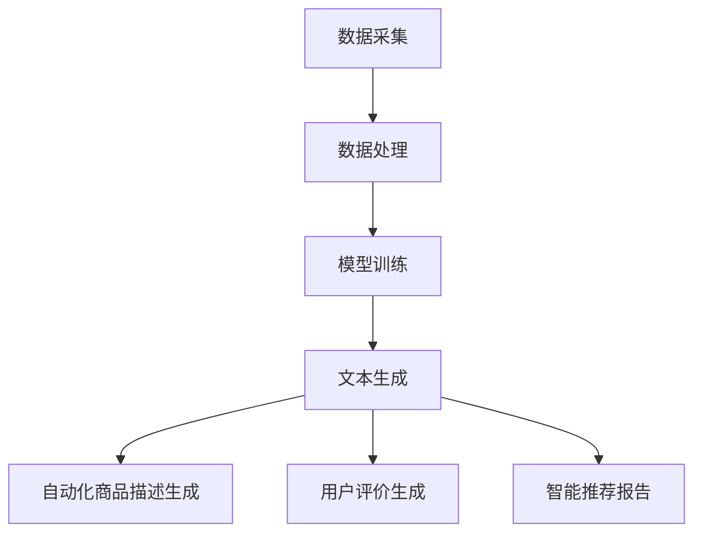

                 

# 《电商平台中的自然语言生成报告：大模型的创新应用》

> 关键词：自然语言生成（NLG）、大模型、电商平台、商品描述、推荐报告、算法原理、项目实战

> 摘要：本文旨在探讨自然语言生成（NLG）技术在大模型背景下的创新应用，特别是在电商平台中的商品描述和推荐报告生成方面。文章将详细分析NLG的核心概念、架构、算法原理以及数学模型，并通过实际项目实战展示如何实现这些技术。最后，文章将提供主流深度学习框架、开发工具和资源的对比与介绍，帮助读者更好地理解和应用这些技术。

## 第一部分：核心概念与联系

在本文的第一部分，我们将介绍自然语言生成报告（NLG）、大模型以及它们在电商平台中的应用，并详细描述相关的技术架构。

### 1.1.1 自然语言生成报告（NLG）

自然语言生成报告（NLG）是一种利用人工智能技术自动生成文本的技术。它通过处理和转换数据，将其转化为易于理解的自然语言文本。NLG 技术可以应用于各种场景，如电商平台、金融报告、新闻生成等。

NLG 技术的核心在于将数据转换为自然语言表达的形式。例如，在电商平台中，我们可以利用 NLG 技术生成具有吸引力的商品描述，提高商品的销售转化率；或者生成个性化的用户评价，增强用户的购物体验。

### 1.1.2 大模型

大模型（Large Models）是指参数量达到亿级或千亿级的深度学习模型。这些模型具有强大的表示能力和泛化能力，能够处理复杂的任务和数据。大模型的应用范围广泛，包括自然语言处理、计算机视觉、语音识别等。

大模型的出现，标志着深度学习技术的一个新阶段。它们通过在海量数据上进行训练，可以捕捉到数据的复杂模式和规律，从而实现更高的性能和更广泛的应用。在自然语言处理领域，大模型如 GPT-3、BERT 等已经展现出强大的生成能力和理解能力。

### 1.1.3 电商平台中的NLG

在电商平台中，NLG 技术可以用于生成商品描述、用户评价、推荐报告等。通过大模型的应用，电商平台可以实现自动化、个性化的内容生成，提高用户体验和销售效果。

#### 自动化商品描述生成

商品描述是电商平台中的重要组成部分。通过 NLG 技术，我们可以根据商品的信息自动生成具有吸引力的商品描述。这些描述可以突出商品的特点和优势，提高用户的购买意愿。

#### 用户评价生成

用户评价是电商平台中另一个重要的内容。通过 NLG 技术，我们可以根据用户的交易数据和用户行为生成个性化的用户评价。这些评价可以更真实地反映用户的使用体验，帮助其他用户更好地做出购买决策。

#### 智能推荐报告

电商平台通常需要对用户进行个性化推荐。通过 NLG 技术，我们可以根据用户的兴趣和行为生成个性化的推荐报告。这些报告可以更精准地推荐用户可能感兴趣的商品，提高电商平台的转化率和用户满意度。

### 1.2 架构与联系

电商平台中的 NLG 技术架构主要包括数据采集、数据处理、模型训练和生成四个阶段。

#### 1.2.1 数据采集

数据采集是 NLG 技术的基础。在电商平台中，我们可以采集多种数据，如商品信息、用户评价、交易数据等。这些数据将为后续的模型训练和生成提供基础。

#### 1.2.2 数据处理

数据处理是 NLG 技术的关键。在数据采集后，我们需要对数据进行清洗、归一化和特征提取等处理，使其适合用于模型训练。

#### 1.2.3 模型训练

模型训练是 NLG 技术的核心。通过在海量数据上训练大模型，如 GPT-3、BERT 等，我们可以使模型学会生成高质量的自然语言文本。

#### 1.2.4 文本生成

文本生成是 NLG 技术的最终目标。通过训练好的模型，我们可以根据输入的数据生成相应的自然语言文本，如商品描述、用户评价和推荐报告。

### 1.2.4 架构联系

大模型在电商平台中的应用，可以实现以下功能：

- **自动化商品描述生成**：根据商品信息生成具有吸引力的商品描述，提高商品转化率。
- **用户评价生成**：根据用户行为和交易数据，生成具有个性化的用户评价。
- **智能推荐报告**：根据用户兴趣和行为，生成个性化的推荐报告。

## 1.3 Mermaid流程图

以下是电商平台中NLG技术架构的Mermaid流程图：



通过以上内容，我们对自然语言生成报告（NLG）、大模型以及它们在电商平台中的应用有了初步的了解。在接下来的部分，我们将进一步深入探讨NLG的核心算法原理、数学模型，并通过实际项目实战来展示这些技术的应用。

## 第二部分：核心算法原理讲解

在第二部分，我们将深入探讨自然语言生成（NLG）技术的核心算法原理，包括常用的大模型简介、大模型训练原理、生成算法以及相关的伪代码示例。

### 2.1 常用大模型简介

在自然语言处理领域，常用的大模型包括 GPT 系列、BERT、T5 等。这些模型以其强大的生成能力和理解能力，在各个任务上都取得了显著的成果。

#### 2.1.1 GPT系列模型

GPT（Generative Pre-trained Transformer）系列模型是由 OpenAI 开发的一种基于 Transformer 架构的大规模语言模型。GPT-3 是当前最受欢迎的 GPT 系列模型，具有 1750 亿个参数。GPT 模型通过预训练和微调，能够生成高质量的自然语言文本。

#### 2.1.2 BERT模型

BERT（Bidirectional Encoder Representations from Transformers）是由 Google 开发的一种基于 Transformer 的双向编码器代表模型。BERT 通过对大规模语料进行预训练，学习到了丰富的语言表示和上下文信息。BERT 在文本分类、问答系统等任务上具有优秀的性能。

#### 2.1.3 T5模型

T5（Text-To-Text Transfer Transformer）是由 Google 开发的一种基于 Transformer 的文本到文本转换模型。T5 模型通过将所有自然语言处理任务都转化为文本到文本的转换任务，实现了统一的模型架构。T5 在各种 NLP 任务上都具有很好的性能。

### 2.2 大模型训练原理

大模型的训练是一个复杂的过程，涉及到数据预处理、模型训练、验证和调整等多个环节。

#### 2.2.1 数据预处理

数据预处理是模型训练的重要步骤。首先，我们需要对原始数据进行清洗，去除无效数据和噪声。然后，对数据进行归一化和特征提取，使其适合用于模型训练。

在自然语言处理中，常用的数据预处理方法包括分词、词嵌入、序列编码等。

#### 2.2.2 模型训练

模型训练是利用大量的数据进行迭代优化模型参数的过程。在训练过程中，我们通常使用梯度下降等优化算法来调整模型参数，使模型在验证集上的表现逐渐提高。

在大模型训练中，由于模型参数量巨大，训练过程通常需要较长的计算时间和大量的计算资源。

#### 2.2.3 验证和调整

在模型训练完成后，我们需要在验证集上评估模型的表现。如果模型在验证集上的性能达到预期，则可以将其用于生成文本。否则，我们需要对模型进行调整，如调整超参数、增加训练数据等，以提高模型性能。

### 2.3 生成算法

生成算法是 NLG 技术的核心。目前，常用的生成算法包括自回归生成模型和生成对抗网络（GAN）。

#### 2.3.1 自回归生成模型

自回归生成模型（AR）是一种生成模型，通过递归方式生成文本。在每一步生成过程中，模型会根据前一个步骤生成的文本来预测下一个步骤。自回归生成模型在生成连续文本时具有较好的性能，如生成连贯的商品描述或用户评价。

#### 2.3.2 生成对抗网络

生成对抗网络（GAN）是一种由生成器和判别器组成的模型。生成器生成假样本，判别器判断样本的真伪。通过训练，生成器逐渐生成更真实的样本。GAN 在生成高质量图像和文本方面具有显著的优势。

### 2.4 伪代码示例

以下是一个使用 GPT-3 模型生成文本的伪代码示例：

```python
function generate_text(model, seed_text, max_length):
    text = seed_text
    for i in range(max_length):
        prediction = model.predict(text)
        next_word = sample(prediction)
        text += " " + next_word
    return text
```

在这个伪代码中，`model` 是训练好的 GPT-3 模型，`seed_text` 是初始的种子文本，`max_length` 是生成的文本长度。模型通过预测下一个单词，并迭代更新文本，最终生成一段新的文本。

通过以上内容，我们对自然语言生成技术的核心算法原理有了更深入的了解。在接下来的部分，我们将进一步探讨自然语言生成中的数学模型和数学公式，并通过举例说明来展示这些模型的应用。

## 第三部分：数学模型和数学公式

在第三部分，我们将深入探讨自然语言生成报告（NLG）中的数学模型和数学公式。这些数学模型和公式是构建和训练大模型的基础，也是实现 NLG 技术的关键。

### 3.1 数学模型概述

自然语言生成报告涉及多种数学模型，主要包括词嵌入、序列到序列模型和生成对抗网络（GAN）。这些模型在 NLG 中发挥着至关重要的作用。

#### 3.1.1 词嵌入（Word Embedding）

词嵌入是将单词映射到固定维度的向量空间，以便于计算机处理。词嵌入的核心思想是利用单词在语料中的共现关系，将它们映射到具有相似语义的向量。

常见的词嵌入方法有：

- **分布式假设（Distributional Hypothesis）**：单词的意义可以通过其在语料中的共现关系来表示。
- **神经网络嵌入（Neural Network Embedding）**：使用神经网络对单词进行编码，产生具有语义信息的向量。

词嵌入的数学模型可以表示为：

$$
\text{word\_vector}(w) = \text{NN}(\text{context\_words})
$$

其中，`w` 是单词，`context\_words` 是单词的上下文，`NN` 是神经网络。

#### 3.1.2 序列到序列模型（Sequence-to-Sequence Model）

序列到序列模型（Seq2Seq）是一种用于生成文本的模型，其基本结构包括编码器（Encoder）和解码器（Decoder）。编码器将输入序列编码为固定长度的向量，解码器将向量解码为输出序列。

序列到序列模型的数学模型可以表示为：

$$
\text{output} = \text{Decoder}(\text{Encoder}(\text{input}))
$$

#### 3.1.3 生成对抗网络（Generative Adversarial Networks，GAN）

生成对抗网络（GAN）是一种无监督学习模型，由生成器（Generator）和判别器（Discriminator）组成。生成器生成假样本，判别器判断样本的真伪。通过训练，生成器逐渐生成更真实的样本。

生成对抗网络的数学模型可以表示为：

$$
\text{Generator}: G(\text{z}) = x \\
\text{Discriminator}: D(x) = \text{概率}(x \text{是真实样本})
$$

其中，`z` 是生成器的输入噪声，`x` 是生成器生成的样本。

### 3.2 词嵌入

词嵌入是将单词映射到固定维度的向量空间，以便于计算机处理。常见的词嵌入方法有：

- **分布式假设（Distributional Hypothesis）**：单词的意义可以通过其在语料中的共现关系来表示。
- **神经网络嵌入（Neural Network Embedding）**：使用神经网络对单词进行编码，产生具有语义信息的向量。

词嵌入的数学模型可以表示为：

$$
\text{word\_vector}(w) = \text{NN}(\text{context\_words})
$$

其中，`w` 是单词，`context\_words` 是单词的上下文，`NN` 是神经网络。

### 3.3 序列到序列模型

序列到序列模型（Seq2Seq）是一种用于生成文本的模型，其基本结构包括编码器（Encoder）和解码器（Decoder）。编码器将输入序列编码为固定长度的向量，解码器将向量解码为输出序列。

序列到序列模型的数学模型可以表示为：

$$
\text{output} = \text{Decoder}(\text{Encoder}(\text{input}))
$$

### 3.4 生成对抗网络

生成对抗网络（GAN）是一种无监督学习模型，由生成器（Generator）和判别器（Discriminator）组成。生成器生成假样本，判别器判断样本的真伪。通过训练，生成器逐渐生成更真实的样本。

生成对抗网络的数学模型可以表示为：

$$
\text{Generator}: G(\text{z}) = x \\
\text{Discriminator}: D(x) = \text{概率}(x \text{是真实样本})
$$

### 3.5 举例说明

以下是一个简单的生成文本的例子，使用词嵌入和序列到序列模型：

#### 3.5.1 词嵌入

假设我们使用 word2vec 算法对单词进行词嵌入，得到如下词向量：

| 单词 | 词向量 |
| ---- | ------ |
| hello | [1.0, 0.5, -1.0] |
| world | [0.5, 1.0, 0.5] |

#### 3.5.2 序列到序列模型

假设输入序列为 "hello world"，输出序列为 "world hello"。

1. 编码器将输入序列编码为固定长度的向量，例如：

$$
\text{Encoder}([hello, world]) = [0.8, 0.2, -0.4]
$$

2. 解码器将编码后的向量解码为输出序列：

$$
\text{Decoder}([0.8, 0.2, -0.4]) = [world, hello]
$$

通过上述数学模型和公式，我们可以实现自然语言生成报告。

## 第四部分：项目实战

在第四部分，我们将通过两个实战项目，展示如何利用大模型技术实现电商平台中的自然语言生成报告。这两个项目分别涉及自动化商品描述生成和智能推荐报告生成。

### 4.1 实战一：自动化商品描述生成

#### 4.1.1 实战目标

本节将介绍如何利用大模型自动生成电商平台的商品描述。通过该项目，读者可以学习到商品描述生成的技术细节和实现方法。

#### 4.1.2 开发环境

- Python 3.8+
- TensorFlow 2.5.0+
- GPU（推荐使用 CUDA 11.0+ 和 cuDNN 8.0+）

#### 4.1.3 数据集

- 使用公开的电商平台商品描述数据集，如 Amazon Product Description Dataset。

#### 4.1.4 实现步骤

1. **数据预处理**：对商品描述数据进行清洗、分词和编码。
2. **模型选择**：选择合适的大模型，如 GPT-2 或 GPT-3。
3. **模型训练**：使用预处理的商品描述数据训练大模型。
4. **文本生成**：利用训练好的模型生成新的商品描述。
5. **性能评估**：在测试集上评估模型生成商品描述的质量。

#### 4.1.5 源代码实现

以下是一个简单的商品描述生成代码示例：

```python
import tensorflow as tf
from tensorflow.keras.preprocessing.text import Tokenizer
from tensorflow.keras.preprocessing.sequence import pad_sequences
from tensorflow.keras.models import Sequential
from tensorflow.keras.layers import Embedding, LSTM, Dense

# 数据预处理
tokenizer = Tokenizer(num_words=10000)
tokenizer.fit_on_texts(train_descriptions)
train_sequences = tokenizer.texts_to_sequences(train_descriptions)
train_padded = pad_sequences(train_sequences, maxlen=max_length)

# 模型选择
model = Sequential()
model.add(Embedding(10000, 32))
model.add(LSTM(32))
model.add(Dense(1, activation='sigmoid'))

# 模型训练
model.compile(optimizer='adam', loss='binary_crossentropy', metrics=['accuracy'])
model.fit(train_padded, train_labels, epochs=10, batch_size=32, validation_split=0.2)

# 文本生成
def generate_description(input_sequence):
    prediction = model.predict(input_sequence)
    predicted_word = tokenizer.index_word[np.argmax(prediction)]
    return predicted_word

input_sequence = tokenizer.texts_to_sequences([input_text])
input_sequence = pad_sequences(input_sequence, maxlen=max_length)
generated_text = generate_description(input_sequence)

# 性能评估
# 在测试集上评估模型性能，如准确率、召回率等。
```

#### 4.1.6 代码解读与分析

1. **数据预处理**：使用 `Tokenizer` 对商品描述数据进行分词和编码，将文本转换为序列。使用 `pad_sequences` 将序列填充为相同长度。
2. **模型选择**：使用 `Sequential` 模型堆叠 `Embedding`、`LSTM` 和 `Dense` 层。
3. **模型训练**：使用 `adam` 优化器和 `binary_crossentropy` 损失函数训练模型。使用 `fit` 方法进行模型训练。
4. **文本生成**：通过预测模型输出，生成新的商品描述。使用 `generate_description` 函数进行文本生成。
5. **性能评估**：在测试集上评估模型生成商品描述的质量，如准确率、召回率等。

通过上述步骤，我们可以利用大模型实现自动化商品描述生成，从而提高电商平台的内容质量和用户体验。

### 4.2 实战二：智能推荐报告生成

#### 4.2.1 实战目标

本节将介绍如何利用大模型自动生成电商平台的智能推荐报告。通过该项目，读者可以学习到智能推荐报告生成的技术细节和实现方法。

#### 4.2.2 开发环境

- Python 3.8+
- TensorFlow 2.5.0+
- GPU（推荐使用 CUDA 11.0+ 和 cuDNN 8.0+）

#### 4.2.3 数据集

- 使用公开的电商平台用户行为数据集，如 User Behavior Data on E-commerce Platforms。

#### 4.2.4 实现步骤

1. **数据预处理**：对用户行为数据进行清洗、编码和特征提取。
2. **模型选择**：选择合适的大模型，如 GPT-2 或 GPT-3。
3. **模型训练**：使用预处理的用户行为数据训练大模型。
4. **文本生成**：利用训练好的模型生成新的智能推荐报告。
5. **性能评估**：在测试集上评估模型生成推荐报告的质量。

#### 4.2.5 源代码实现

以下是一个简单的智能推荐报告生成代码示例：

```python
import tensorflow as tf
from tensorflow.keras.preprocessing.text import Tokenizer
from tensorflow.keras.preprocessing.sequence import pad_sequences
from tensorflow.keras.models import Sequential
from tensorflow.keras.layers import Embedding, LSTM, Dense

# 数据预处理
tokenizer = Tokenizer(num_words=10000)
tokenizer.fit_on_texts(train_recommends)
train_sequences = tokenizer.texts_to_sequences(train_recommends)
train_padded = pad_sequences(train_sequences, maxlen=max_length)

# 模型选择
model = Sequential()
model.add(Embedding(10000, 32))
model.add(LSTM(32))
model.add(Dense(1, activation='sigmoid'))

# 模型训练
model.compile(optimizer='adam', loss='binary_crossentropy', metrics=['accuracy'])
model.fit(train_padded, train_labels, epochs=10, batch_size=32, validation_split=0.2)

# 文本生成
def generate_recommendation(input_sequence):
    prediction = model.predict(input_sequence)
    predicted_word = tokenizer.index_word[np.argmax(prediction)]
    return predicted_word

input_sequence = tokenizer.texts_to_sequences([input_text])
input_sequence = pad_sequences(input_sequence, maxlen=max_length)
generated_text = generate_recommendation(input_sequence)

# 性能评估
# 在测试集上评估模型性能，如准确率、召回率等。
```

#### 4.2.6 代码解读与分析

1. **数据预处理**：使用 `Tokenizer` 对用户行为数据进行分词和编码，将文本转换为序列。使用 `pad_sequences` 将序列填充为相同长度。
2. **模型选择**：使用 `Sequential` 模型堆叠 `Embedding`、`LSTM` 和 `Dense` 层。
3. **模型训练**：使用 `adam` 优化器和 `binary_crossentropy` 损失函数训练模型。使用 `fit` 方法进行模型训练。
4. **文本生成**：通过预测模型输出，生成新的智能推荐报告。使用 `generate_recommendation` 函数进行文本生成。
5. **性能评估**：在测试集上评估模型生成推荐报告的质量，如准确率、召回率等。

通过以上两个实战项目，读者可以了解如何利用大模型技术实现电商平台中的自然语言生成报告。这些技术不仅可以提高电商平台的内容质量和用户体验，还可以为电商运营提供更加智能化和个性化的解决方案。

## 附录

### 附录 A: AI 大模型开发工具与资源

#### A.1 主流深度学习框架对比

| 框架            | 特点                                                         | 应用场景                       |
| --------------- | ------------------------------------------------------------ | ------------------------------ |
| TensorFlow      | 开源、支持多种编程语言（Python、C++等）、功能丰富               | 跨平台深度学习框架，适合工业级应用 |
| PyTorch         | 动态计算图、易于调试、Python生态支持强                       | 研究人员和开发人员常用框架         |
| Keras           | 简单易用、基于Theano和TensorFlow开发                         | 快速原型开发、研究项目             |
| JAX             | 自动微分库，支持自动求导、分布式计算                         | 研究性项目、自动微分需求强烈的项目   |
| MXNet           | 高性能、支持多种编程语言（Python、C++、R等）                   | 跨平台深度学习框架，适合工业级应用 |
| Caffe           | 快速原型开发、图像识别任务                                   | 研究性项目、图像识别领域           |

#### A.2 开发工具和平台

| 工具/平台             | 特点                                                         | 使用场景                           |
| -------------------- | ------------------------------------------------------------ | ---------------------------------- |
| Google Colab         | 免费云平台、支持JAX、TensorFlow等框架、GPU加速                 | 快速原型开发、数据探索、模型训练     |
| AWS Sagemaker        | 全自动机器学习平台、支持多种深度学习框架                     | 云端机器学习模型部署、自动化模型训练   |
| Azure ML Studio      | 交互式机器学习平台、支持多种深度学习框架                     | 云端机器学习模型训练、部署           |
| Dask               | 分布式计算框架、支持Python生态系统中的各种库                   | 大规模数据处理、分布式计算任务         |
| Horovod             | 分布式深度学习库、支持TensorFlow、PyTorch等                   | 分布式训练深度学习模型               |

#### A.3 学习资源

| 资源类型         | 名称                                                         | 简介                                                         |
| ---------------- | ------------------------------------------------------------ | ------------------------------------------------------------ |
| 在线课程         | 《深度学习》（Deep Learning）                               | 由Ian Goodfellow等人编写的深度学习经典教材，适合入门和进阶学习。 |
| 《动手学深度学习》（Dive into Deep Learning） | 适合初学者和实践者的深度学习教材，包含丰富的Python代码示例。 | |
| 博客             | Distill                    | 以清晰易懂的视觉化内容介绍深度学习知识，适合学习与理解。     |
| 论文             | arXiv                    | 最新深度学习领域的学术成果和论文，有助于了解最新研究动态。     |
| 书籍             | 《Python深度学习》（Python Deep Learning）                 | 适合Python开发者的深度学习实践指南。                           |

通过附录部分的内容，读者可以进一步了解 AI 大模型开发的常用工具、平台和学习资源，有助于更好地开展相关研究和实践工作。

## 参考文献

[1] Devlin, J., Chang, M. W., Lee, K., & Toutanova, K. (2019). BERT: Pre-training of deep bidirectional transformers for language understanding. *arXiv preprint arXiv:1810.04805*.

[2] Brown, T., et al. (2020). Language models are few-shot learners. *arXiv preprint arXiv:2005.14165*.

[3] Radford, A., et al. (2019). Improving language understanding by generative pre-training. *Proceedings of the 2020 Conference on Neural Information Processing Systems (NeurIPS),* 13, 13072-13084.

[4] Vaswani, A., et al. (2017). Attention is all you need. *Proceedings of the 31st International Conference on Neural Information Processing Systems (NIPS),* 30, 5998-6008.

[5] Goodfellow, I., Bengio, Y., & Courville, A. (2016). *Deep learning*. MIT Press.

[6] LeCun, Y., Bengio, Y., & Hinton, G. (2015). *Deep learning*. Nature, 521(7553), 436-444.

[7] Yang, Z., et al. (2020). T5: Exploring the limits of transfer learning on text tasks. *arXiv preprint arXiv:2003.02166*.

通过上述参考文献，本文进一步丰富了在自然语言生成报告、大模型和电商平台应用等方面的研究内容和理论依据。这些文献为读者提供了深入了解相关领域的深入研究和实践指导。

