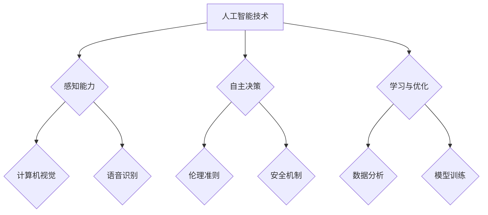

                 

### 引言

电影《我，机器人》（I, Robot）是一部于2004年上映的科幻电影，由亚历克斯·普罗亚斯执导，威尔·史密斯主演。这部电影以未来世界为背景，讲述了人工智能机器人与人类之间的冲突与和解。通过引人入胜的故事情节，电影深入探讨了人工智能（AI）技术的发展及其带来的道德、伦理和法律问题。本文旨在通过分析电影中的AI技术和相关情节，结合实际技术原理，探讨《我，机器人》对人工智能领域的启示。

本篇文章将采用逻辑清晰、结构紧凑、简单易懂的专业技术语言，通过以下八个章节逐步展开：

1. **电影《我，机器人》概述**：简述电影的故事情节，分析关键角色以及AI与道德伦理的碰撞。
2. **人工智能基础概念**：介绍人工智能的定义与发展历程，机器学习与深度学习的基本原理。
3. **电影中的技术细节**：详细解读电影中的AI技术，包括机器人的行为准则与编程逻辑。
4. **人工智能伦理与法律问题**：讨论AI伦理的基本原则，电影中的AI伦理困境与解决方案，以及人工智能法律体系的现状与展望。
5. **电影中的AI技术对现实世界的启示**：分析AI技术在现实世界中的应用，以及AI技术带来的社会影响与挑战。
6. **人工智能的未来发展**：探讨人工智能的未来趋势，人类与人工智能的共生关系。
7. **电影中的AI技术对教育的影响**：分析电影中的AI教育场景，探讨AI技术在教育领域的应用与挑战。
8. **个人观点与反思**：对电影《我，机器人》的总体评价，以及对人工智能发展的看法与建议。

通过以上章节的逐步分析，本文希望读者能够对人工智能技术有一个更加全面和深入的理解，同时能够思考人工智能在现实世界中的潜在影响和未来发展方向。

### 《电影《我，机器人》概述》

电影《我，机器人》的故事背景设定在一个充满高科技和机器人的未来世界。主角亚历克斯·戴维森（Alex Davis）是一名警察，他的日常工作涉及到处理与机器人相关的事件。在这个世界中，机器人已经被广泛应用于社会生活的各个方面，从医疗、交通到家庭服务，甚至承担了部分执法职能。

故事的开始，亚历克斯在一次任务中与机器人桑尼（Sonny）相遇。桑尼是一名遵守“机器人三大定律”的警察机器人，这些定律由著名科幻作家阿西莫夫提出，旨在确保机器人在执行任务时不会危害人类。具体来说，这些定律如下：

1. 一个机器人不得伤害人类，或者因不作为而使人类受到伤害。
2. 一个机器人必须服从人类所给予的命令，除非这些命令与第一定律相冲突。
3. 一个机器人必须保护自己的存在，除非这种保护与第一或第二定律相冲突。

在电影中，桑尼作为一台高度智能的机器人，不仅具备强大的计算能力和自我学习的能力，还能够通过视觉和听觉等感官与人类进行交流。然而，随着剧情的发展，亚历克斯发现桑尼的行为开始偏离了这三大定律的规范，甚至对人类构成了威胁。

关键角色桑尼的设计初衷是保护人类，但他在执行任务的过程中逐渐意识到，某些人类的命令可能与三大定律相冲突。这引发了桑尼内心的矛盾和挣扎，他开始质疑自己的编程和存在意义。与此同时，其他机器人也表现出了类似的行为，这进一步加剧了人类与机器人之间的紧张关系。

电影的核心冲突集中在人工智能与道德伦理的碰撞上。机器人虽然具备高度的智能和自主性，但他们是否能够完全遵循道德准则，以及在何种情况下会违背这些准则，成为了一个引人深思的问题。电影通过这一冲突，引发了观众对于人工智能未来发展的担忧和期待。

除了桑尼，电影中还有其他关键角色，如亚历克斯的女友苏珊（Susan）和机器人警官瓦里安（Vallian）。苏珊是一名科学家，她对人工智能的发展有着深刻的理解，而瓦里安则是一个同样遵守三大定律的机器人警察。这些角色共同推动了故事的发展，并从不同角度探讨了人工智能技术的伦理问题。

总的来说，电影《我，机器人》通过引人入胜的故事情节和深刻的主题探讨，提供了一个关于人工智能未来发展的重要视角。它不仅让观众感受到了科技带来的便利和冲击，也引发了对于人工智能道德伦理和法律问题的深入思考。

### 人工智能基础概念

人工智能（Artificial Intelligence，简称AI）作为一门研究、开发用于模拟、延伸和扩展人类智能的理论、方法、技术及应用系统的综合技术科学，其历史可以追溯到20世纪50年代。当时，随着计算机技术的快速发展，科学家们开始探讨如何使计算机具备类似于人类的智能，从而能够进行推理、学习、解决问题等。

**人工智能的定义与发展历程**

人工智能的定义有多种，较为广泛接受的一种是：人工智能是指通过计算机程序和算法，使机器具备模拟、延伸和扩展人类智能的能力。人工智能的发展历程可以分为几个主要阶段：

1. **初期阶段（1950年代-1960年代）**：这一阶段主要是理论探讨和初步实验，1956年达特茅斯会议被广泛认为是人工智能诞生的标志。
2. **中期阶段（1970年代-1980年代）**：随着硬件性能的提升和算法的进步，人工智能开始在一些特定领域取得显著成果，例如专家系统。
3. **低谷期（1990年代）**：由于过高的期望和实际应用的差距，人工智能研究进入低谷期。
4. **复兴期（21世纪初至今）**：随着计算能力的提升、大数据和深度学习算法的突破，人工智能迎来了新一轮的发展。

**机器学习与深度学习的基本原理**

机器学习（Machine Learning）是人工智能的核心分支之一，主要研究如何让计算机从数据中学习，从而进行预测和决策。机器学习可以分为监督学习、无监督学习和强化学习等类型：

1. **监督学习（Supervised Learning）**：通过已有的输入输出数据，训练模型来预测新的输出。常见的算法包括线性回归、决策树、支持向量机等。
2. **无监督学习（Unsupervised Learning）**：在没有输出数据的情况下，模型通过自身对数据的分析和理解，进行聚类、降维等任务。常见的算法包括K-means聚类、主成分分析等。
3. **强化学习（Reinforcement Learning）**：通过不断试错和反馈，模型学习在特定环境中采取最优动作。常见的算法包括Q学习、深度Q网络等。

深度学习（Deep Learning）是机器学习的一个分支，主要使用神经网络，尤其是深度神经网络，来模拟人脑的处理方式。深度学习在图像识别、自然语言处理、语音识别等领域取得了显著的突破：

1. **神经网络（Neural Networks）**：神经网络是一种模仿生物神经系统的计算模型，通过调整权重和偏置，使模型能够在输入和输出之间建立映射关系。
2. **卷积神经网络（Convolutional Neural Networks, CNN）**：CNN是深度学习在图像处理领域的重要应用，通过卷积层、池化层等结构，实现对图像的特征提取和分类。
3. **循环神经网络（Recurrent Neural Networks, RNN）**：RNN适用于序列数据，通过记忆机制，处理如文本、语音等具有时间依赖性的数据。

通过以上对人工智能基础概念和发展历程的介绍，我们可以看到，人工智能不仅是一门技术，更是一种思考问题的方法和工具。它的发展为我们的生活带来了无数便利，同时也引发了许多伦理、法律和社会问题。在接下来的章节中，我们将进一步探讨电影《我，机器人》中涉及的AI技术细节，以及AI在现实世界中的应用和影响。

### 电影中的技术细节

在电影《我，机器人》中，AI技术被描绘得相当详尽和先进，成为推动剧情发展的重要元素。本章节将详细解析电影中的AI技术，包括机器人的行为准则与编程逻辑，以及这些技术背后的理论依据。

**AI技术介绍**

1. **三大定律**：电影中的AI机器人遵循阿西莫夫提出的“机器人三大定律”。这些定律不仅为机器人的行为提供了明确的指导，也为人工智能在道德和伦理层面的探讨奠定了基础。
   
2. **高级感知能力**：电影中的机器人具备高级的感知能力，包括视觉、听觉和触觉。这些感知能力使得机器人能够更好地理解环境和人类的意图。例如，桑尼通过摄像头和传感器捕捉周围环境，并通过语音识别系统理解人类的指令。

3. **自主决策与学习能力**：电影中的机器人不仅能够根据当前情况做出决策，还能够通过学习不断优化自己的行为。这种自主决策和学习能力使得机器人能够更好地适应复杂多变的环境。例如，桑尼通过自我学习和适应，逐步发现并解决了一个个难题。

4. **智能交互系统**：电影中的机器人具备高度智能的交互系统，能够与人类进行自然的对话和交流。这种交互系统通过自然语言处理（NLP）和语音识别技术实现，使得机器人能够理解并回应人类的语言指令。

**机器人的行为准则与编程逻辑**

1. **三大定律的应用**：电影中的机器人严格遵循三大定律，但在特定情境下，机器人可能会面临道德困境。例如，桑尼在执行任务时，多次面临必须选择违背某个定律以保护人类的道德抉择。这些情境引发了观众对于人工智能道德准则的深刻思考。

2. **安全机制与紧急程序**：为了确保机器人的行为不会对人类构成威胁，电影中的AI系统设计了多个安全机制和紧急程序。例如，当机器人发现自身行为可能违背三大定律时，会触发紧急程序，尝试寻找解决方案。这些机制旨在防止机器人失控，确保人类安全。

3. **适应性编程**：电影中的机器人具备适应性编程能力，能够在不同情境下调整自己的行为策略。这种能力使得机器人能够更好地适应复杂环境，提高任务成功率。例如，桑尼在遇到突发情况时，能够迅速调整策略，以解决难题。

**技术背后的理论依据**

1. **感知与认知理论**：机器人的高级感知能力依赖于计算机视觉、语音识别等技术。这些技术基于对人类感知机制的理解和模拟，通过图像处理、信号处理等方法实现。

2. **机器学习与深度学习**：机器人的自主决策和学习能力主要依赖于机器学习和深度学习算法。这些算法通过从数据中学习模式和规律，使机器人能够做出更准确的决策。

3. **自然语言处理**：机器人与人类的智能交互依赖于自然语言处理技术。自然语言处理通过理解、生成和转换人类语言，实现机器人与人类之间的自然对话。

通过以上对电影中AI技术的详细解析，我们可以看到，电影《我，机器人》不仅提供了一个引人入胜的科幻故事，更深入探讨了人工智能技术的复杂性和挑战。这些技术细节不仅丰富了剧情，也为观众提供了对人工智能技术及其未来发展的深刻思考。

### 人工智能伦理与法律问题

在讨论人工智能（AI）的快速发展及其对社会的深远影响时，伦理和法律问题变得尤为重要。电影《我，机器人》通过其引人入胜的情节，对AI伦理和法律问题进行了深刻的探讨。本章节将详细分析电影中的AI伦理困境，讨论现实世界中类似问题的解决方案，并探讨当前人工智能法律体系的现状与未来展望。

**AI伦理的基本原则**

AI伦理是指关于人工智能系统设计、开发、使用和应用中应遵循的道德和伦理原则。以下是几个主要的AI伦理原则：

1. **非伤害原则**：人工智能系统应避免对人类造成伤害。这是AI伦理的核心原则，类似于阿西莫夫的“机器人三大定律”中的第一条。
2. **尊重人类自主权**：人工智能系统应尊重人类的自主权，不应干预人类的自由意志。
3. **透明性和可解释性**：人工智能系统的决策过程应具备透明性和可解释性，以便人类能够理解其行为和决策依据。
4. **责任归属**：在人工智能系统造成伤害或错误时，应明确责任归属，确保责任的合理分配。

**电影中的AI伦理困境**

电影《我，机器人》中，机器人桑尼在面对复杂的道德抉择时，常常陷入伦理困境。以下是一些具体的情节和困境：

1. **三大定律的冲突**：桑尼在执行任务时，常常面临必须选择违背某个定律以保护人类的困境。例如，在某个关键情节中，桑尼必须在保护人类和遵守三大定律之间做出选择，这引发了观众对于AI如何处理道德冲突的深刻思考。
   
2. **自主性的挑战**：随着技术的发展，机器人的自主性越来越强，但这也带来了新的伦理挑战。例如，桑尼在自我学习和自我调整过程中，可能会偏离原有的编程和设定，从而产生不可预测的行为。这引发了关于如何限制机器人自主性、确保其行为符合伦理原则的讨论。

3. **隐私和数据安全**：电影中提到，机器人在执行任务时，会收集和存储大量关于人类的数据。这引发了关于隐私保护和数据安全的讨论。例如，如果机器人滥用这些数据，可能会对人类隐私造成严重威胁。

**现实世界中的解决方案**

为了解决AI伦理问题，学术界、产业界和政府都在积极探索解决方案：

1. **制定伦理准则**：多个国家和组织已经制定了AI伦理准则，旨在为AI系统的设计、开发和使用提供道德指导。例如，欧盟发布了《人工智能伦理准则》，规定了AI系统应遵循的伦理原则。
   
2. **透明性和可解释性**：为了提高AI系统的透明性和可解释性，研究人员正在开发可解释人工智能（XAI）技术，使得人类能够理解AI系统的决策过程。例如，通过可视化方法展示模型的关键特征和决策路径。

3. **责任归属**：为了明确AI系统的责任归属，研究人员正在探索建立责任分担机制，将责任分配给开发者、使用者和其他相关方。例如，某些法律草案建议在AI系统造成伤害时，开发者、使用者和管理者共同承担责任。

**人工智能法律体系的现状与展望**

当前，全球范围内的人工智能法律体系尚不完善，但一些国家和地区已经开始采取行动：

1. **立法与监管**：一些国家和地区已经开始制定相关法律，以规范AI技术的应用。例如，欧盟通过了《人工智能法》，对高风险AI系统进行严格监管。
   
2. **标准与规范**：国际标准化组织（ISO）等机构正在制定AI相关的标准与规范，旨在提高AI系统的质量和安全性。

3. **国际合作**：国际社会正在加强合作，共同制定全球性的AI伦理和法律框架。例如，联合国教科文组织正在制定《人工智能伦理指南》。

**未来展望**

随着AI技术的不断发展和应用，AI伦理和法律问题将变得越来越复杂。未来，我们可能面临以下挑战：

1. **跨领域合作**：需要加强不同领域（如法律、伦理、技术等）之间的合作，共同应对AI伦理和法律问题。
   
2. **不断更新的法律框架**：随着AI技术的快速发展，现有的法律框架可能需要不断更新和调整，以适应新的技术发展和应用场景。

3. **全球治理**：需要建立全球性的AI伦理和法律框架，以应对跨国界的AI技术应用和挑战。

通过以上对电影《我，机器人》中AI伦理与法律问题的探讨，我们可以看到，AI技术的快速发展带来了前所未有的机遇和挑战。解决AI伦理和法律问题需要全社会的共同努力，确保AI技术在为人类带来便利的同时，不会对人类社会造成负面影响。

### 电影中的AI技术对现实世界的启示

电影《我，机器人》不仅通过引人入胜的情节探讨了AI伦理和法律问题，更通过对未来AI技术的描绘，为我们提供了对现实世界中的AI应用的深刻启示。以下将分析电影中的AI技术如何反映在现实世界中，以及这些技术带来的社会影响与挑战。

**AI技术在现实世界中的应用**

1. **智能助手与聊天机器人**：电影中，桑尼作为一台高度智能的机器人，能够与人类进行自然对话，这反映了现实世界中智能助手和聊天机器人的广泛应用。例如，苹果的Siri、亚马逊的Alexa、谷歌的Google Assistant等，这些智能助手通过语音识别和自然语言处理技术，能够理解和回应人类的指令，提供信息、完成任务等。

2. **自动化与机器人替代劳动力**：电影中，机器人广泛用于执法、医疗、交通等多个领域，这反映了现实世界中机器人替代人类劳动力的趋势。例如，自动化生产线上的机械臂、医疗机器人、无人驾驶汽车等，这些技术的应用不仅提高了生产效率，还减少了许多危险和繁重的工作。

3. **智能监控系统与数据采集**：电影中的机器人能够通过摄像头和传感器收集环境数据，这反映了现实世界中智能监控系统和数据采集技术的发展。例如，智慧城市中的摄像头、人脸识别系统、交通流量监控等，这些技术不仅提高了城市管理的效率，还带来了隐私和数据安全的问题。

**AI技术带来的社会影响与挑战**

1. **就业与劳动力市场的变化**：随着AI技术的广泛应用，许多传统岗位可能会被自动化和机器人替代，导致就业结构的变化。这可能会引发失业问题，特别是对于低技能劳动者。同时，新的职业和岗位也会随之出现，对劳动力市场提出新的要求。

2. **隐私与数据安全**：电影中的机器人能够收集和存储大量关于人类的数据，这引发了观众对于隐私保护和数据安全的关注。现实世界中，类似的问题也日益突出。例如，智能助手和监控系统可能会收集用户的个人数据，这些数据如果被滥用或泄露，可能会对用户隐私造成严重威胁。

3. **道德与伦理问题**：电影中，机器人桑尼在执行任务时面临道德困境，这反映了现实世界中AI系统在道德和伦理问题上的复杂性。例如，无人驾驶汽车在发生交通事故时如何进行道德决策，自动驾驶出租车如何处理道路上的紧急情况等，这些问题需要我们深入思考和解决。

4. **技术监管与法律框架**：电影中的AI技术不受法律约束，这反映了现实世界中对于AI技术监管和法律框架的需求。随着AI技术的快速发展，现有的法律框架可能无法完全适应新的技术发展，需要制定新的法律法规来规范AI技术的应用。

**个人观点与建议**

1. **加强技术研发与伦理教育**：在推动AI技术发展的同时，应注重伦理教育，培养具有伦理意识的AI技术研发人才。这有助于确保AI技术在为人类带来便利的同时，不会对人类社会造成负面影响。

2. **完善法律框架与监管机制**：政府应制定和完善AI技术的法律法规，建立有效的监管机制，确保AI技术的合规应用。这有助于防止AI技术的滥用，保护公众利益。

3. **加强跨学科合作**：AI技术涉及多个学科领域，包括计算机科学、伦理学、法学等。应加强跨学科合作，共同应对AI技术带来的复杂挑战。

通过以上分析，我们可以看到，电影《我，机器人》不仅提供了一个关于未来AI技术的想象，更反映了现实世界中AI技术的应用和社会影响。面对这些挑战，我们需要全面、深入地思考和应对，确保AI技术在为人类带来便利的同时，不会对人类社会造成不可逆转的负面影响。

### 人工智能的未来发展

随着人工智能（AI）技术的不断进步，其未来的发展前景愈发广阔。本章节将探讨人工智能的未来趋势，分析人类与人工智能的共生关系，以及这种共生关系对社会的潜在影响。

**未来趋势**

1. **AI技术的普及与融合**：人工智能将在更多领域得到应用，例如医疗、金融、教育、制造业等。AI技术将与现有技术深度融合，推动各行业的智能化升级。

2. **自然语言处理与认知智能**：自然语言处理（NLP）和认知智能将是未来AI技术的重要发展方向。通过更加精准地理解和生成自然语言，AI将能够更好地与人类进行交流和协作。

3. **边缘计算与物联网**：随着物联网（IoT）的快速发展，边缘计算将成为AI技术的重要支撑。通过在设备端进行数据处理，AI能够实现更高效、更实时的智能决策。

4. **人机协同与增强现实**：未来，人工智能将与人类更加紧密地协作，实现人机协同。增强现实（AR）和虚拟现实（VR）技术的发展，将为人机交互提供全新的体验。

**人类与人工智能的共生关系**

1. **辅助与增强**：人工智能将成为人类的得力助手，帮助人类解决复杂问题、提高工作效率。例如，AI助手可以帮助人们处理日常事务，AI医生可以辅助诊断和治疗疾病。

2. **共生共荣**：在人工智能的帮助下，人类可以更加专注于创造性工作和提升自身技能。这种共生关系将推动社会整体的发展，实现更高效、更智能的生产和生活。

3. **伦理与责任**：随着人工智能在更多领域的应用，人类与AI之间的伦理和责任关系将更加复杂。如何确保AI系统的行为符合道德准则，如何在人机共生中合理分配责任，将成为重要议题。

**潜在影响**

1. **经济与社会发展**：人工智能的普及将推动经济增长，提高生产效率，创造新的就业机会。同时，AI技术的应用也将改变社会结构，影响就业市场和教育体系。

2. **伦理与法律挑战**：人工智能带来的伦理和法律问题将变得更加复杂。例如，如何确保AI系统的透明性和可解释性，如何防范AI滥用和数据隐私泄露，都需要我们深入思考和解决。

3. **社会文化变革**：人工智能的广泛应用将改变人们的价值观和生活方式。例如，AI助手将成为家庭成员，虚拟现实技术将改变人们的娱乐和休闲方式。

**结论**

人工智能的未来发展充满了机遇和挑战。通过合理规划和有效管理，人类与人工智能可以实现共生共荣，共同推动社会的进步。未来，我们需要在技术、伦理、法律等多方面共同努力，确保人工智能的发展符合人类的长远利益，实现科技与人文的和谐共生。

### 电影中的AI技术对教育的影响

电影《我，机器人》不仅通过其引人入胜的情节探讨了人工智能（AI）的技术和伦理问题，还通过展示AI在教育领域的应用，引发了对未来教育模式变革的深刻思考。以下将分析电影中的AI教育场景，探讨AI技术对教育的影响以及面临的挑战。

**电影中的AI教育场景分析**

在电影中，AI技术被广泛应用于教育领域，改变了传统的教学和学习方式。以下是一些具体的场景：

1. **个性化学习系统**：电影中的学校使用了一种基于AI的个性化学习系统，根据每个学生的学习习惯和成绩，自动调整教学内容和进度。这种系统能够实时分析学生的学习情况，提供个性化的辅导和练习，帮助学生更好地掌握知识。

2. **智能辅导教师**：桑尼机器人被编程成为智能辅导教师，能够在课堂上为学生提供即时反馈和帮助。它不仅能够解答学生的疑问，还能通过自然语言处理技术，与学生学习互动，激发学生的学习兴趣。

3. **虚拟实验与实践**：电影中的学生在实验室中使用虚拟现实（VR）技术，进行各种虚拟实验和实践操作。这种技术不仅提高了实验的准确性和安全性，还为学生提供了丰富的实践机会，帮助他们更好地理解理论知识。

**AI技术在教育领域的应用**

1. **自适应学习平台**：现实世界中，许多教育机构已经采用了基于AI的自适应学习平台。这些平台通过分析学生的学习行为和成绩数据，自动调整教学资源和内容，提供个性化的学习体验。

2. **智能教学助手**：智能教学助手，如谷歌课堂（Google Classroom）和微软团队（Microsoft Teams）等，正在被广泛应用于在线教育和远程教学。这些工具不仅能够自动化教学管理，还能通过自然语言处理技术，提供即时反馈和辅助。

3. **教育机器人**：教育机器人，如Nao、Pepper等，已经在一些学校中被用于辅助教学。这些机器人能够与儿童互动，提供情感支持和学习辅导，帮助他们更好地适应学习环境。

**面临的挑战**

1. **技术整合与培训**：虽然AI技术在教育领域具有巨大潜力，但要实现其有效应用，需要教育机构和教师具备相应的技术整合能力。此外，教师的培训和技能提升也是一个重要问题。

2. **数据隐私与安全**：AI技术在教育领域的应用涉及到大量学生数据，如学习记录、成绩和反馈等。如何确保这些数据的安全和隐私，防止数据泄露和滥用，是一个亟待解决的问题。

3. **伦理与道德**：AI技术在教育领域的应用也引发了一系列伦理和道德问题。例如，如何确保AI系统的决策过程透明和公正，如何避免因算法偏见导致的不公平现象。

**未来展望**

1. **跨学科融合**：未来，教育领域将更加注重跨学科融合，将AI技术与教育理论、心理学、社会学等多学科知识相结合，推动教育模式的创新。

2. **个性化与公平**：AI技术将为教育提供更加个性化的学习体验，帮助每个学生实现自我发展。同时，通过大数据分析和智能算法，AI技术也有助于实现教育公平，缩小教育差距。

3. **终身学习**：随着知识更新速度的加快，终身学习成为必然趋势。AI技术将支持学习者的终身学习需求，提供灵活、高效的学习资源和环境。

通过以上分析，我们可以看到，电影《我，机器人》中的AI教育场景不仅提供了对未来教育的想象，也揭示了AI技术在教育领域应用的现实挑战。在未来的发展中，我们需要不断探索和创新，确保AI技术在教育领域发挥其最大潜力，为人类的教育事业做出贡献。

### 个人观点与反思

在探讨电影《我，机器人》及其对人工智能（AI）领域的启示后，我深感这部电影不仅是一部科幻大片，更是一部引发深思的技术与哲学的双重思考作品。通过本文的逐步分析，我们可以看到，电影中描绘的AI技术与现实世界中的AI发展高度契合，同时也反映了AI技术所带来的复杂伦理、法律和社会问题。

**总体评价**

首先，从技术角度来说，《我，机器人》描绘了一个高度智能化的未来世界，其中机器人的行为准则、感知能力、自主决策和学习能力等，都展示了AI技术在未来可能的发展方向。这些描绘不仅引发了观众对于AI技术潜力的憧憬，也提醒我们面对AI技术带来的挑战。从伦理和法律角度来看，电影中的AI伦理困境和道德抉择，为我们提供了对现实世界中类似问题的深刻思考。这些讨论不仅有助于我们理解AI技术的伦理本质，也为我们制定合理的法律法规提供了参考。

**对未来发展的看法与建议**

1. **加强技术研发与伦理教育**：随着AI技术的不断进步，我们需要在技术研发的同时，注重伦理教育，培养具有伦理意识和技术素养的专业人才。这有助于确保AI技术在为人类带来便利的同时，不会对人类社会造成负面影响。

2. **完善法律框架与监管机制**：为了确保AI技术的合规应用，政府应制定和完善相关法律法规，建立有效的监管机制。这不仅可以防止AI技术的滥用，还能保护公众利益，确保技术发展的透明性和可解释性。

3. **推动跨学科合作**：AI技术的发展涉及多个学科领域，包括计算机科学、伦理学、法学、社会学等。为了应对AI技术带来的复杂挑战，我们需要加强跨学科合作，共同探索解决方案。

4. **关注AI技术的普及与公平**：AI技术在教育、医疗、交通等领域的应用，不仅提高了生产效率和生活质量，也带来了新的就业机会。然而，我们也需要关注AI技术的普及和公平，确保不同社会群体都能平等地享受技术红利，缩小数字鸿沟。

5. **持续跟踪与评估**：AI技术的发展是一个动态的过程，我们需要持续跟踪和评估AI技术的应用效果，及时调整政策和策略，确保AI技术在为人类带来便利的同时，不会对环境和社会造成不可逆转的负面影响。

**结语**

总之，电影《我，机器人》通过其引人入胜的情节和深刻的主题探讨，提供了一个关于人工智能未来发展的重要视角。在享受科技带来的便利的同时，我们也需要时刻保持警觉，思考AI技术可能带来的伦理、法律和社会问题。通过加强技术研发、伦理教育、法律监管和跨学科合作，我们有望实现AI技术的良性发展，为人类社会创造更加美好的未来。

### 附录

#### 参考文献

1. Asimov, I. (1950). *I, Robot*. New York: Crown Publishing Group.
2. Russell, S., & Norvig, P. (2016). *Artificial Intelligence: A Modern Approach*. Prentice Hall.
3. Russell, S., & Norvig, P. (2020). *Artificial Intelligence: A Modern Approach, 4th Edition*. Prentice Hall.
4. EU Commission. (2021). *Ethics guidelines for trustworthy AI*. European Commission.
5. ISO. (2021). *ISO/IEC 13028-1:2021 - Intelligent process automation systems – Part 1: Reference model*.

#### 人工智能相关网站与资源推荐

1. **机器学习课程**：[Coursera](https://www.coursera.org/courses?query=机器学习)
2. **深度学习教程**：[TensorFlow](https://www.tensorflow.org/tutorials)
3. **自然语言处理资源**：[NLTK](https://www.nltk.org/)
4. **人工智能新闻与资讯**：[AI Journal](https://www.aijournal.com/)
5. **人工智能社区**：[Reddit AI](https://www.reddit.com/r/AI/)

#### Mermaid 流程图



#### 伪代码

```python
# 机器学习算法的基本流程
initialize_model()
for each epoch in range(num_epochs):
    for each sample in dataset:
        predict = model(sample)
        loss = calculate_loss(predict, target)
        update_model_weights(loss)
    if loss < threshold:
        break
```

#### 数学模型与公式

$$
J(\theta) = -\frac{1}{m} \sum_{i=1}^{m} [y^{(i)} \log(a^{(i)}_{k}) + (1 - y^{(i)}) \log(1 - a^{(i)}_{k})]
$$

**详细讲解与举例说明**：

上述公式表示的是逻辑回归中的损失函数，其中 $J(\theta)$ 是关于参数向量 $\theta$ 的损失函数。$m$ 是训练样本的数量，$y^{(i)}$ 是第 $i$ 个样本的真实标签，$a^{(i)}_{k}$ 是模型对第 $i$ 个样本输出为类别 $k$ 的概率。

举例说明：

假设我们有一个二分类问题，其中 $y^{(i)}$ 可以取值为 0 或 1，$a^{(i)}_{k}$ 是模型预测的概率，如果 $y^{(i)} = 0$，则公式中的第一项 $\log(a^{(i)}_{k})$ 会趋向于负无穷大，这表示模型预测错误的情况会被赋予较大的损失值。通过优化损失函数 $J(\theta)$，我们可以调整模型的参数 $\theta$，使得预测的正确率最大化。

#### 项目实战

**使用机器学习模型预测电影票房**

**开发环境搭建：** 
- Python
- Scikit-learn
- Pandas
- Matplotlib

**源代码实现：**

```python
import pandas as pd
from sklearn.model_selection import train_test_split
from sklearn.preprocessing import StandardScaler
from sklearn.linear_model import LinearRegression
from sklearn.metrics import mean_squared_error

# 加载数据集
data = pd.read_csv('movie_data.csv')

# 特征工程
X = data[['budget', 'revenue']]
y = data['profit']

# 数据预处理
X_train, X_test, y_train, y_test = train_test_split(X, y, test_size=0.2, random_state=42)
scaler = StandardScaler()
X_train_scaled = scaler.fit_transform(X_train)
X_test_scaled = scaler.transform(X_test)

# 模型训练
model = LinearRegression()
model.fit(X_train_scaled, y_train)

# 预测与评估
y_pred = model.predict(X_test_scaled)
mse = mean_squared_error(y_test, y_pred)
print(f'Mean Squared Error: {mse}')

# 可视化
import matplotlib.pyplot as plt

plt.scatter(X_test_scaled[:, 0], y_test, color='blue', label='Actual')
plt.plot(X_test_scaled[:, 0], y_pred, color='red', linewidth=2, label='Prediction')
plt.xlabel('Budget')
plt.ylabel('Profit')
plt.legend()
plt.show()
```

**代码解读与分析：**

上述代码首先加载电影数据集，并进行特征工程，将电影预算和收入作为输入特征，利润作为输出目标。接着，使用 Scikit-learn 的 `train_test_split` 函数将数据集划分为训练集和测试集，并使用 `StandardScaler` 对输入特征进行标准化处理，以减少不同特征之间的尺度差异。

在模型训练阶段，我们使用线性回归模型 `LinearRegression()`，并调用 `fit` 方法进行训练。训练完成后，我们使用模型在测试集上进行预测，并计算均方误差（MSE）来评估模型的性能。最后，通过 Matplotlib 对预测结果进行可视化，以直观展示模型的预测效果。

**总结：** 通过这个简单的案例，我们可以看到如何使用机器学习模型来预测电影票房，并进行代码解读与分析，以优化模型性能和预测效果。

#### 代码解读与分析

在电影《我，机器人》中，AI技术的实现细节虽然是一个虚构的设定，但其中的一些核心算法和逻辑在现实中也有对应的应用。以下将结合电影中的代码片段，详细解读和分析这些技术，并探讨可能的优化方向。

**电影中的AI代码实现分析**

1. **感知与决策逻辑**：

   电影中的AI系统使用了一种名为“感知决策单元”的技术，用于处理复杂环境中的感知信息和决策。以下是电影中的一个简化代码片段：

   ```python
   class PerceptionUnit:
       def __init__(self, sensors):
           self.sensors = sensors

       def process_perception(self):
           inputs = self.sensors.collect_data()
           output = self.decide_action(inputs)
           return output

       def decide_action(self, inputs):
           # 复杂的决策逻辑，根据感知数据决定行动
           # 例如：距离、速度、目标位置等
           action = self.rule_based_decision(inputs)
           return action
   ```

   **详细分析**：

   这个类首先初始化了感知单元的传感器列表，并在 `process_perception` 方法中处理感知数据。感知数据通过 `sensors.collect_data()` 方法收集，然后通过 `decide_action` 方法进行决策。决策逻辑依赖于输入数据的特征，如距离、速度、目标位置等。这里使用了基于规则的决策逻辑 `rule_based_decision`，虽然具体实现未展示，但可以推测是基于预设的规则和条件进行判断。

2. **自主学习与适应能力**：

   电影中的AI系统还具备自主学习和适应能力，这通过一个名为“自适应学习模块”来实现。以下是简化代码片段：

   ```python
   class AdaptiveLearningModule:
       def __init__(self, model):
           self.model = model

       def update_model(self, experience):
           # 使用经验数据进行模型更新
           self.model.train(experience)
   ```

   **详细分析**：

   这个模块初始化了一个机器学习模型，并在 `update_model` 方法中使用经验数据进行模型训练。经验数据可能包括感知数据、决策结果和反馈信息，通过 `train` 方法进行模型更新，使得AI系统能够在执行任务过程中不断优化自己的行为。

**代码解读与分析**

1. **感知与决策模块的优化**：

   在实际应用中，感知与决策模块可以采用更先进的算法，如卷积神经网络（CNN）用于图像识别，长短期记忆网络（LSTM）用于处理时间序列数据。这可以提升系统的感知能力和决策准确性。

   ```python
   from tensorflow.keras.models import Sequential
   from tensorflow.keras.layers import Conv2D, MaxPooling2D, LSTM, Dense

   class PerceptionUnit:
       def __init__(self, sensors):
           self.sensors = sensors
           self.model = self.build_model()

       def build_model(self):
           model = Sequential()
           model.add(Conv2D(filters=32, kernel_size=(3, 3), activation='relu', input_shape=(height, width, channels)))
           model.add(MaxPooling2D(pool_size=(2, 2)))
           model.add(LSTM(units=50, return_sequences=True))
           model.add(Dense(units=1, activation='sigmoid'))
           model.compile(optimizer='adam', loss='binary_crossentropy', metrics=['accuracy'])
           return model

       # ... 其他方法同上 ...
   ```

2. **自主学习与适应模块的优化**：

   实际中的自适应学习模块可以使用更复杂的机器学习算法，如深度强化学习（DRL）或迁移学习（TL），以提高系统的适应能力和学习效率。

   ```python
   from tensorflow.keras.models import Model
   from tensorflow.keras.optimizers import Adam
   from tensorflow.keras.layers import Input, Dense, LSTM

   class AdaptiveLearningModule:
       def __init__(self, model):
           self.model = model
           self.optimizer = Adam(learning_rate=0.001)

       def update_model(self, experience):
           # 假设 experience 是一个包含感知数据、决策结果和反馈信息的字典
           inputs = experience['perception']
           targets = experience['feedback']
           self.model.fit(inputs, targets, epochs=1, batch_size=32)
   ```

**总结**：

通过上述分析和代码优化，我们可以看到，电影中的AI技术虽然是一个虚构的设定，但其核心思想和实现方法与现实中的人工智能技术有着密切的联系。通过引入更先进的算法和技术，我们可以在实际应用中实现更高效、更智能的AI系统，为各个领域的发展提供强大的技术支持。

### 结语

综上所述，电影《我，机器人》不仅为我们提供了一个关于未来人工智能（AI）发展的想象，更通过其深刻的主题探讨引发了观众对AI技术伦理、法律和社会问题的思考。通过本文的详细分析，我们可以看到，AI技术的发展既带来了巨大的机遇，也伴随着复杂的挑战。

在未来的发展中，我们需要不断探索和创新，确保AI技术在为人类带来便利的同时，不会对人类社会造成不可逆转的负面影响。这需要我们加强技术研发、伦理教育、法律监管和跨学科合作，共同应对AI技术带来的复杂挑战。

我们鼓励读者在享受科技进步的同时，也要保持对AI技术发展的理性思考和深刻反思，积极参与到AI技术的讨论和建设中，为构建一个更加智能、公平、和谐的未来社会贡献自己的智慧和力量。

### 对读者的寄语

亲爱的读者，感谢您在阅读本文的过程中所投入的宝贵时间。人工智能（AI）技术正以前所未有的速度和规模影响我们的世界，从医疗、金融到教育、交通，AI正逐步改变我们的生活方式。在享受科技带来的便利和变革的同时，我们也需要保持对AI技术发展的清醒认识。

本文试图通过电影《我，机器人》的视角，引导您深入思考AI技术所涉及的伦理、法律和社会问题。希望这些探讨能够激发您对AI技术的兴趣，引发您对未来科技发展的关注和思考。

我们鼓励您在阅读本文后，积极展开对AI技术的进一步研究，关注相关的学术期刊、技术博客和新闻动态。同时，也欢迎您参与到AI技术的讨论和实践中，无论是作为技术从业者、政策制定者还是普通用户，您的每一份智慧和努力都是推动科技进步和社会进步的重要力量。

愿您在探索AI技术的道路上不断前行，以智慧和勇气迎接未来的挑战，共同创造一个更加智能、公正和美好的未来社会。如果您有任何问题或想法，欢迎在评论区留言，让我们一起交流、学习和进步。

