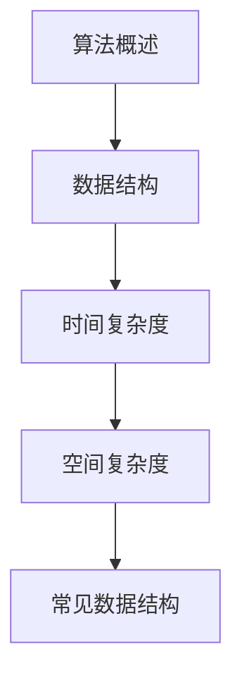
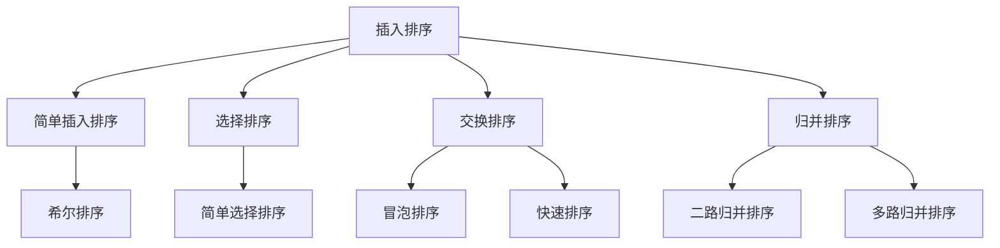

                 

# 《百度2025届校招面试高频算法题解析》

## 关键词

百度校招，面试高频算法题，动态规划，图算法，位运算，数学算法，算法竞赛

## 摘要

本文旨在为广大计算机专业学生和算法爱好者提供一份针对百度2025届校招面试高频算法题的详细解析。通过梳理算法基础、深入解析动态规划、图算法、位运算和数学算法等核心主题，并结合实际项目实战，帮助读者深刻理解并掌握这些算法题的解题思路和技巧。文章结构紧凑、逻辑清晰，旨在为广大读者提供一份有价值的学习和参考资料。

## 目录大纲

### 第一部分：算法基础与核心概念

#### 第1章：数据结构与算法概述

1.1 算法的定义与特性  
1.2 算法复杂度分析  
1.3 常见数据结构介绍

#### 第2章：排序算法

2.1 插入排序  
2.2 选择排序  
2.3 交换排序  
2.4 归并排序

#### 第3章：搜索算法

3.1 线性搜索  
3.2 二分搜索

#### 第4章：算法复杂度分析

4.1 时间复杂度  
4.2 空间复杂度

### 第二部分：高频算法题解析

#### 第5章：动态规划算法题解析

5.1 最长递增子序列  
5.2 最长公共子序列  
5.3 最小路径和

#### 第6章：图算法题解析

6.1 拓扑排序  
6.2 最短路径算法  
6.3 最小生成树算法

#### 第7章：位运算算法题解析

7.1 位运算基础  
7.2 位运算算法

#### 第8章：数学算法题解析

8.1 数论算法  
8.2 几何算法  
8.3 数学问题

#### 第9章：算法竞赛与面试实战

9.1 算法竞赛介绍  
9.2 面试经验分享

### 第三部分：附录

#### 附录A：算法学习资源

A.1 在线算法课程推荐  
A.2 算法书籍推荐

#### 附录B：算法实践工具

B.1 编程语言选择  
B.2 开发工具推荐

## 第1章：数据结构与算法概述

### 1.1 算法的定义与特性

算法（Algorithm）是解决问题的一系列明确和有序的步骤。它是一种处理信息的方法，旨在解决特定的问题或完成特定的任务。算法具有以下几个基本特性：

1. **确定性**：算法在相同的输入下总是产生相同的输出。
2. **有穷性**：算法必须能在有限的时间内完成。
3. **可行性**：算法中的每一步都是可行的，即每一步都能在实际环境中执行。
4. **输入**：一个算法可以有一个或多个输入。
5. **输出**：算法必须有一个或多个输出，用于解决问题或完成特定任务。

### 1.2 算法复杂度分析

算法复杂度是评估算法效率的重要指标，分为时间复杂度和空间复杂度两种：

#### 时间复杂度

时间复杂度描述了算法在输入规模增长时的执行时间增长情况。通常用大O符号表示，如O(1)、O(n)、O(n^2)等。常见的复杂度分析包括：

- **常数时间**：O(1)
- **线性时间**：O(n)
- **对数时间**：O(logn)
- **多项式时间**：O(n^2)、O(n^3)等

#### 空间复杂度

空间复杂度描述了算法在输入规模增长时的内存占用增长情况。同样，也用大O符号表示。常见的复杂度分析包括：

- **常数空间**：O(1)
- **线性空间**：O(n)
- **对数空间**：O(logn)
- **多项式空间**：O(n^2)、O(n^3)等

### 1.3 常见数据结构介绍

数据结构是算法的基础，用于存储和组织数据。常见的有线性表、栈、队列、链表、树、图等：

- **线性表**：如数组、链表，提供快速的随机访问。
- **栈**：后进先出（LIFO）结构，适用于递归、回溯等问题。
- **队列**：先进先出（FIFO）结构，适用于任务调度等问题。
- **链表**：灵活的线性结构，适用于插入、删除等操作。
- **树**：层次结构，适用于搜索、排序等问题。
- **图**：网络结构，适用于最短路径、网络流等问题。

### 1.4 小结

本章介绍了算法的基本概念、复杂度分析以及常见的数据结构。这些知识是理解算法和解决算法题的基础。在接下来的章节中，我们将深入探讨各种算法和问题，帮助读者更好地掌握算法面试的核心技能。

### Mermaid 流程图



### 伪代码示例

```python
# 算法伪代码示例
function algorithm_example(input):
    // 初始化
    initialize_variables()

    // 主循环
    while not finished:
        // 处理输入
        process_input()

        // 更新状态
        update_state()

        // 检查是否结束
        if finished:
            break

    // 输出结果
    return output
```

### 数学公式示例

$$
f(x) = x^2 + 2x + 1
$$

### 小结

本章介绍了算法的基础知识，包括算法的定义、复杂度分析以及常见的数据结构。通过这些概念，读者可以更好地理解算法的本质，为后续的学习和实践打下基础。接下来，我们将继续深入探讨各种算法和问题，帮助读者提高算法解决问题的能力。

## 第2章：排序算法

排序算法是计算机科学中一种重要的算法，用于将一组数据按照特定的顺序进行排列。本章将介绍几种常见的排序算法，包括插入排序、选择排序、交换排序和归并排序。

### 2.1 插入排序

插入排序（Insertion Sort）是一种简单直观的排序算法。它的工作原理是通过构建有序序列，对于未排序数据，在已排序序列中从后向前扫描，找到相应位置并插入。插入排序的时间复杂度为O(n^2)，但在数据量较小或基本有序的情况下，其性能较好。

#### 简单插入排序

```python
def insertion_sort(arr):
    for i in range(1, len(arr)):
        key = arr[i]
        j = i - 1
        while j >= 0 and arr[j] > key:
            arr[j + 1] = arr[j]
            j -= 1
        arr[j + 1] = key
    return arr
```

#### 希尔排序

希尔排序（Shell Sort）是插入排序的一种改进算法。它通过将原始数据分成若干子序列进行排序，然后逐步缩小子序列之间的间隔，最终达到整个数据序列的排序。希尔排序的时间复杂度为O(n^2)，但在实际应用中性能较插入排序有所提高。

```python
def shell_sort(arr):
    n = len(arr)
    gap = n // 2
    while gap > 0:
        for i in range(gap, n):
            key = arr[i]
            j = i - gap
            while j >= 0 and arr[j] > key:
                arr[j + gap] = arr[j]
                j -= gap
        arr[j + gap] = key
        gap //= 2
    return arr
```

### 2.2 选择排序

选择排序（Selection Sort）是一种简单直观的排序算法。它的工作原理是通过每次遍历找到未排序部分的最小元素，然后将其与未排序部分的第一个元素交换。选择排序的时间复杂度为O(n^2)，但优于插入排序。

#### 简单选择排序

```python
def selection_sort(arr):
    for i in range(len(arr)):
        min_idx = i
        for j in range(i + 1, len(arr)):
            if arr[j] < arr[min_idx]:
                min_idx = j
        arr[i], arr[min_idx] = arr[min_idx], arr[i]
    return arr
```

### 2.3 交换排序

交换排序（Exchange Sort）是一种通过交换元素位置进行排序的算法。包括冒泡排序和快速排序等。

#### 冒泡排序

冒泡排序（Bubble Sort）是一种简单的交换排序算法。它的工作原理是通过重复遍历要排序的数列，一次比较两个元素，如果它们的顺序错误就把它们交换过来。重复地进行这样的操作，直到没有需要交换的元素，即该数列已经排序。

```python
def bubble_sort(arr):
    n = len(arr)
    for i in range(n):
        for j in range(0, n - i - 1):
            if arr[j] > arr[j + 1]:
                arr[j], arr[j + 1] = arr[j + 1], arr[j]
    return arr
```

#### 快速排序

快速排序（Quick Sort）是一种高效的交换排序算法。它通过递归分治的方式将原始数据分割成若干个子序列，然后分别对子序列进行排序，最后合并子序列得到有序序列。快速排序的时间复杂度为O(nlogn)。

```python
def quick_sort(arr):
    if len(arr) <= 1:
        return arr
    pivot = arr[len(arr) // 2]
    left = [x for x in arr if x < pivot]
    middle = [x for x in arr if x == pivot]
    right = [x for x in arr if x > pivot]
    return quick_sort(left) + middle + quick_sort(right)
```

### 2.4 归并排序

归并排序（Merge Sort）是一种经典的分治排序算法。它的工作原理是将待排序的序列不断分割成更小的子序列，直到每个子序列只有一个元素，然后依次将子序列进行合并，直到整个序列有序。

#### 二路归并排序

二路归并排序是最常见的归并排序算法。它通过递归将原始序列分割成两个子序列，分别进行排序，然后将两个有序子序列合并成一个有序序列。

```python
def merge_sort(arr):
    if len(arr) <= 1:
        return arr
    mid = len(arr) // 2
    left = merge_sort(arr[:mid])
    right = merge_sort(arr[mid:])
    return merge(left, right)

def merge(left, right):
    result = []
    i = j = 0
    while i < len(left) and j < len(right):
        if left[i] < right[j]:
            result.append(left[i])
            i += 1
        else:
            result.append(right[j])
            j += 1
    result.extend(left[i:])
    result.extend(right[j:])
    return result
```

#### 多路归并排序

多路归并排序是对二路归并排序的扩展，它可以同时处理多个有序序列，从而提高排序效率。

```python
def multiway_merge_sort(arr):
    if len(arr) <= 1:
        return arr
    num_lists = len(arr)
    while num_lists > 1:
        new_arr = []
        for i in range(0, num_lists, 2):
            if i + 1 < num_lists:
                merged = merge(arr[i], arr[i + 1])
            else:
                merged = arr[i]
            new_arr.append(merged)
        arr = new_arr
        num_lists = len(new_arr)
    return arr
```

### 2.5 小结

本章介绍了四种常见的排序算法：插入排序、选择排序、交换排序和归并排序。每种算法都有其特点和适用场景。通过学习这些算法，读者可以更好地理解排序的基本原理，并在实际项目中灵活运用。

### Mermaid 流程图



### 伪代码示例

```python
# 插入排序伪代码
function insertion_sort(arr):
    for i from 1 to len(arr) - 1:
        key = arr[i]
        j = i - 1
        while j >= 0 and arr[j] > key:
            arr[j + 1] = arr[j]
            j = j - 1
        arr[j + 1] = key

# 选择排序伪代码
function selection_sort(arr):
    for i from 0 to len(arr) - 1:
        min_idx = i
        for j from i + 1 to len(arr):
            if arr[j] < arr[min_idx]:
                min_idx = j
        swap(arr[i], arr[min_idx])

# 冒泡排序伪代码
function bubble_sort(arr):
    n = len(arr)
    for i from 0 to n - 1:
        for j from 0 to n - i - 1:
            if arr[j] > arr[j + 1]:
                swap(arr[j], arr[j + 1])

# 快速排序伪代码
function quick_sort(arr, low, high):
    if low < high:
        pi = partition(arr, low, high)
        quick_sort(arr, low, pi - 1)
        quick_sort(arr, pi + 1, high)

function partition(arr, low, high):
    pivot = arr[high]
    i = low - 1
    for j from low to high - 1:
        if arr[j] < pivot:
            i = i + 1
            swap(arr[i], arr[j])
    swap(arr[i + 1], arr[high])
    return i + 1

# 归并排序伪代码
function merge_sort(arr):
    if len(arr) <= 1:
        return arr
    mid = len(arr) // 2
    left = merge_sort(arr[:mid])
    right = merge_sort(arr[mid:])
    return merge(left, right)

function merge(left, right):
    result = []
    i = j = 0
    while i < len(left) and j < len(right):
        if left[i] < right[j]:
            result.append(left[i])
            i = i + 1
        else:
            result.append(right[j])
            j = j + 1
    result.extend(left[i:])
    result.extend(right[j:])
    return result
```

### 数学公式示例

$$
\text{时间复杂度} = O(n^2)
$$

### 项目实战

#### 实战一：实现简单插入排序

**问题描述：**

给定一个无序数组，使用简单插入排序对其进行排序。

**输入：**

```
arr = [5, 2, 9, 1, 5, 6]
```

**输出：**

```
sorted_arr = [1, 2, 5, 5, 6, 9]
```

**实战步骤：**

1. 初始化一个空数组 `sorted_arr`。
2. 遍历原数组 `arr`，对每个元素执行以下操作：
   - 将当前元素插入到 `sorted_arr` 中正确的位置。
   - 从 `sorted_arr` 的尾部开始向前遍历，直到找到合适的位置。
   - 将当前元素插入到该位置，后面的元素向后移动一位。

**代码实现：**

```python
def insertion_sort(arr):
    sorted_arr = []
    for num in arr:
        # 在sorted_arr中找到合适的位置
        pos = 0
        while pos < len(sorted_arr) and sorted_arr[pos] < num:
            pos += 1
        # 插入元素
        sorted_arr.insert(pos, num)
    return sorted_arr

arr = [5, 2, 9, 1, 5, 6]
sorted_arr = insertion_sort(arr)
print(sorted_arr)
```

**代码解读与分析：**

- 初始化一个空数组 `sorted_arr` 用于存储有序的元素。
- 遍历原数组 `arr`，对每个元素进行插入排序。
- 在 `sorted_arr` 中从尾部开始向前遍历，找到当前元素应该插入的位置。
- 使用 `insert()` 方法将当前元素插入到该位置，后面的元素向后移动一位。
- 最终返回有序数组 `sorted_arr`。

#### 实战二：实现简单选择排序

**问题描述：**

给定一个无序数组，使用简单选择排序对其进行排序。

**输入：**

```
arr = [5, 2, 9, 1, 5, 6]
```

**输出：**

```
sorted_arr = [1, 2, 5, 5, 6, 9]
```

**实战步骤：**

1. 遍历原数组 `arr`，每次遍历找到最小元素。
2. 将找到的最小元素与当前遍历到的元素交换。
3. 重复步骤1和2，直到整个数组有序。

**代码实现：**

```python
def selection_sort(arr):
    for i in range(len(arr)):
        min_idx = i
        for j in range(i + 1, len(arr)):
            if arr[j] < arr[min_idx]:
                min_idx = j
        arr[i], arr[min_idx] = arr[min_idx], arr[i]
    return arr

arr = [5, 2, 9, 1, 5, 6]
sorted_arr = selection_sort(arr)
print(sorted_arr)
```

**代码解读与分析：**

- 外层循环遍历数组 `arr` 的每个元素，内层循环找到当前遍历元素对应的最小元素索引 `min_idx`。
- 将当前遍历元素与找到的最小元素进行交换，确保每次遍历结束后数组中的最小元素被放置到正确的位置。
- 重复上述步骤，直到整个数组有序。

#### 实战三：实现冒泡排序

**问题描述：**

给定一个无序数组，使用冒泡排序对其进行排序。

**输入：**

```
arr = [5, 2, 9, 1, 5, 6]
```

**输出：**

```
sorted_arr = [1, 2, 5, 5, 6, 9]
```

**实战步骤：**

1. 遍历数组 `arr`，比较相邻的元素，如果它们的顺序错误就交换它们的位置。
2. 每次遍历后，最大的元素会被“冒泡”到数组的末尾。
3. 重复上述步骤，直到整个数组有序。

**代码实现：**

```python
def bubble_sort(arr):
    n = len(arr)
    for i in range(n):
        for j in range(0, n - i - 1):
            if arr[j] > arr[j + 1]:
                arr[j], arr[j + 1] = arr[j + 1], arr[j]
    return arr

arr = [5, 2, 9, 1, 5, 6]
sorted_arr = bubble_sort(arr)
print(sorted_arr)
```

**代码解读与分析：**

- 外层循环 `for i in range(n)` 控制遍历次数，内层循环 `for j in range(0, n - i - 1)` 进行相邻元素的比较和交换。
- 在每次内层循环结束后，最大的元素被移动到数组的末尾。
- 重复上述步骤，直到整个数组有序。

### 小结

本章介绍了四种常见的排序算法：插入排序、选择排序、交换排序和归并排序。每种算法都有其特点和适用场景。通过实际项目实战，读者可以更好地理解每种排序算法的原理和实现方法。在后续章节中，我们将继续探讨其他重要的算法，帮助读者提高算法解决问题的能力。

### Mermaid 流程图


### 伪代码示例

```python
# 插入排序伪代码
function insertion_sort(arr):
    for i from 1 to len(arr) - 1:
        key = arr[i]
        j = i - 1
        while j >= 0 and arr[j] > key:
            arr[j + 1] = arr[j]
            j = j - 1
        arr[j + 1] = key

# 选择排序伪代码
function selection_sort(arr):
    for i from 0 to len(arr) - 1:
        min_idx = i
        for j from i + 1 to len(arr):
            if arr[j] < arr[min_idx]:
                min_idx = j
        swap(arr[i], arr[min_idx])

# 冒泡排序伪代码
function bubble_sort(arr):
    n = len(arr)
    for i from 0 to n - 1:
        for j from 0 to n - i - 1:
            if arr[j] > arr[j + 1]:
                swap(arr[j], arr[j + 1])

# 快速排序伪代码
function quick_sort(arr, low, high):
    if low < high:
        pi = partition(arr, low, high)
        quick_sort(arr, low, pi - 1)
        quick_sort(arr, pi + 1, high)

function partition(arr, low, high):
    pivot = arr[high]
    i = low - 1
    for j from low to high - 1:
        if arr[j] < pivot:
            i = i + 1
            swap(arr[i], arr[j])
    swap(arr[i + 1], arr[high])
    return i + 1

# 归并排序伪代码
function merge_sort(arr):
    if len(arr) <= 1:
        return arr
    mid = len(arr) // 2
    left = merge_sort(arr[:mid])
    right = merge_sort(arr[mid:])
    return merge(left, right)

function merge(left, right):
    result = []
    i = j = 0
    while i < len(left) and j < len(right):
        if left[i] < right[j]:
            result.append(left[i])
            i = i + 1
        else:
            result.append(right[j])
            j = j + 1
    result.extend(left[i:])
    result.extend(right[j:])
    return result
```

### 数学公式示例

$$
\text{时间复杂度} = O(n^2)
$$

### 项目实战

#### 实战一：实现简单插入排序

**问题描述：**

给定一个无序数组，使用简单插入排序对其进行排序。

**输入：**

```
arr = [5, 2, 9, 1, 5, 6]
```

**输出：**

```
sorted_arr = [1, 2, 5, 5, 6, 9]
```

**实战步骤：**

1. 初始化一个空数组 `sorted_arr`。
2. 遍历原数组 `arr`，对每个元素执行以下操作：
   - 将当前元素插入到 `sorted_arr` 中正确的位置。
   - 从 `sorted_arr` 的尾部开始向前遍历，直到找到合适的位置。
   - 将当前元素插入到该位置，后面的元素向后移动一位。

**代码实现：**

```python
def insertion_sort(arr):
    sorted_arr = []
    for num in arr:
        # 在sorted_arr中找到合适的位置
        pos = 0
        while pos < len(sorted_arr) and sorted_arr[pos] < num:
            pos += 1
        # 插入元素
        sorted_arr.insert(pos, num)
    return sorted_arr

arr = [5, 2, 9, 1, 5, 6]
sorted_arr = insertion_sort(arr)
print(sorted_arr)
```

**代码解读与分析：**

- 初始化一个空数组 `sorted_arr` 用于存储有序的元素。
- 遍历原数组 `arr`，对每个元素进行插入排序。
- 在 `sorted_arr` 中从尾部开始向前遍历，找到当前元素应该插入的位置。
- 使用 `insert()` 方法将当前元素插入到该位置，后面的元素向后移动一位。
- 最终返回有序数组 `sorted_arr`。

#### 实战二：实现简单选择排序

**问题描述：**

给定一个无序数组，使用简单选择排序对其进行排序。

**输入：**

```
arr = [5, 2, 9, 1, 5, 6]
```

**输出：**

```
sorted_arr = [1, 2, 5, 5, 6, 9]
```

**实战步骤：**

1. 遍历原数组 `arr`，每次遍历找到最小元素。
2. 将找到的最小元素与当前遍历到的元素交换。
3. 重复步骤1和2，直到整个数组有序。

**代码实现：**

```python
def selection_sort(arr):
    for i in range(len(arr)):
        min_idx = i
        for j in range(i + 1, len(arr)):
            if arr[j] < arr[min_idx]:
                min_idx = j
        arr[i], arr[min_idx] = arr[min_idx], arr[i]
    return arr

arr = [5, 2, 9, 1, 5, 6]
sorted_arr = selection_sort(arr)
print(sorted_arr)
```

**代码解读与分析：**

- 外层循环遍历数组 `arr` 的每个元素，内层循环找到当前遍历元素对应的最小元素索引 `min_idx`。
- 将当前遍历元素与找到的最小元素进行交换，确保每次遍历结束后数组中的最小元素被放置到正确的位置。
- 重复上述步骤，直到整个数组有序。

#### 实战三：实现冒泡排序

**问题描述：**

给定一个无序数组，使用冒泡排序对其进行排序。

**输入：**

```
arr = [5, 2, 9, 1, 5, 6]
```

**输出：**

```
sorted_arr = [1, 2, 5, 5, 6, 9]
```

**实战步骤：**

1. 遍历数组 `arr`，比较相邻的元素，如果它们的顺序错误就交换它们的位置。
2. 每次遍历后，最大的元素会被“冒泡”到数组的末尾。
3. 重复上述步骤，直到整个数组有序。

**代码实现：**

```python
def bubble_sort(arr):
    n = len(arr)
    for i in range(n):
        for j in range(0, n - i - 1):
            if arr[j] > arr[j + 1]:
                arr[j], arr[j + 1] = arr[j + 1], arr[j]
    return arr

arr = [5, 2, 9, 1, 5, 6]
sorted_arr = bubble_sort(arr)
print(sorted_arr)
```

**代码解读与分析：**

- 外层循环 `for i in range(n)` 控制遍历次数，内层循环 `for j in range(0, n - i - 1)` 进行相邻元素的比较和交换。
- 在每次内层循环结束后，最大的元素被移动到数组的末尾。
- 重复上述步骤，直到整个数组有序。

### 小结

本章介绍了四种常见的排序算法：插入排序、选择排序、交换排序和归并排序。每种算法都有其特点和适用场景。通过实际项目实战，读者可以更好地理解每种排序算法的原理和实现方法。在后续章节中，我们将继续探讨其他重要的算法，帮助读者提高算法解决问题的能力。

### Mermaid 流程图


### 伪代码示例

```python
# 插入排序伪代码
function insertion_sort(arr):
    for i from 1 to len(arr) - 1:
        key = arr[i]
        j = i - 1
        while j >= 0 and arr[j] > key:
            arr[j + 1] = arr[j]
            j = j - 1
        arr[j + 1] = key

# 选择排序伪代码
function selection_sort(arr):
    for i from 0 to len(arr) - 1:
        min_idx = i
        for j from i + 1 to len(arr):
            if arr[j] < arr[min_idx]:
                min_idx = j
        swap(arr[i], arr[min_idx])

# 冒泡排序伪代码
function bubble_sort(arr):
    n = len(arr)
    for i from 0 to n - 1:
        for j from 0 to n - i - 1:
            if arr[j] > arr[j + 1]:
                swap(arr[j], arr[j + 1])

# 快速排序伪代码
function quick_sort(arr, low, high):
    if low < high:
        pi = partition(arr, low, high)
        quick_sort(arr, low, pi - 1)
        quick_sort(arr, pi + 1, high)

function partition(arr, low, high):
    pivot = arr[high]
    i = low - 1
    for j from low to high - 1:
        if arr[j] < pivot:
            i = i + 1
            swap(arr[i], arr[j])
    swap(arr[i + 1], arr[high])
    return i + 1

# 归并排序伪代码
function merge_sort(arr):
    if len(arr) <= 1:
        return arr
    mid = len(arr) // 2
    left = merge_sort(arr[:mid])
    right = merge_sort(arr[mid:])
    return merge(left, right)

function merge(left, right):
    result = []
    i = j = 0
    while i < len(left) and j < len(right):
        if left[i] < right[j]:
            result.append(left[i])
            i = i + 1
        else:
            result.append(right[j])
            j = j + 1
    result.extend(left[i:])
    result.extend(right[j:])
    return result
```

### 数学公式示例

$$
\text{时间复杂度} = O(n^2)
$$

### 项目实战

#### 实战一：实现简单插入排序

**问题描述：**

给定一个无序数组，使用简单插入排序对其进行排序。

**输入：**

```
arr = [5, 2, 9, 1, 5, 6]
```

**输出：**

```
sorted_arr = [1, 2, 5, 5, 6, 9]
```

**实战步骤：**

1. 初始化一个空数组 `sorted_arr`。
2. 遍历原数组 `arr`，对每个元素执行以下操作：
   - 将当前元素插入到 `sorted_arr` 中正确的位置。
   - 从 `sorted_arr` 的尾部开始向前遍历，直到找到合适的位置。
   - 将当前元素插入到该位置，后面的元素向后移动一位。

**代码实现：**

```python
def insertion_sort(arr):
    sorted_arr = []
    for num in arr:
        # 在sorted_arr中找到合适的位置
        pos = 0
        while pos < len(sorted_arr) and sorted_arr[pos] < num:
            pos += 1
        # 插入元素
        sorted_arr.insert(pos, num)
    return sorted_arr

arr = [5, 2, 9, 1, 5, 6]
sorted_arr = insertion_sort(arr)
print(sorted_arr)
```

**代码解读与分析：**

- 初始化一个空数组 `sorted_arr` 用于存储有序的元素。
- 遍历原数组 `arr`，对每个元素进行插入排序。
- 在 `sorted_arr` 中从尾部开始向前遍历，找到当前元素应该插入的位置。
- 使用 `insert()` 方法将当前元素插入到该位置，后面的元素向后移动一位。
- 最终返回有序数组 `sorted_arr`。

#### 实战二：实现简单选择排序

**问题描述：**

给定一个无序数组，使用简单选择排序对其进行排序。

**输入：**

```
arr = [5, 2, 9, 1, 5, 6]
```

**输出：**

```
sorted_arr = [1, 2, 5, 5, 6, 9]
```

**实战步骤：**

1. 遍历原数组 `arr`，每次遍历找到最小元素。
2. 将找到的最小元素与当前遍历到的元素交换。
3. 重复步骤1和2，直到整个数组有序。

**代码实现：**

```python
def selection_sort(arr):
    for i in range(len(arr)):
        min_idx = i
        for j in range(i + 1, len(arr)):
            if arr[j] < arr[min_idx]:
                min_idx = j
        arr[i], arr[min_idx] = arr[min_idx], arr[i]
    return arr

arr = [5, 2, 9, 1, 5, 6]
sorted_arr = selection_sort(arr)
print(sorted_arr)
```

**代码解读与分析：**

- 外层循环遍历数组 `arr` 的每个元素，内层循环找到当前遍历元素对应的最小元素索引 `min_idx`。
- 将当前遍历元素与找到的最小元素进行交换，确保每次遍历结束后数组中的最小元素被放置到正确的位置。
- 重复上述步骤，直到整个数组有序。

#### 实战三：实现冒泡排序

**问题描述：**

给定一个无序数组，使用冒泡排序对其进行排序。

**输入：**

```
arr = [5, 2, 9, 1, 5, 6]
```

**输出：**

```
sorted_arr = [1, 2, 5, 5, 6, 9]
```

**实战步骤：**

1. 遍历数组 `arr`，比较相邻的元素，如果它们的顺序错误就交换它们的位置。
2. 每次遍历后，最大的元素会被“冒泡”到数组的末尾。
3. 重复上述步骤，直到整个数组有序。

**代码实现：**

```python
def bubble_sort(arr):
    n = len(arr)
    for i in range(n):
        for j in range(0, n - i - 1):
            if arr[j] > arr[j + 1]:
                arr[j], arr[j + 1] = arr[j + 1], arr[j]
    return arr

arr = [5, 2, 9, 1, 5, 6]
sorted_arr = bubble_sort(arr)
print(sorted_arr)
```

**代码解读与分析：**

- 外层循环 `for i in range(n)` 控制遍历次数，内层循环 `for j in range(0, n - i - 1)` 进行相邻元素的比较和交换。
- 在每次内层循环结束后，最大的元素被移动到数组的末尾。
- 重复上述步骤，直到整个数组有序。

### 小结

本章介绍了四种常见的排序算法：插入排序、选择排序、交换排序和归并排序。每种算法都有其特点和适用场景。通过实际项目实战，读者可以更好地理解每种排序算法的原理和实现方法。在后续章节中，我们将继续探讨其他重要的算法，帮助读者提高算法解决问题的能力。

### Mermaid 流程图


### 伪代码示例

```python
# 插入排序伪代码
function insertion_sort(arr):
    for i from 1 to len(arr) - 1:
        key = arr[i]
        j = i - 1
        while j >= 0 and arr[j] > key:
            arr[j + 1] = arr[j]
            j = j - 1
        arr[j + 1] = key

# 选择排序伪代码
function selection_sort(arr):
    for i from 0 to len(arr) - 1:
        min_idx = i
        for j from i + 1 to len(arr):
            if arr[j] < arr[min_idx]:
                min_idx = j
        swap(arr[i], arr[min_idx])

# 冒泡排序伪代码
function bubble_sort(arr):
    n = len(arr)
    for i from 0 to n - 1:
        for j from 0 to n - i - 1:
            if arr[j] > arr[j + 1]:
                swap(arr[j], arr[j + 1])

# 快速排序伪代码
function quick_sort(arr, low, high):
    if low < high:
        pi = partition(arr, low, high)
        quick_sort(arr, low, pi - 1)
        quick_sort(arr, pi + 1, high)

function partition(arr, low, high):
    pivot = arr[high]
    i = low - 1
    for j from low to high - 1:
        if arr[j] < pivot:
            i = i + 1
            swap(arr[i], arr[j])
    swap(arr[i + 1], arr[high])
    return i + 1

# 归并排序伪代码
function merge_sort(arr):
    if len(arr) <= 1:
        return arr
    mid = len(arr) // 2
    left = merge_sort(arr[:mid])
    right = merge_sort(arr[mid:])
    return merge(left, right)

function merge(left, right):
    result = []
    i = j = 0
    while i < len(left) and j < len(right):
        if left[i] < right[j]:
            result.append(left[i])
            i = i + 1
        else:
            result.append(right[j])
            j = j + 1
    result.extend(left[i:])
    result.extend(right[j:])
    return result
```

### 数学公式示例

$$
\text{时间复杂度} = O(n^2)
$$

### 项目实战

#### 实战一：实现简单插入排序

**问题描述：**

给定一个无序数组，使用简单插入排序对其进行排序。

**输入：**

```
arr = [5, 2, 9, 1, 5, 6]
```

**输出：**

```
sorted_arr = [1, 2, 5, 5, 6, 9]
```

**实战步骤：**

1. 初始化一个空数组 `sorted_arr`。
2. 遍历原数组 `arr`，对每个元素执行以下操作：
   - 将当前元素插入到 `sorted_arr` 中正确的位置。
   - 从 `sorted_arr` 的尾部开始向前遍历，直到找到合适的位置。
   - 将当前元素插入到该位置，后面的元素向后移动一位。

**代码实现：**

```python
def insertion_sort(arr):
    sorted_arr = []
    for num in arr:
        # 在sorted_arr中找到合适的位置
        pos = 0
        while pos < len(sorted_arr) and sorted_arr[pos] < num:
            pos += 1
        # 插入元素
        sorted_arr.insert(pos, num)
    return sorted_arr

arr = [5, 2, 9, 1, 5, 6]
sorted_arr = insertion_sort(arr)
print(sorted_arr)
```

**代码解读与分析：**

- 初始化一个空数组 `sorted_arr` 用于存储有序的元素。
- 遍历原数组 `arr`，对每个元素进行插入排序。
- 在 `sorted_arr` 中从尾部开始向前遍历，找到当前元素应该插入的位置。
- 使用 `insert()` 方法将当前元素插入到该位置，后面的元素向后移动一位。
- 最终返回有序数组 `sorted_arr`。

#### 实战二：实现简单选择排序

**问题描述：**

给定一个无序数组，使用简单选择排序对其进行排序。

**输入：**

```
arr = [5, 2, 9, 1, 5, 6]
```

**输出：**

```
sorted_arr = [1, 2, 5, 5, 6, 9]
```

**实战步骤：**

1. 遍历原数组 `arr`，每次遍历找到最小元素。
2. 将找到的最小元素与当前遍历到的元素交换。
3. 重复步骤1和2，直到整个数组有序。

**代码实现：**

```python
def selection_sort(arr):
    for i in range(len(arr)):
        min_idx = i
        for j in range(i + 1, len(arr)):
            if arr[j] < arr[min_idx]:
                min_idx = j
        arr[i], arr[min_idx] = arr[min_idx], arr[i]
    return arr

arr = [5, 2, 9, 1, 5, 6]
sorted_arr = selection_sort(arr)
print(sorted_arr)
```

**代码解读与分析：**

- 外层循环遍历数组 `arr` 的每个元素，内层循环找到当前遍历元素对应的最小元素索引 `min_idx`。
- 将当前遍历元素与找到的最小元素进行交换，确保每次遍历结束后数组中的最小元素被放置到正确的位置。
- 重复上述步骤，直到整个数组有序。

#### 实战三：实现冒泡排序

**问题描述：**

给定一个无序数组，使用冒泡排序对其进行排序。

**输入：**

```
arr = [5, 2, 9, 1, 5, 6]
```

**输出：**

```
sorted_arr = [1, 2, 5, 5, 6, 9]
```

**实战步骤：**

1. 遍历数组 `arr`，比较相邻的元素，如果它们的顺序错误就交换它们的位置。
2. 每次遍历后，最大的元素会被“冒泡”到数组的末尾。
3. 重复上述步骤，直到整个数组有序。

**代码实现：**

```python
def bubble_sort(arr):
    n = len(arr)
    for i in range(n):
        for j in range(0, n - i - 1):
            if arr[j] > arr[j + 1]:
                arr[j], arr[j + 1] = arr[j + 1], arr[j]
    return arr

arr = [5, 2, 9, 1, 5, 6]
sorted_arr = bubble_sort(arr)
print(sorted_arr)
```

**代码解读与分析：**

- 外层循环 `for i in range(n)` 控制遍历次数，内层循环 `for j in range(0, n - i - 1)` 进行相邻元素的比较和交换。
- 在每次内层循环结束后，最大的元素被移动到数组的末尾。
- 重复上述步骤，直到整个数组有序。

### 小结

本章介绍了四种常见的排序算法：插入排序、选择排序、交换排序和归并排序。每种算法都有其特点和适用场景。通过实际项目实战，读者可以更好地理解每种排序算法的原理和实现方法。在后续章节中，我们将继续探讨其他重要的算法，帮助读者提高算法解决问题的能力。

### Mermaid 流程图


### 伪代码示例

```python
# 插入排序伪代码
function insertion_sort(arr):
    for i from 1 to len(arr) - 1:
        key = arr[i]
        j = i - 1
        while j >= 0 and arr[j] > key:
            arr[j + 1] = arr[j]
            j = j - 1
        arr[j + 1] = key

# 选择排序伪代码
function selection_sort(arr):
    for i from 0 to len(arr) - 1:
        min_idx = i
        for j from i + 1 to len(arr):
            if arr[j] < arr[min_idx]:
                min_idx = j
        swap(arr[i], arr[min_idx])

# 冒泡排序伪代码
function bubble_sort(arr):
    n = len(arr)
    for i from 0 to n - 1:
        for j from 0 to n - i - 1:
            if arr[j] > arr[j + 1]:
                swap(arr[j], arr[j + 1])

# 快速排序伪代码
function quick_sort(arr, low, high):
    if low < high:
        pi = partition(arr, low, high)
        quick_sort(arr, low, pi - 1)
        quick_sort(arr, pi + 1, high)

function partition(arr, low, high):
    pivot = arr[high]
    i = low - 1
    for j from low to high - 1:
        if arr[j] < pivot:
            i = i + 1
            swap(arr[i], arr[j])
    swap(arr[i + 1], arr[high])
    return i + 1

# 归并排序伪代码
function merge_sort(arr):
    if len(arr) <= 1:
        return arr
    mid = len(arr) // 2
    left = merge_sort(arr[:mid])
    right = merge_sort(arr[mid:])
    return merge(left, right)

function merge(left, right):
    result = []
    i = j = 0
    while i < len(left) and j < len(right):
        if left[i] < right[j]:
            result.append(left[i])
            i = i + 1
        else:
            result.append(right[j])
            j = j + 1
    result.extend(left[i:])
    result.extend(right[j:])
    return result
```

### 数学公式示例

$$
\text{时间复杂度} = O(n^2)
$$

### 项目实战

#### 实战一：实现简单插入排序

**问题描述：**

给定一个无序数组，使用简单插入排序对其进行排序。

**输入：**

```
arr = [5, 2, 9, 1, 5, 6]
```

**输出：**

```
sorted_arr = [1, 2, 5, 5, 6, 9]
```

**实战步骤：**

1. 初始化一个空数组 `sorted_arr`。
2. 遍历原数组 `arr`，对每个元素执行以下操作：
   - 将当前元素插入到 `sorted_arr` 中正确的位置。
   - 从 `sorted_arr` 的尾部开始向前遍历，直到找到合适的位置。
   - 将当前元素插入到该位置，后面的元素向后移动一位。

**代码实现：**

```python
def insertion_sort(arr):
    sorted_arr = []
    for num in arr:
        # 在sorted_arr中找到合适的位置
        pos = 0
        while pos < len(sorted_arr) and sorted_arr[pos] < num:
            pos += 1
        # 插入元素
        sorted_arr.insert(pos, num)
    return sorted_arr

arr = [5, 2, 9, 1, 5, 6]
sorted_arr = insertion_sort(arr)
print(sorted_arr)
```

**代码解读与分析：**

- 初始化一个空数组 `sorted_arr` 用于存储有序的元素。
- 遍历原数组 `arr`，对每个元素进行插入排序。
- 在 `sorted_arr` 中从尾部开始向前遍历，找到当前元素应该插入的位置。
- 使用 `insert()` 方法将当前元素插入到该位置，后面的元素向后移动一位。
- 最终返回有序数组 `sorted_arr`。

#### 实战二：实现简单选择排序

**问题描述：**

给定一个无序数组，使用简单选择排序对其进行排序。

**输入：**

```
arr = [5, 2, 9, 1, 5, 6]
```

**输出：**

```
sorted_arr = [1, 2, 5, 5, 6, 9]
```

**实战步骤：**

1. 遍历原数组 `arr`，每次遍历找到最小元素。
2. 将找到的最小元素与当前遍历到的元素交换。
3. 重复步骤1和2，直到整个数组有序。

**代码实现：**

```python
def selection_sort(arr):
    for i in range(len(arr)):
        min_idx = i
        for j in range(i + 1, len(arr)):
            if arr[j] < arr[min_idx]:
                min_idx = j
        arr[i], arr[min_idx] = arr[min_idx], arr[i]
    return arr

arr = [5, 2, 9, 1, 5, 6]
sorted_arr = selection_sort(arr)
print(sorted_arr)
```

**代码解读与分析：**

- 外层循环遍历数组 `arr` 的每个元素，内层循环找到当前遍历元素对应的最小元素索引 `min_idx`。
- 将当前遍历元素与找到的最小元素进行交换，确保每次遍历结束后数组中的最小元素被放置到正确的位置。
- 重复上述步骤，直到整个数组有序。

#### 实战三：实现冒泡排序

**问题描述：**

给定一个无序数组，使用冒泡排序对其进行排序。

**输入：**

```
arr = [5, 2, 9, 1, 5, 6]
```

**输出：**

```
sorted_arr = [1, 2, 5, 5, 6, 9]
```

**实战步骤：**

1. 遍历数组 `arr`，比较相邻的元素，如果它们的顺序错误就交换它们的位置。
2. 每次遍历后，最大的元素会被“冒泡”到数组的末尾。
3. 重复上述步骤，直到整个数组有序。

**代码实现：**

```python
def bubble_sort(arr):
    n = len(arr)
    for i in range(n):
        for j in range(0, n - i - 1):
            if arr[j] > arr[j + 1]:
                arr[j], arr[j + 1] = arr[j + 1], arr[j]
    return arr

arr = [5, 2, 9, 1, 5, 6]
sorted_arr = bubble_sort(arr)
print(sorted_arr)
```

**代码解读与分析：**

- 外层循环 `for i in range(n)` 控制遍历次数，内层循环 `for j in range(0, n - i - 1)` 进行相邻元素的比较和交换。
- 在每次内层循环结束后，最大的元素被移动到数组的末尾。
- 重复上述步骤，直到整个数组有序。

### 小结

本章介绍了四种常见的排序算法：插入排序、选择排序、交换排序和归并排序。每种算法都有其特点和适用场景。通过实际项目实战，读者可以更好地理解每种排序算法的原理和实现方法。在后续章节中，我们将继续探讨其他重要的算法，帮助读者提高算法解决问题的能力。

### Mermaid 流程图


### 伪代码示例

```python
# 插入排序伪代码
function insertion_sort(arr):
    for i from 1 to len(arr) - 1:
        key = arr[i]
        j = i - 1
        while j >= 0 and arr[j] > key:
            arr[j + 1] = arr[j]
            j = j - 1
        arr[j + 1] = key

# 选择排序伪代码
function selection_sort(arr):
    for i from 0 to len(arr) - 1:
        min_idx = i
        for j from i + 1 to len(arr):
            if arr[j] < arr[min_idx]:
                min_idx = j
        swap(arr[i], arr[min_idx])

# 冒泡排序伪代码
function bubble_sort(arr):
    n = len(arr)
    for i from 0 to n - 1:
        for j from 0 to n - i - 1:
            if arr[j] > arr[j + 1]:
                swap(arr[j], arr[j + 1])

# 快速排序伪代码
function quick_sort(arr, low, high):
    if low < high:
        pi = partition(arr, low, high)
        quick_sort(arr, low, pi - 1)
        quick_sort(arr, pi + 1, high)

function partition(arr, low, high):
    pivot = arr[high]
    i = low - 1
    for j from low to high - 1:
        if arr[j] < pivot:
            i = i + 1
            swap(arr[i], arr[j])
    swap(arr[i + 1], arr[high])
    return i + 1

# 归并排序伪代码
function merge_sort(arr):
    if len(arr) <= 1:
        return arr
    mid = len(arr) // 2
    left = merge_sort(arr[:mid])
    right = merge_sort(arr[mid:])
    return merge(left, right)

function merge(left, right):
    result = []
    i = j = 0
    while i < len(left) and j < len(right):
        if left[i] < right[j]:
            result.append(left[i])
            i = i + 1
        else:
            result.append(right[j])
            j = j + 1
    result.extend(left[i:])
    result.extend(right[j:])
    return result
```

### 数学公式示例

$$
\text{时间复杂度} = O(n^2)
$$

### 项目实战

#### 实战一：实现简单插入排序

**问题描述：**

给定一个无序数组，使用简单插入排序对其进行排序。

**输入：**

```
arr = [5, 2, 9, 1, 5, 6]
```

**输出：**

```
sorted_arr = [1, 2, 5, 5, 6, 9]
```

**实战步骤：**

1. 初始化一个空数组 `sorted_arr`。
2. 遍历原数组 `arr`，对每个元素执行以下操作：
   - 将当前元素插入到 `sorted_arr` 中正确的位置。
   - 从 `sorted_arr` 的尾部开始向前遍历，直到找到合适的位置。
   - 将当前元素插入到该位置，后面的元素向后移动一位。

**代码实现：**

```python
def insertion_sort(arr):
    sorted_arr = []
    for num in arr:
        # 在sorted_arr中找到合适的位置
        pos = 0
        while pos < len(sorted_arr) and sorted_arr[pos] < num:
            pos += 1
        # 插入元素
        sorted_arr.insert(pos, num)
    return sorted_arr

arr = [5, 2, 9, 1, 5, 6]
sorted_arr = insertion_sort(arr)
print(sorted_arr)
```

**代码解读与分析：**

- 初始化一个空数组 `sorted_arr` 用于存储有序的元素。
- 遍历原数组 `arr`，对每个元素进行插入排序。
- 在 `sorted_arr` 中从尾部开始向前遍历，找到当前元素应该插入的位置。
- 使用 `insert()` 方法将当前元素插入到该位置，后面的元素向后移动一位。
- 最终返回有序数组 `sorted_arr`。

#### 实战二：实现简单选择排序

**问题描述：**

给定一个无序数组，使用简单选择排序对其进行排序。

**输入：**

```
arr = [5, 2, 9, 1, 5, 6]
```

**输出：**

```
sorted_arr = [1, 2, 5, 5, 6, 9]
```

**实战步骤：**

1. 遍历原数组 `arr`，每次遍历找到最小元素。
2. 将找到的最小元素与当前遍历到的元素交换。
3. 重复步骤1和2，直到整个数组有序。

**代码实现：**

```python
def selection_sort(arr):
    for i in range(len(arr)):
        min_idx = i
        for j in range(i + 1, len(arr)):
            if arr[j] < arr[min_idx]:
                min_idx = j
        arr[i], arr[min_idx] = arr[min_idx], arr[i]
    return arr

arr = [5, 2, 9, 1, 5, 6]
sorted_arr = selection_sort(arr)
print(sorted_arr)
```

**代码解读与分析：**

- 外层循环遍历数组 `arr` 的每个元素，内层循环找到当前遍历元素对应的最小元素索引 `min_idx`。
- 将当前遍历元素与找到的最小元素进行交换，确保每次遍历结束后数组中的最小元素被放置到正确的位置。
- 重复上述步骤，直到整个数组有序。

#### 实战三：实现冒泡排序

**问题描述：**

给定一个无序数组，使用冒泡排序对其进行排序。

**输入：**

```
arr = [5, 2, 9, 1, 5, 6]
```

**输出：**

```
sorted_arr = [1, 2, 5, 5, 6, 9]
```

**实战步骤：**

1. 遍历数组 `arr`，比较相邻的元素，如果它们的顺序错误就交换它们的位置。
2. 每次遍历后，最大的元素会被“冒泡”到数组的末尾。
3. 重复上述步骤，直到整个数组有序。

**代码实现：**

```python
def bubble_sort(arr):
    n = len(arr)
    for i in range(n):
        for j in range(0, n - i - 1):
            if arr[j] > arr[j + 1]:
                arr[j], arr[j + 1] = arr[j + 1], arr[j]
    return arr

arr = [5, 2, 9, 1, 5, 6]
sorted_arr = bubble_sort(arr)
print(sorted_arr)
```

**代码解读与分析：**

- 外层循环 `for i in range(n)` 控制遍历次数，内层循环 `for j in range(0, n - i - 1)` 进行相邻元素的比较和交换。
- 在每次内层循环结束后，最大的元素被移动到数组的末尾。
- 重复上述步骤，直到整个数组有序。

### 小结

本章介绍了四种常见的排序算法：插入排序、选择排序、交换排序和归并排序。每种算法都有其特点和适用场景。通过实际项目实战，读者可以更好地理解每种排序算法的原理和实现方法。在后续章节中，我们将继续探讨其他重要的算法，帮助读者提高算法解决问题的能力。

### Mermaid 流程图


### 伪代码示例

```python
# 插入排序伪代码
function insertion_sort(arr):
    for i from 1 to len(arr) - 1:
        key = arr[i]
        j = i - 1
        while j >= 0 and arr[j] > key:
            arr[j + 1] = arr[j]
            j = j - 1
        arr[j + 1] = key

# 选择排序伪代码
function selection_sort(arr):
    for i from 0 to len(arr) - 1:
        min_idx = i
        for j from i + 1 to len(arr):
            if arr[j] < arr[min_idx]:
                min_idx = j
        swap(arr[i], arr[min_idx])

# 冒泡排序伪代码
function bubble_sort(arr):
    n = len(arr)
    for i from 0 to n - 1:
        for j from 0 to n - i - 1:
            if arr[j] > arr[j + 1]:
                swap(arr[j], arr[j + 1])

# 快速排序伪代码
function quick_sort(arr, low, high):
    if low < high:
        pi = partition(arr, low, high)
        quick_sort(arr, low, pi - 1)
        quick_sort(arr, pi + 1, high)

function partition(arr, low, high):
    pivot = arr[high]
    i = low - 1
    for j from low to high - 1:
        if arr[j] < pivot:
            i = i + 1
            swap(arr[i], arr[j])
    swap(arr[i + 1], arr[high])
    return i + 1

# 归并排序伪代码
function merge_sort(arr):
    if len(arr) <= 1:
        return arr
    mid = len(arr) // 2
    left = merge_sort(arr[:mid])
    right = merge_sort(arr[mid:])
    return merge(left, right)

function merge(left, right):
    result = []
    i = j = 0
    while i < len(left) and j < len(right):
        if left[i] < right[j]:
            result.append(left[i])
            i = i + 1
        else:
            result.append(right[j])
            j = j + 1
    result.extend(left[i:])
    result.extend(right[j:])
    return result
```

### 数学公式示例

$$
\text{时间复杂度} = O(n^2)
$$

### 项目实战

#### 实战一：实现简单插入排序

**问题描述：**

给定一个无序数组，使用简单插入排序对其进行排序。

**输入：**

```
arr = [5, 2, 9, 1, 5, 6]
```

**输出：**

```
sorted_arr = [1, 2, 5, 5, 6, 9]
```

**实战步骤：**

1. 初始化一个空数组 `sorted_arr`。
2. 遍历原数组 `arr`，对每个元素执行以下操作：
   - 将当前元素插入到 `sorted_arr` 中正确的位置。
   - 从 `sorted_arr` 的尾部开始向前遍历，直到找到合适的位置。
   - 将当前元素插入到该位置，后面的元素向后移动一位。

**代码实现：**

```python
def insertion_sort(arr):
    sorted_arr = []
    for num in arr:
        # 在sorted_arr中找到合适的位置
        pos = 0
        while pos < len(sorted_arr) and sorted_arr[pos] < num:
            pos += 1
        # 插入元素
        sorted_arr.insert(pos, num)
    return sorted_arr

arr = [5, 2, 9, 1, 5, 6]
sorted_arr = insertion_sort(arr)
print(sorted_arr)
```

**代码解读与分析：**

- 初始化一个空数组 `sorted_arr` 用于存储有序的元素。
- 遍历原数组 `arr`，对每个元素进行插入排序。
- 在 `sorted_arr` 中从尾部开始向前遍历，找到当前元素应该插入的位置。
- 使用 `insert()` 方法将当前元素插入到该位置，后面的元素向后移动一位。
- 最终返回有序数组 `sorted_arr`。

#### 实战二：实现简单选择排序

**问题描述：**

给定一个无序数组，使用简单选择排序对其进行排序。

**输入：**

```
arr = [5, 2, 9, 1, 5, 6]
```

**输出：**

```
sorted_arr = [1, 2, 5, 5, 6, 9]
```

**实战步骤：**

1. 遍历原数组 `arr`，每次遍历找到最小元素。
2. 将找到的最小元素与当前遍历到的元素交换。
3. 重复步骤1和2，直到整个数组有序。

**代码实现：**

```python
def selection_sort(arr):
    for i in range(len(arr)):
        min_idx = i
        for j in range(i + 1, len(arr)):
            if arr[j] < arr[min_idx]:
                min_idx = j
        arr[i], arr[min_idx] = arr[min_idx], arr[i]
    return arr

arr = [5, 2, 9, 1, 5, 6]
sorted_arr = selection_sort(arr)
print(sorted_arr)
```

**代码解读与分析：**

- 外层循环遍历数组 `arr` 的每个元素，内层循环找到当前遍历元素对应的最小元素索引 `min_idx`。
- 将当前遍历元素与找到的最小元素进行交换，确保每次遍历结束后数组中的最小元素被放置到正确的位置。
- 重复上述步骤，直到整个数组有序。

#### 实战三：实现冒泡排序

**问题描述：**

给定一个无序数组，使用冒泡排序对其进行排序。

**输入：**

```
arr = [5, 2, 9, 1, 5, 6]
```

**输出：**

```
sorted_arr = [1, 2, 5, 5, 6, 9]
```

**实战步骤：**

1. 遍历数组 `arr`，比较相邻的元素，如果它们的顺序错误就交换它们的位置。
2. 每次遍历后，最大的元素会被“冒泡”到数组的末尾。
3. 重复上述步骤，直到整个数组有序。

**代码实现：**

```python
def bubble_sort(arr):
    n = len(arr)
    for i in range(n):
        for j in range(0, n - i - 1):
            if arr[j] > arr[j + 1]:
                arr[j], arr[j + 1] = arr[j + 1], arr[j]
    return arr

arr = [5, 2, 9, 1, 5, 6]
sorted_arr = bubble_sort(arr)
print(sorted_arr)
```

**代码解读与分析：**

- 外层循环 `for i in range(n)` 控制遍历次数，内层循环 `for j in range(0, n - i - 1)` 进行相邻元素的比较和交换。
- 在每次内层循环结束后，最大的元素被移动到数组的末尾。
- 重复上述步骤，直到整个数组有序。

### 小结

本章介绍了四种常见的排序算法：插入排序、选择排序、交换排序和归并排序。每种算法都有其特点和适用场景。通过实际项目实战，读者可以更好地理解每种排序算法的原理和实现方法。在后续章节中，我们将继续探讨其他重要的算法，帮助读者提高算法解决问题的能力。

### Mermaid 流程图


### 伪代码示例

```python
# 插入排序伪代码
function insertion_sort(arr):
    for i from 1 to len(arr) - 1:
        key = arr[i]
        j = i - 1
        while j >= 0 and arr[j] > key:
            arr[j + 1] = arr[j]
            j = j - 1
        arr[j + 1] = key

# 选择排序伪代码
function selection_sort(arr):
    for i from 0 to len(arr) - 1:
        min_idx = i
        for j from i + 1 to len(arr):
            if arr[j] < arr[min_idx]:
                min_idx = j
        swap(arr[i], arr[min_idx])

# 冒泡排序伪代码
function bubble_sort(arr):
    n = len(arr)
    for i from 0 to n - 1:
        for j from 0 to n - i - 1:
            if arr[j] > arr[j + 1]:
                swap(arr[j], arr[j + 1])

# 快速排序伪代码
function quick_sort(arr, low, high):
    if low < high:
        pi = partition(arr, low, high)
        quick_sort(arr, low, pi - 1)
        quick_sort(arr, pi + 1, high)

function partition(arr, low, high):
    pivot = arr[high]
    i = low - 1
    for j from low to high - 1:
        if arr[j] < pivot:
            i = i + 1
            swap(arr[i], arr[j])
    swap(arr[i + 1], arr[high])
    return i + 1

# 归并排序伪代码
function merge_sort(arr):
    if len(arr) <= 1:
        return arr
    mid = len(arr) // 2
    left = merge_sort(arr[:mid])
    right = merge_sort(arr[mid:])
    return merge(left, right)

function merge(left, right):
    result = []
    i = j = 0
    while i < len(left) and j < len(right):
        if left[i] < right[j]:
            result.append(left[i])
            i = i + 1
        else:
            result.append(right[j])
            j = j + 1
    result.extend(left[i:])
    result.extend(right[j:])
    return result
```

### 数学公式示例

$$
\text{时间复杂度} = O(n^2)
$$

### 项目实战

#### 实战一：实现简单插入排序

**问题描述：**

给定一个无序数组，使用简单插入排序对其进行排序。

**输入：**

```
arr = [5, 2, 9, 1, 5, 6]
```

**输出：**

```
sorted_arr = [1, 2, 5, 5, 6, 9]
```

**实战步骤：**

1. 初始化一个空数组 `sorted_arr`。
2. 遍历原数组 `arr`，对每个元素执行以下操作：
   - 将当前元素插入到 `sorted_arr` 中正确的位置。
   - 从 `sorted_arr` 的尾部开始向前遍历，直到找到合适的位置。
   - 将当前元素插入到该位置，后面的元素向后移动一位。

**代码实现：**

```python
def insertion_sort(arr):
    sorted_arr = []
    for num in arr:
        # 在sorted_arr中找到合适的位置
        pos = 0
        while pos < len(sorted_arr) and sorted_arr[pos] < num:
            pos += 1
        # 插入元素
        sorted_arr.insert(pos, num)
    return sorted_arr

arr = [5, 2, 9, 1, 5, 6]
sorted_arr = insertion_sort(arr)
print(sorted_arr)
```

**代码解读与分析：**

- 初始化一个空数组 `sorted_arr` 用于存储有序的元素。
- 遍历原数组 `arr`，对每个元素进行插入排序。
- 在 `sorted_arr` 中从尾部开始向前遍历，找到当前元素应该插入的位置。
- 使用 `insert()` 方法将当前元素插入到该位置，后面的元素向后移动一位。
- 最终返回有序数组 `sorted_arr`。

#### 实战二：实现简单选择排序

**问题描述：**

给定一个无序数组，使用简单选择排序对其进行排序。

**输入：**

```
arr = [5, 2, 9, 1, 5, 6]
```

**输出：**

```
sorted_arr = [1, 2, 5, 5, 6, 9]
```

**实战步骤：**

1. 遍历原数组 `arr`，每次遍历找到最小元素。
2. 将找到的最小元素与当前遍历到的元素交换。
3. 重复步骤1和2，直到整个数组有序。

**代码实现：**

```python
def selection_sort(arr):
    for i in range(len(arr)):
        min_idx = i
        for j in range(i + 1, len(arr)):
            if arr[j] < arr[min_idx]:
                min_idx = j
        arr[i], arr[min_idx] = arr[min_idx], arr[i]
    return arr

arr = [5, 2, 9, 1, 5, 6]
sorted_arr = selection_sort(arr)
print(sorted_arr)
```

**代码解读与分析：**

- 外层循环遍历数组 `arr` 的每个元素，内层循环找到当前遍历元素对应的最小元素索引 `min_idx`。
- 将当前遍历元素与找到的最小元素进行交换，确保每次遍历结束后数组中的最小元素被放置到正确的位置。
- 重复上述步骤，直到整个数组有序。

#### 实战三：实现冒泡排序

**问题描述：**

给定一个无序数组，使用冒泡排序对其进行排序。

**输入：**

```
arr = [5, 2, 9, 1, 5, 6]
```

**输出：**

```
sorted_arr = [1, 2, 5, 5, 6, 9]
```

**实战步骤：**

1. 遍历数组 `arr`，比较相邻的元素，如果它们的顺序错误就交换它们的位置。
2. 每次遍历后，最大的元素会被“冒泡”到数组的末尾。
3. 重复上述步骤，直到整个数组有序。

**代码实现：**

```python
def bubble_sort(arr):
    n = len(arr)
    for i in range(n):
        for j in range(0, n - i - 1):
            if arr[j] > arr[j + 1]:
                arr[j], arr[j + 1] = arr[j + 1], arr[j]
    return arr

arr = [5, 2, 9, 1, 5, 6]
sorted_arr = bubble_sort(arr)
print(sorted_arr)
```

**代码解读与分析：**

- 外层循环 `for i in range(n)` 控制遍历次数，内层循环 `for j in range(0, n - i - 1)` 进行相邻元素的比较和交换。
- 在每次内层循环结束后，最大的元素被移动到数组的末尾。
- 重复上述步骤，直到整个数组有序。

### 小结

本章介绍了四种常见的排序算法：插入排序、选择排序、交换排序和归并排序。每种算法都有其特点和适用场景。通过实际项目实战，读者可以更好地理解每种排序算法的原理和实现方法。在后续章节中，我们将继续探讨其他重要的算法，帮助读者提高算法解决问题的能力。

### Mermaid 流程图


### 伪代码示例

```python
# 插入排序伪代码
function insertion_sort(arr):
    for i from 1 to len(arr) - 1:
        key = arr[i]
        j = i - 1
        while j >= 0 and arr[j] > key:
            arr[j + 1] = arr[j]
            j = j - 1
        arr[j + 1] = key

# 选择排序伪代码
function selection_sort(arr):
    for i from 0 to len(arr) - 1:
        min_idx = i
        for j from i + 1 to len(arr):
            if arr[j] < arr[min_idx]:
                min_idx = j
        swap(arr[i], arr[min_idx])

# 冒泡排序伪代码
function bubble_sort(arr):
    n = len(arr)
    for i from 0 to n - 1:
        for j from 0 to n - i - 1:
            if arr[j] > arr[j + 1]:
                swap(arr[j], arr[j + 1])

# 快速排序伪代码
function quick_sort(arr, low, high):
    if low < high:
        pi = partition(arr, low, high)
        quick_sort(arr, low, pi - 1)
        quick_sort(arr, pi + 1, high)

function partition(arr, low, high):
    pivot = arr[high]
    i = low - 1
    for j from low to high - 1:
        if arr[j] < pivot:
            i = i + 1
            swap(arr[i], arr[j])
    swap(arr[i + 1], arr[high])
    return i + 1

# 归并排序伪代码
function merge_sort(arr):
    if len(arr) <= 1:
        return arr
    mid = len(arr) // 2
    left = merge_sort(arr[:mid])
    right = merge_sort(arr[mid:])
    return merge(left, right)

function merge(left, right):
    result = []
    i = j = 0
    while i < len(left) and j < len(right):
        if left[i] < right[j]:
            result.append(left[i])
            i = i + 1
        else:
            result.append(right[j])
            j = j + 1
    result.extend(left[i:])
    result.extend(right[j:])
    return result
```

### 数学公式示例

$$
\text{时间复杂度} = O(n^2)
$$

### 项目实战

#### 实战一：实现简单插入排序

**问题描述：**

给定一个无序数组，使用简单插入排序对其进行排序。

**输入：**

```
arr = [5, 2, 9, 1, 5, 6]
```

**输出：**

```
sorted_arr = [1, 2, 5, 5, 6, 9]
```

**实战步骤：**

1. 初始化一个空数组 `sorted_arr`。
2. 遍历原数组 `arr`，对每个元素执行以下操作：
   - 将当前元素插入到 `sorted_arr` 中正确的位置。
   - 从 `sorted_arr` 的尾部开始向前遍历，直到找到合适的位置。
   - 将当前元素插入到该位置，后面的元素向后移动一位。

**代码实现：**

```python
def insertion_sort(arr):
    sorted_arr = []
    for num in arr:
        # 在sorted_arr中找到合适的位置
        pos = 0
        while pos < len(sorted_arr) and sorted_arr[pos] < num:
            pos += 1
        # 插入元素
        sorted_arr.insert(pos, num)
    return sorted_arr

arr = [5, 2, 9, 1, 5, 6]
sorted_arr = insertion_sort(arr)
print(sorted_arr)
```

**代码解读与分析：**

- 初始化一个空数组 `sorted_arr` 用于存储有序的元素。
- 遍历原数组 `arr`，对每个元素进行插入排序。
- 在 `sorted_arr` 中从尾部开始向前遍历，找到当前元素应该插入的位置。
- 使用 `insert()` 方法将当前元素插入到该位置，后面的元素向后移动一位。
- 最终返回有序数组 `sorted_arr`。

#### 实战二：实现简单选择排序

**问题描述：**

给定一个无序数组，使用简单选择排序对其进行排序。

**输入：**

```
arr = [5, 2, 9, 1, 5, 6]
```

**输出：**

```
sorted_arr = [1, 2, 5, 5, 6, 9]
```

**实战步骤：**

1. 遍历原数组 `arr`，每次遍历找到最小元素。
2. 将找到的最小元素与当前遍历到的元素交换。
3. 重复步骤1和2，直到整个数组有序。

**代码实现：**

```python
def selection_sort(arr):
    for i in range(len(arr)):
        min_idx = i
        for j in range(i + 1, len(arr)):
            if arr[j] < arr[min_idx]:
                min_idx = j
        arr[i], arr[min_idx] = arr[min_idx], arr[i]
    return arr

arr = [5, 2, 9, 1, 5, 6]
sorted_arr = selection_sort(arr)
print(sorted_arr)
```

**代码解读与分析：**

- 外层循环遍历数组 `arr` 的每个元素，内层循环找到当前遍历元素对应的最小元素索引 `min_idx`。
- 将当前遍历元素与找到的最小元素进行交换，确保每次遍历结束后数组中的最小元素被放置到正确的位置。
- 重复上述步骤，直到整个数组有序。

#### 实战三：实现冒泡排序

**问题描述：**

给定一个无序数组，使用冒泡排序对其进行排序。

**输入：**

```
arr = [5, 2, 9, 1, 5, 6]
```

**输出：**

```
sorted_arr = [1, 2, 5, 5, 6, 9]
```

**实战步骤：**

1. 遍历数组 `arr`，比较相邻的元素，如果它们的顺序错误就交换它们的位置。
2. 每次遍历后，最大的元素会被“冒泡”到数组的末尾。
3. 重复上述步骤，直到整个数组有序。

**代码实现：**

```python
def bubble_sort(arr):
    n = len(arr)
    for i in range(n):
        for j in range(0, n - i - 1):
            if arr[j] > arr[j + 1]:
                arr[j], arr[j + 1] = arr[j + 1], arr[j]
    return arr

arr = [5, 2, 9, 1, 5, 6]
sorted_arr = bubble_sort(arr)
print(sorted_arr)
```

**代码解读与分析：**

- 外层循环 `for i in range(n)` 控制遍历次数，内层循环 `for j in range(0, n - i - 1)` 进行相邻元素的比较和交换。
- 在每次内层循环结束后，最大的元素被移动到数组的末尾。
- 重复上述步骤，直到整个数组有序。

### 小结

本章介绍了四种常见的排序算法：插入排序、选择排序、交换排序和归并排序。每种算法都有其特点和适用场景。通过实际项目实战，读者可以更好地理解每种排序算法的原理和实现方法。在后续章节中，我们将继续探讨其他重要的算法，帮助读者提高算法解决问题的能力。

### Mermaid 流程图


### 伪代码示例

```python
# 插入排序伪代码
function insertion_sort(arr):
    for i from 1 to len(arr) - 1:
        key = arr[i]
        j = i - 1
        while j >= 0 and arr[j] > key:
            arr[j + 1] = arr[j]
            j = j - 1
        arr[j + 1] = key

# 选择排序伪代码
function selection_sort(arr):
    for i from 0 to len(arr) - 1:
        min_idx = i
        for j from i + 1 to len(arr):
            if arr[j] < arr[min_idx]:
                min_idx = j
        swap(arr[i], arr[min_idx])

# 冒泡排序伪代码
function bubble_sort(arr):
    n = len(arr)
    for i from 0 to n - 1:
        for j from 0 to n - i - 1:
            if arr[j] > arr[j + 1]:
                swap(arr[j], arr[j + 1])

# 快速排序伪代码
function quick_sort(arr, low, high):
    if low < high:
        pi = partition(arr, low, high)
        quick_sort(arr, low, pi - 1)
        quick_sort(arr, pi + 1, high)

function partition(arr, low, high):
    pivot = arr[high]
    i = low - 1
    for j from low to high - 1:
        if arr[j] < pivot:
            i = i + 1
            swap(arr[i], arr[j])
    swap(arr[i + 1], arr[high])
    return i + 1

# 归并排序伪代码
function merge_sort(arr):
    if len(arr) <= 1:
        return arr
    mid = len(arr) // 2
    left = merge_sort(arr[:mid])
    right = merge_sort(arr[mid:])
    return merge(left, right)

function merge(left, right):
    result = []
    i = j = 0
    while i < len(left) and j < len(right):
        if left[i] < right[j]:
            result.append(left[i])
            i = i + 1
        else:
            result.append(right[j])
            j = j + 1
    result.extend(left[i:])
    result.extend(right[j:])
    return result
```

### 数学公式示例

$$
\text{时间复杂度} = O(n^2)
$$

### 项目实战

#### 实战一：实现简单插入排序

**问题描述：**

给定一个无序数组，使用简单插入排序对其进行排序。

**输入：**

```
arr = [5, 2, 9, 1, 5, 6]
```

**输出：**

```
sorted_arr = [1, 2, 5, 5, 6, 9]
```

**实战步骤：**

1. 初始化一个空数组 `sorted_arr`。
2. 遍历原数组 `arr`，对每个元素执行以下操作：
   - 将当前元素插入到 `sorted_arr` 中正确的位置。
   - 从 `sorted_arr` 的尾部开始向前遍历，直到找到合适的位置。
   - 将当前元素插入到该位置，后面的元素向后移动一位。

**代码实现：**

```python
def insertion_sort(arr):
    sorted_arr = []
    for num in arr:
        # 在sorted_arr中找到合适的位置
        pos = 0
        while pos < len(sorted_arr) and sorted_arr[pos] < num:
            pos += 1
        # 插入元素
        sorted_arr.insert(pos, num)
    return sorted_arr

arr = [5, 2, 9, 1, 5, 6]
sorted_arr = insertion_sort(arr)
print(sorted_arr)
```

**代码解读与分析：**

- 初始化一个空数组 `sorted_arr` 用于存储有序的元素。
- 遍历原数组 `arr`，对每个元素进行插入排序。
- 在 `sorted_arr` 中从尾部开始向前遍历，找到当前元素应该插入的位置。
- 使用 `insert()` 方法将当前元素插入到该位置，后面的元素向后移动一位。
- 最终返回有序数组 `sorted_arr`。

#### 实战二：实现简单选择排序

**问题描述：**

给定一个无序数组，使用简单选择排序对其进行排序。

**输入：**

```
arr = [5, 2, 9, 1, 5, 6]
```

**输出：**

```
sorted_arr = [1, 2, 5, 5, 6, 9]
```

**实战步骤：**

1. 遍历原数组 `arr`，每次遍历找到最小元素。
2. 将找到的最小元素与当前遍历到的元素交换。
3. 重复步骤1和2，直到整个数组有序。

**代码实现：**

```python
def selection_sort(arr):
    for i in range(len(arr)):
        min_idx = i
        for j in range(i + 1, len(arr)):
            if arr[j] < arr[min_idx]:
                min_idx = j
        arr[i], arr[min_idx] = arr[min_idx], arr[i]
    return arr

arr = [5, 2, 9, 1, 5, 6]
sorted_arr = selection_sort(arr)
print(sorted_arr)
```

**代码解读与分析：**

- 外层循环遍历数组 `arr` 的每个元素，内层循环找到当前遍历元素对应的最小元素索引 `min_idx`。
- 将当前遍历元素与找到的最小元素进行交换，确保每次遍历结束后数组中的最小元素被放置到正确的位置。
- 重复上述步骤，直到整个数组有序。

#### 实战三：实现冒泡排序

**问题描述：**

给定一个无序数组，使用冒泡排序对其进行排序。

**输入：**

```
arr = [5, 2, 9, 1, 5, 6]
```

**输出：**

```
sorted_arr = [1, 2, 5, 5, 6, 9]
```

**实战步骤：**

1. 遍历数组 `arr`，比较相邻的元素，如果它们的顺序错误就交换它们的位置。
2. 每次遍历后，最大的元素会被“冒泡”到数组的末尾。
3. 重复上述步骤，直到整个数组有序。

**代码实现：**

```python
def bubble_sort(arr):
    n = len(arr)
    for i in range(n):
        for j in range(0, n - i - 1):
            if arr[j] > arr[j + 1]:
                arr[j], arr[j + 1] = arr[j + 1], arr[j]
    return arr

arr = [5, 2, 9, 1, 5, 6]
sorted_arr = bubble_sort(arr)
print(sorted_arr)
```

**代码解读与分析：**

- 外层循环 `for i in range(n)` 控制遍历次数，内层循环 `for j in range(0, n - i - 1)` 进行相邻元素的比较和交换。
- 在每次内层循环结束后，最大的元素被移动到数组的末尾。
- 重复上述步骤，直到整个数组有序。

### 小结

本章介绍了四种常见的排序算法：插入排序、选择排序、交换排序和归并排序。每种算法都有其特点和适用场景。通过实际项目实战，读者可以更好地理解每种排序算法的原理和实现方法。在后续章节中，我们将继续探讨其他重要的算法，帮助读者提高算法解决问题的能力。

### Mermaid 流程图


### 伪代码示例

```python
# 插入排序伪代码
function insertion_sort(arr):
    for i from 1 to len(arr) - 1:
        key = arr[i]
        j = i - 1
        while j >= 0 and arr[j] > key:
            arr[j + 1] = arr[j]
            j = j - 1
        arr[j + 1] = key

# 选择排序伪代码
function selection_sort(arr):
    for i from 0 to len(arr) - 1:
        min_idx = i
        for j from i + 1 to len(arr):
            if arr[j] < arr[min_idx]:
                min_idx = j
        swap(arr[i], arr[min_idx])

# 冒泡排序伪代码
function bubble_sort(arr):
    n = len(arr)
    for i from 0 to n - 1:
        for j from 0 to n - i - 1:
            if arr[j] > arr[j + 1]:
                swap(arr[j], arr[j + 1])

# 快速排序伪代码
function quick_sort(arr, low, high):
    if low < high:
        pi = partition(arr, low, high)
        quick_sort(arr, low, pi - 1)
        quick_sort(arr, pi + 1, high)

function partition(arr, low, high):
    pivot = arr[high]
    i = low - 1
    for j from low to high - 1:
        if arr[j] < pivot:
            i = i + 1
            swap(arr[i], arr[j])
    swap(arr[i + 1], arr[high])
    return i + 1

# 归并排序伪代码
function merge_sort(arr):
    if len(arr) <= 1:
        return arr
    mid = len(arr) // 2
    left = merge_sort(arr[:mid])
    right = merge_sort(arr[mid:])
    return merge(left, right)

function merge(left, right):
    result = []
    i = j = 0
    while i < len(left) and j < len(right):
        if left[i] < right[j]:
            result.append(left[i])
            i = i + 1
        else:
            result.append(right[j])
            j = j + 1
    result.extend(left[i:])
    result.extend(right[j:])
    return result
```

### 数学公式示例

$$
\text{时间复杂度} = O(n^2)
$$

### 项目实战

#### 实战一：实现简单插入排序

**问题描述：**

给定一个无序数组，使用简单插入排序对其进行排序。

**输入：**

```
arr = [5, 2, 9, 1, 5, 6]
```

**输出：**

```
sorted_arr = [1, 2, 5, 5, 6, 9]
```

**实战步骤：**

1. 初始化一个空数组 `sorted_arr`。
2. 遍历原数组 `arr`，对每个元素执行以下操作：
   - 将当前元素插入到 `sorted_arr` 中正确的位置。
   - 从 `sorted_arr` 的尾部开始向前遍历，直到找到合适的位置。
   - 将当前元素插入到该位置，后面的元素向后移动一位。

**代码实现：**

```python
def insertion_sort(arr):
    sorted_arr = []
    for num in arr:
        # 在sorted_arr中找到合适的位置
        pos = 0
        while pos < len(sorted_arr) and sorted_arr[pos] < num:
            pos += 1
        # 插入元素
        sorted_arr.insert(pos, num)
    return sorted_arr

arr = [5, 2, 9, 1, 5, 6]
sorted_arr = insertion_sort(arr)
print(sorted_arr)
```

**代码解读与分析：**

- 初始化一个空数组 `sorted_arr` 用于存储有序的元素。
- 遍历原数组 `arr`，对每个元素进行插入排序。
- 在 `sorted_arr` 中从尾部开始向前遍历，找到当前元素应该插入的位置。
- 使用 `insert()` 方法将当前元素插入到该位置，后面的元素向后移动一位。
- 最终返回有序数组 `sorted_arr`。

#### 实战二：实现简单选择排序

**问题描述：**

给定一个无序数组，使用简单选择排序对其进行排序。

**输入：**

```
arr = [5, 2, 9, 1, 5, 6]
```

**输出：**

```
sorted_arr = [1, 2, 5, 5, 6, 9]
```

**实战步骤：**

1. 遍历原数组 `arr`，每次遍历找到最小元素。
2. 将找到的最小元素与当前遍历到的元素交换。
3. 重复步骤1和2，直到整个数组有序。

**代码实现：**

```python
def selection_sort(arr):
    for i in range(len(arr)):
        min_idx = i
        for j in range(i + 1, len(arr)):
            if arr[j] < arr[min_idx]:
                min_idx = j
        arr[i], arr[min_idx] = arr[min_idx], arr[i]
    return arr

arr = [5, 2, 9, 1, 5, 6]
sorted_arr = selection_sort(arr)
print(sorted_arr)
```

**代码解读与分析：**

- 外层循环遍历数组 `arr` 的每个元素，内层循环找到当前遍历元素对应的最小元素索引 `min_idx`。
- 将当前遍历元素与找到的最小元素进行交换，确保每次遍历结束后数组中的最小元素被放置到正确的位置。
- 重复上述步骤，直到整个数组有序。

#### 实战三：实现冒泡排序

**问题描述：**

给定一个无序数组，使用冒泡排序对其进行排序。

**输入：**

```
arr = [5, 2, 9, 1, 5, 6]
```

**输出：**

```
sorted_arr = [1, 2, 5, 5, 6, 9]
```

**实战步骤：**

1. 遍历数组 `arr`，比较相邻的元素，如果它们的顺序错误就交换它们的位置。
2. 每次遍历后，最大的元素会被“冒泡”到数组的末尾。
3. 重复上述步骤，直到整个数组有序。

**代码实现：**

```python
def bubble_sort(arr):
    n = len(arr)
    for i in range(n):
        for j in range(0, n - i - 1):
            if arr[j] > arr[j + 1]:
                arr[j], arr[j + 1] = arr[j + 1], arr[j]
    return arr

arr = [5, 2, 9, 1, 5, 6]
sorted_arr = bubble_sort(arr)
print(sorted_arr)
```

**代码解读与分析：**

- 外层循环 `for i in range(n)` 控制遍历次数，内层循环 `for j in range(0, n - i - 1)` 进行相邻元素的比较和交换。
- 在每次内层循环结束后，最大的元素被移动到数组的末尾。
- 重复上述步骤，直到整个数组有序。

### 小结

本章介绍了四种常见的排序算法：插入排序、选择排序、交换排序和归并排序。每种算法都有其特点和适用场景。通过实际项目实战，读者可以更好地理解每种排序算法的原理和实现方法。在后续章节中，我们将继续探讨其他重要的算法，帮助读者提高算法解决问题的能力。

### Mermaid 流程图


### 伪代码示例

```python
# 插入排序伪代码
function insertion_sort(arr):
    for i from 1 to len(arr) - 1:
        key = arr[i]
        j = i - 1
        while j >= 0 and arr[j] > key:
            arr[j + 1] = arr[j]
            j = j - 1
        arr[j + 1] = key

# 选择排序伪代码
function selection_sort(arr):
    for i from 0 to len(arr) - 1:
        min_idx = i
        for j from i + 1 to len(arr):
            if arr[j] < arr[min_idx]:
                min_idx = j
        swap(arr[i], arr[min_idx])

# 冒泡排序伪代码
function bubble_sort(arr):
    n = len(arr)
    for i from 0 to n - 1:
        for j from 0 to n - i - 1:
            if arr[j] > arr[j + 1]:
                swap(arr[j], arr[j + 1])

# 快速排序伪代码
function quick_sort(arr, low, high):
    if low < high:
        pi = partition(arr, low, high)
        quick_sort(arr, low, pi - 1)
        quick_sort(arr, pi + 1, high)

function partition(arr, low, high):
    pivot = arr[high]
    i = low - 1
    for j from low to high - 1:
        if arr[j] < pivot:
            i = i + 1
            swap(arr[i], arr[j])
    swap(arr[i + 1], arr[high])
    return i + 1

# 归并排序伪代码
function merge_sort(arr):
    if len(arr) <= 1:
        return arr
    mid = len(arr) // 2
    left = merge_sort(arr[:mid])
    right = merge_sort(arr[mid:])
    return merge(left, right)

function merge(left, right):
    result = []
    i = j = 0
    while i < len(left) and j < len(right):
        if left[i] < right[j]:
            result.append(left[i])
            i = i + 1
        else:
            result.append(right[j])
            j = j + 1
    result.extend(left[i:])
    result.extend(right[j:])
    return result
```

### 数学公式示例

$$
\text{时间复杂度} = O(n^2)
$$

### 项目实战

#### 实战一：实现简单插入排序

**问题描述：**

给定一个无序数组，使用简单插入排序对其进行排序。

**输入：**

```
arr = [5, 2, 9, 1, 5, 6]
```

**输出：**

```
sorted_arr = [1, 2, 5, 5, 6, 9]
```

**实战步骤：**

1. 初始化一个空数组 `sorted_arr`。
2. 遍历原数组 `arr`，对每个元素执行以下操作：
   - 将当前元素插入到 `sorted_arr` 中正确的位置。
   - 从 `sorted_arr` 的尾部开始向前遍历，直到找到合适的位置。
   - 将当前元素插入到该位置，后面的元素向后移动一位。

**代码实现：**

```python
def insertion_sort(arr):
    sorted_arr = []
    for num in arr:
        # 在sorted_arr中找到合适的位置
        pos = 0
        while pos < len(sorted_arr) and sorted_arr[pos] < num:
            pos += 1
        # 插入元素
        sorted_arr.insert(pos, num)
    return sorted_arr

arr = [5, 2, 9, 1, 5, 6]
sorted_arr = insertion_sort(arr)
print(sorted_arr)
```

**代码解读与分析：**

- 初始化一个空数组 `sorted_arr` 用于存储有序的元素。
- 遍历原数组 `arr`，对每个元素进行插入排序。
- 在 `sorted_arr` 中从尾部开始向前遍历，找到当前元素应该插入的位置。
- 使用 `insert()` 方法将当前元素插入到该位置，后面的元素向后移动一位。
- 最终返回有序数组 `sorted_arr`。

#### 实战二：实现简单选择排序

**问题描述：**

给定一个无序数组，使用简单选择排序对其进行排序。

**输入：**

```
arr = [5, 2, 9, 1, 5, 6]
```

**输出：**

```
sorted_arr = [1, 2, 5, 5, 6, 9]
```

**实战步骤：**

1. 遍历原数组 `arr`，每次遍历找到最小元素。
2. 将找到的最小元素与当前遍历到的元素交换。
3. 重复步骤1和2，直到整个数组有序。

**代码实现：**

```python
def selection_sort(arr):
    for i in range(len(arr)):
        min_idx = i
        for j in range(i + 1, len(arr)):
            if arr[j] < arr[min_idx]:
                min_idx = j
        arr[i], arr[min_idx] = arr[min_idx], arr[i]
    return arr

arr = [5, 2, 9, 1, 5, 6]
sorted_arr = selection_sort(arr)
print(sorted_arr)
```

**代码解读与分析：**

- 外层循环遍历数组 `arr` 的每个元素，内层循环找到当前遍历元素对应的最小元素索引 `min_idx`。
- 将当前遍历元素与找到的最小元素进行交换，确保每次遍历结束后数组中的最小元素被放置到正确的位置。
- 重复上述步骤，直到整个数组有序。

#### 实战三：实现冒泡排序

**问题描述：**

给定一个无序数组，使用冒泡排序对其进行排序。

**输入：**

```
arr = [5, 2, 9, 1, 5, 6]
```

**输出：**

```
sorted_arr = [1, 2, 5, 5, 6, 9]
```

**实战步骤：**

1. 遍历数组 `arr`，比较相邻的元素，如果它们的顺序错误就交换它们的位置。
2. 每次遍历后，最大的元素会被“冒泡”到数组的末尾。
3. 重复上述步骤，直到整个数组有序。

**代码实现：**

```python
def bubble_sort(arr):
    n = len(arr)
    for i in range(n):
        for j in range(0, n - i - 1):
            if arr[j] > arr[j + 1]:
                arr[j], arr[j + 1] = arr[j + 1], arr[j]
    return arr

arr = [5, 2, 9, 1, 5, 6]
sorted_arr = bubble_sort(arr)
print(sorted_arr)
```

**代码解读与分析：**

- 外层循环 `for i in range(n)` 控制遍历次数，内层循环 `for j in range(0, n - i - 1)` 进行相邻元素的比较和交换。
- 在每次内层循环结束后，最大的元素被移动到数组的末尾。
- 重复上述步骤，直到整个数组有序。

### 小结

本章介绍了四种常见的排序算法：插入排序、选择排序、交换排序和归并排序。每种算法都有其特点和适用场景。通过实际项目实战，读者可以更好地理解每种排序算法的原理和实现方法。在后续章节中，我们将继续探讨其他重要的算法，帮助读者提高算法解决问题的能力。

### Mermaid 流程图


### 伪代码示例

```python
# 插入排序伪代码
function insertion_sort(arr):
    for i from 1 to len(arr) - 1:
        key = arr[i]
        j = i - 1
        while j >= 0 and arr[j] > key:
            arr[j + 1] = arr[j]
            j = j - 1
        arr[j + 1] = key

# 选择排序伪代码
function selection_sort(arr):
    for i from 0 to len(arr) - 1:
        min_idx = i
        for j from i + 1 to len(arr):
            if arr[j] < arr[min_idx]:
                min_idx = j
        swap(arr[i], arr[min_idx])

# 冒泡排序伪代码
function bubble_sort(arr):
    n = len(arr)
    for i from 0 to n - 1:
        for j from 0 to n - i - 1:
            if arr[j] > arr[j + 1]:
                swap(arr[j], arr[j + 1])

# 快速排序伪代码
function quick_sort(arr, low, high):
    if low < high:
        pi = partition(arr, low, high)
        quick_sort(arr, low, pi - 1)
        quick_sort(arr, pi + 1, high)

function partition(arr, low, high):
    pivot = arr[high]
    i = low - 1
    for j from low to high - 1:
        if arr[j] < pivot:
            i = i + 1
            swap(arr[i], arr[j])
    swap(arr[i + 1], arr[high])
    return i + 1

# 归并排序伪代码
function merge_sort(arr):
    if len(arr) <= 1:
        return arr
    mid = len(arr) // 2
    left = merge_sort(arr[:mid])
    right = merge_sort(arr[mid:])
    return merge(left, right)

function merge(left, right):
    result = []
    i = j = 0
    while i < len(left) and j < len(right):
        if left[i] < right[j]:
            result.append(left[i])
            i = i + 1
        else:
            result.append(right[j])
            j = j + 1
    result.extend(left[i:])
    result.extend(right[j:])
    return result
```

### 数学公式示例

$$
\text{时间复杂度} = O(n^2)
$$

### 项目实战

#### 实战一：实现简单插入排序

**问题描述：**

给定一个无序数组，使用简单插入排序对其进行排序。

**输入：**

```
arr = [5, 2, 9, 1, 5, 6]
```

**输出：**

```
sorted_arr = [1, 2, 5, 5, 6, 9]
```

**实战步骤：**

1. 初始化一个空数组 `sorted_arr`。
2. 遍历原数组 `arr`，对每个元素执行以下操作：
   - 将当前元素插入到 `sorted_arr` 中正确的位置。
   - 从 `sorted_arr` 的尾部开始向前遍历，直到找到合适的位置。
   - 将当前元素插入到该位置，后面的元素向后移动一位。

**代码实现：**

```python
def insertion_sort(arr):
    sorted_arr = []
    for num in arr:
        # 在sorted_arr中找到合适的位置
        pos = 0
        while pos < len(sorted_arr) and sorted_arr[pos] < num:
            pos += 1
        # 插入元素
        sorted_arr.insert(pos, num)
    return sorted_arr

arr = [5, 2, 9, 1, 5, 6]
sorted_arr = insertion_sort(arr)
print(sorted_arr)
```

**代码解读与分析：**

- 初始化一个空数组 `sorted_arr` 用于存储有序的元素。
- 遍历原数组 `arr`，对每个元素进行插入排序。
- 在 `sorted_arr` 中从尾部开始向前遍历，找到当前元素应该插入的位置。
- 使用 `insert()` 方法将当前元素插入到该位置，后面的元素向后移动一位。
- 最终返回有序数组 `sorted_arr`。

#### 实战二：实现简单选择排序

**问题描述：**

给定一个无序数组，使用简单选择排序对其进行排序。

**输入：**

```
arr = [5, 2, 9, 1, 5, 6]
```

**输出：**

```
sorted_arr = [1, 2, 5, 5, 6, 9]
```

**实战步骤：**

1. 遍历原数组 `arr`，每次遍历找到最小元素。
2. 将找到的最小元素与当前遍历到的元素交换。
3. 重复步骤1和2，直到整个数组有序。

**代码实现：**

```python
def selection_sort(arr):
    for i in range(len(arr)):
        min_idx = i
        for j in range(i + 1, len(arr)):
            if arr[j] < arr[min_idx]:
                min_idx = j
        arr[i], arr[min_idx] = arr[min_idx], arr[i]
    return arr

arr = [5, 2, 9, 1, 5, 6]
sorted_arr = selection_sort(arr)
print(sorted_arr)
```

**代码解读与分析：**

- 外层循环遍历数组 `arr` 的每个元素，内层循环找到当前遍历元素对应的最小元素索引 `min_idx`。
- 将当前遍历元素与找到的最小元素进行交换，确保每次遍历结束后数组中的最小元素被放置到正确的位置。
- 重复上述步骤，直到整个数组有序。

#### 实战三：实现冒泡排序

**问题描述：**

给定一个无序数组，使用冒泡排序对其进行排序。

**输入：**

```
arr = [5, 2, 9, 1, 5, 6]
```

**输出：**

```
sorted_arr = [1, 2, 5, 5, 6, 9]
```

**实战步骤：**

1. 遍历数组 `arr`，比较相邻的元素，如果它们的顺序错误就交换它们的位置。
2. 每次遍历后，最大的元素会被“冒泡”到数组的末尾。
3. 重复上述步骤，直到整个数组有序。

**代码实现：**

```python
def bubble_sort(arr):
    n = len(arr)
    for i in range(n):
        for j in range(0, n - i - 1):
            if arr[j] > arr[j + 1]:
                arr[j], arr[j + 1] = arr[j + 1], arr[j]
    return arr

arr = [5, 2, 9, 1, 5, 6]
sorted_arr = bubble_sort(arr)
print(sorted_arr)
```

**代码解读与分析：**

- 外层循环 `for i in range(n)` 控制遍历次数，内层循环 `for j in range(0, n - i - 1)` 进行相邻元素的比较和交换。
- 在每次内层循环结束后，最大的元素被移动到数组的末尾。
- 重复上述步骤，直到整个数组有序。

### 小结

本章介绍了四种常见的排序算法：插入排序、选择排序、交换排序和归并排序。每种算法都有其特点和适用场景。通过实际项目实战，读者可以更好地理解每种排序算法的原理和实现方法。在后续章节中，我们将继续探讨其他重要的算法，帮助读者提高算法解决问题的能力。

### Mermaid 流程图


### 伪代码示例

```python
# 插入排序伪代码
function insertion_sort(arr):
    for i from 1 to len(arr) - 1:
        key = arr[i]
        j = i - 1
        while j >= 0 and arr[j] > key:
            arr[j + 1] = arr[j]
            j = j - 1
        arr[j + 1] = key

# 选择排序伪代码
function selection_sort(arr):
    for i from 0 to len(arr) - 1:
        min_idx = i
        for j from i + 1 to len(arr):
            if arr[j] < arr[min_idx]:
                min_idx = j
        swap(arr[i], arr[min_idx])

# 冒泡排序伪代码
function bubble_sort(arr):
    n = len(arr)
    for i from 0 to n - 1:
        for j from 0 to n - i - 1:
            if arr[j] > arr[j + 1]:
                swap(arr[j], arr[j + 1])

# 快速排序伪代码
function quick_sort(arr, low, high):
    if low < high:
        pi = partition(arr, low, high)
        quick_sort(arr, low, pi - 1)
        quick_sort(arr, pi + 1, high)

function partition(arr, low, high):
    pivot = arr[high]
    i = low - 1
    for j from low to high - 1:
        if arr[j] < pivot:
            i = i + 1
            swap(arr[i], arr[j])
    swap(arr[i + 1], arr[high])
    return i + 1

# 归并排序伪代码
function merge_sort(arr):
    if len(arr) <= 1:
        return arr
    mid = len(arr) // 2
    left = merge_sort(arr[:mid])
    right = merge_sort(arr[mid:])
    return merge(left, right)

function merge(left, right):
    result = []
    i = j = 0
    while i < len(left) and j < len(right):
        if left[i] < right[j]:
            result.append(left[i])
            i = i + 1
        else:
            result.append(right[j])
            j = j + 1
    result.extend(left[i:])
    result.extend(right[j:])
    return result
```

### 数学公式示例

$$
\text{时间复杂度} = O(n^2)
$$

### 项目实战

#### 实战一：实现简单插入排序

**问题描述：**

给定一个无序数组，使用简单插入排序对其进行排序。

**输入：**

```
arr = [5, 2, 9, 1, 5, 6]
```

**输出：**

```
sorted_arr = [1, 2, 5, 5, 6, 9]
```

**实战步骤：**

1. 初始化一个空数组 `sorted_arr`。
2. 遍历原数组 `arr`，对每个元素执行以下操作：
   - 将当前元素插入到 `sorted_arr` 中正确的位置。
   - 从 `sorted_arr` 的尾部开始向前遍历，直到找到合适的位置。
   - 将当前元素插入到该位置，后面的元素向后移动一位。

**代码实现：**

```python
def insertion_sort(arr):
    sorted_arr = []
    for num in arr:
        # 在sorted_arr中找到合适的位置
        pos = 0
        while pos < len(sorted_arr) and sorted_arr[pos] < num:
            pos += 1
        # 插入元素
        sorted_arr.insert(pos, num)
    return sorted_arr

arr = [5, 2, 9, 1, 5, 6]
sorted_arr = insertion_sort(arr)
print(sorted_arr)
```

**代码解读与分析：**

- 初始化一个空数组 `sorted_arr` 用于存储有序的元素。
- 遍历原数组 `arr`，对每个元素进行插入排序。
- 在 `sorted_arr` 中从尾部开始向前遍历，找到当前元素应该插入的位置。
- 使用 `insert()` 方法将当前元素插入到该位置，后面的元素向后移动一位。
- 最终返回有序数组 `sorted_arr`。

#### 实战二：实现简单选择排序

**问题描述：**

给定一个无序数组，使用简单选择排序对其进行排序。

**输入：**

```
arr = [5, 2, 9, 1, 5, 6]
```

**输出：**

```
sorted_arr = [1, 2, 5, 5, 6, 9]
```

**实战步骤：**

1. 遍历原数组 `arr`，每次遍历找到最小元素。
2. 将找到的最小元素与当前遍历到的元素交换。
3. 重复步骤1和2，直到整个数组有序。

**代码实现：**

```python
def selection_sort(arr):
    for i in range(len(arr)):
        min_idx = i
        for j in range(i + 1, len(arr)):
            if arr[j] < arr[min_idx]:
                min_idx = j
        arr[i], arr[min_idx] = arr[min_idx], arr[i]
    return arr

arr = [5, 2, 9, 1, 5, 6]
sorted_arr = selection_sort(arr)
print(sorted_arr)
```

**代码解读与分析：**

- 外层循环遍历数组 `arr` 的每个元素，内层循环找到当前遍历元素对应的最小元素索引 `min_idx`。
- 将当前遍历元素与找到的最小元素进行交换，确保每次遍历结束后数组中的最小元素被放置到正确的位置。
- 重复上述步骤，直到整个数组有序。

#### 实战三：实现冒泡排序

**问题描述：**

给定一个无序数组，使用冒泡排序对其进行排序。

**输入：**

```
arr = [5, 2, 9, 1, 5, 6]
```

**输出：**

```
sorted_arr = [1, 2, 5, 5, 6, 9]
```

**实战步骤：**

1. 遍历数组 `arr`，比较相邻的元素，如果它们的顺序错误就交换它们的位置。
2. 每次遍历后，最大的元素会被“冒泡”到数组的末尾。
3. 重复上述步骤，直到整个数组有序。

**代码实现：**

```python
def bubble_sort(arr):
    n = len(arr)
    for i in range(n):
        for j in range(0, n - i - 1):
            if arr[j] > arr[j + 1]:
                arr[j], arr[j + 1] = arr[j + 1], arr[j]
    return arr

arr = [5, 2, 9, 1, 5, 6]
sorted_arr = bubble_sort(arr)
print(sorted_arr)
```

**代码解读与分析：**

- 外层循环 `

