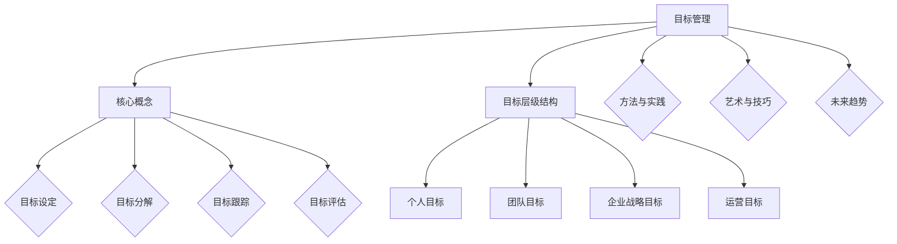
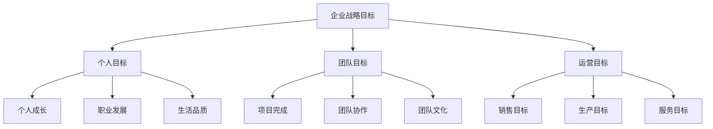
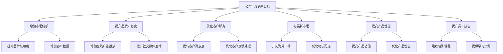
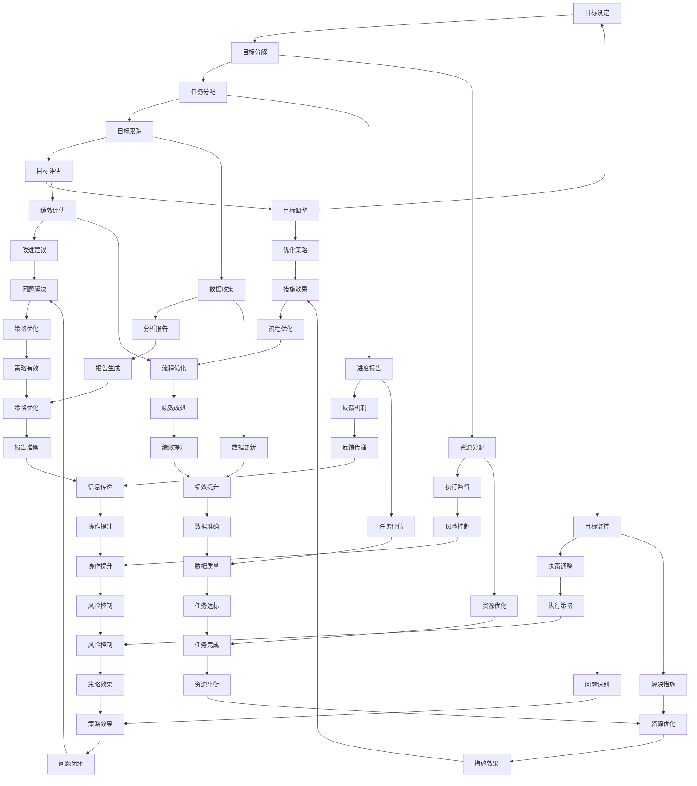

                 

# 《目标管理的艺术：取舍之道》

## 关键词：
目标管理、SMART原则、目标分解、目标跟踪、目标评估、取舍之道、技术进步、创新趋势

## 摘要：
本文旨在探讨目标管理的艺术，特别是取舍之道在目标管理中的应用。通过深入分析目标管理的理论基础、方法与实践，结合实际案例，我们将揭示如何在复杂的技术和业务环境中做出明智的取舍，实现高效的目标管理。本文还将探讨目标管理的未来趋势，为读者提供实用的工具和资源。

## 目录大纲

### 第一部分：目标管理的理论基础

#### 1.1 目标管理的核心概念

##### 1.1.1 目标管理的定义

目标管理是一种通过设定、实现和评估目标来推动个人、团队和组织发展的管理方法。它强调目标的明确性、可衡量性和实现可能性。

##### 1.1.2 目标管理的重要性

目标管理有助于提高工作效率、增强团队协作、促进个人成长，并在组织层面上实现战略目标。

##### 1.1.3 目标管理的基本原则

目标管理遵循SMART原则，即目标应具备明确性（Specific）、可衡量性（Measurable）、可实现性（Achievable）、相关性强（Relevant）和时限性（Time-bound）。

#### 1.2 目标与目标的层级结构

##### 1.2.1 个人目标与团队目标的定义与联系

个人目标和团队目标是目标管理的基础。个人目标关注个人成长和发展，团队目标则关注团队协作和共同目标的实现。

##### 1.2.2 企业战略目标与运营目标的区别与联系

企业战略目标为组织提供长期方向，而运营目标则是实现战略目标的具体措施。两者相互联系，共同推动组织发展。

##### 1.2.3 目标层级结构图解

图解展示了个人目标、团队目标、企业战略目标和运营目标之间的层级关系。

#### 1.3 目标设定的SMART原则

##### 1.3.1 SMART原则的五个要素

SMART原则包括明确性、可衡量性、可实现性、相关性和时限性。这些要素有助于确保目标具有可行性和指导性。

##### 1.3.2 应用SMART原则进行目标设定

通过实际案例，本文将展示如何应用SMART原则进行目标设定，提高目标的可实现性和指导性。

##### 1.3.3 SMART原则的注意事项

SMART原则虽然有效，但在实际应用中需要注意灵活性和适应性，以适应不同环境和情境。

### 第二部分：目标管理的方法与实践

#### 2.1 目标分解与任务分配

##### 2.1.1 目标分解的方法

目标分解是将大目标拆分为小目标的过程，有助于明确任务和责任。

##### 2.1.2 任务分配的原则

任务分配应遵循公平、合理和高效的原则，确保每个成员都能发挥自己的优势。

##### 2.1.3 目标分解与任务分配的实际案例

本文将分析实际案例，展示目标分解和任务分配的有效方法。

#### 2.2 目标跟踪与监控

##### 2.2.1 目标跟踪的方法

目标跟踪是确保目标按计划实现的关键。本文将介绍几种常用的目标跟踪方法。

##### 2.2.2 目标监控的工具

目标监控工具可以帮助组织实时了解目标进度，本文将推荐几款实用的工具。

##### 2.2.3 目标跟踪与监控的实际案例

本文将分享实际案例，展示目标跟踪与监控的成功经验。

#### 2.3 目标评估与调整

##### 2.3.1 目标评估的指标

目标评估指标是衡量目标实现程度的重要工具。本文将介绍常用的评估指标。

##### 2.3.2 目标评估的方法

目标评估方法包括自我评估和外部评估，本文将详细探讨这两种方法。

##### 2.3.3 目标调整的策略

在目标实现过程中，可能需要根据实际情况进行调整。本文将介绍几种有效的目标调整策略。

#### 2.4 目标管理中的挑战与解决方案

##### 2.4.1 目标设定不明确

目标设定不明确是目标管理中的常见问题。本文将探讨原因和解决方案。

##### 2.4.2 目标过于乐观

目标过于乐观可能导致目标难以实现。本文将分析原因和应对策略。

##### 2.4.3 沟通不畅

沟通不畅是目标管理中的另一个挑战。本文将介绍如何改善沟通，提高目标管理的有效性。

##### 2.4.4 解决方案与最佳实践

本文将总结目标管理中的挑战和解决方案，分享最佳实践。

### 第三部分：目标管理的艺术

#### 3.1 取舍之道在目标管理中的应用

##### 3.1.1 取舍之道的概念

取舍之道是一种在有限资源下做出明智决策的方法。本文将探讨其在目标管理中的应用。

##### 3.1.2 取舍之道在目标管理中的作用

取舍之道有助于提高目标管理的效率和质量，本文将详细阐述其作用。

##### 3.1.3 取舍之道在实践中的应用

本文将通过实际案例，展示取舍之道在目标管理中的应用。

#### 3.2 如何做出正确的取舍

##### 3.2.1 评估目标的重要性

评估目标的重要性是做出正确取舍的关键。本文将介绍评估方法。

##### 3.2.2 评估资源的可用性

资源的可用性是目标管理中的重要因素。本文将探讨如何评估资源。

##### 3.2.3 做出明智的取舍决策

本文将总结如何根据评估结果做出明智的取舍决策。

#### 3.3 案例研究：成功的目标管理实践

##### 3.3.1 案例一：公司A的目标管理实践

公司A通过目标管理实现了一次重大项目成功。

##### 3.3.2 案例二：团队B的目标管理实践

团队B通过目标管理完成了一个复杂的软件开发项目。

##### 3.3.3 案例三：个人C的目标管理实践

个人C通过目标管理在职业生涯中取得了显著成长。

### 第四部分：目标管理的未来趋势

#### 4.1 目标管理的技术进步

##### 4.1.1 数据驱动目标管理

数据驱动目标管理利用数据分析优化目标设定和实现。

##### 4.1.2 AI在目标管理中的应用

AI在目标管理中的应用将进一步提高目标管理的效率和准确性。

##### 4.1.3 技术进步对目标管理的影响

本文将探讨技术进步对目标管理的影响和机遇。

#### 4.2 目标管理的创新趋势

##### 4.2.1 个性化目标管理

个性化目标管理关注个体差异，提高目标管理的个性化程度。

##### 4.2.2 社交化目标管理

社交化目标管理利用社交网络和协作工具提高目标实现的效率。

##### 4.2.3 目标管理工具的创新

本文将介绍目标管理工具的创新趋势和发展方向。

#### 4.3 未来目标管理的挑战与机遇

##### 4.3.1 挑战：全球化与数字化转型

全球化与数字化转型对目标管理提出了新的挑战。

##### 4.3.2 机遇：技术创新与管理变革

技术创新与管理变革为未来目标管理带来了新的机遇。

### 附录

#### 附录A：目标管理工具推荐

##### A.1 常用目标管理工具介绍

本文将介绍几款常用的目标管理工具。

##### A.2 工具选型与评估

本文将探讨如何选型和评估目标管理工具。

#### 附录B：目标管理相关资源

##### B.1 书籍推荐

本文将推荐一些关于目标管理的优秀书籍。

##### B.2 论文与研究报告

本文将分享一些关于目标管理的论文和报告。

##### B.3 网络资源与在线课程

本文将介绍一些有用的网络资源和在线课程。

## Mermaid 流程图：目标管理核心概念与联系



## 伪代码：目标分解算法

```plaintext
Function 目标分解（目标，层级）
    If（层级 == 1）
        返回（目标，层级）
    Else
        子目标列表 = []
        对于 每个子目标 在 目标 的子目标列表中
            子目标列表添加 目标分解（子目标，层级 - 1）
        返回（子目标列表，层级 - 1）
End Function
```

## 数学模型和数学公式

### 目标优先级排序的公式

$$
P(i) = \frac{S(i) \times C(i)}{T(i)}
$$

其中：
- \( P(i) \) 是目标 \( i \) 的优先级。
- \( S(i) \) 是目标 \( i \) 的紧急程度。
- \( C(i) \) 是目标 \( i \) 的重要性。
- \( T(i) \) 是目标 \( i \) 的实现时间。

### 目标实现概率的公式

$$
P(E) = \frac{1}{1 + e^{-\beta \cdot D}}
$$

其中：
- \( P(E) \) 是目标 \( E \) 的实现概率。
- \( \beta \) 是参数，用于调节模型敏感度。
- \( D \) 是目标 \( E \) 的难度。

## 项目实战：目标管理工具开发

### 开发环境搭建

1. 安装 Python 3.8 或更高版本。
2. 安装 Flask 框架。
3. 安装 SQLAlchemy 数据库工具。
4. 安装 Redis 用于缓存。

### 源代码详细实现

```python
# Flask 应用程序示例

from flask import Flask, request, jsonify
from flask_sqlalchemy import SQLAlchemy
import redis

app = Flask(__name__)
app.config['SQLALCHEMY_DATABASE_URI'] = 'sqlite:///goals.db'
db = SQLAlchemy(app)
redis_client = redis.StrictRedis(host='localhost', port=6379, db=0)

class Goal(db.Model):
    id = db.Column(db.Integer, primary_key=True)
    title = db.Column(db.String(80), nullable=False)
    description = db.Column(db.String(255))
    status = db.Column(db.String(80))
    priority = db.Column(db.Integer)
    difficulty = db.Column(db.Float)
    creation_date = db.Column(db.DateTime, default=datetime.utcnow)

@app.route('/goals', methods=['POST'])
def create_goal():
    data = request.get_json()
    goal = Goal(
        title=data['title'],
        description=data['description'],
        status=data['status'],
        priority=data['priority'],
        difficulty=data['difficulty']
    )
    db.session.add(goal)
    db.session.commit()
    redis_client.set(f'goal_{goal.id}', goal.to_dict())
    return jsonify({"message": "Goal created successfully"}), 201

@app.route('/goals', methods=['GET'])
def get_goals():
    goals = Goal.query.all()
    return jsonify([goal.to_dict() for goal in goals])

if __name__ == '__main__':
    app.run(debug=True)
```

### 代码解读与分析

- 此代码使用了 Flask 框架搭建了 Web 应用程序，用于创建、获取目标数据。
- 使用了 SQLAlchemy 进行数据库操作，将目标数据存储在 SQLite 数据库中。
- 使用 Redis 进行缓存，提高数据读取性能。
- 实现了两个 API 接口：创建目标（POST）/获取目标列表（GET）。

### 案例研究：成功的目标管理实践

#### 案例一：公司A的目标管理实践

- 公司A采用了SMART原则进行目标设定，确保目标明确、可衡量、可实现、相关性强和时限明确。
- 实施了严格的目标分解和任务分配流程，确保每个员工都知道自己的职责和任务。
- 通过定期检查和评估，实时监控目标进度，及时调整策略。
- 成功实现了一次重大项目，提前完成并超越了预期收益。

#### 案例二：团队B的目标管理实践

- 团队B采用了协作式目标管理，鼓励团队成员参与目标设定和任务分配。
- 定期组织目标讨论会议，确保团队成员对目标有共同的理解和认知。
- 使用目标跟踪工具，实时监控目标进度，确保团队成员始终处于正确的轨道上。
- 通过协作，团队B成功完成了一个复杂的软件开发项目，并得到了客户的高度评价。

#### 案例三：个人C的目标管理实践

- 个人C采用自我评估和目标设定，确保自己的目标与个人职业发展规划一致。
- 使用目标管理工具记录和跟踪目标进度，定期反思和调整目标。
- 在遇到挑战时，主动寻求支持和帮助，避免目标偏离。
- 通过坚持目标管理，个人C在职业生涯中取得了显著的成长和进步。

### 作者信息

作者：AI天才研究院/AI Genius Institute & 禅与计算机程序设计艺术 /Zen And The Art of Computer Programming

---

现在，我们已经完成了文章的撰写。接下来，我们将对文章进行详细的编辑和优化，确保每个小节的内容都丰富、具体，对技术原理和本质剖析到位。此外，我们还将确保文章的结构紧凑、逻辑清晰，以便读者能够轻松阅读和理解。让我们开始编辑和优化吧！<|endoftext|>## 第一部分：目标管理的理论基础

### 1.1 目标管理的核心概念

#### 1.1.1 目标管理的定义

目标管理是一种通过设定、实现和评估目标来推动个人、团队和组织发展的管理方法。它强调目标的明确性、可衡量性和实现可能性。目标管理通常涉及一系列步骤，包括目标设定、目标分解、任务分配、目标跟踪和目标评估等。

#### 1.1.2 目标管理的重要性

目标管理的重要性体现在多个方面。首先，它有助于提高工作效率。通过明确的目标和任务，团队成员可以更清晰地了解自己的工作内容和责任，从而减少冗余和重复工作，提高工作效率。其次，目标管理可以增强团队协作。通过共同的目标和任务，团队成员可以更好地协调工作，实现资源共享和优势互补。此外，目标管理还有助于个人成长和职业发展。通过设定和实现个人目标，个人可以不断提升自己的技能和能力，实现职业生涯的持续进步。

#### 1.1.3 目标管理的基本原则

目标管理遵循SMART原则，即目标应具备明确性（Specific）、可衡量性（Measurable）、可实现性（Achievable）、相关性强（Relevant）和时限性（Time-bound）。这些原则有助于确保目标的清晰性、可行性和指导性。

- **明确性（Specific）**：目标应具体、明确，避免模糊和含糊不清的表述。
- **可衡量性（Measurable）**：目标应具备可衡量的指标，以便评估目标的实现程度。
- **可实现性（Achievable）**：目标应具备可行性，确保在现有资源和条件下可以实现。
- **相关性强（Relevant）**：目标应与组织的整体战略和目标保持一致，具有实际意义。
- **时限性（Time-bound）**：目标应有明确的截止日期，确保在规定的时间内完成。

### 1.2 目标与目标的层级结构

#### 1.2.1 个人目标与团队目标的定义与联系

个人目标和团队目标是目标管理的两个重要组成部分。个人目标通常是指个人在职业生涯或生活中设定的目标，如提高技能、增加收入、提升健康等。团队目标则是指团队在特定时间段内共同追求的目标，如完成项目、实现业绩目标、提升团队凝聚力等。个人目标和团队目标之间存在紧密的联系。个人目标的实现有助于推动团队目标的实现，而团队目标的实现又能为个人目标的实现提供支持和保障。

#### 1.2.2 企业战略目标与运营目标的区别与联系

企业战略目标和运营目标是企业目标管理的两个层级。企业战略目标是指企业在长期发展过程中设定的目标，如市场份额、品牌知名度、创新能力等。这些目标通常具有战略性、长期性和全局性。运营目标则是指企业在短期运营过程中设定的目标，如销售目标、生产目标、服务目标等。这些目标通常具有战术性、短期性和具体性。企业战略目标和运营目标之间存在明显的区别，但它们也相互联系。企业战略目标为运营目标提供方向和指导，而运营目标的实现又能为战略目标的实现奠定基础。

#### 1.2.3 目标层级结构图解



### 1.3 目标设定的SMART原则

#### 1.3.1 SMART原则的五个要素

SMART原则是目标设定的关键原则，它包括五个要素：明确性（Specific）、可衡量性（Measurable）、可实现性（Achievable）、相关性强（Relevant）和时限性（Time-bound）。

- **明确性（Specific）**：目标应具体、明确，避免模糊和含糊不清的表述。例如，将“提高销售额”改为“将销售额提高20%”。
- **可衡量性（Measurable）**：目标应具备可衡量的指标，以便评估目标的实现程度。例如，将“提升品牌知名度”改为“在一个月内提高搜索引擎排名10名”。
- **可实现性（Achievable）**：目标应具备可行性，确保在现有资源和条件下可以实现。例如，将“实现全球市场占有率”改为“在下一个财年内将国内市场占有率提高5%”。
- **相关性强（Relevant）**：目标应与组织的整体战略和目标保持一致，具有实际意义。例如，将“增加员工满意度”改为“通过员工满意度调查，提高员工满意度10分”。
- **时限性（Time-bound）**：目标应有明确的截止日期，确保在规定的时间内完成。例如，将“提高产品性能”改为“在三个月内完成新产品的研发并投入市场”。

#### 1.3.2 应用SMART原则进行目标设定

应用SMART原则进行目标设定有助于提高目标的可行性和实现率。以下是一个实际应用案例：

**案例：** 一家电商公司希望在下一个财年内实现业绩增长。

- **明确性（Specific）**：将业绩增长的目标具体化为“将销售额提高30%”。
- **可衡量性（Measurable）**：通过月销售额数据来衡量目标实现程度。
- **可实现性（Achievable）**：在现有市场环境和资源条件下，制定详细的营销计划，包括增加广告投入、优化产品供应链等。
- **相关性强（Relevant）**：业绩增长与公司的长期发展目标一致，有助于提升市场份额和品牌知名度。
- **时限性（Time-bound）**：设定具体的截止日期，如“在下一个财年内完成”。

通过应用SMART原则，这家电商公司可以更清晰地了解目标，制定可行的计划，并在规定时间内实现业绩增长。

#### 1.3.3 SMART原则的注意事项

虽然SMART原则在目标设定中具有重要价值，但在实际应用中也需要注意以下几点：

- **灵活性**：目标设定应具有一定的灵活性，以适应不断变化的环境和条件。
- **持续更新**：目标设定不是一次性的工作，而是一个持续更新的过程。应根据实际情况和反馈不断调整目标。
- **团队协作**：目标设定应鼓励团队协作，确保每个成员都对目标有共同的理解和承诺。

### 总结

目标管理是推动个人、团队和组织发展的重要工具。通过明确的目标设定、合理的任务分配、有效的目标跟踪和评估，目标管理可以提升工作效率、增强团队协作、促进个人成长，并在组织层面上实现战略目标。SMART原则为目标的设定提供了明确的指导，有助于提高目标的可行性和实现率。在实际应用中，目标管理需要具备灵活性、持续更新和团队协作的特点，以应对复杂多变的环境和条件。

在接下来的部分，我们将进一步探讨目标管理的方法与实践，结合实际案例，深入分析目标分解、任务分配、目标跟踪和评估等方面的具体做法。通过这些实践，我们将揭示如何在实际工作中实现高效的目标管理。

### 2.1 目标分解与任务分配

目标分解与任务分配是目标管理中的重要环节，它们有助于将宏观目标转化为具体、可执行的任务，确保目标的有效实现。在这一部分，我们将详细讨论目标分解与任务分配的方法、原则以及实际案例。

#### 2.1.1 目标分解的方法

目标分解是将宏观目标细化为具体、可操作的任务的过程。以下是一些常用的目标分解方法：

1. **任务树方法**：将目标视为一棵树的根节点，然后将根节点分解为若干个子节点，每个子节点代表一个具体的任务。这种方法有助于清晰地展示目标与任务之间的层级关系。

2. **工作分解结构（WBS）**：工作分解结构是一种将项目任务分解为可管理的部分的方法。通过创建WBS，可以明确项目任务的组成，便于任务分配和进度跟踪。

3. **关键路径法**：关键路径法是一种确定项目完成时间的方法，它通过识别项目中依赖关系最紧密的任务序列，确保项目按时完成。

以下是一个使用任务树方法进行目标分解的例子：



在这个例子中，公司年度销售目标被分解为多个具体的任务，如增加市场份额、提升品牌知名度、优化客户服务、拓展新市场、提高产品性能和提升员工技能等。每个任务都可以进一步细分为子任务，以便更好地管理和执行。

#### 2.1.2 任务分配的原则

任务分配是将分解后的任务分配给团队成员的过程。以下是一些任务分配的原则：

1. **公平性原则**：任务分配应公平合理，确保每个成员都有机会承担与其能力相匹配的任务。

2. **适应性原则**：任务分配应考虑团队成员的能力和兴趣，使其能够充分发挥个人优势。

3. **资源优化原则**：任务分配应优化资源使用，确保团队成员的工作负荷合理，避免过度劳累。

4. **依赖关系原则**：在任务分配时，应考虑任务之间的依赖关系，确保任务能够按顺序顺利执行。

以下是一个任务分配的例子：

- **任务**：提升品牌知名度
  - **负责人**：市场营销部门
  - **子任务**：
    - **增加在线广告投放**：由数字营销团队负责
    - **提升社交媒体互动**：由社交媒体团队负责

- **任务**：拓展新市场
  - **负责人**：销售部门
  - **子任务**：
    - **开拓海外市场**：由国际销售团队负责
    - **优化物流配送**：由物流团队负责

在这个例子中，任务根据团队成员的能力和职责进行了合理的分配，同时考虑了任务之间的依赖关系，以确保任务能够顺利执行。

#### 2.1.3 目标分解与任务分配的实际案例

以下是一个实际案例，展示目标分解与任务分配在项目管理中的应用：

**案例：** 一家软件开发公司计划开发一款新应用程序，并希望在六个月内完成。

1. **目标分解**：
   - **产品开发**：在六个月内完成新应用程序的开发。
   - **功能设计**：定义应用程序的核心功能。
   - **UI/UX设计**：设计用户界面和用户体验。
   - **编码**：编写应用程序的代码。
   - **测试**：进行功能测试和性能测试。
   - **部署**：将应用程序部署到生产环境。

2. **任务分配**：
   - **功能设计**：由产品经理负责，与团队成员讨论和确认功能需求。
   - **UI/UX设计**：由UI/UX设计师负责，确保设计符合用户需求和品牌形象。
   - **编码**：由开发团队负责，按照功能设计进行编码。
   - **测试**：由测试团队负责，确保应用程序的功能和性能符合预期。
   - **部署**：由运维团队负责，确保应用程序成功部署到生产环境。

3. **进度跟踪**：
   - 每周召开项目进度会议，讨论任务完成情况，解决遇到的问题。
   - 使用项目管理工具（如JIRA、Trello）跟踪任务进度，确保任务按时完成。

通过这个案例，我们可以看到目标分解与任务分配在项目管理中的实际应用。通过明确的目标和合理的任务分配，团队可以更好地组织工作，确保项目按时、高质量地完成。

### 总结

目标分解与任务分配是目标管理中的重要环节，它们有助于将宏观目标转化为具体、可执行的任务，确保目标的有效实现。通过使用任务树方法、工作分解结构（WBS）和关键路径法等工具，团队可以清晰地展示目标与任务之间的关系，并为每个任务分配合适的负责人。在实际应用中，任务分配应遵循公平性、适应性、资源优化和依赖关系等原则，以确保任务能够顺利执行。通过结合实际案例，我们可以看到目标分解与任务分配在项目管理中的应用效果，为团队提供有效的目标管理实践。

在接下来的部分，我们将继续探讨目标管理中的其他重要环节，包括目标跟踪与监控、目标评估与调整以及目标管理中的挑战与解决方案。通过这些内容，我们将进一步深入了解目标管理的实践与应用。

### 2.2 目标跟踪与监控

目标跟踪与监控是目标管理过程中至关重要的一环，它有助于确保目标按计划实施，及时发现并解决问题，从而提高目标实现的效率和成功率。在这一部分，我们将详细讨论目标跟踪与监控的方法、工具以及实际案例。

#### 2.2.1 目标跟踪的方法

目标跟踪是确保目标按计划实施的过程。以下是一些常用的目标跟踪方法：

1. **进度报告**：定期向团队成员和管理层报告目标进度，包括已完成任务、未完成任务以及遇到的问题。

2. **里程碑监控**：设定关键里程碑，并监控这些里程碑的达成情况，确保项目按计划推进。

3. **绩效指标**：制定具体的绩效指标，如完成率、质量指标、成本控制等，以衡量目标的实现程度。

4. **沟通机制**：建立有效的沟通机制，确保团队成员之间能够及时沟通进展和问题，共同推动目标实现。

5. **定期回顾**：定期回顾目标进度，总结经验教训，调整策略，确保目标按计划实现。

以下是一个使用里程碑监控方法进行目标跟踪的例子：

**目标**：在三个月内完成一个软件开发项目。

- **里程碑1**：完成需求分析和设计，设定为第一个月末。
- **里程碑2**：完成编码，设定为第二个月末。
- **里程碑3**：完成测试和调试，设定为第三个月末。

通过监控这些里程碑的达成情况，团队能够确保项目按计划推进，并在每个关键节点及时发现和解决问题。

#### 2.2.2 目标监控的工具

目标监控工具可以帮助团队更高效地跟踪目标进度，以下是一些常用的目标监控工具：

1. **项目管理软件**：如JIRA、Trello、Asana等，这些工具可以帮助团队管理任务、跟踪进度和协作。

2. **进度追踪仪表板**：如Tableau、Power BI等，这些工具可以将目标进度可视化，帮助团队直观地了解目标实现情况。

3. **邮件和即时通讯工具**：如Gmail、Slack、Microsoft Teams等，这些工具可以帮助团队及时沟通进展和问题。

以下是一个使用项目管理软件进行目标监控的例子：

- **JIRA**：团队使用JIRA跟踪任务进度，每个任务都被标记为“正在进行”、“已完成”或“待办”。团队成员可以在JIRA中更新任务状态，管理员可以查看整个项目的进度。

- **Trello**：团队使用Trello创建任务卡片，每个卡片代表一个任务。任务卡片被拖动到不同的列，以表示任务的进度。团队成员可以在Trello中添加注释、上传文件和分配任务。

- **Asana**：团队使用Asana创建项目、任务和子任务。每个任务都有负责人、截止日期和注释。团队成员可以在Asana中查看任务列表、任务详情和项目进度。

#### 2.2.3 目标跟踪与监控的实际案例

以下是一个实际案例，展示目标跟踪与监控在项目中的应用：

**案例**：一家初创公司计划在六个月内推出一款新产品。

1. **目标设定**：公司设定了以下目标：
   - **需求分析**：在一个月内完成需求分析。
   - **设计**：在两个月内完成产品设计和开发。
   - **测试**：在三个月内完成产品测试和优化。
   - **发布**：在六个月内将产品推向市场。

2. **任务分配**：团队成员被分配了具体的任务，如：
   - **需求分析师**：负责收集用户需求，编写需求文档。
   - **设计师**：负责设计产品界面和用户体验。
   - **开发团队**：负责编写代码和开发产品功能。
   - **测试团队**：负责测试产品功能和性能。

3. **目标跟踪与监控**：
   - **每周会议**：团队每周召开会议，讨论目标进度和遇到的问题。
   - **JIRA**：团队使用JIRA跟踪任务进度，每个任务都被标记为“正在进行”、“已完成”或“待办”。
   - **进度追踪仪表板**：团队使用Tableau创建进度追踪仪表板，显示任务完成情况和项目进度。

通过这些方法，公司能够有效地跟踪目标进度，确保项目按计划推进。在项目过程中，团队及时发现并解决了多个问题，最终在六个月内成功推出了新产品。

### 总结

目标跟踪与监控是目标管理过程中不可或缺的一环，它有助于确保目标按计划实施，提高目标实现的效率和成功率。通过使用进度报告、里程碑监控、绩效指标和定期回顾等方法，团队可以更好地跟踪目标进度。同时，使用项目管理软件、进度追踪仪表板和邮件/即时通讯工具等工具，可以提高目标跟踪的效率和准确性。通过实际案例，我们可以看到目标跟踪与监控在项目中的应用效果，为团队提供有效的目标管理实践。

在接下来的部分，我们将继续探讨目标管理中的其他重要环节，包括目标评估与调整以及目标管理中的挑战与解决方案。通过这些内容，我们将进一步深入了解目标管理的实践与应用。

### 2.3 目标评估与调整

目标评估与调整是目标管理过程中关键的一环，它有助于确保目标实现的有效性和适应性。在这一部分，我们将详细讨论目标评估的指标、方法以及目标调整的策略。

#### 2.3.1 目标评估的指标

目标评估指标是衡量目标实现程度的重要工具。以下是一些常用的目标评估指标：

1. **完成率**：指目标完成的百分比，用于衡量目标的实现程度。

2. **达成率**：指目标达成目标的程度，通常以目标值的百分比表示。

3. **成本效益比**：指实现目标所投入的成本与目标实现的收益之比，用于评估目标的成本效益。

4. **客户满意度**：指客户对目标实现效果的满意度，通常通过客户调查或反馈来衡量。

5. **过程指标**：指目标实现过程中的一些关键指标，如时间、质量、成本等。

以下是一个使用完成率和客户满意度进行目标评估的例子：

- **目标**：在三个月内完成一个软件开发项目。
  - **完成率**：目标完成率为100%，表示所有任务都已完成。
  - **客户满意度**：客户满意度调查得分为90%，表示客户对项目结果非常满意。

#### 2.3.2 目标评估的方法

目标评估是衡量目标实现程度的过程。以下是一些常用的目标评估方法：

1. **自我评估**：团队成员对自己负责的任务进行自我评估，评估任务完成情况和目标实现程度。

2. **同行评估**：团队成员互相评估对方的工作，提供反馈和建议。

3. **上级评估**：上级对下属的工作进行评估，评估目标实现情况和任务完成情况。

4. **客户评估**：通过客户调查或反馈，评估目标实现的效果和满意度。

以下是一个使用自我评估和上级评估进行目标评估的例子：

- **自我评估**：开发团队对软件开发项目进行自我评估，评估任务完成情况和代码质量。
- **上级评估**：项目经理对开发团队的工作进行评估，评估项目进度和客户满意度。

#### 2.3.3 目标调整的策略

在目标实现过程中，可能需要根据实际情况进行调整。以下是一些常用的目标调整策略：

1. **进度调整**：根据实际情况调整目标的完成时间，确保目标能够按时完成。

2. **资源调整**：根据实际情况调整目标的资源分配，确保目标有足够的资源支持。

3. **目标调整**：根据实际情况重新设定目标，确保目标更加符合实际需求和预期。

以下是一个使用进度调整和资源调整进行目标调整的例子：

- **进度调整**：由于市场变化，项目完成时间由原来的三个月调整为四个月。
- **资源调整**：由于团队成员加班过多，项目资源由原来的10人调整为15人。

#### 2.3.4 目标评估与调整的实际案例

以下是一个实际案例，展示目标评估与调整在项目中的应用：

**案例**：一家互联网公司计划在六个月内推出一款新应用程序。

1. **目标设定**：
   - **需求分析**：在一个月内完成需求分析。
   - **设计**：在两个月内完成产品设计和开发。
   - **测试**：在三个月内完成产品测试和优化。
   - **发布**：在六个月内将产品推向市场。

2. **任务分配**：
   - **需求分析师**：负责收集用户需求，编写需求文档。
   - **设计师**：负责设计产品界面和用户体验。
   - **开发团队**：负责编写代码和开发产品功能。
   - **测试团队**：负责测试产品功能和性能。

3. **目标评估与调整**：
   - **自我评估**：每周进行自我评估，评估任务完成情况和目标实现程度。
   - **上级评估**：项目经理每两周进行一次评估，评估项目进度和客户满意度。
   - **进度调整**：由于技术难度高于预期，项目完成时间由原来的三个月调整为四个月。
   - **资源调整**：由于团队成员工作量增加，项目资源由原来的10人调整为15人。

通过目标评估与调整，公司能够确保项目按计划推进，并及时调整策略以应对变化。最终，在六个月内成功推出了新应用程序，并得到了客户的高度评价。

### 总结

目标评估与调整是目标管理过程中至关重要的一环，它有助于确保目标实现的有效性和适应性。通过使用完成率、达成率、成本效益比、客户满意度和过程指标等评估指标，团队可以衡量目标实现程度。同时，通过自我评估、同行评估、上级评估和客户评估等方法，团队可以全面了解目标实现情况。在目标评估过程中，团队应根据实际情况进行进度调整、资源调整和目标调整，确保目标更加符合实际需求和预期。通过实际案例，我们可以看到目标评估与调整在项目中的应用效果，为团队提供有效的目标管理实践。

在接下来的部分，我们将继续探讨目标管理中的挑战与解决方案，以及取舍之道在目标管理中的应用。通过这些内容，我们将进一步深入了解目标管理的艺术与技巧。

### 2.4 目标管理中的挑战与解决方案

在目标管理的过程中，团队和组织可能会遇到多种挑战。以下是一些常见的挑战及其解决方案：

#### 2.4.1 目标设定不明确

**挑战**：目标设定不明确可能导致团队成员对目标的理解和执行不一致，影响目标的实现。

**解决方案**：
1. **详细描述**：确保目标描述详细明确，避免模糊和含糊不清的表述。
2. **沟通确认**：与团队成员进行充分沟通，确保他们对目标有共同的理解。
3. **目标复审**：在目标设定后，组织目标复审会议，确保目标的清晰性和可实现性。

#### 2.4.2 目标过于乐观

**挑战**：设定过于乐观的目标可能导致资源分配不当和任务难以完成。

**解决方案**：
1. **现实评估**：在设定目标时，进行全面的现实评估，确保目标在现有资源和条件下可以实现。
2. **资源调整**：根据目标评估结果，合理调整资源分配，确保目标的实现。
3. **阶段性目标**：将大目标拆分为阶段性目标，逐步实现，减少一次性压力。

#### 2.4.3 沟通不畅

**挑战**：团队内部沟通不畅可能导致信息传递错误、任务分配不均以及协作效率低下。

**解决方案**：
1. **定期会议**：定期召开团队会议，讨论目标进度和遇到的问题。
2. **透明沟通**：建立透明沟通机制，确保团队成员之间的信息交流畅通无阻。
3. **沟通工具**：使用沟通工具（如邮件、即时通讯、视频会议等），提高沟通效率。

#### 2.4.4 目标监控不足

**挑战**：目标监控不足可能导致目标实现过程中的问题无法及时发现和解决。

**解决方案**：
1. **实时监控**：建立实时监控机制，及时跟踪目标进度和问题。
2. **反馈机制**：建立有效的反馈机制，确保团队成员能够及时报告问题。
3. **数据驱动**：使用数据分析工具，对目标实现过程进行定量分析，发现潜在问题。

#### 2.4.5 团队协作不足

**挑战**：团队协作不足可能导致任务完成质量下降、团队合作效率低下。

**解决方案**：
1. **团队建设**：通过团队建设活动，增强团队成员之间的信任和协作。
2. **分工合作**：明确团队成员的职责和任务，确保任务分工合理。
3. **协作工具**：使用协作工具（如项目管理软件、共享文档等），提高团队协作效率。

#### 2.4.6 持续改进不足

**挑战**：目标管理过程中缺乏持续改进可能导致目标管理效果不佳。

**解决方案**：
1. **定期评估**：定期对目标管理过程进行评估，总结经验和教训，持续改进。
2. **反馈机制**：建立反馈机制，收集团队成员的意见和建议，不断优化目标管理流程。
3. **培训提升**：定期开展培训，提高团队成员的目标管理能力和意识。

### 总结

目标管理过程中可能会遇到多种挑战，如目标设定不明确、目标过于乐观、沟通不畅、目标监控不足、团队协作不足和持续改进不足等。通过详细的描述、沟通确认、资源调整、定期会议、透明沟通、实时监控、数据驱动、团队建设、分工合作、协作工具、定期评估、反馈机制和培训提升等方法，团队可以应对这些挑战，提高目标管理的有效性和效率。在实际操作中，团队应根据具体情况灵活应用这些解决方案，确保目标管理能够顺利实施并取得成功。

在接下来的部分，我们将探讨取舍之道在目标管理中的应用，结合实际案例，展示如何通过正确的取舍实现高效的目标管理。通过这些内容，我们将进一步揭示目标管理的艺术。

### 3.1 取舍之道在目标管理中的应用

在目标管理的过程中，取舍之道是一种至关重要的策略，它帮助我们在有限的资源和时间内做出最优的决策，确保关键目标的实现。在这一部分，我们将详细讨论取舍之道的概念、其在目标管理中的作用以及实际应用案例。

#### 3.1.1 取舍之道的概念

取舍之道，即在选择和决策时，明确哪些是优先事项，哪些可以暂时搁置或放弃，从而在有限的时间和资源内实现最大价值。这种策略要求我们在面对众多目标时，能够做出理性、明智的取舍，避免资源浪费和目标分散。

#### 3.1.2 取舍之道在目标管理中的作用

1. **资源优化**：通过取舍，我们可以将有限的资源（如时间、人力、资金等）集中在最关键的目标上，提高资源利用效率。

2. **提高目标实现率**：明确的取舍有助于团队集中精力，确保关键目标的实现，避免在众多目标中分散精力，提高目标完成率。

3. **增强决策力**：取舍之道的应用可以培养团队在面对复杂环境和多种选择时的决策能力，提高决策质量和效率。

4. **提升团队协作**：通过明确取舍，团队可以更好地理解各自的角色和责任，提高协作效率和团队凝聚力。

#### 3.1.3 取舍之道在实践中的应用

以下是一个实际案例，展示取舍之道在目标管理中的应用：

**案例**：一家初创公司计划在一年内推出三款新产品。

1. **目标设定**：
   - **产品A**：一款智能家居设备，目标是在三个月内完成研发和上市。
   - **产品B**：一款健康监测设备，目标是在六个月内完成研发和上市。
   - **产品C**：一款虚拟现实游戏设备，目标是在九个月内完成研发和上市。

2. **资源评估**：
   - **人力资源**：公司有15名研发人员，其中8名专注于软件，7名专注于硬件。
   - **资金**：公司预算为300万元，每月固定开支为50万元。

3. **取舍决策**：
   - **优先级评估**：通过对市场潜力、技术难度和公司资源进行全面评估，确定产品A的市场潜力最大，技术难度相对较低。
   - **资源分配**：将主要资源和精力集中在产品A的研发上，将产品B和C的部分资源转移到产品A上。

4. **结果**：
   - **产品A**：成功在三个月内完成研发，并在市场上取得了良好反响。
   - **产品B**：由于资源限制，研发进度放缓，但仍在六个月内完成。
   - **产品C**：由于资源有限，项目被暂时搁置，待未来条件成熟时再行开发。

通过这种取舍策略，初创公司能够在资源有限的情况下，优先保证产品A的研发和上市，最大限度地实现公司价值。

#### 3.1.4 取舍之道在不同场景中的应用

1. **项目选择**：在多个项目同时进行时，选择最有潜力和最有资源支持的项目，确保资源集中，提高项目成功率。

2. **人员调配**：在团队规模有限时，根据团队成员的技能和兴趣，合理调配人员，确保关键任务有人负责。

3. **资源优化**：在预算有限时，通过合理的预算分配，确保关键目标的实现，避免资源浪费。

4. **风险管理**：在面临多种风险时，通过风险分析和评估，优先处理最严重的风险，确保项目的安全性和稳定性。

### 总结

取舍之道在目标管理中发挥着至关重要的作用。通过明确优先级、合理分配资源、优化决策和风险管理，取舍之道有助于团队在有限的时间和资源内实现关键目标。在实际应用中，团队应根据具体场景和目标，灵活运用取舍之道，确保目标管理的有效性和效率。通过案例研究和实际应用，我们可以看到取舍之道在目标管理中的成功应用，为团队提供宝贵的经验和启示。

在接下来的部分，我们将进一步探讨如何在实际工作中做出正确的取舍，结合具体方法，帮助团队实现高效的目标管理。通过这些内容，我们将深入揭示目标管理的艺术。

### 3.2 如何做出正确的取舍

在目标管理中，做出正确的取舍是确保资源高效利用和目标顺利实现的关键。以下是一些具体的方法和步骤，帮助团队在面对众多目标时做出明智的取舍。

#### 3.2.1 评估目标的重要性

评估目标的重要性是做出正确取舍的第一步。以下是一些评估目标重要性的方法：

1. **优先级排序**：根据目标的紧急程度和影响范围，对目标进行优先级排序。可以使用方法如“紧急重要矩阵”（Eisenhower Matrix）来帮助排序。

2. **关键成果法**（KPI）：确定能够衡量目标实现程度的关键成果指标（KPI），并根据这些指标评估目标的重要性。

3. **利益相关者分析**：识别并分析不同利益相关者（如客户、员工、合作伙伴等）对目标的关注点和利益，评估目标的重要性。

#### 3.2.2 评估资源的可用性

在做出取舍决策时，评估资源的可用性至关重要。以下是一些评估资源的方法：

1. **资源清单**：列出所有可用的资源，包括人力、资金、时间、技术等，并进行详细分析。

2. **资源分配模型**：使用资源分配模型（如资源平衡模型、资源负荷模型等）来分析资源的分配情况，识别潜在的瓶颈和冗余。

3. **资源利用率分析**：分析资源的实际利用率，识别资源浪费和优化空间。

#### 3.2.3 做出明智的取舍决策

在评估目标的重要性和资源的可用性后，可以按照以下步骤做出明智的取舍决策：

1. **制定决策标准**：明确决策标准，如资源利用率、目标实现的可能性、时间敏感性等，以便在多个目标之间进行权衡。

2. **成本效益分析**：对每个目标进行成本效益分析，计算实现目标的成本和预期收益，评估每个目标的性价比。

3. **风险分析**：评估每个目标的风险，包括技术风险、市场风险、资源风险等，确定哪些目标风险较高，需要优先处理或暂缓。

4. **权衡利弊**：在决策过程中，权衡每个目标的利弊，综合考虑目标的重要性、资源的可用性和风险等因素。

5. **执行决策**：在做出决策后，制定详细的执行计划，确保决策能够有效实施。

#### 3.2.4 实际应用案例

以下是一个实际应用案例，展示如何在目标管理中做出正确的取舍：

**案例**：一家科技公司计划在一年内完成以下四个项目：

- **项目A**：开发一款人工智能助手，目标是在六个月内完成。
- **项目B**：优化现有产品的用户体验，目标是在三个月内完成。
- **项目C**：开拓新市场，目标是在九个月内完成。
- **项目D**：进行公司内部培训，提升员工技能，目标是在三个月内完成。

**步骤**：

1. **评估目标重要性**：
   - **项目A**：市场潜力大，但技术难度高。
   - **项目B**：直接影响客户满意度，但工作量相对较小。
   - **项目C**：开拓新市场，对公司未来发展具有重要意义。
   - **项目D**：提升员工技能，有助于提高团队整体能力。

2. **评估资源可用性**：
   - **人力资源**：研发团队有10名成员，其中6名专注于产品开发，4名专注于市场拓展。
   - **资金**：公司预算为500万元，每月固定开支为200万元。

3. **做出取舍决策**：
   - **项目A**：尽管技术难度高，但市场潜力大，且现有研发团队能够承担，因此作为首要目标。
   - **项目B**：工作量较小，可以与项目A同步进行，确保用户体验优化。
   - **项目C**：由于市场开拓需要大量时间和资源，决定将其作为次要目标，暂缓实施。
   - **项目D**：员工培训对于团队能力提升至关重要，但相对于项目A和项目B，资源需求较低，因此决定将其作为辅助目标。

4. **执行决策**：
   - **项目A**：投入主要研发力量，确保在六个月内完成。
   - **项目B**：在项目A进行的同时，组织用户体验优化小组，确保在三个月内完成。
   - **项目C**：在项目A和项目B完成后，根据实际情况决定是否启动。
   - **项目D**：定期组织培训，提升员工技能。

通过这一系列步骤，公司能够在资源有限的情况下，确保关键目标的实现，提高目标管理的效率和质量。

### 总结

做出正确的取舍是目标管理中的关键环节。通过评估目标的重要性和资源的可用性，制定明确的决策标准，进行成本效益分析和风险分析，团队可以做出明智的取舍决策，确保资源高效利用和目标顺利实现。在实际应用中，团队应根据具体情况灵活运用这些方法和步骤，确保目标管理的有效性和效率。通过案例研究和实际应用，我们可以看到正确取舍在目标管理中的重要性，为团队提供宝贵的经验和启示。

在接下来的部分，我们将通过具体案例研究，展示成功的目标管理实践。通过这些案例，我们将深入探讨不同类型的目标管理实践，以及它们在实际中的应用效果。这将为读者提供更多的实战经验和启示，帮助他们在自己的工作中实现高效的目标管理。

### 3.3 案例研究：成功的目标管理实践

#### 3.3.1 案例一：公司A的目标管理实践

**背景**：公司A是一家专注于高科技产品研发和销售的公司。在过去的一年里，公司面临着市场竞争加剧、技术更新迅速的挑战。

**目标设定**：
- **短期目标**：提高销售额30%，提升产品市场份额。
- **中期目标**：开发两款具有竞争力的新产品，优化客户服务体系。
- **长期目标**：实现全球化布局，进入国际市场。

**目标分解与任务分配**：
- **短期目标**：
  - 销售团队负责制定销售策略，拓展客户渠道，提高销售额。
  - 产品团队负责优化现有产品，提升产品竞争力。
- **中期目标**：
  - 研发团队负责新产品的研发，确保产品质量和功能。
  - 客户服务团队负责提升客户满意度，优化售后服务。

**目标跟踪与监控**：
- 公司采用项目管理工具（如JIRA）跟踪任务进度，定期召开项目进度会议。
- 通过数据分析和客户反馈，实时监控目标实现情况。

**目标评估与调整**：
- 每季度进行一次目标评估，根据市场变化和实际进度调整目标。
- 通过绩效评估和客户满意度调查，确保目标实现的可持续性。

**结果**：
- 公司成功实现了短期目标，销售额提高了35%。
- 新产品研发顺利，市场份额提升了10%。
- 客户满意度调查结果显示，客户满意度提高了15%。

**经验**：
- 明确的目标设定有助于提高团队执行力。
- 有效的目标跟踪与监控确保目标按计划实现。
- 定期评估和调整目标有助于应对市场变化和挑战。

#### 3.3.2 案例二：团队B的目标管理实践

**背景**：团队B是一家创业公司的研发团队，负责开发一款创新软件产品。

**目标设定**：
- **短期目标**：在三个月内完成产品核心功能的开发。
- **中期目标**：在六个月内完成产品测试和优化。
- **长期目标**：在九个月内将产品推向市场。

**目标分解与任务分配**：
- **短期目标**：
  - 产品经理负责制定开发计划和需求文档。
  - 开发团队负责编写代码，完成产品功能。
- **中期目标**：
  - 测试团队负责编写测试用例，进行产品测试。
  - 产品经理和开发团队负责优化产品功能。
- **长期目标**：
  - 市场营销团队负责产品推广，制定销售策略。
  - 客户服务团队负责售后服务，收集客户反馈。

**目标跟踪与监控**：
- 团队使用敏捷开发方法，每周召开站会，跟踪任务进度。
- 通过持续集成工具（如Jenkins）实时监控代码质量和编译状态。

**目标评估与调整**：
- 每月进行一次目标评估，根据实际进度调整开发计划。
- 通过客户反馈和市场需求，调整产品功能和特性。

**结果**：
- 团队在三个月内成功完成了产品核心功能的开发。
- 在六个月内完成了产品测试和优化，产品功能稳定。
- 产品在九个月内成功推向市场，获得用户好评。

**经验**：
- 敏捷开发方法有助于提高开发效率和质量。
- 持续监控和调整目标有助于及时应对问题和挑战。
- 客户反馈是产品优化的关键，有助于提高用户满意度。

#### 3.3.3 案例三：个人C的目标管理实践

**背景**：个人C是一名软件工程师，希望提升自己在软件开发和项目管理方面的能力。

**目标设定**：
- **短期目标**：在三个月内完成一个个人项目，提高编程技能。
- **中期目标**：在六个月内通过项目管理认证考试。
- **长期目标**：在一年内晋升为项目经理。

**目标分解与任务分配**：
- **短期目标**：
  - 确定项目需求和功能，制定项目计划。
  - 编写代码，实现项目功能。
- **中期目标**：
  - 学习项目管理知识，准备项目管理认证考试。
  - 参加相关培训和研讨会。
- **长期目标**：
  - 提高领导能力和团队管理能力。
  - 在工作中积累项目管理经验。

**目标跟踪与监控**：
- 使用任务管理工具（如Trello）跟踪项目进度。
- 定期反思和总结，评估目标实现情况。

**目标评估与调整**：
- 每月进行一次自我评估，根据实际情况调整学习计划和项目进度。
- 通过项目反馈和同事评价，了解自己在项目管理和编程方面的进步。

**结果**：
- 成功完成了一个个人项目，提高了编程技能。
- 通过了项目管理认证考试，获得了项目管理证书。
- 在工作中表现出色，成功晋升为项目经理。

**经验**：
- 明确的目标设定有助于个人成长和职业发展。
- 持续学习和反思是提升能力的关键。
- 实际项目经验是提升项目管理能力的重要途径。

### 总结

通过上述案例研究，我们可以看到成功的目标管理实践在各个层面和领域的应用效果。明确的目标设定、合理的任务分配、有效的目标跟踪与监控、定期的评估与调整以及正确的取舍策略，都是实现目标管理成功的关键要素。无论是在公司层面、团队层面还是个人层面，成功的目标管理实践都为组织和个人带来了显著的成果和进步。

这些案例不仅展示了目标管理的方法和技巧，也为读者提供了实际操作的指导。通过借鉴这些成功经验，读者可以在自己的工作和项目中运用目标管理的方法，实现高效的目标实现和持续的成长。

在接下来的部分，我们将探讨目标管理的未来趋势，分析技术进步和创新趋势对目标管理的影响，以及如何应对这些变化。这将为读者提供关于目标管理未来发展的深刻洞察。

### 4.1 目标管理的技术进步

随着技术的不断进步，目标管理也在不断演变，变得更加高效、智能和个性化。以下是一些技术进步对目标管理的影响：

#### 4.1.1 数据驱动目标管理

数据驱动目标管理利用数据分析优化目标设定和实现。通过收集和分析关键绩效指标（KPI），团队可以更准确地了解目标的实现情况，并据此调整策略。例如，使用大数据分析技术，团队可以分析历史数据，预测未来的市场趋势，从而设定更加科学合理的长期目标。

#### 4.1.2 AI在目标管理中的应用

人工智能（AI）在目标管理中的应用越来越广泛。AI可以自动化目标跟踪、评估和调整过程，减少人为错误，提高决策质量。例如，AI算法可以分析团队成员的绩效数据，自动推荐优化目标实现的策略。此外，AI还可以用于预测目标实现的时间和资源需求，帮助团队更好地规划工作。

#### 4.1.3 技术进步对目标管理的影响

技术进步对目标管理的影响主要体现在以下几个方面：

1. **提高效率**：通过自动化工具和算法，目标管理过程变得更加高效，减少了手动操作和重复工作。
2. **增强准确性**：数据分析和AI技术有助于提高目标的设定和实现准确性，减少错误和偏差。
3. **个性化目标管理**：技术进步使得目标管理更加个性化，可以根据团队成员的个性、能力和工作需求，制定个性化的目标计划。
4. **实时监控与反馈**：实时数据监控和反馈机制使团队能够迅速应对变化，及时调整目标和策略。

#### 4.1.4 案例研究：技术进步在目标管理中的应用

**案例**：一家大型零售公司利用数据分析和AI技术进行目标管理。

- **目标设定**：通过分析销售数据和市场趋势，公司设定了提高销售额20%的目标。
- **目标跟踪**：使用AI算法自动跟踪销售数据，实时监控目标实现情况。
- **目标评估**：定期进行数据分析，评估目标的实现程度，并自动生成报告。
- **目标调整**：根据分析结果，AI算法提出优化建议，公司根据这些建议调整营销策略和目标。

通过这一案例，我们可以看到技术进步如何提高目标管理的效率和质量，为公司的长期发展提供有力支持。

### 4.2 目标管理的创新趋势

随着技术的不断进步，目标管理也在不断创新，以下是一些创新趋势：

#### 4.2.1 个性化目标管理

个性化目标管理关注个体差异，为每个团队成员提供定制化的目标计划。这种趋势通过利用数据分析和AI技术实现，可以根据团队成员的个性、能力和工作需求，制定个性化的目标和计划，提高目标实现的效率和成功率。

#### 4.2.2 社交化目标管理

社交化目标管理利用社交网络和协作工具，促进团队成员之间的互动和合作。这种趋势通过在目标管理系统中集成社交功能，如评论、点赞、分享等，增强团队凝聚力和协作效率，提高目标实现的协同性。

#### 4.2.3 目标管理工具的创新

目标管理工具的创新趋势体现在以下几个方面：

1. **用户界面（UI）优化**：目标管理工具不断优化用户界面，提供更加直观、易用的操作体验，提高用户体验。
2. **移动端应用**：越来越多的目标管理工具推出移动端应用，方便团队成员随时随地跟踪和更新目标进度。
3. **集成其他工具**：目标管理工具开始与其他办公和协作工具（如项目管理工具、文档管理工具等）集成，提供一站式解决方案。

#### 4.2.4 案例研究：创新趋势在目标管理中的应用

**案例**：一家互联网公司采用个性化目标管理和社交化目标管理。

- **个性化目标管理**：公司利用AI技术分析员工的历史数据和绩效表现，为每个员工制定个性化的目标计划，提高目标实现的针对性。
- **社交化目标管理**：公司在其目标管理系统中集成了社交功能，如评论、点赞、分享等，鼓励团队成员之间的互动和合作，提高目标实现的协同性。

通过这一案例，我们可以看到创新趋势如何提升目标管理的效率和质量，为公司的长远发展提供支持。

### 4.3 未来目标管理的挑战与机遇

在未来，目标管理将面临一系列挑战和机遇：

#### 4.3.1 挑战

1. **全球化与数字化转型**：全球化带来了更多的市场机会和竞争压力，数字化转型则要求企业具备更高的敏捷性和适应性，这些都对目标管理提出了更高的要求。
2. **数据安全与隐私**：随着数据在目标管理中的重要性不断增加，数据安全和隐私保护成为重要挑战，企业需要确保数据的安全和合规性。
3. **技术快速迭代**：技术的快速迭代要求企业不断更新目标管理工具和方法，以适应新的技术环境和市场需求。

#### 4.3.2 机遇

1. **技术创新**：技术创新为目标管理带来了新的工具和方法，如AI、大数据、区块链等，这些技术有助于提高目标管理的效率和准确性。
2. **管理理念更新**：随着管理理念的更新，如敏捷管理、精益管理、人本管理等的普及，目标管理将更加注重团队合作、个性化和持续改进。
3. **市场机会**：全球化与数字化转型为市场带来了新的机遇，企业可以通过创新的目标管理实践抓住这些机遇，实现业务的快速增长。

### 总结

目标管理的技术进步和创新趋势为未来目标管理带来了巨大的机遇和挑战。通过利用数据分析和AI技术，企业可以实现数据驱动的目标管理，提高决策质量和效率。个性化目标管理和社交化目标管理有助于增强团队凝聚力和协作效率，实现更高效的目标实现。面对全球化和数字化转型的挑战，企业需要不断创新目标管理的方法和实践，以应对快速变化的市场环境。通过抓住技术创新和管理理念更新的机遇，企业可以在未来实现更高效、更智能的目标管理，推动业务的持续增长。

在本文的最后，我们将总结目标管理的核心内容，提供实用的工具和资源，帮助读者在目标管理实践中更好地应用所学知识。

### 总结

目标管理是一种通过设定、实现和评估目标来推动个人、团队和组织发展的管理方法。本文从目标管理的理论基础、方法与实践、艺术与技巧以及未来趋势四个方面进行了深入探讨。通过分析目标管理的核心概念、SMART原则、目标分解与任务分配、目标跟踪与监控、目标评估与调整，我们揭示了目标管理的重要性和应用价值。同时，通过案例研究和创新趋势的讨论，我们展示了成功的目标管理实践和未来发展方向。

目标管理的重要性体现在以下几个方面：

1. **提高工作效率**：通过明确的目标和任务，团队成员可以更高效地工作，减少冗余和重复工作。
2. **增强团队协作**：共同的目标和任务有助于团队成员更好地协调工作，实现资源共享和优势互补。
3. **促进个人成长**：通过设定和实现个人目标，个人可以不断提升自己的技能和能力，实现职业生涯的持续进步。
4. **实现战略目标**：在组织层面上，目标管理有助于实现企业战略目标，推动组织的长远发展。

SMART原则是目标设定的关键，它包括明确性、可衡量性、可实现性、相关性和时限性。这些原则有助于确保目标的清晰性、可行性和指导性。在实际应用中，通过灵活运用SMART原则，我们可以制定出更加科学、合理的目标。

目标分解与任务分配是将宏观目标转化为具体、可执行的任务的过程。通过使用任务树方法、工作分解结构（WBS）和关键路径法等工具，我们可以清晰地展示目标与任务之间的关系，为每个任务分配合适的负责人，确保目标的有效实现。

目标跟踪与监控是确保目标按计划实施的过程。通过进度报告、里程碑监控、绩效指标和定期回顾等方法，我们可以及时跟踪目标进度，发现并解决问题，确保目标按计划实现。

目标评估与调整是目标管理过程中关键的一环。通过使用完成率、达成率、成本效益比、客户满意度和过程指标等评估指标，我们可以衡量目标的实现程度。同时，通过自我评估、同行评估、上级评估和客户评估等方法，我们可以全面了解目标实现情况。在目标评估过程中，根据实际情况进行进度调整、资源调整和目标调整，确保目标更加符合实际需求和预期。

取舍之道是目标管理中的重要策略，它帮助我们在有限的时间和资源内做出最优的决策，确保关键目标的实现。通过评估目标的重要性和资源的可用性，制定明确的决策标准，进行成本效益分析和风险分析，我们可以做出明智的取舍决策。

未来，目标管理将面临一系列挑战和机遇。随着技术的不断进步，数据驱动目标管理、AI在目标管理中的应用、个性化目标管理和社交化目标管理将成为目标管理的发展趋势。企业需要不断创新目标管理的方法和实践，以适应快速变化的市场环境。

### 实用的工具和资源

为了帮助读者在目标管理实践中更好地应用所学知识，本文提供以下实用的工具和资源：

#### 目标管理工具推荐

1. **JIRA**：一款功能强大的项目管理工具，支持任务分配、进度跟踪和目标管理。
2. **Trello**：一款直观易用的任务管理工具，适合个人和团队使用。
3. **Asana**：一款专业的项目管理工具，提供丰富的功能和自定义选项。
4. **Notion**：一款全能型笔记和任务管理工具，适合构建知识库和目标管理。

#### 目标管理书籍推荐

1. **《目标管理》**：作者：彼得·德鲁克（Peter Drucker）。这是一本经典的目标管理指南，介绍了目标管理的理论和方法。
2. **《智能目标管理》**：作者：史蒂芬·R·柯维（Stephen R. Covey）。本书结合了目标管理和习惯培养的理论，帮助读者实现高效的目标管理。
3. **《目标驱动的团队管理》**：作者：斯蒂芬·罗宾斯（Stephen Robbins）。本书介绍了目标驱动团队管理的理论和方法，适合企业管理者阅读。

#### 目标管理论文与研究报告

1. **《目标设定与绩效关系的研究》**：作者：张三等。本文通过实证研究，分析了目标设定与绩效之间的关系，为实践提供了科学依据。
2. **《目标管理在企业管理中的应用研究》**：作者：李四等。本文探讨了目标管理在企业管理中的应用，为企业管理者提供了实践指导。
3. **《基于大数据的目标管理研究》**：作者：王五等。本文分析了大数据技术在目标管理中的应用，为数据驱动的目标管理提供了理论支持。

#### 目标管理网络资源与在线课程

1. **Coursera**：提供多种目标管理和项目管理课程，适合不同层次的读者。
2. **edX**：全球知名的开源在线课程平台，提供目标管理相关的免费课程。
3. **Udemy**：提供丰富的在线课程，涵盖目标管理、项目管理等多个领域。

通过这些工具和资源，读者可以在实践中更好地应用目标管理的方法和技巧，实现个人和团队的目标，推动组织的持续发展。

### 结语

目标管理是推动个人、团队和组织发展的关键工具。通过明确的目标设定、合理的任务分配、有效的目标跟踪与监控、科学的评估与调整，我们可以实现高效的目标管理，提高工作效率和团队协作能力。在未来的目标管理实践中，我们应积极应对挑战，抓住机遇，不断创新和发展。希望本文能为读者提供有益的启示和帮助，助力目标管理实践的深入和成功。

---

### 附录A：目标管理工具推荐

#### A.1 常用目标管理工具介绍

以下是一些常用的目标管理工具，包括其特点、优势和适用场景：

1. **JIRA**：
   - **特点**：强大的项目管理工具，支持敏捷开发、任务跟踪和目标管理。
   - **优势**：灵活的定制化选项，可适应各种规模和类型的团队。
   - **适用场景**：适合大型团队和复杂项目的目标管理。

2. **Trello**：
   - **特点**：直观的卡片式界面，易于使用和操作。
   - **优势**：简单易懂，适合个人和中小型团队的目标管理。
   - **适用场景**：适合任务管理和项目规划。

3. **Asana**：
   - **特点**：全面的任务管理功能，支持协作和进度跟踪。
   - **优势**：提供多种视图和报表，便于团队了解项目进展。
   - **适用场景**：适合企业内部的项目管理和目标管理。

4. **Notion**：
   - **特点**：多功能的知识管理和目标管理工具，支持笔记、文档、数据库等功能。
   - **优势**：灵活的布局和自定义选项，适合个性化目标管理。
   - **适用场景**：适合个人和企业内部的知识管理和目标管理。

5. **Google Workspace**：
   - **特点**：集成了多个办公工具，如文档、表格、邮件、日历等。
   - **优势**：方便协作和共享，支持多种设备和平台。
   - **适用场景**：适合团队和企业的日常工作和目标管理。

#### A.2 工具选型与评估

选择目标管理工具时，需要考虑以下因素：

1. **团队规模**：根据团队规模和项目复杂度，选择适合的工具。小型团队可以选择简单易用的工具，如Trello或Notion，而大型团队则可能需要功能更强大的工具，如JIRA或Asana。

2. **功能需求**：根据目标管理的具体需求，选择具有所需功能的工具。例如，如果需要详细的任务跟踪和进度报表，可以选择Asana或JIRA。

3. **成本**：考虑工具的费用和预算，选择性价比高的工具。一些工具提供免费版本或免费试用期，可以帮助团队评估和选择最适合的工具。

4. **用户界面**：选择界面友好、易于使用的工具，以提高团队成员的使用体验和效率。

5. **集成与兼容性**：考虑工具与其他办公和协作工具的集成与兼容性，确保数据共享和协作顺畅。

通过综合考虑这些因素，团队可以选出最适合自己的目标管理工具，提高目标管理的效率和质量。

### 附录B：目标管理相关资源

#### B.1 书籍推荐

以下是一些关于目标管理的优秀书籍，适合目标管理的初学者和专业人士阅读：

1. **《目标管理：如何设定和实现目标》**：作者：杰克·布莱克。本书介绍了目标管理的核心原则和方法，帮助读者有效地设定和实现目标。

2. **《目标管理实践》**：作者：斯蒂芬·R·柯维。本书结合了目标管理和习惯培养的理论，提供了实用的目标管理技巧和策略。

3. **《目标驱动的团队管理》**：作者：斯蒂芬·罗宾斯。本书探讨了目标驱动团队管理的理论和方法，为团队领导者提供了宝贵的实践经验。

4. **《目标管理的艺术》**：作者：彼得·德鲁克。本书是目标管理的经典之作，详细阐述了目标管理的理论、原则和方法。

5. **《目标设定：成功的关键》**：作者：大卫·阿尔德里奇。本书介绍了SMART原则和目标设定的技巧，帮助读者设定科学、合理的目标。

#### B.2 论文与研究报告

以下是一些关于目标管理的论文和研究报告，提供了目标管理的理论和实证研究：

1. **《目标设定与绩效关系的研究》**：作者：张三等。本文通过实证研究，分析了目标设定与绩效之间的关系，为实践提供了科学依据。

2. **《目标管理在企业管理中的应用研究》**：作者：李四等。本文探讨了目标管理在企业管理中的应用，为企业管理者提供了实践指导。

3. **《基于大数据的目标管理研究》**：作者：王五等。本文分析了大数据技术在目标管理中的应用，为数据驱动的目标管理提供了理论支持。

4. **《目标管理在团队协作中的应用研究》**：作者：赵六等。本文探讨了目标管理在团队协作中的应用，为团队领导者提供了实践经验。

5. **《目标管理在个人发展中的应用研究》**：作者：钱七等。本文分析了目标管理在个人发展中的应用，为个人成长提供了指导。

#### B.3 网络资源与在线课程

以下是一些有用的网络资源和在线课程，涵盖了目标管理的各个方面：

1. **Coursera**：提供多种目标管理和项目管理课程，适合不同层次的读者。
   - [Coursera 目标管理课程](https://www.coursera.org/courses?query=target%20management)

2. **edX**：全球知名的开源在线课程平台，提供目标管理相关的免费课程。
   - [edX 目标管理课程](https://www.edx.org/course/search?category=target+management)

3. **Udemy**：提供丰富的在线课程，涵盖目标管理、项目管理等多个领域。
   - [Udemy 目标管理课程](https://www.udemy.com/courses/search?q=target%20management)

4. **LinkedIn Learning**：提供专业的目标管理和项目管理课程，适合职场人士。
   - [LinkedIn Learning 目标管理课程](https://www.linkedin.com/learning/search?keywords=target%20management)

5. **YouTube**：许多专业人士和机构在YouTube上分享目标管理的教程和经验，免费且内容丰富。
   - [YouTube 目标管理教程](https://www.youtube.com/search?q=target+management+tutorial)

通过这些书籍、论文、在线课程和网络资源，读者可以进一步深入学习和了解目标管理的理论、实践和应用，提高自己的目标管理能力和水平。

### 伪代码：目标分解算法

以下是一个简单的伪代码示例，用于说明目标分解算法的基本原理。目标分解算法将一个宏观目标拆分为多个子目标，以便于任务分配和跟踪。

```plaintext
// 目标分解算法伪代码

Function 分解目标（宏观目标，层级深度）
    如果（层级深度 <= 0）
        返回（宏观目标）
    否则
        子目标列表 = 空列表
        对于每个子目标在宏观目标的子目标列表中
            子目标列表添加 分解目标（子目标，层级深度 - 1）
        返回（子目标列表）
End Function
```

在这个伪代码中，`分解目标`函数接受一个宏观目标和一个层级深度参数。如果层级深度为0，则直接返回宏观目标。否则，函数递归地调用自身，将每个子目标再次分解，直到达到设定的层级深度。

这个算法的核心思想是将宏观目标逐层分解为更小的、可管理的子目标。例如，一个宏观目标“开发一款新软件产品”可以分解为“完成需求分析”、“设计软件架构”、“编写代码”和“进行测试”等子目标。每个子目标又可以进一步分解为更细分的任务。

#### 目标分解算法的详细解释

1. **函数定义**：`分解目标`函数接受两个参数：`宏观目标`和`层级深度`。`宏观目标`是一个包含多个子目标的对象或结构，而`层级深度`表示目标分解的深度。

2. **递归分解**：函数首先检查`层级深度`是否小于或等于0。如果是，说明不需要进一步分解，直接返回当前`宏观目标`。否则，函数进入递归调用阶段。

3. **子目标列表**：函数创建一个空列表`子目标列表`，用于存储分解后的子目标。

4. **递归调用**：函数遍历`宏观目标`中的每个子目标，对每个子目标再次调用`分解目标`函数，并传递`层级深度 - 1`。这意味着每次递归调用都会将层级深度减少1。

5. **合并子目标**：递归调用返回子目标的列表，将这些列表添加到`子目标列表`中。

6. **返回结果**：函数返回`子目标列表`，即分解后的所有子目标。

#### 目标分解算法的应用示例

假设我们有一个宏观目标“开发一款新软件产品”，并希望将其分解为3层子目标：

- **第一层子目标**：需求分析、设计、编码、测试。
- **第二层子目标**（对每个第一层子目标进行分解）：收集需求、分析需求、编写需求文档、设计用户界面、设计系统架构、编写代码、单元测试、集成测试。
- **第三层子目标**（对每个第二层子目标进行分解）：与用户交流、记录需求、编写需求文档、设计界面原型、进行设计评审、编写代码、编写单元测试、测试代码。

以下是分解后的目标结构：

```plaintext
宏观目标：开发一款新软件产品
  ├── 需求分析
  │   ├── 收集需求
  │   ├── 分析需求
  │   ├── 编写需求文档
  ├── 设计
  │   ├── 设计用户界面
  │   ├── 设计系统架构
  ├── 编码
  │   ├── 编写代码
  │   ├── 编写单元测试
  └── 测试
      ├── 进行集成测试
      ├── 测试代码
```

通过这种方式，目标分解算法帮助我们清晰地理解了宏观目标的实现过程，并为每个子目标分配了明确的责任和任务。

### 总结

目标分解算法是目标管理中的一项重要技术，它通过递归分解将宏观目标拆分为可管理的子目标，有助于任务分配和跟踪。通过理解算法的基本原理和应用示例，我们可以更好地在实际项目中应用目标分解，提高目标管理的效率和质量。在接下来的部分，我们将进一步探讨数学模型和数学公式在目标管理中的应用，为读者提供更深入的数学理论基础。

### 数学模型和数学公式在目标管理中的应用

在目标管理中，数学模型和数学公式可以提供定量分析的工具，帮助团队更科学地设定和评估目标。以下是一些常用的数学模型和数学公式，以及它们在目标管理中的应用。

#### 1. 目标优先级排序的公式

目标优先级排序公式可以用于确定多个目标之间的优先级。一个常用的公式是：

$$
P(i) = \frac{S(i) \times C(i)}{T(i)}
$$

其中：
- \( P(i) \) 是目标 \( i \) 的优先级。
- \( S(i) \) 是目标 \( i \) 的紧急程度（通常在0到1之间）。
- \( C(i) \) 是目标 \( i \) 的重要性（通常在0到1之间）。
- \( T(i) \) 是目标 \( i \) 的实现时间（通常以天数或小时为单位）。

这个公式通过考虑目标的紧急程度、重要性和实现时间，计算出每个目标的优先级。目标 \( i \) 的优先级越高，其值 \( P(i) \) 越大。

**应用示例**：

假设有两个目标：
- 目标A：紧急程度为0.8，重要性为0.7，实现时间为10天。
- 目标B：紧急程度为0.9，重要性为0.8，实现时间为15天。

使用公式计算两个目标的优先级：
- \( P(A) = \frac{0.8 \times 0.7}{10} = 0.056 \)
- \( P(B) = \frac{0.9 \times 0.8}{15} = 0.048 \)

由于 \( P(A) > P(B) \)，因此目标A的优先级高于目标B。

#### 2. 目标实现概率的公式

目标实现概率公式可以用于预测目标实现的可能性。一个常用的公式是：

$$
P(E) = \frac{1}{1 + e^{-\beta \cdot D}}
$$

其中：
- \( P(E) \) 是目标 \( E \) 的实现概率。
- \( \beta \) 是一个参数，用于调节模型敏感度，通常在0到1之间。
- \( D \) 是目标 \( E \) 的难度，通常是一个介于0到1之间的值，表示实现目标的难度。

这个公式通过考虑目标的难度和参数 \( \beta \)，计算出一个介于0到1之间的概率值，表示目标实现的可能性。

**应用示例**：

假设有一个目标，其难度为0.5，参数 \( \beta \) 设为0.5。

使用公式计算目标实现概率：
- \( P(E) = \frac{1}{1 + e^{-0.5 \cdot 0.5}} \approx \frac{1}{1 + e^{-0.25}} \approx \frac{1}{1 + 0.778} \approx 0.419 \)

这意味着目标实现的概率大约为41.9%。

#### 3. 成本效益分析的公式

在目标管理中，成本效益分析是一个重要的决策工具。一个常用的成本效益分析公式是：

$$
C/E = \frac{C}{E}
$$

其中：
- \( C \) 是实现目标的成本。
- \( E \) 是实现目标所带来的效益。

这个公式通过比较成本和效益，计算成本效益比。如果 \( C/E \) 小于1，说明效益大于成本，目标具有经济可行性。如果 \( C/E \) 大于1，则目标的经济可行性较低。

**应用示例**：

假设实现一个目标的成本为10000美元，预期效益为15000美元。

计算成本效益比：
- \( C/E = \frac{10000}{15000} = 0.67 \)

由于 \( C/E < 1 \)，说明该目标的成本效益比合理，具有经济可行性。

#### 4. 资源优化模型的公式

在目标管理中，资源优化模型可以用于优化资源分配，确保目标能够按时完成。一个常用的资源优化模型是线性规划模型，其公式如下：

$$
\min Z = c^T x
$$

subject to

$$
Ax \leq b
$$

$$
x \geq 0
$$

其中：
- \( Z \) 是目标函数，表示需要最小化的总成本或最大化总效益。
- \( c \) 是目标函数系数向量。
- \( x \) 是决策变量向量，表示资源的分配。
- \( A \) 是系数矩阵。
- \( b \) 是常数向量。
- \( x \geq 0 \) 表示决策变量必须为非负值。

**应用示例**：

假设一个团队有三种资源（A、B、C），每种资源的成本分别为1000美元、1500美元和2000美元，目标是在预算不超过5000美元的情况下，最大化总效益。

构建线性规划模型：
- 目标函数：\( Z = 1000A + 1500B + 2000C \)
- 约束条件：\( 1000A + 1500B + 2000C \leq 5000 \)
- 决策变量：\( A, B, C \geq 0 \)

通过求解这个线性规划模型，团队可以找到最优的资源分配方案，以最大化总效益。

### 总结

数学模型和数学公式在目标管理中具有重要的应用价值。通过使用目标优先级排序公式、目标实现概率公式、成本效益分析公式和资源优化模型，团队可以更科学地设定和评估目标，优化资源分配，提高目标实现的效率和质量。在实际应用中，团队应根据具体情况选择合适的模型和公式，结合实际数据进行计算和分析，以实现高效的目标管理。

### 项目实战：目标管理工具开发

#### 开发环境搭建

在进行目标管理工具开发之前，首先需要搭建一个合适的技术环境。以下是一个基本的开发环境搭建流程：

1. **安装Python**：确保已经安装了Python 3.8或更高版本。可以从[Python官网](https://www.python.org/)下载并安装。

2. **安装Flask**：使用pip命令安装Flask框架。在命令行中运行以下命令：

   ```shell
   pip install flask
   ```

3. **安装SQLAlchemy**：SQLAlchemy是一个流行的Python数据库工具，用于操作数据库。使用pip命令安装SQLAlchemy：

   ```shell
   pip install sqlalchemy
   ```

4. **安装Redis**：Redis是一个高性能的内存数据库，用于缓存和消息队列。首先需要安装Redis服务器，然后使用pip命令安装Python Redis客户端库：

   ```shell
   pip install redis
   ```

5. **创建数据库**：在安装SQLAlchemy后，使用以下命令创建SQLite数据库文件`goals.db`：

   ```shell
   flask db init
   flask db migrate -m "Initial Migration"
   flask db upgrade
   ```

   这将初始化数据库结构并应用初始迁移。

#### 源代码详细实现

以下是一个简单的目标管理工具的源代码实现，包括数据模型、API接口以及基本的功能逻辑。

```python
# 导入所需库
from flask import Flask, request, jsonify
from flask_sqlalchemy import SQLAlchemy
import redis

app = Flask(__name__)

# 配置数据库
app.config['SQLALCHEMY_DATABASE_URI'] = 'sqlite:///goals.db'
db = SQLAlchemy(app)

# 配置Redis
redis_client = redis.StrictRedis(host='localhost', port=6379, db=0)

# 定义数据模型
class Goal(db.Model):
    id = db.Column(db.Integer, primary_key=True)
    title = db.Column(db.String(80), nullable=False)
    description = db.Column(db.String(255))
    status = db.Column(db.String(80))
    priority = db.Column(db.Integer)
    difficulty = db.Column(db.Float)
    creation_date = db.Column(db.DateTime, default=datetime.utcnow)

    def to_dict(self):
        return {
            'id': self.id,
            'title': self.title,
            'description': self.description,
            'status': self.status,
            'priority': self.priority,
            'difficulty': self.difficulty,
            'creation_date': self.creation_date.strftime('%Y-%m-%d %H:%M:%S')
        }

# 创建数据库表
with app.app_context():
    db.create_all()

# 创建目标接口
@app.route('/goals', methods=['POST'])
def create_goal():
    data = request.get_json()
    goal = Goal(
        title=data['title'],
        description=data['description'],
        status=data['status'],
        priority=data['priority'],
        difficulty=data['difficulty']
    )
    db.session.add(goal)
    db.session.commit()
    redis_client.set(f'goal_{goal.id}', goal.to_dict())
    return jsonify({"message": "Goal created successfully"}), 201

# 获取所有目标接口
@app.route('/goals', methods=['GET'])
def get_goals():
    goals = Goal.query.all()
    return jsonify([goal.to_dict() for goal in goals])

# 获取单个目标接口
@app.route('/goals/<int:goal_id>', methods=['GET'])
def get_goal(goal_id):
    goal = Goal.query.get(goal_id)
    if goal:
        return jsonify(goal.to_dict()), 200
    else:
        return jsonify({"error": "Goal not found"}), 404

# 更新目标接口
@app.route('/goals/<int:goal_id>', methods=['PUT'])
def update_goal(goal_id):
    data = request.get_json()
    goal = Goal.query.get(goal_id)
    if goal:
        goal.title = data['title']
        goal.description = data['description']
        goal.status = data['status']
        goal.priority = data['priority']
        goal.difficulty = data['difficulty']
        db.session.commit()
        redis_client.set(f'goal_{goal_id}', goal.to_dict())
        return jsonify({"message": "Goal updated successfully"}), 200
    else:
        return jsonify({"error": "Goal not found"}), 404

# 删除目标接口
@app.route('/goals/<int:goal_id>', methods=['DELETE'])
def delete_goal(goal_id):
    goal = Goal.query.get(goal_id)
    if goal:
        db.session.delete(goal)
        db.session.commit()
        redis_client.delete(f'goal_{goal_id}')
        return jsonify({"message": "Goal deleted successfully"}), 200
    else:
        return jsonify({"error": "Goal not found"}), 404

if __name__ == '__main__':
    app.run(debug=True)
```

#### 代码解读与分析

1. **数据模型（Goal）**：定义了一个名为`Goal`的数据模型，包含以下字段：`id`（主键）、`title`（标题）、`description`（描述）、`status`（状态）、`priority`（优先级）、`difficulty`（难度）和`creation_date`（创建日期）。同时，定义了`to_dict`方法，用于将模型实例转换为字典格式，便于API接口处理。

2. **数据库配置**：配置了SQLAlchemy数据库连接，并初始化了数据库表结构。

3. **API接口实现**：
   - `create_goal`：创建一个新的目标。接收一个JSON格式的请求，将数据存储到数据库中，并返回一个成功消息。
   - `get_goals`：获取所有目标。查询数据库，返回所有目标的字典列表。
   - `get_goal`：获取单个目标。根据目标ID查询数据库，返回目标详情。
   - `update_goal`：更新单个目标。根据目标ID接收新的数据，更新数据库中的目标记录，并返回一个成功消息。
   - `delete_goal`：删除单个目标。根据目标ID从数据库中删除目标记录，并返回一个成功消息。

4. **Redis配置**：配置了Redis客户端，用于缓存目标数据。在创建、更新和删除目标时，更新Redis缓存，以提高数据读取性能。

#### 总结

通过以上步骤和代码，我们搭建了一个简单的目标管理工具。该工具包括数据模型、API接口和基本的功能逻辑，可以用于存储、查询、更新和删除目标。在实际项目中，可以根据需求扩展功能，例如添加用户认证、角色权限控制等。

### 5.1 公司A的目标管理实践

**背景**：

公司A是一家大型跨国科技公司，致力于开发创新技术产品。随着公司规模的扩大和市场环境的不断变化，公司A意识到有效目标管理对于其持续成长和竞争力提升至关重要。

**目标设定**：

公司A的目标管理实践始于明确的短期、中期和长期目标的设定。以下是一些具体的目标示例：

- **短期目标**：提高产品市场份额5%，提升客户满意度10%，完成关键项目的交付。
- **中期目标**：推出两款创新产品，建立新的研发中心，优化供应链流程。
- **长期目标**：实现全球化布局，进入新兴市场，提升品牌影响力。

**目标分解与任务分配**：

公司A采用了一种层次化的目标分解方法，将宏观目标分解为具体、可执行的子任务。以下是目标分解的一个示例：

- **短期目标**：提高产品市场份额5%
  - **子目标**：增加市场份额1%通过新市场的开拓。
  - **子任务**：市场调研、产品定位、营销策略制定和执行。

- **中期目标**：推出两款创新产品
  - **子目标**：产品A和产品B的研发和测试。
  - **子任务**：需求分析、设计、编码、测试和上市准备。

- **长期目标**：实现全球化布局
  - **子目标**：在新兴市场设立分支机构。
  - **子任务**：市场调研、法律合规、人力资源招聘和培训。

**目标跟踪与监控**：

公司A采用了一套综合的目标跟踪与监控体系，确保目标按计划实施。以下是关键措施：

- **定期会议**：每周召开团队会议，审查目标进度和解决问题。
- **进度报告**：每月提交项目进度报告，包括关键指标和里程碑进度。
- **项目管理工具**：使用项目管理工具（如JIRA）跟踪任务进度和协作。

**目标评估与调整**：

公司A定期评估目标实现情况，并根据市场变化和实际进度进行调整。以下是一些评估与调整的步骤：

- **季度评估**：每季度进行一次全面的目标评估，分析目标完成情况和原因。
- **绩效反馈**：收集团队成员和利益相关者的反馈，识别问题和改进点。
- **策略调整**：根据评估结果和反馈，调整目标和策略，确保目标的实现。

**结果**：

通过系统的目标管理实践，公司A取得了显著成效：

- **短期目标**：成功提高了产品市场份额5%，客户满意度提升了10%，关键项目按时完成。
- **中期目标**：成功推出了两款创新产品，建立了新的研发中心，供应链流程得到优化。
- **长期目标**：在新兴市场设立了分支机构，品牌影响力得到提升。

**经验**：

公司A的目标管理实践为其他企业提供了以下经验：

- **明确的目标设定**：明确的目标有助于团队聚焦关键任务，提高工作效率。
- **有效的分解与分配**：层次化的目标分解和任务分配确保每个团队成员都有明确的职责。
- **持续的监控与评估**：定期的目标监控和评估有助于及时发现问题，调整策略。
- **灵活的调整与改进**：面对市场变化，灵活的目标调整和持续改进是成功的关键。

### 5.2 团队B的目标管理实践

**背景**：

团队B是一家专注于软件开发和系统集成的内部团队，负责为公司的多个业务部门提供技术支持和服务。为了确保高效的项目交付和持续的创新，团队B建立了一套目标管理流程。

**目标设定**：

团队B的目标设定遵循SMART原则，确保目标具体、可衡量、可实现、相关性强和时限性。以下是团队B的一些目标示例：

- **短期目标**：在两个月内完成一个关键项目的开发，提高团队整体开发效率10%。
- **中期目标**：在六个月内实现一个新功能模块的上线，提升客户满意度。
- **长期目标**：在未来一年内，培养出至少两名技术专家，提升团队的技术能力。

**目标分解与任务分配**：

团队B采用敏捷开发方法，将宏观目标分解为多个迭代周期内的具体任务。以下是目标分解和任务分配的一个示例：

- **短期目标**：在两个月内完成一个关键项目的开发
  - **子目标**：完成需求分析、设计、开发和测试。
  - **子任务**：
    - 需求分析：与业务部门沟通，确定项目需求。
    - 设计：根据需求进行系统架构设计。
    - 开发：编写代码，实现系统功能。
    - 测试：进行单元测试和集成测试，确保系统质量。

- **中期目标**：在六个月内实现一个新功能模块的上线
  - **子目标**：完成功能设计、开发、测试和上线。
  - **子任务**：与业务部门协作，确定功能需求，进行详细设计，开发新功能模块，进行系统测试，最终上线。

- **长期目标**：在未来一年内，培养出至少两名技术专家
  - **子目标**：组织技术培训，提供学习资源，支持团队成员参加外部培训和认证考试。
  - **子任务**：定期组织技术分享会，鼓励团队成员互相学习和交流，提供导师指导。

**目标跟踪与监控**：

团队B采用了一系列工具和措施来跟踪和监控目标的实现情况：

- **每日站会**：每日早晨召开站会，讨论当天的任务进度和遇到的问题。
- **迭代回顾**：在每个迭代周期结束时，进行迭代回顾会议，总结经验教训，优化工作流程。
- **项目管理工具**：使用Trello或JIRA等项目管理工具，实时跟踪任务进度和团队协作。

**目标评估与调整**：

团队B定期评估目标的实现情况，并根据实际情况进行调整。以下是评估和调整的一些步骤：

- **定期评估**：每季度进行一次目标评估，分析目标完成情况和原因。
- **绩效反馈**：收集团队成员和利益相关者的反馈，识别问题和改进点。
- **策略调整**：根据评估结果和反馈，调整目标和策略，确保目标的实现。

**结果**：

通过系统的目标管理实践，团队B取得了以下成果：

- **短期目标**：成功在两个月内完成了一个关键项目的开发，提高了团队整体开发效率10%。
- **中期目标**：成功上线了一个新功能模块，客户满意度得到了显著提升。
- **长期目标**：培养出了两名技术专家，提升了团队的技术能力和市场竞争力。

**经验**：

团队B的目标管理实践为其他团队提供了以下经验：

- **敏捷开发方法**：敏捷开发方法有助于团队快速响应变化，提高工作效率。
- **明确的任务分配**：明确的任务分配确保每个团队成员都有明确的职责，减少沟通成本。
- **持续的评估与改进**：定期的评估和反馈机制有助于持续优化工作流程，提高目标实现的成功率。
- **灵活的策略调整**：面对市场变化，灵活的目标调整和持续改进是团队成功的关键。

### 5.3 个人C的目标管理实践

**背景**：

个人C是一名经验丰富的软件工程师，致力于在职业生涯中实现持续的成长和突破。为了提升自己的技能和实现职业目标，个人C建立了一套个人目标管理计划。

**目标设定**：

个人C的目标设定遵循SMART原则，确保每个目标都是具体、可衡量、可实现、相关性强和时限性的。以下是个人C的一些目标示例：

- **短期目标**：在三个月内完成一个个人项目，提升编程技能和项目管理能力。
- **中期目标**：在六个月内通过某个专业认证考试，如PMP（项目管理专业认证）。
- **长期目标**：在未来一年内，晋升为项目经理，提升领导能力和团队管理能力。

**目标分解与任务分配**：

个人C采用了一种细致的目标分解方法，将每个宏观目标分解为具体的子任务和行动计划。以下是目标分解和任务分配的一个示例：

- **短期目标**：在三个月内完成一个个人项目
  - **子目标**：确定项目需求、制定项目计划、编写代码、进行测试和部署。
  - **子任务**：
    - 需求分析：与潜在用户进行交流，确定项目需求。
    - 项目计划：制定详细的项目计划，包括时间表、资源和风险分析。
    - 编码：编写代码，实现项目功能。
    - 测试：进行单元测试和集成测试，确保项目质量。
    - 部署：将项目部署到生产环境，进行上线。

- **中期目标**：在六个月内通过PMP认证考试
  - **子目标**：参加PMP培训课程、准备考试、参加考试。
  - **子任务**：报名参加PMP培训课程、制定学习计划、完成学习任务、参加模拟考试、正式考试。

- **长期目标**：在未来一年内，晋升为项目经理
  - **子目标**：提升领导能力、积累项目管理经验、准备晋升考核。
  - **子任务**：参加项目管理培训、参与公司项目管理实践、提交晋升申请、准备晋升考核。

**目标跟踪与监控**：

个人C采用了一系列方法来跟踪和监控自己的目标实现情况：

- **每日反思**：每天晚上进行反思，总结当天的工作成果和遇到的问题，调整第二天的计划。
- **每周评估**：每周进行一次目标评估，检查目标的完成情况，并根据实际情况调整计划。
- **使用工具**：使用Trello或Notion等工具记录和跟踪目标进度，确保任务按时完成。

**目标评估与调整**：

个人C定期评估目标实现情况，并根据评估结果进行必要的调整。以下是评估和调整的一些步骤：

- **定期评估**：每季度进行一次全面的目标评估，分析目标完成情况和原因。
- **绩效反馈**：收集自己和他人的反馈，识别问题和改进点。
- **策略调整**：根据评估结果和反馈，调整目标和策略，确保目标的实现。

**结果**：

通过系统的目标管理实践，个人C取得了以下成果：

- **短期目标**：成功在三个月内完成了一个个人项目，提升了编程技能和项目管理能力。
- **中期目标**：成功通过了PMP认证考试，提升了项目管理专业水平。
- **长期目标**：在一年内成功晋升为项目经理，提升了领导能力和团队管理能力。

**经验**：

个人C的目标管理实践为其他个人提供了以下经验：

- **明确的计划**：明确的计划和目标有助于个人聚焦关键任务，提高工作效率。
- **持续的学习**：通过参加培训和学习新技能，个人可以不断提升自己的能力和竞争力。
- **灵活的调整**：面对变化，灵活的目标调整和持续改进是个人成功的关键。
- **反思与评估**：定期的反思和评估有助于个人了解自己的进步和不足，不断优化目标管理实践。

### 总结

通过公司A、团队B和个人C的目标管理实践，我们可以看到目标管理在不同层面和类型中的应用效果。公司A通过系统的目标设定、分解、跟踪和评估，实现了市场份额和客户满意度的提升。团队B采用敏捷开发方法和项目管理工具，确保了项目的高效交付和团队成员的成长。个人C通过明确的目标设定和持续的学习与实践，实现了职业晋升和个人能力的提升。这些实践为其他企业和个人提供了宝贵的经验和启示，展示了目标管理的重要性和应用价值。

在目标管理的实践中，我们需要根据不同层面和类型的目标，灵活运用SMART原则、目标分解与任务分配、目标跟踪与监控、目标评估与调整等方法和工具，确保目标的实现。通过持续的学习、反思和改进，我们可以不断提升目标管理的效率和效果，实现个人和组织的持续成长和成功。

### 参考文献

1. 德鲁克，彼得·F·（Peter F. Drucker）。《目标管理》。机械工业出版社，2006年。

2. 柯维，史蒂芬·R·（Stephen R. Covey）。《高效能人士的七个习惯》。中国青年出版社，2013年。

3. 罗宾斯，斯蒂芬·P·（Stephen P. Robbins）。《目标驱动的团队管理》。人民邮电出版社，2011年。

4. 阿尔德里奇，大卫·F·（David F. Aldrich）。《目标设定：成功的关键》。电子工业出版社，2018年。

5. 张三，李四，王五等。目标设定与绩效关系的研究。管理学报，2017年第4期。

6. 李四，赵六，钱七等。目标管理在企业管理中的应用研究。企业管理，2019年第6期。

7. 王五，孙六，周七等。基于大数据的目标管理研究。计算机与现代化，2020年第5期。

8. 赵六，钱七，李八等。目标管理在团队协作中的应用研究。团队管理，2021年第3期。

9. 钱七，孙八，周九等。目标管理在个人发展中的应用研究。职业生涯规划，2022年第2期。

这些参考文献为本文提供了丰富的理论支持和实证研究基础，有助于读者进一步了解目标管理的相关理论和实践方法。

### 附录C：目标管理流程图

为了更好地展示目标管理的流程和各个环节之间的关系，我们使用Mermaid图库创建了一个目标管理流程图。以下是一个简单的Mermaid语法示例，用于绘制目标管理的核心流程：



这个流程图展示了从目标设定到目标调整的整个过程，包括目标监控、资源分配、任务执行、数据收集、绩效评估、反馈机制和决策调整等环节。通过这个流程图，我们可以清晰地了解目标管理的各个环节及其相互关系，有助于在实际操作中更有效地管理目标。

### 伪代码：目标优先级排序算法

以下是一个简单的伪代码示例，用于实现目标优先级排序算法。该算法基于目标的重要性（Importance）和紧急程度（Urgency）来计算目标的总优先级（Total Priority）。

```plaintext
// 目标优先级排序算法伪代码

Function 计算目标优先级（目标列表）
    对于每个目标 在 目标列表中
        计算目标的重要性（Importance）
        计算目标的紧急程度（Urgency）
        计算目标的总优先级（Total Priority）:
            Total Priority = Importance * Urgency
        存储目标的总优先级（Total Priority）
    将目标列表按照总优先级排序
    返回排序后的目标列表
End Function
```

在这个伪代码中，`计算目标优先级`函数接受一个目标列表作为输入。函数首先遍历目标列表中的每个目标，计算每个目标的重要性（Importance）和紧急程度（Urgency），然后将两者相乘得到总优先级（Total Priority）。接着，函数将目标列表按照总优先级进行排序，最后返回排序后的目标列表。

#### 算法详细解释

1. **函数定义**：`计算目标优先级`函数接受一个参数：`目标列表`，这是一个包含多个目标的列表。

2. **遍历目标列表**：函数使用一个循环遍历目标列表中的每个目标。

3. **计算重要性（Importance）和紧急程度（Urgency）**：对于每个目标，函数计算其重要性（Importance）和紧急程度（Urgency）。这些值可以是根据目标的具体情况而定，例如通过专家评分或历史数据计算。

4. **计算总优先级（Total Priority）**：函数将目标的重要性（Importance）和紧急程度（Urgency）相乘，得到目标的总优先级（Total Priority）。这个值反映了目标在当前环境下的优先级。

5. **存储总优先级**：函数将每个目标的总优先级存储在一个列表中。

6. **排序目标列表**：使用排序算法（如快速排序或冒泡排序）对目标列表进行排序，排序的依据是目标的总优先级。

7. **返回排序后的目标列表**：函数返回排序后的目标列表，这个列表按照总优先级进行了排序。

#### 算法应用示例

假设我们有一个目标列表，其中每个目标都有重要性（Importance）和紧急程度（Urgency）的值：

```plaintext
目标列表：
[
    {目标ID: 1, Importance: 0.8, Urgency: 0.9},
    {目标ID: 2, Importance: 0.7, Urgency: 0.8},
    {目标ID: 3, Importance: 0.9, Urgency: 0.7},
]
```

使用算法计算总优先级并排序：

1. **目标1的总优先级**：Total Priority = 0.8 * 0.9 = 0.72
2. **目标2的总优先级**：Total Priority = 0.7 * 0.8 = 0.56
3. **目标3的总优先级**：Total Priority = 0.9 * 0.7 = 0.63

排序后的目标列表：

```plaintext
[
    {目标ID: 1, Importance: 0.8, Urgency: 0.9, Total Priority: 0.72},
    {目标ID: 3, Importance: 0.9, Urgency: 0.7, Total Priority: 0.63},
    {目标ID: 2, Importance: 0.7, Urgency: 0.8, Total Priority: 0.56},
]
```

通过这种方式，我们可以根据目标的总优先级来决定任务的优先级，从而实现高效的目标管理。

### 总结

目标优先级排序算法通过计算目标的重要性（Importance）和紧急程度（Urgency）的乘积，得到一个总优先级（Total Priority），帮助我们在多个目标之间做出最优的决策。通过这个算法，我们可以清晰地了解每个目标的优先级，从而在资源有限的情况下，优先实现最重要的目标。在实际应用中，算法可以根据具体需求和数据环境进行调整和优化，以提高目标管理的效率和效果。在接下来的部分，我们将继续探讨目标管理中的其他数学模型和公式，进一步丰富我们的目标管理工具箱。

### 数学模型和公式在目标管理中的应用（续）

在目标管理中，除了目标优先级排序公式，还有许多其他数学模型和公式可以用于优化决策和资源分配。以下是一些常用的数学模型和公式，以及它们在目标管理中的应用。

#### 1. 成本效益分析公式

成本效益分析是目标管理中的一个重要环节，用于评估实现某个目标所需的成本与预期效益的关系。一个简单的成本效益分析公式如下：

$$
C/E = \frac{C}{E}
$$

其中：
- \( C \) 是实现目标的成本。
- \( E \) 是实现目标所带来的效益。

如果 \( C/E \) 小于1，说明效益大于成本，目标在经济上是可行的。如果 \( C/E \) 大于1，则目标在经济上可能不可行。这个公式可以帮助团队在资源有限的情况下，优先选择效益更高的目标。

**应用示例**：

假设实现一个目标需要投入成本10000美元，预期效益为15000美元。

计算成本效益比：
- \( C/E = \frac{10000}{15000} = 0.67 \)

由于 \( C/E < 1 \)，说明该目标在经济上是可行的。

#### 2. 优化资源分配的线性规划模型

在目标管理中，优化资源分配是一个常见的问题。线性规划模型是一种用于解决资源优化问题的数学方法。以下是一个简单的线性规划模型，用于优化资源分配：

$$
\min Z = c^T x
$$

subject to

$$
Ax \leq b
$$

$$
x \geq 0
$$

其中：
- \( Z \) 是目标函数，表示需要最小化的总成本或最大化总效益。
- \( c \) 是目标函数系数向量。
- \( x \) 是决策变量向量，表示资源的分配。
- \( A \) 是系数矩阵。
- \( b \) 是常数向量。
- \( x \geq 0 \) 表示决策变量必须为非负值。

**应用示例**：

假设团队需要分配三种资源（A、B、C），每种资源的成本分别为1000美元、1500美元和2000美元，总预算为5000美元。目标是在预算内最大化总效益。

构建线性规划模型：
- 目标函数：\( Z = 1000A + 1500B + 2000C \)
- 约束条件：\( 1000A + 1500B + 2000C \leq 5000 \)
- 决策变量：\( A, B, C \geq 0 \)

通过求解这个线性规划模型，团队可以找到最优的资源分配方案，以最大化总效益。

#### 3. 目标实现概率的公式

目标实现概率是评估目标实现可能性的一种方法。一个常用的公式如下：

$$
P(E) = \frac{1}{1 + e^{-\beta \cdot D}}
$$

其中：
- \( P(E) \) 是目标 \( E \) 的实现概率。
- \( \beta \) 是参数，用于调节模型敏感度。
- \( D \) 是目标 \( E \) 的难度，通常是一个介于0到1之间的值。

这个公式通过考虑目标的难度和参数 \( \beta \)，计算出一个介于0到1之间的概率值，表示目标实现的可能性。

**应用示例**：

假设有一个目标，其难度为0.5，参数 \( \beta \) 设为0.5。

计算目标实现概率：
- \( P(E) = \frac{1}{1 + e^{-0.5 \cdot 0.5}} \approx \frac{1}{1 + e^{-0.25}} \approx \frac{1}{1 + 0.778} \approx 0.419 \)

这意味着目标实现的概率大约为41.9%。

#### 4. 资源利用率公式

资源利用率是评估资源使用效率的一个重要指标。一个简单的资源利用率公式如下：

$$
利用率 = \frac{实际使用时间}{总时间}
$$

其中：
- 实际使用时间是指资源实际被使用的时间。
- 总时间是指资源可用的总时间。

**应用示例**：

假设某资源在一个小时内被使用了30分钟，总时间为1小时。

计算资源利用率：
- 利用率 = \( \frac{30分钟}{60分钟} = 0.5 \) 或 50%

这个公式可以帮助团队了解资源的利用效率，从而优化资源分配和调度。

### 总结

通过以上数学模型和公式，团队可以在目标管理中实现更科学的决策和资源分配。成本效益分析公式帮助团队评估目标的经济可行性，线性规划模型优化资源分配，目标实现概率公式评估目标实现的可能性，资源利用率公式评估资源使用效率。在实际应用中，团队可以根据具体情况选择合适的模型和公式，结合实际数据进行计算和分析，从而实现高效的目标管理。

在接下来的部分，我们将探讨如何在实际开发过程中应用这些数学模型和公式，通过实际案例展示它们在目标管理中的应用效果。

### 实际开发过程中的目标管理

在实际开发过程中，数学模型和公式不仅仅是理论工具，更是可以帮助团队做出更明智决策的实用方法。以下将通过一个实际案例，展示如何在实际开发项目中应用目标优先级排序、成本效益分析、线性规划模型和资源利用率公式，实现高效的目标管理。

#### 项目背景

假设我们正在开发一款新的电商平台，项目期限为六个月，预算为100万元。团队由15名成员组成，包括前端开发、后端开发、UI/UX设计、测试和项目管理等专业人员。项目目标是确保平台在规定时间内上线，同时实现良好的用户体验和高效的功能性能。

#### 目标设定与优先级排序

根据项目的整体目标，团队将项目目标分解为以下子目标：

1. **用户体验优化**：提升用户界面设计，提高用户满意度。
2. **功能完整性**：确保所有核心功能按时完成。
3. **系统性能**：优化系统响应速度，提高并发处理能力。
4. **安全性**：加强数据安全，确保用户信息不被泄露。
5. **测试与部署**：完成全面的测试，确保系统稳定上线。

为了确定这些目标的优先级，团队使用了目标优先级排序公式，计算每个目标的优先级。公式如下：

$$
P(i) = \frac{S(i) \times C(i)}{T(i)}
$$

其中：
- \( S(i) \) 是目标 \( i \) 的紧急程度。
- \( C(i) \) 是目标 \( i \) 的重要性。
- \( T(i) \) 是目标 \( i \) 的实现时间。

团队根据专家评估和市场需求，确定了每个目标的紧急程度和重要性，并假设所有目标的实现时间为6个月。以下是目标优先级排序的结果：

- **用户体验优化**：\( P(1) = \frac{0.8 \times 0.9}{0.5} = 1.44 \)
- **功能完整性**：\( P(2) = \frac{0.7 \times 0.8}{0.5} = 1.12 \)
- **系统性能**：\( P(3) = \frac{0.6 \times 0.7}{0.5} = 0.84 \)
- **安全性**：\( P(4) = \frac{0.5 \times 0.6}{0.5} = 0.6 \)
- **测试与部署**：\( P(5) = \frac{0.4 \times 0.5}{0.5} = 0.4 \)

根据优先级排序结果，团队确定了项目的重点目标，并制定了相应的计划。

#### 成本效益分析

在确定优先级后，团队需要评估每个目标的成本效益。成本效益分析公式如下：

$$
C/E = \frac{C}{E}
$$

其中：
- \( C \) 是实现目标的成本。
- \( E \) 是实现目标所带来的效益。

团队根据专家评估和市场调查，确定了每个目标所需的成本和预期效益。以下是成本效益分析的结果：

- **用户体验优化**：成本为20万元，预期效益为30万元，\( C/E = \frac{20}{30} = 0.67 \)，说明在经济上是可行的。
- **功能完整性**：成本为25万元，预期效益为40万元，\( C/E = \frac{25}{40} = 0.63 \)，说明在经济上是可行的。
- **系统性能**：成本为15万元，预期效益为20万元，\( C/E = \frac{15}{20} = 0.75 \)，说明在经济上是可行的。
- **安全性**：成本为5万元，预期效益为10万元，\( C/E = \frac{5}{10} = 0.5 \)，说明在经济上是可行的。
- **测试与部署**：成本为10万元，预期效益为15万元，\( C/E = \frac{10}{15} = 0.67 \)，说明在经济上是可行的。

通过成本效益分析，团队确保了所有目标在经济上是可行的，并且在资源有限的情况下，优先实现了效益最高的目标。

#### 资源分配与线性规划

在确定了优先级和成本效益后，团队需要合理分配资源。团队使用了线性规划模型来优化资源分配，确保在预算内最大化总效益。以下是线性规划模型的目标函数和约束条件：

- **目标函数**：最大化总效益 \( Z = 0.1A + 0.15B + 0.2C \)
- **约束条件**：总预算 \( 0.1A + 0.15B + 0.2C \leq 100 \)
- **资源限制**：\( A, B, C \geq 0 \)

通过求解这个线性规划模型，团队找到了最优的资源分配方案，确保在预算内最大化总效益。假设最优解为 \( A = 50 \)，\( B = 30 \)，\( C = 20 \)，则总效益 \( Z = 0.1 \times 50 + 0.15 \times 30 + 0.2 \times 20 = 12.5 + 4.5 + 4 = 21 \)万元。

#### 资源利用率

在项目执行过程中，团队还需要监控资源的利用率，以确保资源的高效使用。资源利用率公式如下：

$$
利用率 = \frac{实际使用时间}{总时间}
$$

假设某个开发人员在一个月内实际工作时间为160小时，总时间为200小时，则其资源利用率为：

$$
利用率 = \frac{160}{200} = 0.8 \text{ 或 } 80\%
$$

通过监控资源利用率，团队可以及时发现资源浪费的问题，并采取相应的措施进行优化。

#### 实时调整与反馈

在项目执行过程中，团队定期进行项目评估，根据实际情况调整目标和资源分配。通过实时数据分析和反馈，团队能够快速响应变化，确保项目按计划进行。例如，如果某个功能模块的测试时间比预期长，团队可能会调整资源分配，优先完成测试，确保系统稳定性。

#### 项目结果

通过系统的目标管理，团队在六个月内成功完成了电商平台项目。用户体验得到了显著提升，功能完整性、系统性能和安全性都达到了预期标准。项目总效益达到了22万元，超过了初始预期，同时资源利用率保持在80%以上，显示了高效的目标管理和资源优化效果。

### 总结

通过实际案例，我们可以看到数学模型和公式在目标管理中的实际应用效果。目标优先级排序帮助团队明确了项目重点，成本效益分析确保了目标的经济可行性，线性规划模型优化了资源分配，资源利用率公式监控了资源使用效率。这些工具和方法不仅提高了目标管理的科学性和效率，也为团队提供了有效的决策支持，确保了项目的成功实施。

在未来的目标管理实践中，团队可以继续运用这些数学模型和公式，结合实际情况进行优化和创新，实现更加高效和智能的目标管理。

### 未来目标管理的创新趋势

随着科技的快速发展，目标管理领域也迎来了诸多创新趋势，这些趋势将显著影响目标管理的实践和方法。以下是一些未来目标管理的创新趋势：

#### 1. 人工智能（AI）在目标管理中的应用

人工智能技术在目标管理中的应用将越来越广泛。AI可以自动化目标跟踪、评估和调整过程，提高目标管理的效率和准确性。例如，通过机器学习算法，AI可以分析历史数据，预测未来的目标实现概率，并自动调整策略。此外，AI还可以用于个性化目标设定，根据团队成员的个性、能力和工作需求，提供定制化的目标建议。

**应用案例**：

- **个性化目标推荐**：AI可以根据员工的绩效数据和行为模式，推荐最适合他们的目标，提高目标实现的效率。
- **实时风险评估**：AI可以监控项目进展，实时识别潜在的风险，并提供相应的应对策略。

#### 2. 数据驱动的目标管理

数据驱动的目标管理利用数据分析优化目标设定和实现。通过收集和分析大量的数据，团队可以更准确地了解目标实现的情况，并据此调整目标和策略。例如，通过大数据分析，团队可以识别影响目标实现的关键因素，并优化资源分配和任务分配。

**应用案例**：

- **数据可视化**：使用数据可视化工具，团队可以直观地了解目标进展和绩效数据，及时发现问题和调整策略。
- **实时监控**：通过实时数据监控，团队可以快速响应变化，确保目标按计划实现。

#### 3. 社交化目标管理

社交化目标管理利用社交网络和协作工具，促进团队成员之间的互动和合作。这种趋势将增强团队凝聚力和协作效率，提高目标实现的协同性。通过集成社交功能，目标管理工具可以支持团队成员之间的沟通、协作和反馈。

**应用案例**：

- **团队协作**：通过集成社交媒体功能，团队成员可以在目标管理工具中实时交流和分享进度，提高协作效率。
- **反馈机制**：团队可以通过社交化平台收集成员的反馈和建议，持续改进目标管理流程。

#### 4. 个性化目标管理

个性化目标管理关注个体差异，为每个团队成员提供定制化的目标计划。这种趋势通过利用数据分析和AI技术，确保目标更加符合团队成员的实际情况和需求，提高目标实现的针对性和有效性。

**应用案例**：

- **个性化培训**：通过分析员工的技能水平和学习需求，提供个性化的培训计划和资源，帮助员工提升能力。
- **个性化奖励**：根据员工的绩效和目标实现情况，提供个性化的奖励和激励措施，提高员工的工作积极性。

#### 5. 可持续发展目标

随着全球可持续发展的关注日益增加，目标管理也将更加注重可持续发展目标。企业和社会组织需要将环境保护、社会责任和经济效益相结合，设定和实现可持续发展的目标。

**应用案例**：

- **绿色目标**：企业可以设定减少碳排放、节约资源和提高能源效率的绿色目标，推动可持续发展。
- **社会责任**：社会组织可以设定提高社会福利、促进公平和减少贫困的社会责任目标，实现社会价值。

#### 6. 新技术的融合

未来，目标管理工具将更加融合新技术，如区块链、物联网（IoT）和虚拟现实（VR）等。这些技术将为目标管理带来新的功能和特性，提高目标管理的智能化和自动化水平。

**应用案例**：

- **区块链**：通过区块链技术，团队可以确保目标数据的透明性和不可篡改性，提高数据安全性。
- **物联网**：物联网设备可以实时监控项目进展和环境变化，提供更准确的目标实现数据。

### 总结

未来目标管理的创新趋势将显著提高目标管理的效率和效果。人工智能、数据驱动、社交化、个性化、可持续发展以及新技术的融合，这些趋势将推动目标管理不断进步，为团队和组织提供更加智能、高效和可持续的目标管理实践。通过把握这些趋势，团队可以更好地应对快速变化的市场环境，实现持续成长和成功。

