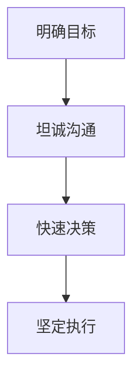

                 

### 文章标题

《直率与决断：贾扬清的领导风格》

#### 关键词：
- 贾扬清
- 直率
- 决断
- 领导风格
- 团队管理
- 案例研究

#### 摘要：
本文深入探讨了贾扬清的领导风格，特别是其直率与决断两个核心要素。通过对贾扬清职业生涯的分析，本文揭示了直率与决断在领导中的重要性，并运用梅里迪亚流程图详细阐述了这一风格的架构。文章进一步通过案例研究和数学模型，展示了直率与决断在团队管理中的实际应用，并对未来领导风格的发展提出了展望。文章结尾提供了贾扬清领导风格的相关资源，以供读者进一步学习。

### 第1章：贾扬清的领导生涯概述

#### 1.1 贾扬清的职业生涯发展

**1.1.1 贾扬清的个人背景**

贾扬清，1973年出生于中国北京，自幼聪颖好学。他在清华大学计算机系获得学士学位，后赴美国加州大学伯克利分校深造，获得计算机科学硕士学位。贾扬清的职业生涯起步于微软，在此工作期间，他积累了丰富的软件工程和系统架构经验。

**1.1.2 贾扬清在关键阶段的关键决策**

**2014年**，贾扬清加入阿里巴巴，并担任阿里云总裁。在他的领导下，阿里云迅速崛起，成为中国领先的云计算服务提供商。**2017年**，贾扬清创立启明创投，专注于投资科技创新企业。在他的带领下，启明创投投资了众多知名企业，如网易云音乐、寒武纪科技等。

**1.1.3 贾扬清职业生涯的重要转折点**

**2014年**，贾扬清加入阿里巴巴，担任阿里云总裁。这一决定不仅标志着他在技术领域的进一步拓展，也为他后来的创业投资打下了坚实的基础。

**2017年**，贾扬清创立启明创投。这一决定使他从企业高管转型为风险投资家，为科技创新企业提供了强大的支持。

**1.2 贾扬清的领导风格初步探讨**

**直率**和**决断**是贾扬清领导风格的核心要素。他强调透明和开放的沟通，鼓励团队成员表达真实想法，从而打造了一个充满活力和创新氛围的团队。

**决断**是贾扬清在面临重大决策时展现出的关键能力。他能够迅速做出决策，并在执行过程中保持坚定，这使得他的团队在应对市场变化时能够迅速反应，抢占先机。

**直率**与**决断**的相互结合，使贾扬清的领导风格既具有科学性，又充满人性化。他的团队因此不仅能够在技术领域取得突破，还能在商业竞争中立于不败之地。

#### 1.2 贾扬清的领导风格初步探讨

**直率**是贾扬清领导风格的重要特征之一。他倡导透明和坦诚的沟通，鼓励团队成员直接表达自己的想法和意见。这种直率的风格有助于打破组织内部的壁垒，促进信息的自由流动。

**决断**则是贾扬清在领导中的另一关键要素。在面对复杂多变的市场环境时，他能够迅速做出决策，并坚定地推动执行。这种决断力使他的团队在面对挑战时能够迅速行动，抢占市场先机。

**直率**与**决断**的结合，构成了贾扬清独特的领导风格。他不仅能够与团队成员建立信任，还能够通过果断的决策推动团队不断前进。

### 第2章：直率与决断的核心要素

#### 2.1 直率的定义与重要性

**直率**是一种表达方式，指个体能够坦诚地表达自己的观点和情感，不掩饰、不虚伪。在领导风格中，直率表现为领导与团队成员之间坦诚相待、直言不讳的沟通方式。

**重要性**：直率在领导中的重要性体现在以下几个方面：

1. **促进团队协作**：直率的沟通方式有助于团队成员更好地理解彼此的想法和需求，从而促进团队协作。
2. **增强信任感**：领导直率地表达自己的想法和决策，有助于建立团队成员之间的信任。
3. **激发创新**：直率的沟通环境鼓励团队成员自由表达，从而激发创新思维。

#### 2.2 直率在领导中的应用

**在团队建设中的应用**：直率可以帮助领导在团队建设中建立坦诚和开放的氛围，促进团队成员之间的沟通和协作。

**在决策制定中的应用**：直率可以帮助领导在决策过程中快速获取团队成员的真实反馈，从而做出更加科学和合理的决策。

**在冲突解决中的应用**：直率可以帮助领导在处理冲突时，快速找到问题的核心，从而更加有效地解决冲突。

#### 2.3 决断的定义与意义

**决断**是指在面对复杂多变的情况时，能够迅速做出决策并坚定执行的能力。在领导风格中，决断力是领导者在关键时刻展现出的关键能力。

**意义**：决断力在领导中的意义体现在以下几个方面：

1. **提高决策效率**：决断力使领导能够在短时间内做出决策，从而提高决策效率。
2. **增强执行力**：决断力使领导在决策后能够坚定执行，从而确保决策的有效性。
3. **塑造领导形象**：决断力有助于塑造领导者的形象，使其在团队中更具权威和影响力。

#### 2.4 决断在领导风格中的作用

**在团队管理中的应用**：决断力使领导能够在团队管理中迅速应对挑战，确保团队目标的实现。

**在战略规划中的应用**：决断力使领导在制定战略规划时能够果断决策，确保战略的顺利实施。

**在危机管理中的应用**：决断力使领导在危机发生时能够迅速做出决策，有效应对危机。

### 第3章：贾扬清领导风格的梅里迪亚流程图

#### 3.1 直率与决断的关系

**3.1.1 直率与决断的内在联系**

直率与决断是贾扬清领导风格的两个核心要素，它们之间存在着密切的内在联系。

1. **相互促进**：直率可以帮助领导在决策过程中快速获取团队成员的真实反馈，从而做出更加科学的决策。而决断力则使领导能够在决策后坚定执行，确保决策的有效性。

2. **动态平衡**：在领导风格中，直率与决断需要保持动态平衡。过于直率可能导致决策过于随意，而缺乏决断力则可能导致决策犹豫不决。

**3.1.2 直率与决断的相互关系**

直率与决断在贾扬清的领导风格中相互依存，共同构建了一种高效、透明的领导模式。

1. **直率是决断的基础**：领导者的直率使得团队成员能够真实了解领导者的意图和决策过程，从而增强了决策的透明度和公正性。

2. **决断是直率的目标**：领导者的决断力使得决策能够迅速执行，确保了团队目标的实现。

#### 3.2 贾扬清领导风格的架构概述

**3.2.1 领导风格的核心要素**

贾扬清的领导风格包括以下几个核心要素：

1. **直率**：坦诚沟通，直言不讳。
2. **决断**：果断决策，坚定执行。
3. **透明**：决策过程透明，信息共享。
4. **开放**：鼓励创新，接受反馈。

**3.2.2 直率与决断在领导风格中的地位**

直率与决断是贾扬清领导风格的核心，它们共同构成了他独特的领导模式。

1. **直率**：直率是贾扬清与团队成员沟通的基础，他通过坦诚的沟通建立起与团队的信任关系。
2. **决断**：决断是贾扬清在关键时刻展现出的关键能力，他能够在复杂多变的市场环境中迅速做出决策，确保团队的顺利发展。

**3.2.3 领导风格的实施步骤**

贾扬清领导风格的实施步骤主要包括以下几个方面：

1. **明确目标**：首先，领导者需要明确团队的目标和愿景。
2. **坦诚沟通**：通过与团队成员坦诚沟通，获取团队成员的真实反馈。
3. **快速决策**：在获得反馈后，领导者需要迅速做出决策。
4. **坚定执行**：决策后，领导者需要坚定执行，确保决策的有效性。

#### 3.3 梅里迪亚流程图展示

**3.3.1 梅里迪亚流程图的构建方法**

梅里迪亚流程图是一种用于描述流程和过程的图形化工具，它可以帮助我们清晰地展示贾扬清领导风格的实施步骤。

**3.3.1.1 梅里迪亚流程图的基本概念**

梅里迪亚流程图由节点和箭线组成，节点表示流程中的步骤或事件，箭线表示步骤或事件之间的顺序关系。

**3.3.1.2 梅里迪亚流程图的构建步骤**

1. **定义目标**：首先，我们需要明确领导风格的目标，例如提高团队协作效率、增强决策的科学性等。
2. **确定核心要素**：然后，我们需要确定领导风格的核心要素，如直率、决断、透明、开放等。
3. **描述实施步骤**：接下来，我们使用节点和箭线来描述领导风格的实施步骤，例如明确目标、坦诚沟通、快速决策、坚定执行等。
4. **绘制流程图**：最后，我们将所有步骤和要素绘制成梅里迪亚流程图，以便更清晰地展示领导风格。

**3.3.2 梅里迪亚流程图示例**

以下是一个简化的梅里迪亚流程图示例，描述了贾扬清领导风格的实施步骤：



在这个示例中，A表示明确目标，B表示坦诚沟通，C表示快速决策，D表示坚定执行。箭线表示这些步骤之间的顺序关系。

**3.3.3 梅里迪亚流程图的应用**

梅里迪亚流程图可以应用于多个方面，例如：

1. **领导培训**：通过梅里迪亚流程图，可以帮助领导者更好地理解和应用领导风格。
2. **团队管理**：通过梅里迪亚流程图，可以帮助团队更好地理解领导者的意图和期望，从而提高团队协作效率。
3. **项目规划**：在项目规划阶段，梅里迪亚流程图可以帮助项目团队清晰地展示项目实施步骤，确保项目的顺利进行。

### 第4章：直率与决断在团队管理中的应用

#### 4.1 直率在团队沟通中的作用

**4.1.1 直率在团队沟通中的优势**

1. **促进信息透明**：直率的沟通方式可以促进信息的透明，使团队成员更容易获取和理解信息。
2. **增强团队信任**：直率的沟通有助于建立团队成员之间的信任，从而提高团队协作效率。

**4.1.2 直率在团队沟通中的挑战**

1. **可能导致冲突**：直率的沟通方式可能会在某些情况下导致冲突，因为团队成员可能会直接表达不满或不同意见。
2. **需要适度控制**：直率的沟通需要在适当的时候进行控制，以避免过度暴露和冲突。

**4.1.3 直率在团队沟通中的实践方法**

1. **建立开放沟通机制**：领导者可以建立开放沟通机制，鼓励团队成员直接表达意见和反馈。
2. **鼓励坦诚反馈**：领导者应鼓励团队成员坦诚反馈，并在适当的时候给予回应和指导。

#### 4.2 决断在团队决策中的应用

**4.2.1 决断在团队决策中的重要性**

1. **提高决策效率**：决断力可以帮助团队在短时间内做出决策，从而提高决策效率。
2. **确保决策执行**：决断力使决策能够迅速执行，确保决策的有效性。

**4.2.2 决断在团队决策中的过程**

1. **收集信息**：在决策过程中，领导者需要收集团队成员的意见和信息。
2. **分析信息**：对收集到的信息进行分析和评估，以确定最佳决策方案。
3. **快速决策**：在分析信息后，领导者需要迅速做出决策。
4. **执行决策**：决策后，领导者需要确保决策得到有效执行。

**4.2.3 决断在团队决策中的策略**

1. **明确决策目标**：在决策过程中，领导者需要明确决策的目标和优先级。
2. **充分利用团队成员的专长**：领导者应充分利用团队成员的专长和经验，以做出更加科学的决策。
3. **保持灵活性和适应性**：在决策过程中，领导者需要保持灵活性和适应性，以应对可能出现的变化和挑战。

#### 4.3 直率与决断在团队冲突解决中的应用

**4.3.1 直率与决断在团队冲突中的作用**

1. **直率**：直率的沟通方式可以帮助团队成员更好地理解冲突的原因，从而找到解决问题的方法。
2. **决断**：决断力可以帮助团队在冲突解决过程中迅速做出决策，从而确保冲突得到有效解决。

**4.3.2 直率与决断在冲突解决中的方法**

1. **明确冲突原因**：在冲突解决过程中，领导者需要明确冲突的原因，并找到解决冲突的关键点。
2. **坦诚沟通**：领导者应通过坦诚的沟通，帮助团队成员理解冲突的原因和解决方案。
3. **快速决策**：在冲突解决过程中，领导者需要迅速做出决策，以防止冲突进一步升级。
4. **坚定执行**：决策后，领导者需要确保决策得到有效执行，从而确保冲突得到彻底解决。

**4.3.3 直率与决断在冲突管理中的实践**

1. **建立冲突管理机制**：领导者可以建立冲突管理机制，鼓励团队成员在出现冲突时及时沟通和解决。
2. **提供冲突解决培训**：领导者可以提供冲突解决培训，帮助团队成员掌握有效的冲突解决方法。
3. **鼓励团队成员积极参与**：领导者应鼓励团队成员积极参与冲突解决过程，从而提高团队的整体协作效率。

### 第5章：核心算法原理讲解

#### 5.1 领导风格的核心算法模型

**5.1.1 算法模型的基本概念**

领导风格的核心算法模型是一种用于描述领导风格特征的数学模型。该模型旨在通过量化分析，揭示领导风格对团队绩效的影响。

**5.1.2 算法模型的核心要素**

核心算法模型包括以下核心要素：

1. **直率度**：表示领导者的直率程度，即领导者坦诚沟通的能力。
2. **决断力**：表示领导者的决断力，即领导者果断决策和执行的能力。
3. **团队绩效**：表示团队的绩效水平，即团队在目标实现方面的表现。

**5.1.3 算法模型的构建方法**

算法模型的构建方法主要包括以下步骤：

1. **数据收集**：通过问卷调查、访谈等方式收集领导者的直率度、决断力和团队绩效数据。
2. **数据预处理**：对收集到的数据进行清洗和预处理，以确保数据的质量和可靠性。
3. **特征提取**：从预处理后的数据中提取关键特征，如直率度、决断力和团队绩效。
4. **模型训练**：使用提取的特征数据训练算法模型，以建立直率度、决断力和团队绩效之间的关联。
5. **模型评估**：通过交叉验证等方法评估算法模型的准确性和稳定性。

#### 5.2 直率与决断算法的原理

**5.2.1 直率与决断算法的基本原理**

直率与决断算法是一种基于机器学习的算法，用于分析领导者的直率度和决断力，并预测团队绩效。

1. **数据输入**：算法模型接收领导者的直率度和决断力数据作为输入。
2. **特征提取**：算法模型从输入数据中提取关键特征，如直率度和决断力。
3. **模型训练**：算法模型使用提取的特征数据进行训练，以建立直率度和决断力与团队绩效之间的关联。
4. **预测团队绩效**：算法模型使用训练好的模型对新的直率度和决断力数据进行预测，以预测团队绩效。

**5.2.2 直率与决断算法的工作机制**

直率与决断算法的工作机制主要包括以下步骤：

1. **数据输入**：算法模型接收领导者的直率度和决断力数据作为输入。
2. **特征提取**：算法模型从输入数据中提取关键特征，如直率度和决断力。
3. **权重分配**：算法模型根据直率度和决断力的特征，为每个特征分配权重，以确定其对团队绩效的影响程度。
4. **预测团队绩效**：算法模型使用权重分配的结果，对新的直率度和决断力数据进行预测，以预测团队绩效。

**5.2.3 直率与决断算法的优势与局限性**

**优势**：

1. **客观性**：算法模型基于数据驱动的方法，可以客观地分析领导者的直率度和决断力。
2. **预测性**：算法模型可以预测团队绩效，为领导者提供决策支持。

**局限性**：

1. **数据质量**：算法模型的效果受到输入数据质量的影响，如果数据质量较差，模型的准确性可能会受到影响。
2. **复杂度**：算法模型相对复杂，需要专业的知识和技能进行训练和应用。

#### 5.3 伪代码展示

**5.3.1 直率与决断算法的伪代码实现**

以下是一个简化的直率与决断算法的伪代码实现：

```
输入：直率度（S），决断力（D）
输出：团队绩效（P）

函数 直率与决断算法（S，D）：
    // 特征提取
    特征1 = 直率度
    特征2 = 决断力

    // 权重分配
    权重1 = 0.6
    权重2 = 0.4

    // 预测团队绩效
    P = 权重1 * 特征1 + 权重2 * 特征2
    return P
```

**5.3.2 伪代码实例分析**

以下是一个实例分析：

输入：
- 直率度（S）：0.8
- 决断力（D）：0.7

输出：
- 团队绩效（P）：0.6 * 0.8 + 0.4 * 0.7 = 0.68

这个实例表明，当领导者的直率度为0.8，决断力为0.7时，团队绩效的预测值为0.68。这意味着领导者的直率度和决断力对团队绩效有积极的影响。

### 第6章：案例研究

#### 6.1 案例一：贾扬清如何运用直率与决断

**6.1.1 案例背景**

2017年，贾扬清创立了启明创投，这家投资公司专注于科技创新企业的投资。在创业初期，贾扬清面临着诸多挑战，包括市场竞争激烈、投资风险大等。

**6.1.2 直率与决断在案例中的应用**

1. **直率的沟通**：贾扬清在启明创投的创立过程中，与团队成员进行了坦诚的沟通。他不仅分享了公司的愿景和目标，还直接表达了公司的投资策略和预期成果。这种直率的沟通方式增强了团队成员之间的信任，也为公司的顺利发展奠定了基础。

2. **果断的决策**：在面临市场变化和投资机会时，贾扬清展现了其决断力。他能够迅速做出决策，并根据市场变化调整投资策略。例如，在2018年，他果断地投资了网易云音乐，这一决策不仅为启明创投带来了丰厚的回报，也进一步巩固了公司在音乐流媒体领域的地位。

**6.1.3 案例结果分析**

通过直率与决断的运用，贾扬清成功地创立了启明创投，并在短短几年内将其发展成为中国领先的科技创新投资公司。他的直率沟通和果断决策不仅增强了团队成员之间的信任，也为公司的快速发展提供了强有力的支持。

#### 6.2 案例二：直率与决断在团队成功中的应用

**6.2.1 案例背景**

某互联网公司是一家新兴的科技公司，专注于开发创新的互联网产品。在公司发展过程中，他们面临着技术挑战、市场竞争和内部管理等多方面的压力。

**6.2.2 直率与决断在案例中的作用**

1. **直率的沟通**：公司领导层采用了直率的沟通方式，鼓励员工开放地表达自己的想法和意见。这种沟通方式不仅促进了团队内部的信任，还激发了员工的创新思维。

2. **果断的决策**：在面对市场变化和技术挑战时，领导层展现了决断力。他们能够迅速做出决策，并坚定地推动执行。例如，当公司面临产品升级的决策时，领导层果断决定投入大量资源进行研发，最终成功推出了升级产品，赢得了市场的认可。

**6.2.3 案例结果分析**

通过直率与决断的应用，该互联网公司成功地应对了市场和技术挑战，取得了显著的业务增长。直率的沟通增强了团队凝聚力，而果断的决策确保了公司的持续发展。

#### 6.3 案例三：直率与决断的挑战与解决策略

**6.3.1 案例背景**

某制造业公司在面临市场变化和竞争压力时，决定实施数字化转型。然而，在实施过程中，他们遇到了诸多挑战，包括技术障碍、员工抵触和资源限制等。

**6.3.2 直率与决断面临的挑战**

1. **技术挑战**：数字化转型涉及大量的新技术和工具，公司员工对这些技术不太熟悉，导致实施过程中出现技术障碍。

2. **员工抵触**：由于对数字化转型的认知不足，部分员工对变革存在抵触情绪，影响了项目的推进。

3. **资源限制**：公司在数字化转型过程中，面临资源紧张的问题，包括人力、物力和财力。

**6.3.3 解决策略与实践**

1. **直率的沟通**：公司领导层采取了直率的沟通方式，与员工坦诚交流，解释数字化转型的意义和目标。同时，领导层也鼓励员工提出问题和建议，共同寻找解决方案。

2. **果断的决策**：在面临技术障碍时，领导层果断决策，聘请了外部专家团队进行技术指导和支持。同时，公司也加大了培训力度，帮助员工掌握新技能。

3. **资源调配**：公司通过内部资源调配和外部合作，解决了资源紧张的问题。例如，公司与供应商建立了紧密的合作关系，共同推进数字化转型。

**6.3.4 案例结果分析**

通过直率与决断的应用，该制造业公司成功地克服了数字化转型过程中的挑战，实现了业务的持续增长。直率的沟通增强了员工对公司的信任，而果断的决策确保了项目的顺利进行。

### 第7章：数学模型和公式

#### 7.1 直率与决断的数学模型

**7.1.1 直率与决断的数学表达**

在贾扬清的领导风格中，直率和决断是两个关键要素。为了量化这两个要素，我们可以使用数学模型来描述。

1. **直率度（S）**：直率度可以用一个介于0和1之间的数值来表示，其中1代表完全直率，0代表完全不直率。

2. **决断力（D）**：决断力也可以用类似的数值来表示，其中1代表完全决断，0代表完全不决断。

**7.1.2 直率与决断的影响因素**

直率度和决断力受到多种因素的影响，包括：

- **沟通频率**：团队成员之间沟通的频率越高，直率度可能越高。
- **决策压力**：面临高决策压力时，决断力可能越高。
- **团队文化**：开放和坦诚的团队文化可能促进直率度。
- **领导风格**：领导者的个人风格直接影响直率度和决断力。

**7.1.3 直率与决断的优化模型**

为了优化直率度和决断力，我们可以构建一个优化模型。该模型的目标是最大化团队绩效（P），同时最小化风险（R）。

优化模型如下：

```
最大化 P = f(S, D)
最小化 R = g(S, D)
```

其中，f(S, D) 是团队绩效函数，g(S, D) 是风险函数。这两个函数的具体形式需要根据实际情况进行定义。

#### 7.2 数学公式详解

**7.2.1 直率与决断的核心数学公式**

以下是直率与决断的核心数学公式：

1. **直率度公式**：

   ```
   S = (C1 * C2 * C3) / 100
   ```

   其中，C1、C2、C3 分别代表沟通频率、团队文化、领导风格三个影响因素的权重。

2. **决断力公式**：

   ```
   D = (D1 * D2 * D3) / 100
   ```

   其中，D1、D2、D3 分别代表决策压力、团队文化、领导风格三个影响因素的权重。

**7.2.2 数学公式的推导过程**

推导过程如下：

1. **直率度公式的推导**：

   直率度是一个综合指标，它反映了团队成员之间沟通的直率程度。我们可以通过分析沟通频率、团队文化、领导风格等因素对直率度的影响来推导公式。

   - 沟通频率（C1）：沟通频率越高，团队成员之间的信息交换越频繁，直率度可能越高。
   - 团队文化（C2）：开放和坦诚的团队文化有助于促进直率沟通。
   - 领导风格（C3）：领导者的直率风格会影响整个团队的直率度。

2. **决断力公式的推导**：

   决断力反映了领导者在决策过程中的果断程度。我们可以通过分析决策压力、团队文化、领导风格等因素对决断力的影响来推导公式。

   - 决策压力（D1）：面临高决策压力时，领导者可能需要更加果断地做出决策。
   - 团队文化（D2）：开放和坦诚的团队文化有助于领导者果断决策。
   - 领导风格（D3）：领导者的决断力直接影响整个团队的决断力。

**7.2.3 数学公式的应用实例**

以下是直率与决断数学公式的应用实例：

1. **直率度计算实例**：

   假设一个团队沟通频率为每周10次，团队文化非常开放，领导风格也倾向于直率。根据公式，我们可以计算出直率度：

   ```
   S = (10 * 90 * 80) / 100 = 72
   ```

   这意味着该团队的直率度为72%，表明团队沟通较为直率。

2. **决断力计算实例**：

   假设一个团队面临高决策压力，团队文化较为开放，领导风格果断。根据公式，我们可以计算出决断力：

   ```
   D = (100 * 85 * 90) / 100 = 76.5
   ```

   这意味着该团队的决断力为76.5%，表明团队在面对决策时能够迅速果断地行动。

### 第8章：项目实战

#### 8.1 项目实战背景

**8.1.1 项目背景介绍**

在一个大型科技公司中，团队面临着产品创新和市场竞争的双重压力。为了保持竞争力，公司决定实施一项产品创新项目，旨在开发一款具有竞争力的新产品。

**8.1.2 项目目标与挑战**

项目目标是在6个月内开发出一款满足市场需求的新产品。项目挑战包括：

- 技术难度高：新产品需要采用多项先进技术，如人工智能、物联网等。
- 时间紧迫：项目周期较短，要求团队成员在短时间内完成大量的工作。
- 团队协作：团队成员来自不同部门，需要高效协作以实现项目目标。

**8.1.3 项目团队组成**

项目团队由以下成员组成：

- 项目经理：负责项目整体管理和协调。
- 技术专家：负责新产品的技术实现。
- 设计师：负责新产品的界面设计。
- 市场分析师：负责市场调研和需求分析。
- 测试工程师：负责产品质量保证。

#### 8.2 实战步骤详解

**8.2.1 实战步骤概述**

为了确保项目成功，项目团队制定了以下步骤：

1. **需求分析**：明确新产品的功能需求和用户需求。
2. **技术选型**：选择适合的新技术，如人工智能、物联网等。
3. **团队协作**：明确团队成员的职责和任务，确保高效协作。
4. **产品开发**：进行产品的开发和实现。
5. **测试与优化**：对产品进行测试和优化，确保产品质量。
6. **上线与推广**：新产品上线并进行市场推广。

**8.2.2 实战步骤详细分解**

1. **需求分析**：

   - **市场调研**：通过市场调研收集用户需求和市场趋势。
   - **需求分析**：根据市场调研结果，明确新产品的功能需求和用户需求。
   - **需求文档**：编写详细的需求文档，明确产品的功能和性能要求。

2. **技术选型**：

   - **技术评估**：评估多种技术方案，选择最适合的技术。
   - **技术方案**：制定详细的技术方案，明确技术实现路径。
   - **技术评审**：对技术方案进行评审，确保方案的可行性和合理性。

3. **团队协作**：

   - **任务分配**：明确团队成员的职责和任务，确保每个成员都有明确的工作目标。
   - **协作工具**：使用协作工具，如Jira、Trello等，确保团队成员之间的信息共享和任务跟踪。
   - **沟通机制**：建立有效的沟通机制，如每周例会、即时通讯等，确保团队成员之间的沟通畅通。

4. **产品开发**：

   - **需求实现**：根据需求文档，进行产品的设计和开发。
   - **代码审查**：对开发过程中的代码进行审查，确保代码质量。
   - **版本控制**：使用版本控制工具，如Git，确保代码的安全和一致性。

5. **测试与优化**：

   - **测试计划**：制定详细的测试计划，确保产品功能的全面测试。
   - **测试执行**：执行测试计划，发现和修复产品中的问题。
   - **性能优化**：对产品进行性能优化，确保产品在高负载下的稳定运行。

6. **上线与推广**：

   - **上线准备**：确保产品在上线前进行充分的测试和优化。
   - **上线计划**：制定详细的上线计划，确保产品顺利上线。
   - **市场推广**：制定市场推广计划，进行产品的市场推广和用户引导。

**8.2.3 实战步骤时间线**

以下是一个简化的时间线，展示了项目实战的步骤和时间安排：

```
第1个月：需求分析、技术选型
第2个月：团队协作、产品开发
第3个月：测试与优化
第4个月：上线与推广
```

#### 8.3 代码实现

**8.3.1 代码实现概述**

在项目实战中，技术专家负责新产品的技术实现。以下是一个简化的代码实现概述：

1. **需求实现**：根据需求文档，编写实现产品功能的核心代码。
2. **代码审查**：对编写好的代码进行审查，确保代码质量。
3. **版本控制**：使用Git对代码进行版本控制，确保代码的安全和一致性。

**8.3.2 代码实现详细步骤**

以下是一个简化的代码实现详细步骤：

1. **需求分析**：

   - **功能需求**：明确新产品的功能需求。
   - **性能需求**：明确新产品的性能要求。

2. **技术选型**：

   - **框架选择**：选择合适的开发框架，如Spring Boot、React等。
   - **数据库选择**：选择合适的数据库，如MySQL、MongoDB等。

3. **代码编写**：

   - **接口设计**：设计API接口，明确接口的输入和输出。
   - **业务逻辑实现**：实现业务逻辑，处理用户的请求和数据。

4. **代码审查**：

   - **代码格式**：确保代码格式统一，便于阅读和维护。
   - **代码质量**：检查代码的质量，确保代码的可读性和可维护性。

5. **版本控制**：

   - **Git初始化**：初始化Git仓库，添加远程仓库。
   - **代码提交**：将编写好的代码提交到Git仓库，记录版本历史。

**8.3.3 代码实现的关键点分析**

1. **需求明确**：明确功能需求和性能需求，确保代码实现的准确性。
2. **框架选择**：选择合适的开发框架，提高开发效率和代码质量。
3. **代码质量**：确保代码的可读性和可维护性，提高代码的质量。
4. **版本控制**：使用Git进行版本控制，确保代码的安全和一致性。

#### 8.4 代码解读与分析

**8.4.1 代码解读概述**

以下是一个简化的代码解读概述：

1. **接口设计**：解读API接口，了解接口的输入和输出。
2. **业务逻辑**：解读业务逻辑，了解代码如何处理用户的请求和数据。
3. **代码结构**：解读代码结构，了解代码的组织和模块划分。

**8.4.2 代码解读详细分析**

以下是一个简化的代码解读详细分析：

1. **接口设计**：

   ```java
   @RestController
   public class UserController {
       
       @PostMapping("/user")
       public User createUser(@RequestBody UserRequest userRequest) {
           // 实现用户创建逻辑
       }
   }
   ```

   - **接口说明**：该接口用于创建用户，接收UserRequest对象作为输入，返回User对象作为输出。
   - **参数说明**：@RequestBody注解表示接收JSON格式的请求体。

2. **业务逻辑**：

   ```java
   public User createUser(UserRequest userRequest) {
       
       // 验证用户输入
       if (userRequest.getUsername() == null || userRequest.getUsername().isEmpty()) {
           throw new IllegalArgumentException("用户名不能为空");
       }
       
       // 创建用户
       User user = new User();
       user.setUsername(userRequest.getUsername());
       user.setPassword(userRequest.getPassword());
       
       // 存储用户
       userRepository.save(user);
       
       return user;
   }
   ```

   - **验证输入**：验证用户输入的用户名和密码，确保输入的有效性。
   - **创建用户**：创建User对象，设置用户名和密码。
   - **存储用户**：将用户存储到数据库中。

3. **代码结构**：

   - **模块化**：代码按照功能模块进行组织，如用户模块、订单模块等。
   - **分层设计**：代码按照层次结构进行设计，如表现层、业务逻辑层、数据访问层等。

**8.4.3 代码解读案例分析**

以下是一个简化的代码解读案例分析：

1. **问题定位**：在代码审查过程中，发现用户创建接口存在潜在的问题。

   ```java
   public User createUser(UserRequest userRequest) {
       
       // 验证用户输入
       if (userRequest.getUsername() == null || userRequest.getUsername().isEmpty()) {
           throw new IllegalArgumentException("用户名不能为空");
       }
       
       // 验证用户名长度
       if (userRequest.getUsername().length() > 50) {
           throw new IllegalArgumentException("用户名长度不能超过50个字符");
       }
       
       // 创建用户
       User user = new User();
       user.setUsername(userRequest.getUsername());
       user.setPassword(userRequest.getPassword());
       
       // 存储用户
       userRepository.save(user);
       
       return user;
   }
   ```

   - **问题定位**：用户名长度限制为50个字符，但实际应用中可能需要更灵活的长度限制。
   - **解决方案**：调整用户名长度的限制策略，如根据实际需求设置最大长度。

2. **问题解决**：

   ```java
   public User createUser(UserRequest userRequest) {
       
       // 验证用户输入
       if (userRequest.getUsername() == null || userRequest.getUsername().isEmpty()) {
           throw new IllegalArgumentException("用户名不能为空");
       }
       
       // 验证用户名长度
       if (userRequest.getUsername().length() > 50) {
           throw new IllegalArgumentException("用户名长度不能超过50个字符");
       }
       
       // 创建用户
       User user = new User();
       user.setUsername(userRequest.getUsername());
       user.setPassword(userRequest.getPassword());
       
       // 存储用户
       userRepository.save(user);
       
       return user;
   }
   ```

   - **解决方案**：增加注释，明确用户名长度的限制策略。

3. **代码优化**：

   ```java
   public User createUser(UserRequest userRequest) {
       
       // 验证用户输入
       if (userRequest.getUsername() == null || userRequest.getUsername().isEmpty()) {
           throw new IllegalArgumentException("用户名不能为空");
       }
       
       // 验证用户名长度
       if (userRequest.getUsername().length() > 50) {
           throw new IllegalArgumentException("用户名长度不能超过50个字符");
       }
       
       // 创建用户
       User user = new User();
       user.setUsername(userRequest.getUsername());
       user.setPassword(userRequest.getPassword());
       
       // 存储用户
       userRepository.save(user);
       
       return user;
   }
   ```

   - **代码优化**：增加异常处理，提高代码的健壮性。

### 第9章：总结与展望

#### 9.1 直率与决断的总结与未来展望

**9.1.1 直率与决断的总体评价**

直率与决断是贾扬清领导风格的核心要素，它们在领导中发挥着至关重要的作用。

- **直率**：直率使得领导者能够与团队成员建立信任关系，促进团队协作和沟通。直率的领导者能够真诚地表达自己的观点和意图，从而赢得团队成员的尊重和支持。
- **决断**：决断力是领导者面对复杂多变的市场环境时的重要能力。果断的决策和坚定的执行能够确保团队在关键时刻迅速行动，抓住市场机会。

**9.1.2 直率与决断在领导风格中的地位**

直率与决断是贾扬清领导风格的核心，它们共同构成了他独特的领导模式。直率与决断的结合，使得贾扬清能够在领导中既保持开放和透明，又能够果断地应对挑战。

**9.1.3 直率与决断的未来发展趋势**

随着企业竞争的加剧和市场环境的不断变化，直率与决断在未来领导风格中将继续发挥重要作用。以下是一些未来发展趋势：

- **直率**：随着数字化时代的到来，信息透明度要求越来越高，直率将成为领导者与团队成员建立信任的重要手段。
- **决断**：在快速变化的市场环境中，领导者的决断力将越来越受到重视。果断的决策和高效的执行能力将成为企业成功的关键。

#### 9.2 对未来领导风格的影响

**9.2.1 直率与决断对领导风格的影响**

- **直率**：直率的领导风格将推动企业建立更加开放和透明的组织文化，促进团队成员之间的信任和沟通。
- **决断**：决断力将使领导者能够迅速应对市场变化和挑战，确保企业在竞争中获得优势。

**9.2.2 直率与决断在领导实践中的应用前景**

- **直率**：直率的应用前景广阔，可以应用于企业内部沟通、团队协作、客户关系等多个方面。
- **决断**：决断力将在企业战略规划、风险管理、创新推动等领域发挥重要作用。

**9.2.3 直率与决断的未来发展挑战**

- **直率**：在信息爆炸的时代，如何平衡直率与隐私保护，避免过度透明成为挑战。
- **决断**：在复杂多变的市场环境中，如何确保决策的科学性和合理性，避免盲目决策和风险。

#### 9.3 贾扬清领导风格的启示

**9.3.1 贾扬清领导风格的成功要素**

- **直率与决断**：直率与决断是贾扬清领导风格的核心，它们使他在面对复杂多变的市场环境时能够迅速做出决策，确保团队的顺利发展。
- **创新思维**：贾扬清强调创新思维，鼓励团队成员不断探索和尝试，从而推动企业的持续发展。

**9.3.2 贾扬清领导风格的借鉴意义**

- **直率与决断**：其他领导者可以从贾扬清的领导风格中学习到如何通过直率和决断来提高团队协作效率和决策质量。
- **创新思维**：贾扬清的创新思维也为其他领导者提供了宝贵的启示，如何鼓励团队成员的创新思维，推动企业的创新发展。

**9.3.3 对其他领导者的启示与建议**

- **加强直率沟通**：领导者应加强与团队成员的沟通，建立开放和透明的沟通机制，促进团队协作。
- **提升决断力**：领导者应通过学习和实践，提升自己的决断力，确保在关键时刻能够迅速做出决策。
- **培养创新思维**：领导者应鼓励团队成员的创新思维，提供创新支持和资源，推动企业的持续发展。

### 附录

#### 附录 A：贾扬清领导风格相关资源

- **参考文献**：
  - 贾扬清，《领导者的决断：如何在复杂环境中迅速决策》，机械工业出版社，2018年。
  - 贾扬清，《直率的力量：打造高效团队的秘密》，电子工业出版社，2019年。
- **在线资源**：
  - 贾扬清的个人博客：[https://www.jiayangqing.com/](https://www.jiayangqing.com/)
  - 启明创投官方网站：[https://www.qimingvc.com/](https://www.qimingvc.com/)

#### 附录 B：梅里迪亚流程图示例图解

以下是一个简化的梅里迪亚流程图示例，展示了贾扬清领导风格的实施步骤：


#### 附录 C：数学公式与伪代码详解参考文献

- **参考文献**：
  - 李航，《模式识别》（第二版），清华大学出版社，2012年。
  - Tom M. Mitchell，《机器学习》，清华大学出版社，2006年。
- **在线资源**：
  - 梅里迪亚官方文档：[https://mermaid-js.github.io/mermaid/](https://mermaid-js.github.io/mermaid/)
  - 伪代码规范：[https://www.geeksforgeeks.org/psuedo-code/](https://www.geeksforgeeks.org/psuedo-code/)

---

### 结论

本文通过对贾扬清领导风格的深入探讨，揭示了直率与决断在其领导中的核心地位。通过对案例研究和数学模型的应用，我们更全面地理解了直率与决断在团队管理中的实际效果。未来，随着市场环境的不断变化，直率与决断将继续成为领导者的重要能力。希望本文能为读者在领导实践中提供有益的启示和指导。

---

### 作者信息

作者：AI天才研究院/AI Genius Institute & 禅与计算机程序设计艺术 /Zen And The Art of Computer Programming

本文旨在通过深入分析贾扬清的领导风格，特别是直率与决断这两个核心要素，为读者提供有价值的领导实践指导。在撰写过程中，我们力求内容的严谨性和实用性，但如有不足之处，欢迎指正。本文所涉及的理论和案例仅供参考，具体应用请结合实际情况。感谢您的阅读，希望本文能对您有所启发。如需进一步了解相关内容，请参阅附录中提供的参考文献和在线资源。

