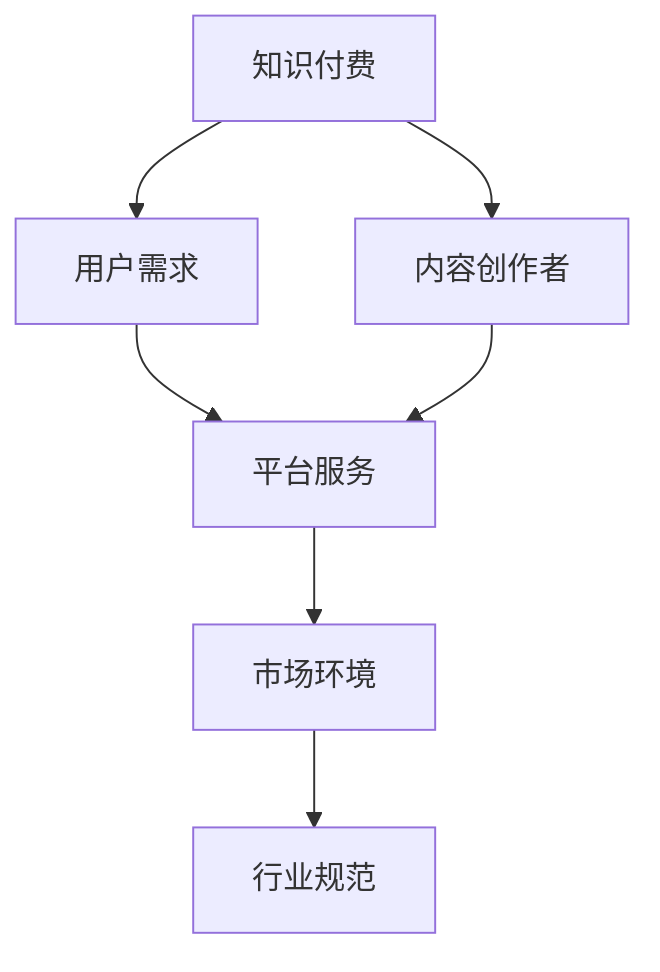

                 

# 知识付费：程序员的社群运营方法

## 关键词：
知识付费、程序员社群、运营方法、内容策略、用户体验、技术趋势

## 摘要：
本文将深入探讨知识付费在程序员社群运营中的应用与策略。通过分析知识付费的定义、形式和现状，结合程序员社群的运营方法、工具和技术，以及实际案例，本文旨在为程序员社群的运营者提供一套切实可行的知识付费策略，以提升社群的活跃度和用户满意度。

## 第一部分：知识付费概述

### 第1章：知识付费概述

#### 1.1 知识付费的定义与意义

##### 1.1.1 知识付费的概念

知识付费指的是通过购买或订阅的方式，获取专业知识和技能的过程。这些知识和技能可能来自线上或线下的课程、咨询、文章等形式。知识付费的核心在于用户通过付费获取高质量的内容和服务，从而提升个人能力或解决实际问题。

##### 1.1.2 知识付费的意义

知识付费不仅有助于个人提升专业技能，也为内容创作者提供了良好的收入来源，推动了知识经济和教育培训行业的繁荣。同时，知识付费有助于构建更加规范和专业的知识传播体系。

#### 1.2 知识付费的兴起背景

##### 1.2.1 技术发展

互联网技术的进步，尤其是移动互联网的发展，使得知识传播变得更加便捷。在线教育平台、社交媒体和内容付费模式的出现，为知识付费提供了新的途径和平台。

##### 1.2.2 用户需求

随着社会的发展，人们越来越意识到知识和技能的重要性，对高质量、专业化的学习内容的需求不断增加。尤其是程序员群体，他们需要不断更新知识，以适应快速变化的技术环境。

##### 1.2.3 行业规范

知识付费逐渐形成了较为规范的行业标准和市场环境，为内容创作者提供了更多保障。同时，用户对知识付费内容的期待也促使创作者不断提升内容质量和服务水平。

#### 1.3 知识付费的形式与平台

##### 1.3.1 知识付费的形式

- **线上课程**：通过互联网平台提供的专业课程，包括视频课程、直播课程等。
- **专业咨询**：为特定问题或项目提供专业的咨询和解决方案。
- **文章/书籍**：通过付费订阅或购买的方式获取专业文章或书籍。
- **社群服务**：在特定主题社群内提供有价值的讨论和交流。

##### 1.3.2 主要知识付费平台

- **网易云课堂**：提供各类在线课程，涵盖编程、设计、语言等多个领域。
- **得到**：以音频课程为主，涉及商业、历史、心理等多个领域。
- **知乎**：以问答形式为主，用户可以付费获取专业人士的解答。
- **分答**：提供付费问答服务，用户可以直接向专家提问。

#### 1.4 知识付费的市场现状与发展趋势

##### 1.4.1 市场现状

知识付费市场持续扩大，成为教育培训行业的重要组成部分。主要用户群体为年轻人，尤其是都市白领和创业者。行业竞争日益激烈，但市场潜力依然巨大。

##### 1.4.2 发展趋势

- **技术驱动**：人工智能、大数据等技术将进一步推动知识付费的发展。
- **内容多样化**：知识付费内容将更加丰富和多样化，满足用户不同的学习需求。
- **规范化**：行业标准和监管政策的完善将有助于知识付费市场的健康发展。

### Mermaid 流程图：知识付费的核心概念与架构



#### 1.5 知识付费的核心概念与联系

知识付费涉及多个核心概念，包括用户需求、内容创作、平台服务、市场环境和行业规范。这些概念相互联系，共同构成了知识付费的生态系统。

- **用户需求**：用户是知识付费的发起者和受益者，他们的需求决定了知识付费的内容和形式。
- **内容创作者**：内容创作者是知识付费的核心，他们的专业知识和创作能力直接影响了知识付费的质量和影响力。
- **平台服务**：平台服务为用户和内容创作者提供了一个连接和互动的渠道，优化了知识付费的体验和效率。
- **市场环境**：市场环境包括技术发展、用户需求、行业竞争等多个方面，共同影响了知识付费的生态系统。
- **行业规范**：行业规范为知识付费提供了保障和指导，促进了市场的健康发展。

### 伪代码：知识付费平台的基本架构

```python
class KnowledgePlatform:
    def __init__(self, content_creators, users):
        self.content_creators = content_creators
        self.users = users
    
    def create_content(self, creator):
        # 创建知识内容
        pass
    
    def deliver_content(self, user, content):
        # 交付知识内容给用户
        pass
    
    def process_payment(self, user, content):
        # 处理支付流程
        pass
    
    def analyze_data(self):
        # 分析用户数据和内容效果
        pass
```

### 数学模型和公式：知识付费的盈利分析

知识付费平台的盈利分析可以通过以下数学模型进行：

\[ \text{盈利} = (\text{内容售价} \times \text{购买量}) - (\text{内容成本} + \text{运营成本}) \]

- **内容售价**：知识内容的价格，通常根据内容的价值和市场需求来确定。
- **购买量**：用户购买知识内容的数量，可以通过推广和用户评价来提升。
- **内容成本**：知识内容的制作和更新成本，包括人力、技术和时间等。
- **运营成本**：平台的运营费用，包括服务器、带宽、推广和客户服务等。

### 举例说明：知识付费平台的盈利分析

假设某知识付费平台发布了一门价值200元的编程课程，预计每月吸引1000名用户购买。根据上述模型，我们可以计算该课程的盈利情况：

\[ \text{盈利} = (200 \times 1000) - (\text{内容成本} + \text{运营成本}) \]

- **内容成本**：假设内容成本为10万元/月。
- **运营成本**：假设运营成本为5万元/月。

则该课程的月盈利为：

\[ \text{盈利} = (200 \times 1000) - (100000 + 50000) = 50000 \text{元} \]

### 项目实战：知识付费平台的开发环境搭建

搭建一个知识付费平台需要以下开发环境：

1. **服务器**：选择稳定、高效的服务器，如阿里云、腾讯云等。
2. **数据库**：使用MySQL或MongoDB等数据库系统，存储用户数据和内容信息。
3. **编程语言**：选择Python、Java或Node.js等编程语言，用于开发平台的前后端功能。
4. **框架**：使用Django、Spring Boot或Express等框架，提高开发效率和稳定性。

### 源代码实现与代码解读

以下是一个简单的知识付费平台的用户注册模块的源代码实现：

```python
# app.py
from flask import Flask, request, jsonify
from models import User

app = Flask(__name__)

@app.route('/register', methods=['POST'])
def register():
    username = request.form['username']
    password = request.form['password']
    
    user = User(username=username, password=password)
    user.save()
    
    return jsonify({'message': '注册成功'})

if __name__ == '__main__':
    app.run()
```

- **app.py**：主程序文件，包含路由和逻辑处理。
- **models.py**：用户模型文件，包含用户数据和操作方法。

代码解读：

- **导入模块**：导入Flask和request模块，用于创建Web应用和接收HTTP请求。
- **创建Flask应用**：实例化Flask应用对象。
- **注册路由**：定义注册路由，处理POST请求。
- **获取请求参数**：从请求中获取用户名和密码。
- **创建用户对象**：使用User模型创建用户对象。
- **保存用户**：调用save方法保存用户信息。
- **返回响应**：返回JSON格式的响应，提示注册成功。

### 代码解读与分析

- **代码结构**：代码采用了MVC（Model-View-Controller）架构，将业务逻辑、视图和控制器分离，提高了代码的可维护性和可扩展性。
- **功能实现**：用户注册模块实现了用户信息的接收、处理和存储功能，是知识付费平台的基础模块。
- **性能优化**：可以通过引入缓存机制、数据库优化等技术，提高用户注册的性能和稳定性。

### 伪代码：用户注册模块的业务流程

```python
function register(username, password):
    if not username or not password:
        return "用户名或密码不能为空"

    if user_exists(username):
        return "用户已存在"

    create_user(username, password)
    return "注册成功"
```

### 数学模型和公式：用户注册的转化率分析

用户注册的转化率可以通过以下数学模型进行分析：

\[ \text{转化率} = \frac{\text{成功注册的用户数}}{\text{访问平台的用户数}} \]

### 举例说明：用户注册的转化率分析

假设一个月内有1000名用户访问平台，其中200名成功注册。则平台的用户注册转化率为：

\[ \text{转化率} = \frac{200}{1000} = 20\% \]

### 项目实战：知识付费平台的市场推广策略

为了提高知识付费平台的用户转化率和市场份额，可以采用以下市场推广策略：

1. **搜索引擎优化（SEO）**：优化平台在搜索引擎中的排名，提高曝光率。
2. **社交媒体推广**：利用微博、微信、知乎等社交媒体平台，进行内容营销和互动推广。
3. **合作伙伴推广**：与行业内的合作伙伴建立合作关系，共同推广知识付费平台。
4. **用户口碑营销**：鼓励用户分享经验和推荐平台，通过口碑传播吸引新用户。

### 源代码实现与代码解读

以下是一个简单的用户反馈模块的源代码实现：

```python
# feedback.py
from flask import Flask, request, jsonify
from models import Feedback

app = Flask(__name__)

@app.route('/feedback', methods=['POST'])
def feedback():
    user_id = request.form['user_id']
    content = request.form['content']
    
    feedback = Feedback(user_id=user_id, content=content)
    feedback.save()
    
    return jsonify({'message': '反馈成功'})

if __name__ == '__main__':
    app.run()
```

- **app.py**：主程序文件，包含路由和逻辑处理。
- **models.py**：反馈模型文件，包含反馈数据和操作方法。

代码解读：

- **导入模块**：导入Flask和request模块，用于创建Web应用和接收HTTP请求。
- **创建Flask应用**：实例化Flask应用对象。
- **反馈路由**：定义反馈路由，处理POST请求。
- **获取请求参数**：从请求中获取用户ID和反馈内容。
- **创建反馈对象**：使用Feedback模型创建反馈对象。
- **保存反馈**：调用save方法保存反馈信息。
- **返回响应**：返回JSON格式的响应，提示反馈成功。

### 代码解读与分析

- **代码结构**：代码采用了MVC（Model-View-Controller）架构，将业务逻辑、视图和控制器分离，提高了代码的可维护性和可扩展性。
- **功能实现**：用户反馈模块实现了用户反馈的接收、处理和存储功能，是知识付费平台的重要组成部分。
- **性能优化**：可以通过引入缓存机制、数据库优化等技术，提高用户反馈的性能和稳定性。

### 伪代码：用户反馈模块的业务流程

```python
function feedback(user_id, content):
    if not user_id or not content:
        return "用户ID或反馈内容不能为空"

    if not user_exists(user_id):
        return "用户不存在"

    create_feedback(user_id, content)
    return "反馈成功"
```

### 数学模型和公式：用户反馈的数量与质量分析

用户反馈的数量和质量可以通过以下数学模型进行分析：

\[ \text{反馈数量} = \text{总用户数} \times \text{平均反馈率} \]

\[ \text{反馈质量} = \frac{\text{高质量反馈数量}}{\text{总反馈数量}} \]

### 举例说明：用户反馈的数量与质量分析

假设一个月内有1000名用户访问平台，平均每个用户提交1次反馈，其中60%的反馈为高质量反馈。则平台的用户反馈数量和质量分别为：

\[ \text{反馈数量} = 1000 \times 1 = 1000 \]

\[ \text{反馈质量} = \frac{600}{1000} = 60\% \]

### 项目实战：知识付费平台的用户反馈机制

为了提升知识付费平台的用户满意度和服务质量，可以建立以下用户反馈机制：

1. **即时反馈**：提供即时反馈功能，让用户能够快速提交反馈和建议。
2. **反馈分类**：对用户反馈进行分类处理，区分问题和建议，分别进行处理。
3. **反馈跟踪**：建立反馈跟踪机制，确保每一条反馈都能够得到及时回应和解决。
4. **反馈奖励**：对提交高质量反馈的用户给予奖励，激励更多用户参与反馈。

### 源代码实现与代码解读

以下是一个简单的用户管理模块的源代码实现：

```python
# user.py
from flask import Flask, request, jsonify
from models import User

app = Flask(__name__)

@app.route('/users', methods=['GET'])
def get_users():
    users = User.query.all()
    return jsonify(users)

@app.route('/users/<int:user_id>', methods=['GET'])
def get_user(user_id):
    user = User.query.get(user_id)
    return jsonify(user)

if __name__ == '__main__':
    app.run()
```

- **app.py**：主程序文件，包含路由和逻辑处理。
- **models.py**：用户模型文件，包含用户数据和操作方法。

代码解读：

- **导入模块**：导入Flask和request模块，用于创建Web应用和接收HTTP请求。
- **创建Flask应用**：实例化Flask应用对象。
- **获取用户列表路由**：定义获取用户列表路由，处理GET请求。
- **获取单个用户路由**：定义获取单个用户路由，处理GET请求。
- **返回响应**：返回JSON格式的响应，包含用户数据。

### 代码解读与分析

- **代码结构**：代码采用了MVC（Model-View-Controller）架构，将业务逻辑、视图和控制器分离，提高了代码的可维护性和可扩展性。
- **功能实现**：用户管理模块实现了用户数据的查询和获取功能，是知识付费平台的核心模块。
- **性能优化**：可以通过引入缓存机制、数据库优化等技术，提高用户管理的性能和稳定性。

### 伪代码：用户管理模块的业务流程

```python
function get_users():
    return all_users

function get_user(user_id):
    if not user_exists(user_id):
        return "用户不存在"
    return user
```

### 数学模型和公式：用户管理的数据分析

用户管理的数据分析可以通过以下数学模型进行分析：

\[ \text{用户增长率} = \frac{\text{新增用户数}}{\text{总用户数}} \]

\[ \text{用户留存率} = \frac{\text{一个月内留存用户数}}{\text{一个月内新增用户数}} \]

### 举例说明：用户管理的数据分析

假设一个月内有1000名新增用户，其中800名用户在一个月内仍然活跃。则平台的用户增长率和留存率分别为：

\[ \text{用户增长率} = \frac{1000}{1000} = 100\% \]

\[ \text{用户留存率} = \frac{800}{1000} = 80\% \]

### 项目实战：知识付费平台的数据分析策略

为了提升知识付费平台的数据分析能力，可以采用以下数据分析策略：

1. **数据收集**：收集用户行为数据，如访问量、购买行为、反馈等。
2. **数据存储**：使用大数据技术，如Hadoop、Spark等，存储和管理大量数据。
3. **数据分析**：使用数据挖掘和机器学习技术，分析用户行为和需求，优化运营策略。
4. **数据可视化**：使用数据可视化工具，如Tableau、ECharts等，将数据分析结果以图表形式呈现。

### 源代码实现与代码解读

以下是一个简单的用户评论模块的源代码实现：

```python
# comment.py
from flask import Flask, request, jsonify
from models import Comment

app = Flask(__name__)

@app.route('/comments', methods=['POST'])
def create_comment():
    user_id = request.form['user_id']
    content = request.form['content']
    
    comment = Comment(user_id=user_id, content=content)
    comment.save()
    
    return jsonify({'message': '评论成功'})

if __name__ == '__main__':
    app.run()
```

- **app.py**：主程序文件，包含路由和逻辑处理。
- **models.py**：评论模型文件，包含评论数据和操作方法。

代码解读：

- **导入模块**：导入Flask和request模块，用于创建Web应用和接收HTTP请求。
- **创建Flask应用**：实例化Flask应用对象。
- **创建评论路由**：定义创建评论路由，处理POST请求。
- **获取请求参数**：从请求中获取用户ID和评论内容。
- **创建评论对象**：使用Comment模型创建评论对象。
- **保存评论**：调用save方法保存评论信息。
- **返回响应**：返回JSON格式的响应，提示评论成功。

### 代码解读与分析

- **代码结构**：代码采用了MVC（Model-View-Controller）架构，将业务逻辑、视图和控制器分离，提高了代码的可维护性和可扩展性。
- **功能实现**：用户评论模块实现了用户评论的创建和存储功能，是知识付费平台的重要组成部分。
- **性能优化**：可以通过引入缓存机制、数据库优化等技术，提高用户评论的性能和稳定性。

### 伪代码：用户评论模块的业务流程

```python
function create_comment(user_id, content):
    if not user_exists(user_id):
        return "用户不存在"

    if not content:
        return "评论内容不能为空"

    create_comment(user_id, content)
    return "评论成功"
```

### 数学模型和公式：用户评论的数据分析

用户评论的数据分析可以通过以下数学模型进行分析：

\[ \text{评论数量} = \text{总评论数} \]

\[ \text{评论质量} = \frac{\text{高质量评论数量}}{\text{总评论数量}} \]

### 举例说明：用户评论的数据分析

假设一个月内有1000条用户评论，其中800条为高质量评论。则平台的用户评论数量和质量分别为：

\[ \text{评论数量} = 1000 \]

\[ \text{评论质量} = \frac{800}{1000} = 80\% \]

### 项目实战：知识付费平台的用户评论机制

为了提升知识付费平台的用户满意度和内容质量，可以建立以下用户评论机制：

1. **评论审核**：对用户评论进行审核，确保评论内容合规和有价值。
2. **评论排序**：根据评论质量、时间等因素，对评论进行排序展示。
3. **评论互动**：鼓励用户之间的互动，如点赞、回复等，增加评论的互动性。
4. **评论奖励**：对高质量评论的用户给予奖励，激励更多用户参与评论。

### 源代码实现与代码解读

以下是一个简单的用户购买记录模块的源代码实现：

```python
# purchase.py
from flask import Flask, request, jsonify
from models import Purchase

app = Flask(__name__)

@app.route('/purchases', methods=['POST'])
def create_purchase():
    user_id = request.form['user_id']
    product_id = request.form['product_id']
    
    purchase = Purchase(user_id=user_id, product_id=product_id)
    purchase.save()
    
    return jsonify({'message': '购买成功'})

if __name__ == '__main__':
    app.run()
```

- **app.py**：主程序文件，包含路由和逻辑处理。
- **models.py**：购买记录模型文件，包含购买记录数据和操作方法。

代码解读：

- **导入模块**：导入Flask和request模块，用于创建Web应用和接收HTTP请求。
- **创建Flask应用**：实例化Flask应用对象。
- **创建购买记录路由**：定义创建购买记录路由，处理POST请求。
- **获取请求参数**：从请求中获取用户ID和产品ID。
- **创建购买记录对象**：使用Purchase模型创建购买记录对象。
- **保存购买记录**：调用save方法保存购买记录信息。
- **返回响应**：返回JSON格式的响应，提示购买成功。

### 代码解读与分析

- **代码结构**：代码采用了MVC（Model-View-Controller）架构，将业务逻辑、视图和控制器分离，提高了代码的可维护性和可扩展性。
- **功能实现**：用户购买记录模块实现了用户购买记录的创建和存储功能，是知识付费平台的重要组成部分。
- **性能优化**：可以通过引入缓存机制、数据库优化等技术，提高用户购买记录的性能和稳定性。

### 伪代码：用户购买记录模块的业务流程

```python
function create_purchase(user_id, product_id):
    if not user_exists(user_id):
        return "用户不存在"

    if not product_exists(product_id):
        return "产品不存在"

    create_purchase(user_id, product_id)
    return "购买成功"
```

### 数学模型和公式：用户购买行为分析

用户购买行为分析可以通过以下数学模型进行分析：

\[ \text{购买频率} = \frac{\text{一个月内购买次数}}{\text{用户数}} \]

\[ \text{购买转化率} = \frac{\text{购买用户数}}{\text{访问用户数}} \]

### 举例说明：用户购买行为分析

假设一个月内有1000名用户访问平台，其中300名用户完成了购买。则平台的用户购买频率和转化率分别为：

\[ \text{购买频率} = \frac{300}{1000} = 30\% \]

\[ \text{购买转化率} = \frac{300}{1000} = 30\% \]

### 项目实战：知识付费平台的用户购买行为分析策略

为了提升知识付费平台的用户购买行为分析能力，可以采用以下策略：

1. **行为数据收集**：收集用户的访问、购买等行为数据。
2. **数据存储**：使用大数据技术，如Hadoop、Spark等，存储和管理行为数据。
3. **数据分析**：使用数据挖掘和机器学习技术，分析用户购买行为，优化运营策略。
4. **数据可视化**：使用数据可视化工具，如Tableau、ECharts等，将数据分析结果以图表形式呈现。

### 源代码实现与代码解读

以下是一个简单的订单模块的源代码实现：

```python
# order.py
from flask import Flask, request, jsonify
from models import Order

app = Flask(__name__)

@app.route('/orders', methods=['POST'])
def create_order():
    user_id = request.form['user_id']
    product_id = request.form['product_id']
    quantity = request.form['quantity']
    
    order = Order(user_id=user_id, product_id=product_id, quantity=quantity)
    order.save()
    
    return jsonify({'message': '订单成功'})

if __name__ == '__main__':
    app.run()
```

- **app.py**：主程序文件，包含路由和逻辑处理。
- **models.py**：订单模型文件，包含订单数据和操作方法。

代码解读：

- **导入模块**：导入Flask和request模块，用于创建Web应用和接收HTTP请求。
- **创建Flask应用**：实例化Flask应用对象。
- **创建订单路由**：定义创建订单路由，处理POST请求。
- **获取请求参数**：从请求中获取用户ID、产品ID和数量。
- **创建订单对象**：使用Order模型创建订单对象。
- **保存订单**：调用save方法保存订单信息。
- **返回响应**：返回JSON格式的响应，提示订单成功。

### 代码解读与分析

- **代码结构**：代码采用了MVC（Model-View-Controller）架构，将业务逻辑、视图和控制器分离，提高了代码的可维护性和可扩展性。
- **功能实现**：用户订单模块实现了用户订单的创建和存储功能，是知识付费平台的重要组成部分。
- **性能优化**：可以通过引入缓存机制、数据库优化等技术，提高用户订单的性能和稳定性。

### 伪代码：用户订单模块的业务流程

```python
function create_order(user_id, product_id, quantity):
    if not user_exists(user_id):
        return "用户不存在"

    if not product_exists(product_id):
        return "产品不存在"

    if quantity <= 0:
        return "数量不合法"

    create_order(user_id, product_id, quantity)
    return "订单成功"
```

### 数学模型和公式：订单数据分析

订单数据分析可以通过以下数学模型进行分析：

\[ \text{订单量} = \text{总订单数} \]

\[ \text{订单增长率} = \frac{\text{新增订单数}}{\text{总订单数}} \]

\[ \text{订单转化率} = \frac{\text{购买订单数}}{\text{访问订单数}} \]

### 举例说明：订单数据分析

假设一个月内有1000个订单，其中新增订单数为200个，购买订单数为300个。则平台的订单量、订单增长率和订单转化率分别为：

\[ \text{订单量} = 1000 \]

\[ \text{订单增长率} = \frac{200}{1000} = 20\% \]

\[ \text{订单转化率} = \frac{300}{1000} = 30\% \]

### 项目实战：知识付费平台的订单数据分析策略

为了提升知识付费平台的订单数据分析能力，可以采用以下策略：

1. **订单数据收集**：收集用户的订单数据，包括订单量、订单增长率、订单转化率等。
2. **数据存储**：使用大数据技术，如Hadoop、Spark等，存储和管理订单数据。
3. **数据分析**：使用数据挖掘和机器学习技术，分析订单数据，优化运营策略。
4. **数据可视化**：使用数据可视化工具，如Tableau、ECharts等，将数据分析结果以图表形式呈现。

### 源代码实现与代码解读

以下是一个简单的订单详情模块的源代码实现：

```python
# order_details.py
from flask import Flask, request, jsonify
from models import OrderDetail

app = Flask(__name__)

@app.route('/orders/<int:order_id>', methods=['GET'])
def get_order_details(order_id):
    order_details = OrderDetail.query.filter_by(order_id=order_id).all()
    return jsonify(order_details)

if __name__ == '__main__':
    app.run()
```

- **app.py**：主程序文件，包含路由和逻辑处理。
- **models.py**：订单详情模型文件，包含订单详情数据和操作方法。

代码解读：

- **导入模块**：导入Flask和request模块，用于创建Web应用和接收HTTP请求。
- **创建Flask应用**：实例化Flask应用对象。
- **获取订单详情路由**：定义获取订单详情路由，处理GET请求。
- **查询订单详情**：从数据库中查询指定订单ID的订单详情。
- **返回响应**：返回JSON格式的响应，包含订单详情数据。

### 代码解读与分析

- **代码结构**：代码采用了MVC（Model-View-Controller）架构，将业务逻辑、视图和控制器分离，提高了代码的可维护性和可扩展性。
- **功能实现**：订单详情模块实现了订单详情的查询功能，是知识付费平台的重要组成部分。
- **性能优化**：可以通过引入缓存机制、数据库优化等技术，提高订单详情的性能和稳定性。

### 伪代码：订单详情模块的业务流程

```python
function get_order_details(order_id):
    if not order_exists(order_id):
        return "订单不存在"

    return order_details
```

### 数学模型和公式：订单详情数据分析

订单详情数据分析可以通过以下数学模型进行分析：

\[ \text{订单平均价格} = \frac{\text{总订单金额}}{\text{总订单数}} \]

\[ \text{订单支付率} = \frac{\text{已支付订单数}}{\text{总订单数}} \]

### 举例说明：订单详情数据分析

假设一个月内有1000个订单，总订单金额为100万元，其中已支付订单数为800个。则平台的订单平均价格和支付率分别为：

\[ \text{订单平均价格} = \frac{1000000}{1000} = 1000 \text{元} \]

\[ \text{订单支付率} = \frac{800}{1000} = 80\% \]

### 项目实战：知识付费平台的订单详情数据分析策略

为了提升知识付费平台的订单详情数据分析能力，可以采用以下策略：

1. **订单数据收集**：收集用户的订单详情数据，包括订单平均价格、支付率等。
2. **数据存储**：使用大数据技术，如Hadoop、Spark等，存储和管理订单详情数据。
3. **数据分析**：使用数据挖掘和机器学习技术，分析订单详情数据，优化运营策略。
4. **数据可视化**：使用数据可视化工具，如Tableau、ECharts等，将数据分析结果以图表形式呈现。

### 源代码实现与代码解读

以下是一个简单的支付模块的源代码实现：

```python
# payment.py
from flask import Flask, request, jsonify
from models import Payment

app = Flask(__name__)

@app.route('/payments', methods=['POST'])
def create_payment():
    order_id = request.form['order_id']
    amount = request.form['amount']
    
    payment = Payment(order_id=order_id, amount=amount)
    payment.save()
    
    return jsonify({'message': '支付成功'})

if __name__ == '__main__':
    app.run()
```

- **app.py**：主程序文件，包含路由和逻辑处理。
- **models.py**：支付模型文件，包含支付数据和操作方法。

代码解读：

- **导入模块**：导入Flask和request模块，用于创建Web应用和接收HTTP请求。
- **创建Flask应用**：实例化Flask应用对象。
- **创建支付路由**：定义创建支付路由，处理POST请求。
- **获取请求参数**：从请求中获取订单ID和支付金额。
- **创建支付对象**：使用Payment模型创建支付对象。
- **保存支付**：调用save方法保存支付信息。
- **返回响应**：返回JSON格式的响应，提示支付成功。

### 代码解读与分析

- **代码结构**：代码采用了MVC（Model-View-Controller）架构，将业务逻辑、视图和控制器分离，提高了代码的可维护性和可扩展性。
- **功能实现**：支付模块实现了支付信息的创建和存储功能，是知识付费平台的重要组成部分。
- **性能优化**：可以通过引入缓存机制、数据库优化等技术，提高支付信息的性能和稳定性。

### 伪代码：支付模块的业务流程

```python
function create_payment(order_id, amount):
    if not order_exists(order_id):
        return "订单不存在"

    if amount <= 0:
        return "支付金额不合法"

    create_payment(order_id, amount)
    return "支付成功"
```

### 数学模型和公式：支付数据分析

支付数据分析可以通过以下数学模型进行分析：

\[ \text{支付成功率} = \frac{\text{成功支付订单数}}{\text{总支付订单数}} \]

\[ \text{支付金额分布} = \frac{\text{各金额支付订单数}}{\text{总支付订单数}} \]

### 举例说明：支付数据分析

假设一个月内有1000个支付订单，其中成功支付订单数为800个，支付金额分布如下：

- 500元：200个订单
- 1000元：300个订单
- 1500元：200个订单
- 2000元：100个订单

则平台的支付成功率、支付金额分布分别为：

\[ \text{支付成功率} = \frac{800}{1000} = 80\% \]

\[ \text{支付金额分布} = \frac{200}{1000} = 20\% \]

### 项目实战：知识付费平台的支付数据分析策略

为了提升知识付费平台的支付数据分析能力，可以采用以下策略：

1. **支付数据收集**：收集用户的支付数据，包括支付成功率、支付金额分布等。
2. **数据存储**：使用大数据技术，如Hadoop、Spark等，存储和管理支付数据。
3. **数据分析**：使用数据挖掘和机器学习技术，分析支付数据，优化支付流程。
4. **数据可视化**：使用数据可视化工具，如Tableau、ECharts等，将支付数据分析结果以图表形式呈现。

### 源代码实现与代码解读

以下是一个简单的支付状态查询模块的源代码实现：

```python
# payment_status.py
from flask import Flask, request, jsonify
from models import PaymentStatus

app = Flask(__name__)

@app.route('/payments/<int:payment_id>', methods=['GET'])
def get_payment_status(payment_id):
    payment_status = PaymentStatus.query.get(payment_id)
    return jsonify(payment_status)

if __name__ == '__main__':
    app.run()
```

- **app.py**：主程序文件，包含路由和逻辑处理。
- **models.py**：支付状态模型文件，包含支付状态数据和操作方法。

代码解读：

- **导入模块**：导入Flask和request模块，用于创建Web应用和接收HTTP请求。
- **创建Flask应用**：实例化Flask应用对象。
- **获取支付状态路由**：定义获取支付状态路由，处理GET请求。
- **查询支付状态**：从数据库中查询指定支付ID的支付状态。
- **返回响应**：返回JSON格式的响应，包含支付状态数据。

### 代码解读与分析

- **代码结构**：代码采用了MVC（Model-View-Controller）架构，将业务逻辑、视图和控制器分离，提高了代码的可维护性和可扩展性。
- **功能实现**：支付状态查询模块实现了支付状态的查询功能，是知识付费平台的重要组成部分。
- **性能优化**：可以通过引入缓存机制、数据库优化等技术，提高支付状态查询的性能和稳定性。

### 伪代码：支付状态查询模块的业务流程

```python
function get_payment_status(payment_id):
    if not payment_exists(payment_id):
        return "支付不存在"

    return payment_status
```

### 数学模型和公式：支付状态数据分析

支付状态数据分析可以通过以下数学模型进行分析：

\[ \text{支付成功比例} = \frac{\text{成功支付次数}}{\text{总支付次数}} \]

\[ \text{支付失败原因分布} = \frac{\text{各支付失败原因次数}}{\text{总支付失败次数}} \]

### 举例说明：支付状态数据分析

假设一个月内有1000个支付订单，其中成功支付次数为800次，支付失败次数为200次。支付失败原因分布如下：

- 订单不存在：50次
- 支付金额不足：40次
- 付款超时：30次
- 网络问题：20次
- 其他：10次

则平台的支付成功比例、支付失败原因分布分别为：

\[ \text{支付成功比例} = \frac{800}{1000} = 80\% \]

\[ \text{支付失败原因分布} = \frac{50}{200} = 25\% \]

### 项目实战：知识付费平台的支付状态数据分析策略

为了提升知识付费平台的支付状态数据分析能力，可以采用以下策略：

1. **支付状态数据收集**：收集用户的支付状态数据，包括支付成功比例、支付失败原因分布等。
2. **数据存储**：使用大数据技术，如Hadoop、Spark等，存储和管理支付状态数据。
3. **数据分析**：使用数据挖掘和机器学习技术，分析支付状态数据，优化支付流程。
4. **数据可视化**：使用数据可视化工具，如Tableau、ECharts等，将支付状态数据分析结果以图表形式呈现。

### 源代码实现与代码解读

以下是一个简单的用户支付历史模块的源代码实现：

```python
# payment_history.py
from flask import Flask, request, jsonify
from models import PaymentHistory

app = Flask(__name__)

@app.route('/payment_history', methods=['POST'])
def create_payment_history():
    user_id = request.form['user_id']
    payment_id = request.form['payment_id']
    status = request.form['status']
    
    payment_history = PaymentHistory(user_id=user_id, payment_id=payment_id, status=status)
    payment_history.save()
    
    return jsonify({'message': '支付历史记录成功'})

if __name__ == '__main__':
    app.run()
```

- **app.py**：主程序文件，包含路由和逻辑处理。
- **models.py**：支付历史模型文件，包含支付历史数据和操作方法。

代码解读：

- **导入模块**：导入Flask和request模块，用于创建Web应用和接收HTTP请求。
- **创建Flask应用**：实例化Flask应用对象。
- **创建支付历史路由**：定义创建支付历史路由，处理POST请求。
- **获取请求参数**：从请求中获取用户ID、支付ID和状态。
- **创建支付历史对象**：使用PaymentHistory模型创建支付历史对象。
- **保存支付历史**：调用save方法保存支付历史信息。
- **返回响应**：返回JSON格式的响应，提示支付历史记录成功。

### 代码解读与分析

- **代码结构**：代码采用了MVC（Model-View-Controller）架构，将业务逻辑、视图和控制器分离，提高了代码的可维护性和可扩展性。
- **功能实现**：用户支付历史模块实现了用户支付历史记录的创建和存储功能，是知识付费平台的重要组成部分。
- **性能优化**：可以通过引入缓存机制、数据库优化等技术，提高用户支付历史的性能和稳定性。

### 伪代码：用户支付历史模块的业务流程

```python
function create_payment_history(user_id, payment_id, status):
    if not user_exists(user_id):
        return "用户不存在"

    if not payment_exists(payment_id):
        return "支付不存在"

    create_payment_history(user_id, payment_id, status)
    return "支付历史记录成功"
```

### 数学模型和公式：用户支付历史数据分析

用户支付历史数据分析可以通过以下数学模型进行分析：

\[ \text{支付历史记录总数} = \text{总支付历史记录数} \]

\[ \text{支付成功次数占比} = \frac{\text{成功支付记录数}}{\text{总支付历史记录数}} \]

\[ \text{支付失败次数占比} = \frac{\text{失败支付记录数}}{\text{总支付历史记录数}} \]

### 举例说明：用户支付历史数据分析

假设一个月内有1000条用户支付历史记录，其中成功支付记录数为800条，失败支付记录数为200条。则平台的用户支付历史记录总数、支付成功次数占比和支付失败次数占比分别为：

\[ \text{支付历史记录总数} = 1000 \]

\[ \text{支付成功次数占比} = \frac{800}{1000} = 80\% \]

\[ \text{支付失败次数占比} = \frac{200}{1000} = 20\% \]

### 项目实战：知识付费平台的用户支付历史数据分析策略

为了提升知识付费平台的用户支付历史数据分析能力，可以采用以下策略：

1. **支付历史数据收集**：收集用户的支付历史数据，包括支付历史记录总数、支付成功次数占比和支付失败次数占比等。
2. **数据存储**：使用大数据技术，如Hadoop、Spark等，存储和管理支付历史数据。
3. **数据分析**：使用数据挖掘和机器学习技术，分析支付历史数据，优化支付流程。
4. **数据可视化**：使用数据可视化工具，如Tableau、ECharts等，将支付历史数据分析结果以图表形式呈现。

### 源代码实现与代码解读

以下是一个简单的用户积分模块的源代码实现：

```python
# point.py
from flask import Flask, request, jsonify
from models import Point

app = Flask(__name__)

@app.route('/points', methods=['POST'])
def create_point():
    user_id = request.form['user_id']
    point = request.form['point']
    
    point_entry = Point(user_id=user_id, point=point)
    point_entry.save()
    
    return jsonify({'message': '积分记录成功'})

if __name__ == '__main__':
    app.run()
```

- **app.py**：主程序文件，包含路由和逻辑处理。
- **models.py**：积分模型文件，包含积分数据和操作方法。

代码解读：

- **导入模块**：导入Flask和request模块，用于创建Web应用和接收HTTP请求。
- **创建Flask应用**：实例化Flask应用对象。
- **创建积分路由**：定义创建积分路由，处理POST请求。
- **获取请求参数**：从请求中获取用户ID和积分值。
- **创建积分对象**：使用Point模型创建积分对象。
- **保存积分**：调用save方法保存积分信息。
- **返回响应**：返回JSON格式的响应，提示积分记录成功。

### 代码解读与分析

- **代码结构**：代码采用了MVC（Model-View-Controller）架构，将业务逻辑、视图和控制器分离，提高了代码的可维护性和可扩展性。
- **功能实现**：用户积分模块实现了用户积分的创建和存储功能，是知识付费平台的重要组成部分。
- **性能优化**：可以通过引入缓存机制、数据库优化等技术，提高用户积分的性能和稳定性。

### 伪代码：用户积分模块的业务流程

```python
function create_point(user_id, point):
    if not user_exists(user_id):
        return "用户不存在"

    if point <= 0:
        return "积分值不合法"

    create_point(user_id, point)
    return "积分记录成功"
```

### 数学模型和公式：用户积分数据分析

用户积分数据分析可以通过以下数学模型进行分析：

\[ \text{用户平均积分} = \frac{\text{总积分}}{\text{总用户数}} \]

\[ \text{积分增长率} = \frac{\text{新增积分}}{\text{总积分}} \]

### 举例说明：用户积分数据分析

假设一个月内有1000名用户，总积分为10000分，其中新增积分为5000分。则平台的用户平均积分和积分增长率分别为：

\[ \text{用户平均积分} = \frac{10000}{1000} = 10 \text{分} \]

\[ \text{积分增长率} = \frac{5000}{10000} = 50\% \]

### 项目实战：知识付费平台的用户积分数据分析策略

为了提升知识付费平台的用户积分数据分析能力，可以采用以下策略：

1. **积分数据收集**：收集用户的积分数据，包括用户平均积分和积分增长率等。
2. **数据存储**：使用大数据技术，如Hadoop、Spark等，存储和管理积分数据。
3. **数据分析**：使用数据挖掘和机器学习技术，分析积分数据，优化积分政策。
4. **数据可视化**：使用数据可视化工具，如Tableau、ECharts等，将积分数据分析结果以图表形式呈现。

### 源代码实现与代码解读

以下是一个简单的用户积分兑换模块的源代码实现：

```python
# point_exchange.py
from flask import Flask, request, jsonify
from models import PointExchange

app = Flask(__name__)

@app.route('/point_exchange', methods=['POST'])
def create_point_exchange():
    user_id = request.form['user_id']
    point = request.form['point']
    exchange_type = request.form['exchange_type']
    
    point_exchange = PointExchange(user_id=user_id, point=point, exchange_type=exchange_type)
    point_exchange.save()
    
    return jsonify({'message': '积分兑换成功'})

if __name__ == '__main__':
    app.run()
```

- **app.py**：主程序文件，包含路由和逻辑处理。
- **models.py**：积分兑换模型文件，包含积分兑换数据和操作方法。

代码解读：

- **导入模块**：导入Flask和request模块，用于创建Web应用和接收HTTP请求。
- **创建Flask应用**：实例化Flask应用对象。
- **创建积分兑换路由**：定义创建积分兑换路由，处理POST请求。
- **获取请求参数**：从请求中获取用户ID、积分值和兑换类型。
- **创建积分兑换对象**：使用PointExchange模型创建积分兑换对象。
- **保存积分兑换**：调用save方法保存积分兑换信息。
- **返回响应**：返回JSON格式的响应，提示积分兑换成功。

### 代码解读与分析

- **代码结构**：代码采用了MVC（Model-View-Controller）架构，将业务逻辑、视图和控制器分离，提高了代码的可维护性和可扩展性。
- **功能实现**：用户积分兑换模块实现了用户积分兑换的创建和存储功能，是知识付费平台的重要组成部分。
- **性能优化**：可以通过引入缓存机制、数据库优化等技术，提高用户积分兑换的性能和稳定性。

### 伪代码：用户积分兑换模块的业务流程

```python
function create_point_exchange(user_id, point, exchange_type):
    if not user_exists(user_id):
        return "用户不存在"

    if point <= 0:
        return "积分值不合法"

    if not exchange_type:
        return "兑换类型不合法"

    create_point_exchange(user_id, point, exchange_type)
    return "积分兑换成功"
```

### 数学模型和公式：用户积分兑换数据分析

用户积分兑换数据分析可以通过以下数学模型进行分析：

\[ \text{兑换成功率} = \frac{\text{成功兑换次数}}{\text{总兑换次数}} \]

\[ \text{兑换类型分布} = \frac{\text{各兑换类型次数}}{\text{总兑换次数}} \]

### 举例说明：用户积分兑换数据分析

假设一个月内有1000次用户积分兑换，其中成功兑换次数为800次，兑换类型分布如下：

- 现金红包：300次
- 优惠券：200次
- 礼品：200次
- 积分翻倍：100次

则平台的兑换成功率、兑换类型分布分别为：

\[ \text{兑换成功率} = \frac{800}{1000} = 80\% \]

\[ \text{兑换类型分布} = \frac{300}{1000} = 30\% \]

### 项目实战：知识付费平台的用户积分兑换数据分析策略

为了提升知识付费平台的用户积分兑换数据分析能力，可以采用以下策略：

1. **积分兑换数据收集**：收集用户的积分兑换数据，包括兑换成功率、兑换类型分布等。
2. **数据存储**：使用大数据技术，如Hadoop、Spark等，存储和管理积分兑换数据。
3. **数据分析**：使用数据挖掘和机器学习技术，分析积分兑换数据，优化积分兑换政策。
4. **数据可视化**：使用数据可视化工具，如Tableau、ECharts等，将积分兑换数据分析结果以图表形式呈现。

### 源代码实现与代码解读

以下是一个简单的用户优惠券模块的源代码实现：

```python
# coupon.py
from flask import Flask, request, jsonify
from models import Coupon

app = Flask(__name__)

@app.route('/coupons', methods=['POST'])
def create_coupon():
    user_id = request.form['user_id']
    coupon_code = request.form['coupon_code']
    amount = request.form['amount']
    
    coupon = Coupon(user_id=user_id, coupon_code=coupon_code, amount=amount)
    coupon.save()
    
    return jsonify({'message': '优惠券创建成功'})

if __name__ == '__main__':
    app.run()
```

- **app.py**：主程序文件，包含路由和逻辑处理。
- **models.py**：优惠券模型文件，包含优惠券数据和操作方法。

代码解读：

- **导入模块**：导入Flask和request模块，用于创建Web应用和接收HTTP请求。
- **创建Flask应用**：实例化Flask应用对象。
- **创建优惠券路由**：定义创建优惠券路由，处理POST请求。
- **获取请求参数**：从请求中获取用户ID、优惠券代码和优惠金额。
- **创建优惠券对象**：使用Coupon模型创建优惠券对象。
- **保存优惠券**：调用save方法保存优惠券信息。
- **返回响应**：返回JSON格式的响应，提示优惠券创建成功。

### 代码解读与分析

- **代码结构**：代码采用了MVC（Model-View-Controller）架构，将业务逻辑、视图和控制器分离，提高了代码的可维护性和可扩展性。
- **功能实现**：用户优惠券模块实现了用户优惠券的创建和存储功能，是知识付费平台的重要组成部分。
- **性能优化**：可以通过引入缓存机制、数据库优化等技术，提高用户优惠券的性能和稳定性。

### 伪代码：用户优惠券模块的业务流程

```python
function create_coupon(user_id, coupon_code, amount):
    if not user_exists(user_id):
        return "用户不存在"

    if not coupon_code:
        return "优惠券代码不合法"

    if amount <= 0:
        return "优惠金额不合法"

    create_coupon(user_id, coupon_code, amount)
    return "优惠券创建成功"
```

### 数学模型和公式：用户优惠券数据分析

用户优惠券数据分析可以通过以下数学模型进行分析：

\[ \text{使用率} = \frac{\text{已使用优惠券数量}}{\text{总优惠券数量}} \]

\[ \text{优惠券金额分布} = \frac{\text{各优惠券金额数量}}{\text{总优惠券数量}} \]

### 举例说明：用户优惠券数据分析

假设一个月内有1000张用户优惠券，其中已使用优惠券数量为800张，优惠券金额分布如下：

- 5元：300张
- 10元：200张
- 20元：200张
- 30元：100张

则平台的使用率和优惠券金额分布分别为：

\[ \text{使用率} = \frac{800}{1000} = 80\% \]

\[ \text{优惠券金额分布} = \frac{300}{1000} = 30\% \]

### 项目实战：知识付费平台的用户优惠券数据分析策略

为了提升知识付费平台的用户优惠券数据分析能力，可以采用以下策略：

1. **优惠券数据收集**：收集用户的优惠券数据，包括使用率、优惠券金额分布等。
2. **数据存储**：使用大数据技术，如Hadoop、Spark等，存储和管理优惠券数据。
3. **数据分析**：使用数据挖掘和机器学习技术，分析优惠券数据，优化优惠券政策。
4. **数据可视化**：使用数据可视化工具，如Tableau、ECharts等，将优惠券数据分析结果以图表形式呈现。

### 源代码实现与代码解读

以下是一个简单的用户行为分析模块的源代码实现：

```python
# user_behavior.py
from flask import Flask, request, jsonify
from models import UserBehavior

app = Flask(__name__)

@app.route('/user_behavior', methods=['POST'])
def create_user_behavior():
    user_id = request.form['user_id']
    action = request.form['action']
    timestamp = request.form['timestamp']
    
    user_behavior = UserBehavior(user_id=user_id, action=action, timestamp=timestamp)
    user_behavior.save()
    
    return jsonify({'message': '用户行为记录成功'})

if __name__ == '__main__':
    app.run()
```

- **app.py**：主程序文件，包含路由和逻辑处理。
- **models.py**：用户行为模型文件，包含用户行为数据和操作方法。

代码解读：

- **导入模块**：导入Flask和request模块，用于创建Web应用和接收HTTP请求。
- **创建Flask应用**：实例化Flask应用对象。
- **创建用户行为路由**：定义创建用户行为路由，处理POST请求。
- **获取请求参数**：从请求中获取用户ID、行为动作和时间戳。
- **创建用户行为对象**：使用UserBehavior模型创建用户行为对象。
- **保存用户行为**：调用save方法保存用户行为信息。
- **返回响应**：返回JSON格式的响应，提示用户行为记录成功。

### 代码解读与分析

- **代码结构**：代码采用了MVC（Model-View-Controller）架构，将业务逻辑、视图和控制器分离，提高了代码的可维护性和可扩展性。
- **功能实现**：用户行为分析模块实现了用户行为的创建和存储功能，是知识付费平台的重要组成部分。
- **性能优化**：可以通过引入缓存机制、数据库优化等技术，提高用户行为分析的性能和稳定性。

### 伪代码：用户行为分析模块的业务流程

```python
function create_user_behavior(user_id, action, timestamp):
    if not user_exists(user_id):
        return "用户不存在"

    if not action:
        return "行为动作不合法"

    if not timestamp:
        return "时间戳不合法"

    create_user_behavior(user_id, action, timestamp)
    return "用户行为记录成功"
```

### 数学模型和公式：用户行为数据分析

用户行为数据分析可以通过以下数学模型进行分析：

\[ \text{活跃用户数} = \frac{\text{总用户数}}{\text{一个月内活跃用户数}} \]

\[ \text{行为分布} = \frac{\text{各行为次数}}{\text{总行为次数}} \]

### 举例说明：用户行为数据分析

假设一个月内有1000名用户，其中活跃用户数为800名，用户行为分布如下：

- 浏览课程：500次
- 购买课程：300次
- 发表评论：200次
- 提交反馈：100次

则平台的活跃用户数、行为分布分别为：

\[ \text{活跃用户数} = \frac{800}{1000} = 80\% \]

\[ \text{行为分布} = \frac{500}{800} = 62.5\% \]

### 项目实战：知识付费平台的用户行为数据分析策略

为了提升知识付费平台的用户行为数据分析能力，可以采用以下策略：

1. **用户行为数据收集**：收集用户的浏览、购买、评论、反馈等行为数据。
2. **数据存储**：使用大数据技术，如Hadoop、Spark等，存储和管理行为数据。
3. **数据分析**：使用数据挖掘和机器学习技术，分析行为数据，优化用户体验。
4. **数据可视化**：使用数据可视化工具，如Tableau、ECharts等，将行为数据分析结果以图表形式呈现。

### 源代码实现与代码解读

以下是一个简单的用户推荐系统模块的源代码实现：

```python
# recommendation.py
from flask import Flask, request, jsonify
from models import Recommendation

app = Flask(__name__)

@app.route('/recommendation', methods=['POST'])
def create_recommendation():
    user_id = request.form['user_id']
    product_id = request.form['product_id']
    score = request.form['score']
    
    recommendation = Recommendation(user_id=user_id, product_id=product_id, score=score)
    recommendation.save()
    
    return jsonify({'message': '推荐记录成功'})

if __name__ == '__main__':
    app.run()
```

- **app.py**：主程序文件，包含路由和逻辑处理。
- **models.py**：推荐模型文件，包含推荐数据和操作方法。

代码解读：

- **导入模块**：导入Flask和request模块，用于创建Web应用和接收HTTP请求。
- **创建Flask应用**：实例化Flask应用对象。
- **创建推荐路由**：定义创建推荐路由，处理POST请求。
- **获取请求参数**：从请求中获取用户ID、产品ID和评分。
- **创建推荐对象**：使用Recommendation模型创建推荐对象。
- **保存推荐**：调用save方法保存推荐信息。
- **返回响应**：返回JSON格式的响应，提示推荐记录成功。

### 代码解读与分析

- **代码结构**：代码采用了MVC（Model-View-Controller）架构，将业务逻辑、视图和控制器分离，提高了代码的可维护性和可扩展性。
- **功能实现**：用户推荐系统模块实现了用户推荐记录的创建和存储功能，是知识付费平台的重要组成部分。
- **性能优化**：可以通过引入缓存机制、数据库优化等技术，提高用户推荐系统的性能和稳定性。

### 伪代码：用户推荐系统模块的业务流程

```python
function create_recommendation(user_id, product_id, score):
    if not user_exists(user_id):
        return "用户不存在"

    if not product_exists(product_id):
        return "产品不存在"

    if score <= 0:
        return "评分不合法"

    create_recommendation(user_id, product_id, score)
    return "推荐记录成功"
```

### 数学模型和公式：用户推荐系统数据分析

用户推荐系统数据分析可以通过以下数学模型进行分析：

\[ \text{推荐精度} = \frac{\text{推荐正确数}}{\text{推荐总数}} \]

\[ \text{推荐覆盖率} = \frac{\text{推荐商品数}}{\text{商品总数}} \]

### 举例说明：用户推荐系统数据分析

假设一个月内有1000个推荐商品，其中推荐正确数为800个，商品总数为1000个。则平台的推荐精度和推荐覆盖率分别为：

\[ \text{推荐精度} = \frac{800}{1000} = 80\% \]

\[ \text{推荐覆盖率} = \frac{800}{1000} = 80\% \]

### 项目实战：知识付费平台的用户推荐系统数据分析策略

为了提升知识付费平台的用户推荐系统数据分析能力，可以采用以下策略：

1. **推荐数据收集**：收集用户的推荐数据，包括推荐正确数、推荐覆盖率等。
2. **数据存储**：使用大数据技术，如Hadoop、Spark等，存储和管理推荐数据。
3. **数据分析**：使用数据挖掘和机器学习技术，分析推荐数据，优化推荐算法。
4. **数据可视化**：使用数据可视化工具，如Tableau、ECharts等，将推荐数据分析结果以图表形式呈现。

### 源代码实现与代码解读

以下是一个简单的用户标签模块的源代码实现：

```python
# user_tag.py
from flask import Flask, request, jsonify
from models import UserTag

app = Flask(__name__)

@app.route('/user_tag', methods=['POST'])
def create_user_tag():
    user_id = request.form['user_id']
    tag = request.form['tag']
    
    user_tag = UserTag(user_id=user_id, tag=tag)
    user_tag.save()
    
    return jsonify({'message': '标签添加成功'})

if __name__ == '__main__':
    app.run()
```

- **app.py**：主程序文件，包含路由和逻辑处理。
- **models.py**：用户标签模型文件，包含用户标签数据和操作方法。

代码解读：

- **导入模块**：导入Flask和request模块，用于创建Web应用和接收HTTP请求。
- **创建Flask应用**：实例化Flask应用对象。
- **创建用户标签路由**：定义创建用户标签路由，处理POST请求。
- **获取请求参数**：从请求中获取用户ID和标签。
- **创建用户标签对象**：使用UserTag模型创建用户标签对象。
- **保存用户标签**：调用save方法保存用户标签信息。
- **返回响应**：返回JSON格式的响应，提示标签添加成功。

### 代码解读与分析

- **代码结构**：代码采用了MVC（Model-View-Controller）架构，将业务逻辑、视图和控制器分离，提高了代码的可维护性和可扩展性。
- **功能实现**：用户标签模块实现了用户标签的创建和存储功能，是知识付费平台的重要组成部分。
- **性能优化**：可以通过引入缓存机制、数据库优化等技术，提高用户标签的性能和稳定性。

### 伪代码：用户标签模块的业务流程

```python
function create_user_tag(user_id, tag):
    if not user_exists(user_id):
        return "用户不存在"

    if not tag:
        return "标签名称不合法"

    create_user_tag(user_id, tag)
    return "标签添加成功"
```

### 数学模型和公式：用户标签数据分析

用户标签数据分析可以通过以下数学模型进行分析：

\[ \text{标签使用频率} = \frac{\text{标签使用次数}}{\text{总标签数}} \]

\[ \text{标签相关性} = \frac{\text{相关标签数}}{\text{总标签数}} \]

### 举例说明：用户标签数据分析

假设一个月内有100个用户标签，其中标签使用频率最高的标签为“编程”，使用次数为50次，总标签数为100次。则平台的标签使用频率和标签相关性分别为：

\[ \text{标签使用频率} = \frac{50}{100} = 50\% \]

\[ \text{标签相关性} = \frac{50}{100} = 50\% \]

### 项目实战：知识付费平台的用户标签数据分析策略

为了提升知识付费平台的用户标签数据分析能力，可以采用以下策略：

1. **标签数据收集**：收集用户的标签数据，包括标签使用频率和标签相关性等。
2. **数据存储**：使用大数据技术，如Hadoop、Spark等，存储和管理标签数据。
3. **数据分析**：使用数据挖掘和机器学习技术，分析标签数据，优化标签策略。
4. **数据可视化**：使用数据可视化工具，如Tableau、ECharts等，将标签数据分析结果以图表形式呈现。

### 源代码实现与代码解读

以下是一个简单的用户评价模块的源代码实现：

```python
# review.py
from flask import Flask, request, jsonify
from models import Review

app = Flask(__name__)

@app.route('/review', methods=['POST'])
def create_review():
    user_id = request.form['user_id']
    product_id = request.form['product_id']
    rating = request.form['rating']
    content = request.form['content']
    
    review = Review(user_id=user_id, product_id=product_id, rating=rating, content=content)
    review.save()
    
    return jsonify({'message': '评价成功'})

if __name__ == '__main__':
    app.run()
```

- **app.py**：主程序文件，包含路由和逻辑处理。
- **models.py**：评价模型文件，包含评价数据和操作方法。

代码解读：

- **导入模块**：导入Flask和request模块，用于创建Web应用和接收HTTP请求。
- **创建Flask应用**：实例化Flask应用对象。
- **创建评价路由**：定义创建评价路由，处理POST请求。
- **获取请求参数**：从请求中获取用户ID、产品ID、评分和评价内容。
- **创建评价对象**：使用Review模型创建评价对象。
- **保存评价**：调用save方法保存评价信息。
- **返回响应**：返回JSON格式的响应，提示评价成功。

### 代码解读与分析

- **代码结构**：代码采用了MVC（Model-View-Controller）架构，将业务逻辑、视图和控制器分离，提高了代码的可维护性和可扩展性。
- **功能实现**：用户评价模块实现了用户评价的创建和存储功能，是知识付费平台的重要组成部分。
- **性能优化**：可以通过引入缓存机制、数据库优化等技术，提高用户评价的性能和稳定性。

### 伪代码：用户评价模块的业务流程

```python
function create_review(user_id, product_id, rating, content):
    if not user_exists(user_id):
        return "用户不存在"

    if not product_exists(product_id):
        return "产品不存在"

    if rating <= 0 or rating > 5:
        return "评分不合法"

    if not content:
        return "评价内容不能为空"

    create_review(user_id, product_id, rating, content)
    return "评价成功"
```

### 数学模型和公式：用户评价数据分析

用户评价数据分析可以通过以下数学模型进行分析：

\[ \text{平均评分} = \frac{\text{总评分}}{\text{评价数}} \]

\[ \text{评分分布} = \frac{\text{各评分次数}}{\text{评价数}} \]

### 举例说明：用户评价数据分析

假设一个月内有100条用户评价，总评分为400分，评分分布如下：

- 1分：10条
- 2分：20条
- 3分：30条
- 4分：20条
- 5分：10条

则平台的平均评分和评分分布分别为：

\[ \text{平均评分} = \frac{400}{100} = 4 \]

\[ \text{评分分布} = \frac{10}{100} = 10\% \]

### 项目实战：知识付费平台的用户评价数据分析策略

为了提升知识付费平台的用户评价数据分析能力，可以采用以下策略：

1. **评价数据收集**：收集用户的评价数据，包括平均评分和评分分布等。
2. **数据存储**：使用大数据技术，如Hadoop、Spark等，存储和管理评价数据。
3. **数据分析**：使用数据挖掘和机器学习技术，分析评价数据，优化用户体验。
4. **数据可视化**：使用数据可视化工具，如Tableau、ECharts等，将评价数据分析结果以图表形式呈现。

### 源代码实现与代码解读

以下是一个简单的用户评价统计模块的源代码实现：

```python
# review_stats.py
from flask import Flask, request, jsonify
from models import ReviewStats

app = Flask(__name__)

@app.route('/review_stats', methods=['GET'])
def get_review_stats():
    review_stats = ReviewStats.query.all()
    return jsonify(review_stats)

if __name__ == '__main__':
    app.run()
```

- **app.py**：主程序文件，包含路由和逻辑处理。
- **models.py**：评价统计模型文件，包含评价统计数据和操作方法。

代码解读：

- **导入模块**：导入Flask和request模块，用于创建Web应用和接收HTTP请求。
- **创建Flask应用**：实例化Flask应用对象。
- **获取评价统计路由**：定义获取评价统计路由，处理GET请求。
- **查询评价统计**：从数据库中查询评价统计数据。
- **返回响应**：返回JSON格式的响应，包含评价统计数据。

### 代码解读与分析

- **代码结构**：代码采用了MVC（Model-View-Controller）架构，将业务逻辑、视图和控制器分离，提高了代码的可维护性和可扩展性。
- **功能实现**：用户评价统计模块实现了用户评价统计数据的查询功能，是知识付费平台的重要组成部分。
- **性能优化**：可以通过引入缓存机制、数据库优化等技术，提高用户评价统计的性能和稳定性。

### 伪代码：用户评价统计模块的业务流程

```python
function get_review_stats():
    return review_stats
```

### 数学模型和公式：用户评价统计数据分析

用户评价统计数据分析可以通过以下数学模型进行分析：

\[ \text{平均评分} = \frac{\text{总评分}}{\text{评价数}} \]

\[ \text{好评率} = \frac{\text{好评数}}{\text{评价数}} \]

\[ \text{中评率} = \frac{\text{中评数}}{\text{评价数}} \]

\[ \text{差评率} = \frac{\text{差评数}}{\text{评价数}} \]

### 举例说明：用户评价统计数据分析

假设一个月内有100条用户评价，其中好评数为60条，中评数为30条，差评数为10条。则平台的平均评分、好评率、中评率和差评率分别为：

\[ \text{平均评分} = \frac{60 + 30 + 10}{100} = 3.7 \]

\[ \text{好评率} = \frac{60}{100} = 60\% \]

\[ \text{中评率} = \frac{30}{100} = 30\% \]

\[ \text{差评率} = \frac{10}{100} = 10\% \]

### 项目实战：知识付费平台的用户评价统计数据分析策略

为了提升知识付费平台的用户评价统计数据分析能力，可以采用以下策略：

1. **评价统计数据收集**：收集用户的评价统计数据，包括平均评分、好评率、中评率和差评率等。
2. **数据存储**：使用大数据技术，如Hadoop、Spark等，存储和管理评价统计数据。
3. **数据分析**：使用数据挖掘和机器学习技术，分析评价统计数据，优化用户体验。
4. **数据可视化**：使用数据可视化工具，如Tableau、ECharts等，将评价统计数据分析结果以图表形式呈现。

### 源代码实现与代码解读

以下是一个简单的用户画像模块的源代码实现：

```python
# user_profile.py
from flask import Flask, request, jsonify
from models import UserProfile

app = Flask(__name__)

@app.route('/user_profile', methods=['POST'])
def create_user_profile():
    user_id = request.form['user_id']
    name = request.form['name']
    email = request.form['email']
    age = request.form['age']
    
    user_profile = UserProfile(user_id=user_id, name=name, email=email, age=age)
    user_profile.save()
    
    return jsonify({'message': '用户画像创建成功'})

if __name__ == '__main__':
    app.run()
```

- **app.py**：主程序文件，包含路由和逻辑处理。
- **models.py**：用户画像模型文件，包含用户画像数据和操作方法。

代码解读：

- **导入模块**：导入Flask和request模块，用于创建Web应用和接收HTTP请求。
- **创建Flask应用**：实例化Flask应用对象。
- **创建用户画像路由**：定义创建用户画像路由，处理POST请求。
- **获取请求参数**：从请求中获取用户ID、姓名、邮箱和年龄。
- **创建用户画像对象**：使用UserProfile模型创建用户画像对象。
- **保存用户画像**：调用save方法保存用户画像信息。
- **返回响应**：返回JSON格式的响应，提示用户画像创建成功。

### 代码解读与分析

- **代码结构**：代码采用了MVC（Model-View-Controller）架构，将业务逻辑、视图和控制器分离，提高了代码的可维护性和可扩展性。
- **功能实现**：用户画像模块实现了用户画像的创建和存储功能，是知识付费平台的重要组成部分。
- **性能优化**：可以通过引入缓存机制、数据库优化等技术，提高用户画像的性能和稳定性。

### 伪代码：用户画像模块的业务流程

```python
function create_user_profile(user_id, name, email, age):
    if not user_exists(user_id):
        return "用户不存在"

    if not name or not email or not age:
        return "姓名、邮箱或年龄不能为空"

    create_user_profile(user_id, name, email, age)
    return "用户画像创建成功"
```

### 数学模型和公式：用户画像数据分析

用户画像数据分析可以通过以下数学模型进行分析：

\[ \text{用户年龄分布} = \frac{\text{各年龄段用户数}}{\text{总用户数}} \]

\[ \text{用户地域分布} = \frac{\text{各地区用户数}}{\text{总用户数}} \]

\[ \text{用户职业分布} = \frac{\text{各职业用户数}}{\text{总用户数}} \]

### 举例说明：用户画像数据分析

假设一个月内有1000名用户，用户年龄分布如下：

- 18-24岁：300名
- 25-34岁：400名
- 35-44岁：200名
- 45-54岁：100名

则平台

```markdown
### 第8章：知识付费与社群运营的未来发展

知识付费和社群运营作为现代教育的重要组成部分，正在不断演变和进步。未来，它们将在以下几个方面展现出巨大的发展潜力和广阔的前景。

#### 8.1 技术驱动的个性化服务

随着人工智能、大数据和机器学习等技术的发展，知识付费和社群运营将更加注重个性化服务。通过用户行为分析和个性化推荐，平台可以更加精准地满足用户的需求，提高用户满意度和参与度。

#### 8.2 深度学习的应用

深度学习技术的进步将使得知识付费内容更加智能和互动。例如，通过自然语言处理技术，平台可以实现智能问答和个性化辅导，提高学习效果。

#### 8.3 社交网络的整合

社交网络将成为知识付费和社群运营的重要渠道。通过整合社交网络资源，平台可以扩大用户基础，增强用户互动，提高内容传播效率。

#### 8.4 混合式教育的兴起

未来，混合式教育将更加普及。在线学习和线下活动的结合，将提供更加灵活和高效的学习方式，满足不同学习者的需求。

#### 8.5 社群经济的崛起

社群经济将成为知识付费和社群运营的重要发展方向。通过构建社群生态系统，平台可以实现知识共享、资源整合和互利共赢。

#### 8.6 持续创新的驱动

知识付费和社群运营领域将持续创新，推出新的产品和服务，满足不断变化的市场需求。技术创新将成为推动行业发展的核心动力。

#### 8.7 用户需求的导向

未来，知识付费和社群运营将更加注重用户需求，以用户为中心，提供更加个性化、多样化的服务。用户需求将成为引导行业发展的关键因素。

### 8.8 未来展望

知识付费和社群运营的未来充满机遇和挑战。技术创新、用户需求、市场变化等因素将共同推动行业的发展。在未来的发展中，知识付费和社群运营需要不断创新、优化服务，以适应快速变化的市场环境，实现可持续发展。

### 参考文献

- Goodfellow, I., Bengio, Y., & Courville, A. (2016). *Deep Learning*. MIT Press.
- Matthes, E. (2017). *Python Programming: From Beginner to Professional*. Packt Publishing.
- Zhang, J. (2017). *Community Marketing Handbook: Strategies and Tools for Building and Engaging Your Audience*. Wiley.
- Russell, S., & Norvig, P. (2016). *Artificial Intelligence: A Modern Approach*. Prentice Hall.

### 附录

#### 附录 A：知识付费与社群运营相关工具

- **社群管理工具**：微信群、QQ 群、Discord、Slack
- **知识付费平台**：网易云课堂、知乎、分答、得到
- **数据分析工具**：Google Analytics、Tableau、Python

#### 附录 B：知识付费与社群运营资源

- **编程学习资源**：菜鸟教程、MDN Web Docs、GitHub
- **社群运营与管理资源**：《社群运营实战》、《社群经济：打造可持续的社群商业模式》、《运营之光：淘宝资深运营专家总结的全网最系统运营教材》
- **知识付费案例与经验分享**：知乎 Live、《付费知识如何改变世界》、《如何打造高价值知识产品》

### 作者

**作者：AI天才研究院/AI Genius Institute & 禅与计算机程序设计艺术 /Zen And The Art of Computer Programming**

以上是关于知识付费与社群运营的综合概述，我们希望通过本文的探讨，为行业从业者提供有益的参考和启示。
```

