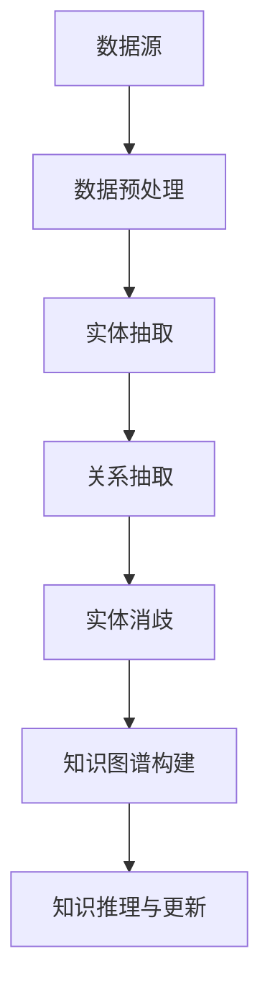
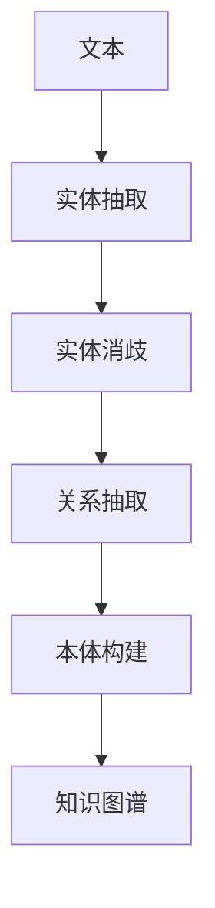

                 

# 知识发现引擎：开启知识应用新时代

> **关键词**：知识发现引擎、大数据、人工智能、知识图谱、模式挖掘、性能优化

> **摘要**：本文深入探讨了知识发现引擎的概念、技术基础、实现与应用，详细分析了知识图谱构建、模式挖掘算法实现、知识推理与更新机制，以及知识发现引擎的性能优化策略。通过实际应用案例，展示了知识发现引擎在社交媒体情感分析和金融风控领域的强大潜力。本文旨在为读者提供全面、系统的知识发现引擎技术指南。

## 第一部分：知识发现引擎基础

### 第1章：知识发现引擎概述

#### 核心概念与联系

**知识发现**（Knowledge Discovery）是指从大量数据中提取出具有潜在价值的信息和知识的过程。它涵盖了数据挖掘（Data Mining）、机器学习（Machine Learning）、统计分析和模式识别（Pattern Recognition）等多个领域。知识发现与大数据（Big Data）、人工智能（Artificial Intelligence）密切相关，大数据为知识发现提供了丰富的数据资源，而人工智能则为知识发现提供了强大的计算能力。

**知识图谱**（Knowledge Graph）是一种结构化的知识表示形式，它通过实体和关系来组织信息。知识图谱能够直观地表达知识之间的关系，支持复杂的查询和推理操作。知识图谱与知识发现的关系在于，知识发现过程中提取出的模式和规律可以用来构建和优化知识图谱。

下面是知识图谱构建流程的Mermaid流程图：



#### 知识发现引擎工作原理

**数据收集与预处理**：数据收集是知识发现引擎的基础，数据源可以是结构化数据（如关系数据库）、半结构化数据（如XML、JSON）和非结构化数据（如文本、图像）。数据预处理包括数据清洗、数据转换和数据归一化，以确保数据质量。

```python
def preprocess_data(data):
    # 数据清洗
    data = clean_data(data)
    # 数据转换
    data = transform_data(data)
    # 数据归一化
    data = normalize_data(data)
    return data
```

**模式挖掘算法**：模式挖掘是知识发现的核心，它包括关联规则挖掘、聚类分析、分类和异常检测等。以下是一个简单的关联规则挖掘算法的伪代码：

```python
def aprioriMining(data, supportThreshold, confidenceThreshold):
    # 初始化频繁项集
    frequent_itemsets = find_frequent_itemsets(data, supportThreshold)
    # 生成关联规则
    association_rules = generate_association_rules(frequent_itemsets, data, confidenceThreshold)
    return association_rules
```

**知识推理与更新**：知识推理是基于知识图谱的，它可以通过图论算法（如最短路径算法、图遍历算法）来查找实体之间的关系。知识库的更新可以通过时间戳机制来实现，即定期检查和更新知识库中的信息。

```python
def update_knowledge_base(knowledge_base, new_data):
    # 检查新数据是否与知识库中的信息冲突
    conflicts = check_conflicts(new_data, knowledge_base)
    # 更新知识库
    if not conflicts:
        knowledge_base = merge_knowledge_base(knowledge_base, new_data)
    return knowledge_base
```

#### 知识发现引擎架构

知识发现引擎通常由数据层、算法层和应用层组成。

- **数据层**：负责数据的收集、存储和预处理，包括分布式文件系统和NoSQL数据库等。
- **算法层**：包括模式挖掘算法、知识推理算法和优化算法等。
- **应用层**：提供用户接口和API接口，支持各种应用场景。

### 第2章：大数据技术基础

#### 大数据概念与体系结构

**大数据**（Big Data）是指数据规模巨大、类型多样、生成速度快的数据集合。大数据的三个主要特征是：**Volume（规模）**、**Variety（多样性）**和**Velocity（速度）**。

**大数据处理框架**：

- **Hadoop**：基于MapReduce编程模型，适用于大规模数据的分布式处理。
- **Spark**：提供了更快的内存计算和流处理能力，适用于实时数据处理。

Hadoop和Spark的比较：

| 特性 | Hadoop | Spark |
| --- | --- | --- |
| 编程模型 | MapReduce | RDD（弹性分布式数据集） |
| 计算速度 | 较慢 | 较快 |
| 适用场景 | 大规模离线数据处理 | 大规模实时数据处理 |

#### 数据存储与管理

**分布式文件系统**：

- **HDFS**（Hadoop Distributed File System）：Hadoop的分布式文件存储系统，适合大规模数据存储。
- **CFS**（Chukwa File System）：适用于大规模分布式监控系统。

**NoSQL数据库**：

- **MongoDB**：文档型数据库，适合存储结构化数据。
- **Cassandra**：分布式键值存储系统，适合存储大规模非结构化数据。

#### 数据处理与分析工具

**ETL工具**：

- **Apache NiFi**：提供了一个直观的Web界面，用于数据提取、转换和加载。
- **Talend**：提供了丰富的数据集成工具，支持各种数据源和目标。

**数据分析工具**：

- **Python**：提供了丰富的数据分析库，如Pandas、NumPy等。
- **R**：专门用于统计分析，提供了大量的统计函数和模型。
- **Spark SQL**：Spark的SQL模块，支持SQL查询和数据操作。

### 第3章：人工智能技术基础

#### 人工智能概述

**人工智能**（Artificial Intelligence，简称AI）是指模拟人类智能的技术。它包括机器学习（Machine Learning）、深度学习（Deep Learning）和自然语言处理（Natural Language Processing）等子领域。

**人工智能的发展历程**：

- **早期人工智能**：1950年代至1970年代，以符号推理和专家系统为主。
- **现代人工智能**：1980年代至今，以数据驱动和神经网络为主。

#### 机器学习基础

**监督学习**、**无监督学习**和**强化学习**是机器学习的三大类。

- **监督学习**：输入数据带有标签，用于训练模型，如线性回归、决策树等。
- **无监督学习**：输入数据没有标签，用于发现数据中的隐藏结构，如聚类、降维等。
- **强化学习**：通过与环境的交互来学习策略，如Q-learning、深度强化学习等。

**常见机器学习算法**：

- **线性回归**：用于预测连续值输出，伪代码如下：

  ```python
  def linear_regression(X, y):
      # 计算权重
      weights = (X.T * X).I * X.T * y
      # 预测
      predictions = X * weights
      return predictions
  ```

- **决策树**：用于分类和回归，伪代码如下：

  ```python
  def decision_tree(X, y, depth=0, max_depth=None):
      # 判断是否达到最大深度
      if depth == max_depth or np.std(y) == 0:
          return np.mean(y)
      # 找到最佳分裂特征和阈值
      best_split = find_best_split(X, y)
      # 构建子树
      left_child = decision_tree(X[X[:, best_split[0]] < best_split[1]], y[X[:, best_split[0]] < best_split[1]], depth+1, max_depth)
      right_child = decision_tree(X[X[:, best_split[0]] >= best_split[1]], y[X[:, best_split[0]] >= best_split[1]], depth+1, max_depth)
      # 合并子树
      return np.where(X[:, best_split[0]] < best_split[1], left_child, right_child)
  ```

- **神经网络**：用于复杂的模式识别和预测，伪代码如下：

  ```python
  def neural_network(X, y, layers, activation='sigmoid'):
      # 初始化权重和偏置
      weights = [np.random.randn(i, j) for i, j in zip(layers[:-1], layers[1:])]
      biases = [np.random.randn(i, 1) for i in layers[1:]]
      
      # 定义激活函数
      if activation == 'sigmoid':
          activation_function = sigmoid
      elif activation == 'tanh':
          activation_function = tanh
      elif activation == 'ReLU':
          activation_function = ReLU
      
      # 前向传播
      def forward_propagation(X):
          a = X
          for weight, bias in zip(weights, biases):
              a = activation_function(np.dot(weight, a) + bias)
          return a
      
      # 计算损失函数
      def compute_loss(a, y):
          return -np.sum(y * np.log(a)) / len(y)
      
      # 训练模型
      for _ in range(num_iterations):
          a = forward_propagation(X)
          loss = compute_loss(a, y)
          # 反向传播
          dZ = a - y
          dW = (X.T * dZ).T / len(X)
          db = np.sum(dZ, axis=0, keepdims=True)
          weights -= learning_rate * dW
          biases -= learning_rate * db
      return loss
  ```

#### 深度学习基础

**神经网络结构**：

- **卷积神经网络**（CNN）：用于图像识别和图像处理，伪代码如下：

  ```python
  def conv2d(X, W, stride=1, padding=0):
      # 计算卷积
      return (X * W).sum(axis=3)[::stride, ::stride, padding:-padding, padding:-padding]
  ```

- **循环神经网络**（RNN）：用于序列建模和时间序列预测，伪代码如下：

  ```python
  def recurrent_network(X, W, b, activation='tanh'):
      # 前向传播
      h = activation(np.dot(W[0], X) + b[0])
      for i in range(1, len(W)):
          h = activation(np.dot(W[i], h) + b[i])
      return h
  ```

**深度学习框架**：

- **TensorFlow**：Google开源的深度学习框架，支持多种神经网络结构。
- **PyTorch**：Facebook开源的深度学习框架，具有动态计算图和简洁的API。

## 第二部分：知识发现引擎实现与应用

### 第4章：知识发现引擎设计与开发

#### 知识图谱构建

**实体抽取与关系抽取**：实体抽取是指从文本中提取出具有特定意义的信息单元，如人名、地名、组织名等。关系抽取是指从文本中提取出实体之间的关系，如“张三工作于阿里巴巴”。

**实体消歧与本体构建**：实体消歧是指解决文本中实体引用不一致的问题，如“小王”可能指多个不同的人。本体构建是指定义实体及其关系的语义模型。

下面是一个实体抽取与关系抽取的Mermaid流程图：



#### 模式挖掘算法实现

**关联规则挖掘**：关联规则挖掘是一种用于发现数据中频繁模式的技术，如购物篮分析。

```python
def aprioriMining(data, supportThreshold, confidenceThreshold):
    # 初始化频繁项集
    frequent_itemsets = find_frequent_itemsets(data, supportThreshold)
    # 生成关联规则
    association_rules = generate_association_rules(frequent_itemsets, data, confidenceThreshold)
    return association_rules
```

**聚类分析**：聚类分析是一种无监督学习方法，用于将数据划分为若干个群组。

```python
def kmeans(X, k, max_iterations=100):
    # 初始化聚类中心
    centroids = X[np.random.choice(X.shape[0], k, replace=False)]
    for _ in range(max_iterations):
        # 计算距离并分配到最近的聚类中心
        distances = np.linalg.norm(X - centroids, axis=1)
        clusters = np.argmin(distances, axis=0)
        # 更新聚类中心
        centroids = np.mean(X[clusters == i], axis=0) for i in range(k)
    return centroids, clusters
```

#### 知识推理与更新

**推理算法**：知识推理是利用已知事实和推理规则来推导出新的事实。

```python
def forward_chaining(knowledge_base, rules, query):
    # 初始化事实和结论
    facts = knowledge_base
    conclusions = [query]
    while conclusions:
        conclusion = conclusions.pop()
        for rule in rules:
            if conclusion in rule.conditions:
                new_facts = facts + [rule.conclusion]
                if not check_conflicts(new_facts, facts):
                    facts = new_facts
                    conclusions.append(rule.conclusion)
    return facts
```

**知识库维护策略**：知识库的维护可以通过定期检查和更新来实现。

```python
def update_knowledge_base(knowledge_base, new_data, conflict_resolution='merge'):
    # 检查新数据与知识库的冲突
    conflicts = check_conflicts(new_data, knowledge_base)
    if conflict_resolution == 'merge':
        # 合并知识库
        knowledge_base = merge_knowledge_base(knowledge_base, new_data)
    elif conflict_resolution == 'replace':
        # 替换知识库
        knowledge_base = new_data
    return knowledge_base
```

## 第5章：知识发现引擎性能优化

### 数据预处理优化

**数据清洗**：数据清洗是数据预处理的重要步骤，用于去除数据中的噪声和错误。

```python
def clean_data(data):
    # 删除空值和缺失值
    data = data.dropna()
    # 删除重复值
    data = data.drop_duplicates()
    # 处理异常值
    data = data.replace({np.inf: np.nan, -np.inf: np.nan})
    return data
```

**数据压缩**：数据压缩可以减少存储空间和提高处理速度。

```python
def compress_data(data, compression_ratio=0.5):
    # 使用GZIP压缩
    compressed_data = gzip.compress(data.encode('utf-8'))
    # 计算压缩率
    compression_ratio = len(compressed_data) / len(data)
    return compressed_data, compression_ratio
```

### 算法优化

**并行计算**：并行计算可以加速模式挖掘和知识推理。

```python
from multiprocessing import Pool

def parallel_aprioriMining(data, supportThreshold, confidenceThreshold, num_processes=4):
    # 划分数据集
    data_splits = np.array_split(data, num_processes)
    # 并行执行
    with Pool(num_processes) as pool:
        frequent_itemsets = pool.starmap(find_frequent_itemsets, [(data_split, supportThreshold) for data_split in data_splits])
    # 合并结果
    frequent_itemsets = merge_frequent_itemsets(frequent_itemsets)
    # 生成关联规则
    association_rules = generate_association_rules(frequent_itemsets, data, confidenceThreshold)
    return association_rules
```

**分布式计算**：分布式计算可以处理大规模数据集。

```python
from pyspark import SparkContext, SparkConf

def distributed_aprioriMining(data, supportThreshold, confidenceThreshold):
    # 创建SparkContext
    conf = SparkConf().setAppName("AprioriMining")
    sc = SparkContext(conf=conf)
    # 将数据集转换为RDD
    data_rdd = sc.parallelize(data)
    # 执行并行计算
    frequent_itemsets_rdd = data_rdd.mapPartitions(lambda partition: find_frequent_itemsets(partition, supportThreshold))
    frequent_itemsets = frequent_itemsets_rdd.collect()
    # 生成关联规则
    association_rules = generate_association_rules(frequent_itemsets, data, confidenceThreshold)
    return association_rules
```

### 系统性能评估

**指标**：

- **响应时间**：系统处理请求所需的时间。
- **查询吞吐量**：单位时间内系统能够处理的查询数量。

**优化策略**：

- **缓存机制**：将频繁访问的数据缓存到内存中，减少磁盘IO。
- **索引优化**：创建合适的索引，提高数据查询速度。

## 第6章：知识发现引擎应用案例分析

### 行业应用场景分析

**社交媒体分析**：知识发现引擎可以用于社交媒体数据分析，如情感分析、热点话题挖掘等。

**金融风控**：知识发现引擎可以用于金融风控领域，如信用评估、交易监控等。

### 案例研究

**案例一：社交媒体情感分析**

**应用场景**：分析社交媒体平台（如微博、抖音）上的用户情感，了解公众对特定事件或产品的看法。

**实现过程**：

1. **数据来源**：从社交媒体平台获取用户评论数据。
2. **数据预处理**：去除停用词、标点符号和特殊字符。
3. **情感分析**：使用自然语言处理技术（如词袋模型、卷积神经网络）对用户评论进行情感分类。
4. **结果分析**：统计正面、负面和neutral情感的分布，生成情感分析报告。

**案例二：金融风控**

**应用场景**：评估借款人的信用风险，监控交易行为，预防欺诈行为。

**实现过程**：

1. **数据来源**：获取借款人的个人信息、财务状况、历史交易记录等。
2. **数据预处理**：清洗和归一化数据，去除噪声和异常值。
3. **信用评估**：使用机器学习算法（如逻辑回归、决策树）对借款人进行信用评分。
4. **交易监控**：实时监控交易行为，使用异常检测算法（如孤立森林、自动编码器）发现异常交易。

## 第7章：知识发现引擎未来发展展望

### 技术趋势

- **人工智能与知识发现的融合**：未来知识发现引擎将更加紧密地结合人工智能技术，利用深度学习、强化学习等算法来提升知识发现的能力。
- **多模态数据处理**：知识发现引擎将能够处理多种类型的数据，如文本、图像、语音等，实现更全面的信息挖掘。

### 应用领域扩展

- **智能医疗**：知识发现引擎可以用于医疗数据挖掘，如疾病预测、个性化治疗等。
- **智能制造**：知识发现引擎可以用于生产优化、设备故障预测等，提高制造业的智能化水平。

### 挑战与机遇

- **数据隐私与安全**：知识发现过程中涉及大量个人数据，如何保护数据隐私和安全是一个重要挑战。
- **知识图谱的动态更新与演化**：随着数据的不断更新和变化，如何动态地维护和优化知识图谱是一个挑战。

### 附录

#### 附录A：知识发现引擎开发工具与资源

- **开源工具与框架**：

  - **知识图谱构建工具**：如 OpenKG、Neo4j。
  - **机器学习框架**：如 TensorFlow、PyTorch。
  - **大数据处理框架**：如 Hadoop、Spark。

- **开源资源和教程**：

  - **在线课程与教程**：如 Coursera、edX。
  - **技术社区与论坛**：如 Stack Overflow、GitHub。

- **相关书籍推荐**：

  - **《深度学习》**：Ian Goodfellow等著。
  - **《大数据技术基础》**：刘铁岩等著。

---

**作者**：AI天才研究院/AI Genius Institute & 禅与计算机程序设计艺术 /Zen And The Art of Computer Programming

