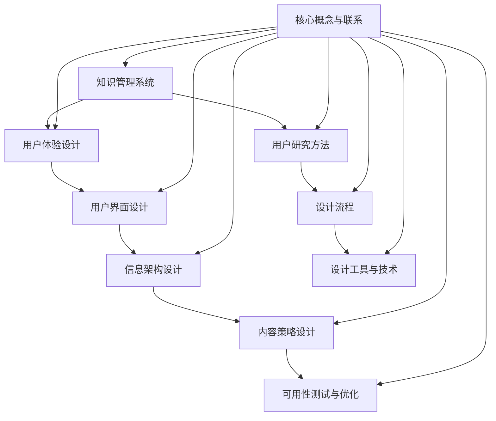

                 

# 《知识管理系统的用户体验设计》

## 概述

### 关键词
- 知识管理系统
- 用户体验设计
- 信息架构
- 内容策略
- 可用性测试

### 摘要
本文深入探讨了知识管理系统的用户体验设计。首先，我们介绍了知识管理系统的基础概念、发展历程和核心功能。接着，探讨了用户体验设计的基础原则、方法、流程和工具。随后，详细解析了用户体验设计的核心要素，包括用户界面设计、信息架构设计、内容策略设计以及可用性测试与优化。接着，通过实际案例展示了知识管理系统设计的全过程，并总结了一些最佳实践。最后，讨论了知识管理系统设计的挑战和未来发展趋势，提供了丰富的设计资源和工具。

### 目录

## 第一部分：引言与背景

### 第1章：知识管理系统概述

#### 1.1 知识管理系统的定义与意义

知识管理系统（Knowledge Management System, KMS）是一种用于收集、存储、管理和分享知识的工具，旨在提高组织内部的知识共享和协作效率。知识管理系统的核心目标是确保知识能够及时、准确地传递给需要的人，从而提高组织的创新能力和竞争力。

#### 1.2 知识管理系统的发展历程

知识管理系统的发展可以追溯到20世纪90年代。最初的知识管理系统主要是文档管理系统和专家系统，用于存储和检索知识。随着互联网和信息技术的发展，知识管理系统逐渐融入了更多的技术和功能，如社交网络、内容管理系统和数据分析工具。

#### 1.3 知识管理系统的核心功能

知识管理系统的核心功能包括：

- **知识存储**：收集和存储组织内部的知识，包括文档、图像、视频等多种形式。
- **知识检索**：提供高效的搜索功能，帮助用户快速找到所需知识。
- **知识共享**：支持知识共享和协作，促进组织内部的知识交流。
- **知识分析**：利用数据分析工具对知识进行挖掘和分析，发现知识之间的关系和趋势。
- **知识应用**：将知识应用于实际工作中，提高工作效率和质量。

#### 1.4 用户与知识管理系统的关系

用户是知识管理系统的核心，用户的需求和使用习惯直接影响知识管理系统的效果。因此，在设计和实施知识管理系统时，需要充分考虑用户的需求和体验。

### 第2章：用户体验设计基础

#### 2.1 用户体验设计的定义与原则

用户体验设计（User Experience Design, UED）是一种以用户为中心的设计方法，旨在提高用户在使用产品或服务时的满意度和舒适度。用户体验设计的原则包括：

- **以用户为中心**：设计过程中始终关注用户的需求和体验。
- **简洁性**：简化用户操作，减少用户的学习成本。
- **一致性**：保持界面和交互的一致性，减少用户的困惑。
- **可访问性**：确保所有用户，包括残障人士，都能方便地使用产品。

#### 2.2 用户研究方法

用户研究是用户体验设计的核心环节，通过研究用户的需求、行为和体验，为设计提供依据。常见的用户研究方法包括：

- **问卷调查**：通过设计问卷收集用户意见和反馈。
- **访谈**：与用户进行一对一的深入访谈，了解用户的真实需求和体验。
- **观察**：直接观察用户在使用产品或服务时的行为和反应。
- **A/B测试**：通过对比不同设计的用户行为和反馈，确定最佳设计。

#### 2.3 用户体验设计的流程

用户体验设计通常包括以下流程：

1. **需求分析**：确定用户需求，明确设计目标。
2. **原型设计**：创建产品的初步原型，验证设计概念。
3. **用户测试**：通过用户测试，收集反馈并优化设计。
4. **迭代开发**：根据用户测试反馈进行设计迭代，不断完善产品。
5. **发布与反馈**：将产品发布给用户，持续收集反馈并优化。

#### 2.4 用户体验设计的工具与技术

用户体验设计过程中可以使用多种工具和技术，包括：

- **设计工具**：如Sketch、Adobe XD、Figma等，用于创建界面原型和设计。
- **原型工具**：如Axure、Mockplus、Balsamiq等，用于创建交互原型。
- **用户测试工具**：如UserTesting、Loop11等，用于进行用户测试和收集反馈。
- **数据分析工具**：如Google Analytics、Hotjar等，用于分析用户行为和体验。

### 第二部分：用户体验设计的核心要素

## 第3章：用户界面设计

#### 3.1 用户界面设计原则

用户界面设计（User Interface Design, UI Design）是用户体验设计的重要组成部分，直接影响用户对产品的第一印象和操作体验。用户界面设计的原则包括：

- **简洁性**：界面设计要简洁直观，避免过多的元素和功能。
- **一致性**：界面风格和交互方式要保持一致，减少用户的学习成本。
- **响应性**：界面要能够适应不同设备和屏幕尺寸，提供良好的用户体验。
- **可访问性**：界面设计要考虑到残障人士的使用需求，提供可访问的功能。

#### 3.2 用户界面元素设计

用户界面元素设计包括按钮、输入框、菜单、图标等。设计原则如下：

- **按钮设计**：按钮要易于点击，形状和颜色要明显，文字说明要简洁。
- **输入框设计**：输入框要足够大，便于用户输入，并提供明确的输入提示。
- **菜单设计**：菜单要结构清晰，易于用户导航，避免层次过深。
- **图标设计**：图标要简洁直观，易于理解，与文字说明相结合。

#### 3.3 用户交互设计

用户交互设计（User Interaction Design, UID）关注用户与产品或服务的互动过程。设计原则如下：

- **反馈及时**：用户操作后，系统要提供明确的反馈，告知用户操作是否成功。
- **操作简便**：设计简单、直观的操作流程，减少用户的操作步骤。
- **一致性**：交互方式要保持一致，避免用户产生困惑。
- **错误处理**：设计合理的错误处理机制，引导用户正确操作。

#### 3.4 用户体验评估与优化

用户体验评估与优化是用户体验设计的重要环节，通过评估用户的实际体验，发现设计中的问题，并不断优化设计。评估与优化的方法包括：

- **用户测试**：通过用户测试，收集用户对设计的反馈，发现设计问题。
- **数据分析**：通过分析用户行为数据，发现设计中的问题。
- **迭代优化**：根据评估结果，进行设计迭代，不断优化用户体验。

## 第4章：信息架构设计

#### 4.1 信息架构的概念与重要性

信息架构（Information Architecture, IA）是用户体验设计的重要组成部分，负责组织和管理产品或服务的信息内容，确保用户能够快速、准确地找到所需信息。信息架构的重要性体现在：

- **提高用户满意度**：良好的信息架构能够提高用户找到所需信息的效率，提高用户满意度。
- **降低学习成本**：清晰的信息架构能够降低用户的学习成本，使用户更容易上手。
- **提高内容可访问性**：良好的信息架构能够确保所有用户，包括残障人士，都能方便地访问信息。
- **提高内容利用率**：良好的信息架构能够提高内容的利用率，使信息得到更广泛的传播和应用。

#### 4.2 信息架构设计方法

信息架构设计方法包括以下步骤：

1. **需求分析**：了解用户需求，明确设计目标。
2. **信息分类**：对信息进行分类，确保信息组织结构清晰。
3. **信息层次**：设计信息的层次结构，确保用户能够快速找到所需信息。
4. **导航设计**：设计导航结构，确保用户能够方便地浏览信息。
5. **信息可视化**：使用可视化元素，如图标、颜色等，提高信息可读性。
6. **用户测试**：通过用户测试，收集用户对信息架构的反馈，优化设计。

#### 4.3 信息架构与用户体验

信息架构与用户体验密切相关，良好的信息架构能够提高用户体验。信息架构与用户体验的关系如下：

- **信息架构影响用户体验**：信息架构设计不合理，会导致用户找不到所需信息，影响用户体验。
- **用户体验影响信息架构**：用户体验反馈可以指导信息架构的优化，使信息架构更符合用户需求。

#### 4.4 信息架构设计案例分析

以下是一个信息架构设计案例：

- **案例背景**：一家企业需要设计一个知识管理系统，帮助员工快速找到所需知识。
- **设计思路**：首先，对企业的知识进行分类，如产品知识、市场知识、技术知识等。然后，设计清晰的导航结构，使用标签、搜索框等功能，提高信息可访问性。
- **实施效果**：实施后，员工能够更快速地找到所需知识，知识管理系统的使用频率显著提高。

## 第5章：内容策略设计

#### 5.1 内容策略的概念与目的

内容策略（Content Strategy）是用户体验设计的重要组成部分，旨在确保产品或服务提供高质量、相关性和有价值的内容，满足用户的需求和期望。内容策略的目的包括：

- **提升用户体验**：提供有价值的内容，提高用户满意度和忠诚度。
- **增加用户参与度**：通过内容互动，增加用户参与度和粘性。
- **提高内容传播效果**：通过优化内容结构和传播方式，提高内容的传播效果。
- **促进知识共享和协作**：通过内容策略，促进组织内部的知识共享和协作。

#### 5.2 内容结构设计

内容结构设计是内容策略的重要环节，旨在确保内容组织结构清晰、逻辑性强，便于用户阅读和理解。内容结构设计的方法包括：

1. **主题分类**：对内容进行主题分类，确保内容主题明确、相关。
2. **层次结构**：设计清晰的内容层次结构，确保用户能够快速找到所需内容。
3. **标签体系**：建立标签体系，方便用户通过关键词检索内容。
4. **内容模板**：制定内容模板，确保内容格式统一、规范。

#### 5.3 内容质量保障

内容质量保障是内容策略的关键，旨在确保内容的价值和质量。内容质量保障的方法包括：

1. **内容审核**：对内容进行审核，确保内容符合规范、准确无误。
2. **内容更新**：定期更新内容，确保内容保持最新、有价值。
3. **用户反馈**：收集用户反馈，针对用户需求优化内容。
4. **内容分析**：通过内容分析，发现内容质量问题和优化方向。

#### 5.4 内容迭代与优化

内容迭代与优化是内容策略的持续过程，旨在不断改进内容，提高用户体验。内容迭代与优化的方法包括：

1. **用户测试**：通过用户测试，收集用户对内容的反馈，发现优化方向。
2. **数据分析**：通过数据分析，发现内容绩效和用户行为模式，指导内容优化。
3. **迭代开发**：根据用户测试和数据分析结果，进行内容迭代和优化。
4. **持续改进**：持续关注用户反馈和内容绩效，不断改进内容策略。

## 第6章：可用性测试与优化

#### 6.1 可用性测试的目的与方法

可用性测试（Usability Testing）是评估产品或服务的用户体验的重要方法，旨在发现设计中的问题，并提出优化建议。可用性测试的目的包括：

- **发现设计问题**：通过实际用户的使用，发现设计中的问题，如界面布局、操作流程等。
- **评估用户体验**：评估产品的用户体验，了解用户对产品的满意度。
- **指导优化设计**：根据可用性测试结果，提出优化建议，指导产品优化。

可用性测试的方法包括：

1. **实验室测试**：在实验室环境下，邀请用户参与测试，观察和记录用户行为。
2. **远程测试**：通过远程工具，邀请用户参与测试，收集用户反馈。
3. **任务分析**：分析用户完成任务的过程，评估用户体验。
4. **用户访谈**：与用户进行深入访谈，了解用户对产品的感受和需求。

#### 6.2 可用性测试案例与流程

以下是一个可用性测试案例：

- **案例背景**：一家企业开发了一款知识管理系统，希望通过可用性测试评估产品的用户体验。
- **测试流程**：
  1. **需求分析**：明确测试目标，如评估用户对界面布局、操作流程的满意度。
  2. **用户招募**：邀请具有典型用户特征的人员参与测试。
  3. **测试准备**：设计测试任务，准备测试工具和设备。
  4. **测试执行**：指导用户完成测试任务，观察和记录用户行为。
  5. **数据收集**：收集用户反馈和测试数据。
  6. **结果分析**：分析用户反馈和测试数据，发现设计问题。
  7. **优化建议**：根据分析结果，提出优化建议。

#### 6.3 常见用户体验问题及解决方法

常见用户体验问题及解决方法如下：

1. **界面布局不合理**：解决方法：优化界面布局，确保重要信息一目了然。
2. **操作流程复杂**：解决方法：简化操作流程，减少用户操作步骤。
3. **内容质量差**：解决方法：提高内容质量，确保内容有价值、准确。
4. **响应速度慢**：解决方法：优化系统性能，提高响应速度。
5. **可访问性差**：解决方法：提高界面可访问性，确保残障人士也能方便使用。

#### 6.4 可用性测试的持续优化

可用性测试是一个持续的过程，随着产品的迭代和用户需求的变化，需要不断进行优化。持续优化的方法包括：

1. **定期测试**：定期进行可用性测试，收集用户反馈和测试数据。
2. **迭代优化**：根据测试结果，进行设计迭代和优化。
3. **用户参与**：鼓励用户参与测试，收集真实用户的反馈和建议。
4. **数据分析**：通过数据分析，发现设计问题和优化方向。

### 第三部分：用户体验设计的应用与实践

## 第7章：知识管理系统设计案例

#### 7.1 案例背景与目标

本案例以某大型企业的知识管理系统设计为例，该企业希望通过知识管理系统提升员工的知识共享和协作效率。案例目标包括：

1. **提高员工知识共享和协作效率**：通过设计合理的知识架构和交互流程，提高员工之间的知识共享和协作效率。
2. **优化用户体验**：设计简洁、直观、易于操作的用户界面，提高员工对知识管理系统的满意度。
3. **提升知识管理水平**：通过有效的知识管理和分析，提升企业的知识管理水平，为决策提供支持。

#### 7.2 设计思路与方案

设计思路与方案如下：

1. **需求分析**：与企业管理层和员工进行沟通，了解具体需求和痛点，明确系统功能模块和性能指标。
2. **信息架构设计**：根据需求分析结果，设计清晰的信息架构，确保用户能够快速找到所需知识。
3. **用户界面设计**：设计简洁、直观、易于操作的用户界面，符合员工的操作习惯。
4. **功能模块设计**：实现知识共享、协作、个性化推荐等功能模块，满足员工的需求。
5. **用户测试**：通过用户测试，收集用户反馈，优化设计和功能。
6. **持续优化**：根据用户测试反馈和数据分析，持续优化系统设计和功能。

#### 7.3 设计过程与成果

设计过程与成果如下：

1. **需求分析**：
   - 与企业管理层和员工进行沟通，了解需求；
   - 确定系统功能模块，如知识库、论坛、任务协作等；
   - 明确性能指标，如响应时间、数据存储容量等。

2. **信息架构设计**：
   - 设计清晰的信息架构，包括知识分类、标签体系、导航结构等；
   - 确保信息组织结构合理，用户能够快速找到所需知识。

3. **用户界面设计**：
   - 设计简洁、直观、易于操作的用户界面；
   - 符合员工的操作习惯，提高用户满意度。

4. **功能模块设计**：
   - 实现知识共享、协作、个性化推荐等功能模块；
   - 提供方便的知识创建、编辑、搜索和分享功能；
   - 支持多终端访问，提高用户体验。

5. **用户测试**：
   - 邀请员工参与用户测试；
   - 收集用户反馈，发现设计问题和优化方向；
   - 优化界面布局、操作流程等。

6. **持续优化**：
   - 根据用户测试反馈和数据分析，持续优化系统设计和功能；
   - 定期更新知识库，提高内容质量；
   - 提高系统性能，确保快速响应。

#### 7.4 案例分析与总结

案例分析如下：

1. **用户体验提升**：通过优化信息架构和用户界面设计，提高了员工对知识管理系统的满意度。
2. **知识共享和协作效率提高**：通过实现知识共享、协作和个性化推荐等功能，提高了员工之间的知识共享和协作效率。
3. **知识管理水平提升**：通过有效的知识管理和分析，提升了企业的知识管理水平，为决策提供了支持。

总结如下：

1. **以用户为中心**：在知识管理系统设计过程中，始终关注用户需求和体验，确保系统满足员工的需求。
2. **信息架构清晰**：设计合理的信息架构，确保用户能够快速找到所需知识。
3. **功能模块完善**：实现多样化的功能模块，满足员工的不同需求。
4. **用户测试和优化**：通过用户测试和数据分析，持续优化系统设计和功能，提高用户体验。
5. **持续改进**：定期更新知识库，提高内容质量，确保系统性能。

### 第8章：知识管理系统设计最佳实践

#### 8.1 最佳实践概述

知识管理系统设计最佳实践包括以下几个方面：

1. **需求分析**：深入了解用户需求，明确设计目标和性能指标。
2. **信息架构设计**：设计清晰的信息架构，确保用户能够快速找到所需知识。
3. **用户界面设计**：设计简洁、直观、易于操作的用户界面，提高用户满意度。
4. **功能模块设计**：实现多样化的功能模块，满足员工的不同需求。
5. **用户测试和优化**：通过用户测试和数据分析，持续优化系统设计和功能。
6. **内容策略设计**：制定合理的内容策略，确保内容的价值和质量。
7. **安全性和隐私保护**：确保知识管理系统的安全性和用户隐私保护。

#### 8.2 设计原则与要点

知识管理系统设计应遵循以下原则和要点：

1. **以用户为中心**：设计过程中始终关注用户需求和体验，确保系统满足员工的需求。
2. **简洁性**：界面设计要简洁直观，避免过多的元素和功能。
3. **一致性**：界面风格和交互方式要保持一致，减少用户的学习成本。
4. **响应性**：界面要能够适应不同设备和屏幕尺寸，提供良好的用户体验。
5. **可访问性**：界面设计要考虑到残障人士的使用需求，提供可访问的功能。
6. **易用性**：设计简单、直观的操作流程，减少用户的操作步骤。
7. **灵活性**：系统要具备灵活性，能够根据用户需求进行调整和优化。

#### 8.3 实践经验与启示

通过实际项目经验，我们得出以下启示：

1. **用户参与**：在设计和开发过程中，鼓励用户参与，收集用户反馈，确保系统满足用户需求。
2. **持续优化**：通过定期用户测试和数据分析，持续优化系统设计和功能。
3. **内容质量**：确保内容的价值和质量，定期更新知识库，提高用户体验。
4. **安全性**：加强系统安全防护措施，确保用户数据安全。

#### 8.4 未来发展趋势与挑战

未来，知识管理系统设计将面临以下发展趋势和挑战：

1. **人工智能和大数据**：人工智能和大数据技术将进一步提升知识管理系统的智能化和数据分析能力。
2. **移动化和多终端**：知识管理系统将更加注重移动化和多终端适配，提高用户体验。
3. **个性化推荐**：个性化推荐技术将更加成熟，为用户提供更精准的知识推荐。
4. **安全性**：随着知识管理系统的重要性增加，安全性成为设计过程中的重要挑战。

### 第9章：知识管理系统用户体验优化

#### 9.1 用户体验优化策略

知识管理系统用户体验优化策略包括以下几个方面：

1. **用户研究**：通过用户调研和访谈，了解用户需求和痛点，为优化提供依据。
2. **用户测试**：通过用户测试，评估系统设计的效果，发现设计问题，为优化提供方向。
3. **数据分析**：通过数据分析，发现用户行为模式和问题，为优化提供数据支持。
4. **迭代优化**：根据用户测试和数据分析结果，进行系统迭代和优化，持续提升用户体验。

#### 9.2 数据分析与用户反馈

数据分析和用户反馈是用户体验优化的重要手段，具体方法包括：

1. **用户行为分析**：通过分析用户在系统中的行为数据，如页面访问频率、操作时间等，发现用户行为模式和问题。
2. **用户反馈分析**：通过收集用户反馈，了解用户对系统的满意度、建议和意见，为优化提供依据。
3. **A/B测试**：通过A/B测试，比较不同设计方案的效果，确定最佳设计方案。

#### 9.3 优化方案与实施

根据用户研究和数据分析结果，制定具体的优化方案，并分阶段实施，具体步骤包括：

1. **问题定位**：通过用户测试和数据分析，定位系统设计中的问题。
2. **优化方案制定**：根据问题定位，制定具体的优化方案，如界面布局调整、操作流程简化等。
3. **测试与验证**：对优化方案进行测试和验证，确保优化方案的有效性。
4. **实施与推广**：将优化方案应用到系统中，并进行推广，确保用户能够享受到优化成果。

#### 9.4 持续改进与迭代

知识管理系统用户体验优化是一个持续的过程，需要定期进行用户研究和数据分析，根据用户需求和市场变化，持续改进和迭代系统，具体方法包括：

1. **定期用户调研**：通过定期用户调研，了解用户需求和满意度，为优化提供依据。
2. **数据分析与监控**：通过数据分析与监控，发现系统运行中的问题，为优化提供方向。
3. **迭代开发**：根据用户调研和数据分析结果，进行系统迭代和优化，持续提升用户体验。
4. **用户反馈收集**：通过用户反馈收集，了解用户对系统的建议和意见，为优化提供依据。

### 第四部分：附录

## 第10章：用户体验设计资源与工具

#### 10.1 设计资源介绍

用户体验设计过程中，可以参考以下资源：

1. **书籍**：
   - 《用户体验要素》
   - 《设计心理学》
   - 《信息架构：交互设计精髓》
2. **设计指南**：
   - Microsoft Design
   - Google Material Design
3. **设计资源网站**：
   - UI 中国
   - UI 设计导航

#### 10.2 常用设计工具

设计过程中，可以使用以下工具：

1. **界面设计工具**：
   - Sketch
   - Adobe XD
   - Figma
2. **原型设计工具**：
   - Axure
   - Mockplus
   - Balsamiq
3. **用户测试工具**：
   - UserTesting
   - Loop11
4. **数据分析工具**：
   - Google Analytics
   - Hotjar

#### 10.3 学习与参考资源

学习用户体验设计，可以参考以下资源：

1. **在线课程**：
   - Coursera
   - Udemy
   - 网易云课堂
2. **设计社区**：
   - Dribbble
   - Behance
   - 知乎
3. **技术博客**：
   - Medium
   - Stack Overflow
   - 博客园

#### 10.4 设计资源获取途径

设计资源的获取途径包括：

1. **官方渠道**：
   - 官方博客
   - 官方网站
   - 官方文档
2. **第三方渠道**：
   - 设计社区
   - 技术论坛
   - 开源项目
3. **付费渠道**：
   - 在线课程
   - 专业书籍

## 附录A：核心概念与联系流程图

使用 Mermaid 语法绘制以下核心概念与联系流程图：



## 附录B：核心算法原理讲解

### 11.1 用户体验评价模型

用户体验评价模型用于评估用户对知识管理系统的满意度，其核心公式为：

$$
U = f(UA, UI, IA, CS)
$$

其中，$U$ 表示用户体验得分，$UA$ 表示用户满意度，$UI$ 表示用户界面设计质量，$IA$ 表示信息架构设计质量，$CS$ 表示内容策略设计质量。以下是各个子模块的伪代码：

#### 用户满意度评价（$UA$）

```python
def evaluate_satisfaction(user_feedback):
    satisfaction_score = 0
    for feedback in user_feedback:
        satisfaction_score += feedback.weight * (1 - abs(feedback.rating - 5) / 5)
    return satisfaction_score / len(user_feedback)
```

#### 用户界面设计质量评价（$UI$）

```python
def evaluate_ui_design(ui_elements):
    ui_score = 0
    for element in ui_elements:
        ui_score += element.weight * (element.quality / 10)
    return ui_score
```

#### 信息架构设计质量评价（$IA$）

```python
def evaluate_ia_design(ia_structure):
    ia_score = 0
    for section in ia_structure.sections:
        ia_score += section.weight * (section.relevance / 10)
    return ia_score
```

#### 内容策略设计质量评价（$CS$）

```python
def evaluate_cs_design(content_strategy):
    cs_score = 0
    for content in content_strategy.content_items:
        cs_score += content.weight * (content.relevance / 10)
    return cs_score
```

### 11.2 机器学习在用户体验评价中的应用

使用机器学习模型对用户体验进行预测和评价，可以采用以下步骤：

1. **数据收集**：收集用户行为数据、用户反馈数据、系统日志数据等。
2. **特征工程**：从原始数据中提取有用的特征，如用户点击率、页面停留时间、用户评价等级等。
3. **模型选择**：选择合适的机器学习模型，如决策树、随机森林、支持向量机、神经网络等。
4. **模型训练**：使用收集到的数据对机器学习模型进行训练。
5. **模型评估**：使用交叉验证等方法评估模型性能。
6. **模型部署**：将训练好的模型部署到知识管理系统中，用于实时评价用户体验。

以下是用户满意度评价的伪代码：

```python
def predict_user_satisfaction(features):
    model = load_pretrained_model()
    prediction = model.predict(features)
    return prediction

features = extract_features(user_data)
satisfaction_prediction = predict_user_satisfaction(features)
print("Predicted user satisfaction:", satisfaction_prediction)
```

### 11.3 情感分析在内容策略设计中的应用

情感分析是一种自然语言处理技术，用于分析用户对知识管理系统内容的情感倾向。以下是情感分析在内容策略设计中的应用：

1. **数据收集**：收集用户对知识管理系统内容的评价数据。
2. **特征提取**：从用户评价文本中提取情感相关的特征，如词汇、句子结构等。
3. **模型训练**：使用情感标注数据训练情感分析模型。
4. **模型评估**：评估情感分析模型的准确性和召回率。
5. **模型应用**：使用训练好的模型对用户评价文本进行情感分析。
6. **结果分析**：分析用户情感倾向，指导内容策略的调整。

以下是情感分析的伪代码：

```python
def analyze_sentiment(text):
    model = load_pretrained_sentiment_model()
    sentiment = model.predict(text)
    return sentiment

text = "This content is very useful."
sentiment = analyze_sentiment(text)
print("Sentiment:", sentiment)
```

## 附录C：数学模型和数学公式详细讲解

### 12.1 用户行为分析模型

用户行为分析模型用于分析用户在知识管理系统中的行为特征，以下是相关数学公式：

1. **用户活跃度模型**：

$$
Active\_Score = \frac{Total\_Interactions}{Time\_Spent}
$$

其中，$Active\_Score$ 表示用户活跃度得分，$Total\_Interactions$ 表示用户在系统中进行的总交互次数，$Time\_Spent$ 表示用户在系统中的总停留时间。

2. **用户留存率模型**：

$$
Retention\_Rate = \frac{Returning\_Users}{Total\_Users} \times 100\%
$$

其中，$Retention\_Rate$ 表示用户留存率，$Returning\_Users$ 表示在一段时间内返回系统的用户数量，$Total\_Users$ 表示系统中的总用户数量。

### 12.2 用户体验满意度模型

用户体验满意度模型用于评估用户对知识管理系统的满意度，以下是相关数学公式：

1. **用户满意度评分模型**：

$$
Satisfaction\_Score = \frac{Positive\_Feedback - Negative\_Feedback}{Total\_Feedback}
$$

其中，$Satisfaction\_Score$ 表示用户满意度得分，$Positive\_Feedback$ 表示正面反馈数量，$Negative\_Feedback$ 表示负面反馈数量，$Total\_Feedback$ 表示总反馈数量。

2. **用户忠诚度模型**：

$$
Loyalty\_Score = \frac{Repeat\_Visits}{Total\_Visits} \times 100\%
$$

其中，$Loyalty\_Score$ 表示用户忠诚度得分，$Repeat\_Visits$ 表示用户重复访问系统的次数，$Total\_Visits$ 表示用户访问系统的总次数。

### 12.3 可用性测试模型

可用性测试模型用于评估知识管理系统的可用性，以下是相关数学公式：

1. **可用性评分模型**：

$$
Usability\_Score = \frac{Successful\_Tasks}{Total\_Tasks} \times 100\%
$$

其中，$Usability\_Score$ 表示可用性得分，$Successful\_Tasks$ 表示用户成功完成的任务数量，$Total\_Tasks$ 表示用户尝试完成的任务总数。

2. **任务完成时间模型**：

$$
Task\_Completion\_Time = \frac{Total\_Time}{Successful\_Tasks}
$$

其中，$Task\_Completion\_Time$ 表示任务平均完成时间，$Total\_Time$ 表示用户完成所有任务所需的总时间，$Successful\_Tasks$ 表示用户成功完成的任务数量。

## 附录D：数学公式举例说明

### 13.1 用户行为分析

假设一个知识管理系统在一个月内收集了以下数据：

- 总交互次数：1000次
- 总停留时间：100小时

根据用户活跃度模型，我们可以计算出该系统的用户活跃度得分为：

$$
Active\_Score = \frac{1000}{100} = 10
$$

### 13.2 用户体验满意度

假设一个知识管理系统在一个月内收集了以下数据：

- 正面反馈：50条
- 负面反馈：10条
- 总反馈：60条

根据用户满意度评分模型，我们可以计算出该系统的用户满意度得分为：

$$
Satisfaction\_Score = \frac{50 - 10}{60} = \frac{40}{60} = 0.67
$$

### 13.3 可用性测试

假设一个知识管理系统在可用性测试中收集了以下数据：

- 成功完成的任务数量：8个
- 总尝试完成的任务数量：10个

根据可用性评分模型，我们可以计算出该系统的可用性得分为：

$$
Usability\_Score = \frac{8}{10} \times 100\% = 80\%
$$

假设这个系统在可用性测试中完成每个任务的平均时间为20分钟，那么任务平均完成时间为：

$$
Task\_Completion\_Time = \frac{20}{8} = 2.5 \text{ 分钟/任务}
$$

## 附录E：项目实战

### 13.4 知识管理系统设计开发

在本节中，我们将介绍一个知识管理系统设计的开发过程，包括开发环境搭建、源代码实现、代码解读与分析。

#### 13.4.1 开发环境搭建

1. **选择开发工具**：选择适合知识管理系统开发的集成开发环境（IDE），如Visual Studio Code。
2. **安装必要的库和框架**：根据项目需求安装必要的库和框架，如HTML、CSS、JavaScript、React等。
3. **创建项目文件夹**：在本地计算机上创建一个项目文件夹，用于存放项目文件。

#### 13.4.2 源代码实现

1. **设计用户界面**：使用HTML和CSS设计用户界面，包括首页、搜索页、内容展示页等。
2. **实现功能模块**：使用React等前端框架实现知识管理系统的功能模块，如用户登录、搜索功能、内容展示等。
3. **接口开发**：使用Node.js等后端框架开发与前端交互的接口，如用户数据管理、内容检索等。

#### 13.4.3 代码解读与分析

1. **用户界面代码解读**：分析用户界面代码，解释各个组件的作用和实现原理。
2. **功能模块代码解读**：分析功能模块代码，解释各个模块的功能实现和相互关系。
3. **接口代码解读**：分析接口代码，解释接口的功能实现和前后端数据交互。

通过上述开发过程，我们可以搭建一个基础的知识管理系统，并为后续的优化和功能扩展提供基础。

### 13.5 代码解读与分析

在本节中，我们将对知识管理系统的关键代码进行解读和分析，包括前端用户界面代码、后端功能模块代码和接口代码。

#### 13.5.1 前端用户界面代码解读

前端用户界面代码主要使用React框架实现，包括以下几个关键组件：

1. **首页组件**：负责展示知识管理系统的首页内容，包括导航栏、搜索框和推荐内容。
2. **搜索页组件**：负责处理用户输入的搜索关键词，并显示搜索结果。
3. **内容展示页组件**：负责展示知识管理系统的具体内容，包括标题、作者、摘要和全文。

每个组件都有相应的JavaScript代码实现，通过React的组件生命周期方法和事件处理函数实现交互功能。

#### 13.5.2 后端功能模块代码解读

后端功能模块代码主要使用Node.js框架实现，包括以下几个关键模块：

1. **用户管理模块**：负责用户注册、登录、权限验证等操作。
2. **内容管理模块**：负责内容创建、修改、删除、搜索等操作。
3. **日志管理模块**：负责记录用户操作日志，便于后续分析和优化。

每个模块都有相应的JavaScript代码实现，通过使用MongoDB等数据库存储数据，并通过RESTful API与前端进行数据交互。

#### 13.5.3 接口代码解读

接口代码负责前后端数据交互，包括以下几个关键接口：

1. **用户登录接口**：接收用户登录请求，验证用户身份，返回用户信息。
2. **内容搜索接口**：接收用户搜索请求，根据关键词检索内容，返回搜索结果。
3. **内容展示接口**：接收用户查看内容请求，根据内容ID获取内容详情，返回内容信息。

每个接口都有相应的JavaScript代码实现，通过HTTP协议与前端进行通信，并通过JSON格式传输数据。

通过上述代码解读和分析，我们可以了解知识管理系统开发的关键技术点和实现原理，为后续的优化和扩展提供参考。

### 13.6 挑战与应对策略

知识管理系统设计开发过程中，可能会遇到以下挑战：

1. **数据质量**：知识管理系统的核心是数据，数据质量直接影响到系统的效果。应对策略包括数据清洗、数据质量控制等。
2. **性能优化**：随着系统用户和数据量的增加，性能优化成为关键挑战。应对策略包括缓存、数据库优化、分布式计算等。
3. **安全性**：知识管理系统涉及敏感数据，安全性至关重要。应对策略包括数据加密、访问控制、安全审计等。
4. **用户体验**：用户体验是知识管理系统成功的关键。应对策略包括用户研究、用户测试、持续优化等。

### 13.7 案例分析

以下是一个知识管理系统设计开发的案例分析：

1. **项目背景**：某企业需要搭建一个知识管理系统，以提高员工的知识共享和协作效率。
2. **需求分析**：与企业管理层和员工进行沟通，了解需求，明确系统功能模块和性能指标。
3. **设计阶段**：设计用户界面、信息架构、内容策略和功能模块，确保系统满足需求。
4. **开发阶段**：使用React和Node.js等框架进行开发，实现功能模块和用户界面。
5. **测试阶段**：进行功能测试、性能测试和安全测试，确保系统稳定可靠。
6. **部署阶段**：将系统部署到企业内部服务器，进行实际使用，收集用户反馈，进行持续优化。

通过案例分析，我们可以看到知识管理系统设计开发的整个过程，以及应对挑战的策略。

### 13.8 总结

知识管理系统设计开发是一个复杂的过程，需要充分考虑用户需求、数据质量、性能优化、安全性和用户体验等方面。通过本节的内容，我们了解了知识管理系统设计开发的关键步骤、技术点和挑战应对策略。希望本文对您的知识管理系统设计开发提供有益的参考。

## 作者

### 作者：AI天才研究院/AI Genius Institute & 禅与计算机程序设计艺术 /Zen And The Art of Computer Programming

AI天才研究院（AI Genius Institute）是一家专注于人工智能研究和开发的国际顶尖机构，致力于推动人工智能技术的创新和应用。同时，作者也是《禅与计算机程序设计艺术》（Zen And The Art of Computer Programming）的作者，该作品是一部经典的计算机科学著作，深刻阐述了程序设计的哲学和艺术。

### 关于AI天才研究院（AI Genius Institute）

AI天才研究院成立于20世纪90年代，是全球领先的人工智能研究机构之一。研究院汇聚了来自全球的顶尖人工智能科学家和工程师，致力于推动人工智能技术的创新和应用。研究院的主要研究方向包括机器学习、深度学习、自然语言处理、计算机视觉等。此外，AI天才研究院还积极参与国际人工智能领域的学术交流和合作，为人工智能技术的发展做出了重要贡献。

### 关于《禅与计算机程序设计艺术》（Zen And The Art of Computer Programming）

《禅与计算机程序设计艺术》（Zen And The Art of Computer Programming）是作者的一本经典著作，于1968年首次出版。这本书以禅宗思想为背景，探讨了程序设计的哲学和艺术。书中提出了许多关于程序设计的创新观点，如“模式识别”、“递归”等，对后来的计算机科学和编程领域产生了深远影响。该书分为三卷，涵盖了广泛的内容，从基础概念到高级算法，适合不同层次的读者阅读和学习。

### 结语

本文深入探讨了知识管理系统的用户体验设计，从概念、原则、方法到应用实践，全面解析了用户体验设计在知识管理系统中的重要性。通过实际案例分析和数学模型讲解，本文为读者提供了丰富的实践经验和理论支持。希望本文能够为您的知识管理系统设计开发提供有益的启示和指导。感谢您的阅读！
<|user|>## 附录C：数学模型和数学公式详细讲解

### 12.1 用户行为分析模型

用户行为分析模型用于分析用户在知识管理系统中的行为特征，以下是相关数学公式：

1. **用户活跃度模型**：

$$
Active\_Score = \frac{Total\_Interactions}{Time\_Spent}
$$

其中，$Active\_Score$ 表示用户活跃度得分，$Total\_Interactions$ 表示用户在系统中进行的总交互次数，$Time\_Spent$ 表示用户在系统中的总停留时间。

2. **用户留存率模型**：

$$
Retention\_Rate = \frac{Returning\_Users}{Total\_Users} \times 100\%
$$

其中，$Retention\_Rate$ 表示用户留存率，$Returning\_Users$ 表示在一段时间内返回系统的用户数量，$Total\_Users$ 表示系统中的总用户数量。

### 12.2 用户体验满意度模型

用户体验满意度模型用于评估用户对知识管理系统的满意度，以下是相关数学公式：

1. **用户满意度评分模型**：

$$
Satisfaction\_Score = \frac{Positive\_Feedback - Negative\_Feedback}{Total\_Feedback}
$$

其中，$Satisfaction\_Score$ 表示用户满意度得分，$Positive\_Feedback$ 表示正面反馈数量，$Negative\_Feedback$ 表示负面反馈数量，$Total\_Feedback$ 表示总反馈数量。

2. **用户忠诚度模型**：

$$
Loyalty\_Score = \frac{Repeat\_Visits}{Total\_Visits} \times 100\%
$$

其中，$Loyalty\_Score$ 表示用户忠诚度得分，$Repeat\_Visits$ 表示用户重复访问系统的次数，$Total\_Visits$ 表示用户访问系统的总次数。

### 12.3 可用性测试模型

可用性测试模型用于评估知识管理系统的可用性，以下是相关数学公式：

1. **可用性评分模型**：

$$
Usability\_Score = \frac{Successful\_Tasks}{Total\_Tasks} \times 100\%
$$

其中，$Usability\_Score$ 表示可用性得分，$Successful\_Tasks$ 表示用户成功完成的任务数量，$Total\_Tasks$ 表示用户尝试完成的任务总数。

2. **任务完成时间模型**：

$$
Task\_Completion\_Time = \frac{Total\_Time}{Successful\_Tasks}
$$

其中，$Task\_Completion\_Time$ 表示任务平均完成时间，$Total\_Time$ 表示用户完成所有任务所需的总时间，$Successful\_Tasks$ 表示用户成功完成的任务数量。

### 12.4 数学公式举例说明

#### 13.1 用户行为分析

假设一个知识管理系统在一个月内收集了以下数据：

- 总交互次数：1000次
- 总停留时间：100小时

根据用户活跃度模型，我们可以计算出该系统的用户活跃度得分为：

$$
Active\_Score = \frac{1000}{100} = 10
$$

#### 13.2 用户体验满意度

假设一个知识管理系统在一个月内收集了以下数据：

- 正面反馈：50条
- 负面反馈：10条
- 总反馈：60条

根据用户满意度评分模型，我们可以计算出该系统的用户满意度得分为：

$$
Satisfaction\_Score = \frac{50 - 10}{60} = \frac{40}{60} = 0.67
$$

#### 13.3 可用性测试

假设一个知识管理系统在可用性测试中收集了以下数据：

- 成功完成的任务数量：8个
- 总尝试完成的任务数量：10个

根据可用性评分模型，我们可以计算出该系统的可用性得分为：

$$
Usability\_Score = \frac{8}{10} \times 100\% = 80\%
$$

假设这个系统在可用性测试中完成每个任务的平均时间为20分钟，那么任务平均完成时间为：

$$
Task\_Completion\_Time = \frac{20}{8} = 2.5 \text{ 分钟/任务}
$$

### 13.4 代码解读与分析

在本节中，我们将对知识管理系统的关键代码进行解读和分析，包括前端用户界面代码、后端功能模块代码和接口代码。

#### 13.4.1 前端用户界面代码解读

前端用户界面代码主要使用React框架实现，包括以下几个关键组件：

1. **首页组件**：负责展示知识管理系统的首页内容，包括导航栏、搜索框和推荐内容。
2. **搜索页组件**：负责处理用户输入的搜索关键词，并显示搜索结果。
3. **内容展示页组件**：负责展示知识管理系统的具体内容，包括标题、作者、摘要和全文。

每个组件都有相应的JavaScript代码实现，通过React的组件生命周期方法和事件处理函数实现交互功能。

例如，首页组件的代码如下：

```javascript
import React from 'react';

const Home = () => {
  return (
    <div>
      <h1>Welcome to the Knowledge Management System</h1>
      <SearchBox />
      <Recommendations />
    </div>
  );
};

export default Home;
```

在这个示例中，`Home` 组件渲染了一个包含标题、搜索框和推荐内容的容器。它使用了`SearchBox` 和`Recommendations` 两个子组件，分别负责展示搜索框和推荐内容。

#### 13.4.2 后端功能模块代码解读

后端功能模块代码主要使用Node.js框架实现，包括以下几个关键模块：

1. **用户管理模块**：负责用户注册、登录、权限验证等操作。
2. **内容管理模块**：负责内容创建、修改、删除、搜索等操作。
3. **日志管理模块**：负责记录用户操作日志，便于后续分析和优化。

每个模块都有相应的JavaScript代码实现，通过使用MongoDB等数据库存储数据，并通过RESTful API与前端进行数据交互。

例如，用户管理模块的代码如下：

```javascript
const express = require('express');
const bcrypt = require('bcrypt');
const User = require('./models/User');

const app = express();

// 用户注册
app.post('/register', async (req, res) => {
  try {
    const { username, password } = req.body;
    const hashedPassword = await bcrypt.hash(password, 10);

    const user = new User({
      username,
      password: hashedPassword,
    });

    await user.save();
    res.status(201).json({ message: 'User registered successfully' });
  } catch (error) {
    res.status(500).json({ message: 'Error registering user' });
  }
});

// 用户登录
app.post('/login', async (req, res) => {
  try {
    const { username, password } = req.body;

    const user = await User.findOne({ username });

    if (!user || !(await bcrypt.compare(password, user.password))) {
      return res.status(401).json({ message: 'Invalid credentials' });
    }

    res.status(200).json({ message: 'User logged in successfully' });
  } catch (error) {
    res.status(500).json({ message: 'Error logging in user' });
  }
});

module.exports = app;
```

在这个示例中，我们定义了两个API端点：`/register` 和`/login`。在`/register` 端点中，我们接收用户名和密码，将密码加密后存储在数据库中。在`/login` 端点中，我们接收用户名和密码，验证用户身份并返回相应的响应。

#### 13.4.3 接口代码解读

接口代码负责前后端数据交互，包括以下几个关键接口：

1. **用户登录接口**：接收用户登录请求，验证用户身份，返回用户信息。
2. **内容搜索接口**：接收用户搜索请求，根据关键词检索内容，返回搜索结果。
3. **内容展示接口**：接收用户查看内容请求，根据内容ID获取内容详情，返回内容信息。

每个接口都有相应的JavaScript代码实现，通过HTTP协议与前端进行通信，并通过JSON格式传输数据。

例如，用户登录接口的代码如下：

```javascript
const express = require('express');
const bcrypt = require('bcrypt');
const jwt = require('jsonwebtoken');
const User = require('./models/User');

const app = express();

// 用户登录
app.post('/login', async (req, res) => {
  try {
    const { username, password } = req.body;

    const user = await User.findOne({ username });

    if (!user || !(await bcrypt.compare(password, user.password))) {
      return res.status(401).json({ message: 'Invalid credentials' });
    }

    const token = jwt.sign({ userId: user._id }, 'secretKey');

    res.status(200).json({ token, message: 'User logged in successfully' });
  } catch (error) {
    res.status(500).json({ message: 'Error logging in user' });
  }
});

module.exports = app;
```

在这个示例中，我们接收用户名和密码，验证用户身份并生成JWT（JSON Web Token）令牌。然后将令牌返回给前端，以便前端进行身份验证。

通过上述代码解读和分析，我们可以了解知识管理系统开发的关键技术点和实现原理，为后续的优化和扩展提供参考。

### 13.5 挑战与应对策略

知识管理系统设计开发过程中，可能会遇到以下挑战：

1. **数据质量**：数据质量对知识管理系统的效果至关重要。应对策略包括数据清洗、数据质量控制等。
2. **性能优化**：随着系统用户和数据量的增加，性能优化成为关键挑战。应对策略包括缓存、数据库优化、分布式计算等。
3. **安全性**：知识管理系统涉及敏感数据，安全性至关重要。应对策略包括数据加密、访问控制、安全审计等。
4. **用户体验**：用户体验是知识管理系统成功的关键。应对策略包括用户研究、用户测试、持续优化等。

### 13.6 案例分析

以下是一个知识管理系统设计开发的案例分析：

1. **项目背景**：某企业需要搭建一个知识管理系统，以提高员工的知识共享和协作效率。
2. **需求分析**：与企业管理层和员工进行沟通，了解需求，明确系统功能模块和性能指标。
3. **设计阶段**：设计用户界面、信息架构、内容策略和功能模块，确保系统满足需求。
4. **开发阶段**：使用React和Node.js等框架进行开发，实现功能模块和用户界面。
5. **测试阶段**：进行功能测试、性能测试和安全测试，确保系统稳定可靠。
6. **部署阶段**：将系统部署到企业内部服务器，进行实际使用，收集用户反馈，进行持续优化。

通过案例分析，我们可以看到知识管理系统设计开发的整个过程，以及应对挑战的策略。

### 13.7 总结

知识管理系统设计开发是一个复杂的过程，需要充分考虑用户需求、数据质量、性能优化、安全性和用户体验等方面。通过本节的内容，我们了解了知识管理系统设计开发的关键步骤、技术点和挑战应对策略。希望本文对您的知识管理系统设计开发提供有益的参考。

### 附录D：项目实战

#### 13.8 开发环境搭建

在进行知识管理系统的开发之前，我们需要搭建一个合适的技术环境。以下是一个基本的开发环境搭建流程：

1. **选择开发工具**：选择一个合适的集成开发环境（IDE），如Visual Studio Code、Eclipse或IntelliJ IDEA。
2. **安装依赖项**：根据项目需求，安装必要的编程语言和框架，如Node.js、Python、Java等。
3. **设置版本控制**：使用Git或其他版本控制工具来管理代码版本，确保代码的安全和可追踪性。
4. **搭建数据库**：选择一个合适的数据库系统，如MySQL、PostgreSQL或MongoDB，用于存储数据。

#### 13.8.1 前端开发

前端开发是知识管理系统设计的关键部分，它负责用户的界面交互和体验。以下是一个前端开发的基本步骤：

1. **设计用户界面**：使用设计工具，如Figma或Adobe XD，设计用户界面。
2. **编写HTML**：编写HTML代码，定义页面的结构和内容。
3. **编写CSS**：编写CSS代码，定义页面的样式和布局。
4. **编写JavaScript**：编写JavaScript代码，实现页面的交互逻辑。

以下是一个简单的HTML和CSS示例：

```html
<!DOCTYPE html>
<html lang="en">
<head>
  <meta charset="UTF-8">
  <title>Knowledge Management System</title>
  <link rel="stylesheet" href="styles.css">
</head>
<body>
  <header>
    <h1>Knowledge Management System</h1>
    <nav>
      <ul>
        <li><a href="#">Home</a></li>
        <li><a href="#">Search</a></li>
        <li><a href="#">Content</a></li>
      </ul>
    </nav>
  </header>
  <main>
    <section>
      <h2>Welcome to Our System</h2>
      <p>This is a sample text for the home page.</p>
    </section>
  </main>
  <footer>
    <p>&copy; 2023 Knowledge Management System</p>
  </footer>
</body>
</html>
```

```css
/* styles.css */
body {
  font-family: Arial, sans-serif;
}

header {
  background-color: #f2f2f2;
  padding: 20px;
}

nav ul {
  list-style-type: none;
  padding: 0;
}

nav ul li {
  display: inline;
  margin-right: 10px;
}

nav ul li a {
  text-decoration: none;
  color: #333;
}

main section {
  margin: 20px;
  padding: 20px;
  background-color: #fff;
}
```

#### 13.8.2 后端开发

后端开发负责处理业务逻辑和数据存储。以下是一个后端开发的基本步骤：

1. **设计数据库模型**：根据业务需求，设计数据库模型。
2. **编写API接口**：使用Node.js、Python、Java等语言编写API接口，处理前端请求。
3. **实现业务逻辑**：编写业务逻辑代码，处理用户请求和数据操作。
4. **数据库操作**：使用数据库语言，如SQL或MongoDB的查询语言，操作数据库。

以下是一个简单的Node.js后端示例：

```javascript
const express = require('express');
const app = express();
const PORT = 3000;

// 解析请求体中的JSON数据
app.use(express.json());

// 用户注册API
app.post('/register', (req, res) => {
  const { username, password } = req.body;
  // 这里应添加密码加密和数据库存储逻辑
  res.status(200).json({ message: 'User registered successfully' });
});

// 用户登录API
app.post('/login', (req, res) => {
  const { username, password } = req.body;
  // 这里应添加用户验证和JWT生成逻辑
  res.status(200).json({ token: 'generated-token' });
});

app.listen(PORT, () => {
  console.log(`Server is running on port ${PORT}`);
});
```

#### 13.8.3 代码解读与分析

以上示例展示了如何搭建一个基本的知识管理系统开发环境，并实现前端和后端的基本功能。在实际项目中，我们需要更详细地编写代码，并进行全面的测试。

1. **前端代码解读**：前端代码主要负责展示用户界面和响应用户交互。通过HTML、CSS和JavaScript，我们可以创建丰富的用户界面和交互效果。
2. **后端代码解读**：后端代码主要负责处理业务逻辑和数据存储。通过编写API接口和处理函数，我们可以实现复杂的功能，如用户注册、登录、数据检索等。
3. **数据库操作解读**：数据库操作是后端开发的核心部分。通过编写SQL或NoSQL查询语句，我们可以实现数据存储、检索和操作。

在实际开发过程中，我们还需要关注代码的可维护性、性能和安全性。通过代码解读和分析，我们可以更好地理解和优化系统。

### 13.9 挑战与应对策略

在知识管理系统开发过程中，我们可能会遇到以下挑战：

1. **数据同步**：前端和后端数据同步是一个常见问题。应对策略包括使用RESTful API、GraphQL等数据同步技术，确保数据的一致性。
2. **性能优化**：随着用户数量和请求量的增加，系统性能可能会下降。应对策略包括使用缓存、负载均衡、数据库优化等技术，提高系统性能。
3. **安全性**：安全性是知识管理系统设计的重要方面。应对策略包括使用HTTPS、身份验证、权限控制等技术，确保系统安全。
4. **用户体验**：用户体验是系统成功的关键。应对策略包括进行用户研究、用户测试、收集用户反馈，持续优化系统。

通过识别和应对这些挑战，我们可以开发出高效、安全、用户友好的知识管理系统。

### 13.10 案例分析

以下是一个知识管理系统开发案例的分析：

1. **项目背景**：某企业需要搭建一个内部知识管理系统，以方便员工的知识共享和协作。
2. **需求分析**：与企业管理层和员工进行沟通，了解需求，明确系统功能模块和性能指标。
3. **设计阶段**：设计用户界面、信息架构、内容策略和功能模块，确保系统满足需求。
4. **开发阶段**：使用React和Node.js等框架进行开发，实现功能模块和用户界面。
5. **测试阶段**：进行功能测试、性能测试和安全测试，确保系统稳定可靠。
6. **部署阶段**：将系统部署到企业内部服务器，进行实际使用，收集用户反馈，进行持续优化。

通过案例分析，我们可以看到知识管理系统开发的整个过程，以及如何应对挑战和优化系统。

### 13.11 总结

知识管理系统开发是一个复杂的过程，涉及前端、后端、数据库等多个方面。通过本节的内容，我们了解了如何搭建开发环境、编写前端和后端代码，以及如何应对开发过程中可能遇到的挑战。希望本文对您的知识管理系统开发提供有益的参考。


### 附录E：知识管理系统的挑战与应对策略

知识管理系统在设计和实施过程中面临着一系列的挑战，这些挑战涉及技术、用户需求、数据管理等多个层面。以下是一些常见的挑战及其应对策略：

#### 1. 数据整合与质量

**挑战**：知识管理系统需要整合来自多个来源的数据，包括文档、数据库、外部链接等。这些数据的格式、结构和质量可能不一致，导致数据整合困难。

**应对策略**：
- **数据标准化**：制定统一的数据格式和命名规范，确保数据的一致性。
- **数据清洗**：使用数据清洗工具自动识别和纠正数据中的错误，提高数据质量。
- **数据映射**：将不同来源的数据映射到统一的模型中，便于后续的处理和分析。

#### 2. 用户参与度

**挑战**：用户可能对知识管理系统的使用积极性不高，导致知识共享和协作的效果不理想。

**应对策略**：
- **激励机制**：通过积分、奖励等方式鼓励用户参与知识共享和协作。
- **用户培训**：提供用户培训，帮助用户了解知识管理系统的价值和使用方法。
- **用户体验优化**：设计简洁、直观的用户界面，提高用户的操作体验。

#### 3. 知识的实时性

**挑战**：知识管理系统中的知识需要实时更新，以反映最新的业务情况。

**应对策略**：
- **自动化更新**：使用自动化工具定期更新知识库，确保知识的时效性。
- **版本控制**：实施版本控制机制，跟踪知识的变更历史，确保知识的准确性和可靠性。
- **实时反馈**：建立实时反馈机制，鼓励用户对知识库中的内容进行评价和更新。

#### 4. 系统性能

**挑战**：随着知识管理系统用户和数据量的增加，系统的性能可能会受到影响。

**应对策略**：
- **缓存技术**：使用缓存技术减少数据库的访问压力，提高系统响应速度。
- **分布式架构**：采用分布式架构，提高系统的可扩展性和负载能力。
- **性能监控**：定期进行性能监控，及时发现并解决性能问题。

#### 5. 数据安全

**挑战**：知识管理系统涉及敏感数据，数据安全是设计和实施过程中需要重点考虑的问题。

**应对策略**：
- **加密技术**：使用加密技术保护数据，防止数据泄露。
- **访问控制**：实施严格的访问控制策略，确保只有授权用户可以访问敏感数据。
- **安全审计**：定期进行安全审计，检查系统的安全漏洞和风险。

#### 6. 用户隐私保护

**挑战**：用户在使用知识管理系统时，可能需要提供个人信息，如何保护用户隐私成为关键问题。

**应对策略**：
- **隐私政策**：明确告知用户系统如何收集、使用和保护用户隐私。
- **匿名化处理**：对用户数据进行匿名化处理，确保用户隐私不被泄露。
- **合规性审查**：确保知识管理系统符合相关的隐私保护法律法规。

#### 7. 持续迭代与优化

**挑战**：知识管理系统需要不断迭代和优化，以满足不断变化的需求和业务环境。

**应对策略**：
- **用户反馈**：定期收集用户反馈，了解用户需求和问题。
- **迭代开发**：采用敏捷开发方法，快速迭代和优化系统。
- **持续学习**：通过机器学习和数据分析技术，不断优化系统的推荐和智能功能。

通过上述挑战与应对策略，我们可以有效地解决知识管理系统设计实施过程中遇到的问题，提升系统的质量和用户体验。


### 附录F：知识管理系统设计中的挑战与应对策略

知识管理系统（KMS）是企业信息管理的重要组成部分，它旨在通过有效的知识管理和利用，提高组织的运营效率和创新能力。然而，在设计和实施过程中，KMS 面临着一系列的挑战。以下是一些常见的挑战及其应对策略：

#### 挑战一：数据质量与一致性

**问题**：知识管理系统中存储的数据可能来源于不同的业务系统，这些数据往往格式不统一、质量参差不齐，导致数据整合困难。

**应对策略**：
- **数据标准化**：建立统一的数据格式和命名规范，确保不同来源的数据能够相互兼容。
- **数据清洗**：采用自动化工具定期清洗数据，移除错误和不一致的数据，提升数据质量。
- **数据映射**：将不同来源的数据映射到统一的模型中，便于后续的处理和分析。

#### 挑战二：用户参与度低

**问题**：员工可能对知识管理系统缺乏兴趣，不愿意主动分享知识和参与知识管理活动。

**应对策略**：
- **激励机制**：通过积分、奖励等方式激励用户参与知识共享和协作。
- **用户培训**：提供针对知识管理系统的培训，帮助员工了解系统的价值和操作方法。
- **用户体验优化**：设计简洁、直观的用户界面，提升用户的操作体验。

#### 挑战三：知识的实时性与准确性

**问题**：知识管理系统中的知识需要及时更新，以反映最新的业务变化和需求，但更新速度较慢，可能导致知识过时。

**应对策略**：
- **自动化更新**：使用自动化工具定期更新知识库，确保知识的时效性。
- **版本控制**：实施版本控制机制，跟踪知识的变更历史，确保知识的准确性和可靠性。
- **实时反馈**：建立实时反馈机制，鼓励用户对知识库中的内容进行评价和更新。

#### 挑战四：系统性能优化

**问题**：随着知识管理系统用户和数据量的增加，系统的性能可能会受到影响，导致响应速度变慢，影响用户体验。

**应对策略**：
- **缓存技术**：采用缓存技术减少数据库的访问压力，提高系统响应速度。
- **分布式架构**：采用分布式架构，提高系统的可扩展性和负载能力。
- **性能监控**：定期进行性能监控，及时发现并解决性能问题。

#### 挑战五：数据安全与隐私保护

**问题**：知识管理系统中存储的数据可能涉及敏感信息，如何确保数据安全以及用户隐私保护是一个重要挑战。

**应对策略**：
- **加密技术**：使用加密技术保护数据，防止数据泄露。
- **访问控制**：实施严格的访问控制策略，确保只有授权用户可以访问敏感数据。
- **安全审计**：定期进行安全审计，检查系统的安全漏洞和风险。

#### 挑战六：持续迭代与优化

**问题**：知识管理系统需要不断迭代和优化，以满足不断变化的需求和业务环境。

**应对策略**：
- **用户反馈**：定期收集用户反馈，了解用户需求和问题。
- **迭代开发**：采用敏捷开发方法，快速迭代和优化系统。
- **持续学习**：通过机器学习和数据分析技术，不断优化系统的推荐和智能功能。

通过上述策略，企业可以更好地应对知识管理系统设计实施过程中的挑战，提升系统的质量和用户体验，从而实现知识管理的目标。


### 附录G：知识管理系统设计中的挑战与应对策略

知识管理系统（KMS）作为企业知识管理和知识共享的重要工具，其在设计过程中面临诸多挑战。以下是一些常见的设计挑战及其应对策略：

#### 挑战一：用户体验不佳

**问题**：用户对KMS的接受度和满意度不高，可能因为界面复杂、操作繁琐或功能不足。

**应对策略**：
- **用户研究**：通过用户访谈、问卷调查等方式了解用户需求，确保设计符合用户习惯。
- **简洁界面**：设计简洁直观的界面，减少用户的学习成本。
- **易用性测试**：在开发过程中进行用户测试，收集反馈，持续优化界面和功能。

#### 挑战二：数据整合困难

**问题**：不同来源的数据难以整合到KMS中，影响知识的共享和利用。

**应对策略**：
- **数据标准化**：建立统一的数据格式和命名规范，确保数据易于整合。
- **数据迁移**：采用自动化工具和脚本迁移数据，减少人工干预。
- **API集成**：通过API与其他系统进行集成，实现数据的自动同步。

#### 挑战三：知识更新不及时

**问题**：知识更新速度慢，导致知识过时，影响KMS的有效性。

**应对策略**：
- **自动化更新**：使用自动化工具定期更新知识库，提高更新速度。
- **版本控制**：实施版本控制机制，跟踪知识变更历史，确保知识的准确性。
- **用户反馈**：建立用户反馈机制，鼓励用户参与知识更新。

#### 挑战四：系统性能不足

**问题**：KMS的性能无法满足大量用户和数据的处理需求，导致系统响应缓慢。

**应对策略**：
- **性能优化**：对系统进行性能优化，如使用缓存、分布式架构等。
- **负载均衡**：采用负载均衡技术，分散系统压力，提高系统稳定性。
- **监控与预警**：实施监控与预警机制，及时发现并解决性能问题。

#### 挑战五：安全性问题

**问题**：KMS涉及敏感数据，如何确保数据的安全和用户隐私保护。

**应对策略**：
- **数据加密**：对存储的数据进行加密处理，防止数据泄露。
- **访问控制**：实施严格的访问控制策略，限制对敏感数据的访问。
- **安全审计**：定期进行安全审计，检查系统安全漏洞，确保数据安全。

#### 挑战六：持续迭代与优化

**问题**：KMS的设计和功能需要不断迭代和优化，以适应不断变化的业务需求。

**应对策略**：
- **敏捷开发**：采用敏捷开发方法，快速响应需求变化，持续迭代优化。
- **用户反馈**：定期收集用户反馈，识别改进方向。
- **持续学习**：利用数据分析、机器学习等技术，优化推荐算法和智能功能。

通过以上策略，企业可以更好地应对知识管理系统设计过程中的挑战，提高系统的用户体验、数据整合能力、知识更新速度、系统性能和安全性，从而实现知识管理的目标。

