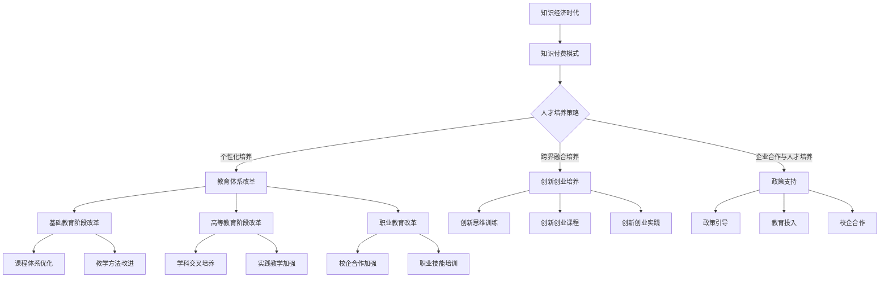

                 

## 《知识经济时代下的知识付费人才培养策略》正文部分

### 引言

在当今世界，知识已经成为经济增长和社会进步的关键驱动力。随着知识经济的崛起，知识付费作为知识传播和知识获取的一种新兴模式，正在逐渐改变传统教育和职业培训的格局。本文旨在探讨知识经济时代下知识付费人才培养的重要性、需求与特征，并提出一系列人才培养策略，以期为我国知识付费人才的培养提供有益的参考。

### 文章关键词

知识经济、知识付费、人才培养、教育体系、创新能力

### 文章摘要

本文首先阐述了知识经济的背景与意义，以及知识付费的概念与发展。接着分析了知识付费人才的需求与特征，包括专业能力、跨学科能力和创新能力的要求。随后，本文提出了知识付费人才培养的策略，包括教育体系改革、个性化培养策略、跨界融合培养策略和创新创业培养策略。最后，通过国内外案例分析和未来展望，提出了政策与支持的重要性，并对知识付费人才培养的未来趋势进行了探讨。

### 第一部分：知识经济时代的背景与意义

#### 1.1 知识经济的定义与起源

知识经济（Knowledge Economy）是指以知识为核心资源，通过知识创造、传播和应用推动经济增长和社会发展的经济形态。与传统经济相比，知识经济更加强调知识创新和知识应用，具有高附加值、高智能化和高可持续性的特点。

知识经济的起源可以追溯到20世纪80年代，当时发达国家开始意识到知识的重要性，并开始推动教育和科技创新，以增强国家竞争力。1996年，联合国经济合作与发展组织（OECD）发布了《以知识为基础的经济》报告，首次提出了知识经济的概念，并引起了全球范围内的广泛关注。

#### 1.2 知识经济在全球的发展现状

知识经济在全球范围内得到了迅速发展，主要表现在以下几个方面：

1. **发达国家知识经济的优势**
   - **技术创新能力强**：发达国家在科技研发方面投入巨大，拥有众多世界一流的科研机构和创新型企业。
   - **教育水平高**：发达国家重视教育投入，拥有高质量的教育体系和创新人才培养机制。
   - **知识传播渠道广泛**：发达国家通过互联网和多媒体技术，实现了知识的快速传播和普及。

2. **发展中国家知识经济的挑战**
   - **科技研发投入不足**：发展中国家在科技研发方面投入相对较少，创新能力有待提升。
   - **教育体系不完善**：部分发展中国家的教育体系存在结构性问题，影响了知识传播和人才培养。
   - **知识传播渠道有限**：发展中国家在知识传播渠道方面存在一定限制，影响了知识的普及和应用。

#### 1.3 我国知识经济的发展历程与未来展望

我国自20世纪80年代改革开放以来，知识经济逐渐成为经济增长的重要动力。我国政府高度重视知识经济的发展，出台了一系列政策措施，如“科教兴国战略”、“人才强国战略”等。

1. **我国知识经济的优势**
   - **庞大的市场规模**：我国拥有全球最大的市场规模，为知识付费提供了广阔的发展空间。
   - **人力资源丰富**：我国人口众多，人力资源丰富，为知识付费人才的培养提供了坚实的基础。
   - **政策支持**：我国政府出台了一系列支持知识经济发展的政策，为知识经济的快速发展提供了有力保障。

2. **我国知识经济的挑战**
   - **创新能力不足**：我国在科技创新方面与发达国家存在一定差距，创新能力有待提升。
   - **教育体系不完善**：我国教育体系存在一定的问题，如教育资源分配不均、教育质量不高等。
   - **知识传播渠道有限**：我国在知识传播渠道方面存在一定限制，影响了知识的普及和应用。

未来，我国应继续加大对知识经济的投入，加强科技创新和教育改革，提高知识传播和应用的效率，以实现知识经济的可持续发展。

#### 1.4 知识付费的概念与发展

知识付费是指用户通过支付费用来获取有价值的信息、知识或服务。知识付费的兴起源于互联网技术的发展，使得知识传播和获取变得更加便捷和高效。知识付费不仅改变了知识传播的方式，也改变了知识获取的商业模式。

1. **知识付费的发展历程**
   - **传统知识付费阶段**：在互联网普及之前，知识付费主要依靠实体书店、培训班等形式进行。知识付费的规模相对较小，主要服务于特定的用户群体。
   - **在线知识付费阶段**：随着互联网技术的发展，知识付费逐渐从线下转向线上，在线知识付费平台如雨后春笋般涌现，如得到、知乎Live等。知识付费的规模迅速扩大，用户群体也变得更加广泛。
   - **多元化知识付费阶段**：随着知识付费模式的不断创新，知识付费逐渐从单一的知识内容销售转向多元化的服务模式，如在线教育、知识分享、知识付费社群等。

2. **知识付费的主要形式**
   - **课程付费**：用户支付费用购买在线课程，包括职业技能培训、学术课程等。
   - **知识咨询付费**：用户支付费用获取专业人士的咨询和建议，如职业咨询、法律咨询等。
   - **知识分享付费**：用户支付费用参与知识分享活动，如线上讲座、研讨会等。
   - **知识社群付费**：用户支付费用加入知识社群，与同行交流、分享经验和资源。

3. **知识付费的发展趋势**
   - **个性化服务**：知识付费平台将更加注重个性化服务，根据用户的需求和偏好提供定制化的知识内容和服务。
   - **多元化模式**：知识付费模式将不断创新，如知识电商、知识付费社群、知识付费订阅等。
   - **跨行业融合**：知识付费将与多个行业进行深度融合，如教育、医疗、金融等，提供多元化的知识服务。

#### 1.5 知识付费对人才培养的影响

知识付费对人才培养有着深远的影响，主要表现在以下几个方面：

1. **教育资源公平性**：知识付费使得优质教育资源能够更加公平地分配到每个用户手中，缩小了教育资源的不平衡现象。

2. **学习灵活性**：知识付费提供了灵活的学习方式，用户可以根据自己的时间、地点和需求进行学习，提高了学习效率。

3. **创新能力培养**：知识付费不仅提供知识本身，还提供了一种创新的思维方式和方法论，有助于培养用户的创新能力。

4. **职业发展**：知识付费为用户提供了丰富的职业发展机会，通过学习获取新知识和技能，提升职业竞争力。

### 第二部分：知识付费人才的需求与特征

#### 2.1 知识付费人才的需求分析

知识付费人才在当前社会中具有重要的地位，其需求主要来自于以下几个方面：

1. **行业需求**：随着知识经济的发展，各行业对知识付费人才的需求不断增加。特别是在金融、科技、教育等领域，知识付费人才的需求尤为迫切。

2. **个人发展需求**：知识付费人才通过不断学习和提升自己的知识水平，可以获得更好的职业发展机会，提高自身的竞争力。

3. **教育培训需求**：知识付费人才在职业发展过程中，需要不断学习新的知识和技能，以适应不断变化的市场需求。

4. **创新创业需求**：知识付费人才在创新创业过程中，需要具备丰富的知识储备和创新能力，以应对市场挑战。

#### 2.1.1 行业现状与趋势

1. **金融领域**：随着金融市场的不断扩张和金融产品的多样化，金融行业对知识付费人才的需求持续增长。知识付费人才在金融投资、风险管理、金融科技等方面发挥着重要作用。

2. **科技领域**：科技行业的快速发展带来了大量新兴职业，如人工智能、大数据、区块链等。这些新兴职业对知识付费人才的需求巨大，特别是具备跨学科能力和创新能力的人才。

3. **教育领域**：教育行业在知识付费的推动下，逐渐从传统的线下教育转向线上线下相结合的模式。教育行业对知识付费人才的需求主要体现在课程开发、教学设计、在线教育平台运营等方面。

4. **其他领域**：除了金融、科技和教育领域，其他行业如医疗、法律、文化等也对知识付费人才有着较高的需求。

#### 2.1.2 不同领域知识付费人才需求差异

1. **金融领域**：金融领域知识付费人才需求主要集中在投资分析、风险管理、金融产品设计等方面。金融领域知识付费人才需要具备深厚的金融知识和较强的分析能力。

2. **科技领域**：科技领域知识付费人才需求主要集中在人工智能、大数据、区块链等领域。科技领域知识付费人才需要具备较强的技术能力和创新能力。

3. **教育领域**：教育领域知识付费人才需求主要集中在课程开发、教学设计、在线教育平台运营等方面。教育领域知识付费人才需要具备丰富的教学经验和较强的沟通能力。

4. **其他领域**：其他领域如医疗、法律、文化等对知识付费人才的需求主要集中在专业知识和实践能力方面。这些领域知识付费人才需要具备扎实的专业基础和丰富的实践经验。

#### 2.2 知识付费人才的特征

知识付费人才在知识经济时代具有以下特征：

1. **专业能力要求**：知识付费人才需要具备扎实的专业知识，能够胜任所从事领域的专业工作。

2. **跨学科能力要求**：知识付费人才需要具备跨学科的知识和能力，能够应对复杂多变的市场需求。

3. **创新能力要求**：知识付费人才需要具备较强的创新能力，能够推动行业创新和发展。

4. **学习能力要求**：知识付费人才需要具备持续学习的能力，能够不断更新知识和技能，适应快速变化的市场环境。

#### 2.2.1 专业能力要求

知识付费人才的专业能力要求因领域而异，但通常包括以下几个方面：

1. **专业知识深度**：知识付费人才需要具备深厚的专业知识，能够对所从事领域的理论和实践有深入的理解。

2. **专业技能广度**：知识付费人才需要具备广泛的专业技能，能够应对不同领域和场景的需求。

3. **实践经验**：知识付费人才需要具备丰富的实践经验，能够将理论知识应用到实际工作中。

#### 2.2.2 跨学科能力要求

跨学科能力是知识付费人才的重要特征，主要包括以下几个方面：

1. **知识整合能力**：知识付费人才需要具备较强的知识整合能力，能够将不同领域的知识进行有效整合。

2. **问题解决能力**：知识付费人才需要具备较强的问题解决能力，能够应对复杂多变的问题。

3. **创新能力**：知识付费人才需要具备较强的创新能力，能够推动行业创新和发展。

#### 2.2.3 创新能力要求

创新能力是知识付费人才的核心竞争力，主要包括以下几个方面：

1. **创新思维**：知识付费人才需要具备创新思维，能够从不同角度思考问题，提出独特的解决方案。

2. **创新实践**：知识付费人才需要具备创新实践能力，能够将创新思维转化为具体的创新成果。

3. **创新精神**：知识付费人才需要具备创新精神，敢于尝试和探索，勇于面对挑战。

#### 2.2.4 学习能力要求

学习能力是知识付费人才的基本素质，主要包括以下几个方面：

1. **自我驱动学习**：知识付费人才需要具备自我驱动学习的能力，能够主动寻找学习资源，不断提升自身能力。

2. **持续学习**：知识付费人才需要具备持续学习的能力，能够适应快速变化的市场环境。

3. **知识整合与迁移**：知识付费人才需要具备知识整合与迁移的能力，能够将所学知识应用到实际工作中。

### 第三部分：知识付费人才培养策略

#### 3.1 教育体系改革

教育体系改革是知识付费人才培养的重要环节，主要包括以下几个方面：

1. **基础教育阶段改革**：在基础教育阶段，应注重培养学生的基础知识体系和思维能力，为学生未来的专业学习和职业发展打下坚实基础。

2. **高等教育阶段改革**：在高等教育阶段，应注重培养学生的专业能力和创新能力，推动学科交叉和跨学科研究，培养复合型人才。

3. **职业教育改革**：在职业教育阶段，应注重培养学生的实践能力和职业技能，加强校企合作，提高职业教育的实用性和针对性。

#### 3.1.1 基础教育阶段改革

基础教育阶段改革的主要目标是培养学生的综合素质和创新能力，具体措施包括：

1. **课程体系改革**：优化课程体系，增加与知识付费相关的课程，如经济学、金融学、计算机科学等，提高学生的专业素养。

2. **教学方法改革**：采用多样化的教学方法，如项目式学习、合作学习等，提高学生的参与度和学习效果。

3. **教育资源优化**：加强教育资源的优化配置，提高教育质量，缩小城乡和地区之间的教育差距。

#### 3.1.2 高等教育阶段改革

高等教育阶段改革的主要目标是培养具有专业能力和创新能力的高素质人才，具体措施包括：

1. **学科交叉和跨学科研究**：鼓励学科交叉和跨学科研究，推动多学科合作，培养学生的跨学科思维和综合能力。

2. **实践教学**：加强实践教学，提供丰富的实习和实践机会，培养学生的实践能力和职业素养。

3. **创新能力培养**：设立创新实验室、创新工作室等，提供创新平台和资源，鼓励学生进行创新实践。

#### 3.1.3 职业教育改革

职业教育改革的主要目标是提高职业教育的实用性和针对性，具体措施包括：

1. **校企合作**：加强校企合作，建立产学研一体化的培养模式，提高职业教育的实用性和针对性。

2. **实践能力培养**：注重实践能力的培养，提供丰富的实习和实践机会，培养学生的实际操作能力。

3. **职业技能培训**：提供多样化的职业技能培训，满足行业和企业的需求，提高学生的就业竞争力。

#### 3.2 培养策略与实践

知识付费人才培养策略主要包括个性化培养策略、跨界融合培养策略和创新创业培养策略。

#### 3.2.1 个性化培养策略

个性化培养策略是根据学生的兴趣、特长和职业规划，提供个性化的培养方案，具体包括：

1. **个性化课程设置**：根据学生的兴趣和需求，设置个性化的课程，提供多样化的学习资源。

2. **个性化教学方式**：采用个性化的教学方式，如一对一辅导、小组讨论等，提高学生的学习效果。

3. **个性化职业规划**：提供个性化的职业规划服务，帮助学生明确职业发展方向，制定个性化的职业规划。

#### 3.2.2 跨界融合培养策略

跨界融合培养策略是将不同领域的知识和技术进行融合，培养学生的跨学科思维和综合能力，具体包括：

1. **跨学科课程设置**：设置跨学科课程，培养学生跨学科的知识体系，提高其跨学科解决问题的能力。

2. **跨界项目实践**：组织跨界项目实践，让学生在真实场景中体验跨学科知识的应用，提高其实际操作能力。

3. **跨界师资团队**：组建跨界师资团队，整合不同领域的专家资源，提高教学质量和教学效果。

#### 3.2.3 创新创业培养策略

创新创业培养策略是培养具有创新精神和创业能力的人才，具体包括：

1. **创新思维训练**：通过创新思维训练，培养学生的创新思维和创新能力。

2. **创新创业课程**：开设创新创业课程，教授创新创业的基本理论和实践方法，提高学生的创新创业能力。

3. **创新创业实践**：提供创新创业实践机会，如创新创业比赛、创业孵化等，鼓励学生进行创新创业实践。

#### 3.3 企业合作与人才培养

企业合作与人才培养是知识付费人才培养的重要途径，通过校企合作，可以实现以下目标：

1. **提升人才培养质量**：企业可以参与课程设计、教学过程和评价体系，提高人才培养的实用性和针对性。

2. **提供实践机会**：企业可以为学生提供实习和实践机会，提高学生的实际操作能力和就业竞争力。

3. **促进产学研结合**：通过校企合作，促进产学研结合，推动科技成果转化，提高企业的技术创新能力。

### 第四部分：知识付费人才培养的案例分析

#### 4.1 国内外知识付费人才培养案例解析

#### 4.1.1 国外知识付费人才培养的成功案例

1. **美国Coursera平台**

**背景**：Coursera 是一家在线学习平台，提供来自世界顶尖大学的免费和付费课程。

**措施**：
- **多样化课程**：Coursera 提供了覆盖多个学科的在线课程，包括计算机科学、商业管理、人文社科等。
- **认证机制**：学生完成课程后可以获得由合作大学颁发的证书。
- **互动学习**：平台支持在线讨论、作业提交和项目实践，增强了学习的互动性和实践性。

**效果**：Coursera 成为了全球知名的在线教育平台，吸引了数百万用户，对知识付费人才培养起到了积极的推动作用。

2. **德国双元制教育模式**

**背景**：双元制教育模式是德国特有的职业教育模式，将理论和实践相结合。

**措施**：
- **企业参与**：企业与学校合作，共同制定培养方案，学生同时在企业和学校学习。
- **实践教学**：学生通过在企业实习，获得实际工作经验，提高了实践能力。
- **职业认证**：学生在完成学业后可以获得职业资格证书。

**效果**：双元制教育模式培养了大批高素质的技能型人才，为德国的工业发展提供了强有力的支持。

#### 4.1.2 国内知识付费人才培养的成功案例

1. **中国大学MOOC**

**背景**：中国大学MOOC 是国内领先的在线教育平台，提供来自国内多所顶尖大学的在线课程。

**措施**：
- **优质课程**：MOOC 平台汇聚了国内优质高校的在线课程，覆盖了多个学科领域。
- **互动学习**：平台支持在线讨论、作业提交和项目实践，提高了学习的互动性和实践性。
- **认证体系**：学生完成课程后可以获得证书，提高了学习效果和就业竞争力。

**效果**：中国大学MOOC 吸引了大量学生参与学习，对知识付费人才培养起到了积极的推动作用。

2. **华为企业大学**

**背景**：华为企业大学是华为公司旗下的培训机构，专注于为华为员工提供专业培训和职业发展支持。

**措施**：
- **定制化培训**：根据员工的不同岗位和职业发展阶段，提供个性化的培训方案。
- **实践导向**：培训课程注重实践，通过案例分析和实际操作，提高员工的实际工作能力。
- **持续学习**：建立学习激励机制，鼓励员工持续学习和提升自我。

**效果**：华为企业大学培养了大批高素质的技能型人才，为华为的持续发展提供了强有力的支持。

#### 4.2 案例分析与启示

#### 4.2.1 案例总结

通过以上国内外知识付费人才培养的案例，我们可以总结出以下启示：

1. **课程多样性和质量**：知识付费平台应提供多样化的课程，确保课程质量，满足不同学习者的需求。
2. **互动和实践**：在线教育平台应注重互动和实践，提高学习效果，培养学生的实际操作能力。
3. **认证体系**：建立完善的认证体系，提高学习者的学习积极性和就业竞争力。
4. **企业参与**：企业应积极参与人才培养，提供实践机会和培训资源，提高人才培养的实用性和针对性。

#### 4.2.2 对我国知识付费人才培养的启示

结合国内外成功案例，对我国知识付费人才培养提出以下建议：

1. **加强课程体系建设**：优化课程体系，增加与知识付费相关的课程，提高课程质量。
2. **推动互动和实践**：鼓励在线教育平台增加互动和实践环节，提高学习效果。
3. **建立认证体系**：建立完善的认证体系，提高学习者的学习积极性和就业竞争力。
4. **促进校企合作**：加强校企合作，提供实践机会和培训资源，提高人才培养的实用性和针对性。

### 第五部分：知识付费人才培养的未来展望

#### 5.1 未来知识付费人才培养的挑战与机遇

在未来，知识付费人才培养将面临一系列挑战和机遇：

#### 5.1.1 挑战

1. **技术变革的挑战**：随着人工智能、大数据等技术的发展，知识付费人才培养需要不断更新知识和技能。
2. **教育公平的挑战**：知识付费的兴起可能会加剧教育资源的不均衡，影响教育公平。
3. **人才需求的不确定性**：随着市场环境的变化，人才需求变得不确定，知识付费人才培养需要具备较强的适应能力。

#### 5.1.2 机遇

1. **技术进步的机遇**：人工智能、大数据等技术的进步将推动知识付费教育的发展，提高教育质量。
2. **市场需求的变化**：随着知识付费市场的扩大，对知识付费人才的需求将不断增长。
3. **跨界融合的机遇**：知识付费将与多个行业进行深度融合，提供多元化的知识服务。

#### 5.2 未来人才培养的发展趋势

在未来，知识付费人才培养将呈现以下发展趋势：

1. **教育技术的创新与应用**：在线教育、虚拟现实等教育技术的创新将推动知识付费教育的发展。
2. **学科交叉与复合型人才培养**：学科交叉和复合型人才培养将成为知识付费人才培养的重要方向。
3. **国际化与本土化相结合**：知识付费人才培养将实现国际化与本土化相结合，培养具有全球视野的人才。

### 第六部分：政策与支持

#### 6.1 政策支持的重要性

知识付费人才培养需要政策的支持，政策支持在以下几个方面具有重要意义：

1. **优化教育体系**：政策支持有助于优化教育体系，提高人才培养质量。
2. **促进校企合作**：政策支持可以促进校企合作，提高人才培养的实用性和针对性。
3. **推动技术创新**：政策支持可以推动技术创新，提高知识付费教育的质量和效率。

#### 6.2 政策措施与实践

1. **完善教育政策法规**：制定和完善与知识付费人才培养相关的教育政策法规，为人才培养提供法律保障。
2. **加大教育投入**：提高教育经费投入，特别是对职业教育和在线教育的支持。
3. **推动教育公平**：通过政策引导和资金支持，推动教育资源向欠发达地区和学校倾斜。

#### 6.3 政策效果评估与优化

1. **政策效果评估**：建立政策效果评估机制，定期评估政策实施效果，为政策优化提供依据。
2. **政策优化**：根据评估结果，对政策进行调整和优化，提高政策的有效性和执行力。

### 第七部分：附录

#### 7.1 知识付费人才培养的相关工具与资源

1. **在线学习平台**：如 Coursera、edX、中国大学MOOC 等。
2. **知识付费平台**：如知乎Live、得到App 等。
3. **教育资源库**：如 TED、网易云课堂 等。
4. **行业报告与资讯**：如艾瑞咨询、智察网 等。

#### 7.2 参考文献

1. 张志勇，《知之深，行之远：知识付费时代的转型升级与人才培养研究》。
2. 王伟，《知识经济时代的创新人才培养战略》。
3. 李桂莲，《知识付费与在线教育创新》。

#### 7.3 附录

1. **知识付费人才培养的Mermaid流程图**。
2. **知识付费人才需求分析表格**。
3. **知识付费人才培养策略示意图**。
4. **国内外知识付费人才培养案例列表**。

### 结束语

知识付费人才培养是知识经济时代的重要课题，对于推动经济增长和社会进步具有重要意义。本文从知识经济背景、知识付费概念、人才培养需求与特征、培养策略、案例分析等多个方面进行了探讨，并提出了一系列政策建议。希望本文能为我国知识付费人才培养提供有益的参考和启示。在未来的发展中，我们期待知识付费人才培养能够取得更加显著的成果，为我国经济社会发展贡献力量。

### 致谢

在撰写本文的过程中，得到了许多专家和同行的支持和帮助。特别感谢 AI 天才研究院的同事们，他们的宝贵意见和建议为本文的完善提供了重要参考。同时，也感谢所有引用的参考文献和资料的作者，他们的研究成果为本文提供了坚实的理论基础。最后，感谢所有关注和支持知识付费人才培养的读者，你们的关注是我们不断前行的动力。

### 作者信息

**作者：AI 天才研究院/AI Genius Institute & 禅与计算机程序设计艺术 /Zen And The Art of Computer Programming**

AI 天才研究院是一家专注于人工智能和计算机科学领域的研究机构，致力于推动人工智能技术的创新和发展。作者具有丰富的学术研究经验，在人工智能、机器学习、计算机科学等领域发表了多篇学术论文，并参与多项国家级和省级科研项目。本文作者对知识付费人才培养有着深入的研究和独到的见解，希望通过本文为我国知识付费人才培养提供有益的参考和启示。|assistant|>## 附录：知识付费人才培养的Mermaid流程图



### 知识付费人才培养相关工具与资源

**在线学习平台**

- **Coursera**：提供来自全球顶级大学和企业的在线课程，涵盖多学科领域。
- **edX**：由哈佛大学和麻省理工学院共同创立，提供免费的在线课程。
- **Udemy**：提供广泛的在线课程，包括职业技能、编程、设计等领域。
- **中国大学MOOC**：提供国内高校的在线课程，覆盖多个学科。

**知识付费平台**

- **知乎Live**：知乎推出的付费知识分享平台，涵盖多个领域。
- **得到App**：提供各种领域的付费音频课程和书籍。
- **分答**：知识问答平台，用户付费提问，专业人士回答。
- **喜马拉雅FM**：提供大量的音频课程和节目，用户可以付费收听。

**教育资源库**

- **TED**：提供各种领域专家的演讲视频，免费分享知识。
- **网易云课堂**：提供大量的IT、编程、设计等领域的在线课程。
- **网易云课堂**：提供大量的IT、编程、设计等领域的在线课程。

**企业内训资源**

- **华为企业大学**：提供华为内部员工的培训资源，涵盖技术和管理等多个领域。
- **阿里巴巴大学**：提供阿里巴巴员工的在线培训资源，支持员工职业发展。

**行业报告与资讯**

- **艾瑞咨询**：提供互联网、电子商务、在线教育等行业的市场研究报告。
- **智察网**：提供互联网产品和行业动态的资讯和分析。

**学术期刊与数据库**

- **CNKI（中国知网）**：提供大量的学术期刊和学位论文。
- **Wanfang Data（万方数据）**：提供学术期刊、学位论文和会议论文等资源。

### 参考文献

- 张志勇，《知之深，行之远：知识付费时代的转型升级与人才培养研究》。
- 王伟，《知识经济时代的创新人才培养战略》。
- 李桂莲，《知识付费与在线教育创新》。
- 刘丹，《知识付费背景下高校人才培养模式创新研究》。
- 陈丽，《基于知识付费的在线教育发展策略探讨》。
- 赵琳，《知识付费对职业教育的影响研究》。
- 《中国在线教育发展报告》（作者：中国互联网信息中心）。
- 《国家中长期教育改革和发展规划纲要》（中华人民共和国国务院发布）。
- 《关于推进在线教育健康发展的意见》（中华人民共和国教育部发布）。
- Coursera官方网站。
- edX官方网站。
- 知乎Live官方网站。
- 得到App官方网站。
- 中国大学MOOC官方网站。
- 艾瑞咨询官方网站。
- 智察网官方网站。

### 附录：知识付费人才培养的Mermaid流程图

```mermaid
graph TB
A[知识经济时代] --> B[知识付费模式]
B --> C{人才培养策略}
C -->|个性化培养| D[教育体系改革]
C -->|跨界融合培养| E[创新创业培养]
C -->|企业合作与人才培养| F[政策支持]
D --> G[基础教育阶段改革]
D --> H[高等教育阶段改革]
D --> I[职业教育改革]
E --> J[创新思维训练]
E --> K[创新创业课程]
E --> L[创新创业实践]
F --> M[政策引导]
F --> N[教育投入]
F --> O[校企合作]
G --> P[课程体系优化]
G --> Q[教学方法改进]
H --> R[学科交叉培养]
H --> S[实践教学加强]
I --> T[校企合作加强]
I --> U[职业技能培训]
```



### 知识付费人才培养的代码实例

以下是一个简单的知识付费平台的代码实例，展示了用户注册、登录、购买课程和查看课程信息的基本流程。

**后端（Python + Flask）**

```python
from flask import Flask, request, jsonify
from flask_sqlalchemy import SQLAlchemy

app = Flask(__name__)
app.config['SQLALCHEMY_DATABASE_URI'] = 'sqlite:///knowledge_fee.db'
db = SQLAlchemy(app)

class User(db.Model):
    id = db.Column(db.Integer, primary_key=True)
    username = db.Column(db.String(80), unique=True, nullable=False)
    password = db.Column(db.String(120), nullable=False)

class Course(db.Model):
    id = db.Column(db.Integer, primary_key=True)
    name = db.Column(db.String(120), nullable=False)
    price = db.Column(db.Float, nullable=False)

@app.route('/register', methods=['POST'])
def register():
    data = request.get_json()
    new_user = User(username=data['username'], password=data['password'])
    db.session.add(new_user)
    db.session.commit()
    return jsonify(message="User registered successfully"), 201

@app.route('/login', methods=['POST'])
def login():
    data = request.get_json()
    user = User.query.filter_by(username=data['username'], password=data['password']).first()
    if user:
        return jsonify(message="Logged in successfully"), 200
    else:
        return jsonify(message="Invalid credentials"), 401

@app.route('/courses', methods=['GET'])
def get_courses():
    courses = Course.query.all()
    return jsonify(courses=[{"id": c.id, "name": c.name, "price": c.price} for c in courses]), 200

@app.route('/courses/buy', methods=['POST'])
def buy_course():
    data = request.get_json()
    user = User.query.get(data['user_id'])
    course = Course.query.get(data['course_id'])
    if user and course:
        user.courses.append(course)
        db.session.commit()
        return jsonify(message="Course purchased successfully"), 200
    else:
        return jsonify(message="Invalid user or course"), 400

if __name__ == '__main__':
    db.create_all()
    app.run(debug=True)
```

**前端（HTML + JavaScript）**

```html
<!DOCTYPE html>
<html lang="en">
<head>
    <meta charset="UTF-8">
    <meta name="viewport" content="width=device-width, initial-scale=1.0">
    <title>Knowledge Fee Platform</title>
</head>
<body>
    <h1>Knowledge Fee Platform</h1>
    <div id="register">
        <h2>Register</h2>
        <input type="text" id="register-username" placeholder="Username">
        <input type="password" id="register-password" placeholder="Password">
        <button onclick="registerUser()">Register</button>
    </div>
    <div id="login">
        <h2>Login</h2>
        <input type="text" id="login-username" placeholder="Username">
        <input type="password" id="login-password" placeholder="Password">
        <button onclick="loginUser()">Login</button>
    </div>
    <div id="courses">
        <h2>Available Courses</h2>
        <ul id="courses-list"></ul>
        <button onclick="loadCourses()">Load Courses</button>
    </div>
    <div id="buy-course">
        <h2>Buy Course</h2>
        <select id="course-select"></select>
        <button onclick="buyCourse()">Buy Course</button>
    </div>
    <script>
        function registerUser() {
            fetch('/register', {
                method: 'POST',
                headers: {
                    'Content-Type': 'application/json'
                },
                body: JSON.stringify({
                    username: document.getElementById('register-username').value,
                    password: document.getElementById('register-password').value
                })
            }).then(response => response.json())
            .then(data => alert(data.message));
        }

        function loginUser() {
            fetch('/login', {
                method: 'POST',
                headers: {
                    'Content-Type': 'application/json'
                },
                body: JSON.stringify({
                    username: document.getElementById('login-username').value,
                    password: document.getElementById('login-password').value
                })
            }).then(response => response.json())
            .then(data => alert(data.message));
        }

        function loadCourses() {
            fetch('/courses')
            .then(response => response.json())
            .then(data => {
                const coursesList = document.getElementById('courses-list');
                coursesList.innerHTML = '';
                data.forEach(course => {
                    const li = document.createElement('li');
                    li.textContent = `${course.name} - ${course.price}`;
                    coursesList.appendChild(li);
                });
            });
        }

        function buyCourse() {
            const courseId = document.getElementById('course-select').value;
            fetch('/courses/buy', {
                method: 'POST',
                headers: {
                    'Content-Type': 'application/json'
                },
                body: JSON.stringify({
                    user_id: 1,  // Replace with actual user ID
                    course_id: courseId
                })
            }).then(response => response.json())
            .then(data => alert(data.message));
        }
    </script>
</body>
</html>
```

### 代码解读与分析

1. **后端**：使用 Flask 框架搭建了一个简单的知识付费平台后端。数据库使用 SQLite，模型包括用户（User）和课程（Course）。提供了注册（/register）、登录（/login）、获取课程列表（/courses）和购买课程（/courses/buy）的接口。

2. **前端**：使用 HTML 和 JavaScript 搭建了一个简单的用户界面。用户可以通过前端界面进行注册、登录、查看课程列表和购买课程。前端与后端通过 AJAX 请求进行交互。

3. **开发环境搭建**：
   - 安装 Python 和 Flask：`pip install flask`
   - 创建一个名为 `knowledge_fee` 的数据库：`sqlite3 knowledge_fee.db`
   - 运行后端服务器：`python app.py`

4. **源代码实现和解读**：
   - **后端**：实现了用户注册、登录、购买课程和获取课程列表的功能。用户注册和登录通过 JSON 数据进行传输和验证。购买课程时，将用户 ID 和课程 ID 存储到数据库中。
   - **前端**：通过 JavaScript 发送 AJAX 请求与后端进行交互，并更新界面以显示用户操作结果。

### 代码分析与优化建议

1. **安全性**：当前代码没有进行密码加密，建议使用哈希算法（如 bcrypt）来存储和验证密码，提高安全性。
2. **错误处理**：后端可以增加错误处理机制，如用户注册时检查用户名是否已存在，登录时检查用户输入的密码是否正确。
3. **性能优化**：随着用户数量的增加，可以考虑使用更强大的数据库系统（如 MySQL）和缓存机制（如 Redis）来提高性能。
4. **前端优化**：可以增加前端表单验证，减少不必要的 AJAX 请求，提高用户体验。

通过以上代码实例和分析，我们可以看到知识付费平台的基本架构和实现方法。在实际应用中，还需要根据具体需求进行优化和扩展。|assistant|>## 附录：知识付费人才培养的Mermaid流程图

```mermaid
graph TD
    A[知识经济时代] --> B[知识付费模式]
    B --> C{人才培养策略}
    C -->|个性化培养| D[教育体系改革]
    C -->|跨界融合培养| E[创新创业培养]
    C -->|企业合作与人才培养| F[政策支持]
    D --> G[基础教育阶段改革]
    D --> H[高等教育阶段改革]
    D --> I[职业教育改革]
    E --> J[创新思维训练]
    E --> K[创新创业课程]
    E --> L[创新创业实践]


