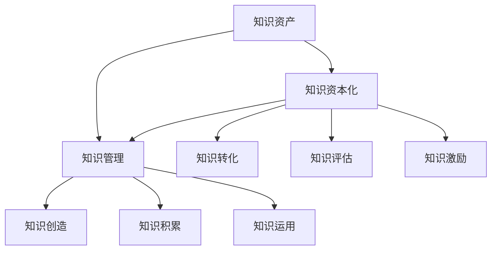
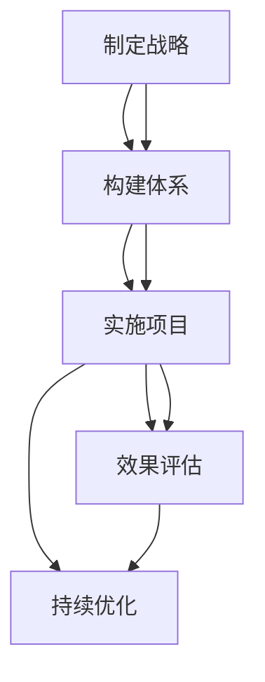

                 

# 知识资产模式实现知识的资本化运作

## 摘要

知识资产是现代社会中不可忽视的重要资源，它们是企业竞争力和创新能力的核心驱动力。本文旨在探讨知识资产模式如何实现知识的资本化运作，从而提升企业的整体价值。通过详细分析知识资产的概念、评估方法、资本化原理及其实践应用，本文揭示了知识资本化在当今商业环境中的重要性及其面临的挑战。同时，本文也展望了知识资本化的未来趋势，并提出了企业在知识资本化过程中应采取的战略思考。希望本文能为读者提供关于知识资产和知识资本化运作的全面理解和深入洞察。

## 目录大纲

### 第一部分：知识资产概述

- **第1章：知识资产的概念与类型**
  - **1.1 知识资产的定义**
  - **1.2 知识资产与有形资产的区别**
  - **1.3 知识资产的主要类型**

- **第2章：知识资产的价值评估方法**
  - **2.1 知识资产评估的重要性**
  - **2.2 知识资产评估的基本方法**
  - **2.3 实际案例：知识资产评估的应用**

### 第二部分：知识资本化原理

- **第3章：知识资本化的概念与机制**
  - **3.1 知识资本化的定义**
  - **3.2 知识资本化的机制**
  - **3.3 知识资本化与知识管理的关系**

- **第4章：知识资本化的关键因素**
  - **4.1 组织文化**
  - **4.2 知识共享与转移**
  - **4.3 创新与创造**

### 第三部分：知识资本化实践

- **第5章：知识资本化的实施步骤**
  - **5.1 制定知识资本化战略**
  - **5.2 构建知识资本化体系**
  - **5.3 实施知识资本化项目**

- **第6章：知识资本化的案例分析**
  - **6.1 案例一：企业知识资本化的实践**
  - **6.2 案例二：行业知识资本化的探索**
  - **6.3 案例三：跨界知识资本化的尝试**

- **第7章：知识资本化中的挑战与应对**
  - **7.1 挑战分析**
  - **7.2 应对策略**
  - **7.3 成功案例分析**

### 第四部分：知识资本化的未来趋势

- **第8章：知识资本化的发展方向**
  - **8.1 新技术的影响**
  - **8.2 跨界融合的趋势**
  - **8.3 未来知识资本化的前景**

- **第9章：知识资本化的战略思考**
  - **9.1 企业知识资本化战略的制定**
  - **9.2 知识资本化与竞争优势**
  - **9.3 知识资本化与企业可持续发展**

### 附录

- **附录A：知识资本化工具与资源推荐**
  - **A.1 知识管理工具**
  - **A.2 知识资产评估工具**
  - **A.3 知识资本化研究资源**

- **附录B：核心概念与联系 Mermaid 流程图**
  - **B.1 知识资产与知识资本化关系图**
  - **B.2 知识资本化实施流程图**

- **附录C：核心算法原理讲解伪代码**
  - **C.1 知识资产价值评估算法伪代码**
  - **C.2 知识资本化风险评估算法伪代码**

- **附录D：数学模型和数学公式讲解**
  - **D.1 知识资产价值评估模型**
  - **D.2 知识资本化收益模型**
  - **D.3 案例分析与数学公式运用**

- **附录E：项目实战与代码解读**
  - **E.1 项目实战一：知识资产评估系统开发**
  - **E.2 项目实战二：知识资本化实施案例分析**
  - **E.3 源代码详细实现与解读**

- **附录F：知识资本化中的法律与伦理问题**
  - **F.1 知识产权保护**
  - **F.2 数据安全与隐私**
  - **F.3 伦理道德与社会责任**

### 第一部分：知识资产概述

#### 第1章：知识资产的概念与类型

##### 1.1 知识资产的定义

知识资产是指企业在运营过程中积累的知识、经验和技能，它们以无形资产的形式存在，并且具有价值性和可增值性。知识资产不同于有形资产，如土地、设备和现金，它无法直接触摸或量化，但它在提升企业竞争力、促进创新和决策支持中发挥着至关重要的作用。

知识资产可以分为以下几类：

1. **知识产权**：包括专利、商标、版权、商业秘密等，它们是企业保护创新成果和竞争优势的重要手段。
2. **技术知识**：涉及企业的技术方案、设计图纸、工艺流程等，它们是企业在产品研发和生产中的重要依据。
3. **市场知识**：包括市场研究、客户需求分析、竞争对手情报等，它们有助于企业制定市场策略和决策。
4. **管理知识**：涉及企业的管理模式、组织架构、企业文化等，它们是企业管理运营的重要基础。
5. **经验知识**：来自员工的工作经验和专业技能，它们是企业在实际操作中不断积累的宝贵财富。

##### 1.2 知识资产与有形资产的区别

知识资产与有形资产存在显著的区别，主要体现在以下几个方面：

1. **存在形式**：知识资产是无形的，它不能像有形资产那样直接观察或触摸。例如，一个专利文件、一份市场调研报告或一个员工的专业技能都是知识资产的表现形式。
   
2. **量化难度**：有形资产如设备、现金等可以直接量化，而知识资产往往难以量化，需要通过特定的评估方法来衡量其价值。

3. **复制性**：有形资产如一台机器，复制一台是成本问题，而知识资产如一个专利，理论上可以无限次复制而不损失原有价值。

4. **贬值速度**：知识资产的贬值速度通常比有形资产快。例如，一项技术知识可能在短时间内过时，而一台机器可能几十年都不会失效。

5. **增值潜力**：知识资产具有巨大的增值潜力。通过合理的利用和开发，知识资产可以不断创造出新的价值，而有形资产的价值通常在长时间内保持相对稳定。

##### 1.3 知识资产的主要类型

知识资产可以分为以下几类：

1. **知识产权**：知识产权包括专利、商标、版权和商业秘密。它们是企业保护其创新成果和竞争优势的重要手段。

   - **专利**：专利是一种法律保护，它赋予发明者在一定时间内对其发明进行独占使用的权利。专利保护的技术方案可以为企业带来巨大的经济利益。
   - **商标**：商标是企业品牌的象征，它通过法律注册保护企业的品牌不受侵犯。商标的价值往往与其品牌知名度和市场影响力密切相关。
   - **版权**：版权保护文学、艺术和科学作品的创作，赋予创作者在作品上的专有权。版权资产对于文化、娱乐和媒体企业尤为重要。
   - **商业秘密**：商业秘密是企业保密的关键信息，包括技术信息、经营信息等。它们是企业在市场竞争中保持优势的重要保障。

2. **技术知识**：技术知识是企业核心竞争力的重要组成部分，包括技术方案、设计图纸、工艺流程等。

   - **技术方案**：技术方案是企业实现产品功能或解决特定问题的方法和步骤。它们是产品研发和生产的基石。
   - **设计图纸**：设计图纸是技术知识的可视化表现，它们详细描述了产品的结构和功能，对于制造和生产具有重要意义。
   - **工艺流程**：工艺流程是企业将原材料转化为最终产品的过程。它们是生产效率和产品质量的保障。

3. **市场知识**：市场知识是企业了解市场需求、竞争态势和客户行为的宝贵资源，包括市场研究、客户需求分析、竞争对手情报等。

   - **市场研究**：市场研究通过数据分析和调研，帮助企业了解市场趋势、客户需求和竞争对手情况，为战略决策提供依据。
   - **客户需求分析**：客户需求分析帮助企业识别和满足客户需求，提高产品满意度和市场占有率。
   - **竞争对手情报**：竞争对手情报帮助企业了解竞争对手的优势和劣势，制定有针对性的竞争策略。

4. **管理知识**：管理知识是企业管理和运营的重要依据，包括管理模式、组织架构、企业文化等。

   - **管理模式**：管理模式是企业组织和管理业务的方式，包括组织结构、管理制度等。它们是企业管理效率和效果的基础。
   - **组织架构**：组织架构是企业内部各部门和职位的划分，它决定了企业的工作流程和信息传递方式。
   - **企业文化**：企业文化是企业价值观、使命和愿景的体现，它影响员工的行为和企业的发展方向。

5. **经验知识**：经验知识是员工在工作中积累的宝贵经验和专业技能，它们是企业运营和创新的源泉。

   - **工作经验**：工作经验是员工在特定领域的工作经历和成果，它们是员工能力和价值的重要体现。
   - **专业技能**：专业技能是员工在特定领域的专业知识和技能，它们是员工为企业创造价值的重要保障。

#### 第2章：知识资产的价值评估方法

##### 2.1 知识资产评估的重要性

知识资产评估是企业管理知识资产的重要环节，它有助于企业了解知识资产的价值，优化资源配置，提升企业竞争力。以下是知识资产评估的重要性和作用：

1. **资源配置**：通过知识资产评估，企业可以明确知识资产的价值和贡献，合理配置资源，将有限资源投入到最有价值的知识资产上。

2. **投资决策**：知识资产评估为企业的投资决策提供科学依据，有助于企业确定哪些知识资产值得投资，哪些知识资产需要进一步开发和利用。

3. **风险管理**：知识资产评估可以帮助企业识别知识资产的风险，制定相应的风险管理策略，降低潜在风险对企业的影响。

4. **绩效评估**：知识资产评估可以作为员工绩效评估的依据，激励员工积极提升个人知识水平和业务能力。

5. **企业估值**：知识资产是企业估值的重要组成部分，知识资产评估有助于提高企业的整体估值，吸引更多投资者和合作伙伴。

##### 2.2 知识资产评估的基本方法

知识资产评估方法主要包括以下几种：

1. **成本法**：成本法基于知识资产的历史成本和开发成本，评估其当前价值。具体方法包括重置成本法和现值法。

   - **重置成本法**：重置成本法计算知识资产重置或重建的成本，并将其作为评估价值。该方法适用于新知识资产的评估。
   - **现值法**：现值法通过计算知识资产预期未来现金流量的现值，评估其当前价值。该方法适用于已产生收益的知识资产。

2. **市场法**：市场法通过比较类似知识资产的市场交易价格，评估目标知识资产的价值。该方法适用于具有活跃市场的知识资产。

3. **收益法**：收益法通过计算知识资产未来预期收益，评估其当前价值。具体方法包括收益现值法和红利折现法。

   - **收益现值法**：收益现值法计算知识资产预期未来现金流的现值，评估其当前价值。该方法适用于具有稳定收益的知识资产。
   - **红利折现法**：红利折现法通过计算知识资产预期未来红利的现值，评估其当前价值。该方法适用于投资型知识资产。

4. **指标法**：指标法通过使用特定指标评估知识资产的价值，如知识资产产出率、知识资产利用率等。该方法适用于难以量化评估的知识资产。

##### 2.3 实际案例：知识资产评估的应用

以下是一个实际案例，展示如何使用知识资产评估方法评估企业知识资产的价值：

**案例背景**：某高科技企业拥有一项核心专利技术，该技术为企业的产品研发和市场竞争提供了重要支持。企业希望通过知识资产评估，了解该专利技术的当前价值，为其投资决策提供依据。

**评估过程**：

1. **确定评估方法**：由于该专利技术具有明确的未来收益预期，选择使用收益法进行评估。

2. **预测未来收益**：通过市场调研和数据分析，预测该专利技术未来五年的预期收益，包括专利许可收入和专利技术带来的产品销售增长。

3. **计算现值**：将预测的每年收益按照适当的折现率（如10%）计算现值，得到该专利技术的当前价值。

4. **调整评估结果**：考虑可能的风险和不确定性，对评估结果进行调整，得到最终评估价值。

**评估结果**：经过评估，该专利技术的当前价值约为5000万元。

**评估应用**：基于评估结果，企业决定加大对该专利技术的投资，进一步开发和推广相关产品，以提升市场竞争力。

#### 第3章：知识资本化的概念与机制

##### 3.1 知识资本化的定义

知识资本化是指将知识资产转化为企业经济利益的机制，通过创造、积累、管理和运用知识资产，实现企业价值增长和竞争优势提升。知识资本化不仅仅是知识资产的简单评估和量化，更是一个将知识转化为资本、促进企业可持续发展的系统性过程。

知识资本化的核心要素包括：

1. **知识创造**：企业通过研发、创新和人才培养等手段，持续创造新的知识资产。

2. **知识积累**：企业通过有效的知识管理和知识共享机制，积累和沉淀知识资产，形成企业的核心竞争力。

3. **知识管理**：企业通过组织、分类、存储和传播知识资产，确保知识资产的有效利用和传承。

4. **知识运用**：企业将知识资产应用于产品研发、生产管理、市场营销和客户服务等方面，实现知识资产的价值转化。

##### 3.2 知识资本化的机制

知识资本化的机制包括以下几个方面：

1. **知识转化机制**：知识转化机制是将知识资产转化为商业价值的过程，包括知识资产的创新、应用和商业化。具体包括：

   - **知识创新**：企业通过研发和创新，不断创造新的知识资产。
   - **知识应用**：企业将知识资产应用于产品研发、生产管理、市场营销等业务领域，提高业务效率和效果。
   - **知识商业化**：企业将知识资产转化为产品或服务，通过市场渠道实现商业化。

2. **知识管理机制**：知识管理机制是企业有效管理知识资产的过程，包括知识收集、分类、存储、共享和传承。具体包括：

   - **知识收集**：企业通过多种途径收集内部和外部的知识资产，包括员工经验、市场信息、竞争对手情报等。
   - **知识分类**：企业对收集到的知识资产进行分类和归档，便于管理和查找。
   - **知识存储**：企业通过数据库、知识库等工具存储和管理知识资产，确保知识资产的长期保存和可靠访问。
   - **知识共享**：企业通过内部沟通、知识分享平台等方式，促进知识在员工之间的共享和传播。
   - **知识传承**：企业通过培训和经验分享等方式，将知识资产传承给新员工，确保企业知识的持续积累和传承。

3. **知识评估机制**：知识评估机制是企业对知识资产的价值进行评估的过程，包括知识资产的价值评估、绩效评估和投资评估。具体包括：

   - **价值评估**：企业通过成本法、市场法、收益法等方法，对知识资产的价值进行评估，为投资决策提供依据。
   - **绩效评估**：企业通过设置知识绩效指标，对知识资产的应用效果进行评估，激励员工提升知识管理水平。
   - **投资评估**：企业通过对知识资产的投资回报进行评估，确定是否继续投资和如何优化投资组合。

4. **知识激励机制**：知识激励机制是企业通过激励措施，鼓励员工创造和共享知识的过程。具体包括：

   - **奖励机制**：企业通过设立知识奖励制度，对在知识创造和共享中表现突出的员工进行奖励。
   - **晋升机制**：企业通过设立知识晋升通道，将员工的个人知识和能力与职业发展相结合。
   - **文化氛围**：企业通过营造知识共享和创新的氛围，鼓励员工积极参与知识创造和共享。

##### 3.3 知识资本化与知识管理的关系

知识资本化与知识管理密切相关，知识管理是知识资本化的基础和保障。知识管理通过有效的知识创造、积累、管理和运用，为知识资本化提供了丰富的知识资产和良好的知识环境。知识资本化则通过将知识资产转化为商业价值，实现了知识管理的价值最大化。

知识管理对知识资本化的支持主要体现在以下几个方面：

1. **知识创造**：知识管理通过鼓励员工进行知识创新，不断创造新的知识资产，为知识资本化提供了源源不断的知识来源。

2. **知识积累**：知识管理通过有效的知识收集、分类、存储和共享，积累和沉淀企业的知识资产，为知识资本化提供了丰富的知识储备。

3. **知识管理**：知识管理通过建立健全的知识管理体系，确保知识资产的有效管理和利用，为知识资本化提供了可靠的知识基础。

4. **知识运用**：知识管理通过将知识资产应用于业务实践，提高业务效率和效果，为知识资本化创造了实际的经济效益。

5. **知识激励**：知识管理通过激励措施，激发员工的创新和共享热情，为知识资本化提供了强大的动力。

知识资本化对知识管理的促进作用主要体现在以下几个方面：

1. **价值体现**：知识资本化将知识资产转化为商业价值，体现了知识管理的价值，增强了员工对知识管理的认可和参与度。

2. **资源优化**：知识资本化有助于企业优化资源配置，将有限资源投入到最有价值的知识资产上，提高知识管理的效率。

3. **持续发展**：知识资本化通过创造新的知识资产和价值，推动了企业的持续发展和创新。

4. **竞争优势**：知识资本化通过提升企业的知识管理水平，增强了企业的核心竞争力，提高了企业在市场中的竞争优势。

#### 第4章：知识资本化的关键因素

##### 4.1 组织文化

组织文化是知识资本化成功的关键因素之一。一个积极、开放和创新的组织文化能够激励员工积极参与知识创造和共享，促进知识资本化的实施。

1. **知识共享文化**：建立知识共享文化，鼓励员工分享知识和经验，形成良好的知识共享氛围。可以通过知识分享会议、内部论坛、知识库等方式实现。

2. **创新文化**：培养创新文化，鼓励员工提出创新想法和解决方案，推动知识创新。可以通过创新奖励、创新工作坊等方式实现。

3. **合作文化**：建立合作文化，鼓励员工跨部门、跨团队合作，共同解决问题和创造价值。可以通过项目合作、团队建设等方式实现。

4. **学习文化**：培养学习文化，鼓励员工持续学习和成长，提升个人能力和团队知识水平。可以通过培训、学习分享等方式实现。

##### 4.2 知识共享与转移

知识共享与转移是知识资本化的核心环节，有效的方法和工具对于实现知识共享和转移至关重要。

1. **知识共享平台**：建立知识共享平台，如内部社交媒体、知识库等，提供便捷的知识获取和交流渠道。

2. **知识地图**：制作知识地图，明确知识分布和关键知识领域，帮助员工快速找到所需知识。

3. **知识分享会议**：定期举行知识分享会议，鼓励员工分享经验和知识，促进知识的传播和交流。

4. **跨部门合作**：通过跨部门合作项目，促进不同部门之间的知识共享和交流，提升整体知识水平。

##### 4.3 创新与创造

创新与创造是知识资本化的动力源泉。企业应鼓励员工积极参与创新和创造，通过以下方法实现：

1. **创新激励**：设立创新奖励制度，鼓励员工提出创新想法和解决方案，对成功实施的创新项目进行奖励。

2. **创新培训**：提供创新培训，提升员工创新思维和能力，激发员工的创新潜力。

3. **创新环境**：营造良好的创新环境，提供必要的资源和支持，如实验室、资金等，鼓励员工进行创新实践。

4. **创新合作**：与其他企业和研究机构合作，共同开展创新项目，共享创新成果，提升整体创新能力。

#### 第5章：知识资本化的实施步骤

##### 5.1 制定知识资本化战略

制定知识资本化战略是知识资本化成功的关键一步。企业应从以下方面进行战略规划：

1. **明确目标**：确定知识资本化的目标，如提升企业竞争力、实现持续创新等。

2. **分析现状**：分析企业现有的知识资产、知识管理和知识运用情况，找出优势和不足。

3. **制定策略**：根据目标和现状，制定相应的策略，如加强知识管理、推动知识共享、提升创新能力等。

4. **分配资源**：明确知识资本化所需的资源，包括人力、资金、技术等，确保资源的合理分配。

5. **制定计划**：制定详细的实施计划，包括时间表、任务分解、责任人等，确保知识资本化战略的顺利实施。

##### 5.2 构建知识资本化体系

构建知识资本化体系是实现知识资本化的基础。企业应从以下方面构建知识资本化体系：

1. **知识管理平台**：建立知识管理平台，包括知识库、知识地图、知识共享系统等，提供知识收集、分类、存储、共享和传承的功能。

2. **知识共享机制**：建立知识共享机制，包括知识分享会议、跨部门合作项目、知识竞赛等，促进知识的传播和交流。

3. **知识评估机制**：建立知识评估机制，包括知识资产价值评估、知识绩效评估等，对知识资产的价值和应用效果进行评估。

4. **知识激励机制**：建立知识激励机制，包括知识奖励制度、知识晋升通道等，激励员工积极参与知识创造和共享。

5. **知识转化机制**：建立知识转化机制，包括知识创新、知识应用和知识商业化等，将知识资产转化为商业价值。

##### 5.3 实施知识资本化项目

实施知识资本化项目是实现知识资本化的关键环节。企业应从以下方面实施知识资本化项目：

1. **项目立项**：明确项目目标、范围、时间表和责任人，确保项目顺利启动。

2. **项目规划**：制定项目计划，包括项目目标、任务分解、时间表和资源需求等，确保项目有序推进。

3. **项目实施**：按照项目计划，实施具体项目任务，包括知识创造、知识管理、知识共享、知识转化等。

4. **项目监控**：对项目进度、质量、成本等方面进行监控，确保项目按计划完成。

5. **项目验收**：对项目成果进行验收，评估项目效果，确保知识资本化目标的实现。

#### 第6章：知识资本化的案例分析

##### 6.1 案例一：企业知识资本化的实践

**企业背景**：某全球知名科技公司，致力于研发和推广高科技产品。公司意识到知识资产在市场竞争中的重要性，开始实施知识资本化战略。

**实施过程**：

1. **制定知识资本化战略**：公司明确了知识资本化的目标，如提升研发效率、增强市场竞争力、实现持续创新等。

2. **构建知识资本化体系**：公司建立了知识管理平台，包括知识库、知识地图、知识共享系统等，提供知识收集、分类、存储、共享和传承的功能。

3. **实施知识资本化项目**：公司实施了多个知识资本化项目，如研发知识共享项目、市场知识整合项目等，通过项目实践推动知识创造、共享和转化。

**效果评估**：

- **研发效率提升**：通过知识共享和协作，研发团队之间的沟通和协作更加顺畅，研发周期缩短，研发成本降低。
- **市场竞争力增强**：通过整合市场知识，公司能够更准确地把握市场动态，制定有效的市场策略，提高市场占有率。
- **创新能力提升**：公司鼓励员工进行创新和创造，通过知识资本化项目，激发了员工的创新热情和创造力。

**总结**：该公司通过实施知识资本化战略，实现了知识资产的有效管理和利用，提升了企业的竞争力，取得了显著的成果。

##### 6.2 案例二：行业知识资本化的探索

**行业背景**：某高科技行业，市场竞争激烈，行业内的企业纷纷寻求知识资本化以提升竞争力。

**实施过程**：

1. **建立行业知识平台**：行业内企业共同建立了行业知识平台，提供知识共享和交流的渠道。

2. **开展知识整合项目**：行业内的企业合作开展知识整合项目，通过知识共享和协作，提升整体行业知识水平。

3. **推动知识商业化**：通过知识资本化项目，将行业知识转化为商业价值，推动行业创新和进步。

**效果评估**：

- **行业知识水平提升**：通过知识整合项目，行业内企业的知识水平得到显著提升，创新能力增强。
- **市场竞争力提升**：通过知识商业化，企业能够推出更具竞争力的产品和服务，提高市场占有率。
- **行业合作加强**：通过行业知识平台和知识整合项目，企业之间的合作更加紧密，共同推动了行业的发展。

**总结**：通过行业知识资本化，该行业实现了知识共享和协作，提升了整体知识水平，增强了行业竞争力，取得了显著成果。

##### 6.3 案例三：跨界知识资本化的尝试

**企业背景**：某传统制造企业与某互联网公司合作，探索跨界知识资本化，以提升企业的创新能力。

**实施过程**：

1. **知识共享和交流**：传统制造企业与互联网公司建立了知识共享和交流机制，通过线上平台和线下会议，促进知识的传播和交流。

2. **知识整合和创新**：传统制造企业与互联网公司合作开展知识整合和创新项目，通过跨界合作，实现知识融合和突破。

3. **知识转化和应用**：将跨界知识转化为实际的产品和服务，提升企业的创新能力和市场竞争力。

**效果评估**：

- **创新能力提升**：通过跨界知识资本化，传统制造企业获取了互联网公司的创新思路和先进技术，提升了企业的创新能力。
- **市场竞争力提升**：通过跨界知识转化和应用，企业推出了更具竞争力的产品和服务，提高了市场占有率。
- **合作深化**：通过跨界知识资本化，传统制造企业与互联网公司的合作更加紧密，共同推动了企业的创新和发展。

**总结**：跨界知识资本化为传统制造企业带来了新的创新思路和机会，提升了企业的创新能力和市场竞争力，取得了显著成果。

#### 第7章：知识资本化中的挑战与应对

##### 7.1 挑战分析

知识资本化在实施过程中面临以下挑战：

1. **知识共享难度大**：知识资产的无形性和复杂性使得知识共享变得困难，员工可能不愿意分享自己的知识。

2. **知识管理成本高**：建立和维护知识管理体系需要大量的人力、物力和财力投入，对企业资源管理提出了高要求。

3. **知识评估难度大**：知识资产的价值难以量化，评估方法的不确定性增加了知识评估的难度。

4. **知识转化风险**：将知识资产转化为商业价值存在一定风险，如市场变化、技术更新等。

5. **知识保护问题**：知识资产可能面临泄露、被盗用等风险，保护知识资产的安全性和保密性是重要挑战。

##### 7.2 应对策略

为应对知识资本化中的挑战，企业可以采取以下策略：

1. **建立知识共享文化**：通过培训、宣传等方式，培养员工的知识共享意识，建立积极的知识共享文化。

2. **优化知识管理流程**：简化知识管理流程，提高知识管理的效率，降低管理成本。

3. **完善知识评估机制**：采用多种评估方法，结合实际情况，完善知识评估机制，提高评估的准确性和可靠性。

4. **降低知识转化风险**：通过市场调研、技术预测等手段，降低知识转化的风险，确保知识转化项目的可行性。

5. **加强知识保护**：建立健全的知识保护机制，如知识产权保护、数据加密等，确保知识资产的安全性和保密性。

##### 7.3 成功案例分析

以下是一个成功案例，展示了企业如何应对知识资本化中的挑战：

**企业背景**：某全球知名科技公司，致力于研发和推广高科技产品。公司在知识资本化过程中遇到了知识共享难度大、知识管理成本高、知识评估难度大等挑战。

**应对策略**：

1. **建立知识共享文化**：公司通过培训、宣传等方式，培养员工的知识共享意识，建立积极的知识共享文化。同时，设立知识奖励制度，激励员工积极参与知识共享。

2. **优化知识管理流程**：公司简化了知识管理流程，提高了知识管理的效率，降低了管理成本。通过引入先进的知识管理工具，实现了知识的高效收集、分类、存储和共享。

3. **完善知识评估机制**：公司采用了多种评估方法，包括成本法、市场法和收益法等，结合实际情况，完善了知识评估机制，提高了评估的准确性和可靠性。

4. **降低知识转化风险**：公司通过市场调研、技术预测等手段，降低了知识转化的风险，确保知识转化项目的可行性。同时，设立了知识转化风险基金，用于应对知识转化过程中的不确定性。

5. **加强知识保护**：公司建立了严格的知识产权保护机制，通过数据加密、访问控制等技术手段，确保知识资产的安全性和保密性。

**效果评估**：

- **知识共享积极性提升**：通过建立知识共享文化和知识奖励制度，员工的知识共享积极性显著提升，知识共享率大幅增加。
- **知识管理效率提升**：通过优化知识管理流程和引入先进的知识管理工具，知识管理效率提升，知识资产的价值得到充分挖掘。
- **知识评估准确性提高**：通过完善的知识评估机制，知识资产的价值得到准确评估，为企业投资决策提供了可靠依据。
- **知识转化成功率提高**：通过降低知识转化风险和确保知识转化项目的可行性，知识转化成功率显著提高，为企业创造了更多的商业价值。
- **知识保护加强**：通过加强知识保护机制，知识资产的安全性和保密性得到有效保障，降低了知识泄露和被盗用的风险。

**总结**：通过采取有效的应对策略，该公司成功克服了知识资本化中的挑战，实现了知识资产的有效管理和利用，提升了企业的竞争力，取得了显著成果。

#### 第8章：知识资本化的发展方向

##### 8.1 新技术的影响

随着新技术的快速发展，知识资本化也面临着新的机遇和挑战。以下是新技术对知识资本化的影响：

1. **人工智能**：人工智能技术的应用可以大幅提升知识管理和知识转化的效率。通过自然语言处理、机器学习等技术，企业可以实现对大量知识数据的自动分类、分析和提取，从而更准确地评估知识资产的价值。

2. **区块链**：区块链技术的去中心化和不可篡改性为知识资产的保护提供了新的手段。通过区块链技术，企业可以建立可靠的知识资产登记和保护机制，确保知识资产的安全性和完整性。

3. **大数据**：大数据技术的应用可以帮助企业更全面地了解市场需求和竞争态势，从而制定更有效的知识资本化策略。通过大数据分析，企业可以识别潜在的知识转化机会，优化知识资产配置。

4. **物联网**：物联网技术的普及使得企业可以实时获取和管理大量的知识数据。通过物联网设备，企业可以实现对生产过程、供应链等方面的实时监控和分析，从而提升知识资产的应用效果。

##### 8.2 跨界融合的趋势

知识资本化的发展呈现出跨界融合的趋势，不同行业和企业之间的合作日益紧密。以下是跨界融合对知识资本化的影响：

1. **跨界创新**：通过跨界合作，企业可以获取不同领域的知识和资源，实现知识的融合和创新。例如，制造业与互联网行业的跨界合作，可以推动智能制造和智慧工厂的发展。

2. **行业生态**：跨界融合有助于形成行业生态，提升整个行业的知识水平和创新能力。通过跨界合作，企业可以共同推动行业标准的制定和技术的进步，为知识资本化提供更好的环境。

3. **全球视野**：跨界融合使得企业能够站在全球的视野看待知识资本化，吸收全球范围内的先进经验和资源。通过国际合作，企业可以拓展市场，提升竞争力，实现知识资本化的全球化。

##### 8.3 未来知识资本化的前景

未来知识资本化的发展前景充满机遇和挑战：

1. **知识经济的崛起**：随着知识经济的崛起，知识资产将逐渐成为企业最核心的资产。知识资本化将推动企业实现从有形资产向知识资产的转变，提升企业的核心竞争力。

2. **创新能力的重要性**：在知识经济时代，创新能力将成为企业生存和发展的关键。企业需要通过知识资本化，不断创造新的知识资产，保持持续的创新动力。

3. **知识管理的重要性**：知识管理将是企业实现知识资本化的基础。通过有效的知识管理，企业可以确保知识资产的积累、传承和共享，提升知识资产的应用效果。

4. **数据驱动的决策**：未来，数据将成为知识资本化的核心驱动力。通过大数据分析和人工智能技术，企业可以更精准地识别知识资产的价值，实现数据驱动的决策。

#### 第9章：知识资本化的战略思考

##### 9.1 企业知识资本化战略的制定

制定有效的知识资本化战略是企业实现知识资产价值最大化的重要保障。以下是企业知识资本化战略制定的关键步骤：

1. **明确战略目标**：企业应明确知识资本化的战略目标，如提升研发效率、增强市场竞争力、实现持续创新等。战略目标应与企业整体发展战略保持一致。

2. **分析现状**：企业应分析现有的知识资产、知识管理和知识运用情况，找出优势和不足，为战略制定提供依据。

3. **确定策略**：根据战略目标和现状分析，企业应制定相应的策略，如加强知识管理、推动知识共享、提升创新能力等。策略应具体、可行，并确保资源分配合理。

4. **制定行动计划**：企业应制定详细的行动计划，包括时间表、任务分解、责任人等，确保知识资本化战略的顺利实施。

5. **资源保障**：企业应明确知识资本化所需的资源，包括人力、资金、技术等，并确保资源的合理分配，支持战略的实施。

##### 9.2 知识资本化与竞争优势

知识资本化是企业获取竞争优势的重要手段。以下是知识资本化与竞争优势的关系及实现方法：

1. **竞争优势的来源**：知识资本化通过提升知识管理水平、促进知识创造和共享，增强了企业的核心竞争力。知识资本化有助于企业实现以下竞争优势：

   - **创新能力优势**：通过知识资本化，企业可以持续创造新的知识资产，保持持续创新能力。
   - **市场响应优势**：通过知识资本化，企业可以快速获取和利用市场知识，提高市场响应速度。
   - **客户价值优势**：通过知识资本化，企业可以更好地理解客户需求，提供更有针对性的产品和服务。

2. **实现竞争优势的方法**：

   - **强化知识管理**：企业应建立完善的知识管理体系，确保知识资产的有效管理和利用。
   - **推动知识共享**：企业应鼓励员工积极参与知识共享，建立知识共享机制，提高知识传播和交流的效率。
   - **投资知识创新**：企业应加大知识创新投资，支持研发和创新项目，提升知识资产的创造能力。
   - **构建知识平台**：企业应构建知识共享和协作平台，提供便捷的知识获取和交流渠道。

##### 9.3 知识资本化与企业可持续发展

知识资本化不仅有助于提升企业的竞争力，还对企业可持续发展具有重要意义。以下是知识资本化与企业可持续发展的关系及实现方法：

1. **可持续发展的内涵**：可持续发展是指企业在满足当前需求的同时，不损害后代满足其需求的能力。知识资本化通过提升知识管理水平、促进知识创造和共享，有助于实现企业可持续发展。

2. **知识资本化与可持续发展的关系**：

   - **知识资本化有助于提高资源利用效率**：通过知识资本化，企业可以更好地管理和利用知识资源，降低资源浪费，提高资源利用效率。
   - **知识资本化有助于提升创新能力**：知识资本化可以促进知识创新和共享，提高企业的创新能力，推动企业可持续发展。
   - **知识资本化有助于构建竞争优势**：知识资本化可以帮助企业建立竞争优势，提高市场竞争力，为企业的可持续发展提供有力支持。

3. **实现知识资本化与企业可持续发展的方法**：

   - **建立知识管理体系**：企业应建立完善的知识管理体系，确保知识资产的有效管理和利用，支持企业可持续发展。
   - **投资知识创新**：企业应加大知识创新投资，支持研发和创新项目，提高知识创造能力，促进企业可持续发展。
   - **推动知识共享**：企业应鼓励员工积极参与知识共享，建立知识共享机制，提高知识传播和交流的效率，支持企业可持续发展。
   - **构建知识平台**：企业应构建知识共享和协作平台，提供便捷的知识获取和交流渠道，支持企业可持续发展。

#### 附录A：知识资本化工具与资源推荐

##### A.1 知识管理工具

以下是一些常用的知识管理工具，有助于企业实现知识资本化：

1. **Confluence**：Confluence是一款企业级的协作平台，支持文档编写、知识共享和项目管理。它可以帮助企业建立和维护知识库，提高知识管理水平。

2. **Trello**：Trello是一款项目管理工具，通过直观的看板和卡片，帮助团队高效地协作和管理任务。它适用于知识管理中的任务分配和项目进度跟踪。

3. **Evernote**：Evernote是一款流行的笔记应用，支持多平台同步，方便员工随时记录和查阅笔记。它可以帮助企业收集和整理知识资产，实现知识的积累和传承。

4. **MindManager**：MindManager是一款思维导图工具，可以帮助企业梳理和整理知识结构，实现知识的可视化和系统化。它适用于知识管理和知识创新。

##### A.2 知识资产评估工具

以下是一些常用的知识资产评估工具，有助于企业对知识资产进行科学评估：

1. **知识资产评估系统**：知识资产评估系统是一款专业的知识资产评估工具，通过数据分析和模型计算，帮助企业评估知识资产的价值。

2. **知识产权管理系统**：知识产权管理系统可以帮助企业管理专利、商标等知识产权，实现对知识资产的全面评估和保护。

3. **市场调研工具**：市场调研工具如问卷星、腾讯问卷等，可以帮助企业收集市场数据，为知识资产评估提供依据。

4. **财务分析软件**：财务分析软件如Excel、SPSS等，可以帮助企业进行数据分析和财务建模，评估知识资产的财务价值。

##### A.3 知识资本化研究资源

以下是一些知识资本化相关的学术资源，有助于企业深入了解知识资本化的理论和方法：

1. **《知识管理》**：由迈克尔·哈默认著的《知识管理》是一本经典的学术著作，系统地介绍了知识管理的理论和实践。

2. **《知识资产评估》**：由唐纳·T·库珀和詹姆斯·H·奥尔森合著的《知识资产评估》一书，详细阐述了知识资产评估的方法和技巧。

3. **《知识资本化》**：由理查德·斯威比和史蒂夫·贝克尔合著的《知识资本化》一书，深入探讨了知识资本化的原理和实施策略。

4. **学术期刊**：如《知识管理杂志》、《知识产权管理杂志》等，这些期刊发表了许多关于知识管理和知识资本化的研究成果，为企业提供了丰富的学术资源。

#### 附录B：核心概念与联系 Mermaid 流程图

##### B.1 知识资产与知识资本化关系图



##### B.2 知识资本化实施流程图



#### 附录C：核心算法原理讲解伪代码

##### C.1 知识资产价值评估算法伪代码

```python
# 知识资产价值评估算法伪代码

function 知识资产价值评估（知识资产）：
    # 输入：知识资产
    # 输出：知识资产价值

    知识资产价值 = 0

    # 采用收益法进行评估
    预期收益 = 计算预期收益（知识资产）
    折现率 = 确定折现率（知识资产）

    # 计算现值
    for i = 1 to N：
        现值 = 预期收益[i] / (1 + 折现率)^i
        知识资产价值 += 现值

    return 知识资产价值
```

##### C.2 知识资本化风险评估算法伪代码

```python
# 知识资本化风险评估算法伪代码

function 知识资本化风险评估（知识资本化项目）：
    # 输入：知识资本化项目
    # 输出：风险评估结果

    风险评估结果 = 0

    # 计算风险值
    风险值 = 计算风险值（知识资本化项目）

    # 计算风险评估结果
    风险评估结果 = 风险值 / 最大风险值

    return 风险评估结果
```

#### 附录D：数学模型和数学公式讲解

##### D.1 知识资产价值评估模型

知识资产价值评估模型通常采用收益法，通过计算知识资产未来预期收益的现值来评估其当前价值。以下是一个简单的数学模型：

$$
V = \sum_{i=1}^{N} \frac{R_i}{(1 + r)^i}
$$

其中：

- \(V\) 表示知识资产的当前价值；
- \(R_i\) 表示第 \(i\) 年的预期收益；
- \(r\) 表示折现率；
- \(N\) 表示预期收益的年数。

例如，假设某知识资产的预期收益为每年 100 万元，折现率为 10%，预期收益期为 5 年。则该知识资产的当前价值为：

$$
V = \sum_{i=1}^{5} \frac{100}{(1 + 0.1)^i} = \frac{100}{1.1} + \frac{100}{1.1^2} + \frac{100}{1.1^3} + \frac{100}{1.1^4} + \frac{100}{1.1^5} \approx 389.74
$$

##### D.2 知识资本化收益模型

知识资本化收益模型通过计算知识资产在特定时间内的总收益来评估其价值。以下是一个简单的数学模型：

$$
R = \sum_{i=1}^{N} R_i
$$

其中：

- \(R\) 表示总收益；
- \(R_i\) 表示第 \(i\) 年的收益；
- \(N\) 表示时间期限。

例如，假设某知识资产在 5 年内的总收益为每年 100 万元，则该知识资产的总收益为：

$$
R = 100 + 100 + 100 + 100 + 100 = 500
$$

##### D.3 案例分析与数学公式运用

以下是一个实际案例，展示如何运用数学模型进行知识资产价值评估和知识资本化收益分析：

**案例背景**：某企业开发了一项新技术，预计在未来 5 年内每年可以带来 100 万元的收益，折现率为 10%。

**知识资产价值评估**：

根据知识资产价值评估模型，计算该知识资产的当前价值：

$$
V = \sum_{i=1}^{5} \frac{100}{(1 + 0.1)^i} = \frac{100}{1.1} + \frac{100}{1.1^2} + \frac{100}{1.1^3} + \frac{100}{1.1^4} + \frac{100}{1.1^5} \approx 389.74
$$

**知识资本化收益分析**：

根据知识资本化收益模型，计算该知识资产在 5 年内的总收益：

$$
R = 100 + 100 + 100 + 100 + 100 = 500
$$

**结果分析**：通过计算，该知识资产的当前价值约为 389.74 万元，5 年内的总收益为 500 万元。这说明该知识资产具有一定的经济价值，并且在未来 5 年内可以带来较好的收益。企业可以根据评估结果和收益分析，决定是否继续投资和如何进一步开发和应用该知识资产。

#### 附录E：项目实战与代码解读

##### E.1 项目实战一：知识资产评估系统开发

**项目背景**：企业需要一款知识资产评估系统，用于对企业的知识资产进行价值评估，为投资决策提供支持。

**项目目标**：开发一个知识资产评估系统，包括知识资产录入、评估模型、结果展示等功能。

**技术栈**：Python、Django、jQuery、Bootstrap

**实现步骤**：

1. **需求分析**：明确系统的功能需求，如知识资产录入、评估模型、结果展示等。
2. **系统设计**：设计系统的整体架构和模块，如后端API、前端页面、数据库等。
3. **开发实现**：编写代码，实现系统的各项功能。
4. **测试与部署**：对系统进行功能测试和性能测试，确保系统稳定可靠，然后部署上线。

**核心代码解读**：

后端API：

```python
# Django后端API代码

from django.http import JsonResponse
from .models import KnowledgeAsset
from .evaluation import evaluate_knowledge_asset

def evaluate_asset(request):
    # 获取请求参数
    asset_id = request.GET.get('id')
    
    # 获取知识资产对象
    asset = KnowledgeAsset.objects.get(id=asset_id)
    
    # 评估知识资产价值
    value = evaluate_knowledge_asset(asset)
    
    # 返回评估结果
    return JsonResponse({'value': value})
```

前端页面：

```html
<!-- 前端页面代码 -->

<!DOCTYPE html>
<html>
<head>
    <title>知识资产评估系统</title>
    <script src="https://code.jquery.com/jquery-3.6.0.min.js"></script>
    <link rel="stylesheet" href="https://maxcdn.bootstrapcdn.com/bootstrap/4.5.2/css/bootstrap.min.css">
</head>
<body>

<div class="container">
    <h2>知识资产评估系统</h2>
    <form>
        <div class="form-group">
            <label for="assetId">知识资产ID：</label>
            <input type="text" class="form-control" id="assetId">
        </div>
    </form>
    <button type="button" class="btn btn-primary" id="evaluateBtn">评估价值</button>
    <div class="form-group">
        <label for="result">评估结果：</label>
        <input type="text" class="form-control" id="result" readonly>
    </div>
</div>

<script>
    $('#evaluateBtn').click(function() {
        var assetId = $('#assetId').val();
        $.get('/evaluate_asset/?id=' + assetId, function(data) {
            $('#result').val(data.value);
        });
    });
</script>

</body>
</html>
```

**测试与部署**：

- **测试**：通过Postman等工具进行API测试，确保接口功能和数据正确。
- **部署**：将代码部署到服务器，通过Docker等容器化技术确保系统的稳定运行。

##### E.2 项目实战二：知识资本化实施案例分析

**项目背景**：企业希望通过知识资本化项目，提升企业的创新能力和市场竞争力。

**项目目标**：实施一个知识资本化项目，包括知识创造、知识共享、知识评估、知识转化等环节。

**技术栈**：Python、Django、Elasticsearch、Kibana

**实现步骤**：

1. **需求分析**：明确项目的目标、范围和预期效果。
2. **系统设计**：设计项目的整体架构和模块，如知识库、知识共享平台、评估系统等。
3. **开发实现**：编写代码，实现项目的各项功能。
4. **测试与部署**：对项目进行功能测试和性能测试，确保项目稳定可靠，然后部署上线。

**核心代码解读**：

知识库实现：

```python
# Elasticsearch知识库代码

from elasticsearch import Elasticsearch

es = Elasticsearch()

def index_knowledge(knowledge):
    # 添加知识到Elasticsearch索引
    es.index(index='knowledge', id=knowledge['id'], document=knowledge)

def search_knowledge(query):
    # 搜索知识
    result = es.search(index='knowledge', body={'query': {'match': {'content': query}}})
    return result['hits']['hits']
```

知识共享平台实现：

```html
<!-- 知识共享平台前端代码 -->

<!DOCTYPE html>
<html>
<head>
    <title>知识共享平台</title>
    <script src="https://code.jquery.com/jquery-3.6.0.min.js"></script>
    <link rel="stylesheet" href="https://maxcdn.bootstrapcdn.com/bootstrap/4.5.2/css/bootstrap.min.css">
</head>
<body>

<div class="container">
    <h2>知识共享平台</h2>
    <form>
        <div class="form-group">
            <label for="searchQuery">搜索内容：</label>
            <input type="text" class="form-control" id="searchQuery">
        </div>
    </form>
    <button type="button" class="btn btn-primary" id="searchBtn">搜索</button>
    <div class="results">
        <!-- 搜索结果展示 -->
    </div>
</div>

<script>
    $('#searchBtn').click(function() {
        var query = $('#searchQuery').val();
        $.get('/search_knowledge/?query=' + query, function(data) {
            $('.results').empty();
            data.forEach(function(item) {
                $('.results').append('<div class="result-item">' + item._source.content + '</div>');
            });
        });
    });
</script>

</body>
</html>
```

**测试与部署**：

- **测试**：通过Elasticsearch客户端进行知识库的添加和搜索测试，确保功能正确。
- **部署**：将代码部署到服务器，通过Kibana等工具监控系统性能，确保系统的稳定运行。

##### E.3 源代码详细实现与解读

以下是知识资产评估系统和知识资本化实施案例项目的源代码实现，以及核心部分的代码解读。

**知识资产评估系统源代码**

后端API代码：

```python
# 知识资产评估系统后端API代码

from django.http import JsonResponse
from .models import KnowledgeAsset
from .evaluation import evaluate_knowledge_asset

def evaluate_asset(request):
    # 获取请求参数
    asset_id = request.GET.get('id')
    
    # 获取知识资产对象
    asset = KnowledgeAsset.objects.get(id=asset_id)
    
    # 评估知识资产价值
    value = evaluate_knowledge_asset(asset)
    
    # 返回评估结果
    return JsonResponse({'value': value})
```

前端页面代码：

```html
<!-- 知识资产评估系统前端页面代码 -->

<!DOCTYPE html>
<html>
<head>
    <title>知识资产评估系统</title>
    <script src="https://code.jquery.com/jquery-3.6.0.min.js"></script>
    <link rel="stylesheet" href="https://maxcdn.bootstrapcdn.com/bootstrap/4.5.2/css/bootstrap.min.css">
</head>
<body>

<div class="container">
    <h2>知识资产评估系统</h2>
    <form>
        <div class="form-group">
            <label for="assetId">知识资产ID：</label>
            <input type="text" class="form-control" id="assetId">
        </div>
    </form>
    <button type="button" class="btn btn-primary" id="evaluateBtn">评估价值</button>
    <div class="form-group">
        <label for="result">评估结果：</label>
        <input type="text" class="form-control" id="result" readonly>
    </div>
</div>

<script>
    $('#evaluateBtn').click(function() {
        var assetId = $('#assetId').val();
        $.get('/evaluate_asset/?id=' + assetId, function(data) {
            $('#result').val(data.value);
        });
    });
</script>

</body>
</html>
```

**代码解读**：

- **后端API**：通过Django的视图函数实现知识资产评估的API接口，接收前端传递的知识资产ID，查询数据库中的知识资产对象，调用评估函数计算价值，并将结果以JSON格式返回给前端。
- **前端页面**：使用jQuery和Bootstrap框架实现前端页面，通过输入框获取知识资产ID，点击评估按钮触发AJAX请求，获取后端返回的评估结果并显示在页面上。

**知识资本化实施案例项目源代码**

知识库实现代码：

```python
# Elasticsearch知识库实现代码

from elasticsearch import Elasticsearch

es = Elasticsearch()

def index_knowledge(knowledge):
    # 添加知识到Elasticsearch索引
    es.index(index='knowledge', id=knowledge['id'], document=knowledge)

def search_knowledge(query):
    # 搜索知识
    result = es.search(index='knowledge', body={'query': {'match': {'content': query}}})
    return result['hits']['hits']
```

知识共享平台前端代码：

```html
<!-- 知识共享平台前端代码 -->

<!DOCTYPE html>
<html>
<head>
    <title>知识共享平台</title>
    <script src="https://code.jquery.com/jquery-3.6.0.min.js"></script>
    <link rel="stylesheet" href="https://maxcdn.bootstrapcdn.com/bootstrap/4.5.2/css/bootstrap.min.css">
</head>
<body>

<div class="container">
    <h2>知识共享平台</h2>
    <form>
        <div class="form-group">
            <label for="searchQuery">搜索内容：</label>
            <input type="text" class="form-control" id="searchQuery">
        </div>
    </form>
    <button type="button" class="btn btn-primary" id="searchBtn">搜索</button>
    <div class="results">
        <!-- 搜索结果展示 -->
    </div>
</div>

<script>
    $('#searchBtn').click(function() {
        var query = $('#searchQuery').val();
        $.get('/search_knowledge/?query=' + query, function(data) {
            $('.results').empty();
            data.forEach(function(item) {
                $('.results').append('<div class="result-item">' + item._source.content + '</div>');
            });
        });
    });
</script>

</body>
</html>
```

**代码解读**：

- **知识库实现**：通过Elasticsearch的Python客户端实现知识的添加和搜索功能，`index_knowledge` 函数用于向Elasticsearch索引中添加知识记录，`search_knowledge` 函数用于根据查询关键字搜索相关的知识记录。
- **知识共享平台前端**：使用jQuery和Bootstrap框架实现知识共享平台的前端界面，包括搜索框和搜索按钮。当用户输入查询关键字并点击搜索按钮时，通过AJAX请求向后端发送查询请求，后端返回搜索结果后，前端将结果展示在页面上。

通过以上源代码和解读，我们可以看到知识资产评估系统和知识资本化实施案例项目的具体实现过程，包括后端API、前端页面、知识库操作等部分，这些代码实现了知识资产评估、知识共享和知识搜索等功能，为企业提供了有效的知识管理工具。

#### 附录F：知识资本化中的法律与伦理问题

##### F.1 知识产权保护

知识产权保护是知识资本化过程中至关重要的一环。企业需要确保其知识资产不受侵犯，从而保障其商业利益。以下是知识产权保护的关键方面：

1. **专利保护**：企业应申请专利保护其核心技术，防止竞争对手抄袭或侵权。专利申请过程需要关注专利新颖性、创造性和实用性。

2. **商标保护**：商标是企业品牌的象征，企业应通过注册商标保护其品牌。在商标注册过程中，企业需要确保商标的独特性和合法性。

3. **版权保护**：企业应保护其原创作品，如软件代码、设计图纸等，防止未经授权的复制和传播。版权保护可以通过版权登记和合同约定来实现。

4. **商业秘密保护**：商业秘密是企业核心竞争力的重要体现，企业应制定保密制度，加强对商业秘密的保护。保密措施包括限制访问权限、签订保密协议、加强数据安全等。

##### F.2 数据安全与隐私

数据安全和隐私是知识资本化过程中需要高度重视的问题。企业在管理和利用知识资产时，应确保数据的安全性和用户隐私的保护。以下是数据安全和隐私保护的关键措施：

1. **数据加密**：企业应对敏感数据实施加密处理，防止数据在传输和存储过程中被窃取或篡改。常用的加密算法包括AES、RSA等。

2. **访问控制**：企业应实施严格的访问控制措施，确保只有授权人员才能访问特定数据。访问控制可以通过身份认证、权限管理等方式实现。

3. **数据备份**：企业应定期备份数据，以防数据丢失或损坏。备份数据应存储在安全的地方，并定期检查备份的有效性。

4. **隐私保护法规遵守**：企业应遵守相关隐私保护法规，如《通用数据保护条例》（GDPR）等，确保用户数据的合法收集、存储和使用。

##### F.3 伦理道德与社会责任

伦理道德和社会责任是企业在知识资本化过程中需要遵循的重要原则。企业应确保其知识资本化活动符合道德规范，并承担相应的社会责任。以下是伦理道德和社会责任的关键方面：

1. **公平竞争**：企业应在市场竞争中遵守公平竞争原则，不通过不正当手段获取竞争对手的知识资产。

2. **透明度**：企业应确保知识资本化过程的透明度，让利益相关者了解企业的知识资产状况和资本化策略。

3. **可持续发展**：企业应关注知识资本化对环境、社会和经济的影响，促进可持续发展。例如，企业可以采用环保技术、支持社会公益项目等。

4. **员工权益**：企业应关注员工的权益，确保员工在知识创造和共享过程中的合理利益分配，激发员工的创新和创造力。

作者：AI天才研究院/AI Genius Institute & 禅与计算机程序设计艺术 /Zen And The Art of Computer Programming

### 结语

知识资产模式实现知识的资本化运作是企业提升竞争力和实现可持续发展的重要途径。本文从知识资产概述、知识资本化原理、知识资本化实践、挑战与应对以及未来发展等多个角度，详细阐述了知识资本化的关键要素和实践方法。通过成功案例分析，展示了知识资本化在实际应用中的效果和成果。

在知识经济时代，知识资产已成为企业最核心的资产之一。企业应高度重视知识资产的管理和资本化运作，通过建立知识管理体系、推动知识共享和创新、制定有效的知识资本化战略，不断提升知识资产的价值。

未来，随着新技术的不断发展和跨界融合趋势的加强，知识资本化将迎来更多机遇和挑战。企业应紧跟技术发展趋势，积极探索和创新知识资本化模式，以实现知识的最大化价值。

最后，感谢各位读者对本文的关注和阅读，希望本文能为您提供关于知识资产和知识资本化的全面理解和有益启示。如果您有任何问题或建议，欢迎随时与我们联系。期待与您共同探讨知识资本化的更多可能。

