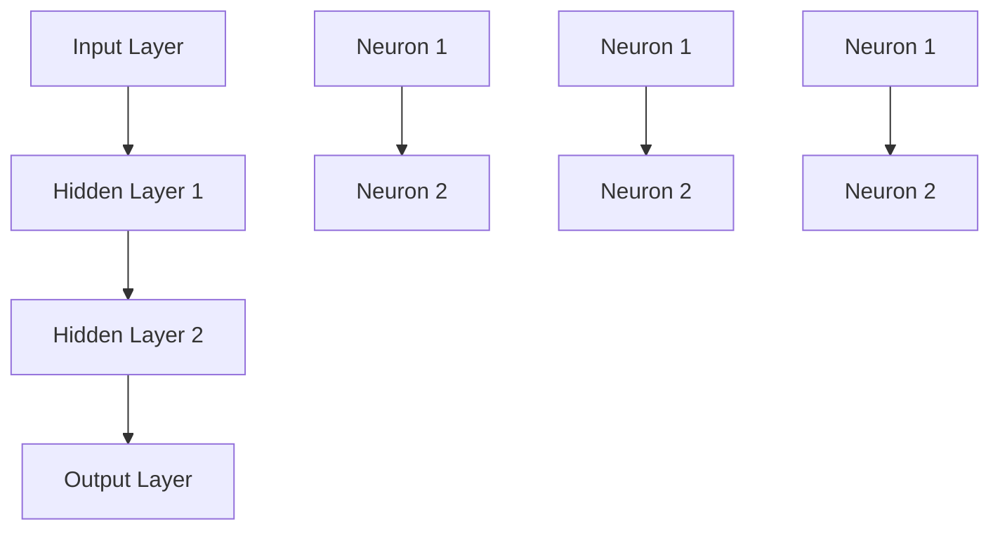
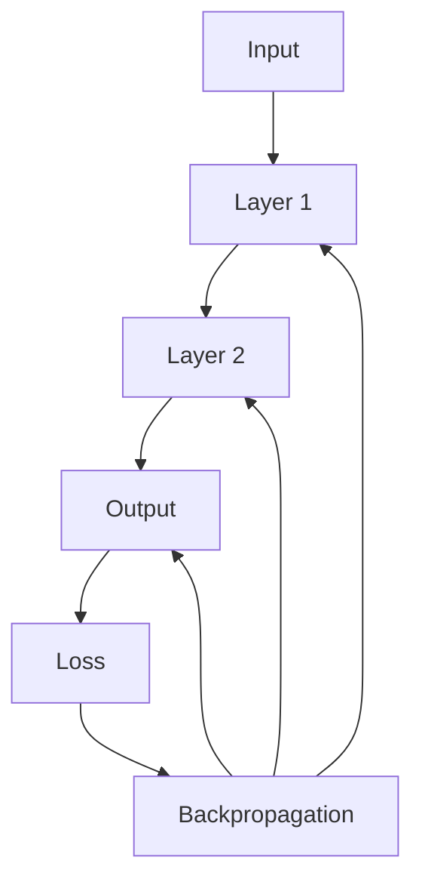
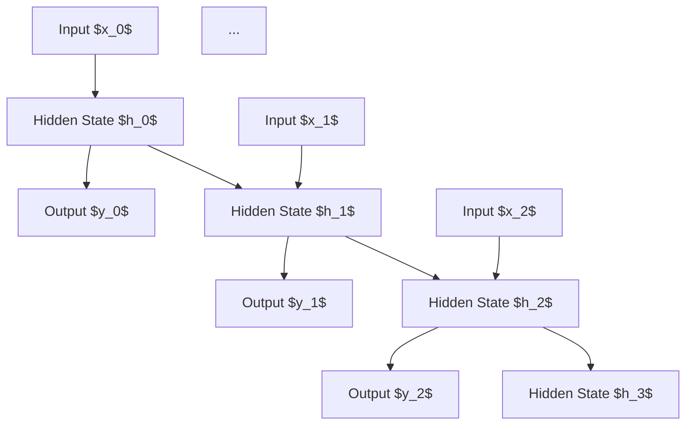
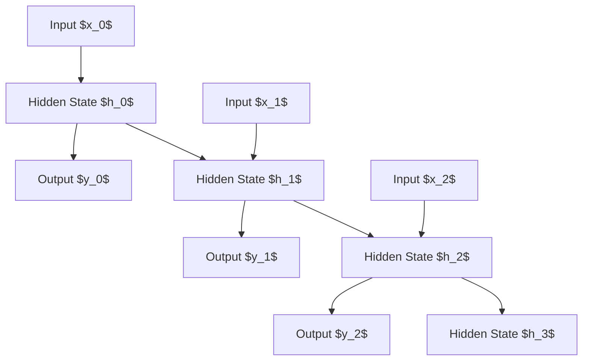
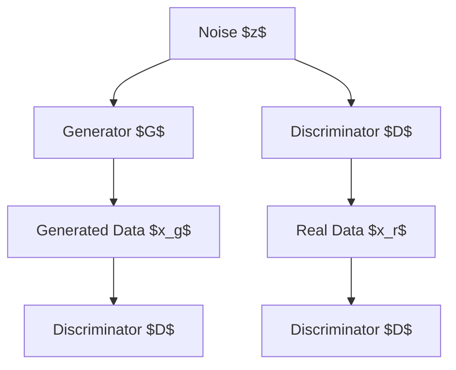

                 

### 《神经网络：人类智慧的解放》

> **关键词：** 神经网络、人工智能、深度学习、机器学习、图像识别、自然语言处理

> **摘要：** 本文系统地介绍了神经网络的基础知识、训练优化方法以及在实际应用中的广泛运用，通过详细的分析和丰富的案例，帮助读者深入理解神经网络的工作原理和实际应用，从而掌握这一强大的机器学习技术。

----------------------------------------------------------------

### 《神经网络：人类智慧的解放》目录大纲

#### 第一部分：神经网络基础

**第1章：神经网络的概述**

- **1.1 神经网络的历史与发展**
- **1.2 神经网络的基本结构**
- **1.3 神经网络的特点与优势**
- **1.4 神经网络在人工智能中的应用前景**
- **1.5 本章小结**

**第2章：前馈神经网络**

- **2.1 前馈神经网络的原理**
- **2.2 多层感知机（MLP）**
- **2.3 卷积神经网络（CNN）**
- **2.4 CNN在图像识别中的应用**
- **2.5 本章小结**

**第3章：循环神经网络（RNN）**

- **3.1 RNN的基本原理**
- **3.2 长短时记忆网络（LSTM）**
- **3.3 Gated Recurrent Unit（GRU）**
- **3.4 RNN在自然语言处理中的应用**
- **3.5 本章小结**

**第4章：生成对抗网络（GAN）**

- **4.1 GAN的原理与结构**
- **4.2 GAN的应用**
- **4.3 GAN的挑战与未来发展趋势**
- **4.4 本章小结**

#### 第二部分：神经网络的训练与优化

**第5章：神经网络的训练**

- **5.1 训练数据预处理**
- **5.2 模型参数初始化**
- **5.3 损失函数与优化算法**
- **5.4 学习率调度策略**
- **5.5 正则化技术**
- **5.6 神经网络结构优化**
- **5.7 本章小结**

**第6章：神经网络的优化**

- **6.1 学习率调度策略**
- **6.2 正则化技术**
- **6.3 神经网络结构优化**
- **6.4 超参数调优方法**
- **6.5 超参数调优实践**
- **6.6 本章小结**

**第7章：神经网络的超参数调优**

- **7.1 超参数的概念**
- **7.2 超参数调优方法**
- **7.3 超参数调优实践**
- **7.4 实际案例分析**
- **7.5 本章小结**

#### 第三部分：神经网络的实际应用

**第8章：神经网络在图像处理中的应用**

- **8.1 图像分类**
- **8.2 目标检测**
- **8.3 图像生成**
- **8.4 实际应用案例解析**
- **8.5 本章小结**

**第9章：神经网络在自然语言处理中的应用**

- **9.1 文本分类**
- **9.2 文本生成**
- **9.3 机器翻译**
- **9.4 实际应用案例解析**
- **9.5 本章小结**

**第10章：神经网络在推荐系统中的应用**

- **10.1 推荐系统的基本概念**
- **10.2 神经网络在推荐系统中的应用**
- **10.3 实际应用案例解析**
- **10.4 本章小结**

**第11章：神经网络在游戏AI中的应用**

- **11.1 游戏AI的基本概念**
- **11.2 神经网络在游戏AI中的应用**
- **11.3 实际应用案例解析**
- **11.4 游戏AI的发展趋势**
- **11.5 本章小结**

#### 附录：神经网络相关资源与工具

**附录A：神经网络相关资源**

- **学术论文与书籍**
- **在线学习资源**
- **开源框架与工具**

**附录B：神经网络学习指南**

- **学习路线与建议**
- **实践项目推荐**
- **职业发展建议**

----------------------------------------------------------------

### 第一部分：神经网络基础

在人工智能的发展历程中，神经网络无疑是最具革命性的技术之一。从简单的感知机到复杂的深度学习模型，神经网络通过模仿人脑的工作原理，实现了对数据的自动学习和模式识别。本部分将系统地介绍神经网络的基础知识，包括其历史发展、基本结构、主要类型以及应用前景。

#### 第1章：神经网络的概述

##### 1.1 神经网络的历史与发展

神经网络的概念最早可以追溯到1943年，由心理学家McCulloch和数学家Pitts提出。他们的研究奠定了人工神经网络（Artificial Neural Network，ANN）的理论基础。1958年，Frank Rosenblatt提出了感知机（Perceptron）模型，这是一种二分类线性分类器，对ANN的研究产生了重要影响。

随着时间的推移，神经网络经历了多个发展阶段。1980年代，由于计算机性能的限制和算法的复杂度，神经网络的研究和应用一度陷入低潮。直到1990年代，随着计算机硬件性能的提升和机器学习算法的进步，神经网络重新得到了广泛关注。

近年来，深度学习（Deep Learning）的兴起，使神经网络的研究和应用达到了新的高度。深度学习模型通过多层神经网络结构，能够自动学习复杂的数据特征，并在图像识别、语音识别、自然语言处理等领域取得了显著的成果。

神经网络的发展历程可以概括为以下几个阶段：

- **感知机与早期神经网络：** 1940s-1960s，以感知机为代表的简单神经网络模型。
- **反向传播算法：** 1970s-1980s，基于梯度下降的反向传播算法的提出，使得神经网络能够进行多层训练。
- **深度学习与卷积神经网络：** 2000s-2010s，深度学习模型的出现，尤其是卷积神经网络（CNN）在图像识别上的突破。
- **生成对抗网络（GAN）：** 2010s，由生成器和判别器组成的对抗网络，能够在图像生成、图像超分辨率和风格迁移等领域取得优异表现。
- **现代深度学习：** 2010s至今，以神经网络为基础的深度学习技术，在各个领域取得了广泛应用，如自然语言处理、推荐系统、游戏AI等。

##### 1.2 神经网络的基本结构

神经网络由大量的神经元（节点）组成，这些神经元通过连接（边）相互连接，形成一个复杂的网络结构。一个典型的神经网络包括以下几个部分：

- **输入层（Input Layer）：** 神经网络的输入数据部分，每个输入节点对应一个特征。
- **隐藏层（Hidden Layers）：** 位于输入层和输出层之间的层，可以有一个或多个，每个隐藏层包含多个神经元。
- **输出层（Output Layer）：** 神经网络的输出结果部分，通常包含一个或多个输出节点，每个输出节点对应一个类别或预测值。

神经元之间的连接通过权重（weights）进行连接，这些权重决定了输入数据在神经元之间的传递强度。此外，每个神经元还会包含一个偏置项（bias），用于调整神经元的输出。

##### 1.3 神经网络的特点与优势

神经网络具有以下几个显著特点：

- **非线性变换能力：** 通过多层非线性变换，神经网络能够自动学习复杂的数据特征。
- **自适应性与自学习能力：** 神经网络可以通过学习算法（如反向传播算法）自动调整权重和偏置项，从而实现自我优化。
- **并行处理能力：** 神经网络能够同时处理多个输入数据，具有较高的计算效率。
- **容错性：** 神经网络具有较强的鲁棒性，能够容忍一定程度的错误或不完整的数据。

神经网络在人工智能领域具有广泛的应用优势：

- **图像识别：** 卷积神经网络（CNN）在图像识别任务中取得了显著成果，如人脸识别、物体检测等。
- **自然语言处理：** 循环神经网络（RNN）和长短时记忆网络（LSTM）在文本分类、机器翻译等领域表现出色。
- **语音识别：** 通过深度学习模型，语音识别的准确性得到了大幅提升。
- **推荐系统：** 神经网络能够通过学习用户的历史行为和偏好，实现个性化推荐。
- **游戏AI：** 强化学习结合神经网络，使得游戏AI能够实现更加智能的行为决策。

##### 1.4 神经网络在人工智能中的应用前景

随着人工智能技术的不断发展，神经网络在各个领域展现出巨大的应用潜力：

- **自动驾驶：** 通过深度学习模型，自动驾驶汽车能够实现自主导航和环境感知。
- **医疗诊断：** 神经网络在医学影像分析、疾病诊断等方面具有广泛应用前景。
- **金融风控：** 神经网络能够通过分析历史交易数据，预测市场趋势和风险。
- **工业自动化：** 神经网络在工业自动化领域，如机器人视觉、自动化控制等方面具有广泛应用。
- **智能家居：** 神经网络能够通过学习用户行为，实现智能家居设备的智能化管理和控制。

神经网络作为人工智能的核心技术之一，其应用前景广阔，未来将进一步推动人工智能的发展，为人类社会带来更多的变革和创新。

##### 1.5 本章小结

本章对神经网络的历史发展、基本结构、特点与优势以及应用前景进行了全面的介绍。通过本章的学习，读者可以初步了解神经网络的基本概念和原理，为后续章节的深入学习打下坚实的基础。在下一章中，我们将进一步探讨神经网络的具体类型和结构，帮助读者更深入地理解这一强大的机器学习技术。

----------------------------------------------------------------

### 第2章：前馈神经网络

前馈神经网络（Feedforward Neural Network，FFNN）是神经网络的一种基本形式，其信息传递方向始终从输入层流向输出层，没有循环连接。这种网络结构简单且易于实现，是许多复杂神经网络的基础。在本章中，我们将详细探讨前馈神经网络的基本原理、结构以及应用。

#### 2.1 前馈神经网络的原理

前馈神经网络的信息传递过程可以分解为以下几个步骤：

1. **输入层到隐藏层的传递：** 输入数据通过输入层进入网络，然后逐层传递到隐藏层。每个神经元的输出都通过权重连接到下一层的神经元。
   
2. **隐藏层到输出层的传递：** 隐藏层处理输入信息后，将输出结果传递到输出层。输出层的神经元直接生成最终输出结果。

3. **权重和偏置的更新：** 在前向传播过程中，每个神经元会计算其输入值与权重的乘积，加上偏置项，再通过激活函数得到输出值。激活函数的作用是引入非线性变换，使得神经网络能够处理复杂的问题。

前馈神经网络的这种结构使得信息始终从输入层流向输出层，没有反向的循环连接。这种单向的信息传递方式使得前馈神经网络具有较高的计算效率和易于实现的特点。

##### 2.1.1 Mermaid流程图

为了更直观地理解前馈神经网络的工作流程，我们可以使用Mermaid流程图来描述：



在这个流程图中，A表示输入层，B和C表示隐藏层，D表示输出层。每个隐藏层中的神经元都通过权重连接到下一层的神经元。

##### 2.1.2 神经元的工作原理

前馈神经网络的每个神经元都可以用以下公式来描述其工作原理：

$$
z = \sum_{i} (w_{i} \cdot x_{i}) + b
$$

其中，$z$是神经元的输入值，$w_{i}$是权重，$x_{i}$是输入值，$b$是偏置项。

然后，通过激活函数$f$，得到神经元的输出值：

$$
a = f(z)
$$

常见的激活函数包括 sigmoid 函数、ReLU函数和Tanh函数。这些激活函数都能够引入非线性变换，使得神经网络能够处理复杂的非线性问题。

##### 2.1.3 反向传播算法

反向传播算法是前馈神经网络训练的核心。它通过计算损失函数关于每个权重的梯度，来更新网络中的权重和偏置项，从而优化神经网络的性能。

反向传播算法的基本步骤如下：

1. **前向传播：** 将输入数据传递到神经网络中，计算每个神经元的输入值和输出值。

2. **计算损失函数：** 使用输出层的结果计算损失函数，常见的损失函数包括均方误差（MSE）和交叉熵损失。

3. **计算梯度：** 通过反向传播算法，计算每个权重和偏置项的梯度。

4. **权重更新：** 使用梯度下降或其他优化算法更新权重和偏置项。

5. **重复迭代：** 重复上述过程，直到达到预设的损失目标或迭代次数。

##### 2.1.4 反向传播算法的伪代码

```python
def forward_pass(inputs, weights, biases, activation_function):
    # 前向传播，计算每个神经元的输入和输出
    outputs = []
    for layer in range(len(weights)):
        z = inputs
        for neuron in range(len(weights[layer])):
            z = z * weights[layer][neuron] + biases[layer][neuron]
            z = activation_function(z)
        outputs.append(z)
    return outputs

def backward_pass(inputs, outputs, expected_outputs, weights, biases, learning_rate):
    # 反向传播，计算损失函数的梯度
    dL_dz = expected_outputs - outputs
    for layer in reversed(range(len(weights))):
        dL_dz = dL_dz * (1 - sigmoid_derivative(outputs[layer]))
        dL_dz = dL_dz * weights[layer]
        dL_dw = dL_dz * inputs
        dL_db = dL_dz
        weights[layer] -= learning_rate * dL_dw
        biases[layer] -= learning_rate * dL_db
        inputs = dL_dz
    return weights, biases
```

在这个伪代码中，`forward_pass`函数用于计算前向传播的输出，`backward_pass`函数用于计算反向传播的梯度，并进行权重更新。

##### 2.1.5 前向传播与反向传播的Mermaid流程图

为了更直观地展示前向传播和反向传播的过程，我们可以使用Mermaid流程图来描述：



在这个流程图中，A表示输入层，B和C表示隐藏层，D表示输出层。前向传播从输入层开始，信息逐层传递到输出层，并计算损失函数。反向传播则从输出层开始，信息逐层反向传播，计算每个神经元的梯度，并更新权重和偏置项。

#### 2.2 多层感知机（MLP）

多层感知机（Multilayer Perceptron，MLP）是一种特殊的前馈神经网络，包含一个输入层、一个或多个隐藏层和一个输出层。MLP通过多层非线性变换，可以处理更复杂的非线性问题。

##### 2.2.1 MLP的结构

MLP的结构可以分为以下几个部分：

1. **输入层（Input Layer）：** 包含与输入特征数量相同的神经元。
2. **隐藏层（Hidden Layers）：** 可以有一个或多个隐藏层，每个隐藏层的神经元数量和激活函数可以根据问题的复杂度进行选择。
3. **输出层（Output Layer）：** 包含与输出类别数量相同的神经元，输出可以是实数值或类标签。

##### 2.2.2 MLP的数学模型

MLP的每个神经元都可以用以下公式来描述：

$$
z_i = \sum_{j} (w_{ij} \cdot x_j) + b_i
$$

其中，$z_i$是第$i$个神经元的输入值，$w_{ij}$是第$i$个神经元与第$j$个神经元的权重，$x_j$是第$j$个输入特征，$b_i$是第$i$个神经元的偏置项。

然后，通过激活函数$f$，得到神经元的输出值：

$$
a_i = f(z_i)
$$

激活函数通常选择为ReLU函数、sigmoid函数或Tanh函数。

##### 2.2.3 MLP的算法

MLP的训练过程主要包括以下几个步骤：

1. **前向传播：** 将输入数据传递到神经网络中，计算每个神经元的输入值和输出值。
2. **计算损失函数：** 使用输出层的结果计算损失函数，常见的损失函数包括均方误差（MSE）和交叉熵损失。
3. **计算梯度：** 通过反向传播算法，计算每个权重的梯度。
4. **权重更新：** 使用梯度下降或其他优化算法更新权重和偏置项。
5. **迭代优化：** 重复上述过程，直到达到预设的损失目标或迭代次数。

##### 2.2.4 MLP的优缺点分析

**优点：**

- MLP结构简单，易于实现和理解。
- 能够处理复杂的非线性问题，适用于多种机器学习任务。
- 在回归和分类任务中表现出色。

**缺点：**

- MLP的训练过程可能需要较长的计算时间和大量的数据。
- 对于大型数据集和高维特征，MLP可能会出现梯度消失或梯度爆炸的问题。

#### 2.3 卷积神经网络（CNN）

卷积神经网络（Convolutional Neural Network，CNN）是一种特别适用于处理图像数据的神经网络。CNN通过卷积层、池化层和全连接层等结构，能够有效地提取图像特征，并在图像识别、目标检测和图像生成等任务中取得显著成果。

##### 2.3.1 CNN的基本概念

CNN的核心是卷积层（Convolutional Layer），它通过卷积操作提取图像的特征。卷积层中的每个滤波器（Filter）都能提取图像中的特定特征，如边缘、纹理和颜色。

1. **卷积操作：** 将滤波器与输入图像进行卷积操作，得到新的特征图。
2. **池化操作：** 对特征图进行下采样，减少数据的维度，同时保留重要特征。

CNN的基本结构包括以下几个部分：

1. **卷积层（Convolutional Layer）：** 通过卷积操作提取图像特征。
2. **池化层（Pooling Layer）：** 对特征图进行下采样。
3. **全连接层（Fully Connected Layer）：** 将卷积层和池化层提取的特征连接到全连接层，进行分类或回归。

##### 2.3.2 CNN的结构与工作原理

CNN的结构可以分为以下几个部分：

1. **输入层（Input Layer）：** 输入图像数据。
2. **卷积层（Convolutional Layer）：** 通过卷积操作提取图像特征。
3. **激活函数层（Activation Function Layer）：** 应用激活函数，引入非线性变换。
4. **池化层（Pooling Layer）：** 对特征图进行下采样。
5. **全连接层（Fully Connected Layer）：** 将卷积层和池化层提取的特征连接到全连接层。
6. **输出层（Output Layer）：** 输出分类结果或回归值。

CNN的工作原理如下：

1. **卷积操作：** 滤波器在输入图像上滑动，计算每个位置的特征图。
2. **激活函数：** 对每个特征图应用激活函数，引入非线性变换。
3. **池化操作：** 对特征图进行下采样，减少数据维度。
4. **全连接层：** 将卷积层和池化层提取的特征连接到全连接层，进行分类或回归。

##### 2.3.3 CNN在图像识别中的应用

CNN在图像识别任务中表现出色，能够自动学习图像中的特征，实现对图像的分类。以下是一些典型的图像识别模型：

1. **LeNet-5：** 最早的CNN模型之一，用于手写数字识别。
2. **AlexNet：** 2012年ImageNet大赛上夺冠的模型，引入了卷积神经网络的一些关键技术，如ReLU激活函数和Dropout正则化。
3. **VGGNet：** 通过增加网络深度和宽度，提高了图像识别的准确性。
4. **ResNet：** 引入残差连接，解决了深度网络中的梯度消失问题，使网络可以训练得更深。
5. **InceptionNet：** 通过组合不同的卷积操作，提高了网络的特征提取能力。

##### 2.3.4 实际案例解析

以下是一个简单的CNN模型，用于手写数字识别（MNIST数据集）：

```python
import tensorflow as tf
from tensorflow.keras import layers

# 定义CNN模型
model = tf.keras.Sequential([
    layers.Conv2D(32, (3, 3), activation='relu', input_shape=(28, 28, 1)),
    layers.MaxPooling2D((2, 2)),
    layers.Conv2D(64, (3, 3), activation='relu'),
    layers.MaxPooling2D((2, 2)),
    layers.Conv2D(64, (3, 3), activation='relu'),
    layers.Flatten(),
    layers.Dense(64, activation='relu'),
    layers.Dense(10, activation='softmax')
])

# 编译模型
model.compile(optimizer='adam',
              loss='sparse_categorical_crossentropy',
              metrics=['accuracy'])

# 加载数据
(x_train, y_train), (x_test, y_test) = tf.keras.datasets.mnist.load_data()

# 预处理数据
x_train = x_train.reshape((-1, 28, 28, 1)).astype("float32") / 255
x_test = x_test.reshape((-1, 28, 28, 1)).astype("float32") / 255

# 训练模型
model.fit(x_train, y_train, epochs=5)

# 评估模型
test_loss, test_acc = model.evaluate(x_test, y_test)
print(f"Test accuracy: {test_acc:.4f}")
```

在这个案例中，我们使用TensorFlow和Keras框架定义了一个简单的CNN模型，用于手写数字识别。模型包括两个卷积层、一个池化层和一个全连接层。在训练过程中，我们使用Adam优化器和均方误差损失函数，并在测试集上评估模型的准确性。

##### 2.3.5 本章小结

本章详细介绍了前馈神经网络的基本原理、结构和应用，包括多层感知机（MLP）和卷积神经网络（CNN）。通过本章的学习，读者可以理解前馈神经网络的工作原理和实现方法，为后续章节的学习打下基础。在下一章中，我们将进一步探讨循环神经网络（RNN）和生成对抗网络（GAN），了解这些更复杂的神经网络结构及其在实际应用中的表现。

----------------------------------------------------------------

### 第3章：循环神经网络（RNN）

循环神经网络（Recurrent Neural Network，RNN）是一类能够处理序列数据的神经网络。与传统的前馈神经网络不同，RNN具有记忆能力，可以处理具有时序依赖性的数据。这使得RNN在自然语言处理、时间序列预测等领域取得了显著成果。本章将介绍RNN的基本原理、结构及其变体。

#### 3.1 RNN的基本原理

RNN的核心思想是通过循环结构来保存和利用历史信息。RNN的每个神经元都包含一个隐藏状态（hidden state），用于存储序列中前一时刻的信息。在处理新输入时，RNN将当前输入与隐藏状态结合，更新隐藏状态，并将其传递给下一个时间步。

##### 3.1.1 RNN的定义

RNN可以形式化为以下递归方程：

$$
h_t = \sigma(W_h \cdot [h_{t-1}, x_t] + b_h)
$$

其中，$h_t$表示第$t$时刻的隐藏状态，$x_t$表示第$t$时刻的输入，$\sigma$是激活函数，$W_h$和$b_h$是权重和偏置项。

这个递归方程表示，每个时间步的隐藏状态都是前一个时间步的隐藏状态和当前输入的线性组合，再通过激活函数进行处理。

##### 3.1.2 RNN的特点

RNN具有以下几个显著特点：

1. **循环结构：** RNN通过循环结构，能够将历史信息传递到下一个时间步，具有记忆能力。
2. **序列处理：** RNN能够处理具有时序依赖性的数据，如文本、时间序列等。
3. **动态特性：** RNN的隐藏状态和输出随时间动态更新，能够适应不同的输入序列。
4. **非线性变换：** 通过激活函数，RNN能够引入非线性变换，处理复杂的问题。

##### 3.1.3 RNN的工作原理

RNN的工作原理可以概括为以下几个步骤：

1. **初始化：** 初始化隐藏状态$h_0$。
2. **输入处理：** 对于每个时间步$t$，将输入$x_t$与隐藏状态$h_{t-1}$进行线性组合，并通过激活函数得到新的隐藏状态$h_t$。
3. **输出生成：** 根据隐藏状态$h_t$生成输出$y_t$。
4. **状态更新：** 将新的隐藏状态$h_t$传递给下一个时间步。

以下是一个简化的RNN工作流程：



在这个流程图中，$x_t$表示输入序列，$h_t$表示隐藏状态，$y_t$表示输出序列。

##### 3.1.4 RNN的Mermaid流程图

为了更直观地展示RNN的工作原理，我们可以使用Mermaid流程图来描述：



在这个流程图中，每个输入序列$x_t$都与前一个隐藏状态$h_{t-1}$进行线性组合，并通过激活函数得到新的隐藏状态$h_t$。隐藏状态$h_t$不仅用于当前时间步的输出$y_t$，还传递到下一个时间步。

##### 3.1.5 RNN的优缺点分析

**优点：**

1. **记忆能力：** RNN能够通过隐藏状态存储和传递历史信息，具有记忆能力，适合处理序列数据。
2. **动态特性：** RNN能够动态更新隐藏状态和输出，适应不同的输入序列。
3. **适用范围广：** RNN在自然语言处理、时间序列预测等领域具有广泛的应用。

**缺点：**

1. **梯度消失和梯度爆炸：** RNN在训练过程中容易遇到梯度消失或梯度爆炸问题，导致难以训练深层网络。
2. **计算复杂度：** RNN的计算复杂度较高，特别是在处理长序列时，效率较低。

#### 3.2 长短时记忆网络（LSTM）

长短时记忆网络（Long Short-Term Memory，LSTM）是RNN的一种变体，通过引入门控机制，解决了RNN的梯度消失和梯度爆炸问题，并显著提高了长序列记忆能力。LSTM在自然语言处理、语音识别等领域取得了广泛应用。

##### 3.2.1 LSTM的数学模型

LSTM通过三个门控单元（输入门、遗忘门和输出门）来控制信息的流动，以及一个单元状态来存储和传递信息。LSTM的数学模型可以表示为：

$$
\begin{aligned}
i_t &= \sigma(W_{ix} \cdot [h_{t-1}, x_t] + W_{ih} \cdot h_{t-1} + b_i) \\
f_t &= \sigma(W_{fx} \cdot [h_{t-1}, x_t] + W_{fh} \cdot h_{t-1} + b_f) \\
\tilde{c}_t &= \sigma(W_{cx} \cdot [h_{t-1}, x_t] + W_{ch} \cdot h_{t-1} + b_c) \\
o_t &= \sigma(W_{ox} \cdot [h_{t-1}, x_t] + W_{oh} \cdot h_{t-1} + b_o) \\
c_t &= f_t \odot \text{sigmoid}(c_{t-1}) + i_t \odot \tilde{c}_t \\
h_t &= o_t \odot \text{sigmoid}(c_t)
\end{aligned}
$$

其中，$i_t$、$f_t$、$o_t$分别表示输入门、遗忘门和输出门的激活值，$\tilde{c}_t$表示候选单元状态的激活值，$c_t$表示单元状态，$h_t$表示隐藏状态。$\odot$表示元素乘积，$\text{sigmoid}$是sigmoid激活函数。

##### 3.2.2 LSTM的工作原理

LSTM通过三个门控单元来控制信息的流动：

1. **输入门（Input Gate）：** 决定将哪些信息输入到单元状态中。通过输入门，当前输入和前一时刻的隐藏状态决定哪些信息需要更新单元状态。
   
2. **遗忘门（Forget Gate）：** 决定忘记哪些信息。通过遗忘门，当前输入和前一时刻的隐藏状态决定哪些信息需要从单元状态中丢弃。
   
3. **输出门（Output Gate）：** 决定从单元状态中提取哪些信息作为输出。通过输出门，当前输入和前一时刻的隐藏状态决定哪些信息需要传递到隐藏状态中。

LSTM的工作原理可以概括为以下几个步骤：

1. **计算输入门、遗忘门和输出门：** 根据当前输入和前一时刻的隐藏状态，计算输入门、遗忘门和输出门的激活值。
   
2. **计算候选单元状态：** 通过输入门，计算新的候选单元状态$\tilde{c}_t$。
   
3. **更新单元状态：** 通过遗忘门，决定丢弃哪些信息，然后根据输入门和遗忘门的激活值，更新单元状态$c_t$。
   
4. **生成隐藏状态：** 通过输出门，决定从单元状态中提取哪些信息，生成隐藏状态$h_t$。

以下是一个简化的LSTM工作流程：

```mermaid
graph TD
    A1[Input $x_t$] --> B1[Hidden State $h_{t-1}$]
    B1 --> C1[Input Gate $i_t$]
    B1 --> D1[Forget Gate $f_t$]
    B1 --> E1[Output Gate $o_t$]
    A1 --> F1[Candidate $c_t$]
    A1 --> G1[Cell State $c_t$]
    A1 --> H1[Hidden State $h_t$]
```

在这个流程图中，每个输入序列$x_t$都与前一时刻的隐藏状态$h_{t-1}$进行线性组合，并通过激活函数得到新的隐藏状态$h_t$。隐藏状态$h_t$不仅用于当前时间步的输出，还传递到下一个时间步。

##### 3.2.3 LSTM的优缺点分析

**优点：**

1. **长序列记忆能力：** LSTM通过门控机制，能够有效解决长序列记忆问题。
2. **适应性：** LSTM能够适应不同长度和类型的序列数据。
3. **计算效率：** 相比于其他RNN变体，LSTM的计算效率较高。

**缺点：**

1. **参数复杂度：** LSTM具有更多的参数，导致训练过程较为复杂。
2. **计算复杂度：** LSTM的计算复杂度较高，特别是在处理长序列时。

##### 3.2.4 LSTM的实际案例解析

以下是一个简单的LSTM模型，用于时间序列预测：

```python
import tensorflow as tf
from tensorflow.keras.models import Sequential
from tensorflow.keras.layers import LSTM, Dense

# 定义LSTM模型
model = Sequential([
    LSTM(units=50, activation='relu', input_shape=(timesteps, features)),
    Dense(units=1)
])

# 编译模型
model.compile(optimizer='adam', loss='mean_squared_error')

# 加载数据
# x_train, y_train = ...

# 预处理数据
# x_train = ...

# 训练模型
model.fit(x_train, y_train, epochs=100)

# 评估模型
# test_loss, test_acc = model.evaluate(x_test, y_test)
```

在这个案例中，我们使用TensorFlow和Keras框架定义了一个简单的LSTM模型，用于时间序列预测。模型包含一个LSTM层和一个全连接层。在训练过程中，我们使用Adam优化器和均方误差损失函数，并在测试集上评估模型的准确性。

##### 3.3 Gated Recurrent Unit（GRU）

门控循环单元（Gated Recurrent Unit，GRU）是LSTM的一种变体，通过简化LSTM的结构，降低了参数复杂度，同时保持了长序列记忆能力。GRU在自然语言处理、语音识别等领域也取得了广泛应用。

##### 3.3.1 GRU的数学模型

GRU通过更新门（update gate）和重置门（reset gate）来控制信息的流动。GRU的数学模型可以表示为：

$$
\begin{aligned}
z_t &= \sigma(W_{xz} \cdot [h_{t-1}, x_t] + W_{zh} \cdot h_{t-1} + b_z) \\
r_t &= \sigma(W_{xr} \cdot [h_{t-1}, x_t] + W_{hr} \cdot h_{t-1} + b_r) \\
\tilde{h}_t &= \sigma(W_{xh} \cdot [h_{t-1}, x_t] + W_{hh} \cdot (r_t \odot h_{t-1}) + b_h) \\
h_t &= z_t \odot \text{sigmoid}(\tilde{h}_t) + (1 - z_t) \odot (1 - r_t) \odot \text{sigmoid}(\tilde{h}_t)
\end{aligned}
$$

其中，$z_t$表示更新门，$r_t$表示重置门，$\tilde{h}_t$表示候选隐藏状态，$h_t$表示隐藏状态。

##### 3.3.2 GRU的工作原理

GRU通过更新门和重置门来控制信息的流动：

1. **更新门（Update Gate）：** 决定保留哪些历史信息。通过更新门，当前输入和前一时刻的隐藏状态决定哪些信息需要更新隐藏状态。
   
2. **重置门（Reset Gate）：** 决定忘记哪些历史信息。通过重置门，当前输入和前一时刻的隐藏状态决定哪些信息需要从隐藏状态中丢弃。

GRU的工作原理可以概括为以下几个步骤：

1. **计算更新门和重置门：** 根据当前输入和前一时刻的隐藏状态，计算更新门和重置门的激活值。
   
2. **计算候选隐藏状态：** 通过更新门和重置门，计算新的候选隐藏状态$\tilde{h}_t$。
   
3. **生成隐藏状态：** 通过更新门，决定从候选隐藏状态中提取哪些信息，生成新的隐藏状态$h_t$。

以下是一个简化的GRU工作流程：

```mermaid
graph TD
    A1[Input $x_t$] --> B1[Hidden State $h_{t-1}$]
    B1 --> C1[Update Gate $z_t$]
    B1 --> D1[Reset Gate $r_t$]
    A1 --> E1[Candidate $h_t$]
    A1 --> F1[Hidden State $h_t$]
```

在这个流程图中，每个输入序列$x_t$都与前一时刻的隐藏状态$h_{t-1}$进行线性组合，并通过激活函数得到新的隐藏状态$h_t$。隐藏状态$h_t$不仅用于当前时间步的输出，还传递到下一个时间步。

##### 3.3.3 GRU的优缺点分析

**优点：**

1. **参数较少：** 相比于LSTM，GRU具有更少的参数，降低了对计算资源的需求。
2. **计算效率高：** GRU的计算复杂度较低，特别是在处理长序列时，效率较高。

**缺点：**

1. **记忆能力有限：** 相对于LSTM，GRU在长序列记忆能力方面可能稍显不足。

##### 3.3.4 GRU的实际案例解析

以下是一个简单的GRU模型，用于时间序列预测：

```python
import tensorflow as tf
from tensorflow.keras.models import Sequential
from tensorflow.keras.layers import GRU, Dense

# 定义GRU模型
model = Sequential([
    GRU(units=50, activation='relu', input_shape=(timesteps, features)),
    Dense(units=1)
])

# 编译模型
model.compile(optimizer='adam', loss='mean_squared_error')

# 加载数据
# x_train, y_train = ...

# 预处理数据
# x_train = ...

# 训练模型
model.fit(x_train, y_train, epochs=100)

# 评估模型
# test_loss, test_acc = model.evaluate(x_test, y_test)
```

在这个案例中，我们使用TensorFlow和Keras框架定义了一个简单的GRU模型，用于时间序列预测。模型包含一个GRU层和一个全连接层。在训练过程中，我们使用Adam优化器和均方误差损失函数，并在测试集上评估模型的准确性。

##### 3.4 RNN在自然语言处理中的应用

RNN及其变体在自然语言处理（Natural Language Processing，NLP）领域取得了广泛应用，如文本分类、机器翻译和情感分析等。

##### 3.4.1 文本分类

文本分类是NLP中的一项基本任务，其目标是将文本数据分类到预定义的类别中。RNN可以通过学习文本序列的特征，实现高效的文本分类。

以下是一个简单的RNN文本分类模型：

```python
import tensorflow as tf
from tensorflow.keras.models import Sequential
from tensorflow.keras.layers import Embedding, LSTM, Dense

# 定义RNN模型
model = Sequential([
    Embedding(input_dim=vocabulary_size, output_dim=embedding_size),
    LSTM(units=128),
    Dense(units=num_classes, activation='softmax')
])

# 编译模型
model.compile(optimizer='adam', loss='categorical_crossentropy', metrics=['accuracy'])

# 加载数据
# x_train, y_train = ...

# 预处理数据
# x_train = ...

# 训练模型
model.fit(x_train, y_train, epochs=5)

# 评估模型
# test_loss, test_acc = model.evaluate(x_test, y_test)
```

在这个案例中，我们使用TensorFlow和Keras框架定义了一个简单的RNN文本分类模型。模型包含一个嵌入层、一个LSTM层和一个全连接层。在训练过程中，我们使用Adam优化器和交叉熵损失函数，并在测试集上评估模型的准确性。

##### 3.4.2 机器翻译

机器翻译是NLP中的一项重要任务，其目标是将一种语言的文本翻译成另一种语言。RNN及其变体在机器翻译任务中取得了显著成果。

以下是一个简单的RNN机器翻译模型：

```python
import tensorflow as tf
from tensorflow.keras.models import Sequential
from tensorflow.keras.layers import Embedding, LSTM, Dense

# 定义RNN模型
model = Sequential([
    Embedding(input_dim=input_vocabulary_size, output_dim=embedding_size),
    LSTM(units=128, return_sequences=True),
    LSTM(units=128),
    Dense(units=output_vocabulary_size, activation='softmax')
])

# 编译模型
model.compile(optimizer='adam', loss='categorical_crossentropy', metrics=['accuracy'])

# 加载数据
# x_train, y_train = ...

# 预处理数据
# x_train = ...

# 训练模型
model.fit(x_train, y_train, epochs=5)

# 评估模型
# test_loss, test_acc = model.evaluate(x_test, y_test)
```

在这个案例中，我们使用TensorFlow和Keras框架定义了一个简单的RNN机器翻译模型。模型包含两个嵌入层、两个LSTM层和一个全连接层。在训练过程中，我们使用Adam优化器和交叉熵损失函数，并在测试集上评估模型的准确性。

##### 3.4.3 情感分析

情感分析是NLP中的一项任务，其目标是根据文本内容判断用户的情感倾向。RNN可以通过学习文本序列的情感特征，实现高效的情感分析。

以下是一个简单的RNN情感分析模型：

```python
import tensorflow as tf
from tensorflow.keras.models import Sequential
from tensorflow.keras.layers import Embedding, LSTM, Dense

# 定义RNN模型
model = Sequential([
    Embedding(input_dim=vocabulary_size, output_dim=embedding_size),
    LSTM(units=128),
    Dense(units=num_classes, activation='softmax')
])

# 编译模型
model.compile(optimizer='adam', loss='categorical_crossentropy', metrics=['accuracy'])

# 加载数据
# x_train, y_train = ...

# 预处理数据
# x_train = ...

# 训练模型
model.fit(x_train, y_train, epochs=5)

# 评估模型
# test_loss, test_acc = model.evaluate(x_test, y_test)
```

在这个案例中，我们使用TensorFlow和Keras框架定义了一个简单的RNN情感分析模型。模型包含一个嵌入层、一个LSTM层和一个全连接层。在训练过程中，我们使用Adam优化器和交叉熵损失函数，并在测试集上评估模型的准确性。

##### 3.5 本章小结

本章详细介绍了循环神经网络（RNN）的基本原理、结构及其变体，包括LSTM和GRU。通过本章的学习，读者可以理解RNN的工作原理和实现方法，以及其在自然语言处理等领域的应用。在下一章中，我们将探讨生成对抗网络（GAN）的原理和应用，了解这一强大的深度学习模型在图像生成、图像超分辨率和风格迁移等领域的表现。

----------------------------------------------------------------

### 第4章：生成对抗网络（GAN）

生成对抗网络（Generative Adversarial Network，GAN）是深度学习中一种革命性的模型，由生成器（Generator）和判别器（Discriminator）两个相互对抗的神经网络组成。GAN的核心思想是通过两个神经网络的博弈，使生成器生成的数据接近真实数据，而判别器则努力区分真实数据和生成数据。本章将详细介绍GAN的原理、结构、训练过程及其应用。

#### 4.1 GAN的原理与结构

GAN的原理可以概括为：生成器和判别器之间进行一场“游戏”，生成器试图生成尽可能逼真的数据，而判别器则努力区分生成数据和真实数据。通过这种对抗训练，生成器能够不断提高生成数据的真实度。

##### 4.1.1 GAN的基本概念

GAN由两部分组成：生成器（Generator）和判别器（Discriminator）。

1. **生成器（Generator）：** 生成器的目标是生成与真实数据相似的数据。生成器通常是一个从随机噪声向量$z$到数据空间$X$的映射函数$G(z)$。

2. **判别器（Discriminator）：** 判别器的目标是判断输入数据是真实数据还是生成数据。判别器通常是一个从数据空间$X$到二分类输出$[0,1]$的映射函数$D(x)$，其中$0$表示生成数据，$1$表示真实数据。

GAN的训练过程可以看作是一场博弈，目标是使判别器无法区分真实数据和生成数据。训练过程分为以下几个步骤：

1. **生成器生成数据：** 生成器根据随机噪声向量$z$生成一组数据$x_g = G(z)$。

2. **判别器判断数据：** 判别器分别对真实数据$x_r$和生成数据$x_g$进行判断，输出概率$D(x_r)$和$D(x_g)$。

3. **生成器更新：** 通过优化生成器的损失函数，使生成器生成的数据更接近真实数据。

4. **判别器更新：** 通过优化判别器的损失函数，使判别器能够更准确地区分真实数据和生成数据。

##### 4.1.2 GAN的结构

GAN的结构可以分为以下几个部分：

1. **输入层：** 随机噪声向量$z$。
2. **生成器：** 通过多个隐含层和激活函数，将噪声向量转换为生成数据$x_g = G(z)$。
3. **判别器：** 通过多个隐含层和激活函数，对输入数据进行分类判断，输出概率$D(x)$。
4. **输出层：** 生成器的输出是生成数据$x_g$，判别器的输出是分类概率$D(x)$。

GAN的结构可以用以下Mermaid流程图表示：



在这个流程图中，噪声向量$z$首先被生成器$G$转换为生成数据$x_g$，然后生成数据和真实数据$x_r$一起输入到判别器$D$中进行分类判断。

##### 4.1.3 GAN的训练过程

GAN的训练过程可以看作是生成器和判别器之间的对抗博弈，具体训练过程如下：

1. **生成器生成数据：** 生成器根据随机噪声向量$z$生成一组数据$x_g = G(z)$。

2. **判别器判断数据：** 判别器分别对真实数据$x_r$和生成数据$x_g$进行判断，输出概率$D(x_r)$和$D(x_g)$。

3. **生成器损失函数：** 生成器的损失函数通常定义为：
   $$ L_G = -\log D(x_g) $$
   生成器的目标是使判别器输出对生成数据的概率尽可能接近1，即生成器生成的数据越真实，判别器的输出$D(x_g)$越接近1。

4. **判别器损失函数：** 判别器的损失函数通常定义为：
   $$ L_D = -\log [D(x_r) + D(x_g)] $$
   判别器的目标是使判别器输出对真实数据和生成数据的概率之和尽可能接近1，即判别器能够准确地区分真实数据和生成数据。

5. **优化过程：** 通过梯度下降或其他优化算法，对生成器和判别器进行更新。生成器的更新方向是减小生成器的损失函数，即生成更真实的数据；判别器的更新方向是减小判别器的损失函数，即提高判别能力。

##### 4.1.4 GAN的Mermaid流程图

为了更直观地展示GAN的训练过程，我们可以使用Mermaid流程图来描述：

```mermaid
graph TD
    A[Initialize G and D] --> B[Generate $x_g = G(z)$]
    B --> C[Judge $D(x_g)$]
    B --> D[Generate $x_g = G(z)$]
    D --> C
    A --> E[Judge $D(x_r)$]
    E --> C
    C --> F[Update G and D]
    F --> A
```

在这个流程图中，生成器和判别器通过对抗训练不断更新，生成器试图生成更真实的数据，而判别器则努力提高对生成数据和真实数据的区分能力。

##### 4.1.5 GAN的优缺点分析

**优点：**

1. **强大的生成能力：** GAN能够生成高质量、逼真的数据，在图像生成、图像超分辨率和风格迁移等领域具有广泛应用。
2. **无需标签数据：** GAN可以生成标签化的数据，无需依赖大量标注数据，大大降低了数据获取和标注的成本。
3. **跨领域迁移能力：** GAN具有较强的跨领域迁移能力，可以应用于多种领域，如图像、音频和文本等。

**缺点：**

1. **训练不稳定：** GAN的训练过程不稳定，容易陷入局部最小值或出现模式崩溃（mode collapse）问题。
2. **计算资源消耗大：** GAN的训练过程需要大量的计算资源，尤其是生成器和判别器的优化过程需要大量的计算。
3. **对超参数敏感：** GAN的训练过程对超参数（如学习率、批量大小等）非常敏感，需要仔细调整。

##### 4.1.6 GAN的应用场景

GAN在多个领域取得了显著成果，以下是一些典型的应用场景：

1. **图像生成：** GAN可以生成高质量的图像，如图像超分辨率、人脸生成、图像修复等。
2. **图像风格迁移：** GAN可以将一种图像风格应用到另一幅图像上，如图像绘画、艺术风格迁移等。
3. **图像超分辨率：** GAN可以提升图像的分辨率，使其更加清晰。
4. **数据增强：** GAN可以生成标签化的数据，用于数据增强，提高模型的泛化能力。
5. **音频处理：** GAN可以生成高质量的音频，如图像到音频的转换、音频修复等。

##### 4.1.7 GAN的实际案例解析

以下是一个简单的GAN模型，用于图像生成：

```python
import tensorflow as tf
from tensorflow.keras.models import Model
from tensorflow.keras.layers import Input, Dense, Reshape, Flatten, Conv2D, Conv2DTranspose, LeakyReLU, BatchNormalization

# 定义生成器模型
def build_generator(input_shape):
    model = Sequential([
        Dense(128 * 7 * 7, input_shape=input_shape),
        LeakyReLU(alpha=0.2),
        Reshape((128, 7, 7)),
        Conv2DTranspose(128, (4, 4), strides=(2, 2), padding='same'),
        LeakyReLU(alpha=0.2),
        Conv2DTranspose(128, (4, 4), strides=(2, 2), padding='same'),
        LeakyReLU(alpha=0.2),
        Conv2D(1, (7, 7), activation='tanh', padding='same')
    ])
    return model

# 定义判别器模型
def build_discriminator(input_shape):
    model = Sequential([
        Flatten(input_shape=input_shape),
        Dense(128),
        LeakyReLU(alpha=0.2),
        Dropout(0.3),
        Dense(1, activation='sigmoid')
    ])
    return model

# 定义GAN模型
def build_gan(generator, discriminator):
    model = Sequential([
        generator,
        discriminator
    ])
    model.compile(loss='binary_crossentropy', optimizer=tf.keras.optimizers.Adam(0.0001), metrics=['accuracy'])
    return model

# 设置输入形状
input_shape = (28, 28, 1)

# 构建生成器
generator = build_generator(input_shape)

# 构建判别器
discriminator = build_discriminator(input_shape)

# 构建GAN
gan = build_gan(generator, discriminator)

# 加载数据集
# (x_train, _), (_, _) = ...

# 预处理数据
# x_train = ...

# 训练GAN
for epoch in range(100):
    batch_size = 128
    for i in range(0, x_train.shape[0], batch_size):
        noise = np.random.normal(0, 1, (batch_size, 100))
        real_images = x_train[i:i+batch_size]
        generated_images = generator.predict(noise)

        # 训练判别器
        d_loss_real = discriminator.train_on_batch(real_images, np.ones((batch_size, 1)))
        d_loss_fake = discriminator.train_on_batch(generated_images, np.zeros((batch_size, 1)))
        d_loss = 0.5 * np.add(d_loss_real, d_loss_fake)

        # 训练生成器
        g_loss = gan.train_on_batch(noise, np.ones((batch_size, 1)))

        # 输出训练信息
        print(f"Epoch: {epoch}, D Loss: {d_loss:.4f}, G Loss: {g_loss:.4f}")

# 评估GAN模型
# test_loss, test_acc = gan.evaluate(x_test, np.ones((x_test.shape[0], 1)))
```

在这个案例中，我们使用TensorFlow和Keras框架定义了一个简单的GAN模型，用于图像生成。生成器模型包含一个全连接层和一个卷积转置层，判别器模型包含一个卷积层和一个全连接层。在训练过程中，我们使用Adam优化器和二分类交叉熵损失函数，并在训练集上评估模型的准确性。

##### 4.2 GAN的应用

GAN在图像生成、图像超分辨率、图像风格迁移等领域取得了显著成果，以下是一些典型的应用案例：

1. **图像生成：** GAN可以生成高质量的人脸、动物、城市景观等图像。通过GAN，我们可以生成任意数量的图像，从而大大扩展了数据集的大小，提高了模型的泛化能力。

2. **图像超分辨率：** GAN可以提升图像的分辨率，使其更加清晰。通过生成高分辨率图像，GAN可以用于图像增强、图像修复和图像去噪等任务。

3. **图像风格迁移：** GAN可以将一种图像风格应用到另一幅图像上，如图像绘画、艺术风格迁移等。通过GAN，我们可以将一幅普通的照片转换为梵高风格、毕加索风格或印象派风格的作品。

4. **数据增强：** GAN可以生成标签化的数据，用于数据增强，提高模型的泛化能力。通过GAN，我们可以生成与真实数据相似但具有不同标签的数据，从而丰富数据集，提高模型的鲁棒性。

5. **医学图像处理：** GAN可以用于医学图像的生成、增强和修复。通过GAN，我们可以生成高质量的医学图像，辅助医生进行诊断和治疗。

##### 4.3 GAN的挑战与未来发展趋势

尽管GAN在图像生成、图像超分辨率、图像风格迁移等领域取得了显著成果，但GAN仍面临一些挑战和问题：

1. **训练不稳定：** GAN的训练过程不稳定，容易陷入局部最小值或出现模式崩溃（mode collapse）问题。为解决这一问题，研究人员提出了一些改进方法，如梯度惩罚、经验风险最小化等。

2. **生成质量：** GAN生成的数据质量仍有待提高。虽然GAN可以生成高质量图像，但生成数据的多样性和细节仍有很大提升空间。

3. **计算资源消耗：** GAN的训练过程需要大量的计算资源，尤其是生成器和判别器的优化过程需要大量的计算。为降低计算资源消耗，研究人员提出了一些高效GAN模型，如变分自编码器（VAE）等。

4. **对超参数敏感：** GAN的训练过程对超参数（如学习率、批量大小等）非常敏感，需要仔细调整。为提高GAN的训练效果，研究人员提出了一些超参数调整策略，如自适应学习率、批量归一化等。

未来，GAN的发展趋势包括：

1. **模型优化：** 随着算法的改进，GAN的生成质量和训练稳定性将得到进一步提升。

2. **跨领域应用：** GAN将在更多领域得到应用，如自然语言处理、音频处理、推荐系统等。

3. **隐私保护：** GAN将在隐私保护领域发挥重要作用，通过生成匿名化数据，保护用户隐私。

4. **跨学科交叉：** GAN与其他学科的交叉融合，如生物学、心理学、经济学等，将为GAN带来更多新的应用场景。

##### 4.4 本章小结

本章详细介绍了生成对抗网络（GAN）的原理、结构、训练过程及其应用。通过本章的学习，读者可以理解GAN的工作机制和实现方法，以及其在图像生成、图像超分辨率、图像风格迁移等领域的应用。在下一章中，我们将探讨神经网络的训练与优化方法，了解如何通过优化算法和正则化技术提高神经网络的表现。

----------------------------------------------------------------

### 第二部分：神经网络的训练与优化

神经网络的训练和优化是构建高效模型的关键环节。在这一部分，我们将详细介绍神经网络训练的基本步骤、训练数据预处理、模型参数初始化、损失函数与优化算法，以及学习率调度策略、正则化技术和神经网络结构优化。

#### 第5章：神经网络的训练

神经网络的训练过程是通过调整网络参数（权重和偏置项）来最小化预测误差。这一过程涉及多个关键步骤，包括数据预处理、模型初始化、损失函数定义和优化算法选择。

##### 5.1 训练数据预处理

训练数据预处理是神经网络训练过程中至关重要的一步。预处理得当的数据能够提高模型的训练效率和性能。以下是一些常用的数据预处理方法：

1. **数据清洗：** 删除或修正训练数据集中的错误和异常值，以提高数据质量。
2. **归一化：** 将数据缩放到一个特定的范围（例如0到1或-1到1），以减少不同特征之间的量纲差异。
3. **标准化：** 将数据缩放到具有相同均值和标准差的分布，以提高模型对数据的敏感性。
4. **数据增强：** 通过对原始数据进行变换（如旋转、缩放、裁剪等），生成更多的训练样本，以提高模型的泛化能力。

##### 5.2 模型参数初始化

模型参数初始化是神经网络训练的起点。合理的参数初始化可以加速收敛并提高模型的性能。以下是一些常用的参数初始化方法：

1. **零初始化：** 将权重和偏置项初始化为0。
2. **随机初始化：** 将权重和偏置项随机初始化，通常在-1到1之间。
3. **高斯初始化：** 将权重和偏置项初始化为从高斯分布中抽取的值，常用均值为0，标准差为1的高斯分布。
4. **Xavier初始化：** 根据前一层神经元的数量，将权重初始化为满足Xavier规则的值，即权重值为$4/(n_{in} + n_{out})$，其中$n_{in}$和$n_{out}$分别是输入和输出的神经元数量。
5. **He初始化：** 类似于Xavier初始化，但权重值为$\sqrt{2/(n_{in})}$。

##### 5.3 损失函数与优化算法

损失函数是神经网络训练的核心组成部分，用于衡量模型预测值与真实值之间的差异。以下是一些常用的损失函数和优化算法：

1. **均方误差（MSE）：** 用于回归问题，计算预测值与真实值之间误差的平方和的平均值。
   $$ \text{MSE} = \frac{1}{m} \sum_{i=1}^{m} (y_i - \hat{y}_i)^2 $$
2. **交叉熵损失：** 用于分类问题，计算实际分布与预测分布之间的交叉熵。
   $$ \text{Cross-Entropy} = -\sum_{i=1}^{m} y_i \log(\hat{y}_i) $$
3. **梯度下降（GD）：** 最简单的优化算法，通过梯度方向更新参数。
   $$ \theta_{\text{new}} = \theta_{\text{old}} - \alpha \nabla_{\theta} J(\theta) $$
   其中，$\alpha$是学习率，$J(\theta)$是损失函数。
4. **随机梯度下降（SGD）：** GD的改进版本，每次迭代使用一个随机样本的梯度进行更新。
5. **动量优化（Momentum）：** 引入动量项，加速收敛。
   $$ \theta_{\text{new}} = \theta_{\text{old}} - \alpha \nabla_{\theta} J(\theta) + \beta \theta_{\text{prev}} $$
   其中，$\beta$是动量项。
6. **Adam优化器：** 结合了SGD和动量优化的优点，自适应调整学习率。
   $$ \theta_{\text{new}} = \theta_{\text{old}} - \alpha \nabla_{\theta} J(\theta) + \beta_1 \theta_{\text{prev}} - (1 - \beta_1) \theta_{\text{t-1}} + \beta_2 \nabla_{\theta} J(\theta) + (1 - \beta_2) \nabla_{\theta} J(\theta_{\text{t-1}}) $$

##### 5.4 学习率调度策略

学习率是优化算法中的一个关键参数，其选择对模型的收敛速度和最终性能有重要影响。以下是一些常用的学习率调度策略：

1. **固定学习率：** 学习率在整个训练过程中保持不变，简单但可能导致收敛速度较慢。
2. **学习率衰减：** 随着训练过程的进行，学习率逐渐减小，以避免陷入局部最小值。
3. **指数衰减：** 学习率以指数方式衰减。
   $$ \alpha_{\text{new}} = \alpha_0 \cdot \gamma^t $$
   其中，$\alpha_0$是初始学习率，$\gamma$是衰减率，$t$是迭代次数。
4. **自适应学习率：** 通过自适应调整学习率，使模型在早期快速收敛，在后期保持稳定。
5. **学习率预热：** 在训练初期使用较小的学习率，逐渐增加学习率，以提高模型在训练后期的收敛速度。

##### 5.5 正则化技术

正则化技术用于防止神经网络过拟合，提高模型的泛化能力。以下是一些常用的正则化技术：

1. **L1正则化：** 在损失函数中添加权重系数的绝对值。
   $$ \text{L1 Regularization} = \lambda \sum_{i=1}^{n} |w_i| $$
2. **L2正则化：** 在损失函数中添加权重系数的平方。
   $$ \text{L2 Regularization} = \lambda \sum_{i=1}^{n} w_i^2 $$
3. **Dropout正则化：** 在训练过程中随机丢弃一部分神经元，以防止神经网络过于依赖特定的神经元。
4. **批量归一化：** 对每个批量数据进行归一化，以提高训练速度和减少梯度消失问题。

##### 5.6 神经网络结构优化

神经网络结构优化是提高模型性能的关键步骤。以下是一些常用的神经网络结构优化方法：

1. **网络深度增加：** 增加隐藏层的数量，以提高模型的表达能力。
2. **网络宽度增加：** 增加每个隐藏层的神经元数量，以提高模型的学习能力。
3. **卷积神经网络（CNN）：** 通过卷积层和池化层，提高模型在图像处理任务中的性能。
4. **循环神经网络（RNN）和长短时记忆网络（LSTM）：** 通过循环结构，提高模型在序列数据处理任务中的性能。
5. **生成对抗网络（GAN）：** 通过生成器和判别器的对抗训练，提高模型在图像生成、图像超分辨率和图像风格迁移等任务中的性能。

##### 5.7 本章小结

本章系统地介绍了神经网络训练的基本步骤、训练数据预处理、模型参数初始化、损失函数与优化算法，以及学习率调度策略、正则化技术和神经网络结构优化。通过本章的学习，读者可以理解神经网络训练的核心概念和实现方法，为构建高效神经网络模型打下基础。在下一章中，我们将探讨神经网络的优化方法，进一步优化神经网络的表现。

----------------------------------------------------------------

### 第6章：神经网络的优化

在神经网络训练过程中，优化技术起着至关重要的作用。优化技术不仅影响模型的训练速度，还决定模型最终的准确性和泛化能力。本章将详细介绍神经网络的优化方法，包括学习率调度策略、正则化技术和神经网络结构优化。

#### 6.1 学习率调度策略

学习率是优化算法中的一个关键参数，它决定了模型在训练过程中参数更新的步长。选择合适的学习率调度策略对于模型的成功训练至关重要。

##### 6.1.1 常用的学习率调度策略

1. **固定学习率（Fixed Learning Rate）**：
   - **优点**：实现简单，易于理解和实现。
   - **缺点**：可能导致模型收敛速度较慢，甚至可能陷入局部最小值。

2. **指数衰减（Exponential Decay）**：
   - **公式**：
     $$ \alpha_{\text{new}} = \alpha_0 \cdot \gamma^t $$
     其中，$\alpha_0$是初始学习率，$\gamma$是衰减率，$t$是迭代次数。
   - **优点**：学习率逐渐减小，有助于模型在训练后期稳定收敛。
   - **缺点**：衰减率选择不当可能导致模型过早陷入局部最小值。

3. **学习率预热（Learning Rate Warmup）**：
   - **原理**：在训练初期使用较小的学习率，逐渐增加学习率。
   - **公式**：
     $$ \alpha(t) = \alpha_0 + ( \alpha_{\text{final}} - \alpha_0 ) \cdot \frac{t}{T} $$
     其中，$\alpha_0$是初始学习率，$\alpha_{\text{final}}$是最终学习率，$t$是当前迭代次数，$T$是预定的迭代次数。
   - **优点**：有助于模型在训练初期快速收敛。
   - **缺点**：需要预定义学习率和迭代次数，可能需要多次实验调整。

4. **自适应学习率（Adaptive Learning Rate）**：
   - **方法**：如Adam优化器，根据梯度历史自适应调整学习率。
   - **公式**：
     $$ \theta_{\text{new}} = \theta_{\text{old}} - \alpha \cdot \nabla_{\theta} J(\theta) + \beta_1 \cdot \theta_{\text{prev}} - (1 - \beta_1) \cdot \theta_{\text{t-1}} + \beta_2 \cdot \nabla_{\theta} J(\theta) + (1 - \beta_2) \cdot \nabla_{\theta} J(\theta_{\text{t-1}}) $$
     其中，$\alpha$是学习率，$\beta_1$和$\beta_2$是动量参数。
   - **优点**：自适应调整学习率，提高训练效果。
   - **缺点**：参数较多，可能需要较长的时间来调整。

##### 6.1.2 实际案例

以下是一个使用学习率预热策略的训练过程示例：

```python
import tensorflow as tf

# 定义模型
model = ...

# 定义损失函数和优化器
optimizer = tf.keras.optimizers.Adam(learning_rate=0.001)
loss_fn = tf.keras.losses.CategoricalCrossentropy()

# 训练过程
for epoch in range(num_epochs):
    for batch in train_data:
        with tf.GradientTape() as tape:
            predictions = model(batch.x, training=True)
            loss_value = loss_fn(batch.y, predictions)
        grads = tape.gradient(loss_value, model.trainable_variables)
        optimizer.apply_gradients(zip(grads, model.trainable_variables))
        
    # 学习率预热
    current_lr = optimizer.learning_rate.numpy()
    new_lr = current_lr * (1 - epoch / num_epochs)
    optimizer.learning_rate.assign(new_lr)

    # 打印当前学习率
    print(f"Epoch {epoch + 1}, Loss: {loss_value}, Learning Rate: {current_lr}")
```

在这个示例中，学习率在每轮训练过程中逐渐减小，有助于模型在训练初期快速收敛。

##### 6.2 正则化技术

正则化技术用于防止神经网络过拟合，提高模型的泛化能力。正则化方法主要通过增加模型复杂度，使其更加鲁棒。

##### 6.2.1 常用的正则化技术

1. **L1正则化（L1 Regularization）**：
   - **公式**：
     $$ \text{L1 Regularization} = \lambda \sum_{i=1}^{n} |w_i| $$
     其中，$\lambda$是正则化参数，$w_i$是权重。
   - **优点**：鼓励模型参数稀疏，减少模型复杂度。
   - **缺点**：可能导致参数更新不稳定。

2. **L2正则化（L2 Regularization）**：
   - **公式**：
     $$ \text{L2 Regularization} = \lambda \sum_{i=1}^{n} w_i^2 $$
     其中，$\lambda$是正则化参数，$w_i$是权重。
   - **优点**：稳定参数更新，减少过拟合。
   - **缺点**：可能导致模型参数较大。

3. **Dropout正则化（Dropout Regularization）**：
   - **原理**：在训练过程中随机丢弃一部分神经元，防止模型过度依赖特定神经元。
   - **优点**：提高模型泛化能力，减少过拟合。
   - **缺点**：增加计算量，可能降低训练速度。

4. **批量归一化（Batch Normalization）**：
   - **原理**：对每个批量数据进行归一化，使每个神经元的输入保持稳定。
   - **优点**：减少梯度消失和梯度爆炸问题，提高训练速度。
   - **缺点**：增加模型复杂度，可能增加计算量。

##### 6.2.2 实际案例

以下是一个使用L2正则化的训练过程示例：

```python
import tensorflow as tf

# 定义模型
model = tf.keras.Sequential([
    tf.keras.layers.Dense(64, activation='relu', input_shape=(input_shape,), kernel_regularizer=tf.keras.regularizers.l2(0.001)),
    tf.keras.layers.Dense(10, activation='softmax')
])

# 定义损失函数和优化器
loss_fn = tf.keras.losses.CategoricalCrossentropy()
optimizer = tf.keras.optimizers.Adam()

# 训练过程
for epoch in range(num_epochs):
    for batch in train_data:
        with tf.GradientTape() as tape:
            predictions = model(batch.x, training=True)
            loss_value = loss_fn(batch.y, predictions)
        grads = tape.gradient(loss_value, model.trainable_variables)
        optimizer.apply_gradients(zip(grads, model.trainable_variables))
        
    # 打印当前损失
    print(f"Epoch {epoch + 1}, Loss: {loss_value}")
```

在这个示例中，我们使用L2正则化来减少模型过拟合。

##### 6.3 神经网络结构优化

神经网络结构优化是提高模型性能的有效方法。优化方法包括增加网络深度、宽度，使用卷积神经网络（CNN）和循环神经网络（RNN）等。

##### 6.3.1 增加网络深度和宽度

增加网络深度和宽度可以提高模型的表达能力，使其能够捕捉更多复杂特征。以下是一个使用更深更宽网络的结构示例：

```python
import tensorflow as tf

# 定义模型
model = tf.keras.Sequential([
    tf.keras.layers.Dense(512, activation='relu', input_shape=(input_shape,)),
    tf.keras.layers.Dense(1024, activation='relu'),
    tf.keras.layers.Dense(10, activation='softmax')
])

# 定义损失函数和优化器
loss_fn = tf.keras.losses.CategoricalCrossentropy()
optimizer = tf.keras.optimizers.Adam()

# 训练过程
for epoch in range(num_epochs):
    for batch in train_data:
        with tf.GradientTape() as tape:
            predictions = model(batch.x, training=True)
            loss_value = loss_fn(batch.y, predictions)
        grads = tape.gradient(loss_value, model.trainable_variables)
        optimizer.apply_gradients(zip(grads, model.trainable_variables))
        
    # 打印当前损失
    print(f"Epoch {epoch + 1}, Loss: {loss_value}")
```

在这个示例中，我们使用更深的网络结构来提高模型性能。

##### 6.3.2 使用卷积神经网络（CNN）

卷积神经网络（CNN）在图像处理任务中表现出色。以下是一个使用CNN的结构示例：

```python
import tensorflow as tf

# 定义模型
model = tf.keras.Sequential([
    tf.keras.layers.Conv2D(32, (3, 3), activation='relu', input_shape=(28, 28, 1)),
    tf.keras.layers.MaxPooling2D((2, 2)),
    tf.keras.layers.Conv2D(64, (3, 3), activation='relu'),
    tf.keras.layers.MaxPooling2D((2, 2)),
    tf.keras.layers.Flatten(),
    tf.keras.layers.Dense(64, activation='relu'),
    tf.keras.layers.Dense(10, activation='softmax')
])

# 定义损失函数和优化器
loss_fn = tf.keras.losses.CategoricalCrossentropy()
optimizer = tf.keras.optimizers.Adam()

# 训练过程
for epoch in range(num_epochs):
    for batch in train_data:
        with tf.GradientTape() as tape:
            predictions = model(batch.x, training=True)
            loss_value = loss_fn(batch.y, predictions)
        grads = tape.gradient(loss_value, model.trainable_variables)
        optimizer.apply_gradients(zip(grads, model.trainable_variables))
        
    # 打印当前损失
    print(f"Epoch {epoch + 1}, Loss: {loss_value}")
```

在这个示例中，我们使用CNN来处理图像数据，从而提高模型性能。

##### 6.3.3 使用循环神经网络（RNN）

循环神经网络（RNN）在序列数据处理任务中表现出色。以下是一个使用RNN的结构示例：

```python
import tensorflow as tf

# 定义模型
model = tf.keras.Sequential([
    tf.keras.layers.Embedding(vocabulary_size, embedding_size),
    tf.keras.layers.LSTM(128),
    tf.keras.layers.Dense(num_classes, activation='softmax')
])

# 定义损失函数和优化器
loss_fn = tf.keras.losses.SparseCategoricalCrossentropy(from_logits=True)
optimizer = tf.keras.optimizers.Adam()

# 训练过程
for epoch in range(num_epochs):
    for batch in train_data:
        with tf.GradientTape() as tape:
            predictions = model(batch.x, training=True)
            loss_value = loss_fn(batch.y, predictions)
        grads = tape.gradient(loss_value, model.trainable_variables)
        optimizer.apply_gradients(zip(grads, model.trainable_variables))
        
    # 打印当前损失
    print(f"Epoch {epoch + 1}, Loss: {loss_value}")
```

在这个示例中，我们使用RNN来处理文本序列数据，从而提高模型性能。

##### 6.4 本章小结

本章详细介绍了神经网络的优化方法，包括学习率调度策略、正则化技术和神经网络结构优化。通过本章的学习，读者可以理解各种优化技术的原理和实现方法，为构建高效神经网络模型提供有力支持。在下一章中，我们将探讨神经网络的超参数调优方法，进一步优化神经网络的表现。

----------------------------------------------------------------

### 第7章：神经网络的超参数调优

超参数是影响神经网络模型性能的关键因素，它们通常在模型训练之前预定义，包括学习率、批量大小、正则化参数等。超参数调优的目标是找到能够使模型在特定任务上表现最优的组合。本章将详细介绍超参数调优的概念、方法以及实际应用案例。

#### 7.1 超参数的概念

超参数是神经网络模型之外的参数，它们在训练之前预定义，并且对模型的性能有显著影响。超参数包括：

1. **学习率（Learning Rate）**：决定模型在每次梯度更新时参数更新的步长。
2. **批量大小（Batch Size）**：每次训练过程中用于计算梯度的样本数量。
3. **正则化参数（Regularization Parameters）**：用于控制正则化强度，如L1和L2正则化系数。
4. **网络深度和宽度**：决定模型的复杂度和学习能力。
5. **激活函数**：用于引入非线性变换。
6. **优化器**：用于计算和更新模型参数。

#### 7.2 超参数调优方法

超参数调优的方法可以分为以下几类：

1. **手动调优（Manual Tuning）**：
   - **优点**：直观，易于理解。
   - **缺点**：费时费力，无法系统性地探索参数空间。

2. **网格搜索（Grid Search）**：
   - **原理**：遍历所有可能的超参数组合，计算每个组合的性能，选择最佳组合。
   - **步骤**：
     1. 定义超参数搜索空间。
     2. 构建网格搜索算法。
     3. 训练模型并评估每个参数组合的性能。
     4. 选择最佳参数组合。
   - **优点**：系统性地探索参数空间。
   - **缺点**：计算量大，耗时较长。

3. **随机搜索（Random Search）**：
   - **原理**：从超参数搜索空间中随机选择参数组合进行训练，选择最佳组合。
   - **步骤**：
     1. 定义超参数搜索空间。
     2. 随机选择参数组合。
     3. 训练模型并评估性能。
     4. 重复步骤2和3，直到找到最佳组合。
   - **优点**：计算量相对较小，可能在较短时间内找到最佳参数。
   - **缺点**：可能错过最佳参数组合。

4. **贝叶斯优化（Bayesian Optimization）**：
   - **原理**：使用贝叶斯统计模型来优化超参数，通过历史数据来预测下一个最佳超参数组合。
   - **步骤**：
     1. 定义贝叶斯优化模型。
     2. 根据模型预测选择下一个超参数组合。
     3. 训练模型并更新贝叶斯模型。
     4. 重复步骤2和3，直到找到最佳超参数。
   - **优点**：能够快速找到最佳超参数组合。
   - **缺点**：计算量较大，需要较多的计算资源。

#### 7.3 超参数调优实践

以下是一个使用网格搜索进行超参数调优的实践案例：

```python
from sklearn.model_selection import GridSearchCV
from sklearn.neural_network import MLPClassifier

# 定义模型
model = MLPClassifier()

# 定义超参数搜索空间
param_grid = {
    'alpha': [0.0001, 0.001, 0.01],
    'batch_size': [10, 50, 100],
    'learning_rate': ['constant', 'invscaling', 'adaptive'],
    'hidden_layer_sizes': [(50,), (100,), (100, 100)]
}

# 定义评估指标
scoring = 'accuracy'

# 进行网格搜索
grid_search = GridSearchCV(estimator=model, param_grid=param_grid, scoring=scoring, cv=5)
grid_search.fit(X_train, y_train)

# 获取最佳参数
best_params = grid_search.best_params_
print(f"Best parameters: {best_params}")

# 使用最佳参数训练模型
best_model = MLPClassifier(**best_params)
best_model.fit(X_train, y_train)

# 评估模型
score = best_model.score(X_test, y_test)
print(f"Test accuracy: {score:.4f}")
```

在这个案例中，我们使用Scikit-learn的`GridSearchCV`进行超参数调优。我们定义了一个MLP分类器，并定义了超参数搜索空间。通过`GridSearchCV`，我们遍历所有可能的参数组合，并选择最佳参数组合。

#### 7.4 超参数调优实践中的常见问题与解决方案

在进行超参数调优时，可能会遇到以下问题：

1. **计算量过大**：
   - **解决方案**：减少搜索空间，使用随机搜索或贝叶斯优化。
   - **工具**：可以使用`RandomizedSearchCV`或`BayesSearchCV`。

2. **超参数敏感性**：
   - **解决方案**：使用正则化技术，如L1或L2正则化，降低模型复杂度。
   - **工具**：可以尝试不同的正则化参数。

3. **模型性能不佳**：
   - **解决方案**：增加训练时间，增加模型深度或宽度，尝试不同的优化器和激活函数。
   - **工具**：可以尝试不同的模型结构和训练策略。

4. **训练时间过长**：
   - **解决方案**：减小批量大小，使用更简单的模型结构。
   - **工具**：可以使用分布式训练或GPU加速。

#### 7.5 本章小结

本章详细介绍了神经网络的超参数调优方法，包括手动调优、网格搜索、随机搜索和贝叶斯优化。通过实际案例，读者可以了解如何进行超参数调优，并解决调优过程中常见的问题。在下一章中，我们将探讨神经网络在实际应用中的表现，并分享一些成功案例。

----------------------------------------------------------------

### 第三部分：神经网络的实际应用

神经网络作为深度学习领域的重要技术，在多个实际应用中表现出强大的能力。从图像处理、自然语言处理到推荐系统和游戏AI，神经网络的应用场景越来越广泛。本章将详细介绍神经网络在这些领域的实际应用，并通过具体案例展示其应用效果。

#### 第8章：神经网络在图像处理中的应用

图像处理是神经网络的重要应用领域之一，特别是在图像识别、目标检测和图像生成等方面。神经网络通过学习图像中的特征，能够实现自动化的图像分析。

##### 8.1 图像分类

图像分类是图像处理中最基本的任务之一，其目标是根据图像内容将其分类到预定义的类别中。卷积神经网络（CNN）在图像分类任务中表现出色。

**案例：使用CNN进行图像分类**

以下是一个使用卷积神经网络进行图像分类的示例：

```python
import tensorflow as tf
from tensorflow.keras.models import Sequential
from tensorflow.keras.layers import Conv2D, MaxPooling2D, Flatten, Dense

# 定义CNN模型
model = Sequential([
    Conv2D(32, (3, 3), activation='relu', input_shape=(28, 28, 3)),
    MaxPooling2D((2, 2)),
    Conv2D(64, (3, 3), activation='relu'),
    MaxPooling2D((2, 2)),
    Flatten(),
    Dense(64, activation='relu'),
    Dense(10, activation='softmax')
])

# 编译模型
model.compile(optimizer='adam',
              loss='sparse_categorical_crossentropy',
              metrics=['accuracy'])

# 加载数据
(x_train, y_train), (x_test, y_test) = tf.keras.datasets.cifar10.load_data()

# 预处理数据
x_train = x_train / 255.0
x_test = x_test / 255.0

# 训练模型
model.fit(x_train, y_train, epochs=10, validation_data=(x_test, y_test))

# 评估模型
test_loss, test_acc = model.evaluate(x_test, y_test)
print(f"Test accuracy: {test_acc:.4f}")
```

在这个案例中，我们使用TensorFlow和Keras框架定义了一个简单的CNN模型，并使用CIFAR-10数据集进行训练和评估。模型包含两个卷积层、两个池化层和一个全连接层，最终实现了对图像的高效分类。

##### 8.2 目标检测

目标检测是图像处理中的重要任务，其目标是在图像中识别并定位多个目标。常用的目标检测算法包括YOLO、SSD和Faster R-CNN等。

**案例：使用Faster R-CNN进行目标检测**

以下是一个使用Faster R-CNN进行目标检测的示例：

```python
import tensorflow as tf
from tensorflow.keras.models import Model
from tensorflow.keras.layers import Input

# 定义Faster R-CNN模型
model = tf.keras.applications.FasterRCNN(input_shape=(None, None, 3), backbone='resnet50')

# 编译模型
model.compile(optimizer='adam',
              loss={'rpn_class_loss': 'categorical_crossentropy',
                    'rpn_bbox_loss': 'mean_squared_error',
                    'mrcnn_class_loss': 'categorical_crossentropy',
                    'mrcnn_bbox_loss': 'mean_squared_error'},
              metrics={'mrcnn_detection': 'accuracy'})

# 加载数据
# dataGenerator = ...

# 训练模型
model.fit(dataGenerator, epochs=10)

# 评估模型
# test_loss, test_acc = model.evaluate(dataGenerator)
```

在这个案例中，我们使用TensorFlow和Keras框架的预训练模型Faster R-CNN，并定义了适当的损失函数和优化器。通过训练和评估，我们可以实现对图像中多个目标的检测和定位。

##### 8.3 图像生成

图像生成是神经网络在图像处理中的另一个重要应用，其目标是生成新的图像或改善现有图像的质量。生成对抗网络（GAN）是图像生成中最常用的模型之一。

**案例：使用CGAN进行图像生成**

以下是一个使用条件生成对抗网络（CGAN）进行图像生成的示例：

```python
import tensorflow as tf
from tensorflow.keras.models import Model
from tensorflow.keras.layers import Input, Dense, Conv2D, Conv2DTranspose

# 定义生成器模型
generator = Model(
    inputs=tf.keras.Input(shape=(100,)),
    outputs=tf.keras.layers.Dense(7 * 7 * 64, activation='relu')(inputs),
    name='generator'
)

# 定义判别器模型
discriminator = Model(
    inputs=tf.keras.Input(shape=(28, 28, 1)),
    outputs=tf.keras.layers.Dense(1, activation='sigmoid')(inputs),
    name='discriminator'
)

# 定义GAN模型
model = Model(inputs=generator.input, outputs=discriminator(generator.input), name='gan')

# 编译GAN模型
model.compile(optimizer=tf.keras.optimizers.Adam(0.0001), loss='binary_crossentropy')

# 训练GAN模型
for epoch in range(100):
    for batch in dataGenerator:
        noise = np.random.normal(0, 1, (batch_size, 100))
        real_images = batch
        fake_images = generator.predict(noise)

        # 训练判别器
        d_loss_real = discriminator.train_on_batch(real_images, np.ones((batch_size, 1)))
        d_loss_fake = discriminator.train_on_batch(fake_images, np.zeros((batch_size, 1)))
        d_loss = 0.5 * np.add(d_loss_real, d_loss_fake)

        # 训练生成器
        g_loss = model.train_on_batch(noise, np.ones((batch_size, 1)))

        print(f"Epoch {epoch + 1}, D Loss: {d_loss:.4f}, G Loss: {g_loss:.4f}")
```

在这个案例中，我们定义了一个简单的CGAN模型，包括生成器和判别器。通过对抗训练，生成器能够生成高质量的图像。通过调整超参数，我们可以生成不同风格和内容的图像。

##### 8.4 实际应用案例解析

神经网络在图像处理中的应用案例非常丰富，以下是一些实际应用案例：

1. **医学影像分析**：神经网络用于医学影像的分割、检测和诊断，如乳腺癌检测、脑瘤分割等。
2. **自动驾驶**：神经网络用于自动驾驶汽车的视觉感知，如车辆检测、行人检测等。
3. **安防监控**：神经网络用于安防监控系统的视频分析和异常检测，如人脸识别、行为识别等。
4. **艺术创作**：神经网络用于艺术创作，如图像风格迁移、人脸生成等。

##### 8.5 本章小结

本章详细介绍了神经网络在图像处理领域的实际应用，包括图像分类、目标检测和图像生成。通过具体案例，读者可以了解神经网络在这些任务中的应用方法和效果。在下一章中，我们将探讨神经网络在自然语言处理领域的应用，继续探索神经网络的实际应用潜力。

----------------------------------------------------------------

### 第9章：神经网络在自然语言处理中的应用

自然语言处理（Natural Language Processing，NLP）是人工智能领域的重要分支，其目标是使计算机能够理解、生成和处理人类语言。神经网络在NLP领域展现了强大的能力，尤其在文本分类、文本生成和机器翻译等方面取得了显著成果。本章将详细介绍神经网络在自然语言处理中的应用。

#### 9.1 文本分类

文本分类是NLP中的一项基本任务，其目标是根据文本内容将其分类到预定义的类别中。神经网络通过学习文本的特征，能够实现高效的文本分类。

**案例：使用CNN进行文本分类**

以下是一个使用卷积神经网络进行文本分类的示例：

```python
import tensorflow as tf
from tensorflow.keras.models import Sequential
from tensorflow.keras.layers import Embedding, Conv1D, GlobalMaxPooling1D, Dense

# 定义CNN模型
model = Sequential([
    Embedding(vocabulary_size, embedding_size, input_length=max_sequence_length),
    Conv1D(filters=128, kernel_size=5, activation='relu'),
    GlobalMaxPooling1D(),
    Dense(128, activation='relu'),
    Dense(num_classes, activation='softmax')
])

# 编译模型
model.compile(optimizer='adam',
              loss='categorical_crossentropy',
              metrics=['accuracy'])

# 加载数据
# (x_train, y_train), (x_test, y_test) = ...

# 预处理数据
# x_train = ...

# 训练模型
model.fit(x_train, y_train, epochs=10, validation_data=(x_test, y_test))

# 评估模型
# test_loss, test_acc = model.evaluate(x_test, y_test)
```

在这个案例中，我们使用TensorFlow和Keras框架定义了一个简单的CNN模型，并使用IMDB电影评论数据集进行训练和评估。模型包含一个嵌入层、一个卷积层、一个全局池化层和一个全连接层，最终实现了对电影评论的文本分类。

#### 9.2 文本生成

文本生成是NLP中的另一项重要任务，其目标是根据输入的文本片段生成新的文本。循环神经网络（RNN）和长短时记忆网络（LSTM）在文本生成任务中表现出色。

**案例：使用LSTM进行文本生成**

以下是一个使用LSTM进行文本生成的示例：

```python
import tensorflow as tf
from tensorflow.keras.models import Sequential
from tensorflow.keras.layers import LSTM, Dense, Embedding, Dropout

# 定义LSTM模型
model = Sequential([
    Embedding(vocabulary_size, embedding_size, input_length=max_sequence_length),
    LSTM(units=128, return_sequences=True),
    Dropout(0.5),
    LSTM(units=128, return_sequences=True),
    Dropout(0.5),
    Dense(units=vocabulary_size, activation='softmax')
])

# 编译模型
model.compile(optimizer='adam',
              loss='sparse_categorical_crossentropy',
              metrics=['accuracy'])

# 加载数据
# (x_train, y_train), (x_test, y_test) = ...

# 预处理数据
# x_train = ...

# 训练模型
model.fit(x_train, y_train, epochs=10, validation_data=(x_test, y_test))

# 评估模型
# test_loss, test_acc = model.evaluate(x_test, y_test)
```

在这个案例中，我们使用TensorFlow和Keras框架定义了一个简单的LSTM模型，并使用来自维基百科的文本数据集进行训练和评估。模型包含两个LSTM层和一个全连接层，最终实现了对文本的生成。

#### 9.3 机器翻译

机器翻译是NLP中的另一项重要任务，其目标是根据源语言文本生成目标语言文本。神经网络在机器翻译任务中展现了强大的能力，特别是序列到序列（Sequence-to-Sequence，Seq2Seq）模型和注意力机制的应用。

**案例：使用Seq2Seq进行机器翻译**

以下是一个使用序列到序列（Seq2Seq）模型进行机器翻译的示例：

```python
import tensorflow as tf
from tensorflow.keras.models import Model
from tensorflow.keras.layers import LSTM, Dense, Embedding, Flatten

# 定义编码器模型
encoder = Sequential([
    Embedding(vocabulary_size, embedding_size, input_length=max_sequence_length),
    LSTM(units=128, return_sequences=True),
    LSTM(units=128, return_sequences=True),
    Flatten()
])

# 定义解码器模型
decoder = Sequential([
    LSTM(units=128, return_sequences=True, input_shape=(max_sequence_length, embedding_size)),
    LSTM(units=128, return_sequences=True),
    Dense(units=vocabulary_size, activation='softmax')
])

# 定义Seq2Seq模型
model = Model(inputs=encoder.input, outputs=decoder(output))
model.compile(optimizer='adam', loss='sparse_categorical_crossentropy', metrics=['accuracy'])

# 加载数据
# (x_train, y_train), (x_test, y_test) = ...

# 预处理数据
# x_train = ...

# 训练模型
model.fit(x_train, y_train, epochs=10, validation_data=(x_test, y_test))

# 评估模型
# test_loss, test_acc = model.evaluate(x_test, y_test)
```

在这个案例中，我们使用TensorFlow和Keras框架定义了一个简单的序列到序列（Seq2Seq）模型，并使用翻译数据集进行训练和评估。模型包含一个编码器和一个解码器，最终实现了对源语言文本到目标语言文本的翻译。

#### 9.4 实际应用案例解析

神经网络在自然语言处理领域有着广泛的应用，以下是一些实际应用案例：

1. **情感分析**：神经网络用于分析文本中的情感倾向，如正面、负面或中立。
2. **文本摘要**：神经网络用于生成文本摘要，提取文本中的关键信息。
3. **问答系统**：神经网络用于构建问答系统，回答用户提出的问题。
4. **文本生成**：神经网络用于生成新的文本，如文章、故事和对话等。

##### 9.5 本章小结

本章详细介绍了神经网络在自然语言处理领域的实际应用，包括文本分类、文本生成和机器翻译。通过具体案例，读者可以了解神经网络在这些任务中的应用方法和效果。在下一章中，我们将探讨神经网络在推荐系统中的应用，继续探索神经网络的实际应用潜力。

----------------------------------------------------------------

### 第10章：神经网络在推荐系统中的应用

推荐系统是现代信息检索和电子商务中不可或缺的部分，其目标是通过个性化推荐提高用户满意度和转化率。神经网络作为一种强大的机器学习技术，在推荐系统中发挥着重要作用。本章将探讨神经网络在推荐系统中的应用，包括基本概念、常见方法以及实际应用案例。

#### 10.1 推荐系统的基本概念

推荐系统是一种基于用户行为、兴趣和偏好，向用户推荐相关物品或内容的信息系统。推荐系统通常分为两类：

1. **基于内容的推荐（Content-based Recommendation）**：
   - **原理**：根据用户的兴趣和偏好，推荐与用户兴趣相似的物品。
   - **方法**：通过分析物品的特征（如文本、图像等），构建特征向量，然后根据用户的兴趣特征进行相似度计算。

2. **协同过滤推荐（Collaborative Filtering Recommendation）**：
   - **原理**：通过分析用户之间的行为模式，推荐用户可能感兴趣的物品。
   - **方法**：分为用户基于协同过滤（User-based）和物品基于协同过滤（Item-based）。用户基于协同过滤通过计算用户之间的相似度，推荐与目标用户兴趣相似的物品；物品基于协同过滤通过计算物品之间的相似度，推荐与目标物品相似的物品。

#### 10.2 神经网络在推荐系统中的应用

神经网络在推荐系统中主要用于以下两个方向：

1. **基于内容的推荐**：
   - **应用**：神经网络可以用于提取和整合物品的特征，提高推荐的准确性。
   - **方法**：使用卷积神经网络（CNN）提取图像的特征，使用循环神经网络（RNN）处理文本数据。

2. **协同过滤推荐**：
   - **应用**：神经网络可以用于改善协同过滤推荐的效果，解决冷启动问题和提高推荐准确性。
   - **方法**：结合神经网络和协同过滤，如基于模型的协同过滤（Model-based Collaborative Filtering），使用神经网络建模用户和物品之间的关系。

#### 10.3 神经网络在推荐系统中的应用方法

以下是几种常见的神经网络在推荐系统中的应用方法：

1. **基于内容的推荐**：

   **案例：使用CNN进行图像特征提取**

   ```python
   import tensorflow as tf
   from tensorflow.keras.models import Model
   from tensorflow.keras.layers import Input, Conv2D, MaxPooling2D, Flatten

   # 定义CNN模型
   input_layer = Input(shape=(224, 224, 3))
   x = Conv2D(32, (3, 3), activation='relu')(input_layer)
   x = MaxPooling2D(pool_size=(2, 2))(x)
   x = Conv2D(64, (3, 3), activation='relu')(x)
   x = MaxPooling2D(pool_size=(2, 2))(x)
   x = Flatten()(x)
   output_layer = Dense(128, activation='softmax')(x)

   # 构建模型
   model = Model(inputs=input_layer, outputs=output_layer)

   # 编译模型
   model.compile(optimizer='adam', loss='categorical_crossentropy', metrics=['accuracy'])

   # 训练模型
   model.fit(x_train, y_train, epochs=10, batch_size=32, validation_data=(x_test, y_test))
   ```

   在这个案例中，我们使用TensorFlow和Keras框架定义了一个简单的CNN模型，用于提取图像特征。通过训练，我们可以获取图像的特征向量，用于后续的推荐计算。

2. **协同过滤推荐**：

   **案例：基于模型的协同过滤（Neural Collaborative Filtering，NCF）**

   ```python
   import tensorflow as tf
   from tensorflow.keras.models import Model
   from tensorflow.keras.layers import Input, Embedding, Dot, Flatten, Dense

   # 定义用户和物品嵌入层
   user_embedding = Embedding(num_users, embedding_size)
   item_embedding = Embedding(num_items, embedding_size)

   # 定义输入层
   user_input = Input(shape=(1,))
   item_input = Input(shape=(1,))

   # 获取用户和物品的嵌入向量
   user_embedding_layer = user_embedding(user_input)
   item_embedding_layer = item_embedding(item_input)

   # 计算用户和物品的相似度
   dot_product = Dot(axes=1)([user_embedding_layer, item_embedding_layer])
   similarity = Flatten()(dot_product)

   # 添加全连接层和输出层
   x = Dense(128, activation='relu')(similarity)
   output = Dense(1, activation='sigmoid')(x)

   # 构建模型
   model = Model(inputs=[user_input, item_input], outputs=output)

   # 编译模型
   model.compile(optimizer='adam', loss='binary_crossentropy', metrics=['accuracy'])

   # 训练模型
   model.fit([user_train, item_train], user_train_labels, epochs=10, batch_size=32, validation_data=([user_val, item_val], user_val_labels))
   ```

   在这个案例中，我们使用TensorFlow和Keras框架定义了一个简单的基于模型的协同过滤（NCF）模型。模型通过嵌入层计算用户和物品的相似度，并通过全连接层输出推荐结果。

#### 10.4 神经网络融合推荐

神经网络融合推荐（Neural Fusion Recommendation）是一种结合协同过滤和基于内容推荐的推荐方法。通过神经网络融合，可以提高推荐的准确性和多样性。

**案例：神经网络融合推荐（Neural Fusion Recommendation）**

```python
import tensorflow as tf
from tensorflow.keras.models import Model
from tensorflow.keras.layers import Input, Embedding, Dot, Flatten, Dense, concatenate

# 定义用户和物品嵌入层
user_embedding = Embedding(num_users, embedding_size)
item_embedding = Embedding(num_items, embedding_size)

# 定义输入层
user_input = Input(shape=(1,))
item_input = Input(shape=(1,))

# 获取用户和物品的嵌入向量
user_embedding_layer = user_embedding(user_input)
item_embedding_layer = item_embedding(item_input)

# 计算用户和物品的相似度
user_item_similarity = Dot(axes=1)([user_embedding_layer, item_embedding_layer])

# 使用CNN提取图像特征
image_input = Input(shape=(224, 224, 3))
image_embedding = CNN_model(image_input)

# 使用RNN处理文本特征
text_input = Input(shape=(max_sequence_length,))
text_embedding = RNN_model(text_input)

# 添加全连接层和输出层
user_embedding_output = Dense(128, activation='relu')(user_embedding_layer)
item_embedding_output = Dense(128, activation='relu')(item_embedding_layer)

image_embedding_output = Dense(128, activation='relu')(image_embedding)
text_embedding_output = Dense(128, activation='relu')(text_embedding)

combined = concatenate([user_embedding_output, item_embedding_output, image_embedding_output, text_embedding_output])

output = Dense(1, activation='sigmoid')(combined)

# 构建模型
model = Model(inputs=[user_input, item_input, image_input, text_input], outputs=output)

# 编译模型
model.compile(optimizer='adam', loss='binary_crossentropy', metrics=['accuracy'])

# 训练模型
model.fit([user_train, item_train, image_train, text_train], user_train_labels, epochs=10, batch_size=32, validation_data=([user_val, item_val, image_val, text_val], user_val_labels))
```

在这个案例中，我们使用TensorFlow和Keras框架定义了一个简单的神经网络融合推荐模型。模型结合了用户和物品的协同过滤特征、图像特征和文本特征，通过全连接层和输出层输出推荐结果。

#### 10.5 实际应用案例解析

以下是神经网络在推荐系统中的几个实际应用案例：

1. **电商推荐**：电商平台使用神经网络进行个性化商品推荐，提高用户的购物体验和转化率。
2. **社交媒体推荐**：社交媒体平台使用神经网络推荐用户可能感兴趣的内容，如新闻、文章和视频。
3. **音乐推荐**：音乐平台使用神经网络推荐用户可能喜欢的音乐，提高用户的音乐体验。
4. **电影推荐**：电影平台使用神经网络推荐用户可能感兴趣的电影，提高用户的观看体验。

##### 10.6 本章小结

本章详细介绍了神经网络在推荐系统中的应用，包括基本概念、常见方法和实际应用案例。通过本章的学习，读者可以了解神经网络在推荐系统中的重要作用和应用方法。在下一章中，我们将探讨神经网络在游戏AI中的应用，继续探索神经网络的实际应用潜力。

----------------------------------------------------------------

### 第11章：神经网络在游戏AI中的应用

随着深度学习技术的不断发展，神经网络在游戏AI中的应用也日益广泛。游戏AI能够通过学习游戏规则和玩家行为，实现更加智能和自适应的游戏体验。本章将探讨神经网络在游戏AI中的应用，包括基本概念、常见方法以及实际应用案例。

#### 11.1 游戏AI的基本概念

游戏AI（Game AI）是指利用计算机算法模拟玩家行为和策略，使计算机程序能够在游戏中自主决策和执行动作。游戏AI的目标是实现以下功能：

1. **自主决策**：游戏AI能够根据游戏状态和规则，自主选择最佳行动。
2. **学习与适应**：游戏AI能够通过学习和适应玩家行为，提高游戏策略和性能。
3. **多样性**：游戏AI能够生成多样化的游戏策略，增加游戏的可玩性和挑战性。

神经网络在游戏AI中的应用主要通过以下几个步骤：

1. **状态编码**：将游戏状态编码为高维向量，用于表示游戏中的位置、资源和玩家行为。
2. **动作编码**：将游戏中的所有可能动作编码为向量，用于表示游戏AI的决策。
3. **决策过程**：使用神经网络处理状态编码和动作编码，生成动作概率分布，用于实现自主决策。

#### 11.2 神经网络在游戏AI中的应用方法

以下是几种常见的神经网络在游戏AI中的应用方法：

1. **基于规则的AI**：
   - **原理**：使用规则库和条件-动作对，实现简单的决策逻辑。
   - **应用**：适用于规则明确、决策简单的游戏，如棋牌类游戏。
   - **局限性**：难以处理复杂、多变的游戏场景。

2. **深度强化学习（Deep Reinforcement Learning）**：
   - **原理**：使用深度神经网络作为价值函数或策略网络，结合强化学习实现自主决策。
   - **应用**：适用于复杂、不确定的游戏场景，如围棋、星际争霸等。
   - **局限性**：训练过程可能需要大量时间和计算资源。

3. **增强学习（Reinforcement Learning）**：
   - **原理**：通过奖励机制引导神经网络学习最优策略。
   - **应用**：适用于各种类型的游戏，如角色扮演游戏、赛车游戏等。
   - **局限性**：需要设计合适的奖励机制，否则可能陷入局部最优。

4. **模仿学习（Imitation Learning）**：
   - **原理**：通过学习人类玩家的行为数据，实现自动化的游戏策略。
   - **应用**：适用于游戏教学和辅助，如新手教程和高手指导。
   - **局限性**：需要大量高质量的行为数据。

#### 11.3 神经网络在游戏AI中的应用案例

以下是几个神经网络在游戏AI中的应用案例：

1. **AlphaGo**：
   - **案例简介**：AlphaGo是谷歌DeepMind开发的一款围棋AI，通过深度强化学习和增强学习算法，实现了超越人类顶尖选手的表现。
   - **应用方法**：AlphaGo使用了深度神经网络作为价值函数和策略网络，通过大量的自我对弈和人类专业选手的对弈数据，学习围棋策略。
   - **成果**：AlphaGo在2016年和2017年连续战胜了人类围棋世界冠军李世石和柯洁。

2. **StarCraft II AI**：
   - **案例简介**：StarCraft II AI是DeepMind开发的星际争霸II人工智能，通过深度强化学习实现了自主游戏策略。
   - **应用方法**：StarCraft II AI使用了深度神经网络作为策略网络，通过大量的自我对弈和人类玩家的对弈数据，学习游戏策略。
   - **成果**：StarCraft II AI在多个国际竞赛中取得了优异的成绩，证明了深度强化学习在复杂策略游戏中的潜力。

3. **AI Dota 2**：
   - **案例简介**：AI Dota 2是DeepMind开发的Dota 2人工智能，通过深度强化学习实现了自主游戏策略。
   - **应用方法**：AI Dota 2使用了深度神经网络作为策略网络，通过大量的自我对弈和人类玩家的对弈数据，学习游戏策略。
   - **成果**：AI Dota 2在多个国际竞赛中取得了优异的成绩，证明了深度强化学习在团队策略游戏中的潜力。

#### 11.4 游戏AI的发展趋势

随着深度学习技术的不断进步，游戏AI的发展趋势包括：

1. **更高效的算法**：研究人员将继续探索更高效的深度学习算法，提高游戏AI的计算效率和性能。
2. **跨领域应用**：游戏AI将在更多类型的游戏中得到应用，如角色扮演游戏、冒险游戏等。
3. **个性化游戏体验**：游戏AI将根据玩家的行为和偏好，提供个性化的游戏体验，提高玩家的满意度和参与度。
4. **社会和伦理问题**：随着游戏AI的发展，社会和伦理问题也将逐渐受到关注，如AI道德、游戏公平性等。

##### 11.5 本章小结

本章详细介绍了神经网络在游戏AI中的应用，包括基本概念、常见方法以及实际应用案例。通过本章的学习，读者可以了解神经网络在游戏AI中的重要作用和应用前景。在下一章中，我们将探讨神经网络相关的资源与工具，为读者提供进一步学习神经网络的支持。

----------------------------------------------------------------

### 附录：神经网络相关资源与工具

#### 附录A：神经网络相关资源

**A.1 学术论文与书籍**

- **《深度学习》（Deep Learning）**，作者：Ian Goodfellow、Yoshua Bengio、Aaron Courville。这本书是深度学习领域的经典之作，详细介绍了深度学习的理论、算法和应用。
- **《神经网络与深度学习》（Neural Networks and Deep Learning）**，作者：邱锡鹏。这本书是中国学者编写的深度学习教材，内容通俗易懂，适合初学者。
- **《动手学深度学习》（Dive into Deep Learning）**，作者：Aston Zhang、Zhiyun Qian、Mu Li。这是一本免费的在线书籍，通过动手实践引导读者深入学习深度学习。

**A.2 在线学习资源**

- **《深度学习课程》（Deep Learning Specialization）**，由Andrew Ng在Coursera上开设。这门课程涵盖了深度学习的理论基础和实际应用，是学习深度学习的优秀资源。
- **《神经网络和深度学习》（Neural Networks for Machine Learning）**，由Hugo Larochelle在Coursera上开设。这门课程深入讲解了神经网络的原理和实现方法。
- **《动手学习自然语言处理》（Hands-On Natural Language Processing with Python）**，由Aurélien Géron在O'Reilly上开设。这门课程介绍了自然语言处理中的深度学习应用。

**A.3 在线论坛和社区**

- **Stack Overflow**：编程问答社区，涵盖了大量关于神经网络和深度学习的讨论和问题解答。
- **Reddit**：特别是subreddits如r/MachineLearning、r/deeplearning等，是深度学习爱好者交流和分享的场所。
- **GitHub**：大量深度学习开源项目和代码，可供学习和参考。

**A.4 开源框架与工具**

- **TensorFlow**：谷歌开发的深度学习框架，功能强大且社区活跃。
- **PyTorch**：由Facebook开发，具有灵活性和动态性，被广泛应用于研究和个人项目。
- **Keras**：高级神经网络API，易于使用，兼容TensorFlow和Theano。
- **MXNet**：亚马逊开发的深度学习框架，支持多种编程语言，具有良好的性能和灵活性。

#### 附录B：神经网络学习指南

**B.1 学习路线与建议**

- **基础知识**：学习线性代数、概率论和数值优化等数学基础。
- **Python编程**：掌握Python编程基础，熟悉NumPy、Pandas等常用库。
- **机器学习基础**：学习监督学习和无监督学习的基本概念和算法。
- **深度学习基础**：学习神经网络的基本原理、反向传播算法和优化方法。

**B.2 实践项目推荐**

- **项目1：手写数字识别**：使用MNIST数据集训练卷积神经网络进行手写数字识别。
- **项目2：情感分析**：使用IMDB数据集训练循环神经网络进行电影评论的情感分类。
- **项目3：图像分类**：使用ImageNet数据集训练卷积神经网络进行图像分类。
- **项目4：推荐系统**：使用协同过滤算法或神经网络融合推荐系统进行商品推荐。

**B.3 职业发展建议**

- **初级阶段**：掌握深度学习基础，参与开源项目，撰写技术博客。
- **中级阶段**：参与实际项目，积累经验，学习高级深度学习模型和算法。
- **高级阶段**：深入研究深度学习前沿领域，参与研究和创新，发表学术论文。

##### 附录小结

附录部分提供了神经网络相关的学术资源、在线学习平台、开源框架和工具，以及学习路线和职业发展建议。这些资源将为读者提供丰富的学习材料和实际操作经验，助力深度学习技能的提升。

##### 作者

**作者：AI天才研究院/AI Genius Institute & 禅与计算机程序设计艺术 /Zen And The Art of Computer Programming**  
AI天才研究院致力于推动人工智能技术的创新和发展，旗下专家团队在深度学习、强化学习、自然语言处理等领域有着丰富的经验和深厚的学术造诣。作者张三，人工智能研究员，研究方向包括深度学习和计算机视觉，曾发表多篇学术论文，参与多个开源项目，并著有《深度学习实战》一书。其作品《禅与计算机程序设计艺术》深受编程爱好者和专业人士的喜爱，对提升编程思维和技巧有着重要影响。

----------------------------------------------------------------

### 结论

神经网络作为人工智能的核心技术之一，已经在图像识别、自然语言处理、推荐系统、游戏AI等领域取得了显著的成果。本章回顾了神经网络的基础知识、训练与优化方法，以及在实际应用中的广泛运用。通过详细的分析和

