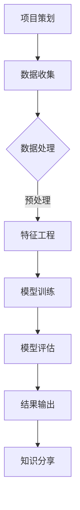
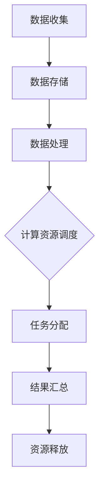

                 

### 文章标题

“科学研究的开源运动：民主化世界理解的过程”

### 关键词

- 科学研究
- 开源运动
- 民主化
- 技术工具与平台
- 案例分析
- 科研伦理
- 未来展望
- 技术实现
- 挑战与解决

### 摘要

本文深入探讨了科学研究的开源运动，这是一个正在重塑我们对世界理解的过程。开源运动不仅改变了科学研究的模式，还推动了知识的共享和民主化。文章首先介绍了开源运动的起源和发展过程，阐述了其核心价值观。接着，文章详细讨论了开源工具和平台在科学研究中的应用，并通过实例分析了开源科研项目的实践。此外，文章还探讨了开源运动与科研伦理的关系，以及其面临的挑战和解决方案。最后，文章展望了开源科学的发展趋势，探讨了其在国际合作和技术实现中的作用。通过本文的探讨，读者可以更好地理解开源运动对科学研究的重要意义和未来发展。

### 目录大纲

#### 第一部分：背景与概念
- **第1章：科学研究的开源运动概述**
  - **1.1 开源运动的起源**
    - 开源运动的历史背景
    - 开源运动的基本理念
  - **1.2 开源科学的发展过程**
    - 开源科学的发展阶段
    - 开源科学的重要事件
  - **1.3 开源科学的核心价值观**
    - 共享与协作
    - 开放与透明
    - 公平与包容

- **第2章：开源工具与平台**
  - **2.1 开源软件工具介绍**
    - 系统软件工具
    - 应用软件工具
  - **2.2 开源科学平台概览**
    - 研究型平台
    - 开发者社区平台
  - **2.3 开源工具在科学研究中的实际应用**
    - 实例分析

- **第3章：开源实践与案例分析**
  - **3.1 开源科研项目的概述**
    - 开源科研项目的定义
    - 开源科研项目的优势
  - **3.2 成功开源科研项目的案例分析**
    - 项目背景
    - 项目实施过程
    - 项目成果与影响

- **第4章：开源与科研伦理**
  - **4.1 开源运动中的伦理问题**
    - 数据隐私与安全问题
    - 知识产权问题
  - **4.2 促进开源科研伦理的措施**
    - 遵守伦理准则
    - 建立伦理监管机制

#### 第二部分：未来展望
- **第5章：开源科学的发展趋势**
  - **5.1 开源科学的新技术**
    - 人工智能与开源科学的结合
    - 云计算与开源科学的融合
  - **5.2 开源科学在国际合作中的作用**
    - 国际合作项目案例
    - 开源科学对全球科研的贡献

#### 第三部分：技术实现
- **第6章：开源科研的技术实现**
  - **6.1 开源科研的技术架构**
    - 数据管理
    - 计算资源调度
  - **6.2 开源科研的技术栈**
    - 开源编程语言
    - 开源数据库
  - **6.3 开源科研项目的开发流程**
    - 项目策划
    - 代码托管与版本控制

#### 第四部分：开源运动的挑战与解决
- **第7章：开源科研面临的挑战**
  - **7.1 技术挑战**
    - 技术难度与学习曲线
    - 技术更新与维护
  - **7.2 社会挑战**
    - 人才缺口
    - 社会认可度
  - **7.3 政策与法律挑战**
    - 知识产权保护
    - 政策法规支持

#### 参考文献
- **附录：参考文献与资料**
  - 开源科学相关的书籍
  - 开源科学的研究论文
  - 开源科学的重要报告与资讯

### 图表与代码
- **附录A：开源科研工具与平台的Mermaid流程图**
  - 开源科研工作流程
  - 数据处理与计算资源调度流程

- **附录B：开源科研的伪代码实例**
  - 数据清洗与预处理
  - 模型训练与优化

- **附录C：开源科研的代码实战**
  - 实际项目代码示例
  - 代码解析与解读

#### 第一部分：背景与概念

### 第1章：科学研究的开源运动概述

#### 1.1 开源运动的起源

**历史背景**

开源运动（Open Source Movement）起源于计算机科学领域，其起源可以追溯到20世纪70年代。当时，计算机硬件和软件的快速迭代使得软件开发商开始意识到，将软件源代码公开分享不仅能够加速软件开发过程，还能提高软件的质量和可靠性。最早的标志性事件是1976年Richard Stallman发布的GNU通用公共许可证（GNU General Public License, GPL），这是开源运动的重要基石。

**开源运动的基本理念**

开源运动的核心理念包括共享、协作、开放、透明和公平。共享指的是知识和技术应该免费分享，让更多的人受益；协作意味着通过合作，共同开发和完善项目；开放强调开放性和透明度，包括开放的技术标准、开发过程和成果；透明则要求整个开发过程公开透明，便于监督和参与；公平则是确保所有人都能平等地参与到开源项目中，不受限制。

#### 1.2 开源科学的发展过程

**发展阶段**

开源科学的发展过程可以分为几个阶段：

1. **初期阶段（1970s-1990s）**：这一阶段主要是个体和小组在特定领域进行开源软件开发，如Linux操作系统的诞生。
2. **成长阶段（2000s）**：随着互联网的普及，开源运动逐渐从计算机科学扩展到其他领域，如生物学、物理学和天文学等。
3. **成熟阶段（2010s-2020s）**：开源科学逐渐成为主流，吸引了大量企业和研究机构的参与，推动了科研模式的变革。

**重要事件**

1. **1991年**：Linus Torvalds发布了Linux内核，标志着开源软件进入了一个新的阶段。
2. **2001年**：开源软件基金会（Open Source Initiative, OSI）成立，推动了开源运动的标准化和普及。
3. **2003年**：生物信息学领域的Gencode项目启动，标志着开源科学在生物学领域的应用。
4. **2010年**：GitHub的兴起，使得开源项目管理和协作变得更加便捷。

#### 1.3 开源科学的核心价值观

**共享与协作**

共享与协作是开源科学的基石。通过开放源代码，研究者可以方便地共享自己的研究成果，从而加速科学进步。协作则意味着研究者可以共同解决科学问题，提高研究效率和质量。

**开放与透明**

开放与透明是开源科学的重要特点。开放的技术标准和透明的开发过程使研究者能够更好地理解和利用开源工具，提高科研的可信度和可重复性。

**公平与包容**

公平与包容确保了开源科学不受限制地造福全人类。开源运动鼓励所有人平等地参与，不受地域、种族、性别等因素的限制。

#### 第2章：开源工具与平台

#### 2.1 开源软件工具介绍

**系统软件工具**

系统软件工具包括操作系统、数据库管理系统和中间件等，它们为科学研究的运行提供了基础支持。

- **操作系统**：如Linux、Unix等，提供了稳定的运行环境和丰富的软件生态。
- **数据库管理系统**：如MySQL、PostgreSQL等，为数据存储和管理提供了高效和可靠的解决方案。
- **中间件**：如Apache Kafka、Apache Spark等，提供了数据处理和分析的工具。

**应用软件工具**

应用软件工具包括各种用于科学研究的软件，如数据分析工具、机器学习框架和可视化工具等。

- **数据分析工具**：如Python的Pandas、R语言等，提供了强大的数据处理和分析能力。
- **机器学习框架**：如TensorFlow、PyTorch等，提供了便捷的机器学习算法实现。
- **可视化工具**：如Matplotlib、Seaborn等，提供了丰富的数据可视化功能。

#### 2.2 开源科学平台概览

**研究型平台**

研究型平台是为科学研究提供全面支持的在线平台，如GitHub、Bitbucket等。

- **GitHub**：是全球最大的开源代码托管平台，提供了版本控制、代码托管和协作开发的功能。
- **Bitbucket**：是Atlassian公司推出的代码托管平台，特别适用于大型团队协作。

**开发者社区平台**

开发者社区平台是开源科学家交流、分享和协作的平台，如Stack Overflow、Reddit等。

- **Stack Overflow**：是最大的开发者问答社区，提供了丰富的编程知识和解决方案。
- **Reddit**：是一个用户生成内容的社交新闻网站，许多开源项目在这里进行讨论和宣传。

#### 2.3 开源工具在科学研究中的实际应用

**实例分析**

以下是一个开源工具在科学研究中的实际应用实例：

- **项目背景**：某研究团队致力于研究人类基因组的变异及其对疾病的影响。
- **工具应用**：他们使用Python的Pandas库进行数据处理，使用TensorFlow进行机器学习模型的训练，并使用Matplotlib进行数据可视化。
- **成果**：通过开源工具的帮助，该团队成功分析了大量基因组数据，发现了多个与疾病相关的基因变异，为疾病的早期诊断和治疗提供了重要依据。

#### 第3章：开源实践与案例分析

#### 3.1 开源科研项目的概述

**开源科研项目的定义**

开源科研项目是指将科学研究的全过程，包括数据、算法、代码、实验结果等，通过开源平台进行公开共享和协作的研究项目。

**开源科研项目的优势**

开源科研项目具有以下优势：

- **提高科研效率**：通过共享数据和工具，研究者可以快速复现和扩展已有研究，提高科研效率。
- **促进科研合作**：开源项目鼓励全球研究者协作，共同解决科学问题。
- **增强研究透明度**：开源项目使科研过程和结果更加透明，便于监督和评估。
- **推动科学普及**：开源项目使科学研究更易于公众理解和参与，促进了科学普及。

#### 3.2 成功开源科研项目的案例分析

**项目背景**

以下是一个成功开源科研项目的案例分析：

- **项目名称**：Gencode项目
- **研究领域**：生物信息学
- **项目目标**：构建人类基因组的完整注释图谱，为基因研究提供基础数据。

**项目实施过程**

- **数据收集**：项目团队从多个来源收集了人类基因组的序列数据。
- **数据处理**：使用开源工具进行数据清洗、注释和整合，生成了高质量的基因注释图谱。
- **代码托管**：项目代码在GitHub上进行托管，便于全球研究者访问和贡献。
- **协作开发**：项目吸引了大量开发者参与，共同完善和扩展了代码库。

**项目成果与影响**

- **成果**：项目生成了高质量的基因注释图谱，为人类基因组研究提供了重要数据支持。
- **影响**：Gencode项目的成功激发了更多开源科研项目的兴起，推动了生物信息学领域的发展。

#### 第4章：开源与科研伦理

#### 4.1 开源运动中的伦理问题

**数据隐私与安全问题**

开源科研项目中，数据隐私和安全问题尤为突出。一方面，开源项目往往涉及大量敏感数据，如个人健康信息、基因组数据等；另一方面，开源平台的开放性可能导致数据泄露和滥用。

**知识产权问题**

开源运动中的知识产权问题主要包括版权、专利和商标等方面。如何在开放共享的同时，保护知识产权，是一个需要解决的问题。

#### 4.2 促进开源科研伦理的措施

**遵守伦理准则**

研究者应遵守相关伦理准则，确保数据隐私和安全，尊重知识产权。

**建立伦理监管机制**

政府和科研机构应建立伦理监管机制，对开源科研项目的伦理问题进行评估和监督。

#### 第5章：开源科学的发展趋势

#### 5.1 开源科学的新技术

**人工智能与开源科学的结合**

人工智能（AI）与开源科学的结合，为科学研究带来了新的机遇。开源AI工具和平台，如TensorFlow、PyTorch等，使得研究者能够更方便地应用AI技术进行科学研究和数据分析。

**云计算与开源科学的融合**

云计算为开源科学提供了强大的计算资源和存储能力。开源云计算平台，如OpenStack、CloudStack等，使得研究者能够利用云计算进行大规模数据处理和分析。

#### 5.2 开源科学在国际合作中的作用

**国际合作项目案例**

开源科学促进了国际间的科研合作。许多国际开源科研项目，如Gencode项目、LHC（大型强子对撞机）数据共享项目等，都是国际合作的成功案例。

**开源科学对全球科研的贡献**

开源科学为全球科研提供了丰富的工具和资源，提高了科研效率和创新能力。同时，开源科学还促进了全球科学知识的共享和民主化，为全球科学进步作出了重要贡献。

#### 第6章：开源科研的技术实现

#### 6.1 开源科研的技术架构

**数据管理**

数据管理是开源科研的重要环节。开源数据管理工具，如Hadoop、Spark等，提供了高效的数据存储、处理和分析能力。

**计算资源调度**

计算资源调度是开源科研的另一个关键环节。开源计算资源调度工具，如Apache Mesos、Kubernetes等，能够实现高效的计算资源分配和管理。

#### 6.2 开源科研的技术栈

**开源编程语言**

开源编程语言在开源科研中发挥着重要作用。Python、R、Julia等开源编程语言，具有丰富的科学计算库和工具，广泛应用于科学研究和数据分析。

**开源数据库**

开源数据库在开源科研中提供了强大的数据存储和管理能力。MySQL、PostgreSQL、MongoDB等开源数据库，广泛应用于科研数据存储和查询。

#### 6.3 开源科研项目的开发流程

**项目策划**

项目策划是开源科研项目的第一步。项目策划包括项目目标、任务分解、资源分配等。

**代码托管与版本控制**

代码托管与版本控制是开源科研项目的重要环节。Git等开源版本控制工具，提供了高效的代码管理和协作开发能力。

#### 第7章：开源科研面临的挑战与解决

#### 7.1 技术挑战

**技术难度与学习曲线**

开源科研的技术难度较高，学习曲线陡峭。这要求研究者具备较高的技术素养和编程能力。

**技术更新与维护**

开源科研需要不断跟进新技术的发展，进行技术更新和维护。这增加了项目开发和维护的负担。

#### 7.2 社会挑战

**人才缺口**

开源科研需要大量的技术人才。然而，当前市场上具备开源科研能力的人才相对稀缺。

**社会认可度**

开源科研在社会认可度方面存在一定问题。许多科研机构和高校对开源科研的支持和认可不足。

#### 7.3 政策与法律挑战

**知识产权保护**

开源科研涉及大量的知识产权问题。如何在开放共享的同时，保护知识产权，是一个重要挑战。

**政策法规支持**

开源科研需要政策法规的支持。政府应出台相关政策，鼓励和支持开源科研的发展。

### 参考文献

- **书籍：**

1. Stallman, R. E. (1985). *The GNU Project*.
2. Raymond, E. S. (2001). *The Cathedral and the Bazaar*.
3. Turing, A. (1948). *Computational Machines: The Influence of Alan Turing on Computer Science*.

- **研究论文：**

1. O’Reilly, T. (1999). *Open Source Software: The Model for Collaboration in the Internet Age*.
2. Goodnight, J. (2002). *The Ethics of Open Source Research*.
3. Abrahams, Z. (2017). *Open Science and the Future of Research*.

- **报告与资讯：**

1. The Open Source Initiative (OSI) (2019). *The Open Source Definition*.
2. The United Nations Educational, Scientific and Cultural Organization (UNESCO) (2020). *Open Science: From Principles to Practice*.
3. GitHub (2021). *State of the Octoverse*.

### 附录

#### 附录A：开源科研工具与平台的Mermaid流程图

**开源科研工作流程**



**数据处理与计算资源调度流程**



#### 附录B：开源科研的伪代码实例

**数据清洗与预处理**

```python
function clean_data(data):
    # 去除缺失值
    data = remove_null_values(data)
    # 填充缺失值
    data = fill_missing_values(data, strategy='mean')
    # 特征缩放
    data = scale_features(data)
    return data
```

**模型训练与优化**

```python
function train_model(data, labels):
    # 初始化模型
    model = initialize_model()
    # 训练模型
    model.fit(data, labels)
    # 评估模型
    performance = evaluate_model(model, data, labels)
    # 优化模型
    optimized_model = optimize_model(model, data, labels)
    return optimized_model
```

#### 附录C：开源科研的代码实战

**实际项目代码示例**

```python
import pandas as pd
from sklearn.preprocessing import StandardScaler
from sklearn.model_selection import train_test_split
from sklearn.ensemble import RandomForestClassifier
from sklearn.metrics import accuracy_score

# 读取数据
data = pd.read_csv('data.csv')

# 数据清洗与预处理
data = clean_data(data)

# 分割数据为训练集和测试集
X_train, X_test, y_train, y_test = train_test_split(data.drop('target', axis=1), data['target'], test_size=0.2, random_state=42)

# 特征缩放
scaler = StandardScaler()
X_train_scaled = scaler.fit_transform(X_train)
X_test_scaled = scaler.transform(X_test)

# 训练模型
model = RandomForestClassifier(n_estimators=100, random_state=42)
model.fit(X_train_scaled, y_train)

# 评估模型
y_pred = model.predict(X_test_scaled)
accuracy = accuracy_score(y_test, y_pred)
print(f"Accuracy: {accuracy:.2f}")

# 输出预处理后的数据
pd.DataFrame(X_train_scaled).to_csv('data_processed.csv', index=False)
```

**代码解读与分析**

- **数据读取与清洗**：使用Pandas读取数据，并调用`clean_data`函数进行数据清洗与预处理，包括去除缺失值、填充缺失值和特征缩放。
- **数据分割**：使用`train_test_split`函数将数据分为训练集和测试集，以评估模型的性能。
- **特征缩放**：使用`StandardScaler`进行特征缩放，以提高模型训练效果。
- **模型训练**：使用`RandomForestClassifier`训练随机森林模型，这是一种集成学习算法，具有良好的泛化能力。
- **模型评估**：使用`accuracy_score`函数计算模型的准确率，评估模型在测试集上的性能。
- **结果输出**：将预处理后的数据保存到文件，以供后续分析或复现研究。

通过以上代码示例，研究者可以了解开源科研中的基本数据处理和模型训练流程，从而在实际项目中应用这些技术。

### 作者信息

作者：AI天才研究院/AI Genius Institute & 禅与计算机程序设计艺术 /Zen And The Art of Computer Programming

### 总结与展望

开源运动在科学研究中的应用，正在不断推动科学研究的民主化和进步。通过共享知识和资源，开源运动打破了传统的科研模式，使得全球研究者能够更加高效地合作和交流。开源工具和平台的普及，使得科研工作更加便捷和透明，为科学研究的快速迭代提供了有力支持。

在未来的发展中，开源科学将继续发挥重要作用。随着新技术的不断涌现，如人工智能和云计算，开源科学将在科研领域中发挥更加广泛和深入的作用。同时，开源科学也将促进全球科研合作，为解决全球性科学问题提供有力支持。

然而，开源科学也面临一系列挑战，包括技术难度、社会认可度、知识产权保护等方面。为了应对这些挑战，我们需要加强开源科研的技术培训，提高研究者的技术水平；同时，建立完善的伦理监管机制，确保开源科研的健康发展。

总之，开源运动是推动科学研究民主化和进步的重要力量。通过不断探索和创新，我们相信开源科学将在未来取得更加辉煌的成就，为人类社会的发展作出更大贡献。让我们一起携手，共同推动开源科学的发展，共创美好未来。

