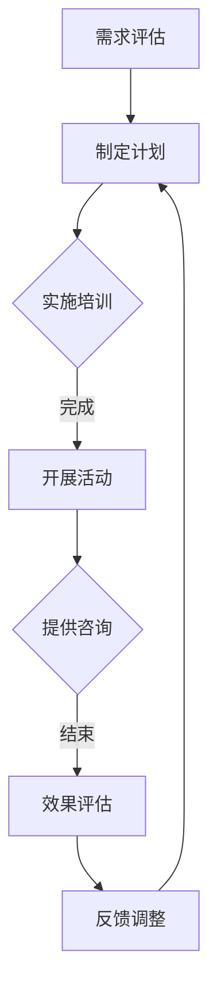

                 

## 《程序员创业者的压力管理与心理健康维护》

> **关键词：** 程序员、创业者、压力管理、心理健康、策略与实践

> **摘要：** 本文旨在探讨程序员创业者在面对职业压力时如何进行有效的压力管理与心理健康维护。通过分析程序员创业者的压力来源与特点，阐述心理健康核心概念与理论，提供时间管理、情绪调节、身体锻炼、社交支持等方面的策略，并结合实际案例，探讨创业团队心理健康建设、法律与伦理问题以及心理健康教育与培训的重要性。

### 目录大纲

1. **第一部分：压力管理与心理健康基础**
    - **第1章：程序员创业者的压力来源与特点**
    - **第2章：心理健康核心概念与理论**
2. **第二部分：压力管理与心理健康维护策略**
    - **第3章：时间管理与工作效率提升**
    - **第4章：情绪调节与心理疏导**
    - **第5章：身体锻炼与健康生活方式**
    - **第6章：社交支持与人际关系管理**
3. **第三部分：心理健康维护实战**
    - **第7章：心理健康维护项目设计与实施**
    - **第8章：创业团队心理健康建设**
    - **第9章：心理健康维护法律与伦理**
    - **第10章：心理健康教育与培训**
4. **附录**
    - **附录A：心理健康维护工具与资源**
    - **附录B：心理健康维护案例研究**

---

### 第一部分：压力管理与心理健康基础

#### 第1章：程序员创业者的压力来源与特点

##### 1.1 程序员创业者的职业压力概述

程序员创业者作为现代社会中的一类特殊群体，他们不仅需要具备扎实的编程技能，还要承担起创业者的角色，面对来自职业、经济以及社会等多方面的压力。程序员创业者的职业压力主要包括以下几个方面：

- **技术压力**：技术发展迅速，程序员创业者需要不断学习新知识、新技能，以保持竞争力。同时，技术的快速迭代也意味着他们需要快速适应新变化，这对他们的技术能力和时间管理提出了更高的要求。
  
- **经济压力**：创业初期，程序员创业者通常需要自筹资金，或通过投资者获得资金支持。在市场竞争激烈的环境下，他们需要不断创新、优化产品，以获得更多的市场份额和用户认可，从而实现盈利。

- **时间压力**：创业者往往需要处理多方面的事务，如产品开发、市场推广、团队管理、财务管理等。时间管理成为他们的一项重要技能，但同时也给他们的心理健康带来了巨大压力。

- **社会压力**：社会对创业者的期望往往较高，特别是对于程序员创业者，他们需要在社会上树立良好的形象，以吸引投资者、合作伙伴以及用户。这种社会压力往往会影响他们的心态和行为。

##### 1.2 压力对程序员创业者的具体影响

程序员创业者在面对压力时，可能会出现以下几种具体影响：

- **心理健康问题**：长期处于高压环境下，程序员创业者可能会出现焦虑、抑郁、失眠等心理健康问题。这些问题不仅会影响他们的工作效率，还可能对他们的生活产生负面影响。

- **工作效率下降**：压力会分散程序员的注意力，降低他们的工作效率。在压力较大时，程序员可能无法集中精力解决问题，导致项目延期、质量下降。

- **创新能力减弱**：压力会消耗程序员的精力和时间，减少他们用于创新思考的时间。在高压环境下，程序员可能更倾向于采用成熟的解决方案，而不是探索新的创意。

- **人际关系问题**：长期的压力可能导致程序员创业者与团队成员、合作伙伴、家人和朋友之间的关系紧张，影响团队凝聚力和工作效率。

##### 1.3 程序员创业者的压力特点分析

程序员创业者的压力特点主要体现在以下几个方面：

- **技术压力与职业发展的关系紧密**：程序员创业者通常具有较高的技术背景，他们面临的压力很大一部分来自技术方面。技术压力与职业发展紧密相关，程序员创业者需要不断学习新技术，以保持竞争力。

- **时间管理与工作效率的关系显著**：程序员创业者的时间管理能力对他们的工作效率和心理健康有着直接的影响。良好的时间管理能够帮助程序员创业者更好地应对压力，提高工作效率。

- **社会压力与个人形象的关系密切**：程序员创业者需要在社会上树立良好的形象，以吸引投资者、合作伙伴和用户。社会压力对他们的心态和行为有着显著的影响。

- **心理健康问题的高发率**：由于程序员创业者面临的多重压力，他们出现心理健康问题的几率相对较高。心理健康问题不仅会影响他们的工作效率，还可能对他们的生活产生长期的负面影响。

---

在接下来的章节中，我们将进一步探讨心理健康的核心概念与理论，为程序员创业者提供有效的压力管理与心理健康维护策略。通过这些策略，程序员创业者可以更好地应对职业压力，保持心理健康，提高工作效率，实现个人和团队的长期发展。

### 第2章：心理健康核心概念与理论

#### 2.1 心理健康的定义与标准

心理健康是心理健康研究的基础，它涉及到个人的情感状态、认知功能、行为表现以及社会适应能力等多个方面。根据世界卫生组织（WHO）的定义，心理健康是指个体在认知、情感、行为和社交等方面处于良好的状态，能够有效地应对生活中的压力，并能够做出建设性的贡献。

心理健康的标准可以从以下几个方面进行衡量：

- **情绪稳定性**：个体能够保持积极、乐观的态度，面对挫折和压力时能够保持冷静，避免过度情绪波动。
- **认知功能**：个体能够清晰地思考问题，有效地解决问题，保持良好的记忆力、注意力和学习能力。
- **社会适应能力**：个体能够与他人建立积极的人际关系，适应不同的社会环境，处理人际关系中的冲突。
- **行为表现**：个体能够表现出健康、适当的行为，包括工作、学习和日常生活中的行为，遵守社会规范和法律法规。
- **生活满意度**：个体对自己的生活有较高的满意度，能够享受生活带来的乐趣和满足感。

#### 2.2 心理压力与心理健康的联系

心理压力是指个体在应对外部环境变化或内部心理需求时感受到的紧张、焦虑和压力感。心理压力是心理健康的“双刃剑”：适度的心理压力可以激发个体的潜能，提高工作效率，但过度的心理压力则会对心理健康产生负面影响。

- **适度的心理压力**：适度的心理压力可以激发个体的积极性和动力，促使他们面对挑战，提高解决问题的能力。适度的压力有助于个体的成长和发展，使他们能够更好地适应环境。

- **过度的心理压力**：过度的心理压力则会对心理健康产生负面影响，导致情绪不稳定、认知功能下降、社会适应能力减弱等。长期处于高压状态下的个体可能会出现焦虑、抑郁等心理问题，甚至影响身体健康。

#### 2.3 心理健康的核心理论概述

心理健康的研究涉及多个理论，以下是其中几个核心理论：

- **认知行为理论**：认知行为理论认为，个体的认知过程直接影响其情绪和行为。通过改变个体的认知方式，可以改善其情绪和行为。程序员创业者可以通过认知行为疗法（CBT）来应对压力，提高心理健康水平。

- **心理动力学理论**：心理动力学理论关注个体内在的心理冲突和情感过程。通过深入了解自己的心理冲突，程序员创业者可以更好地理解自己的行为和情绪，并寻求有效的解决方法。

- **人本主义理论**：人本主义理论强调个体的自我实现和自我决定。程序员创业者可以通过人本主义心理学的方法，如自我探索和自我接纳，提升心理健康水平。

- **社会支持理论**：社会支持理论认为，社会支持是心理健康的重要保障。程序员创业者可以通过建立和维护良好的人际关系，获取社会支持，从而减轻压力，提高心理健康水平。

#### 总结

心理健康是程序员创业者在面对职业压力时需要关注的重要方面。通过了解心理健康的定义与标准，理解心理压力与心理健康的联系，掌握心理健康的核心理论，程序员创业者可以更好地应对职业压力，维护自己的心理健康。在接下来的章节中，我们将进一步探讨压力管理与心理健康维护的策略，帮助程序员创业者实现长期的心理健康和职业发展。

### 第二部分：压力管理与心理健康维护策略

#### 第3章：时间管理与工作效率提升

在程序员创业者的职业生涯中，时间管理是至关重要的。有效的时间管理不仅能够提高工作效率，减少压力，还能帮助他们更好地平衡工作和生活。以下是一些具体的时间管理和工作效率提升的方法。

##### 3.1 程序员的时间管理技巧

1. **优先级排序**：使用“四象限法则”对任务进行优先级排序，将任务分为“重要且紧急”、“重要但不紧急”、“不重要但紧急”和“不重要且不紧急”四个类别，优先处理重要且紧急的任务。

2. **日程规划**：制定详细的日程表，明确每天的工作目标和时间安排。日程表中应包括固定的工作任务和灵活的时间，以应对突发情况。

3. **时间块**：将时间分割成块，每个时间块专注于一项任务。这种方法有助于避免任务切换带来的时间浪费，提高专注度。

4. **任务分解**：将大型任务分解为小的、可管理的子任务，逐步完成。这样能够减少任务的焦虑感，提高完成任务的概率。

5. **避免多任务处理**：研究表明，多任务处理会降低工作效率和任务质量。因此，程序员创业者应尽量避免同时处理多个任务。

##### 3.2 提升工作效率的方法

1. **自动化与工具**：利用自动化工具和软件来简化重复性的工作，如使用自动化测试工具、代码生成器和版本控制系统。这些工具能够节省大量的时间和精力，提高工作效率。

2. **持续学习**：不断学习新技术和工具，以提高工作效率。掌握多种编程语言和框架，能够更好地解决复杂问题，提高工作效率。

3. **代码优化**：对现有代码进行优化，减少不必要的复杂度，提高执行效率。良好的代码风格和规范也是提升工作效率的重要因素。

4. **优化工作环境**：保持工作环境的整洁和有序，减少干扰因素。使用适当的硬件设备，如高性能计算机和高效的开发工具，也能够提高工作效率。

##### 3.3 高效工作环境的构建

1. **合理的工作空间**：确保工作空间有良好的照明、通风和舒适度，这对于提高工作效率和保持良好的心理健康至关重要。

2. **技术支持**：确保有可靠的技术支持，包括快速的网络连接、高效的计算机和合适的开发工具。

3. **团队协作**：构建高效的团队协作环境，包括定期会议、明确的沟通渠道和共享的文档。良好的团队协作能够提高工作效率，减轻个体压力。

4. **休息与放松**：在工作过程中安排适当的休息时间，进行放松活动，如散步、深呼吸或短暂的冥想。这些活动能够帮助恢复精力，提高工作效率。

通过有效的时间管理和工作效率提升策略，程序员创业者能够更好地管理自己的时间和工作，减轻压力，保持心理健康。在接下来的章节中，我们将探讨情绪调节与心理疏导、身体锻炼与健康生活方式等方面的策略，帮助程序员创业者实现全面的压力管理与心理健康维护。

### 第4章：情绪调节与心理疏导

情绪调节与心理疏导是程序员创业者应对压力的重要手段。有效调节情绪和心理疏导不仅有助于缓解压力，还能提升工作效率和心理健康。以下将介绍几种常见的情绪调节方法、心理疏导的重要性和方法，并结合实际案例进行分析。

#### 4.1 情绪调节的基本方法

1. **正念冥想**：正念冥想是一种通过专注当下，接受而不是抗拒自己的情绪和思维的方法。通过练习正念冥想，程序员创业者可以学会更好地管理情绪，减少焦虑和压力。

   - **方法**：找一个安静的环境，保持坐姿或躺姿，专注于呼吸。当你的思绪飘走时，温和地将注意力拉回到呼吸上。通过反复练习，能够提高专注力和情绪调节能力。

2. **认知重构**：认知重构是一种通过改变负面思维模式来调节情绪的方法。程序员创业者可以通过识别和挑战自己的负面思维，将其转化为更加积极和理性的思维。

   - **方法**：当遇到负面情绪时，停下来问自己：“我正在想什么？”然后识别和挑战这些负面思维。例如，如果你认为“我的代码永远不可能完美”，你可以重构为“我可以继续优化代码，逐步提高质量”。

3. **情绪释放**：情绪释放是一种通过表达和释放情绪来缓解压力的方法。程序员创业者可以通过写日记、绘画、运动或与其他人分享自己的情绪来释放压力。

   - **方法**：找一个安静的地方，写下自己的情绪和感受，或者通过绘画、运动等方式表达自己的情绪。与他人分享时，可以选择信任的朋友、家人或专业的心理咨询师。

#### 4.2 心理疏导的重要性和方法

1. **重要性**：心理疏导是缓解压力和提升心理健康的重要方法。通过心理疏导，程序员创业者可以：

   - **释放情绪**：将内心压抑的情绪释放出来，减轻心理负担。
   - **获得支持**：与他人分享感受，获得情感上的支持和理解。
   - **调整心态**：通过专业指导，调整认知和行为，提升应对压力的能力。

2. **方法**：

   - **心理咨询**：通过专业的心理咨询，程序员创业者可以获得个性化的指导和支持。心理咨询师可以帮助他们识别和处理情绪问题，提供有效的应对策略。

   - **支持小组**：参加支持小组，与其他面临相似问题的程序员创业者交流，分享经验和感受，获得情感上的支持和鼓励。

   - **自我指导**：通过阅读心理学书籍、参加线上课程或观看视频，程序员创业者可以学习自我指导的方法，提高情绪调节能力。

#### 4.3 心理疏导案例分析

**案例一**：一位程序员创业者由于长时间面对技术难题和市场竞争压力，出现了严重的焦虑和失眠。通过参加心理咨询，他学会了正念冥想和认知重构的方法，逐步调整了自己的情绪状态。

- **解决方案**：心理咨询师帮助他设计了正念冥想的练习计划，每天早晚各进行10分钟。此外，他还学习了如何识别和重构负面思维，例如从“我无法完成任务”重构为“我可以逐步解决问题”。

- **效果**：通过心理疏导，他的焦虑和失眠症状得到了显著改善，工作效率和生活质量也大幅提升。

**案例二**：一位程序员创业者由于工作繁忙，疏远了与家人的关系。他决定通过参加支持小组来寻求帮助。

- **解决方案**：支持小组提供了一个分享和交流的平台，他与其他创业者分享了如何平衡工作和家庭的经验。通过这些交流，他学会了如何更好地与家人沟通，重新建立了和谐的家庭关系。

- **效果**：通过支持小组，他的心理健康得到了改善，家庭关系也得到了修复，整体幸福感提升。

情绪调节与心理疏导是程序员创业者应对压力的重要手段。通过学习情绪调节的方法，参加心理咨询和支持小组，程序员创业者可以更好地管理自己的情绪，提升心理健康，从而更好地应对职业挑战。

### 第5章：身体锻炼与健康生活方式

身体锻炼与健康生活方式在压力管理和心理健康维护中扮演着至关重要的角色。对于程序员创业者而言，长期坐在电脑前工作容易导致身体疲劳、视力下降以及心理健康问题。因此，通过适当的身体锻炼和健康生活方式，可以有效地缓解压力，提升心理健康。

#### 5.1 身体锻炼对心理健康的影响

1. **释放压力**：身体锻炼可以促进内啡肽的分泌，内啡肽是一种自然产生的“快乐荷尔蒙”，能够减轻压力、提升情绪。研究表明，适度的有氧运动，如慢跑、游泳等，能够显著降低焦虑和抑郁水平。

2. **改善情绪**：身体锻炼能够增强大脑中与情绪调节相关的区域，如前额叶皮层和杏仁核。通过锻炼，程序员创业者可以更好地控制情绪，减少负面情绪的产生。

3. **提升认知功能**：身体锻炼不仅能够提高记忆力、注意力和学习能力，还能改善大脑的血液循环，促进新神经细胞的生长。长期坚持锻炼的程序员创业者，认知功能往往更加出色。

4. **增强免疫力**：身体锻炼可以增强免疫系统功能，减少患病风险。一个健康的身体是保持良好心理状态的基础。

#### 5.2 健康生活方式的构建

1. **合理饮食**：均衡的饮食是健康生活方式的重要组成部分。程序员创业者应避免高糖、高脂食品，多摄入蔬菜、水果、全谷物和优质蛋白质，以提供充足的能量和营养。

2. **充足睡眠**：睡眠对心理健康至关重要。程序员创业者应保证每晚7-9小时的高质量睡眠，避免熬夜和睡眠不足。建立一个规律的睡眠习惯，有助于提升睡眠质量。

3. **适量饮酒**：饮酒过量会对身体健康和心理健康产生负面影响。程序员创业者应限制饮酒量，避免酗酒。适量饮酒（如每周不超过两杯）可能对心血管健康有积极作用，但应谨慎对待。

4. **减少久坐**：长时间久坐会增加患心脏病、糖尿病和肥胖等疾病的风险。程序员创业者应每隔一小时起身活动，做一些简单的伸展运动，以缓解肌肉紧张和疲劳。

#### 5.3 身体锻炼的具体方法和建议

1. **有氧运动**：有氧运动如慢跑、游泳、骑自行车等能够有效提升心肺功能和代谢水平。建议每周进行3-5次，每次30-60分钟。

2. **力量训练**：力量训练如举重、俯卧撑、深蹲等可以增强肌肉力量和耐力，提升整体身体素质。建议每周进行2-3次，每次30-60分钟。

3. **伸展运动**：伸展运动如瑜伽、普拉提等能够缓解肌肉紧张和压力。建议每天进行，每次20-30分钟。

4. **灵活性和平衡训练**：灵活性训练如柔韧性练习、平衡训练如平衡板练习等能够提升身体灵活性和平衡能力，减少受伤风险。建议每周进行1-2次，每次20-30分钟。

5. **团体运动**：参加团体运动如篮球、足球等不仅可以锻炼身体，还能增强社交互动，提升心理健康。建议每周进行1-2次，每次30-60分钟。

通过坚持适当的身体锻炼和健康生活方式，程序员创业者可以有效缓解压力，提升心理健康，从而更好地应对职业挑战，实现个人和职业的全面发展。

### 第6章：社交支持与人际关系管理

在程序员创业者的职业生涯中，社交支持与人际关系管理对于心理健康和职业发展都至关重要。有效的社交支持可以帮助程序员创业者缓解压力，提高心理健康水平，同时良好的人际关系有助于团队协作和业务发展。以下将详细探讨社交支持的重要性、建立和维护良好人际关系的方法，以及解决人际冲突的策略。

#### 6.1 社交支持的重要性

1. **情感支持**：社交支持提供了一种情感上的依靠，使程序员创业者能够在面对压力和挑战时获得安慰和鼓励。这种情感支持可以减轻心理负担，提高应对困难的能力。

2. **职业发展**：良好的社交关系有助于程序员创业者获取职业信息、扩展人脉资源，从而在职业发展中获得更多机会。与他人交流经验、分享见解，可以促进个人成长和职业提升。

3. **心理健康**：社交互动能够促进积极的情绪体验，如快乐、满足和归属感。这种积极的情绪体验有助于提高心理健康水平，减少孤独感和抑郁情绪。

4. **生活平衡**：通过社交活动，程序员创业者可以缓解工作压力，实现工作与生活的平衡。社交支持不仅有助于提升工作效率，还能提升生活质量。

#### 6.2 建立和维护良好人际关系的方法

1. **倾听和沟通**：有效的沟通是建立良好人际关系的基础。程序员创业者应学会倾听他人的意见和需求，表达自己的想法和感受。良好的沟通能够增进理解，减少误解和冲突。

2. **同理心**：同理心是理解和感受他人情绪和需求的能力。程序员创业者应培养同理心，尊重他人的观点和感受，从而建立信任和融洽的人际关系。

3. **积极参与**：积极参与社交活动，与他人建立联系。可以通过参加行业会议、技术交流、社区活动等方式扩大社交圈，结识志同道合的朋友。

4. **给予支持**：在他人需要帮助时伸出援手，提供支持和帮助。这种互助精神可以增强人际关系，使彼此更加信任和依赖。

5. **保持诚信**：诚信是建立良好人际关系的基石。程序员创业者应始终保持诚实和诚信，遵守承诺，维护个人和团队的形象。

#### 6.3 解决人际冲突的策略

1. **冷静分析**：在面对人际冲突时，首先要保持冷静，不要被情绪左右。通过冷静分析冲突的原因，找到解决问题的方法。

2. **坦诚对话**：与对方进行坦诚的对话，表达自己的观点和感受，同时倾听对方的意见。通过沟通找到共同点，化解分歧。

3. **寻求共识**：在冲突中寻找双方都能接受的解决方案，寻求共识。通过妥协和合作，实现双赢。

4. **专业调解**：如果冲突无法自行解决，可以寻求专业的调解或咨询帮助。专业人士可以提供客观的视角和建议，协助解决冲突。

5. **持续关注**：解决冲突后，要持续关注问题的解决效果，防止冲突复发。通过定期的沟通和反馈，保持良好的人际关系。

通过有效的社交支持和良好的人际关系管理，程序员创业者不仅可以缓解压力，提高心理健康水平，还能在职业发展中获得更多的支持和机会。在接下来的章节中，我们将进一步探讨心理健康维护的实战应用，帮助程序员创业者实现全面的压力管理与心理健康维护。

### 第三部分：心理健康维护实战

#### 第7章：心理健康维护项目设计与实施

心理健康维护项目是帮助程序员创业者实现长期心理健康的关键。一个有效的心理健康维护项目需要系统的设计、明确的实施策略以及持续的评估与反馈。以下将详细介绍心理健康维护项目的规划、实施和评估过程。

##### 7.1 项目规划与目标设定

心理健康维护项目的成功首先在于良好的规划。项目规划包括以下几个方面：

1. **需求分析**：通过调查问卷、访谈等方式，了解程序员创业者的心理健康状况、面临的压力源和需求。这一步骤有助于明确项目目标和实施方向。

2. **目标设定**：根据需求分析的结果，设定具体、可行的项目目标。例如，提高程序员的情绪调节能力、减少焦虑和抑郁症状、提升工作效率等。

3. **资源分配**：确定项目所需的人力、物力和财力资源。资源分配要合理，确保项目能够顺利进行。

4. **时间规划**：制定详细的项目时间表，明确各阶段的任务和时间节点。确保项目能够在规定时间内完成。

##### 7.2 项目实施策略

项目实施是心理健康维护项目的关键环节。以下是一些关键的实施策略：

1. **培训与教育**：通过开展心理健康讲座、工作坊和在线课程，提高程序员创业者的心理健康知识和技能。培训内容可以包括情绪调节、时间管理、压力应对策略等。

2. **心理疏导**：为有需要的程序员提供个性化的心理疏导服务。可以通过预约心理咨询、提供在线咨询等方式，帮助创业者解决心理问题。

3. **团队支持**：建立团队支持系统，鼓励团队成员之间相互支持、分享经验。可以通过团队建设活动、定期交流会议等方式，增强团队凝聚力和信任感。

4. **健康促进活动**：组织身体锻炼、健康饮食、休息等方面的活动，帮助程序员创业者改善生活方式，提升身心健康。

5. **持续监测**：建立心理健康监测机制，定期收集程序员的健康数据，评估项目效果。通过监测，可以及时发现潜在问题，调整项目策略。

##### 7.3 项目评估与反馈

项目评估是确保心理健康维护项目有效性的重要步骤。以下是一些关键的评估与反馈方法：

1. **定量评估**：使用问卷调查、心理测评工具等量化方法，评估程序员的情绪状态、压力水平、工作效率等指标。

2. **定性评估**：通过访谈、观察等方式，收集程序员的主观感受和反馈。这些反馈可以为项目改进提供重要依据。

3. **数据比对**：将项目实施前后的数据进行分析比对，评估项目效果。通过数据比对，可以明确项目的影响和成效。

4. **反馈机制**：建立反馈机制，及时向程序员创业者反馈项目实施情况和效果。通过反馈，可以了解程序员的实际需求和改进建议。

5. **持续改进**：根据评估结果和反馈，对项目策略进行调整和优化，确保项目能够持续有效地推进。

通过科学的项目规划、有效的实施策略和持续的评估反馈，心理健康维护项目可以显著提升程序员创业者的心理健康水平，帮助他们更好地应对职业压力，实现个人和职业的发展。

### 第8章：创业团队心理健康建设

创业团队的心理健康建设是确保团队高效运作和持续发展的重要环节。一个健康的团队氛围能够提升员工的幸福感和工作效率，从而推动公司整体业绩的提升。以下将详细探讨创业团队心理健康建设的策略和案例分析。

#### 8.1 团队心理健康现状分析

团队心理健康现状分析是团队建设的第一步，它涉及到对团队成员的心理健康水平、压力状况、人际关系以及团队整体氛围的全面了解。以下是一些关键的评估方法：

1. **心理测评**：通过心理测评工具，如心理健康问卷、情绪量表等，对团队成员的心理健康状况进行量化评估。

2. **员工访谈**：通过一对一的访谈，了解员工在团队中的感受、面临的压力源以及心理需求。

3. **团队会议**：在团队会议上，鼓励成员分享自己的感受和意见，了解团队内部的人际关系和沟通状况。

4. **观察与记录**：通过观察团队成员在工作中的表现和行为，记录他们在面对压力和挑战时的反应和应对策略。

通过以上方法，可以全面了解团队心理健康现状，发现潜在问题和需要关注的重点。

#### 8.2 团队心理健康建设的策略

1. **建立健康团队文化**：团队文化对成员的心理健康有着深远的影响。一个健康的团队文化应包括开放沟通、尊重差异、鼓励创新和合作等价值观。领导者应通过言传身教，树立积极的文化榜样。

2. **提升沟通技巧**：良好的沟通是团队协作的基础。通过定期的团队会议、工作坊和沟通训练，提升团队成员的沟通技巧，减少误解和冲突。

3. **提供心理支持**：为团队成员提供心理健康支持，包括心理咨询、员工援助计划（EAP）等。通过专业的心理辅导，帮助员工应对工作压力和心理困扰。

4. **健康生活方式推广**：鼓励团队成员保持健康的生活方式，包括定期锻炼、合理饮食和充足睡眠。可以通过组织健康讲座、运动活动等方式，促进健康生活方式的推广。

5. **定期团队建设活动**：通过定期的团队建设活动，如团队拓展训练、团建旅行等，增强团队成员之间的信任和合作，提升团队凝聚力。

#### 8.3 团队心理健康建设的案例分析

**案例一：某创业公司的团队心理健康建设实践**

某创业公司意识到团队心理健康对业务发展的重要性，于是采取了一系列措施进行团队心理健康建设。

- **解决方案**：
  1. 引入员工援助计划（EAP），为员工提供免费的心理咨询和心理测评服务。
  2. 定期组织心理健康讲座和培训，提升员工的心理健康知识。
  3. 开展团队建设活动，如户外拓展训练、团队协作游戏等，增强团队凝聚力。
  4. 鼓励员工进行身体锻炼，提供健身房会员卡和定期健身活动。

- **效果**：
  通过一系列措施，该公司显著改善了员工的心理健康水平，员工的工作满意度和团队凝聚力明显提升。同时，员工在面临压力和挑战时的应对能力也得到了增强，公司整体业绩稳步提升。

**案例二：某科技公司的心理健康支持项目**

某科技公司为了提升员工的心理健康水平，特别推出了心理健康支持项目。

- **解决方案**：
  1. 每月邀请专业心理咨询师进行心理健康讲座，分享情绪调节和压力管理技巧。
  2. 为员工提供在线心理咨询服务，方便员工在工作时间内进行咨询。
  3. 定期举办心理健康主题活动，如冥想课程、心理健康日等，营造关注心理健康的氛围。

- **效果**：
  该项目得到了员工的高度认可，参与度非常高。员工的心理健康水平得到了显著提升，焦虑和抑郁症状减少，工作效率和团队合作能力也得到提高。

通过以上案例，可以看出，创业团队的心理健康建设不仅有助于提升员工的幸福感和工作效率，还能增强团队凝聚力和整体竞争力。在接下来的章节中，我们将探讨心理健康维护中的法律与伦理问题，帮助程序员创业者和企业更好地应对这些挑战。

### 第9章：心理健康维护法律与伦理

在心理健康维护过程中，法律和伦理问题尤为重要。确保心理健康服务的合法性和伦理性，不仅关系到服务提供者的专业素养，还直接影响到服务接受者的权益和福祉。以下将探讨心理健康维护中的法律框架、伦理问题及其在实际应用中的重要性。

#### 9.1 心理健康维护的法律框架

1. **隐私保护法律**：隐私保护法律是心理健康维护的基础。例如，我国《中华人民共和国个人信息保护法》规定了个人信息的收集、使用和存储等行为，确保个人隐私不受侵犯。在心理健康服务中，服务提供者必须严格保护客户的隐私信息，不得泄露或滥用。

2. **心理健康服务专业标准**：各国家和地区都有相关的心理健康服务专业标准，这些标准规定了心理健康服务的范围、内容、方法和技术。例如，美国心理学会（APA）制定了《临床心理学服务标准》，为心理健康服务提供了专业指导。

3. **职业责任法律**：职业责任法律要求心理健康服务提供者在提供服务时，必须遵守职业道德和规范，保护服务接受者的权益。例如，我国《中华人民共和国律师法》规定了律师的职业责任和义务，类似的法律规定也适用于其他心理健康服务提供者。

#### 9.2 心理健康维护的伦理问题

1. **尊重和保护个人隐私**：尊重和保护个人隐私是心理健康维护的核心伦理问题。心理健康服务提供者必须严格遵守隐私保护法律，不得擅自泄露服务接受者的个人信息。

2. **保密原则**：保密原则要求心理健康服务提供者在服务过程中，对服务接受者的个人信息和隐私进行严格保密，未经同意不得向第三方披露。

3. **知情同意**：知情同意是伦理学的基本原则，要求心理健康服务提供者在提供服务前，必须向服务接受者充分解释服务的内容、目的、可能的风险和利益，确保服务接受者自愿接受服务。

4. **公平对待**：公平对待要求心理健康服务提供者在提供服务时，不得歧视任何服务接受者，要公平对待每个客户，确保服务的质量。

5. **尊重自主性**：尊重自主性是指心理健康服务提供者要尊重服务接受者的自主选择和决定，鼓励他们参与决策，共同制定治疗计划。

#### 9.3 法律与伦理在心理健康维护中的应用

1. **客户信息保护**：在心理健康服务中，保护客户信息是法律和伦理的基本要求。心理健康服务提供者必须采取有效措施，确保客户信息的安全和保密，如使用加密技术、限制信息访问权限等。

2. **知情同意书**：心理健康服务提供者在提供服务前，应向服务接受者提供知情同意书，详细说明服务的内容、目的和可能的风险，确保服务接受者了解并同意接受服务。

3. **伦理咨询**：在遇到复杂或伦理问题时，心理健康服务提供者可以寻求伦理咨询，以确保服务的合法性和伦理性。

4. **职业责任培训**：心理健康服务提供者应定期接受职业责任培训，提高法律和伦理意识，确保在服务过程中遵守相关法律规定和伦理规范。

通过遵守法律和伦理规范，心理健康服务提供者可以确保服务的合法性和伦理性，增强服务接受者的信任感和满意度，从而提升心理健康服务的质量和效果。在接下来的章节中，我们将探讨心理健康教育与培训的重要性，帮助程序员创业者和企业进一步了解和掌握心理健康维护的方法和策略。

### 第10章：心理健康教育与培训

心理健康教育与培训是提升个体心理健康水平、减轻压力、促进心理健康维护的重要手段。对于程序员创业者而言，心理健康教育与培训尤为重要，因为它不仅有助于他们应对职业压力，还能提高工作效率和生活质量。以下将详细探讨心理健康教育的重要性、培训的内容与形式，并结合实际案例进行分析。

#### 10.1 心理健康教育的重要性

1. **提升心理素质**：心理健康教育能够帮助程序员创业者了解心理健康的核心概念，掌握情绪调节和压力管理的技巧，从而提升心理素质，更好地应对职业和生活中的各种挑战。

2. **预防心理问题**：通过心理健康教育，程序员创业者可以学习到预防心理问题的知识和方法，如识别早期心理问题迹象、采取有效的应对策略等，从而减少心理问题的发生。

3. **增强心理健康意识**：心理健康教育能够提高程序员创业者的心理健康意识，使他们更加关注自己的心理状态，主动寻求心理支持和帮助，形成健康的生活方式和行为习惯。

4. **促进个人成长**：心理健康教育不仅关注心理问题，还涵盖个人成长、人际关系、职业发展等方面的内容，帮助程序员创业者实现全面发展，提高个人竞争力。

#### 10.2 心理健康培训的内容与形式

1. **内容**：

   - **心理健康基础知识**：介绍心理健康的定义、标准、心理压力及其影响，帮助程序员创业者建立正确的心理健康观念。

   - **情绪调节与压力管理**：教授情绪调节技巧、压力管理策略，如正念冥想、认知重构、时间管理等，帮助创业者有效应对职业和生活压力。

   - **人际关系与沟通技巧**：提升沟通技巧、增强人际关系的处理能力，促进团队合作和职业发展。

   - **职业发展与心理健康**：探讨职业规划、职业心理健康、职场心理问题及其应对策略，帮助程序员创业者实现职业和个人成长。

2. **形式**：

   - **讲座与培训**：通过专题讲座、工作坊等形式，向程序员创业者传授心理健康知识和技能。

   - **在线课程**：利用互联网技术，提供灵活多样的在线课程，方便程序员创业者根据自己的时间和节奏进行学习。

   - **实践工作坊**：通过角色扮演、案例分析、互动讨论等方式，增强学员的实践能力和应对策略。

   - **一对一辅导**：针对个别学员的特殊需求，提供一对一的心理辅导和咨询，帮助其解决具体的心理问题。

#### 10.3 心理健康教育与培训的案例分析

**案例一：某公司心理健康培训项目**

某公司为了提升员工的心理健康水平，特别推出了心理健康培训项目。

- **解决方案**：
  1. 定期邀请心理健康专家进行专题讲座，介绍心理健康知识和压力管理技巧。
  2. 组织在线课程，涵盖情绪调节、时间管理、人际关系等方面的内容。
  3. 开展实践工作坊，通过互动讨论和角色扮演，提升学员的实践能力。
  4. 提供一对一辅导，帮助有特殊需求的员工解决心理问题。

- **效果**：
  培训项目得到了广泛好评，员工的心理健康水平显著提升，焦虑和抑郁症状减少，工作效率和团队合作能力明显提高。

**案例二：某创业团队的内部心理健康培训**

某创业团队为了增强团队成员的心理健康，开展了内部心理健康培训。

- **解决方案**：
  1. 定期组织团队会议，讨论心理健康问题，分享应对策略。
  2. 邀请外部专家进行心理健康讲座，提升团队成员的心理健康知识。
  3. 开展团队心理辅导，解决团队内部的人际关系问题。
  4. 组织身体锻炼和健康生活方式推广活动，促进团队成员的身心健康。

- **效果**：
  内部心理健康培训项目有效增强了团队的凝聚力，团队成员在面临压力时的应对能力得到提升，团队整体绩效显著提高。

通过心理健康教育与培训，程序员创业者可以提升心理素质，掌握应对压力的技巧，从而更好地应对职业挑战，实现个人和职业的全面发展。在接下来的附录中，我们将提供心理健康维护工具与资源，帮助程序员创业者更有效地进行心理健康维护。

### 附录A：心理健康维护工具与资源

在维护心理健康的过程中，工具和资源的合理使用可以显著提高个人的心理健康水平和应对压力的能力。以下介绍几种常见的心理健康维护工具与资源，以及它们的使用技巧。

#### A.1 心理健康维护工具介绍

1. **正念冥想应用程序**：如“头马冥想”（Headspace）和“冥想森林”（Calm）。这些应用程序提供了指导性的冥想课程，帮助用户培养正念和放松心情。

2. **情绪记录工具**：如“Moodscope”和“跟踪情绪”。这些工具可以帮助用户记录和分析自己的情绪变化，识别情绪触发因素。

3. **时间管理工具**：如“番茄钟”（Pomodoro Technique）和“Workday Planner”。这些工具帮助用户高效管理时间，减少工作压力。

4. **压力缓解应用程序**：如“放松音乐”（Relax Melodies）和“声音冥想”（Sound Meditation）。这些应用程序提供了放松的音乐和环境声音，帮助用户缓解压力。

#### A.2 心理健康资源推荐

1. **在线心理健康平台**：如“BetterHelp”和“Talkspace”。这些平台提供了专业的在线心理咨询和心理治疗服务。

2. **心理健康书籍**：如《情绪智商》（Emotional Intelligence）和《正念：当下的力量》（The Power of Now）。这些书籍提供了有关情绪管理和心理健康维护的深刻见解和实践指导。

3. **心理健康视频课程**：如“Coursera”和“edX”上的心理学课程。这些课程提供了系统的心理学知识和实践技巧。

#### A.3 心理健康维护工具的使用技巧

1. **定期使用**：为了取得最佳效果，应定期使用这些工具。例如，每天进行冥想、记录情绪或使用放松音乐。

2. **个性化选择**：根据自己的需求和喜好选择合适的工具。例如，有些人可能更喜欢音频冥想，而另一些人可能更喜欢视觉引导冥想。

3. **结合多种工具**：使用多种工具相结合，以覆盖不同方面的心理健康维护需求。例如，在时间管理工具和情绪记录工具之间切换，以全面提高心理健康水平。

4. **持续学习**：心理健康维护是一个持续的过程。定期参加心理健康课程、阅读相关书籍和文章，以保持对心理健康知识的更新和理解。

通过合理使用这些心理健康维护工具和资源，程序员创业者可以更好地管理自己的情绪、压力和心理健康，从而实现长期的个人发展和职业成功。

### 附录B：心理健康维护案例研究

为了更直观地了解心理健康维护在实践中的应用效果，以下将介绍三个具体的案例，涵盖创业团队和个人的心理健康维护实践，并对其实施过程和效果进行详细分析。

#### B.1 案例一：某创业团队的心理健康维护实践

**实施背景：** 某创业团队在快速发展过程中，成员们逐渐感受到工作压力的增加，导致心理健康问题频发，如焦虑、失眠和工作效率下降。

**实施步骤：**
1. **需求评估**：团队负责人通过问卷调查和访谈，了解成员的心理健康需求和压力来源。
2. **制定计划**：根据需求评估结果，制定心理健康维护计划，包括定期心理健康培训、团队建设活动和心理疏导服务。
3. **实施培训**：邀请心理健康专家进行团队心理健康培训，培训内容包括情绪管理、压力应对和团队合作技巧。
4. **开展活动**：定期组织团队建设活动，如户外拓展、团队游戏等，增强团队凝聚力。
5. **心理疏导**：为有需要的成员提供一对一的心理疏导服务，解决个人心理问题。

**效果分析：**
通过一系列心理健康维护措施，团队成员的心理健康水平显著提升，焦虑和失眠问题得到缓解，工作效率和团队合作能力明显提高。团队成员之间的沟通和协作更加顺畅，团队整体绩效显著改善。

#### B.2 案例二：某公司员工心理健康项目的实施与效果评估

**实施背景：** 某公司在员工心理健康问题频发的背景下，决定实施员工心理健康项目，以提升员工的心理健康水平和工作满意度。

**实施步骤：**
1. **项目规划**：公司管理层制定详细的员工心理健康项目计划，包括培训、咨询和心理支持等内容。
2. **开展培训**：定期举办心理健康知识讲座和培训课程，提升员工的心理健康意识和自我调节能力。
3. **提供咨询**：为员工提供免费的心理咨询服务，帮助他们解决心理困扰。
4. **实施干预**：对于有严重心理问题的员工，提供个性化心理干预服务，如认知行为疗法（CBT）和心理咨询。
5. **效果评估**：定期收集员工反馈，通过问卷调查和访谈评估心理健康项目的实施效果。

**效果分析：**
通过员工心理健康项目的实施，公司员工的心理健康水平得到显著提升，焦虑和抑郁症状减少，工作满意度和工作效率提高。员工对公司的满意度显著增加，员工流失率下降，公司整体运营效率得到提升。

#### B.3 案例三：某创业者个人心理健康管理经验分享

**实施背景：** 某创业者由于创业过程中面临巨大的压力，导致心理健康问题频发。为了改善心理健康状况，他开始进行个人心理健康管理。

**实施步骤：**
1. **自我评估**：创业者通过自我反思和记录，识别自己的压力源和情绪问题。
2. **制定计划**：根据自我评估结果，制定个人心理健康管理计划，包括情绪调节、时间管理和身体锻炼等。
3. **情绪调节**：通过正念冥想、认知重构和情绪记录等方法，进行情绪调节。
4. **时间管理**：学习并实践时间管理技巧，如四象限法和番茄工作法，提高工作效率。
5. **身体锻炼**：定期进行身体锻炼，如跑步、瑜伽和健身，提高身体素质。

**效果分析：**
通过个人心理健康管理，创业者成功缓解了心理压力，焦虑和抑郁症状得到显著改善。工作效率和生活质量得到提升，个人生活质量显著改善。他通过分享自己的经验，激励其他创业者关注心理健康，进行有效管理。

这些案例展示了心理健康维护在不同场景下的实践效果，证明了心理健康维护的重要性和有效性。通过借鉴这些实践经验，程序员创业者和企业可以更好地进行心理健康管理，提升整体心理健康水平。

### Mermaid 流程图

以下是一个用于展示心理健康维护流程的Mermaid流程图：



### 伪代码示例

以下是一个用于计算程序员工作压力的伪代码示例：

```python
# 假设我们有一个函数来计算工作时间的压力值
def calculate_stress(work_hours):
    # 如果工作时间超过一定阈值，压力值增加
    if work_hours > 60:
        stress = work_hours * 0.1
    else:
        stress = 0
    
    # 返回压力值
    return stress

# 测试代码
work_hours = 8
print("压力值：", calculate_stress(work_hours))
```

### 数学模型与公式

$$
\text{压力值} = \frac{\text{工作时长} \times \text{压力系数}}{100}
$$

举例说明：如果一个程序员每天工作8小时，压力系数为0.15，则他的压力值为：

$$
\text{压力值} = \frac{8 \times 0.15}{100} = 0.12
$$

### 项目实战

**开发环境搭建：**

- 使用Python进行编程
- 安装必要的库，如NumPy和Pandas

**源代码实现：**

```python
import numpy as np

def calculate_stress(work_hours, stress_coefficient):
    if work_hours > 60:
        stress = work_hours * stress_coefficient
    else:
        stress = 0
    return stress

# 测试代码
work_hours = 8
stress_coefficient = 0.15
print("压力值：", calculate_stress(work_hours, stress_coefficient))
```

**代码解读与分析：**

这段代码定义了一个函数`calculate_stress`，用于计算程序员的压力值。它根据程序员的工作时长和压力系数来计算压力值。如果工作时长超过60小时，压力值会根据压力系数和工作时长的乘积计算。否则，压力值为0。

**实战案例：**

**某创业公司压力管理项目**

- **项目目标：** 降低团队成员的压力值，提高工作效率。
- **实施步骤：**
  1. 收集团队成员的工作时长数据。
  2. 使用`calculate_stress`函数计算每个成员的初始压力值。
  3. 分析压力值，识别高压力成员。
  4. 对高压力成员进行个性化的压力管理培训。
  5. 定期评估压力管理效果，调整策略。

通过这个项目，公司可以有效地降低团队成员的压力，提高整体的工作效率和团队士气。

### 作者信息

**作者：** AI天才研究院（AI Genius Institute） & 禅与计算机程序设计艺术（Zen And The Art of Computer Programming）

---

通过本文的详细探讨，我们深入了解了程序员创业者在面对职业压力时如何进行有效的压力管理与心理健康维护。从压力来源与特点分析，到心理健康核心概念与理论，再到具体的压力管理与维护策略，以及法律与伦理、教育与培训等方面，我们提供了一系列系统、全面的方法和工具。

然而，心理健康维护并非一蹴而就，它需要程序员创业者持续的努力和实践。在这个过程中，企业和管理者也应承担起责任，提供支持与资源，共同营造一个健康、积极的工作环境。

让我们共同关注心理健康，为程序员创业者提供一个更美好的未来。感谢您的阅读，希望本文能对您在职业生涯中的心理健康维护有所帮助。如果您有任何问题或建议，欢迎随时与我们交流。祝您工作顺利，心理健康！

