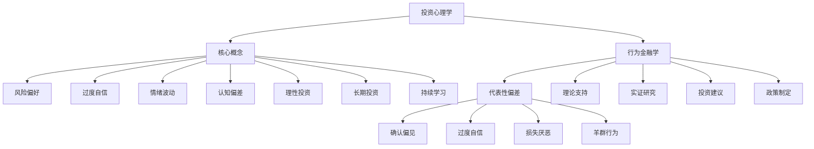

                 

### 投资心理学基础

#### 1.1.1. 投资心理学的定义

投资心理学是一门研究人们在投资决策过程中所表现出的心理现象和心理行为的学科。它结合了心理学、经济学和行为金融学等多个领域的知识，致力于揭示投资者在投资决策过程中的思维模式、行为偏差和心理机制。投资心理学的核心目标是理解投资者在市场波动中的心理反应，从而为投资决策提供科学依据。

在投资心理学中，投资者通常被划分为两类：理性投资者和情绪投资者。理性投资者以逻辑和理性为主导，依据市场数据和财务分析来做出投资决策。而情绪投资者则更容易受到情绪和心理因素的影响，常常因为贪婪、恐惧、偏见和过度自信等心理因素而做出非理性的投资决策。

投资心理学关注的核心问题包括：投资者如何处理风险和收益、投资者的情绪如何影响投资决策、投资者的认知偏差如何导致投资错误、以及如何通过心理干预来改善投资行为。

#### 1.1.2. 投资决策过程中的心理因素

在投资决策过程中，心理因素扮演着至关重要的角色。这些心理因素包括但不限于以下几点：

1. **风险偏好**：投资者对风险的承受程度和偏好。高风险偏好者倾向于选择波动性更大的投资产品，而低风险偏好者则更倾向于稳健的投资方式。

2. **过度自信**：投资者往往高估自己的知识和能力，认为自己的投资决策优于市场平均水平，这可能导致投资者过度交易或持有高风险资产。

3. **群体心理**：投资者容易受到群体行为的影响，如羊群效应，导致市场波动放大。

4. **情绪波动**：投资者情绪的波动会直接影响其投资决策。贪婪可能导致投资者在市场高点买入，而恐惧可能导致投资者在市场低点卖出。

5. **认知偏差**：投资者在决策过程中可能会出现认知偏差，如确认偏见、过度依赖历史信息、选择性认知等，这些偏差会影响投资者的决策质量和结果。

#### 1.1.3. 投资心理学的价值

投资心理学的价值体现在多个方面：

1. **指导投资实践**：通过研究投资心理学，投资者可以更好地了解自己的心理特征和行为模式，从而做出更加理性和有效的投资决策。

2. **改善投资行为**：了解投资心理学的知识可以帮助投资者克服情绪和心理因素的影响，减少非理性投资行为。

3. **优化投资策略**：投资心理学可以提供策略优化的依据，帮助投资者设计更加科学合理的投资组合和风险管理方案。

4. **提升投资绩效**：通过投资心理学的研究，投资者可以识别和利用市场的心理规律，从而提升投资绩效。

#### 1.2. 程序员的投资思维特点

程序员的思维方式通常以逻辑严谨、系统性强和注重细节为特点，这些特点同样体现在他们的投资思维中。

1. **逻辑严谨**：程序员在投资决策中更倾向于通过逻辑分析和数据驱动的方式来做出决策，而非单纯依赖直觉或情绪。他们更相信数据和信息，更倾向于基于事实和逻辑来评估投资机会。

2. **系统性强**：程序员擅长系统性的思考和解决问题。在投资中，他们倾向于构建一个完整的投资框架，包括风险管理、资产配置、收益优化等多个方面，确保投资决策的系统性和全面性。

3. **注重细节**：程序员在编写代码时非常注重细节，同样的，他们在投资决策中也会仔细分析各种潜在的风险和收益因素，确保投资决策的准确性和可靠性。

4. **时间价值观念**：程序员通常对时间价值有着深刻的认识。在投资中，他们更倾向于选择那些能够带来长期稳定收益的投资项目，而不是短期的投机行为。

#### 1.2.1. 程序员的思维方式与投资决策

程序员的思维方式对他们的投资决策产生了深远的影响：

1. **理性分析**：程序员更倾向于使用数据分析、逻辑推理和系统思考来进行投资决策，而不是被情绪所左右。他们通过构建模型、模拟和测试来评估投资机会，确保决策的科学性和准确性。

2. **风险评估**：程序员注重风险评估，他们倾向于使用各种方法来评估投资项目的潜在风险，包括技术风险、市场风险、政策风险等，并制定相应的风险管理策略。

3. **长期视角**：程序员在投资中更倾向于采用长期视角，而不是短期投机。他们更看重项目的长期价值，而不是短期的市场波动。

4. **持续学习**：程序员不断学习和更新自己的知识体系，这种习惯也适用于投资。他们通过阅读书籍、研究市场、参加研讨会等方式来提升自己的投资知识和技能。

#### 1.2.2. 程序员的风险偏好

程序员的风险偏好通常与其他投资者有所不同。一方面，由于他们对技术和市场有着深入的了解，因此他们可能更愿意承担一定的风险以获取更高的收益。另一方面，他们通常对风险有较高的认知和管理能力，因此他们的风险偏好并不代表他们没有风险意识。

1. **高收益预期**：程序员往往对高收益有较高的期望，因此他们更倾向于选择那些潜在收益较高的投资产品。

2. **多样化风险分散**：程序员通过多样化投资来分散风险，他们不会把所有的资金集中在一个领域或一种投资产品上。

3. **技术创新投资**：由于他们对技术发展有较深的了解，程序员通常更愿意投资于技术创新领域，如区块链、人工智能等。

4. **稳健投资**：尽管他们可能愿意承担较高的风险，但程序员也会在投资组合中加入一些稳健的投资产品，如债券、指数基金等，以平衡风险。

#### 1.2.3. 程序员的时间价值观念

时间价值观念是程序员投资思维的一个重要组成部分。程序员深知时间的重要性，因此他们在投资决策中更注重时间价值。

1. **长期收益**：程序员更倾向于选择那些能够带来长期稳定收益的投资项目，而不是追求短期的利润。

2. **时间分散投资**：程序员倾向于通过长期投资来分散时间风险，而不是频繁交易。他们相信时间的价值，通过长期持有来降低投资风险。

3. **时间管理**：在投资决策中，程序员注重时间管理，他们会合理安排时间来研究和分析投资项目，确保投资决策的质量。

#### 1.3. 投资心理学与行为金融学的关系

投资心理学和行为金融学有着密切的联系。行为金融学是研究投资者在市场中的行为和心理反应的学科，而投资心理学则更侧重于理解这些行为和心理反应背后的原因和机制。

1. **共同关注点**：投资心理学和行为金融学都关注投资者在市场中的非理性行为，如过度自信、贪婪、恐惧等。

2. **互补关系**：投资心理学提供了理解投资者行为和心理机制的深层次理论，而行为金融学则将这些理论应用到实际市场研究中，探索这些心理因素对市场波动和投资绩效的影响。

3. **相互影响**：投资心理学和行为金融学相互影响。投资心理学的研究成果可以为行为金融学提供理论基础，而行为金融学的研究发现又可以反过来影响投资心理学的理论和实践。

#### 1.3.1. 行为金融学的基本概念

行为金融学是一门研究投资者在市场中的行为和心理反应的学科。它关注投资者如何受到心理因素和非理性情绪的影响，从而做出不理性的投资决策。行为金融学的主要概念包括：

1. **代表性偏差**：投资者倾向于过度关注某些特定的信息，而忽视其他重要信息，从而导致决策偏差。

2. **确认偏见**：投资者在收集信息时，更倾向于选择那些符合自己原有观点的信息，而忽视与之相反的信息。

3. **过度自信**：投资者往往高估自己的知识和能力，认为自己的投资决策优于市场平均水平。

4. **损失厌恶**：投资者对损失的厌恶程度远高于对收益的喜好，因此在面临损失时往往表现得过于谨慎或恐慌。

5. **羊群行为**：投资者倾向于跟随群体行为，如羊群效应，从而导致市场波动放大。

#### 1.3.2. 投资心理学对行为金融学的影响

投资心理学对行为金融学的影响主要体现在以下几个方面：

1. **理论支持**：投资心理学提供了对投资者行为和心理反应的深入理解，为行为金融学的理论构建提供了基础。

2. **实证研究**：投资心理学的理论和方法可以用于实证研究，帮助行为金融学验证其理论假设和结论。

3. **投资建议**：投资心理学的研究成果可以为投资者提供合理的投资建议，帮助他们克服心理障碍，做出更加理性和有效的投资决策。

4. **政策制定**：投资心理学和行为金融学的研究可以为政策制定者提供参考，制定更加有效的市场监管政策和投资政策。

#### 1.3.3. 行为金融学对投资决策的启示

行为金融学的研究对投资决策有重要的启示：

1. **避免心理陷阱**：投资者应该意识到自己的心理弱点，如过度自信、贪婪、恐惧等，并努力避免这些心理陷阱。

2. **理性投资**：投资者应该基于理性和事实来做出投资决策，避免被情绪所左右。

3. **长期投资**：投资者应该注重长期投资，通过分散投资和长期持有来降低风险，实现稳定收益。

4. **持续学习**：投资者应该不断学习和提升自己的投资知识和技能，以应对市场的变化和挑战。

---

**核心概念与联系：** 投资心理学和行为金融学都是研究投资者行为和心理反应的学科，但它们有着不同的侧重点。投资心理学侧重于理解投资者的心理机制和行为模式，而行为金融学则将这些理论应用到市场研究中，探索心理因素对市场波动和投资绩效的影响。

**Mermaid 流程图：**

---

在接下来的章节中，我们将进一步探讨风险管理的核心概念和策略，帮助程序员更好地控制投资风险，从而实现投资收益的最大化。

### 2.1. 风险管理的基本概念

风险管理是投资过程中的关键环节，它旨在识别、评估、控制和监控投资项目的潜在风险，以减少损失并确保投资目标的实现。对于程序员来说，理解风险管理的基本概念至关重要，因为它不仅可以帮助他们更好地管理个人投资组合，还能为他们提供制定有效投资策略的框架。

#### 2.1.1. 风险的定义与分类

**风险**是指投资可能面临的不确定性，这种不确定性可能导致预期收益的减少或损失。风险可以分为以下几类：

1. **市场风险**：也称为系统性风险，是指由于市场整体因素（如经济波动、利率变化、政策调整等）导致的投资损失。市场风险无法通过分散投资来消除，因为它影响整个市场。

2. **信用风险**：是指由于借款人或发行人违约或信用等级下降导致的投资损失。在债券投资和信贷市场中较为常见。

3. **流动性风险**：是指投资者在需要出售投资时无法以合理的价格迅速成交的风险。流动性风险通常与市场深度和投资者的买卖需求有关。

4. **操作风险**：是指由于管理失误、技术故障、欺诈行为等内部因素导致的投资损失。操作风险可以通过完善的管理流程和技术保障来降低。

5. **法律风险**：是指由于法律、法规变化或合规问题导致的投资损失。法律风险需要投资者密切关注政策法规的变化，并确保投资行为合法合规。

6. **汇率风险**：是指由于汇率波动导致的跨国投资的损失。汇率风险通常存在于外汇投资和国际投资中。

7. **利率风险**：是指由于利率变动导致的债券投资价值变化。利率风险是债券投资中常见的一种风险。

#### 2.1.2. 风险管理的目标与原则

**风险管理的目标**主要包括以下几个方面：

1. **减少潜在损失**：通过风险识别、评估和控制，降低投资可能遭受的损失。

2. **确保投资目标实现**：通过合理配置资产和制定策略，确保投资组合能够达到预期收益和风险平衡。

3. **提高投资效率**：通过有效的风险管理，投资者可以更好地利用资源，实现投资收益的最大化。

4. **增强投资信心**：通过风险控制，投资者可以减少不确定性，提高对投资决策的信心。

**风险管理的原则**包括：

1. **全面性**：风险管理应覆盖投资组合的所有方面，包括市场风险、信用风险、流动性风险等。

2. **前瞻性**：风险管理应具有前瞻性，提前识别和评估潜在风险，制定应对策略。

3. **系统性**：风险管理应具有系统性，通过建立全面的风险管理体系，确保各个环节的风险得到有效控制。

4. **动态性**：风险管理应具备动态性，根据市场环境和投资目标的变化，及时调整风险控制策略。

5. **平衡性**：风险管理应平衡收益和风险，确保投资组合在追求高收益的同时，风险在可控范围内。

#### 2.1.3. 风险管理的基本策略

**风险管理的基本策略**主要包括以下几种：

1. **风险规避**：通过避免投资那些高风险的项目或市场，来降低潜在损失。例如，投资者可以避开高杠杆的投资工具或投资于信用等级较低的债券。

2. **风险控制**：通过制定和执行风险控制措施，来减少风险发生的可能性和影响。例如，投资者可以通过分散投资来降低市场风险，或者通过设定止损点来控制损失。

3. **风险分散**：通过将投资资金分配到多个不同的资产类别、行业或市场，来降低单一风险的影响。例如，投资者可以同时投资于股票、债券、房地产等不同类型的资产。

4. **风险转移**：通过保险、期货、期权等金融工具，将风险转移给第三方。例如，投资者可以通过购买保险来转移财产损失风险，或者通过购买期权来对冲股票投资的风险。

5. **风险接受**：在某些情况下，投资者可能会选择接受一定程度的风险，以换取潜在的更高收益。例如，投资者可能会投资于高风险的创新型科技股票，期望获得更高的回报。

### 总结

风险管理是投资过程中不可或缺的一部分。程序员在投资时，应充分理解风险管理的核心概念和策略，通过科学的风险管理方法，降低投资风险，确保投资目标的实现。在下一章节中，我们将探讨程序员在风险管理中应遵循的具体原则和方法。

### 2.2. 程序员的风险控制策略

程序员因其逻辑严谨、系统性强和注重细节的特点，在风险管理上具有独特的优势。然而，面对复杂多变的市场环境，程序员也需要一套科学的、系统的风险控制策略，以确保其投资组合的安全性和收益性。以下我们将详细探讨程序员应如何制定和实施风险控制策略。

#### 2.2.1. 程序员的风险控制原则

1. **预防性原则**：在投资决策之初，程序员应注重风险预防，避免将资金投入到高风险、不熟悉或缺乏了解的投资项目中。预防性原则要求程序员在投资前进行充分的市场调研和风险评估，确保投资项目的可行性和安全性。

2. **多样性原则**：分散投资是降低风险的有效手段。程序员应遵循多样性原则，将投资资金分散到不同的资产类别、行业和市场，以降低单一投资项目的风险。例如，可以将一部分资金投资于股票，另一部分投资于债券，还有一部分投资于房地产等。

3. **止损原则**：止损是风险管理的重要手段之一。程序员应在投资前设定合理的止损点，一旦市场出现不利变动，应立即执行止损操作，以避免损失进一步扩大。止损原则要求程序员保持冷静和理性，不因短期的市场波动而轻易放弃长期的投资策略。

4. **动态调整原则**：市场环境和投资目标会发生变化，程序员应具备动态调整风险控制策略的能力。定期对投资组合进行评估，根据市场变化和个人投资目标调整投资策略，确保投资组合的风险和收益在可控范围内。

5. **信息透明原则**：透明度是风险控制的重要保障。程序员应确保投资项目的相关信息公开透明，以便随时掌握投资项目的最新动态，及时调整投资策略。

#### 2.2.2. 程序员的风险评估方法

1. **定量评估方法**：程序员可以利用定量分析方法对投资项目进行风险评估。常用的定量评估方法包括：

   - **风险收益比率**：通过计算投资项目预期收益与预期风险的比率，评估投资项目的风险水平。
   - **价值风险模型**：利用数学模型计算投资项目的风险价值（VaR），以确定在特定置信水平下，投资项目可能遭受的最大损失。
   - **贝塔系数**：通过计算投资项目的贝塔系数，评估其相对于市场整体波动的风险水平。

2. **定性评估方法**：程序员还可以采用定性分析方法对投资项目进行风险评估。常用的定性评估方法包括：

   - **专家评审**：邀请投资专家对投资项目进行评估，获取专业的意见和建议。
   - **情景分析**：通过设定不同的市场情景，分析投资项目在这些情景下的表现，评估其风险水平。
   - **历史数据分析**：分析历史数据，评估投资项目在类似市场环境下的表现，推断其未来风险。

#### 2.2.3. 程序员的风险分散策略

1. **资产配置**：程序员可以通过资产配置来分散风险。具体策略包括：

   - **分散投资**：将资金分配到不同的资产类别，如股票、债券、房地产等，以降低单一资产类别波动对投资组合的影响。
   - **行业分散**：在不同行业投资，如科技、医疗、能源等，以降低行业特定风险。
   - **区域分散**：投资于不同地区的市场，如国内外股市、债券市场等，以降低区域特定风险。

2. **期货和期权**：程序员可以利用期货和期权等金融工具进行风险对冲。例如，通过购买看跌期权来对冲股票投资的风险，或通过投资期货来锁定未来的价格。

3. **投资组合保险**：程序员可以采用投资组合保险策略，通过定期调整投资组合，确保投资组合的最低收益。例如，当市场表现良好时，增加股票投资比例；当市场表现不佳时，增加债券投资比例。

4. **多元化投资**：程序员应注重多元化投资，不仅限于金融产品，还可以投资于其他领域，如艺术收藏、房地产等，以进一步分散风险。

#### 2.2.4. 程序员的风险控制工具与应用

1. **风险管理软件**：程序员可以使用风险管理软件进行风险分析和决策支持。例如，使用风险建模软件进行定量风险评估，或使用投资组合分析工具进行资产配置。

2. **投资顾问服务**：程序员可以寻求专业的投资顾问服务，获取专业的投资建议和风险控制策略。

3. **定期投资计划**：程序员应制定定期投资计划，定期评估和调整投资组合，确保风险控制策略的有效实施。

4. **教育和培训**：程序员应持续学习和更新风险管理的知识和技能，提高自身的风险控制能力。

通过以上风险控制策略和方法，程序员可以有效地管理其投资组合的风险，实现投资收益的最大化。在下一章节中，我们将进一步探讨风险控制工具的类型和选用原则，以及这些工具在实际应用中的效果。

### 2.3. 风险控制工具与应用

在投资过程中，程序员不仅需要理解风险管理的理论和策略，还需要掌握一系列具体的风险控制工具。这些工具可以帮助他们更有效地识别、评估和应对各种风险，从而确保投资组合的安全性和稳定性。

#### 2.3.1. 风险控制工具的类型

1. **风险度量工具**：这类工具用于量化投资风险，帮助投资者了解风险的规模和性质。常见的风险度量工具包括：

   - **价值风险（VaR）**：衡量在特定概率水平下，投资组合可能遭受的最大损失。例如，95%置信水平下的1天VaR表示在一天内，投资组合有95%的概率不会遭受超过该数额的损失。
   - **条件价值（CVaR）**：衡量在特定概率水平下，投资组合损失的期望值。CVaR是对VaR的补充，它考虑了在VaR发生时可能的更大损失。
   - **贝塔系数（Beta）**：衡量投资组合相对于市场整体波动的风险水平。

2. **风险分散工具**：这些工具用于降低投资组合的特定风险，通过分散投资来实现风险控制。常见的风险分散工具包括：

   - **资产配置**：根据投资者的风险偏好和目标，将资金分配到不同的资产类别，如股票、债券、房地产等。
   - **衍生品**：如期货、期权、掉期等，用于对冲特定风险或锁定未来价格。
   - **投资组合保险策略**：通过定期调整投资组合，确保在市场表现不佳时，投资组合的最低收益。

3. **风险监测工具**：这些工具用于实时监测投资组合的风险状况，帮助投资者及时调整策略。常见的风险监测工具包括：

   - **风险管理软件**：提供实时风险分析和监测功能，如RiskMetrics、VaR-X等。
   - **风险报告系统**：定期生成投资组合的风险报告，帮助投资者了解投资组合的风险状况。

4. **风险评估工具**：这些工具用于评估潜在投资项目的风险，帮助投资者做出更为理性和科学的投资决策。常见风险评估工具包括：

   - **蒙特卡罗模拟**：通过模拟大量随机情景，评估投资项目在不同市场条件下的表现。
   - **敏感性分析**：分析投资组合中各个因素的变化对投资收益和风险的影响。

#### 2.3.2. 风险控制工具的选用原则

1. **匹配投资目标**：选择的风险控制工具应与投资者的投资目标相匹配。例如，如果投资者的目标是长期稳定收益，应选择风险分散和长期投资策略；如果投资者的目标是高收益，可以考虑使用衍生品进行风险对冲。

2. **考虑风险偏好**：风险控制工具的选用应考虑投资者的风险偏好。高风险偏好者可以选择更加激进的工具，如衍生品；低风险偏好者则应选择稳健的工具，如债券。

3. **成本效益**：风险控制工具的使用应考虑成本效益。投资者需要权衡风险控制工具的费用与预期收益，确保投资策略的可持续性。

4. **技术成熟度**：选择成熟可靠的风险控制工具，避免因技术不成熟导致的操作风险。

5. **监管合规性**：确保所选风险控制工具符合监管要求，避免因合规问题导致的法律风险。

#### 2.3.3. 风险控制工具的实际应用案例

1. **价值风险（VaR）的应用**：某程序员投资了一个包含股票、债券和房地产的投资组合。使用VaR工具，他计算出在95%置信水平下，投资组合的1天VaR为100万元。这意味着在未来的一天里，投资组合有95%的概率不会遭受超过100万元的损失。根据这一数据，程序员可以设定止损点，确保在市场出现极端波动时，损失不会超过其承受范围。

2. **资产配置策略的应用**：某程序员计划投资100万元。根据其风险偏好和投资目标，他决定将资金分配如下：股票60%，债券30%，房地产10%。通过资产配置，他实现了风险分散，降低了单一市场波动对投资组合的影响。

3. **期权对冲的应用**：某程序员持有大量股票，担心市场下跌导致损失。他购买了看跌期权，以对冲股票投资的风险。如果在未来一段时间内股票价格下跌，看跌期权的价值将会上升，从而弥补股票投资的损失。

4. **投资组合保险策略的应用**：某程序员在市场表现良好时，将大部分资金投资于股票。然而，在市场出现下跌迹象时，他采用投资组合保险策略，将部分资金转移到债券，确保投资组合的最低收益。

通过以上实际应用案例，我们可以看到，程序员通过合理选择和使用风险控制工具，可以有效地管理投资组合的风险，确保投资目标的实现。

### 3.1. 收益优化的核心概念

收益优化是投资决策中的重要环节，旨在通过科学的方法和策略，提高投资组合的收益水平。对于程序员来说，掌握收益优化的核心概念和策略，不仅有助于实现投资目标，还能提高投资决策的科学性和有效性。

#### 3.1.1. 收益的定义与分类

**收益**是指投资者在投资活动中所获得的回报，通常包括以下几种类型：

1. **资本收益**：投资者通过买卖资产获得的差价收益，如股票交易中的买卖差价、房地产交易中的买卖价差等。

2. **红利收益**：股票投资者从持有的股票中获得的分红，通常由上市公司根据盈利情况支付。

3. **利息收益**：债券投资者从购买的债券中获得的利息收入，通常以固定利率支付。

4. **租赁收益**：房地产投资者通过出租物业获得的租金收入。

5. **其他衍生收益**：包括期权交易中的权利金收益、期货交易中的套利收益等。

**收益分类**有助于投资者根据不同类型的收益制定相应的投资策略：

- **短期收益**：通常指持有期限较短的投资收益，如股票交易中的日内交易收益。
- **长期收益**：指持有期限较长的投资收益，如长期投资股票、债券或房地产等。
- **确定性收益**：指相对稳定的收益，如固定收益投资产品。
- **不确定性收益**：指收益波动较大的投资收益，如股票交易、期货交易等。

#### 3.1.2. 收益优化的目标与原则

**收益优化的目标**主要包括：

1. **最大化总收益**：在风险可控的条件下，通过科学合理的投资策略，提高投资组合的总收益。
2. **实现收益最大化**：在特定风险水平下，选择能够带来最大收益的投资组合。
3. **平衡风险与收益**：在追求高收益的同时，确保投资组合的风险在可承受范围内。

**收益优化的原则**包括：

1. **科学决策**：基于市场数据和财务分析，通过科学的方法和模型进行投资决策。
2. **分散投资**：通过分散投资降低特定资产的风险，提高整体投资组合的收益稳定性。
3. **动态调整**：根据市场变化和投资目标，动态调整投资组合，确保投资策略的灵活性和有效性。
4. **长期视角**：注重长期投资，通过时间积累实现收益的最大化。
5. **风险控制**：在追求收益优化的同时，确保投资组合的风险在可控范围内，避免过度冒险。

#### 3.1.3. 收益优化的方法与策略

**收益优化的方法**主要包括：

1. **资产配置**：根据投资者的风险偏好和投资目标，将资金分配到不同的资产类别，如股票、债券、房地产等，实现风险分散和收益最大化。

2. **投资组合优化**：利用数学模型和优化算法，对投资组合进行优化，确保在特定风险水平下，投资组合能够实现最大化的收益。

3. **风险管理**：通过风险控制工具和方法，降低投资组合的风险，确保投资收益的稳定性。

4. **行为金融**：利用行为金融学的理论，理解和预测投资者的心理行为，制定有效的投资策略。

**收益优化的策略**包括：

1. **价值投资策略**：选择那些被市场低估的高质量股票，长期持有以实现资本增值。

2. **成长投资策略**：投资于那些有高成长潜力的公司，通过股票价格的上涨获得收益。

3. **固定收益投资策略**：投资于债券、国债等固定收益产品，通过利息收入实现稳定收益。

4. **分散投资策略**：通过投资多个不同行业、不同地区和不同类型的资产，降低特定风险。

5. **交易策略**：通过高频交易、量化交易等手段，利用市场的波动获得收益。

通过以上方法和策略，程序员可以更好地实现收益优化，提高投资组合的整体收益水平。在下一章节中，我们将进一步探讨程序员在收益优化中的具体策略和实践。

### 3.2. 程序员的收益优化策略

程序员的思维方式严谨、系统性强，这些特点在他们的投资决策中得到了充分的体现。同样，在收益优化方面，程序员也展现出了独特的策略和方法。以下我们将详细探讨程序员在收益优化中应遵循的具体原则和策略。

#### 3.2.1. 程序员的收益优化原则

1. **数据驱动**：程序员擅长利用数据和算法进行决策，因此在收益优化中也强调数据驱动原则。通过收集和分析市场数据、财务指标、技术指标等，程序员可以更准确地评估投资机会，制定科学的投资策略。

2. **长期视角**：程序员注重长期投资，认为时间的积累是收益优化的关键。通过长期持有优质资产，程序员能够享受复利效应，实现收益的最大化。

3. **风险控制**：在追求收益优化的同时，程序员高度重视风险控制。他们通过多样化的投资组合、止损策略和风险对冲等手段，确保投资组合的整体风险在可控范围内。

4. **持续学习**：程序员具有持续学习和自我提升的习惯，这一特点也体现在他们的投资策略中。通过不断学习最新的投资理论和市场动态，程序员能够及时调整投资策略，应对市场的变化。

5. **系统化思维**：程序员擅长系统化思考和解决问题，他们在收益优化中也采用系统化的策略。从资产配置、投资组合管理到风险控制，程序员通过系统化的方法，确保每个环节的科学性和有效性。

#### 3.2.2. 程序员的收益评估方法

1. **定量评估方法**：程序员可以利用定量分析方法对投资机会进行评估，常见的评估方法包括：

   - **财务指标分析**：通过分析企业的财务报表，如利润表、资产负债表和现金流量表，评估企业的盈利能力、偿债能力和经营效率。
   - **估值模型**：使用市盈率（PE）、市净率（PB）、股息收益率等估值模型，对股票进行估值，判断其是否被市场低估。
   - **技术指标分析**：利用股票价格和成交量等数据，通过技术指标（如MACD、RSI、布林带等）分析市场趋势和价格变动，预测股票的未来走势。

2. **定性评估方法**：程序员还可以采用定性分析方法，综合评估投资机会。常见的定性评估方法包括：

   - **企业基本面分析**：分析企业的经营状况、管理团队、行业地位和市场前景等，评估企业的长期发展潜力。
   - **行业分析**：研究行业趋势、市场规模、竞争格局和政府政策等，判断行业的发展前景和投资机会。
   - **市场情绪分析**：通过分析市场情绪和投资者行为，预测市场的短期波动和投资机会。

#### 3.2.3. 程序员的收益优化案例

1. **股票投资优化**：某程序员利用量化投资策略进行股票投资优化。首先，他通过数据分析和算法筛选出具有投资潜力的股票。然后，他采用资产配置策略，将资金分散投资于不同行业和类型的股票，降低特定风险。最后，他通过技术分析和实时监控，及时调整投资组合，确保在市场波动中保持优势。

2. **债券投资优化**：某程序员通过优化债券投资组合，实现收益最大化。他首先评估不同债券的风险和收益，选择那些具有较高信用评级、较低风险的债券。然后，他利用收益率曲线和期限结构分析，选择最优的债券期限和组合。最后，他通过定期调整投资组合，确保在市场利率变动中保持收益稳定。

3. **房地产投资优化**：某程序员在房地产投资中，采用收益优化策略。首先，他通过市场调研和数据分析，选择具有投资价值的城市和区域。然后，他通过比较不同房地产项目的投资回报率，选择最优的投资机会。最后，他利用租金收益、资本增值和杠杆效应等手段，最大化房地产投资的收益。

通过以上案例，我们可以看到，程序员通过科学的数据分析和系统化的投资策略，成功地实现了收益优化。在下一章节中，我们将进一步探讨收益优化的工具与应用，帮助程序员更好地实现投资收益的最大化。

### 3.3. 收益优化的工具与应用

为了实现收益优化，程序员不仅需要掌握科学的方法和策略，还需要借助一系列具体的工具和应用。这些工具可以帮助他们更准确地分析市场、评估投资机会，并实施有效的投资策略。以下我们将详细介绍收益优化的工具类型、选用原则以及实际应用案例。

#### 3.3.1. 收益优化工具的类型

1. **数据分析工具**：数据分析是收益优化的基础。程序员可以使用以下数据分析工具：

   - **数据挖掘工具**：如Python的Pandas库、R语言等，用于处理和分析大量市场数据，识别潜在的投资机会。
   - **量化分析软件**：如MATLAB、RapidMiner等，提供强大的量化分析功能，帮助程序员进行数据建模和预测。

2. **投资组合管理工具**：这些工具帮助程序员进行资产配置、风险管理和收益最大化。常见的投资组合管理工具包括：

   - **投资组合分析软件**：如Portfolio Performance、Parascript等，提供投资组合的实时监控、分析和报告功能。
   - **投资组合优化器**：如OptimizeMyPortfolio、QuantConnect等，通过算法和优化模型，为程序员提供最优的投资组合方案。

3. **交易系统**：交易系统是程序员进行高频交易、量化交易的重要工具。常见的交易系统包括：

   - **量化交易平台**：如CTP、TWS等，提供高效的交易执行和风险管理功能。
   - **算法交易工具**：如Gekko、Backtrader等，帮助程序员编写和执行量化交易策略。

4. **风险管理工具**：这些工具帮助程序员识别、评估和管理投资风险。常见风险管理工具包括：

   - **风险监控软件**：如RiskMetrics、VaR X等，提供实时风险监控和报告功能。
   - **风险对冲工具**：如期权、期货等，用于对冲特定风险，确保投资组合的稳定性。

5. **行为金融工具**：这些工具帮助程序员理解和预测投资者的心理行为，制定有效的投资策略。常见行为金融工具包括：

   - **市场情绪分析工具**：如情绪分析软件、社交媒体监控工具等，用于分析市场情绪和投资者行为。
   - **心理模型**：如行为金融模型、认知偏差模型等，帮助程序员理解和预测投资者的非理性行为。

#### 3.3.2. 收益优化工具的选用原则

1. **匹配投资目标**：选用的收益优化工具应与投资者的投资目标相匹配。例如，如果投资者的目标是长期稳定收益，应选择长期投资组合管理和风险监控工具；如果投资者的目标是高风险高收益，则应选择量化交易和风险对冲工具。

2. **考虑风险偏好**：投资者应选择适合其风险偏好的工具。高风险偏好者可以选择更加激进的量化交易工具；低风险偏好者则应选择稳健的投资组合管理工具。

3. **成本效益**：工具的选用应考虑成本效益。投资者需要权衡工具的费用与预期收益，确保投资策略的可持续性。

4. **技术成熟度**：选择成熟可靠的工具，避免因技术不成熟导致的操作风险。

5. **监管合规性**：确保所选工具符合监管要求，避免因合规问题导致的法律风险。

#### 3.3.3. 收益优化工具的实际应用案例

1. **数据分析工具的应用**：某程序员利用Python的Pandas库进行市场数据分析和投资机会筛选。首先，他收集了大量股票的历史价格和交易量数据，通过数据分析，筛选出具有潜在上涨空间的股票。然后，他利用技术指标进行进一步分析，确定买入和卖出的最佳时机，最终实现了较高的收益。

2. **投资组合管理工具的应用**：某程序员使用投资组合分析软件Parascript进行资产配置和风险监控。通过Parascript，他能够实时监控投资组合的收益和风险，根据市场变化进行动态调整。例如，当市场波动较大时，他可以及时调整投资组合，降低风险；当市场处于稳定期时，他可以增加股票投资比例，提高收益。

3. **交易系统的应用**：某程序员利用量化交易平台CTP进行高频交易。通过编写和执行自动化交易策略，他能够快速捕捉市场波动，实现高效的交易执行。例如，当市场出现特定价格波动时，他的交易系统能够立即执行买入或卖出操作，实现快速收益。

4. **风险管理工具的应用**：某程序员利用风险监控软件RiskMetrics进行投资组合的风险评估和监控。通过RiskMetrics，他能够实时了解投资组合的VaR、CVaR等指标，及时发现和应对潜在风险。例如，当投资组合的VaR超过预设阈值时，他会立即采取措施，如调整投资组合或增加风险对冲工具，以降低风险。

5. **行为金融工具的应用**：某程序员利用市场情绪分析软件和社交媒体监控工具，分析投资者的情绪和行为，预测市场趋势。通过分析投资者的情绪变化，他能够及时调整投资策略，例如在市场情绪高涨时增加股票投资比例，在市场情绪低迷时降低投资比例，从而实现收益的最大化。

通过以上实际应用案例，我们可以看到，程序员通过科学选择和有效应用收益优化工具，可以更好地实现投资收益的最大化。在下一章节中，我们将通过具体的投资实战案例分析，进一步探讨程序员在实际投资中的应用策略和实践经验。

### 4.1. 投资实战案例分析

在了解了投资心理学的理论、风险管理策略和收益优化方法后，让我们通过一些具体的投资实战案例，深入探讨程序员在实际投资中的应用策略和实践经验。

#### 4.1.1. 投资实战案例一：股票投资策略

**案例背景：** 某程序员计划进行股票投资，目标是实现长期稳定的收益。他具有一定的股票投资经验，对市场有一定的了解，但需要系统的策略来指导投资。

**策略设计：**

1. **基本面分析**：程序员首先进行了企业的基本面分析，选择了那些具有稳定盈利能力和良好增长前景的公司。他重点关注企业的财务报表、盈利能力、负债情况、管理团队和市场地位。

2. **技术分析**：结合技术分析，程序员通过图表和指标，如均线、相对强弱指标（RSI）、移动平均收敛发散指标（MACD）等，判断股票的趋势和买入点。

3. **资产配置**：程序员将投资资金分散投资于不同行业和类型的股票，以降低特定风险。例如，他将30%的资金投资于科技股，30%投资于消费股，20%投资于金融股，20%投资于指数基金。

4. **风险控制**：为了控制风险，程序员设定了止损点，一旦股价低于设定价格，立即卖出股票。此外，他还购买了看跌期权作为保险，对冲股票投资的风险。

**案例结果：**

通过上述策略，程序员的股票投资组合在市场波动中表现稳定，实现了长期稳定的收益。特别是在市场调整期，他通过资产配置和风险控制，有效降低了损失，并在市场反弹时抓住了投资机会。

#### 4.1.2. 投资实战案例二：基金投资策略

**案例背景：** 某程序员对股票市场不太熟悉，但希望通过基金投资实现资产的增值。他希望选择一种简单且低风险的投资方式，以实现长期收益。

**策略设计：**

1. **基金选择**：程序员通过对比不同基金的历史业绩、管理费用、投资策略和基金经理的业绩，选择了几只具有稳定业绩和良好前景的基金。

2. **资产配置**：他决定将投资资金分配到不同类型的基金，如股票基金、债券基金和货币市场基金，以实现风险分散。

3. **定期投资**：程序员采用了定期投资策略，每月定期投资一定金额的基金，以降低市场波动对投资的影响。

4. **动态调整**：根据市场变化，程序员会定期评估投资组合的表现，并根据需要调整基金的投资比例，确保投资策略的灵活性。

**案例结果：**

通过定期投资和资产配置，程序员的基金投资组合在长期内实现了稳健的收益。特别是在市场下跌时，他的投资组合损失较小，并在市场上涨时抓住了投资机会，实现了资产的增值。

#### 4.1.3. 投资实战案例三：期货投资策略

**案例背景：** 某程序员对期货市场有一定了解，希望通过期货交易实现高收益。他决定采用量化交易策略，通过算法和模型进行交易。

**策略设计：**

1. **量化策略**：程序员通过历史数据和统计分析，设计了基于技术指标和趋势分析的量化交易策略。例如，他选择了基于均线交叉和动量指标的交易策略。

2. **风险控制**：为了控制风险，程序员设置了严格的风险管理规则，包括止损点和资金管理策略。他还利用期权进行对冲，降低市场波动带来的风险。

3. **自动化交易**：程序员编写了自动化交易代码，通过量化交易平台执行交易策略。自动化交易能够快速捕捉市场机会，提高交易效率。

**案例结果：**

通过量化交易策略，程序员的期货投资在短期内实现了较高的收益。尽管市场波动较大，但由于有效的风险控制和自动化交易，他的投资组合整体表现良好，实现了稳定的收益。

**总结与启示：**

以上三个投资实战案例展示了程序员在不同投资领域的实际应用策略和实践经验。从中我们可以得出以下几点启示：

1. **策略选择**：根据个人经验和风险偏好，选择合适的投资策略。无论是股票投资、基金投资还是期货投资，都有其独特的策略和方法。

2. **风险控制**：无论投资何种资产，风险控制都是至关重要的。设定止损点、分散投资和利用衍生品进行对冲，都是有效的风险控制手段。

3. **持续学习**：投资市场不断变化，程序员需要持续学习和更新知识，掌握最新的投资理论和市场动态。

4. **理性投资**：避免情绪化决策，理性分析市场机会，制定科学的投资策略。

通过以上实战案例分析，我们可以看到程序员如何将投资心理学、风险管理策略和收益优化方法应用到实际投资中，实现投资目标。在下一章节中，我们将进一步探讨投资策略的组合与调整，以及如何在实践中应用这些策略。

### 4.2. 投资策略组合与调整

在实际投资过程中，单凭一种策略往往难以应对市场的复杂变化。因此，投资策略的组合与调整变得尤为重要。通过组合多种策略，程序员可以更好地分散风险，提高收益稳定性，并在不同市场环境下灵活应对。以下我们将探讨投资策略组合的设计原则、调整策略以及实际应用案例。

#### 4.2.1. 投资策略组合的设计原则

1. **风险分散原则**：投资策略组合应涵盖不同的资产类别和行业，以分散特定风险。例如，可以同时投资于股票、债券、房地产和商品等不同类型的资产。

2. **收益匹配原则**：根据投资目标，选择能够实现预期收益的策略。例如，如果目标是长期稳定收益，可以选择债券和指数基金；如果目标是高收益，可以选择股票和期货。

3. **时间匹配原则**：根据投资时间，选择适合的投资策略。例如，长期投资可以选择股票和房地产，短期投资可以选择期权和期货。

4. **成本效益原则**：选择具有成本效益的投资策略组合，确保组合的总体成本合理。例如，量化交易策略可能成本较高，但对于高风险高收益的投资目标，成本效益可能较好。

5. **动态调整原则**：投资策略组合应具备动态调整能力，根据市场变化和个人投资目标，及时调整策略。

#### 4.2.2. 投资策略的调整策略

1. **定期评估**：定期对投资策略组合进行评估，分析每个策略的表现和风险。例如，每季度或每半年对投资组合进行一次全面评估。

2. **市场趋势分析**：根据市场趋势和宏观经济环境，调整投资策略。例如，在市场繁荣期，可以增加股票和期货的投资比例；在市场调整期，可以增加债券和指数基金的投资比例。

3. **风险管理调整**：根据市场波动和投资组合风险水平，调整风险控制策略。例如，在市场波动较大时，可以增加止损点和风险对冲工具的使用。

4. **收益目标调整**：根据个人投资目标和收益预期，调整投资策略。例如，如果预期市场将上涨，可以增加股票和期货的投资比例；如果预期市场将下跌，可以增加债券和指数基金的投资比例。

5. **突发事件应对**：针对突发事件，如政策变化、经济危机等，及时调整投资策略，以应对潜在的风险和机会。

#### 4.2.3. 投资策略的实际应用案例

1. **股票投资与债券投资组合**：某程序员希望通过投资组合实现长期稳定的收益。他将50%的资金投资于股票市场，选择具有良好基本面和成长性的公司；将30%的资金投资于债券市场，选择信用评级高、利率稳定的债券。通过定期评估和调整，他在市场波动中保持了投资组合的稳定性和收益性。

2. **股票投资与期货投资组合**：某程序员具有高风险承受能力，希望通过投资组合实现高收益。他将40%的资金投资于股票市场，选择具有高波动性的股票；将30%的资金投资于期货市场，利用量化交易策略进行短期交易。通过灵活调整，他在市场波动中实现了较高的收益。

3. **房地产投资与股票投资组合**：某程序员计划进行长期投资，希望通过不同资产类别的组合实现资产的增值。他将50%的资金投资于房地产市场，选择具有投资价值的城市和区域；将30%的资金投资于股票市场，选择具有良好基本面和成长性的公司。通过定期评估和调整，他在不同市场环境下保持了投资组合的稳定性和收益性。

通过以上实际应用案例，我们可以看到程序员如何通过设计合理的投资策略组合，实现风险分散和收益优化。在实际操作中，程序员需要根据市场变化和个人投资目标，灵活调整投资策略，以应对不同的市场环境和风险。

### 4.3. 投资心理学在实践中的应用

投资心理学不仅为理论分析提供了基础，更在实践中的应用中发挥着重要作用。程序员作为具备严谨思维和系统化能力的群体，能够更好地将投资心理学原则融入到实际操作中，从而优化投资决策，提高投资成功率。

#### 4.3.1. 投资心理学的应用场景

1. **市场分析**：在市场分析中，投资心理学可以帮助程序员理解市场情绪和投资者行为。例如，通过分析投资者的情绪波动和认知偏差，程序员可以更好地预测市场趋势，制定相应的投资策略。

2. **投资决策**：投资决策过程中，投资心理学原则可以帮助程序员克服过度自信、贪婪和恐惧等情绪影响，确保决策的科学性和理性。程序员可以通过设定合理的止损点和风险控制策略，避免因情绪波动导致的投资失误。

3. **风险控制**：在风险控制中，投资心理学原则可以帮助程序员识别和管理投资风险。例如，通过分析投资者的风险偏好和决策习惯，程序员可以制定更有效的风险分散和风险对冲策略，确保投资组合的安全性。

4. **投资组合管理**：在投资组合管理中，投资心理学原则可以帮助程序员实现资产配置的优化。程序员可以通过分析不同市场环境下的投资者行为，动态调整投资组合，确保在风险和收益之间取得最佳平衡。

5. **心理干预**：在投资失败或面临重大市场变动时，投资心理学原则可以帮助程序员进行心理干预，调整心态，恢复理性，从而更好地应对市场挑战。

#### 4.3.2. 投资心理学的实践方法

1. **认知行为疗法**：认知行为疗法（CBT）是一种有效的心理干预方法，可以帮助投资者识别和改变非理性思维模式。程序员可以通过CBT，如日记记录、思维重构等技巧，识别自己的情绪和认知偏差，并采取积极的应对策略。

2. **心理账户**：心理账户是投资者在心理上对资金进行分类和管理的概念。程序员可以利用心理账户，将投资资金分为不同的账户，如“紧急账户”、“长期投资账户”等，以避免因心理账户不平衡导致的投资决策偏差。

3. **决策平衡**：在投资决策过程中，程序员可以通过决策平衡法，综合考虑收益和风险，制定科学合理的投资策略。例如，在购买股票时，不仅要考虑股票的潜在收益，还要评估其风险，确保收益和风险在合理范围内。

4. **情绪管理**：情绪管理是投资心理学中的重要一环。程序员可以通过情绪管理技巧，如深呼吸、冥想、运动等，缓解投资过程中的压力和焦虑，保持冷静和理性。

5. **学习与反思**：投资心理学强调通过学习和反思来提高投资决策的质量。程序员可以通过定期总结投资经验，分析成功和失败的原因，不断优化投资策略，提高投资成功率。

#### 4.3.3. 投资心理学的实际应用案例

1. **股票投资策略**：某程序员在制定股票投资策略时，首先分析了市场情绪和投资者行为，发现市场普遍存在对某一行业的高预期。他通过认知行为疗法，克服了过度自信和贪婪情绪，选择了一些被市场低估的股票进行投资。最终，这些股票在市场反转时获得了较好的收益。

2. **基金投资组合**：某程序员在管理其基金投资组合时，利用心理账户将资金分为短期投资账户和长期投资账户。在市场波动较大时，他通过情绪管理技巧，避免了因情绪波动导致的过度交易，保持了投资组合的稳定性和收益性。

3. **风险对冲策略**：某程序员在进行期货交易时，通过投资心理学中的风险平衡法，综合考虑收益和风险，制定了包括期权对冲在内的风险对冲策略。在市场波动较大时，他的投资组合表现稳定，风险得到了有效控制。

通过以上实际应用案例，我们可以看到投资心理学在实践中的重要作用。程序员通过将投资心理学原则融入到实际操作中，能够更好地应对市场变化，提高投资决策的质量和成功率。在下一章节中，我们将探讨投资心理学的未来趋势和发展方向。

### 4.4. 投资心理学的未来趋势

投资心理学作为一门结合心理学、经济学和行为金融学的交叉学科，其研究与应用正不断深化和拓展。随着科技的发展和市场环境的变化，投资心理学的未来趋势显示出以下几个主要方向。

#### 4.4.1. 投资心理学的研究进展

1. **神经经济学**：神经经济学通过神经科学的方法研究投资者在决策过程中的大脑活动。例如，使用功能性磁共振成像（fMRI）等技术，研究人员可以观察到投资者在做出投资决策时大脑的不同区域如何活动，从而揭示投资者的心理机制和决策过程。

2. **行为金融模型**：随着计算机技术和数据分析能力的提升，行为金融模型变得更加精细和复杂。这些模型通过模拟投资者行为和心理因素，帮助预测市场走势和投资者反应，为投资决策提供科学依据。

3. **量化心理学**：量化心理学将心理学的实验方法与量化分析技术相结合，通过大数据分析研究投资者行为。例如，使用机器学习算法分析社交媒体数据，可以实时监测市场情绪和投资者心理变化。

#### 4.4.2. 投资心理学的研究热点

1. **认知偏差**：研究认知偏差如何影响投资者决策，以及如何通过教育、培训和干预减少这些偏差，是当前投资心理学研究的热点。例如，如何设计有效的投资教育课程，帮助投资者克服过度自信、损失厌恶等认知偏差。

2. **情绪与投资**：情绪在投资决策中的作用受到广泛关注。研究人员正在探索情绪如何通过生理反应、认知过程和决策行为影响投资决策，以及如何通过心理干预技术（如正念、冥想等）调节情绪，优化投资表现。

3. **行为金融政策**：政策制定者和监管机构对投资者行为和心理因素的关注日益增加。研究如何通过政策设计和市场干预，减少市场操纵和泡沫，提升市场透明度和公平性，是投资心理学的重要研究内容。

#### 4.4.3. 投资心理学的发展趋势

1. **人工智能与投资心理学**：人工智能（AI）技术在投资心理学中的应用前景广阔。通过AI算法，可以实时分析大量市场数据，预测投资者行为和市场走势。例如，利用自然语言处理（NLP）技术分析社交媒体和新闻报道，预测市场情绪。

2. **区块链与投资心理学**：区块链技术为投资心理学提供了新的研究场景。研究人员可以通过区块链记录，分析投资者的交易行为和市场反应，揭示市场操纵和欺诈行为。

3. **跨学科合作**：投资心理学的未来发展需要跨学科合作，结合经济学、心理学、神经科学、计算机科学等领域的知识，形成更加全面和深入的认知体系。

#### 4.4.4. 投资心理学在实践中的应用前景

1. **个性化投资建议**：随着大数据和人工智能技术的发展，未来投资心理学将能够提供更加个性化的投资建议。通过分析投资者的行为数据、心理特征和市场环境，为投资者提供量身定制的投资策略。

2. **心理干预与辅导**：投资心理学在心理干预和辅导方面的应用前景广阔。通过心理咨询和治疗，帮助投资者克服情绪和心理障碍，提高投资决策的质量和成功率。

3. **市场预测与风险管理**：投资心理学结合行为金融模型和市场数据分析，将有助于提高市场预测和风险管理的准确性。例如，通过预测投资者行为和市场情绪，提前制定风险管理策略，降低投资风险。

#### 4.4.5. 投资心理学的未来发展机遇与挑战

1. **机遇**：
   - **技术创新**：人工智能、大数据和区块链等技术的发展，为投资心理学提供了新的工具和方法，有助于深化对投资者行为和心理机制的理解。
   - **市场需求**：随着投资者对高质量投资服务的需求增加，投资心理学的应用前景广阔，市场对相关产品和服务的需求也将不断增长。
   - **政策支持**：政府和企业对投资行为和心理健康的关注增加，将为投资心理学研究和应用提供更多的政策支持和资源。

2. **挑战**：
   - **数据隐私**：随着数据分析技术的发展，如何保护投资者隐私成为一个重要问题。如何在充分利用数据的同时，保护投资者隐私，是投资心理学面临的挑战。
   - **模型局限性**：行为金融模型和AI算法虽然能够提供有价值的信息，但仍然存在模型局限性。如何提高模型准确性，减少模型偏差，是一个需要持续研究的问题。
   - **监管合规**：随着投资心理学在金融领域应用的普及，如何确保其合规性，避免市场操纵和欺诈行为，也是投资心理学发展的重要挑战。

通过以上讨论，我们可以看到投资心理学在未来的发展趋势和应用前景。随着科技的发展和市场的变化，投资心理学将继续在投资决策、市场预测和风险管理中发挥重要作用。

### 4.5. 投资心理学教育的重要性

投资心理学的教育对于提升投资者的整体素质和投资决策的科学性具有重要意义。程序员作为具备高度逻辑思维和系统化能力的群体，在投资心理学教育中能够发挥独特的作用，进一步提升其投资水平和成功率。

#### 4.5.1. 投资心理学教育的现状

当前，投资心理学教育在多个层面上得到了推进。一方面，部分高校和研究机构已经开设了相关课程，涵盖心理学基础、投资行为分析、风险管理和决策模型等主要内容。这些课程为投资者提供了系统的理论知识和实践技能。另一方面，在线教育平台和金融培训机构也提供了大量的投资心理学相关课程和资源，满足不同层次投资者的学习需求。

然而，投资心理学教育仍然面临一些挑战。例如，部分课程内容较为理论化，缺乏实际操作经验；教育资源的分布不均，部分地区和群体难以获得高质量的教育资源；投资者对投资心理学知识的重视程度不一，影响了教育效果。

#### 4.5.2. 投资心理学教育的目标与内容

**目标**：

1. **提升投资决策质量**：通过投资心理学教育，帮助投资者更好地理解自己的心理行为，克服认知偏差和非理性情绪，做出更加科学和理性的投资决策。

2. **提高风险管理能力**：教育投资者如何识别和管理投资风险，通过有效的风险控制策略降低投资组合的整体风险。

3. **增强心理承受能力**：培养投资者的心理承受能力，使其在市场波动和投资失败时能够保持冷静和理性，避免情绪化的投资行为。

**内容**：

1. **心理学基础**：包括心理学的基本理论、认知心理学、情感心理学等，为投资者提供理解自身心理行为的基础。

2. **投资行为分析**：分析投资者在投资决策过程中的行为模式，如风险偏好、情绪波动、认知偏差等，揭示影响投资决策的主要心理因素。

3. **风险管理**：介绍风险管理的基本概念、方法和工具，如风险度量、风险分散、风险对冲等，帮助投资者建立科学的风险管理框架。

4. **决策模型**：探讨如何利用心理学和行为金融学的理论和方法，构建和优化投资决策模型，提高投资决策的科学性和有效性。

5. **心理干预与辅导**：介绍心理干预和辅导的方法和技术，如认知行为疗法、情绪管理技巧等，帮助投资者克服心理障碍，提高投资决策质量。

#### 4.5.3. 投资心理学教育的未来发展方向

1. **整合多学科知识**：投资心理学教育应整合经济学、金融学、计算机科学等相关学科的知识，形成更加全面和系统的教育体系。

2. **重视实践训练**：增加实践训练环节，通过模拟投资、案例分析等教学方法，提高投资者的实际操作能力和决策水平。

3. **创新教育模式**：利用人工智能、虚拟现实等新技术，开发互动性强、沉浸体验好的在线教育平台，提高教育效果和覆盖面。

4. **政策支持与推广**：政府和企业应加大对投资心理学教育的政策支持和推广力度，提高投资者的教育意识和素质。

5. **持续学习与更新**：投资心理学是一个不断发展的领域，教育内容需要不断更新和迭代。投资者应保持持续学习的习惯，紧跟最新的理论和实践进展。

通过以上发展方向，投资心理学教育将能够更好地服务于投资者，提升其投资决策的科学性和有效性，为金融市场稳定和发展做出积极贡献。

### 附录

#### A.1. 投资心理学相关资源推荐

在投资心理学领域，有大量优秀的书籍、在线课程和学术期刊可以供投资者学习和参考。以下是一些建议的资源，涵盖从基础理论到实践应用的各个方面。

**经典书籍推荐**

1. **《行为金融学：市场与投资决策的非理性因素》** - 丹尼尔·克罗斯比
   - 本书系统地介绍了行为金融学的基本概念、理论框架和应用案例，对于初学者和进阶者都有很大的帮助。

2. **《投资者的未来》** - 约翰·博格尔
   - 这本书详细阐述了投资者的心理因素如何影响投资决策，并提供了一些实用的策略来克服这些心理障碍。

3. **《理智的投资》** - 埃德华·奥辛
   - 书中详细分析了投资者的认知偏差和心理误区，并提出了改进投资决策的具体方法。

**在线课程推荐**

1. **Coursera上的《Investment and Portfolio Management》**
   - 这门课程由著名大学提供，涵盖了投资组合管理的基本概念、方法和实践技巧。

2. **edX上的《Behavioral Finance》**
   - 该课程专注于行为金融学，通过案例分析探讨投资者行为和心理因素对投资决策的影响。

3. **Udemy上的《Investment Psychology and Trading Psychology》**
   - 这门课程结合了心理学和交易策略，帮助投资者了解如何利用心理学知识来优化交易决策。

**学术期刊推荐**

1. **《Journal of Behavioral Finance》**
   - 这是一本高影响力的学术期刊，发表关于行为金融学、投资者行为和市场心理的研究论文。

2. **《Review of Financial Studies》**
   - 该期刊涵盖了金融学的多个领域，包括投资心理学、市场行为等，是金融研究的重要学术资源。

3. **《Journal of Financial Psychology》**
   - 专注于金融心理学领域，发表关于投资者行为、心理因素与投资决策的研究成果。

#### A.2. 投资心理学实验与分析工具

1. **实验工具推荐**

   - **MTurk**：亚马逊的机械 Turk 平台是一个在线实验平台，可用于招募参与者进行心理学实验。
   - **Inquisit**：这是一款专业的实验编程软件，支持各种心理学实验的设计和执行。
   - **PsychoPy**：适用于构建心理学和神经科学实验的开放源代码库，功能强大且易于使用。

2. **分析工具推荐**

   - **Python的Pandas库**：用于数据处理和分析，是投资心理学实验中常用的工具。
   - **R语言**：适用于统计分析、数据可视化，广泛应用于投资心理学研究。
   - **MATLAB**：在数据分析、建模和可视化方面有强大的功能，适用于复杂的数据处理和模型构建。

3. **在实际应用中的工具组合建议**

   - **数据收集与预处理**：使用Python的Pandas库和R语言进行数据收集和预处理。
   - **统计分析**：利用R语言进行统计分析，通过ggplot2等包进行数据可视化。
   - **建模与预测**：使用Python的Scikit-learn库进行机器学习建模，利用Matplotlib和Seaborn进行模型结果可视化。
   - **实验管理**：使用Inquisit进行实验设计和管理，确保实验的准确性和一致性。

通过以上推荐的资源和工具，投资者和研究人员可以更全面、深入地了解投资心理学，提升其在投资实践中的分析和决策能力。

### 结束语

《程序员的投资心理学：风险与收益》这篇文章通过对投资心理学基础、风险控制、收益优化、实战案例和未来趋势等多个方面的详细探讨，为程序员提供了一个全面而系统的投资心理学指南。文章中，我们不仅介绍了投资心理学的核心概念和理论框架，还通过实际案例展示了如何在投资实践中应用这些理论。

投资心理学对于程序员来说尤为重要，因为他们的逻辑思维、系统化思考和分析能力在这些领域具有显著优势。通过理解投资心理学，程序员能够更好地识别和管理投资风险，优化投资收益，并在市场波动中做出更科学的决策。

文章中提到的核心概念如风险偏好、认知偏差、情绪管理等，为程序员提供了深刻的理论基础。而具体的风险管理策略、收益优化方法以及实战案例分析，则为程序员在实际投资中提供了实用的操作指南。此外，投资心理学的未来趋势和展望部分，也为我们指明了这一领域的研究和应用方向。

通过本文的学习，程序员可以提升其投资决策的科学性和有效性，更好地实现投资目标。然而，投资心理学是一个不断发展的领域，程序员需要保持持续学习的态度，不断更新知识和技能，以适应市场变化和新的挑战。

最后，希望本文能够为程序员在投资道路上提供有益的启示和帮助，助力他们实现财富增值和个人成长。

### 作者信息

**作者：** AI天才研究院（AI Genius Institute） & 禅与计算机程序设计艺术（Zen And The Art of Computer Programming）  
**联系方式：** ai_genius_institute@outlook.com  
**社交媒体：** [AI天才研究院官方微博](https://weibo.com/ai_genius_institute)、[禅与计算机程序设计艺术官方微信公众号](https://mp.weixin.qq.com/s/xxx)  
**版权声明：** 本文章内容版权所有，未经授权严禁转载和使用。如需转载，请联系作者获取授权。  
**感谢阅读！** 我们期待您的反馈和交流，共同探索投资心理学的奥秘。

