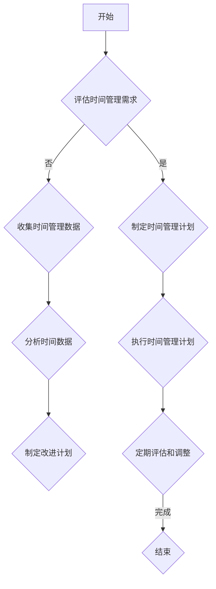

                 

# 《程序员的时间管理：效率即财富》

## 关键词
- 时间管理
- 效率
- 程序员
- 工作流程
- 任务管理
- 避免拖延
- 高效工作习惯

## 摘要
在现代信息技术行业中，时间管理对于程序员的职业生涯至关重要。本文旨在探讨程序员如何通过合理的时间管理和高效的工作习惯，最大化个人时间和工作产出。我们将逐步分析时间管理的核心概念，评估时间使用效率，设定明确的目标与计划，优化工作流程，管理任务，避免拖延，以及培养高效的工作环境与沟通协作能力。通过综合实战案例，我们将提供具体的实践指导，帮助程序员实现效率即财富。

### 第一部分：时间管理基础

#### 第1章：时间管理的核心概念与原则

**1.1.1 时间管理的重要性**

在现代工作环境中，时间管理被视为一种关键的技能，尤其是对于程序员而言。时间管理不仅仅是安排日程，更是一种系统的方法，旨在优化个人和团队的时间使用，从而提高工作效率和生产力。对于程序员，高效的时间管理能够帮助他们更好地应对日益复杂的项目和任务，减少不必要的压力，提高生活质量。

**1.1.2 时间管理的基本原则**

有效的时间管理依赖于以下几个基本原则：

1. **优先级排序**：明确任务的紧急性和重要性，优先处理关键任务。
2. **设定目标**：确保每个任务都有明确的目标和可衡量的成果。
3. **合理规划**：为每个任务分配适当的时间和资源，避免过度负荷。
4. **定期评估**：定期回顾和调整时间管理策略，以适应不断变化的工作需求。

**1.1.3 时间管理者的心态与习惯**

成功的时间管理者通常具备以下心态与习惯：

- **积极主动**：主动识别和管理时间，而不是被动等待。
- **持续学习**：不断探索新的时间管理技巧和工具。
- **自我反思**：定期反思时间管理的效果，及时调整策略。
- **自律**：坚持执行计划，克服拖延，保持高效率。

#### 第2章：评估你的时间使用效率

**2.1.1 时间日志记录与分析**

时间日志是评估时间使用效率的重要工具。通过记录每天的活动，程序员可以清晰地看到自己的时间分配情况，发现时间浪费的环节。以下是一些记录时间日志的步骤：

1. **详细记录**：记录每天的所有活动，包括工作、学习、休息等。
2. **分类分析**：将活动按照类别进行分类，如工作、娱乐、家务等。
3. **分析效率**：分析每类活动的效率，识别出时间浪费的领域。

**2.1.2 时间浪费的常见原因**

程序员在时间管理中常见的时间浪费原因包括：

- **任务切换**：频繁的任务切换会导致效率下降。
- **技术困境**：解决技术问题时耗时过长。
- **缺乏计划**：没有明确的任务目标和时间规划。
- **外部干扰**：电子邮件、社交媒体等外部因素干扰。

**2.1.3 评估工具与方法**

评估时间使用效率的工具和方法包括：

- **时间跟踪软件**：如 Toggl、RescueTime等，可以自动记录使用电脑和手机的时间，生成详细的报告。
- **问卷调查**：通过问卷了解同事或团队成员的时间使用情况，找出共性问题和改进点。
- **自我评估**：定期自我评估，识别时间管理中的不足，并制定改进计划。

#### 第3章：设定明确的目标与计划

**3.1.1 目标设定的SMART原则**

SMART原则是一种有效的目标设定方法，确保目标具有明确性、可衡量性、可实现性、相关性和时限性。

- **具体（Specific）**：目标要具体明确，避免模糊。
- **可衡量（Measurable）**：目标要有可衡量的标准。
- **可实现（Achievable）**：目标要实际可行，避免过高或过低。
- **相关（Relevant）**：目标要与个人职业目标或团队目标相关。
- **时限（Time-bound）**：目标要有明确的完成时限。

**3.1.2 制定时间管理计划的步骤**

制定有效的时间管理计划需要以下步骤：

1. **目标设定**：使用SMART原则明确目标。
2. **任务分解**：将大目标分解为小任务，明确每个任务的完成时限。
3. **时间分配**：为每个任务分配适当的时间和资源。
4. **优先级排序**：根据任务的紧急性和重要性进行排序。
5. **定期审查**：定期审查计划执行情况，及时调整。

**3.1.3 时间预算管理**

时间预算管理是一种将时间视为资源进行管理的策略。具体方法包括：

- **每天时间预算**：为每天的工作、学习和休息设定时间预算。
- **每周时间预算**：为每周的主要任务设定时间预算。
- **弹性时间预算**：为意外情况预留一定的时间缓冲。

### 第二部分：提升工作效率

#### 第4章：优化工作流程

**4.1.1 工作流程优化的原理**

工作流程优化旨在减少不必要的步骤、简化流程、提高效率。其原理包括：

- **流程分析**：分析现有工作流程，识别出冗余和不必要的步骤。
- **流程简化**：去除不必要的步骤，简化流程。
- **流程标准化**：制定标准化的工作流程，确保每个人都知道如何执行任务。

**4.1.2 工作流程优化的工具与方法**

优化工作流程的工具和方法包括：

- **流程图**：使用流程图工具（如Mermaid）来可视化工作流程。
- **流程管理软件**：如Asana、Trello等，帮助团队协作和管理流程。
- **持续改进**：通过定期审查和反馈，不断优化工作流程。

**4.1.3 工作流程优化案例分析**

以一个软件开发项目为例，优化工作流程可以：

- **减少代码审查时间**：通过自动化测试和静态代码分析工具，提前发现问题，减少人工代码审查时间。
- **简化部署流程**：使用自动化部署工具，实现快速、可靠的代码部署。

#### 第5章：任务管理技巧

**5.1.1 任务分解与优先级排序**

任务管理是时间管理的重要组成部分。以下是一些任务管理技巧：

- **任务分解**：将大任务分解为小任务，明确每个小任务的完成标准。
- **优先级排序**：根据任务的紧急性和重要性进行排序，优先处理关键任务。

**5.1.2 常用任务管理工具**

常用的任务管理工具有：

- **Trello**：通过卡片和列表来组织和管理任务。
- **Asana**：提供全面的任务管理功能，包括任务分配、进度跟踪等。
- **JIRA**：主要用于软件开发团队的敏捷项目管理。

**5.1.3 任务执行与反馈**

任务执行与反馈是确保任务顺利完成的关键：

- **任务执行**：遵循任务优先级，确保按时完成。
- **任务反馈**：定期进行任务反馈，了解任务完成情况和存在的问题。

#### 第6章：避免拖延的策略

**6.1.1 拖延的原因分析**

拖延的原因多种多样，包括：

- **恐惧失败**：担心任务完成不好而导致的拖延。
- **完美主义**：追求完美导致过度思考和拖延。
- **缺乏动力**：对任务缺乏兴趣或动力不足。
- **任务过多**：任务过多导致压力过大，难以集中精力。

**6.1.2 克服拖延的心理技巧**

以下是一些克服拖延的心理技巧：

- **设定小目标**：将大任务分解为小目标，逐步完成。
- **使用番茄工作法**：通过设定25分钟的工作时间和5分钟的休息时间，提高专注力。
- **正面激励**：给自己设定奖励，完成任务后给予奖励。

**6.1.3 实战：克服拖延的技巧**

以下是一些实用的克服拖延的技巧：

- **时间限制**：设定一个明确的时间限制，如“必须在30分钟内完成这项任务”。
- **分阶段完成**：将任务分为几个阶段，每个阶段设定具体的目标。
- **使用提醒工具**：使用手机、电脑等设备的提醒功能，确保按时完成任务。

### 第三部分：培养高效的工作习惯

#### 第7章：高效工作环境设计

**7.1.1 工作环境对效率的影响**

工作环境对程序员的效率有着重要的影响。一个良好的工作环境应包括：

- **舒适的工作空间**：合适的办公桌、椅子和照明。
- **良好的通风**：确保室内空气流通，减少污染。
- **安静的背景**：减少噪音干扰，提高专注力。
- **必要工具**：确保所有必要的软件、硬件工具都在手边。

**7.1.2 如何打造一个高效的工作环境**

以下是一些打造高效工作环境的建议：

- **定制桌面布局**：根据个人习惯和需求，定制桌面布局。
- **减少干扰**：将手机、社交媒体等干扰源移开，专注于工作。
- **定期清洁**：保持工作环境的整洁，提高工作效率。
- **合理安排工作时间**：根据工作强度和需求，合理安排工作和休息时间。

**7.1.3 工作时间与休息时间的平衡**

合理的工作时间与休息时间平衡对提高工作效率至关重要。以下是一些建议：

- **短时高频休息**：每工作25-30分钟，休息5-10分钟。
- **长时间休息**：每周安排一至两天的休息时间，完全脱离工作。
- **交替工作**：交替进行不同类型的工作，避免疲劳。

#### 第8章：高效沟通与协作

**8.1.1 高效沟通的原则**

高效沟通是团队合作和项目成功的关键。以下是一些高效沟通的原则：

- **明确目标**：确保沟通的目标明确，避免误解。
- **主动倾听**：倾听对方的观点，理解对方的意图。
- **及时反馈**：及时给予反馈，确保沟通的畅通。
- **尊重差异**：尊重团队成员的不同观点和意见。

**8.1.2 高效协作的方法与工具**

以下是一些高效协作的方法与工具：

- **敏捷开发**：采用敏捷开发方法，提高团队协作效率。
- **协作软件**：如Slack、Microsoft Teams等，用于团队沟通和协作。
- **项目管理系统**：如JIRA、Trello等，用于任务分配和进度跟踪。

**8.1.3 高效沟通与协作的案例分析**

以一个软件开发项目为例，高效沟通与协作可以：

- **定期会议**：每周举行一次团队会议，讨论项目进展和问题。
- **明确责任**：为每个团队成员分配明确的任务和责任。
- **及时报告**：项目进展和问题及时报告，确保团队整体进度。

#### 第9章：培养自我管理能力

**9.1.1 自我管理的重要性**

自我管理是程序员职业生涯成功的关键。以下是一些自我管理的重要性：

- **提高工作效率**：自我管理能力有助于提高工作效率，减少时间浪费。
- **职业发展**：良好的自我管理能力有助于职业发展和晋升。
- **生活平衡**：自我管理能力有助于实现工作与生活的平衡。

**9.1.2 自我管理的策略与方法**

以下是一些自我管理的策略与方法：

- **设定目标**：明确个人和职业目标，制定可行的计划。
- **时间管理**：合理安排时间和任务，避免拖延。
- **持续学习**：不断学习新知识和技能，提升自我。
- **自我反思**：定期反思自我管理的效果，及时调整。

**9.1.3 自我管理的成功案例分析**

以一位成功的程序员为例，他的自我管理成功经验包括：

- **明确目标**：设定明确的职业和个人发展目标，定期评估进展。
- **高效时间管理**：使用时间管理工具，合理安排工作和休息时间。
- **持续学习**：通过在线课程、阅读和专业会议，不断学习新技能。
- **自我反思**：每周进行自我反思，识别不足和改进点。

### 第四部分：综合实战案例

#### 第10章：时间管理综合实战案例

**10.1.1 实战项目背景介绍**

本项目是一个跨部门的大型软件开发项目，涉及多个团队和多个子项目。项目目标是在6个月内完成软件的开发、测试和部署。

**10.1.2 实战项目时间管理策略**

项目时间管理策略包括：

- **目标设定**：明确项目目标，分解为可管理的子目标。
- **任务分配**：为每个任务分配合适的团队成员和完成时限。
- **时间跟踪**：使用Trello和JIRA等工具，跟踪任务进度。
- **定期会议**：每周举行一次项目会议，讨论项目进展和问题。

**10.1.3 实战项目成果与反思**

项目成果包括：

- **按时交付**：所有子项目按时完成，整体项目在预定时间内交付。
- **高效协作**：团队成员之间高效协作，确保任务顺利进行。
- **质量保证**：通过定期测试和反馈，确保软件质量。

反思：

- **时间管理**：虽然项目按时交付，但部分团队成员在时间管理上仍有改进空间。
- **沟通协作**：项目过程中，部分沟通不畅导致任务进展受阻，需要加强团队沟通。
- **技术挑战**：项目过程中遇到的技术挑战较多，需要提高团队技术储备。

### 附录

#### 附录A：时间管理工具与资源

**A.1 常用时间管理工具介绍**

- **Toggl**：一款简单易用的时间跟踪工具。
- **RescueTime**：自动记录使用电脑和手机的时间，生成详细报告。
- **Trello**：通过卡片和列表管理任务。

**A.2 时间管理相关书籍推荐**

- 《深度工作》
- 《番茄工作法图解》
- 《时间管理：如何充分利用24小时》

**A.3 时间管理在线资源推荐**

- [Google 时间管理课程](https://learndash.com/course/take/time-management/)
- [Trello 官方教程](https://trello.com/learn)

#### 附录B：常见问题与解答

**B.1 时间管理常见问题解析**

- **如何平衡工作与生活？**
  - 设定明确的工作时间和休息时间，确保工作与生活平衡。

- **任务太多怎么办？**
  - 将大任务分解为小任务，优先处理紧急且重要的任务。

- **如何应对拖延？**
  - 设定小目标，使用番茄工作法提高专注力，及时奖励自己。

**B.2 时间管理误区与解决方法**

- **误区**：过度依赖工具
  - **解决方法**：了解每种工具的优势和适用场景，合理选择和使用。

- **误区**：忽视休息
  - **解决方法**：定期休息，确保工作效率和身体健康。

**B.3 高效时间管理常见问题答疑**

- **问**：时间管理是否适用于所有程序员？
  - **答**：是的，时间管理对任何职业都有帮助，尤其是对需要处理大量任务的程序员。

- **问**：如何确保时间管理计划的可执行性？
  - **答**：制定计划时，确保每个任务都有明确的执行步骤和资源支持。

### Mermaid 流程图示例：



### 核心算法原理讲解伪代码示例：

```python
# 伪代码：任务优先级排序算法
def taskPrioritySort(tasks):
    # 初始化优先级队列
    priorityQueue = PriorityQueue()

    # 遍历任务列表，将任务加入优先级队列
    for task in tasks:
        priorityQueue.enqueue(task)

    # 依据优先级队列顺序排序任务
    sortedTasks = []
    while not priorityQueue.isEmpty():
        sortedTasks.append(priorityQueue.dequeue())

    return sortedTasks
```

### 数学模型与公式示例：

$$
E = mc^2
$$

# 详细讲解与举例

能量（E）等于质量（m）乘以光速（c）的平方。

### 举例

若质量为 1 千克的物体，其能量为：

$$
E = 1 \times (3 \times 10^8)^2 = 9 \times 10^{16} \text{ 焦耳}
$$

### 项目实战与代码解读：

**Python 任务管理器源代码**

```python
class Task:
    def __init__(self, name, deadline, priority):
        self.name = name
        self.deadline = deadline
        self.priority = priority
    
    def is_urgent(self):
        return self.priority > 5
    
    def is_overdue(self):
        return self.deadline < datetime.now()

# 实例化任务对象
tasks = [
    Task("任务1", datetime.now() + timedelta(days=2), 7),
    Task("任务2", datetime.now() + timedelta(days=1), 5),
    Task("任务3", datetime.now() - timedelta(days=1), 8)
]

# 优先级排序
sorted_tasks = taskPrioritySort(tasks)

# 输出任务列表
for task in sorted_tasks:
    print(task.name, " - 优先级：", task.priority, " - 截止日期：", task.deadline)

# 判断任务是否紧急或过期
urgent_tasks = [task for task in sorted_tasks if task.is_urgent()]
overdue_tasks = [task for task in sorted_tasks if task.is_overdue()]

print("紧急任务：", [task.name for task in urgent_tasks])
print("过期任务：", [task.name for task in overdue_tasks])

# 伪代码：任务优先级排序算法
def taskPrioritySort(tasks):
    # 初始化优先级队列
    priorityQueue = PriorityQueue()

    # 遍历任务列表，将任务加入优先级队列
    for task in tasks:
        priorityQueue.enqueue(task)

    # 依据优先级队列顺序排序任务
    sortedTasks = []
    while not priorityQueue.isEmpty():
        sortedTasks.append(priorityQueue.dequeue())

    return sortedTasks
```

### 代码解读与分析：

该代码定义了一个 `Task` 类，用于表示任务。每个任务有名称（name）、截止日期（deadline）和优先级（priority）三个属性。`Task` 类还提供了两个判断方法：`is_urgent` 用于判断任务是否紧急（优先级大于 5），`is_overdue` 用于判断任务是否过期（截止日期小于当前时间）。

在实例化任务对象后，使用 `taskPrioritySort` 函数对任务进行优先级排序。然后，通过列表推导式生成紧急任务和过期任务的列表。

代码最后输出了排序后的任务列表，以及紧急任务和过期任务。这样可以帮助程序员快速识别并处理紧急和过期的任务，提高工作效率。

### 结束语

作者：AI天才研究院/AI Genius Institute & 禅与计算机程序设计艺术 /Zen And The Art of Computer Programming

在信息技术飞速发展的今天，程序员的时间管理不仅关乎个人职业发展，更影响到整个团队的效率和项目成功。本文通过系统化的分析，提供了一系列实用的时间管理技巧和策略，旨在帮助程序员实现高效工作。希望读者能够结合自身情况，灵活应用这些方法，实现效率即财富的目标。在不断探索和实践中，我们相信每位程序员都能找到最适合自己的时间管理之道。

