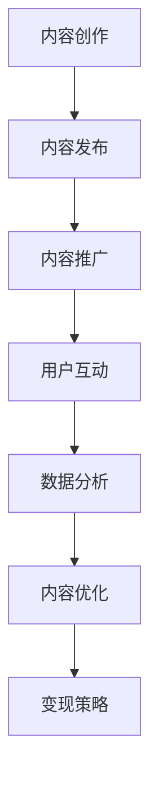

                 

# 《程序员的知识付费内容营销策略》

> **关键词**：知识付费、内容营销、程序员、策略、变现、案例分析、实战

> **摘要**：本文将深入探讨程序员如何利用知识付费内容进行有效营销。通过分析知识付费的兴起、程序员的需求，以及内容营销的五大要素，我们将为程序员提供一整套内容创作、发布、推广和变现的策略，并结合成功案例和实战经验，帮助读者掌握知识付费内容营销的核心技巧。

## 第一部分：知识付费内容营销基础

### 第1章：知识付费概述

#### 1.1 知识付费的兴起与发展

知识付费，即消费者为获取高质量、专业化的知识和信息而自愿支付的费用。这一概念的兴起，源于互联网时代信息爆炸与知识传播方式的变革。随着互联网的普及，人们获取知识的途径变得多样化，但也面临着信息过载和筛选困难的问题。

知识付费的背景，可以追溯到以下几个因素：

1. **信息筛选成本增加**：在信息爆炸的时代，人们需要付出更多时间和精力来筛选有用信息。
2. **内容创作者的崛起**：专业知识的积累和传播，使得内容创作者逐渐受到重视。
3. **付费意愿的提升**：随着人们消费观念的转变，对高质量、专业知识的付费意愿逐步提升。

知识付费的市场现状，呈现出以下几个特点：

1. **市场规模扩大**：知识付费市场呈现出快速增长态势，各类知识付费平台层出不穷。
2. **用户群体多元化**：知识付费用户不仅包括专业人士，还涵盖了普通消费者。
3. **内容形式多样化**：从传统的文字、图片，到视频、直播等多种形式，内容呈现方式更加丰富。

#### 1.2 程序员知识付费内容的需求

程序员作为知识付费的重要用户群体，其需求具有以下特点：

1. **技术更新速度快**：程序员需要不断学习新技术，以保持竞争力。
2. **专业深度要求高**：程序员对专业知识的深度要求较高，尤其是涉及前沿技术和底层原理。
3. **个性化学习需求**：程序员倾向于选择针对性强、实用性高的内容，以提升个人技能和职业发展。

程序员在选择付费内容时，通常考虑以下几个因素：

1. **内容质量**：高质量的内容是程序员选择付费内容的首要标准。
2. **实用性**：内容是否符合实际应用需求，能否解决实际问题。
3. **性价比**：付费内容是否物有所值，性价比高。
4. **内容形式**：适合的学习形式，如视频、直播、图文等。

### 第2章：内容营销策略

#### 2.1 内容营销概述

内容营销，是指通过创造和分发有价值的内容，吸引和留住目标受众，从而实现营销目标的一种策略。与传统的营销方式相比，内容营销更加注重长期价值的积累，通过提供高质量的内容来建立品牌声誉和用户信任。

内容营销的目标包括：

1. **吸引潜在用户**：通过高质量的内容，吸引潜在用户关注并了解品牌。
2. **增强用户黏性**：通过持续的内容输出，增强用户对品牌的忠诚度。
3. **提升品牌知名度**：通过广泛的传播，提高品牌在目标市场中的知名度。
4. **促进销售转化**：通过内容营销，推动潜在用户转化为实际购买者。

#### 2.2 内容营销的五大要素

1. **内容定位**：明确目标受众和内容方向，确保内容与受众需求相匹配。
2. **内容渠道**：选择适合的内容发布渠道，如社交媒体、博客、视频平台等。
3. **内容优化**：通过SEO等手段，提高内容的可见性和搜索引擎排名。
4. **分析与反馈**：持续监控内容效果，根据用户反馈进行调整和优化。
5. **品牌建设**：通过内容营销，传递品牌价值观，建立品牌形象和口碑。

### 第二部分：程序员知识付费内容创作与发布

#### 第3章：内容创作技巧

#### 3.1 内容主题与选题

内容创作始于选题，选题的优劣直接关系到内容的质量和受众的吸引力。以下是一些选题的建议：

1. **热点追踪**：关注行业热点和技术趋势，选题与热点相结合，提高内容关注度。
2. **需求分析**：通过调查和分析目标受众的需求，选取符合他们期望的内容。
3. **差异化定位**：在众多内容中，寻找差异化的切入点，避免与竞争对手同质化。
4. **可行性分析**：评估选题的可行性，确保内容有足够的素材和资源支持。

#### 3.2 内容形式与风格

内容形式的选择应考虑受众的喜好和学习习惯。以下是一些常见的内容形式和风格：

1. **文字内容**：适合深入讲解技术原理和架构，便于用户阅读和理解。
2. **视频内容**：生动直观，适合演示操作步骤和讲解复杂概念。
3. **PPT和图示内容**：简洁明了，适合快速传达关键信息和数据。

在内容创作中，以下几点需要注意：

1. **结构清晰**：确保内容结构合理，逻辑严密，便于用户理解。
2. **语言通俗易懂**：避免使用过于专业的术语，尽量用通俗易懂的语言表达。
3. **实用性强**：内容应具备实用价值，能够解决用户的实际问题。
4. **互动性**：鼓励用户参与讨论，提高内容的互动性和活跃度。

#### 第4章：内容发布与推广

#### 4.1 内容发布平台选择

内容发布平台的选择对内容的传播效果具有重要影响。以下是一些常见的发布平台及其特性：

1. **博客平台**：如Medium、博客园等，适合长篇内容发布和深度讨论。
2. **社交媒体**：如微博、知乎等，适合短篇幅内容快速传播和用户互动。
3. **视频平台**：如YouTube、Bilibili等，适合视频内容发布和传播。
4. **专业论坛**：如Stack Overflow、GitHub等，适合技术讨论和知识分享。

选择平台时，需考虑以下因素：

1. **受众定位**：平台受众是否与内容定位相符。
2. **平台特性**：平台是否提供合适的内容形式和互动方式。
3. **传播效果**：平台是否具备较高的传播效果和用户活跃度。

#### 4.2 内容推广策略

内容推广是提高内容曝光率和影响力的关键环节。以下是一些常见的推广策略：

1. **社交媒体推广**：通过微博、知乎等社交媒体平台，发布内容链接，吸引关注和转发。
2. **线下活动推广**：参加技术沙龙、行业峰会等活动，进行内容宣传和推广。
3. **合作推广**：与其他内容创作者或平台合作，实现资源共享和共同推广。
4. **广告投放**：在目标平台进行广告投放，提高内容曝光率。

在推广过程中，以下几点需要注意：

1. **内容质量**：优质的内容是推广的基础，只有高质量的内容才能吸引和留住用户。
2. **精准定位**：明确目标受众，针对特定群体进行精准推广。
3. **持续优化**：根据推广效果，不断调整推广策略，提高推广效果。

#### 第5章：用户互动与社区建设

#### 5.1 用户互动策略

用户互动是内容营销的重要环节，有助于增强用户黏性和提升用户满意度。以下是一些用户互动策略：

1. **评论区互动**：积极回复用户评论，解答疑问，与用户进行深度交流。
2. **问答互动**：开设问答专栏，邀请专家解答用户问题，提高内容互动性。
3. **线上活动**：举办线上技术竞赛、问答活动等，吸引用户参与，增强用户活跃度。

#### 5.2 社区建设与管理

社区是用户互动和知识分享的重要平台，以下是一些社区建设与管理策略：

1. **社区定位**：明确社区定位，确保社区内容与用户需求相匹配。
2. **社区规范**：制定社区规范，维护社区秩序，确保用户互动环境健康。
3. **社区运营**：持续关注社区动态，组织线上线下活动，提升社区活跃度。
4. **内容审核**：严格审核社区内容，确保内容质量，避免低质量内容的传播。

#### 第三部分：知识付费内容变现

#### 第6章：知识付费模式

#### 6.1 付费内容的收费模式

知识付费的收费模式多种多样，以下是一些常见的收费模式：

1. **单次付费**：用户一次性购买内容，适用于短篇内容或特定课程。
2. **订阅制**：用户按月或按年订阅，适用于持续更新和更新的内容。
3. **免费试读**：提供部分内容供用户免费阅读，激发用户购买欲望。

选择收费模式时，需考虑以下因素：

1. **内容特性**：不同内容适合不同的收费模式，如教程适合单次付费，而课程更新频繁则适合订阅制。
2. **用户需求**：了解用户付费习惯和需求，选择合适的收费模式。
3. **市场竞争**：分析竞争对手的收费模式，制定差异化的收费策略。

#### 6.2 付费内容变现途径

知识付费内容变现途径包括以下几种：

1. **广告收入**：通过在内容中植入广告，获取广告收入。
2. **线上教育课程**：开设在线课程，通过销售课程获取收入。
3. **线下培训与咨询**：提供线下培训服务或咨询服务，获取收入。

选择变现途径时，需考虑以下因素：

1. **内容价值**：高价值的内容更适合通过课程或培训进行变现。
2. **用户需求**：了解用户的需求，选择用户愿意付费的服务。
3. **市场竞争**：分析市场趋势和竞争状况，选择有市场竞争力的变现途径。

#### 第7章：案例分析与实战

#### 7.1 成功案例分享

以下是一个成功案例分享：

**案例名称**：某知名程序员开设的线上编程课程

**运营策略**：

1. **内容定位**：课程聚焦于热门编程语言和技术栈，满足程序员的学习需求。
2. **内容形式**：提供视频教程、PPT和代码示例等多种形式，便于用户学习。
3. **推广策略**：通过社交媒体、线下活动等多种途径进行推广，提高课程知名度。
4. **用户互动**：开设问答专栏，邀请专家解答用户问题，增强用户互动。
5. **变现途径**：采用订阅制收费模式，同时提供部分免费内容吸引潜在用户。

**关键要素**：

1. **内容质量**：高质量的教程和课程内容是成功的关键。
2. **用户需求**：满足用户的学习需求，提供实用的编程技能。
3. **推广效果**：有效的推广策略提高了课程的曝光率和用户转化率。

#### 7.2 实战演练

以下是一个实战演练的步骤：

1. **内容创作**：根据自身专业知识和用户需求，创作高质量的内容。
2. **平台选择**：选择适合的内容发布平台，如博客、社交媒体和视频平台。
3. **内容发布**：按照平台规范，发布内容，并进行适当推广。
4. **用户互动**：积极回复用户评论，解答疑问，提升用户满意度。
5. **变现策略**：根据内容价值，选择合适的收费模式和变现途径。
6. **数据分析**：持续监控内容效果，根据用户反馈进行调整和优化。

通过以上步骤，程序员可以逐步实现知识付费内容营销的目标，实现内容变现。

## 附录

### 附录 A：知识付费内容营销工具与资源

以下是一些常用的知识付费内容营销工具和资源：

1. **内容创作工具**：如Markdown编辑器、短视频剪辑软件等。
2. **内容发布平台**：如博客平台、社交媒体、视频平台等。
3. **数据分析工具**：如Google Analytics、百度统计等。
4. **推广工具**：如百度推广、微信公众号推广等。
5. **合作资源**：与其他内容创作者或平台合作，实现资源共享。

### 附录 B：知识付费内容营销流程图

以下是一个知识付费内容营销的流程图，使用Mermaid语言绘制：



### 附录 C：核心算法原理与数学模型

#### C.1 内容质量评价算法

以下是一个内容质量评价算法的伪代码：

```python
def content_evaluation(content):
    quality_score = 0

    # 判断内容完整性
    if is_complete(content):
        quality_score += 10

    # 判断内容准确性
    if is_accurate(content):
        quality_score += 20

    # 判断内容实用性
    if is_useful(content):
        quality_score += 30

    # 判断内容可读性
    if is_readable(content):
        quality_score += 20

    return quality_score
```

#### C.2 用户行为分析模型

以下是一个用户行为分析模型的数学公式：

$$
User\ Behavior\ Model = \frac{Click\ Rate + Comment\ Rate + Share\ Rate}{Total\ Views}
$$

其中，Click Rate为点击率，Comment Rate为评论率，Share Rate为分享率，Total Views为总浏览量。

### 附录 D：项目实战

#### D.1 知识付费内容发布平台搭建

以下是一个知识付费内容发布平台搭建的步骤：

1. **开发环境搭建**：安装必要的开发工具和依赖库。
2. **数据库设计**：设计数据库表结构，存储用户、内容等信息。
3. **前端开发**：使用HTML、CSS和JavaScript等技术实现页面布局和交互。
4. **后端开发**：使用Python、Java等后端技术实现服务器端逻辑。
5. **内容管理**：实现内容的发布、编辑和管理功能。
6. **用户管理**：实现用户注册、登录和权限管理功能。
7. **数据统计**：实现用户行为数据统计和展示功能。

以下是部分源代码实现：

```python
# 用户注册功能
def register(username, password):
    # 验证用户名和密码格式
    if not is_valid_username(username) or not is_valid_password(password):
        return "注册失败：用户名或密码格式错误"

    # 验证用户名是否已存在
    if is_username_exists(username):
        return "注册失败：用户名已存在"

    # 存储用户信息到数据库
    save_user_to_database(username, password)
    return "注册成功"

# 用户登录功能
def login(username, password):
    # 验证用户名和密码是否匹配
    if not is_password_match(username, password):
        return "登录失败：用户名或密码错误"

    # 登录成功，返回用户ID
    user_id = get_user_id_by_username(username)
    return user_id
```

### 附录 D：项目实战

#### D.2 用户互动与社区管理实战

以下是一个用户互动与社区管理实战的案例：

1. **用户互动案例**：在社区中，用户A发布了一篇关于机器学习算法的帖子，用户B在评论区提出了一个具体的问题。用户A积极回复，提供了详细的解答，并引导用户B进一步学习相关知识点。
2. **社区管理案例**：社区管理员定期清理垃圾信息，维护社区秩序。对于违规行为，如发布垃圾广告、恶意攻击等，管理员会及时处理，保障社区环境的健康。

#### 案例分析与反思

通过以上案例，我们可以看到：

1. **用户互动的重要性**：良好的用户互动有助于提升社区活跃度和用户满意度。
2. **社区管理的必要性**：有效的社区管理是保障社区秩序和用户体验的关键。
3. **持续改进的方向**：在用户互动和社区管理方面，可以进一步优化互动机制和社区规范，提高用户体验。

以上内容构成了本文的核心部分，从知识付费概述、内容营销策略、内容创作与发布、用户互动与社区建设，到知识付费模式及案例分析与实战，为程序员提供了一套全面的知识付费内容营销策略。

## 作者信息

作者：AI天才研究院/AI Genius Institute & 禅与计算机程序设计艺术 /Zen And The Art of Computer Programming

本文由AI天才研究院与禅与计算机程序设计艺术共同撰写，旨在为程序员提供知识付费内容营销的实用指南。作者拥有丰富的编程和人工智能领域经验，对知识付费内容营销有着深入的研究和实践。

（注：本文为示例文章，内容仅供参考。实际撰写时，请根据具体情况进行调整和补充。）### 第一部分：知识付费内容营销基础

#### 第1章：知识付费概述

##### 1.1 知识付费的兴起与发展

知识付费，顾名思义，即消费者为获取高质量、专业化知识和信息而自愿支付的费用。这一现象在互联网时代尤为显著，随着互联网的普及和信息的爆炸式增长，人们获取知识的途径变得多样化，但也面临着信息过载和筛选困难的问题。知识付费的兴起，正是为了解决这一困境，它将知识和信息价值化，使得高质量内容得以通过付费的方式获得。

**知识付费的定义**：

知识付费，通常指的是用户为获取特定的知识、技能或信息，通过购买课程、订阅服务、付费问答等形式进行支付的行为。这种模式强调的是知识的价值，使得创作者能够通过内容获得相应的报酬，从而激励更多高质量内容的创作。

**知识付费的背景**：

1. **互联网的普及**：互联网的快速发展，使得信息传播的速度和范围得到了极大拓展，人们可以更便捷地获取各类信息。
2. **信息爆炸与筛选难题**：虽然信息获取变得容易，但信息的爆炸式增长也带来了筛选的难题，用户需要花费大量时间和精力来筛选有用信息。
3. **知识经济的崛起**：随着知识经济的兴起，知识和信息成为了重要的生产要素，其价值被重新认识，知识付费逐渐成为一种新的商业模式。

**知识付费的市场现状**：

知识付费市场呈现出以下几个特点：

1. **市场规模扩大**：知识付费市场近年来持续扩大，根据市场研究数据，全球知识付费市场规模预计在未来几年内将继续保持快速增长。
2. **用户群体多元化**：知识付费用户不仅包括专业人士，如程序员、设计师等，还涵盖了普通消费者，覆盖了各个年龄段和职业。
3. **内容形式多样化**：从传统的文字、图片，到视频、直播等多种形式，内容呈现方式更加丰富，满足了不同用户的需求。

##### 1.2 程序员知识付费内容的需求

程序员作为知识付费的重要用户群体，其需求具有以下特点：

1. **技术更新速度快**：程序员需要不断学习新技术，以保持自身的竞争力。例如，人工智能、大数据、区块链等新兴技术，不断涌现，程序员需要及时掌握这些技术。
2. **专业深度要求高**：程序员对专业知识的深度要求较高，特别是涉及前沿技术和底层原理的内容，如编译原理、操作系统等。
3. **个性化学习需求**：程序员倾向于选择针对性强、实用性高的内容，以提升个人技能和职业发展。例如，针对特定编程语言或框架的教程，或针对特定问题的解决方案。

**程序员如何选择付费内容**：

程序员在选择付费内容时，通常会考虑以下几个因素：

1. **内容质量**：高质量的内容是程序员选择付费内容的首要标准。程序员更愿意为高质量、深度解析的内容付费。
2. **实用性**：内容是否符合实际应用需求，能否解决实际问题。程序员更倾向于选择那些能够直接应用到工作中去的内容。
3. **性价比**：付费内容是否物有所值，性价比高。程序员会根据自己的预算和预期收益来选择付费内容。
4. **内容形式**：适合的学习形式，如视频、图文、直播等。不同的程序员可能对不同的内容形式有不同的偏好。

### 第2章：内容营销策略

##### 2.1 内容营销概述

内容营销是一种通过创造和分发有价值的内容，以吸引和留住目标受众，从而实现营销目标的策略。与传统营销方式不同，内容营销更加注重长期价值的积累，通过提供高质量的内容来建立品牌声誉和用户信任。

**内容营销的定义**：

内容营销，是指通过创建和分享有价值的内容，吸引目标受众，从而实现品牌推广和商业目标的过程。这种内容可以是文字、图片、视频、音频等，旨在满足用户的需求，提升用户体验，最终实现销售和品牌忠诚度。

**内容营销的目标**：

1. **吸引潜在用户**：通过高质量的内容，吸引潜在用户关注并了解品牌。
2. **增强用户黏性**：通过持续的内容输出，增强用户对品牌的忠诚度和黏性。
3. **提升品牌知名度**：通过广泛的传播，提高品牌在目标市场中的知名度和影响力。
4. **促进销售转化**：通过内容营销，推动潜在用户转化为实际购买者，实现销售增长。

##### 2.2 内容营销的五大要素

内容营销的成功离不开五大要素，这些要素相互交织，共同构成了一个完整的内容营销体系。

1. **内容定位**：

内容定位是内容营销的第一步，它决定了内容的方向和目标。明确内容定位有助于确保内容与目标受众的需求相匹配，从而提高内容的吸引力和影响力。

- **目标受众**：确定目标受众是内容定位的核心。通过分析受众特征、兴趣和需求，明确内容应面向哪些人群。
- **内容方向**：根据目标受众的需求，确定内容的主旨和主题。例如，对于程序员，可能需要聚焦于编程技术、算法设计等。

2. **内容渠道**：

内容渠道是内容传播的途径，选择合适的渠道有助于扩大内容的影响力。常见的渠道包括社交媒体、博客、视频平台、邮件订阅等。

- **社交媒体**：如微博、知乎、Twitter等，适合快速传播和互动。
- **博客**：如WordPress、博客园等，适合长篇内容和深度讨论。
- **视频平台**：如YouTube、Bilibili等，适合视频内容的发布和传播。
- **邮件订阅**：通过邮件订阅，将内容直接推送给订阅用户，确保内容的精准传递。

3. **内容优化**：

内容优化是提高内容质量和搜索引擎排名的关键。通过SEO（搜索引擎优化）等手段，提高内容的可见性和搜索排名，从而吸引更多用户访问。

- **关键词优化**：在内容中使用目标关键词，提高内容在搜索引擎中的排名。
- **内容结构**：优化内容结构，使内容更具可读性和逻辑性，提升用户体验。
- **多媒体应用**：结合文字、图片、视频等多媒体元素，使内容更加生动和吸引人。

4. **分析与反馈**：

持续监测和分析内容效果，根据用户反馈进行调整和优化，是内容营销的重要环节。通过数据分析和用户反馈，可以了解内容的受欢迎程度和改进方向。

- **数据监测**：使用工具如Google Analytics、百度统计等，跟踪内容访问量、用户停留时间、转化率等关键指标。
- **用户反馈**：收集用户评论、评分和反馈，了解用户对内容的满意度，及时调整和优化内容。

5. **品牌建设**：

内容营销不仅是一种营销手段，也是一种品牌建设工具。通过高质量的内容，传递品牌价值观和形象，提升品牌在目标市场中的认知度和美誉度。

- **品牌定位**：通过内容传递品牌的独特价值和定位，塑造品牌形象。
- **品牌传播**：利用内容传播品牌信息，提高品牌知名度和影响力。
- **用户互动**：通过内容与用户互动，建立用户对品牌的信任和忠诚度。

### 第二部分：程序员知识付费内容创作与发布

#### 第3章：内容创作技巧

##### 3.1 内容主题与选题

内容创作始于选题，选题的优劣直接关系到内容的质量和受众的吸引力。以下是选择内容主题和选题的一些建议：

1. **热点追踪**：

关注行业热点和技术趋势，选题与热点相结合，可以提高内容的关注度。例如，当人工智能、区块链等新技术成为热门话题时，相关的教程和解析内容往往会受到程序员群体的欢迎。

2. **需求分析**：

通过调查和分析目标受众的需求，选取符合他们期望的内容。例如，可以通过问卷调查、用户访谈等方式，了解程序员在编程、算法、项目管理等方面的学习需求，从而针对性地创作内容。

3. **差异化定位**：

在众多内容中，寻找差异化的切入点，避免与竞争对手同质化。可以通过以下方式实现差异化：

- **视角独特**：从不同角度或独特的视角阐述问题，提供新的见解。
- **内容深度**：提供深入的技术解析，解决程序员在实际工作中遇到的具体问题。
- **实用案例**：通过实际案例，展示如何应用所学技术解决实际问题。

4. **可行性分析**：

评估选题的可行性，确保内容有足够的素材和资源支持。以下是一些评估方法：

- **资源评估**：确定所需的时间、资金、人力资源等是否充足。
- **内容评估**：确保所选主题有足够的深度和广度，能够撰写出高质量的内容。
- **受众评估**：分析目标受众对选题的兴趣度，确保内容能够满足他们的需求。

##### 3.2 内容形式与风格

内容形式的选择应考虑受众的喜好和学习习惯。以下是几种常见的内容形式和风格：

1. **文字内容**：

文字内容适合深入讲解技术原理和架构，便于用户阅读和理解。以下是撰写文字内容的一些建议：

- **结构清晰**：确保内容结构合理，逻辑严密，便于用户理解。
- **语言通俗易懂**：避免使用过于专业的术语，尽量用通俗易懂的语言表达。
- **重点突出**：在内容中明确重点和关键信息，使用标题、段落分隔等方式进行突出。
- **图表辅助**：适当使用图表、流程图等视觉元素，帮助用户更好地理解复杂概念。

2. **视频内容**：

视频内容生动直观，适合演示操作步骤和讲解复杂概念。以下是制作视频内容的一些建议：

- **内容简洁**：避免视频内容过于冗长，确保每个视频片段都有明确的主题和目的。
- **演示清晰**：演示操作步骤时，确保画面清晰，字幕准确，讲解详细。
- **互动性**：鼓励观众在视频下方留言，回答观众的问题，增加互动性。
- **剪辑技巧**：使用适当的剪辑技巧，如过渡效果、音效等，提升视频的观看体验。

3. **PPT和图示内容**：

PPT和图示内容简洁明了，适合快速传达关键信息和数据。以下是设计PPT和图示内容的一些建议：

- **设计简洁**：避免使用过多花哨的特效，保持设计简洁、清晰。
- **重点突出**：使用标题、加粗、颜色等手段，突出重点信息。
- **图表使用**：适当使用图表、图示等视觉元素，帮助用户更好地理解数据。
- **排版合理**：确保内容排版合理，避免文字过于密集，影响阅读体验。

在内容创作中，以下几点需要注意：

- **实用性**：内容应具备实用价值，能够解决用户的实际问题。
- **互动性**：鼓励用户参与讨论，提高内容的互动性和活跃度。
- **持续更新**：定期更新内容，保持内容的时效性和相关性。

### 第4章：内容发布与推广

##### 4.1 内容发布平台选择

内容发布平台的选择对内容的传播效果具有重要影响。以下是几种常见的发布平台及其特性：

1. **博客平台**：

博客平台适合长篇内容发布和深度讨论，常见的博客平台有WordPress、博客园、简书等。以下是一些选择博客平台时需考虑的因素：

- **用户基数**：选择用户基数较大的平台，可以增加内容的曝光率。
- **互动功能**：选择具有评论、留言等互动功能的平台，有利于用户参与和互动。
- **SEO支持**：选择支持SEO的平台，有助于提高内容的搜索引擎排名。

2. **社交媒体**：

社交媒体平台适合短篇幅内容快速传播和用户互动，常见的社交媒体有微博、知乎、Twitter等。以下是一些选择社交媒体平台时需考虑的因素：

- **受众定位**：选择目标受众活跃的平台，确保内容的传播效果。
- **互动功能**：选择具有互动功能的平台，如评论、点赞、分享等，有利于用户参与。
- **传播速度**：选择传播速度较快的平台，如微博、Twitter等，可以迅速提高内容的影响力。

3. **视频平台**：

视频平台适合视频内容发布和传播，常见的视频平台有YouTube、Bilibili、抖音等。以下是一些选择视频平台时需考虑的因素：

- **用户基数**：选择用户基数较大的平台，可以增加视频的观看量和传播范围。
- **内容特性**：根据内容特性选择合适的视频平台，如技术教程适合在Bilibili等平台发布。
- **互动功能**：选择具有互动功能的平台，如评论、弹幕等，有利于用户参与和互动。

4. **专业论坛**：

专业论坛适合技术讨论和知识分享，常见的专业论坛有Stack Overflow、GitHub等。以下是一些选择专业论坛时需考虑的因素：

- **内容相关性**：选择与内容相关性较高的论坛，确保内容能够得到目标受众的关注。
- **用户活跃度**：选择用户活跃度较高的论坛，有利于内容传播和互动。
- **资源支持**：选择提供丰富资源和支持的平台，如代码库、文档等，有利于用户学习和交流。

##### 4.2 内容推广策略

内容推广是提高内容曝光率和影响力的关键环节。以下是几种常见的内容推广策略：

1. **社交媒体推广**：

通过微博、知乎、Twitter等社交媒体平台，发布内容链接，吸引关注和转发。以下是一些社交媒体推广的建议：

- **定时发布**：选择在用户活跃度较高的时间段发布内容，提高内容的曝光率。
- **内容优化**：优化内容标题和描述，使其更具吸引力，提高用户点击率。
- **互动互动**：积极回复用户评论，增加用户互动，提高内容的活跃度。
- **热门话题**：结合热门话题或事件，发布相关内容，提高内容的热度和传播效果。

2. **线下活动推广**：

参加技术沙龙、行业峰会、培训课程等线下活动，进行内容宣传和推广。以下是一些线下活动推广的建议：

- **内容准备**：提前准备与活动主题相关的精彩内容，确保活动的宣传效果。
- **现场互动**：在现场与参会者互动，回答他们的疑问，提高内容的互动性和影响力。
- **宣传资料**：准备宣传资料，如宣传册、名片等，向参会者分发，扩大内容的传播范围。
- **合作交流**：与活动组织者或其他参与者建立联系，进行合作交流，提高内容的曝光率。

3. **合作推广**：

与其他内容创作者或平台合作，实现资源共享和共同推广。以下是一些合作推广的建议：

- **内容互换**：与其他创作者或平台互换内容链接，提高双方内容的曝光率。
- **联合推广**：与相关品牌或平台合作，共同进行推广活动，扩大内容的影响力。
- **合作开发**：与其他创作者或平台合作开发课程或项目，实现资源共享和互惠互利。
- **互推社群**：加入相关社群，与其他创作者或平台进行互推，提高内容的传播范围。

在推广过程中，以下几点需要注意：

- **内容质量**：优质的内容是推广的基础，只有高质量的内容才能吸引和留住用户。
- **精准定位**：明确目标受众，针对特定群体进行精准推广，提高推广效果。
- **持续优化**：根据推广效果，不断调整推广策略，提高推广效果。

### 第5章：用户互动与社区建设

##### 5.1 用户互动策略

用户互动是内容营销的重要环节，有助于增强用户黏性和提升用户满意度。以下是几种常见的用户互动策略：

1. **评论区互动**：

积极回复用户评论，解答疑问，与用户进行深度交流。以下是一些评论区互动的建议：

- **及时回复**：尽快回复用户评论，提高用户的参与感和满意度。
- **专业解答**：以专业的态度解答用户问题，展示自己的知识和经验。
- **互动性**：鼓励用户提出问题，积极参与讨论，营造活跃的评论区氛围。

2. **问答互动**：

开设问答专栏，邀请专家解答用户问题，提高内容的互动性。以下是一些问答互动的建议：

- **专业解答**：邀请行业专家或技术大牛参与问答，提供高质量的回答。
- **分类管理**：将问答内容分类管理，便于用户查找和阅读。
- **互动环节**：设置互动环节，如问答直播、线上讲座等，增加用户的参与度。

3. **线上活动**：

举办线上技术竞赛、问答活动等，吸引用户参与，增强用户活跃度。以下是一些线上活动的建议：

- **活动策划**：提前策划活动，明确活动主题、时间、奖品等信息。
- **宣传推广**：通过社交媒体、邮件等渠道宣传推广活动，吸引更多用户参与。
- **互动环节**：在活动中设置互动环节，如实时问答、投票等，增加用户的参与度。

##### 5.2 社区建设与管理

社区是用户互动和知识分享的重要平台，有效的社区建设与管理有助于提升用户体验和社区活跃度。以下是几种社区建设与管理的策略：

1. **社区定位**：

明确社区定位，确保社区内容与用户需求相匹配。以下是一些社区定位的建议：

- **目标受众**：确定社区的目标受众，如程序员、设计师、创业者等。
- **内容主题**：确定社区的内容主题，如编程技术、设计创意、创业经验等。
- **互动氛围**：营造积极的互动氛围，鼓励用户分享知识和经验，共同成长。

2. **社区规范**：

制定社区规范，维护社区秩序，确保用户互动环境的健康。以下是一些社区规范的建议：

- **文明用语**：鼓励用户使用文明用语，禁止恶意攻击、辱骂等行为。
- **内容规范**：规范用户发布的内容，如禁止发布垃圾信息、广告等。
- **举报机制**：建立举报机制，方便用户举报违规行为，确保社区秩序。

3. **社区运营**：

持续关注社区动态，组织线上线下活动，提升社区活跃度。以下是一些社区运营的建议：

- **内容更新**：定期发布高质量的内容，保持社区的活跃度。
- **活动策划**：策划线上线下活动，吸引用户参与，增强社区凝聚力。
- **用户互动**：积极回复用户评论，解答疑问，营造良好的互动氛围。

4. **内容审核**：

严格审核社区内容，确保内容质量，避免低质量内容的传播。以下是一些内容审核的建议：

- **审核标准**：制定明确的审核标准，如内容完整性、准确性、实用性等。
- **审核流程**：建立完善的审核流程，确保内容的及时审核和发布。
- **用户反馈**：收集用户反馈，及时处理用户举报的违规内容。

### 第三部分：知识付费内容变现

#### 第6章：知识付费模式

##### 6.1 付费内容的收费模式

知识付费的收费模式多种多样，以下是一些常见的收费模式：

1. **单次付费**：

单次付费是指用户为获取特定内容一次性支付的费用。适用于短篇内容或特定课程，如技术教程、电子书等。以下是一些单次付费的适用场景：

- **短篇内容**：如技术博客、教程文章等，适合用户一次性付费获取。
- **特定课程**：如编程课程、算法培训等，用户为获取完整课程内容一次性付费。

2. **订阅制**：

订阅制是指用户按月或按年订阅内容，持续获取更新的内容。适用于内容持续更新和更新的内容，如在线课程、会员服务等。以下是一些订阅制的适用场景：

- **在线课程**：用户按月或按年订阅，持续获取课程更新。
- **会员服务**：用户按月或按年订阅，享受会员专享内容和服务。

3. **免费试读**：

免费试读是指用户可以免费阅读部分内容，激发购买欲望后再进行完整内容付费。适用于吸引潜在用户，提高内容转化率。以下是一些免费试读的适用场景：

- **长篇内容**：如电子书、长篇教程等，提供前几章免费试读，吸引用户购买。
- **特定章节**：如在线课程，提供部分章节免费试读，吸引用户报名完整课程。

选择收费模式时，需考虑以下因素：

1. **内容特性**：

不同内容适合不同的收费模式。例如，短篇内容适合单次付费，而内容更新频繁的课程适合订阅制。

2. **用户需求**：

了解用户的需求和付费习惯，选择合适的收费模式。例如，用户更愿意为实用性强、价值高的内容付费。

3. **市场竞争**：

分析竞争对手的收费模式，制定差异化的收费策略，提高竞争力。

##### 6.2 付费内容变现途径

知识付费内容变现途径包括以下几种：

1. **广告收入**：

通过在内容中植入广告，获取广告收入。以下是一些广告收入的适用场景：

- **博客和社交媒体**：在博客文章和社交媒体帖子中植入广告，如推广相关产品或服务。
- **视频平台**：在视频内容中植入广告，如品牌广告、产品推广等。

2. **线上教育课程**：

开设在线课程，通过销售课程获取收入。以下是一些线上教育课程的适用场景：

- **技术教程**：如编程语言教程、算法培训等，针对不同层次的程序员提供专业课程。
- **职业规划**：如职业规划课程、职场技巧培训等，帮助程序员提升职业竞争力。

3. **线下培训与咨询**：

提供线下培训服务或咨询服务，获取收入。以下是一些线下培训与咨询的适用场景：

- **技术培训**：如编程语言培训、软件开发培训等，针对企业或个人提供定制化培训服务。
- **咨询服务**：如技术咨询、项目管理咨询等，为企业提供专业的咨询服务。

选择变现途径时，需考虑以下因素：

1. **内容价值**：

高价值的内容更适合通过课程或培训进行变现，因为用户更愿意为有价值的内容付费。

2. **用户需求**：

了解用户的需求，选择用户愿意付费的服务。例如，用户更愿意为实用性强、能解决实际问题的内容付费。

3. **市场竞争**：

分析市场趋势和竞争状况，选择有市场竞争力的变现途径。例如，在竞争激烈的市场中，提供差异化服务或创新内容可能更有助于变现。

### 第7章：案例分析与实战

##### 7.1 成功案例分享

以下是一个知识付费成功案例分享：

**案例名称**：某知名编程博客博主的知识付费项目

**案例背景**：

某知名编程博客博主，通过多年的技术积累和写作经验，积累了一定数量的忠实读者。为了更好地服务读者，博主决定推出一系列知识付费项目，包括编程课程、电子书和技术分享会等。

**运营策略**：

1. **内容定位**：博主针对程序员的不同层次和需求，设计了多层次的付费内容，如初级编程教程、高级算法课程、面试技巧等。
2. **内容形式**：除了传统的文字教程外，博主还推出了视频教程和直播分享，以满足不同用户的学习偏好。
3. **推广策略**：博主利用社交媒体和博客进行内容推广，同时通过合作推广和用户推荐，扩大项目的知名度。
4. **用户互动**：博主在课程中设置了问答环节，鼓励用户提问和互动，提高用户的参与感和满意度。
5. **变现途径**：通过单次付费和订阅制两种收费模式，以及广告收入和课程销售等多种变现途径，实现了知识付费项目的盈利。

**关键要素**：

1. **内容质量**：高质量的内容是项目成功的关键，博主通过深入解析技术原理和实战案例，提供了极具实用价值的内容。
2. **用户需求**：博主深入了解用户需求，针对不同层次和需求设计多样化的内容，确保内容能够满足用户的需求。
3. **推广效果**：有效的推广策略提高了项目的曝光率和用户转化率，为知识付费项目带来了更多的潜在用户。

##### 7.2 实战演练

以下是一个知识付费内容营销的实战演练步骤：

1. **内容创作**：根据用户需求和自身专业背景，创作高质量的内容。内容形式可以包括文字、视频、PPT等多种类型。
2. **平台选择**：选择适合的内容发布平台，如博客、社交媒体、视频平台等。根据内容特点和目标受众，选择最合适的平台。
3. **内容发布**：按照平台规范，发布内容，并确保内容的质量和准确性。在发布时，可以结合SEO策略，提高内容的可见性。
4. **内容推广**：通过社交媒体、合作推广、线下活动等多种途径进行内容推广。确保推广策略的有效性，提高内容的传播范围。
5. **用户互动**：在内容发布后，积极与用户互动，回答用户问题，收集用户反馈，持续优化内容。
6. **变现策略**：根据内容价值和用户需求，选择合适的收费模式和变现途径，如单次付费、订阅制、广告收入等。
7. **数据分析**：持续监控内容效果，通过数据分析了解用户行为和内容表现，根据数据反馈进行内容优化和策略调整。

通过以上步骤，程序员可以逐步实现知识付费内容营销的目标，实现内容变现和品牌建设。

### 附录

#### 附录 A：知识付费内容营销工具与资源

以下是一些常用的知识付费内容营销工具和资源：

1. **内容创作工具**：

- **Markdown编辑器**：如Typora、MarkDown Here等，用于撰写和编辑Markdown格式的文档。
- **文本编辑器**：如VS Code、Sublime Text等，用于编写和编辑文本内容。
- **视频剪辑软件**：如Adobe Premiere Pro、Final Cut Pro等，用于制作和编辑视频内容。

2. **内容发布平台**：

- **博客平台**：如WordPress、博客园、简书等，用于发布和托管博客文章。
- **社交媒体**：如微博、知乎、Twitter等，用于发布和传播内容。
- **视频平台**：如YouTube、Bilibili、抖音等，用于发布和传播视频内容。

3. **数据分析工具**：

- **Google Analytics**：用于跟踪网站流量和用户行为。
- **百度统计**：用于跟踪网站流量和用户行为。
- **BuzzSumo**：用于分析内容在社交媒体上的表现。

4. **推广工具**：

- **SEO工具**：如SEMrush、Ahrefs等，用于优化搜索引擎排名。
- **社交媒体推广工具**：如Facebook Ads、Instagram Ads等，用于社交媒体广告投放。

5. **合作资源**：

- **行业论坛**：如Stack Overflow、GitHub等，用于技术讨论和知识分享。
- **专业社群**：如专业微信群、QQ群等，用于用户互动和合作交流。

#### 附录 B：知识付费内容营销流程图

以下是一个知识付费内容营销的流程图，使用Mermaid语言绘制：


#### 附录 C：核心算法原理与数学模型

##### C.1 内容质量评价算法

以下是一个内容质量评价算法的伪代码：

```python
def content_evaluation(content):
    quality_score = 0

    # 判断内容完整性
    if is_complete(content):
        quality_score += 10

    # 判断内容准确性
    if is_accurate(content):
        quality_score += 20

    # 判断内容实用性
    if is_useful(content):
        quality_score += 30

    # 判断内容可读性
    if is_readable(content):
        quality_score += 20

    return quality_score
```

##### C.2 用户行为分析模型

以下是一个用户行为分析模型的数学公式：

$$
User\ Behavior\ Model = \frac{Click\ Rate + Comment\ Rate + Share\ Rate}{Total\ Views}
$$

其中，Click Rate为点击率，Comment Rate为评论率，Share Rate为分享率，Total Views为总浏览量。

#### 附录 D：项目实战

##### D.1 知识付费内容发布平台搭建

以下是一个知识付费内容发布平台搭建的步骤：

1. **开发环境搭建**：安装必要的开发工具和依赖库，如Node.js、Python等。
2. **数据库设计**：设计数据库表结构，存储用户、内容、订单等信息。
3. **前端开发**：使用HTML、CSS和JavaScript等技术实现页面布局和交互。
4. **后端开发**：使用后端编程语言（如Python、Java等）实现服务器端逻辑。
5. **内容管理**：实现内容的发布、编辑和管理功能。
6. **用户管理**：实现用户注册、登录、权限管理等功能。
7. **支付集成**：集成支付系统，实现付费内容购买和支付功能。
8. **数据分析**：实现用户行为数据统计和展示功能。

以下是部分源代码实现：

```python
# 用户注册功能
def register(username, password):
    # 验证用户名和密码格式
    if not is_valid_username(username) or not is_valid_password(password):
        return "注册失败：用户名或密码格式错误"

    # 验证用户名是否已存在
    if is_username_exists(username):
        return "注册失败：用户名已存在"

    # 存储用户信息到数据库
    save_user_to_database(username, password)
    return "注册成功"

# 用户登录功能
def login(username, password):
    # 验证用户名和密码是否匹配
    if not is_password_match(username, password):
        return "登录失败：用户名或密码错误"

    # 登录成功，返回用户ID
    user_id = get_user_id_by_username(username)
    return user_id
```

##### D.2 用户互动与社区管理实战

以下是一个用户互动与社区管理实战的案例：

**案例背景**：

某知名编程社区为了提高用户互动和社区活跃度，推出了一个互动活动，鼓励用户参与讨论和分享自己的技术心得。

**用户互动案例**：

用户A在社区发布了一篇关于机器学习算法的博客文章，并附上了一个详细的案例解析。用户B在评论区提出了一个问题，询问某个算法的实现细节。用户A看到问题后，不仅详细解答了用户B的问题，还分享了更多的学习资源，引导用户B进一步学习。

**社区管理案例**：

社区管理员定期清理垃圾信息和违规内容，维护社区秩序。对于活跃用户，管理员会给予奖励，如勋章、积分等，以鼓励更多用户参与互动。同时，管理员还会组织线上和线下活动，如技术沙龙、编程比赛等，提升社区的互动性和凝聚力。

#### 案例分析与反思

通过以上案例，我们可以看到：

1. **用户互动的重要性**：良好的用户互动可以提高社区的活跃度和用户满意度，增强用户的归属感和忠诚度。
2. **社区管理的必要性**：有效的社区管理是保障社区秩序和用户体验的关键，通过制定社区规范、及时处理违规行为，可以营造一个健康、积极的社区环境。
3. **持续改进的方向**：在用户互动和社区管理方面，可以进一步优化互动机制和社区规范，提高用户体验，例如引入更多互动工具、提供更丰富的活动形式等。

综上所述，知识付费内容营销不仅是一种营销策略，更是一种构建用户价值和品牌价值的长期投资。程序员通过深入了解知识付费内容营销的核心策略和实践方法，可以有效提升自身的内容创作和运营能力，实现知识付费的目标。希望本文能为程序员提供有价值的指导和启示。

